# Design YouTube / Video Streaming Platform -- High-Level Design

## Table of Contents

1. [Architecture Overview](#architecture-overview)
2. [Upload Pipeline](#upload-pipeline)
3. [Video Transcoding](#video-transcoding)
4. [Streaming Pipeline](#streaming-pipeline)
5. [Adaptive Bitrate Streaming](#adaptive-bitrate-streaming)
6. [Metadata Service](#metadata-service)
7. [View Counting](#view-counting)
8. [Search](#search)
9. [Recommendations](#recommendations)
10. [CDN Strategy](#cdn-strategy)
11. [Thumbnail Generation](#thumbnail-generation)
12. [Live Streaming](#live-streaming)
13. [Database Design](#database-design)

---

## Architecture Overview

The system divides into two major pipelines -- the **Upload Pipeline** (write path) and the **Streaming Pipeline** (read path) -- plus supporting services for search, recommendations, and engagement.

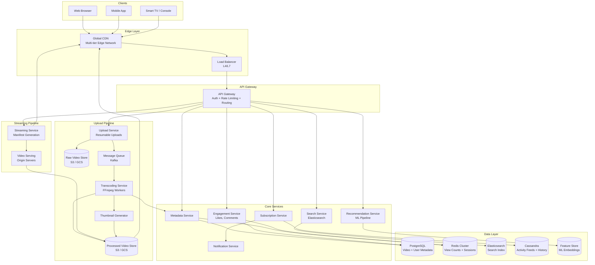

### Key Architectural Decisions

| Decision | Rationale |
|----------|-----------|
| Separate upload and streaming paths | 640:1 read/write ratio -- scale independently |
| Async transcoding via message queue | Decouples upload from processing; handles bursts |
| Multi-tier CDN | 95%+ cache hit ratio; serve from edge |
| Eventual consistency for view counts | Cannot afford 46K synchronous DB writes/sec |
| Elasticsearch for search | Full-text search with relevance scoring at scale |
| Cassandra for activity feeds | High write throughput for subscription feeds and watch history |

---

## Upload Pipeline

The upload flow is the write path. It must handle large files (gigabytes), unreliable networks, and trigger an expensive transcoding pipeline asynchronously.

### Upload Flow Sequence

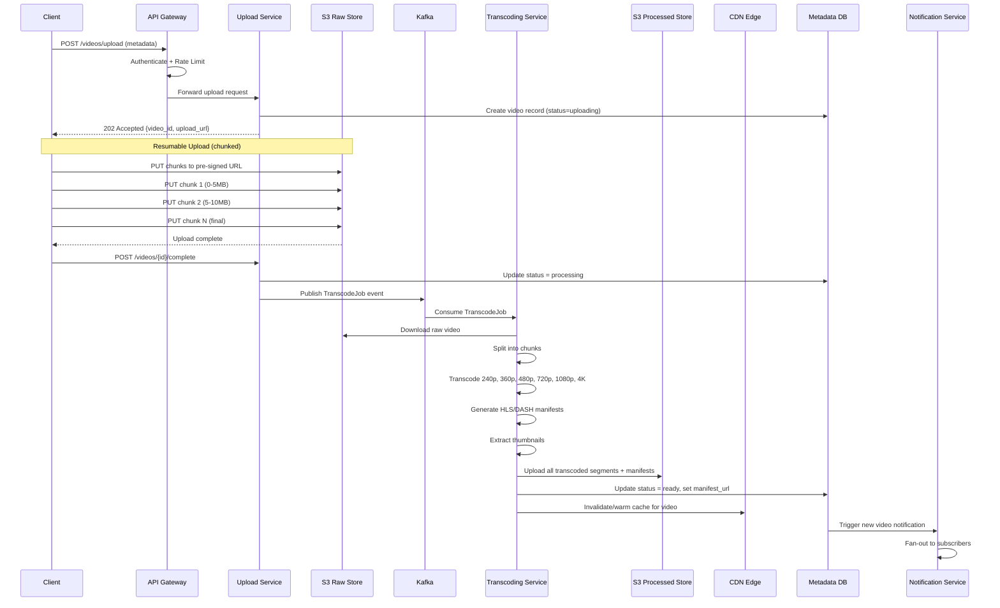

### Resumable Upload Protocol

YouTube uses a resumable upload protocol similar to the tus protocol:

1. **Initiation**: Client sends metadata, server returns an `upload_url`
2. **Chunked upload**: Client uploads in 5-8 MB chunks, each with `Content-Range` header
3. **Resume on failure**: Client queries server for last received byte offset, resumes from there
4. **Completion**: Client signals upload complete, server validates checksum

```
# Example: Resume after failure
GET /upload/status?upload_id=abc123
Response: { "bytes_received": 15728640 }

# Client resumes from byte 15728640
PUT /upload/abc123
Content-Range: bytes 15728640-20971519/52428800
<binary data>
```

### Pre-signed URLs

The upload service generates **pre-signed URLs** that allow the client to upload directly to object storage (S3/GCS), bypassing our servers entirely:

```
Client --> Upload Service: "I want to upload a 500MB video"
Upload Service --> Client: "Here's a pre-signed S3 URL valid for 1 hour"
Client --> S3: Direct upload (our servers never touch the bytes)
```

This is critical at scale -- routing 500 hours/min of video through our application servers would be impossibly expensive.

---

## Video Transcoding

Transcoding is the most compute-intensive part of the system. A single 10-minute 4K video can take 30+ minutes of CPU time on a powerful machine.

### Why Transcode?

1. **Compatibility**: Users upload in dozens of formats (MP4, MOV, AVI, MKV). We normalize to H.264/H.265 + AAC.
2. **Adaptive bitrate**: We need multiple resolutions so players can switch quality based on bandwidth.
3. **Efficiency**: Raw uploads are often inefficiently encoded. Our encoding reduces storage and bandwidth cost.
4. **Standardization**: All output uses HLS (Apple) or DASH (MPEG) segment format for streaming.

### Transcoding as a DAG (Directed Acyclic Graph)

YouTube's transcoding is not a simple linear pipeline -- it is a DAG of parallel tasks:

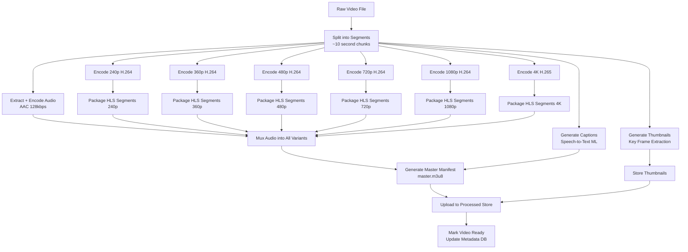

### Segment-Level Parallelism

The key insight: **split the video into small segments (10 seconds each) and transcode segments in parallel across many machines**.

For a 10-minute video:
- 60 segments of 10 seconds each
- Each segment is transcoded into 6 resolutions independently
- That is 360 independent tasks that can run in parallel
- A cluster of 100 workers finishes in minutes, not hours

### Transcoding Technology Stack

| Component | Technology |
|-----------|------------|
| Video codec | FFmpeg (H.264 via libx264, H.265 via libx265, VP9, AV1) |
| Audio codec | AAC (libfdk_aac) |
| Packaging | HLS (Apple), DASH (MPEG-DASH) |
| Orchestration | Custom DAG scheduler (similar to Apache Airflow) |
| Worker fleet | Kubernetes pods or EC2 spot instances |
| Captions | Google Speech-to-Text / Whisper |

### FFmpeg Example Commands

```bash
# Encode 1080p H.264 segment
ffmpeg -i segment_001.mp4 \
  -c:v libx264 -preset medium -b:v 6000k \
  -vf scale=1920:1080 \
  -c:a aac -b:a 128k \
  -f hls -hls_time 6 -hls_segment_filename 'seg_%03d.ts' \
  output_1080p.m3u8

# Encode 4K H.265 segment
ffmpeg -i segment_001.mp4 \
  -c:v libx265 -preset medium -b:v 20000k \
  -vf scale=3840:2160 \
  -c:a aac -b:a 128k \
  -f hls -hls_time 6 -hls_segment_filename 'seg_%03d.ts' \
  output_4k.m3u8
```

---

## Streaming Pipeline

The streaming flow is the read path -- the most performance-critical part of the system, handling 46K+ views/sec at steady state and 200K+ at peak.

### Streaming Flow Sequence

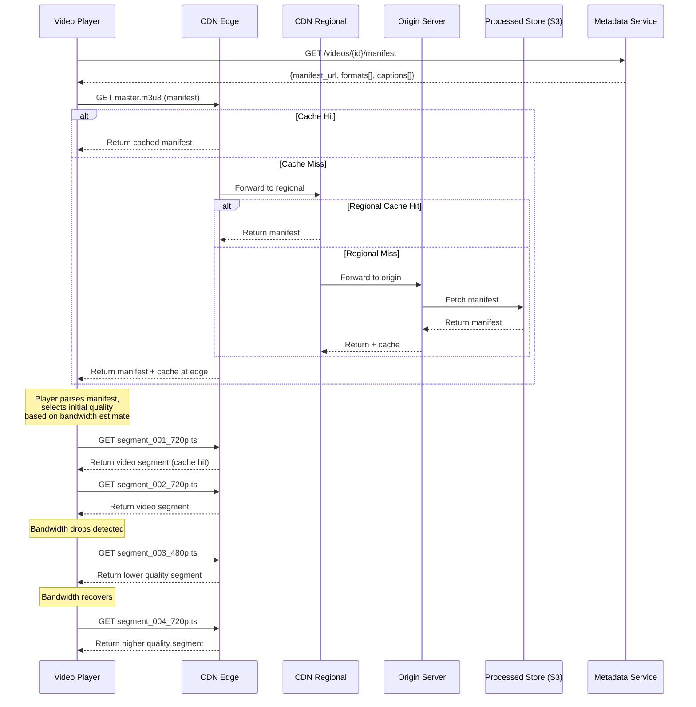

### How Video Streaming Actually Works

When a user clicks play, they are NOT downloading a single file. Here is what happens:

1. **Manifest fetch**: The player downloads a master manifest (`master.m3u8` for HLS or `manifest.mpd` for DASH)
2. **Quality selection**: The manifest lists all available quality levels. The player picks one based on estimated bandwidth.
3. **Segment download**: The player downloads small segments (2-10 seconds each) one at a time.
4. **Adaptive switching**: Between segments, the player re-evaluates bandwidth and may switch quality up or down.
5. **Buffer management**: The player maintains a 15-30 second buffer ahead of the playback position.

---

## Adaptive Bitrate Streaming

ABR is the technique that makes YouTube playback smooth on any connection speed, from 2G mobile to fiber broadband.

### HLS Master Manifest Example

```
#EXTM3U
#EXT-X-STREAM-INF:BANDWIDTH=400000,RESOLUTION=426x240
/video/dQw4w9WgXcQ/240p/playlist.m3u8
#EXT-X-STREAM-INF:BANDWIDTH=700000,RESOLUTION=640x360
/video/dQw4w9WgXcQ/360p/playlist.m3u8
#EXT-X-STREAM-INF:BANDWIDTH=1500000,RESOLUTION=854x480
/video/dQw4w9WgXcQ/480p/playlist.m3u8
#EXT-X-STREAM-INF:BANDWIDTH=3000000,RESOLUTION=1280x720
/video/dQw4w9WgXcQ/720p/playlist.m3u8
#EXT-X-STREAM-INF:BANDWIDTH=6000000,RESOLUTION=1920x1080
/video/dQw4w9WgXcQ/1080p/playlist.m3u8
#EXT-X-STREAM-INF:BANDWIDTH=20000000,RESOLUTION=3840x2160
/video/dQw4w9WgXcQ/4k/playlist.m3u8
```

### Per-Resolution Playlist Example

```
#EXTM3U
#EXT-X-VERSION:3
#EXT-X-TARGETDURATION:6
#EXT-X-MEDIA-SEQUENCE:0
#EXTINF:6.000,
segment_000.ts
#EXTINF:6.000,
segment_001.ts
#EXTINF:6.000,
segment_002.ts
#EXTINF:4.500,
segment_003.ts
#EXT-X-ENDLIST
```

### ABR Algorithm (Simplified)

```
function selectNextQuality(currentBandwidth, bufferLevel):
    availableQualities = [240p, 360p, 480p, 720p, 1080p, 4K]

    # Conservative: only use 80% of measured bandwidth
    safeBandwidth = currentBandwidth * 0.8

    # Find highest quality that fits in available bandwidth
    bestQuality = 240p
    for quality in availableQualities:
        if quality.bitrate <= safeBandwidth:
            bestQuality = quality

    # If buffer is low (< 5 seconds), drop one quality level for safety
    if bufferLevel < 5 seconds:
        bestQuality = oneStepDown(bestQuality)

    # If buffer is very full (> 30 seconds), try stepping up
    if bufferLevel > 30 seconds:
        bestQuality = oneStepUp(bestQuality)

    return bestQuality
```

> **Real-world reference**: YouTube uses a proprietary ABR algorithm called "Pensieve" (inspired by MIT research) that uses reinforcement learning to optimize quality selection. Netflix uses a buffer-based approach called BOLA.

---

## Metadata Service

The metadata service handles everything about a video except the actual video bytes: title, description, view counts, channel info, etc.

### Database Schema (PostgreSQL)

```sql
-- Videos table (sharded by video_id)
CREATE TABLE videos (
    video_id        VARCHAR(11) PRIMARY KEY,  -- YouTube-style short ID
    user_id         BIGINT NOT NULL REFERENCES users(user_id),
    title           VARCHAR(100) NOT NULL,
    description     TEXT,
    tags            TEXT[],
    category        VARCHAR(50),
    visibility      VARCHAR(10) DEFAULT 'public',
    status          VARCHAR(20) DEFAULT 'uploading',
    duration_sec    INTEGER,
    view_count      BIGINT DEFAULT 0,
    like_count      BIGINT DEFAULT 0,
    dislike_count   BIGINT DEFAULT 0,
    comment_count   BIGINT DEFAULT 0,
    manifest_url    TEXT,
    thumbnail_urls  JSONB,
    created_at      TIMESTAMPTZ DEFAULT NOW(),
    published_at    TIMESTAMPTZ,
    INDEX idx_user_videos (user_id, created_at DESC),
    INDEX idx_published (published_at DESC) WHERE status = 'ready'
);

-- Users table
CREATE TABLE users (
    user_id           BIGSERIAL PRIMARY KEY,
    username          VARCHAR(50) UNIQUE NOT NULL,
    display_name      VARCHAR(100),
    email             VARCHAR(255) UNIQUE NOT NULL,
    avatar_url        TEXT,
    subscriber_count  BIGINT DEFAULT 0,
    created_at        TIMESTAMPTZ DEFAULT NOW()
);

-- Subscriptions (sharded by subscriber_id)
CREATE TABLE subscriptions (
    subscriber_id  BIGINT NOT NULL,
    channel_id     BIGINT NOT NULL,
    created_at     TIMESTAMPTZ DEFAULT NOW(),
    PRIMARY KEY (subscriber_id, channel_id),
    INDEX idx_channel_subs (channel_id)
);
```

### Caching Strategy

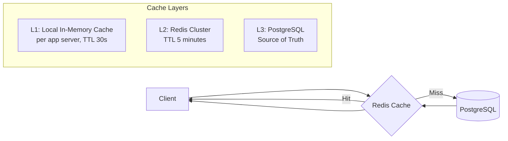

- **Hot metadata** (trending videos, top channels): cached in Redis with 1-5 min TTL
- **Warm metadata** (recently active videos): cached on demand with 5-30 min TTL
- **Cold metadata** (old/rarely viewed videos): fetched from DB on demand, short TTL

---

## View Counting

View counting seems trivial but is one of the hardest problems at YouTube scale. At 46K views/sec average (200K peak), you cannot simply `UPDATE videos SET view_count = view_count + 1` on every view.

### Why Naive Counting Fails

```
Problem: 46,000 views/sec on a single popular video
- Each view = 1 DB write
- Hot partition: millions of writes/sec to a single row
- Row-level lock contention destroys database performance
- PostgreSQL cannot handle this write pattern
```

### Solution: Batched Approximate Counting

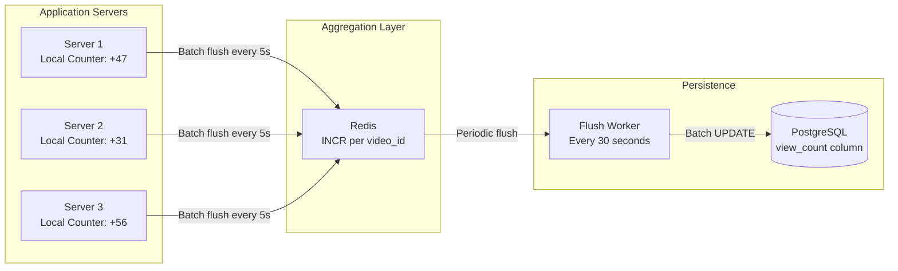

**The approach:**

1. **In-memory accumulation**: Each application server counts views in a local hash map
2. **Periodic flush to Redis**: Every 5 seconds, flush accumulated counts to Redis using `INCRBY`
3. **Periodic flush to DB**: A background worker reads Redis counters every 30 seconds and batch-updates PostgreSQL
4. **Read from Redis**: When displaying view count, read from Redis (near real-time), not DB

```python
# Pseudocode for view counting
class ViewCounter:
    def __init__(self):
        self.local_counts = defaultdict(int)  # video_id -> count

    def record_view(self, video_id):
        self.local_counts[video_id] += 1

    def flush_to_redis(self):  # Called every 5 seconds
        pipeline = redis.pipeline()
        for video_id, count in self.local_counts.items():
            pipeline.incrby(f"views:{video_id}", count)
        pipeline.execute()
        self.local_counts.clear()
```

This reduces DB writes from 46K/sec to a handful of batch updates per second.

---

## Search

YouTube search must handle queries across 800+ million videos, returning relevant results in under 200ms.

### Search Architecture

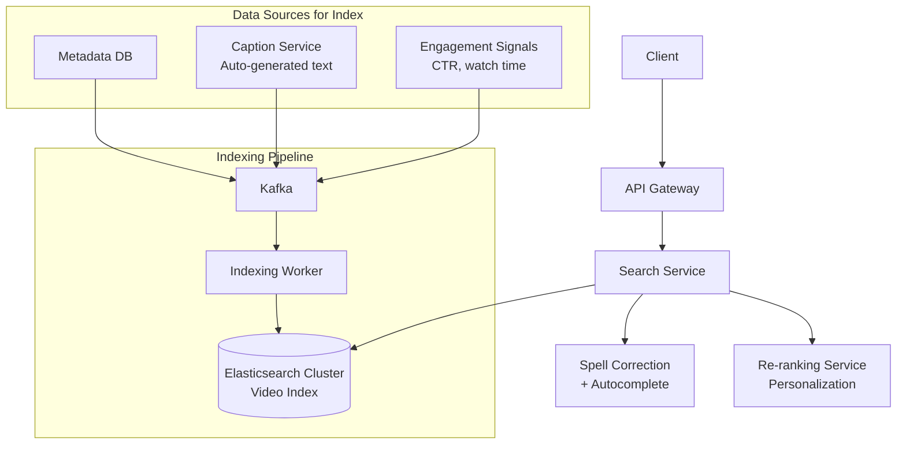

### Elasticsearch Index Schema

```json
{
  "mappings": {
    "properties": {
      "video_id":    { "type": "keyword" },
      "title":       { "type": "text", "analyzer": "standard", "boost": 3.0 },
      "description": { "type": "text", "analyzer": "standard", "boost": 1.5 },
      "tags":        { "type": "text", "boost": 2.0 },
      "captions":    { "type": "text", "analyzer": "standard", "boost": 1.0 },
      "channel_name":{ "type": "text", "boost": 2.0 },
      "category":    { "type": "keyword" },
      "view_count":  { "type": "long" },
      "like_ratio":  { "type": "float" },
      "publish_date":{ "type": "date" },
      "duration_sec":{ "type": "integer" },
      "language":    { "type": "keyword" }
    }
  }
}
```

### Relevance Scoring

YouTube search ranking is not just text matching. The final score combines:

```
score = text_relevance * 0.3
      + engagement_score * 0.25     # CTR, watch time, likes
      + freshness_score * 0.15      # Recent videos boosted
      + channel_authority * 0.15    # Subscriber count, consistency
      + personalization * 0.15      # User's watch history alignment
```

### Autocomplete

Autocomplete suggestions use a separate index optimized for prefix matching:

```json
{
  "suggest": {
    "title_suggest": {
      "type": "completion",
      "analyzer": "simple",
      "contexts": [
        { "name": "language", "type": "category" }
      ]
    }
  }
}
```

---

## Recommendations

The recommendation system is YouTube's most valuable component -- it drives 70%+ of watch time according to YouTube's own disclosures.

### Recommendation Architecture

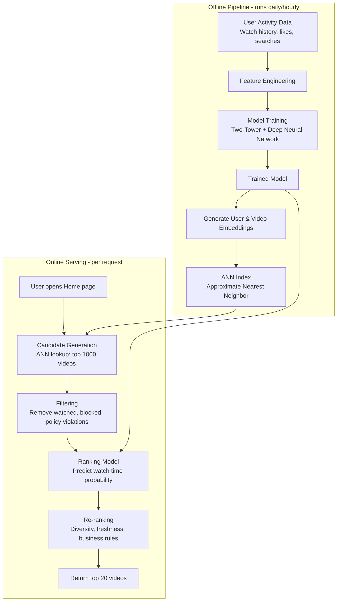

### Two-Tower Model (Industry Standard)

YouTube's recommendation system uses a two-tower architecture, described in their landmark 2016 paper "Deep Neural Networks for YouTube Recommendations":

**Tower 1 -- User Tower:**
```
Input: user_id, watch_history[last 50 videos], search_history,
       demographics, time_of_day, device_type
     |
     v
Embedding layers --> Dense layers --> User embedding (256-dim vector)
```

**Tower 2 -- Video Tower:**
```
Input: video_id, title_embedding, channel_id, category,
       upload_age, video_length, engagement_stats
     |
     v
Embedding layers --> Dense layers --> Video embedding (256-dim vector)
```

**Scoring:**
```
relevance_score = dot_product(user_embedding, video_embedding)
```

### Candidate Generation vs. Ranking

The two-stage approach is essential for performance:

| Stage | Input | Output | Latency Budget | Model Complexity |
|-------|-------|--------|----------------|-----------------|
| Candidate Generation | User embedding | Top 1000 from millions | < 50ms | Light (ANN lookup) |
| Ranking | 1000 candidates | Top 20 ordered | < 100ms | Heavy (deep neural net) |

- **Candidate generation** uses Approximate Nearest Neighbor search (FAISS, ScaNN) to find 1000 plausible videos in under 50ms from a corpus of hundreds of millions.
- **Ranking** applies a full deep learning model to score and order the 1000 candidates.

### Feed Types and Their Algorithms

| Feed | Primary Signal | Algorithm |
|------|---------------|-----------|
| Home | Watch history + engagement | Two-tower collaborative filtering |
| Up Next | Currently playing video | Content similarity + co-watch patterns |
| Trending | View velocity + geography | Exponential decay scoring |
| Subscriptions | Subscription list | Chronological merge sort |
| Search results | Query text | Text matching + engagement re-ranking |

---

## CDN Strategy

The CDN is the single most critical infrastructure component. Without it, YouTube would need to serve 231+ Tbps from origin -- physically impossible from any single data center.

### Multi-Tier CDN Architecture

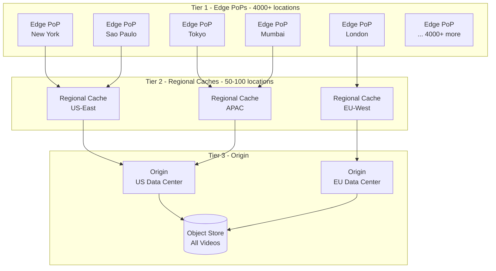

### CDN Cache Strategy

| Content Type | Strategy | Cache Location | TTL |
|-------------|----------|---------------|-----|
| Top 1% (viral/trending) | **Push**: pre-warmed to all edges | All edge PoPs | 24 hours |
| Top 20% (popular) | **Push**: pre-warmed to regional edges | Regional + some edges | 12 hours |
| Next 30% (moderate) | **Pull**: cached on first request | Edge that served it | 6 hours |
| Bottom 50% (long-tail) | **Pull**: cached on demand | Only if requested | 1 hour |

### ISP-Level Caching (Netflix Open Connect Model)

Netflix goes even further by embedding cache servers directly inside ISP networks:

```
User --> ISP Network --> [Netflix Open Connect Appliance inside ISP] --> Video served
                                    |
                          (Never leaves the ISP network!)
```

YouTube uses a similar approach called **Google Global Cache (GGC)** -- Google-owned servers placed inside ISP data centers that cache YouTube's most popular content. Over 90% of YouTube traffic in many regions is served from GGC nodes, never crossing the broader internet.

### CDN Routing Logic

```
function routeVideoRequest(video_id, user_location):
    # 1. Check nearest edge PoP
    edge = findNearestEdge(user_location)
    if edge.hasCache(video_id):
        return edge.serve(video_id)         # ~5ms latency

    # 2. Check regional cache
    regional = findRegionalCache(edge)
    if regional.hasCache(video_id):
        regional.serve(video_id)
        edge.cacheAsync(video_id)           # Backfill edge
        return                               # ~20ms latency

    # 3. Fetch from origin
    origin = findNearestOrigin(user_location)
    content = origin.fetch(video_id)
    regional.cacheAsync(video_id)
    edge.cacheAsync(video_id)
    return content                           # ~100ms latency
```

---

## Thumbnail Generation

Thumbnails are the most viewed images on the internet -- YouTube generates billions of thumbnail impressions per day. Netflix famously showed that thumbnails are the single most important factor in whether a user clicks on content.

### Thumbnail Pipeline

1. **Frame extraction**: Extract candidate frames at regular intervals (every 2 seconds) and at scene boundaries
2. **Quality filtering**: Discard blurry, dark, or overly similar frames
3. **ML scoring**: A neural network scores frames for visual appeal, informativeness, and click-through prediction
4. **Multiple sizes**: Generate thumbnails in multiple resolutions for different clients:
   - Desktop: 1280x720
   - Mobile: 640x360
   - Mini thumbnail: 168x94
   - Hover preview: animated GIF/WebP from key moments

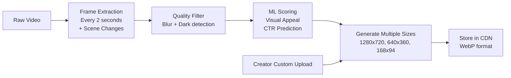

> **Real-world reference**: Netflix performs A/B testing on thumbnails, showing different images to different users and measuring click-through rates. Their "Artwork Personalization" system selects the best thumbnail for each user based on their viewing preferences.

---

## Live Streaming

Live streaming adds a real-time dimension to the platform. While VOD (video on demand) is the primary use case, live streaming follows a fundamentally different architecture.

### Live Streaming Architecture

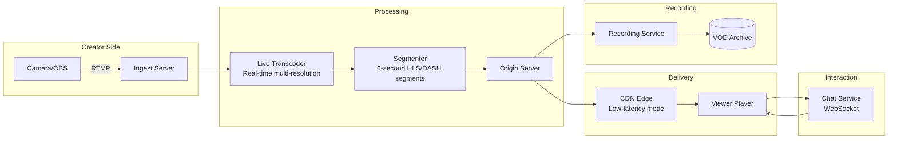

### Key Differences: Live vs. VOD

| Aspect | VOD | Live |
|--------|-----|------|
| Encoding time | Unlimited (offline) | Real-time (< 2s per segment) |
| Segment availability | All segments pre-exist | Segments generated in real-time |
| Latency target | First frame < 2s | Glass-to-glass < 5s (standard), < 2s (ultra-low) |
| CDN caching | Highly cacheable | Short-lived segments, constant invalidation |
| Error recovery | Re-request segment | Skip ahead to live edge |
| Manifest | Static (complete) | Dynamic (rolling window, updated every segment) |

### Live Streaming Protocols

| Protocol | Latency | Use Case |
|----------|---------|----------|
| RTMP (ingest) | N/A | Creator to ingest server |
| HLS (delivery) | 6-30 seconds | Standard live delivery |
| LL-HLS (Low Latency HLS) | 2-4 seconds | Low-latency live |
| WebRTC | < 1 second | Ultra-low latency, small audiences |
| DASH + CMAF | 3-6 seconds | Alternative to HLS |

> **Real-world reference**: Twitch uses a custom RTMP ingest network with HLS delivery. YouTube Live supports both standard (~15s latency) and ultra-low latency (~2s) modes. Ultra-low latency disables DVR rewind and limits quality options.

---

## Database Design

### Database Selection by Use Case

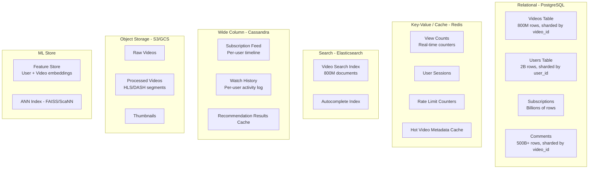

### Why These Choices?

| Database | Use Case | Why |
|----------|----------|-----|
| **PostgreSQL** | Video metadata, users, comments | ACID transactions, rich queries, mature sharding (Citus) |
| **Redis** | View counts, caching, sessions | In-memory speed for 200K+ reads/sec, atomic INCR |
| **Elasticsearch** | Full-text search | Purpose-built for text search, relevance scoring, autocomplete |
| **Cassandra** | Activity feeds, watch history | High write throughput, time-series access pattern, no hotspots |
| **S3/GCS** | Video files, thumbnails | Infinite scale, 11 nines durability, cheap per GB |
| **FAISS/ScaNN** | Recommendation embeddings | Sub-millisecond nearest neighbor search over millions of vectors |

### Sharding Strategy

**Videos table** -- shard by `video_id` (hash-based):
- Distributes load evenly (no hot shards)
- All queries for a specific video hit one shard
- Cross-shard queries (e.g., "all videos by user X") use scatter-gather

**Comments table** -- shard by `video_id`:
- Comments are always fetched per-video
- Hot videos have hot comment shards (acceptable trade-off)
- Paginated queries stay within a single shard

**Subscriptions table** -- shard by `subscriber_id`:
- "Who am I subscribed to?" query hits one shard
- "Who is subscribed to me?" requires scatter-gather (less frequent query)

---

## Summary: High-Level Design Principles

| Principle | Application |
|-----------|-------------|
| **Separate read and write paths** | Upload pipeline vs. streaming pipeline, scaled independently |
| **Async processing** | Transcoding via message queue, not synchronous |
| **CDN-first architecture** | 95%+ of traffic served from edge, not origin |
| **Approximate is good enough** | View counts batch-updated, not real-time per view |
| **DAG parallelism** | Transcoding split into independent parallel tasks |
| **Right database for the job** | PostgreSQL for metadata, Redis for counters, ES for search, Cassandra for feeds |
| **Multi-tier caching** | L1 (local) + L2 (Redis) + L3 (CDN) + L4 (ISP-embedded) |
| **Eventual consistency where acceptable** | View counts, search index, recommendation refresh |
