# Design Twitter -- Deep Dive & Scaling

## Complete System Design Interview Walkthrough (Part 3 of 3)

This document covers the deep dive topics that distinguish a strong system design answer
from an average one. The fan-out strategy is THE core topic -- understanding the
trade-offs between fan-out on write, fan-out on read, and the hybrid approach is what
interviewers are really testing for. This part also covers timeline ranking, trending
detection, Snowflake IDs, scaling strategies, failure handling, multi-region deployment,
and interview tactics.

---
---

# Step 3: Deep Dive -- Fan-out Strategy

This is **THE most important concept** in the Twitter system design. The interviewer
will almost certainly probe deeply here. Understanding the trade-offs between fan-out
on write, fan-out on read, and the hybrid approach is what distinguishes strong
candidates.

---

## 3.1 The Core Problem

When Alice opens her home timeline, she expects to see a merged, chronologically
ordered stream of tweets from all 200 accounts she follows. The question is:
**when do we assemble that merged stream?**

There are exactly two moments to do it:
1. **When a tweet is written** (push / fan-out on write)
2. **When the timeline is read** (pull / fan-out on read)

Each has dramatic trade-offs. Let us examine both in detail.

### Why This Problem is Hard

The fundamental tension is between **write amplification** and **read amplification**:

```
Fan-out on Write:
  1 tweet write  ->  N Redis writes (where N = follower count)
  1 timeline read ->  1 Redis read (pre-computed)
  Write amplification: O(N)
  Read amplification:  O(1)

Fan-out on Read:
  1 tweet write  ->  1 DB write
  1 timeline read ->  M DB reads (where M = followee count)
  Write amplification: O(1)
  Read amplification:  O(M)
```

At Twitter's scale (600M tweets/day, 5B timeline reads/day, average 200 followers/followees),
neither extreme works perfectly. The hybrid approach is the only viable solution.

---

## 3.2 Fan-out on Write (Push Model)

### How It Works

When a user posts a tweet, the system proactively pushes that tweet ID into the
timeline cache of **every single follower**.

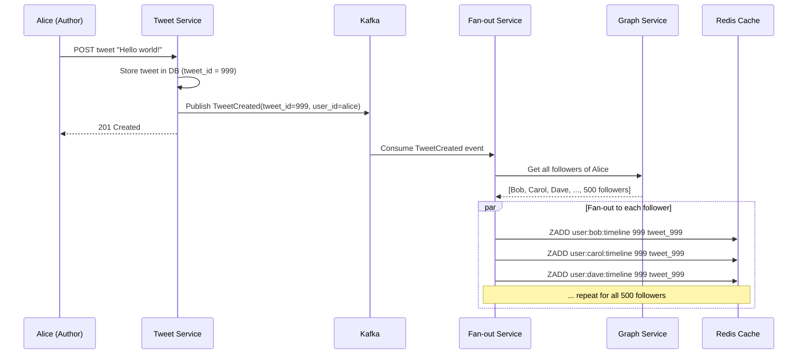

### Redis Timeline Cache Structure

Each user has a **Redis Sorted Set** that acts as their pre-computed home timeline:

```
Key:    user:{user_id}:timeline
Type:   Sorted Set
Score:  tweet_id (which is a Snowflake timestamp, so auto-sorted by time)
Value:  tweet_id

Example:
  ZADD user:bob:timeline 1775001000 "tweet_1775001000"
  ZADD user:bob:timeline 1775002000 "tweet_1775002000"
  ZADD user:bob:timeline 1775003000 "tweet_1775003000"

Read timeline:
  ZREVRANGEBYSCORE user:bob:timeline +inf -inf LIMIT 0 20
  -> Returns latest 20 tweet IDs in reverse chronological order

Trim to keep last 800 entries:
  ZREMRANGEBYRANK user:bob:timeline 0 -801
```

> **Why 800?** Twitter keeps approximately 800 tweets in each user's timeline cache.
> This covers several days of content for most users. Older content falls back to
> database queries.

### Why Sorted Sets and Not Lists?

Redis Lists might seem simpler (LPUSH / LRANGE), but Sorted Sets are superior here:

| Feature | Sorted Set | List |
|---------|-----------|------|
| Deduplication | Automatic (same score+member = no-op) | No (can push duplicates) |
| Cursor pagination | ZREVRANGEBYSCORE with score range | LRANGE with offset (shifts on insert) |
| Efficient trim | ZREMRANGEBYRANK | LTRIM |
| Delete specific entry | ZREM by member | Requires LREM (O(N) scan) |
| Order guarantee | Sorted by score (tweet_id = time) | Insertion order only |

### Reading the Timeline (Fast!)

With fan-out on write, reading is trivially fast:

```
1. ZREVRANGEBYSCORE user:bob:timeline {cursor} -inf LIMIT 0 20
   -> Returns 20 tweet IDs in ~1ms

2. Multi-GET tweet objects from Tweet Cache / Tweet DB
   -> Hydrate with text, author, media, counts

3. Return to client
   Total: ~10-50ms
```

### Pros

| Advantage | Explanation |
|-----------|-------------|
| **Blazing fast reads** | Timeline is pre-computed; just read from Redis sorted set |
| **Simple read path** | No complex merging or ranking at read time |
| **Predictable latency** | O(1) Redis read, not dependent on number of followees |
| **Works great for 99% of users** | Most users have < 10K followers |

### Cons

| Disadvantage | Explanation |
|--------------|-------------|
| **Celebrity problem** | A user with 100M followers generates 100M Redis writes per tweet |
| **Write amplification** | 1 tweet -> N writes where N = follower count |
| **Wasted work** | Many followers may never read their timeline (inactive users) |
| **Delayed delivery** | Fan-out for celebrities can take minutes |
| **Storage overhead** | Every timeline cache stores redundant tweet IDs |

### The Celebrity Problem -- Quantified

This is the critical failure mode that makes pure fan-out on write unacceptable:

```
Katy Perry tweets (she has ~110M followers on Twitter):

Fan-out on write means:
  1 tweet -> 110,000,000 Redis ZADD operations

At 100,000 Redis writes/sec per node (conservative):
  110M / 100K = 1,100 seconds = ~18 minutes to fan out ONE tweet

During those 18 minutes, she may tweet again, compounding the backlog.

Resource cost:
  110M writes x ~100 bytes per ZADD = ~11 GB of network traffic for ONE tweet
  If she tweets 5 times/day: 55 GB/day just for one user's fan-out

This is clearly unacceptable.
```

### Additional Celebrity Problem Cascading Effects

```
1. QUEUE DEPTH: Celebrity tweets create massive Kafka consumer lag.
   While the system processes Katy Perry's 110M fan-outs, ALL other
   fan-out events are queued behind it, delaying normal users' tweets.

2. REDIS PRESSURE: 110M ZADDs hit Redis cluster simultaneously,
   potentially saturating network bandwidth and CPU on Redis nodes.

3. MEMORY SPIKE: 110M sorted sets updated in a burst can cause
   memory allocation spikes in Redis, risking OOM conditions.

4. REPLICATION LAG: Redis replica lag increases during burst writes,
   potentially causing inconsistent reads if reads hit replicas.
```

---

## 3.3 Fan-out on Read (Pull Model)

### How It Works

No pre-computation at write time. When a user opens their timeline, the system
assembles it on the fly by querying for recent tweets from all followees.

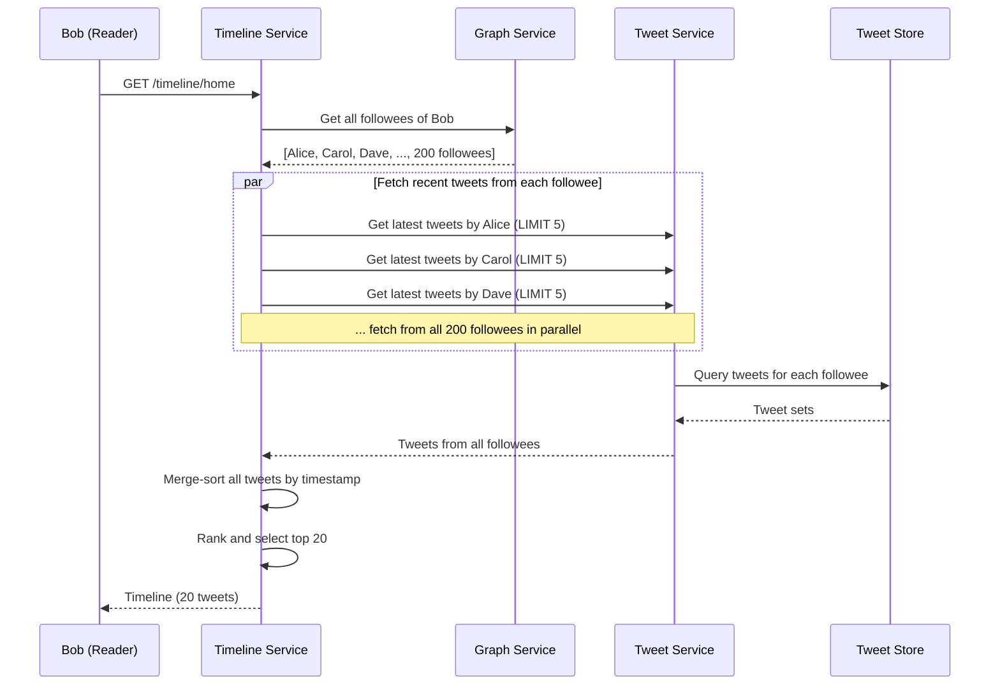

### The Read-Time Assembly

```python
def get_home_timeline(user_id, cursor, count=20):
    # Step 1: Get followees
    followees = graph_service.get_followees(user_id)  # ~200 users

    # Step 2: Fetch recent tweets from each followee
    all_tweets = []
    futures = []
    for followee_id in followees:
        future = executor.submit(
            tweet_service.get_recent_tweets, followee_id, limit=5
        )
        futures.append(future)

    for future in futures:
        all_tweets.extend(future.result())

    # Step 3: Merge sort by tweet_id (timestamp)
    all_tweets.sort(key=lambda t: t.tweet_id, reverse=True)

    # Step 4: Apply cursor and pagination
    if cursor:
        all_tweets = [t for t in all_tweets if t.tweet_id < cursor]

    return all_tweets[:count]
```

### Pros

| Advantage | Explanation |
|-----------|-------------|
| **No write amplification** | Posting a tweet is O(1) -- just write to DB |
| **No celebrity problem** | Celebrity tweets stored once, fetched on demand |
| **No wasted work** | Only compute timeline when user actually reads it |
| **Always fresh** | Timeline assembled from latest data |

### Cons

| Disadvantage | Explanation |
|--------------|-------------|
| **Slow reads** | Must query 200+ followees, merge-sort, and rank at read time |
| **High read latency** | 200 parallel DB queries -> 200-500ms at best |
| **Unpredictable latency** | Depends on number of followees and DB load |
| **Heavy DB load** | 5B timeline reads/day x 200 DB queries each = 1 trillion DB queries/day |
| **Cannot scale** | The math simply does not work at Twitter's scale |

### Why Pure Pull Does Not Work at Scale

```
5B timeline reads/day x 200 followees each = 1 TRILLION tweet fetches/day

That is 11.5 million queries per second, sustained.

Even with heavy caching, this overwhelms any database cluster.

Breakdown:
  - Each query must: route to correct shard, do B-tree lookup, serialize results
  - At 1ms per query: need 11,500 cores just for query processing
  - Network: 11.5M queries/sec x 1KB response = 11.5 GB/s sustained
  - DB connections: at 200 concurrent connections per DB host, need 57,500 DB hosts
    just for connection handling

This is economically and operationally infeasible.
```

---

## 3.4 Hybrid Approach (Twitter's Actual Solution)

This is the key insight that wins the interview. Twitter uses **both** models
simultaneously, routing based on the author's follower count.

### The Rule

```
IF author.follower_count < THRESHOLD (e.g., 10,000):
    -> Fan-out on Write (push to all followers' caches)

IF author.follower_count >= THRESHOLD:
    -> Fan-out on Read (merge at query time)
```

### Why This Works

- **99.9% of users** have fewer than 10K followers. Their tweets are pushed immediately
  to followers' timeline caches. This covers the vast majority of write volume.
- **0.1% of users** (celebrities, news accounts, politicians) have massive follower
  counts. Their tweets are NOT fanned out. Instead, when a follower reads their
  timeline, the system fetches celebrity tweets on-the-fly and merges them with the
  pre-computed cache.

### Architecture Diagram

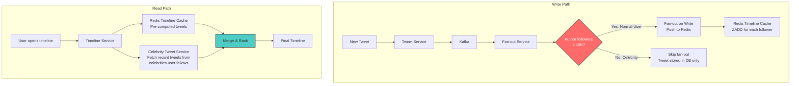

### Detailed Read Path with Hybrid

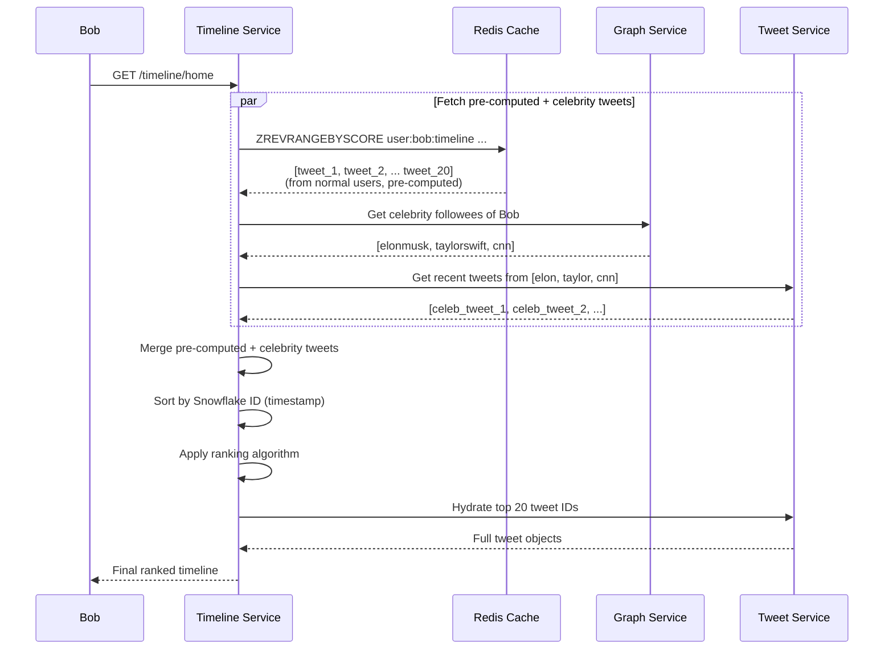

### Why the Hybrid Approach is Brilliant

```
Before hybrid (pure fan-out on write):
  Celebrity with 100M followers tweets -> 100M Redis writes
  Time to fan out: ~18 minutes

After hybrid:
  Celebrity tweets -> 0 Redis writes (stored in DB only)
  At read time, each user fetches from ~5-10 celebrities they follow
  Additional latency per read: ~5-10ms (celebrities are cached in hot tier)

Trade-off:
  Reads are slightly slower (merge step adds ~10-20ms)
  But writes go from 18 minutes to 0 seconds for celebrities
  And 99.9% of users still get instant fan-out
```

### Celebrity Detection and Threshold

```
Threshold is not a hard line -- it is a spectrum:

Tier 1: < 1,000 followers     -> Always fan-out on write
Tier 2: 1K - 10K followers    -> Fan-out on write
Tier 3: 10K - 1M followers    -> Hybrid (may fan-out to active followers only)
Tier 4: > 1M followers        -> Always fan-out on read
Tier 5: > 50M followers       -> Fan-out on read + aggressive caching

The threshold can be dynamically adjusted based on:
  - System load (Kafka consumer lag)
  - Fan-out queue depth
  - Time of day (lower threshold during peak hours)
  - Geographic region (different thresholds per DC)
```

### Celebrity Tweet Caching Strategy

Since celebrity tweets are fetched on-demand at read time, they need aggressive caching:

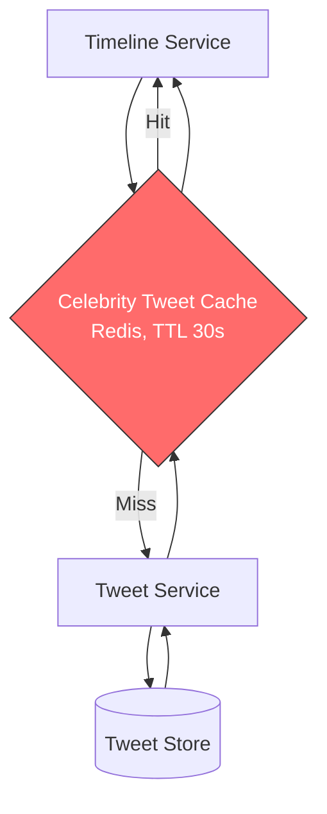

```
Celebrity tweet cache:
  Key:    celebrity:{user_id}:recent_tweets
  Type:   List of tweet IDs (last 50 tweets)
  TTL:    30 seconds (short TTL ensures freshness)
  
  When a celebrity tweets:
  - Tweet is stored in DB (no fan-out)
  - Celebrity tweet cache is invalidated or updated
  - Next reader fetches fresh data, populates cache
  - All subsequent readers within 30s use cached data
  
  Cache hit rate: >99% (celebrity tweets are read millions of times)
  
  Request coalescing (singleflight):
  - If 1000 requests arrive for the same celebrity's tweets simultaneously
  - Only 1 actually queries the database
  - Other 999 wait for and share the result
  - Prevents thundering herd on cache miss
```

### Hybrid Fan-out Decision Flowchart

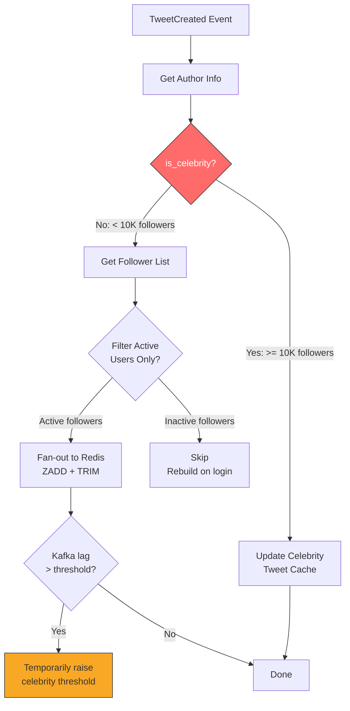

---

## 3.5 Timeline Ranking

Early Twitter was purely reverse-chronological. Modern Twitter uses an algorithmic
ranking system that dramatically increases engagement.

### Ranking Signals

| Signal | Weight | Description |
|--------|--------|-------------|
| Recency | High | Newer tweets score higher (Snowflake timestamp) |
| Engagement | High | Likes, retweets, replies, quote tweets |
| Author affinity | High | How often you interact with this author |
| Content type | Medium | Videos, images, threads vs plain text |
| Social proof | Medium | "Liked by people you follow" |
| Topic relevance | Medium | ML-predicted interest based on your history |
| Freshness decay | Applied | Score decays exponentially with age |
| Negative signals | Applied | Muted keywords, blocked authors, reported content |

### Ranking Formula (Simplified)

```
score = (engagement_score * 0.3)
      + (author_affinity * 0.25)
      + (recency_score * 0.2)
      + (social_proof_score * 0.15)
      + (content_relevance * 0.1)

where:
  engagement_score = normalize(likes + 2*retweets + 3*replies)
  author_affinity = frequency_of_interaction(user, author) in last 30 days
  recency_score = exp(-lambda * age_in_hours)
  social_proof_score = count(friends_who_engaged) / count(friends)
  content_relevance = ML_model(user_embedding, tweet_embedding)
```

### Ranking Pipeline

The ranking pipeline processes candidates in stages, each narrowing the set:

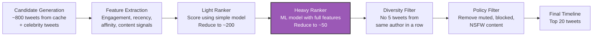

### Ranking System Architecture

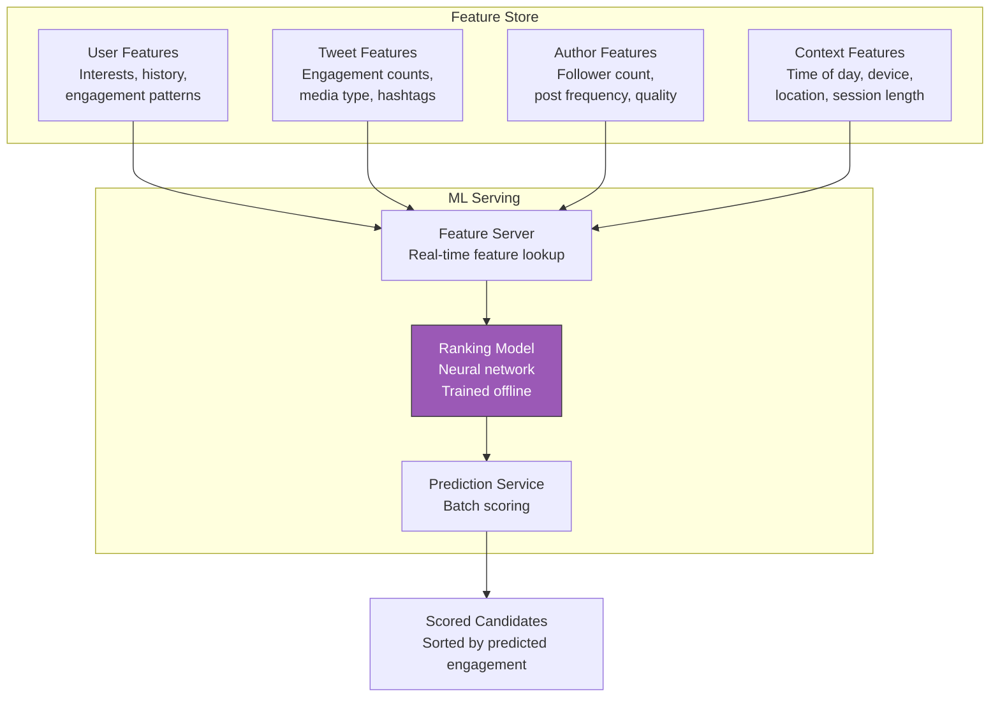

### Chronological vs Algorithmic Toggle

Twitter offers users a choice between algorithmic ("For You") and chronological
("Following") timelines:

```
Chronological ("Following" tab):
  - Simply sort by Snowflake ID (timestamp) descending
  - No ML ranking, just recency
  - Still uses hybrid fan-out (pre-computed + celebrity merge)

Algorithmic ("For You" tab):
  - Candidates from followed accounts + recommended tweets
  - Full ML ranking pipeline
  - Includes "out of network" tweets (from accounts you don't follow)
  - Social proof injection ("@friend liked this")

The system implements both by having the Timeline Service check a user preference flag
and route to the appropriate ranking strategy.
```

---

## 3.6 Fan-out Implementation Details

### Kafka Partitioning for Fan-out

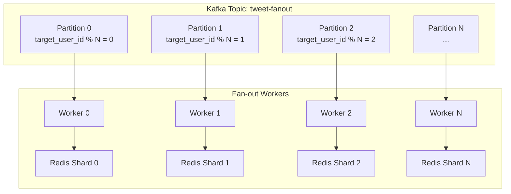

**Key design decisions:**

1. **Partition by target user ID** (the follower), not by author. This ensures all
   writes to a single user's timeline go to the same Kafka partition and Redis shard,
   avoiding race conditions.

2. **Batch writes**: Instead of individual ZADD commands, batch multiple tweet IDs
   into a single Redis pipeline call per user.

3. **Backpressure**: If fan-out falls behind (queue depth > threshold), temporarily
   switch more users to fan-out on read.

### Fan-out Worker Pseudocode

```python
class FanoutWorker:
    def process_tweet_event(self, event):
        tweet_id = event.tweet_id
        author_id = event.author_id

        # Check if author is celebrity
        author = user_service.get_user(author_id)
        if author.is_celebrity:
            # Update celebrity tweet cache instead
            self.update_celebrity_cache(author_id, tweet_id)
            return

        # Get follower list
        followers = graph_service.get_followers(author_id)

        # Filter: only fan out to active users (logged in within 7 days)
        active_followers = [f for f in followers if is_active(f)]

        # Batch write to Redis using pipeline
        pipeline = redis.pipeline()
        for follower_id in active_followers:
            cache_key = f"user:{follower_id}:timeline"
            pipeline.zadd(cache_key, {tweet_id: tweet_id})  # score = tweet_id
            pipeline.zremrangebyrank(cache_key, 0, -801)     # trim to 800
        pipeline.execute()

    def update_celebrity_cache(self, author_id, tweet_id):
        cache_key = f"celebrity:{author_id}:recent_tweets"
        redis.lpush(cache_key, tweet_id)
        redis.ltrim(cache_key, 0, 49)  # Keep last 50 tweets
        redis.expire(cache_key, 3600)  # 1 hour TTL
```

> **Optimization**: Only fan-out to **active users** (logged in within the last 7 days).
> Inactive users get their timeline computed on-the-fly when they return.

### Fan-out Optimization Techniques

| Technique | Description | Impact |
|-----------|------------|--------|
| **Active-only fan-out** | Skip users who have not logged in for 7+ days | Reduces fan-out volume by ~40% |
| **Pipeline batching** | Batch 100+ Redis ZADD commands into a single pipeline | 10x throughput improvement |
| **Follower list caching** | Cache follower lists in Redis (refresh every 10 minutes) | Avoids hitting Graph DB for every tweet |
| **Priority lanes** | Separate Kafka partitions for high-priority (mutual follows) and low-priority fan-out | Important tweets appear faster |
| **Adaptive threshold** | Lower the celebrity threshold during peak load | Prevents queue buildup |
| **Fan-out budgets** | Cap fan-out at 500K followers max, rest handled at read time | Bounds worst-case fan-out time |

---

## 3.7 Handling Deletes and Edits

When a tweet is deleted or edited, the fan-out must be "reversed":

```
Tweet Deleted:
  1. Mark tweet as deleted in Tweet DB (soft delete)
  2. Publish TweetDeleted event to Kafka
  3. Fan-out workers: ZREM tweet_id from every follower's timeline
     (This is the same N writes problem, but deletes are rare ~0.1% of tweets)
  4. Alternatively: handle at read time -- filter out deleted tweets during hydration
  5. Best practice: do both (active ZREM + lazy filtering as safety net)

Tweet Edited:
  1. Update tweet text in Tweet DB
  2. Invalidate the tweet in Tweet Cache (Redis/Memcached)
  3. No fan-out needed! Timeline cache only stores tweet IDs.
     The updated text is fetched during hydration.
     This is why storing only IDs in the cache is smart.
  4. Search index: re-index the tweet with updated text via Kafka event
```

### Why Soft Deletes?

```
Hard delete problems:
  - Cannot recover if user changes their mind (within grace period)
  - Cannot audit for legal/compliance reasons
  - Fan-out of ZREM may not reach all followers before they read the timeline
  - References from replies/quotes would break (foreign key violations)

Soft delete approach:
  - Set is_deleted = TRUE in tweet DB
  - Tweet remains in timeline caches until naturally trimmed
  - Hydration step filters out deleted tweets before returning to client
  - Background job removes soft-deleted tweets after 30 days (hard delete)
  - Legal holds prevent hard deletion for compliance
```

---
---

# Step 4: Scaling, Trade-offs & Production Concerns

## 4.1 Twitter Snowflake for Tweet IDs

Every tweet needs a globally unique, time-sortable ID. Twitter's Snowflake generates
64-bit IDs with this structure:

```
+---------+----------------------------+-----------+----------+--------------+
| Sign(1) |     Timestamp (41 bits)    |  DC (5)   | Node (5) | Sequence(12) |
+---------+----------------------------+-----------+----------+--------------+

- Timestamp: milliseconds since custom epoch (Twitter: Nov 4, 2010)
  41 bits = ~69 years of IDs
- Datacenter ID: 5 bits = 32 datacenters
- Machine ID: 5 bits = 32 machines per DC
- Sequence: 12 bits = 4096 IDs per millisecond per machine

Total capacity: 32 DCs x 32 machines x 4096 IDs/ms = 4,194,304 IDs/ms
```

### Why Snowflake Matters for Timelines

- IDs are sorted by time, so `ORDER BY tweet_id DESC` is the same as `ORDER BY created_at DESC`
- No need for a separate timestamp index
- Cursor-based pagination is natural: "give me tweets with ID < cursor"
- Globally unique without coordination (no central authority needed)
- Compact: 8 bytes vs 16 bytes for UUID

### Snowflake vs Alternatives

| Approach | Size | Time-Sortable | Coordination-Free | Collision Risk |
|----------|------|--------------|-------------------|----------------|
| **Snowflake** | 8 bytes | Yes | Yes (per machine) | None (sequence bits) |
| UUID v4 | 16 bytes | No | Yes | 1 in 2^122 |
| UUID v7 | 16 bytes | Yes | Yes | Low |
| Auto-increment | 8 bytes | Yes | No (single source) | None |
| Timestamp + random | 8 bytes | Yes | Yes | Possible |

### Snowflake ID Generation Service

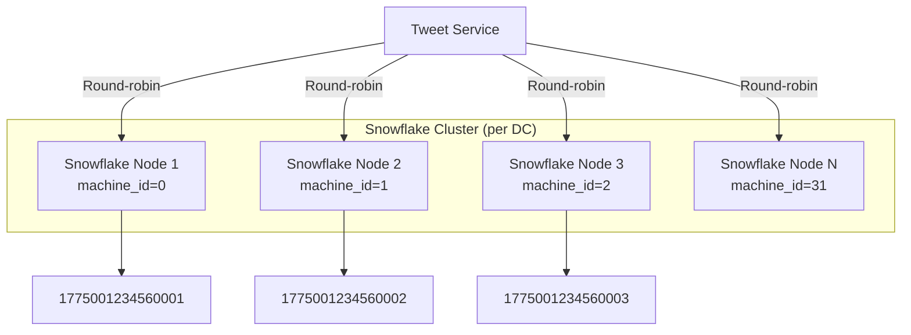

**Clock skew handling:**
- Each Snowflake node tracks the last timestamp it generated
- If the clock moves backwards (NTP adjustment), the node refuses to generate IDs until
  time catches up, or it increments the sequence within the same timestamp
- Alternatively, use a logical clock that only moves forward

---

## 4.2 Database Strategy

### Tweet Storage -- Sharded MySQL

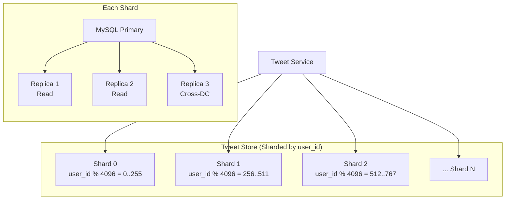

**Why shard by `user_id`?**
- User timeline queries (`SELECT * FROM tweets WHERE user_id = X ORDER BY tweet_id DESC`)
  hit a single shard -- no scatter-gather needed.
- A user's tweets are co-located, enabling efficient range scans.
- Write hotspots are rare (users tweet at most a few times per minute).

**Downsides of sharding by `user_id`:**
- Looking up a tweet by `tweet_id` alone requires knowing the `user_id` to route to
  the correct shard. Solutions: (a) encode user_id hint in the Snowflake ID,
  (b) maintain a `tweet_id -> shard_id` lookup table, (c) check tweet cache first.
- Celebrity users with millions of tweets create large shards. Solution: sub-sharding
  or dedicated shards for very high-volume users.

**Twitter's real storage**: Twitter built **Manhattan**, a custom distributed key-value
store that replaced MySQL + Cassandra. It provides multi-tenant, real-time, low-latency
access with strong consistency within a replica set.

---

## 4.3 Redis Timeline Cache -- Scaling

### Cluster Topology

```
Redis Cluster:
  - 1000+ Redis nodes across multiple data centers
  - Each node: 64-128 GB RAM
  - Total cache capacity: ~100 TB
  - Replication factor: 2 (primary + replica per shard)

Partitioning:
  - Consistent hashing by user_id
  - Each user's timeline sorted set lives on one shard
  - Hot users (celebrities) may need dedicated shards

Eviction:
  - No LRU eviction -- explicitly trim sorted sets to 800 entries
  - Inactive users (no login for 30+ days): expire entire key (TTL 30 days)
  - When user returns after expiry: rebuild cache from DB (fan-out on read)
```

### Redis Scaling Challenges

| Challenge | Solution |
|-----------|---------|
| **Memory limits** | Horizontal scaling (add nodes), trim to 800 entries, expire inactive users |
| **Hot partitions** | Dedicated shards for high-traffic users, read replicas for popular timeline reads |
| **Network saturation** | Pipeline batching reduces round trips, compress payloads |
| **Failover latency** | Redis Sentinel for automatic failover (< 10s), replicas promote seamlessly |
| **Cross-DC latency** | Redis replicas in each DC, writes go to primary DC only |
| **Memory fragmentation** | Use jemalloc allocator, periodic MEMORY PURGE, monitor fragmentation ratio |

### Cache Warming

When a user logs in after their cache has expired:

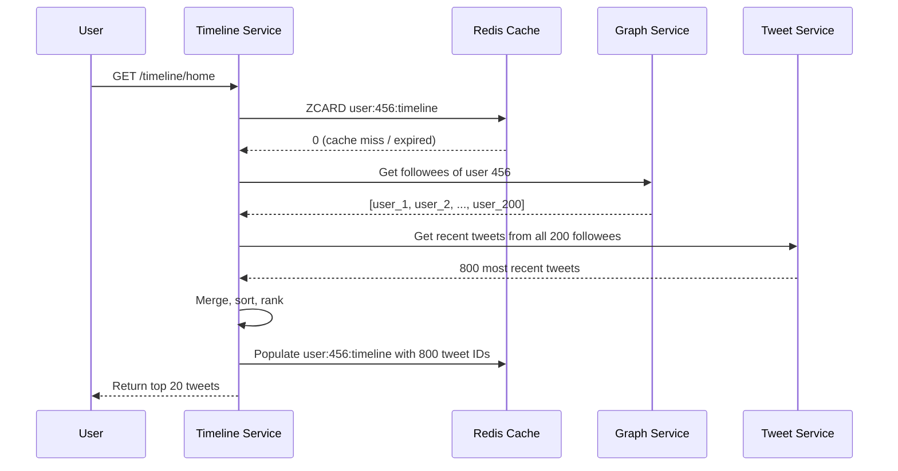

### Proactive Cache Warming

Rather than waiting for a cache miss, the system can proactively warm caches:

```
Proactive warming triggers:
  1. User opens the app (push notification click, app foreground)
     -> Pre-warm in background while showing cached/loading state
  2. User logs in after >7 days absence
     -> Background job builds timeline before first request
  3. Redis node recovery after failure
     -> Batch rebuild for all affected users
  4. New follow event
     -> Backfill the followee's recent tweets into the follower's cache

Priority queue for warming:
  - Recently active users (logged in today) -> highest priority
  - Regularly active users (weekly) -> medium priority
  - Returning users (monthly) -> low priority, build on demand
```

---

## 4.4 Trending Topics

### Architecture

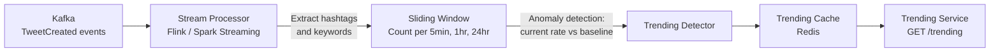

### How Trending Detection Works

```
For each hashtag/topic:
  current_rate = count(hashtag) in last 5 minutes
  baseline_rate = avg(count(hashtag)) over same time window in past 7 days
  trending_score = (current_rate - baseline_rate) / baseline_rate

  IF trending_score > THRESHOLD (e.g., 2.0 = 200% above baseline):
    -> Mark as trending

This is why "trending" favors spikes over sustained volume.
#BreakingNews with 10K mentions in 5 min (normally 100) trends more than
#GoodMorning with 50K mentions in 5 min (normally 40K).

Trending score examples:
  #BreakingNews: (10,000 - 100) / 100 = 99.0   -> TRENDING
  #GoodMorning:  (50,000 - 40,000) / 40,000 = 0.25  -> NOT trending
  #NewProduct:   (5,000 - 500) / 500 = 9.0      -> TRENDING
```

### Sliding Window Implementation

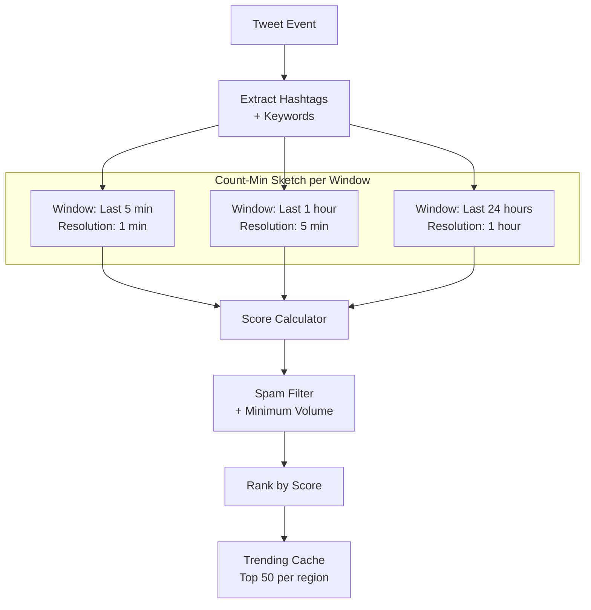

**Why Count-Min Sketch?**
- Exact counting for millions of hashtags is memory-intensive
- Count-Min Sketch provides approximate counts with bounded error
- O(1) update and query time
- Fixed memory footprint regardless of number of unique items

### Personalized Trending

- **Global trending**: Same for all users in a region
- **Personalized**: Weighted by topics user engages with
- **Localized**: Trending in your city, country, or globally
- **Filtered**: Remove trends from muted topics/keywords

```
Personalized trending score:
  final_score = global_trending_score * (1 + user_interest_weight)

where:
  user_interest_weight = 0.0 to 1.0 based on user's historical
  engagement with this topic/hashtag
```

---

## 4.5 Scaling the Fan-out with Kafka

### Event-Driven Architecture

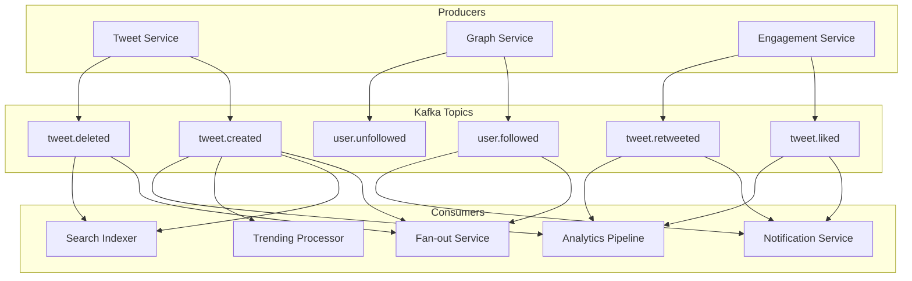

### Kafka Configuration

```
Topic: tweet.created
  Partitions: 256 (partition by author_id for ordering)
  Replication factor: 3
  Retention: 7 days

Topic: tweet.fanout
  Partitions: 4096 (partition by target_user_id)
  Replication factor: 3
  Retention: 3 days

Consumer group: fanout-workers
  Instances: 4096 (one per partition)
  Processing: exactly-once semantics via idempotent writes
```

### Kafka Scaling Considerations

| Concern | Strategy |
|---------|---------|
| **Partition count** | 4096 partitions for fan-out topic allows 4096 parallel consumers |
| **Consumer lag** | Monitor with Kafka consumer group lag metrics. Alert at > 100K |
| **Rebalancing** | Use cooperative-sticky assignor to minimize disruption during rebalance |
| **Ordering** | Partition by target_user_id ensures writes to a user's timeline are ordered |
| **Backpressure** | If lag exceeds threshold, temporarily switch to fan-out on read |
| **Dead letter queue** | Failed events go to DLQ for manual investigation and replay |
| **Compaction** | Not needed for event topics (append-only, time-based retention) |

---

## 4.6 Failure Handling

### Fan-out Failure

```
Problem: Fan-out worker crashes after pushing to 50% of followers.
Solution:
  - Kafka consumer offset not committed until batch completes
  - On restart, re-process from last committed offset
  - Redis ZADD is idempotent (duplicate writes are harmless)
  - Result: at-least-once delivery, effectively exactly-once due to idempotency
```

### Redis Cache Failure

```
Problem: Redis shard goes down, losing timeline caches for 1/N of users.
Solution:
  - Redis replica promotes to primary (automatic failover via Redis Sentinel)
  - If both primary and replica fail: timeline cache is lost for affected users
  - Fallback: those users get fan-out on read until cache is rebuilt
  - Cache warming: background job rebuilds timelines for affected users
  - Impact: ~10% of users experience 200-500ms latency instead of 10ms for ~30min
```

### Tweet Store Failure

```
Problem: MySQL shard primary goes down.
Solution:
  - Promote replica to primary (semi-synchronous replication, minimal data loss)
  - Writes blocked for ~30s during failover
  - Reads continue from surviving replicas
  - Fan-out continues for tweets already in Kafka (buffered)
  - Impact: tweets on the affected shard are briefly unavailable for writes
```

### Kafka Failure

```
Problem: Kafka broker goes down.
Solution:
  - Replication factor 3: two other brokers have the data
  - Partition leadership transfers automatically
  - Producers retry with idempotent producer config
  - Brief delay in fan-out (seconds), no data loss
  - Impact: fan-out latency increases by a few seconds during failover
```

### Cascading Failure Prevention

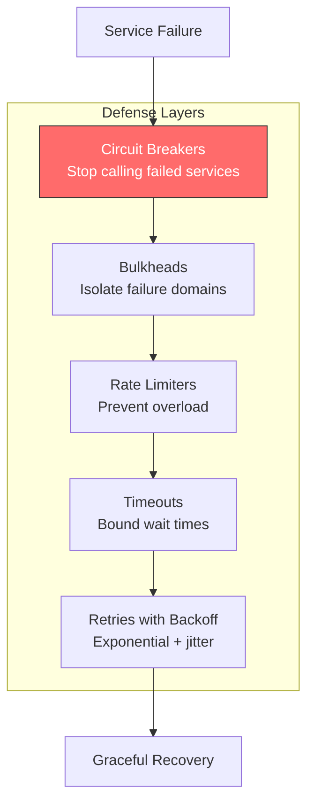

**Specific circuit breaker patterns:**

| Service | Failure Mode | Circuit Breaker Action |
|---------|-------------|----------------------|
| Tweet Service down | Cannot hydrate tweets | Serve tweet IDs only, show "loading" |
| Graph Service down | Cannot get follower lists | Skip fan-out, queue events in Kafka |
| Redis down | Timeline cache unavailable | Fall back to fan-out on read |
| Elasticsearch down | Search unavailable | Return "search temporarily unavailable" |
| Kafka down | Cannot publish events | Buffer in local disk queue, replay when Kafka recovers |

### Graceful Degradation Hierarchy

```
Level 0: Everything works normally
Level 1: Celebrity threshold lowered (reduce fan-out load)
Level 2: Only fan-out to users who have been active in last 24h (not 7 days)
Level 3: Disable fan-out entirely, all timelines served via fan-out on read
Level 4: Serve stale cached timelines (no updates)
Level 5: Show "Timeline temporarily unavailable" (last resort)
```

---

## 4.7 Multi-Region Deployment

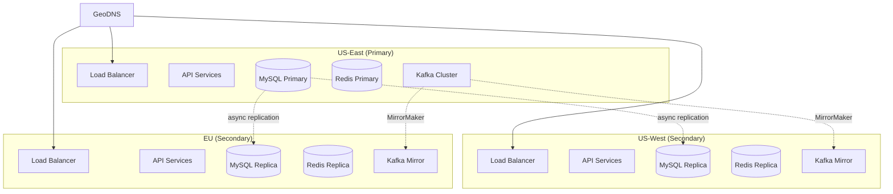

**Strategy:**
- **Writes** are routed to the primary region (US-East) for strong consistency
- **Reads** are served from the nearest region (low latency)
- Replication lag is typically < 100ms between regions
- In case of primary failure, promote a secondary region (manual failover for writes)

### Multi-Region Considerations

| Aspect | Approach |
|--------|---------|
| **Write routing** | All writes go to primary DC. Cross-DC latency adds ~50-100ms to writes. |
| **Read routing** | Local DC serves reads. Stale reads possible (eventual consistency). |
| **Replication** | Async MySQL replication + Kafka MirrorMaker for event replication. |
| **Failover** | Automated for reads (GeoDNS), manual for writes (promote secondary). |
| **Cache consistency** | Each DC has its own Redis cluster. Fan-out runs in each DC. |
| **Split-brain prevention** | Single write region prevents split-brain. Fencing tokens for primary election. |

### Timeline Fan-out Across Regions

```
When a user in EU tweets:
  1. Write request goes to primary DC (US-East) -- adds ~100ms latency
  2. Tweet stored in MySQL primary (US-East)
  3. TweetCreated event published to Kafka (US-East)
  4. Kafka MirrorMaker replicates event to US-West and EU Kafka clusters
  5. Fan-out workers in EACH region process the event and write to LOCAL Redis
  6. Followers in EU read from EU Redis (low latency)
  7. Followers in US read from US Redis (low latency)

Result: fan-out happens independently in each region, so followers get low-latency
reads regardless of where the author is located.
```

---

## 4.8 Monitoring and Observability

### Key Metrics to Track

| Metric | Alert Threshold | Why |
|--------|----------------|-----|
| Fan-out lag (Kafka consumer lag) | > 100K messages | Celebrity tweet or system overload |
| Timeline cache hit rate | < 95% | Cache eviction or failure |
| p99 timeline latency | > 500ms | SLO breach |
| Tweet write latency p99 | > 1s | Database or Kafka issue |
| Redis memory usage | > 80% | Need to scale or evict |
| Kafka partition skew | > 2x average | Hot partition, rebalance needed |
| Error rate (5xx) | > 0.1% | Service degradation |
| Tweet hydration cache miss rate | > 20% | Tweet cache warming issue |
| Celebrity tweet cache hit rate | < 95% | Thundering herd risk |
| Search indexing lag | > 60 seconds | Elasticsearch bottleneck |

### Dashboards

```
Real-time dashboard should show:
  - Tweets per second (global, by region)
  - Timeline reads per second (by region)
  - Fan-out queue depth (Kafka consumer lag per partition)
  - Cache hit/miss ratio (timeline cache, tweet cache)
  - Latency percentiles (p50, p95, p99) per service
  - Error rates by service and endpoint
  - Active Kafka consumers and partition assignment
  - Redis cluster health (memory, CPU, network)
  - MySQL replication lag per shard
  - Celebrity fan-out bypass rate
```

### Distributed Tracing

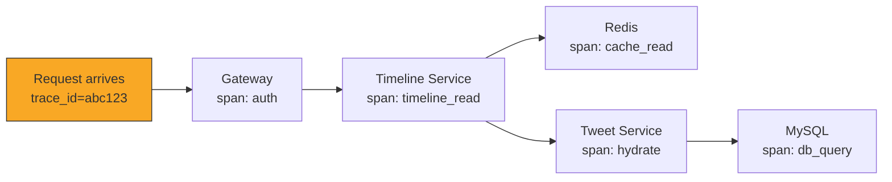

Every request gets a trace ID that follows it through all services. This enables:
- End-to-end latency breakdown (where is time spent?)
- Identifying bottlenecks (which service is slow?)
- Error correlation (which service caused a cascade?)
- Capacity planning (which services need more resources?)

---

## 4.9 Trade-off Summary

### Fan-out Strategy Comparison

```
+--------------------+------------------+------------------+------------------+
| Dimension          | Fan-out on Write | Fan-out on Read  | Hybrid           |
+--------------------+------------------+------------------+------------------+
| Read Latency       | ~1-10ms          | ~200-500ms       | ~10-50ms         |
| Write Amplification| O(N followers)   | O(1)             | O(N) if < 10K    |
| Storage Overhead   | High (Redis)     | Low              | Medium           |
| Celebrity Support  | Terrible         | Great            | Great            |
| System Complexity  | Simple           | Simple           | Medium           |
| Real-time Freshness| Slight delay     | Always fresh     | Slight delay     |
| Inactive Users     | Wasted writes    | No waste         | Optimized        |
| Used at Twitter?   | Pre-2012         | Never at scale   | Yes (since 2012) |
+--------------------+------------------+------------------+------------------+
```

### Key Trade-offs Made in This Design

| Decision | Trade-off | Why This Way |
|----------|-----------|-------------|
| Eventual consistency for timeline | Followers may see tweets a few seconds late, but reads are fast | 100:1 read-write ratio demands fast reads |
| Snowflake IDs instead of UUIDs | Lose true randomness, gain time-sortability and smaller size | Timeline ordering is the primary use case |
| Redis sorted set (800 limit) | Lose deep history in cache, gain bounded memory usage | 800 tweets covers days of content for most users |
| Shard tweets by user_id | User timeline queries are fast, but tweet-by-ID requires knowing user_id | User timeline is the dominant query pattern |
| Kafka for fan-out | Adds latency (async), but decouples services and handles backpressure | Decoupling is essential at this scale |
| Hybrid fan-out threshold at 10K | Arbitrary line; in practice, dynamically tuned based on system load | Covers 99.9% of users with push model |
| Soft deletes | Wastes storage, but enables recovery and audit compliance | Legal and product requirements demand it |
| Pre-computed timeline | Wastes storage for inactive users, but makes active user reads blazing fast | Optimize for the common case |

### When to Choose Each Approach

```
Choose pure Fan-out on Write when:
  - All users have similar follower counts (no celebrities)
  - Read latency is the top priority
  - System is small enough that write amplification is manageable
  Example: Internal team communication tool, Slack-like feed

Choose pure Fan-out on Read when:
  - Write latency is critical (must be instant)
  - Read volume is low relative to write volume
  - System has few users or users follow few accounts
  Example: RSS reader, small community forum

Choose Hybrid when:
  - Wide variance in follower counts (power law distribution)
  - Both read and write latency matter
  - System operates at massive scale
  Example: Twitter, Instagram, Facebook, LinkedIn
```

---

## 4.10 Real-World Twitter Architecture References

| Component | Twitter's Name | Description |
|-----------|---------------|-------------|
| ID Generator | **Snowflake** | Distributed 64-bit unique ID generator (open-sourced 2010) |
| Storage | **Manhattan** | Multi-tenant, real-time KV store replacing MySQL + Cassandra |
| Graph | **FlockDB** | Distributed graph database for social relationships (open-sourced) |
| Cache | **Twemcache / Pelikan** | Custom Memcached/Redis-compatible caching layer |
| Message Queue | **Kafka (DistributedLog)** | Twitter contributed to and built on top of Apache Kafka |
| Search | **Earlybird** | Real-time search engine built on modified Lucene |
| Blob Storage | **Blobstore** | Custom S3-equivalent for media storage |
| Timeline | **Timeline Service** | Hybrid fan-out architecture as described above |
| Stream Processing | **Heron** | Successor to Apache Storm for real-time processing |
| ML Ranking | **Home Mixer** | ML-powered timeline ranking service (open-sourced 2023) |
| Service Discovery | **Finagle** | RPC framework with service discovery (open-sourced) |
| Config Management | **Aurora** | Mesos-based cluster scheduler for service deployment |

### Twitter's Evolution Timeline

```
2006: Twitter launches (Ruby on Rails, single MySQL instance)
2008: Move to Scala + JVM (performance)
2010: Snowflake open-sourced (ID generation)
2010: FlockDB open-sourced (social graph)
2011: Move from fan-out on read to fan-out on write
2012: Hybrid fan-out approach deployed
2013: Manhattan replaces MySQL for some workloads
2014: Heron replaces Apache Storm
2015: Algorithmic timeline (ranked, not just chronological)
2023: Algorithm open-sourced (Home Mixer)
2023: Massive infrastructure consolidation under new ownership
```

---

## 4.11 Interview Checklist

Use this to make sure you have covered all critical points:

```
[x] Clarified requirements and scope
[x] Estimated scale: 500M DAU, 600M tweets/day, 5B timeline reads/day
[x] Identified read-heavy ratio (100:1)
[x] Designed API with cursor-based pagination
[x] Drew high-level architecture with all services
[x] Explained fan-out on write with sequence diagram
[x] Explained fan-out on read with sequence diagram
[x] Identified the celebrity problem and quantified it
[x] Proposed hybrid approach as the solution
[x] Explained Redis sorted set for timeline cache
[x] Discussed Snowflake IDs for time-sortable tweet IDs
[x] Covered database sharding strategy
[x] Explained Kafka for async event processing
[x] Discussed ranking/algorithm for timeline ordering
[x] Covered failure handling for each component
[x] Mentioned trending topics (stream processing)
[x] Referenced real Twitter systems (Manhattan, Snowflake, Earlybird)
[x] Discussed multi-region deployment
[x] Summarized trade-offs clearly
```

### Time Budget for 45-Minute Interview

```
Minutes  Phase
------   -----
0-5      Requirements clarification & scope
5-10     Back-of-envelope estimation (show the math)
10-15    API design (key endpoints, cursor pagination)
15-25    High-level architecture (draw the diagram, explain each service)
25-40    Deep dive: fan-out strategy
         - Fan-out on write (pros/cons, celebrity problem)
         - Fan-out on read (pros/cons, why it fails at scale)
         - Hybrid approach (the winning answer)
         - Redis timeline cache structure
40-45    Scaling, trade-offs, monitoring
```

---

## 4.12 Common Follow-up Questions

**Q: How would you handle a tweet going viral?**
> The hybrid approach handles this naturally. If the author is a normal user (< 10K
> followers), fan-out on write completes quickly. If the tweet gets millions of
> retweets, each retweeter fans out to their own followers. The retweeters are
> mostly normal users, so fan-out on write handles them. The viral tweet itself
> is fetched via hydration from the tweet store, which is heavily cached.

**Q: How do you handle tweet deletions at scale?**
> Soft-delete in the tweet store (set `is_deleted = true`). For timeline caches,
> two strategies: (1) Lazy deletion -- filter out deleted tweets during hydration,
> or (2) Active fan-out of delete events via Kafka. In practice, use both: active
> deletion for the fan-out cache, lazy filtering as a safety net.

**Q: What happens when a celebrity unfollows someone?**
> The follow/unfollow itself is instant (delete from graph store). For fan-out on
> write users, their old tweets remain in the celebrity's timeline cache until they
> naturally age out (sorted set trimmed to 800). For an immediate effect, publish an
> unfollow event that triggers cache cleanup, but this is low priority.

**Q: How would you add "For You" algorithmic recommendations?**
> Extend the timeline service with a recommendation layer. In addition to tweets from
> followed accounts, pull candidate tweets from: (1) topics the user engages with,
> (2) tweets liked by people the user follows, (3) trending content. Use an ML model
> to rank all candidates together. This is essentially what Twitter's "For You" tab does.

**Q: How do you prevent thundering herd on a celebrity's tweet?**
> Cache the celebrity's recent tweets aggressively with short TTLs (30-60 seconds).
> Use a single-flight / request-coalescing pattern: if 1000 requests arrive for the
> same celebrity's tweets simultaneously, only one actually queries the database; the
> rest wait for and share the result.

**Q: What if a user follows 10,000 accounts? Is the read path slow?**
> At read time, the user's pre-computed timeline (from normal users they follow) is
> in Redis -- that is still O(1). For celebrity followees, the user might follow 20-50
> celebrities. Fetching 50 celebrity tweet sets in parallel takes ~10ms (all cached).
> The merge step is fast (in-memory sort of ~200 items). Total added latency: ~20ms.

**Q: How do you handle time zones and "while you were away"?**
> The timeline cache always stores the latest 800 tweets regardless of time zone. When
> a user opens the app after sleeping for 8 hours, the system: (1) fetches their cached
> timeline, (2) identifies a "gap" in the timeline (tweets from the last 8 hours),
> (3) optionally highlights top tweets from the gap as "In case you missed it." The
> ranking model already handles recency decay, so recent tweets appear first.

**Q: How would you implement conversation threads?**
> Each reply stores `reply_to_tweet_id`. To render a thread, start from any tweet
> and walk up the `reply_to_tweet_id` chain (for parents) and query by
> `reply_to_tweet_id` index (for children). Cache popular threads. For deeply nested
> threads (100+ replies), paginate children and show only the most engaged branches.

**Q: How do you handle the "like" count accuracy problem?**
> Like counts are denormalized in the `tweet_engagement` table. Likes are written to
> a separate `likes` table and a Kafka event triggers an async counter increment.
> Counts may be slightly stale (eventual consistency). For very popular tweets,
> use a Redis counter with periodic flush to the database. Accept that the displayed
> count may be approximate -- users do not notice if a tweet shows "1.2M likes"
> vs "1,200,042 likes."
