# Design Twitter -- High-Level Design

## Complete System Design Interview Walkthrough (Part 2 of 3)

This document covers the high-level architecture of Twitter: the overall system diagram,
each core service's responsibility, data models, database choices, and the main request
flows for tweet creation and timeline reads. The deep dive on fan-out strategy,
scaling, and trade-offs is in Part 3.

---
---

# Step 2: High-Level Design

## 2.1 Overall Architecture

The system follows a microservices architecture with an event-driven backbone. Services
communicate synchronously via REST/gRPC for request-response flows and asynchronously
via Kafka for event propagation (fan-out, notifications, search indexing, trending).

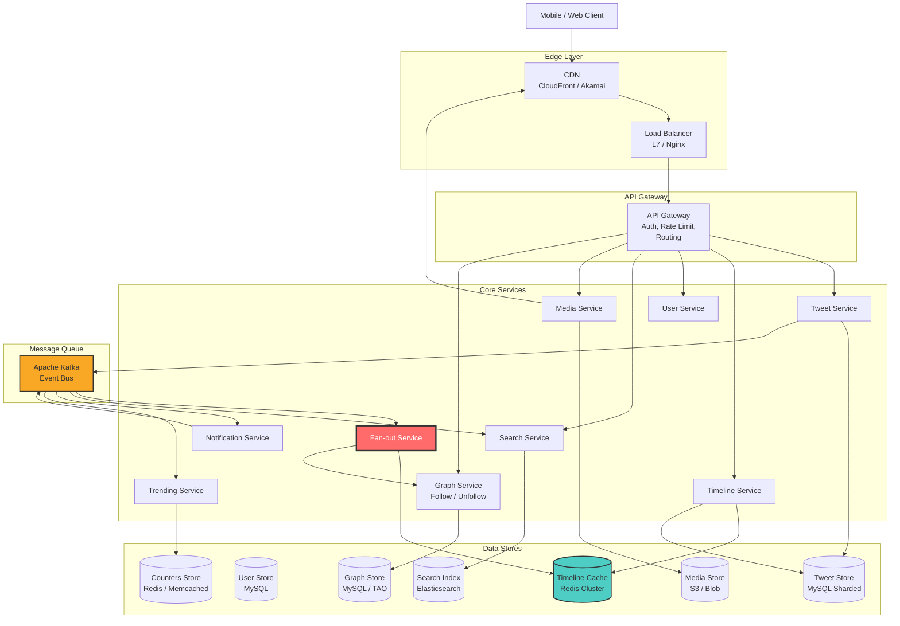

> The **Fan-out Service** (highlighted in red) is the most critical and complex component
> in this design. It is what makes or breaks the home timeline at scale.

### Architecture Principles

| Principle | Application |
|-----------|------------|
| **Separation of concerns** | Each service owns its data and logic. Tweet Service does not know about timelines. |
| **Event-driven decoupling** | Kafka decouples producers (Tweet Service) from consumers (Fan-out, Search, Notifications). Adding a new consumer requires zero changes to producers. |
| **Read-write separation** | The write path (tweet creation -> Kafka -> fan-out) is separate from the read path (timeline read -> Redis cache -> hydration). This allows independent scaling. |
| **Cache-first reads** | Timeline reads always hit Redis first. Database is a fallback, not the primary read path. |
| **Pre-computation** | Timelines are pre-computed at write time (for normal users) rather than assembled at read time. This shifts work from the latency-sensitive read path to the latency-tolerant write path. |

---

## 2.2 Edge Layer

### CDN (Content Delivery Network)

The CDN serves as the first point of contact for all static and media content:

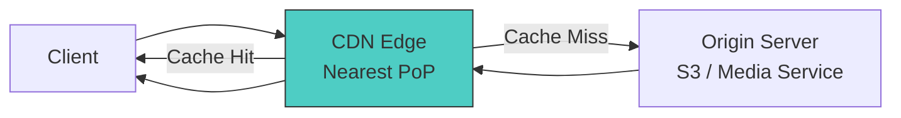

**Responsibilities:**
- Serve profile images, tweet media (images/video), and static assets (JS, CSS)
- Reduce latency by serving from the nearest edge location (PoP)
- Absorb traffic spikes -- viral media is served from edge, not origin
- Handle adaptive bitrate streaming for video content (HLS/DASH)

**CDN Configuration:**
- Cache-Control headers: media assets cached for 1 year (immutable content-addressed URLs)
- TTL for profile images: 24 hours (user can change profile pic)
- Pull-through model: first request misses, CDN fetches from S3, subsequent requests served from edge

### Load Balancer

```
Layer 7 (Application) Load Balancer:
  - Route by URL path: /api/v1/tweets -> Tweet Service fleet
  - Health checks: HTTP GET /health every 10s, 3 failures = remove from pool
  - Algorithm: least connections (preferred for varying request durations)
  - SSL termination at the LB level
  - Connection draining for graceful deployments

Layer 4 fallback:
  - For WebSocket connections (notifications), use L4 with sticky sessions
```

### API Gateway

The API Gateway sits between the load balancer and the microservices. It handles
cross-cutting concerns:

```
Responsibilities:
  1. Authentication: Validate OAuth2 Bearer tokens
  2. Rate limiting: Per-user, per-endpoint limits (see API design)
  3. Request routing: Route to correct service based on URL path
  4. Request/response transformation: Version negotiation, compression
  5. Observability: Inject trace IDs, log request metadata
  6. Circuit breaking: Prevent cascading failures when a backend is down

Technology options:
  - Kong, Envoy, AWS API Gateway, or custom (Twitter uses custom)
```

---

## 2.3 Tweet Service

**Responsibility**: Create, store, retrieve, and delete tweets.

### Write Path -- Tweet Creation Flow

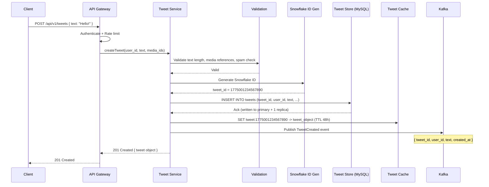

**Detailed steps:**

1. **Authentication & Rate Limiting** -- API Gateway validates the OAuth2 token and checks
   the user has not exceeded their tweet posting rate limit (300 tweets / 3 hours).

2. **Validation** -- Tweet Service validates:
   - Text length <= 280 characters (UTF-8 grapheme clusters, not bytes)
   - All referenced `media_ids` exist and belong to this user
   - If reply: parent tweet exists and is not deleted
   - Spam/abuse check via a lightweight ML model (async, non-blocking)

3. **Snowflake ID Generation** -- Generate a globally unique, time-sortable 64-bit ID.
   The ID embeds a millisecond timestamp, so no separate `created_at` index is needed.

4. **Persist to Tweet Store** -- Write to sharded MySQL. The shard is determined by
   `user_id`, so all of a user's tweets are co-located for efficient user timeline queries.

5. **Write to Tweet Cache** -- Populate a Redis/Memcached cache for the individual tweet
   object. This ensures the upcoming hydration step (when followers read their timelines)
   can fetch the tweet from cache rather than hitting the database.

6. **Publish Event** -- Emit a `TweetCreated` event to Kafka. This triggers:
   - Fan-out Service (push to followers' timeline caches)
   - Search Service (index the tweet in Elasticsearch)
   - Notification Service (send mention notifications)
   - Trending Service (count hashtags for trending detection)

7. **Return to Client** -- The client receives the created tweet immediately. Fan-out
   happens asynchronously -- the user does not wait for their tweet to reach followers.

### Data Model

```
tweets table (sharded by user_id):
+-----------------------+---------------+--------------------------+
| Column                | Type          | Description              |
+-----------------------+---------------+--------------------------+
| tweet_id (PK)         | BIGINT        | Snowflake ID             |
| user_id               | BIGINT        | Author (shard key)       |
| text                  | VARCHAR(280)  | Tweet content            |
| media_urls            | JSON          | Array of media URLs      |
| reply_to_tweet_id     | BIGINT        | NULL if not a reply      |
| quote_tweet_id        | BIGINT        | NULL if not a quote      |
| created_at            | TIMESTAMP     | From Snowflake ID        |
| is_deleted            | BOOLEAN       | Soft delete flag         |
| lang                  | CHAR(2)       | Detected language        |
+-----------------------+---------------+--------------------------+

Indexes:
  - PRIMARY KEY (tweet_id)
  - INDEX (user_id, tweet_id DESC)  -- for user timeline queries
  - Shard key: user_id

tweet_engagement table (sharded by tweet_id):
+-----------------------+---------------+--------------------------+
| Column                | Type          | Description              |
+-----------------------+---------------+--------------------------+
| tweet_id (PK)         | BIGINT        | FK to tweets             |
| like_count            | INT           | Denormalized counter     |
| retweet_count         | INT           | Denormalized counter     |
| reply_count           | INT           | Denormalized counter     |
| view_count            | BIGINT        | Impression counter       |
| updated_at            | TIMESTAMP     | Last counter update      |
+-----------------------+---------------+--------------------------+

likes table (sharded by user_id):
+-----------------------+---------------+--------------------------+
| Column                | Type          | Description              |
+-----------------------+---------------+--------------------------+
| user_id               | BIGINT        | Who liked                |
| tweet_id              | BIGINT        | What was liked           |
| created_at            | TIMESTAMP     | When liked               |
| PRIMARY KEY           |               | (user_id, tweet_id)      |
+-----------------------+---------------+--------------------------+

retweets table (sharded by user_id):
+-----------------------+---------------+--------------------------+
| Column                | Type          | Description              |
+-----------------------+---------------+--------------------------+
| user_id               | BIGINT        | Who retweeted            |
| tweet_id              | BIGINT        | What was retweeted       |
| created_at            | TIMESTAMP     | When retweeted           |
| PRIMARY KEY           |               | (user_id, tweet_id)      |
+-----------------------+---------------+--------------------------+
```

### Read Path

- **User Timeline**: Query tweet store by `user_id`, ordered by `tweet_id DESC`
  (Snowflake IDs are time-sorted). Simple range scan on sharded MySQL -- hits a single
  shard since tweets are sharded by `user_id`.

- **Single Tweet**: Point lookup by `tweet_id`. Need to know `user_id` for shard routing.
  Options: (a) encode a shard hint in the Snowflake ID, (b) maintain a lightweight
  `tweet_id -> user_id` lookup table, or (c) check the tweet cache first (most reads
  hit cache).

- **Tweet Hydration**: Given a list of tweet IDs (from the timeline cache), fetch full
  tweet objects. This is a multi-get operation across the tweet cache (Redis/Memcached)
  with fallback to the database for cache misses.

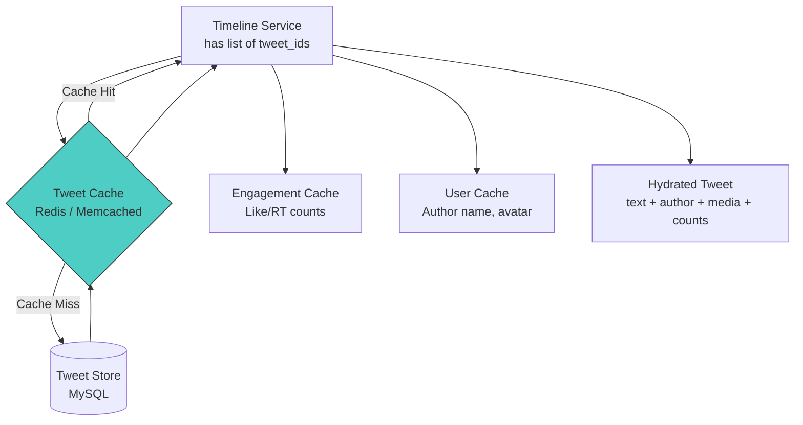

---

## 2.4 Timeline Service

**Responsibility**: Assemble and return the home timeline for a user.

This is the read-side of the system. When a user opens their feed:

1. Check **Redis Timeline Cache** for the user's pre-computed timeline
2. If cache hit: return the list of tweet IDs from the sorted set
3. Hydrate tweet IDs with full tweet data (text, author info, media URLs, engagement
   counts) via **Tweet Service**
4. If cache miss: fall back to **Fan-out on Read** (query graph for followees, fetch
   recent tweets, merge and rank)
5. Return paginated results to client

### Timeline Read Flow

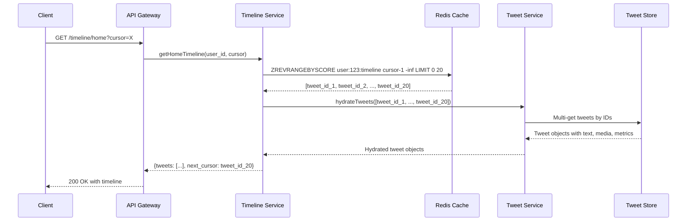

> **Key insight**: The timeline cache stores only tweet IDs (8 bytes each), not full
> tweet objects. This keeps the cache compact. Hydration happens at read time so
> engagement counts are always fresh.

### Redis Timeline Cache Structure

Each user has a **Redis Sorted Set** that acts as their pre-computed home timeline:

```
Key:    user:{user_id}:timeline
Type:   Sorted Set
Score:  tweet_id (which is a Snowflake timestamp, so auto-sorted by time)
Value:  tweet_id

Example:
  ZADD user:bob:timeline 1775001000 "tweet_1775001000"
  ZADD user:bob:timeline 1775002000 "tweet_1775002000"
  ZADD user:bob:timeline 1775003000 "tweet_1775003000"

Read timeline:
  ZREVRANGEBYSCORE user:bob:timeline +inf -inf LIMIT 0 20
  -> Returns latest 20 tweet IDs in reverse chronological order

Trim to keep last 800 entries:
  ZREMRANGEBYRANK user:bob:timeline 0 -801
```

> **Why 800?** Twitter keeps approximately 800 tweets in each user's timeline cache.
> This covers several days of content for most users. Older content falls back to
> database queries.

### Timeline Cache Miss Handling

When a user's cache is empty (new user, returning after long absence, or cache failure),
the Timeline Service falls back to assembling the timeline on-the-fly:

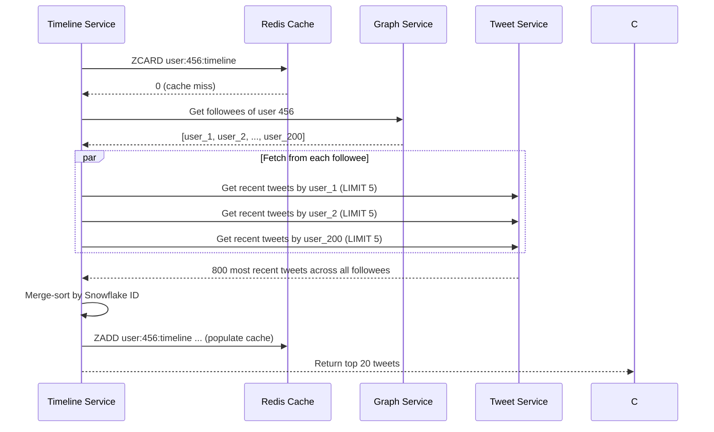

### User Timeline vs Home Timeline

| Aspect | User Timeline | Home Timeline |
|--------|--------------|---------------|
| Data source | Single shard (tweets by user_id) | Redis cache + celebrity tweets |
| Assembly | Simple range scan | Pre-computed + merge |
| Caching | Optional (DB is fast enough) | Required (Redis sorted set) |
| Ranking | Always chronological | Algorithmic or chronological |
| Latency | ~10-50ms | ~50-200ms |

---

## 2.5 Fan-out Service (The Core Challenge)

This service is covered in full depth in Part 3 (deep-dive-and-scaling.md). In brief:
when a user posts a tweet, the Fan-out Service determines which followers should
receive it and writes the tweet ID into their timeline caches in Redis.

**Key responsibilities:**
- Consume `TweetCreated` events from Kafka
- Look up the author's follower list via Graph Service
- Determine if the author is a "celebrity" (> 10K followers) or normal user
- For normal users: ZADD the tweet ID into every follower's Redis sorted set
- For celebrities: skip fan-out (handled at read time via the hybrid approach)
- Trim each follower's sorted set to 800 entries
- Handle backpressure by monitoring Kafka consumer lag

---

## 2.6 Graph Service (Follow / Unfollow)

**Responsibility**: Manage the social graph -- who follows whom.

### Data Model

```
follows table (sharded by follower_id):
+-----------------------+---------------+--------------------------+
| Column                | Type          | Description              |
+-----------------------+---------------+--------------------------+
| follower_id           | BIGINT        | User who follows         |
| followee_id           | BIGINT        | User being followed      |
| created_at            | TIMESTAMP     | When followed            |
| PRIMARY KEY           |               | (follower_id, followee_id)|
+-----------------------+---------------+--------------------------+

-- Secondary index on (followee_id) for "get followers of X"
-- Or maintain a reverse table sharded by followee_id:

followers_reverse table (sharded by followee_id):
+-----------------------+---------------+--------------------------+
| Column                | Type          | Description              |
+-----------------------+---------------+--------------------------+
| followee_id           | BIGINT        | User being followed      |
| follower_id           | BIGINT        | User who follows         |
| created_at            | TIMESTAMP     | When followed            |
| PRIMARY KEY           |               | (followee_id, follower_id)|
+-----------------------+---------------+--------------------------+
```

Twitter's real system uses **TAO** (a graph-aware caching layer similar to Facebook's)
and **FlockDB** for graph queries. These systems provide:
- Bidirectional edge queries (who follows X, who does X follow)
- Edge counting (follower count, following count)
- Edge existence checks (does A follow B)
- Pagination over large edge sets

### Key Queries

| Operation | Query | Performance |
|-----------|-------|-------------|
| Who does user X follow? | `SELECT followee_id FROM follows WHERE follower_id = X` | Single shard scan |
| Who follows user X? | `SELECT follower_id FROM followers_reverse WHERE followee_id = X` | Single shard scan |
| Does A follow B? | `SELECT 1 FROM follows WHERE follower_id = A AND followee_id = B` | Point lookup |
| Follower count | Denormalized counter in user table, updated via Kafka events | O(1) |
| Mutual follows | Intersection of A's followees and B's followees | Application-level join |

### Follow Event Flow

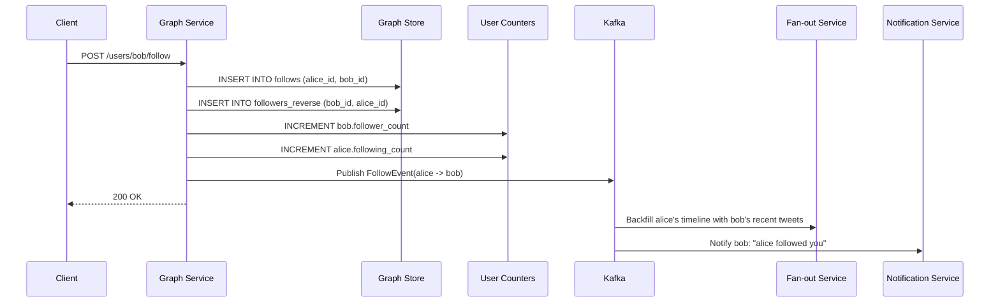

### Unfollow Considerations

When a user unfollows someone, the system must:

1. **Delete the edge** from both the `follows` and `followers_reverse` tables
2. **Decrement counters** for both users
3. **Publish UnfollowEvent** to Kafka
4. **Optionally clean the timeline cache** -- remove the unfollowed user's tweets from
   the follower's timeline. In practice, this is low priority: old tweets naturally
   age out as the sorted set is trimmed to 800 entries. Active cleanup is only done
   for a better user experience if the user explicitly navigates to their feed after
   unfollowing.

---

## 2.7 User Service

**Responsibility**: Manage user profiles, authentication tokens, and user settings.

### Data Model

```
users table (sharded by user_id):
+-----------------------+---------------+--------------------------+
| Column                | Type          | Description              |
+-----------------------+---------------+--------------------------+
| user_id (PK)          | BIGINT        | Unique user identifier   |
| handle                | VARCHAR(15)   | @handle (unique index)   |
| display_name          | VARCHAR(50)   | Display name             |
| bio                   | VARCHAR(160)  | Profile biography        |
| profile_image_url     | VARCHAR(255)  | Avatar URL               |
| banner_image_url      | VARCHAR(255)  | Header image URL         |
| follower_count        | INT           | Denormalized counter     |
| following_count       | INT           | Denormalized counter     |
| tweet_count           | INT           | Denormalized counter     |
| is_verified           | BOOLEAN       | Verification badge       |
| is_celebrity          | BOOLEAN       | > 10K followers flag     |
| created_at            | TIMESTAMP     | Account creation date    |
| is_suspended          | BOOLEAN       | Account suspension flag  |
+-----------------------+---------------+--------------------------+

Indexes:
  - PRIMARY KEY (user_id)
  - UNIQUE INDEX (handle)

user_settings table:
+-----------------------+---------------+--------------------------+
| Column                | Type          | Description              |
+-----------------------+---------------+--------------------------+
| user_id (PK)          | BIGINT        | FK to users              |
| is_private            | BOOLEAN       | Protected account        |
| notification_prefs    | JSON          | Notification settings    |
| email                 | VARCHAR(255)  | Account email            |
| phone                 | VARCHAR(20)   | Account phone            |
| two_factor_enabled    | BOOLEAN       | 2FA status               |
| language              | CHAR(2)       | Preferred language       |
| country               | CHAR(2)       | Location for trends      |
+-----------------------+---------------+--------------------------+
```

### Celebrity Flag

The `is_celebrity` flag is critical for the hybrid fan-out strategy. It is updated
by a background job:

```
Every hour:
  UPDATE users SET is_celebrity = TRUE WHERE follower_count >= 10000;
  UPDATE users SET is_celebrity = FALSE WHERE follower_count < 10000;
```

This flag is cached aggressively (in the User Service cache) because the Fan-out
Service checks it for every single tweet event.

---

## 2.8 Search Service

**Responsibility**: Full-text search over tweets, users, and hashtags.

### Architecture

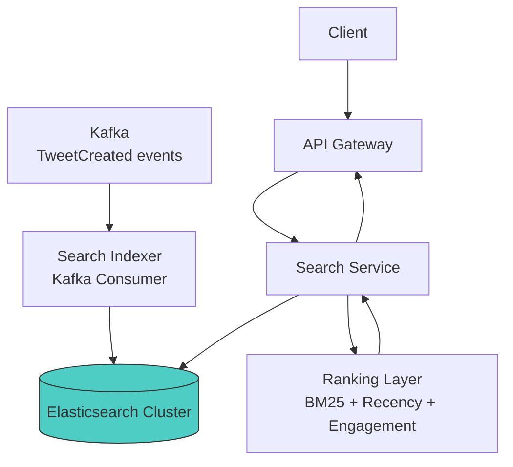

- Tweets are indexed into **Elasticsearch** (or Twitter's custom Earlybird search engine)
- Index fields: `text`, `hashtags`, `user_handle`, `created_at`, `engagement_score`, `lang`
- New tweets arrive via Kafka consumer that reads `TweetCreated` events

### Search Indexing Pipeline

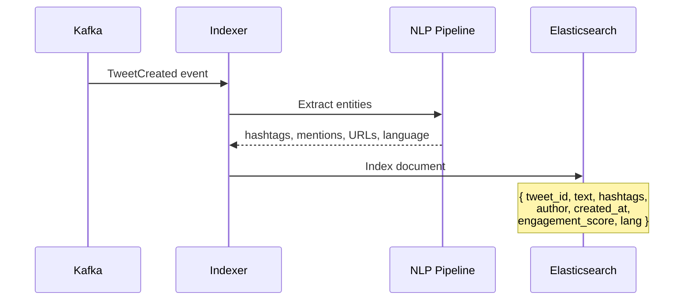

### Indexing Strategy

- **Real-time indexing**: Kafka consumer writes to ES within seconds of tweet creation
- **Partitioning**: ES index partitioned by time (daily/weekly indices) for efficient
  range queries and retention management
- **Ranking**: BM25 text relevance + recency boost + engagement signals (likes, retweets)
- **Retention**: Old indices are rolled off to cold storage (30-day active window)

### Elasticsearch Index Schema

```json
{
  "mappings": {
    "properties": {
      "tweet_id":          { "type": "long" },
      "text":              { "type": "text", "analyzer": "twitter_custom" },
      "hashtags":          { "type": "keyword" },
      "mentions":          { "type": "keyword" },
      "author_id":         { "type": "long" },
      "author_handle":     { "type": "keyword" },
      "created_at":        { "type": "date" },
      "lang":              { "type": "keyword" },
      "engagement_score":  { "type": "float" },
      "has_media":         { "type": "boolean" },
      "is_reply":          { "type": "boolean" }
    }
  }
}
```

---

## 2.9 Media Service

**Responsibility**: Upload, process, store, and serve images/videos.

### Upload Flow

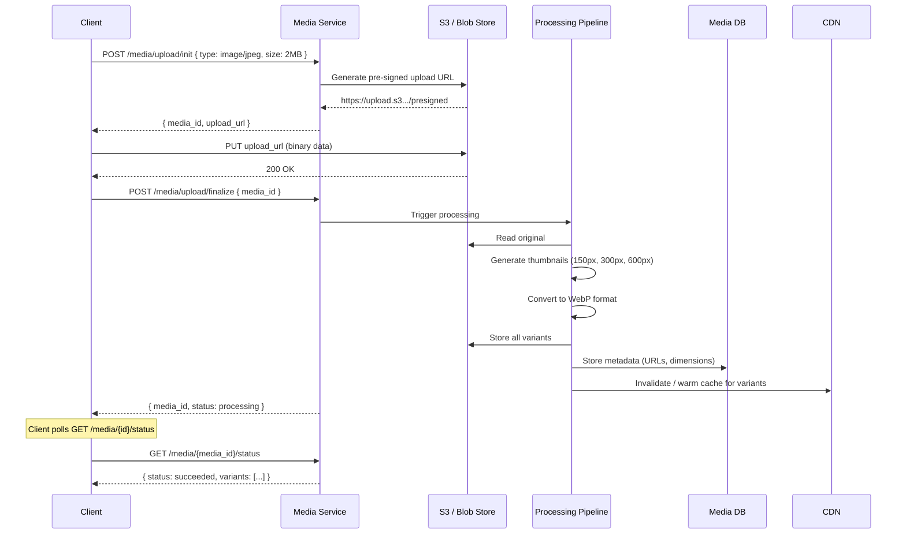

**Detailed processing pipeline:**

1. **Images**: Generate thumbnails (150px, 300px, 600px, 1200px), convert to WebP for
   modern browsers with JPEG fallback, strip EXIF metadata for privacy
2. **Video**: Transcode to multiple bitrates (360p, 720p, 1080p) using HLS/DASH for
   adaptive streaming, extract a poster thumbnail, enforce 2:20 max duration
3. **GIFs**: Convert to MP4 (much smaller file size) while keeping GIF for legacy clients

### Serving

- All media served via **CDN** (CloudFront, Akamai)
- CDN pull-through: first request hits S3, subsequent requests served from CDN edge
- Content-addressed URLs: `/media/{hash}.webp` -- URL changes when content changes,
  enabling infinite cache TTLs
- Adaptive bitrate streaming for video (client selects quality based on network speed)

---

## 2.10 Notification Service

**Responsibility**: Deliver real-time and push notifications.

### Notification Types

| Type | Trigger | Priority | Delivery |
|------|---------|----------|----------|
| Mention | `@user` in tweet text | High | Real-time + push |
| Like | Someone likes your tweet | Medium | Batched |
| Retweet | Someone retweets your tweet | Medium | Batched |
| Follow | New follower | Medium | Real-time + push |
| Reply | Someone replies to your tweet | High | Real-time + push |
| Trending | Your tweet is trending | Low | Async |
| Quote Tweet | Someone quotes your tweet | High | Real-time + push |

### Architecture

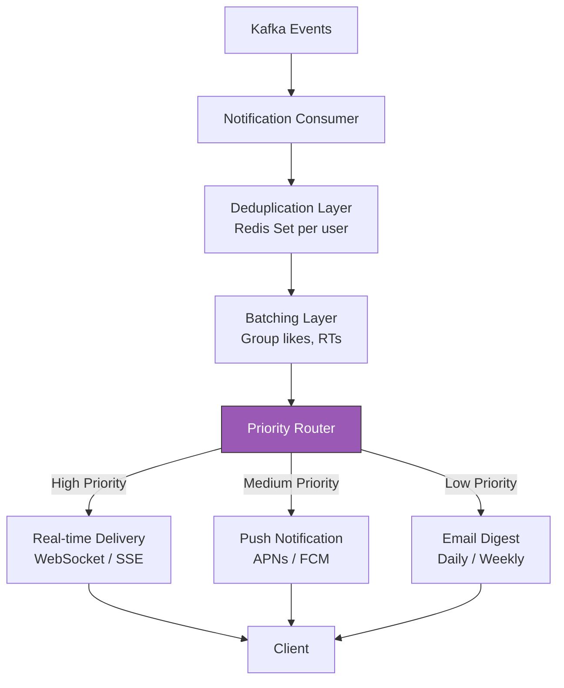

- Consumes events from **Kafka** (TweetCreated, LikeEvent, FollowEvent, etc.)
- **De-duplicates**: Don't notify the same event twice (idempotent writes to a Redis set)
- **Batches**: If 100 people like your tweet, send one notification: "100 people liked
  your tweet" instead of 100 individual notifications
- **Priority routing**: Mentions and replies are high priority (real-time), likes are
  batched, trending is async

**Delivery channels:**
- **WebSocket** / Server-Sent Events for in-app real-time notifications
- **APNs** (iOS) and **FCM** (Android) for push notifications
- **Email digest** (daily/weekly summary for users who opt in)

---

## 2.11 Trending Service

**Responsibility**: Detect and serve trending topics in real time.

This service is covered in depth in Part 3. In brief: it consumes `TweetCreated` events
from Kafka, extracts hashtags and keywords, counts them in sliding time windows, and
uses anomaly detection (current rate vs. baseline) to identify trending topics.

---

## 2.12 Database Choices Summary

| Data Store | Technology | Why This Choice |
|------------|-----------|-----------------|
| **Tweet Store** | Sharded MySQL (or Manhattan) | Structured data, strong consistency for writes, efficient range scans by user_id |
| **User Store** | MySQL | Low write volume, strong consistency needed, simple schema |
| **Graph Store** | MySQL + TAO / FlockDB | Bidirectional edge queries, edge counting, high read throughput with caching layer |
| **Timeline Cache** | Redis Cluster | Sorted sets for pre-computed timelines, sub-millisecond reads, horizontal scaling |
| **Tweet Cache** | Redis / Memcached | Key-value cache for individual tweet objects during hydration |
| **Search Index** | Elasticsearch (Earlybird) | Full-text search with inverted index, time-partitioned indices |
| **Media Store** | S3 / Blob Store | Unlimited storage for images and video, CDN-integrated serving |
| **Counters** | Redis / Memcached | Fast atomic increment/decrement for like/retweet/view counts |
| **Message Queue** | Apache Kafka | Durable, ordered, partitioned event stream for async processing |

### Why MySQL Over NoSQL for Tweets?

Twitter actually started with MySQL and kept it because:

1. **Schema enforcement** -- Tweets have a well-defined schema that rarely changes
2. **Efficient range scans** -- User timeline queries (`WHERE user_id = X ORDER BY tweet_id DESC`)
   are natural B-tree index scans
3. **Transactions** -- Useful for atomic writes (tweet + engagement counters)
4. **Mature ecosystem** -- Backup, replication, monitoring tools are well-established
5. **Sharding** -- Application-level sharding by `user_id` gives predictable data locality

Eventually Twitter built **Manhattan**, a custom distributed KV store, to replace MySQL
for some workloads. But the logical data model remains the same.

### Why Redis for Timeline Cache?

1. **Sorted Sets** -- Perfect data structure for a timeline (sorted by tweet ID / time)
2. **Sub-millisecond latency** -- Single-digit millisecond `ZREVRANGEBYSCORE` operations
3. **Atomic operations** -- `ZADD` + `ZREMRANGEBYRANK` (trim) in a pipeline
4. **Memory efficiency** -- 800 tweet IDs x 8 bytes = 6.4 KB per user (tiny)
5. **Cluster mode** -- Horizontal scaling by adding nodes with consistent hashing

---

## 2.13 Request Flow Summary

### Tweet Creation (Write Path)

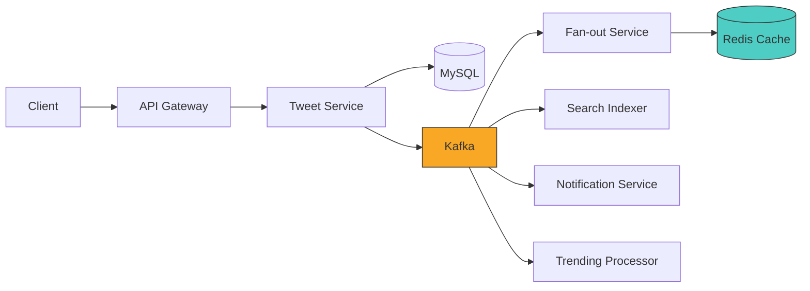

### Timeline Read (Read Path)

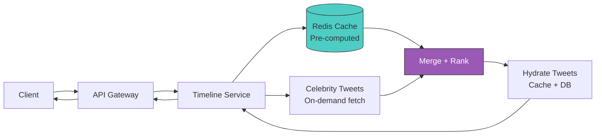

### Key Architectural Insight

The write path and read path are **completely decoupled** via Kafka and Redis:

- **Write path**: Client -> Tweet Service -> MySQL + Kafka (synchronous). Then
  Kafka -> Fan-out -> Redis (asynchronous). The client never waits for fan-out.

- **Read path**: Client -> Timeline Service -> Redis (cache hit) or DB (cache miss).
  The read path never touches Kafka or the Fan-out Service.

This decoupling allows:
- Independent scaling of writes and reads
- Writes remain fast even when fan-out is lagging (Kafka buffers)
- Reads are isolated from write spikes (pre-computed in Redis)
- Each service can be deployed and scaled independently
