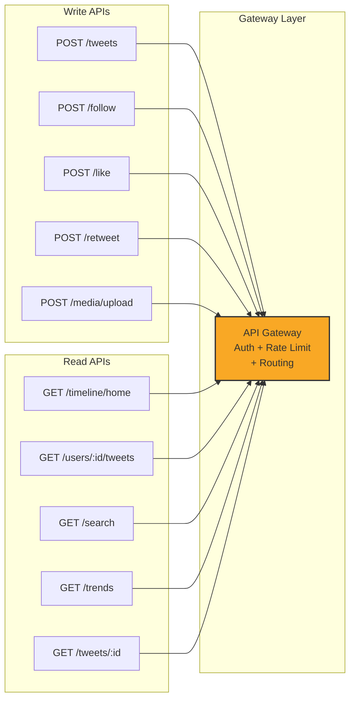

# Design Twitter -- Requirements & Estimation

## Complete System Design Interview Walkthrough (Part 1 of 3)

This document covers the first step of the 4-step interview framework for designing
Twitter (now X), one of the most commonly asked system design questions. The core
challenge -- fan-out strategy for the home timeline -- is what separates strong answers
from average ones. This part focuses on scoping the problem, defining requirements,
estimating capacity, and designing the API surface.

---
---

# Step 1: Requirements & Estimation

## 1.1 Clarifying the Problem

Before diving in, ask the interviewer what scope to cover. Twitter is massive -- clarify
whether the focus is the feed, search, DMs, or the full platform.

> **"I want to design the core Twitter experience -- posting tweets, generating the
> home timeline, follow/unfollow, and search. Shall I also cover trending topics
> and notifications, or keep the scope tighter?"**

Typically the interviewer wants: **tweet posting + home timeline generation**. That is
where the most interesting distributed systems challenges live.

### Why This Question is So Popular

Twitter's design is a favorite because it forces candidates to confront:

1. **Extreme read-write asymmetry** -- 100:1 read-to-write ratio
2. **The fan-out problem** -- distributing content to millions of followers efficiently
3. **The celebrity problem** -- handling users with 100M+ followers
4. **Real-time expectations** -- users expect feeds to update within seconds
5. **Scale** -- 500M+ daily active users generating billions of timeline reads

These constraints make a purely naive design (e.g., "just query the database") fail
catastrophically, which creates natural opportunities for candidates to demonstrate
depth of knowledge.

### Key Questions to Ask the Interviewer

| Question | Why It Matters |
|----------|---------------|
| What is the primary use case -- feed or search? | Determines which subsystem to deep-dive |
| Should we handle media (images/video)? | Adds CDN, transcoding, and storage complexity |
| Do we need algorithmic ranking or just chronological? | Changes the timeline assembly pipeline |
| Is global deployment required? | Introduces multi-region replication concerns |
| What is the expected user base? | Drives all capacity estimates |
| Should tweets support editing? | Affects cache invalidation strategy |

---

## 1.2 Functional Requirements

### Core Features (Must Have)

| Feature | Description |
|---------|-------------|
| **Post Tweet** | Create a tweet (280 chars text + optional media: images, video, GIFs) |
| **Home Timeline** | Aggregated feed of tweets from users you follow, ranked and paginated |
| **User Timeline** | All tweets posted by a specific user (profile page) |
| **Follow / Unfollow** | Establish and remove follow relationships |
| **Like / Retweet** | Engage with tweets (increment counters, propagate to feeds) |
| **Search** | Full-text search across tweets, users, hashtags |
| **Trending** | Real-time trending topics / hashtags |
| **Notifications** | Alerts for new followers, likes, retweets, mentions |

### Feature Priority Matrix

Understanding which features drive the core system design is critical. The interviewer
cares most about the first two rows:

```
                         User Impact
                    Low              High
                +-----------+------------------+
  Complexity    | Trending  | Home Timeline    |  <- High complexity
  High          | Search    | Fan-out Strategy |
                +-----------+------------------+
                | Notifs    | Post Tweet       |  <- Low complexity
  Low           | Retweet   | Follow/Unfollow  |
                +-----------+------------------+
```

The **Home Timeline + Fan-out Strategy** sits at the intersection of high user impact
and high complexity -- this is where 80% of the interview discussion will happen.

### Detailed Feature Breakdown

#### Post Tweet
- Maximum 280 characters of UTF-8 text
- Support for up to 4 images, 1 video, or 1 GIF per tweet
- Media is uploaded separately and referenced by `media_id`
- Tweets can be replies (referencing a parent tweet) or quote tweets
- Tweets can contain `@mentions` and `#hashtags` (parsed server-side)
- Tweets are immutable once posted (editing is a separate, newer feature)

#### Home Timeline
- Aggregated feed of tweets from accounts the user follows
- Paginated with cursor-based navigation (newest first)
- May include "liked by people you follow" (social proof injection)
- Supports both chronological and algorithmic ranking modes
- Must handle interleaving of regular tweets and celebrity tweets (hybrid fan-out)

#### User Timeline
- All tweets posted by a single user, in reverse chronological order
- Simpler than home timeline -- single-shard query on tweet store
- Includes retweets made by the user
- Publicly accessible (no auth required for public profiles)

#### Follow / Unfollow
- Directional relationship: A follows B does not imply B follows A
- Must update both the social graph and counters atomically
- Triggers backfill of the followee's recent tweets into the follower's timeline cache
- Unfollow should (eventually) remove the unfollowed user's tweets from the timeline

### Out of Scope (Mention Briefly)

- Direct Messages (separate system, see Design WhatsApp)
- Twitter Spaces (live audio)
- Ads / promoted tweets (separate ad serving infrastructure)
- Account verification (trust & safety system)
- Content moderation / spam detection (ML classification pipeline)
- Tweet editing (cache invalidation challenge -- mention as a follow-up)
- Twitter Lists (curated follow groups)
- Bookmarks (personal saved tweets)

---

## 1.3 Non-Functional Requirements

| Requirement | Target | Rationale |
|-------------|--------|-----------|
| **Timeline Latency** | < 500ms p99 | Users expect instant feed refresh |
| **Tweet Post Latency** | < 1s | Write can be slightly slower than reads |
| **Availability** | 99.99% | Global platform, always-on expectation |
| **Consistency** | Eventual consistency OK for timeline | A few seconds delay for a tweet to appear in followers' feeds is acceptable |
| **Strong Consistency** | For follow/unfollow, likes, user profile | These must not lose writes |
| **Durability** | Zero tweet loss | Every posted tweet must be persisted reliably |
| **Scalability** | Handle viral events (elections, Super Bowl) | 10-50x traffic spikes |

### Detailed Non-Functional Analysis

#### Latency Breakdown by Operation

```
Operation               p50 Target    p99 Target    p999 Target
--------------------------------------------------------------------
Home timeline read      < 100ms       < 500ms       < 1s
User timeline read      < 50ms        < 200ms       < 500ms
Post tweet              < 200ms       < 1s          < 2s
Search query            < 200ms       < 500ms       < 1s
Follow/unfollow         < 100ms       < 300ms       < 500ms
Like/retweet            < 50ms        < 200ms       < 500ms
Trending topics         < 50ms        < 100ms       < 200ms
```

#### Availability and SLA

```
99.99% availability = ~52 minutes downtime per year
                    = ~4.3 minutes downtime per month
                    = ~8.6 seconds downtime per day

This requires:
  - No single point of failure in any service
  - Automatic failover for databases (< 30s)
  - Multi-region deployment with GeoDNS routing
  - Circuit breakers to prevent cascade failures
  - Graceful degradation (serve stale timeline rather than error)
```

#### Consistency Model by Feature

| Feature | Consistency Model | Justification |
|---------|------------------|---------------|
| Tweet posting | Strong (write-ahead log) | Cannot lose a tweet once acknowledged |
| Home timeline | Eventual (seconds) | 2-5 second delay is acceptable |
| Follow/unfollow | Strong (graph store) | Must reflect immediately in follower counts |
| Like/retweet counts | Eventual (async counters) | Slight inaccuracy in counts is fine |
| Search index | Eventual (async indexing) | 5-30 second indexing delay is fine |
| Trending | Eventual (stream processing) | Minutes-level aggregation is expected |
| User profile | Strong (read-after-write) | User should see their own edits immediately |

#### Partition Tolerance and CAP Considerations

Twitter's design favors **AP (Availability + Partition tolerance)** for the timeline
read path, and **CP (Consistency + Partition tolerance)** for the write path:

```
Timeline reads:  AP -- always serve a timeline, even if slightly stale
Tweet writes:    CP -- never lose a tweet, even if write is briefly unavailable
Social graph:    CP -- follow/unfollow must be consistent
Counters:        AP -- approximate counts are fine during partitions
```

---

## 1.4 Capacity Estimation

### Users and Activity

```
Total users:           1 Billion
Daily Active Users:    500 Million (50% DAU/MAU)
Monthly Active Users:  800 Million

Tweets per day:        600 Million
  - 500M DAU x average 1.2 tweets/day = 600M tweets/day
  - Note: most users consume more than they produce (lurkers)
  - Power users (top 1%) produce ~50% of all tweets

Follows:
  - Average user follows 200 accounts
  - Average user has 200 followers
  - Median user has ~50 followers (heavy skew due to celebrities)
  - Celebrity users: 1M - 100M+ followers
  - Total follow edges: 500M users x 200 avg = 100 Billion edges

Engagement:
  - Average tweet receives 5 likes, 1 retweet, 0.5 replies
  - Top 1% of tweets receive 90% of all engagement
```

### Read / Write Ratio

```
Timeline reads per day:
  500M DAU x 10 refreshes/day = 5 Billion timeline reads/day

Tweet writes per day:  600 Million

Read : Write ratio = 5B : 600M ~ 100 : 1    (extremely read-heavy)

Other reads:
  - User profile views: ~2B/day
  - Search queries: ~150M/day
  - Trending page views: ~500M/day
  - Notification fetches: ~1B/day

Total read operations: ~9B/day
Total write operations: ~800M/day (tweets + likes + retweets + follows)
Effective ratio: ~11:1 for all operations, ~100:1 for timeline-specific
```

### Throughput (QPS)

```
Tweet writes:
  600M / 86,400s ~ 7,000 tweets/sec (average)
  Peak (2-3x):   ~ 15,000-20,000 tweets/sec
  Spike events (Super Bowl, elections): up to 50,000 tweets/sec

Timeline reads:
  5B / 86,400s ~ 58,000 reads/sec (average)
  Peak (2-3x):  ~ 150,000 reads/sec

Search queries:
  Assume 10% of DAU search daily, 3 queries each
  500M x 0.1 x 3 / 86,400 ~ 1,700 queries/sec

Follow/unfollow:
  Assume 1% of DAU follow/unfollow daily, 2 actions each
  500M x 0.01 x 2 / 86,400 ~ 115 actions/sec

Like/retweet:
  Assume each DAU likes 10 tweets and retweets 2 per day
  500M x 12 / 86,400 ~ 69,000 engagements/sec

Fan-out writes (to Redis):
  600M tweets/day x average 200 followers = 120 Billion Redis writes/day
  120B / 86,400 ~ 1.4 Million Redis ZADD/sec (average)
  This is the number that makes fan-out the critical bottleneck.
```

### Storage

```
Tweet storage (text only):
  Average tweet: 280 bytes text + 200 bytes metadata = ~500 bytes
  600M tweets/day x 500 bytes = 300 GB/day
  Per year: 300 GB x 365 = ~110 TB/year
  5-year retention: ~550 TB

Tweet engagement table:
  ~50 bytes per row (tweet_id + counters)
  600M tweets/day x 50 bytes = 30 GB/day
  Per year: ~11 TB

Social graph storage:
  Each follow edge: ~30 bytes (follower_id + followee_id + timestamp)
  100B edges x 30 bytes = 3 TB total
  Growth: ~500M new edges/day = 15 GB/day

Media storage:
  Assume 20% of tweets have media
  600M x 0.2 = 120M media items/day
  Average media size: 500 KB (images), 5 MB (video)
  Assume 80% images, 20% video:
    Images: 96M x 500KB = 48 TB/day
    Video:  24M x 5MB   = 120 TB/day
    Total media: ~170 TB/day
    Per year: ~62 PB

Timeline cache (Redis):
  500M users x 800 tweet IDs x 8 bytes = ~3.2 TB
  (Only active users cached, so realistically ~500 GB - 1 TB)

Search index (Elasticsearch):
  ~110 TB/year of tweet text indexed
  With inverted index overhead (~2x): ~220 TB/year
  Rolling window of 30 days: ~18 TB active index
```

### Bandwidth

```
Outgoing (timeline reads dominate):
  5B reads/day, each returns ~20 tweets with metadata
  20 tweets x 500 bytes text = 10 KB per read (text only)
  5B x 10 KB = 50 TB/day outgoing text
  With media thumbnails: ~500 TB/day
  Average bandwidth: 500 TB / 86,400s ~ 5.8 GB/s sustained

Incoming:
  600M tweets x 500 bytes = 300 GB/day text
  Media uploads: ~170 TB/day
  Average incoming: ~170 TB / 86,400s ~ 2 GB/s sustained

CDN offloads ~80% of media serving:
  Origin bandwidth: ~1.2 GB/s
  CDN edge bandwidth: ~4.6 GB/s (distributed globally)
```

### Capacity Summary Table

```
+---------------------------+------------------+-------------------+
| Metric                    | Average          | Peak (3x)         |
+---------------------------+------------------+-------------------+
| Tweet writes/sec          | 7,000            | 20,000            |
| Timeline reads/sec        | 58,000           | 150,000           |
| Fan-out Redis writes/sec  | 1,400,000        | 4,200,000         |
| Search queries/sec        | 1,700            | 5,000             |
| Engagement actions/sec    | 69,000           | 200,000           |
| Outgoing bandwidth        | 5.8 GB/s         | 17 GB/s           |
| Incoming bandwidth        | 2 GB/s           | 6 GB/s            |
| Tweet storage/year        | 110 TB           | -                 |
| Media storage/year        | 62 PB            | -                 |
| Redis cache (active)      | 500 GB - 1 TB    | -                 |
+---------------------------+------------------+-------------------+
```

---

## 1.5 API Design

### Design Principles

Before listing the APIs, note the key design principles:

1. **Cursor-based pagination** -- Twitter's feed is constantly changing, so offset-based
   pagination (page 1, page 2) would lead to duplicate or missed tweets. Cursor-based
   pagination uses Snowflake IDs as cursors -- they are time-sortable, so
   `cursor=1234567890` means "give me tweets older than this ID."

2. **RESTful with JSON** -- Standard REST conventions for CRUD operations. Twitter's
   real API is REST-based (not GraphQL).

3. **Rate limiting** -- Every endpoint is rate-limited per user token. Public endpoints
   (search, user timelines) have lower limits than authenticated ones.

4. **Idempotency** -- Writes (post tweet, like, retweet) should be idempotent to handle
   client retries safely. Use `Idempotency-Key` headers for mutations.

5. **Media pre-upload** -- Media is uploaded separately before the tweet is posted. The
   tweet references `media_ids` rather than containing inline binary data.

### Authentication

```
All authenticated endpoints require:
Headers:
  Authorization: Bearer <OAuth2_access_token>
  X-Request-ID: <uuid>              // For tracing
  X-Idempotency-Key: <uuid>         // For write operations

Rate Limits (per user):
  Timeline reads:  300 requests / 15 min
  Tweet posts:     300 tweets / 3 hours
  Likes:           1000 likes / 24 hours
  Follows:         400 follows / 24 hours
  Search:          180 requests / 15 min
```

### Tweet APIs

```
POST /api/v1/tweets
Headers: Authorization: Bearer <token>
Body: {
  "text": "Hello world! #firsttweet",
  "media_ids": ["media_123", "media_456"],   // pre-uploaded
  "reply_to_tweet_id": "tweet_789",          // optional
  "quote_tweet_id": "tweet_101",             // optional
  "poll": {                                   // optional
    "options": ["Yes", "No", "Maybe"],
    "duration_minutes": 1440
  }
}
Response: 201 Created
{
  "id": "1234567890123456789",   // Snowflake ID
  "text": "Hello world! #firsttweet",
  "author_id": "user_42",
  "created_at": "2026-04-07T10:30:00Z",
  "media": [...],
  "metrics": { "likes": 0, "retweets": 0, "replies": 0 },
  "entities": {
    "hashtags": [{ "text": "firsttweet", "start": 13, "end": 24 }],
    "mentions": [],
    "urls": []
  }
}

GET /api/v1/tweets/{tweet_id}
Response: 200 OK { ... tweet object ... }

DELETE /api/v1/tweets/{tweet_id}
Response: 204 No Content
```

### Timeline APIs

```
GET /api/v1/timeline/home?cursor=<cursor>&count=20
Headers: Authorization: Bearer <token>
Response: 200 OK
{
  "tweets": [
    {
      "id": "...",
      "text": "...",
      "author": { "id": "...", "name": "...", "handle": "..." },
      "media": [...],
      "metrics": { "likes": 42, "retweets": 7, "replies": 3 },
      "social_context": "Liked by @friend1 and 2 others"
    },
    ...
  ],
  "next_cursor": "cursor_abc123",
  "previous_cursor": "cursor_xyz789",
  "has_more": true
}

GET /api/v1/users/{user_id}/tweets?cursor=<cursor>&count=20
Response: 200 OK { "tweets": [...], "next_cursor": "..." }
```

### Social Graph APIs

```
POST /api/v1/users/{user_id}/follow
Response: 200 OK { "following": true, "pending": false }

DELETE /api/v1/users/{user_id}/follow
Response: 200 OK { "following": false }

GET /api/v1/users/{user_id}/followers?cursor=<cursor>&count=50
Response: 200 OK {
  "users": [
    { "id": "...", "name": "...", "handle": "...", "following_you": true }
  ],
  "next_cursor": "...",
  "has_more": true
}

GET /api/v1/users/{user_id}/following?cursor=<cursor>&count=50
Response: 200 OK { "users": [...], "next_cursor": "..." }

GET /api/v1/users/{user_id}/relationship
Response: 200 OK {
  "following": true,
  "followed_by": false,
  "blocking": false,
  "muting": false
}
```

### Engagement APIs

```
POST /api/v1/tweets/{tweet_id}/like
Response: 200 OK { "liked": true, "like_count": 43 }

DELETE /api/v1/tweets/{tweet_id}/like
Response: 200 OK { "liked": false, "like_count": 42 }

POST /api/v1/tweets/{tweet_id}/retweet
Response: 200 OK { "retweeted": true, "retweet_count": 8 }

DELETE /api/v1/tweets/{tweet_id}/retweet
Response: 200 OK { "retweeted": false, "retweet_count": 7 }
```

### Search API

```
GET /api/v1/search?q=system+design&type=tweets&cursor=<cursor>&count=20
Response: 200 OK
{
  "tweets": [...],
  "users": [...],
  "next_cursor": "...",
  "query_metadata": {
    "corrected_query": null,
    "result_count": 1250,
    "search_type": "relevance"
  }
}

Supported query parameters:
  q:       Search query (required)
  type:    "tweets", "users", "hashtags" (default: "tweets")
  sort:    "relevance", "recent" (default: "relevance")
  since:   ISO date for time-bounded search
  until:   ISO date for time-bounded search
  from:    Filter by author handle
  lang:    Filter by language
  cursor:  Pagination cursor
  count:   Results per page (max 100, default 20)
```

### Media Upload API

```
POST /api/v1/media/upload/init
Body: {
  "media_type": "image/jpeg",
  "total_bytes": 2048576,
  "media_category": "tweet_image"
}
Response: 202 Accepted
{
  "media_id": "media_123",
  "upload_url": "https://upload.twitter.com/presigned/...",
  "expires_at": "2026-04-07T11:00:00Z"
}

// Client uploads directly to the pre-signed URL (S3)
PUT {upload_url}
Body: <binary media data>

POST /api/v1/media/upload/finalize
Body: { "media_id": "media_123" }
Response: 200 OK
{
  "media_id": "media_123",
  "status": "processing",
  "check_after_seconds": 5
}

GET /api/v1/media/{media_id}/status
Response: 200 OK
{
  "media_id": "media_123",
  "status": "succeeded",       // "processing", "succeeded", "failed"
  "variants": [
    { "url": "https://...", "width": 150, "height": 150 },
    { "url": "https://...", "width": 600, "height": 400 },
    { "url": "https://...", "width": 1200, "height": 800 }
  ]
}
```

### Trending API

```
GET /api/v1/trends?location=US&count=10
Response: 200 OK
{
  "trends": [
    {
      "name": "#SystemDesign",
      "query": "%23SystemDesign",
      "tweet_volume_24h": 125000,
      "trending_since": "2026-04-07T08:00:00Z"
    },
    ...
  ],
  "location": { "name": "United States", "woeid": 23424977 }
}
```

### Error Response Format

```
All errors follow a consistent format:

{
  "errors": [
    {
      "code": "RATE_LIMIT_EXCEEDED",
      "message": "Rate limit exceeded. Try again in 300 seconds.",
      "parameter": null,
      "retry_after": 300
    }
  ]
}

Common error codes:
  400: BAD_REQUEST             -- Invalid parameters
  401: UNAUTHORIZED            -- Missing or invalid auth token
  403: FORBIDDEN               -- Not allowed to perform action
  404: NOT_FOUND               -- Tweet or user not found
  409: CONFLICT                -- Already liked, already following
  429: RATE_LIMIT_EXCEEDED     -- Too many requests
  500: INTERNAL_ERROR          -- Server error
  503: SERVICE_UNAVAILABLE     -- Temporary overload
```

### API Design Summary



---

## 1.6 Key Takeaways for the Interview

```
1. SCOPE FIRST: Always clarify the problem before designing. Focus on tweet posting
   and home timeline generation -- that is where the interesting challenges live.

2. READ-HEAVY: The 100:1 read-to-write ratio means the system must be optimized
   heavily for reads. Pre-computation (fan-out on write) is the key strategy.

3. FAN-OUT MATH: 600M tweets/day x 200 avg followers = 120B fan-out writes/day.
   This is the number that drives all architectural decisions.

4. CURSOR PAGINATION: Always use cursor-based (not offset-based) pagination for
   feeds that change in real time.

5. SEPARATE MEDIA: Media uploads should be decoupled from tweet creation using
   pre-signed URLs and async processing.

6. KNOW YOUR NUMBERS: Being able to do back-of-envelope estimation confidently
   shows the interviewer you understand the scale of the problem.
```
