# Design a Notification System -- Deep Dive & Scaling

> This file covers advanced topics: priority queuing internals, template engine
> details, delivery/retry mechanics, rate limiting, deduplication, provider failover,
> multi-region, analytics, A/B testing, monitoring, trade-offs, and interview tips.
>
> For requirements, see [requirements-and-estimation.md](./requirements-and-estimation.md).
> For architecture, see [high-level-design.md](./high-level-design.md).

---

## Table of Contents

1. [Priority & Queuing Deep Dive](#31-priority--queuing-deep-dive)
2. [Template Engine Internals](#32-template-engine-internals)
3. [User Preferences Deep Dive](#33-user-preferences-deep-dive)
4. [Delivery Tracking & Retry Mechanics](#34-delivery-tracking--retry-mechanics)
5. [Rate Limiting Deep Dive](#35-rate-limiting-deep-dive)
6. [Deduplication Mechanics](#36-deduplication-mechanics)
7. [Provider Failover & Circuit Breaker](#37-provider-failover--circuit-breaker)
8. [Multi-Region Architecture](#38-multi-region-architecture)
9. [Analytics Pipeline](#39-analytics-pipeline)
10. [A/B Testing Framework](#310-ab-testing-framework)
11. [Monitoring & Alerting](#311-monitoring--alerting)
12. [Real-World Scenarios](#312-real-world-scenarios)
13. [Data Model -- Complete ER Diagram](#313-data-model----complete-er-diagram)
14. [Key Trade-offs](#314-key-trade-offs)
15. [Failure Modes & Mitigations](#315-failure-modes--mitigations)
16. [Cost Optimization](#316-cost-optimization)
17. [Interview Cheat Sheet](#interview-cheat-sheet)

---

## 3.1 Priority & Queuing Deep Dive

Different notifications have vastly different urgency. An OTP must arrive in
seconds; a weekly promotion can wait hours. The queue design must enforce this
isolation.

### Priority Classification

| Priority | Examples | SLA | Processing Mode | Consumer Instances |
|----------|----------|-----|----------------|-------------------|
| **CRITICAL (P0)** | OTP, trip updates, payment alerts, emergency | < 30 seconds | Single message, immediate commit | 12 (max parallelism) |
| **NORMAL (P1)** | Order updates, delivery tracking, receipts | < 5 minutes | Micro-batch of 10 | 6 (standard) |
| **LOW (P2)** | Promotions, weekly digests, recommendations | < 24 hours | Batch of 100, 5s window | 3 (batch mode) |

### Queue Architecture

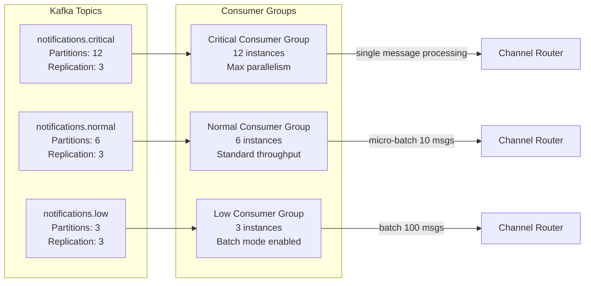

### Why Separate Topics Instead of a Single Topic with Priority Field?

This is a common interview follow-up. The answer comes down to isolation:

```
Option A: Single topic with priority field
  Problem: A flood of 10M promotional notifications fills the topic.
  Consumer lag grows. Even though CRITICAL messages are interspersed,
  the consumer must process through the backlog in order.
  OTP delivery latency goes from 2s to 30+ minutes.

Option B: Separate topics per priority (our choice)
  CRITICAL topic has 0 lag -- its dedicated consumers are always caught up.
  LOW topic has 10M message lag -- no problem, LOW SLA is 24 hours.
  OTP delivery latency stays at 2s regardless of promotional load.
```

### Consumer Scaling Strategy

```
Scaling policy per priority:

CRITICAL:
  - Always maintain 12 consumers (1:1 with partitions)
  - Auto-scale UP if consumer lag > 100 messages for 30 seconds
  - Never scale below 12 (dedicated capacity reservation)
  - CPU threshold: scale at 50% utilization (conservative for CRITICAL)

NORMAL:
  - Baseline: 6 consumers
  - Auto-scale 6 -> 12 if consumer lag > 1000 messages for 2 minutes
  - Scale down when lag < 100 for 10 minutes
  - CPU threshold: scale at 70% utilization

LOW:
  - Baseline: 3 consumers
  - Auto-scale 3 -> 6 if consumer lag > 100,000 messages
  - Scale down when lag < 10,000 for 30 minutes
  - During peak events (flash sale), LOW consumers can be scaled to 0
    to give all resources to CRITICAL/NORMAL (shed load gracefully)
```

### Partition Key Design

```
Partition key: user_id

Why user_id?
  - Per-user ordering: "Order Dispatched" arrives before "Order Delivered"
  - Frequency cap enforcement: all notifications for a user hit the same
    consumer, enabling in-memory frequency counting as a fast path
  - Cache locality: user preferences are cached per consumer instance

Trade-off: Hot partitions
  - A celebrity with millions of followers might generate a burst targeting
    many different user_ids, but individual users rarely get bursts
  - If a single user_id generates too many notifications (e.g., a promotional
    segment query targeting one user repeatedly), the frequency cap catches it
```

---

## 3.2 Template Engine Internals

The same event (e.g., `order.delivered`) needs different rendering per channel.
A push notification is ~100 characters; an email is a full HTML page; an SMS is
capped at 160 characters.

### Template Rendering Pipeline (Detailed)

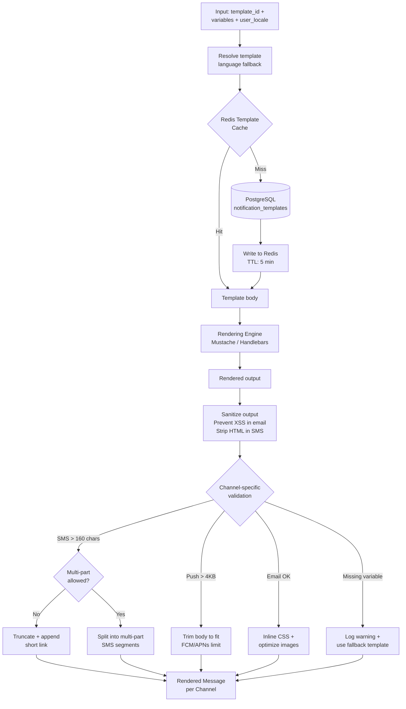

### Language Fallback Chain

```
User locale: hi-IN (Hindi, India)

Fallback order:
  1. Look for template: event=order.delivered, channel=PUSH, language=hi-IN
  2. If not found: try language=hi (Hindi, generic)
  3. If not found: try language=en (English, universal fallback)
  4. If not found: use generic fallback template for the channel

This means:
  - A new language can be partially supported: translate critical templates first
  - English is always the safety net
  - Template coverage report: "Hindi has 80% template coverage"
```

### Template Versioning and Rollout

```
Version management:

Template: tmpl_order_delivered (PUSH, English)
  v1: "Your order has been delivered!"           (original)
  v2: "Your order from {{restaurant}} is here!"  (personalized)
  v3: "{{restaurant}} order delivered. Rate now!" (with CTA)

Rollout strategy:
  1. Create v3 with is_active=false
  2. Run A/B test: 10% of users see v3, 90% see v2
  3. If v3 wins on open_rate: set v3 is_active=true, v2 is_active=false
  4. Keep v1 and v2 for rollback (never delete old versions)
```

### Template Performance Considerations

```
Template rendering benchmarks:
  Mustache simple template (push):   ~0.1 ms per render
  Handlebars with helpers (email):   ~2 ms per render
  HTML email with inline CSS:        ~5 ms per render (CSS inlining is expensive)

At 1,200 notifications/s peak:
  Push rendering: 1,200 * 0.1 ms = 120 ms of CPU per second (trivial)
  Email rendering: 360 * 5 ms = 1,800 ms of CPU per second (1.8 cores)

Optimization: Pre-render and cache popular templates with common variable
combinations (e.g., "Your OTP is {{code}}" has no user-specific context,
just the code, so it is very fast).
```

---

## 3.3 User Preferences Deep Dive

User preferences are the most critical gate in the notification pipeline. Getting
this wrong means spamming users (churn risk) or failing to deliver critical alerts.

### Preference Data Model

```sql
CREATE TABLE user_notification_preferences (
    user_id            BIGINT NOT NULL,
    channel            VARCHAR(16) NOT NULL,
    event_type         VARCHAR(128) NOT NULL,    -- '*' = all events
    enabled            BOOLEAN DEFAULT true,
    created_at         TIMESTAMP DEFAULT now(),
    updated_at         TIMESTAMP DEFAULT now(),
    PRIMARY KEY (user_id, channel, event_type)
);

CREATE TABLE user_quiet_hours (
    user_id            BIGINT PRIMARY KEY,
    enabled            BOOLEAN DEFAULT false,
    start_time         TIME NOT NULL,             -- e.g., 22:00
    end_time           TIME NOT NULL,             -- e.g., 08:00
    timezone           VARCHAR(64) NOT NULL,       -- e.g., Asia/Kolkata
    override_critical  BOOLEAN DEFAULT true        -- critical ignores quiet hours
);

CREATE TABLE user_frequency_caps (
    user_id            BIGINT NOT NULL,
    channel            VARCHAR(16) NOT NULL,
    event_category     VARCHAR(64) NOT NULL,       -- promotions, transactional, etc.
    max_count          INT NOT NULL,
    window_seconds     INT NOT NULL,                -- e.g., 3600 = per hour
    PRIMARY KEY (user_id, channel, event_category)
);
```

### Frequency Caps via Redis Sorted Sets

The frequency cap is implemented using Redis sorted sets for a sliding window:

```
-- Check if user has exceeded their push promo limit

Step 1: Remove expired entries
ZREMRANGEBYSCORE  freq:user:12345:push:promo  0  (now - window_seconds)

Step 2: Count current entries
ZCARD  freq:user:12345:push:promo

Step 3: If count < max_count, allow and record
ZADD  freq:user:12345:push:promo  <timestamp>  <notification_id>

Step 4: Set expiry on the key
EXPIRE  freq:user:12345:push:promo  <window_seconds>

All four operations are executed in a single Lua script for atomicity.
```

### Preference Hierarchy

```
Precedence order (highest to lowest):

1. Legal override:        Regulatory/security notifications ALWAYS sent
2. Critical override:     CRITICAL priority bypasses quiet hours
3. Global opt-out:        User disabled all notifications -> drop everything except legal
4. Channel opt-out:       User disabled PUSH -> drop push, try other channels
5. Event type opt-out:    User disabled promotions.weekly on email -> drop
6. Quiet hours:           22:00-08:00 IST -> schedule for 08:01 (unless critical)
7. Frequency cap:         Max 5 push/hour -> drop if exceeded
8. Default preferences:   New user defaults (transactional=all ON, promo=email only)
```

### Edge Cases

```
Edge case 1: User traveling across timezones
  - Quiet hours are evaluated in the user's configured timezone
  - If user's location changes (detected from recent IP), we do NOT auto-update
  - User must explicitly update their timezone in preferences
  - Why? Changing timezone automatically could confuse users ("Why did my quiet hours shift?")

Edge case 2: Channel fallback on preference block
  - User disabled PUSH for order.delivered, but enabled SMS and EMAIL
  - The preference engine returns [SMS, EMAIL] as allowed channels
  - If the original request only specified [PUSH], the notification is filtered
  - If the original request did not specify channels (default), we use all allowed channels

Edge case 3: Frequency cap across channels
  - Frequency caps are per-channel: 5 push/hour AND 3 SMS/hour
  - There is no cross-channel cap by default
  - A user could get 5 push + 3 SMS + 10 email in one hour
  - For aggressive campaigns, a global per-user cap can be added: max 10 total notifications/hour
```

---

## 3.4 Delivery Tracking & Retry Mechanics

### Notification Record Schema

```sql
CREATE TABLE notifications (
    notification_id    UUID PRIMARY KEY DEFAULT gen_random_uuid(),
    idempotency_key    VARCHAR(128) UNIQUE,
    user_id            BIGINT NOT NULL,
    event_type         VARCHAR(128) NOT NULL,
    priority           VARCHAR(16) NOT NULL,
    template_id        VARCHAR(64),
    template_vars      JSONB,
    scheduled_at       TIMESTAMP,
    created_at         TIMESTAMP DEFAULT now(),
    updated_at         TIMESTAMP DEFAULT now(),
    source_service     VARCHAR(64),
    trace_id           VARCHAR(128)
);

-- Indexes for common queries
CREATE INDEX idx_notifications_user ON notifications(user_id, created_at DESC);
CREATE INDEX idx_notifications_event ON notifications(event_type, created_at DESC);
CREATE INDEX idx_notifications_trace ON notifications(trace_id);
```

### Retry Strategy with Exponential Backoff

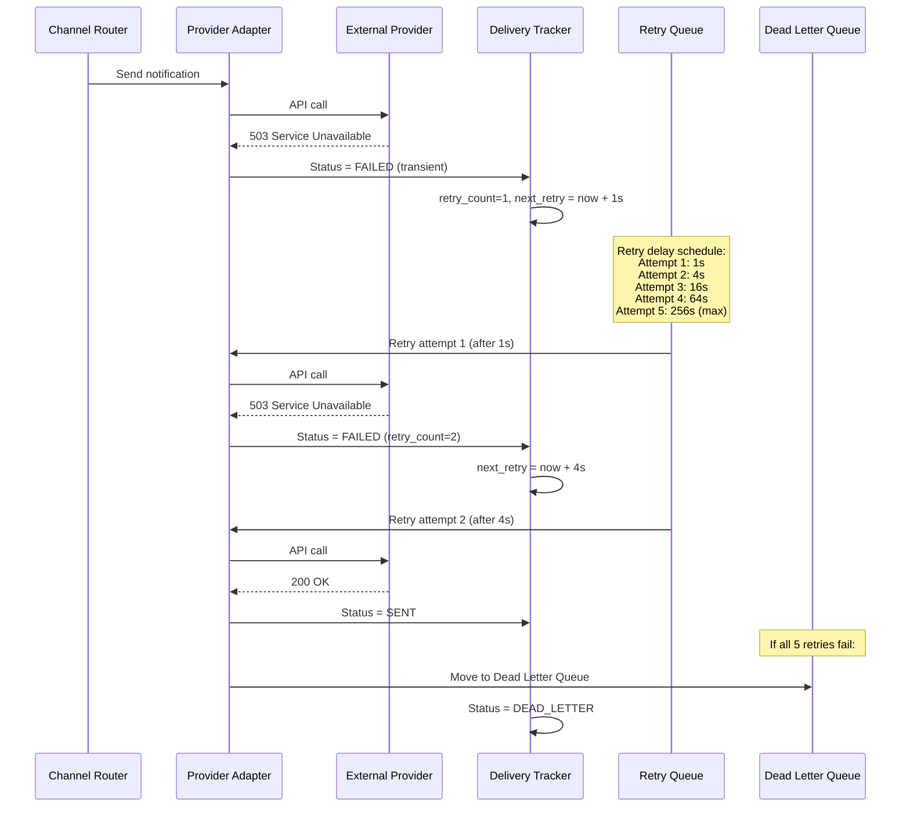

### Retry Rules per Channel

| Channel | Max Retries | Backoff Base | Jitter | Transient Errors | Permanent Errors (no retry) |
|---------|------------|-------------|--------|------------------|----------------------------|
| **Push** | 3 | 2s | +/- 25% | 5xx, timeout, rate limit | Invalid token, unregistered device |
| **SMS** | 3 | 5s | +/- 25% | 5xx, timeout, carrier error | Invalid number, blocked, landline |
| **Email** | 5 | 10s | +/- 25% | 5xx, timeout, throttle | Hard bounce, invalid address |
| **In-App** | 2 | 1s | +/- 25% | Connection lost | N/A (stored in DB, fetched on reconnect) |

### Backoff Formula

```
delay = base_delay * (multiplier ^ retry_count) * (1 + random(-jitter, +jitter))

Example for Push (base=2s, multiplier=4, jitter=0.25):
  Retry 1: 2 * 4^0 * jitter = ~2s    (range: 1.5s - 2.5s)
  Retry 2: 2 * 4^1 * jitter = ~8s    (range: 6s - 10s)
  Retry 3: 2 * 4^2 * jitter = ~32s   (range: 24s - 40s)

Jitter prevents the "thundering herd" problem: if a provider goes down and
recovers, all retries would hit at the same time without jitter.
```

### Permanent Failure Side Effects

When a permanent failure is detected, the system takes corrective action beyond
just recording the failure:

```
Permanent failure handling:

Invalid push token (FCM returns 404 / UNREGISTERED):
  -> UPDATE user_devices SET token_valid = false WHERE push_token = '...'
  -> Next time: skip this device, try other devices or channels

Hard email bounce (SendGrid reports bounce):
  -> UPDATE users SET email_valid = false WHERE user_id = ...
  -> Prevent future email sends until email is re-verified
  -> Trigger account notification: "Please update your email address"

Invalid phone number (Twilio returns 21211):
  -> Flag account for phone verification
  -> Block SMS sends until phone is re-verified

Uninstalled app (APNs feedback service reports uninstall):
  -> Mark all device tokens for this user+app as invalid
  -> Shift to email/SMS for this user
```

### Retry Queue Implementation

The retry queue can be implemented in two ways:

```
Option A: Kafka retry topics (recommended for scale)
  - notifications.retry.1s   (retry after 1 second)
  - notifications.retry.4s   (retry after 4 seconds)
  - notifications.retry.16s  (retry after 16 seconds)
  - Each topic has a consumer that sleeps/polls at the corresponding interval
  - Advantage: durable, survives restarts, Kafka handles persistence

Option B: PostgreSQL-backed retry (simpler for moderate scale)
  - Use next_retry_at column in notification_deliveries table
  - A scheduler worker polls: SELECT * FROM notification_deliveries
    WHERE status = 'RETRY_SCHEDULED' AND next_retry_at <= now()
  - Advantage: no extra Kafka topics, single source of truth

Our choice: Kafka retry topics (at Uber scale, polling DB is too expensive)
```

---

## 3.5 Rate Limiting Deep Dive

### Redis Sliding Window Implementation (Lua Script)

```
-- Per-user rate limit check (executed atomically in Redis)
local key = "rate:" .. user_id .. ":" .. channel
local window = tonumber(ARGV[1])       -- e.g., 3600 for 1 hour
local limit = tonumber(ARGV[2])        -- e.g., 5
local now = tonumber(ARGV[3])

-- Remove expired entries
redis.call('ZREMRANGEBYSCORE', key, 0, now - window)

-- Count current entries
local count = redis.call('ZCARD', key)

if count >= limit then
    return 0  -- RATE LIMITED
end

-- Add new entry
redis.call('ZADD', key, now, ARGV[4])  -- ARGV[4] = notification_id
redis.call('EXPIRE', key, window)
return 1  -- ALLOWED
```

### Per-Provider Token Bucket

```
Per-provider rate limiting uses a token bucket algorithm:

FCM token bucket:
  Capacity:      500 tokens (500 msg/s)
  Refill rate:   500 tokens/second
  Implementation: Redis key "provider:fcm:tokens"

When sending:
  1. Attempt to decrement token count: DECR provider:fcm:tokens
  2. If count >= 0: send immediately
  3. If count < 0: queue the message, retry in ceil(1/refill_rate) seconds

Token refill:
  A background process runs every 100ms:
  INCRBY provider:fcm:tokens (500 / 10)  -- add 50 tokens per 100ms
  Cap at maximum: if tokens > 500, set to 500
```

### Critical Notification Priority in Provider Bucket

```
Provider bucket allocation:
  FCM 500 msg/s total:
    Critical: reserved 100 msg/s (always available for CRITICAL)
    Normal:   shared 400 msg/s (preempted by Critical overflow)
    Low:      shared 400 msg/s (preempted by Normal and Critical)

Implementation:
  Two token buckets per provider:
    provider:fcm:critical  (capacity: 100, refill: 100/s)
    provider:fcm:shared    (capacity: 400, refill: 400/s)

  CRITICAL notification:
    Try critical bucket first -> if empty, borrow from shared bucket
  NORMAL notification:
    Use shared bucket only
  LOW notification:
    Use shared bucket only, yield if shared bucket < 50% capacity

This ensures OTPs always have capacity even during promotional blast.
```

---

## 3.6 Deduplication Mechanics

### Multi-Layer Deduplication

Deduplication happens at three layers:

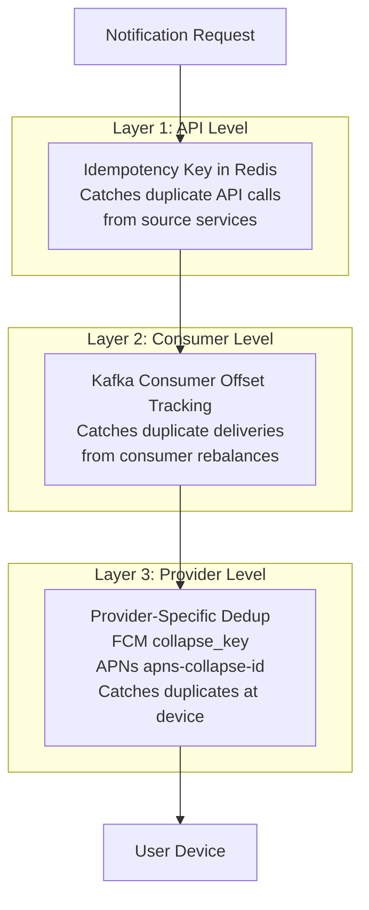

### Idempotency Key TTL Strategy

```
Event type              TTL           Reasoning
----------              ---           ---------
OTP                     10 minutes    OTPs expire quickly; short TTL saves Redis memory
Order updates           24 hours      Orders can have delayed events
Promotions              7 days        Weekly promos should not repeat within the week
Payment receipts        30 days       Month-end reconciliation could trigger duplicates
Account security        24 hours      Password reset links expire in 24 hours
```

### Provider-Level Collapse Keys

```
FCM collapse_key:
  - If two notifications share the same collapse_key, the second replaces
    the first on the device (if the first was not yet read)
  - Use case: "Driver is 4 minutes away" replaces "Driver is 5 minutes away"
  - collapse_key = "trip_{trip_id}_eta"

APNs apns-collapse-id:
  - Same concept: later notification replaces earlier one
  - Limit: one collapse-id per notification, max 64 bytes

This is NOT a substitute for server-side dedup -- it is a complementary mechanism
that improves UX by preventing notification stacking on the device.
```

---

## 3.7 Provider Failover & Circuit Breaker

External providers are a single point of failure. The system must handle outages
gracefully without losing notifications.

### Failover Architecture

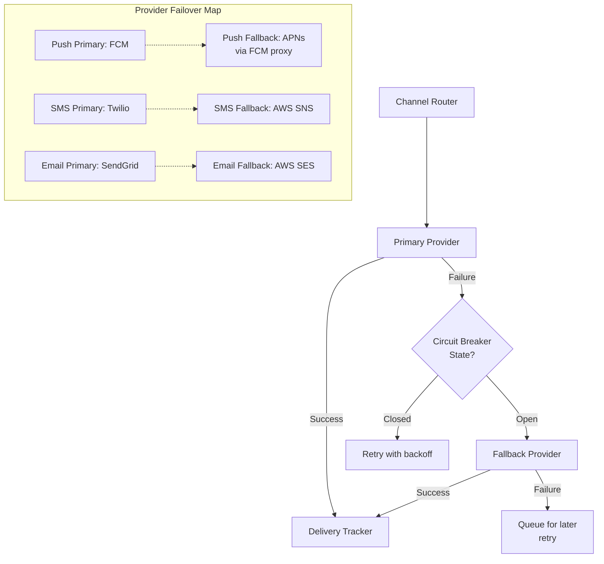

### Circuit Breaker State Machine

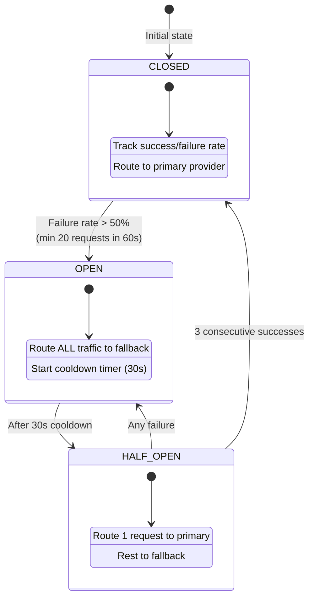

### Circuit Breaker Configuration

```
Circuit breaker thresholds per provider:

FCM:
  failure_rate_threshold:  50%
  min_requests_in_window:  20
  window_duration:         60 seconds
  cooldown_duration:       30 seconds
  success_count_to_close:  3

Twilio:
  failure_rate_threshold:  30%    (lower -- SMS is expensive to fail)
  min_requests_in_window:  10
  window_duration:         60 seconds
  cooldown_duration:       60 seconds  (longer -- SMS provider recovery is slower)
  success_count_to_close:  5

SendGrid:
  failure_rate_threshold:  50%
  min_requests_in_window:  20
  window_duration:         120 seconds
  cooldown_duration:       30 seconds
  success_count_to_close:  3
```

### Cross-Channel Failover

Beyond provider failover (FCM -> APNs), the system supports cross-channel failover:

```
Scenario: User has push enabled, but their device token is invalid.

Channel failover chain:
  1. Try PUSH -> fails (invalid token, permanent error)
  2. Mark push token invalid
  3. Check user preferences: SMS enabled? -> try SMS
  4. SMS succeeds -> record delivery via SMS

This requires the Channel Router to maintain a fallback channel order per
user and event type:
  Critical events: PUSH -> SMS -> EMAIL (ensure delivery)
  Normal events:   PUSH -> EMAIL (avoid SMS cost)
  Low events:      PUSH only (no fallback for promos)
```

---

## 3.8 Multi-Region Architecture

For a global platform like Uber, notifications must be sent from the region closest
to the user (and closest to the provider's ingest point).

```mermaid
graph TB
    subgraph Region: India -- Mumbai
        NS_IN[Notification Service]
        K_IN[Kafka Cluster]
        DB_IN[(PostgreSQL)]
        PA_IN[Provider Adapters]
    end

    subgraph Region: US -- Virginia
        NS_US[Notification Service]
        K_US[Kafka Cluster]
        DB_US[(PostgreSQL)]
        PA_US[Provider Adapters]
    end

    subgraph Region: EU -- Frankfurt
        NS_EU[Notification Service]
        K_EU[Kafka Cluster]
        DB_EU[(PostgreSQL)]
        PA_EU[Provider Adapters]
    end

    subgraph Global Layer
        GR[Global Router<br/>Route by user region]
        CDB[(CockroachDB / Spanner<br/>User Preferences<br/>Global Replicated)]
        TMPL[(Template Store<br/>S3 Cross-Region Replicated)]
    end

    GR --> NS_IN & NS_US & NS_EU
    CDB -.->|replicate| DB_IN & DB_US & DB_EU
    TMPL -.->|replicate| NS_IN & NS_US & NS_EU
```

### What Gets Replicated vs. What Stays Local

| Data | Replication Strategy | Reason |
|------|---------------------|--------|
| **User preferences** | Globally replicated (CockroachDB/Spanner) | User traveling from India to US needs preferences honored |
| **Templates** | Cross-region replicated (S3 + CDN) | Read-heavy, rarely updated, needed in all regions |
| **Notification records** | Region-local only | Only queried in originating region; no cross-region reads |
| **Delivery tracking** | Region-local only | Provider callbacks arrive in the sending region |
| **Kafka topics** | Region-local only | Cross-region Kafka adds latency; not justified for notifications |
| **Redis (rate limits, dedup)** | Region-local with global coordination | Per-user rate limits need local Redis for speed; global coordination for cross-region users |
| **Analytics (ClickHouse)** | Federated querying across regions | Global dashboards query all regions; no full replication |

### Region Routing Logic

```
How to determine which region processes a notification:

1. User's registered region (from user profile): primary routing key
2. If user is traveling: still route to home region (preferences are there)
3. Marketing service in India targeting Indian users: route to Mumbai
4. Marketing service in US targeting US users: route to Virginia

Exception: For ultra-low-latency (OTP), route to the region closest to the
provider's API endpoint. FCM and APNs have global endpoints, but SMS providers
(Twilio) have regional endpoints that are faster when called from nearby.
```

---

## 3.9 Analytics Pipeline

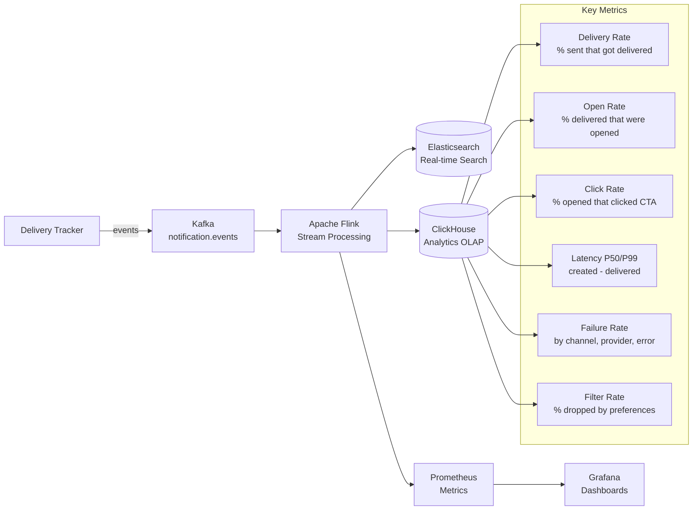

### Metrics That Matter

| Metric | Formula | Target | Alert Threshold |
|--------|---------|--------|----------------|
| **Delivery rate** | delivered / sent | > 95% for push, > 98% for email | < 90% for 5 min |
| **Open rate** | opened / delivered | > 40% for push, > 20% for email | Trend only |
| **Click rate** | clicked / opened | > 10% for push, > 5% for email | Trend only |
| **Critical latency P99** | delivered_at - created_at | < 30s | > 45s |
| **Normal latency P99** | delivered_at - created_at | < 5 min | > 10 min |
| **Failure rate** | failed / total | < 2% | > 5% for 5 min |
| **Dead letter count** | count of DLQ entries | 0 ideally | > 100/hour |
| **Filter rate** | filtered / received | ~20-40% for promo | Trend only |
| **Preference opt-out rate** | opt-outs / users | < 5% monthly | > 10% monthly |

### Analytics Event Schema

Every notification lifecycle event is published to Kafka for analytics:

```
{
  "event_id": "evt_123",
  "notification_id": "notif_abc",
  "user_id": "user_12345",
  "event_type": "order.delivered",
  "channel": "PUSH",
  "provider": "fcm",
  "status": "DELIVERED",
  "priority": "CRITICAL",
  "template_id": "tmpl_order_delivered",
  "template_version": 2,
  "experiment_id": "exp_push_v2",
  "variant_id": "B",
  "latency_ms": 1842,
  "region": "ap-south-1",
  "timestamp": "2026-04-07T10:00:02Z"
}
```

### Why ClickHouse for Analytics?

```
ClickHouse vs. alternatives:

PostgreSQL:  Can handle 10M rows/day, but aggregate queries over months of data
             (billions of rows) are too slow. Columnar storage is needed.

Elasticsearch: Good for search/filtering individual notifications (support tool),
               but not optimized for aggregate analytics (SUM, AVG, percentiles).

ClickHouse:  Columnar OLAP database. Handles 10B+ rows. Aggregate queries
             (delivery rate by channel by day for last 90 days) complete in < 1s.
             Perfect for dashboards and reporting.

BigQuery/Redshift: Also work, but ClickHouse is self-hosted and avoids per-query costs.
```

---

## 3.10 A/B Testing Framework

Notification A/B testing helps optimize open rates, click rates, and user engagement.

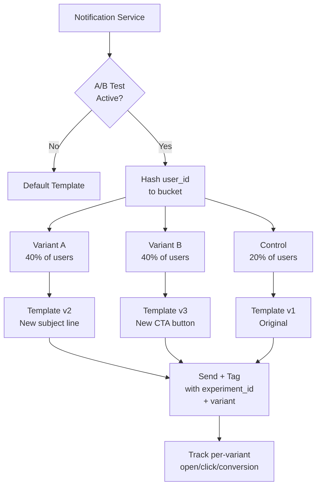

### What Can Be A/B Tested

- Template copy (subject line, body text, CTA wording)
- Send time (morning vs. evening vs. user-timezone optimized)
- Channel selection (push-only vs. push+email)
- Frequency (daily digest vs. real-time per-event)
- Rich media (with image vs. without image in push)
- Notification grouping (individual vs. batched)

### A/B Test Configuration

```json
{
  "experiment_id": "exp_promo_subject_2026q2",
  "event_type": "promotions.weekly",
  "variants": [
    { "id": "A", "template_id": "tmpl_promo_v2", "weight": 40 },
    { "id": "B", "template_id": "tmpl_promo_v3", "weight": 40 },
    { "id": "control", "template_id": "tmpl_promo_v1", "weight": 20 }
  ],
  "metrics": ["open_rate", "click_rate", "order_conversion"],
  "start_date": "2026-04-07",
  "end_date": "2026-04-21",
  "min_sample_size": 50000,
  "statistical_significance": 0.95
}
```

### Bucketing Algorithm

```
Bucketing must be:
  1. Deterministic: same user always gets same variant
  2. Uniform: even distribution across variants
  3. Independent: different experiments for same user are independent

Algorithm:
  bucket = hash(user_id + experiment_id) % 100

  If bucket < 40: Variant A
  If bucket < 80: Variant B
  Else:           Control

Using experiment_id in the hash ensures that the same user might be in
Variant A for experiment_1 but Control for experiment_2.
```

---

## 3.11 Monitoring & Alerting

### Monitoring Dashboard Layout

```
Grafana Dashboard: "Notification System Health"

Row 1: Traffic Overview
  - Total notifications/second (by priority)
  - Kafka consumer lag (by topic)
  - Active connections to providers

Row 2: Delivery Health
  - Delivery rate by channel (push, SMS, email, in-app)
  - Failure rate by error type (transient vs. permanent)
  - Dead letter queue depth

Row 3: Latency
  - P50/P95/P99 latency: created -> delivered (by priority)
  - Provider API latency by provider
  - Template rendering latency

Row 4: User Impact
  - Preference filter rate by event type
  - Rate-limited notifications count
  - Dedup hit rate

Row 5: Provider Health
  - Circuit breaker state per provider (CLOSED/OPEN/HALF_OPEN)
  - Provider error rates
  - Provider quota usage (% of rate limit consumed)
```

### Alert Configuration

```
PagerDuty (immediate page):
  - Critical notification P99 latency > 45 seconds for 2 minutes
  - Delivery failure rate > 10% for 5 minutes (any channel)
  - Kafka consumer lag > 10,000 on critical topic for 1 minute
  - Circuit breaker OPEN for any primary provider

Slack (warning channel):
  - Normal notification P99 latency > 10 minutes
  - Dead letter queue > 100 entries in the last hour
  - Redis memory usage > 80%
  - PostgreSQL replication lag > 30 seconds

Daily report (email):
  - Delivery rate summary by channel
  - Top 10 failed event types
  - A/B test status updates
  - Cost report (SMS/email spending)
```

### Distributed Tracing

Every notification carries a `trace_id` from the source service through the
entire pipeline. This enables end-to-end debugging:

```
Trace: abc-123-def
  Span 1: order-service publishes event         (0 ms)
  Span 2: kafka consumer receives event          (+50 ms)
  Span 3: notification-service validates          (+52 ms)
  Span 4: dedup check in Redis                   (+53 ms)
  Span 5: preference engine resolves channels     (+55 ms)
  Span 6: template engine renders                 (+57 ms)
  Span 7: enqueue to critical topic              (+58 ms)
  Span 8: channel router dequeues                (+60 ms)
  Span 9: rate limiter check                     (+61 ms)
  Span 10: FCM API call                          (+62 ms)
  Span 11: FCM response received                 (+1842 ms)
  Span 12: delivery tracker updates DB           (+1845 ms)

Total: 1845 ms from event publish to delivery confirmation
```

---

## 3.12 Real-World Scenarios

### Scenario 1: Uber Ride Request Flow

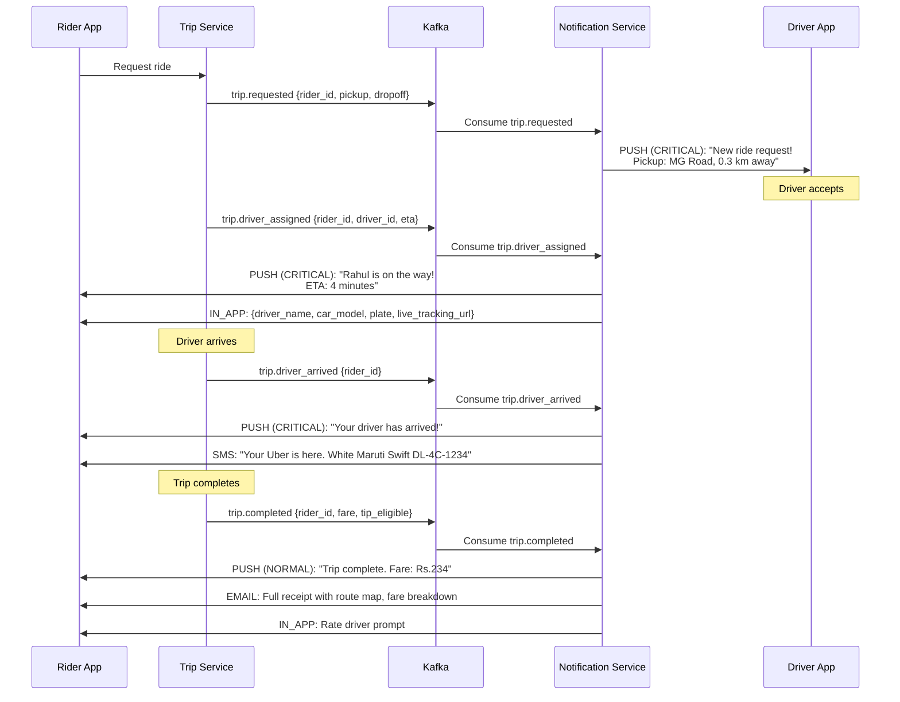

### Scenario 2: Promotional Notification with Targeting

```
Marketing Service publishes:

Event: promo.targeted_offer
Target: users WHERE last_order > 7 days AND city = "Bangalore"
Template: tmpl_comeback_offer_v2
Priority: LOW
Schedule: Send at 11:30 AM user-local-time

Notification System processing:
1. Marketing service provides user segment (list of user_ids or query)
2. Notification service iterates over segment (batched, throttled at 500/s)
3. Per user: check preferences, apply frequency cap (max 1 promo/day)
4. Template: "We miss you! Get 40% off your next order. Use code COMEBACK40"
5. A/B test: Variant A (40% off) vs Variant B (free delivery)
6. Send via PUSH + EMAIL (based on user preference)
7. Track: open rate, click rate, order conversion within 48 hours
8. Auto-stop if open rate < 1% (indicates poor targeting)
```

### Scenario 3: OTP Delivery with Failover

```
Auth Service requests OTP delivery:

Event: otp.requested
User: user_456
Priority: CRITICAL
Template: tmpl_otp_sms
Variables: { code: "847293", expires_in: "5 minutes" }
Channels: [SMS, PUSH]

Processing:
1. Dedup check: key = otp.requested:user_456:1712483200 (10-min bucket)
2. Preferences: OTP is legal-required, bypass all preference checks
3. Template: "Your Uber verification code is 847293. Expires in 5 minutes."
4. Enqueue to CRITICAL topic -> immediate processing
5. Channel Router sends to SMS adapter (primary channel for OTP)
6. Twilio API call -> Success
7. Simultaneously send push as backup (user may see push faster)
8. If SMS fails: circuit breaker checks -> fallback to AWS SNS
9. Track delivery: SMS must be delivered within 30 seconds
```

---

## 3.13 Data Model -- Complete ER Diagram

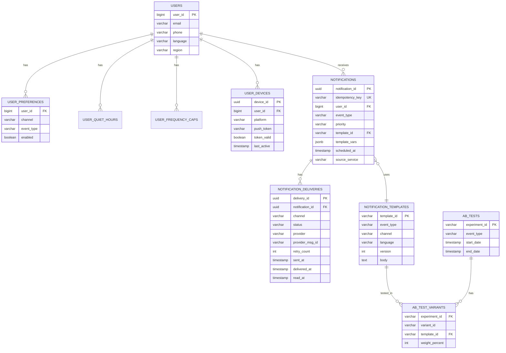

---

## 3.14 Key Trade-offs

| Decision | Option A | Option B | Our Choice | Why |
|----------|----------|----------|-----------|-----|
| **Queue technology** | Kafka | SQS/RabbitMQ | Kafka | Replay capability, high throughput, ordered per-user delivery |
| **Priority handling** | Single queue + priority field | Separate queues per priority | Separate queues | Isolation -- low priority flood never affects critical |
| **Delivery guarantee** | Exactly-once | At-least-once + idempotency | At-least-once | Exactly-once is expensive; idempotency key is simpler |
| **Template storage** | In DB | In code | In DB | Non-engineers (product/marketing) can update without deploys |
| **Preference caching** | No cache (always DB) | Redis cache + TTL | Redis + 5 min TTL | Read-heavy workload; slight staleness is acceptable |
| **Scheduling** | Cron job polling DB | Distributed delay queue | Polling for long, in-memory for short | Simplicity -- polling every 10s is good enough for > 5 min delays |
| **Analytics store** | PostgreSQL | ClickHouse | ClickHouse | Columnar OLAP for aggregate queries over billions of rows |
| **Multi-region** | Single region | Full multi-region | Multi-region | Uber operates globally; latency to providers matters |
| **Provider failover** | Manual switchover | Circuit breaker + auto-failover | Circuit breaker | Automated recovery; manual switchover is too slow for CRITICAL SLA |
| **Retry implementation** | DB-backed polling | Kafka retry topics | Kafka retry topics | More scalable; DB polling becomes a bottleneck at Uber scale |
| **Rate limiting algo** | Fixed window | Sliding window | Sliding window | More accurate; fixed window has edge-case bursts at window boundaries |
| **Template rendering** | Server-side | Client-side | Server-side | Consistent rendering across channels; no client version dependency |

---

## 3.15 Failure Modes & Mitigations

| Failure Mode | Impact | Mitigation |
|-------------|--------|-----------|
| **Kafka broker down** | Events not consumed | Kafka replication factor 3; automatic leader election |
| **FCM outage** | Push notifications delayed | Circuit breaker -> queue messages -> retry when recovered |
| **Redis down** | Rate limits, dedup broken | Redis Sentinel/Cluster for HA; degrade gracefully (allow sends without rate limiting) |
| **PostgreSQL down** | Cannot create/update records | Pg HA with streaming replication; notifications still sent (tracked in Kafka offsets) |
| **Template missing** | Cannot render message | Fallback to generic template per channel |
| **Burst of events** | Queue backlog | Auto-scale consumers; prioritize critical queue; shed low-priority load |
| **Provider rate limit hit** | 429 responses | Token bucket pre-limits requests; queue and retry |
| **Duplicate Kafka consumer** | Double send | Idempotency key in Redis catches duplicates |
| **User has no push token** | Push cannot be sent | Fall back to next preferred channel (SMS, email) |
| **Cross-region network partition** | Preferences stale | Local Redis cache serves stale prefs; CockroachDB handles partition with quorum reads |
| **Template rendering OOM** | Email templates too large | Max template size limit (100 KB); timeout per render (500 ms) |
| **Webhook endpoint down** | Missing delivery receipts | Queue webhooks; retry with backoff; reconcile batch from provider API |

### Graceful Degradation Strategy

```
When the system is under extreme load, degrade in this order:

1. Shed LOW priority: Stop consuming from notifications.low topic entirely
2. Batch NORMAL: Increase batch size from 10 to 100
3. Disable analytics: Stop publishing to notification.events topic
4. Disable A/B testing: Use default template for all users
5. Disable preference caching invalidation: Accept stale cache for longer
6. NEVER shed CRITICAL: OTP and safety notifications must always flow

This is implemented via a global feature flag system. An on-call engineer
can flip flags in order of severity.
```

---

## 3.16 Cost Optimization

| Strategy | Savings | Implementation |
|----------|---------|----------------|
| Batch LOW priority emails into daily digest | Fewer API calls to SendGrid | Aggregate events, send 1 email instead of 10 |
| Use FCM topic messaging for broadcast | One API call reaches N subscribers | For events with identical payload to many users |
| Prefer push over SMS for non-critical | $7,500/day for 1M SMS avoided | Channel selection logic: push > email > SMS |
| Template-level dedup (FCM collapse_key) | Replaces previous notification on device | "Driver ETA" updates collapse into one |
| Compress email images + CDN | Reduce S3 bandwidth + faster delivery | Optimize at template upload time |
| Region-local provider routing | Avoid cross-region egress charges | Call FCM from the closest region |
| Smart SMS segmentation | Reduce multi-part SMS costs | Aggressively shorten templates to fit 160 chars |
| Off-peak sending for LOW | Lower provider rates during off-peak | Schedule promotions for provider off-peak windows |

---

## Interview Cheat Sheet

### One-Liner Summary

> Event-driven, priority-queued, multi-channel notification platform with
> user-preference gating, template rendering, at-least-once delivery, and
> per-provider failover.

### Key Numbers to Remember

```
10M notifications/day = ~120/s average, ~1,200/s peak
Notification payload  = ~2 KB average
Critical SLA          = < 30 seconds end-to-end
Push limit (FCM)      = 500 msg/s per project
SMS cost (Twilio)     = $0.0075/msg (India domestic)
Email cost (SES)      = $0.10/1000 emails
Retry backoff         = 1s, 4s, 16s, 64s, 256s (exponential with jitter)
Redis ops/notification = ~5 (dedup + prefs + rate limit + frequency cap)
```

### Architecture in One Sentence per Component

```
Event Sources       Publish domain events to Kafka (loose coupling)
Notification Svc    Validates, deduplicates, resolves preferences, renders templates
Priority Queues     Separate Kafka topics per priority level (critical/normal/low)
Channel Router      Routes to correct provider adapter per channel
Provider Adapters   Thin wrappers around FCM, APNs, Twilio, SendGrid
Rate Limiter        Redis sliding window per-user + token bucket per-provider
Delivery Tracker    State machine tracking created -> delivered -> read
Retry / DLQ         Exponential backoff with max retries, dead-letter for failures
Scheduler           Polling-based for future sends, cron for recurring
Analytics           Stream to ClickHouse via Flink for open/click/delivery metrics
```

### Common Follow-Up Questions

**Q: How do you handle a provider outage?**
A: Circuit breaker detects sustained failures (>50% failure rate in 60s window).
Traffic routes to fallback provider. When primary recovers, half-open state
tests with one request, and 3 consecutive successes restore full traffic.

**Q: How do you prevent spamming a user?**
A: Three layers -- (1) user opt-out preferences, (2) frequency caps via Redis
sliding window, (3) quiet hours with timezone awareness. Critical notifications
bypass user-level limits but not provider limits.

**Q: How do you handle 100M promotional notifications at once?**
A: Batch into the LOW priority queue. Consumers process in batches of 100. Rate
limit at the provider level. Spread sends over a time window (e.g., 2 hours).
Use FCM topic messaging for common payloads. Auto-stop if engagement is < 1%.

**Q: Why at-least-once instead of exactly-once?**
A: Exactly-once across distributed systems (Kafka + external provider) is extremely
expensive. At-least-once with idempotency keys at every stage (API level, consumer
level, provider level) is simpler and achieves the same user-facing result --
no duplicate notifications received.

**Q: How do you track if a push notification was actually read?**
A: FCM/APNs provide delivery receipts via webhooks. For "read" tracking, the
client app reports back when the notification is tapped/opened, updating the
delivery record via a lightweight API call (`POST /notifications/{id}/read`).

**Q: How would you handle notification preferences for a new user?**
A: Default preferences are set per event category (transactional = all channels ON,
promotional = email only ON). Users can customize from settings. Regulatory/safety
notifications are always enabled and cannot be turned off.

**Q: What if the user is offline when a push is sent?**
A: FCM/APNs handle this natively -- they queue the push and deliver when the device
comes online (configurable TTL, default 4 weeks for FCM). For time-sensitive
notifications (OTP), set a short TTL (5 minutes) so expired pushes are dropped.

**Q: How do you test changes to the notification system safely?**
A: (1) Shadow mode: process notifications through the new pipeline but do not
actually send to providers. Compare output with production. (2) Canary deployment:
route 5% of traffic to new version, monitor delivery rates. (3) A/B testing for
template changes. (4) Load testing with replay from Kafka.

---

## Appendix: Full System Flow (Consolidated Mermaid)

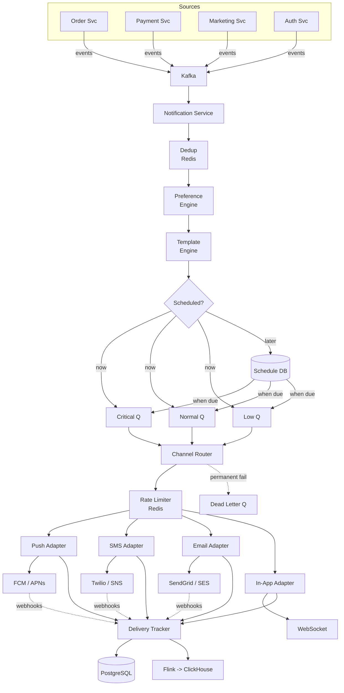

---

*This design handles Uber-scale notification delivery: 10M+ notifications/day across
four channels with priority-based queuing, user preference gating, template rendering,
at-least-once delivery guarantees, and full observability. The event-driven architecture
ensures loose coupling between product teams and the notification infrastructure.*
