# Design a Notification System -- High-Level Design

> This file covers the architecture, all major components, sequence flows, and the
> rationale for event-driven design. For requirements and estimation, see
> [requirements-and-estimation.md](./requirements-and-estimation.md). For deep dives
> on scaling, see [deep-dive-and-scaling.md](./deep-dive-and-scaling.md).

---

## Table of Contents

1. [Architecture Overview](#21-architecture-overview)
2. [Component Responsibilities](#22-component-responsibilities)
3. [Notification Service (Entry Point)](#23-notification-service-entry-point)
4. [Dedup Manager](#24-dedup-manager)
5. [Preference Engine](#25-preference-engine)
6. [Template Engine](#26-template-engine)
7. [Scheduler](#27-scheduler)
8. [Priority Queues](#28-priority-queues)
9. [Channel Router](#29-channel-router)
10. [Provider Adapters](#210-provider-adapters)
11. [Delivery Tracker](#211-delivery-tracker)
12. [Rate Limiter](#212-rate-limiter)
13. [Dead Letter Queue](#213-dead-letter-queue)
14. [Core Sequence -- End-to-End Flow](#214-core-sequence----end-to-end-flow)
15. [Event-Driven Architecture -- Why?](#215-event-driven-architecture----why)
16. [Data Stores Overview](#216-data-stores-overview)

---

## 2.1 Architecture Overview

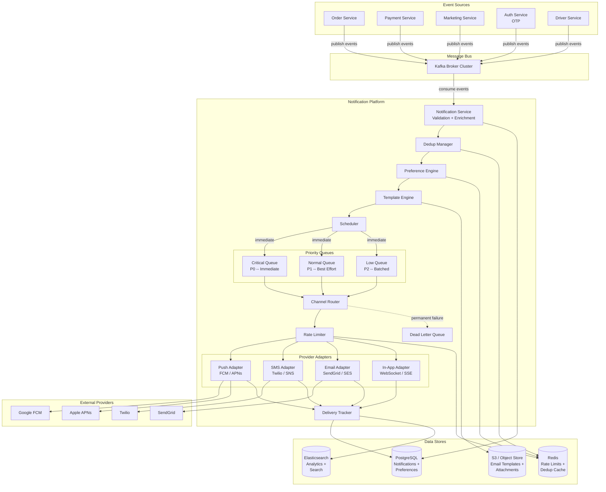

### Pipeline Summary

The notification pipeline is a linear chain of stateless processors. Each step
enriches or filters the notification, and the message flows through:

```
Event Source -> Kafka -> Notification Service -> Dedup -> Preferences -> Template
-> Scheduler -> Priority Queue -> Channel Router -> Rate Limiter -> Provider Adapter
-> External Provider -> Delivery Tracker
```

This linear design means each component has a single responsibility and can be
scaled, deployed, and tested independently.

---

## 2.2 Component Responsibilities

| Component | Responsibility | Stateless? | Scale Strategy |
|-----------|---------------|:----------:|----------------|
| **Notification Service** | Entry point -- validates payload, enriches with user data, fans out to pipeline | Yes | Horizontal pod autoscaler |
| **Dedup Manager** | Checks idempotency key against Redis to prevent duplicate processing | Yes | Scales with Notification Service |
| **Preference Engine** | Filters channels based on user preferences, quiet hours, frequency caps | Yes | Horizontal, cache-heavy |
| **Template Engine** | Renders template_id + variables into channel-specific messages | Yes | Horizontal, template cache in Redis |
| **Scheduler** | Handles scheduled/recurring notifications, enqueues at the right time | Stateful | Leader election, DB-backed |
| **Priority Queues** | Separate queues per priority -- critical gets dedicated consumers | N/A (Kafka) | Add partitions + consumers |
| **Channel Router** | Routes rendered messages to the correct provider adapter(s) | Yes | Horizontal pod autoscaler |
| **Rate Limiter** | Enforces per-user and per-provider rate limits | Yes | Redis-backed, co-located with Router |
| **Provider Adapters** | Thin wrappers around external APIs (FCM, Twilio, SendGrid, etc.) | Yes | Per-channel horizontal scaling |
| **Delivery Tracker** | Tracks full notification lifecycle, handles callbacks and webhooks | Yes | Horizontal, async DB writes |
| **Dead Letter Queue** | Captures permanently failed notifications for manual review | N/A (Kafka) | Separate topic, low volume |

---

## 2.3 Notification Service (Entry Point)

The Notification Service is the gateway into the platform. It consumes events from
Kafka and orchestrates the processing pipeline.

### Responsibilities

1. **Consume Kafka events** from all source service topics
2. **Validate the payload** -- check required fields, validate event_type against catalog
3. **Create a notification record** in PostgreSQL with status=CREATED
4. **Propagate trace_id** for distributed tracing through the entire pipeline
5. **Invoke the pipeline** -- dedup, preferences, template, schedule, enqueue

### Internal Processing Flow

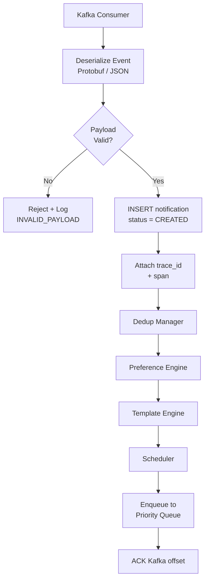

### Key Design Decisions

- **Persist before processing**: The notification record is written to PostgreSQL
  before any processing begins. This ensures that even if the service crashes
  mid-pipeline, the notification is recorded and can be retried.
- **Kafka offset commit after enqueue**: The Kafka offset is committed only after
  the notification is successfully enqueued to the priority queue. This provides
  at-least-once semantics -- if the service crashes before committing, Kafka will
  redeliver the event (caught by dedup).
- **Synchronous pipeline, async delivery**: The pipeline from Kafka consume to
  priority queue enqueue is synchronous within a single consumer thread. Actual
  delivery to providers is async (handled by the Channel Router consumers).

---

## 2.4 Dedup Manager

Prevents the same notification from being processed twice. In a distributed system
with Kafka consumer rebalances, retries, and at-least-once semantics, duplicates
are expected.

### How It Works

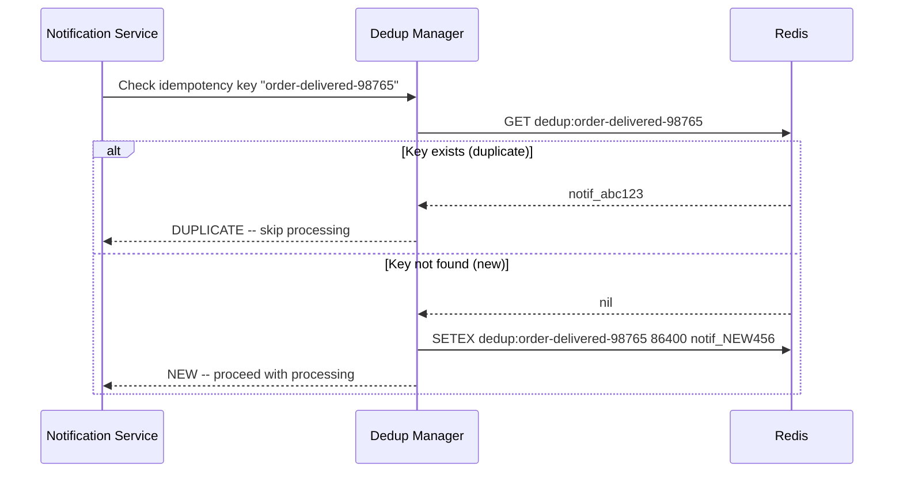

### Idempotency Key Strategies

The caller provides the idempotency key. If they do not, the system generates one
based on event_type + entity_id:

```
Caller-provided:     X-Idempotency-Key header (preferred)
Auto-generated:      {event_type}:{entity_id}:{timestamp_bucket}

Examples:
  order.delivered:ORD-98765            -- one delivery notification per order
  otp.requested:user_123:1712483200    -- one OTP per 10-minute bucket
  promo.weekly:user_123:2026-W15       -- one weekly promo per user per week
```

### Redis Key Design

```
Key:     dedup:{idempotency_key}
Value:   notification_id (for returning to caller on duplicate)
TTL:     24 hours (configurable per event_type)
```

The 24-hour TTL is a balance between catching late duplicates and limiting Redis
memory usage. For events like OTP (which repeat frequently), a shorter TTL of
10 minutes is used.

---

## 2.5 Preference Engine

The preference engine is the most critical filter in the pipeline. It determines
which channels (if any) a notification should be sent to for a given user.

### Resolution Logic

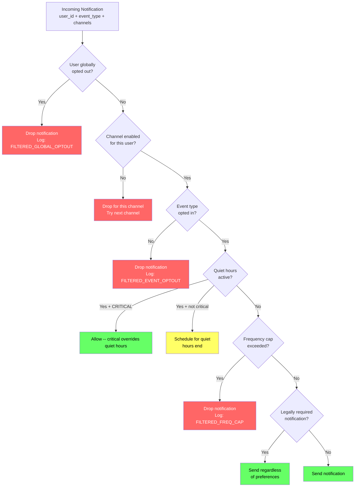

### Caching Strategy

User preferences are read on every notification -- this is the hottest read path.

```
Cache layer:     Redis (5-minute TTL)
Key pattern:     prefs:{user_id}
Value:           Serialized preference object (JSON or Protobuf)
Invalidation:    On PUT /notification-preferences, delete key + publish invalidation event
Fallback:        On cache miss, read from PostgreSQL, write to cache

Read path:
  1. Check Redis: prefs:user_12345
  2. Cache hit -> use cached prefs (fast path, ~1 ms)
  3. Cache miss -> query PostgreSQL (slow path, ~10 ms) -> write to cache
```

Cache hit rate target: >95%. Given that most notifications go to active users who
already have cached preferences, this is achievable.

### Default Preferences for New Users

New users who have never customized preferences get system defaults:

```
Transactional events (orders, payments):  All channels ON
Account security (password reset, login): All channels ON, cannot be disabled
Promotions:                                Email ON, Push OFF, SMS OFF
Social (friend requests, mentions):       Push ON, Email OFF, SMS OFF
```

---

## 2.6 Template Engine

The template engine transforms a template ID + variables into a rendered message
tailored to each channel. The same event produces different output for push, SMS,
email, and in-app.

### Template Storage Schema

```sql
CREATE TABLE notification_templates (
    template_id        VARCHAR(64) PRIMARY KEY,
    event_type         VARCHAR(128) NOT NULL,
    channel            VARCHAR(16) NOT NULL,    -- PUSH | SMS | EMAIL | IN_APP
    language           VARCHAR(8) NOT NULL,      -- en, hi, kn, ta, etc.
    version            INT NOT NULL DEFAULT 1,
    subject            TEXT,                      -- email subject line
    body               TEXT NOT NULL,             -- template body with {{variables}}
    metadata           JSONB,                     -- deep_link, image_url, etc.
    is_active          BOOLEAN DEFAULT true,
    created_at         TIMESTAMP DEFAULT now(),
    updated_at         TIMESTAMP DEFAULT now(),
    UNIQUE(event_type, channel, language, version)
);
```

### Channel-Specific Template Examples for `order.delivered`

```
-- PUSH (short, actionable, max ~100 chars)
Template: "Your order from {{restaurant_name}} has arrived!"
Rendered:  "Your order from Burger Palace has arrived!"

-- SMS (160 char limit, no emojis, include short link)
Template: "Uber Eats: Your order #{{order_id}} from {{restaurant_name}} delivered
           at {{time}}. Rate: {{rating_link}}"
Rendered:  "Uber Eats: Your order #98765 from Burger Palace delivered at 12:34PM.
           Rate: ubr.to/r8"

-- EMAIL (rich HTML with images, tables, CTAs)
Template: Full HTML template with header, order summary table, map image, CTA button
Rendered:  Complete branded email with order details, route map, fare breakdown

-- IN_APP (structured JSON for rich UI rendering)
Template: {
  "title": "Order Delivered",
  "body": "Your order from {{restaurant_name}} is here!",
  "image_url": "{{restaurant_logo_url}}",
  "deep_link": "uber://orders/{{order_id}}",
  "actions": [{"label": "Rate Order", "link": "uber://rate/{{order_id}}"}]
}
```

### Rendering Pipeline

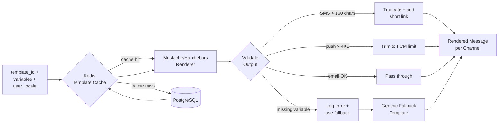

### Key Design Decisions

1. **Templates are versioned** -- rolling out a new email design? Create version 2,
   A/B test it, then promote to default. Old version stays for rollback.
2. **Multi-language support** -- templates stored per language. Fallback chain:
   `hi-IN` -> `hi` -> `en`. User's language resolved from preferences.
3. **Template caching** -- cached in Redis with 5-minute TTL. On template update,
   publish a cache invalidation event to all instances.
4. **Channel-specific validation** -- SMS must be under 160 characters (or multi-part
   at higher cost). Push payloads: FCM = 4KB, APNs = 4KB. Email: under 100KB.
5. **Fallback templates** -- if a template is missing for the user's language, fall
   back to English. If the template itself is missing, use a generic channel-specific
   fallback ("You have a new notification from Uber").

---

## 2.7 Scheduler

Handles three types of time-based delivery:

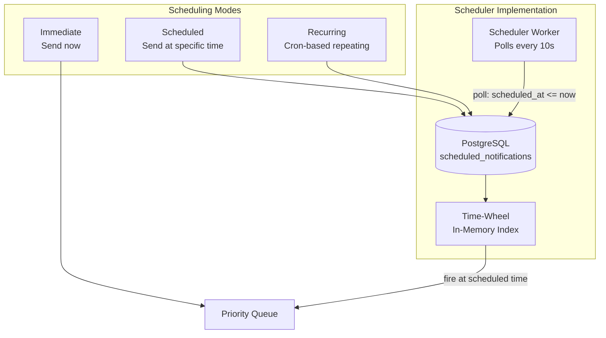

### Scheduling Approach

1. **Short delays (< 5 minutes)**: In-memory delay queue (e.g., Java
   `ScheduledExecutorService` or Go `time.AfterFunc`). Fast, no DB overhead.
2. **Long delays (> 5 minutes)**: Persist to `scheduled_notifications` table.
   A scheduler worker polls every 10 seconds for due notifications.
3. **Recurring**: Store a cron expression. After each firing, compute the next
   occurrence and update `scheduled_at`.
4. **Timezone handling**: All `scheduled_at` values stored in UTC. Converted from
   user timezone at creation time. DST transitions recomputed daily.

### Scheduled Notifications Table

```sql
CREATE TABLE scheduled_notifications (
    schedule_id        UUID PRIMARY KEY,
    notification_id    UUID REFERENCES notifications(notification_id),
    scheduled_at       TIMESTAMP NOT NULL,
    recurrence_cron    VARCHAR(64),          -- NULL = one-time, "0 9 * * MON" = weekly
    recurrence_end     TIMESTAMP,
    timezone           VARCHAR(64),
    status             VARCHAR(16) DEFAULT 'PENDING',  -- PENDING, FIRED, CANCELLED
    created_at         TIMESTAMP DEFAULT now()
);

CREATE INDEX idx_scheduled_pending ON scheduled_notifications(scheduled_at)
    WHERE status = 'PENDING';
```

---

## 2.8 Priority Queues

Different notifications have vastly different urgency. An OTP must arrive in
seconds; a weekly promotion can wait hours.

### Priority Classification

| Priority | Examples | SLA | Processing Mode |
|----------|----------|-----|----------------|
| **CRITICAL (P0)** | OTP, trip updates, payment alerts, emergency | < 30 seconds | Dedicated consumers, no batching |
| **NORMAL (P1)** | Order updates, delivery tracking, receipts | < 5 minutes | Standard consumers |
| **LOW (P2)** | Promotions, weekly digests, recommendations | < 24 hours | Batched, time-windowed |

### Queue Architecture

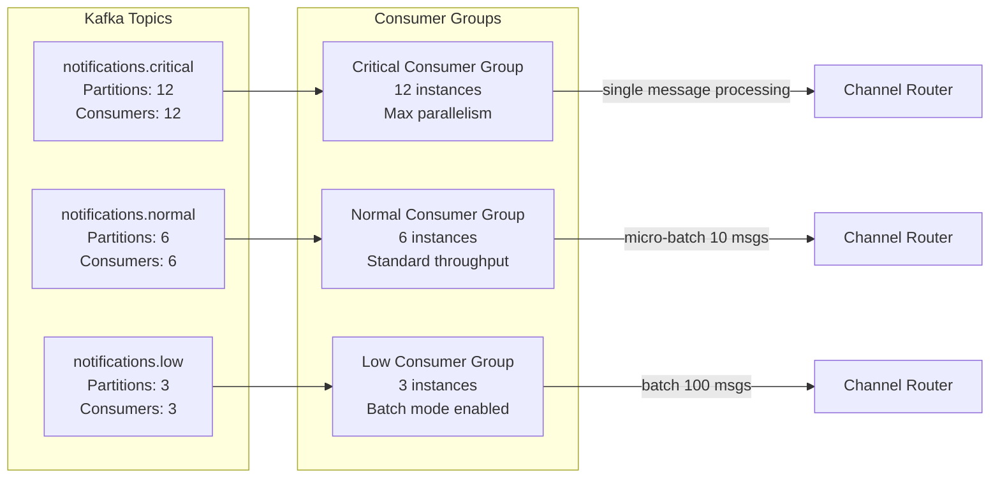

### Key Design Decisions

1. **Separate Kafka topics per priority** -- not a single topic with priority field.
   A flood of promotional (LOW) notifications never delays OTPs (CRITICAL).
2. **Consumer scaling is independent** -- critical queue gets 4x the consumers.
   Auto-scale critical consumers during peak without touching low-priority.
3. **Batching strategy**:
   - Critical: process each message individually, commit offset per message
   - Normal: micro-batch of 10, commit after batch
   - Low: batch of 100 or 5-second window (whichever comes first)
4. **Partition key**: Use `user_id` as partition key to ensure per-user ordering
   (prevents "Order Delivered" arriving before "Order Dispatched").

---

## 2.9 Channel Router

The channel router takes a rendered notification and dispatches it to the correct
provider adapter(s). A single notification can fan out to multiple channels.

### Routing Logic

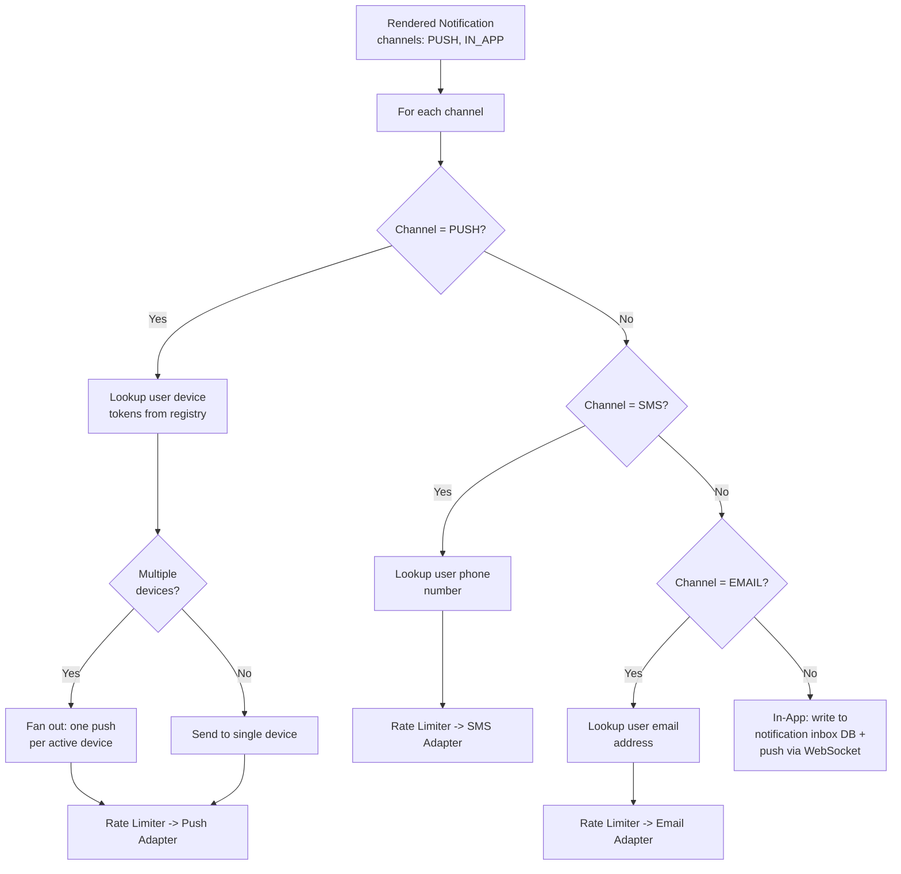

### Device Token Registry

For push notifications, the system needs to know which devices a user has and their
push tokens:

```sql
CREATE TABLE user_devices (
    device_id          UUID PRIMARY KEY,
    user_id            BIGINT NOT NULL,
    platform           VARCHAR(16) NOT NULL,      -- ios, android, web
    push_token         VARCHAR(512),
    token_valid        BOOLEAN DEFAULT true,
    app_version        VARCHAR(16),
    last_active_at     TIMESTAMP,
    created_at         TIMESTAMP DEFAULT now(),
    updated_at         TIMESTAMP DEFAULT now()
);

CREATE INDEX idx_devices_user ON user_devices(user_id) WHERE token_valid = true;
```

A user with both an iPhone and an Android tablet receives push notifications on
both active devices. The router fans out the push to each device with a valid token.

---

## 2.10 Provider Adapters

Provider adapters are thin wrappers around external provider APIs. They handle
authentication, payload formatting, and response parsing specific to each provider.

### Adapter Interface (Pseudocode)

```
interface ProviderAdapter {
    send(message: RenderedMessage, recipient: Recipient): ProviderResponse
    parseCallback(webhook: WebhookPayload): DeliveryStatus
    healthCheck(): ProviderHealth
}

class FCMAdapter implements ProviderAdapter {
    send(message, recipient):
        payload = {
            message: {
                token: recipient.push_token,
                notification: { title: message.title, body: message.body },
                android: { priority: "high", ttl: "60s" },
                data: message.custom_data
            }
        }
        response = HTTP POST https://fcm.googleapis.com/v1/projects/{id}/messages:send
        return { provider_msg_id: response.name, status: "SENT" }

    parseCallback(webhook):
        return { msg_id: webhook.message_id, status: webhook.delivery_status }
}
```

### Provider Comparison

| Provider | Channel | Rate Limit | Payload Limit | Cost | Delivery Receipt |
|----------|---------|-----------|--------------|------|-----------------|
| **FCM** | Push (Android + iOS) | 500 msg/s per project | 4 KB | Free | Yes (webhook) |
| **APNs** | Push (iOS) | ~4000/s per connection | 4 KB | Free | Yes (webhook) |
| **Twilio** | SMS | 100 msg/s per account | 160 chars (1 segment) | $0.0075/msg | Yes (webhook) |
| **SendGrid** | Email | 600 msg/s per account | 30 MB | $0.10/1000 | Yes (webhook) |
| **AWS SES** | Email | 200 msg/s (default) | 10 MB | $0.10/1000 | Yes (SNS notification) |
| **AWS SNS** | SMS | Varies by region | 140 bytes | $0.00645/msg | Limited |

---

## 2.11 Delivery Tracker

Tracks the full lifecycle of every notification delivery. Receives status updates
from provider adapters and external provider webhooks.

### Notification Lifecycle State Machine

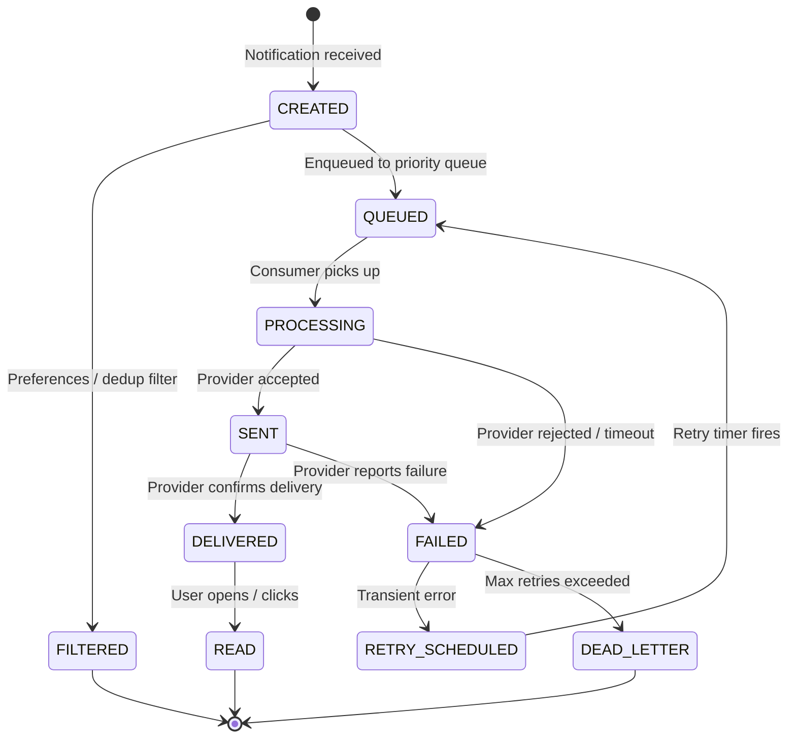

### Delivery Record Schema

```sql
CREATE TABLE notification_deliveries (
    delivery_id        UUID PRIMARY KEY DEFAULT gen_random_uuid(),
    notification_id    UUID REFERENCES notifications(notification_id),
    channel            VARCHAR(16) NOT NULL,
    status             VARCHAR(32) NOT NULL,
    provider           VARCHAR(32),
    provider_msg_id    VARCHAR(256),
    rendered_body      TEXT,
    retry_count        INT DEFAULT 0,
    max_retries        INT DEFAULT 3,
    next_retry_at      TIMESTAMP,
    error_code         VARCHAR(64),
    error_message      TEXT,
    sent_at            TIMESTAMP,
    delivered_at       TIMESTAMP,
    read_at            TIMESTAMP,
    created_at         TIMESTAMP DEFAULT now(),
    updated_at         TIMESTAMP DEFAULT now()
);

CREATE INDEX idx_deliveries_status ON notification_deliveries(status);
CREATE INDEX idx_deliveries_retry  ON notification_deliveries(next_retry_at)
    WHERE status = 'RETRY_SCHEDULED';
CREATE INDEX idx_deliveries_user   ON notification_deliveries(notification_id);
```

### Webhook Handler for Provider Callbacks

External providers send delivery status updates asynchronously via webhooks:

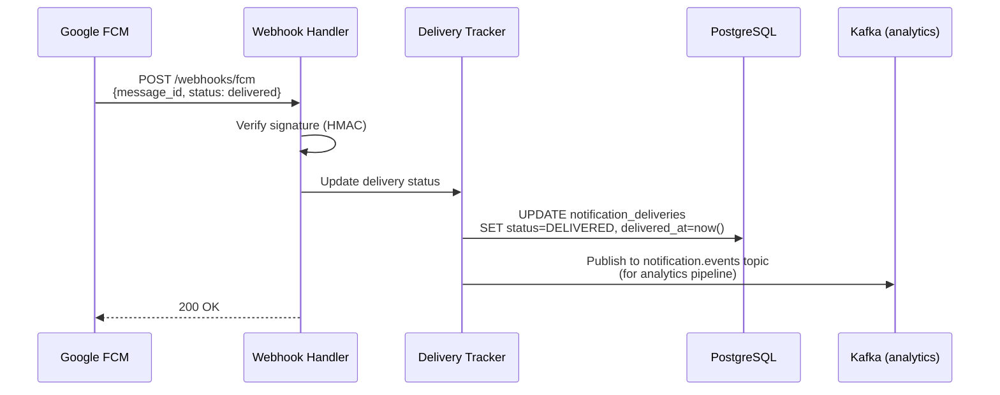

---

## 2.12 Rate Limiter

Rate limiting protects both users (from notification spam) and providers (from
API throttling). Sits between the Channel Router and Provider Adapters.

### Two-Level Rate Limiting

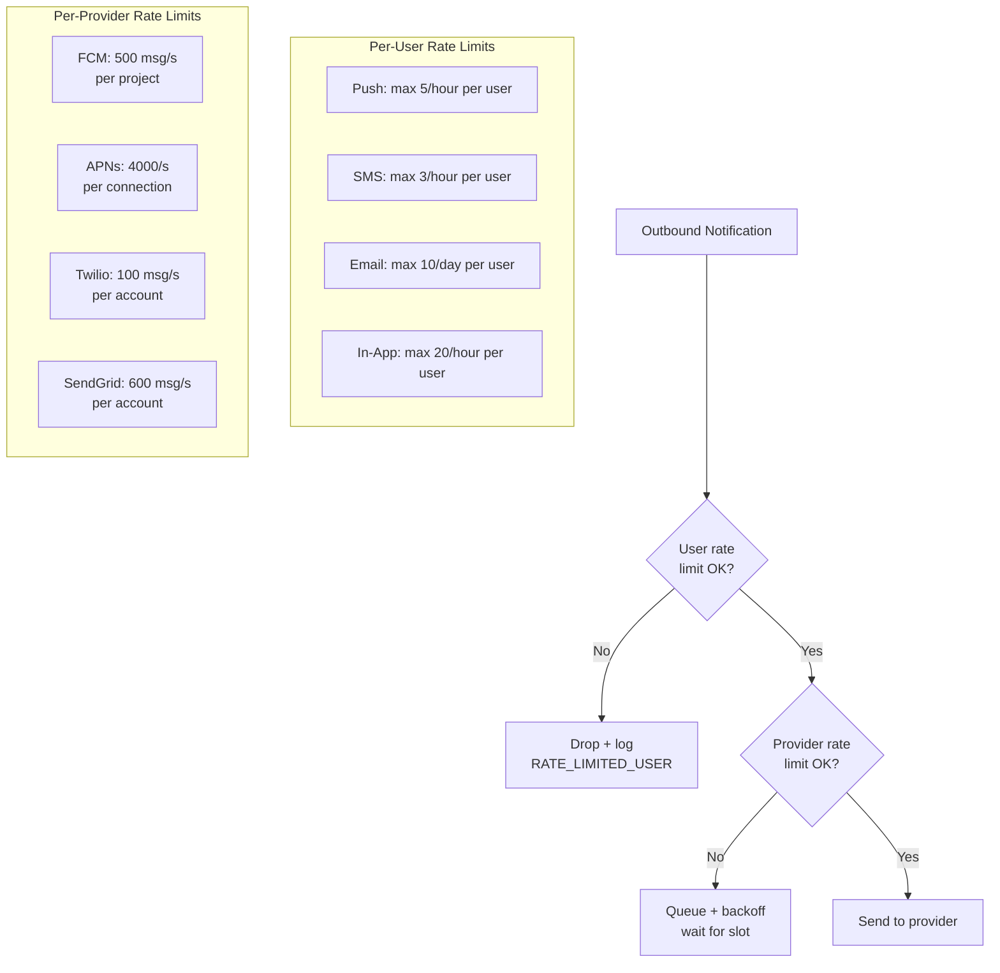

- **Per-user**: Sliding window via Redis sorted sets. Prevents spamming any user.
- **Per-provider**: Token bucket algorithm in Redis. Prevents 429 responses from providers.
- **Critical override**: Critical notifications bypass per-user limits but NOT
  provider limits.

---

## 2.13 Dead Letter Queue

Notifications that permanently fail (after max retries) are sent to a dead letter
Kafka topic for manual investigation and potential reprocessing.

```
DLQ Kafka topic: notifications.dead_letter

DLQ message contents:
  - Original notification record
  - All delivery attempts with error codes/messages
  - Channel and provider that failed
  - Timestamp of final failure

DLQ consumers:
  1. Alert on DLQ count > threshold (PagerDuty alert)
  2. Dashboard for operations team to review and replay
  3. Automated categorization: token_invalid, provider_down, unknown
```

---

## 2.14 Core Sequence -- End-to-End Flow

The complete sequence from an event source publishing to Kafka through to delivery:

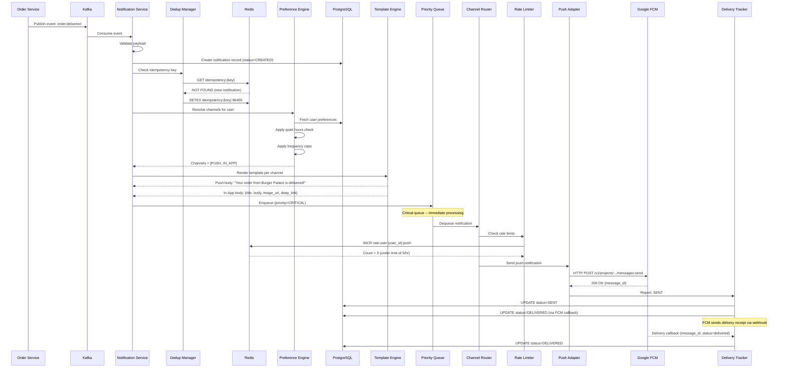

---

## 2.15 Event-Driven Architecture -- Why?

The notification system is a textbook case for **event-driven architecture**:

```
Traditional (request-driven):
  Order Service --HTTP POST--> Notification Service
  Problem: tight coupling, Order Service blocks if Notification is down

Event-driven:
  Order Service --publish event--> Kafka <--consume-- Notification Service
  Benefit: loose coupling, async processing, replay capability
```

### Advantages

1. **Decoupling**: Event sources do not know about the notification system. They
   publish domain events; the notification system subscribes to the ones it cares about.
2. **Reliability**: Kafka persists events -- if notification service is down, events
   wait in the topic and are processed when it recovers. Zero message loss.
3. **Fan-out**: One event can trigger notifications across multiple channels without
   the source service knowing about channels at all.
4. **Replay**: If templates were buggy, fix the template and re-consume from Kafka
   offset. All affected notifications get corrected.
5. **Backpressure**: Notification service consumes at its own pace. A burst of
   events from a flash sale does not overwhelm the service -- it processes from
   the Kafka lag at its capacity.
6. **Independent scaling**: Event sources and notification consumers scale independently.
   Adding a new event source requires zero changes to the notification system.

### When NOT to Use Event-Driven

For synchronous, time-critical flows like OTP delivery where the caller needs
confirmation that the notification was at least accepted, the system still uses
Kafka but with a synchronous-feeling API:
- The API returns `202 Accepted` immediately after persisting to DB and publishing
  to Kafka.
- The caller polls or receives a webhook for delivery status.
- The caller does NOT block waiting for delivery.

---

## 2.16 Data Stores Overview

| Store | Purpose | Data | Access Pattern |
|-------|---------|------|---------------|
| **PostgreSQL** | Primary transactional store | Notifications, deliveries, preferences, templates, schedules | Read-heavy (preferences), Write-heavy (deliveries) |
| **Redis** | Cache + rate limiting + dedup | Preference cache, template cache, rate limit counters, idempotency keys | Extremely high read/write throughput, low latency |
| **Kafka** | Message bus + event store | Notification events across all topics | Append-only writes, consumer group reads |
| **Elasticsearch** | Full-text search + analytics | Notification search for support tools | Read-heavy, bulk indexed |
| **S3** | Blob storage | Email HTML templates, images, attachments | Read-heavy, rarely written |
| **ClickHouse** | OLAP analytics | Delivery metrics, open rates, click rates | Aggregate queries over billions of rows |

### Data Store Architecture

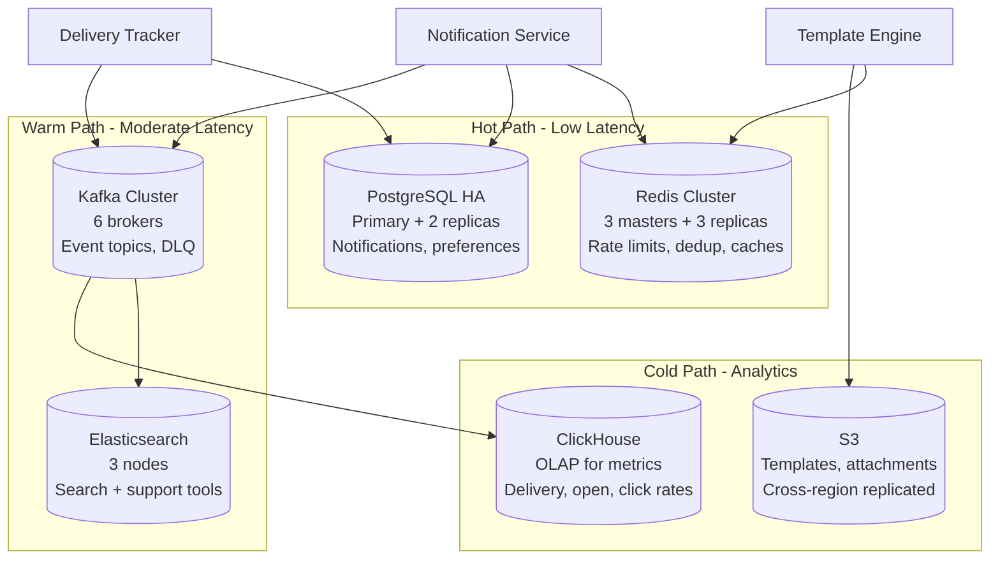

---

*Next: [Deep Dive & Scaling](./deep-dive-and-scaling.md) -- priority handling internals,
retry mechanics, provider failover, multi-region, analytics, A/B testing, and trade-offs.*
