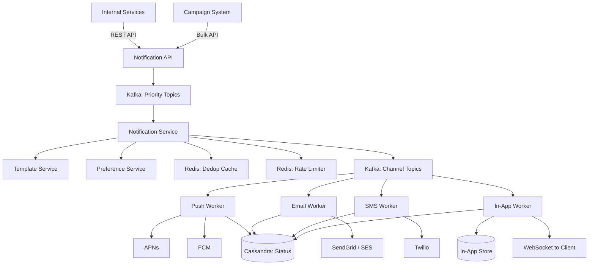

# Design Notification System -- Interview Script (45 min)

## Opening (0:00 - 0:30)

> "Thanks for the problem! A notification system is a foundational platform component -- it's used by virtually every feature in a product, from marketing campaigns to real-time alerts. The interesting challenges are multi-channel delivery, priority handling, deduplication, and scale. Let me start with some clarifying questions."

---

## Clarifying Questions (0:30 - 3:00)

> **Q1:** "What notification channels do we need to support -- push, SMS, email, in-app? All of them?"
>
> **Expected answer:** All four: push (iOS/Android), SMS, email, and in-app notifications.

> **Q2:** "What's the expected scale -- notifications per day?"
>
> **Expected answer:** ~1B notifications/day across all channels. Tens of millions of users.

> **Q3:** "Are we designing this as a standalone platform service that other teams call into, or as part of a specific product?"
>
> **Expected answer:** Design it as a platform service with an API that any internal service can call.

> **Q4:** "Do we need to support both transactional notifications (password reset, order confirmation) and bulk/marketing notifications (campaign to 10M users)?"
>
> **Expected answer:** Yes, both. Transactional must be real-time; marketing can be batched.

> **Q5:** "What's the latency requirement for transactional notifications?"
>
> **Expected answer:** Under 5 seconds for push and in-app. Email and SMS are naturally slower (10-30 seconds acceptable).

> **Q6:** "Do we need rate limiting per user -- like no more than 5 push notifications per hour?"
>
> **Expected answer:** Yes, we need to protect users from notification fatigue.

> **Q7:** "Should users be able to configure their notification preferences -- opt in/out of specific types and channels?"
>
> **Expected answer:** Yes, per-user and per-notification-type preferences.

---

## Requirements Summary (3:00 - 5:00)

> "Let me summarize what we're building."

> **"Functional Requirements:"**
> 1. "Multi-channel delivery: push notification (APNs/FCM), SMS, email, and in-app."
> 2. "Notification preferences: users can opt in/out per type and per channel."
> 3. "Priority levels: critical (OTP, security alerts), high (order updates), normal (social), low (marketing)."
> 4. "Template management: notifications use pre-defined templates with variable substitution."
> 5. "Scheduling: support immediate send and future-scheduled notifications."
> 6. "Deduplication: prevent the same notification from being sent twice."
> 7. "Rate limiting per user: cap the number of notifications a user receives in a time window."
> 8. "Analytics: track delivery, open rates, click-through rates."

> **"Non-Functional Requirements:"**
> 1. "Throughput: 1B notifications/day, peak of ~50K-100K/sec."
> 2. "Latency: transactional notifications delivered in under 5 seconds."
> 3. "Reliability: at-least-once delivery -- we'd rather send a notification twice than miss it."
> 4. "Exactly-once to the user via deduplication."
> 5. "High availability: 99.99% uptime."
> 6. "Extensibility: easy to add new channels (WhatsApp, Slack, etc.) in the future."

---

## Back-of-Envelope Estimation (5:00 - 8:00)

> "Let me do some quick math."

> **Throughput:**
> "1B notifications/day. Spread evenly: 1B / 86,400 = ~11,500/sec. But notifications are bursty -- morning digests, marketing campaigns during business hours, flash sales. Peak: probably 50K-100K/sec."

> **Storage:**
> "Each notification record: ~500 bytes (user_id, type, channel, content, status, timestamps, metadata). 1B * 500 bytes = 500GB/day. If we retain 30 days of history: ~15TB. Manageable in a database like Cassandra or PostgreSQL with partitioning."

> **External API calls:**
> "For push: APNs and FCM have their own rate limits but generally handle our volume."
> "For email: using an ESP like SendGrid. 1B emails/day would cost a fortune, so email volume is probably 100-200M/day. At peak: ~5K/sec to the ESP."
> "For SMS: most expensive. Probably 10-50M SMS/day. Aggregated through providers like Twilio."

> "Key insight: the notification system itself is not the bottleneck -- the external providers (APNs, FCM, SendGrid, Twilio) are. Our system needs to buffer, prioritize, and rate-limit to work within those constraints."

---

## High-Level Design (8:00 - 20:00)

> "Let me draw the high-level architecture. I'll organize it as a pipeline."

### Step 1: The Entry Points

> "Notifications enter the system from two sources:"
> 1. **Internal services** -- "calling our Notification API (e.g., Order Service sends 'your order shipped')"
> 2. **Campaign system** -- "marketing team triggers a bulk send to a user segment"

### Step 2: The Pipeline

> "I'd design this as a pipeline with clear stages:"
> 1. **Ingestion** -- Accept the notification request, validate it, assign an ID.
> 2. **Enrichment** -- Look up user preferences, resolve templates, determine channels.
> 3. **Deduplication** -- Check if this exact notification was already sent recently.
> 4. **Priority + Rate Limiting** -- Assign priority, check per-user rate limits.
> 5. **Routing** -- Fan out to channel-specific queues (push, SMS, email, in-app).
> 6. **Delivery** -- Channel-specific workers send to external providers.
> 7. **Tracking** -- Record delivery status, handle retries.

### Step 3: Core Components

> "Let me draw the services:"
> 1. **Notification API** -- "RESTful ingestion endpoint."
> 2. **Notification Service** -- "Orchestrates the pipeline: enrichment, dedup, priority."
> 3. **Template Service** -- "Stores and renders notification templates."
> 4. **Preference Service** -- "Manages per-user notification preferences."
> 5. **Push Worker** -- "Sends to APNs (iOS) and FCM (Android)."
> 6. **Email Worker** -- "Sends to email service provider."
> 7. **SMS Worker** -- "Sends to SMS provider."
> 8. **In-App Worker** -- "Writes to the in-app notification store + pushes via WebSocket."

### Step 4: Data Stores

> - **Kafka** -- "Message queue connecting pipeline stages. Separate topics for each priority level and channel."
> - **PostgreSQL** -- "Templates, user preferences, notification metadata."
> - **Redis** -- "Deduplication cache, rate limiting counters."
> - **Cassandra** -- "Notification history and delivery status (high-volume append)."
> - **DynamoDB or Redis** -- "In-app notification store (read-heavy for the notification inbox)."

### Step 5: Whiteboard Diagram



### Step 6: Walk through the flow

> "Let me trace a transactional notification -- say, 'Your order has shipped':"
>
> 1. "The Order Service calls POST /api/v1/notifications with user_id, type='order_shipped', template_id, and data (order_id, tracking_number)."
> 2. "Notification API validates the request, assigns a notification_id (UUID), and publishes to Kafka's high-priority topic."
> 3. "Notification Service picks it up. First, it calls Preference Service: does this user want order notifications? On which channels? Answer: push + email."
> 4. "It calls Template Service to render the templates -- push title/body and email HTML with the order details filled in."
> 5. "It checks the dedup cache in Redis: has this exact (user_id, type, order_id) been sent in the last hour? No -- proceed. Yes -- drop it."
> 6. "It checks the rate limiter: has this user exceeded 10 push notifications in the last hour? No -- proceed."
> 7. "It publishes two messages: one to the push-channel Kafka topic, one to the email-channel topic."
> 8. "Push Worker picks up the push message, looks up the user's device tokens, calls FCM/APNs."
> 9. "Email Worker picks up the email message, calls SendGrid."
> 10. "Both workers write delivery status (sent/failed) to Cassandra."
> 11. "If delivery fails, the worker publishes to a retry topic with an incremented attempt count."

---

## API Design (within high-level)

> "Let me define the key APIs."

```
POST /api/v1/notifications
Body: {
  user_id: "user_123",
  notification_type: "order_shipped",
  priority: "high",
  template_id: "tmpl_order_shipped",
  template_data: { order_id: "ord_456", tracking_url: "..." },
  channels: ["push", "email"],  // optional override; default = user prefs
  idempotency_key: "order_shipped_ord_456"
}
Response: { notification_id: "notif_789", status: "accepted" }

POST /api/v1/notifications/bulk
Body: {
  user_ids: ["user_1", "user_2", ...],    // or segment_id for campaigns
  notification_type: "promo_summer_sale",
  priority: "low",
  template_id: "tmpl_summer_promo",
  template_data: { discount: "20%" },
  scheduled_at: "2026-04-08T09:00:00Z"   // optional
}
Response: { batch_id: "batch_101", user_count: 5000000, status: "scheduled" }

GET /api/v1/users/{user_id}/notifications?limit=20&cursor=xxx
Response: {
  notifications: [
    { notification_id, type, title, body, read: false, created_at },
    ...
  ],
  next_cursor: "yyy"
}

PUT /api/v1/users/{user_id}/preferences
Body: {
  order_updates: { push: true, email: true, sms: false },
  marketing: { push: false, email: true, sms: false },
  security_alerts: { push: true, email: true, sms: true }
}
Response: 200 OK
```

---

## Data Model (within high-level)

> "For the data model:"

```sql
-- Notification records (Cassandra) -- partitioned by user_id for inbox reads
notifications (
    user_id           TEXT,
    notification_id   UUID,
    notification_type TEXT,
    channel           TEXT,
    priority          TEXT,
    title             TEXT,
    body              TEXT,
    status            TEXT,         -- accepted, sent, delivered, failed, read
    attempt_count     INT,
    idempotency_key   TEXT,
    created_at        TIMESTAMP,
    sent_at           TIMESTAMP,
    delivered_at      TIMESTAMP,
    read_at           TIMESTAMP,
    PRIMARY KEY (user_id, created_at, notification_id)
) WITH CLUSTERING ORDER BY (created_at DESC);

-- Templates (PostgreSQL)
templates (
    template_id       VARCHAR(50) PRIMARY KEY,
    channel           VARCHAR(10),     -- push, email, sms, in_app
    title_template    TEXT,            -- "Your order {{order_id}} has shipped"
    body_template     TEXT,
    html_template     TEXT,            -- for email
    created_at        TIMESTAMP,
    updated_at        TIMESTAMP
);

-- User preferences (PostgreSQL)
user_notification_preferences (
    user_id           VARCHAR(36),
    notification_type VARCHAR(50),
    channel           VARCHAR(10),
    enabled           BOOLEAN DEFAULT TRUE,
    PRIMARY KEY (user_id, notification_type, channel)
);

-- Rate limit tracking (Redis key structure)
-- Key: rate_limit:{user_id}:{channel}:{window}
-- Value: count (integer)
-- TTL: window duration
```

---

## Deep Dive 1: Deduplication and Exactly-Once Delivery (20:00 - 30:00)

> "Now let me dive deep into deduplication -- this is the most critical reliability concern for a notification system."

### Why Dedup Matters

> "In a distributed system with Kafka (at-least-once delivery), a notification can be processed multiple times due to consumer rebalancing, retries, or upstream service retries. Without dedup, a user might receive the same 'Your order shipped' push notification 3 times. That's a terrible user experience and erodes trust."

### Three Layers of Deduplication

> "I'd implement dedup at three levels:"

> **Layer 1: API-level idempotency key**
> "The caller includes an idempotency_key in the request (e.g., 'order_shipped_ord_456'). The Notification API checks Redis: if this key exists, return the existing notification_id without re-processing. The key has a TTL of 24 hours."
>
> "This catches the most common case: the upstream service retries its API call because it didn't get a response."

```
Redis: SET notification:idemp:{key} {notification_id} NX EX 86400
If SET succeeds -> new notification, proceed
If SET fails (key exists) -> duplicate, return existing notification_id
```

> **Layer 2: Pipeline-level dedup**
> "Inside the Notification Service, before routing to channels, I check a dedup cache. The key is a hash of (user_id, notification_type, template_id, template_data_hash). TTL of 1 hour."
>
> "This catches the case where two different upstream services independently trigger the same notification, or a Kafka consumer reprocesses a message."

> **Layer 3: Channel-level dedup**
> "At the Push/Email/SMS Worker level, I check if this specific (notification_id, channel) combination has already been sent successfully. This is a lookup in Cassandra's status table."
>
> "This catches the case where the channel worker crashes after sending but before recording the status."

### Handling Edge Cases

> "What about near-simultaneous sends? If two identical notifications arrive within milliseconds:"
> "The Redis NX (set-if-not-exists) operation is atomic. Only one will succeed. The loser either gets the existing notification_id back (Layer 1) or is dropped (Layer 2)."

> "What about distributed Redis -- can a dedup key be on a different shard than where the second check happens?"
> "I'd use consistent hashing on the idempotency_key so the same key always routes to the same Redis shard. No cross-shard coordination needed."

### :microphone: Interviewer might ask:

> **"How do you prevent sending duplicate notifications?"**
> **My answer:** "I use three layers of deduplication. First, API-level idempotency keys in Redis with NX and TTL -- this catches retried API calls. Second, a pipeline-level content-based dedup that hashes the notification payload and checks Redis before processing. Third, a channel-level status check before actual delivery. Each layer catches a different class of duplication. The Redis NX operation provides atomic check-and-set, so even concurrent duplicates are handled correctly."

> **"What if Redis goes down and your dedup layer is unavailable?"**
> **My answer:** "This is a critical question. If the dedup Redis goes down, I have two options: (1) fail open -- send the notification and risk a duplicate, or (2) fail closed -- drop the notification and risk missing it. For most notification types, I'd fail open -- a duplicate push notification is annoying but not harmful. For sensitive types like payment confirmations or OTPs, I'd fail closed and queue the notification for retry once Redis recovers. The Cassandra-based Layer 3 dedup still works independently as a last resort."

> **"How do you handle dedup across channels? If a user should get either a push OR an email, not both?"**
> **My answer:** "That's a channel selection policy, not dedup. In the Notification Service, I'd implement a priority cascade: try push first (cheapest, most immediate). If the push delivery fails (user has no device token, or push fails), fall back to email. This is configured per notification type in the template. The key is that the decision happens before publishing to channel-specific topics, not after."

---

## Deep Dive 2: Priority Queue and Rate Limiting (30:00 - 38:00)

> "Another critical component is ensuring high-priority notifications aren't blocked by low-priority ones, and that we don't overwhelm users with too many notifications."

### Priority System

> "I'd define four priority levels:"
> 1. **Critical** -- "Security alerts, OTP codes. Must be delivered in under 3 seconds. Skip rate limiting."
> 2. **High** -- "Transactional -- order updates, payment confirmations. Under 5 seconds."
> 3. **Normal** -- "Social notifications -- likes, comments, friend requests. Under 30 seconds."
> 4. **Low** -- "Marketing, recommendations, digests. Can take minutes or be batched."

> "Each priority level gets its own Kafka topic. The consumers for critical and high-priority topics have more worker instances allocated, so they process faster."

> "For the channel workers, I'd also prioritize. Each worker pulls from a priority queue. If a Push Worker has both a critical OTP and a low-priority marketing notification in its queue, the OTP goes first."

### Rate Limiting Per User

> "To prevent notification fatigue, I enforce per-user limits:"
> - "Push: max 10/hour, max 30/day"
> - "Email: max 3/day"
> - "SMS: max 5/day"
> - "Critical notifications are exempt from rate limits"

> "Implementation in Redis:"

```
-- Sliding window rate limit using sorted sets
Key: rate:{user_id}:{channel}:hourly
Members: notification_id
Score: timestamp

-- Check: count members with score > (now - 3600)
-- If count >= limit: reject (queue for later or drop based on priority)
-- If count < limit: add new member, proceed
-- Periodically trim expired members
```

> "Alternatively, I could use the simpler fixed-window counter approach with Redis INCR + TTL, which is less precise but cheaper. For a notification system, the fixed window is usually good enough."

### Backpressure Handling

> "What happens when we're at 100K notifications/sec and the email provider can only handle 10K/sec?"

> "I'd implement backpressure per channel:"
> 1. "Each channel worker has a target send rate based on the provider's limits."
> 2. "If the queue depth exceeds a threshold, the worker slows down consumption (adaptive rate)."
> 3. "For Kafka, I'd use consumer group lag monitoring. If lag for the email topic exceeds 5 minutes, I alert and optionally scale up email workers."
> 4. "Low-priority notifications are the first to be delayed. Critical notifications are never delayed."

### Retry Strategy

> "When delivery fails (provider timeout, rate limit from APNs, etc.):"

```
Retry policy:
  Attempt 1: immediate
  Attempt 2: after 30 seconds
  Attempt 3: after 2 minutes
  Attempt 4: after 10 minutes
  Attempt 5: after 1 hour
  After 5 failures: mark as permanently failed, alert

Each retry goes to a dedicated retry topic in Kafka with a delay mechanism
(Kafka doesn't natively support delayed delivery, so I'd use a scheduled
consumer that polls retry topics and re-publishes when the delay has elapsed)
```

### :microphone: Interviewer might ask:

> **"How do you handle a marketing campaign to 10 million users?"**
> **My answer:** "Bulk campaigns go through a different path. The Campaign System writes the campaign definition to the database, then a Campaign Worker reads the user segment in batches of 10K. For each batch, it publishes individual notification requests to the low-priority Kafka topic. The worker controls the publish rate to avoid flooding the pipeline -- maybe 50K/sec. At that rate, 10M notifications take about 3-4 minutes to enqueue. They then flow through the normal pipeline (dedup, preferences, rate limiting) and are delivered over the next 30-60 minutes. The low priority ensures they don't interfere with real-time transactional notifications."

> **"What about time zone awareness for campaigns?"**
> **My answer:** "For marketing campaigns, I'd store the user's time zone in the preference service. The Campaign Worker checks the time zone and publishes the notification with a scheduled_at timestamp so it arrives at 10 AM local time for each user. This means a global campaign actually trickles out over 24 hours as each time zone hits 10 AM."

> **"How do you monitor notification health?"**
> **My answer:** "Three layers of monitoring: (1) Pipeline metrics -- queue depth, processing latency per stage, error rates. (2) Delivery metrics -- success/failure rates per channel per provider. (3) User-facing metrics -- delivery rate, open rate, click rate per notification type. I'd set up alerts for: queue depth exceeding 5-minute SLA, delivery failure rate above 5%, and any critical notification taking more than 10 seconds."

---

## Trade-offs and Wrap-up (38:00 - 43:00)

> "Let me discuss the key trade-offs."

> **Trade-off 1: Push vs. pull for in-app notifications**
> "Push (via WebSocket) gives instant delivery, but requires maintaining persistent connections. Pull (client polls the inbox) is simpler but has latency. I chose a hybrid: push via WebSocket for active users, with the in-app store as the persistent source of truth. If the push fails, the client pulls on next app open."

> **Trade-off 2: Kafka vs. a simpler queue (SQS, RabbitMQ)**
> "I chose Kafka because: (a) we need multiple consumers per message (notification goes to dedup, analytics, and routing), (b) message replay for debugging, (c) the throughput ceiling is much higher. The trade-off is operational complexity -- Kafka requires careful partition management and consumer group tuning. SQS would be simpler for a smaller-scale system."

> **Trade-off 3: At-least-once vs. exactly-once delivery**
> "The pipeline uses at-least-once delivery (Kafka's default). True exactly-once is extremely expensive in a distributed system. Instead, I pair at-least-once with idempotent deduplication -- the combination gives effectively-exactly-once from the user's perspective."

> **Trade-off 4: Channel-specific vs. unified workers**
> "I chose channel-specific workers (Push Worker, Email Worker, etc.) because each channel has different APIs, rate limits, retry strategies, and payload formats. A unified worker would need complex branching logic. The trade-off is more services to deploy, but each one is simple and independently scalable."

---

## Future Improvements (43:00 - 45:00)

> "If I had more time, I'd also consider:"

> 1. **"Intelligent notification batching"** -- "Instead of sending 5 separate 'someone liked your post' notifications, batch them into 'Alice, Bob, and 3 others liked your post.' This requires a short delay buffer (30-60 seconds) for aggregatable notification types."

> 2. **"ML-powered send-time optimization"** -- "For non-urgent notifications, predict the best time to deliver based on when the user typically engages. This maximizes open rates and minimizes annoyance."

> 3. **"Multi-channel orchestration"** -- "Implement cascading delivery: try push first, if not opened within 10 minutes, send email. If still not engaged, send SMS. This improves reach while minimizing notification volume."

---

## Red Flags to Avoid

- **Don't say:** "Just call the push notification API directly from each service." That creates fragmentation and no centralized control.
- **Don't forget:** Deduplication. This is the most common interviewer question for notification systems.
- **Don't ignore:** User preferences and rate limiting. A notification system without these safeguards will get the product team in trouble.
- **Don't hand-wave:** The retry mechanism. Failed notifications are the norm (device offline, provider down). Robust retries are essential.
- **Don't skip:** Priority handling. Marketing blasts must never delay OTP delivery.

---

## Power Phrases That Impress

- "The key insight is that a notification system is a pipeline, not just an API. Each stage -- validation, enrichment, dedup, rate limiting, routing, delivery -- is a distinct concern that can be independently scaled."
- "I use three layers of deduplication because each catches a different failure mode: API retries, pipeline reprocessing, and delivery-layer crashes."
- "The trade-off between at-least-once and exactly-once delivery is a false dilemma. At-least-once plus idempotent dedup gives you effectively-exactly-once at a fraction of the complexity."
- "Priority separation at the Kafka topic level ensures that a 10M-user marketing campaign can never block a single user's OTP. They're on completely separate processing paths."
- "The notification system is a platform, not a feature. Designing it as an internal service with a clean API lets it evolve independently of any product that uses it."
