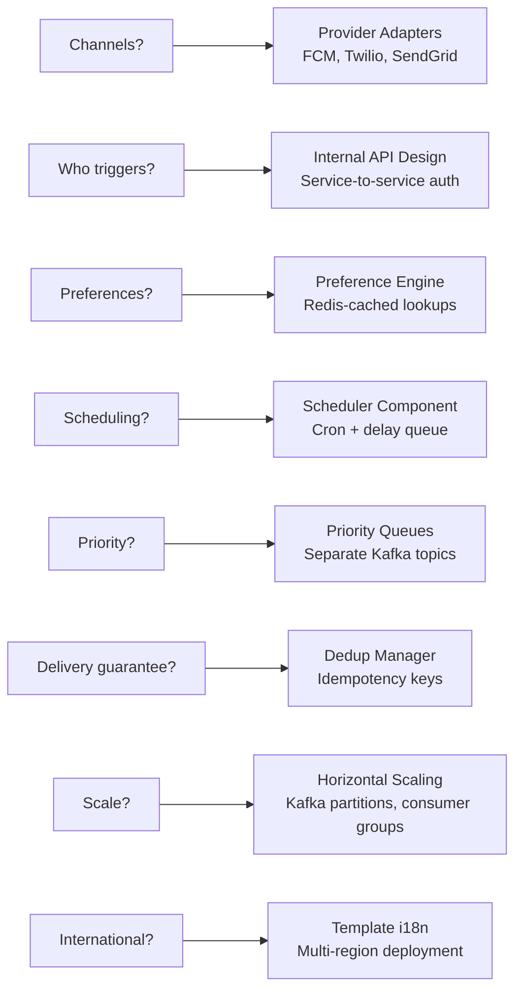
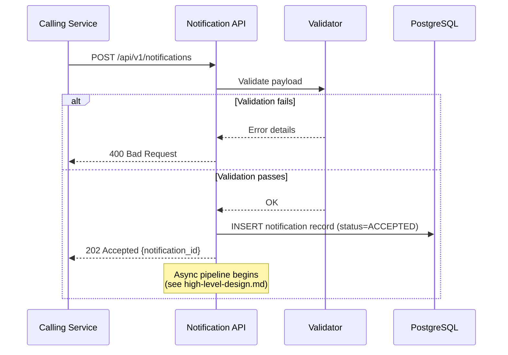

# Design a Notification System -- Requirements & Estimation

> Frequently asked at **Uber India**, **Flipkart**, **Swiggy**, **Razorpay**, and **Google**.
> A notification system is a cross-cutting infrastructure concern -- almost every
> product team depends on it, making it one of the highest-leverage systems to design well.

---

## Table of Contents

1. [Clarifying Questions](#11-clarifying-questions-to-ask-the-interviewer)
2. [Functional Requirements](#12-functional-requirements)
3. [Non-Functional Requirements](#13-non-functional-requirements)
4. [Back-of-the-Envelope Estimation](#14-back-of-the-envelope-estimation)
5. [API Design](#15-api-design)
6. [Data Model for API Entities](#16-data-model-for-api-entities)

**Related files**:
- [High-Level Design](./high-level-design.md)
- [Deep Dive & Scaling](./deep-dive-and-scaling.md)

---

## 1.1 Clarifying Questions to Ask the Interviewer

Before diving in, always clarify scope. Here are the questions and assumed answers:

| # | Question | Assumed Answer | Why It Matters |
|---|----------|---------------|----------------|
| 1 | What notification channels? | Push (iOS/Android), SMS, Email, In-App | Determines provider adapters, payload formats, cost model |
| 2 | Who triggers notifications? | Backend services (order updates, promotions, alerts) | Internal-only API (service-to-service), not user-facing |
| 3 | Do users have preferences? | Yes -- per-channel, per-event-type opt-in/out | Requires a preference engine with caching layer |
| 4 | Do we need scheduling? | Yes -- send-later and recurring (e.g., weekly digest) | Need a scheduler component with cron support |
| 5 | Priority levels? | Critical (OTP, trip updates), Normal, Low (promotions) | Separate queues to isolate urgency levels |
| 6 | Delivery guarantees? | At-least-once delivery | Drives idempotency / deduplication design |
| 7 | What scale? | 10M+ notifications/day, 500M+ registered users | Horizontal scaling, partitioning, caching needed |
| 8 | International? | Yes -- multi-language, multi-region | Template i18n, timezone handling, regional providers |
| 9 | Is there a budget constraint on SMS/Email? | Yes -- minimize SMS, prefer push when possible | Impacts channel selection logic and cost optimization |
| 10 | Do we own the user device registry? | Yes -- we maintain push tokens per device | Need device token management and invalidation |

### Why These Questions Matter

Every answer shapes a different part of the architecture:



---

## 1.2 Functional Requirements

### Core Requirements

1. **Multi-channel delivery**: Push notifications (FCM/APNs), SMS (Twilio/SNS),
   Email (SendGrid/SES), In-App (WebSocket/polling)
2. **User preferences**: Per-user, per-channel, per-event-type settings with quiet
   hours and frequency caps
3. **Template engine**: Template ID + variables produces rendered messages per channel
   (push = short, email = rich HTML, SMS = 160 chars)
4. **Priority levels**: Critical (immediate), Normal (best-effort within minutes),
   Low (batched, may be delayed hours)
5. **Scheduling**: Immediate send, scheduled future send, recurring notifications
6. **Delivery tracking**: Full lifecycle -- created, queued, sent, delivered, read, failed
7. **Retry with backoff**: Automatic retries on transient failures, dead-letter queue
   for permanent failures
8. **Deduplication**: Idempotency keys to prevent duplicate sends
9. **Rate limiting**: Per-user and per-provider rate limits

### Extended Requirements (Differentiate in Interview)

10. **Provider failover**: Circuit breaker pattern for graceful degradation when a
    provider (e.g., FCM, Twilio) is down, with automatic fallback to secondary provider
11. **A/B testing**: Ability to test different template variants, send times, and
    channel combinations to optimize engagement metrics
12. **Analytics pipeline**: Real-time streaming of notification events to an OLAP store
    for delivery rate, open rate, click-through rate, and latency monitoring
13. **Bulk/segment sends**: Marketing can target a user segment (e.g., inactive users
    in Bangalore) and the system fans out to millions of users with throttling
14. **Channel fallback**: If push fails (e.g., invalid token), automatically try the
    next preferred channel (SMS, then email)
15. **Digest mode**: Aggregate multiple low-priority notifications into a single daily
    or weekly digest email instead of sending individually

### Requirement Prioritization Matrix

| Requirement | P0 (Must Have) | P1 (Should Have) | P2 (Nice to Have) |
|------------|:-:|:-:|:-:|
| Multi-channel delivery | X | | |
| User preferences | X | | |
| Template engine | X | | |
| Priority levels | X | | |
| Delivery tracking | X | | |
| Retry + DLQ | X | | |
| Deduplication | X | | |
| Rate limiting | X | | |
| Scheduling | | X | |
| Provider failover | | X | |
| A/B testing | | | X |
| Analytics pipeline | | X | |
| Bulk/segment sends | | X | |
| Channel fallback | | X | |
| Digest mode | | | X |

---

## 1.3 Non-Functional Requirements

| Requirement | Target | Rationale |
|------------|--------|-----------|
| **Latency (Critical)** | < 30 seconds end-to-end for OTP, trip alerts | User is actively waiting; OTP expires quickly |
| **Latency (Normal)** | < 5 minutes end-to-end | Order updates should arrive while context is fresh |
| **Latency (Low)** | < 24 hours | Promotions can be batched and delayed |
| **Throughput** | 10M+ notifications/day = ~120/s avg, ~1200/s peak | Handle burst traffic during flash sales, peak hours |
| **Availability** | 99.99% for the notification service (52 min downtime/year) | Notification infra is shared by all product teams |
| **Delivery guarantee** | At-least-once (idempotent consumers handle duplicates) | Exactly-once across Kafka + external providers is prohibitively complex |
| **Durability** | Zero message loss -- persist before acknowledging | Kafka replication factor 3, write to DB before ACK |
| **Scalability** | Horizontal scaling for all stateless components | Consumers, routers, adapters must scale independently |
| **Observability** | End-to-end tracing from event source to delivery | Distributed tracing with trace_id propagation |
| **Data retention** | 90 days for notification records, 1 year for analytics | Compliance + debugging + trend analysis |
| **Security** | Encrypted at rest and in transit, RBAC for API access | PII in notifications (phone, email, names) |

### Availability Budget Breakdown

```
99.99% availability = 52.6 minutes of downtime per year

Budget allocation:
  Planned maintenance:    10 minutes/year  (rolling deploys, zero-downtime)
  Unplanned incidents:    42 minutes/year
  Incident response SLA:  15 minutes to detect, 30 minutes to mitigate

This means:
  - No single point of failure in the critical path
  - All stateless services behind load balancers with health checks
  - All stateful stores (Kafka, PostgreSQL, Redis) in HA configurations
  - Circuit breakers on all external provider calls
```

---

## 1.4 Back-of-the-Envelope Estimation

### Traffic Estimation

```
Daily notifications:          10,000,000
Peak multiplier:              10x
Peak notifications/second:    10M / 86400 * 10 = ~1,157/s (round to 1,200/s)

Registered users:             500,000,000
DAU (daily active users):     50,000,000  (10%)
Avg notifications per DAU:    10M / 50M = 0.2 notifications/user/day

This is conservative. In reality:
  - Transactional users get 5-10 notifications/day (order, delivery, payment)
  - Inactive users get 0-1 promotions/week
  - The distribution is heavily skewed (power users >> casual users)
```

### Storage Estimation

```
Average notification payload: ~2 KB (includes metadata, template vars, trace info)
Daily storage (raw):          10M * 2 KB = 20 GB/day
Monthly storage:              600 GB/month
Yearly storage:               ~7.2 TB/year

With 90-day TTL on notification records:
  Hot storage:                90 * 20 GB = 1.8 TB in PostgreSQL
  Archived to cold storage:  After 90 days, move to S3/Glacier

Delivery records (per notification, per channel):
  Average 1.5 channels per notification = 15M delivery records/day
  Each record: ~1 KB
  Daily: 15 GB/day
  90-day hot storage: 1.35 TB

Total hot storage: ~3.15 TB (PostgreSQL with partitioning by created_at)
```

### Channel Breakdown

```
Channel breakdown (estimated):
  Push:    40%  = 4M/day    (cheapest, highest engagement)
  Email:   30%  = 3M/day    (rich content, receipts, digests)
  SMS:     10%  = 1M/day    (expensive, OTP/critical only)
  In-App:  20%  = 2M/day    (zero cost, requires app open)
```

### Cost Estimation

```
Provider API costs (daily):
  SMS (Twilio):      $0.0075/msg * 1M = $7,500/day  ($225,000/month)
  Email (SES):       $0.10/1000  * 3M = $300/day     ($9,000/month)
  Push (FCM/APNs):   Free (bandwidth costs only)      (~$50/month)
  In-App (internal): WebSocket server costs             (~$500/month)

Total provider costs: ~$234,550/month

Infrastructure costs (estimated):
  Kafka cluster (6 brokers):      $3,000/month
  PostgreSQL (HA, 3.15 TB):       $2,000/month
  Redis cluster (HA):             $800/month
  Compute (notification service): $1,500/month
  ClickHouse (analytics):         $1,000/month

Total infrastructure: ~$8,300/month

Grand total: ~$243,000/month
SMS is 93% of total cost -- this drives the "prefer push over SMS" optimization.
```

### Bandwidth Estimation

```
Inbound (events from Kafka):
  10M events/day * 2 KB = 20 GB/day = ~1.85 Mbps average

Outbound (to providers):
  Push:  4M * 1 KB (FCM payload) = 4 GB/day
  Email: 3M * 50 KB (HTML body avg) = 150 GB/day
  SMS:   1M * 0.2 KB = 0.2 GB/day
  Total: ~154 GB/day = ~14.3 Mbps average

Email dominates outbound bandwidth. Use CDN for email images.
```

---

## 1.5 API Design

### Send Notification (Internal -- service-to-service)

This is the primary entry point. Only internal services call this API, authenticated
via service-to-service tokens (mutual TLS or JWT with service identity).

```
POST /api/v1/notifications
Authorization: Bearer <service-token>
X-Idempotency-Key: <uuid>
Content-Type: application/json

{
  "event_type": "order.delivered",
  "user_id": "user_12345",
  "priority": "CRITICAL",              // CRITICAL | NORMAL | LOW
  "channels": ["PUSH", "SMS"],         // optional override; default = user prefs
  "template_id": "tmpl_order_delivered",
  "template_vars": {
    "order_id": "ORD-98765",
    "restaurant_name": "Burger Palace",
    "delivery_time": "12:34 PM"
  },
  "scheduled_at": null,                // null = immediate, ISO-8601 = scheduled
  "metadata": {
    "source_service": "order-service",
    "trace_id": "abc-123-def"
  }
}

Response 202 Accepted:
{
  "notification_id": "notif_abc123",
  "status": "ACCEPTED",
  "created_at": "2026-04-07T10:00:00Z"
}
```

#### API Validation Rules

```
Field Validations:
  event_type:    Required. Must match a registered event type in the catalog.
  user_id:       Required. Must exist in user service (validated async).
  priority:      Required. One of CRITICAL, NORMAL, LOW.
  channels:      Optional. If omitted, resolved from user preferences.
  template_id:   Required. Must have active templates for the resolved channels.
  template_vars: Required. Must satisfy all required variables in the template.
  scheduled_at:  Optional. If provided, must be in the future and within 30 days.

Error Responses:
  400 Bad Request:  Validation failure (missing field, invalid format)
  401 Unauthorized: Invalid or missing service token
  409 Conflict:     Idempotency key already processed (returns existing notification_id)
  422 Unprocessable: Template not found or required variables missing
  429 Too Many:     Service-level rate limit exceeded
```

### Bulk Send Notification

For marketing campaigns and segment-based sends:

```
POST /api/v1/notifications/bulk
Authorization: Bearer <service-token>
X-Idempotency-Key: <uuid>

{
  "event_type": "promo.targeted_offer",
  "user_segment": {
    "query": "last_order > 7d AND city = 'Bangalore'",
    "estimated_size": 250000
  },
  "priority": "LOW",
  "template_id": "tmpl_comeback_offer_v2",
  "template_vars": {
    "discount": "40%",
    "code": "COMEBACK40"
  },
  "send_window": {
    "start": "2026-04-07T06:00:00Z",
    "end": "2026-04-07T14:00:00Z",
    "user_local_time": "11:30"        // send at 11:30 AM in each user's timezone
  },
  "throttle": {
    "max_per_second": 500             // spread sends to avoid provider spikes
  }
}

Response 202 Accepted:
{
  "batch_id": "batch_xyz789",
  "status": "ACCEPTED",
  "estimated_recipients": 250000,
  "estimated_completion": "2026-04-07T14:00:00Z"
}
```

### Query Notification Status

```
GET /api/v1/notifications/{notification_id}

Response 200:
{
  "notification_id": "notif_abc123",
  "status": "DELIVERED",
  "channels": {
    "PUSH": { "status": "DELIVERED", "delivered_at": "2026-04-07T10:00:02Z",
              "provider": "fcm", "provider_msg_id": "fcm_msg_456" },
    "SMS":  { "status": "SENT",      "sent_at": "2026-04-07T10:00:01Z",
              "provider": "twilio", "provider_msg_id": "SM_789" }
  },
  "created_at": "2026-04-07T10:00:00Z",
  "updated_at": "2026-04-07T10:00:02Z"
}
```

### Query Notification History for a User

```
GET /api/v1/users/{user_id}/notifications?channel=PUSH&status=DELIVERED&limit=20&cursor=abc

Response 200:
{
  "notifications": [
    {
      "notification_id": "notif_abc123",
      "event_type": "order.delivered",
      "channel": "PUSH",
      "status": "DELIVERED",
      "rendered_title": "Order Delivered",
      "rendered_body": "Your order from Burger Palace has arrived!",
      "delivered_at": "2026-04-07T10:00:02Z",
      "read_at": null
    }
  ],
  "cursor": "next_page_token",
  "has_more": true
}
```

### User Preferences

```
GET  /api/v1/users/{user_id}/notification-preferences
PUT  /api/v1/users/{user_id}/notification-preferences

{
  "channels": {
    "PUSH":   { "enabled": true },
    "SMS":    { "enabled": true },
    "EMAIL":  { "enabled": true },
    "IN_APP": { "enabled": true }
  },
  "event_types": {
    "order.delivered":   { "PUSH": true, "SMS": true, "EMAIL": false },
    "promotions.weekly": { "PUSH": false, "SMS": false, "EMAIL": true }
  },
  "quiet_hours": {
    "enabled": true,
    "start": "22:00",
    "end": "08:00",
    "timezone": "Asia/Kolkata"
  },
  "language": "hi",
  "digest_preferences": {
    "enabled": true,
    "frequency": "DAILY",
    "send_time": "09:00",
    "categories": ["promotions", "recommendations"]
  }
}
```

### Mark Notification as Read

Called by client apps when the user taps/opens a notification:

```
POST /api/v1/notifications/{notification_id}/read
Authorization: Bearer <user-token>

{
  "channel": "PUSH",
  "read_at": "2026-04-07T10:05:00Z",
  "client_metadata": {
    "app_version": "8.4.2",
    "os": "android",
    "source": "notification_tray"        // tray | in_app | deep_link
  }
}

Response 200:
{
  "notification_id": "notif_abc123",
  "status": "READ"
}
```

---

## 1.6 Data Model for API Entities

### Notification Request Flow



### Event Type Catalog

Event types should be registered in a catalog so the system knows valid events,
their default priorities, and required template variables:

```
Event Type Catalog (stored in PostgreSQL or config service):

| event_type           | default_priority | required_vars              | channels_allowed      |
|---------------------|-----------------|---------------------------|----------------------|
| order.placed        | NORMAL          | order_id, restaurant_name | PUSH, EMAIL, IN_APP  |
| order.delivered     | CRITICAL        | order_id, restaurant_name | PUSH, SMS, IN_APP    |
| otp.requested       | CRITICAL        | otp_code, expires_in      | SMS, PUSH            |
| payment.received    | NORMAL          | amount, currency          | PUSH, EMAIL          |
| promotions.weekly   | LOW             | discount, code            | EMAIL, PUSH          |
| trip.driver_arrived | CRITICAL        | driver_name, car_model    | PUSH, SMS            |
| account.security    | CRITICAL        | action, ip_address        | PUSH, SMS, EMAIL     |
```

This catalog is checked during API validation. Unregistered event types are rejected
to prevent typos and rogue notifications from entering the system.

---

*Next: [High-Level Design](./high-level-design.md) -- architecture, components, and flows.*
