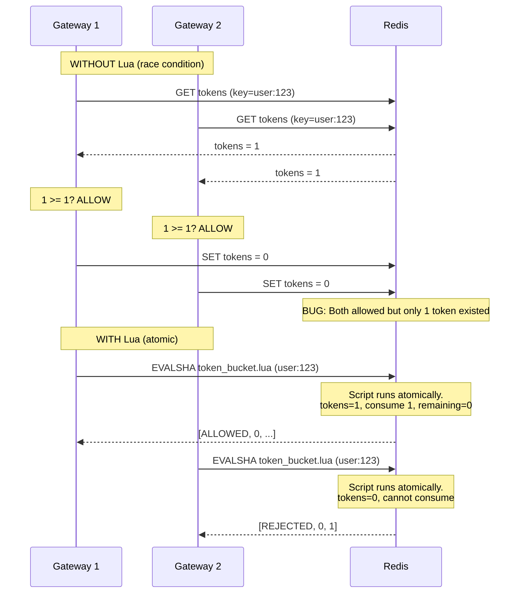
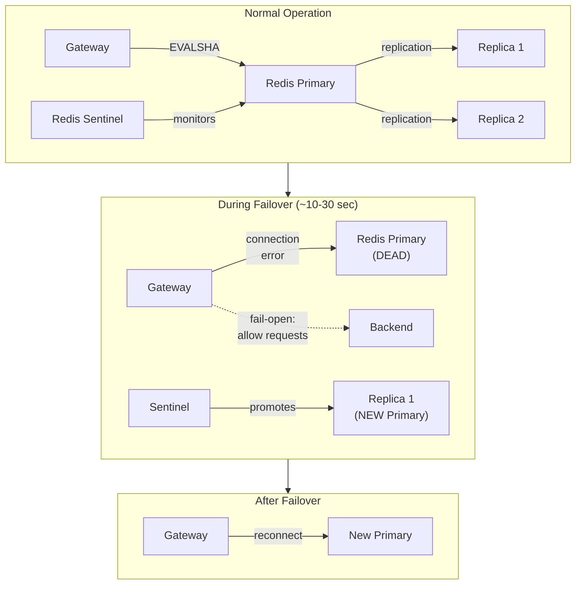
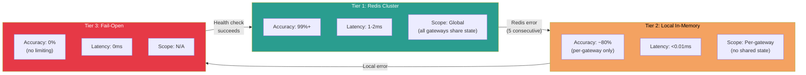
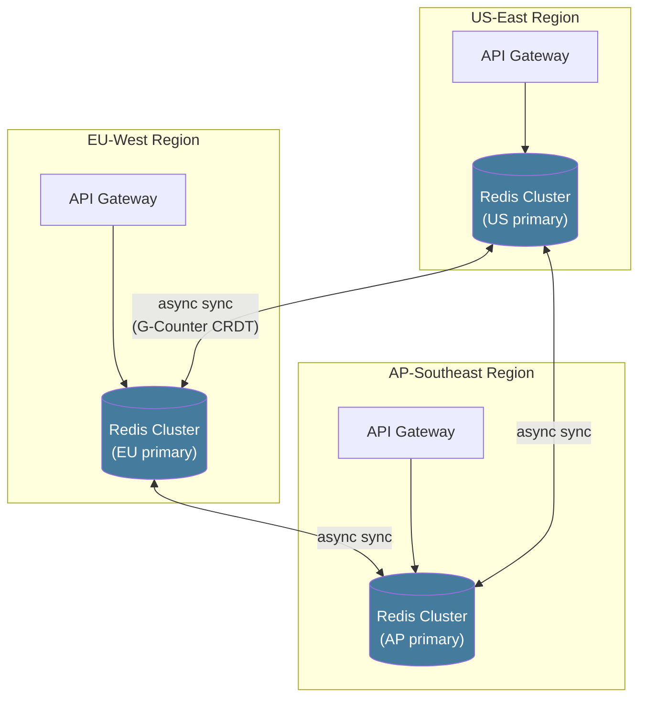
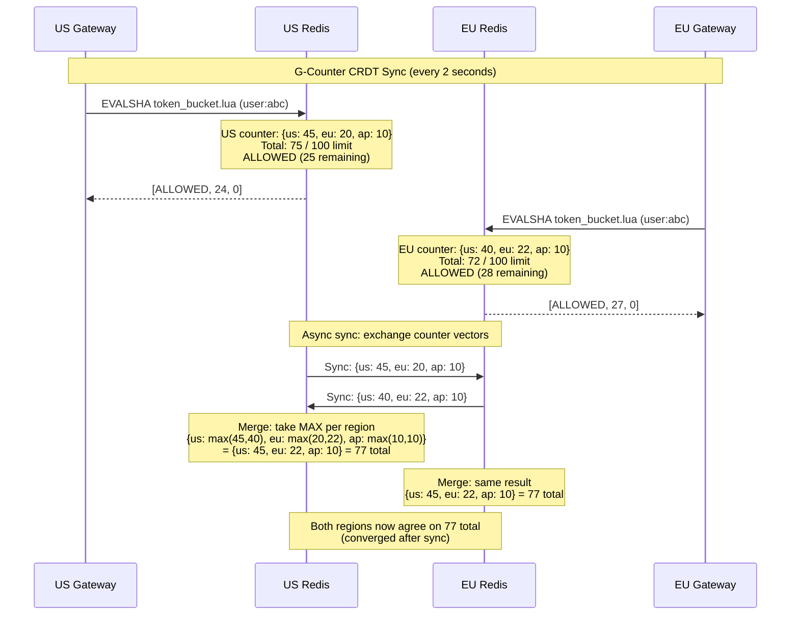
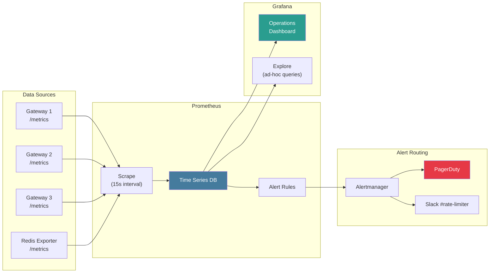
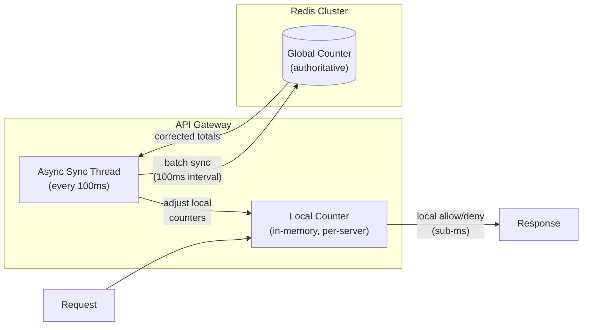
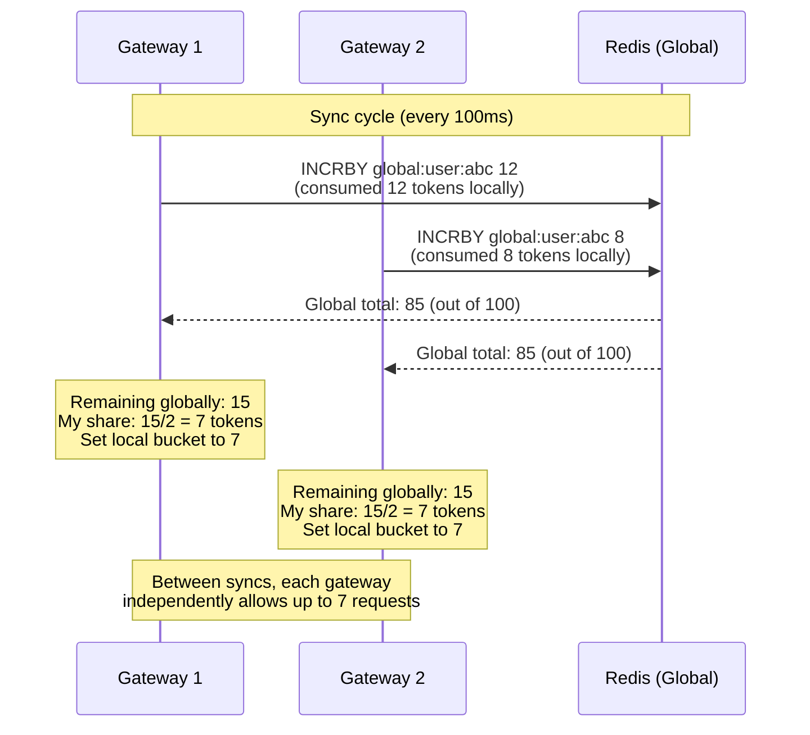
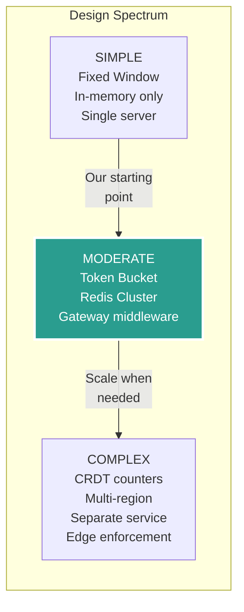

# Design a Rate Limiter -- Part 3: Deep Dive & Scaling

> **Top Uber / Stripe / Cloudflare Interview Question**
>
> This is Part 3 of a three-part deep dive into designing a production-grade
> rate limiter for a senior-level system design interview. This file covers
> distributed challenges, multi-region design, observability, extreme-scale
> architecture, real-world examples, trade-offs, and interview tips.
>
> **Series:**
> 1. [Requirements & Estimation](./requirements-and-estimation.md)
> 2. [High-Level Design](./high-level-design.md)
> 3. **Deep Dive & Scaling** (this file)

---

## Table of Contents

1. [Distributed Challenges](#distributed-challenges)
   - Race Conditions
   - Clock Synchronization
   - Redis Failover
   - Failover Strategy Implementation
   - Multi-Region Rate Limiting
2. [Observability](#observability)
   - Prometheus Metrics
   - Alerting Rules
   - Grafana Dashboard
3. [Scaling to 10M+ req/sec](#scaling-to-10m-reqsec)
   - Redis Layer Scaling
   - Hybrid Local + Remote Architecture
   - Connection Pooling and Pipelining
4. [Real-World Rate Limiting Systems](#real-world-rate-limiting-systems)
   - Stripe
   - GitHub
   - Twitter/X
   - Cloudflare
   - Comparison Table
5. [Trade-Off Analysis](#trade-off-analysis)
6. [Design Summary Cheat Sheet](#design-summary-cheat-sheet)
7. [Interview Tips & Follow-Ups](#interview-tips--common-follow-ups)

---

## Distributed Challenges

> **Interview tip**: This is where follow-up questions live. Be ready for
> "what about clock sync?", "what if Redis goes down?", "how do you rate
> limit across regions?" These are differentiating answers.

---

### Challenge 1: Race Conditions

The fundamental problem with distributed rate limiting is that multiple
gateway instances may check and modify the same counter concurrently.



**Solution**: Lua scripts execute atomically in Redis. Since Redis processes commands
single-threaded, a Lua script runs without interleaving. No locks needed.

### Race Condition Impact Analysis

```
IMPACT AT SCALE (without Lua atomicity):

  Scenario: 10 gateway instances, 1 token remaining, 10 concurrent requests
  
  Without atomicity:
    All 10 gateways read tokens=1 simultaneously
    All 10 allow the request (each sees 1 token)
    Actual allowed: 10 (should be 1)
    Overshoot: 10x (900% error)

  With Lua atomicity:
    Gateway 1 runs script: tokens=1 -> consume -> remaining=0, ALLOWED
    Gateways 2-10 run script: tokens=0 -> REJECTED
    Actual allowed: 1 (correct)
    Overshoot: 0%

  The race condition is NOT theoretical. At 500K req/sec across 5 gateways,
  concurrent access to the same key is COMMON. Without Lua, overshoot
  can reach 2-5x for popular keys (hot clients).

  Alternative atomic approaches and why they are inferior:
    WATCH/MULTI (optimistic locking):
      - Detects conflicts and retries
      - Under contention, retry rate explodes (100+ retries for hot keys)
      - Wastes Redis CPU on failed transactions
      - Latency becomes unpredictable (retry loops)
    
    INCR + conditional logic in client:
      - INCR is atomic, but the decision logic is not
      - Client reads count, decides allow/reject, but another increment
        may arrive between read and decision
      - Fundamentally broken for decrement-if-sufficient pattern
    
    Distributed locks (Redlock):
      - Overkill: 5-10ms per lock acquisition
      - At 500K/sec, lock contention would bring Redis to its knees
      - Rate limiting does not need mutual exclusion, just atomic RMW
```

---

### Challenge 2: Clock Synchronization

```
PROBLEM:
  Gateway 1 clock: 12:00:59.990  (thinks Window A)
  Gateway 2 clock: 12:01:00.010  (thinks Window B)
  
  Same user's request lands on different windows depending on which
  gateway handles it. Counters split across windows.

SOLUTIONS (ranked by preference):

  1. USE REDIS SERVER TIME (best):
     Replace ARGV[3] with Redis TIME command inside the Lua script:
     
       local time = redis.call('TIME')
       local now = tonumber(time[1]) + tonumber(time[2]) / 1000000
     
     All gateways use the same clock (Redis server's). Zero drift.
     Cost: one extra Redis call per script execution (negligible).

  2. NTP SYNC (acceptable):
     Cloud instances sync via NTP with <10ms drift.
     For Token Bucket with 1-second granularity, 10ms drift is
     irrelevant (0.01 token error at refill_rate=1/sec).

  3. LOGICAL CLOCKS (overkill for rate limiting):
     Lamport timestamps or vector clocks. Unnecessary complexity
     for a system that tolerates 1-5% overshoot.

RECOMMENDATION: Use Redis TIME in Lua for correctness at zero cost.
```

### Clock Drift Impact Analysis

```
QUANTIFYING CLOCK DRIFT IMPACT:

  Token Bucket with refill_rate = 1.67 tok/sec (100/min):

    NTP drift of 10ms:
      Error = 10ms * 1.67 tok/sec = 0.0167 tokens
      Impact: negligible (0.017% of a single token)

    Worst-case drift of 100ms (misconfigured NTP):
      Error = 100ms * 1.67 = 0.167 tokens
      Impact: still negligible for our 1-5% overshoot tolerance

  Sliding Window Counter with 60-second window:

    NTP drift of 10ms:
      Window boundary error: 10ms / 60s = 0.017% of window
      Impact: weighted average shifts by 0.017% -- invisible

    NTP drift of 1 second (very broken NTP):
      Window boundary error: 1s / 60s = 1.67% of window
      Impact: up to ~1.67% counting error -- within tolerance

  CONCLUSION: Clock sync is a non-issue for Token Bucket with NTP.
  Use Redis TIME anyway for defense-in-depth (zero cost, max correctness).
```

---

### Challenge 3: Redis Failover



```
FAILOVER SCENARIOS AND MITIGATIONS:

1. Redis primary dies, Sentinel promotes replica:
   - Risk: Brief window (~10-30s) where writes to old primary are lost
   - Counter values may be slightly stale on the new primary
   - Impact: Some users briefly exceed limits
   - Mitigation: Acceptable for 1-5% overshoot requirement

2. Network partition (split-brain):
   - Risk: Two primaries accept writes
   - Mitigation: Redis Sentinel's quorum prevents this. Minimum 3 sentinels.
   - Additional: Use WAIT command for critical writes (trades latency for safety)

3. Full Redis Cluster outage:
   - Risk: All rate limiting stops
   - Mitigation: Fail-open + local in-memory fallback + alerts

4. Redis Cluster shard failure:
   - Risk: Keys mapped to that shard become inaccessible
   - Mitigation: Redis Cluster auto-migrates slots after promotion
   - During migration (~10-30s): fail-open for affected keys only
   - Other shards continue operating normally

5. Lua script eviction (Redis restart or SCRIPT FLUSH):
   - Risk: EVALSHA returns NOSCRIPT error
   - Mitigation: Catch NOSCRIPT, re-register with SCRIPT LOAD, retry
   - Adds ~1ms on first request after restart (one-time penalty)
```

### Failover Strategy Implementation

```python
class RateLimiterWithFailover:
    """
    Production rate limiter with three-tier failover:
      Tier 1: Redis Cluster (normal operation)
      Tier 2: Local in-memory token bucket (Redis unavailable)
      Tier 3: Fail-open (everything fails -- just allow traffic)
    """

    def __init__(self, redis_cluster, rules_engine, metrics):
        self.redis = redis_cluster
        self.rules = rules_engine
        self.metrics = metrics

        # Local fallback: per-key in-memory token buckets
        # Only used when Redis is unreachable
        self.local_buckets = {}  # key -> {tokens, last_refill}
        self.local_bucket_lock = threading.Lock()

        # Circuit breaker state
        self.redis_healthy = True
        self.consecutive_errors = 0
        self.error_threshold = 5
        self.last_health_check = 0

    def check(self, api_key: str, tier: str, endpoint: str) -> dict:
        rule = self.rules.resolve(api_key, tier, endpoint)

        if rule.exempt:
            return {"allowed": True, "exempt": True}

        # Try Redis first
        if self.redis_healthy:
            try:
                result = self._check_redis(api_key, endpoint, rule)
                self.consecutive_errors = 0
                self.metrics.increment("rl.check", tags=["backend:redis"])
                return result
            except Exception as e:
                self.consecutive_errors += 1
                self.metrics.increment("rl.redis_error")
                if self.consecutive_errors >= self.error_threshold:
                    self.redis_healthy = False
                    self.metrics.increment("rl.circuit_open")

        # Tier 2: Local fallback
        try:
            result = self._check_local(api_key, endpoint, rule)
            self.metrics.increment("rl.check", tags=["backend:local"])
            return {**result, "degraded": True}
        except Exception:
            pass

        # Tier 3: Fail-open
        self.metrics.increment("rl.fail_open")
        return {"allowed": True, "degraded": True, "fail_open": True}

    def _check_local(self, api_key, endpoint, rule):
        """In-memory token bucket fallback (per-gateway, not global)."""
        key = f"{api_key}:{endpoint}"
        now = time.time()

        with self.local_bucket_lock:
            if key not in self.local_buckets:
                self.local_buckets[key] = {
                    "tokens": rule.capacity,
                    "last_refill": now,
                }

            bucket = self.local_buckets[key]
            elapsed = now - bucket["last_refill"]
            bucket["tokens"] = min(
                rule.capacity,
                bucket["tokens"] + elapsed * rule.refill_rate
            )
            bucket["last_refill"] = now

            if bucket["tokens"] >= rule.tokens_per_request:
                bucket["tokens"] -= rule.tokens_per_request
                return {"allowed": True, "remaining": int(bucket["tokens"])}
            else:
                return {"allowed": False, "remaining": 0}

    def _periodic_health_check(self):
        """Background thread: attempt Redis reconnection every 5 seconds."""
        while True:
            time.sleep(5)
            if not self.redis_healthy:
                try:
                    self.redis.ping()
                    self.redis_healthy = True
                    self.consecutive_errors = 0
                    self.metrics.increment("rl.circuit_closed")
                except Exception:
                    pass  # Still down, try again in 5 seconds
```

### Failover Tier Comparison



```
LOCAL FALLBACK LIMITATIONS:

  Problem: With 5 gateway instances and per-gateway local buckets,
    each gateway independently tracks its own counters.

  Impact:
    Global limit: 100 req/min
    Per-gateway effective limit: 100 req/min (each gateway has full capacity)
    If a client hits all 5 gateways equally: 5 * 100 = 500 req/min allowed
    Overshoot: 5x during Redis outage

  Mitigations:
    Option A: Divide limit by expected gateway count
      Per-gateway limit = 100 / 5 = 20 req/min
      Con: if traffic is unevenly distributed, some gateways reject prematurely

    Option B: Use a fraction (e.g., 1/3 of limit per gateway)
      Per-gateway limit = 100 / 3 = ~33 req/min
      Total possible: 5 * 33 = 165 (1.65x overshoot)
      Con: still imprecise, but bounded

    Option C: Accept the overshoot during brief Redis outages
      Typical Redis failover: 10-30 seconds
      In 30 seconds at 5x overshoot: 250 extra requests
      For most APIs, this is acceptable

  RECOMMENDATION: Option C for simplicity. Alert immediately on failover
    so ops can investigate. Redis should recover within 30 seconds.
```

---

### Challenge 4: Multi-Region Rate Limiting



```
MULTI-REGION STRATEGIES (ascending complexity):

Option A: Single-Region Redis (simple, latent)
  - All rate limit checks go to one Redis region (e.g., US-East)
  - Cross-region latency: +100-200ms for EU/AP clients
  - Pro: Perfectly accurate. Con: Latency penalty for remote users.
  - Use when: accuracy > latency, or most traffic is in one region.

Option B: Per-Region Independent Limits (simple, inaccurate)
  - Each region has its own Redis cluster
  - Divide global limit by number of regions: 100/3 = ~33 per region
  - Pro: Zero cross-region latency. Con: Inaccurate if traffic is uneven.
  - Use when: latency > accuracy, traffic roughly even across regions.

Option C: CRDT-Based Counters (complex, best-of-both)
  - Each region maintains a G-Counter (grow-only counter)
  - Periodically sync counters across regions (every 1-5 seconds)
  - Merge: take max of each region's counter
  - Eventually consistent: may briefly allow ~10% overshoot during sync lag
  - Pro: Low latency + reasonable accuracy.
  - Con: Complex implementation. Used by Cloudflare, Akamai.

RECOMMENDATION: Start with Option A or B depending on latency requirements.
  Move to Option C only if global rate limiting accuracy is critical.
```

### CRDT-Based Multi-Region: Detailed Design



```
G-COUNTER CRDT PROPERTIES:

  Structure: Map of {region -> count}
    US Redis: {us: 45, eu: 20, ap: 10}
    EU Redis: {us: 40, eu: 22, ap: 10}

  Merge function: take MAX of each region's count
    Merged: {us: max(45,40)=45, eu: max(20,22)=22, ap: max(10,10)=10}
    Total: 45 + 22 + 10 = 77

  Properties:
    - Commutative: merge(A,B) = merge(B,A)
    - Associative: merge(merge(A,B),C) = merge(A,merge(B,C))
    - Idempotent: merge(A,A) = A
    - Eventually consistent: all regions converge to same total

  Overshoot during sync lag:
    Sync interval: 2 seconds
    Max concurrent requests across regions: ~1000 in 2 seconds
    Worst-case overshoot: ~2 seconds * request rate per region
    For limit=100/min: overshoot ~3-5 requests (3-5%)
    Within our 1-5% tolerance.

  Implementation options:
    - Redis Streams: publish counter updates, consume in each region
    - Kafka: durable cross-region counter sync with exactly-once semantics
    - Direct Redis-to-Redis: custom sync daemon using PUBLISH/SUBSCRIBE
    - Cloud-native: AWS Global Datastore for Redis (built-in replication)
```

### Multi-Region Option Comparison

| Aspect | Option A: Single Region | Option B: Split Limits | Option C: CRDT Sync |
|--------|------------------------|----------------------|---------------------|
| Latency (same region) | 1-2ms | 1-2ms | 1-2ms |
| Latency (cross-region) | 100-200ms | N/A (local) | 1-2ms |
| Accuracy | 100% | 60-80% (uneven traffic) | 95-99% |
| Complexity | Low | Low | High |
| Redis clusters | 1 (centralized) | 1 per region | 1 per region + sync |
| Best for | Single-region heavy | Even global traffic | Global accuracy needs |

---

## Observability

> **Interview tip**: Spend 5-7 minutes wrapping up. Cover monitoring,
> scaling, and mention real-world examples. This shows production mindset.

---

### Prometheus Metrics

```python
from prometheus_client import Counter, Histogram, Gauge

# ---------------------------------------------------------------
# Decision metrics
# ---------------------------------------------------------------
rate_limit_decisions = Counter(
    'rate_limit_decisions_total',
    'Total rate limit decisions',
    ['api_key', 'endpoint', 'tier', 'decision']
    # decision: "allowed" | "rejected" | "exempt"
)

# ---------------------------------------------------------------
# Latency of rate limit checks (should be < 5ms p99)
# ---------------------------------------------------------------
rate_limit_latency = Histogram(
    'rate_limit_check_duration_seconds',
    'Time to perform rate limit check (including Redis round-trip)',
    ['backend'],  # "redis" | "local" | "fail_open"
    buckets=[0.0001, 0.0005, 0.001, 0.002, 0.005, 0.01, 0.025, 0.05, 0.1]
)

# ---------------------------------------------------------------
# How close each client is to their limit (0.0 to 1.0+)
# ---------------------------------------------------------------
rate_limit_utilization = Gauge(
    'rate_limit_utilization_ratio',
    'Current usage as fraction of limit',
    ['api_key', 'endpoint']
)

# ---------------------------------------------------------------
# Redis backend health
# ---------------------------------------------------------------
redis_errors = Counter(
    'rate_limit_redis_errors_total',
    'Redis errors during rate limit checks',
    ['error_type']  # "connection" | "timeout" | "script"
)

redis_latency = Histogram(
    'rate_limit_redis_latency_seconds',
    'Redis EVALSHA round-trip latency',
    buckets=[0.0001, 0.0005, 0.001, 0.002, 0.005, 0.01, 0.05]
)

# ---------------------------------------------------------------
# Failover events
# ---------------------------------------------------------------
failover_events = Counter(
    'rate_limit_failover_total',
    'Times rate limiter fell back from primary to fallback',
    ['from_backend', 'to_backend']
    # e.g., from_backend="redis", to_backend="local"
)

# ---------------------------------------------------------------
# Rules engine metrics
# ---------------------------------------------------------------
rules_reload_count = Counter(
    'rate_limit_rules_reload_total',
    'Number of successful rule reloads',
    ['source']  # "yaml" | "api" | "db"
)

rules_reload_errors = Counter(
    'rate_limit_rules_reload_errors_total',
    'Number of failed rule reloads',
    ['error_type']  # "parse" | "connection" | "validation"
)

active_rules_count = Gauge(
    'rate_limit_active_rules',
    'Number of currently active rate limit rules',
    ['rule_type']  # "tier" | "endpoint" | "client_override"
)
```

### Metric Cardinality Warning

```
HIGH-CARDINALITY LABELS (DANGER):

  PROBLEM: Using api_key as a Prometheus label with 10M unique keys
    creates 10M time series. Prometheus will run out of memory.

  SOLUTION: Aggregate by tier, not by individual key.
    BAD:  rate_limit_decisions{api_key="abc123", ...}  (10M series)
    GOOD: rate_limit_decisions{tier="pro", endpoint="/api/orders", ...}  (~50 series)

  For per-key debugging, use LOGS (not metrics):
    Log each 429 rejection with full key detail
    Query logs on-demand via Elasticsearch/Loki
    Metrics are for dashboards; logs are for investigation.

  Alternatively, use a "top-N" approach:
    Track the top 100 rate-limited keys by rejection count
    Expose as a separate metric with bounded cardinality
    Update the top-N list every 60 seconds
```

### Prometheus Alerting Rules

```yaml
# prometheus-alerts.yaml
groups:
  - name: rate_limiting_alerts
    rules:
      # CRITICAL: Redis is down, rate limiter is degraded
      - alert: RateLimiterRedisDown
        expr: |
          rate(rate_limit_redis_errors_total[2m]) > 10
        for: 1m
        labels:
          severity: critical
          team: platform
        annotations:
          summary: "Rate limiter Redis backend is failing"
          runbook: "https://wiki.internal/runbooks/rate-limiter-redis"

      # WARNING: High rejection rate (may indicate misconfigured limits)
      - alert: HighRejectionRate
        expr: |
          sum(rate(rate_limit_decisions_total{decision="rejected"}[5m]))
          /
          sum(rate(rate_limit_decisions_total[5m]))
          > 0.10
        for: 5m
        labels:
          severity: warning
        annotations:
          summary: ">10% of requests rejected -- check if limits are too low"

      # WARNING: Specific client near limit for extended period
      - alert: ClientApproachingLimit
        expr: rate_limit_utilization_ratio > 0.90
        for: 10m
        labels:
          severity: info
        annotations:
          summary: "Client {{ $labels.api_key }} at >90% utilization for 10+ min"

      # CRITICAL: Rate limit check latency exceeds SLA
      - alert: RateLimitLatencyHigh
        expr: |
          histogram_quantile(0.99,
            rate(rate_limit_check_duration_seconds_bucket[5m])
          ) > 0.010
        for: 2m
        labels:
          severity: critical
        annotations:
          summary: "P99 rate limit check latency > 10ms (SLA: 5ms)"

      # CRITICAL: Rate limiter operating in fail-open mode
      - alert: RateLimiterFailOpen
        expr: |
          rate(rate_limit_failover_total{to_backend="fail_open"}[5m]) > 0
        for: 1m
        labels:
          severity: critical
        annotations:
          summary: "Rate limiter is in fail-open mode -- no rate limiting active"

      # WARNING: Rules engine failed to reload
      - alert: RulesReloadFailing
        expr: |
          rate(rate_limit_rules_reload_errors_total[10m]) > 0
        for: 5m
        labels:
          severity: warning
        annotations:
          summary: "Rate limit rules failed to reload -- serving stale config"

      # INFO: Traffic spike detected (proactive capacity alert)
      - alert: TrafficSpike
        expr: |
          sum(rate(rate_limit_decisions_total[1m]))
          > 1.5 * sum(rate(rate_limit_decisions_total[1h] offset 1d))
        for: 5m
        labels:
          severity: info
        annotations:
          summary: "Traffic is 50% above same time yesterday -- monitor for capacity"
```

### Grafana Dashboard Layout

```
DASHBOARD: Rate Limiter Operations
========================================================

Row 1: Key Indicators (Stat panels)
  [Requests/sec]  [Rejected/sec]  [Rejection %]  [P99 Latency]  [Redis Status]

Row 2: Decisions Over Time (Time series, stacked area)
  [Allowed vs Rejected vs Exempt requests over time]

Row 3: Top Rate-Limited Clients (Table, sorted by rejection count)
  | API Key          | Tier  | Endpoint        | Requests | Rejected | Util% |
  |------------------|-------|-----------------|----------|----------|-------|
  | apikey_abc123    | free  | GET /api/search | 1,204    | 312      | 94%   |
  | apikey_xyz789    | pro   | POST /api/data  | 8,401    | 89       | 78%   |

Row 4: Latency Distribution (Histogram heatmap)
  [Rate limit check latency heatmap: x=time, y=latency bucket, color=count]

Row 5: Redis Health (Multi-stat + time series)
  [Redis ops/sec]  [Redis memory MB]  [Redis errors/sec]  [Failover count]

Row 6: Rules & Config (Table)
  [Active rules count]  [Last config reload]  [Config errors]

Row 7: Per-Tier Breakdown (Time series, one line per tier)
  [Free tier rejection %]  [Pro tier rejection %]  [Enterprise rejection %]

Row 8: Multi-Region (if applicable)
  [Per-region request rate]  [Cross-region sync lag]  [Per-region rejection %]
```

### Grafana Dashboard: Architecture Diagram



---

## Scaling to 10M+ req/sec

---

### Scaling the Redis Layer

```
CURRENT: 500K req/sec --> 5 Redis shards

SCALING TRIGGERS:
  - Redis CPU > 70% sustained       --> Add shard
  - Redis latency p99 > 5ms         --> Add shard or optimize Lua
  - Memory usage > 75% of instance  --> Upgrade instance or add shard

SCALING PATH:
  500K req/sec   -->  5 shards  (100K/shard)
  1M req/sec     --> 10 shards  (100K/shard)
  5M req/sec     --> 25 shards + connection pooling + pipeline batching
  10M+ req/sec   --> Hybrid: local counters + async Redis sync (see below)
```

### Hybrid Local + Remote Architecture (10M+ req/sec)



```
HYBRID APPROACH (for extreme scale):

  1. Each gateway maintains LOCAL token buckets (in-memory)
  2. Requests are checked against local counters (sub-microsecond)
  3. Every 100ms, a background thread:
     a) Reports local consumption to Redis (INCRBY batch)
     b) Reads global total from Redis
     c) Adjusts local allocation (e.g., if 5 gateways, each gets 1/5 of remaining)

  Trade-offs:
    + Sub-microsecond latency (no network hop)
    + Survives Redis outages seamlessly
    - ~5-10% accuracy loss during sync intervals
    - More complex implementation

  Used by: Envoy rate limiter, Lyft's rate limiting service
```

### Hybrid Architecture: Detailed Sync Protocol



```
ALLOCATION STRATEGIES FOR HYBRID:

  Strategy 1: Equal Split
    Each gateway gets: remaining / num_gateways
    Pro: Simple. Con: Wasteful if traffic is uneven.

  Strategy 2: Proportional Allocation
    Each gateway gets: remaining * (my_recent_rate / total_recent_rate)
    Pro: Adapts to traffic distribution. Con: Requires rate tracking.

  Strategy 3: Steal-Work
    Each gateway gets a minimum allocation (e.g., 10%)
    If a gateway runs out, it requests more from Redis (on-demand)
    Pro: Best utilization. Con: Occasional sync-time latency spikes.

  RECOMMENDATION: Start with Equal Split. Switch to Proportional
    if traffic distribution becomes very uneven (e.g., 80/20).
```

### Connection Pooling and Pipelining

```
CONNECTION POOLING (critical at scale):

  Without pooling:
    500K req/sec * connection setup (~0.5ms) = 250 CPU-seconds of overhead/sec
    Redis would be overwhelmed by connection churn

  With pooling:
    Maintain a pool of N persistent connections per gateway
    N = (target_throughput / throughput_per_connection)
    Example: 100K req/sec per gateway / 10K req/sec per connection = 10 connections
    Connection reuse eliminates setup overhead entirely

  Pool sizing:
    Too few: requests queue waiting for a connection (latency spike)
    Too many: Redis connection limit hit (redis.conf: maxclients)
    Rule of thumb: 2x the number of concurrent request handlers


PIPELINE BATCHING (for hybrid sync):

  Instead of sending 1000 individual EVALSHA calls:
    Send them in a pipeline (batch) of 1000
    Redis processes the batch in one network round-trip
    Throughput: 10x improvement over individual calls

  Implementation (Python redis-py):
    pipe = redis.pipeline(transaction=False)
    for key, args in batch:
        pipe.evalsha(SCRIPT_SHA, 1, key, *args)
    results = pipe.execute()

  Applicable for the hybrid sync thread:
    Batch all local consumption reports into one pipeline
    Batch all global reads into one pipeline
    Two round-trips per sync cycle instead of N
```

---

## Real-World Rate Limiting Systems

---

### Stripe

```
STRIPE API RATE LIMITING
========================
Algorithm: Token Bucket per API key
Limits:
  - Test mode:  25 req/sec
  - Live mode: 100 req/sec (burst allowed up to limit)
  - Per-endpoint: slower limits on expensive endpoints (e.g., file uploads)

Headers returned:
  Stripe-RateLimit-Limit: 100
  Stripe-RateLimit-Remaining: 95
  Stripe-RateLimit-Reset: 1672531260

Notable design decisions:
  - Separate read vs write limits (reads are more permissive)
  - Idempotent requests have higher limits (safe to retry)
  - Webhook delivery has its own independent limit
  - Dashboard shows real-time rate limit utilization graph
  - 429 response includes machine-readable error code for SDKs
  - SDKs implement automatic retry with exponential backoff
  - Test mode has lower limits to catch integration issues early
```

### GitHub

```
GITHUB API RATE LIMITING
========================
Algorithm: Fixed Window per user (1-hour windows)
Limits:
  Authenticated:    5,000 req/hour
  Unauthenticated:  60 req/hour (by IP)
  GitHub Apps:      5,000 + 50 per user (max 12,500)
  Search API:       30 req/min (separate pool)
  GraphQL:          5,000 points/hour (complexity-based)

Headers:
  X-RateLimit-Limit: 5000
  X-RateLimit-Remaining: 4987
  X-RateLimit-Reset: 1672531260
  X-RateLimit-Used: 13
  X-RateLimit-Resource: core    (which limit pool)

Notable design decisions:
  - Conditional requests (304 Not Modified) do NOT count against limit
  - GraphQL uses point-based costing, not flat per-request
  - Separate "resources": core, search, graphql, code_search
  - Secondary rate limits for abuse prevention (undocumented exact limits)
  - Enterprise customers get custom limits via support
```

### Twitter/X

```
TWITTER/X API RATE LIMITING
============================
Algorithm: Sliding Window per endpoint per user (15-min windows)
Limits (v2 API):
  GET /tweets:        300 req / 15 min (user)
  POST /tweets:       200 req / 15 min (user, v2)
  GET /users/me:      75 req / 15 min
  GET /tweets/search: 300 req / 15 min (app-level)

Headers:
  x-rate-limit-limit: 300
  x-rate-limit-remaining: 295
  x-rate-limit-reset: 1672531260

Notable design decisions:
  - 15-minute windows (unusual -- most use 1 min or 1 hour)
  - Both user-level AND app-level limits (double layer)
  - Different tiers: Free, Basic ($100/mo), Pro ($5000/mo), Enterprise
  - Free tier is extremely limited (1,500 tweets/month read)
  - Per-endpoint limits, not global (each endpoint has its own counter)
```

### Cloudflare

```
CLOUDFLARE RATE LIMITING
========================
Algorithm: Sliding Window Counter (at edge PoPs)
Scale:
  - 200+ data centers worldwide
  - Millions of rate limit rules evaluated per second
  - Per-PoP counters with CRDT cross-PoP synchronization

Architecture:
  - Rate limiting runs at the edge (in the CDN PoP), not origin
  - Each PoP maintains local counters
  - Counters sync across PoPs via an eventually consistent protocol
  - Convergence time: 1-5 seconds across PoPs in the same region

Notable design decisions:
  - Expression-based rules (not just IP/endpoint, but headers, cookies, etc.)
  - Action options: block, challenge (CAPTCHA), JS challenge, managed challenge
  - Counting options: per-IP, per-IP+path, per-header value, per-cookie
  - Cost-based: can assign different costs to different request patterns
  - Rules evaluated at L7 in the Cloudflare edge proxy (Rust/C++)
  - Sub-millisecond decision latency (entirely in-memory at edge)
```

### Comparison Table

| Aspect | Stripe | GitHub | Twitter/X | Cloudflare |
|--------|--------|--------|-----------|------------|
| Algorithm | Token Bucket | Fixed Window | Sliding Window | Sliding Window Counter |
| Window | Per-second | 1 hour | 15 minutes | Configurable |
| Limit Key | API key | User / IP | User + App | IP / Header / Cookie |
| Burst | Yes (bucket) | No | No | Configurable |
| Complexity Pricing | No | Yes (GraphQL) | No | Yes (cost-based) |
| Tiers | Test/Live | Auth/Unauth/App | Free/Basic/Pro/Enterprise | Free/Pro/Business/Enterprise |
| Headers | Custom (`Stripe-*`) | Standard (`X-RateLimit-*`) | Standard (`x-rate-limit-*`) | Standard |
| Enforcement Location | API server | API server | API server | Edge (CDN PoP) |
| Multi-Region | Centralized | Centralized | Centralized | Distributed (CRDT) |

### Lessons from Production Systems

```
WHAT WE CAN LEARN:

  From Stripe:
    - Separate read vs write limits (reads are cheap, writes are expensive)
    - Idempotency-aware limits (safe retries get higher limits)
    - Machine-readable error codes in 429 response (SDKs can auto-handle)

  From GitHub:
    - Complexity-based costing for GraphQL (not all queries are equal)
    - Conditional requests (304) are free (encourages caching)
    - Separate resource pools (search vs core vs graphql)

  From Twitter:
    - Per-endpoint limits (not global) give fine-grained control
    - Dual-layer limits (user + app) prevent both user and app abuse
    - 15-minute windows balance accuracy and operational simplicity

  From Cloudflare:
    - Edge enforcement eliminates origin round-trip for rejected requests
    - CRDT sync enables distributed accuracy at global scale
    - Expression-based rules (not just static keys) enable rich policies
    - Multiple action types (block, challenge, JS challenge) beyond just 429
```

---

## Trade-Off Analysis

```
KEY TRADE-OFFS IN OUR DESIGN:

  1. ACCURACY vs LATENCY
     Decision: Accept 1-5% overshoot for sub-5ms latency
     Rationale: Banking-grade accuracy requires distributed consensus
       (Raft/Paxos), adding 10-50ms per check. Our API clients need
       speed more than precision. A few extra requests slipping through
       is harmless compared to adding latency to every request.

  2. COMPLEXITY vs SAFETY (Fail-Open)
     Decision: Fail-open over fail-closed
     Rationale: Fail-closed (reject on error) is safer against abuse
       but catastrophic for availability. If Redis goes down and we
       fail-closed, we block ALL traffic -- a self-inflicted outage.
       Fail-open risks brief abuse but keeps the service running.
       Alert immediately so ops can respond.

  3. CENTRALIZED vs LOCAL
     Decision: Redis for accuracy, local fallback for resilience
     Rationale: Redis provides shared state (accurate global counting).
       Local in-memory provides resilience (works when Redis is down).
       The three-tier failover (Redis -> Local -> Fail-open) gives us
       the best of both worlds.

  4. SIMPLICITY vs FLEXIBILITY
     Decision: Gateway middleware now, extract to service later
     Rationale: Starting with middleware is simpler (no extra service
       to operate). If we need multi-gateway support or independent
       scaling, we can extract to a separate service later. YAGNI
       until proven otherwise.

  5. MEMORY vs ACCURACY (Algorithm Choice)
     Decision: Token Bucket (O(1) memory) over Sliding Window Log (O(N))
     Rationale: At 10M keys with Enterprise limits (6000/min),
       Sliding Window Log would consume ~960 GB. Token Bucket needs ~1.6 GB.
       Token Bucket's burst tolerance is actually a feature for API clients.
       Use Sliding Window Log only for security-critical endpoints (login).

  6. CONSISTENCY vs AVAILABILITY (Multi-Region)
     Decision: Per-region limits (Option B) or CRDT (Option C)
     Rationale: Single-region Redis (Option A) guarantees accuracy but
       adds 100-200ms for remote users. Per-region is simpler but less
       accurate. CRDT is the best tradeoff but complex. Choose based on
       business requirements and team capacity.

  7. CONFIGURABILITY vs OPERATIONAL RISK
     Decision: Hot-reloadable YAML with DB backup
     Rationale: Hot-reload enables rapid response to abuse or traffic
       changes without deploys. Risk: misconfigured rules could block
       legitimate traffic. Mitigation: validation on write, audit logging,
       and the ability to quickly revert (Git-versioned YAML).
```

### Trade-Off Visualization



---

## Design Summary Cheat Sheet

```
+=====================================================================+
|                     RATE LIMITER -- DESIGN SUMMARY                  |
+=====================================================================+
|                                                                     |
|  ALGORITHM:    Token Bucket (primary) + Sliding Window Log (auth)   |
|  STORAGE:      Redis Cluster (5 shards, Lua scripts for atomicity)  |
|  PLACEMENT:    API Gateway middleware (extract to service at scale)  |
|  FAILOVER:     Redis --> Local in-memory --> Fail-open              |
|  RULES:        YAML config, hot-reloadable, tiered per client       |
|  CLOCK SYNC:   Redis TIME in Lua scripts (single source of truth)   |
|  HEADERS:      X-RateLimit-{Limit,Remaining,Reset} + Retry-After    |
|  RESPONSE:     429 Too Many Requests + JSON error body              |
|  MONITORING:   Prometheus + Grafana + PagerDuty                     |
|  KEY SCHEMA:   rl:{algo}:{api_key}:{endpoint}                      |
|  MULTI-REGION: Per-region limits or CRDT sync (depending on needs)  |
|  SCALING:      Horizontal Redis shards; hybrid local+remote at 10M+ |
|                                                                     |
|  KEY TRADE-OFFS:                                                    |
|    Accuracy vs Latency:  Accept 1-5% overshoot for sub-5ms latency  |
|    Complexity vs Safety:  Fail-open over fail-closed                 |
|    Centralized vs Local:  Redis for accuracy, local for resilience   |
|                                                                     |
+=====================================================================+
```

---

## Interview Tips & Common Follow-Ups

### The 45-Minute Timeline

```
 0:00 - 0:05   Step 1: Requirements clarification (ask 5-8 questions)
 0:05 - 0:07   Step 1: State FR/NFR, do back-of-envelope math
 0:07 - 0:18   Step 2: High-level architecture (draw diagram, explain flow)
 0:18 - 0:38   Step 3: Deep dive (algorithm, Lua script, rules, challenges)
 0:38 - 0:43   Step 4: Monitoring, scaling, real-world examples
 0:43 - 0:45   Summary: Restate key decisions and trade-offs
```

### Key Phrases That Impress Interviewers

```
"I would use a Token Bucket algorithm because it gives us independent control
over burst size and sustained rate -- two separate tuning knobs."

"Lua scripts give us atomicity in Redis without the overhead of MULTI/EXEC
transactions. Single-threaded execution means no race conditions."

"The rate limiter must fail-open. If Redis goes down, we lose rate limiting
but we NEVER take down the service. I would alert on this immediately."

"I would use Redis server TIME inside the Lua script instead of passing client
time, to eliminate clock synchronization issues across gateways."

"Rules should be hot-reloadable from YAML or a database. Changing a rate limit
should never require a code deploy."

"For multi-region, I would start with per-region independent limits and
move to CRDT-based counters if we need global accuracy."

"At 10M+ req/sec, I would move to a hybrid architecture: local counters for
sub-microsecond decisions with async Redis sync for global coordination."
```

### Common Follow-Up Questions & Answers

```
Q: "How would you handle rate limiting for WebSocket connections?"
A: Rate limit on connection establishment (per IP/user), then rate limit
   on messages per connection (token bucket per connection ID). Use a
   separate bucket for expensive message types (e.g., subscribe to 
   many channels).

Q: "How do you prevent a DDoS from overwhelming the rate limiter itself?"
A: Multi-layer defense:
   1. CDN/WAF blocks L3/L4 volumetric attacks before reaching the app
   2. IP-level rate limiting at the edge (Cloudflare, AWS Shield)
   3. The rate limiter itself only handles authenticated, post-WAF traffic
   4. Circuit breaker: if Redis latency spikes, switch to local-only mode

Q: "What if a user creates many API keys to bypass per-key limits?"
A: Rate limit at multiple dimensions simultaneously:
   - Per API-key: 100 req/min
   - Per user (account): 500 req/min (aggregates all their keys)
   - Per IP: 1000 req/min (catches key-rotation attacks)
   All three must pass for a request to be allowed.

Q: "Should you rate limit by cost, not just count?"
A: Yes, for APIs with varying operation costs:
   - GET /users:  1 token (cheap read)
   - POST /users: 5 tokens (write + validation + email)
   - POST /reports: 50 tokens (expensive computation)
   Token bucket naturally supports this via tokens_per_request parameter.

Q: "How do you test a rate limiter?"
A: Four levels:
   1. Unit tests: algorithm correctness (burst, refill, boundary)
   2. Integration tests: Redis Lua script behavior under concurrency
   3. Load tests: 100K req/sec against staging, verify <=5% overshoot
   4. Chaos tests: kill Redis primary mid-load, verify fail-open + recovery

Q: "What is the difference between rate limiting and throttling?"
A: Rate limiting = hard binary cutoff (allow or 429).
   Throttling = gradual degradation (add latency, reduce quality, queue).
   Best systems combine both: throttle first, then hard-reject.

Q: "How would you implement a 'retry budget' for downstream services?"
A: This is server-side rate limiting on retries specifically:
   - Track retry rate per downstream service (ratio of retries to total)
   - If retry ratio > 10%, start rejecting retries (allow only first attempts)
   - Prevents retry storms from cascading across microservices
   - Google SRE book calls this "retry budgets"

Q: "How would you handle rate limiting for GraphQL?"
A: GraphQL queries vary wildly in cost. Two approaches:
   1. Query complexity analysis: assign a point cost to each field/resolver.
      Rate limit on total points per window, not request count.
      Example: { users { posts { comments } } } = 1 + 10 + 100 = 111 points
   2. Depth/breadth limiting: reject queries exceeding max depth or width.
   GitHub uses approach 1 (5,000 points/hour for GraphQL).

Q: "What about rate limiting gRPC, not just HTTP?"
A: Same concepts apply. Differences:
   - gRPC uses HTTP/2, so use the same gateway middleware
   - Key extraction: from gRPC metadata (equivalent to HTTP headers)
   - Rejection: return gRPC status code RESOURCE_EXHAUSTED (14)
   - Headers: use gRPC trailing metadata for rate limit info
   - Streaming RPCs: rate limit per message, not per stream

Q: "How do you handle rate limits during a deploy/rolling update?"
A: Redis state persists across gateway deploys (state is external).
   No rate limit state is lost during rolling updates.
   For Lua script changes: use EVALSHA. If the new script SHA differs,
   NOSCRIPT error triggers re-registration automatically.
   Rule config changes: hot-reload from DB (no deploy needed).
```

### What Separates Good from Great Answers

```
GOOD ANSWER (pass):
  - Chooses an algorithm and explains it
  - Uses Redis for shared state
  - Returns 429 with basic headers
  - Mentions distributed challenges

GREAT ANSWER (strong hire):
  - Compares 5 algorithms with trade-off table
  - Writes the Lua script (even pseudo-code) showing atomicity
  - Designs a configurable rules engine with priority resolution
  - Discusses failover (Redis -> local -> fail-open)
  - Addresses clock sync, race conditions, multi-region
  - Shows production metrics (Prometheus + Grafana)
  - References real-world systems (Stripe, GitHub, Cloudflare)
  - Articulates trade-offs explicitly (accuracy vs latency, etc.)
  - Has a clear scaling path (5 shards -> hybrid at 10M+)
  - Mentions testing strategy (unit, integration, load, chaos)
```

---

## Back to the Series

- **[Part 1: Requirements & Estimation](./requirements-and-estimation.md)** -- Requirements,
  back-of-envelope math, API design, tiered limits.
- **[Part 2: High-Level Design](./high-level-design.md)** -- Architecture diagram, algorithm
  comparison, Redis Lua implementation, rules engine, HTTP headers.
