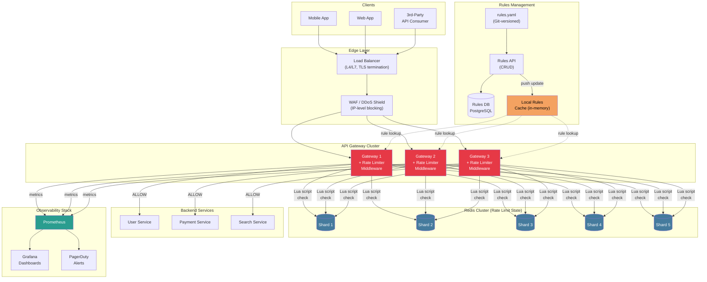
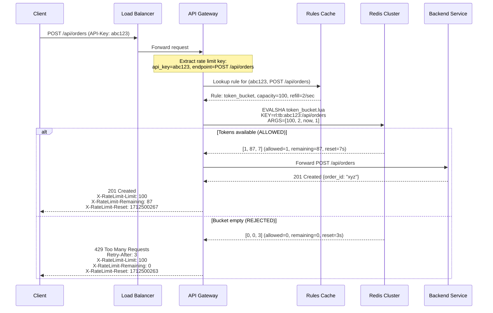
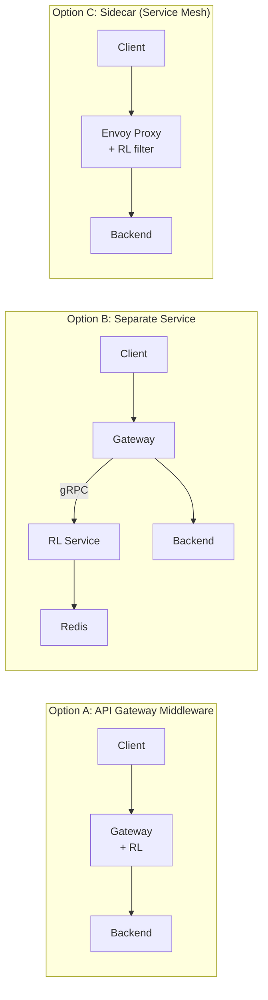
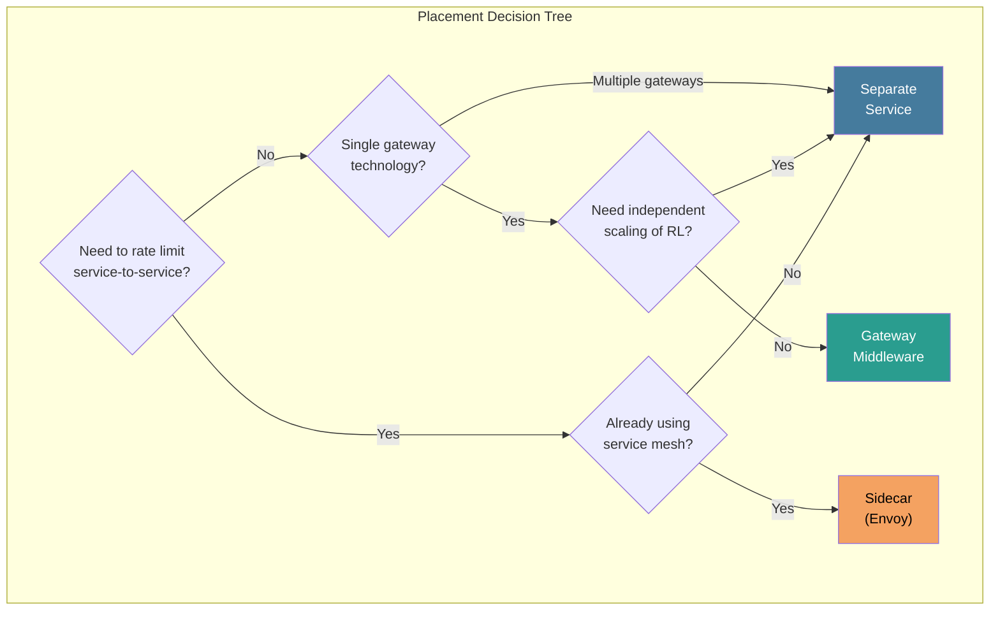
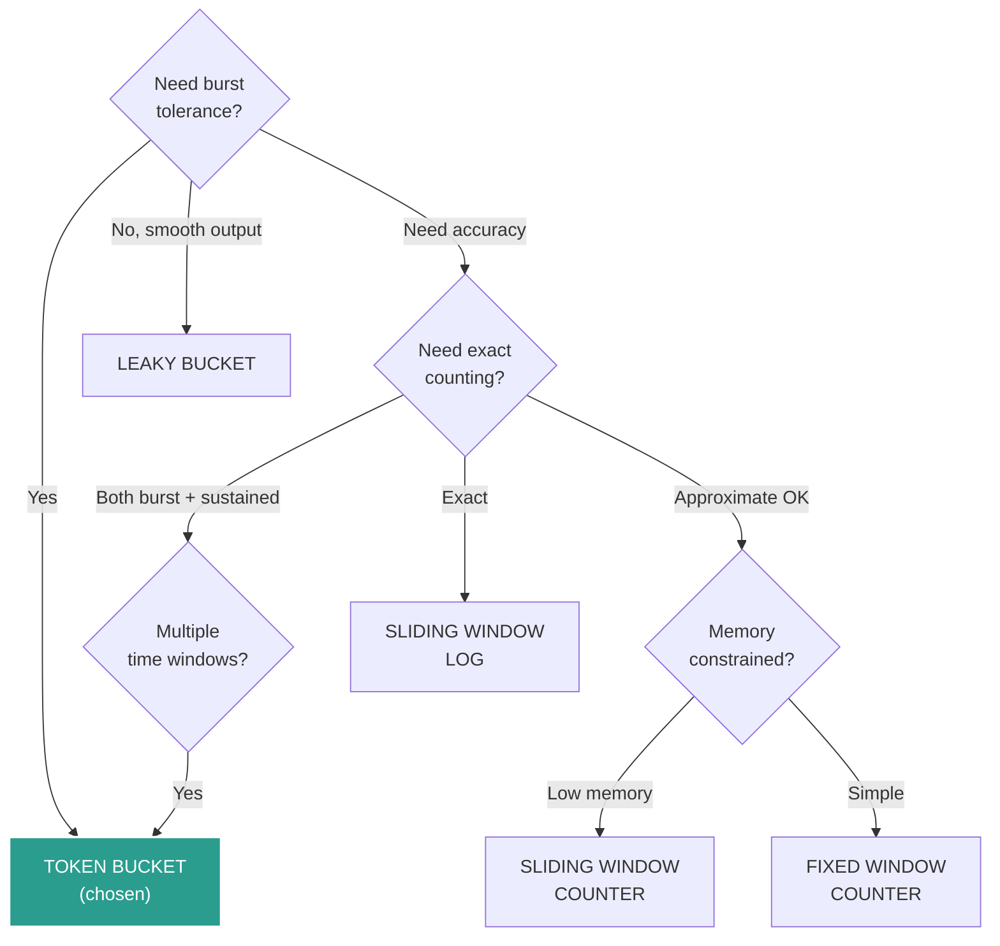
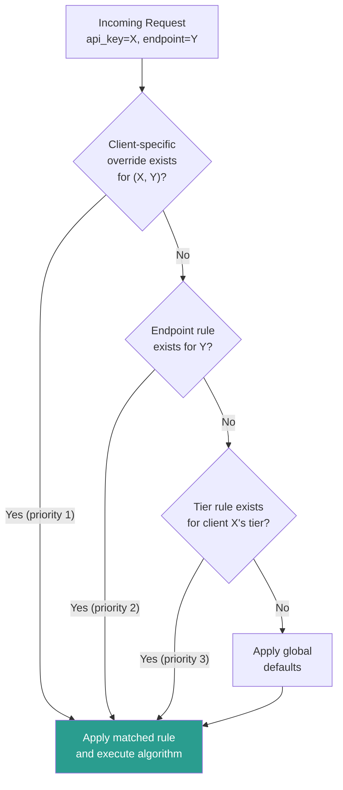
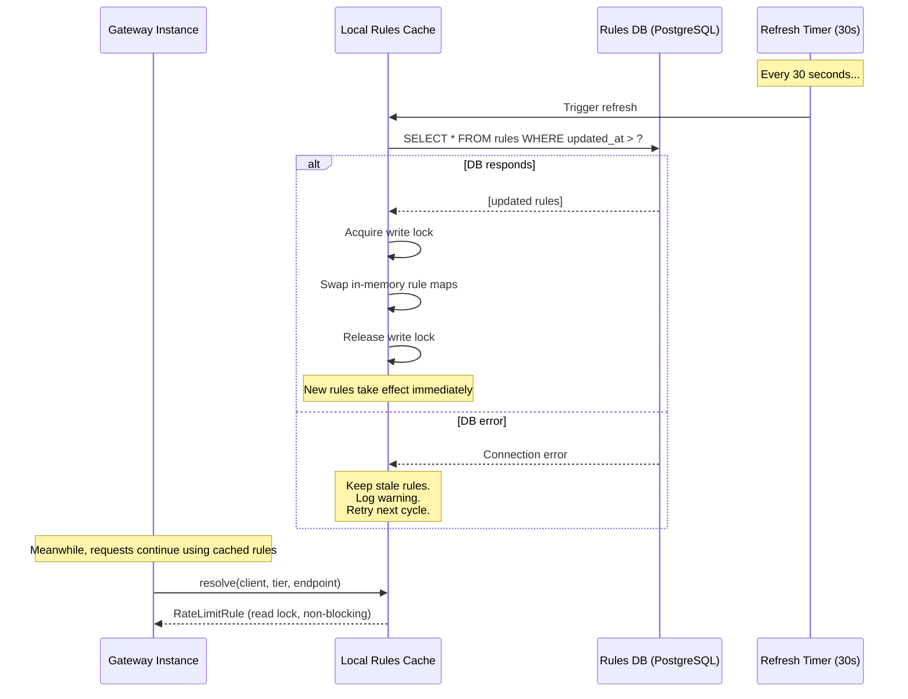
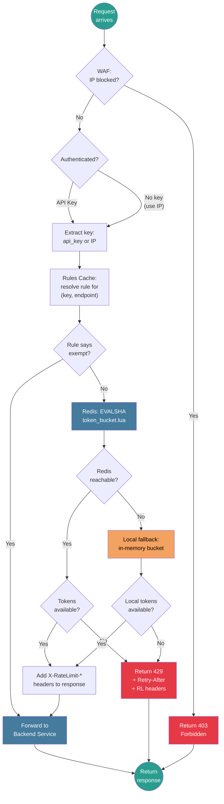

# Design a Rate Limiter -- Part 2: High-Level Design

> **Top Uber / Stripe / Cloudflare Interview Question**
>
> This is Part 2 of a three-part deep dive into designing a production-grade
> rate limiter for a senior-level system design interview. This file covers
> architecture, algorithm selection, Redis implementation, rules engine,
> and HTTP response design.
>
> **Series:**
> 1. [Requirements & Estimation](./requirements-and-estimation.md)
> 2. **High-Level Design** (this file)
> 3. [Deep Dive & Scaling](./deep-dive-and-scaling.md)

---

## Table of Contents

1. [Architecture Diagram](#architecture-diagram)
2. [Request Flow](#request-flow-step-by-step)
3. [Component Responsibilities](#component-responsibilities)
4. [Where to Place the Rate Limiter](#where-to-place-the-rate-limiter)
5. [Algorithm Comparison & Selection](#algorithm-comparison--selection)
6. [Token Bucket: Redis Lua Script](#token-bucket-redis-lua-script-production-grade)
7. [Rate Limiting Rules Engine](#rate-limiting-rules-engine)
8. [HTTP 429 Response & Headers](#http-429-response--rate-limit-headers)
9. [Complete Request Flow Diagram](#complete-request-flow-diagram)

---

## Architecture Diagram

> **Interview tip**: Spend 10-12 minutes here. Draw the full architecture,
> explain the request flow, and justify each component choice. The Mermaid
> diagram below is the whiteboard equivalent.



### Architecture Layers Explained

```
LAYER 1: EDGE (Client-facing)
  - Load Balancer: distributes traffic, terminates TLS, health checks
  - WAF/DDoS Shield: blocks known-bad IPs, absorbs volumetric attacks
  - This layer handles L3/L4 protection BEFORE our L7 rate limiter

LAYER 2: API GATEWAY (Rate Limiting lives here)
  - Multiple gateway instances for horizontal scaling
  - Each gateway embeds the rate limiter as middleware
  - Middleware executes BEFORE routing to backend services
  - Collocated = zero additional network hop for the rate limit check

LAYER 3: SHARED STATE (Redis Cluster)
  - Centralized counter/token state across all gateway instances
  - Redis Cluster with 5 shards for throughput
  - Lua scripts for atomic check-and-decrement operations
  - Keys auto-expire via TTL (self-cleaning)

LAYER 4: RULES MANAGEMENT (Configuration)
  - YAML config file (Git-versioned for audit trail)
  - REST API for runtime CRUD operations
  - PostgreSQL for durable rule storage
  - In-memory cache on each gateway (refresh every 30 seconds)

LAYER 5: BACKEND SERVICES (Protected)
  - Only receive traffic that passes the rate limit check
  - Completely unaware of rate limiting logic
  - Decoupled: backend teams do not need to implement rate limiting

LAYER 6: OBSERVABILITY (Monitoring)
  - Prometheus scrapes metrics from all gateways
  - Grafana dashboards for real-time visibility
  - PagerDuty alerts for critical conditions (Redis down, high rejection)
```

---

## Request Flow (Step by Step)



### Request Flow: Detailed Step Walkthrough

```
STEP-BY-STEP FLOW FOR A SINGLE REQUEST:

  1. CLIENT sends POST /api/orders with header "X-API-Key: abc123"

  2. LOAD BALANCER (NGINX/ALB) receives the request:
     - Terminates TLS
     - Selects a gateway instance (round-robin or least-connections)
     - Adds X-Forwarded-For header with client IP

  3. WAF/DDOS SHIELD checks:
     - Is the source IP on a blocklist? If yes, return 403.
     - Does the request match a known attack pattern? If yes, block.
     - Passed? Forward to the selected gateway instance.

  4. API GATEWAY receives the request and runs middleware chain:
     a) Authentication middleware: validates API key, extracts user/tier info
     b) Rate limit middleware (our focus):
        i.   Extract rate limit key: api_key="abc123", endpoint="POST /api/orders"
        ii.  Lookup rule from in-memory cache (0.01ms)
        iii. Execute Redis EVALSHA with token_bucket.lua (1-2ms)
        iv.  If ALLOWED: set X-RateLimit-* headers, continue to next middleware
        v.   If REJECTED: return 429 immediately, do NOT forward to backend
     c) Request validation middleware
     d) Routing middleware: forward to the correct backend service

  5. BACKEND SERVICE processes the request (only if rate limit passed):
     - Business logic, database operations, etc.
     - Returns response to gateway

  6. GATEWAY adds rate limit headers to response and returns to client:
     - X-RateLimit-Limit: 100
     - X-RateLimit-Remaining: 87
     - X-RateLimit-Reset: 1712500267
```

---

## Component Responsibilities

| Component | Role | Why This Choice? |
|-----------|------|------------------|
| **Load Balancer** | Distribute traffic, TLS termination | Standard L7 LB (NGINX, ALB) |
| **WAF / DDoS Shield** | Block known-bad IPs, volumetric attacks | Cloudflare/AWS Shield -- L3/L4 defense before app-level limiter |
| **API Gateway + RL Middleware** | Auth, routing, rate limit check before forwarding | Collocated = zero network hop for RL check |
| **Redis Cluster** | Shared counter/token state across all gateways | In-memory, atomic Lua scripts, ~0.5ms latency |
| **Rules Cache (local)** | In-memory copy of rate limit rules per gateway | Avoids DB lookup on every request; refresh every 30s |
| **Rules DB + API** | Source of truth for rules; CRUD via API or YAML push | Supports hot-reload without restart |
| **Backend Services** | Business logic -- only reached if rate limit passes | Decoupled; unaware of rate limiting |
| **Prometheus + Grafana** | Metrics, dashboards, alerting | Industry standard for time-series observability |

### Technology Choices and Alternatives

```
COMPONENT           CHOSEN             ALTERNATIVES CONSIDERED
---------------------------------------------------------------------------
State store         Redis Cluster      Memcached, DynamoDB, in-memory only
  Reason: Redis has Lua scripting for atomicity, built-in TTL, and
  clustering. Memcached lacks scripting. DynamoDB adds latency. In-memory
  only cannot share state across gateways.

Gateway             Custom middleware   Kong, Envoy, AWS API Gateway
  Reason: Custom middleware gives full control. Kong/Envoy have built-in
  rate limiting but less flexibility for custom rules engines.

Rules storage       PostgreSQL + YAML  etcd, Consul, DynamoDB
  Reason: PostgreSQL is a proven relational store for structured config.
  YAML provides Git-versioned, human-readable config. etcd/Consul add
  operational complexity without clear benefit for this use case.

Observability       Prometheus/Grafana  Datadog, New Relic, CloudWatch
  Reason: Open-source, widely adopted, excellent for time-series metrics.
  Can migrate to Datadog if cloud-hosted monitoring is preferred.
```

---

## Where to Place the Rate Limiter?



| Placement | Pros | Cons | Best For |
|-----------|------|------|----------|
| **Gateway Middleware** | No extra network hop, simple | Tightly coupled to gateway | Small-medium scale |
| **Separate Service** | Independent scaling, reusable | Extra network hop (~1-2ms) | Large scale, multi-gateway |
| **Sidecar (Envoy)** | Per-service, mesh-native | Complex setup, harder debugging | Service mesh (Istio/Envoy) |

### Detailed Comparison: Gateway vs. Service vs. Sidecar



```
DETAILED PLACEMENT ANALYSIS:

Option A: Gateway Middleware (OUR CHOICE)
  Architecture:  Client --> [Gateway + RL Middleware] --> Backend
  Latency added: ~0ms (in-process function call)
  Deployment:    Deploy with gateway (same container/process)
  Scaling:       Scales with gateway instances
  Pros:
    - Zero additional network hop
    - Simplest architecture (fewest moving parts)
    - Easy to debug (single process, unified logs)
    - Lowest latency option
  Cons:
    - Tightly coupled to gateway technology (language, framework)
    - Cannot reuse across different gateway technologies
    - Gateway restart required for RL code changes (not config)
  When to use:
    - Single gateway technology
    - Rate limiting is primarily for external API traffic
    - Team is small and wants operational simplicity

Option B: Separate Rate Limiting Service
  Architecture:  Client --> Gateway --> [RL Service (gRPC)] --> Redis
                                    --> Backend
  Latency added: ~1-3ms (extra network hop via gRPC)
  Deployment:    Independent service with its own scaling
  Scaling:       Scale RL service independently of gateway
  Pros:
    - Independent scaling and deployment
    - Reusable across multiple gateways and services
    - Language-agnostic (gRPC interface)
    - Can centralize rate limiting logic for entire organization
  Cons:
    - Extra network hop adds latency
    - Additional service to operate, monitor, deploy
    - Single point of failure (mitigated by fail-open)
  When to use:
    - Multiple gateway technologies (Node, Go, Python)
    - Large organization with many teams consuming RL
    - Need to rate limit internal service-to-service calls

Option C: Sidecar (Envoy / Service Mesh)
  Architecture:  Client --> [Envoy Proxy + RL filter] --> Backend
  Latency added: ~0.5-1ms (local proxy)
  Deployment:    Injected as sidecar container in each pod
  Scaling:       One sidecar per service instance
  Pros:
    - Per-service rate limiting without code changes
    - Mesh-native (Istio, Linkerd integration)
    - Uniform policy enforcement across all services
  Cons:
    - Requires service mesh infrastructure
    - Complex debugging (additional proxy layer)
    - Memory/CPU overhead per pod
  When to use:
    - Already running Istio/Envoy service mesh
    - Need per-service (not just edge) rate limiting
    - Kubernetes-native environment
```

**Our choice: Gateway Middleware** -- simplest architecture that meets requirements. Extract to a separate service if and when we outgrow it.

---

## Algorithm Comparison & Selection

> **Interview tip**: This is where you earn the "strong hire." Spend 15-20
> minutes going deep on algorithm selection, the Redis Lua script, the rules
> engine, and distributed challenges.

### Decision Tree



### Algorithm Comparison Table

| Algorithm | Memory/Key | Accuracy | Burst Behavior | Complexity | Use Case |
|-----------|-----------|----------|----------------|------------|----------|
| **Fixed Window Counter** | O(1) -- 8 bytes | Low -- 2x burst at boundary | Allows 2x at window edge | Very simple | Internal/low-stakes |
| **Sliding Window Log** | O(N) -- all timestamps | Exact | No boundary issue | High memory | Security-critical (login) |
| **Sliding Window Counter** | O(1) -- 16 bytes | ~99.7% accurate | Weighted boundary smoothing | Moderate | Sustained rate limiting |
| **Token Bucket** | O(1) -- 16 bytes | High | Controlled bursts (configurable) | Moderate | General API rate limiting |
| **Leaky Bucket** | O(1) -- 8 bytes | High | No bursts (constant drain) | Simple | Traffic shaping, queues |

### Why Token Bucket?

```
DECISION: Token Bucket for our primary algorithm.

Justification:
  1. BURST TOLERANCE -- APIs naturally have bursty traffic. Token Bucket
     allows clients to burst up to bucket capacity, then smoothly degrades.
     A client with 100 tokens/sec limit can burst 100 requests instantly
     if the bucket is full, then must wait for refill.

  2. MEMORY EFFICIENT -- Only 2 values per key (tokens, last_refill_time).
     At 10M keys * 16 bytes = 160 MB. Fits in Redis trivially.

  3. ATOMIC IMPLEMENTATION -- Single Lua script: calculate refill, check
     tokens, decrement. No multi-key transactions needed.

  4. INDUSTRY PROVEN -- Used by Stripe, Amazon API Gateway, Kong, Envoy.
     Battle-tested at massive scale.

  5. DUAL-RATE SUPPORT -- Separate "capacity" (burst size) from
     "refill_rate" (sustained rate) gives operators two tuning knobs.

SECONDARY: Sliding Window Log for security-critical endpoints (login,
  password reset) where exact counting matters more than memory.
```

### How Each Algorithm Works (Detailed)

#### Fixed Window Counter

```
FIXED WINDOW COUNTER:
  - Divide time into fixed windows (e.g., 1-minute intervals)
  - Each window has a counter, incremented per request
  - When counter >= limit, reject subsequent requests
  - Counter resets at the start of each new window

  Example: limit = 5 per minute
  Window [12:00 - 12:01]:  counter = 0 -> 1 -> 2 -> 3 -> 4 -> 5 -> REJECT
  Window [12:01 - 12:02]:  counter resets to 0

  Redis implementation:
    key = "rl:fw:{client}:{endpoint}:{window_id}"
    INCR key
    EXPIRE key 60

  PROBLEM: Double-rate burst at window boundary
    Window 1 end:   5 requests at 12:00:59  (counter=5, just under limit)
    Window 2 start: 5 requests at 12:01:01  (counter=5, new window)
    Result: 10 requests in 2 seconds (2x the intended limit)
```

#### Sliding Window Log

```
SLIDING WINDOW LOG:
  - Store a timestamp for every request in a sorted set
  - On each request: remove timestamps older than window_size ago
  - Count remaining entries; if >= limit, reject
  - Perfectly accurate: no boundary issues

  Example: limit = 5, window = 60 sec
  At 12:01:30, sorted set contains:
    [12:00:45, 12:01:00, 12:01:10, 12:01:15, 12:01:25]
  Remove entries older than 12:00:30: all survive
  Count = 5, at limit. Next request rejected.

  Redis implementation:
    ZREMRANGEBYSCORE key 0 (now - window)
    ZADD key now now
    ZCARD key
    EXPIRE key window

  PROBLEM: Memory
    O(N) per key, where N = limit
    Login endpoint: 5 entries per key (OK)
    API endpoint: 6000 entries per key (Enterprise tier) -- expensive
    10M keys * 6000 entries * 16 bytes = ~960 GB (NOT OK)
```

#### Sliding Window Counter

```
SLIDING WINDOW COUNTER:
  - Hybrid of fixed window + sliding window
  - Maintain counters for current and previous window
  - Weight the previous window's count by overlap fraction

  Example: limit = 100, window = 60 sec
  Current window (12:01:00 - 12:02:00), we are at 12:01:45 (75% through)
  Previous window count: 80
  Current window count:  30
  Weighted estimate = 80 * (1 - 0.75) + 30 = 80 * 0.25 + 30 = 50
  50 < 100, so ALLOW

  Redis implementation:
    prev_key = "rl:sw:{client}:{endpoint}:{prev_window}"
    curr_key = "rl:sw:{client}:{endpoint}:{curr_window}"
    fraction = (now % window_size) / window_size
    estimated = GET(prev_key) * (1 - fraction) + GET(curr_key)

  Accuracy: ~99.7% (Cloudflare measured this in production)
  Memory: O(1) per key (two counters)
  GOOD CHOICE for sustained rate limiting where bursts are unwanted.
```

#### Token Bucket (Our Primary Choice)

```
TOKEN BUCKET: capacity=5, refill_rate=1 token/sec

  Time    Bucket State              Event
  ----    -------------------------  -------------------------
  t=0     [T][T][T][T][T]  5/5      Bucket starts full
  t=0     [T][T][T][ ][ ]  3/5      2 requests --> consume 2 tokens
  t=1     [T][T][T][T][ ]  4/5      +1 token refilled
  t=1     [ ][ ][ ][ ][ ]  0/5      4 requests --> burst! consume 4
  t=1     REJECTED          0/5      5th request at t=1 --> denied
  t=2     [T][ ][ ][ ][ ]  1/5      +1 token refilled
  t=2     [ ][ ][ ][ ][ ]  0/5      1 request --> consume 1 token
  t=5     [T][T][T][ ][ ]  3/5      3 seconds idle --> +3 tokens
  t=5     [T][T][ ][ ][ ]  2/5      1 request --> consume 1 token

Key insight: the bucket "saves up" tokens during idle periods,
allowing controlled bursts. The refill_rate is the sustained
throughput; capacity is the maximum burst size.

Two independent tuning knobs:
  capacity    = maximum burst size (how spiky traffic can be)
  refill_rate = sustained throughput (average rate over time)
```

#### Leaky Bucket

```
LEAKY BUCKET:
  - Requests enter a queue (the bucket)
  - Requests drain from the queue at a fixed rate
  - If the queue is full, new requests are rejected
  - Output rate is perfectly smooth (no bursts)

  Example: capacity=5, drain_rate=1/sec
  Queue: [R1][R2][R3][__][__]   3 requests queued
  Every second, one request drains (processed)
  If 3 more arrive: [R1][R2][R3][R4][R5] -> full
  Next arrival: REJECTED (queue full)

  Key difference from Token Bucket:
    Token Bucket: allows BURSTS (consume multiple tokens instantly)
    Leaky Bucket: enforces SMOOTH output (fixed drain rate)

  Best for: traffic shaping, smoothing bursty input into steady output
  Used by: network traffic shapers, message queue producers
  NOT ideal for APIs: users expect instant responses, not queuing
```

### Fixed Window Boundary Problem (Why Not Fixed Window)

```
FIXED WINDOW PROBLEM: limit = 100 req/min

  Window 1: [00:00 -------------- 01:00]
  Window 2:                       [01:00 -------------- 02:00]

  Attacker sends:
    00:59 --> 100 requests (all allowed, end of Window 1)
    01:01 --> 100 requests (all allowed, start of Window 2)
    
  Result: 200 requests in 2 seconds! (2x the intended limit)

  Token Bucket does NOT have this problem:
    After 100 requests at 00:59, bucket is empty.
    At 01:01, only ~3 tokens refilled (at 100/60 = 1.67/sec).
    Only 3 requests allowed. The rest are rejected.
```

---

## Token Bucket: Redis Lua Script (Production-Grade)

> **Interview tip**: Writing the Lua script on the whiteboard demonstrates
> deep technical command. Even pseudo-code is impressive. The key points:
> atomicity via Lua, refill calculation, and returning headers data.

### Why Lua Scripts in Redis?

```
PROBLEM: Race condition with separate GET + SET

  Thread A: GET tokens --> 1          Thread B: GET tokens --> 1
  Thread A: 1 >= 1? YES, ALLOW       Thread B: 1 >= 1? YES, ALLOW
  Thread A: SET tokens --> 0          Thread B: SET tokens --> 0

  Both allowed! But there was only 1 token. Overcounted by 1.

SOLUTION: Lua scripts execute ATOMICALLY in Redis.
  - Redis is single-threaded for command execution
  - A Lua script runs as one uninterruptible operation
  - No interleaving between concurrent callers
  - Equivalent to a database transaction, but zero overhead

WHY NOT ALTERNATIVES?
  - MULTI/EXEC (Redis transactions): Cannot read-then-write conditionally.
    MULTI queues all commands; you cannot branch based on a GET result.
  - WATCH/MULTI (optimistic locking): Works but requires retry loops.
    Under high contention, retries waste time and Redis CPU.
  - Redis INCR with conditional logic in client: Race condition (above).
  - Redlock / distributed locks: Massive overkill. Adds 5-10ms latency.

  Lua scripts are the CORRECT solution for atomic read-modify-write in Redis.
```

### Why EVALSHA (Not EVAL)?

```
PERFORMANCE: EVALSHA vs EVAL

  EVAL:
    - Sends the FULL Lua script text on every call
    - Redis parses, compiles, and executes the script each time
    - Network: ~500 bytes per call (script text + args)

  EVALSHA:
    - Register script ONCE at startup with SCRIPT LOAD -> returns a SHA1 hash
    - All subsequent calls send only the 40-character SHA1 hash
    - Network: ~150 bytes per call (hash + args)
    - Redis looks up pre-compiled bytecode by SHA -- zero parse overhead

  At 500K calls/sec:
    EVAL:    500K * 500B = 250 MB/sec network
    EVALSHA: 500K * 150B =  75 MB/sec network
    Savings: 70% less network bandwidth + zero compile overhead

  Fallback: If EVALSHA returns NOSCRIPT error (e.g., after Redis restart),
    catch the error, re-register with SCRIPT LOAD, and retry with EVALSHA.
```

### The Lua Script

```lua
-- token_bucket.lua
-- Atomic Token Bucket rate limiter for Redis
--
-- KEYS[1] = rate limit key (e.g., "rl:tb:api_key_123:/api/orders")
-- ARGV[1] = bucket capacity (max tokens)
-- ARGV[2] = refill rate (tokens per second)
-- ARGV[3] = current timestamp (seconds, with microsecond precision)
-- ARGV[4] = tokens to consume (usually 1; can be >1 for expensive ops)
--
-- RETURNS: {allowed (0/1), remaining_tokens, retry_after_seconds}

local key           = KEYS[1]
local capacity      = tonumber(ARGV[1])
local refill_rate   = tonumber(ARGV[2])
local now           = tonumber(ARGV[3])
local tokens_needed = tonumber(ARGV[4])

-- Step 1: Retrieve current state (or initialize)
local state = redis.call('HMGET', key, 'tokens', 'last_refill')
local tokens      = tonumber(state[1])
local last_refill = tonumber(state[2])

if tokens == nil then
    -- First request for this key: start with a full bucket
    tokens      = capacity
    last_refill = now
end

-- Step 2: Calculate token refill since last request
local elapsed      = math.max(0, now - last_refill)
local new_tokens   = elapsed * refill_rate
tokens             = math.min(capacity, tokens + new_tokens)
last_refill        = now

-- Step 3: Attempt to consume tokens
local allowed    = 0
local retry_after = 0

if tokens >= tokens_needed then
    tokens  = tokens - tokens_needed
    allowed = 1
else
    -- Calculate how long until enough tokens are available
    local deficit = tokens_needed - tokens
    retry_after   = math.ceil(deficit / refill_rate)
end

local remaining = math.floor(tokens)

-- Step 4: Persist updated state
redis.call('HMSET', key,
    'tokens',      tostring(tokens),
    'last_refill', tostring(now)
)

-- Step 5: Set TTL = 2x the time to fully refill (auto-cleanup idle keys)
local ttl = math.ceil(capacity / refill_rate) * 2
redis.call('EXPIRE', key, ttl)

-- Return: [allowed, remaining, retry_after]
return {allowed, remaining, retry_after}
```

### Lua Script: Line-by-Line Walkthrough

```
LINE-BY-LINE EXPLANATION:

  Lines 1-9: Documentation header. Describes KEYS, ARGV, and return format.
    This is critical for maintainability -- anyone reading the script knows
    exactly what inputs it expects and what it returns.

  Lines 11-14: Parse arguments. All ARGV values are strings in Redis;
    tonumber() converts them to numeric types for arithmetic.

  Lines 17-23: Retrieve current state with HMGET.
    - If the key does not exist (first request), tokens and last_refill are nil.
    - We initialize with a FULL bucket (capacity tokens).
    - This means a new client gets their full burst allowance immediately.

  Lines 26-29: Calculate refill.
    - elapsed = time since last request (seconds, floating point)
    - new_tokens = elapsed * refill_rate
    - Clamp to capacity: tokens can never exceed the bucket size
    - Update last_refill to "now" so the next call calculates from here

  Lines 32-40: Consume tokens.
    - If enough tokens: decrement and set allowed = 1
    - If not enough: calculate how many seconds until enough tokens refill
    - retry_after tells the client exactly when to retry

  Lines 42: Floor remaining for the response header (integer display)

  Lines 45-48: Persist state back to Redis hash.
    - HMSET is atomic within the script
    - State is now consistent for the next caller

  Lines 51-52: Auto-cleanup.
    - TTL = 2x the time to fully refill the bucket
    - If a client goes idle, their key auto-expires, freeing memory
    - Example: capacity=100, refill_rate=1.67 -> TTL = ceil(60) * 2 = 120 sec

  Line 55: Return array of 3 values.
    - The gateway middleware uses these to set HTTP headers
```

### Python Caller (Gateway Middleware)

```python
import time
import hashlib
import redis

# Load Lua script once at startup, use EVALSHA thereafter
SCRIPT_SHA = None

def init_lua_script(redis_client: redis.Redis):
    """Register the Lua script with Redis and cache its SHA."""
    global SCRIPT_SHA
    with open("token_bucket.lua") as f:
        lua_source = f.read()
    SCRIPT_SHA = redis_client.script_load(lua_source)

def check_rate_limit(
    redis_client: redis.Redis,
    api_key: str,
    endpoint: str,
    capacity: int,
    refill_rate: float,
    tokens_needed: int = 1,
) -> dict:
    """
    Execute the token bucket check against Redis.
    Returns: {allowed, remaining, retry_after, reset_at}
    """
    # Build the Redis key
    key = f"rl:tb:{api_key}:{endpoint}"

    # Use high-resolution time
    now = time.time()

    try:
        result = redis_client.evalsha(
            SCRIPT_SHA,
            1,          # number of KEYS
            key,        # KEYS[1]
            capacity,   # ARGV[1]
            refill_rate,# ARGV[2]
            now,        # ARGV[3]
            tokens_needed,  # ARGV[4]
        )

        allowed, remaining, retry_after = result
        reset_at = int(now) + int((capacity - remaining) / refill_rate)

        return {
            "allowed": bool(allowed),
            "remaining": int(remaining),
            "retry_after": int(retry_after),
            "reset_at": reset_at,
        }

    except redis.exceptions.NoScriptError:
        # Script was evicted (e.g., Redis restarted). Re-register.
        init_lua_script(redis_client)
        return check_rate_limit(
            redis_client, api_key, endpoint,
            capacity, refill_rate, tokens_needed
        )

    except redis.exceptions.ConnectionError:
        # FAIL-OPEN: if Redis is down, allow the request
        return {
            "allowed": True,
            "remaining": -1,
            "retry_after": 0,
            "reset_at": 0,
            "degraded": True,
        }
```

### Redis Key Schema

```
KEY NAMING CONVENTION:

  rl:{algorithm}:{identifier}:{endpoint}

  Examples:
    rl:tb:apikey_abc123:/api/orders          -- Token bucket for specific key+endpoint
    rl:tb:apikey_abc123:*                    -- Token bucket for key, all endpoints
    rl:sw:ip_192.168.1.1:/api/auth/login     -- Sliding window for IP on login
    rl:rules:apikey_abc123                   -- Cached rules for this API key

  Key properties:
    - TYPE: Hash (HMSET/HMGET)
    - FIELDS: tokens (float), last_refill (float timestamp)
    - TTL: Auto-expires at 2x full-refill time (self-cleaning)
    - SHARDING: Consistent hashing on the key in Redis Cluster

  Key design principles:
    - PREFIXED: "rl:" namespace prevents collision with other Redis uses
    - ALGORITHM TAG: "tb:" / "sw:" identifies which Lua script to use
    - HIERARCHICAL: client:endpoint allows pattern-based key management
    - DETERMINISTIC: same input always produces same key (no randomness)
    - BOUNDED LENGTH: endpoint is normalized (max 128 chars) to prevent abuse
```

---

## Rate Limiting Rules Engine

> **Interview tip**: Showing a configurable rules engine demonstrates you are
> thinking about operability, not just the algorithm. This is what separates
> a production design from a textbook answer.

### YAML Configuration

```yaml
# rate_limit_rules.yaml
# Hot-reloadable. Changes take effect within 30 seconds (cache refresh interval).

global_defaults:
  algorithm: token_bucket
  capacity: 100           # max burst
  refill_rate: 1.67       # tokens/sec (~100/min sustained)
  window: 60              # seconds (used by sliding window algorithms)
  limit: 100              # requests per window (sliding window fallback)
  fail_mode: open         # open | closed | local
  cache_ttl: 30           # seconds between rule cache refreshes

# --------------------------------------------------------------------------
# Client Tier Definitions
# --------------------------------------------------------------------------
tiers:
  free:
    capacity: 10
    refill_rate: 1.0          # 60 req/min sustained, burst of 10
    limit: 60

  pro:
    capacity: 50
    refill_rate: 10.0         # 600 req/min sustained, burst of 50
    limit: 600

  enterprise:
    capacity: 200
    refill_rate: 100.0        # 6000 req/min sustained, burst of 200
    limit: 6000

# --------------------------------------------------------------------------
# Per-Endpoint Overrides (apply to ALL clients unless tier overrides)
# --------------------------------------------------------------------------
endpoint_rules:
  - endpoint: "POST /api/auth/login"
    algorithm: sliding_window_log    # exact counting -- security critical
    limit: 5
    window: 300                      # 5 attempts per 5 minutes
    description: "Brute force protection"

  - endpoint: "POST /api/auth/password-reset"
    algorithm: sliding_window_log
    limit: 3
    window: 3600                     # 3 per hour
    description: "Password reset abuse prevention"

  - endpoint: "POST /api/payments"
    algorithm: token_bucket
    capacity: 5
    refill_rate: 0.17                # ~10/min sustained, burst of 5
    description: "Payment endpoint -- low limit, high burst for retries"

  - endpoint: "GET /api/search"
    algorithm: sliding_window_counter
    limit: 30
    window: 60
    description: "Search is expensive -- tighter limit"

  - endpoint: "POST /api/files/upload"
    algorithm: token_bucket
    capacity: 5
    refill_rate: 0.33                # ~20/min sustained
    tokens_per_request: 3            # each upload costs 3 tokens (expensive)
    description: "File uploads consume more tokens"

# --------------------------------------------------------------------------
# Client-Specific Overrides (highest priority)
# --------------------------------------------------------------------------
client_overrides:
  - client_id: "stripe_webhook"
    endpoint: "POST /api/webhooks/stripe"
    algorithm: token_bucket
    capacity: 100
    refill_rate: 50.0
    description: "Stripe webhooks need high throughput"

  - client_id: "internal_monitoring"
    endpoint: "*"
    exempt: true                     # bypass rate limiting entirely
    description: "Internal health checks and monitoring"
```

### Rule Resolution Priority



```
RULE RESOLUTION ORDER (highest to lowest priority):

  1. Client + Endpoint override  -->  "stripe_webhook" on "POST /webhooks/stripe"
  2. Endpoint-specific rule      -->  "POST /api/auth/login" for any client
  3. Client tier rule            -->  "pro_tier" defaults for all endpoints
  4. Global defaults             -->  fallback for anything unmatched

  Special cases:
  - exempt: true   --> skip rate limiting entirely
  - tokens_per_request: N  --> consume N tokens instead of 1 (for expensive ops)
```

### Rules Engine Implementation

```python
import yaml
import threading
import time
from dataclasses import dataclass, field
from typing import Optional, Dict, List
from functools import lru_cache


@dataclass
class RateLimitRule:
    algorithm: str = "token_bucket"
    capacity: int = 100
    refill_rate: float = 1.67
    limit: int = 100
    window: int = 60
    fail_mode: str = "open"
    tokens_per_request: int = 1
    exempt: bool = False
    description: str = ""


class RulesEngine:
    """
    Loads rate limit rules from YAML, caches in memory,
    and refreshes on a configurable interval.

    Thread-safe: uses a read-write lock for rule swaps.
    """

    def __init__(self, config_path: str, refresh_interval: int = 30):
        self.config_path = config_path
        self.refresh_interval = refresh_interval
        self._lock = threading.RLock()

        # Rule stores
        self._tiers: Dict[str, RateLimitRule] = {}
        self._endpoint_rules: Dict[str, RateLimitRule] = {}
        self._client_overrides: Dict[str, RateLimitRule] = {}
        self._defaults = RateLimitRule()

        # Initial load
        self._load_rules()

        # Background refresh thread
        self._refresh_thread = threading.Thread(
            target=self._periodic_refresh, daemon=True
        )
        self._refresh_thread.start()

    def _load_rules(self):
        """Parse YAML and populate rule stores."""
        with open(self.config_path) as f:
            config = yaml.safe_load(f)

        with self._lock:
            # Global defaults
            defaults = config.get("global_defaults", {})
            self._defaults = RateLimitRule(**defaults)

            # Tier definitions
            self._tiers = {}
            for tier_name, tier_config in config.get("tiers", {}).items():
                self._tiers[tier_name] = RateLimitRule(**{**defaults, **tier_config})

            # Endpoint rules
            self._endpoint_rules = {}
            for rule in config.get("endpoint_rules", []):
                endpoint = rule.pop("endpoint")
                self._endpoint_rules[endpoint] = RateLimitRule(**{**defaults, **rule})

            # Client overrides
            self._client_overrides = {}
            for rule in config.get("client_overrides", []):
                key = f"{rule.pop('client_id')}:{rule.pop('endpoint')}"
                self._client_overrides[key] = RateLimitRule(**{**defaults, **rule})

    def _periodic_refresh(self):
        """Background thread: reload rules every N seconds."""
        while True:
            time.sleep(self.refresh_interval)
            try:
                self._load_rules()
            except Exception as e:
                # Log error but keep serving with stale rules
                print(f"[RulesEngine] Failed to reload rules: {e}")

    def resolve(self, client_id: str, client_tier: str, endpoint: str) -> RateLimitRule:
        """
        Resolve the most specific rule for this request.
        Priority: client+endpoint > endpoint > tier > global default.
        """
        with self._lock:
            # Priority 1: Client-specific override
            override_key = f"{client_id}:{endpoint}"
            if override_key in self._client_overrides:
                return self._client_overrides[override_key]

            # Also check wildcard client override
            wildcard_key = f"{client_id}:*"
            if wildcard_key in self._client_overrides:
                return self._client_overrides[wildcard_key]

            # Priority 2: Endpoint-specific rule
            if endpoint in self._endpoint_rules:
                return self._endpoint_rules[endpoint]

            # Priority 3: Client tier
            if client_tier in self._tiers:
                return self._tiers[client_tier]

            # Priority 4: Global default
            return self._defaults
```

### Rules Cache Refresh: Sequence Diagram



---

## HTTP 429 Response & Rate Limit Headers

> **Interview tip**: Mention the IETF draft (RFC 6585 for 429, draft-ietf-httpapi-ratelimit-headers)
> and show you know the exact header names. This demonstrates production awareness.

### Standard Headers

```
ALLOWED REQUEST (200 OK):
-----------------------------------------------------------
HTTP/1.1 200 OK
Content-Type: application/json
X-RateLimit-Limit: 100
X-RateLimit-Remaining: 87
X-RateLimit-Reset: 1712500267
X-RateLimit-Policy: 100;w=60;burst=100;comment="pro tier"

{"data": { ... }}


REJECTED REQUEST (429 Too Many Requests):
-----------------------------------------------------------
HTTP/1.1 429 Too Many Requests
Content-Type: application/json
Retry-After: 3
X-RateLimit-Limit: 100
X-RateLimit-Remaining: 0
X-RateLimit-Reset: 1712500263

{
  "error": {
    "code": "rate_limit_exceeded",
    "message": "Rate limit exceeded. Retry after 3 seconds.",
    "type": "too_many_requests",
    "retry_after": 3,
    "limit": 100,
    "window": "60s",
    "documentation_url": "https://docs.example.com/rate-limits"
  }
}
```

### Header Definitions

| Header | Value | Description |
|--------|-------|-------------|
| `X-RateLimit-Limit` | `100` | Maximum requests allowed in the window |
| `X-RateLimit-Remaining` | `87` | Tokens/requests remaining in current window |
| `X-RateLimit-Reset` | `1712500267` | Unix epoch when the limit fully resets |
| `Retry-After` | `3` | Seconds until the client should retry (429 only) |
| `X-RateLimit-Policy` | `100;w=60` | IETF draft: structured description of the policy |

### Why These Headers Matter

```
CLIENT SDK BEHAVIOR DEPENDS ON THESE HEADERS:

  1. X-RateLimit-Remaining:
     Smart SDKs use this for CLIENT-SIDE rate limiting.
     If remaining < 5, the SDK can proactively slow down requests,
     avoiding 429s entirely. This is better UX than hitting the limit.

  2. Retry-After:
     SDKs implement exponential backoff starting from this value.
     Without Retry-After, clients guess (often too aggressively),
     creating "retry storms" that amplify the problem.

  3. X-RateLimit-Reset:
     Clients can schedule batch operations to start after reset.
     Example: "I have 0 remaining, but limit resets in 12 seconds.
     Queue up my batch and fire at reset time."

  4. X-RateLimit-Policy (IETF draft):
     Machine-readable policy description. Allows SDKs to
     auto-configure their rate limiting behavior without hardcoding.
```

### Gateway Middleware (Express.js Example)

```javascript
// rate-limit-middleware.js

const Redis = require('ioredis');
const redis = new Redis.Cluster([
  { host: 'redis-1', port: 6379 },
  { host: 'redis-2', port: 6379 },
  { host: 'redis-3', port: 6379 },
]);

// Load Lua script at startup
const luaScript = fs.readFileSync('./token_bucket.lua', 'utf8');
let scriptSha;

async function init() {
  scriptSha = await redis.script('LOAD', luaScript);
}

async function rateLimitMiddleware(req, res, next) {
  const apiKey   = req.headers['x-api-key'] || req.ip;
  const endpoint = `${req.method} ${req.route?.path || req.path}`;
  const tier     = req.user?.tier || 'free';

  // Resolve rule from cached config
  const rule = rulesEngine.resolve(apiKey, tier, endpoint);

  // Skip exempt clients
  if (rule.exempt) return next();

  const key = `rl:tb:${apiKey}:${endpoint}`;
  const now = Date.now() / 1000;

  try {
    const [allowed, remaining, retryAfter] = await redis.evalsha(
      scriptSha,
      1, key,
      rule.capacity, rule.refill_rate, now, rule.tokens_per_request
    );

    const resetAt = Math.floor(now) + Math.ceil((rule.capacity - remaining) / rule.refill_rate);

    // Always set rate limit headers (even on success)
    res.set({
      'X-RateLimit-Limit':     rule.capacity,
      'X-RateLimit-Remaining': remaining,
      'X-RateLimit-Reset':     resetAt,
    });

    if (allowed) {
      return next();
    } else {
      res.set('Retry-After', retryAfter);
      return res.status(429).json({
        error: {
          code: 'rate_limit_exceeded',
          message: `Rate limit exceeded. Retry after ${retryAfter} seconds.`,
          retry_after: retryAfter,
        },
      });
    }
  } catch (err) {
    // FAIL-OPEN: Redis error should not block requests
    console.error('[RateLimiter] Redis error:', err.message);
    metrics.increment('rate_limit.redis_error');
    return next(); // allow request through
  }
}
```

---

## Complete Request Flow Diagram

This diagram shows the full decision tree for every incoming request,
including WAF checks, authentication fallback, Redis vs local fallback,
and all response paths.



---

## Next Steps

With the high-level design complete, proceed to:

- **[Part 1: Requirements & Estimation](./requirements-and-estimation.md)** -- Requirements,
  back-of-envelope math, API design, tiered limits.
- **[Part 3: Deep Dive & Scaling](./deep-dive-and-scaling.md)** -- Distributed challenges,
  multi-region, observability, scaling to 10M+ req/sec, real-world examples, trade-offs.
