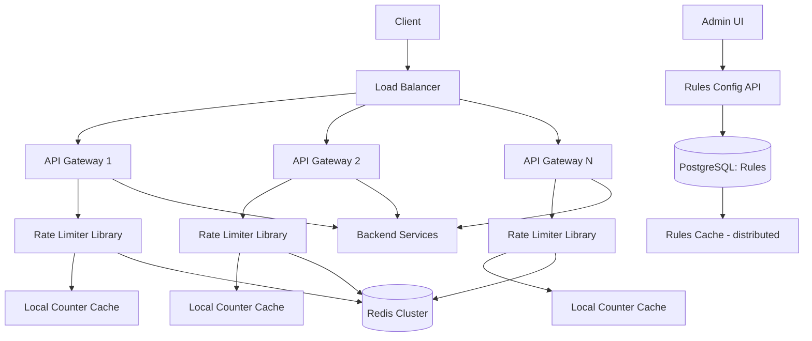

# Design Rate Limiter -- Interview Script (45 min)

## Opening (0:00 - 0:30)

> "Thanks for the problem! Rate limiting is a critical infrastructure component that protects services from abuse, ensures fair usage, and maintains system stability. It seems simple on the surface but gets very interesting in a distributed environment. Let me ask some clarifying questions."

---

## Clarifying Questions (0:30 - 3:00)

> **Q1:** "Where does the rate limiter sit -- is it a standalone middleware service, part of the API gateway, or a library embedded in each service?"
>
> **Expected answer:** Design it as a middleware that can work both in an API gateway and as a service-side library. Focus on the distributed version.

> **Q2:** "What's the scale -- how many requests per second are we rate-limiting?"
>
> **Expected answer:** ~10M requests/sec across all services.

> **Q3:** "What dimensions do we rate limit on -- per user, per IP, per API key, per endpoint? Some combination?"
>
> **Expected answer:** All of those. Different rules for different dimensions.

> **Q4:** "Should the rate limiter support different algorithms, or should I pick one?"
>
> **Expected answer:** Discuss the trade-offs of multiple algorithms, then pick the best one for our use case.

> **Q5:** "What happens when a request is rate-limited -- hard reject (HTTP 429) or a soft throttle (queue and slow down)?"
>
> **Expected answer:** Hard reject with 429 and a Retry-After header. Some endpoints might want soft throttling.

> **Q6:** "Do we need exact precision (never allow more than N requests) or is approximate okay (within 1-2% margin)?"
>
> **Expected answer:** Approximate is fine. Exact precision in a distributed system is extremely expensive.

> **Q7:** "How many rate limiting rules will we have -- tens, hundreds, thousands?"
>
> **Expected answer:** Hundreds of rules across different services and endpoints.

---

## Requirements Summary (3:00 - 5:00)

> "Let me summarize what we're building."

> **"Functional Requirements:"**
> 1. "Rate limit requests based on configurable rules: per user, per IP, per API key, per endpoint."
> 2. "Support multiple rate limiting windows: per second, per minute, per hour, per day."
> 3. "Return HTTP 429 with Retry-After header when limit is exceeded."
> 4. "Include rate limit headers in all responses: X-RateLimit-Limit, X-RateLimit-Remaining, X-RateLimit-Reset."
> 5. "Support rule configuration via an admin API -- add/update/delete rules without redeployment."
> 6. "Support different algorithms: fixed window, sliding window, token bucket, leaky bucket."

> **"Non-Functional Requirements:"**
> 1. "Ultra-low latency: the rate limit check must add less than 1-2ms to each request."
> 2. "High throughput: 10M rate limit checks/sec."
> 3. "Distributed: multiple API gateway instances must share rate limit state."
> 4. "Highly available: if the rate limiter goes down, we should fail open (allow requests) rather than fail closed."
> 5. "Approximate accuracy is acceptable -- within 1-2% overshoot is fine."

> "The core tension in this design is between accuracy (exact counting) and performance (low latency at massive scale). I'll show how to navigate that trade-off."

---

## Back-of-Envelope Estimation (5:00 - 8:00)

> "Let me do some quick math."

> **Rate limit checks:**
> "10M requests/sec, each requiring 1-2 rate limit rule evaluations. That's 10-20M Redis operations/sec if we centralize state."

> **Memory for counters:**
> "Assume 50M unique users, each with counters for 5 rate limit windows. Each counter: key (50 bytes for user_id + rule_id) + value (8 bytes) = ~58 bytes. 50M * 5 * 58 bytes = ~14.5GB. Fits in a Redis cluster."

> **Network:**
> "Each rate limit check is a roundtrip to Redis: ~0.5ms on a local network. At 10M checks/sec, that's 10M * 0.5ms = not a serialization concern since they're parallel, but the Redis cluster needs to handle the throughput."

> **Redis capacity:**
> "A single Redis instance handles ~100-300K ops/sec. For 10-20M ops/sec, we need 50-100 Redis shards. That's a substantial cluster, which is why I'll also discuss local caching and batching strategies to reduce Redis load."

> "The key insight from this math: we can't do a remote Redis call for every single request at 10M/sec. We need a hybrid approach -- local counters with periodic sync to Redis."

---

## High-Level Design (8:00 - 20:00)

> "Let me draw the architecture."

### Step 1: Where the rate limiter lives

> "The rate limiter operates in two modes:"
> 1. **API Gateway mode** -- "The gateway checks rate limits before forwarding to backend services. This catches abuse early."
> 2. **Service sidecar mode** -- "Individual services can have their own rate limits for service-specific protection."

> "Both modes use the same Rate Limiter Service for the actual check."

### Step 2: Core Components

> 1. **Rate Limiter Service** -- "The core logic: evaluate rules, check/update counters, return allow/deny."
> 2. **Rules Engine** -- "Stores and evaluates rate limiting rules."
> 3. **Counter Store** -- "Redis cluster holding the actual rate limit counters."
> 4. **Rules Config API** -- "Admin API for CRUD on rate limiting rules."
> 5. **Rules Cache** -- "Local cache of rules on each gateway/service instance."

### Step 3: Whiteboard Diagram



### Step 4: Rate Limiting Algorithms

> "Before going further, let me cover the four main algorithms and when to use each."

> **1. Fixed Window Counter**
> "Divide time into fixed windows (e.g., each minute). Increment a counter per request. Reset at window boundary."
> "Pros: simple, low memory. Cons: boundary burst problem -- a user can send 2x the limit by timing requests at the window boundary (e.g., 100 at 0:59 and 100 at 1:00)."

> **2. Sliding Window Log**
> "Store the timestamp of each request. Count timestamps within the sliding window."
> "Pros: perfectly accurate. Cons: high memory -- storing every timestamp for every user."

> **3. Sliding Window Counter (Hybrid)**
> "Combine the current window's count with a weighted portion of the previous window's count."
> "Example: if the limit is 100/min, previous window had 80 requests, current window has 30 requests, and we're 40% through the current window: effective count = 30 + 80 * (1 - 0.4) = 30 + 48 = 78. Under the limit."
> "Pros: accurate approximation, low memory. Cons: slightly complex calculation."

> **4. Token Bucket**
> "Each user has a bucket with N tokens. Tokens are added at a fixed rate (refill rate). Each request consumes a token. If the bucket is empty, request is rejected."
> "Pros: allows bursts up to bucket size, smooth rate over time. Cons: two parameters to tune (bucket size and refill rate)."

> **My recommendation for this system:**
> "I'd use the **sliding window counter** as the default -- it gives the best accuracy-to-memory ratio. For endpoints that need to allow short bursts (like a search API), I'd use the **token bucket**."

### Step 5: Walk through the request flow

> "Let me trace a request through the rate limiter:"
>
> 1. "Request arrives at API Gateway. The gateway extracts the rate limit key (user_id, API key, or IP)."
> 2. "The Rate Limiter Library checks the local rules cache: 'For endpoint GET /api/products, the rule is 100 requests/minute per user.'"
> 3. "It sends an INCR-and-CHECK command to the Redis shard responsible for this key."
> 4. "Redis atomically increments the counter and returns the new count + TTL."
> 5. "If count <= limit: allow. Set response headers (X-RateLimit-Remaining = limit - count)."
> 6. "If count > limit: reject with 429, set Retry-After header to the seconds until the window resets."
> 7. "The gateway either forwards the request to the backend or returns 429."

---

## API Design (within high-level)

> "Let me define the APIs -- both the rate limit check API (internal) and the rules config API (admin)."

```
-- Internal: Rate limit check (called by gateway/service)
POST /api/v1/ratelimit/check
Body: {
  key: "user:user_123",
  endpoint: "GET /api/products",
  weight: 1              // some requests cost more than others
}
Response: {
  allowed: true,
  limit: 100,
  remaining: 42,
  reset_at: 1680000060   // Unix timestamp
}

-- Admin: Create/update a rate limit rule
PUT /api/v1/rules/{rule_id}
Body: {
  name: "Product API per-user limit",
  match: {
    endpoint: "GET /api/products",
    dimension: "user_id"
  },
  limit: 100,
  window_seconds: 60,
  algorithm: "sliding_window",
  action: "reject"       // or "throttle"
}

-- Rate limit headers added to all responses:
X-RateLimit-Limit: 100
X-RateLimit-Remaining: 42
X-RateLimit-Reset: 1680000060
Retry-After: 23          // only on 429 responses
```

---

## Data Model (within high-level)

> "For the data model:"

```sql
-- Rate limit rules (PostgreSQL)
rate_limit_rules (
    rule_id           UUID PRIMARY KEY,
    name              VARCHAR(255),
    endpoint_pattern  VARCHAR(255),      -- "GET /api/products*"
    dimension         VARCHAR(20),       -- user_id, ip, api_key
    limit_count       INTEGER,
    window_seconds    INTEGER,
    algorithm         VARCHAR(20),       -- sliding_window, token_bucket
    action            VARCHAR(10),       -- reject, throttle
    priority          INTEGER,           -- higher priority rules evaluated first
    enabled           BOOLEAN DEFAULT TRUE,
    created_at        TIMESTAMP,
    updated_at        TIMESTAMP
);

-- Redis key patterns for counters:

-- Sliding Window Counter:
-- Key: rl:{dimension}:{key}:{window_start}
-- Example: rl:user:user_123:1680000000
-- Value: integer count
-- TTL: 2 * window_seconds (keep previous window for sliding calc)

-- Token Bucket:
-- Key: rl:tb:{dimension}:{key}
-- Value: JSON { tokens: 85, last_refill: 1680000042 }
-- TTL: 24 hours (cleanup inactive users)
```

---

## Deep Dive 1: Distributed Rate Limiting with Redis (20:00 - 30:00)

> "The hardest part of this design is making the rate limiter work correctly across multiple API gateway instances while maintaining low latency. Let me dive deep."

### The Consistency Problem

> "Consider this: we have 10 API gateway instances, each processing requests for the same user. If the user's limit is 100/min, and each gateway independently counts, we could allow up to 1000 requests (10 * 100) before any single gateway hits the limit."

> "This is why we need a centralized counter store -- Redis. All gateways read from and write to the same Redis counters."

### Redis Lua Script for Atomic Operations

> "The sliding window counter requires a read-compute-write cycle. In Redis, I'd use a Lua script to make this atomic:"

```lua
-- Sliding window counter in Redis Lua
local current_key = KEYS[1]           -- rl:user:123:current_window
local previous_key = KEYS[2]          -- rl:user:123:previous_window
local limit = tonumber(ARGV[1])       -- 100
local window = tonumber(ARGV[2])      -- 60
local now = tonumber(ARGV[3])         -- current timestamp
local weight = tonumber(ARGV[4])      -- 1

-- Get counts
local current_count = tonumber(redis.call('GET', current_key) or 0)
local previous_count = tonumber(redis.call('GET', previous_key) or 0)

-- Calculate position in current window (0.0 to 1.0)
local current_window_start = math.floor(now / window) * window
local elapsed = now - current_window_start
local weight_previous = 1 - (elapsed / window)

-- Sliding window estimate
local estimated = current_count + previous_count * weight_previous

if estimated + weight > limit then
    return {0, limit, math.ceil(estimated), current_window_start + window}
    -- {rejected, limit, current_count, reset_time}
end

-- Increment current window
redis.call('INCRBY', current_key, weight)
redis.call('EXPIRE', current_key, window * 2)

return {1, limit, math.ceil(estimated + weight), current_window_start + window}
-- {allowed, limit, current_count, reset_time}
```

> "By using a Lua script, the entire read-check-increment operation is atomic on the Redis server. No race conditions between concurrent gateways."

### Sharding Strategy

> "With 10-20M counter operations/sec, a single Redis instance won't cut it. I'd shard by the rate limit key:"
> "Hash the key (e.g., user_id) to determine the Redis shard. With 20-50 shards, each handles 200K-1M ops/sec -- well within Redis capacity."
> "I'd use Redis Cluster for automatic sharding and failover."

### Local Counter Optimization

> "Even with Redis Cluster, 10M roundtrips/sec to Redis generates a lot of network traffic. I'd optimize with local counting:"
>
> 1. "Each gateway instance maintains a local counter per key."
> 2. "Every 100ms (or every 100 requests for that key, whichever comes first), it syncs the local count to Redis and fetches the global count."
> 3. "Between syncs, it uses the local count + last-known global count for decisions."
>
> "This reduces Redis traffic by 10-100x. The trade-off is a small accuracy window: during the 100ms between syncs, the rate limit can overshoot by at most (number_of_gateways * requests_per_100ms_per_gateway). For a 100/minute limit across 10 gateways, the overshoot is negligible."

### :microphone: Interviewer might ask:

> **"What happens when Redis goes down?"**
> **My answer:** "This is the most important failure scenario. I have a two-layer strategy:"
>
> "**Short outage (seconds to a few minutes):** Each gateway falls back to its local counters. Without global coordination, each gateway enforces the limit independently. If we have 10 gateways and the limit is 100/min, the effective limit becomes ~1000/min (each gateway allows 100). This is a controlled degradation -- we're less strict, but we're not completely unprotected."
>
> "**Extended outage:** If Redis is down for more than a minute, I'd switch to a 'conservative local mode' where each gateway divides the limit by the number of known gateways. If we know there are 10 gateways, each enforces 100/10 = 10/min locally. This is an approximation, but it keeps the system protected."
>
> "**Recovery:** When Redis comes back, gateways resume centralized counting. There might be a brief window where the effective limit is stricter (local counts are flushed to Redis, making it look like there are more requests than there actually were). I'd clear stale counters on Redis recovery."
>
> "The cardinal rule: **never fail closed on rate limiter failure.** If the rate limiter itself is broken, we let requests through. Blocking legitimate traffic is worse than allowing excess traffic."

> **"How do you handle clock skew across gateway instances?"**
> **My answer:** "For the sliding window counter, all gateways use the Redis server's time (via the TIME command or by passing timestamps derived from the same NTP-synchronized clock). Since the Lua script computes the window boundary, and the script runs on the Redis server, clock skew between gateways doesn't affect the counter. The gateway's local clock only matters for the Retry-After header, which is approximate anyway."

> **"What about rate limiting in a multi-region setup?"**
> **My answer:** "Two approaches. First, independent per-region rate limiting -- each region has its own Redis cluster and enforces limits independently. The global effective limit is N * per-region limit, which is coarser but simple. Second, a global rate limiter using a single Redis cluster with cross-region replication. This adds latency (cross-region roundtrip) but gives exact global limits. I'd recommend per-region limits for most use cases, and global limits only for critical resources like payment APIs."

---

## Deep Dive 2: Algorithm Selection and Advanced Patterns (30:00 - 38:00)

> "Let me dive into when to use which algorithm, and some advanced rate limiting patterns."

### Algorithm Comparison

> "Let me draw a comparison matrix:"

```
| Algorithm             | Memory     | Accuracy         | Burst Handling | Complexity |
|-----------------------|------------|------------------|----------------|------------|
| Fixed Window          | Very low   | Poor (boundary)  | No             | Very low   |
| Sliding Window Log    | Very high  | Perfect          | No             | Medium     |
| Sliding Window Counter| Low        | ~99% accurate    | No             | Medium     |
| Token Bucket          | Low        | Good             | Yes (by design)| Medium     |
| Leaky Bucket          | Low        | Good             | Smooths bursts | Medium     |
```

> "My recommendation by use case:"
> - "**API rate limiting (most cases):** Sliding window counter. Best balance of accuracy and efficiency."
> - "**APIs that should allow bursts:** Token bucket. Let the user build up credits during idle periods."
> - "**Rate limiting outbound calls (e.g., we're calling a third-party API):** Leaky bucket. Ensures a smooth, constant rate."

### Token Bucket Deep Dive

> "Since I covered sliding window in Deep Dive 1, let me detail the token bucket, which is the other commonly asked-about algorithm:"

```
Token Bucket for user_123, endpoint GET /api/search:
  - Bucket capacity: 20 tokens (max burst size)
  - Refill rate: 10 tokens/second (sustained rate)

Request arrives at t=0:
  Tokens = 20. Consume 1. Tokens = 19. Allowed.

10 requests arrive at t=0.001:
  Tokens = 19. Consume 10. Tokens = 9. All allowed.

Request arrives at t=1.0:
  Tokens = 9 + 10 (refilled over 1 second) = 19. Consume 1. Tokens = 18. Allowed.

User goes idle for 5 seconds:
  Tokens refill to min(20, 18 + 50) = 20 (capped at capacity).
  User can now burst 20 requests instantly.
```

> "Redis implementation:"

```lua
-- Token bucket in Redis Lua
local key = KEYS[1]
local capacity = tonumber(ARGV[1])     -- 20
local refill_rate = tonumber(ARGV[2])  -- 10
local now = tonumber(ARGV[3])
local requested = tonumber(ARGV[4])    -- 1

local data = redis.call('HMGET', key, 'tokens', 'last_refill')
local tokens = tonumber(data[1]) or capacity
local last_refill = tonumber(data[2]) or now

-- Refill tokens
local elapsed = now - last_refill
local new_tokens = math.min(capacity, tokens + elapsed * refill_rate)

if new_tokens >= requested then
    new_tokens = new_tokens - requested
    redis.call('HMSET', key, 'tokens', new_tokens, 'last_refill', now)
    redis.call('EXPIRE', key, 86400)
    return {1, capacity, math.floor(new_tokens)}  -- allowed, limit, remaining
else
    redis.call('HMSET', key, 'tokens', new_tokens, 'last_refill', now)
    redis.call('EXPIRE', key, 86400)
    return {0, capacity, math.floor(new_tokens)}  -- rejected, limit, remaining
end
```

### Advanced Patterns

> **Tiered rate limits:**
> "A single user might have multiple overlapping limits: 10/sec AND 500/min AND 10,000/day. All must pass for the request to be allowed. I'd evaluate them in order from most restrictive (per-second) to least restrictive (per-day). If any fails, reject."

> **Weighted requests:**
> "Not all requests are equal. A simple GET costs weight 1, but a complex analytics query costs weight 10. The weight is subtracted from the limit instead of 1."

> **Adaptive rate limiting:**
> "When the backend is healthy, use generous limits. When the backend shows signs of stress (increased latency, error rates), automatically tighten limits. This turns the rate limiter into a circuit breaker."

### :microphone: Interviewer might ask:

> **"Why not just use a simple counter in a database?"**
> **My answer:** "A database counter would work for low-throughput scenarios, but at 10M requests/sec, the overhead of a database roundtrip (5-10ms) would add unacceptable latency and the database would become the bottleneck. Redis gives us sub-millisecond latency and handles hundreds of thousands of operations per second per instance. The atomic Lua scripts eliminate race conditions that would plague a read-modify-write pattern on a database."

> **"How would you implement this without Redis -- say, in a single-process application?"**
> **My answer:** "For a single process, I'd use an in-memory data structure -- a hash map of token buckets or sliding window counters. No network calls, sub-microsecond latency. This is actually the approach many high-performance proxies use (NGINX rate limiting, for example). The limitation is it doesn't work in a distributed setting -- each process counts independently."

> **"How do you handle rate limiting for WebSocket connections?"**
> **My answer:** "For WebSockets, I'd rate limit at two levels: (1) connection rate -- limit how many new WebSocket connections a user can establish per minute (prevents connection flooding), and (2) message rate -- once connected, limit the number of messages per second. For message rate, the rate limiter runs inside the WebSocket handler, not at the gateway level, since the connection is already established."

---

## Trade-offs and Wrap-up (38:00 - 43:00)

> "Let me discuss the key trade-offs."

> **Trade-off 1: Centralized (Redis) vs. decentralized (local) counting**
> "Centralized gives accurate global counts but adds latency and a single point of failure. Decentralized (each gateway counts locally) is fast and resilient but inaccurate. I chose a hybrid: local counters with periodic Redis sync. This gives ~99% accuracy with minimal latency and degrades gracefully if Redis goes down."

> **Trade-off 2: Accuracy vs. performance**
> "The sliding window log is perfectly accurate but uses O(n) memory per user (one entry per request). The sliding window counter uses O(1) memory but is an approximation. At 10M requests/sec, the memory difference is enormous. The counter's approximation error is less than 1%, which is acceptable."

> **Trade-off 3: Fail open vs. fail closed**
> "If the rate limiter is unavailable, do we allow all requests (fail open) or reject all requests (fail closed)? I chose fail open -- blocking all traffic because the rate limiter is down is worse than temporarily allowing excess traffic. The backend services should have their own capacity protection (circuit breakers, load shedding) as a second line of defense."

> **Trade-off 4: Synchronous check vs. asynchronous logging**
> "The rate limit check is synchronous -- it blocks the request until allowed/denied. An alternative is asynchronous: allow all requests, count them async, and block future requests if the count exceeds the limit. Async is faster but allows brief overshoot. I'd use synchronous for hard limits (security, billing) and async for soft limits (analytics, recommendations)."

---

## Future Improvements (43:00 - 45:00)

> "If I had more time, I'd also consider:"

> 1. **"Rate limit analytics dashboard"** -- "Show which users are hitting limits, which endpoints are most rate-limited, and trending patterns. This helps the product team set appropriate limits and identify abuse."

> 2. **"Dynamic rate limiting based on system health"** -- "Integrate with service health metrics. When backend latency increases or error rates spike, automatically reduce rate limits to shed load. This turns the rate limiter into a smart load manager."

> 3. **"Rate limit quotas with billing"** -- "For a SaaS API, tie rate limits to pricing tiers. Free tier: 100/min, Pro tier: 10,000/min, Enterprise: custom. Track usage for billing purposes."

---

## Red Flags to Avoid

- **Don't say:** "I'll just use a counter in MySQL." This shows you don't understand the latency and throughput requirements.
- **Don't forget:** The distributed consistency problem. Multiple gateways sharing state is the whole point of the design.
- **Don't ignore:** Failure modes. "What happens when Redis goes down?" is the most common follow-up question.
- **Don't hand-wave:** The algorithm choice. You should be able to explain at least 2-3 algorithms with their trade-offs.
- **Don't skip:** The response headers (X-RateLimit-Remaining, Retry-After). These are essential for good client behavior.

---

## Power Phrases That Impress

- "The key insight is that rate limiting is a spectrum between perfect accuracy and practical performance. In a distributed system, I'll always choose a fast approximation over a slow exact count."
- "I use Redis Lua scripts to make the read-check-increment atomic. Without atomicity, concurrent requests create a race condition where more requests pass than the limit allows."
- "Failing open on rate limiter outage is a deliberate design choice. The rate limiter exists to protect the backend, but if the rate limiter itself becomes the point of failure, it's doing more harm than good."
- "The sliding window counter gives us the accuracy of the sliding window log with the memory footprint of the fixed window. It's an elegant approximation that's wrong by less than 1%."
- "Rate limiting is not just about saying no. The response headers (Remaining, Reset, Retry-After) give well-behaved clients the information they need to self-regulate, which reduces load on our system even before limits are hit."
