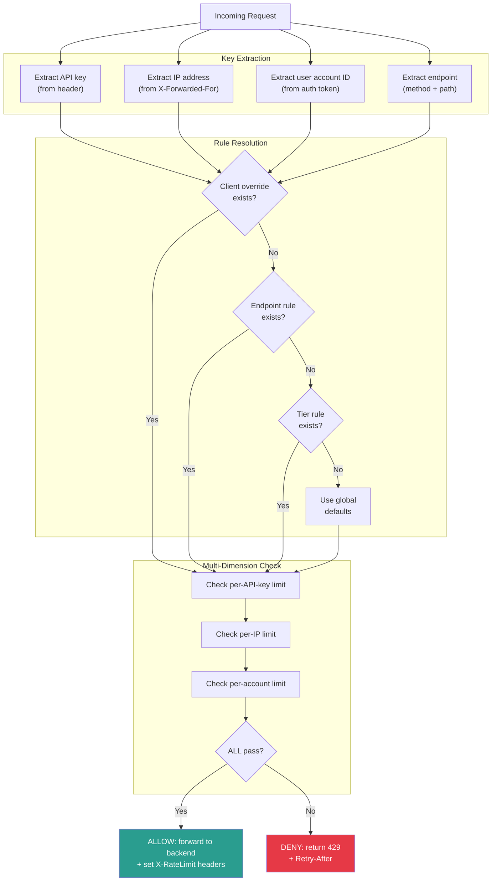
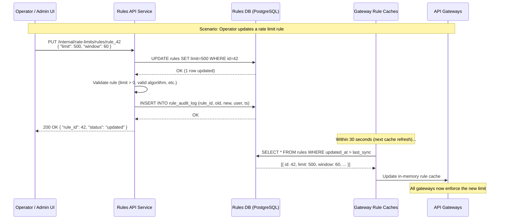
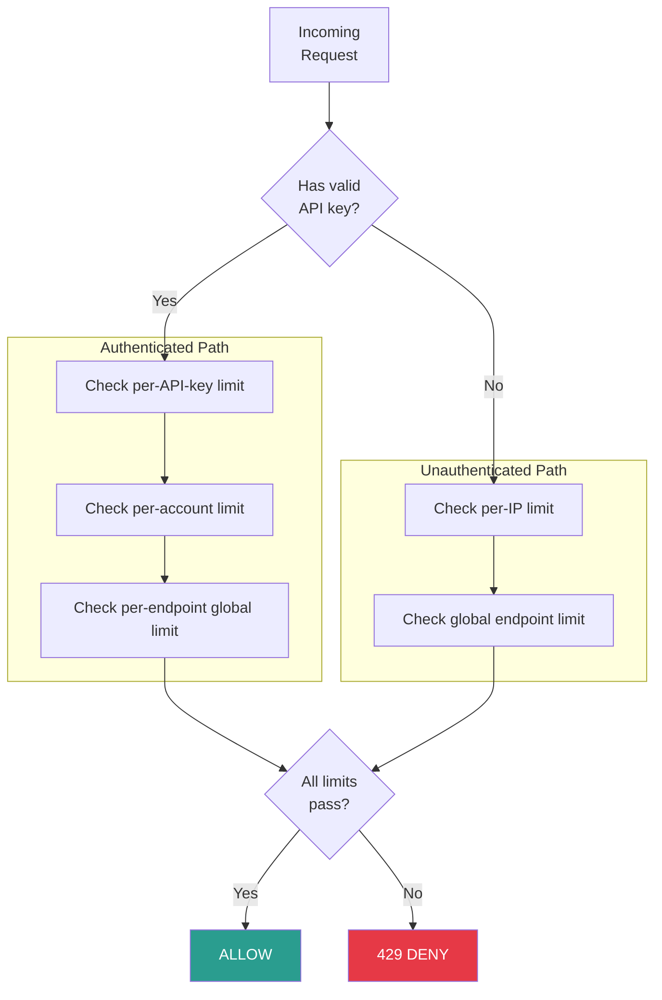

# Design a Rate Limiter -- Part 1: Requirements & Estimation

> **Top Uber / Stripe / Cloudflare Interview Question**
>
> This is Part 1 of a three-part deep dive into designing a production-grade
> rate limiter for a senior-level system design interview. This file covers
> requirements gathering, estimation, and API design.
>
> **Series:**
> 1. **Requirements & Estimation** (this file)
> 2. [High-Level Design](./high-level-design.md)
> 3. [Deep Dive & Scaling](./deep-dive-and-scaling.md)

---

## Table of Contents

1. [Why Rate Limiting?](#why-rate-limiting)
2. [Clarifying Questions to Ask](#clarifying-questions-to-ask)
3. [Functional Requirements](#functional-requirements)
4. [Non-Functional Requirements](#non-functional-requirements)
5. [Back-of-Envelope Estimation](#back-of-envelope-estimation)
6. [API Design](#api-design)
7. [Rate Limit Key Taxonomy](#rate-limit-key-taxonomy)
8. [Tiered Limit Design](#tiered-limit-design)
9. [Scope Boundaries](#scope-boundaries)

---

## Why Rate Limiting?

> **Interview tip**: Spend 5-7 minutes on requirements. The interviewer wants
> to see you scope the problem before touching architecture. Ask at least 5
> clarifying questions before writing anything on the whiteboard.

Before diving into design, establish WHY a rate limiter exists. This shows
the interviewer you understand the business motivation, not just the technical
mechanics.

```
RATE LIMITING SERVES FOUR BUSINESS-CRITICAL PURPOSES:

  1. PROTECT BACKEND RESOURCES
     - Prevent a single abusive client from starving all other clients
     - Ensure backend databases and services remain responsive
     - Guard against accidental infinite loops in client code

  2. ENSURE FAIR USAGE
     - Allocate shared capacity proportionally across clients
     - Enforce SLA tiers (Free, Pro, Enterprise) with different limits
     - Prevent a paying customer from being degraded by a free user

  3. COST CONTROL
     - Cloud resources cost money per request (compute, DB queries, egress)
     - A runaway script can generate a $50,000 bill in an hour
     - Rate limiting caps the maximum cost per client

  4. SECURITY
     - Slow down brute-force attacks on authentication endpoints
     - Limit credential stuffing and password spraying
     - Reduce the impact of DDoS that bypasses L3/L4 protections
     - Prevent API key scraping and enumeration attacks

  5. COMPLIANCE AND CONTRACTUAL OBLIGATIONS
     - SLA agreements specify maximum API usage per tier
     - Regulatory requirements may cap transaction rates
     - Audit trails need bounded event volumes
```

### Rate Limiting vs. Related Concepts

```
CONCEPT COMPARISON (interviewers may ask):

  Rate Limiting:
    - Hard binary cutoff: ALLOW or REJECT (429)
    - Applied per client/key/endpoint
    - Goal: enforce a contract on maximum request rate

  Throttling:
    - Gradual degradation, not a hard cutoff
    - May add latency, reduce response quality, or queue requests
    - Goal: gracefully handle overload without dropping requests

  Load Shedding:
    - Server-side decision to drop requests when overwhelmed
    - Not per-client; applies system-wide
    - Goal: keep the service alive by sacrificing some requests

  Circuit Breaking:
    - Stop calling a failing downstream service
    - Applied per dependency, not per client
    - Goal: prevent cascading failures

  Backpressure:
    - Signal upstream producers to slow down
    - Applied in streaming/queue systems
    - Goal: prevent buffer overflow, maintain flow control

  Best systems COMBINE these: rate limit per client, throttle on overload,
  circuit-break on dependency failure, shed load as last resort.
```

---

## Clarifying Questions to Ask

```
 1. Is this an API-level rate limiter or a network-level (L3/L4) limiter?
    --> Assume: API-level, operating at L7 (HTTP).

 2. What entity do we rate limit on? IP? User ID? API key?
    --> Assume: primarily API key, with IP fallback for unauthenticated traffic.

 3. Is this a standalone service or embedded middleware?
    --> Assume: start as middleware in the API gateway; option to extract later.

 4. Do different endpoints or client tiers have different limits?
    --> Yes. Free/Pro/Enterprise tiers, plus per-endpoint overrides.

 5. Should the system be distributed across multiple servers?
    --> Yes. Multiple API gateway instances behind a load balancer.

 6. Should limits be configurable without code deploys?
    --> Yes. YAML config or database-driven rules, hot-reloadable.

 7. What happens on rate limiter failure (Redis down)?
    --> Fail-open: allow requests but alert. Never take down the service.

 8. Do we need to return standard rate limit headers?
    --> Yes. X-RateLimit-Limit, X-RateLimit-Remaining, Retry-After.

 9. What scale are we targeting?
    --> 10M unique API keys, 500K requests/sec at peak.

10. How strict must enforcement be? Banking-grade exact or best-effort?
    --> Best-effort. 1-5% overshoot acceptable.

11. Do we need multi-region rate limiting?
    --> Yes, eventually. Start single-region, plan for multi-region.

12. Should the rate limiter support cost-based limiting (not just count)?
    --> Yes. Some endpoints consume more "tokens" than others (e.g., uploads).

13. Do we need to support burst allowances above the sustained rate?
    --> Yes. Clients should be able to burst if they have saved-up capacity.

14. Is there a requirement for a client-facing dashboard showing usage?
    --> Nice to have. Expose metrics via headers; dashboard is a follow-up.
```

> **Interview tip**: Questions 11-14 are bonus depth. Asking them shows you
> think about operational concerns, multi-region, and product experience.

---

## Functional Requirements

| # | Requirement | Detail |
|---|-------------|--------|
| F1 | Limit request rates | Per API-key, per endpoint, per configurable time window |
| F2 | Multi-dimension keys | Support IP, user-id, API-key, and composite keys |
| F3 | Tiered limits | Free (60/min), Pro (600/min), Enterprise (6000/min) |
| F4 | Per-endpoint overrides | Login: 5/5min, Search: 30/min, Payments: 10/min |
| F5 | Configurable rules | YAML config, hot-reloadable without restart |
| F6 | Informative rejection | HTTP 429 + rate limit headers + Retry-After |
| F7 | Burst tolerance | Allow short bursts above the sustained rate |
| F8 | Cost-based consumption | Expensive endpoints consume more tokens per request |
| F9 | Exemptions | Internal services and health checks bypass rate limiting |
| F10 | Multi-dimension enforcement | A request must pass ALL applicable limits (key + IP + account) |

### Functional Requirements: Decision Flow



---

## Non-Functional Requirements

| # | Requirement | Target | Justification |
|---|-------------|--------|---------------|
| N1 | **Low latency** | Rate check adds < 5ms (p99) to request path | Rate limiter is on the hot path -- every request passes through it |
| N2 | **High availability** | 99.99% uptime; failure must not block traffic | The rate limiter must never become the single point of failure |
| N3 | **Scalability** | 10M keys, 500K req/sec peak | Must handle growth from current scale to 10x without re-architecture |
| N4 | **Consistency** | At most 1-5% overshoot (not banking-grade) | Perfect accuracy requires expensive distributed consensus; not needed here |
| N5 | **Fault tolerance** | Fail-open if Redis is down; local fallback | Service availability trumps rate limit accuracy in all failure modes |
| N6 | **Observability** | Real-time metrics on rejection rate, latency, Redis health | Operations team must detect and respond to rate limiter issues in < 2 min |
| N7 | **Configurability** | Rule changes take effect within 30 seconds | Ops should be able to raise/lower limits without code deploys |
| N8 | **Auditability** | Log all 429 rejections with key, endpoint, timestamp | Security and customer support need rejection audit trails |

### NFR Priority Matrix

```
                    HIGH IMPORTANCE
                          |
           N1 (Latency)   |   N2 (Availability)
           N5 (Fault tol) |   N3 (Scalability)
                          |
  LOW URGENCY  -----------+------------ HIGH URGENCY
                          |
           N8 (Audit)     |   N6 (Observability)
           N7 (Config)    |   N4 (Consistency)
                          |
                    LOW IMPORTANCE

  Build order: N2 -> N1 -> N5 -> N3 -> N6 -> N4 -> N7 -> N8
```

---

## Back-of-Envelope Estimation

> **Interview tip**: Do this math out loud on the whiteboard. The exact
> numbers matter less than demonstrating the PROCESS: state assumptions,
> calculate each dimension (memory, throughput, network, latency), and
> conclude with feasibility.

### Scale Assumptions

```
GIVEN:
  - 10M unique API keys (clients)
  - Peak: 500K requests/sec globally
  - Average: 200K requests/sec
  - 3 geographic regions (US, EU, AP)
  - Peak-to-average ratio: 2.5x
  - Growth target: handle 10x (5M req/sec) without re-architecture
```

### Memory Estimation

```
Memory per rate-limit key:
  - Token bucket state: 2 fields (tokens: 8B, last_refill: 8B) + key overhead ~50B
  - Total per key: ~70 bytes
  - 10M keys * 70 B = ~700 MB
  - Fits in a single Redis instance (typical 6-16 GB RAM)
  - Use 3-5 shards for throughput, not memory

Detailed breakdown:
  Redis key (e.g., "rl:tb:apikey_abc123:/api/orders"):
    - Key string:        ~60 bytes (varies by key/endpoint length)
    - Hash overhead:     ~40 bytes (Redis hash internal structure)
    - Field "tokens":    ~20 bytes (field name + float value)
    - Field "last_refill": ~24 bytes (field name + float timestamp)
    - Expiry metadata:   ~16 bytes
    -----------------------------------------------
    Total per key:       ~160 bytes (conservative estimate)

  Conservative memory estimate:
    10M keys * 160 B = 1.6 GB
    With Redis memory overhead (~2x): ~3.2 GB
    Still fits in a single 8 GB Redis instance
    Shard for throughput, not memory.

  Active key count (realistic):
    Not all 10M keys are active simultaneously
    Assume 10% active in any given hour: 1M active keys
    Active memory: 1M * 160 B = 160 MB
    Keys auto-expire via TTL (2x refill window)
```

### Throughput Estimation

```
Redis throughput:
  - Single Redis: 100K-200K ops/sec (with Lua scripts)
  - Need: 500K ops/sec at peak
  - Solution: Redis Cluster with 5 shards --> ~750K ops/sec capacity
  - Headroom: 50% buffer for spikes

Shard calculation:
  Target: 500K req/sec * 1.5 (headroom) = 750K ops/sec needed
  Per shard: ~150K ops/sec (conservative for Lua EVALSHA)
  Shards needed: 750K / 150K = 5 shards

  Scaling path:
    500K req/sec  -->  5 shards
    1M req/sec    --> 10 shards
    5M req/sec    --> 25 shards + pipeline batching
    10M+ req/sec  --> Hybrid local + remote (see deep-dive doc)
```

### Network Estimation

```
Network:
  - Each rate limit check: ~200 bytes wire (request + response)
  - 500K * 200 B = 100 MB/sec = ~800 Mbps
  - Within 10 Gbps NIC capacity

  Breakdown per operation:
    Request to Redis:
      - EVALSHA command:     ~20 bytes
      - Script SHA:          ~40 bytes
      - Key:                 ~60 bytes
      - 4 arguments:         ~40 bytes
      - Redis protocol:      ~40 bytes
      Total request:         ~200 bytes

    Response from Redis:
      - Array of 3 integers: ~30 bytes
      - Redis protocol:      ~20 bytes
      Total response:        ~50 bytes

    Round-trip per check:    ~250 bytes
    At 500K/sec:             125 MB/sec = ~1 Gbps
    10 Gbps NIC headroom:   10x capacity
```

### Latency Estimation

```
Latency:
  - Redis Lua script execution: ~0.1-0.5ms
  - Network round-trip (same AZ): ~0.5-1ms
  - Total: 1-2ms p50, <5ms p99 --> Meets N1

  Detailed breakdown:
    Component                p50        p99
    -------------------------------------------
    Key extraction:          0.01ms     0.05ms
    Rule cache lookup:       0.01ms     0.02ms
    Network to Redis:        0.3ms      0.8ms
    Lua script execution:    0.2ms      0.5ms
    Network from Redis:      0.3ms      0.8ms
    Header construction:     0.01ms     0.02ms
    -------------------------------------------
    TOTAL:                   ~0.8ms     ~2.2ms

  Latency budget: 5ms p99 (from N1)
  Actual p99:     ~2.2ms
  Buffer:         2.8ms for spikes, GC pauses, etc.
```

### Storage for Audit Logging

```
429 rejection log entry:
  - Timestamp:       8 bytes
  - API key hash:    32 bytes
  - Endpoint:        50 bytes
  - IP address:      16 bytes
  - Remaining:       4 bytes
  - Retry-After:     4 bytes
  - Metadata:        ~50 bytes
  Total per entry:   ~164 bytes

  Estimated rejection rate: 2-5% of total traffic
  At 500K/sec * 3% = 15K rejections/sec
  15K * 164 B = 2.46 MB/sec = ~213 GB/day

  Retention: 30 days = ~6.4 TB
  Storage: S3 or columnar store (Parquet on S3, queryable via Athena)
```

---

## API Design

> **Interview tip**: Showing API design for the rate limiter's management
> plane (not just the data plane) demonstrates production thinking. The
> data plane is the middleware check; the management plane is how operators
> configure and monitor it.

### Data Plane API (Middleware -- Internal)

The data plane is the per-request rate limit check. It is NOT a REST API
but an in-process middleware call. Included here for completeness.

```
INTERNAL FUNCTION (called by gateway middleware on every request):

  check_rate_limit(
    api_key:     string,       -- "apikey_abc123"
    endpoint:    string,       -- "POST /api/orders"
    client_tier: string,       -- "pro"
    ip_address:  string,       -- "203.0.113.42"
    cost:        int = 1       -- tokens to consume (default 1)
  ) -> {
    allowed:     bool,         -- true = forward, false = 429
    remaining:   int,          -- tokens left in current window
    retry_after: int,          -- seconds until client can retry
    reset_at:    int,          -- unix epoch when limit fully resets
    degraded:    bool,         -- true if operating on local fallback
  }
```

### Management Plane API (REST -- For Operators)

```
RATE LIMIT RULES API (CRUD):

  GET    /internal/rate-limits/rules
         List all active rules.
         Response: { rules: [...], last_updated: "2025-01-15T10:30:00Z" }

  GET    /internal/rate-limits/rules/{rule_id}
         Get a specific rule by ID.

  POST   /internal/rate-limits/rules
         Create a new rule.
         Body: {
           "name": "Search endpoint limit",
           "endpoint": "GET /api/search",
           "algorithm": "sliding_window_counter",
           "limit": 30,
           "window": 60,
           "tier": "all",
           "priority": 2,
           "enabled": true
         }

  PUT    /internal/rate-limits/rules/{rule_id}
         Update an existing rule. Takes effect within 30 seconds.

  DELETE /internal/rate-limits/rules/{rule_id}
         Soft-delete a rule (disable, do not remove from DB).

  POST   /internal/rate-limits/rules/reload
         Force immediate cache refresh on all gateway instances.

  GET    /internal/rate-limits/status/{api_key}
         Get current rate limit state for a specific client.
         Response: {
           "api_key": "abc123",
           "tier": "pro",
           "endpoints": {
             "GET /api/search": { "remaining": 12, "limit": 30, "reset_at": ... },
             "POST /api/orders": { "remaining": 87, "limit": 100, "reset_at": ... }
           }
         }

  POST   /internal/rate-limits/override
         Apply a temporary override for a specific client.
         Body: {
           "api_key": "abc123",
           "endpoint": "*",
           "new_limit": 10000,
           "duration_minutes": 60,
           "reason": "Customer running approved data migration"
         }
```

### Management API: Mermaid Sequence Diagram



---

## Rate Limit Key Taxonomy

Different dimensions of rate limiting serve different purposes. A production
system must support multiple key types simultaneously.

```
KEY DIMENSION TAXONOMY:

  1. PER API KEY (primary)
     Key:  rl:tb:{api_key}:{endpoint}
     Use:  Enforce per-client SLA limits
     Ex:   "rl:tb:apikey_abc123:POST /api/orders"

  2. PER IP ADDRESS (fallback for unauthenticated)
     Key:  rl:tb:ip:{ip}:{endpoint}
     Use:  Protect against unauthenticated abuse
     Ex:   "rl:tb:ip:203.0.113.42:POST /api/auth/login"
     Note: Be careful with shared IPs (corporate NAT, mobile carriers)

  3. PER USER ACCOUNT (aggregate across API keys)
     Key:  rl:tb:user:{user_id}:{endpoint}
     Use:  Prevent API-key rotation attacks
     Ex:   "rl:tb:user:user_42:*"

  4. PER ENDPOINT (global, across all clients)
     Key:  rl:tb:global:{endpoint}
     Use:  Protect expensive backend operations from aggregate overload
     Ex:   "rl:tb:global:POST /api/reports/generate"

  5. COMPOSITE (multiple dimensions)
     Key:  rl:tb:{api_key}:{ip}:{endpoint}
     Use:  Tightest control -- limits per key, per source IP
     Ex:   "rl:tb:apikey_abc123:203.0.113.42:POST /api/payments"

  ENFORCEMENT: A request must pass ALL applicable dimensions.
    Per-key: 100/min  AND  Per-account: 500/min  AND  Per-IP: 1000/min
    Any one failing results in a 429.
```

### Key Dimension Decision Tree



---

## Tiered Limit Design

```
TIER STRUCTURE:

  Tier          Sustained Rate    Burst Capacity    Monthly Volume
  ------------- ----------------- ----------------- ----------------
  Free          60 req/min        10 burst          86,400/day
  Pro           600 req/min       50 burst          864,000/day
  Enterprise    6,000 req/min     200 burst         8,640,000/day
  Internal      unlimited         N/A               N/A (exempt)

  Token Bucket Parameters:
  Tier          capacity    refill_rate     Effective Limit
  ------------- ----------- --------------- ------------------
  Free          10          1.0 tok/sec     60/min sustained, burst 10
  Pro           50          10.0 tok/sec    600/min sustained, burst 50
  Enterprise    200         100.0 tok/sec   6000/min sustained, burst 200


  Per-Endpoint Overrides (apply regardless of tier):
  Endpoint                    Algorithm             Limit     Window
  --------------------------- --------------------- --------- ---------
  POST /api/auth/login        sliding_window_log    5         5 min
  POST /api/auth/password-reset sliding_window_log  3         1 hour
  POST /api/payments          token_bucket          10        1 min
  GET /api/search             sliding_window_counter 30       1 min
  POST /api/files/upload      token_bucket          20/min    3 tok/req
```

### Why These Specific Numbers?

```
TIER RATIONALE:

  Free (60/min):
    - Designed for developers exploring the API
    - 1 req/sec sustained is enough for testing
    - Burst of 10 allows rapid manual testing
    - Low enough that abuse is bounded

  Pro (600/min):
    - 10x Free, typical for paid individual/startup
    - 10 req/sec sustained handles moderate production traffic
    - Burst of 50 absorbs periodic batch operations

  Enterprise (6000/min):
    - 100x Free, 10x Pro
    - 100 req/sec sustained handles heavy production workloads
    - Burst of 200 absorbs webhook storms, batch imports
    - Enterprise customers can negotiate custom limits via sales

  ENDPOINT RATIONALE:
    Login (5/5min):     Brute-force protection. 5 attempts is generous for humans.
    Password reset (3/hr): Prevents email bombing. 3 is enough for legitimate use.
    Payments (10/min):  Expensive downstream (Stripe/bank calls). Low limit + retry.
    Search (30/min):    Database-intensive. Tighter than general CRUD.
    Upload (3 tok/req): Large file handling is expensive. Token cost > 1.
```

---

## Scope Boundaries

```
IN SCOPE (what we are designing):
  - API-level (L7/HTTP) rate limiter
  - Distributed across multiple gateway instances
  - Redis-backed shared state
  - Configurable rules engine (YAML + API)
  - HTTP 429 responses with standard headers
  - Fail-open with local fallback
  - Observability (Prometheus metrics)

OUT OF SCOPE (explicitly excluded):
  - L3/L4 DDoS protection (handled by WAF/CDN -- Cloudflare, AWS Shield)
  - Authentication and authorization (handled by auth middleware)
  - Request queuing / throttling (would be a separate system)
  - Client SDK implementation (SDK teams own retry logic)
  - Billing enforcement (billing service handles invoice/payment)
  - Geographic-based blocking (handled by WAF/CDN)
  - Bot detection and CAPTCHA (separate security service)
  - Rate limiting for internal service-to-service calls (separate mesh concern)
```

---

## Next Steps

With requirements, estimation, and API design complete, proceed to:

- **[Part 2: High-Level Design](./high-level-design.md)** -- Architecture diagram, algorithm
  comparison and selection, Redis Lua implementation, rules engine, HTTP headers.
- **[Part 3: Deep Dive & Scaling](./deep-dive-and-scaling.md)** -- Distributed challenges,
  multi-region, observability, scaling to 10M+ req/sec, real-world examples, trade-offs.
