# URL Shortener: Deep Dive and Scaling

## Overview

This document covers the advanced topics that differentiate a good answer from a great
answer in a system design interview: the analytics pipeline, custom aliases, URL expiration,
database sharding, multi-region deployment, security, cost estimation, monitoring, key
trade-offs, and interview tips.

---

## 1. Analytics Deep Dive

### 1.1 Click Tracking Pipeline

Analytics is the core business value of a modern URL shortener (Bitly model). The pipeline
must handle 35,000 clicks/sec at peak without adding latency to the redirect response.

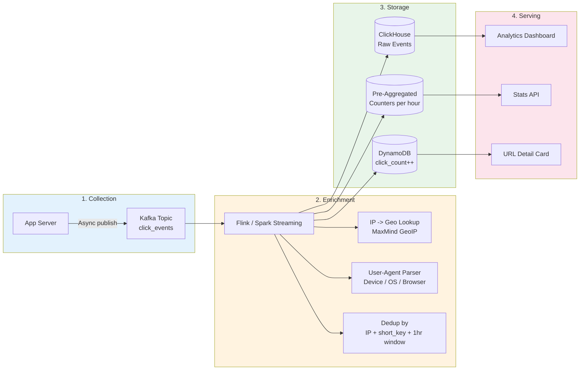

**Why this four-stage architecture?**

1. **Collection** is decoupled from the redirect path via async Kafka publish. The app server
   fires-and-forgets the click event, adding zero latency to the redirect response.
2. **Enrichment** runs in a dedicated stream processor (Flink/Spark Streaming). IP-to-geo
   and User-Agent parsing are CPU-intensive operations that should not burden the app servers.
3. **Storage** is split by access pattern: raw events in ClickHouse for ad-hoc queries,
   pre-aggregated counters for fast dashboard loads, and an atomic DynamoDB counter for
   the total click count shown on each URL's detail card.
4. **Serving** provides three interfaces: a full analytics dashboard backed by ClickHouse,
   a stats API backed by pre-aggregated tables, and a quick click count from DynamoDB.

### 1.2 What We Track Per Click

```python
@dataclass
class ClickEvent:
    # Core identifiers
    short_key: str
    timestamp: datetime

    # Network
    ip_address: str
    country: str          # Derived from IP via MaxMind
    city: str             # Derived from IP via MaxMind
    latitude: float       # Derived from IP
    longitude: float      # Derived from IP

    # Device
    device_type: str      # Mobile / Desktop / Tablet
    os: str               # iOS 18, Android 15, Windows 11, macOS 15
    browser: str          # Chrome 130, Safari 18, Firefox 135

    # Referral
    referrer_url: str     # Full referrer URL
    referrer_domain: str  # Extracted domain (twitter.com, facebook.com)
    utm_source: str       # UTM parameters if present
    utm_medium: str
    utm_campaign: str

    # Deduplication
    visitor_hash: str     # Hash of IP + User-Agent (for unique visitor count)
```

### 1.3 Kafka Topic Design

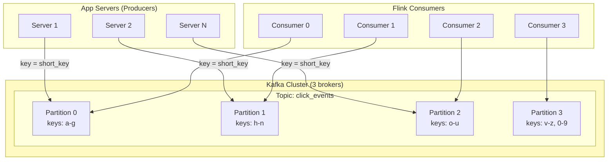

**Kafka configuration for click events:**

```
Topic: click_events
Partitions:          12 (allows up to 12 parallel consumers)
Replication factor:  3 (tolerate 2 broker failures)
Retention:           7 days (raw events; ClickHouse is the long-term store)
Partition key:       short_key (ensures all clicks for the same URL go to same partition)
Message format:      Avro (schema registry for backward compatibility)
Compression:         lz4 (best throughput-to-compression ratio)

Throughput:
  Peak: 35,000 events/sec * ~200 bytes = ~7 MB/sec
  This is well within a single Kafka cluster's capacity (~100 MB/sec per broker)
```

### 1.4 Pre-Aggregated Analytics Tables

To avoid scanning billions of raw events for every dashboard load, we maintain
pre-aggregated rollup tables:

```sql
-- Hourly rollup (materialized view in ClickHouse)
CREATE TABLE click_stats_hourly (
    short_key    String,
    hour         DateTime,
    total_clicks UInt64,
    unique_visitors UInt64,
    -- Top-N stored as arrays
    top_countries Array(Tuple(String, UInt64)),
    top_referrers Array(Tuple(String, UInt64)),
    top_devices   Array(Tuple(String, UInt64))
) ENGINE = SummingMergeTree()
ORDER BY (short_key, hour);

-- Daily rollup (further aggregated from hourly)
CREATE TABLE click_stats_daily (
    short_key    String,
    day          Date,
    total_clicks UInt64,
    unique_visitors UInt64,
    top_countries Array(Tuple(String, UInt64)),
    top_referrers Array(Tuple(String, UInt64)),
    top_devices   Array(Tuple(String, UInt64))
) ENGINE = SummingMergeTree()
ORDER BY (short_key, day);
```

**Why ClickHouse for analytics?**

| Factor | ClickHouse | PostgreSQL | DynamoDB |
|--------|-----------|------------|----------|
| Column-oriented | Yes (excellent for aggregations) | No (row-oriented) | No (key-value) |
| Compression | 10-20x (columnar + LZ4) | 2-3x | No native compression |
| Query speed (1B rows) | ~100 ms | ~10+ seconds | Not designed for scans |
| Write throughput | ~1M rows/sec per node | ~50K rows/sec | ~40K WCU max |
| Cost per TB | ~$10/month (compressed) | ~$100/month | ~$250/month |

### 1.5 Real-Time Counter Updates

For the `click_count` field shown on the URL detail card, we use an atomic
DynamoDB counter increment rather than querying the analytics DB:

```python
def increment_click_count(short_key: str):
    """Atomic counter increment in DynamoDB -- fire and forget."""
    dynamodb.update_item(
        TableName='url_mappings',
        Key={'short_key': short_key},
        UpdateExpression='SET click_count = click_count + :inc',
        ExpressionAttributeValues={':inc': 1}
    )
```

**Why a separate counter instead of querying ClickHouse?**

- ClickHouse is optimized for batch analytical queries, not single-key point lookups
- DynamoDB counter increment is ~5ms, ClickHouse point query is ~50-100ms
- The counter is "good enough" -- exact analytics come from ClickHouse
- Counter may slightly overcount (retries) or undercount (dropped events); this is acceptable

### 1.6 Unique Visitor Counting

Counting unique visitors at scale is a classic data engineering problem. Exact counting
requires storing every visitor hash, which is prohibitively expensive at 3.65 trillion
clicks over 10 years.

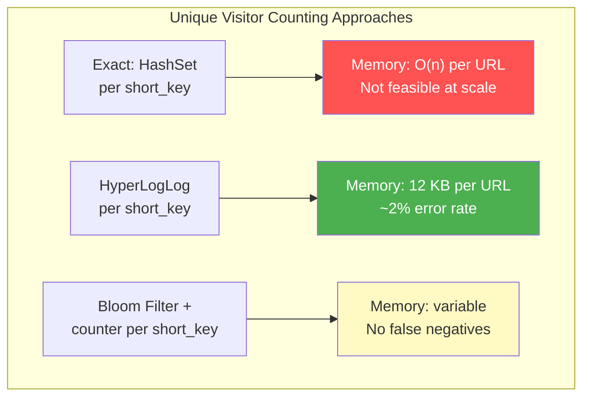

**Our choice: HyperLogLog (HLL)**

- Redis has built-in HLL support via `PFADD` and `PFCOUNT`
- 12 KB per HLL counter, regardless of cardinality
- ~2% error rate (acceptable for "unique visitors" metric)
- For 10M active URLs: 10M * 12 KB = 120 GB (across Redis cluster, feasible)

```python
def track_unique_visitor(short_key: str, visitor_hash: str):
    """Track unique visitor using Redis HyperLogLog."""
    redis.pfadd(f"hll:{short_key}", visitor_hash)

def get_unique_visitors(short_key: str) -> int:
    """Get approximate unique visitor count."""
    return redis.pfcount(f"hll:{short_key}")
```

---

## 2. Custom Aliases

Custom aliases (e.g., `short.ly/my-product-launch`) add several design considerations.

### 2.1 Validation Rules

```python
import re

ALIAS_PATTERN = re.compile(r'^[a-zA-Z0-9][a-zA-Z0-9\-_]{1,28}[a-zA-Z0-9]$')
RESERVED_WORDS = {'api', 'admin', 'help', 'stats', 'login', 'signup', 'health',
                  'status', 'dashboard', 'settings', 'docs', 'pricing', 'about'}

def validate_custom_alias(alias: str) -> tuple[bool, str]:
    """Validate a custom alias. Returns (is_valid, error_message)."""

    if len(alias) < 3:
        return False, "Alias must be at least 3 characters"

    if len(alias) > 30:
        return False, "Alias must be at most 30 characters"

    if not ALIAS_PATTERN.match(alias):
        return False, "Alias must be alphanumeric (hyphens and underscores allowed, not at start/end)"

    if alias.lower() in RESERVED_WORDS:
        return False, f"'{alias}' is a reserved word"

    # Check for offensive content (optional, depends on brand policy)
    if contains_profanity(alias):
        return False, "Alias contains prohibited content"

    return True, ""
```

### 2.2 Conflict Resolution

Custom aliases share the same key space as auto-generated keys. To prevent conflicts:

1. Auto-generated keys are always exactly 7 characters of base62 (no hyphens/underscores).
2. Custom aliases must be 3-30 characters and may contain hyphens/underscores.
3. The character set overlap means we must check the `url_mappings` table for both.

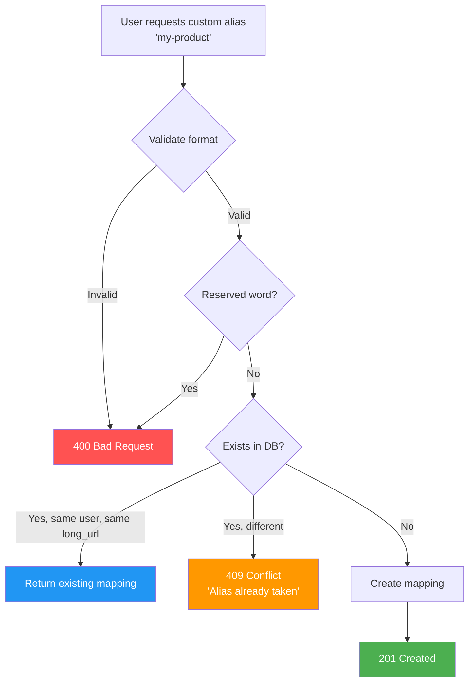

### 2.3 Premium Alias Features (Monetization)

Custom aliases are a natural monetization lever:

```
Free tier:        Custom aliases 8+ characters only
Pro tier:         Custom aliases 3+ characters
Enterprise:       Priority claim on premium aliases, branded domains

Premium alias marketplace:
  - Short, memorable aliases (3-4 chars) are scarce and valuable
  - "Cybersquatting" prevention: aliases unused for 90 days are reclaimed
  - Trademark protection: verified brand owners can claim their names
```

---

## 3. URL Expiration and Cleanup

### 3.1 Expiration Flow

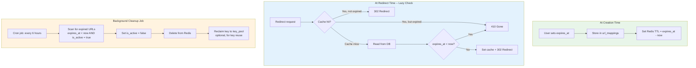

### 3.2 Cleanup Strategy: Two-Phase

**Phase 1 -- Lazy expiration (at read time):**
Every redirect checks `expires_at`. If expired, return 410 Gone.
This catches 100% of reads to expired URLs with zero extra infrastructure.

**Phase 2 -- Active cleanup (background job):**
A periodic job scans for expired URLs and marks them inactive. This reclaims
storage and optionally returns keys to the key pool for reuse.

```python
def cleanup_expired_urls():
    """Background job: scan and deactivate expired URLs."""
    expired_urls = db.query(
        table='url_mappings',
        filter='expires_at < :now AND is_active = :true',
        expression_values={':now': now_epoch(), ':true': True},
        limit=10_000  # Process in batches
    )

    for url in expired_urls:
        # Mark as inactive
        db.update_item(
            table='url_mappings',
            key={'short_key': url['short_key']},
            update='SET is_active = :false',
            expression_values={':false': False}
        )

        # Remove from cache
        redis.delete(f"url:{url['short_key']}")

        # Optionally reclaim the key
        if not url.get('custom_alias'):
            db.put_item(
                table='available_keys',
                item={'short_key': url['short_key'], 'created_at': now_epoch()}
            )
```

### 3.3 DynamoDB TTL as an Alternative

If using DynamoDB, you can set the native TTL attribute to `expires_at`. DynamoDB
will automatically delete expired items (within ~48 hours of expiration). This is
free and requires no custom cleanup job, but the deletion is not instant.

```python
# DynamoDB TTL is set on table creation:
# TTL attribute: expires_at (epoch seconds)
# DynamoDB will automatically delete items where expires_at < current_time
```

**Comparison of cleanup approaches:**

| Approach | Latency | Cost | Operational Overhead | Key Reclaimable? |
|----------|---------|------|---------------------|-----------------|
| Lazy only (check at read time) | Instant | Free | None | No |
| Background job (every 6 hours) | Up to 6 hours | Compute for scan job | Job monitoring | Yes |
| DynamoDB TTL (automatic) | Up to 48 hours | Free | None | No (item deleted) |
| Lazy + background job (recommended) | Instant for reads, hours for cleanup | Low | Job monitoring | Yes |

### 3.4 Key Reuse Considerations

Should we return expired keys to the pool for reuse?

**Arguments for reuse:**
- At 365B URLs over 10 years with a 3.52T key space, we use 10.4% of keys
- Reclaiming keys extends the system's lifetime
- Reduces the chance of ever needing to migrate to 8-character keys

**Arguments against reuse:**
- A recycled key might still be cached in someone's browser (if 301 was used)
- Old analytics data is still associated with the key -- confusion potential
- The key space is large enough that exhaustion is unlikely
- Adds complexity to the cleanup pipeline

**Our recommendation:** Do NOT reuse keys unless key-space exhaustion is imminent.
The 89.6% remaining capacity provides decades of headroom.

---

## 4. Database Sharding

At 110 TB, a single database instance is not viable. We need horizontal sharding.

### 4.1 Sharding Strategy: Hash-Based on Short Key

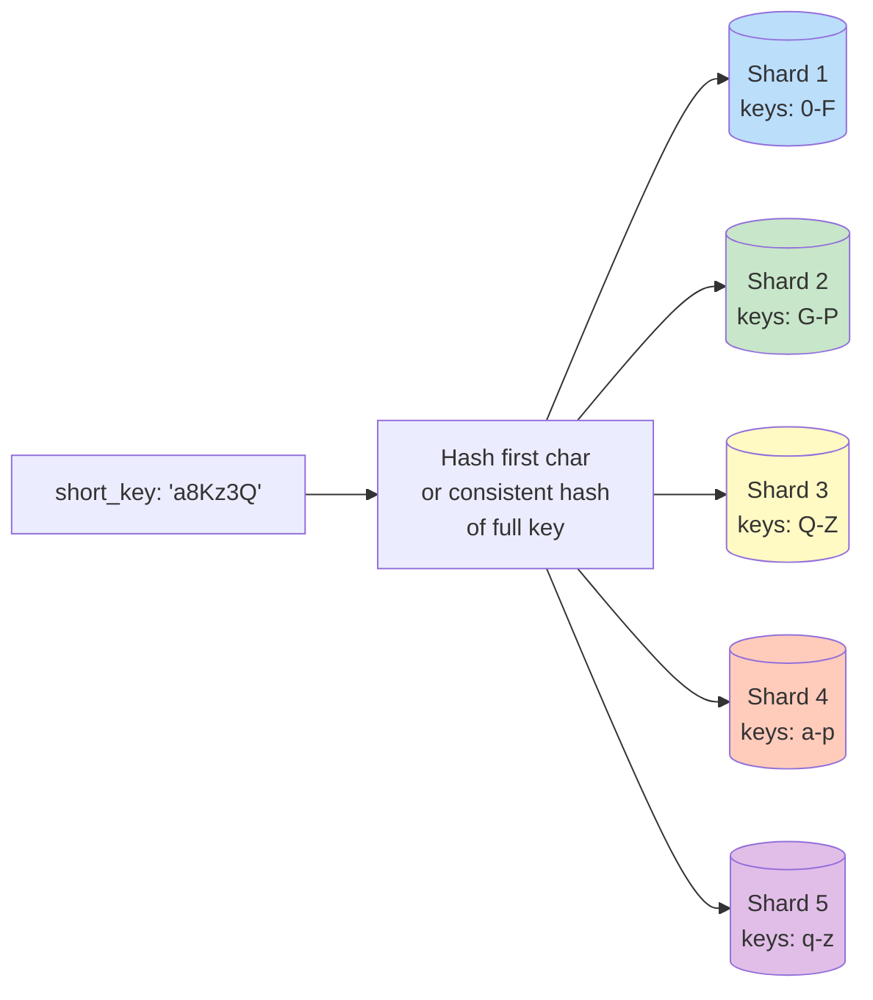

**Why hash-based sharding works well here:**

1. **Uniform distribution**: Random base62 keys distribute evenly across shards
2. **Simple routing**: `shard = hash(short_key) % num_shards`
3. **No hotspots**: Unlike time-based sharding, random keys do not create hot partitions
4. **Easy to add shards**: Use consistent hashing to minimize data movement

```python
import hashlib

NUM_SHARDS = 16  # Start with 16, expand as needed

def get_shard(short_key: str) -> int:
    """Determine which shard holds a given short key."""
    hash_val = int(hashlib.md5(short_key.encode()).hexdigest(), 16)
    return hash_val % NUM_SHARDS

# In production, use a consistent hashing ring for elastic scaling:
#   ring = ConsistentHashRing(nodes=[f"shard-{i}" for i in range(NUM_SHARDS)])
#   shard = ring.get_node(short_key)
```

### 4.2 Consistent Hashing for Elastic Scaling

When adding or removing shards, naive modular hashing (`hash % N`) redistributes nearly
all keys. Consistent hashing minimizes data movement to `~K/N` keys (where K = total keys,
N = number of shards).

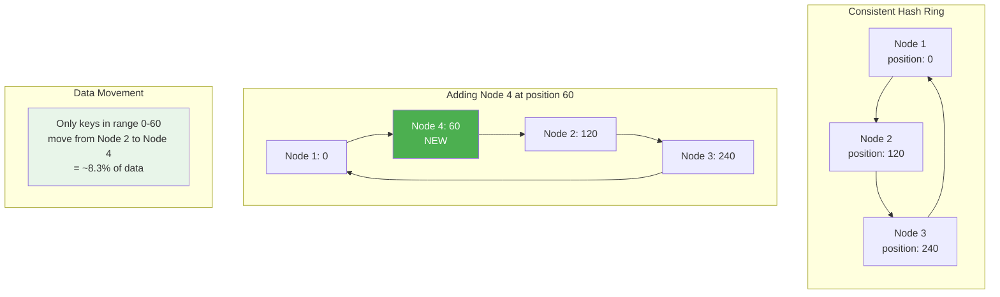

### 4.3 DynamoDB: Sharding for Free

If you use DynamoDB, partitioning is handled automatically. DynamoDB partitions data
by the partition key (`short_key`), distributing across storage nodes transparently.
At 110 TB and 35K reads/sec, DynamoDB would use ~1,100 partitions internally.

```
DynamoDB auto-sharding:
  - Partition size limit: 10 GB per partition
  - 110 TB / 10 GB = 11,000 partitions
  - Throughput limit per partition: 1,000 WCU, 3,000 RCU
  - With 3,500 peak WCU: needs at least 4 partitions by throughput
  - DynamoDB automatically manages both dimensions
  - No manual sharding logic, no rebalancing, no shard mapping tables
```

---

## 5. Cache Partitioning

### 5.1 Redis Cluster Topology

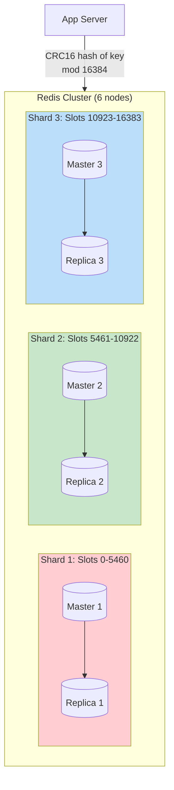

**Configuration:**

```
Cluster size:         3 masters + 3 replicas = 6 nodes
Memory per master:    16 GB
Total cache capacity: 48 GB (3 * 16 GB)
Estimated hot URLs:   ~10M daily active (~2.5 GB)
Headroom:             ~45 GB free for burst/growth

Hash slots:           16,384 (Redis Cluster standard)
Key routing:          CRC16(key) mod 16384 -> slot -> shard

Replica reads:        READONLY mode enabled for read scaling
Failover:             Automatic via Redis Sentinel / Cluster
```

### 5.2 Redis Failure Scenarios

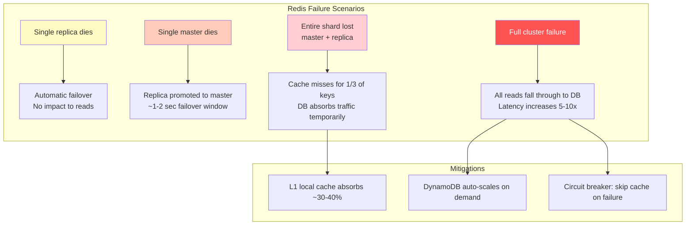

---

## 6. Multi-Region Deployment

### 6.1 Architecture

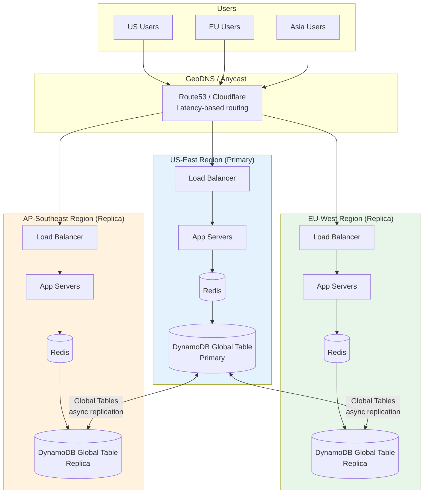

### 6.2 Write Routing

- All writes go to the nearest region. DynamoDB Global Tables replicate across
  regions asynchronously (typically < 1 second).
- For the KGS, each region runs its own key generation service with non-overlapping
  key ranges to avoid conflicts during replication.

**KGS key range allocation per region:**

```
Region            Key Prefix Strategy
-------------------------------------------------
US-East           Keys starting with: 0-9, a-h
EU-West           Keys starting with: i-q
AP-Southeast      Keys starting with: r-z, A-Z

Alternative: Each region's KGS draws from a separate partition of the key pool DB,
ensuring zero overlap without prefix constraints.
```

### 6.3 Read Routing

- Reads are served from the local region's cache and DB replica.
- Cache hit rate in each region independently reaches ~95%+ for that region's traffic.
- Cross-region traffic (e.g., a URL created in US, clicked in EU) is served from the
  EU replica after Global Tables replication completes (~1 second).

### 6.4 Conflict Resolution in Multi-Region Writes

DynamoDB Global Tables use "last writer wins" for concurrent writes to the same item.
For a URL shortener, write conflicts are extremely rare because:

1. Each short key is created once and (almost) never updated
2. The KGS ensures region-disjoint key pools -- two regions never create the same key
3. The only concurrent writes are `click_count` increments, which are commutative

```
Conflict scenarios and handling:
  - Same key created in two regions simultaneously: Impossible (disjoint key pools)
  - Same key's click_count incremented in two regions: Last writer wins,
    slight undercount possible (acceptable for analytics)
  - URL deleted in one region while being read in another: Eventually consistent,
    user may get one extra redirect during replication lag (~1 sec)
```

---

## 7. Security and Abuse Prevention

### 7.1 Security Pipeline

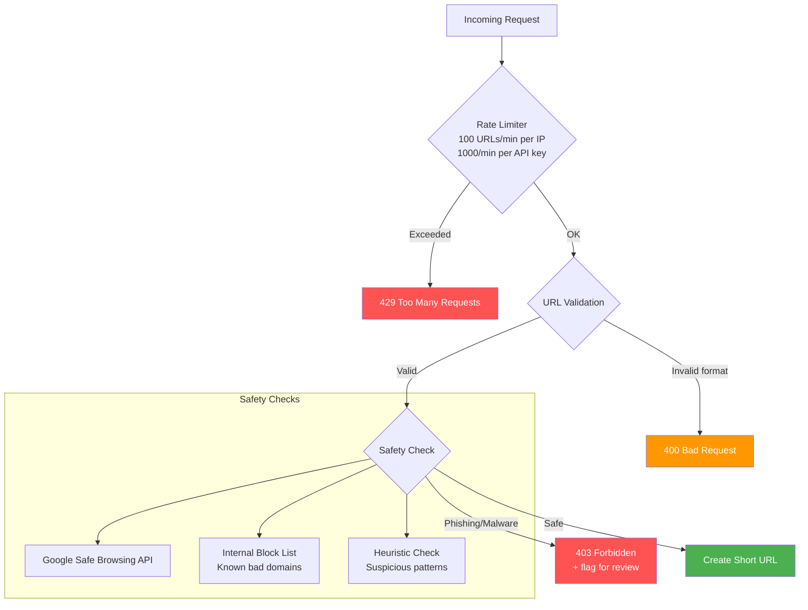

### 7.2 Rate Limiting Strategy

```
Layer 1 -- Per-IP (anonymous requests):
  Create:     10 URLs/hour (prevents spray attacks)
  Redirect:   1,000 redirects/minute (prevents scraping)

Layer 2 -- Per API key (authenticated requests):
  Free tier:  100 URLs/day
  Pro tier:   10,000 URLs/day
  Enterprise: Unlimited (custom rate via SLA)

Layer 3 -- Global circuit breaker:
  If total creation rate exceeds 5x baseline: alert + temporary CAPTCHA for all

Implementation: Sliding window counter in Redis (O(1) per check)
```

### 7.3 URL Safety Checks

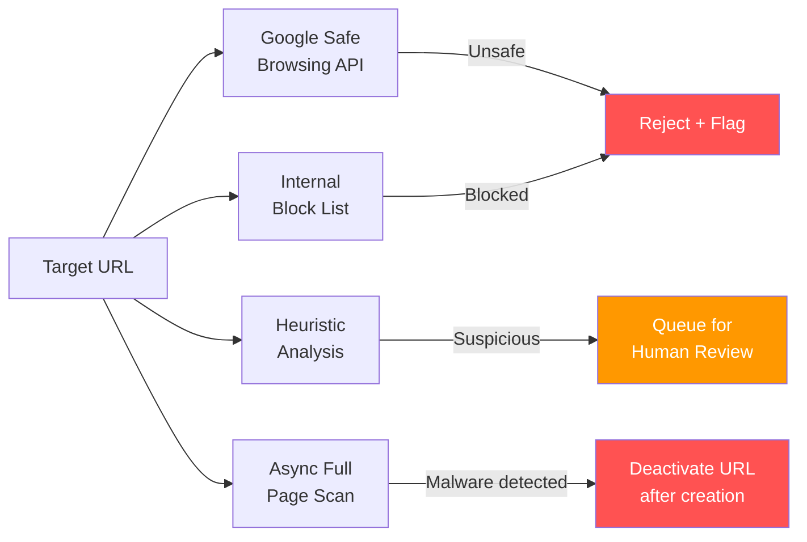

**Safety check details:**

| Check | Latency | Coverage | When |
|-------|---------|----------|------|
| Google Safe Browsing API | ~50-100 ms | Phishing, malware, social engineering | Synchronous at creation |
| Internal block list | ~1 ms (in-memory) | Known spam domains, competitor abuse | Synchronous at creation |
| Heuristic analysis | ~5 ms | Suspicious patterns (URL obfuscation, data URIs) | Synchronous at creation |
| Full page scan (headless browser) | ~5-10 seconds | JavaScript-based redirects, cloaked pages | Async, after creation |

**Additional security measures:**
- CAPTCHA for anonymous (non-API-key) creation above threshold
- Preview page option: `short.ly/a8Kz3Q+` shows a preview instead of redirecting
- Abuse reporting endpoint for users to flag malicious links
- Automated scanning of target URLs against malware databases
- CORS headers to prevent cross-origin abuse of the creation API
- Content-Security-Policy headers on the redirect response
- Logging all creation requests with IP and user-agent for forensic analysis

---

## 8. Cost Estimation (AWS, at Scale)

### 8.1 Component-by-Component Breakdown

```
DynamoDB (url_mappings + click events):
  - Storage: 110 TB * $0.25/GB = ~$28,000/month
  - Write: 3,500 WCU on-demand = ~$2,000/month (on-demand pricing)
  - Read: 35,000 RCU on-demand = ~$1,500/month (on-demand pricing)
  - Global Tables replication (2 replicas): ~$3,000/month
  - Reserved capacity pricing would reduce by ~60%
  - Estimate: ~$34,500/month (or ~$14,000/month with reserved)

Redis (ElastiCache):
  - 3 masters + 3 replicas, r6g.xlarge (26 GB each)
  - 6 * $0.45/hr = $2.70/hr = ~$2,000/month
  - Multi-AZ: included with replication
  - Per additional region (2 regions): 2 * $2,000 = $4,000/month
  - Estimate: ~$6,000/month (3 regions)

EC2 (App Servers):
  - 10 servers (c6g.xlarge) for 35K req/sec
  - 10 * $0.136/hr = ~$1,000/month
  - Per additional region: $1,000/month
  - Estimate: ~$3,000/month (3 regions)

Kafka (Amazon MSK):
  - 3 broker cluster for click events
  - kafka.m5.large * 3 = ~$1,500/month
  - Per additional region (for local analytics ingestion)
  - Estimate: ~$4,500/month (3 regions)

ClickHouse (Analytics):
  - Self-managed on EC2 or ClickHouse Cloud
  - 3-node cluster, r6g.2xlarge
  - ~$3,000/month (single region, analytics can be centralized)

Networking:
  - Cross-region data transfer (DynamoDB Global Tables): ~$1,000/month
  - NAT Gateway, load balancer: ~$500/month per region
  - Estimate: ~$2,500/month

Miscellaneous:
  - Route53 (GeoDNS): ~$100/month
  - CloudWatch monitoring: ~$200/month
  - S3 (backups, logs): ~$500/month
  - Estimate: ~$800/month
```

### 8.2 Total Cost Summary

```
+--------------------+-------------------+
| Component          | Monthly Cost      |
+--------------------+-------------------+
| DynamoDB           | $34,500           |
| Redis/ElastiCache  | $6,000            |
| EC2 App Servers    | $3,000            |
| Kafka (MSK)        | $4,500            |
| ClickHouse         | $3,000            |
| Networking         | $2,500            |
| Miscellaneous      | $800              |
+--------------------+-------------------+
| TOTAL              | ~$54,300/month    |
+--------------------+-------------------+
| Annual cost        | ~$651,600/year    |
| Cost per URL/year  | ~$0.000002        |
| Cost per redirect  | ~$0.0000004       |
+--------------------+-------------------+

With reserved instances (1-year commitment): ~$35,000/month
With spot instances for non-critical workloads: ~$30,000/month
```

### 8.3 Cost Optimization Strategies

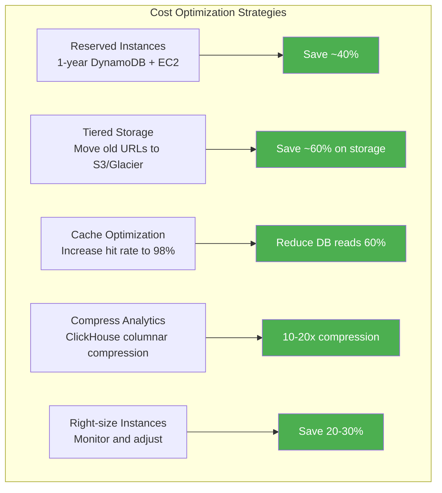

---

## 9. Monitoring and Alerting

### 9.1 Key Metrics

```
+----------------------------+-------------------+---------------------------+
| Metric                     | Alert Threshold   | Why It Matters            |
+----------------------------+-------------------+---------------------------+
| Redirect latency p99       | > 50 ms           | Core user experience      |
| Redirect latency p50       | > 10 ms           | Median should stay fast   |
| Cache hit rate (L2)        | < 90%             | DB overload risk          |
| Cache hit rate (L1)        | < 25%             | Local cache misconfigured |
| Key pool remaining         | < 1 billion       | Risk of key exhaustion    |
| Error rate (5xx)           | > 0.1%            | Service degradation       |
| Error rate (4xx)           | > 5%              | Possible abuse or bug     |
| DynamoDB throttled reads   | > 0               | Capacity undersized       |
| DynamoDB throttled writes  | > 0               | Capacity undersized       |
| Kafka consumer lag         | > 100K events     | Analytics pipeline delay  |
| Expired URL cleanup rate   | < 80% of expired  | Storage leak              |
| URL creation rate          | > 2x baseline     | Possible abuse / bot      |
| Redis memory utilization   | > 80%             | Risk of eviction storms   |
| App server CPU             | > 70%             | Need to scale out         |
+----------------------------+-------------------+---------------------------+
```

### 9.2 Dashboard Layout

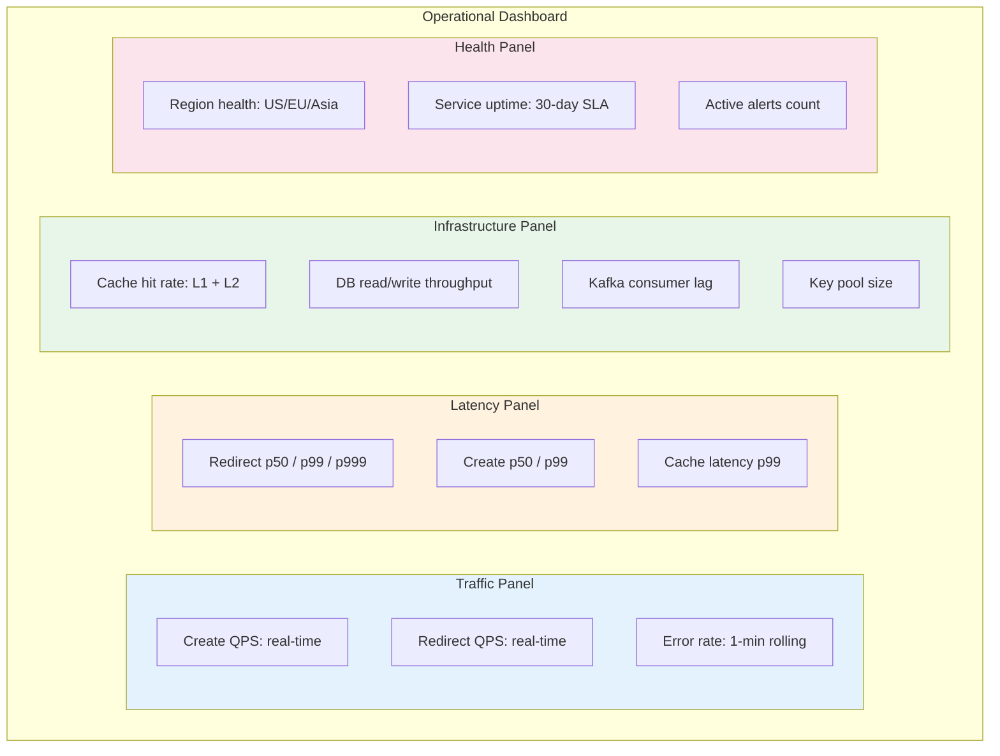

### 9.3 Alerting Runbooks

```
Alert: Redirect latency p99 > 50ms
Runbook:
  1. Check cache hit rate -- if < 90%, investigate cache eviction or failure
  2. Check DynamoDB throttling -- if throttled, increase provisioned capacity
  3. Check app server CPU -- if > 70%, scale out
  4. Check for hot keys -- a viral URL may cause localized load

Alert: Key pool < 1 billion
Runbook:
  1. Verify KGS workers are running
  2. Check KGS DB connectivity
  3. Check key generation rate (should be > 100M/day)
  4. If pool < 100M: CRITICAL -- escalate to on-call engineer

Alert: Kafka consumer lag > 100K events
Runbook:
  1. Check consumer group health
  2. Check ClickHouse write throughput
  3. Scale consumer instances if needed
  4. Temporary: analytics delay is acceptable; redirects are unaffected
```

---

## 10. Key Trade-offs Summary

| Decision | Option A | Option B | Our Choice | Rationale |
|----------|----------|----------|------------|-----------|
| **Key generation** | Hash + Base62 | KGS pre-generated pool | KGS | Zero collisions, lowest latency |
| **Redirect code** | 301 Permanent | 302 Temporary | 302 | Preserves analytics accuracy |
| **Database** | SQL (PostgreSQL) | NoSQL (DynamoDB) | DynamoDB | Key-value pattern, auto-sharding, 110 TB scale |
| **Cache strategy** | Read-through only | Write-through + read-through | Both | New URLs cached immediately |
| **Analytics storage** | Same DB as URLs | Separate analytics DB (ClickHouse) | Separate | Different access patterns, write-heavy |
| **Expiration** | Lazy only | Lazy + background cleanup | Both | Lazy catches 100% of reads; cleanup reclaims resources |
| **Multi-region** | Single region + CDN | Multi-region active-active | Multi-region | < 50ms redirect latency globally |
| **Custom aliases** | Same key space | Separate table | Same table | Simpler, just validate format differences |
| **Key reuse** | Reclaim expired keys | Do not reuse keys | Do not reuse | Avoids stale cache/bookmark confusion, key space is large enough |
| **Unique counting** | Exact (HashSet) | Approximate (HyperLogLog) | HyperLogLog | 12KB per counter, ~2% error is acceptable for analytics |

---

## 11. Interview Communication Tips

### 11.1 Timing Guide (45-Minute Interview)

```
[0-5 min]   Requirements: Ask questions, define scope, write FRs/NFRs
[5-10 min]  Estimation: Traffic, storage, key length calculation
[10-20 min] High-level design: Draw the architecture, define APIs
[20-35 min] Deep dives: Key generation (this is THE core problem),
            caching, 301 vs 302, analytics pipeline
[35-40 min] Scaling: Sharding, multi-region, cache partitioning
[40-45 min] Trade-offs, monitoring, wrap-up
```

### 11.2 Key Signals Interviewers Look For

```
1. "Why 7 characters?" -> Show the math: 62^7 = 3.52T > 365B needed
2. "Why not hash?" -> Birthday paradox collision rate at scale
3. "Why 302 not 301?" -> Analytics vs browser caching trade-off
4. "Why NoSQL?" -> Simple key-value access pattern, 110 TB scale
5. "How to handle hot URLs?" -> 80/20 rule, multi-tier caching
6. "What about concurrent key generation?" -> KGS with batch allocation
7. "Custom alias conflicts?" -> Format validation separates key spaces
```

### 11.3 Common Follow-Up Questions and Answers

```
Q: "How would you handle the same long URL submitted twice?"
A: In the Bitly model, we generate a new short key each time. This gives
   each user their own analytics. Optionally, we can deduplicate per-user
   by checking (user_id, long_url) combination.

Q: "What if Redis goes down?"
A: Reads fall through to the database. At 35K QPS the database can handle
   it temporarily (DynamoDB scales on demand). We might see latency increase
   from ~5ms to ~15ms. The L1 local cache absorbs some traffic too.

Q: "How do you prevent abuse?"
A: Rate limiting (per IP and API key), Google Safe Browsing API check,
   internal blocklist, CAPTCHA for anonymous heavy usage, abuse reporting.

Q: "Can you change the target of a short URL?"
A: Yes, if we use 302 redirects. Update the DB and invalidate the cache entry.
   With 301, browsers have already cached the old target -- nothing we can do.

Q: "What happens if the KGS runs out of keys?"
A: The 3.52 trillion key space with 365B URLs = 10.4% utilization. We would
   need 30+ years at current rate to exhaust. If needed, migrate to 8-char
   keys (218 trillion). Monitoring alerts fire well before exhaustion.

Q: "How do you handle a single URL going viral (millions of clicks/min)?"
A: The L1 local cache (10K entries per server, 60-sec TTL) means the hot URL
   is served from memory on every server after the first request. Redis and DB
   see at most 1 request per server per 60 seconds for that URL.

Q: "How would you implement A/B testing on redirect targets?"
A: Store multiple target URLs per short_key with weight percentages.
   At redirect time, randomly select a target based on weights.
   Track which target was served in the click event for analysis.
```

### 11.4 What NOT to Do in the Interview

```
DON'T:
  - Jump straight to database choice without clarifying requirements
  - Spend 10 minutes on the hash approach when KGS is clearly better
  - Forget to mention analytics (it is the business value of the system)
  - Say "just use a database" without discussing sharding at 110 TB
  - Ignore the 301 vs 302 trade-off (interviewers specifically test this)
  - Over-engineer: adding blockchain, ML-based URL analysis, etc.
  - Under-engineer: "just use Redis" without discussing persistence/durability

DO:
  - Start with requirements and estimation
  - Drive the conversation -- do not wait for the interviewer to ask
  - Quantify everything (QPS, storage, latency, cache hit rate)
  - Discuss trade-offs explicitly ("we chose X over Y because...")
  - Draw diagrams (architecture, sequence, flowchart)
  - Mention monitoring and failure modes -- shows production experience
```
