# URL Shortener: High-Level Design

## Overview

This document covers Step 2 and Step 3 of the URL shortener system design: the high-level
architecture, key generation approaches, database design, caching strategy, and the
redirection flow. These are the core components that an interviewer will drill into.

---

## 1. System Architecture

### 1.1 Architecture Diagram

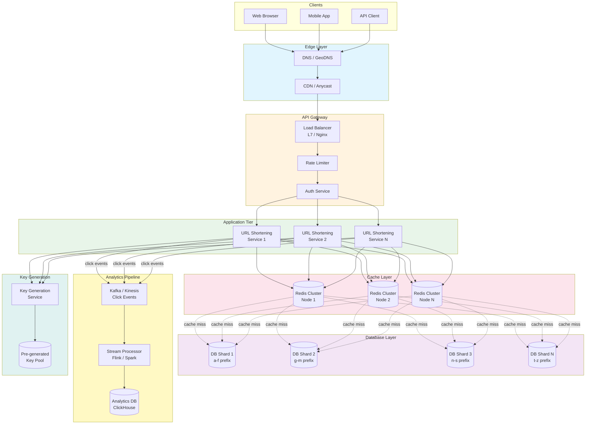

### 1.2 Component Responsibilities

```
+-----------------------+-----------------------------------------------+
| Component             | Responsibility                                |
+-----------------------+-----------------------------------------------+
| GeoDNS / CDN          | Route users to nearest region                 |
| Load Balancer (L7)    | Distribute traffic, health checks, TLS        |
| Rate Limiter          | Throttle abusive clients                      |
| Auth Service          | Validate API keys / JWT tokens                |
| URL Shortening Service| Core business logic (create + redirect)       |
| Key Generation Service| Pre-generate unique short keys                |
| Redis Cache           | Hot URL lookups (< 1ms)                       |
| DynamoDB              | Durable URL storage (110 TB)                  |
| Kafka                 | Async click event streaming                   |
| Flink / Spark         | Enrich events (geo, device), aggregate        |
| ClickHouse            | Analytics storage and fast aggregation        |
| Cleanup Job           | Expire URLs, reclaim keys, purge cache        |
+-----------------------+-----------------------------------------------+
```

### 1.3 Edge Layer Design

The edge layer is the first point of contact for all requests. Its purpose is to
minimize latency by routing users to the closest point of presence (PoP) and terminating
TLS as early as possible.

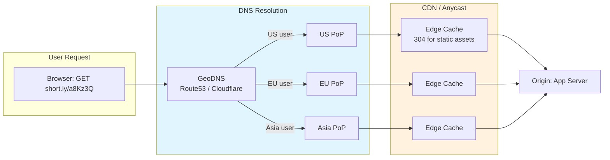

**Important note on CDN caching for redirects:** We do NOT cache redirect responses at the
CDN for analytics-enabled URLs. If we cached `302 short.ly/a8Kz3Q -> example.com/page` at
the CDN edge, the CDN would serve the redirect without hitting our servers, and we would
lose click analytics. CDN caching is only appropriate for:

- Static assets (JS, CSS, images for the dashboard)
- 301 (permanent) redirects where the user explicitly opted out of analytics
- The URL creation page / marketing site

### 1.4 API Gateway Layer

The API gateway handles cross-cutting concerns before requests reach the application servers:

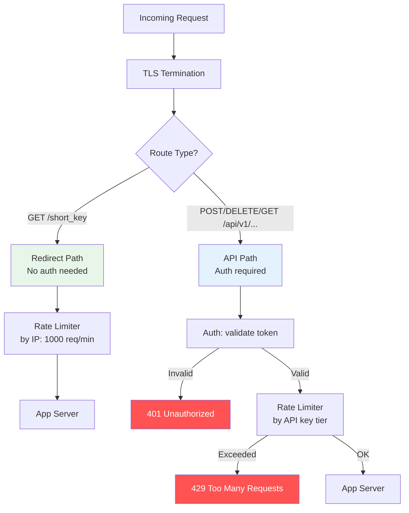

**Rate limiter implementation:** A sliding-window counter in Redis, keyed by IP address
for anonymous requests or API key for authenticated requests. This prevents a single
client from overwhelming the system while allowing legitimate burst traffic.

```python
# Redis-based sliding window rate limiter (pseudocode)
def check_rate_limit(client_id: str, limit: int, window_sec: int) -> bool:
    """Returns True if request is allowed, False if rate-limited."""
    key = f"ratelimit:{client_id}"
    now = time.time()

    pipe = redis.pipeline()
    pipe.zremrangebyscore(key, 0, now - window_sec)  # Remove old entries
    pipe.zadd(key, {str(now): now})                   # Add current request
    pipe.zcard(key)                                    # Count requests in window
    pipe.expire(key, window_sec)                       # Auto-cleanup
    _, _, count, _ = pipe.execute()

    return count <= limit
```

---

## 2. Core Flows

### 2.1 Write Path -- Creating a Short URL

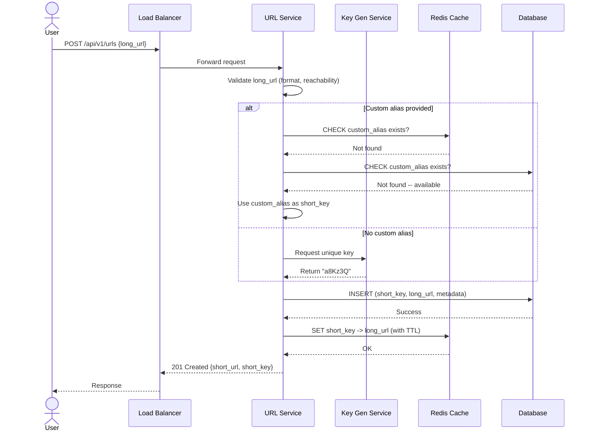

**Write path latency breakdown:**

```
Step                           Typical Latency
---------------------------------------------
TLS + load balancer            ~2 ms
Auth token validation          ~1 ms (JWT local verify) or ~3 ms (API key DB lookup)
URL validation                 ~1 ms (format check, no reachability check in hot path)
Key from local buffer (KGS)    ~0.01 ms (in-memory dequeue)
Custom alias DB check          ~5 ms (only if custom alias provided)
DynamoDB write                 ~5-10 ms (single-digit ms)
Redis cache write-through      ~1 ms
Response serialization         ~0.5 ms
---------------------------------------------
Total (auto-generated key):    ~10-15 ms
Total (custom alias):          ~15-20 ms
```

### 2.2 Read Path -- Redirecting a Short URL

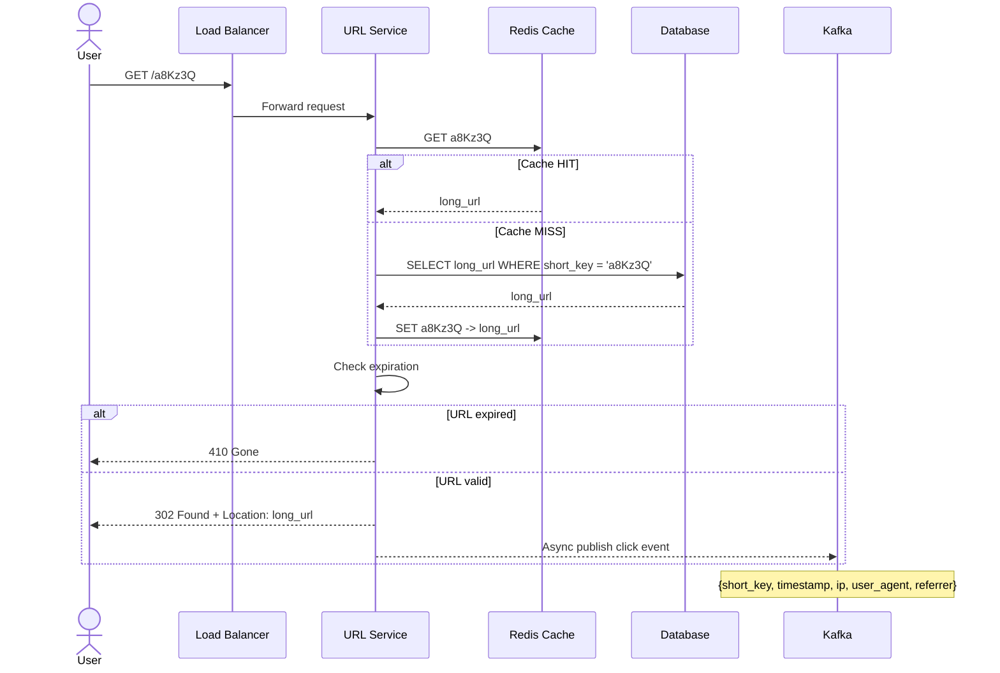

**Read path latency breakdown:**

```
Step                           Typical Latency
---------------------------------------------
TLS + load balancer            ~2 ms
L1 local cache check           ~0.01 ms
L2 Redis cache check           ~1 ms (on cache hit)
  OR DB read (on cache miss)   ~5-10 ms
Expiration check               ~0.01 ms (in-memory comparison)
Kafka async publish             ~0 ms (fire-and-forget, non-blocking)
Response (302 + Location)      ~0.5 ms
---------------------------------------------
Total (cache hit):             ~3-5 ms
Total (cache miss):            ~8-13 ms
```

---

## 3. Key Generation -- The Core Problem

This is the heart of the URL shortener and the topic interviewers most want to drill into.
We need to generate 7-character keys from a 62-character alphabet (a-z, A-Z, 0-9) that
are globally unique and unpredictable.

There are three major approaches. We analyze each in detail, then recommend one.

### 3.1 Approach A: Hash + Base62 Truncation

**Concept:**

```
long_url  -->  hash(long_url)  -->  take first 43 bits  -->  base62 encode  -->  7 chars
```

**Implementation:**

```python
import hashlib

BASE62 = "0123456789abcdefghijklmnopqrstuvwxyzABCDEFGHIJKLMNOPQRSTUVWXYZ"

def encode_base62(num: int) -> str:
    """Convert an integer to a base62 string."""
    if num == 0:
        return BASE62[0]
    result = []
    while num > 0:
        result.append(BASE62[num % 62])
        num //= 62
    return ''.join(reversed(result))

def decode_base62(s: str) -> int:
    """Convert a base62 string back to an integer."""
    num = 0
    for ch in s:
        num = num * 62 + BASE62.index(ch)
    return num

def shorten_url_hash(long_url: str) -> str:
    """Generate a 7-char short key from a long URL using MD5 + base62."""
    md5_hash = hashlib.md5(long_url.encode('utf-8')).hexdigest()
    # Take the first 11 hex chars = 44 bits > 62^7 = 3.52 trillion
    hash_int = int(md5_hash[:11], 16)
    # Mod to fit within 62^7
    hash_int = hash_int % (62 ** 7)
    short_key = encode_base62(hash_int)
    # Pad to exactly 7 characters
    return short_key.rjust(7, '0')

# Example
print(shorten_url_hash("https://www.example.com/article/123"))
# Output: something like "b3Kf9Xm"
```

**Collision handling with the hash approach:**

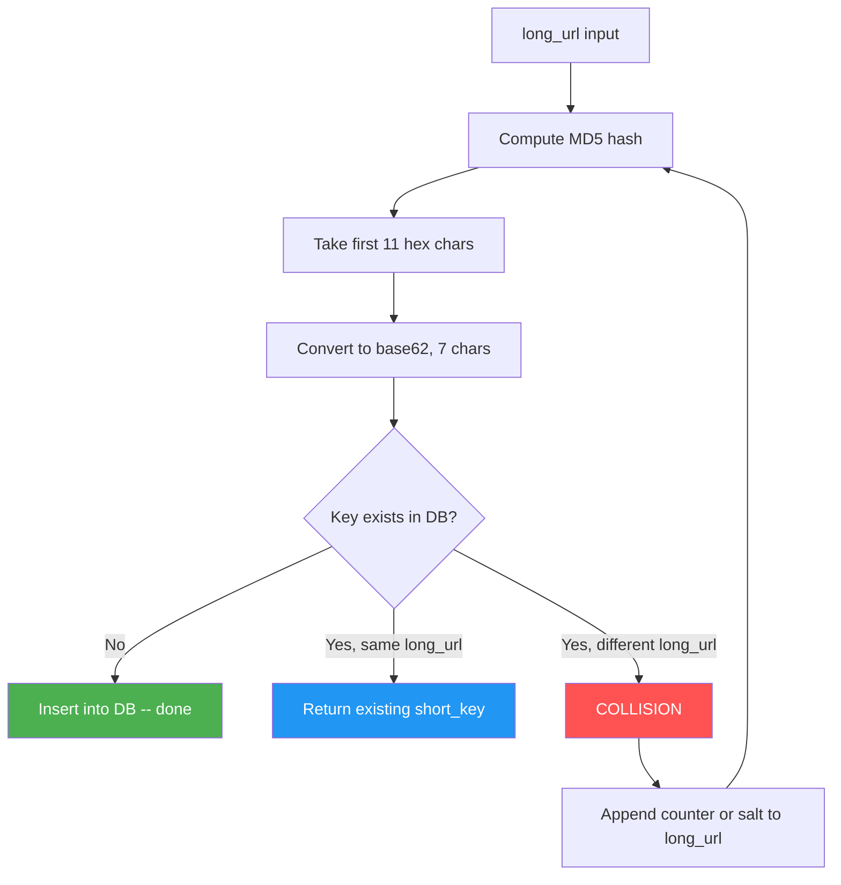

**Pros:**
- Deterministic: same input always produces the same key (before collision handling)
- No external service dependency for key generation
- Simple to implement initially

**Cons:**
- **Collisions**: with 365B URLs, the birthday paradox guarantees collisions
- Collision resolution requires a read-before-write (check DB), adding latency
- MD5 is not cryptographically needed here but the truncation makes collisions frequent
- The retry loop on collision adds unpredictable latency
- Not suitable if the same long URL should produce different short keys per user

**Collision probability math:**

```
Birthday paradox: P(collision) ~ 1 - e^(-n^2 / (2 * key_space))

Key space for 7-char base62: 62^7 = 3.52 trillion
After 365 billion URLs:

P ~ 1 - e^(-(365e9)^2 / (2 * 3.52e12))
P ~ 1 - e^(-1.33e20 / 7.04e12)
P ~ 1 - e^(-18,892,045)
P ~ 1.0  (virtually certain that at least one collision has occurred)

Individual collision rate at 365B entries:
  ~365B / 3.52T = ~10.4% per new insertion
  => Every 10th write will collide -- unacceptable at scale

At 100B entries (year ~3):
  ~100B / 3.52T = ~2.8% per new insertion
  => 1 in 36 writes collides -- already painful

At 10B entries (year ~0.3):
  ~10B / 3.52T = ~0.28% per new insertion
  => 1 in 357 writes collides -- starts becoming noticeable
```

### 3.2 Approach B: Counter-Based (Auto-Increment + Base62)

**Concept:**

```
global_counter++  -->  base62 encode  -->  7 chars
```

**Implementation:**

```python
import threading

class CounterBasedGenerator:
    """Thread-safe counter-based short key generator."""

    def __init__(self, start: int = 1):
        self._counter = start
        self._lock = threading.Lock()

    def next_key(self) -> str:
        with self._lock:
            current = self._counter
            self._counter += 1
        return encode_base62(current).rjust(7, '0')

# Example
gen = CounterBasedGenerator(start=100_000_000)
print(gen.next_key())  # "06LAze"
print(gen.next_key())  # "06LAzf"
```

**Pros:**
- Zero collisions -- every counter value is unique
- Simple, fast, no DB reads needed

**Cons:**
- Sequential keys are **predictable** -- attackers can enumerate URLs
- Single counter is a **bottleneck** and **single point of failure**
- Hard to distribute across multiple servers
- Keys reveal creation order and volume (competitive intelligence leak)

**Distributed counter approaches and their problems:**

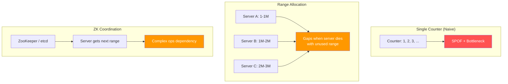

**Mitigating predictability:**

You can add a lightweight scramble to the counter before base62 encoding. This does not
provide cryptographic security but makes enumeration impractical:

```python
def scramble(counter: int) -> int:
    """Bijective scramble using XOR and bit shuffle.
    Reversible: scramble(scramble(x)) returns to a related value.
    """
    # XOR with a secret mask (keep this constant and private)
    SECRET_MASK = 0x5A3C_F291_E7B4  # 43-bit mask
    scrambled = counter ^ SECRET_MASK

    # Bit-reverse the lower 43 bits (bijective permutation)
    result = 0
    for i in range(43):
        if scrambled & (1 << i):
            result |= 1 << (42 - i)
    return result

def generate_short_key(counter: int) -> str:
    scrambled = scramble(counter)
    return encode_base62(scrambled).rjust(7, '0')
```

**Why scrambling is not enough:**
- A determined attacker can reverse-engineer the scramble with a few known plaintext-ciphertext pairs
- True randomness (as in KGS) is strictly better if you can afford the infrastructure

### 3.3 Approach C: Pre-Generated Key Pool (KGS) -- RECOMMENDED

This is the production-grade approach used by large-scale shorteners.

**Architecture:**

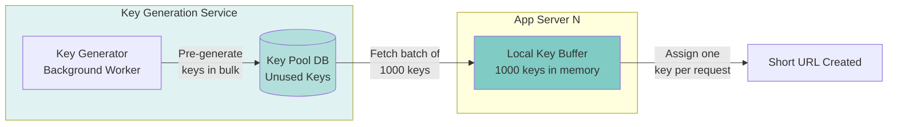

**How it works:**

1. **Offline key generation**: A background worker generates random 7-char base62 strings
   and inserts them into a `key_pool` table, marking each as `unused`.
2. **Batch allocation**: Each app server requests a batch of ~1,000 keys from the pool.
   The KGS marks those keys as `allocated` (or deletes them from the unused table).
3. **In-memory buffer**: The app server keeps the batch in memory. For each new URL request,
   it pops a key from the local buffer -- zero contention, zero collision, zero DB read.
4. **Refill**: When the buffer runs low (say < 200 keys), the server requests another batch.

**Detailed implementation:**

```python
import random
import string
import threading
from collections import deque

class KeyGenerationService:
    """Simulates the KGS pre-generated key pool."""

    CHARSET = string.ascii_letters + string.digits  # 62 chars
    KEY_LENGTH = 7

    def __init__(self):
        self._used_keys: set = set()
        self._lock = threading.Lock()

    def generate_batch(self, batch_size: int = 10_000) -> list[str]:
        """Generate a batch of unique random keys."""
        batch = []
        with self._lock:
            while len(batch) < batch_size:
                key = ''.join(random.choices(self.CHARSET, k=self.KEY_LENGTH))
                if key not in self._used_keys:
                    self._used_keys.add(key)
                    batch.append(key)
        return batch


class AppServerKeyBuffer:
    """Local in-memory key buffer on each app server."""

    REFILL_THRESHOLD = 200
    BATCH_SIZE = 1_000

    def __init__(self, kgs: KeyGenerationService):
        self._kgs = kgs
        self._buffer: deque = deque()
        self._lock = threading.Lock()
        self._refill()

    def _refill(self):
        new_keys = self._kgs.generate_batch(self.BATCH_SIZE)
        self._buffer.extend(new_keys)

    def get_key(self) -> str:
        with self._lock:
            if len(self._buffer) < self.REFILL_THRESHOLD:
                self._refill()
            return self._buffer.popleft()


# Usage
kgs = KeyGenerationService()
server = AppServerKeyBuffer(kgs)
print(server.get_key())  # "xK9mB2Q" (random, unique, instant)
```

**KGS pool sizing and maintenance:**

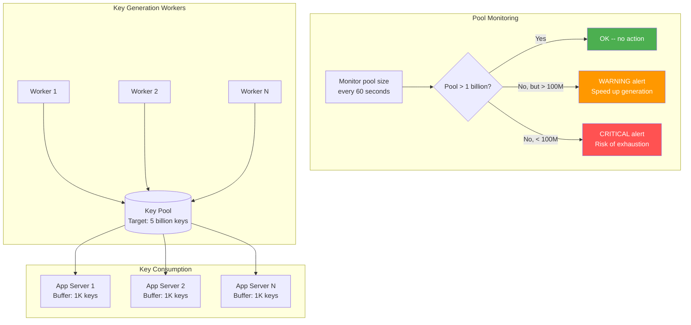

**Pool math:**

```
Daily key consumption:             100 million
Monthly key consumption:           ~3 billion
Pool target:                       5 billion keys (50 days of buffer)
Pool refill rate:                  Must sustain 100M keys/day generation

Key generation speed:
  - Generating a random 7-char string: ~1 microsecond
  - Checking uniqueness against a Bloom filter: ~0.1 microsecond
  - Writing to DB in batches of 10K: ~50 ms per batch
  - Effective rate per worker: ~200K keys/sec
  - With 10 workers: 2M keys/sec = 172 billion keys/day (far exceeds 100M/day)
  - A single worker can handle the load; multiple workers for redundancy
```

**KGS failure modes and handling:**

| Scenario | Impact | Mitigation |
|----------|--------|------------|
| KGS goes down | No new keys can be fetched | Each app server has ~1,000 keys in buffer -- can serve for minutes |
| App server crashes | Its ~800 unused keys are lost | Acceptable waste: 800 keys out of 3.52 trillion key space |
| Key pool runs low | Risk of key exhaustion | Alert when pool drops below 1 billion; generator runs continuously |
| Duplicate key in pool | Should never happen | KGS checks uniqueness before inserting; pool uses UNIQUE constraint |
| Network partition between KGS and app | App cannot refill buffer | Local buffer sustains operations; retry with exponential backoff |
| KGS DB corruption | Pool data lost | Rebuild pool from scratch (background task); app buffers provide time |

### 3.4 Comparison of All Three Approaches

| Criteria | Hash + Base62 | Counter | KGS (Pre-Generated) |
|----------|---------------|---------|----------------------|
| Collisions | Frequent at scale | None | None |
| Speed | Slow (hash + DB check) | Fast | Fastest (memory read) |
| Predictability | Low | High (without scramble) | Low (random) |
| Distributed | Easy | Hard (need coordination) | Easy (batch allocation) |
| Complexity | Low | Low | Medium |
| DB dependency at write time | Yes (collision check) | No | No (after buffer fill) |
| Handles multi-region | Yes | Complex (range allocation) | Yes (region-specific pools) |
| Production choice | Not recommended | Acceptable with scramble | **Recommended** |

---

## 4. Database Design

### 4.1 Why NoSQL (DynamoDB / Cassandra)?

The access pattern is simple: `key -> value` lookups. There are no joins, no complex
queries on the URL table. This is the textbook use case for a key-value store.

| Factor | SQL (PostgreSQL) | NoSQL (DynamoDB) |
|--------|------------------|-------------------|
| Access pattern | Key-value lookup | Key-value lookup |
| Schema flexibility | Rigid | Flexible |
| Horizontal scaling | Complex (manual sharding) | Built-in (auto-partitioning) |
| Storage at 110 TB | Painful (requires pgBouncer, Citus, etc.) | Designed for it |
| Write throughput | Moderate (write-ahead log bottleneck) | Very high (distributed commit) |
| Read latency | ~5 ms | ~1-5 ms (single-digit) |
| Cost at scale | High (vertical scaling, DBA required) | Pay-per-request |
| Operational overhead | High (backups, replication, sharding) | Low (fully managed) |
| Multi-region | Complex (logical replication) | Built-in (Global Tables) |

**When SQL might still be appropriate:**
- If your scale is small (< 1M URLs) and you want ACID transactions
- If you need complex queries across URL and user data
- If your team has deep PostgreSQL expertise and limited NoSQL experience
- For the user account table (small, relational, needs joins)

### 4.2 Data Model

**Primary Table: `url_mappings`**

```
Partition Key: short_key (String, 7 chars)

Attributes:
+--------------+-------------------+------------------------------------------+
| Attribute    | Type              | Description                              |
+--------------+-------------------+------------------------------------------+
| short_key    | String (PK)       | The 7-char base62 key                    |
| long_url     | String            | Original URL (up to 2048 chars)          |
| created_at   | Number (epoch ms) | Creation timestamp                       |
| expires_at   | Number (epoch ms) | Expiration timestamp (0 = never)         |
| user_id      | String            | Creator's user ID (nullable)             |
| custom_alias | Boolean           | Whether this was a custom alias          |
| click_count  | Number            | Denormalized click counter               |
| is_active    | Boolean           | Soft-delete flag                         |
| redirect_type| String            | "temporary" (302) or "permanent" (301)   |
+--------------+-------------------+------------------------------------------+

GSI-1 (for user dashboard):
  Partition Key: user_id
  Sort Key: created_at
  Projects: short_key, long_url, click_count, expires_at
  Use case: "Show me all my URLs sorted by creation date"

GSI-2 (for expiration cleanup):
  Partition Key: is_active
  Sort Key: expires_at
  Use case: "Find all active URLs that have expired" (background cleanup job)
```

**Analytics Table: `click_events` (in ClickHouse or DynamoDB with TTL)**

```
+--------------+-------------------+------------------------------------------+
| Column       | Type              | Description                              |
+--------------+-------------------+------------------------------------------+
| short_key    | String            | Which short URL was clicked               |
| clicked_at   | DateTime          | Timestamp of the click                   |
| ip_address   | String            | Visitor's IP                             |
| country      | String            | Geo from IP (MaxMind)                    |
| city         | String            | City-level geo                           |
| device_type  | String            | Mobile / Desktop / Tablet                |
| os           | String            | iOS / Android / Windows / macOS          |
| browser      | String            | Chrome / Safari / Firefox                |
| referrer     | String            | HTTP Referer header                      |
| user_agent   | String            | Raw User-Agent string                    |
+--------------+-------------------+------------------------------------------+

Partition Key: short_key
Sort Key: clicked_at
```

**Key Pool Table: `available_keys`**

```
+--------------+-------------------+------------------------------------------+
| Column       | Type              | Description                              |
+--------------+-------------------+------------------------------------------+
| short_key    | String (PK)       | Pre-generated unused key                 |
| created_at   | Number            | When this key was generated               |
+--------------+-------------------+------------------------------------------+

When a batch is allocated to an app server, the keys are deleted from this table.
The table uses a UNIQUE constraint on short_key to prevent duplicates.
```

### 4.3 Entity-Relationship Overview

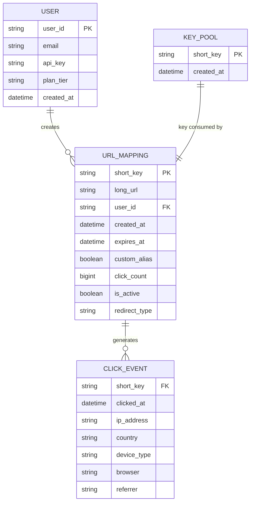

### 4.4 DynamoDB Capacity Planning

```
= DynamoDB Read Capacity =
Peak redirect QPS:        35,000 reads/sec
Average item size:        ~300 bytes
Read Capacity Units:      1 RCU = 1 strongly consistent 4KB read/sec
                          = 1 eventually consistent 8KB read/sec (we use this)
RCU needed:               35,000 / 2 = 17,500 RCU (eventually consistent)
With 95% cache hit rate:  35,000 * 0.05 = 1,750 reads/sec hitting DB
Actual RCU needed:        ~875 RCU (with cache absorbing 95%)

= DynamoDB Write Capacity =
Peak write QPS:           3,500 writes/sec
Average item size:        ~300 bytes
WCU needed:               3,500 WCU (1 WCU = 1 write up to 1KB/sec)

= DynamoDB Partition Estimate =
Partitions by throughput:  max(3500/1000, 875/3000) = max(3.5, 0.29) = 4 partitions
Partitions by storage:     110 TB / 10 GB per partition = 11,000 partitions
Effective partitions:      max(4, 11000) = 11,000 partitions
DynamoDB handles this automatically -- no manual sharding required.
```

---

## 5. Caching Strategy

### 5.1 Cache Architecture

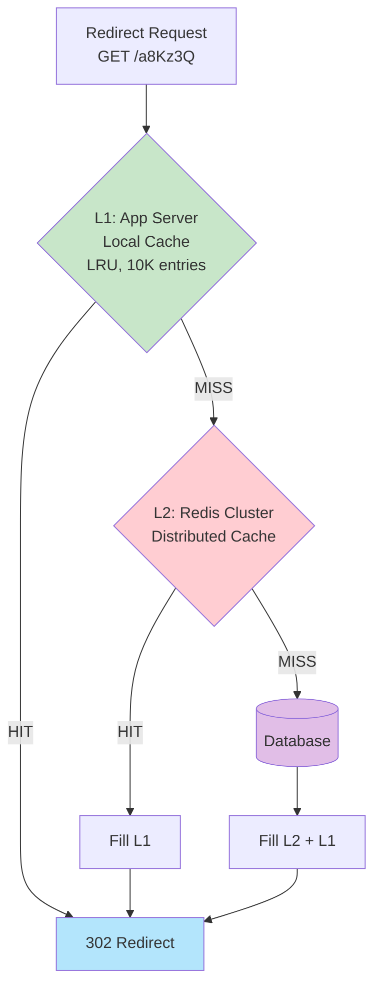

### 5.2 Why the 80/20 Rule Matters

In practice, URL access follows a power-law distribution. A small fraction of URLs
(viral content, popular links) receive the vast majority of traffic.

```
Top 20% of URLs  -->  80% of all redirects
Top 1% of URLs   -->  ~50% of all redirects  (even more skewed in practice)

Daily unique URLs accessed: ~10 million (out of 365 billion total)
Cache these 10M URLs: 10M * ~250 bytes = ~2.5 GB
A single Redis instance holds 25+ GB easily.
```

### 5.3 Two-Tier Cache Design

**L1 -- Application-Level Local Cache (per server):**

```
Type:             LRU (Least Recently Used)
Max entries:      10,000 per server
Memory per server: ~2.5 MB (negligible)
TTL:              60 seconds (short, to avoid stale data)
Hit rate:         ~30-40% of all requests
Purpose:          Absorb thundering-herd traffic for viral URLs
                  Zero network overhead -- pure in-memory lookup
```

**L2 -- Redis Cluster (shared across all servers):**

```
Cluster nodes:    3 masters + 3 replicas = 6 nodes
Memory per master: 16 GB
Total capacity:   48 GB (3 * 16 GB)
Eviction policy:  allkeys-lfu (Least Frequently Used)
TTL:              3,600 seconds (1 hour default)
Read replicas:    2 per shard for read scaling
Hit rate:         ~90-95% of L1 misses
Purpose:          Shared hot-URL cache across all app servers
```

### 5.4 Cache Configuration

```python
# Redis cache configuration (pseudocode)

CACHE_CONFIG = {
    # L1: Application-level local cache (per server)
    "l1_local": {
        "type": "LRU",
        "max_entries": 10_000,         # ~2.5 MB per server
        "ttl_seconds": 60,             # Short TTL to avoid stale data
    },

    # L2: Redis cluster (shared across all servers)
    "l2_redis": {
        "cluster_nodes": 3,            # Redis Cluster for HA
        "max_memory": "16gb",          # Per node
        "eviction_policy": "allkeys-lfu",  # Least Frequently Used
        "ttl_seconds": 3600,           # 1 hour default
        "read_replicas": 2,            # Per shard for read scaling
    }
}
```

### 5.5 Cache Invalidation Scenarios

| Event | L1 Action | L2 (Redis) Action | Latency Impact |
|-------|-----------|-------------------|----------------|
| URL deleted | Evict on next TTL expiry (60s max) | Explicit DELETE command | Deleted URL may still redirect for up to 60 seconds |
| URL expired | Check `expires_at` on every read | TTL set to match `expires_at` | Instant -- expiration checked even on cache hit |
| URL updated (rare) | TTL expiry handles it | Explicit SET with new value | L1 stale for up to 60 seconds |
| New URL created | Not yet cached (populated on first read) | Write-through: SET on creation | Zero -- new URL is immediately cacheable |

### 5.6 Write-Through on Creation

When a new short URL is created, we immediately write it to Redis. This is because
newly created URLs are very likely to be clicked soon (the user just created them).

```python
def create_short_url(long_url: str, custom_alias: str = None) -> dict:
    short_key = custom_alias or key_buffer.get_key()

    # Write to database
    db.put_item(
        table='url_mappings',
        item={
            'short_key': short_key,
            'long_url': long_url,
            'created_at': now(),
            'is_active': True,
        }
    )

    # Write-through to cache (likely to be accessed soon)
    redis.setex(
        name=f"url:{short_key}",
        time=3600,  # 1 hour
        value=long_url
    )

    return {'short_key': short_key, 'long_url': long_url}
```

### 5.7 Cache Stampede Prevention

When a hot URL's cache entry expires, hundreds of concurrent requests may simultaneously
miss the cache and hit the database -- a "thundering herd" or "cache stampede."

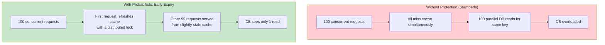

**Implementation using Redis locking:**

```python
def get_url_with_stampede_protection(short_key: str) -> str:
    """Get long_url with cache stampede prevention."""
    cached = redis.get(f"url:{short_key}")
    if cached:
        return cached

    # Try to acquire a lock for this specific key
    lock_key = f"lock:url:{short_key}"
    lock_acquired = redis.set(lock_key, "1", nx=True, ex=5)  # 5-second lock

    if lock_acquired:
        # This request fetches from DB and populates cache
        long_url = db.get_item(table='url_mappings', key={'short_key': short_key})
        if long_url:
            redis.setex(f"url:{short_key}", 3600, long_url)
        redis.delete(lock_key)
        return long_url
    else:
        # Another request is already fetching; wait briefly and retry cache
        time.sleep(0.05)  # 50ms
        return redis.get(f"url:{short_key}") or db.get_item(...)
```

---

## 6. Redirection: 301 vs 302 -- A Critical Design Decision

This is a favorite interview deep-dive topic. The choice between HTTP 301 and 302
has major implications for analytics, caching, and user experience.

### 6.1 How Each Works

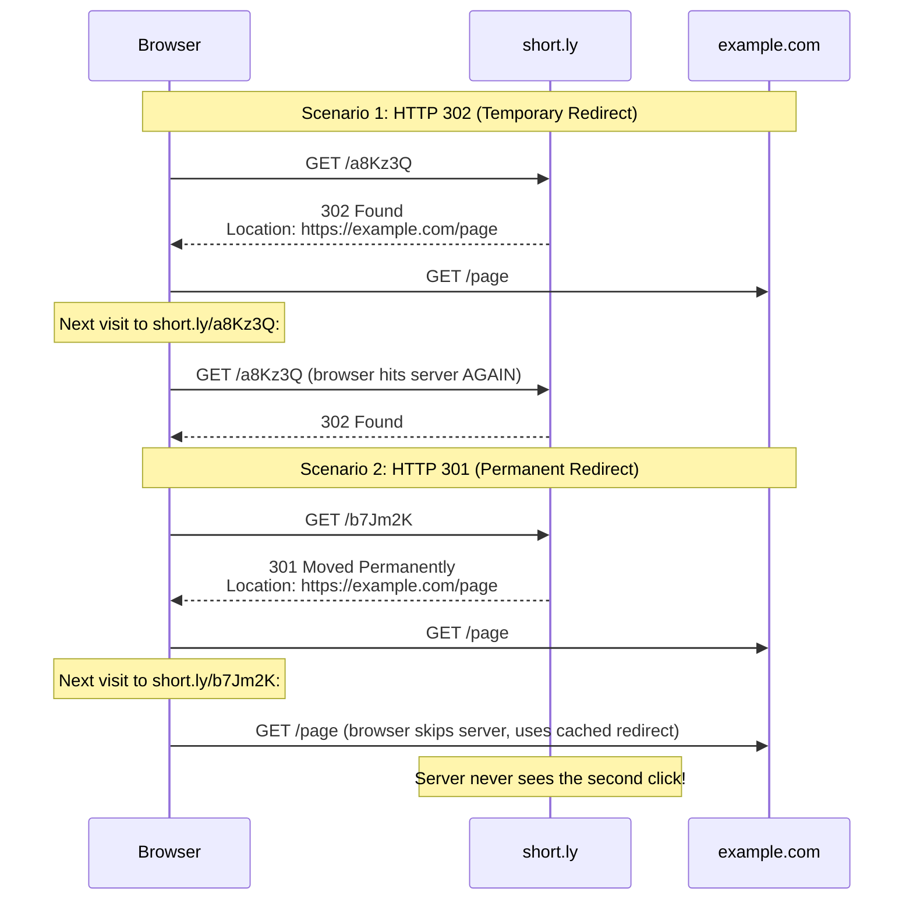

### 6.2 Detailed Comparison

| Aspect | 301 Permanent | 302 Temporary |
|--------|--------------|---------------|
| **Browser caching** | Browser caches the redirect indefinitely | Browser sends every request to server |
| **Analytics accuracy** | Misses repeat visits (browser bypasses server) | Captures EVERY click |
| **Server load** | Lower (browsers cache) | Higher (every click hits server) |
| **SEO** | Passes link equity to target URL | Link equity stays with short URL |
| **Changeability** | Cannot change target once cached by browser | Can change target at any time |
| **Use case** | Pure shortener with no analytics | **Bitly/analytics-focused shortener** |
| **Bandwidth cost** | Lower (fewer requests to server) | Higher (all requests hit server) |
| **Cache-Control** | `max-age=86400` (cap to 1 day) | `no-store` (prevent caching) |

### 6.3 Why 302 Is Better for Most URL Shorteners

```
The core business value of a URL shortener (Bitly model) is ANALYTICS.
If you use 301, browsers cache the redirect and you lose visibility
into repeat clicks. This makes your analytics incomplete and unreliable.

Decision: Use 302 (Temporary Redirect) as the default.
Optionally, offer 301 as a user-configurable option for SEO use cases.
```

### 6.4 The 307 and 308 Alternatives

HTTP has two additional redirect codes that are sometimes relevant:

| Code | Name | Preserves Method | Browser Caching |
|------|------|-----------------|-----------------|
| 301 | Moved Permanently | No (POST -> GET) | Yes, indefinitely |
| 302 | Found | No (POST -> GET) | No |
| 307 | Temporary Redirect | Yes (POST stays POST) | No |
| 308 | Permanent Redirect | Yes (POST stays POST) | Yes, indefinitely |

For a URL shortener, the distinction between 302 and 307 rarely matters because almost
all redirects are triggered by GET requests (clicking a link). However, if your API
supports POST-based redirects (e.g., form submissions), 307 is technically more correct
than 302.

**Our choice: 302 for simplicity and universal browser support.**

### 6.5 Hybrid Approach (Production)

```python
def redirect(short_key: str) -> Response:
    url_record = get_url(short_key)

    if url_record is None:
        return Response(status=404)

    if url_record.is_expired():
        return Response(status=410)  # 410 Gone

    # Fire-and-forget analytics event
    publish_click_event(short_key, request)

    # Choose redirect type based on user preference
    if url_record.redirect_type == 'permanent':
        return Response(
            status=301,
            headers={'Location': url_record.long_url,
                     'Cache-Control': 'max-age=86400'}  # Cap browser cache to 1 day
        )
    else:
        return Response(
            status=302,
            headers={'Location': url_record.long_url,
                     'Cache-Control': 'no-store'}  # Prevent browser caching
        )
```

**Why cap 301 at `max-age=86400` (1 day)?**

Without `Cache-Control`, a 301 redirect is cached by browsers indefinitely (per HTTP spec).
This means if the user ever wants to change the target URL, browsers that have already
cached the redirect will never see the change. By capping at 1 day, we give a window for
the browser cache to expire, reducing (but not eliminating) this risk.

---

## 7. Complete Request Flows -- End to End

### 7.1 Write Path (Create Short URL)

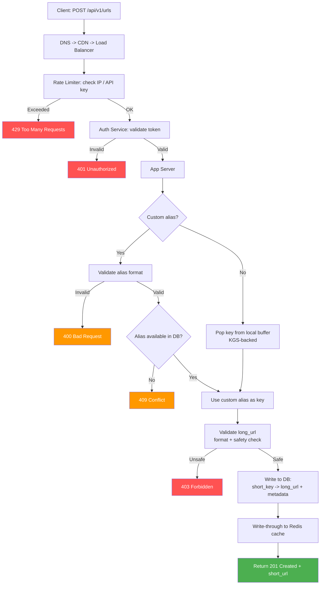

### 7.2 Read Path (Redirect)

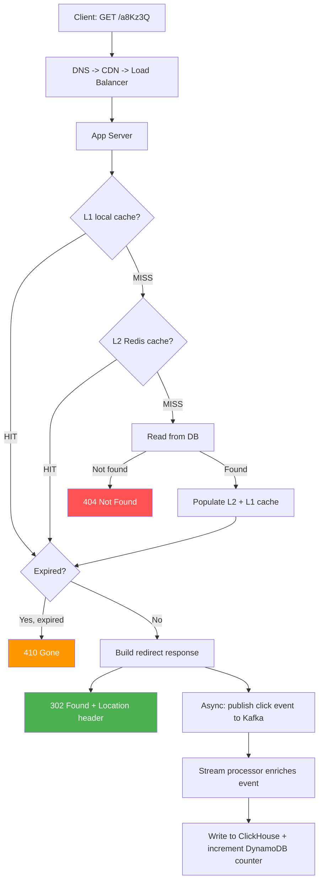

### 7.3 Request Flow Latency Summary

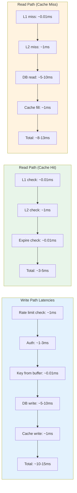
