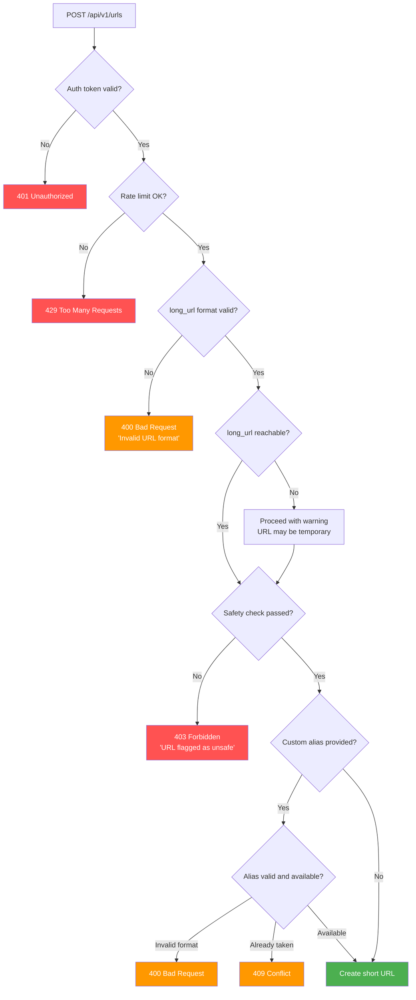
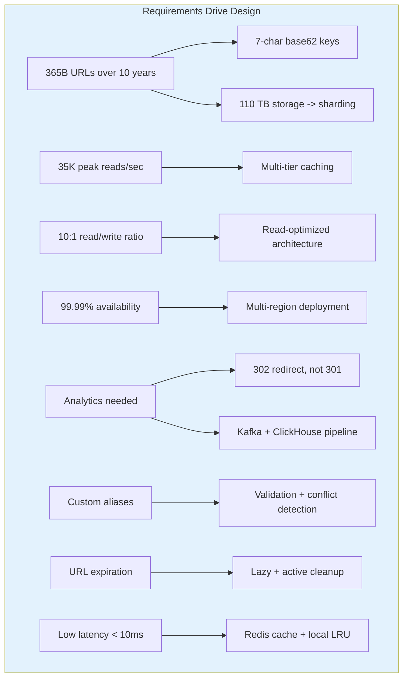

# URL Shortener: Requirements and Estimation

## Overview

This document covers Step 1 of the URL shortener system design: clarifying requirements,
performing back-of-envelope estimation, and defining the API contract. These three activities
form the foundation that every subsequent design decision rests on.

A URL shortener takes a long URL like `https://www.example.com/articles/2026/04/07/very-long-slug`
and produces something like `https://short.ly/a8Kz3Q`. When a user visits the short URL,
they are redirected to the original. Optionally the service tracks click analytics and
supports custom aliases and expiration.

---

## 1. Requirements Clarification

Always start by asking clarifying questions. Do not jump into design. Spending 3-5 minutes
here saves you from designing the wrong system and shows the interviewer that you think
before you build.

### 1.1 Questions to Ask the Interviewer

```
1.  What is the primary use case? Just shortening, or also analytics?
2.  Can users create custom short URLs (aliases)?
3.  Do short URLs expire? If so, who sets the TTL -- the user or system?
4.  What is the expected ratio of reads (redirects) to writes (new URLs)?
5.  What is the expected daily volume of new URLs created?
6.  Do we need to support user accounts and dashboards?
7.  Should the same long URL always produce the same short URL?
8.  What characters are allowed in the short key? (a-z, A-Z, 0-9?)
9.  Is there a maximum length for short keys?
10. Do we need to handle abuse -- spam URLs, phishing, malware?
11. Is global low-latency access required (multi-region)?
12. Do we need an API for programmatic access (developer API)?
```

**Why each question matters:**

| # | Question | Design Impact |
|---|----------|---------------|
| 1 | Primary use case | Determines if we need an analytics pipeline at all |
| 2 | Custom aliases | Adds conflict detection logic and validation rules |
| 3 | Expiration | Requires TTL storage, lazy checks, and cleanup jobs |
| 4 | Read/write ratio | Determines cache sizing, DB read replica count |
| 5 | Daily volume | Drives storage estimation and key-space calculation |
| 6 | User accounts | Adds an auth layer, user table, dashboard APIs |
| 7 | Deduplication | Affects whether the same long URL returns the same or different short key |
| 8 | Character set | Defines the base (base62 vs base64 vs base36) and key length |
| 9 | Max key length | Constrains the key space and affects URL aesthetics |
| 10 | Abuse prevention | Requires rate limiting, safe-browsing integration, blocklists |
| 11 | Global access | Triggers multi-region replication and GeoDNS discussion |
| 12 | API access | REST API design, rate tiers, API key management |

### 1.2 Functional Requirements

| # | Requirement | Detail |
|---|-------------|--------|
| F1 | **Create short URL** | Given a long URL, generate a unique short URL |
| F2 | **Redirect** | When a user visits the short URL, redirect to the original |
| F3 | **Custom aliases** | Users can optionally specify a custom short key |
| F4 | **Expiration** | URLs can have a TTL; expired URLs return 404 |
| F5 | **Analytics** | Track clicks: count, geo, device, referrer, timestamp |
| F6 | **API access** | REST API for creation, deletion, and stats retrieval |

#### Functional Requirement Details

**F1 -- Create short URL:** The user provides a long URL and optionally a custom alias,
expiration date, and target domain. The system returns a globally unique short URL. The
short key must be exactly 7 characters from the base62 alphabet (a-z, A-Z, 0-9). Custom
aliases may be 3-30 characters and include hyphens and underscores.

**F2 -- Redirect:** The redirect must be fast (sub-10ms after cache hit). The system returns
an HTTP 302 (Temporary Redirect) by default to preserve analytics accuracy. An optional
301 (Permanent Redirect) mode can be offered for SEO use cases.

**F3 -- Custom aliases:** Users may choose vanity slugs like `short.ly/my-product-launch`.
The system must validate the alias format, check for reserved words (api, admin, help, etc.),
and confirm uniqueness before accepting.

**F4 -- Expiration:** URLs can be created with an `expires_at` timestamp. Expired URLs
return HTTP 410 (Gone). Expiration is enforced both lazily (at redirect time) and actively
(via a background cleanup job).

**F5 -- Analytics:** Every redirect generates a click event containing timestamp, IP address,
geo-location (derived from IP), device type, OS, browser, referrer, and UTM parameters.
These events are streamed through Kafka, enriched by a stream processor, and stored in
ClickHouse for dashboard queries.

**F6 -- API access:** A versioned REST API (`/api/v1/`) for programmatic creation, deletion,
and analytics retrieval. Authenticated via Bearer tokens or API keys. Rate-limited per
API key tier.

### 1.3 Non-Functional Requirements

| Requirement | Target | Why This Number |
|-------------|--------|-----------------|
| **Low latency** | Redirect in < 10 ms (p99) after cache hit | Redirect is the critical user-facing path |
| **High availability** | 99.99% uptime -- reads must never fail | A short URL that does not resolve erodes trust |
| **Scalability** | Support 365 billion URLs over 10 years | See estimation section below |
| **Durability** | Once created, a URL must not be lost | Data loss means broken links across the internet |
| **Read-heavy** | 10:1 read-to-write ratio | Most traffic is redirects, not creations |
| **Global reach** | Low-latency from any continent | Links are shared globally on social media |
| **Consistency** | Short keys must be globally unique | Two different long URLs must never map to the same short key |
| **Idempotency** | Re-shortening the same long URL may return a new key (Bitly model) | Each user gets their own analytics per link |

#### Availability Deep Dive

99.99% uptime means at most 52.6 minutes of downtime per year. For a URL shortener this
is critical because:

- Short URLs are embedded in emails, tweets, printed marketing materials, and QR codes.
- If the shortener is down, every short link on the internet is effectively broken.
- Read path (redirect) must be prioritized over write path (creation) during degradation.

```
Availability targets and their downtime budgets:

99.9%   = 8.76 hours/year   = 43.8 min/month   (not good enough)
99.99%  = 52.6 min/year     = 4.38 min/month    (our target)
99.999% = 5.26 min/year     = 26.3 sec/month    (aspirational)
```

#### Consistency Model

We use **eventual consistency** for reads with **strong consistency** for key uniqueness:

- **Key generation:** The KGS (Key Generation Service) guarantees uniqueness at the source.
  Each app server holds a disjoint batch of pre-generated keys, so no two servers can
  produce the same short key.
- **Redirect reads:** A newly created URL may take milliseconds to propagate to all cache
  nodes and DB replicas. In practice the creator is the first user to click the link,
  and by then the write has propagated.
- **Analytics:** Eventually consistent. Click counts may lag by seconds to minutes.

---

## 2. Back-of-Envelope Estimation

### 2.1 Traffic Estimation

```
= Write Traffic (URL creation) =
New URLs created per day:             100 million
Write QPS (average):                  100M / 86,400 sec  ~= 1,160 writes/sec
Peak write QPS (3x average):          ~3,500 writes/sec

Justification for 3x peak multiplier:
  - Marketing campaigns often launch simultaneously
  - Social media viral events cause URL creation spikes
  - Business hours concentrate traffic into ~12 hours
  - Peak-to-average ratio of 3x is a standard industry heuristic

= Read Traffic (Redirects) =
Read-to-write ratio:                  10 : 1
Redirect QPS (average):               1,160 * 10 = 11,600 reads/sec
Peak redirect QPS (3x average):       ~35,000 reads/sec

Why 10:1 ratio?
  - Each created short URL is typically clicked multiple times
  - Bitly reports ~10:1 ratio in their engineering blog
  - Some URLs go viral (millions of clicks), others are never clicked
  - The distribution is heavily skewed (power law)
```

### 2.2 Storage Estimation

```
= Storage (10-year horizon) =
Total URLs in 10 years:               100M/day * 365 days * 10 years
                                    = 365,000,000,000
                                    = 365 billion URLs

Average row size breakdown:
  - short_key:     7 bytes
  - long_url:      200 bytes (average; max 2,048 bytes per HTTP spec)
  - created_at:    8 bytes (epoch milliseconds, stored as int64)
  - expires_at:    8 bytes (epoch milliseconds, 0 for no expiry)
  - user_id:       8 bytes (UUID stored as binary, nullable)
  - custom_alias:  1 byte (boolean flag)
  - click_count:   8 bytes (int64 counter)
  - is_active:     1 byte (boolean flag)
  - metadata:      ~59 bytes (indexes, internal overhead, padding)
  Total:           ~300 bytes per URL

Storage for URL mappings:             365B * 300 B = 109,500,000,000,000 B
                                    = ~109.5 TB
                                    ~= 110 TB

Analytics storage (click events):
  - Average click event size:         ~200 bytes
  - Total clicks over 10 years:       365B URLs * 10 avg clicks = 3.65 trillion clicks
  - Raw event storage:                3.65T * 200 B = ~730 TB
  - With ClickHouse compression (~10x): ~73 TB
  - Pre-aggregated rollups add ~10%:  ~80 TB total analytics storage
```

### 2.3 Key Space Calculation

This is a critical calculation. Getting the key length right determines whether the
system can operate for 10 years without key exhaustion.

```
= Key Space =
Character set: base62 (a-z, A-Z, 0-9) = 62 characters

Key length options:
  - 5 chars: 62^5 =     916,132,832       (~916 million -- far too small)
  - 6 chars: 62^6 =  56,800,235,584       (~56.8 billion -- not enough)
  - 7 chars: 62^7 = 3,521,614,606,208     (~3.52 trillion -- sufficient)
  - 8 chars: 62^8 = 218,340,105,584,896   (~218 trillion -- excessive)

Required key space:  365 billion URLs
With 7-char keys:    3.52 trillion available
Utilization:         365B / 3.52T = 10.4%

=> Use 7-character keys

Why not 6 characters?
  - 62^6 = 56.8 billion
  - After 56.8B URLs we are out of keys -- this happens in ~568 days at 100M/day
  - Even before exhaustion, collision rates would spike

Why not 8 characters?
  - 62^8 = 218 trillion -- far more than needed
  - Longer keys waste space in printed materials, QR codes, and tweets
  - Every extra character adds ~1 byte to every stored row and cache entry
  - At 365B URLs: 365B extra bytes = 365 GB wasted storage

Why 10.4% utilization is fine:
  - Leaves 89.6% of the key space unused
  - Random key generation (KGS) can afford to discard collisions within the pool
  - If growth exceeds 10x estimates, we still have room
  - Can always extend to 8 characters as a future migration
```

### 2.4 Cache Estimation

```
= Cache Sizing =
80/20 rule: 20% of URLs generate 80% of traffic

Total URLs stored:           365 billion (at 10-year mark)
All-time unique hot URLs:    365B * 20% = 73 billion (too many to cache all)

Better approach -- cache daily active set:
  Daily unique URLs accessed:  ~10 million (estimated from access patterns)
  Average cache entry size:    7 (key) + 200 (URL) + 40 (metadata/overhead) = ~250 bytes
  Cache size for daily active: 10M * 250 B = 2.5 GB

  A single Redis instance can hold 25+ GB easily.
  A 3-node Redis Cluster with 16 GB per node = 48 GB total capacity.
  This gives 19x headroom above the estimated 2.5 GB daily working set.

Expected cache hit rates:
  - L1 (local LRU, 10K entries per server): ~30-40% hit rate
  - L2 (Redis Cluster):                     ~90-95% hit rate
  - Combined effective hit rate:             ~95-98%
  - DB sees only 2-5% of all redirect requests
```

### 2.5 Bandwidth Estimation

```
= Bandwidth =
Write bandwidth:
  Peak writes: 3,500 req/sec * 300 bytes/req = 1.05 MB/sec  (negligible)

Read bandwidth:
  Peak reads:  35,000 req/sec * 300 bytes/req = 10.5 MB/sec  (negligible)

Note: Bandwidth is NOT a bottleneck for a URL shortener. The payloads are tiny.
The bottleneck is key-generation contention (solved by KGS) and database IOPS
at scale (solved by caching and sharding).
```

### 2.6 Summary Table

```
+---------------------------+--------------------+
| Metric                    | Value              |
+---------------------------+--------------------+
| Write QPS (average)       | 1,160/sec          |
| Write QPS (peak, 3x)     | 3,500/sec          |
| Read QPS (average)        | 11,600/sec         |
| Read QPS (peak, 3x)      | 35,000/sec         |
| Total URLs (10 years)     | 365 billion        |
| URL storage               | ~110 TB            |
| Analytics storage         | ~80 TB (compressed)|
| Key length                | 7 characters       |
| Key space                 | 3.52 trillion      |
| Key utilization           | 10.4%              |
| Cache (daily hot set)     | ~2.5 GB            |
| Write bandwidth (peak)    | ~1 MB/sec          |
| Read bandwidth (peak)     | ~10.5 MB/sec       |
+---------------------------+--------------------+
```

---

## 3. API Design

The API is the contract between the client and the system. A well-designed API makes
the system intuitive, extensible, and versionable.

### 3.1 API Versioning Strategy

All endpoints are prefixed with `/api/v1/`. When breaking changes are needed, a `/api/v2/`
prefix is introduced while `/v1/` continues to be served for backward compatibility. The
version is in the URL path (not headers) for simplicity and cacheability.

### 3.2 Authentication

All write endpoints and analytics endpoints require authentication via Bearer tokens.
The redirect endpoint (`GET /{short_key}`) is unauthenticated -- anyone with the short
URL can be redirected.

```
Authorization: Bearer <JWT or API key>

Rate limits by tier:
  - Anonymous (no token):     10 URLs/hour, 0 analytics access
  - Free tier:                100 URLs/day, basic analytics
  - Pro tier:                 10,000 URLs/day, full analytics, custom domains
  - Enterprise:               unlimited, SLA, dedicated support
```

### 3.3 Create Short URL

```
POST /api/v1/urls
Authorization: Bearer <token>
Content-Type: application/json

Request body:
{
  "long_url": "https://www.example.com/very/long/path?query=value",
  "custom_alias": "my-link",            // optional
  "expires_at": "2027-01-01T00:00:00Z", // optional, ISO 8601
  "domain": "short.ly",                 // optional, multi-tenant
  "redirect_type": "temporary"          // optional, "temporary" (302) or "permanent" (301)
}

Response 201 Created:
{
  "short_url": "https://short.ly/my-link",
  "short_key": "my-link",
  "long_url": "https://www.example.com/very/long/path?query=value",
  "created_at": "2026-04-07T10:30:00Z",
  "expires_at": "2027-01-01T00:00:00Z",
  "redirect_type": "temporary"
}

Error responses:
  400 Bad Request     -- Invalid long_url format, invalid custom_alias format
  401 Unauthorized    -- Missing or invalid auth token
  403 Forbidden       -- URL flagged as malicious by safety checks
  409 Conflict        -- Custom alias already taken
  429 Too Many Requests -- Rate limit exceeded
```

#### Request Validation Rules



### 3.4 Redirect (the Core Read Path)

```
GET /{short_key}
Host: short.ly

Response 302 Found:
Location: https://www.example.com/very/long/path?query=value
Cache-Control: no-store

(or, if user configured permanent redirect)
Response 301 Moved Permanently:
Location: https://www.example.com/very/long/path?query=value
Cache-Control: max-age=86400

Error responses:
  404 Not Found  -- short_key does not exist
  410 Gone       -- short_key existed but has expired
```

### 3.5 Get URL Analytics

```
GET /api/v1/urls/{short_key}/stats
Authorization: Bearer <token>

Query parameters:
  ?period=7d          // Time window: 1d, 7d, 30d, 90d, 1y, all (default: 7d)
  ?granularity=day    // day, hour (default: day)

Response 200 OK:
{
  "short_key": "a8Kz3Q",
  "long_url": "https://www.example.com/...",
  "created_at": "2026-04-01T10:30:00Z",
  "total_clicks": 1458302,
  "unique_visitors": 823471,
  "clicks_by_period": [
    {"date": "2026-04-06", "clicks": 4521, "unique": 3200},
    {"date": "2026-04-05", "clicks": 3890, "unique": 2780},
    ...
  ],
  "top_referrers": [
    {"referrer": "twitter.com", "count": 12300},
    {"referrer": "facebook.com", "count": 8900},
    {"referrer": "direct", "count": 7200}
  ],
  "top_countries": [
    {"country": "US", "count": 89000},
    {"country": "UK", "count": 23000},
    {"country": "DE", "count": 15000}
  ],
  "top_devices": [
    {"device": "Mobile", "count": 67000},
    {"device": "Desktop", "count": 45000},
    {"device": "Tablet", "count": 8000}
  ]
}

Error responses:
  401 Unauthorized  -- Missing or invalid auth token
  403 Forbidden     -- User does not own this short URL
  404 Not Found     -- short_key does not exist
```

### 3.6 Delete Short URL

```
DELETE /api/v1/urls/{short_key}
Authorization: Bearer <token>

Response 204 No Content

Side effects:
  - URL record marked as is_active = false (soft delete)
  - Cache entry evicted from Redis
  - Subsequent redirects return 404 Not Found
  - Analytics data is retained (not deleted) for historical reporting
  - Key is NOT returned to the key pool (to prevent link recycling confusion)

Error responses:
  401 Unauthorized  -- Missing or invalid auth token
  403 Forbidden     -- User does not own this short URL
  404 Not Found     -- short_key does not exist
```

### 3.7 Update Short URL (Optional)

```
PATCH /api/v1/urls/{short_key}
Authorization: Bearer <token>
Content-Type: application/json

{
  "long_url": "https://www.example.com/new-target",  // optional
  "expires_at": "2028-01-01T00:00:00Z",              // optional
  "redirect_type": "permanent"                         // optional
}

Response 200 OK:
{
  "short_key": "a8Kz3Q",
  "long_url": "https://www.example.com/new-target",
  "expires_at": "2028-01-01T00:00:00Z",
  "redirect_type": "permanent",
  "updated_at": "2026-04-07T12:00:00Z"
}

Side effects:
  - Cache entry invalidated and re-populated with new target
  - Only works if redirect_type is "temporary" (302)
  - If redirect_type is "permanent" (301), browsers have already cached the old target

Error responses:
  400 Bad Request   -- Invalid field values
  401 Unauthorized  -- Missing or invalid auth token
  403 Forbidden     -- User does not own this short URL, or URL uses 301 and cannot be changed
  404 Not Found     -- short_key does not exist
```

### 3.8 Bulk Create (Enterprise Feature)

```
POST /api/v1/urls/bulk
Authorization: Bearer <token>
Content-Type: application/json

{
  "urls": [
    {"long_url": "https://example.com/page1"},
    {"long_url": "https://example.com/page2", "custom_alias": "page2"},
    {"long_url": "https://example.com/page3", "expires_at": "2027-06-01T00:00:00Z"}
  ]
}

Response 200 OK:
{
  "results": [
    {"status": "created", "short_url": "https://short.ly/a8Kz3Q", ...},
    {"status": "created", "short_url": "https://short.ly/page2", ...},
    {"status": "created", "short_url": "https://short.ly/b7Jm2K", ...}
  ],
  "created": 3,
  "failed": 0
}

Limits:
  - Max 1,000 URLs per batch (Enterprise tier)
  - Max 100 URLs per batch (Pro tier)
```

### 3.9 API Response Headers

All responses include standard headers for observability and rate-limit transparency:

```
X-Request-Id: 550e8400-e29b-41d4-a716-446655440000
X-RateLimit-Limit: 1000
X-RateLimit-Remaining: 997
X-RateLimit-Reset: 1680883200
X-Response-Time: 3ms
```

---

## 4. Connecting Requirements to Design

The requirements and estimation drive every design decision in the high-level design
and deep-dive documents:



| Requirement | Drives This Design Decision |
|-------------|----------------------------|
| 365B URLs | 7-character base62 keys (3.52T key space) |
| 110 TB storage | DynamoDB/Cassandra with hash-based sharding |
| 35K reads/sec | L1 local cache + L2 Redis Cluster |
| 10:1 read/write | Read-optimized path, write-through cache |
| 99.99% uptime | Multi-region active-active, no single point of failure |
| Analytics | 302 redirects, Kafka click streaming, ClickHouse |
| Global reach | GeoDNS + multi-region DynamoDB Global Tables |
| Key uniqueness | KGS with pre-generated disjoint key batches |
