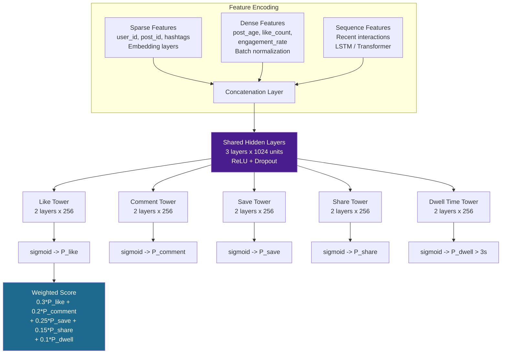
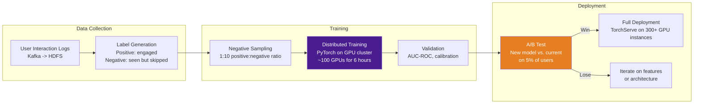
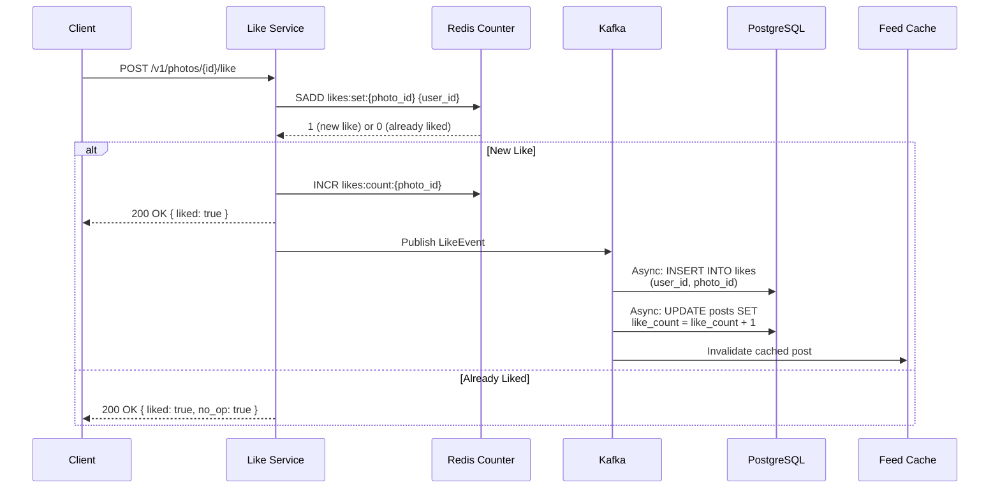
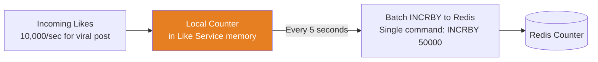
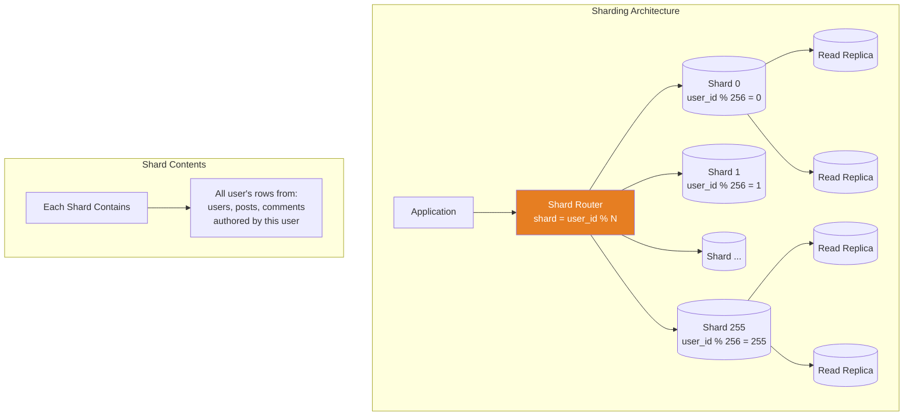
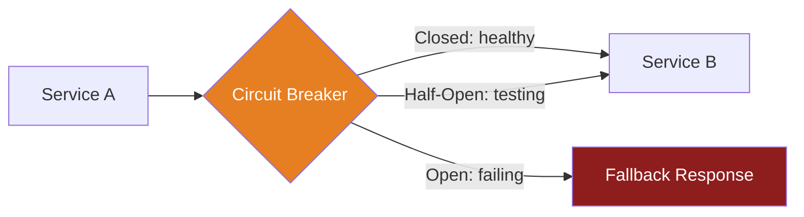
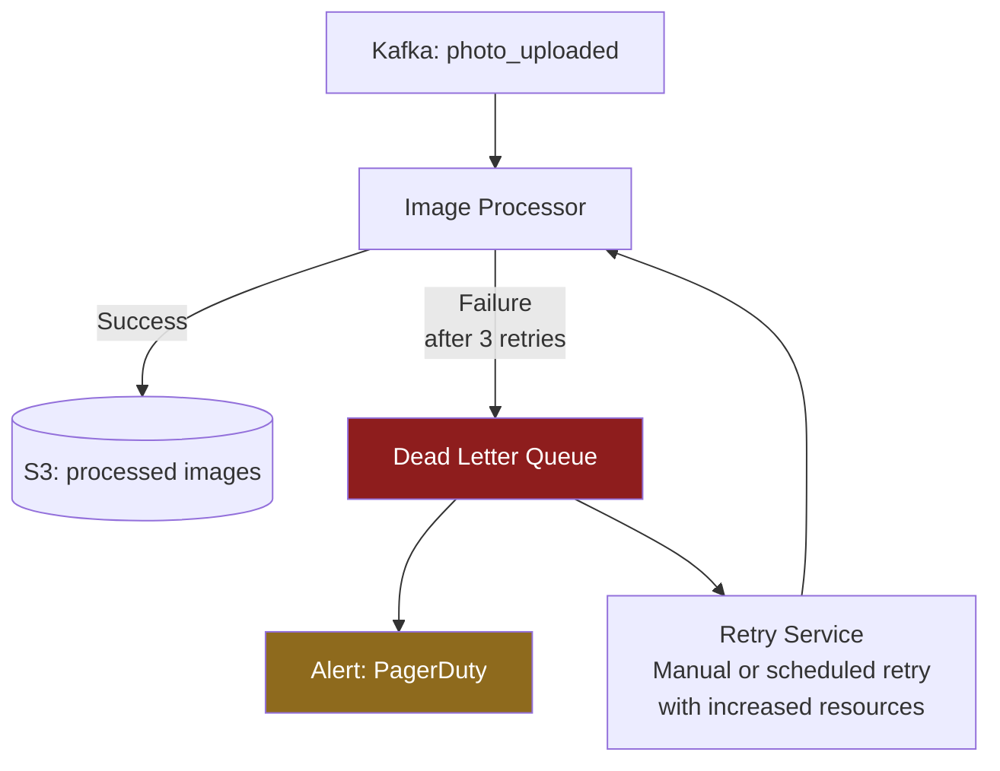
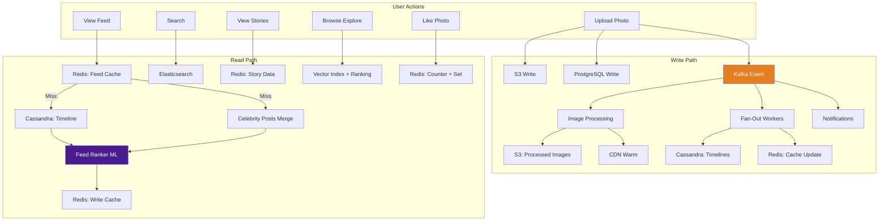

# Design Instagram -- Deep Dive & Scaling

Feed ranking ML deep dive, stories implementation details, CDN strategy, like counter at scale, sharding, multi-region deployment, failure handling, monitoring, trade-offs, Instagram architecture evolution, and interview tips.

---

## Table of Contents

1. [Feed Ranking ML Deep Dive](#1-feed-ranking-ml-deep-dive)
2. [Like Counter at Scale](#2-like-counter-at-scale)
3. [Sharding Strategy](#3-sharding-strategy)
4. [Multi-Region Deployment](#4-multi-region-deployment)
5. [Failure Handling & Resilience](#5-failure-handling--resilience)
6. [Caching Strategy -- Multi-Layer](#6-caching-strategy----multi-layer)
7. [Rate Limiting & Abuse Prevention](#7-rate-limiting--abuse-prevention)
8. [Monitoring & Observability](#8-monitoring--observability)
9. [Data Privacy & Compliance](#9-data-privacy--compliance)
10. [Key Design Trade-offs](#10-key-design-trade-offs)
11. [Instagram Architecture Evolution (2010-Present)](#11-instagram-architecture-evolution-2010-present)
12. [Complete Data Flow Summary](#12-complete-data-flow-summary)
13. [Interview Tips & Summary](#13-interview-tips--summary)

---

## 1. Feed Ranking ML Deep Dive

Instagram's feed ranking is a multi-stage ML pipeline. Understanding its internals demonstrates depth in system design interviews.

### 1.1 Model Architecture

Instagram's ranking model is a **multi-task deep neural network**. It simultaneously predicts multiple engagement outcomes, then combines them into a single score.



**Why multi-task learning?** The shared layers learn general representations of user-post affinity, while task-specific towers learn engagement-specific signals. A user who likes but never comments will have different signals activated in each tower. Shared layers also act as a regularizer, preventing overfitting on any single engagement type.

### 1.2 Feature Engineering Details

**Sparse features** (high-cardinality categorical):
```
- user_id:        Learned embedding (dim=64), captures user preferences
- poster_id:      Learned embedding (dim=64), captures poster style
- hashtag_ids:    Bag-of-embeddings (dim=32 each), captures post topics
- location_id:    Learned embedding (dim=16), captures geo preference
- media_type:     One-hot (photo, carousel, reel, story)
```

**Dense features** (numerical):
```
- post_age_hours:           Time since post was published
- poster_avg_engagement:    Rolling 30-day average engagement rate
- poster_posting_frequency: Posts per week
- user_session_count_7d:    How active the user has been recently
- photo_quality_score:      CNN-derived aesthetic quality score (0-1)
- caption_length:           Number of characters
- hashtag_count:            Number of hashtags used
- mutual_follow:            1 if user and poster follow each other
- days_since_last_interaction: Recency of last engagement between user and poster
```

**Sequence features** (temporal patterns):
```
- Last 50 posts the user engaged with (embedding sequence -> LSTM/Transformer)
- Last 20 posters the user interacted with
- Time gaps between consecutive sessions
```

### 1.3 Training Pipeline



**Training cadence**:
- Full retrain: weekly (all historical data)
- Incremental update: daily (last 24 hours of interaction data)
- Feature refresh: hourly for near-real-time features (engagement velocity, etc.)
- A/B test duration: 1-2 weeks for statistical significance
- Rollback: automatic if key metrics (DAU, session time) degrade > 1%

### 1.4 Serving Infrastructure

```
Model serving stack:
  Framework:     PyTorch (trained), TorchServe (serving)
  Hardware:      NVIDIA A10G GPUs (g5.xlarge on AWS equivalent)
  Batch size:    32 candidates per inference call
  Latency:       ~50ms per batch (p99)
  Throughput:    ~200 batches/sec per GPU instance
  Instances:     ~300 GPU instances for feed ranking
  
  Cost optimization:
    - Model quantization: FP16 inference (2x throughput vs. FP32)
    - Embedding cache: Pre-computed user/post embeddings in Redis
    - Candidate filtering: First-pass lightweight model reduces candidates from 500 to 150
      before heavy model, saving 70% of GPU compute
```

### 1.5 Ranking Fairness and Integrity

```
Anti-manipulation measures:
  - Engagement velocity caps: diminishing returns above certain like/comment rates
    (prevents like-farms from artificially boosting content)
  - Author diversity penalty: same author cannot occupy > 2 of top 10 positions
  - Freshness vs. engagement balance: prevents "rich get richer" effect
    where highly-engaged posts crowd out new content
  - Quality classifier gate: posts below a quality threshold (blurry, text-only, 
    screenshot) get a 0.5x multiplier regardless of engagement
  
Shadow features (not in score, but tracked):
  - Time spent before engaging (fast likes = less signal)
  - Whether user scrolled back to the post (high signal)
  - Whether user visited poster's profile after (very high signal)
```

---

## 2. Like Counter at Scale

Likes are one of the highest-throughput operations on Instagram. A single viral post can receive millions of likes in minutes.

### 2.1 Like Flow



### 2.2 Counter Consistency Model

- **Redis** is the source of truth for real-time counts (shown in the UI). It responds in < 1ms.
- **PostgreSQL** is the durable source of truth (async-synced via Kafka). It responds in ~5ms but is 1-5 seconds behind.
- A periodic reconciliation job runs every 5 minutes, comparing Redis counts to PostgreSQL counts and correcting drift.
- This dual-write model means that even if Redis loses data (node failure), PostgreSQL has the correct count, and the reconciliation job restores Redis.

### 2.3 Count Buffering for Viral Posts

For viral posts (> 100K likes/hour), individual Redis INCR commands create unnecessary load. The Like Service uses **count buffering**:



```
Without buffering:
  10,000 likes/sec -> 10,000 Redis INCR commands/sec per viral post

With buffering (5-second window):
  10,000 likes/sec -> 1 Redis INCRBY 50,000 every 5 seconds
  Reduction: 50,000x fewer Redis commands

Trade-off: Displayed count may lag by up to 5 seconds for viral posts.
This is acceptable because at that velocity, users see "1.2M likes" not exact counts.
```

### 2.4 Like Set Memory Optimization

For posts with millions of likes, storing every liker's user_id in a Redis SET becomes expensive.

```
Post with 10M likes:
  Redis SET with 10M 8-byte user_ids = ~80MB per post
  Top 100 most-liked posts = 8 GB of Redis memory just for like sets

Optimization: Tiered storage
  < 10K likes:  Full SET in Redis (supports "did I like this?" check)
  >= 10K likes: Move SET to Cassandra, keep only count in Redis
                "Did I like this?" check queries Cassandra (slower but rare)
                
  Alternative: Bloom filter per post in Redis
    - 10M members, 1% false positive rate = ~12MB (vs. 80MB for full SET)
    - False positive means showing "liked" when not actually liked (low impact)
    - False negatives never occur (correct for "have I liked this?")
```

---

## 3. Sharding Strategy

### 3.1 PostgreSQL Sharding (by user_id)



### 3.2 Sharding Decisions

| Table | Shard Key | Reasoning |
|-------|-----------|-----------|
| `users` | `user_id` | Natural primary key; all user data co-located |
| `posts` | `user_id` (poster) | User profile page loads all posts by user -- single shard read |
| `comments` | `photo_id` -> mapped to poster's `user_id` | Comments on a photo go to the photo owner's shard |
| `likes` | `photo_id` -> mapped to poster's `user_id` | Like count and liker list co-located with the post |
| `follows` | Dual-write: follower shard AND followee shard | "My following" list on follower shard; "My followers" list on followee shard |

### 3.3 Cross-Shard Query Handling

The main cross-shard query is the news feed ("show me posts from users I follow, who are on different shards"). This is solved by the **pre-computed Cassandra timeline** -- the feed never queries PostgreSQL shards at read time.

Other cross-shard scenarios:

```
Scenario: User A comments on User B's photo
  - Comment stored on User B's shard (co-located with the photo)
  - User A's "my comments" list requires a separate index
  - Solution: async index update in a comments_by_author table on User A's shard

Scenario: Viewing User B's followers list
  - Followers stored on User B's shard (followee shard)
  - Single shard read -- efficient

Scenario: "Did User A like User B's photo?"
  - Likes stored on User B's shard (photo owner)
  - Single shard read -- efficient

Scenario: Global aggregation ("most liked photo today")
  - Requires scatter-gather across all 256 shards
  - Solution: pre-aggregate in a daily batch job; store results in a single "analytics" table
```

### 3.4 Consistent Hashing for Cassandra

Cassandra uses its native virtual node (vnode) consistent hashing. Each node owns a range of the token ring. Adding nodes redistributes tokens with minimal data movement.

```
Token Ring:  0 -------- 2^63 --------- 2^127
             |  Node A  |  Node B  |  Node C  |  Node D  |
             |  vnodes  |  vnodes  |  vnodes  |  vnodes  |

Adding Node E: steals token ranges from A-D evenly
  Data movement: ~1/N of total data (where N = new node count)
  No downtime required; Cassandra streams data in background
```

### 3.5 Resharding Strategy

When 256 PostgreSQL shards are no longer sufficient:

```
Approach: Logical sharding with physical splitting

Phase 1 (Day 1): 256 logical shards, 64 physical servers
  - Each physical server hosts 4 logical shards
  - Shard function: logical_shard = user_id % 256
  - Physical mapping: physical_server = logical_shard / 4

Phase 2 (Growth): Split physical servers
  - Move logical shards 0-1 from Server 0 to Server 0 and Server 64
  - No change to shard function -- just physical relocation
  - Can go from 64 to 128 to 256 physical servers without resharding

Phase 3 (Extreme): If 256 logical shards are not enough
  - Create 1024 logical shards
  - Use dual-write migration: write to both old and new shard for N days
  - Backfill new shards from old
  - Cut over reads, then stop writing to old shards
```

---

## 4. Multi-Region Deployment

### 4.1 Regional Architecture

```mermaid
graph TB
    subgraph US-East Region -- Primary
        LB1[Load Balancer]
        APP1[Application Tier]
        DB1[(Primary DB)]
        REDIS1[(Redis Primary)]
    end

    subgraph US-West Region
        LB2[Load Balancer]
        APP2[Application Tier]
        DB2[(Read Replica)]
        REDIS2[(Redis Replica)]
    end

    subgraph EU Region
        LB3[Load Balancer]
        APP3[Application Tier]
        DB3[(Read Replica)]
        REDIS3[(Redis Replica)]
    end

    subgraph Asia Region
        LB4[Load Balancer]
        APP4[Application Tier]
        DB4[(Read Replica)]
        REDIS4[(Redis Replica)]
    end

    subgraph Global
        GDNS[Global DNS<br>Route53 Latency Routing]
        CDN_G[Global CDN<br>200+ PoPs]
        S3_G[(S3 Cross-Region<br>Replication)]
    end

    GDNS --> LB1
    GDNS --> LB2
    GDNS --> LB3
    GDNS --> LB4

    DB1 -->|Async Replication| DB2
    DB1 -->|Async Replication| DB3
    DB1 -->|Async Replication| DB4
    REDIS1 -->|Async Replication| REDIS2
    REDIS1 -->|Async Replication| REDIS3
    REDIS1 -->|Async Replication| REDIS4

    style GDNS fill:#e67e22,color:#fff
```

### 4.2 Write Routing

Writes always go to the primary region (US-East in this example). This avoids multi-master conflict resolution complexity.

```
Read path:  User -> Nearest region -> Local read replica -> Response
Write path: User -> Nearest region -> Proxy to primary region -> Write -> Async replicate

Write latency overhead for non-primary regions:
  US-West:  +20ms   (US-East to US-West round trip)
  EU:       +80ms   (US-East to EU round trip)
  Asia:     +150ms  (US-East to Asia round trip)

Mitigation:
  - Optimistic UI: show the like/follow immediately on client, reconcile later
  - Write coalescing: batch multiple writes from same user into single primary call
  - Future: move to multi-primary with CRDTs for specific counters
```

### 4.3 CDN Multi-Region Strategy

```
CDN PoP Distribution (approximate):
  North America:  60 PoPs
  Europe:         50 PoPs
  Asia:           40 PoPs
  South America:  20 PoPs
  Africa:         15 PoPs
  Oceania:        10 PoPs
  Middle East:    5 PoPs
  Total:          200+ PoPs

Origin Shield Regions (mid-tier caches):
  US-East, US-West, EU-Central, Asia-Pacific
  
  Benefit: If 10 edge PoPs in Europe all have a cache miss for the same photo,
  only 1 request goes to S3 origin. The EU Shield serves the other 9.
  Reduces S3 origin load by ~10x.
```

---

## 5. Failure Handling & Resilience

### 5.1 Failure Scenarios & Mitigations

| Failure | Impact | Mitigation |
|---------|--------|------------|
| **Single DB shard down** | Users on that shard cannot write | Automated failover to read replica; promote to primary in < 30s |
| **Redis cluster node failure** | Feed cache miss spike | Redis Cluster auto-failover to replica; Cassandra absorbs reads |
| **Kafka broker down** | Event processing delay | Kafka replication factor 3; consumer retries with backoff |
| **Image processor crash** | Photos stuck in "processing" | Dead-letter queue; separate retry pipeline; alert if > 5min |
| **CDN origin failure** | Image load failures | Multi-origin configuration; fallback to different S3 region |
| **Feed ranking model failure** | Degraded feed quality | Fallback to chronological sort (reverse timestamp from Cassandra) |
| **Full region outage** | Regional users affected | DNS failover to nearest healthy region within 60 seconds |
| **Elasticsearch cluster failure** | Search unavailable | Search degrades to "popular accounts" static list; auto-recovery |
| **Social graph DB failure** | Cannot fetch follower lists | Cache follower lists aggressively (24h TTL); feed uses stale data |

### 5.2 Circuit Breaker Pattern



```
Circuit breaker configuration per dependency:
  Failure threshold:    5 failures in 10 seconds -> OPEN
  Open duration:        30 seconds
  Half-open:            Allow 1 request through to test recovery
  Success threshold:    3 consecutive successes -> CLOSED

Applied to:
  - Feed Service -> Ranking Service (fallback: chronological)
  - Upload Service -> Image Processor (fallback: delayed processing)
  - Feed Service -> Celebrity Cache (fallback: skip celebrities)
  - Any service -> PostgreSQL (fallback: read from Redis cache)
```

### 5.3 Graceful Degradation Hierarchy

When systems are under stress, degrade gracefully rather than failing completely.

```
Level 0: Normal operation
  - Full ML-ranked feed, all features active

Level 1: Ranking degradation
  - Disable second-pass ML ranking, use first-pass only
  - Feed quality drops slightly, but latency improves 40%

Level 2: Feed simplification
  - Return pre-computed timeline without celebrity merge
  - Users miss celebrity posts but still see core feed

Level 3: Cache-only mode
  - Serve only cached feeds (may be up to 5 minutes stale)
  - No new feed computation; all reads from Redis

Level 4: Static fallback
  - Serve a "trending posts" list (pre-computed hourly)
  - Same content for all users; no personalization
  - Better than an error page
```

### 5.4 Dead Letter Queue for Failed Processing



---

## 6. Caching Strategy -- Multi-Layer

```
Layer 1: Client-Side Cache (Device)
  - LRU cache of recently viewed images (500MB limit)
  - Feed response cached for offline viewing
  - BlurHash placeholders (inline in API response, ~20 bytes each)
  - Managed by client SDK; eviction policy: LRU with size cap

Layer 2: CDN Edge Cache (CloudFront / Akamai)
  - 200+ global Points of Presence
  - Cache-Control: public, max-age=31536000, immutable
  - Images served with content-hashed URLs (never stale)
  - Cache hit rate target: 95%+
  - Invalidation: purge by URL or wildcard on photo deletion

Layer 3: Application Cache (Redis)
  - Feed cache: user_id -> ranked post list (TTL: 5 min)
  - Post metadata cache: photo_id -> {caption, like_count, ...} (TTL: 1 hour)
  - User profile cache: user_id -> {username, pic, bio} (TTL: 1 hour)
  - Session cache: token -> user_id (TTL: 30 days)
  - Story cache: user_id -> active stories (TTL: 24 hours, native)
  - Celebrity posts cache: celeb_user_id -> recent posts (TTL: 5 min)
  - Follower list cache: user_id -> follower_ids (TTL: 24 hours)

Layer 4: Database Query Cache (PostgreSQL)
  - Prepared statements and connection pooling (PgBouncer)
  - Materialized views for hot aggregation queries
  - Read replicas for read-heavy queries (profile views, comment lists)
  - pg_stat_statements for identifying slow queries
```

### Cache Invalidation Strategy

```
Strategy: Event-driven invalidation via Kafka

When a user likes a photo:
  1. Like Service writes to Redis counter
  2. Publishes LikeEvent to Kafka
  3. Cache Invalidation Worker consumes event
  4. Invalidates:
     - post metadata cache for that photo_id
     - feed cache for the photo's author (their post now has a new like count)
  5. CDN is NOT invalidated (images are immutable; like counts are in API response)

When a user updates their profile:
  1. User Service writes to PostgreSQL
  2. Publishes UserUpdated event to Kafka
  3. Cache Invalidation Worker invalidates:
     - user profile cache
     - search index (async re-index in Elasticsearch)
```

---

## 7. Rate Limiting & Abuse Prevention

```
Endpoint-Specific Limits (per user):
  Photo upload:    100 per hour
  Like:            350 per hour (Instagram's actual documented limit)
  Comment:         200 per hour
  Follow:          200 per hour
  API calls:       200 per hour (third-party apps)
  Search:          1000 per hour
  Story upload:    200 per hour

Implementation: Token bucket algorithm in Redis
  Key:   rate:{user_id}:{endpoint}
  Value: remaining tokens
  TTL:   resets every hour

Bot Detection:
  - Request velocity analysis (humans cannot like 350 photos in 5 minutes)
  - Device fingerprinting (device ID, app version, OS)
  - CAPTCHA challenges on suspicious patterns
  - ML model trained on known bot behavior patterns
  - IP reputation scoring (shared proxies, VPNs, data centers)
  - Behavioral analysis: engagement patterns, session duration distribution
```

---

## 8. Monitoring & Observability

### 8.1 Key Metrics Dashboard

| Metric Category | Key Metrics | Alert Threshold |
|-----------------|-------------|-----------------|
| **Upload Pipeline** | Upload latency p50/p99, processing queue depth, failure rate | Queue depth > 10K, failure rate > 1% |
| **Feed Service** | Feed latency p50/p99, cache hit rate, empty feed rate | Latency p99 > 500ms, cache hit < 80% |
| **Storage** | S3 request latency, storage growth rate, CDN hit rate | CDN hit rate < 90% |
| **Database** | Query latency, replication lag, connection pool usage | Replication lag > 5s, pool > 80% |
| **Business** | DAU, photo uploads/day, feed impressions, engagement rate | DAU drop > 5% from baseline |
| **ML Pipeline** | Model inference latency, prediction distribution shift, GPU utilization | Inference p99 > 100ms, GPU > 90% |
| **Kafka** | Consumer lag, partition count, broker disk usage | Consumer lag > 100K messages |
| **Redis** | Memory usage, eviction rate, hit rate, replication lag | Memory > 85%, evictions > 0 |

### 8.2 Observability Stack

```
Metrics:        Prometheus + Grafana (time-series dashboards)
Logs:           ELK Stack (Elasticsearch + Logstash + Kibana) or Splunk
Tracing:        Jaeger or Zipkin (distributed request tracing)
Alerting:       PagerDuty + OpsGenie (on-call rotation)
Profiling:      Continuous profiling with Pyroscope or pprof
Anomaly:        ML-based anomaly detection on key metrics
SLO tracking:   SLI/SLO dashboards with error budgets

Key distributed trace:
  Upload request -> API Gateway -> Upload Service -> S3 -> Kafka -> 
  Image Processor -> S3 -> DB Update -> Fan-Out -> Cassandra -> Redis
  
  Full trace shows bottlenecks across the entire async pipeline.
```

---

## 9. Data Privacy & Compliance

| Concern | Solution |
|---------|----------|
| **GDPR Right to Erasure** | Deletion pipeline: remove from PostgreSQL, Cassandra timelines, Redis caches, S3 (all resolutions), Elasticsearch indices, CDN invalidation. Completed within 30 days. |
| **Private Accounts** | Follow request approval flow. Feed fan-out only to approved followers. Explore/search excludes private content. |
| **EXIF Stripping** | Image processing pipeline strips all EXIF metadata (GPS, camera info) before storing processed versions. Originals with EXIF are kept in encrypted storage for potential legal requests. |
| **Content Moderation** | ML classifiers for NSFW, violence, hate speech. Human review queue for flagged content. Appeal process with SLA. |
| **Data Retention** | Deleted posts purged from all stores within 90 days. Backups rotated. Anonymized analytics retained for up to 2 years. |
| **Data Portability** | Users can download their data (photos, comments, profile) via account settings. Packaged as ZIP within 48 hours. |
| **Consent Management** | Cookie consent for web, tracking opt-out for ads, data sharing controls in app settings. |
| **Minor Protection** | Age-gated features, restricted DMs from unknown adults, hidden like counts for minors. |

---

## 10. Key Design Trade-offs

### 10.1 Fan-Out on Write vs. Read

| Aspect | Fan-Out on Write | Fan-Out on Read | Instagram Hybrid |
|--------|-----------------|-----------------|------------------|
| Write cost | High (O(followers)) | Low (O(1)) | Low for celebrities, moderate for normal |
| Read cost | Low (O(1) per feed) | High (O(following)) | Low (pre-computed + small celebrity merge) |
| Feed freshness | Slightly delayed | Real-time | Near-real-time for all |
| Storage | High (duplicate data) | Low | Moderate |
| Celebrity handling | Extremely expensive | Cheap | Cheap (fan-out on read) |

**Instagram's choice**: Hybrid. The 10K follower threshold is tunable. In practice, Meta uses a more nuanced classifier that considers posting frequency, follower count, and engagement rate to decide fan-out strategy per user.

### 10.2 Consistency vs. Availability

| Feature | Choice | Reasoning |
|---------|--------|-----------|
| Feed ordering | Eventual consistency | Seeing a post 2 seconds late is acceptable |
| Like count | Eventual consistency | Off-by-a-few is acceptable; exact count reconciled async |
| Follow action | Strong consistency | User expects immediate "Following" state change |
| Photo upload | Strong consistency | "Your photo was posted" must be accurate |
| Story expiration | Eventual consistency | +/- a few seconds on the 24-hour window is fine |

### 10.3 Ranked vs. Chronological Feed

| Aspect | Chronological | Ranked (Instagram's choice) |
|--------|---------------|----------------------------|
| Implementation | Simple | Complex ML pipeline |
| User engagement | Lower (miss important posts) | Higher (25% more time in app per Instagram's 2016 data) |
| Fairness | Equal exposure | Popularity bias |
| Transparency | Users understand ordering | "Why am I seeing this?" complaints |
| Operational cost | Minimal | Heavy ML infra (training, serving, A/B testing) |
| Content creator impact | Timing matters (post when followers active) | Quality matters (engagement drives visibility) |

### 10.4 Storage Cost vs. Latency

```
Strategy: Multiple resolutions per photo

Pros:
  - Client fetches exact size needed (no bandwidth waste)
  - CDN caches each resolution independently
  - Mobile users on slow networks get smaller images

Cons:
  - 3x storage per photo (thumbnail + medium + full)
  - 3x processing cost at upload time

Instagram's choice: STORE ALL RESOLUTIONS
  Reason: Storage is cheap (~$0.023/GB/month on S3)
  67.5 PB/year x $0.023/GB = ~$1.55M/month for raw storage
  vs. the cost of real-time resizing: $10M+/month in compute
  Clear winner: pre-compute and store.
```

### 10.5 Redis vs. Cassandra for Feed Cache

```
Redis pros:
  - Sub-millisecond reads
  - Rich data structures (sorted sets for ranked feeds)
  - Atomic operations (no read-modify-write races)

Redis cons:
  - Memory-only (expensive at scale)
  - Not durable (data loss on failure before replication)
  - Limited to available RAM

Cassandra pros:
  - Durable (persisted to disk with replication)
  - Virtually unlimited storage
  - Linearly scalable

Cassandra cons:
  - Higher latency (5-15ms vs. < 1ms)
  - No complex data structures

Instagram's choice: BOTH
  Redis = hot cache (last 5 minutes of feed, ~85% hit rate)
  Cassandra = warm storage (last 30 days of timeline)
  Cache miss: build from Cassandra, write to Redis, serve response
```

---

## 11. Instagram Architecture Evolution (2010-Present)

Instagram's actual architecture has evolved significantly since its founding. Understanding this timeline shows architectural maturity.

| Era | Architecture | Scale | Key Technology |
|-----|-------------|-------|----------------|
| **2010 (Launch)** | Single Django server, PostgreSQL, S3, CloudFront | 25K users day 1 | Python, Django, AWS |
| **2011** | 3 Django servers, PostgreSQL with read replicas, Redis, memcached | 10M users | Added caching layer |
| **2012 (Meta acquisition)** | Migration to Facebook infrastructure: TAO (social graph), Memcache, Haystack (photo storage) | 100M users | Custom blob store |
| **2013-2014** | Full integration with Facebook's data centers; custom service mesh | 200M users | Internal RPC framework |
| **2015** | Cassandra for feed; ML ranking begins; microservices | 400M users | Feed personalization |
| **2016** | Ranked feed replaces chronological; Stories launched | 500M users | Deep learning for ranking |
| **2017-2018** | IGTV, Explore revamp, PyTorch for ML models | 800M-1B users | Multi-task neural networks |
| **2019-2020** | Reels launched (TikTok competitor), Shopping, algorithm improvements | 1B+ users | Video processing at scale |
| **2021-2022** | AI-powered recommendations dominate Explore and Feed; creator monetization | 1.5B+ users | Recommendation systems |
| **2023-2025** | Video-first strategy; Threads launch; AI content generation features | 2B+ users | Generative AI integration |

### Key Real-World Architectural Decisions

- **Haystack (Photo Storage)**: Instagram replaced standard S3 with Facebook's Haystack, a custom blob store optimized for small files. Haystack reduces metadata overhead vs. POSIX filesystems by storing multiple images in a single large file with a minimal in-memory index. This eliminated the "metadata bottleneck" where POSIX filesystem metadata (inodes, directory entries) became the limiting factor, not disk I/O.

- **TAO (Social Graph)**: The social graph is powered by TAO (The Associations and Objects), Facebook's distributed graph store. Unlike traditional graph databases (Neo4j), TAO is built on top of MySQL with a massive memcached layer. It optimizes for the specific access patterns of social networks: "get all followers of user X," "does user A follow user B?" TAO serves billions of queries per second across Facebook and Instagram.

- **Cython Performance**: Instagram uses Cython extensively to speed up Python backend code without rewriting in a different language. Critical hot paths (feed assembly, serialization, feature extraction) are compiled to C via Cython, achieving 10-100x speedups while maintaining Python's development velocity.

- **Multi-Stage Ranking Funnel**: Feed ranking uses a multi-stage funnel: thousands of candidates narrowed to hundreds by lightweight models (logistic regression), then scored by a heavy deep-learning model (multi-task neural network). This amortizes the cost of expensive ML inference over only the most promising candidates.

- **Django at Scale**: Instagram ran one of the largest Django deployments in the world. They contributed numerous optimizations back to Django and Python, including memory profiling tools and garbage collection tuning. They eventually moved performance-critical paths to Cython and C extensions while keeping Django for rapid feature development.

---

## 12. Complete Data Flow Summary



### Scaling Strategy by Component

| Component | Scaling Approach | Target |
|-----------|-----------------|--------|
| **API Gateway** | Horizontal: add instances behind L7 LB | Handle 580K peak req/sec |
| **Upload Service** | Horizontal: stateless; pre-signed URLs offload to S3 | 1,200 uploads/sec |
| **Image Processing** | Horizontal: Kubernetes auto-scaling on queue depth | 2,500+ CPU cores |
| **Feed Service** | Horizontal: stateless; Redis absorbs cache hits | 290K feed reads/sec |
| **Fan-Out Workers** | Horizontal: scale with Kafka consumer groups | 231K timeline writes/sec |
| **PostgreSQL** | Vertical (bigger instances) + horizontal (256 shards, read replicas) | 1B users, 36TB metadata/yr |
| **Cassandra** | Horizontal: add nodes, vnodes redistribute | 60 TB steady-state timeline data |
| **Redis** | Cluster mode: 100+ nodes, 10TB+ total | Sub-ms latency at scale |
| **Elasticsearch** | Horizontal: shard per index, replicas per shard | 100K search queries/sec |
| **CDN** | AWS CloudFront / Akamai with 200+ PoPs | 520 GB/s egress |
| **Kafka** | Partitioned topics, consumer groups per service | 500K+ events/sec |

---

## 13. Interview Tips & Summary

### 13.1 What Interviewers Look For

| Area | What to Demonstrate |
|------|-------------------|
| **Scale intuition** | Correctly estimate that 100M photos/day at 3 resolutions = 50-70 PB/year |
| **Trade-off reasoning** | Explain WHY hybrid fan-out (not just what it is) -- link to celebrity problem |
| **Database selection** | Match each data type to the right database with clear reasoning for each choice |
| **Feed ranking awareness** | Know that Instagram is ML-ranked, not chronological; describe the signal categories and multi-stage pipeline |
| **CDN + storage** | Multi-resolution storage, progressive loading, BlurHash, immutable URLs, lifecycle policies |
| **Failure handling** | What happens when Kafka is down? When Redis crashes? Have fallback strategies for every component. |
| **Consistency model** | Articulate which features need strong vs. eventual consistency and WHY |
| **Evolution thinking** | Show awareness that design evolves (Instagram's actual history from Django monolith to microservices) |

### 13.2 Common Interview Pitfalls

```
Pitfall 1: Designing for exact requirements only
  Fix: Mention extensibility. "This sharding scheme also supports future 
  features like Reels and Shopping without re-architecture."

Pitfall 2: Ignoring the celebrity/hot-key problem
  Fix: Proactively raise it. "A naive fan-out-on-write breaks when a user 
  has 50M followers. Here's how we handle it..."

Pitfall 3: Choosing a single database for everything
  Fix: Match data characteristics to database strengths. 
  "Timeline data is write-heavy and time-ordered -> Cassandra. 
  User data needs ACID -> PostgreSQL. Ephemeral stories -> Redis with TTL."

Pitfall 4: Hand-waving the ML ranking
  Fix: Even if you're not an ML expert, describe the signal categories 
  (post features, user features, interaction features, context) and the 
  multi-stage funnel (lightweight filter -> heavy scorer -> business rules).

Pitfall 5: Forgetting about the read path
  Fix: The feed read path is the highest QPS component. Lead with it. 
  Show the cache hierarchy, fallback strategies, and latency budget.

Pitfall 6: Not discussing monitoring/operations
  Fix: Briefly mention key SLIs (feed latency p99, CDN hit rate, upload failure rate)
  and how you would detect and respond to failures.
```

### 13.3 One-Paragraph Elevator Pitch

> Instagram is a read-heavy photo sharing platform (100:1 read-to-write ratio) serving 500M daily users. Photos are uploaded to S3, asynchronously processed into multiple resolutions, and distributed via a global CDN. The news feed uses a hybrid fan-out strategy: pre-compute timelines for normal users' posts via Cassandra, merge celebrity posts at read time, and rank everything with a multi-stage ML model optimizing for engagement. Stories leverage Redis with native TTL for automatic 24-hour expiration. The Explore page uses content-based and collaborative filtering to surface personalized recommendations. The system is sharded by user_id across PostgreSQL for relational data, Cassandra for timelines, Redis for caching and ephemeral data, and Elasticsearch for search -- all fronted by a CDN delivering sub-200ms feed loads globally.

### 13.4 Quick Reference: Technology Stack

```
Client:            iOS (Swift), Android (Kotlin), Web (React)
API Gateway:       Kong / Envoy with rate limiting
Backend:           Python (Django + Cython), Java, Go (microservices)
Message Queue:     Apache Kafka (event bus), SQS (task queues)
Relational DB:     PostgreSQL (256 shards, read replicas)
Timeline DB:       Apache Cassandra (feed timelines)
Cache:             Redis Cluster (~10 TB)
Search:            Elasticsearch (users, hashtags, locations)
Object Storage:    Amazon S3 (photos, videos)
CDN:               CloudFront / Akamai (200+ PoPs)
Image Processing:  Custom pipeline on Kubernetes (resize, filter, moderate)
ML Serving:        PyTorch models served via TorchServe
Monitoring:        Prometheus + Grafana, distributed tracing (Jaeger)
Social Graph:      TAO / Neo4j (follows, blocks, close friends)
Vector Search:     FAISS / Pinecone (Explore recommendations)
```

### 13.5 30-Minute Interview Outline

```
Minutes 0-3:   Clarify requirements, scope to primary features
Minutes 3-8:   Estimation (storage: 67.5 PB/year, QPS: 290K feed reads/sec)
Minutes 8-12:  High-level architecture diagram (draw the mermaid diagram components)
Minutes 12-18: Deep dive: hybrid fan-out (explain the celebrity problem and solution)
Minutes 18-24: Deep dive: feed ranking pipeline OR photo upload pipeline
Minutes 24-28: Scaling, sharding, failure handling
Minutes 28-30: Summary, trade-offs, questions
```
