# Design Instagram -- High-Level Design

Architecture overview, photo upload pipeline, news feed generation (hybrid fan-out), feed ranking (ML model), stories, explore page, search, image storage, and database design for a photo-sharing platform at Instagram scale.

---

## Table of Contents

1. [System Architecture Overview](#1-system-architecture-overview)
2. [Photo Upload Pipeline](#2-photo-upload-pipeline)
3. [News Feed Generation -- Hybrid Fan-Out](#3-news-feed-generation----hybrid-fan-out)
4. [Feed Ranking -- ML Model](#4-feed-ranking----ml-model)
5. [Stories -- Ephemeral Content](#5-stories----ephemeral-content)
6. [Explore / Discover Page](#6-explore--discover-page)
7. [Search Service](#7-search-service)
8. [Image Storage Architecture](#8-image-storage-architecture)
9. [Database Design](#9-database-design)
10. [Notification System](#10-notification-system)

---

## 1. System Architecture Overview

The system is decomposed into independently deployable microservices, connected by an event bus (Kafka) for asynchronous workflows and an API Gateway for synchronous client requests.

### 1.1 Architecture Diagram

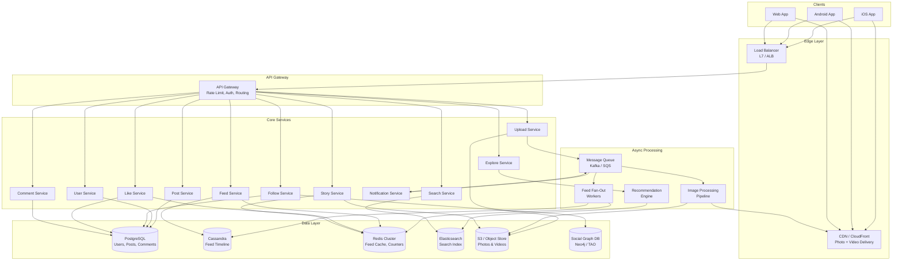

### 1.2 Component Responsibilities

| Component | Responsibility | Scaling Model |
|-----------|---------------|---------------|
| **API Gateway** | Authentication, rate limiting, request routing, TLS termination | Horizontal behind L7 LB |
| **Upload Service** | Accept photos, store originals, generate IDs, publish events | Horizontal, stateless |
| **Feed Service** | Build and serve personalized ranked feeds | Horizontal, stateless; Redis absorbs cache hits |
| **Post Service** | CRUD for post metadata (caption, location, tags) | Horizontal, sharded by user_id |
| **User Service** | User profiles, settings, authentication | Horizontal, sharded by user_id |
| **Follow Service** | Follow/unfollow, follower lists, social graph queries | Horizontal; backed by graph DB |
| **Like Service** | Like toggle, counters, liker lists | Horizontal; Redis for real-time, PG for durability |
| **Comment Service** | Comment CRUD, threading, moderation | Horizontal, sharded by post owner |
| **Story Service** | Story upload, tray construction, viewer tracking | Horizontal; Redis for ephemeral data |
| **Notification Service** | Event aggregation, push delivery, inbox writes | Horizontal; Kafka consumer groups |
| **Explore Service** | Recommendation generation, candidate scoring | Horizontal; GPU instances for ML |
| **Search Service** | User/hashtag/location search, autocomplete | Horizontal; Elasticsearch backend |
| **Image Processing Pipeline** | Resize, filter, EXIF strip, blur hash, content moderation | Horizontal, auto-scaled on queue depth |
| **Feed Fan-Out Workers** | Write posts to follower timelines in Cassandra | Horizontal, Kafka consumer groups |
| **Recommendation Engine** | Offline: build embeddings. Online: candidate generation + ranking | GPU instances; offline batch + online serving |

### 1.3 Request Flow Summary

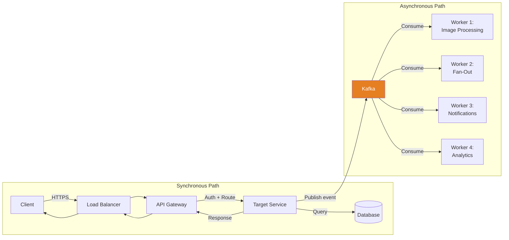

**Key design principle**: The synchronous path returns a response to the user as fast as possible. All heavy lifting (image processing, fan-out, notifications, analytics) happens asynchronously via Kafka events. This decoupling is essential for achieving the < 2s upload acknowledgment target.

---

## 2. Photo Upload Pipeline

The upload pipeline is the write path. It must feel fast for the user while triggering heavy async processing behind the scenes.

### 2.1 Upload Sequence Diagram

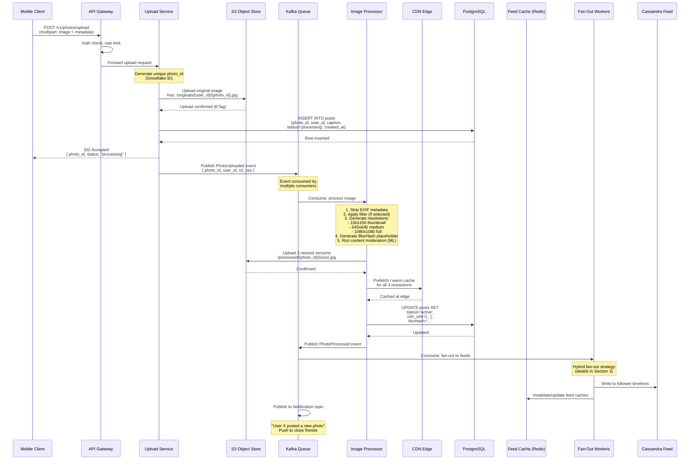

### 2.2 Upload Service Design Details

#### Pre-signed URL Optimization

For large files, the Upload Service can issue a pre-signed S3 URL so the client uploads directly to S3, bypassing the service layer entirely. This reduces upload latency and service CPU load.

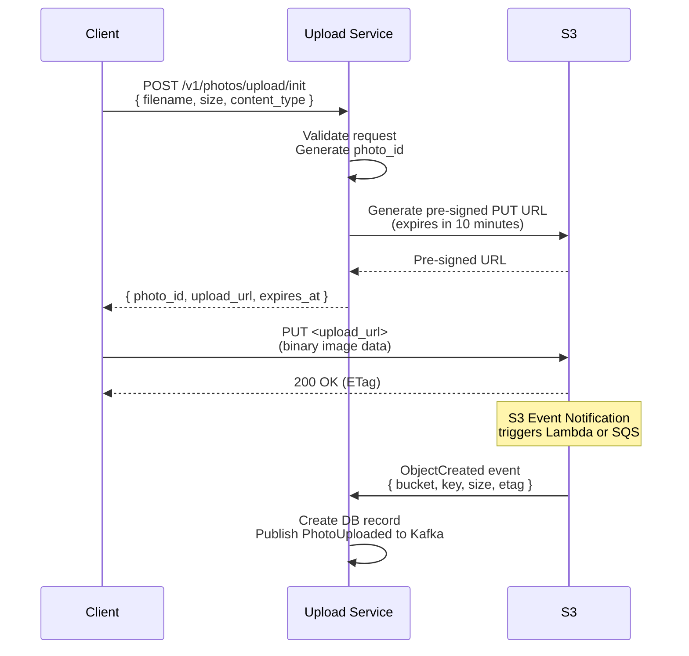

**Benefits of pre-signed URLs**:
- Upload traffic bypasses the application servers entirely
- Client can use S3's multipart upload for large files
- Reduces Upload Service CPU from ~1.7 GB/s to near zero for binary data
- S3 handles checksums, retries, and partial upload resumption natively

#### Idempotency

Each upload request includes a client-generated idempotency key (UUID). This prevents double-uploads on network retries, which are common on mobile networks.

```
Flow:
1. Client generates UUID locally before upload
2. Sends UUID in Idempotency-Key header
3. Upload Service checks Redis: EXISTS idempotency:{key}
4. If exists: return the original response (cached)
5. If not: process normally, then SET idempotency:{key} {response} EX 86400
```

#### Content Moderation Pipeline

The Image Processing Pipeline runs an ML model on every uploaded image. This is critical for platform safety.

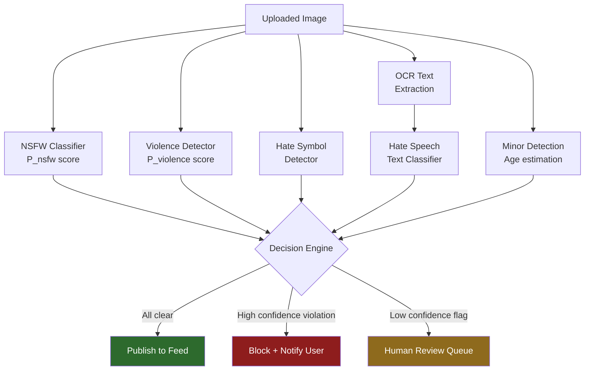

**Key decisions in moderation**:
- Threshold tuning: too aggressive blocks legitimate content, too lenient lets violations through
- Appeal process: users can request human review of blocked content
- Regional standards: content acceptable in one country may violate laws in another
- Speed: moderation adds ~500ms to processing time but must not block the user (async)

### 2.3 Photo ID Generation

Instagram famously published their Snowflake-inspired ID generation scheme. IDs must be:
- Globally unique without coordination between services
- Roughly time-ordered (so feeds can sort by ID as a proxy for timestamp)
- 64 bits (fits in a bigint column)

```
64-bit Snowflake ID structure:
  Bits 63-22 (41 bits): Milliseconds since custom epoch (Jan 1, 2011)
                         Supports ~69 years of IDs
  Bits 21-12 (10 bits): Shard/machine ID (1024 unique generators)
  Bits 11-0  (12 bits): Sequence number (4096 IDs per millisecond per shard)

  Max throughput per shard: 4,096,000 IDs/second
  Max total throughput:     4,096,000 x 1024 = ~4 billion IDs/second
```

---

## 3. News Feed Generation -- Hybrid Fan-Out

This is the most critical and complex component. Instagram (and its parent Meta) uses a **hybrid fan-out** strategy.

### 3.1 The Fan-Out Problem

```
Scenario: User with 10M followers posts a photo.

Naive fan-out-on-write:
  - Write to 10M follower timelines
  - At 1ms per write = 10,000 seconds = 2.7 hours
  - The post is stale before most followers see it

Naive fan-out-on-read:
  - When each of 10M followers opens feed, query all followed users
  - If a user follows 500 accounts: 500 queries per feed load
  - At 290K feed requests/sec = 145M queries/sec (unscalable)

Neither extreme works. The hybrid approach takes the best of both.
```

### 3.2 Hybrid Fan-Out Strategy

```mermaid
graph TB
    subgraph Write Path
        UP[New Photo Published]
        CLASS{Classify User}

        UP --> CLASS

        CLASS -->|Normal User<br>< 10K followers| FOW[Fan-Out on Write]
        CLASS -->|Celebrity<br>greater than or equal to 10K followers| STORE[Store in Celebrity Posts Table]

        FOW --> CASS1[(Write to each<br>follower's timeline<br>in Cassandra)]
        FOW --> INV[Invalidate follower<br>feed caches in Redis]

        STORE --> CELEB[(Celebrity Posts<br>Table - Cassandra)]
    end

    subgraph Read Path -- Feed Request
        REQ[User Opens Feed]
        REQ --> CACHE{Redis Cache<br>Hit?}

        CACHE -->|Hit| RET[Return Cached Feed]
        CACHE -->|Miss| MERGE[Feed Merge Service]

        MERGE --> READ_TL[Read user's pre-computed<br>timeline from Cassandra]
        MERGE --> READ_CELEB[Read latest posts from<br>followed celebrities]
        MERGE --> COMBINE[Merge + Sort by timestamp]
        COMBINE --> RANK[Feed Ranking Service<br>ML Model]
        RANK --> WRITE_CACHE[Write to Redis Cache<br>TTL: 5 minutes]
        WRITE_CACHE --> RET
    end

    style FOW fill:#2d6a2d,color:#fff
    style STORE fill:#6a2d2d,color:#fff
    style RANK fill:#2d2d6a,color:#fff
```

### 3.3 Fan-Out on Write (Normal Users < 10K Followers)

When a normal user publishes a photo:

1. Fan-Out Workers pull the event from Kafka.
2. Query the Follow Service for the poster's follower list.
3. For each follower, append `(photo_id, poster_user_id, timestamp)` to their timeline in Cassandra.
4. Cassandra partition key = `follower_user_id`, clustering key = `timestamp DESC`.
5. Invalidate or append to the follower's Redis feed cache.

**Throughput calculation**:
```
With 100M photos/day from normal users, average 200 followers each:
  100M x 200 = 20 Billion timeline writes/day
  20B / 86,400 = ~231K writes/sec to Cassandra

Cassandra can handle ~10K-50K writes/sec per node (depending on schema).
At 231K writes/sec with 30K writes/sec per node: ~8 nodes minimum.
With replication factor 3: ~24 Cassandra nodes for fan-out alone.
In practice, a cluster of 50-100 nodes handles this plus reads comfortably.
```

### 3.4 Fan-Out on Read (Celebrities >= 10K Followers)

When a celebrity publishes, we do NOT write to every follower's timeline. Instead:

1. Store the post in a **Celebrity Posts** table, partitioned by `celebrity_user_id`.
2. When a follower requests their feed, the Feed Service:
   a. Reads the pre-computed timeline (normal user posts) from Cassandra.
   b. Identifies which celebrities the user follows (from the social graph).
   c. Fetches the latest N posts from each followed celebrity (often cached in Redis).
   d. Merges both lists and feeds them to the ranking model.

**Why this works**: A user typically follows at most a few dozen celebrities. Fetching their recent posts requires ~20-50 reads from a heavily cached celebrity posts table. This is orders of magnitude cheaper than writing to millions of follower timelines.

**Celebrity post caching**: A celebrity with 50M followers has their recent posts cached once in Redis, not written 50M times. A single Redis key serves all 50M followers who request it.

### 3.5 Feed Timeline Data Model (Cassandra)

```
Table: user_feed_timeline
  Partition Key:  user_id (bigint)
  Clustering Key: created_at (timestamp) DESC
  Columns:
    - photo_id     (bigint)
    - poster_id    (bigint)
    - post_type    (text)      -- 'photo', 'carousel', 'reel'
    - created_at   (timestamp)

  TTL: 30 days (old entries auto-expire, preventing unbounded growth)
  
  Query: SELECT * FROM user_feed_timeline
         WHERE user_id = ? 
         ORDER BY created_at DESC
         LIMIT 50;

Table: celebrity_posts
  Partition Key:  user_id (bigint)
  Clustering Key: created_at (timestamp) DESC
  Columns:
    - photo_id     (bigint)
    - post_type    (text)
    - created_at   (timestamp)

  TTL: 7 days (only recent celebrity posts needed for feed merging)
  
  Query: SELECT * FROM celebrity_posts
         WHERE user_id IN (?, ?, ?, ...)
         ORDER BY created_at DESC
         LIMIT 10;
```

### 3.6 Feed Construction Sequence

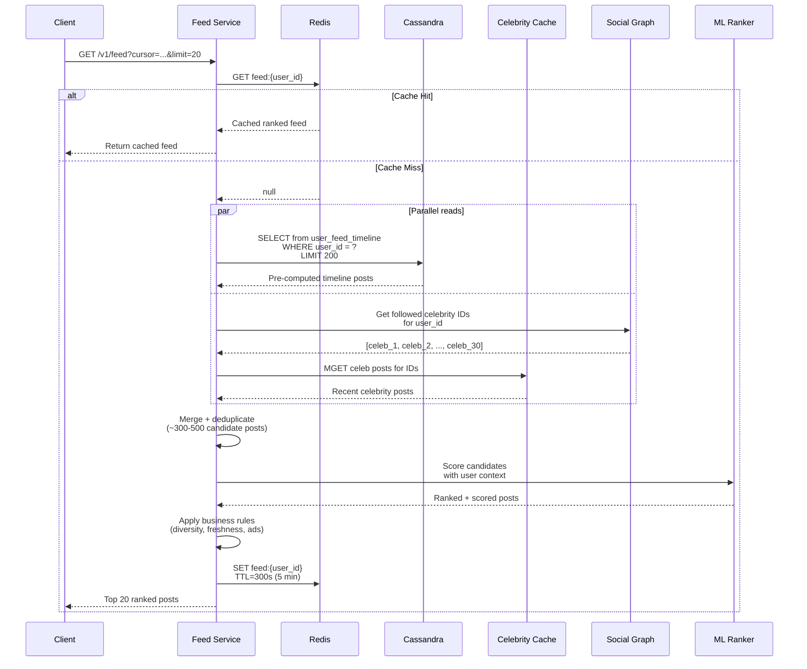

---

## 4. Feed Ranking -- ML Model

Instagram moved from chronological to ranked feeds in 2016. The ranking model predicts which posts a user is most likely to engage with.

### 4.1 Ranking Signal Categories

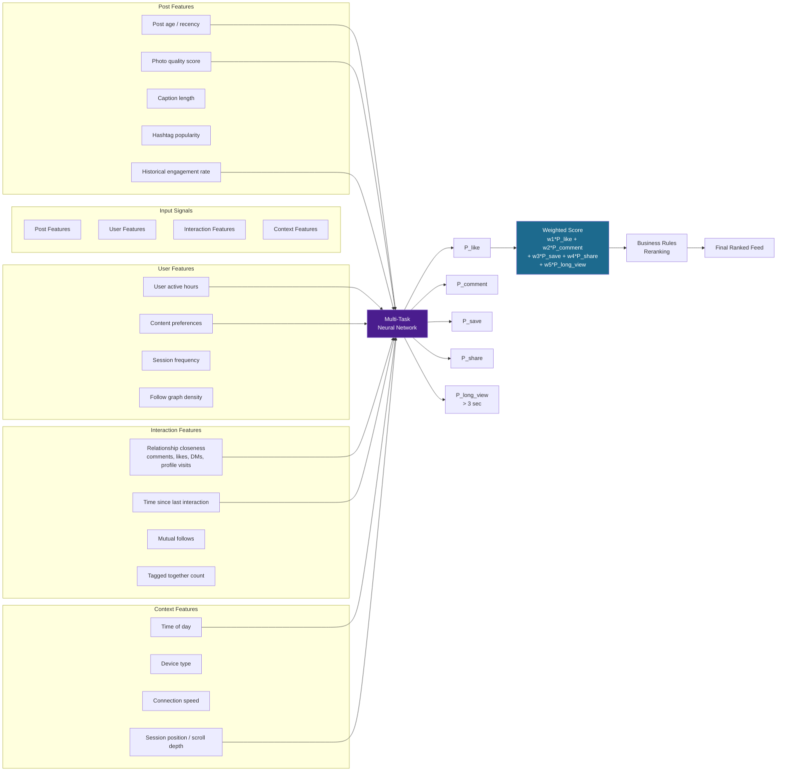

### 4.2 Ranking Pipeline Steps

The ranking pipeline is a multi-stage funnel that progressively narrows candidates while applying increasingly expensive scoring.

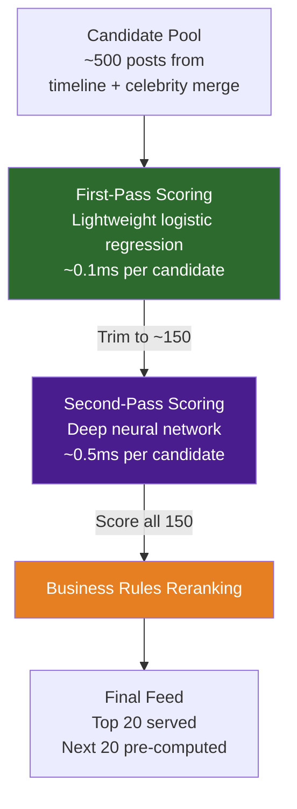

**Stage details**:

1. **Candidate Generation** (~500 posts): Merge pre-computed timeline + celebrity posts + injected content (ads, suggested posts from Explore).
2. **First-Pass Scoring** (lightweight model): Fast logistic regression to trim to ~150 candidates. Features: post age, poster engagement rate, basic affinity score. Cost: ~0.1ms per candidate.
3. **Second-Pass Scoring** (heavy model): Deep neural network (multi-task learning) predicts P(like), P(comment), P(save), P(share), P(dwell_time > 3s). Cost: ~0.5ms per candidate.
4. **Final Score**: Weighted combination: `0.3*P_like + 0.2*P_comment + 0.25*P_save + 0.15*P_share + 0.1*P_long_view`. Weights are tuned via A/B testing.
5. **Business Rules Reranking**:
   - **Diversity**: No more than 2 consecutive posts from the same user.
   - **Freshness boost**: Posts < 1 hour old get a 1.3x score multiplier.
   - **Anti-bubble**: Inject 10% posts from weaker-signal accounts to prevent echo chambers.
   - **Ad insertion**: Every 4th-6th position reserved for sponsored content.
   - **Content type mixing**: Alternate between photos, carousels, and reels.
   - **Sensitive content demotion**: Lower-quality or borderline content pushed down.
6. **Serve top 20** to the client; pre-compute the next 20 for smooth infinite scroll.

### 4.3 Latency Budget for Feed Ranking

```
Total budget: 200ms (p99)

Step                      Time (p50)    Time (p99)
--------------------------+-----------+------------
Cache lookup (Redis)      :  2ms      :   5ms
Cassandra timeline read   :  8ms      :  15ms
Celebrity post fetch      :  5ms      :  10ms
Candidate merge + dedup   :  3ms      :   5ms
Feature extraction        : 15ms      :  30ms
First-pass scoring        :  5ms      :  10ms
Second-pass scoring (ML)  : 30ms      :  50ms
Reranking + rules         :  5ms      :  10ms
Response serialization    :  3ms      :   5ms
Network (service mesh)    : 10ms      :  20ms
--------------------------+-----------+------------
Total                     : ~86ms     : ~160ms
Buffer for tail latency   :           :  40ms
--------------------------+-----------+------------
Budget                    : 150ms p50 : <200ms p99
```

### 4.4 Feature Store Architecture

The ranking model requires features from multiple sources, computed at different cadences.

```mermaid
graph TB
    subgraph Real-Time Features -- computed per request
        RT1[Current time of day]
        RT2[Session scroll depth]
        RT3[Device type and connection]
        RT4[Post age in minutes]
    end

    subgraph Near-Real-Time Features -- updated every few minutes
        NRT1[User's recent likes<br>last 30 minutes]
        NRT2[Post's engagement velocity<br>likes per minute]
        NRT3[User's active session count]
    end

    subgraph Batch Features -- updated hourly/daily
        BF1[User interest vector<br>updated hourly]
        BF2[Poster average engagement rate<br>updated daily]
        BF3[Relationship closeness score<br>updated daily]
        BF4[Content quality score<br>computed at upload time]
    end

    RT1 --> FS2[Feature Store<br>Redis + Cassandra]
    RT2 --> FS2
    NRT1 --> FS2
    NRT2 --> FS2
    BF1 --> FS2
    BF2 --> FS2
    BF3 --> FS2

    FS2 --> RANKER2[Ranking Model<br>TorchServe]

    style FS2 fill:#4a1d8e,color:#fff
```

---

## 5. Stories -- Ephemeral Content

Stories are 24-hour ephemeral media displayed in a horizontal carousel at the top of the feed. They are one of Instagram's most heavily used features.

### 5.1 Story Architecture

```mermaid
graph TB
    subgraph Story Upload
        CL[Client] -->|POST /v1/stories/upload| SUS[Story Upload Service]
        SUS -->|Store media| S3S[(S3: /stories/{user_id}/{story_id})]
        SUS -->|Write metadata| REDIS_S[(Redis: story metadata<br>TTL = 24 hours)]
        SUS -->|Publish event| KF[Kafka: story_created]
    end

    subgraph Story Storage
        REDIS_S -->|Auto-expire| DEL[TTL Expiration<br>Automatic Cleanup]
        S3S -->|S3 Lifecycle Policy| S3DEL[S3 Object Expiration<br>Delete after 25 hours]
    end

    subgraph Story Read Path
        USER[User Opens App] -->|GET /v1/stories| SRS2[Story Read Service]
        SRS2 -->|Get followed user IDs| FOLLOW[(Follow Service)]
        SRS2 -->|Multi-get active stories| REDIS_S
        SRS2 -->|Return story tray| USER
    end

    subgraph Story Tray Ordering
        SRS2 --> TRAY[Story Tray Ranker]
        TRAY -->|1. Unseen stories first| ORD1[Sort: unseen > seen]
        TRAY -->|2. Closest relationships| ORD2[Sort: interaction score]
        TRAY -->|3. Recency| ORD3[Sort: newest first]
        TRAY --> FINAL_TRAY[Ordered Story Tray]
    end

    style DEL fill:#8e1d1d,color:#fff
    style S3DEL fill:#8e1d1d,color:#fff
```

### 5.2 Story Data Model (Redis)

```
Key:    story:active:{user_id}
Type:   Sorted Set
Members: story_id
Score:   upload_timestamp
TTL:     86400 seconds (24 hours)

Key:    story:meta:{story_id}
Type:   Hash
Fields: { media_url, media_type, stickers, duration, view_count, created_at }
TTL:     86400 seconds (24 hours)

Key:    story:viewers:{story_id}
Type:   Set
Members: viewer_user_ids
TTL:     86400 seconds (24 hours)
```

### 5.3 Why Redis for Stories?

| Reason | Details |
|--------|---------|
| **Native TTL** | Stories auto-expire after 24 hours with zero application logic |
| **Low latency** | Sub-millisecond reads for the story tray (hot path) |
| **Sorted sets** | Natural ordering by timestamp for story sequence |
| **Atomic counters** | INCR for view counts without read-modify-write races |
| **Memory efficient** | Stories are short-lived; 250TB steady-state fits in a large Redis cluster |
| **Pipeline support** | Multi-get for all followed users' stories in a single round trip |

### 5.4 Story Tray Construction

The story tray is the horizontal carousel at the top of the feed. Building it requires:

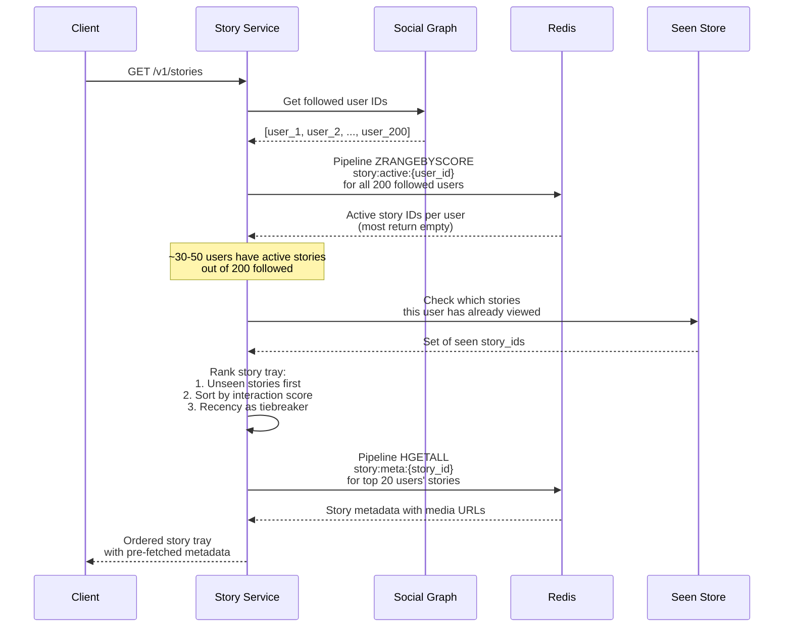

### 5.5 Highlights Archive Flow

When a user adds a story to "Highlights," the data must be migrated from ephemeral Redis to permanent storage before the TTL expires.

```mermaid
graph LR
    USER2[User taps<br>"Add to Highlights"] --> HL_SVC[Highlights Service]
    HL_SVC --> COPY_MEDIA[Copy media from<br>S3 /stories/ to<br>S3 /highlights/]
    HL_SVC --> WRITE_PG[Write to PostgreSQL<br>highlights table]
    HL_SVC --> DEL_TTL[Remove TTL from<br>Redis story metadata<br>or copy to PG before expiry]

    style HL_SVC fill:#2d6a2d,color:#fff
```

---

## 6. Explore / Discover Page

The Explore page surfaces content from accounts the user does NOT follow, driving discovery and engagement. It is one of the highest-impact surfaces for content creators.

### 6.1 Explore Architecture

```mermaid
graph TB
    subgraph Offline Pipeline -- Runs Every Few Hours
        POSTS[(All Recent Posts<br>last 48 hours)] --> EMB[Embedding Service<br>Image + Text Embeddings]
        EMB --> VEC[(Vector Index<br>FAISS / Pinecone)]

        USERS[(User Interaction<br>History)] --> UP[User Profile Builder<br>Interest Vectors]
        UP --> UPV[(User Profile<br>Vectors)]

        POSTS --> POP[Popularity Scorer<br>Engagement velocity,<br>quality signals]
        POP --> POPDB[(Popularity<br>Scores)]
    end

    subgraph Online Serving -- Per Request
        REQ[GET /v1/explore] --> CAND[Candidate Generator]
        CAND -->|ANN search| VEC
        CAND -->|Topic clusters| POPDB
        CAND -->|Collaborative filtering| UPV

        CAND --> POOL[Candidate Pool<br>~1000 posts]
        POOL --> FILTER[Filter Layer]
        FILTER -->|Remove seen posts| SEEN[(Seen Posts Bloom Filter)]
        FILTER -->|Remove blocked users| BLOCK[(Block List)]
        FILTER -->|Content policy check| MOD[Moderation Flags]

        FILTER --> RANK2[Explore Ranking Model<br>Similar to feed but<br>emphasizes novelty]
        RANK2 --> DIV[Diversity Injection<br>Topic diversity,<br>media type mix]
        DIV --> FINAL2[Top 30 Posts<br>Grid Layout]
    end

    style EMB fill:#4a1d8e,color:#fff
    style RANK2 fill:#1d6a8e,color:#fff
```

### 6.2 Candidate Generation Strategies

1. **Content-Based (Image Similarity)**: Encode every image with a CNN (ResNet/EfficientNet) into a 512-dimensional embedding. When a user opens Explore, find nearest neighbors to their interest vector in FAISS. Interest vectors are built from the embeddings of posts the user has engaged with recently.

2. **Collaborative Filtering**: "Users similar to you also liked these posts." Build user-user similarity from engagement history. Use item-based collaborative filtering for scalability: precompute similar items offline, merge at serving time.

3. **Topic Clusters**: Classify posts into topics (food, travel, fashion, fitness, art, pets, etc.). Show a curated mix of topics the user historically engages with, plus 20% from adjacent topics for exploration. This prevents the filter bubble effect.

4. **Trending / Viral**: Posts with abnormally high engagement velocity (likes per minute) in the last few hours, filtered by quality signals. Trending candidates bypass personalization and are shown to broad audiences.

5. **Social Signal**: Posts liked or saved by people the user follows. "Your friend liked this" is a powerful discovery signal even for content from unfollowed accounts.

### 6.3 Seen Posts Tracking (Bloom Filter)

To avoid showing the same post twice on Explore, the system tracks seen posts per user.

```
Bloom Filter per user:
  Size: ~1KB per user (10,000 items, 1% false positive rate)
  Storage: 500M users x 1KB = 500 GB
  Stored in: Redis (hot users) + Cassandra (cold users)
  
  On each Explore request:
    1. Load user's Bloom filter
    2. Test each candidate against the filter
    3. Remove seen candidates
    4. After serving, add returned post IDs to the filter
    5. Reset filter weekly to allow content re-surfacing
```

### 6.4 Explore Grid Layout

The Explore page uses a specific grid layout that mixes media types:

```
Standard grid layout (3 columns):
  Row 1:  [square] [square] [square]
  Row 2:  [tall (2 rows)]  [square]
                            [square]
  Row 3:  [square] [square] [wide (video, 2 cols)]
  ... repeating pattern

Layout decisions are made server-side to control visual variety.
Each grid cell includes: thumbnail URL, media type indicator, engagement overlay.
```

---

## 7. Search Service

### 7.1 Search Architecture

```mermaid
graph LR
    subgraph Search Flow
        Q[User Query:<br>#travel] --> API[Search API]
        API --> PARSE[Query Parser<br>Detect type:<br>@user, #hashtag, location, text]

        PARSE -->|@mention| USER_IDX[(Elasticsearch<br>User Index)]
        PARSE -->|#hashtag| TAG_IDX[(Elasticsearch<br>Hashtag Index)]
        PARSE -->|Location| GEO_IDX[(Elasticsearch<br>Geo Index)]
        PARSE -->|Free text| MULTI[Multi-Index Search]

        USER_IDX --> BLEND
        TAG_IDX --> BLEND
        GEO_IDX --> BLEND
        MULTI --> BLEND

        BLEND[Result Blender<br>& Ranker] --> RES[Search Results<br>Blended: Top accounts,<br>tags, places, top posts]
    end

    subgraph Indexing Pipeline
        EVT[Post/User Events<br>from Kafka] --> INDX[Indexer Service]
        INDX --> USER_IDX
        INDX --> TAG_IDX
        INDX --> GEO_IDX
    end

    style BLEND fill:#2d6a2d,color:#fff
```

### 7.2 Elasticsearch Index Schemas

```json
// User Index
{
  "username":       { "type": "text", "analyzer": "autocomplete" },
  "full_name":      { "type": "text" },
  "bio":            { "type": "text" },
  "follower_count": { "type": "integer" },
  "verified":       { "type": "boolean" },
  "profile_pic":    { "type": "keyword" }
}

// Hashtag Index
{
  "tag":            { "type": "text", "analyzer": "hashtag_analyzer" },
  "post_count":     { "type": "long" },
  "trending_score": { "type": "float" },
  "category":       { "type": "keyword" }
}

// Geo/Location Index
{
  "name":           { "type": "text" },
  "coordinates":    { "type": "geo_point" },
  "city":           { "type": "keyword" },
  "country":        { "type": "keyword" },
  "post_count":     { "type": "long" }
}
```

### 7.3 Autocomplete Implementation

Autocomplete (typeahead) is a critical UX feature. Users expect results as they type.

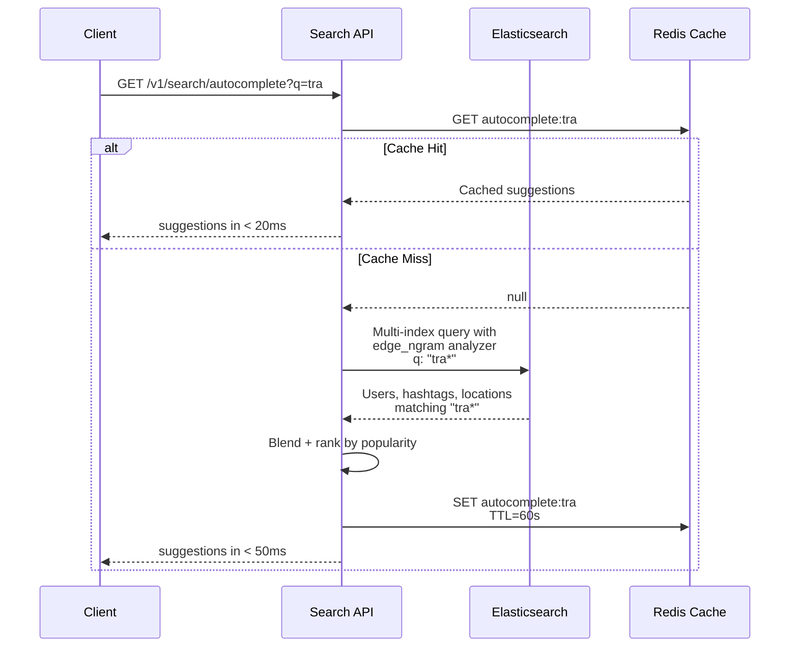

**Autocomplete analyzer configuration**:
```json
{
  "analysis": {
    "analyzer": {
      "autocomplete": {
        "type": "custom",
        "tokenizer": "autocomplete_tokenizer",
        "filter": ["lowercase"]
      }
    },
    "tokenizer": {
      "autocomplete_tokenizer": {
        "type": "edge_ngram",
        "min_gram": 2,
        "max_gram": 20,
        "token_chars": ["letter", "digit"]
      }
    }
  }
}
```

### 7.4 Search Ranking Signals

Search results are not just filtered by match -- they are ranked.

| Signal | Weight | Description |
|--------|--------|-------------|
| **Text relevance** | High | Elasticsearch BM25 score |
| **Follower count** | Medium | More popular accounts rank higher |
| **Verified status** | Medium | Verified accounts get a boost |
| **Relationship** | Medium | Accounts you interact with rank higher |
| **Recency** | Low | Recently active accounts/tags preferred |
| **Engagement rate** | Low | Higher engagement suggests quality |

---

## 8. Image Storage Architecture

### 8.1 Storage Pipeline

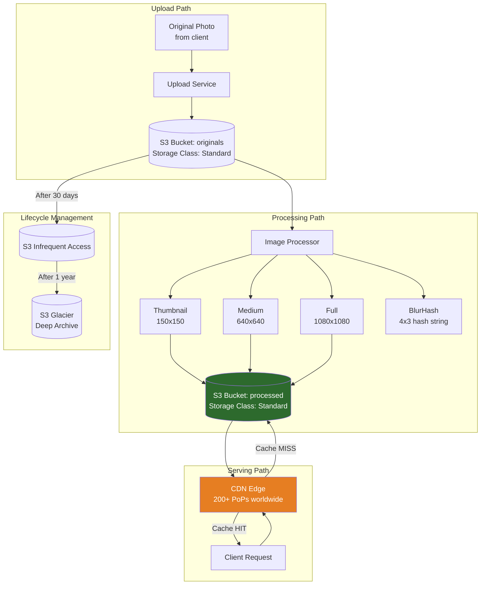

### 8.2 Image Storage Key Design

```
Originals:  s3://instagram-originals/{shard}/{user_id}/{photo_id}.{ext}
Processed:  s3://instagram-processed/{shard}/{photo_id}/thumb.webp
            s3://instagram-processed/{shard}/{photo_id}/medium.webp
            s3://instagram-processed/{shard}/{photo_id}/full.webp

Shard prefix: first 2 hex chars of MD5(photo_id)
  - Prevents S3 hot-partition issues (S3 partitions by key prefix)
  - Distributes across 256 prefixes for parallel listing
  - Example: photo_id=12345 -> MD5="827ccb..." -> shard="82"
```

### 8.3 CDN Strategy (Multi-Layer Caching)

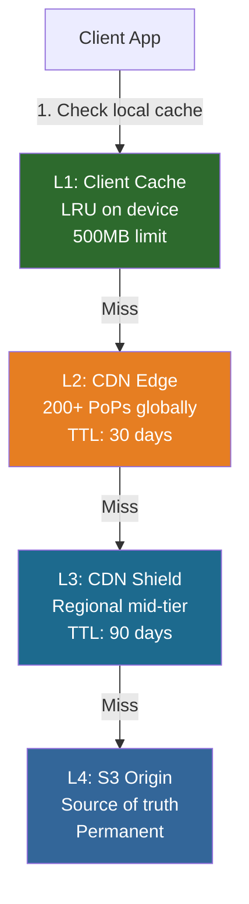

| Layer | Purpose | TTL | Hit Rate |
|-------|---------|-----|----------|
| **L1: Client Cache** | App-level LRU cache on device | Until app restart | ~30% |
| **L2: CDN Edge** | 200+ Points of Presence globally | 30 days (immutable URLs) | ~65% |
| **L3: CDN Shield** | Regional mid-tier cache (reduce S3 load) | 90 days | ~4% |
| **L4: S3 Origin** | Source of truth | Permanent | ~1% |

**Overall cache hit rate**: 95%+ of image requests never reach S3 origin.

Photos are served with **immutable URLs** (the photo_id is baked into the path). Because photos are never modified after processing, CDN caches never serve stale content. If a user deletes a photo, we invalidate the CDN cache entry and delete from S3.

### 8.4 Progressive Loading Strategy

Progressive loading makes the feed feel fast even on slow connections.

```
Step 1: Feed API response includes BlurHash for each post
        BlurHash is a ~20-byte string inlined in the JSON response
        Client renders a colorful blur placeholder immediately

Step 2: Client requests medium resolution (640x640, ~300KB)
        This is the default viewing resolution in the feed
        Loaded lazily as user scrolls (viewport + 2 screens ahead)

Step 3: If user taps to zoom, request full resolution (1080x1080, ~1.5MB)
        Only loaded on demand; most users never trigger this

Step 4: Thumbnail (150x150, ~50KB) used for grid views
        Profile page, Explore grid, search results
```

### 8.5 Image Format Optimization

```
Format selection (server-side, based on client capabilities):
  - WebP:  Default for Android and modern iOS (30% smaller than JPEG)
  - AVIF:  Newest format, 50% smaller than JPEG (limited client support)
  - JPEG:  Fallback for older clients
  - HEIC:  Accepted on upload from iOS but converted to WebP for serving

Quality settings:
  - Thumbnail: 80% quality (small file, less noticeable)
  - Medium:    85% quality (balanced)
  - Full:      90% quality (best visual fidelity)

The Content-Type negotiation happens via Accept header:
  Client sends: Accept: image/avif, image/webp, image/jpeg
  CDN serves the best format available
```

---

## 9. Database Design

### 9.1 Entity-Relationship Overview

```mermaid
graph TB
    subgraph PostgreSQL -- Relational Data
        USERS[users<br>- user_id PK<br>- username UNIQUE<br>- email<br>- bio<br>- profile_pic_url<br>- follower_count<br>- following_count<br>- created_at]

        POSTS[posts<br>- photo_id PK<br>- user_id FK<br>- caption<br>- location_id<br>- cdn_urls JSONB<br>- blurhash<br>- like_count<br>- comment_count<br>- status<br>- created_at]

        COMMENTS[comments<br>- comment_id PK<br>- photo_id FK<br>- user_id FK<br>- parent_comment_id<br>- text<br>- created_at]

        LIKES[likes<br>- user_id PK<br>- photo_id PK<br>- created_at]

        FOLLOWS[follows<br>- follower_id PK<br>- followee_id PK<br>- created_at]

        USERS --> POSTS
        USERS --> COMMENTS
        USERS --> LIKES
        USERS --> FOLLOWS
        POSTS --> COMMENTS
        POSTS --> LIKES
    end

    subgraph Cassandra -- Timeline Data
        FEED[user_feed_timeline<br>- user_id PARTITION<br>- created_at CLUSTER DESC<br>- photo_id<br>- poster_id<br>- post_type]

        CELEB_POSTS[celebrity_posts<br>- user_id PARTITION<br>- created_at CLUSTER DESC<br>- photo_id<br>- post_type]
    end

    subgraph Redis -- Caches and Ephemeral
        FEED_CACHE[Feed Cache<br>feed:{user_id} -> sorted set]
        COUNTER[Like/View Counters<br>likes:{photo_id} -> int]
        SESSION[User Sessions<br>session:{token} -> user_id]
        STORY_DATA[Story Data<br>story:active:{user_id} -> sorted set]
        RATE[Rate Limiters<br>rate:{user_id}:{endpoint} -> count]
    end

    subgraph Elasticsearch -- Search
        ES_USER[User Index]
        ES_TAG[Hashtag Index]
        ES_GEO[Location Index]
    end

    style USERS fill:#336699,color:#fff
    style POSTS fill:#336699,color:#fff
    style FEED fill:#994433,color:#fff
    style FEED_CACHE fill:#993399,color:#fff
```

### 9.2 Database Selection Rationale

| Database | Used For | Why This DB |
|----------|----------|-------------|
| **PostgreSQL** | Users, posts, comments, likes, follows | ACID transactions for core entities; rich query support; mature ecosystem; strong consistency for counters |
| **Cassandra** | Feed timelines, celebrity posts | Write-optimized for massive fan-out; time-series clustering; linear horizontal scalability; tunable consistency |
| **Redis** | Feed cache, counters, sessions, stories, rate limits | Sub-ms latency; native TTL for stories; atomic INCR for counters; sorted sets for ranked feeds |
| **Elasticsearch** | User/hashtag/location search | Full-text search with autocomplete; geo queries; relevance scoring |
| **S3** | Photo and video binary storage | Virtually unlimited capacity; 11 nines durability; lifecycle policies; cost-effective |
| **Neo4j / TAO** | Social graph (follows, blocks) | Efficient graph traversals for "friends of friends," mutual follows, relationship scoring |

### 9.3 Key PostgreSQL Indexes

```sql
-- Users table
CREATE INDEX idx_users_username ON users (username);
CREATE INDEX idx_users_email ON users (email);

-- Posts table
CREATE INDEX idx_posts_user_id_created ON posts (user_id, created_at DESC);
CREATE INDEX idx_posts_location_id ON posts (location_id) WHERE location_id IS NOT NULL;
CREATE INDEX idx_posts_status ON posts (status) WHERE status = 'processing';

-- Comments table
CREATE INDEX idx_comments_photo_id_created ON comments (photo_id, created_at DESC);
CREATE INDEX idx_comments_user_id ON comments (user_id);

-- Likes table (composite PK is already indexed)
CREATE INDEX idx_likes_photo_id_created ON likes (photo_id, created_at DESC);

-- Follows table (composite PK is already indexed)
CREATE INDEX idx_follows_followee_id ON follows (followee_id, created_at DESC);
```

---

## 10. Notification System

### 10.1 Notification Pipeline

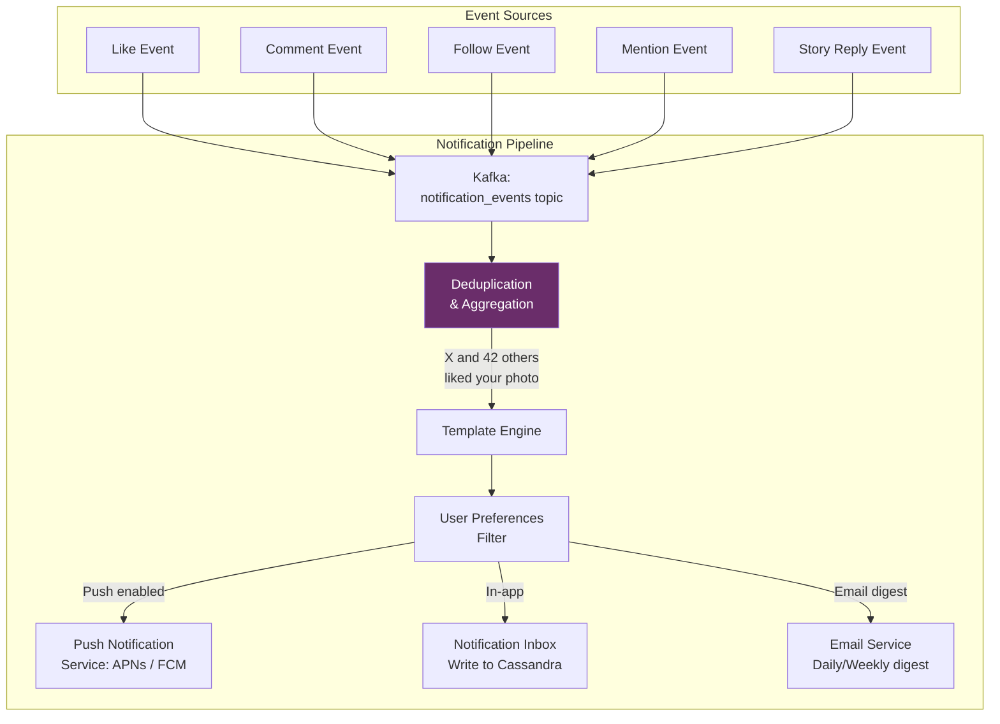

### 10.2 Aggregation Logic

If a post receives 50 likes in 1 minute, the system does not send 50 push notifications. Instead, it buffers for 30 seconds and sends: "user_a, user_b, and 48 others liked your photo."

```
Aggregation rules:
  - Buffer window: 30 seconds for likes, 60 seconds for follows
  - Min actors for aggregation: 3 (below 3, send individual notifications)
  - Max actors shown: 2 named + "N others"
  - Priority: show the most relevant actors (mutual follows, verified users first)
  - Rate limit: max 1 push notification per post per 5-minute window
  - Quiet hours: respect user timezone; batch non-urgent notifications
```

### 10.3 Notification Storage

```
Cassandra table: user_notifications
  Partition Key:  user_id
  Clustering Key: created_at DESC
  Columns:
    - notification_id  (uuid)
    - type             (text)    -- 'like', 'comment', 'follow', etc.
    - actor_ids        (list<bigint>)
    - target_type      (text)    -- 'photo', 'story', 'profile'
    - target_id        (bigint)
    - message          (text)
    - read             (boolean)
    - created_at       (timestamp)

  TTL: 90 days
  
  Query: SELECT * FROM user_notifications
         WHERE user_id = ?
         ORDER BY created_at DESC
         LIMIT 20;
```

### 10.4 Push Notification Delivery

```mermaid
graph LR
    NOTIF[Notification Service] --> ROUTE{Platform Router}
    ROUTE -->|iOS| APNS[Apple Push<br>Notification Service]
    ROUTE -->|Android| FCM[Firebase Cloud<br>Messaging]
    ROUTE -->|Web| WEB_PUSH[Web Push API]

    APNS --> IOS_DEVICE[iOS Device]
    FCM --> ANDROID_DEVICE[Android Device]
    WEB_PUSH --> BROWSER[Web Browser]

    style ROUTE fill:#e67e22,color:#fff
```

**Delivery guarantees**:
- Push notifications are best-effort (APNs/FCM do not guarantee delivery)
- In-app inbox is the durable notification store (always available when user opens the app)
- Email digest is the catch-all for users who miss push notifications
- Failed pushes are retried 3 times with exponential backoff before giving up
