# Design Google Docs -- High-Level Design

## Complete System Design Interview Walkthrough (Part 2 of 3)

> This document covers the system architecture, the critical choice between OT and
> CRDTs, the WebSocket communication layer, document storage, permissions, and
> comments. See Part 1 for requirements/estimation and Part 3 for deep dives.

---

## Table of Contents

- [Architecture Overview](#architecture-overview)
  - [System Architecture Diagram](#system-architecture-diagram)
  - [Component Responsibilities](#component-responsibilities)
  - [Core Data Flow](#core-data-flow)
- [The Core Challenge: Real-Time Conflict Resolution](#the-core-challenge-real-time-conflict-resolution)
  - [Why This Is Hard](#why-this-is-hard)
  - [Operational Transformation (OT) Overview](#operational-transformation-ot-overview)
  - [CRDTs: The Alternative Approach](#crdts-the-alternative-approach)
  - [OT vs CRDT: Detailed Comparison and Why We Choose OT](#ot-vs-crdt-detailed-comparison-and-why-we-choose-ot)
- [WebSocket Communication Layer](#websocket-communication-layer)
  - [Why WebSocket](#why-websocket)
  - [Connection Lifecycle](#connection-lifecycle)
  - [Connection Routing Strategy](#connection-routing-strategy)
  - [Heartbeat and Reconnection](#heartbeat-and-reconnection)
  - [Message Prioritization](#message-prioritization)
- [Document Storage Architecture](#document-storage-architecture)
  - [Three-Tier Storage Design](#three-tier-storage-design)
  - [How Document Loading Works](#how-document-loading-works)
  - [Why Not Store the Full Document on Every Edit](#why-not-store-the-full-document-on-every-edit)
  - [Snapshot Strategy](#snapshot-strategy)
- [Permission Model](#permission-model)
  - [Role Hierarchy](#role-hierarchy)
  - [Permission Matrix](#permission-matrix)
  - [Sharing Mechanisms](#sharing-mechanisms)
  - [Permission Check Flow](#permission-check-flow)
  - [Permission Enforcement in WebSocket](#permission-enforcement-in-websocket)
- [Comments and Suggestions](#comments-and-suggestions)
  - [Comment Anchoring Challenge](#comment-anchoring-challenge)
  - [Implementation](#implementation)
  - [Suggestion Mode](#suggestion-mode)

---

## Architecture Overview

### System Architecture Diagram

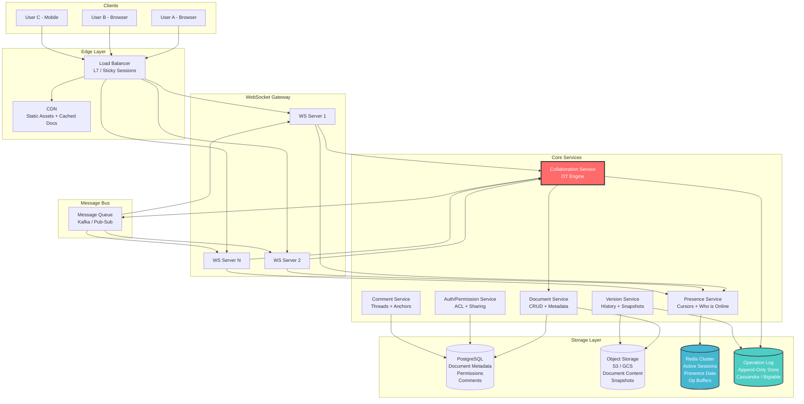

### Component Responsibilities

Each component has a single, well-defined responsibility:

#### Edge Layer

| Component | Responsibility | Key Details |
|-----------|---------------|-------------|
| **Load Balancer** | Route traffic, maintain sticky sessions | L7 load balancer (e.g., Envoy, NGINX). Uses `doc_id` query param for sticky routing so all clients for the same document reach the same WebSocket server. Health checks every 5 seconds. |
| **CDN** | Serve static assets, cache read-only documents | JavaScript, CSS, images. Also caches the document editor application itself. For documents shared as "published" web pages, CDN caches rendered HTML. |

#### WebSocket Gateway

| Component | Responsibility | Key Details |
|-----------|---------------|-------------|
| **WS Servers** | Maintain persistent client connections | Each server handles ~50K concurrent WebSocket connections. Handles protocol upgrade from HTTP to WebSocket. Authenticates on connection. Routes messages to appropriate backend services. |

#### Core Services

| Component | Responsibility | Key Details |
|-----------|---------------|-------------|
| **Collaboration Service** | OT transform engine, operation serialization | The heart of the system. Receives operations from clients, transforms against concurrent ops, persists to operation log, broadcasts to other clients. One logical instance per active document (see Part 3 for single-server-per-document). |
| **Document Service** | CRUD operations on document metadata and content | Creates documents, manages metadata in PostgreSQL, reads/writes document snapshots to object storage. Not on the real-time editing path. |
| **Presence Service** | Track who is online, cursor positions | Stores cursor positions and user activity status in Redis. Aggregates and batches cursor updates before broadcasting. |
| **Version Service** | Manage version history and snapshots | Triggers periodic snapshots (every 100 ops or 30s). Manages named versions. Handles version restoration. |
| **Auth/Permission Service** | Authentication and authorization | Validates user identity, checks document permissions, manages sharing links. Caches permission decisions in Redis for fast repeated checks. |
| **Comment Service** | Comment threads, anchoring, suggestions | Manages comment CRUD, keeps comment anchors in sync with document edits (using OT-like position transforms), handles suggestion accept/reject. |

#### Message Bus

| Component | Responsibility | Key Details |
|-----------|---------------|-------------|
| **Kafka / Pub-Sub** | Decouple services, fan-out messages | When the Collaboration Service accepts an operation, it publishes to the message bus. All WebSocket servers subscribed to that document's topic receive the message and forward to their connected clients. Also used for async tasks: snapshot creation, search indexing, notification delivery. |

#### Storage Layer

| Component | Responsibility | Key Details |
|-----------|---------------|-------------|
| **PostgreSQL** | Document metadata, permissions, comments | Structured, relational data. ACID transactions for permission changes. Read replicas for listing queries. |
| **Object Storage (S3/GCS)** | Document content, snapshots, images | Bulk content storage. Virtually unlimited capacity. Snapshots are immutable objects. |
| **Redis Cluster** | Active sessions, presence, caching | In-memory data store for low-latency reads. Presence data with TTL for automatic cleanup. Permission cache. Active document state cache. |
| **Operation Log (Cassandra)** | Append-only operation history | Every operation ever applied to every document. Partitioned by document_id, ordered by revision. The source of truth for document state. |

### Core Data Flow

The following sequence shows what happens when a user types a character:

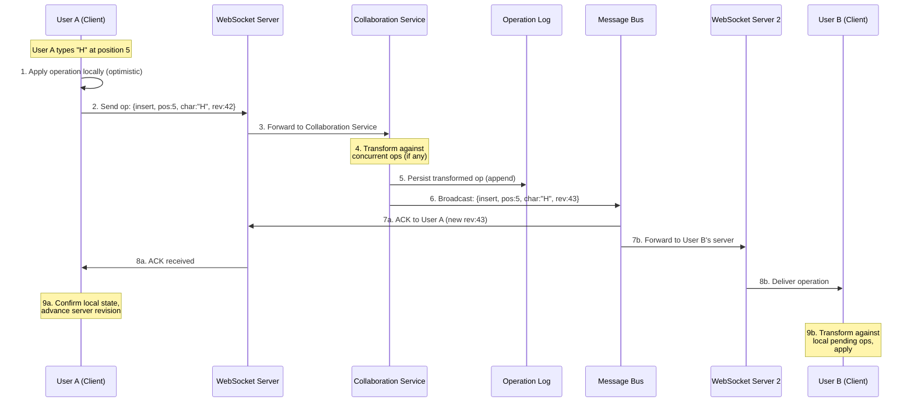

#### Data Flow Timing Analysis

Understanding where time is spent in this flow is critical for meeting latency targets:

```
Step 1 (local apply):      < 1ms    -- DOM manipulation, local OT
Step 2 (client to WS):     10-50ms  -- network latency (varies by geography)
Step 3 (WS to CS):         < 1ms    -- intra-datacenter, same server if sticky
Step 4 (OT transform):     < 1ms    -- O(n) in operation length, microseconds
Step 5 (persist to log):   5-15ms   -- Cassandra write (replicated)
Step 6 (publish to bus):   < 5ms    -- Kafka publish
Step 7 (bus to WS):        < 5ms    -- Kafka consume
Step 8 (WS to client):     10-50ms  -- network latency

Total (User A sees own keystroke):   < 1ms (step 1 only -- optimistic)
Total (User B sees User A's keystroke): 30-130ms (steps 2-8)
```

The user never waits for the server. Their keystroke appears instantly (step 1),
and the server confirms it afterward (step 8a). If the server transforms the
operation (step 4), the client silently adjusts. This is the "optimistic local
application" pattern.

---

## The Core Challenge: Real-Time Conflict Resolution

### Why This Is Hard

This is the most important section of the entire design. Everything else is
standard distributed systems engineering. The differentiator for a collaborative
editor is: **how do you handle two users editing the same spot at the same time?**

Consider this scenario:

```
Initial document: "ABCDE"

User A (in San Francisco) types "X" after position 1:   "AXBCDE"
User B (in London) deletes character at position 3:      "ABDE"

Both happen at the "same time" -- neither has seen the other's edit yet.
```

If we naively apply both operations:
- User A's view: "AXBCDE" then delete pos 3 -> "AXBDE" (deleted "C" -- wrong, should delete "D" or whatever B intended)
- User B's view: "ABDE" then insert "X" at pos 1 -> "AXBDE" (happens to be correct here, but this is lucky)

The problem: **character positions shift** when other users insert or delete text.
We need a system where all clients converge to the same final state regardless
of the order operations arrive. This is called **convergence**.

#### The Convergence Property (Formal)

For any two operations `op_a` and `op_b` applied concurrently to document state `S`:

```
apply(apply(S, op_a), transform(op_b, op_a)) == apply(apply(S, op_b), transform(op_a, op_b))
```

This is called the **transformation property** or **TP1**. Any correct conflict
resolution system must satisfy it.

Two approaches exist: **Operational Transformation (OT)** and **Conflict-free Replicated Data Types (CRDTs)**.

---

### Operational Transformation (OT) Overview

OT was invented at Xerox PARC in 1989 and is the foundation of Google Docs.
The core idea: when an operation arrives that was based on a stale revision,
**transform** it against all operations that happened since that revision.

#### The Three Operation Primitives

Every document edit can be decomposed into three atomic operations:

| Operation | Notation | Example |
|-----------|----------|---------|
| **Retain** | `retain(n)` | Skip n characters (leave them unchanged) |
| **Insert** | `insert(str)` | Insert string at current cursor position |
| **Delete** | `delete(n)` | Delete n characters starting at cursor position |

Any edit becomes a sequence of these that spans the entire document length:

```
Document: "Hello World" (length 11)
User wants to make it "Hello, World!"

Operation: [retain(5), insert(","), retain(6), insert("!")]
  - Keep first 5 chars: "Hello"
  - Insert comma: "Hello,"
  - Keep next 6 chars: "Hello, World"
  - Insert "!": "Hello, World!"
```

#### The Transform Function

The heart of OT is the **transform** function `T(op_a, op_b) -> (op_a', op_b')`.

Given two operations `op_a` and `op_b` that were both generated against the
same document state (same revision), transform produces:
- `op_a'`: a modified version of `op_a` that can be applied after `op_b`
- `op_b'`: a modified version of `op_b` that can be applied after `op_a`

The key property (**convergence**): applying `op_a` then `op_b'` yields the same
document as applying `op_b` then `op_a'`.

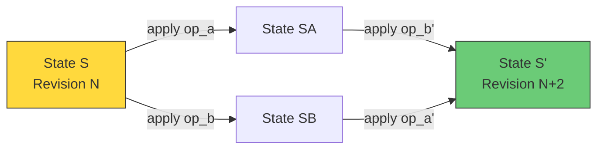

#### Server-Side OT Architecture

Google Docs uses a **centralized server-per-document model**:

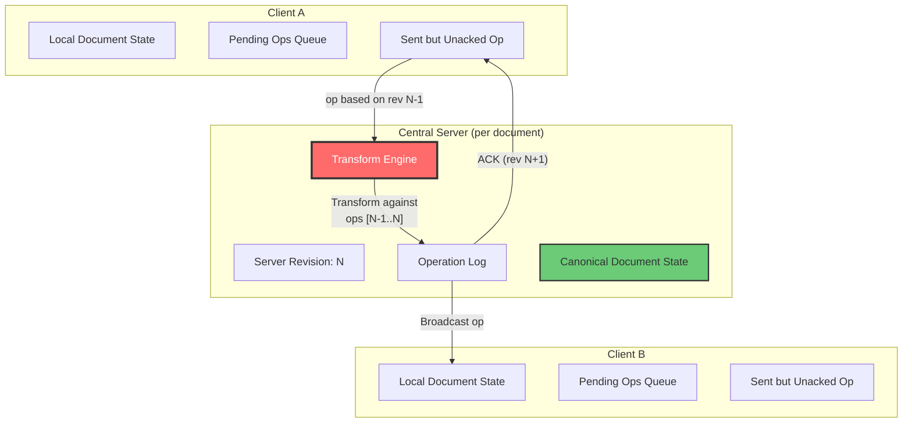

**Critical invariant**: The server processes operations **sequentially** for each
document. This total ordering eliminates the complexity of transforming against
multiple concurrent operations (the "OT puzzle"). Each incoming operation only
needs to be transformed against operations that have been accepted since the
client's last known revision.

#### Client-Side OT State Machine

Each client maintains a state machine that manages the interaction between local
edits and server-confirmed edits:

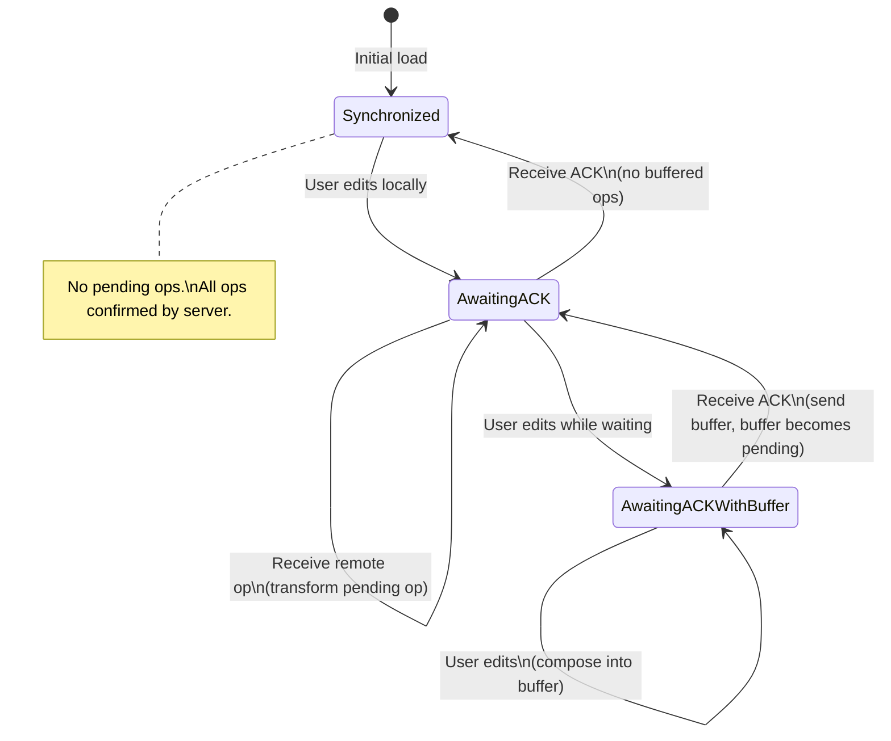

**Three states**:
1. **Synchronized**: No pending operations. Client and server are in agreement.
2. **AwaitingACK**: One operation has been sent to the server, waiting for
   acknowledgment. New user edits are buffered but not sent.
3. **AwaitingACKWithBuffer**: Waiting for ACK and the user has made more edits
   that are buffered locally.

This state machine ensures that only one operation is in flight to the server at
a time. This simplifies the transform logic because the client only needs to
transform its single pending operation against incoming remote operations.

---

### CRDTs: The Alternative Approach

**Conflict-free Replicated Data Types (CRDTs)** take a fundamentally different
approach. Instead of transforming operations, they use data structures that
are **mathematically guaranteed to converge** when the same set of operations
are applied in any order.

#### How Text CRDTs Work (e.g., Yjs, Automerge)

Each character gets a **globally unique, ordered ID** rather than a position index:

```
Document: "CAT"

CRDT representation:
  { id: (UserX, 1), char: 'C', after: ROOT }
  { id: (UserX, 2), char: 'A', after: (UserX, 1) }
  { id: (UserX, 3), char: 'T', after: (UserX, 2) }

User A inserts "O" after 'C':
  { id: (UserA, 1), char: 'O', after: (UserX, 1) }
  -- "O" comes after "C" regardless of what anyone else does

User B inserts "S" after 'T':
  { id: (UserB, 1), char: 'S', after: (UserX, 3) }
  -- "S" comes after "T" regardless of what anyone else does
```

Because each character's position is defined by **which character it follows** (not
by an integer index), inserts and deletes by other users never invalidate the
operation. Both operations can be applied in any order and the result is always
"COATS".

#### CRDT Internal Structure

Under the hood, a text CRDT like Yjs maintains a doubly-linked list of character
items. Here is a simplified view:

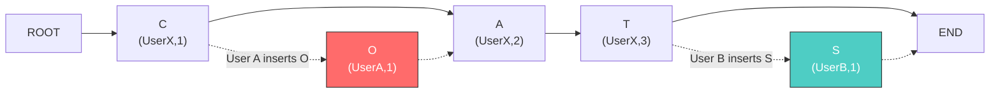

After both inserts, the linked list is: ROOT -> C -> O -> A -> T -> S -> END,
which renders as "COATS".

#### CRDT Advantages

| Advantage | Explanation |
|-----------|-------------|
| **No central server needed** | Peers can sync directly (P2P) |
| **No transform function** | Convergence is a property of the data structure itself |
| **Offline-first by design** | Long offline sessions merge cleanly |
| **Simpler correctness proof** | Mathematical guarantee vs. OT's complex transform proofs |
| **Better for P2P** | No single point of serialization needed |

#### CRDT Disadvantages

| Disadvantage | Explanation |
|--------------|-------------|
| **Metadata overhead** | Each character carries a unique ID (user_id + counter). A 10KB document might have 50KB+ of CRDT metadata. |
| **Tombstones** | Deleted characters are marked deleted but not removed (needed for ordering). Requires garbage collection. |
| **Memory usage** | 2-5x higher than OT for equivalent documents |
| **Intent preservation** | Harder to preserve user intent for complex operations (e.g., "move paragraph" vs. "delete + insert") |
| **Undo complexity** | Undo requires carefully inverting operations while respecting other users' concurrent edits |
| **Maturity** | OT has 35+ years of production deployment; text CRDTs are newer |

---

### OT vs CRDT: Detailed Comparison and Why We Choose OT

| Criterion | OT | CRDT | Winner |
|-----------|-----|------|--------|
| **Production track record** | Google Docs since 2006 | Figma (not text), some newer editors | OT |
| **Server-centric architecture** | Natural fit (central server transforms) | Requires adaptation for client-server | OT |
| **Memory efficiency** | Only the operation + document | Metadata per character + tombstones | OT |
| **Bandwidth efficiency** | Small operations (retain/insert/delete) | Must transmit CRDT IDs + structure | OT |
| **Operational semantics** | Rich: retain, insert, delete, format | Insert/delete only (formatting is complex) | OT |
| **Offline support** | Harder (must transform against missed ops) | Easier (merge by design) | CRDT |
| **P2P support** | Requires central server | Native | CRDT |
| **Correctness** | Hard to prove (many edge cases) | Mathematically proven | CRDT |
| **Garbage collection** | Not needed (ops are ephemeral) | Required (tombstones accumulate) | OT |
| **Undo/redo** | Straightforward (invert + transform) | Complex (must not break convergence) | OT |
| **Rich text formatting** | Native (format ops in OT pipeline) | Bolt-on (separate layer, harder to merge) | OT |

#### When to Choose CRDTs Instead

CRDTs are the better choice when:
- The application is **peer-to-peer** (no central server)
- **Offline-first** is the primary mode (e.g., local-first note apps like Obsidian)
- The data model is **spatial** rather than sequential (e.g., Figma's canvas)
- **Eventual consistency** is sufficient (no need for immediate convergence)
- The team has access to mature CRDT libraries (Yjs, Automerge)

#### Memory Overhead Comparison

```
Document: 10,000 characters of text

OT representation:
  - Current document text: 10KB
  - In-flight operations: ~200 bytes each, typically 0-3 in flight
  - Total: ~10KB

CRDT representation (Yjs):
  - Character items: 10,000 items x 24 bytes each = 240KB
  - Deleted tombstones (for a document with editing history): ~50KB
  - ID-to-item lookup table: ~100KB
  - Total: ~400KB (40x larger than OT)
```

For a single document this does not matter. At 10M concurrent documents, the
difference is 100GB (OT) vs 4TB (CRDT) of in-memory state. This significantly
impacts infrastructure costs.

**Our choice: OT**, for these reasons:

1. **Google Docs literally uses OT** -- it is battle-tested at Google scale
2. **We have a central server anyway** -- OT's requirement for a central serialization
   point is not a drawback when we already need one for persistence, permissions, etc.
3. **Memory and bandwidth efficiency matter** at 30M concurrent users
4. **Rich text operations** (bold, heading, table formatting) integrate naturally
   with OT's retain/insert/delete model
5. **Offline support** is achievable with OT (queue operations and transform on reconnect)

> **Interview note**: Mention CRDTs and explain their strengths. State that for a
> centralized service like Google Docs, OT is the better fit, while CRDTs shine
> for P2P tools like local-first software (Figma multiplayer, Apple Notes, etc.).

---

## WebSocket Communication Layer

### Why WebSocket

| Protocol | Latency | Server Push | Overhead per Message | Use Case |
|----------|---------|-------------|---------------------|----------|
| HTTP polling | 1-3s | No (simulated) | Full HTTP headers (~800B) | Not viable for real-time |
| Long polling | 500ms-2s | Simulated | Full HTTP headers | Marginally better |
| SSE | ~100ms | Yes (server only) | Small | One-directional (not enough) |
| **WebSocket** | **< 50ms** | **Yes (bidirectional)** | **2-6 bytes framing** | **Ideal for collaborative editing** |

We need **bidirectional, low-latency, persistent connections**. WebSocket is the
only production-ready choice.

#### Why Not gRPC Streams or WebTransport?

- **gRPC streams**: Good for service-to-service communication but lacks universal
  browser support without a proxy. The grpc-web library exists but adds complexity
  and latency. WebSocket has native browser support everywhere.

- **WebTransport**: A newer protocol built on HTTP/3 and QUIC. Offers advantages
  like multiplexing and unreliable delivery (useful for cursor updates that can be
  lost). However, as of 2025, browser support is not yet universal, and the ecosystem
  is immature. WebTransport is the future but WebSocket is the present.

### Connection Lifecycle

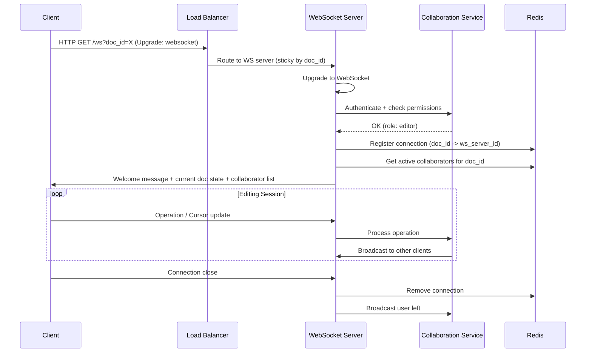

#### Welcome Message Detail

When a client connects, the server sends a welcome message that bootstraps the
editing session:

```
{
  "type": "welcome",
  "doc_id": "doc_abc123",
  "revision": 1047,
  "content": "<full document content at revision 1047>",
  "your_role": "editor",
  "collaborators": [
    {"user_id": "user_1", "name": "Alice", "color": "#FF6B6B", "cursor": 42},
    {"user_id": "user_2", "name": "Bob", "color": "#4ECDC4", "cursor": 130}
  ],
  "comments": [ ... ],
  "unresolved_suggestions": [ ... ]
}
```

This single message gives the client everything it needs to render the document
and show other collaborators immediately on connect.

### Connection Routing Strategy

All clients editing the same document should connect to the **same WebSocket server**
whenever possible. This minimizes inter-server communication:

```
Routing: hash(document_id) % num_ws_servers -> target server
```

The load balancer uses the `doc_id` query parameter for sticky routing. If a server
goes down, clients reconnect and a new server takes over. The operation log
is the source of truth, so no state is lost.

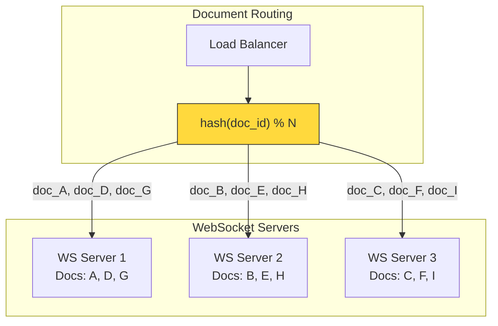

#### What Happens When Users for the Same Document Land on Different Servers

In practice, consistent hashing cannot guarantee 100% co-location (e.g., during
scaling events or after a server restart). When two clients for the same document
are on different WebSocket servers, the message bus (Kafka) handles fan-out:

```
User A on WS Server 1 sends operation
  -> Collaboration Service processes and publishes to Kafka topic "doc_abc123"
  -> WS Server 1 receives from Kafka, delivers to User A (ACK)
  -> WS Server 3 also receives from Kafka, delivers to User C on that server
```

This adds ~5ms of latency compared to the co-located case. Acceptable, but we
optimize for co-location to minimize it.

### Heartbeat and Reconnection

```
Client -> Server: ping every 30 seconds
Server -> Client: pong

If no pong received in 10 seconds:
  Client enters "reconnecting" state
  Exponential backoff: 1s, 2s, 4s, 8s, max 30s
  On reconnect: send last known revision
  Server sends missed operations since that revision
```

#### Reconnection Protocol Detail

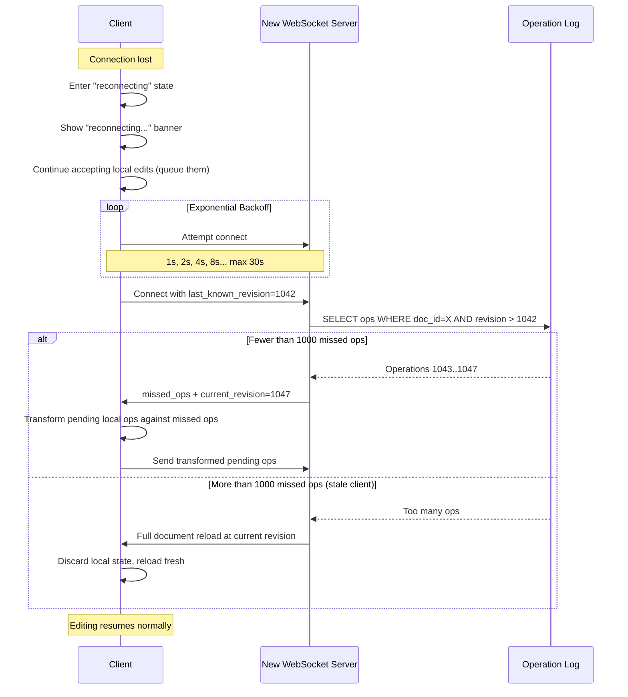

### Message Prioritization

Not all WebSocket messages have equal urgency. The system prioritizes:

```
Priority 1 (Immediate):     Operation ACKs, error messages
Priority 2 (High):          Remote operations (edits from other users)
Priority 3 (Normal):        Cursor/presence updates
Priority 4 (Low):           Comment notifications, permission changes

On network congestion:
  - Priority 1-2 messages are never dropped
  - Priority 3 messages can be coalesced (latest cursor position wins)
  - Priority 4 messages can be delayed up to 5 seconds
```

---

## Document Storage Architecture

### Three-Tier Storage Design

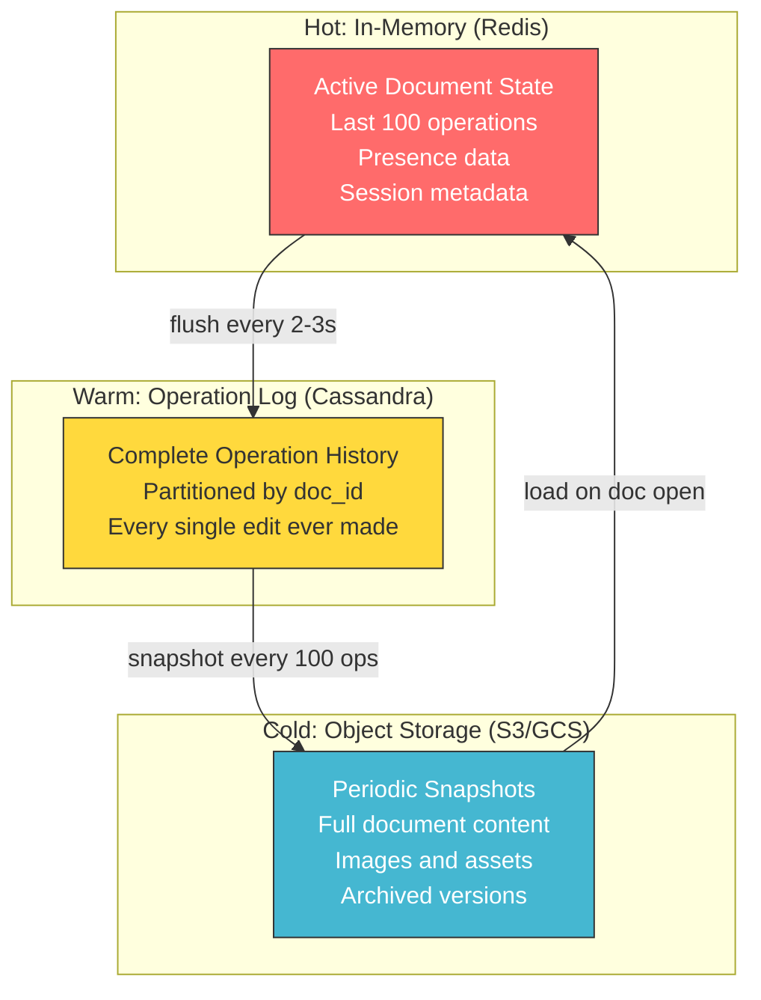

#### Tier Details

| Tier | Technology | Data | Latency | Capacity | Lifetime |
|------|-----------|------|---------|----------|----------|
| **Hot** | Redis Cluster | Active doc state, pending ops, presence | < 1ms | ~500GB total | While doc is open (+ 10 min grace) |
| **Warm** | Cassandra / Bigtable | Complete operation log | 5-15ms | ~900TB/year | Forever (immutable append) |
| **Cold** | S3 / GCS | Snapshots, images, old versions | 50-200ms | Unlimited | Forever (lifecycle to Glacier for old) |

#### Data Flow Between Tiers

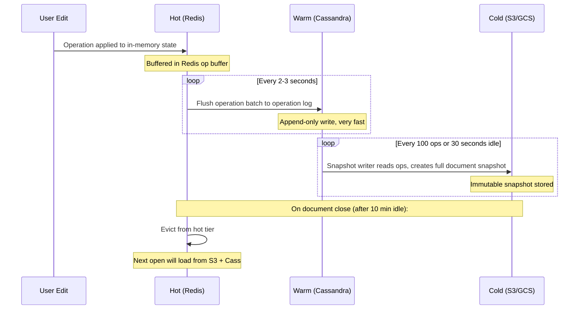

### How Document Loading Works

```
1. User opens document X

2. Load latest snapshot from Object Storage:
   GET s3://document-snapshots/{doc_id}/snapshot_{latest_rev}.json
   -> Document content at revision 1000

3. Load operations since snapshot from Operation Log:
   SELECT * FROM operation_log
   WHERE document_id = X AND revision > 1000
   -> Operations 1001, 1002, ..., 1047

4. Apply operations sequentially to snapshot:
   state = apply(snapshot, ops[1001..1047])
   -> Current document state at revision 1047

5. Cache in Redis for fast access during editing session

6. Send to client over WebSocket
```

#### Loading Time Analysis

```
Step 2 (S3 read):              50-100ms for a 25KB snapshot
Step 3 (Cassandra read):       5-15ms for 47 operations
Step 4 (apply operations):     < 1ms (47 small ops on a 25KB doc)
Step 5 (Redis write):          < 1ms
Step 6 (WebSocket send):       10-50ms (network latency)

Total: 70-170ms for a typical document
Target: < 1 second -- easily met
```

For large documents (750 pages, 1.5M characters) with many operations since the
last snapshot, step 4 might take 10-50ms. Still well within the 1-second target.

### Why Not Store the Full Document on Every Edit

At 580K edits/second globally, writing a full 25KB document per edit would mean
580K x 25KB = 14.5GB/second of writes. Completely impractical.

Instead:
- **Operation log**: ~50 bytes per edit = 580K x 50B = 29MB/second. Very manageable.
- **Snapshots**: Full document written only every 100 operations or 30 seconds of
  inactivity. This compresses the read path (never need to replay more than 100 ops).

### Snapshot Strategy

Snapshots serve two purposes:
1. **Fast document loading**: Load snapshot + replay a small number of ops, instead
   of replaying the entire operation history from the beginning.
2. **Version history**: Each snapshot is a named point-in-time that users can view
   and restore.

```
Snapshot triggers:
  1. Every 100 operations on a document
  2. After 30 seconds of inactivity (no new ops)
  3. When a user explicitly names a version
  4. When a user restores a previous version

Snapshot retention:
  - Last 30 days of auto-snapshots: kept at full granularity
  - 30 days to 1 year: keep 1 snapshot per hour
  - 1 year+: keep 1 snapshot per day
  - Named versions: kept forever
  - This is configurable per organization (enterprise feature)
```

---

## Permission Model

### Role Hierarchy

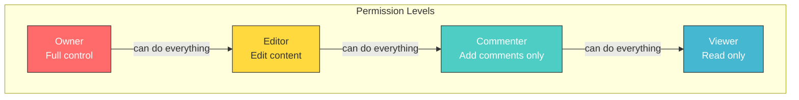

### Permission Matrix

| Action | Owner | Editor | Commenter | Viewer |
|--------|-------|--------|-----------|--------|
| View document | Yes | Yes | Yes | Yes |
| Edit document content | Yes | Yes | No | No |
| Add/resolve comments | Yes | Yes | Yes | No |
| Suggest edits | Yes | Yes | Yes | No |
| View version history | Yes | Yes | Yes | Yes |
| Restore versions | Yes | Yes | No | No |
| Share with others | Yes | Configurable | No | No |
| Change permissions | Yes | No | No | No |
| Delete document | Yes | No | No | No |
| Transfer ownership | Yes | No | No | No |

### Sharing Mechanisms

```
1. Direct sharing:
   - By email: add specific users with a role
   - By group: add Google Groups / organization units

2. Link sharing:
   - "Anyone with the link" can view/comment/edit
   - "Anyone in organization" can view/comment/edit
   - Link can be disabled (only explicitly shared users)

3. Inheritance:
   - Documents in shared Google Drive folders inherit folder permissions
   - Explicit document permissions override inherited ones
```

#### Permission Resolution Order

When multiple permission sources grant different access levels, the system resolves
to the **highest** applicable role:

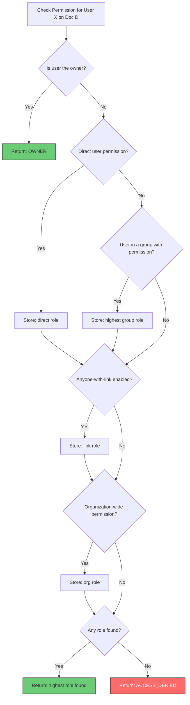

### Permission Check Flow

```
check_permission(user_id, document_id, required_role):
  1. Check Redis cache first (key: perm:{doc_id}:{user_id}, TTL: 5 min)
  2. If cache miss, query PostgreSQL:
     a. Is user the owner? -> return OWNER
     b. Is there a direct user permission? -> return that role
     c. Is user in any group with permission? -> return highest role
     d. Is there a "anyone with link" permission? -> return that role
     e. Is there an organization-wide permission? -> return that role
  3. Cache result in Redis
  4. Compare user's effective role against required_role
```

#### Permission Caching Strategy

Permissions are checked on every WebSocket message (every operation, every cursor
update). At 10M messages/second, querying PostgreSQL for each would be disastrous.

```
Cache strategy:
  - Cache key: perm:{doc_id}:{user_id}
  - Cache value: {role: "editor", expires_at: timestamp}
  - TTL: 5 minutes
  - Invalidation: On any permission change for the document,
    publish invalidation event to all WS servers via Kafka.
    Each WS server deletes relevant cache entries.
  - Consistency trade-off: A user whose access was revoked may
    retain access for up to 5 minutes (or until the invalidation
    event propagates, typically < 1 second).
```

### Permission Enforcement in WebSocket

```
On WebSocket connection:
  - Check permission for document (must be >= viewer)
  - Set connection metadata: { role: "editor" }

On incoming operation:
  - If role < editor: reject operation, send error
  - If role == commenter: only allow comment operations

On permission change:
  - Push "permission_changed" event over WebSocket
  - If user was downgraded below viewer: force disconnect
  - If user was upgraded: client refreshes capability flags
```

---

## Comments and Suggestions

### Comment Anchoring Challenge

Comments are anchored to text ranges, but those ranges shift as the document is
edited. This is another OT-like problem.

```
Comment C1: anchored to "the quick brown fox" at positions [4, 23]

User deletes "quick " (6 chars at position 4):
  Document: "the brown fox"
  C1 anchor must update to [4, 17]

User inserts "very " before "brown":
  Document: "the very brown fox"
  C1 anchor must update to [4, 22]
```

### Implementation

```
Comment anchors are stored as (start_pos, end_pos, revision).

When operations are applied to the document, comment anchors are
transformed using the same OT logic as cursor positions:

transform_anchor(anchor, operation):
  new_start = transform_position(anchor.start, operation)
  new_end = transform_position(anchor.end, operation)
  return (new_start, new_end)

If the anchored text is completely deleted:
  Comment becomes "orphaned" -- still visible in comment panel
  but no longer highlights text in the document.
```

#### Comment Architecture

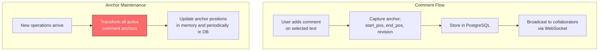

#### Orphaned Comment Handling

When the text a comment is anchored to gets completely deleted:

```
Before: "The quick brown fox jumps over the lazy dog"
         ^-- Comment C1 anchored here: [4, 23] -> "quick brown fox"

After deletion of "quick brown fox ":
  "The jumps over the lazy dog"

C1 anchor: start_pos == end_pos (collapsed range)
  -> Comment is now "orphaned"
  -> Still shown in comment sidebar panel
  -> Yellow indicator: "The text this comment referred to was deleted"
  -> User can dismiss or re-anchor to new text
```

### Suggestion Mode

Suggestions (a.k.a. "track changes") are stored as special operations:

```
{
  "type": "suggestion",
  "id": "sug_abc123",
  "author_id": "user_xyz",
  "original_text": "the quick brown fox",
  "suggested_text": "the slow brown fox",
  "anchor_start": 4,
  "anchor_end": 23,
  "status": "pending"  // pending | accepted | rejected
}
```

When accepted: the suggestion becomes a real operation applied to the document.
When rejected: the suggestion is discarded and the document is unchanged.

#### Suggestion Rendering

Suggestions are rendered inline with the document text, showing both the original
and proposed text with visual differentiation:

```
Rendering rules:
  - pending suggestion: show original with strikethrough + suggested in green
  - accepted: apply the change, remove suggestion markup
  - rejected: remove suggestion markup, keep original text

Multiple overlapping suggestions:
  - Later suggestions on the same range are shown nested
  - Accepting one may invalidate others (their anchors shift)
  - System warns: "Accepting this suggestion may affect 2 other suggestions"
```

---

> **Next**: See [deep-dive-and-scaling.md](./deep-dive-and-scaling.md) for the OT
> deep dive with full transform walkthrough, presence tracking, version history,
> offline editing, scaling strategy, failure recovery, monitoring, and interview tips.
