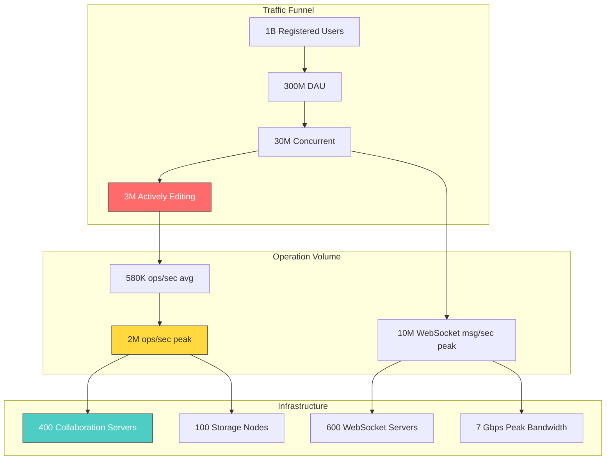
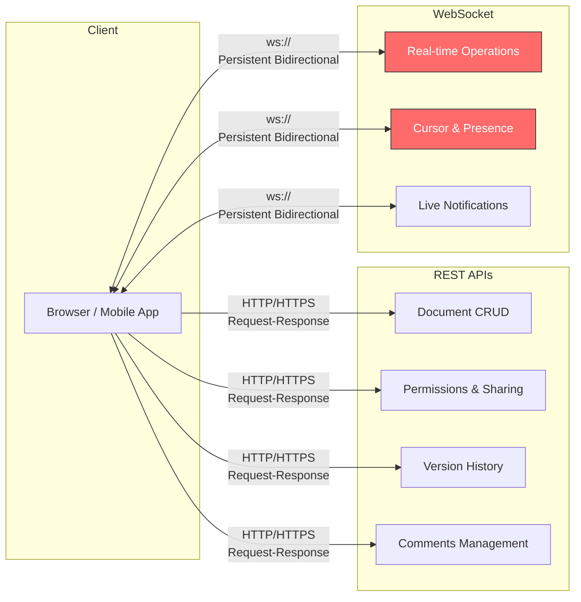
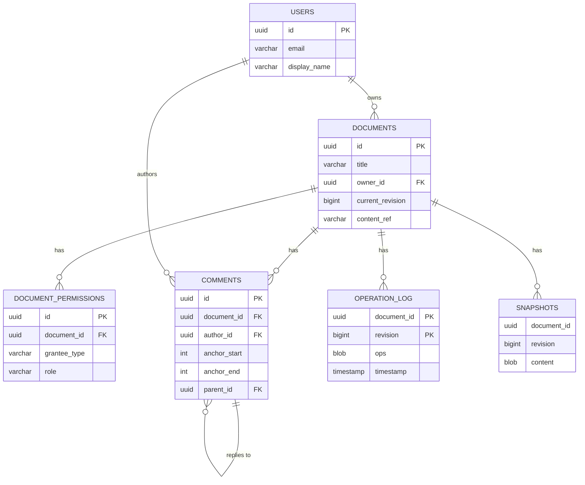

# Design Google Docs -- Requirements, Estimation, and API Design

## Complete System Design Interview Walkthrough (Part 1 of 3)

> This document covers the foundational phase of designing a real-time collaborative
> document editor: gathering requirements, estimating scale, and defining the API
> surface. Parts 2 and 3 cover the high-level architecture and deep dives respectively.

---

## Table of Contents

- [Step 1: Requirements and Scope](#step-1-requirements-and-scope)
  - [Functional Requirements](#functional-requirements)
  - [Non-Functional Requirements](#non-functional-requirements)
  - [Out of Scope](#out-of-scope)
  - [Clarifying Questions to Ask the Interviewer](#clarifying-questions-to-ask-the-interviewer)
- [Step 2: Back-of-Envelope Estimation](#step-2-back-of-envelope-estimation)
  - [User and Traffic Numbers](#user-and-traffic-numbers)
  - [Operation Volume](#operation-volume)
  - [WebSocket Connections](#websocket-connections)
  - [Storage](#storage)
  - [Bandwidth](#bandwidth)
  - [Server Estimates](#server-estimates)
  - [Estimation Summary Diagram](#estimation-summary-diagram)
- [Step 3: API Design](#step-3-api-design)
  - [Why Two Protocols (REST + WebSocket)](#why-two-protocols-rest--websocket)
  - [WebSocket Messages (Real-Time Editing)](#websocket-messages-real-time-editing)
  - [REST APIs (Document Management)](#rest-apis-document-management)
  - [API Design Rationale](#api-design-rationale)
- [Data Model](#data-model)
  - [PostgreSQL: Document Metadata](#postgresql-document-metadata)
  - [Operation Log (Cassandra / Bigtable)](#operation-log-cassandra--bigtable)
  - [Object Storage (S3/GCS): Document Content](#object-storage-s3gcs-document-content)
  - [Data Model Relationships](#data-model-relationships)

---

## Step 1: Requirements and Scope

### Functional Requirements

#### Core Document Operations

| # | Requirement | Description |
|---|-------------|-------------|
| FR-1 | **Create documents** | Users can create new blank documents or from templates |
| FR-2 | **Edit documents** | Rich text editing: formatting, headings, lists, tables, images |
| FR-3 | **Real-time collaboration** | Multiple users edit the same document simultaneously with zero visible lag |
| FR-4 | **Multiple cursors** | Each collaborator's cursor and selection is visible to all others in real time |
| FR-5 | **Version history** | Full revision history; users can view, name, and restore any past version |
| FR-6 | **Comments** | Users can add comments anchored to text ranges, reply in threads, resolve comments |
| FR-7 | **Sharing and permissions** | Owner controls access: viewer, commenter, editor, or owner roles per user or link |
| FR-8 | **Offline editing** | Users can edit documents without internet; changes sync and merge on reconnect |

#### Supporting Features

| # | Requirement | Description |
|---|-------------|-------------|
| FR-9 | **Auto-save** | All changes are saved automatically; no manual save needed |
| FR-10 | **Suggest mode** | Editors can propose changes that owner/editors accept or reject |
| FR-11 | **Search within document** | Full-text search across document content |
| FR-12 | **Document listing** | Users see their documents, shared documents, recent, starred, and trash |

#### Requirement Priority for a 45-Minute Interview

In a time-constrained interview, focus on these requirements in order:

```
Priority 1 (Must cover in depth):
  - Real-time collaboration (FR-3) -- the core differentiator
  - Conflict resolution strategy (OT vs CRDTs)
  - WebSocket communication (transport layer)

Priority 2 (Cover at medium depth):
  - Version history (FR-5) and auto-save (FR-9)
  - Permissions and sharing (FR-7)
  - Offline editing (FR-8)

Priority 3 (Mention, detail if time allows):
  - Comments and suggestions (FR-6, FR-10)
  - Multiple cursors / presence (FR-4)
  - Document listing and search (FR-11, FR-12)
```

### Non-Functional Requirements

#### Performance

| Requirement | Target | Rationale |
|-------------|--------|-----------|
| **Keystroke-to-screen latency** | < 50ms local, < 200ms remote | Must feel like a local editor |
| **Cursor position broadcast** | < 100ms | Collaborators' cursors must track smoothly |
| **Document open time** | < 1s for typical doc (< 50KB) | Users expect instant loading |
| **Conflict resolution** | < 50ms per operation | Transforms must be invisible to users |
| **Auto-save frequency** | Every 2-3 seconds of activity | Minimize data loss window |

#### Why These Latency Targets Matter

The 50ms local latency target is critical. Studies of text editors show that users
perceive input lag above 50ms as sluggishness. At 100ms, it becomes actively
annoying. At 200ms, users begin making errors because they cannot trust the display.

This drives a fundamental architectural choice: **local-first, optimistic application**.
The client must apply every edit immediately to its local copy of the document
without waiting for a server round trip. The server confirms afterward, and if the
server rejects or transforms the operation, the client reconciles silently.

The 200ms remote latency target acknowledges that seeing another user's keystrokes
involves a network round trip. The key here is that each user's own typing feels
instant (< 50ms), while other users' keystrokes appearing on screen can tolerate
a higher but still responsive latency.

#### Availability and Reliability

| Requirement | Target | Rationale |
|-------------|--------|-----------|
| **System availability** | 99.99% (52 min downtime/year) | Primary work tool for millions |
| **Data durability** | 99.9999999% (11 nines) | Documents are irreplaceable user data |
| **Zero data loss** | Every keystroke persisted | No "unsaved changes lost" ever |
| **Consistency** | Strong per-document, eventual cross-document | All collaborators must converge to same state |

#### Consistency Model Explained

The consistency requirement deserves elaboration:

- **Strong consistency per document**: All collaborators editing the same document
  must converge to exactly the same state. If User A sees "Hello World" and User B
  sees "Hello World", that is not strong enough -- they must see the same characters
  at the same positions. The OT algorithm guarantees this (see Part 2).

- **Eventual consistency cross-document**: If User A creates a new document and
  shares it with User B, a small delay (seconds) before User B sees it in their
  document list is acceptable. Document listing, sharing metadata, and search
  indexing can be eventually consistent.

This two-tier consistency model is a deliberate trade-off. Enforcing strong
consistency globally (across all documents and all users) would require distributed
transactions for every operation, which would destroy latency.

#### Scalability

| Requirement | Target | Rationale |
|-------------|--------|-----------|
| **Concurrent documents** | 10M+ documents open simultaneously | Global user base |
| **Collaborators per document** | Up to 100 simultaneous editors | Large team collaboration |
| **Total users** | 1B+ registered users | Google-scale |
| **Document sizes** | Up to 1.5M characters (~750 pages) | Documented Google Docs limit |

### Out of Scope

For a 45-minute interview, explicitly exclude:
- Spreadsheets (Sheets) and presentation (Slides) editors
- Grammar/spell check and AI writing assistance
- Import/export to other formats (Word, PDF)
- Print formatting and pagination
- Add-ons and scripting (Apps Script)
- Detailed rich text formatting engine internals
- Email notifications for comments
- Mobile-specific considerations

> **Mention as extensions**: Sheets/Slides editors, AI writing tools, real-time
> translation, third-party integrations.

### Clarifying Questions to Ask the Interviewer

Before diving into design, ask these to demonstrate thoroughness:

```
1. "Should we focus on the real-time collaboration engine, or the full document
    management system (listing, search, sharing)?"
    -> Most interviewers want the collaboration engine. This narrows scope.

2. "What scale are we targeting? Google Docs scale (billions of users) or a
    smaller SaaS product (millions)?"
    -> Affects estimation and infrastructure choices.

3. "Is offline editing a first-class requirement, or a nice-to-have?"
    -> Affects the choice of OT vs CRDTs and client-side architecture.

4. "Do we need to support very large documents (hundreds of pages), or can
    we assume typical document sizes (1-10 pages)?"
    -> Affects document loading strategy and memory management.

5. "Should we design the rich text formatting engine, or can we treat it
    as a black box and focus on the collaboration protocol?"
    -> Almost always: focus on the protocol.
```

---

## Step 2: Back-of-Envelope Estimation

### User and Traffic Numbers

```
Total registered users:           1B
Daily active users (DAU):         300M
Concurrent users (peak):          30M
Documents created per day:        50M
Average document size:            25KB text content
Average editing session:          15 minutes
Average collaborators per doc:    2.5 (most are 1-2, some are 20+)
```

### Operation Volume

```
Keystrokes per active user:       ~500/session (includes formatting, etc.)
Active editing sessions/day:      100M sessions

Operations per second:
  = 100M sessions/day x 500 ops/session
  = 50B ops/day
  = 50B / 86,400
  ~ 580K operations/second (average)
  ~ 2M operations/second (peak, 3-4x average)
```

#### Breaking Down the 580K ops/sec

Not all operations are equal. Here is the approximate breakdown:

```
Character insert/delete:          70%  (~406K ops/sec)
  - Single character typed or backspaced

Formatting operations:            15%  (~87K ops/sec)
  - Bold, italic, heading changes, list toggles

Paste operations:                 8%   (~46K ops/sec)
  - Bulk inserts (often hundreds of characters in one op)

Structural operations:            5%   (~29K ops/sec)
  - Table edits, image insertions, page breaks

Cursor/selection changes:         (not counted as ops -- sent on a separate channel)

Comment operations:               2%   (~12K ops/sec)
  - Add, reply, resolve comments
```

This distribution matters because paste operations and structural operations are
larger and more complex to transform than single-character edits. The OT engine
must handle the worst case (large paste conflicting with another large paste) even
though it is rare.

### WebSocket Connections

```
Concurrent WebSocket connections:  30M (peak)
Messages per connection:           ~1 message/3 seconds (while active)
WebSocket messages per second:     10M messages/second (peak)
```

#### Connection Distribution

Most connections are idle most of the time. The distribution follows a power law:

```
Active editing (keystroke in last 5 seconds):    10%  = 3M connections
Active reading (scrolled/moved in last 60s):     30%  = 9M connections
Idle but connected (tab open, doing other work): 60%  = 18M connections
```

Idle connections consume minimal server resources (just memory for the socket
state, typically 10-50KB per connection). The 3M actively editing connections
generate the majority of the message volume.

### Storage

```
New documents per day:             50M x 25KB = 1.25TB/day raw content
Operation log per day:             50B ops x 50 bytes/op = 2.5TB/day
Version snapshots per day:         500M snapshots x 25KB = 12.5TB/day

Annual storage growth:             ~6PB/year (with compression ~2PB)
```

#### Storage Breakdown by Tier

```
Hot storage (Redis):               ~500GB
  - Active document state for all open docs
  - Presence data (cursors, who is online)
  - Recent operation buffers
  - Permission cache

Warm storage (Cassandra):          ~900TB/year growing
  - Complete operation log for all documents
  - Indexed by (document_id, revision)
  - Retained for the lifetime of the document

Cold storage (S3/GCS):             ~1.5PB/year growing
  - Periodic snapshots (every 100 ops)
  - Named versions created by users
  - Embedded images and assets
  - Compressed and tiered (S3 Glacier for old versions)
```

### Bandwidth

```
Per operation message:             ~100 bytes (type + position + content + metadata)
Inbound (client -> server):        2M ops/sec x 100B = 200MB/s = 1.6Gbps
Outbound (server -> clients):      200MB/s x 2.5 fan-out = 500MB/s = 4Gbps
Cursor/presence updates:           ~1Gbps additional

Total bandwidth:                   ~7Gbps peak
```

#### Why Outbound > Inbound

Every operation from one client must be broadcast to all other collaborators on
the same document. The average fan-out factor of 2.5 reflects that most documents
have 2-3 collaborators. But the distribution is highly skewed:

```
1 collaborator (solo editing):     60% of documents  -> fan-out = 0
2 collaborators:                   25% of documents  -> fan-out = 1
3-5 collaborators:                 10% of documents  -> fan-out = 2-4
6-20 collaborators:                4% of documents   -> fan-out = 5-19
20-100 collaborators:              1% of documents   -> fan-out = 19-99
```

The top 1% of documents generate a disproportionate share of outbound traffic.
This motivates the fan-out server architecture discussed in Part 3.

### Server Estimates

```
WebSocket servers:
  Each handles ~50K concurrent connections
  30M connections / 50K = 600 WebSocket servers

Collaboration servers (OT processing):
  Each handles ~5K ops/sec
  2M ops/sec / 5K = 400 collaboration servers

Document storage:
  Sharded by document_id
  ~100 storage nodes with replication
```

### Estimation Summary Diagram



---

## Step 3: API Design

### Why Two Protocols (REST + WebSocket)

The system uses two distinct communication protocols for different purposes:



**REST** is used for operations that are request-response in nature: creating a
document, listing documents, managing permissions. These are infrequent, stateless,
and cacheable.

**WebSocket** is used for operations that require low-latency, bidirectional,
persistent communication: sending edits, receiving other users' edits, cursor
position updates, live typing indicators. These are frequent, stateful, and
latency-sensitive.

### WebSocket Messages (Real-Time Editing)

```
// Client -> Server: Edit Operation
{
  "type": "operation",
  "doc_id": "doc_abc123",
  "client_id": "client_xyz",
  "revision": 42,                    // Last known server revision
  "ops": [
    {"type": "retain", "count": 5},
    {"type": "insert", "chars": "Hello"},
    {"type": "retain", "count": 100}
  ]
}

// Server -> Client: Operation Acknowledgment
{
  "type": "ack",
  "doc_id": "doc_abc123",
  "revision": 43                     // New server revision
}

// Server -> Client: Remote Operation
{
  "type": "remote_op",
  "doc_id": "doc_abc123",
  "client_id": "client_other",
  "revision": 43,
  "ops": [
    {"type": "retain", "count": 10},
    {"type": "delete", "count": 3},
    {"type": "retain", "count": 92}
  ]
}

// Client -> Server: Cursor Update
{
  "type": "cursor",
  "doc_id": "doc_abc123",
  "client_id": "client_xyz",
  "user_name": "Alice",
  "color": "#FF6B6B",
  "position": 42,
  "selection_end": 50               // null if no selection
}

// Server -> Client: Presence Update (batched)
{
  "type": "presence_batch",
  "doc_id": "doc_abc123",
  "users": [
    {
      "client_id": "client_abc",
      "user_name": "Bob",
      "color": "#4ECDC4",
      "cursor": 87,
      "selection_end": null,
      "is_typing": true
    },
    {
      "client_id": "client_def",
      "user_name": "Carol",
      "color": "#45B7D1",
      "cursor": 200,
      "selection_end": 215,
      "is_typing": false
    }
  ]
}

// Server -> Client: Error
{
  "type": "error",
  "code": "PERMISSION_DENIED",
  "message": "You no longer have edit access to this document"
}

// Client -> Server: Heartbeat
{
  "type": "ping",
  "timestamp": 1712500000
}

// Server -> Client: Heartbeat Response
{
  "type": "pong",
  "timestamp": 1712500000
}
```

#### Message Size Analysis

```
Typical single-character insert:   ~120 bytes
  {type, doc_id, client_id, revision, ops:[retain, insert, retain]}

ACK message:                       ~60 bytes
  {type, doc_id, revision}

Cursor update:                     ~100 bytes
  {type, doc_id, client_id, user_name, color, position, selection_end}

At 580K ops/sec average:
  Inbound: 580K x 120B = ~70MB/s
  Outbound (ACK + broadcast): 580K x (60B + 120B x 1.5 fan-out) = ~140MB/s
```

### REST APIs (Document Management)

```
POST   /api/v1/documents                   -- Create new document
GET    /api/v1/documents/{id}              -- Get document metadata + content
DELETE /api/v1/documents/{id}              -- Move to trash
GET    /api/v1/documents?folder=X&page=N   -- List documents

POST   /api/v1/documents/{id}/share        -- Share with users/link
PUT    /api/v1/documents/{id}/permissions   -- Update permissions
GET    /api/v1/documents/{id}/permissions   -- List who has access

GET    /api/v1/documents/{id}/revisions     -- List version history
GET    /api/v1/documents/{id}/revisions/{r} -- Get specific revision
POST   /api/v1/documents/{id}/revisions/{r}/restore -- Restore to revision

POST   /api/v1/documents/{id}/comments     -- Add comment
GET    /api/v1/documents/{id}/comments     -- List comments
POST   /api/v1/documents/{id}/comments/{c}/replies  -- Reply to comment
PUT    /api/v1/documents/{id}/comments/{c}/resolve   -- Resolve comment
```

#### REST API Details

##### Create Document

```
POST /api/v1/documents

Request:
{
  "title": "My New Document",
  "template_id": "template_meeting_notes",    // optional
  "folder_id": "folder_abc123"                // optional
}

Response: 201 Created
{
  "id": "doc_abc123",
  "title": "My New Document",
  "owner_id": "user_xyz",
  "created_at": "2025-01-15T10:30:00Z",
  "current_revision": 0,
  "websocket_url": "wss://docs.example.com/ws?doc_id=doc_abc123",
  "permissions": {
    "current_user_role": "owner"
  }
}
```

##### Share Document

```
POST /api/v1/documents/{id}/share

Request:
{
  "shares": [
    {"email": "bob@example.com", "role": "editor"},
    {"email": "carol@example.com", "role": "commenter"}
  ],
  "link_sharing": {
    "enabled": true,
    "role": "viewer",
    "scope": "anyone_with_link"     // or "organization"
  },
  "notify": true,
  "message": "Please review this draft"
}

Response: 200 OK
{
  "shares": [
    {"email": "bob@example.com", "role": "editor", "status": "invited"},
    {"email": "carol@example.com", "role": "commenter", "status": "invited"}
  ],
  "link": "https://docs.example.com/d/doc_abc123?share=xKj9mP"
}
```

### API Design Rationale

| Design Choice | Rationale |
|---------------|-----------|
| **Separate ops from cursor updates** | Ops require guaranteed delivery and ordering; cursor updates are fire-and-forget (missing one is fine, next one corrects) |
| **Revision number in every operation** | Enables server to detect stale ops and transform them; this is the foundation of OT |
| **Compound ops (retain/insert/delete arrays)** | A single user action (e.g., "replace selection with new text") becomes one atomic operation, not multiple messages |
| **Batched presence updates** | Sending individual cursor moves for 20 collaborators would flood the client; batching every 100ms reduces message count by 10x |
| **REST for document CRUD** | These operations are infrequent, benefit from HTTP caching, and do not need the overhead of a persistent connection |

---

## Data Model

### PostgreSQL: Document Metadata

```sql
-- Core document table
CREATE TABLE documents (
    id              UUID PRIMARY KEY DEFAULT gen_random_uuid(),
    title           VARCHAR(500) NOT NULL DEFAULT 'Untitled document',
    owner_id        UUID NOT NULL REFERENCES users(id),
    created_at      TIMESTAMP NOT NULL DEFAULT NOW(),
    updated_at      TIMESTAMP NOT NULL DEFAULT NOW(),
    current_revision BIGINT NOT NULL DEFAULT 0,
    content_ref     VARCHAR(500),        -- S3/GCS path to latest snapshot
    size_bytes      BIGINT DEFAULT 0,
    is_deleted      BOOLEAN DEFAULT FALSE,
    deleted_at      TIMESTAMP
);

-- Permission / sharing model
CREATE TABLE document_permissions (
    id              UUID PRIMARY KEY DEFAULT gen_random_uuid(),
    document_id     UUID NOT NULL REFERENCES documents(id),
    grantee_type    VARCHAR(20) NOT NULL, -- 'user', 'group', 'anyone', 'link'
    grantee_id      VARCHAR(200),         -- user_id, group_id, or null for link
    role            VARCHAR(20) NOT NULL,  -- 'owner', 'editor', 'commenter', 'viewer'
    created_at      TIMESTAMP NOT NULL DEFAULT NOW(),
    created_by      UUID REFERENCES users(id),
    UNIQUE (document_id, grantee_type, grantee_id)
);

-- Comment threads anchored to text ranges
CREATE TABLE comments (
    id              UUID PRIMARY KEY DEFAULT gen_random_uuid(),
    document_id     UUID NOT NULL REFERENCES documents(id),
    author_id       UUID NOT NULL REFERENCES users(id),
    anchor_start    INT,                  -- Start position in document
    anchor_end      INT,                  -- End position in document
    anchor_revision BIGINT,              -- Revision when comment was placed
    body            TEXT NOT NULL,
    parent_id       UUID REFERENCES comments(id), -- For replies
    is_resolved     BOOLEAN DEFAULT FALSE,
    resolved_by     UUID REFERENCES users(id),
    created_at      TIMESTAMP NOT NULL DEFAULT NOW()
);

CREATE INDEX idx_doc_permissions ON document_permissions(document_id);
CREATE INDEX idx_comments_doc ON comments(document_id) WHERE NOT is_resolved;
```

### Operation Log (Cassandra / Bigtable)

```
Table: operation_log
  Partition Key: document_id
  Clustering Key: revision (ascending)

  Fields:
    document_id     UUID
    revision        BIGINT
    client_id       VARCHAR
    user_id         UUID
    ops             BLOB          -- Serialized operation array
    timestamp       TIMESTAMP
    checksum        VARCHAR       -- For integrity verification
```

> **Why an append-only log?** Operations are immutable once persisted. We never
> update or delete them. This makes Cassandra/Bigtable ideal -- fast sequential
> writes, fast range reads for rebuilding state.

> **Why Cassandra over PostgreSQL for the operation log?** At 580K ops/sec, we need
> a write-optimized store that can handle massive append throughput. Cassandra's
> LSM-tree storage engine is designed for this. PostgreSQL would require frequent
> vacuuming and would struggle with the write volume. Bigtable is another excellent
> choice if the system runs on GCP (which it likely does for a Google product).

### Object Storage (S3/GCS): Document Content

```
Bucket: document-snapshots/
  Path: /{document_id}/snapshot_{revision}.json
  Content: Full document state at that revision

Bucket: document-content/
  Path: /{document_id}/latest.json
  Content: Current document content (updated on each snapshot)

Bucket: document-assets/
  Path: /{document_id}/images/{asset_id}.{ext}
  Content: Embedded images, charts, etc.
```

### Data Model Relationships



---

> **Next**: See [high-level-design.md](./high-level-design.md) for the system
> architecture, OT vs CRDT analysis, WebSocket layer, storage architecture,
> permissions, and comments.
