# Design a Distributed Cache -- Deep Dive and Scaling

## Table of Contents
- [3.1 Memory Management -- Slab Allocation](#31-memory-management----slab-allocation)
- [3.2 Failure Handling](#32-failure-handling)
- [3.3 Scale-Out Procedure](#33-scale-out-procedure)
- [3.4 The Hot Key Problem](#34-the-hot-key-problem)
- [3.5 Cache Warming](#35-cache-warming)
- [3.6 Cache Stampede Prevention](#36-cache-stampede-prevention)
- [3.7 Monitoring and Observability](#37-monitoring-and-observability)
- [3.8 Comparison -- Our Design vs Redis Cluster vs Memcached](#38-comparison----our-design-vs-redis-cluster-vs-memcached)
- [3.9 Trade-off Analysis](#39-trade-off-analysis)
- [3.10 Interview Tips](#310-interview-tips)

---

## 3.1 Memory Management -- Slab Allocation

### The Fragmentation Problem

Naive `malloc/free` for every cache entry leads to memory fragmentation. After millions
of allocations and deallocations of varying sizes, the heap becomes a Swiss cheese of
small free blocks that cannot satisfy larger requests -- even though total free memory
is sufficient.

```
Fragmented Heap (after millions of malloc/free):

  Memory address →
  [USED 64B][FREE 32B][USED 128B][FREE 16B][USED 64B][FREE 48B][USED 256B][FREE 24B]
                                                                                      
  Total free: 32 + 16 + 48 + 24 = 120 bytes
  But cannot allocate a 100-byte block! (largest contiguous free = 48 bytes)
  
  This is EXTERNAL FRAGMENTATION.
  Over time, usable memory drops even though total free memory looks adequate.
  
  In a 64 GB cache node running for weeks:
    - Fragmentation can waste 20-40% of memory
    - That is 12-25 GB of unusable "holes"
    - Effective capacity drops from 64 GB to 40-50 GB
```

Memcached solved this with **slab allocation**, and our design adopts it.

### Slab Allocator Design

```
Slab Allocator Overview:

Memory is divided into SLAB CLASSES, each storing items of a specific size range.

Slab Class 1: 96 bytes    (items 1-96 bytes)
  +----+----+----+----+----+----+----+----+----+
  | 96B| 96B| 96B| 96B| 96B|USED|USED|USED|FREE|  <- 1 MB page
  +----+----+----+----+----+----+----+----+----+

Slab Class 2: 120 bytes   (items 97-120 bytes)
  +-----+-----+-----+-----+-----+-----+-----+
  |120B |120B |120B |120B |120B |USED |FREE |     <- 1 MB page
  +-----+-----+-----+-----+-----+-----+-----+

Slab Class 3: 152 bytes   (items 121-152 bytes)
  +------+------+------+------+------+
  | 152B | 152B | 152B | USED | FREE |            <- 1 MB page
  +------+------+------+------+------+

  ...

Slab Class 15: 524,288 bytes  (items up to 512 KB)
  +--------------------+--------------------+
  |     524,288 B      |       FREE         |      <- 1 MB page
  +--------------------+--------------------+

Growth factor: each class is 1.25x the previous (96, 120, 152, 192, 240, ...)
```

### Full Slab Class Table

```
Slab Class Table (growth factor = 1.25):

Class | Chunk Size | Items per 1MB Page | Max Item Size
------|------------|--------------------|--------------
   1  |     96 B   |       10,922       |      96 B
   2  |    120 B   |        8,738       |     120 B
   3  |    152 B   |        6,898       |     152 B
   4  |    192 B   |        5,461       |     192 B
   5  |    240 B   |        4,369       |     240 B
   6  |    304 B   |        3,449       |     304 B
   7  |    384 B   |        2,730       |     384 B
   8  |    480 B   |        2,184       |     480 B
   9  |    600 B   |        1,747       |     600 B
  10  |    752 B   |        1,394       |     752 B
  11  |    944 B   |        1,110       |     944 B
  12  |  1,184 B   |          885       |   1,184 B
  13  |  1,480 B   |          708       |   1,480 B
  14  |  1,856 B   |          565       |   1,856 B
  ...
  25  | 17,408 B   |           60       |  17,408 B
  ...
  35  |131,072 B   |            8       | 131,072 B
  ...
  42  |524,288 B   |            2       | 524,288 B

Default: 42 slab classes cover items from 96 bytes to 512 KB.
Items larger than 512 KB are stored in a special "jumbo" class.
```

### Slab Allocation Flow

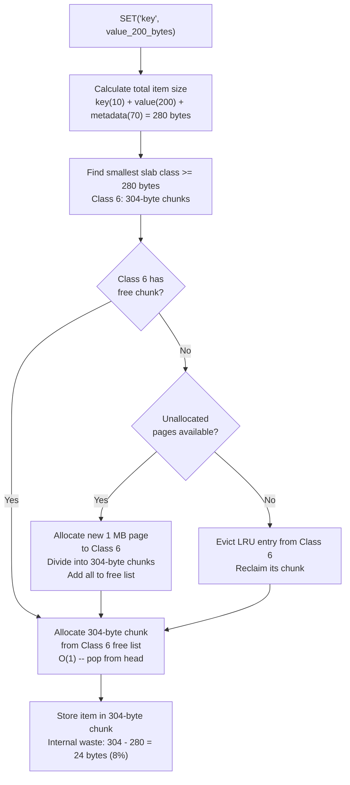

### Internal Fragmentation Analysis

```
Internal fragmentation with slab allocation:

Example item sizes and waste:

  Item = 80 bytes  -> Class 1 (96B chunk)  -> waste = 16 bytes (17%)
  Item = 97 bytes  -> Class 2 (120B chunk) -> waste = 23 bytes (19%)  <- worst case
  Item = 119 bytes -> Class 2 (120B chunk) -> waste = 1 byte  (0.8%) <- best case
  Item = 280 bytes -> Class 6 (304B chunk) -> waste = 24 bytes (8%)
  Item = 600 bytes -> Class 9 (600B chunk) -> waste = 0 bytes (0%)
  
Average internal fragmentation: ~12%
  - Much better than external fragmentation from malloc (20-40%)
  - Predictable and bounded (worst case = growth_factor - 1 = 25%)
  - Can tune growth factor: 1.1x = less waste, more classes; 1.5x = more waste, fewer classes

Comparison at 64 GB node level:
  malloc/free: ~64 GB usable, degrades to ~40 GB over time
  slab alloc:  ~64 GB x 0.88 = ~56 GB usable, stable over time
  Winner:      slab allocation (predictable, no degradation)
```

### Slab Rebalancing

A challenge with slab allocation is that the initial page distribution may not match
the actual workload. If most items are 200 bytes but Class 6 has only a few pages while
Class 1 has many empty pages, memory is wasted.

```
Slab Rebalancing Strategy:

Problem:
  Class 1 (96B):  20 pages allocated, 5% utilization  <- too many pages
  Class 6 (304B): 3 pages allocated, 100% utilization <- starving, evicting frequently

Solution: Slab Automover (Memcached's approach)
  1. Every 10 seconds, check per-class eviction rate
  2. Find the class with the HIGHEST eviction rate (Class 6)
  3. Find the class with the LOWEST utilization (Class 1)
  4. Move 1 page from Class 1 to Class 6:
     a. Evict all items in the Class 1 page (they are LRU anyway)
     b. Reassign the 1 MB page to Class 6
     c. Divide into 304-byte chunks and add to Class 6 free list
  5. Repeat gradually (1 page per 10 seconds) to avoid disruption

This is a background process that gradually adapts memory allocation
to match the actual item size distribution in the workload.
```

---

## 3.2 Failure Handling

### Single Node Failure

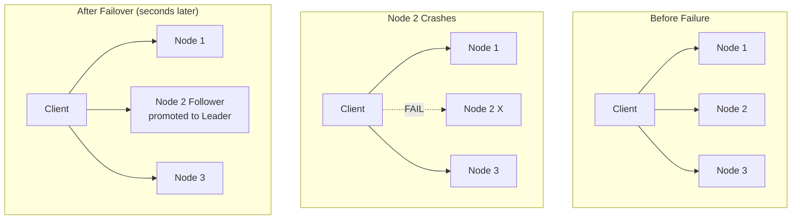

**Step-by-step failover:**

```
1. Node 2 (leader) crashes
   - ZooKeeper detects missing heartbeat (3 missed = 6 seconds)
   - Ephemeral node for Node 2 leader lease is deleted

2. Follower promotion (ZooKeeper-coordinated)
   - Node 2's follower (Node 5) wins leader election
   - Node 5 starts accepting writes for Node 2's partitions
   - Some recent writes may be lost (async replication gap)
     Typical loss: last 1-5ms of writes (~10-50 operations)

3. Client notification
   - ZooKeeper notifies all cache clients of topology change
   - Clients update their local hash ring
   - New requests for Node 2's keys route to Node 5

4. Impact
   - Keys that were on Node 2: served by Node 5 (its follower)
   - No keys from other nodes are affected
   - No rehashing of the entire keyspace
   - Total disruption: 6-10 seconds of elevated miss rate

5. Recovery
   - When Node 2 comes back, it joins as a follower to Node 5
   - Node 5 sends full snapshot + incremental replication to Node 2
   - Admin can manually re-promote Node 2 as leader if desired
```

### Failure Timeline Visualization

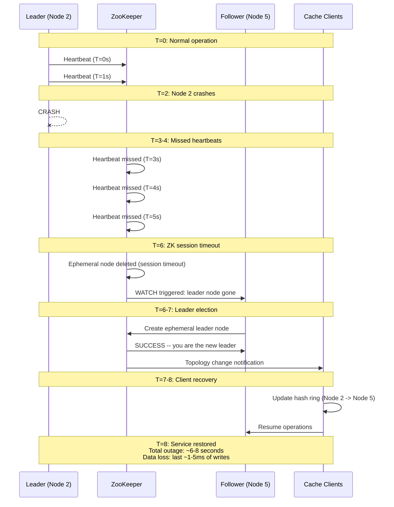

### Multiple Simultaneous Node Failures

```
Scenario: 2 nodes crash simultaneously (rare but possible)

Case 1: Two nodes from DIFFERENT partitions
  - Each partition fails over independently
  - No interaction between failovers
  - Total impact: 2/7 partitions briefly unavailable (2x single failure)

Case 2: Leader AND follower of SAME partition crash
  - Partition is COMPLETELY unavailable (no surviving replica)
  - All keys in that partition are lost
  - Impact: ~1/7 of total keys (14% of data)
  - Mitigation: 
    a. Use replication factor 3 (1 leader + 2 followers)
       Probability of all 3 failing: (MTBF)^-3 = extremely low
    b. Accept temporary miss storm; DB handles the load
    c. Cache warms naturally from cache-aside pattern

Case 3: Cascading failure (one failure causes another)
  - Node 2 dies; its traffic shifts to remaining nodes
  - Remaining nodes each handle 7/6 = 17% more traffic
  - If any node was already near capacity: it may also fail
  - Mitigation: maintain headroom (run at <70% capacity)
```

### Failure Detection: Gossip vs Heartbeat

```
Our design: ZooKeeper-based heartbeat

  Node -> ZK: heartbeat every 1 second
  ZK: session timeout after 3 missed heartbeats (6 seconds)
  ZK -> Clients: watch notification on leader change

Alternative: Gossip protocol (Redis Cluster approach)

  Each node pings random peers every 1 second
  If a node hasn't responded to ANY peer for 5 seconds:
    Peers mark it as "possibly failed" (PFAIL)
  If majority of peers agree on PFAIL:
    Node is marked "failed" (FAIL)
    Failover begins

Comparison:
  ZK-based:  simpler, centralized, depends on ZK availability
  Gossip:    decentralized, no external dependency, more complex
  
  Our choice: ZK-based (simpler, and ZK is already used for config)
```

---

## 3.3 Scale-Out Procedure

### Adding a New Node

```
1. New node (Node 7) starts and registers with ZooKeeper

2. ZooKeeper assigns Node 7 its virtual node positions on the ring

3. Data migration begins:
   - Node 7's vnodes "steal" hash ranges from neighboring nodes
   - Only keys in the stolen ranges need to migrate
   - Migration happens in the background, in small batches

4. During migration (typically 5-30 minutes):
   - Reads for migrating keys: try Node 7 first, fallback to old owner
   - Writes for migrating keys: go to Node 7 (new owner)
   - Old owner forwards cache misses for migrated keys to Node 7

5. Migration complete:
   - ZooKeeper updates cluster topology
   - Clients refresh their ring: Node 7 is fully active
   - No downtime, no cache stampede

Keys redistributed: approximately 1/N of total keys (N = new cluster size)
For a 14-node cluster adding 1 node: ~7% of keys migrate
```

### Migration Bandwidth Throttling

```
Migration bandwidth calculation:

  Keys to migrate: 500M / 15 nodes = ~33M keys
  Average key+value size: 576 bytes
  Total data to migrate: 33M x 576 = ~19 GB
  
  Unthrottled migration at 10 Gbps:
    19 GB / 1.25 GB/sec = ~15 seconds
    BUT: this saturates the network and degrades live traffic!
  
  Throttled migration at 100 MB/sec:
    19 GB / 100 MB/sec = ~190 seconds (~3 minutes)
    Uses ~8% of NIC bandwidth -- imperceptible to live traffic

  Conservative throttle at 50 MB/sec:
    19 GB / 50 MB/sec = ~380 seconds (~6 minutes)
    Uses ~4% of NIC bandwidth

  Our recommendation: 50-100 MB/sec throttle
  Migration completes in 3-6 minutes with negligible impact on live traffic.
```

### Scale-Out Orchestration

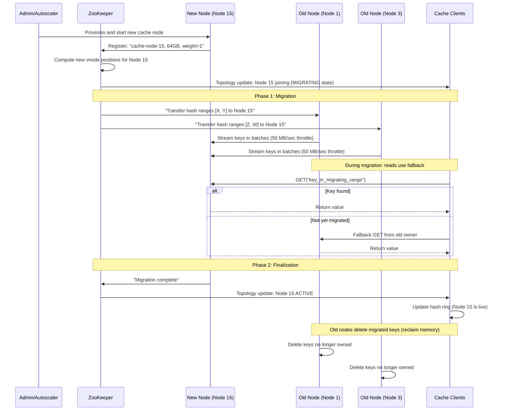

### Horizontal vs Vertical Scaling

```
Current state: 14 nodes, 405 GB data, 350K ops/sec peak

Scenario: Traffic doubles to 700K ops/sec, data grows to 800 GB

Option 1: Add more nodes (horizontal)
  - Need: 800 GB / 64 GB = 13 nodes for data (x2 for replication = 26)
  - Need: 700K / 100K = 7 nodes for throughput
  - Governing: memory -> 26 nodes
  - Action: add 12 nodes, consistent hashing redistributes ~8% of keys per new node
  - Pros: linear scaling, smaller blast radius
  - Cons: more machines to manage

Option 2: Upgrade to larger machines (vertical)
  - Use 128 GB machines instead of 64 GB
  - Need: 800 GB / 128 GB = 7 nodes (x2 = 14 nodes)
  - Assign 2x vnodes to each 128 GB machine (weight=2)
  - Fewer nodes = simpler operations
  - Cons: larger blast radius, harder to replace if one dies

Option 3: Hybrid (recommended)
  - Keep 64 GB nodes for standard partitions
  - Add a few 128 GB nodes for hot partitions (2x vnodes)
  - Best of both: small blast radius for most data,
    extra capacity where needed

Practical limits of a single cache node:
  - Memory: up to 512 GB RAM (beyond this, restart time is too long)
  - CPU: single-threaded event loop saturates at ~300K ops/sec (like Redis)
  - Network: 25 Gbps NIC handles ~3 GB/sec (rarely the bottleneck)
  - Recovery time: 512 GB node takes ~10 minutes to warm after restart

Rule of thumb: 64-128 GB per node is the sweet spot.
  - Fast restart/recovery
  - Reasonable blast radius if one node dies
  - Multiple CPU cores serve multiple clients via I/O multiplexing
```

---

## 3.4 The Hot Key Problem

A "hot key" is a single key accessed disproportionately often (e.g., a viral tweet,
a flash sale product). The cache node owning that key becomes a bottleneck.

### Hot Key Detection

#### Count-Min Sketch (Server-Side)

```
Hot Key Detection using Count-Min Sketch:

A Count-Min Sketch is a probabilistic data structure that estimates
the frequency of events in a stream using sublinear memory.

Structure:
  - d hash functions (typically d=4)
  - w counters per hash function (typically w=4096)
  - Total memory: d * w * 4 bytes = 4 * 4096 * 4 = 64 KB

For each key access:
  1. Compute d hash values: h1(key), h2(key), h3(key), h4(key)
  2. Increment counter[i][h_i(key) % w] for each i
  
To estimate frequency of a key:
  1. Compute d hash values
  2. Return min(counter[i][h_i(key) % w]) for all i
  3. The minimum is the best estimate (others may have collisions)

Properties:
  - Never UNDERcounts (may overcount due to hash collisions)
  - 64 KB tracks millions of keys with ~1% error rate
  - O(1) update and query

Detection algorithm:
  Every 10 seconds:
    1. For each key accessed in this window, estimate frequency
    2. If frequency > threshold (e.g., 1000 ops/sec):
       Report key as "hot" to coordinator / clients
    3. Reset sketch counters for next window
```

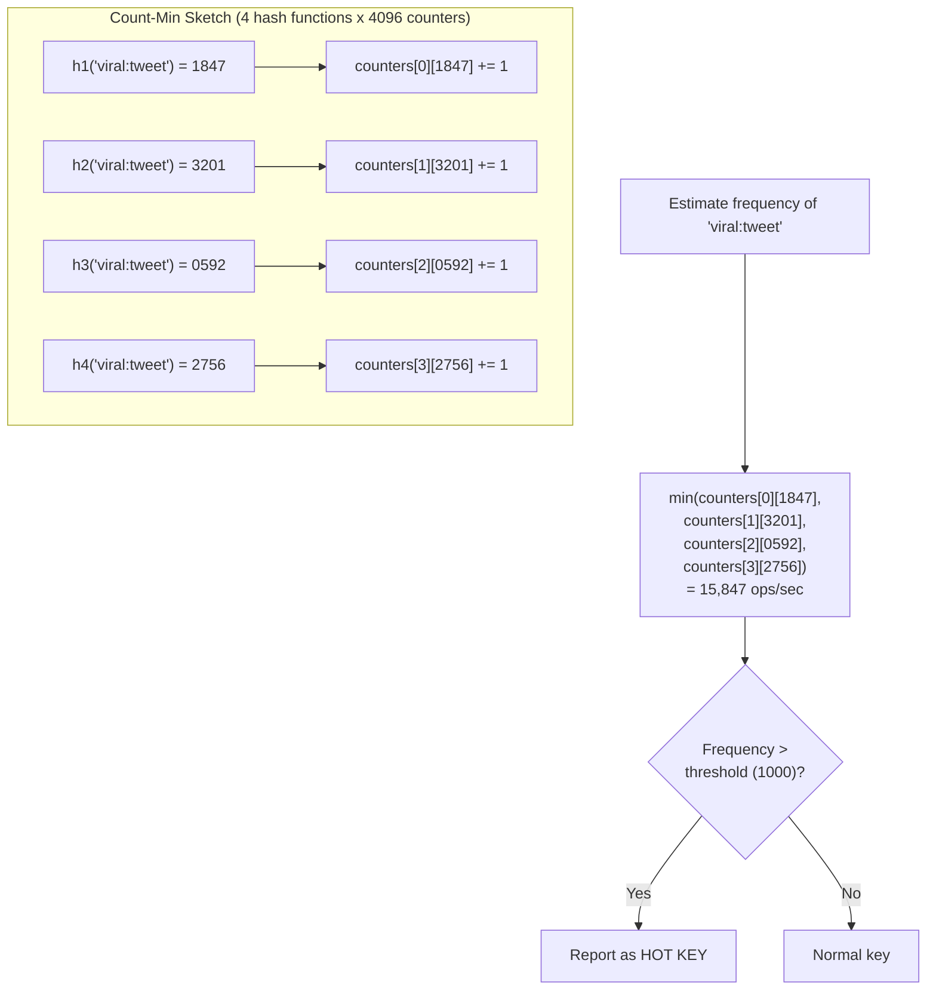

#### Client-Side Detection

```
Client-side hot key detection:

Each client library tracks request distribution across nodes:

  Per-node request count (last 10 seconds):
    Node 1: 14,200 requests
    Node 2: 52,800 requests  <- ANOMALY (3.7x average)
    Node 3: 15,100 requests
    Node 4: 13,900 requests
    
  Average: ~24,000 requests/node
  Node 2 is at 2.2x average -> flag as potential hot key target
  
  Additional signal: track per-KEY request count for top-N keys:
    "product:flash-sale-item":  8,400 requests in 10s -> HOT
    "user:celebrity:12345":     3,200 requests in 10s -> warm
    Other keys:                 < 100 requests each   -> normal
```

### Mitigation: Two-Layer Cache (L1 + L2)

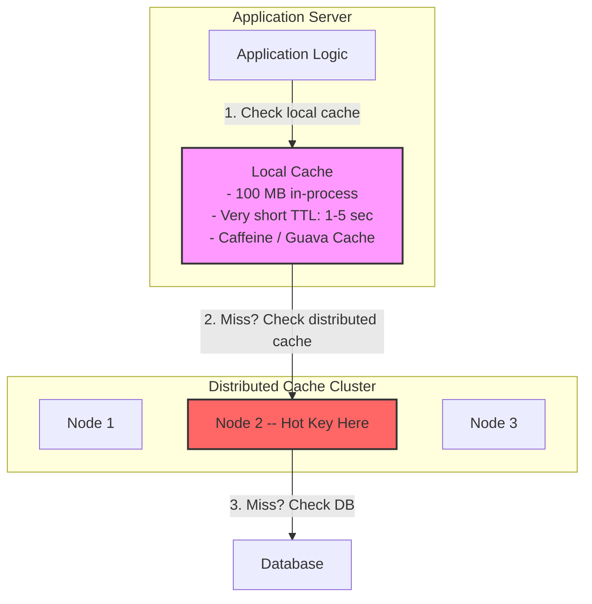

**Strategy 1: Local in-process cache (L1 + L2 cache)**

```
L1: In-process cache (HashMap, 100 MB, TTL = 1-5 seconds)
L2: Distributed cache cluster

Read path:
  1. Check L1 (local) -> hit? Return. (~10 nanoseconds)
  2. Check L2 (distributed) -> hit? Store in L1, return. (~0.3ms)
  3. Check DB -> store in L2 and L1, return. (~5ms)

For hot keys, after the first request fills L1, all subsequent
requests on this app server are served from L1 at memory speed.
With 50 app servers, the hot key is read from L2 once per second
per server instead of thousands of times per second total.

Impact analysis:
  Without L1: 50,000 reads/sec of hot key -> all hit Node 2
  With L1 (TTL=1s): 50 reads/sec of hot key hit Node 2
                     (1 per app server per second)
  Reduction: 1000x less traffic to the hot node

L1 Cache Configuration:
  - Max size: 100 MB (small to avoid excessive memory on each app server)
  - TTL: 1-5 seconds (short to limit staleness)
  - Eviction: LRU (if L1 is full, evict least recently used)
  - Invalidation: TTL-only (no active invalidation from L2)
  - Scope: per-process (not shared between app servers)
```

**Strategy 2: Key replication across multiple nodes**

```
For detected hot keys:
  1. Create N replicas: "user:1001#r1", "user:1001#r2", "user:1001#r3"
  2. These hash to different nodes on the ring
  3. Client randomly picks one of the N replicas to read from
  4. Writes update all N replicas

Effect: hot key load is distributed across N nodes instead of 1
Downside: write amplification, eventual consistency between replicas

Example:
  Hot key: "product:flash-sale-123"
  Replicas: 
    "product:flash-sale-123#r1" -> hashes to Node 2
    "product:flash-sale-123#r2" -> hashes to Node 5
    "product:flash-sale-123#r3" -> hashes to Node 7
  
  On SET: write to all 3 replicas (3x write amplification)
  On GET: randomly pick one of the 3 (load spread evenly)
  
  Throughput: 50K reads/sec distributed as ~17K per node
  vs without replicas: 50K reads/sec on a single node
```

### Hot Key Mitigation Decision Tree

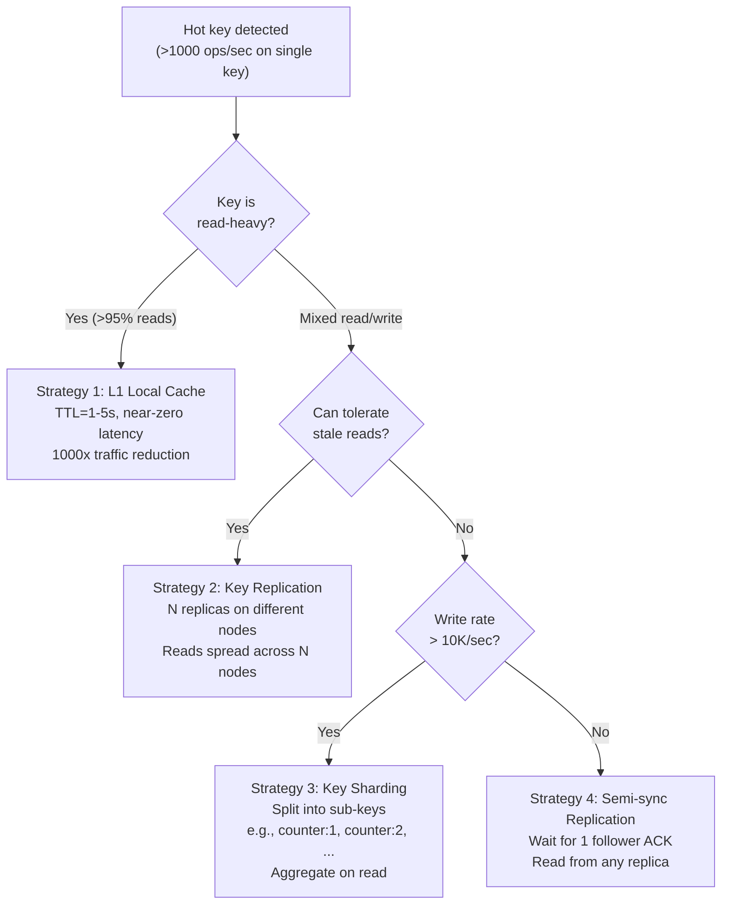

---

## 3.5 Cache Warming

When a new cache cluster starts (or after a major failure), the cache is empty
and every request is a miss, causing a "thundering herd" on the database.

### Warming Strategies

```
Strategy 1: PRELOAD FROM DATABASE (Batch warm)
  - On startup, query DB for most-accessed keys (tracked by analytics)
  - Load top 1M keys into cache before accepting traffic
  - Time: ~5-10 minutes for 1M keys
  - Limitation: requires knowing access patterns in advance
  
  Implementation:
    1. Analytics pipeline tracks top keys by access count (daily)
    2. On cache startup, read warm_keys.txt (top 1M keys)
    3. Batch-query DB for all keys
    4. Bulk-load into cache with appropriate TTLs
    5. Open node to traffic only after preload completes

Strategy 2: SHADOW TRAFFIC (Replay warm)
  - Before cutting over to new cluster, replay production traffic
  - Use traffic mirroring at the load balancer level
  - New cluster populates itself from actual access patterns
  - Time: 30-60 minutes to reach ~90% hit rate
  
  Implementation:
    1. Deploy new cluster alongside old cluster
    2. Load balancer mirrors traffic: sends to both old and new
    3. Old cluster serves responses (clients see no change)
    4. New cluster processes requests (populating its cache)
    5. After 30-60 minutes, cut over: new cluster is warm

Strategy 3: SNAPSHOT RESTORE
  - Periodically dump cache contents to disk (RDB-like snapshot)
  - On restart, load snapshot into memory
  - Data may be slightly stale but prevents cold-start stampede
  - Time: ~2-5 minutes for 50 GB snapshot (SSD read speed)
  
  Implementation:
    1. Background thread dumps in-memory state to SSD every hour
    2. Format: key | value | TTL_remaining | last_access_time
    3. On restart, read snapshot, skip entries whose TTL has expired
    4. Load remaining entries into memory
    5. Accept traffic immediately (warm cache from minute 1)

Strategy 4: GRADUAL ROLLOUT
  - Route 1% of traffic to new cluster, 99% to old
  - Slowly increase: 5%, 10%, 25%, 50%, 100%
  - Cache fills naturally without overloading the DB
  - Time: 1-2 hours for full rollout
  
  Implementation:
    1. Load balancer routes by user-ID hash: 1% -> new cluster
    2. Monitor DB load and cache hit rate
    3. If DB load < threshold: increase traffic to 5%, then 10%...
    4. If DB load spikes: hold at current percentage until stable
    5. After 100% cutover: decommission old cluster
```

### Cache Warming Timeline

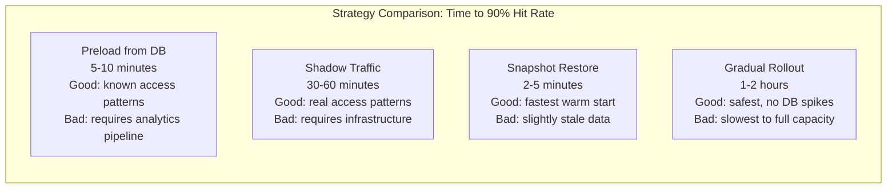

---

## 3.6 Cache Stampede Prevention

A cache stampede (thundering herd) occurs when a popular key expires and many
concurrent requests simultaneously miss the cache and hit the database.

### Request Coalescing

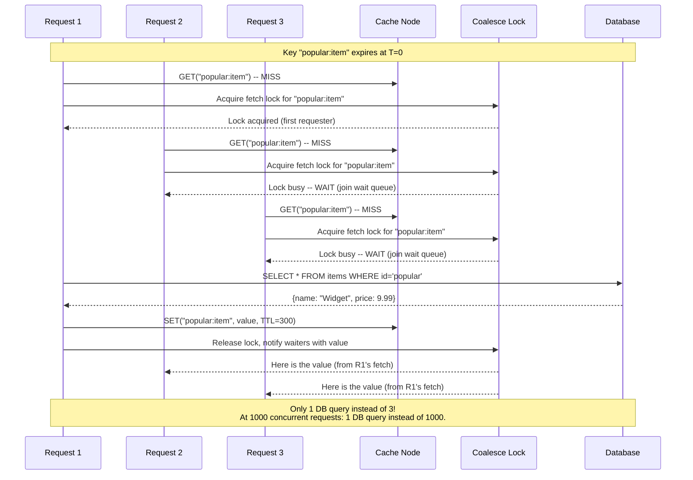

### Probabilistic Early Expiration

```
Probabilistic Early Expiration (PER):

Instead of all clients observing the same expiry time, introduce
a small random window before the actual expiry.

Standard behavior:
  TTL = 300 seconds
  All clients see expiry at exactly T+300
  At T+300: 100+ requests simultaneously miss -> DB stampede

PER behavior:
  TTL = 300 seconds
  Each GET also computes: should_refresh = random() < beta * log(delta)
    where delta = time_since_last_compute / TTL
    and beta = tuning parameter (default 1.0)
  
  At T+298: one client randomly decides "I should refresh"
  That client refreshes the cache BEFORE the actual expiry
  At T+300: all other clients find a fresh value -> NO stampede

  Effect: exactly 1 client refreshes, others see a fresh cache entry
  Trade-off: ~2 extra seconds of cache hits on average (negligible)
```

---

## 3.7 Monitoring and Observability

### Key Metrics Dashboard

```
+-------------------------------------------------------------+
|                    CACHE CLUSTER DASHBOARD                     |
+-------------------------------------------------------------+
|                                                               |
|  Hit Rate        [====================..] 92.3%  <- >95%     |
|  Miss Rate       [====....................]  7.7%             |
|  Eviction Rate   [==.......................]  2.1/sec <- <100 |
|                                                               |
|  Latency (p50)   0.21 ms    (target < 1ms)                  |
|  Latency (p99)   1.83 ms    (target < 5ms)                  |
|  Latency (p999)  8.41 ms    (investigate)                    |
|                                                               |
|  Memory Usage    [================.....] 78.2%  <- Alert 90% |
|  Connections     1,247 / 2,000 max                            |
|  Replication Lag 1.2 ms (max across followers)                |
|                                                               |
|  Throughput: 142,391 ops/sec  (R: 113,913  W: 28,478)       |
|  Network In:  41 MB/sec    Network Out: 62 MB/sec            |
|  Cluster Nodes: 14/14 healthy                                 |
|                                                               |
|  --- Per-Node Breakdown ---                                   |
|  Node 1:  22,341 ops/s  Mem: 81%  Keys: 42.1M  Evict: 0.3/s|
|  Node 2:  18,923 ops/s  Mem: 74%  Keys: 38.7M  Evict: 0.1/s|
|  Node 3:  31,204 ops/s  Mem: 82%  Keys: 43.8M  Evict: 0.8/s|
|  ...                                                          |
|                                                               |
|  ALERTS:                                                      |
|  Node 3: traffic 1.7x average (potential hot key)            |
|  Replication lag on Node 6 follower: 8.3ms (threshold: 10ms) |
+-------------------------------------------------------------+
```

### Critical Alerts

| Alert | Condition | Action |
|-------|-----------|--------|
| Low hit rate | < 85% for 5 minutes | Investigate: wrong TTL? insufficient memory? workload change? |
| High eviction rate | > 100/sec sustained | Add memory or nodes. Entries being evicted before natural expiry. |
| Node unreachable | 3 missed heartbeats | Automatic failover triggers. Page on-call if > 1 node. |
| Memory > 90% | Memory usage > 90% | Pre-eviction alert. Plan capacity increase. |
| High p99 latency | > 10 ms for 1 minute | Check network, GC pauses (if JVM-based), swap usage. |
| Replication lag | > 50 ms | Follower falling behind. Check network or slow follower disk I/O. |
| Connection pool exhaustion | Wait queue > 100 | Increase pool size or add nodes. |
| Cluster split-brain | 2 leaders for same partition | ZooKeeper fencing. Immediately investigate. |

### Monitoring Architecture

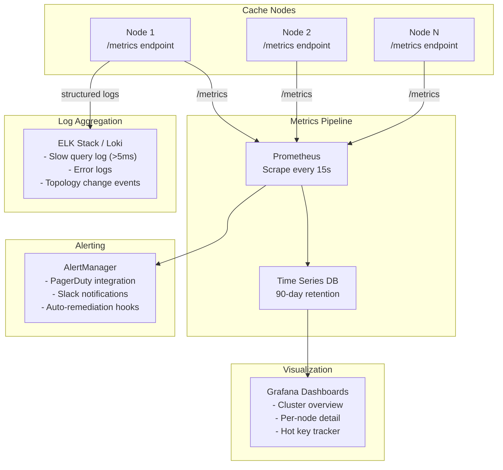

### Key Metric Formulas

```
Hit Rate = hits / (hits + misses) x 100
  Target: > 95%
  Below 85%: investigate immediately
  Below 50%: cache is providing no value (config error?)

Eviction Rate = evictions / time_window
  Target: < 10/sec (steady state)
  > 100/sec: memory pressure, need more capacity
  Sudden spike: large burst of new keys or TTL wave

Memory Efficiency = useful_data / allocated_memory
  With slab allocation: ~88% (12% internal fragmentation)
  Monitor: if < 70%, slab class distribution may need rebalancing

Replication Lag = leader_seq - follower_seq (in milliseconds)
  Target: < 10 ms
  > 50 ms: follower at risk of needing full resync
  > 100 ms: investigate network or follower overload

Throughput Headroom = (max_capacity - current_throughput) / max_capacity
  Target: > 30% headroom
  < 20%: plan scale-out
  < 10%: urgent scale-out needed
```

---

## 3.8 Comparison -- Our Design vs Redis Cluster vs Memcached

| Feature | Our Design | Redis Cluster | Memcached |
|---------|-----------|---------------|-----------|
| **Data partitioning** | Consistent hashing with vnodes | 16,384 hash slots | Consistent hashing (client-side) |
| **Replication** | Leader-follower, async | Leader-follower, async | None (single point of failure) |
| **Failover** | ZooKeeper-based leader election | Gossip protocol + voting | Manual (no built-in HA) |
| **Eviction** | True LRU (DLL + HashMap) | Approximate LRU (sampling) | True LRU per slab class |
| **Data types** | Key-value only (bytes) | Strings, Lists, Sets, Sorted Sets, Hashes, Streams | Key-value only (bytes) |
| **Threading model** | Multi-threaded with I/O threads | Single-threaded + I/O threads (Redis 6+) | Multi-threaded |
| **Memory management** | Slab allocation | jemalloc | Slab allocation |
| **Max value size** | 1 MB (configurable) | 512 MB | 1 MB (default) |
| **Persistence** | None (pure cache) | RDB snapshots, AOF log | None (pure cache) |
| **Protocol** | Custom binary | RESP (text-based) | Binary + text |
| **Pub/Sub** | No | Yes | No |
| **Transactions** | CAS only | MULTI/EXEC, Lua scripts | CAS only |
| **Client routing** | Smart client (client-side ring) | Smart client + MOVED/ASK redirects | Smart client (client-side ring) |
| **Cluster coordination** | ZooKeeper/etcd (external) | Built-in gossip (no external deps) | None (clients manage topology) |
| **Typical use case** | High-throughput caching layer | Caching + data structures + messaging | High-throughput caching layer |

### When to Use What

```
Choose Redis Cluster when:
  - You need rich data structures (sorted sets for leaderboards, lists for queues)
  - You need Pub/Sub or Streams
  - You want persistence as a safety net
  - Your ops team prefers no external dependencies (no ZooKeeper)
  - You need Lua scripting for server-side logic

Choose Memcached when:
  - You need maximum simplicity
  - Multithreaded performance on a single node
  - Your data is purely key-value blobs
  - You are OK with no replication (use multiple independent nodes)
  - You want proven slab allocation memory management

Choose our design (custom) when:
  - You need fine-grained control over consistency/replication trade-offs
  - Your organization has specific requirements not met by off-the-shelf solutions
  - You need to integrate deeply with your service discovery infrastructure
  - You are a hyperscaler (like Facebook's Mcrouter, Twitter's Twemproxy)
  - You need a custom binary protocol for maximum performance

Real-world examples of custom cache systems:
  - Facebook Mcrouter: proxy that routes to Memcached fleet
  - Twitter Twemproxy (nutcracker): proxy for Redis and Memcached
  - Netflix EVCache: wrapper around Memcached with replication
  - Amazon ElastiCache: managed Redis and Memcached
```

### Feature-by-Feature Decision Matrix

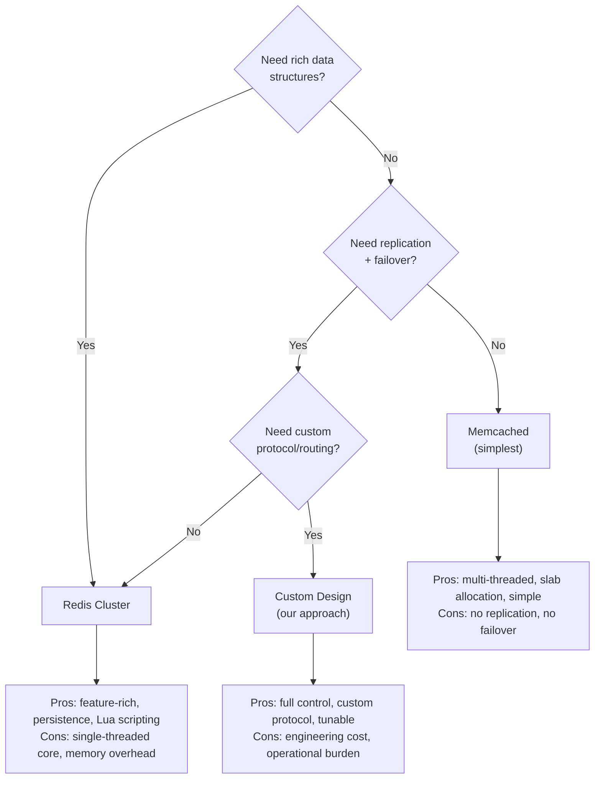

---

## 3.9 Trade-off Analysis

### Consistency vs Performance

```
Our design chooses: PERFORMANCE (AP in CAP terms)

Consequence:
  - A SET followed immediately by a GET on a different app server
    MAY return stale data (if request hits a follower that hasn't
    received the replication yet).
  - Acceptable for caching: the DB is the source of truth.
  - If strong consistency is needed: use synchronous replication
    (SET waits for follower ACK before responding), at the cost
    of ~2x write latency.

Spectrum:
  No consistency          Our design          Strong consistency
  (no replication)    (async replication)    (sync replication)
       |                     |                      |
  Fastest writes       Best trade-off         Slowest writes
  Data loss risk       Low data loss risk     Zero data loss
```

### Memory Efficiency vs Access Speed

```
Approach 1: Raw key-value pairs in HashMap
  - Fast: single pointer dereference
  - Wasteful: each entry has HashMap overhead (~50 bytes in Java)
  - Degrades over time: external fragmentation

Approach 2: Slab allocation (our choice)
  - Slight overhead for slab class lookup
  - Eliminates external fragmentation
  - Predictable memory usage over time
  - ~12% internal fragmentation (acceptable)
  - Allocation/deallocation: O(1)

Approach 3: Compressed values
  - 2-5x memory savings for compressible data
  - CPU cost: ~1 microsecond per decompress
  - Best for values > 1 KB; overhead not worth it for small values
  - Optional: enable per-key or per-prefix
  - Compression algorithms: LZ4 (fast), Snappy (balanced), ZSTD (max ratio)
```

### Eviction Aggressiveness

```
Conservative eviction (low eviction rate):
  + Higher hit rate
  + Less backend load
  - Needs more memory (more nodes)
  - Higher infrastructure cost

Aggressive eviction (tighter memory limit):
  + Fewer nodes, lower cost
  - Lower hit rate
  - More backend queries
  - Risk of cascading failure under load

Our recommendation: maintain ~20% free memory headroom.
  Set maxmemory to 80% of physical RAM.
  The remaining 20% handles traffic spikes and fragmentation.

Cost analysis:
  Conservative (80% memory utilization):
    14 nodes x 64 GB = 896 GB total
    Usable: 896 x 0.80 = 717 GB
    Cost: ~$14K/month (cloud instances)
    Hit rate: ~95%
    DB query savings: ~95% of 350K ops/sec = 332K ops/sec avoided

  Aggressive (95% memory utilization):
    12 nodes x 64 GB = 768 GB total  (2 fewer nodes)
    Usable: 768 x 0.95 = 730 GB
    Cost: ~$12K/month
    Hit rate: ~88% (higher eviction)
    DB query savings: ~88% of 350K ops/sec = 308K ops/sec avoided
    Extra DB load: 24K ops/sec more hitting DB

  The $2K/month savings from aggressive eviction may be offset by:
    - Higher DB costs (more replicas needed)
    - Worse p99 latency (more cache misses)
    - Higher risk during traffic spikes
```

### Replication Factor Trade-offs

```
RF=1 (no replication):
  + Half the nodes (7 instead of 14)
  + No replication lag
  + Simpler operations
  - Node failure = data loss for that partition
  - No failover: cache miss storm until node recovers
  - Use case: non-critical caches where misses are cheap

RF=2 (our default: 1 leader + 1 follower):
  + Survives single node failure
  + Fast failover (~6-10 seconds)
  + Reasonable cost (2x data nodes)
  - Rare case: both leader and follower fail = data loss
  - Use case: most production caches

RF=3 (1 leader + 2 followers):
  + Survives 2 simultaneous node failures
  + Can read from any of 3 replicas (spread read load)
  + Near-zero chance of data loss
  - 3x data storage cost (21 nodes instead of 14)
  - Higher write amplification (each write goes to 3 nodes)
  - Use case: mission-critical caches (session store, rate limiter)
```

---

## 3.10 Interview Tips

### How to Present This in 45 Minutes

```
Minutes 0-5:   Requirements + Estimation (requirements-and-estimation.md)
  - Clarify: "This is a cache, not a database -- no persistence guarantees."
  - Nail the numbers: 350K ops/sec, 405 GB data, 14 nodes.
  - Mention read-heavy: 80:20 read:write ratio.

Minutes 5-12:  High-Level Design (high-level-design.md, Section 2.1-2.2)
  - Draw the architecture: Client -> Client Library -> Hash Ring -> Cache Nodes.
  - Explain the API: GET, SET, DELETE, TTL.
  - Mention the binary protocol for performance.

Minutes 12-30: Deep Dive (high-level-design.md, Sections 2.3-2.9)
  THIS IS WHERE YOU WIN OR LOSE
  - Consistent hashing: explain the ring, virtual nodes, and why.
  - LRU: draw the HashMap + DLL. Explain O(1) operations.
  - Replication: leader-follower, async, replication log.
  - Show you understand the trade-offs at each decision.

Minutes 30-40: Failure Handling + Hot Keys (this file, Sections 3.2-3.4)
  - Node failure -> failover -> only 1/N keys affected.
  - Hot keys -> L1 local cache + key replication.
  - Cache warming strategies.

Minutes 40-45: Monitoring + Extensions
  - Hit rate, eviction rate, p99 latency.
  - "In production, I'd add: multi-datacenter replication,
     compression for large values, TLS for encryption in transit."
```

### Common Follow-Up Questions

**Q: Why not just use Redis?**
A: You often should! This question tests whether you understand what Redis does under
the hood. In an interview, showing you can design it from scratch proves deep understanding.
In practice, Redis Cluster or a managed service like ElastiCache is the right choice for
most teams -- building custom is only justified at hyperscale.

**Q: How do you handle a cache stampede (thundering herd)?**
A: When a popular key expires, hundreds of requests simultaneously miss and hit the DB.
Solutions: (1) Request coalescing -- only one request fetches from DB, others wait.
(2) Probabilistic early expiration -- a key randomly "expires" slightly before its actual
TTL, so one early request repopulates the cache before the stampede.
(3) Lock-based refresh -- the first requester acquires a distributed lock, others get the
stale value while refresh happens.
(See Section 3.6 for implementation details.)

**Q: How does this handle network partitions?**
A: With async replication, a network partition between leader and follower means the
follower falls behind. If the partition also isolates the leader from ZooKeeper, a
new leader is elected. When the partition heals, the old leader discovers it has been
superseded (fencing token via ZooKeeper) and demotes itself to follower. Some writes
during the partition may be lost. For a cache, this is acceptable.

**Q: What about multi-datacenter?**
A: Each datacenter has its own cache cluster. Cross-DC replication uses an asynchronous
invalidation bus: when a key is written in DC-A, an invalidation message is sent to DC-B's
cache, which deletes the key (forcing a local DB read on next access). This avoids
cross-DC replication lag for reads while keeping data eventually consistent.

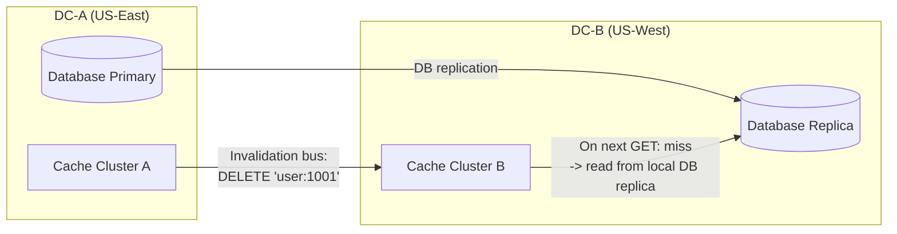

**Q: How is this different from a CDN?**
A: CDNs cache static content (images, CSS, JS) at the network edge close to users.
Our distributed cache stores dynamic application data (user sessions, query results,
computed objects) inside the datacenter close to application servers. They operate at
different layers of the stack and are often used together.

**Q: What if a single key's value is very large (e.g., 10 MB)?**
A: Large values cause multiple problems:
1. Network: 10 MB response takes ~80ms at 1 Gbps (kills latency target)
2. Memory: one entry consumes 0.016% of a 64 GB node
3. Replication: amplifies replication bandwidth
Solutions:
- Set a hard max value size (1 MB default)
- For larger objects: store in object storage (S3), cache only the URL
- Or: compress the value (LZ4 can compress 10 MB to 2 MB in ~1ms)
- Or: chunk the value into multiple keys (complex but works)

**Q: How do you handle the "dogpile" effect during a deployment?**
A: During a rolling deployment, new app server instances have empty L1 caches.
All requests from new instances hit the distributed cache (L2), causing a traffic spike.
Mitigation:
1. Warm L1 cache before routing traffic to new instances
2. Stagger deployment (1 server at a time, with delay)
3. Rate-limit L1 cache-miss-to-L2 queries per server

### Key Concepts Checklist

```
[ ] Consistent hashing with virtual nodes -- data distribution
[ ] LRU eviction -- HashMap + Doubly Linked List, O(1) all operations
[ ] Leader-follower replication -- async for performance
[ ] Cache client library -- smart routing, connection pool, retry
[ ] TTL expiration -- lazy (on access) + active (background sweep)
[ ] Slab allocation -- memory management without fragmentation
[ ] Hot key mitigation -- L1 local cache + key replication
[ ] Count-Min Sketch -- probabilistic hot key detection
[ ] Cache warming -- preload, shadow traffic, gradual rollout
[ ] Cache stampede -- request coalescing, probabilistic early expiration
[ ] Failure handling -- failover, rehash only affected keys
[ ] Monitoring -- hit rate, eviction rate, latency p99
[ ] Trade-offs -- consistency vs performance, memory vs speed
[ ] Comparison -- Redis Cluster vs Memcached vs custom design
```

### Differentiators That Impress Interviewers

```
Level 1 (Expected):
  - Consistent hashing for partitioning
  - LRU for eviction
  - Leader-follower replication

Level 2 (Strong):
  - Virtual nodes for load balance
  - Connection pooling and circuit breaker in client
  - Slab allocation for memory management
  - Lazy + active TTL expiration
  - Back-of-envelope estimation with governing constraint

Level 3 (Outstanding -- gets the offer):
  - Count-Min Sketch for hot key detection
  - Request coalescing for cache stampede prevention
  - Probabilistic early expiration
  - Replication log sizing math
  - Slab rebalancing (automover)
  - L1/L2 cache layering with specific TTL/size tradeoffs
  - Approximate LRU vs true LRU decision framework
  - Multi-datacenter invalidation bus design
  - Failure timeline with specific latency numbers
```

---

*This document covers the deep-dive topics and scaling strategies for the distributed
cache: slab allocation for zero external fragmentation, Count-Min Sketch for hot key
detection, request coalescing for stampede prevention, multi-strategy cache warming, and
comprehensive failure handling. Combined with the requirements (350K ops/sec, 14 nodes)
and architecture (consistent hashing, LRU, async replication), this design delivers
sub-millisecond latency, 99.99% availability, and linear horizontal scaling.*
