# Design a Distributed Cache -- High-Level Design

## Table of Contents
- [2.1 System Architecture Overview](#21-system-architecture-overview)
- [2.2 Core Components](#22-core-components)
- [2.3 Consistent Hashing with Virtual Nodes](#23-consistent-hashing-with-virtual-nodes)
- [2.4 Data Partitioning](#24-data-partitioning)
- [2.5 Eviction Policy -- LRU](#25-eviction-policy----lru)
- [2.6 TTL and Expiration](#26-ttl-and-expiration)
- [2.7 Replication -- Leader-Follower](#27-replication----leader-follower)
- [2.8 Cache Client Library](#28-cache-client-library)
- [2.9 Read and Write Path Sequences](#29-read-and-write-path-sequences)
- [2.10 Complete Architecture Diagram](#210-complete-architecture-diagram)

---

## 2.1 System Architecture Overview

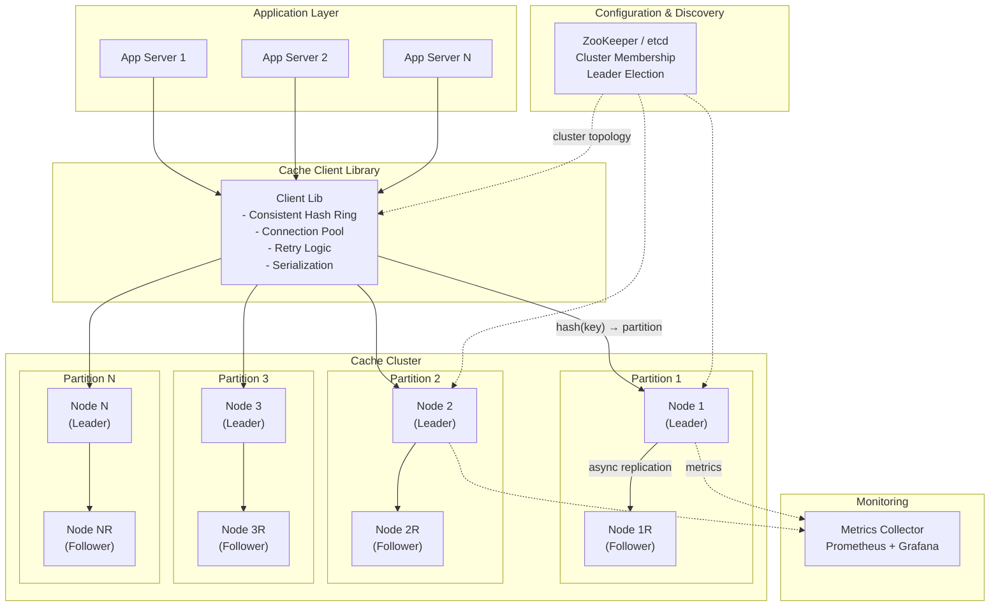
```mermaid
graph TB
    subgraph "Application Layer"
        A1[App Server 1]
        A2[App Server 2]
        A3[App Server N]
    end

    subgraph "Cache Client Library"
        CL1[Client Lib<br/>- Consistent Hash Ring<br/>- Connection Pool<br/>- Retry Logic<br/>- Serialization]
    end

    subgraph "Cache Cluster"
        subgraph "Partition 1"
            N1L["Node 1<br/>(Leader)"]
            N1F["Node 1R<br/>(Follower)"]
        end
        subgraph "Partition 2"
            N2L["Node 2<br/>(Leader)"]
            N2F["Node 2R<br/>(Follower)"]
        end
        subgraph "Partition 3"
            N3L["Node 3<br/>(Leader)"]
            N3F["Node 3R<br/>(Follower)"]
        end
        subgraph "Partition N"
            N4L["Node N<br/>(Leader)"]
            N4F["Node NR<br/>(Follower)"]
        end
    end

    subgraph "Configuration & Discovery"
        ZK[ZooKeeper / etcd<br/>Cluster Membership<br/>Leader Election]
    end

    subgraph "Monitoring"
        MON[Metrics Collector<br/>Prometheus + Grafana]
    end

    A1 --> CL1
    A2 --> CL1
    A3 --> CL1
    CL1 -->|"hash(key) → partition"| N1L
    CL1 --> N2L
    CL1 --> N3L
    CL1 --> N4L
    N1L -->|"async replication"| N1F
    N2L --> N2F
    N3L --> N3F
    N4L --> N4F
    ZK -.->|"cluster topology"| CL1
    ZK -.-> N1L
    ZK -.-> N2L
    N1L -.->|"metrics"| MON
    N2L -.-> MON
```

### Architecture Principles

The architecture follows three guiding principles:

1. **Smart client, dumb server**: The cache client library handles routing, failover, and
   load balancing. Cache nodes are simple key-value stores that do not communicate with
   each other (except for replication). This is the Memcached/Twemproxy philosophy.

2. **Data is partitioned, not replicated globally**: Each key lives on exactly one leader
   node (plus its followers). No key exists on all nodes. This allows linear horizontal
   scaling -- double the nodes, double the capacity.

3. **Failure is handled at the client level**: When a node goes down, the client detects
   it (via ZooKeeper notification or timeout) and reroutes to the follower. The cache
   nodes themselves do not participate in failure detection or consensus.

---

## 2.2 Core Components

| Component | Responsibility | Key Design Decisions |
|-----------|---------------|---------------------|
| **Cache Client Library** | Embedded in each app server. Handles consistent hashing, connection pooling, serialization, retry, and failover. The app never talks directly to cache nodes. | Client-side routing avoids a proxy bottleneck. Library is versioned and deployed with the application. |
| **Cache Node (Leader)** | Stores key-value data in memory. Handles GET/SET/DELETE. Runs eviction policy. Replicates to followers. | Single-threaded event loop for cache operations (like Redis) with I/O threads for network. Avoids locking overhead. |
| **Cache Node (Follower)** | Receives replication stream from leader. Serves read traffic if configured for read replicas. Takes over as leader on failover. | Follower is a hot standby. It applies the same mutations as the leader, maintaining an identical in-memory state. |
| **Configuration Service** | ZooKeeper or etcd. Stores cluster membership, triggers leader election, notifies clients of topology changes. | 3 or 5 ZooKeeper nodes for fault tolerance. Ephemeral nodes for leader leases. Watches for real-time notifications. |
| **Monitoring** | Collects hit rate, eviction rate, memory usage, latency percentiles. Alerts on anomalies. | Prometheus pull-based scraping every 15 seconds. Grafana dashboards. PagerDuty integration for critical alerts. |

### Component Interaction Flow

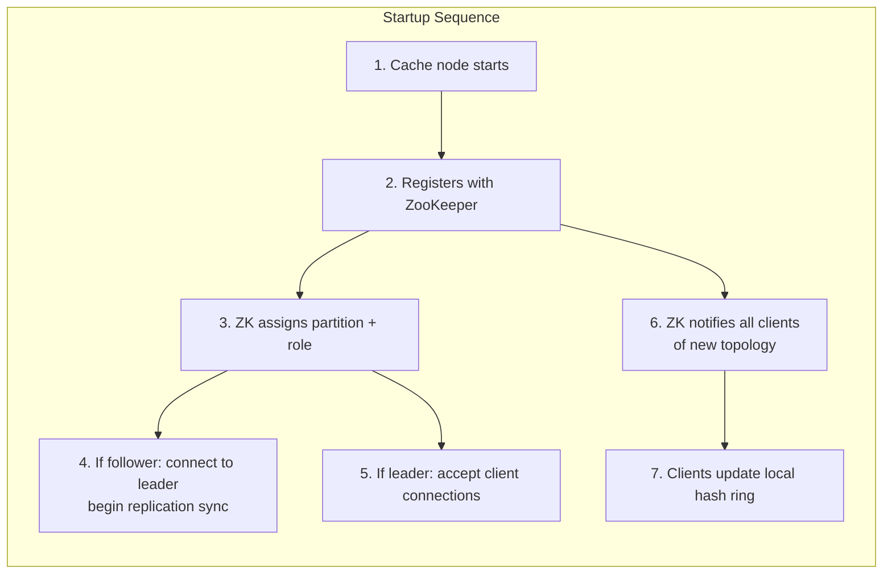
```mermaid
graph LR
    subgraph "Startup Sequence"
        S1["1. Cache node starts"] --> S2["2. Registers with ZooKeeper"]
        S2 --> S3["3. ZK assigns partition + role"]
        S3 --> S4["4. If follower: connect to leader<br/>begin replication sync"]
        S3 --> S5["5. If leader: accept client connections"]
        S2 --> S6["6. ZK notifies all clients<br/>of new topology"]
        S6 --> S7["7. Clients update local hash ring"]
    end
```

---

## 2.3 Consistent Hashing with Virtual Nodes

### Why Not Simple Modular Hashing?

With modular hashing (`hash(key) % N`), adding or removing a node remaps nearly every
key. For a 10-node cluster, adding 1 node remaps ~90% of keys -- causing a **cache stampede**
where the backend database is suddenly hit with millions of requests.

Consistent hashing remaps only `K/N` keys on average (K = total keys, N = nodes).

```
Comparison: Modular Hashing vs Consistent Hashing

Modular hashing (hash(key) % N):
  10 nodes → 11 nodes:  ~90% of keys remap  (catastrophic)
  10 nodes →  9 nodes:  ~90% of keys remap  (catastrophic)

Consistent hashing:
  10 nodes → 11 nodes:  ~9% of keys remap   (only 1/N)
  10 nodes →  9 nodes:  ~11% of keys remap  (only 1/N)

At 500M keys:
  Modular:     450M cache misses on add/remove → DB overload
  Consistent:  ~50M cache misses → manageable spike
```

### The Hash Ring

Consistent hashing maps both nodes and keys onto a circular hash space (0 to 2^32 - 1).
A key is stored on the first node encountered moving clockwise from the key's hash position.

```
                          Hash Ring (0 to 2^32 - 1)
                          
                               0 / 2^32
                                 |
                            _____|_____
                          /      |      \
                        /   Node A (v1)   \
                      /          |          \
                    /            |            \
        Node C (v3) ---- [ THE RING ] ---- Node A (v2)
                    \            |            /
                      \          |          /
                        \  Node B (v1)    /
                          \_____| _____/
                                |
                           Node C (v2)

        Keys landing in arc between Node C (v3) and Node A (v1)
        are stored on Node A (v1).

        Keys landing in arc between Node A (v1) and Node A (v2)
        are stored on Node A (v2).

        ...and so on clockwise.
```

### Virtual Nodes (Vnodes)

A physical node is assigned multiple positions (virtual nodes) on the ring. This solves
two problems:
1. **Load imbalance**: With few physical nodes, the arcs are uneven. 150-200 vnodes per
   physical node produces near-uniform distribution.
2. **Heterogeneous hardware**: A 128 GB machine gets 2x the vnodes of a 64 GB machine,
   receiving proportionally more keys.

```
                           Hash Ring with Virtual Nodes
                           
                                  0
                                  |
                           vA2    |    vB1
                         /        |        \
                       /          |          \
                   vC3            |            vA1       Physical Nodes:
                  |               |               |       A = {vA1, vA2, vA3}
                  |       [Hash Space 0..2^32]    |       B = {vB1, vB2, vB3}
                  |               |               |       C = {vC1, vC2, vC3}
                   vB3            |            vC1
                       \          |          /
                         \        |        /
                           vA3    |    vB2
                                  |
                                2^32
                                
        Key "user:1001" hashes to position 37291...
        Walking clockwise, the first vnode hit is vB1.
        vB1 belongs to physical Node B.
        So "user:1001" is stored on Node B (leader) and replicated to Node B's follower.
```

### How Many Virtual Nodes?

The number of vnodes per physical node is a tuning parameter that balances load
distribution against memory overhead:

| Vnodes per Node | Load Std Dev | Ring Memory | Recommendation |
|----------------|-------------|-------------|----------------|
| 10 | ~15% imbalance | Tiny | Too few -- uneven distribution |
| 50 | ~8% imbalance | Small | Acceptable for small clusters |
| 100 | ~5% imbalance | Moderate | Good for most workloads |
| 150 | ~3% imbalance | Moderate | **Our default** -- near-uniform distribution |
| 500 | ~1.5% imbalance | Large | Diminishing returns; higher ring lookup cost |
| 1000 | ~1% imbalance | Large | Only needed for extreme precision |

At 150 vnodes per node across 14 nodes, the ring has 2,100 entries. Binary search over
2,100 entries takes ~11 comparisons -- negligible at microsecond scale.

### Consistent Hashing -- Implementation

```python
import hashlib
from bisect import bisect_right
from typing import Optional

class ConsistentHashRing:
    """
    Consistent hash ring with virtual nodes.
    Used by the cache client library to route keys to cache nodes.
    
    Design decisions:
      - MD5 for hashing: uniform distribution, widely available
        (in production, prefer xxHash or MurmurHash3 for speed)
      - Sorted list + binary search: O(log V) lookup where V = total vnodes
      - Weight parameter: supports heterogeneous hardware
    """

    def __init__(self, num_vnodes: int = 150):
        self.num_vnodes = num_vnodes      # virtual nodes per physical node
        self.ring: list[int] = []         # sorted list of vnode hash positions
        self.ring_map: dict[int, str] = {}  # hash position -> physical node id
        self.nodes: set[str] = set()      # set of physical node ids

    def _hash(self, key: str) -> int:
        """
        MD5 produces a uniform distribution across the ring.
        We use only the first 4 bytes (32 bits) for the ring position.
        In production, consider xxHash or MurmurHash3 for speed.
        
        Performance:
          MD5:        ~300 ns per hash  (cryptographic, overkill but reliable)
          MurmurHash3: ~25 ns per hash  (non-crypto, ideal for hash rings)
          xxHash:      ~15 ns per hash  (fastest non-crypto hash available)
        """
        digest = hashlib.md5(key.encode()).digest()
        return int.from_bytes(digest[:4], 'big')

    def add_node(self, node_id: str, weight: int = 1) -> list[str]:
        """
        Add a physical node to the ring with `weight * num_vnodes` virtual nodes.
        Returns list of keys that need to be migrated to this new node.
        
        Weight allows heterogeneous hardware:
          - 64 GB machine: weight=1 (150 vnodes)
          - 128 GB machine: weight=2 (300 vnodes)
          
        Time complexity: O(W * V * log(R)) where W=weight, V=num_vnodes, R=ring size
        Called infrequently (only on topology changes).
        """
        self.nodes.add(node_id)
        for i in range(self.num_vnodes * weight):
            vnode_key = f"{node_id}:vnode:{i}"
            h = self._hash(vnode_key)
            self.ring_map[h] = node_id
            self.ring.append(h)
        self.ring.sort()
        return []  # In production: compute affected key ranges

    def remove_node(self, node_id: str) -> None:
        """
        Remove a physical node. Its vnodes are removed from the ring.
        Keys that were on this node now fall to the next clockwise node.
        Only ~1/N of total keys are affected.
        
        Called during planned decommission or after node failure detection.
        """
        self.nodes.discard(node_id)
        to_remove = [h for h, n in self.ring_map.items() if n == node_id]
        for h in to_remove:
            del self.ring_map[h]
            self.ring.remove(h)

    def get_node(self, key: str) -> Optional[str]:
        """
        Given a cache key, determine which physical node owns it.
        
        Algorithm:
          1. Hash the key to a position on the ring
          2. Binary search for the first vnode position >= key's hash
          3. Return the physical node that owns that vnode
          
        Time complexity: O(log V) where V = total vnodes across all nodes
        Called on EVERY cache operation -- must be fast.
        """
        if not self.ring:
            return None

        h = self._hash(key)
        idx = bisect_right(self.ring, h)

        # Wrap around to the first node if we've gone past the end
        if idx == len(self.ring):
            idx = 0

        return self.ring_map[self.ring[idx]]

    def get_nodes_for_replication(self, key: str, replicas: int = 2) -> list[str]:
        """
        Return `replicas` distinct physical nodes for a key.
        The first is the leader; the rest are followers.
        
        Walk clockwise, skipping vnodes belonging to already-selected nodes.
        This ensures replicas are on different physical machines for fault tolerance.
        
        Example with replicas=2:
          Key hashes to vnode belonging to Node-B.
          Walk clockwise: next distinct node is Node-C.
          Return: [Node-B (leader), Node-C (follower)]
        """
        if not self.ring or replicas > len(self.nodes):
            return list(self.nodes)

        h = self._hash(key)
        idx = bisect_right(self.ring, h)
        result = []
        seen = set()

        for i in range(len(self.ring)):
            pos = (idx + i) % len(self.ring)
            node = self.ring_map[self.ring[pos]]
            if node not in seen:
                result.append(node)
                seen.add(node)
                if len(result) == replicas:
                    break

        return result


# --- Usage example ---
ring = ConsistentHashRing(num_vnodes=150)
ring.add_node("cache-node-1", weight=1)
ring.add_node("cache-node-2", weight=1)
ring.add_node("cache-node-3", weight=2)  # Bigger machine gets 2x vnodes

target = ring.get_node("user:session:abc123")
# Returns: "cache-node-2" (deterministic for this key)

replicas = ring.get_nodes_for_replication("user:session:abc123", replicas=2)
# Returns: ["cache-node-2", "cache-node-3"]
#           Leader             Follower
```

### Key Redistribution on Node Addition

When a new node D is added between existing nodes A and C on the ring:

```
BEFORE adding D:                    AFTER adding D:

  A -------- C -------- B            A ---- D ---- C -------- B
  |  keys    |  keys    |            | keys | keys |  keys    |
  | go to C  | go to B  |            | -> D | -> C | go to B  |
                                      ^^^^^^
                                      Only these keys move!
                                      (the arc between A and D)
                                      
  Impact: Only keys in the arc (A, D] are remapped.
  That is approximately 1/N of total keys.
  All other keys stay on their current nodes.
```

### Key Redistribution Visualization

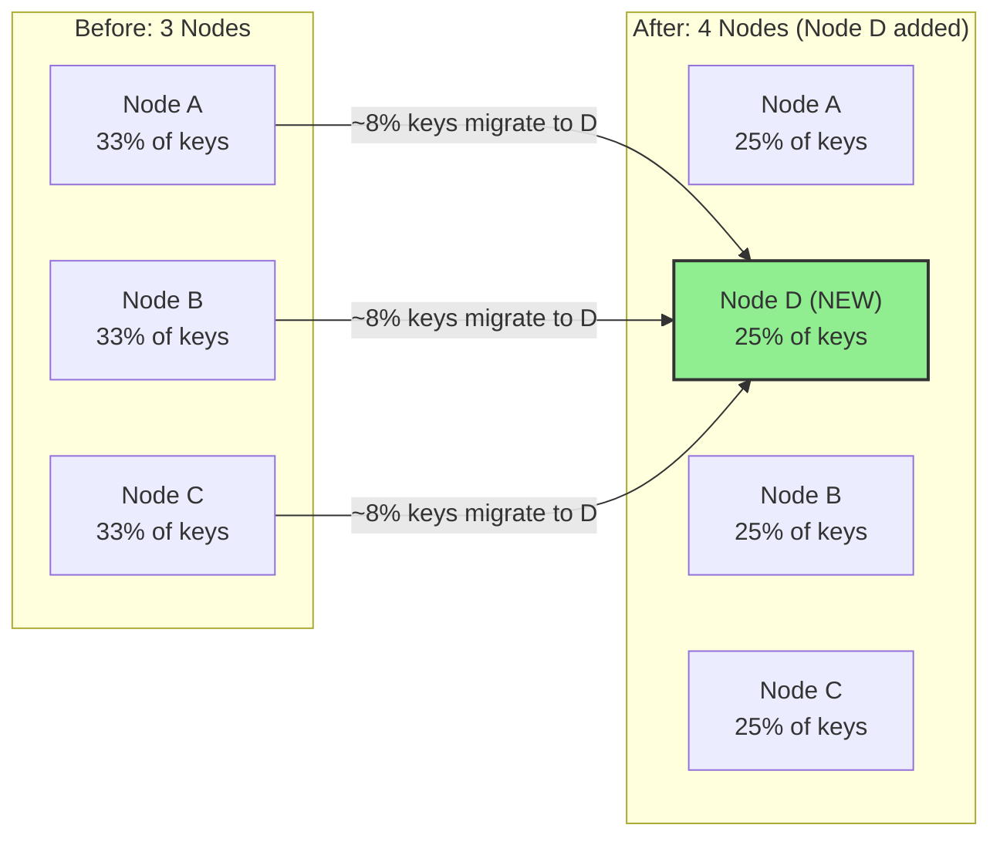
```mermaid
graph LR
    subgraph "Before: 3 Nodes"
        direction LR
        BA["Node A<br/>33% of keys"]
        BB["Node B<br/>33% of keys"]
        BC["Node C<br/>33% of keys"]
    end

    subgraph "After: 4 Nodes (Node D added)"
        direction LR
        AA["Node A<br/>25% of keys"]
        AD["Node D (NEW)<br/>25% of keys"]
        AB["Node B<br/>25% of keys"]
        AC["Node C<br/>25% of keys"]
    end

    BA -->|"~8% keys migrate to D"| AD
    BB -->|"~8% keys migrate to D"| AD
    BC -->|"~8% keys migrate to D"| AD

    style AD fill:#90EE90,stroke:#333,stroke-width:2px
```

---

## 2.4 Data Partitioning

### How Keys Map to Nodes

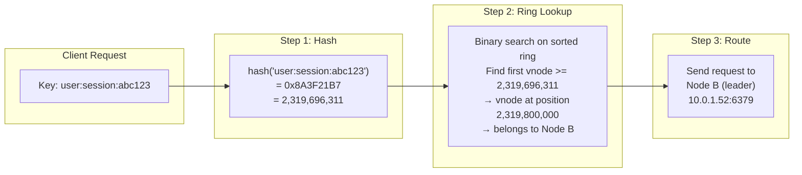
```mermaid
graph LR
    subgraph "Client Request"
        K["Key: user:session:abc123"]
    end

    subgraph "Step 1: Hash"
        H["hash('user:session:abc123')<br/>= 0x8A3F21B7<br/>= 2,319,696,311"]
    end

    subgraph "Step 2: Ring Lookup"
        R["Binary search on sorted ring<br/>Find first vnode >= 2,319,696,311<br/>→ vnode at position 2,319,800,000<br/>→ belongs to Node B"]
    end

    subgraph "Step 3: Route"
        NB["Send request to<br/>Node B (leader)<br/>10.0.1.52:6379"]
    end

    K --> H --> R --> NB
```

### Partitioning Scheme Detail

Each cache node is responsible for a set of hash ranges. The cluster metadata (stored
in ZooKeeper/etcd and cached locally by each client) looks like:

```
Partition Map (simplified, actual map uses vnode positions):

Partition  | Hash Range Start | Hash Range End  | Leader      | Followers
-----------|------------------|-----------------|-------------|----------
  P1       | 0x00000000       | 0x3FFFFFFF      | node-1:6379 | node-4:6379
  P2       | 0x40000000       | 0x7FFFFFFF      | node-2:6379 | node-5:6379
  P3       | 0x80000000       | 0xBFFFFFFF      | node-3:6379 | node-6:6379
  P4       | 0xC0000000       | 0xFFFFFFFF      | node-1:6379 | node-4:6379

Note: In reality with 150 vnodes per node, the map has hundreds of 
non-contiguous ranges per physical node. The client's hash ring 
abstraction handles this transparently.
```

### Hash Slot Approach (Redis Cluster Style)

An alternative to continuous hash ranges is fixed hash slots (Redis uses 16,384 slots):

```
slot = CRC16(key) % 16384

Slot assignments:
  Node 1: slots 0-5460
  Node 2: slots 5461-10922
  Node 3: slots 10923-16383

Rebalancing: move individual slots between nodes.
Advantage: simpler bookkeeping, slot migration is atomic.
Disadvantage: fixed number of slots limits max cluster size.
```

### Comparison: Vnodes vs Hash Slots

| Aspect | Consistent Hashing + Vnodes (our design) | Fixed Hash Slots (Redis) |
|--------|------------------------------------------|--------------------------|
| Max cluster size | Unlimited (no fixed slot count) | Limited by slot count (16,384 for Redis) |
| Heterogeneous HW | Natural via weight parameter | Must manually assign slot ranges |
| Rebalancing | Automatic, proportional to new node count | Manual slot migration between nodes |
| Client complexity | Maintain sorted ring, binary search | Maintain slot-to-node mapping table |
| Metadata size | O(N * V) where V = vnodes per node | O(16384) fixed |
| Key routing | O(log(N*V)) per lookup | O(1) per lookup (array index) |

Our design uses consistent hashing with vnodes because it handles heterogeneous
hardware naturally and does not impose a fixed upper bound on cluster size.

### Partition Ownership During Topology Changes

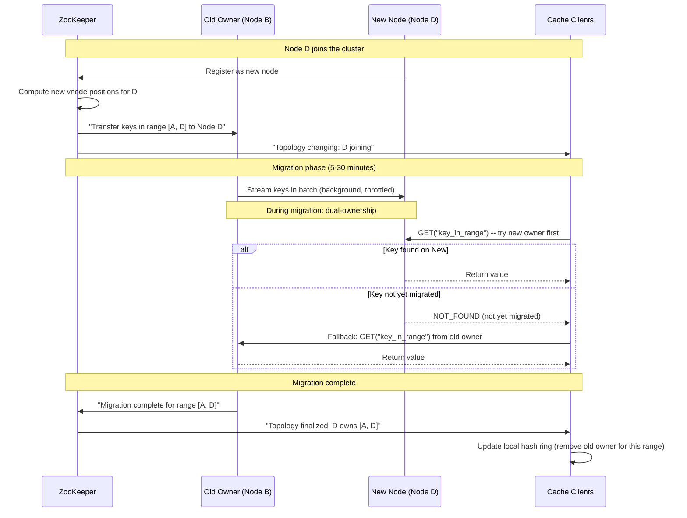
```mermaid
sequenceDiagram
    participant ZK as ZooKeeper
    participant Old as Old Owner (Node B)
    participant New as New Node (Node D)
    participant CL as Cache Clients

    Note over ZK,CL: Node D joins the cluster
    New->>ZK: Register as new node
    ZK->>ZK: Compute new vnode positions for D
    ZK->>Old: "Transfer keys in range [A, D] to Node D"
    ZK->>CL: "Topology changing: D joining"

    Note over ZK,CL: Migration phase (5-30 minutes)
    Old->>New: Stream keys in batch (background, throttled)
    
    Note over Old,New: During migration: dual-ownership
    CL->>New: GET("key_in_range") -- try new owner first
    alt Key found on New
        New-->>CL: Return value
    else Key not yet migrated
        New-->>CL: NOT_FOUND (not yet migrated)
        CL->>Old: Fallback: GET("key_in_range") from old owner
        Old-->>CL: Return value
    end

    Note over ZK,CL: Migration complete
    Old->>ZK: "Migration complete for range [A, D]"
    ZK->>CL: "Topology finalized: D owns [A, D]"
    CL->>CL: Update local hash ring (remove old owner for this range)
```

---

## 2.5 Eviction Policy -- LRU

When a cache node's memory reaches its configured limit, it must evict entries to make
room for new ones. We choose **LRU (Least Recently Used)** as the default policy because
it exploits temporal locality: recently accessed data is likely to be accessed again.

### Why LRU?

| Policy | Description | Pros | Cons |
|--------|-------------|------|------|
| **LRU** | Evict least recently used | Good general-purpose; exploits temporal locality | Extra memory for linked list pointers |
| LFU | Evict least frequently used | Better for skewed access patterns | Stale popular items stay forever; needs aging |
| FIFO | Evict oldest inserted | Simple | Ignores access patterns entirely |
| Random | Evict random entry | No bookkeeping overhead | Unpredictable hit rate |
| TTL-based | Evict nearest-to-expire | Natural for session data | Does not help if TTLs are uniform |

### LRU Data Structure: O(1) GET and O(1) Eviction

The classic LRU implementation combines a **HashMap** for O(1) key lookup with a
**Doubly Linked List** for O(1) recency tracking.

```
HashMap (key -> DLL node pointer)
+------------------+
| "user:1001"  --> |---------+
| "session:xyz" -> |------+  |
| "product:42" --> |---+  |  |
| "config:ab"  --> |-+ |  |  |
+------------------+ | |  |  |
                     | |  |  |
Doubly Linked List   | |  |  |
(most recent = head, least recent = tail)
                     | |  |  |
  HEAD               | |  |  |              TAIL
  +---+    +---+    +---+    +---+    +---+    +---+
  |   |<-->|   |<-->|   |<-->|   |<-->|   |<-->|   |
  | G |    | F |    | E |    | D |    | C |    | B |
  |   |<-->|   |<-->|   |<-->|   |<-->|   |<-->|   |
  +---+    +---+    +---+    +---+    +---+    +---+
    ^                  ^        ^                  ^
    |                  |        |                  |
    Most               |        |               Least
    recently         config  session           recently
    used            :ab      :xyz              used
    (just           (3rd     (4th              (EVICT
     accessed)       recent)  recent)           THIS)
```

### LRU Operations

```
GET("session:xyz"):
  1. HashMap lookup: O(1) -> get pointer to DLL node
  2. Remove node from current position in DLL: O(1)
  3. Insert node at HEAD of DLL: O(1)
  4. Return value
  Total: O(1)

SET("new:key", value):
  1. If key exists: update value, move node to HEAD: O(1)
  2. If key doesn't exist:
     a. If at capacity: remove TAIL node from DLL and HashMap: O(1)
     b. Create new node, insert at HEAD of DLL: O(1)
     c. Add to HashMap: O(1)
  Total: O(1)

DELETE("product:42"):
  1. HashMap lookup: O(1) -> get pointer to DLL node
  2. Remove node from DLL: O(1)
  3. Remove from HashMap: O(1)
  Total: O(1)
```

### LRU Step-by-Step Visualization

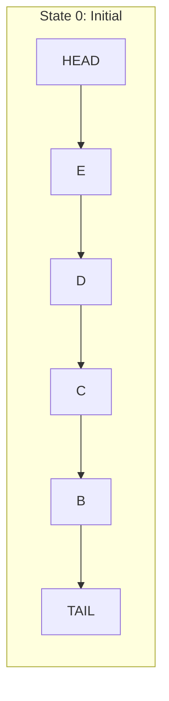
```mermaid
graph LR
    subgraph "State 0: Initial"
        H0[HEAD] --> E0[E] --> D0[D] --> C0[C] --> B0[B] --> T0[TAIL]
    end
```

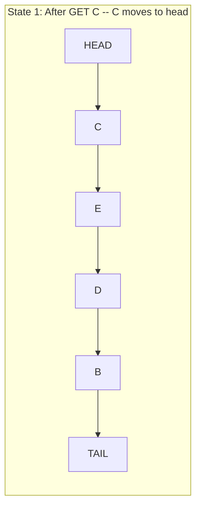
```mermaid
graph LR
    subgraph "State 1: After GET C -- C moves to head"
        H1[HEAD] --> C1[C] --> E1[E] --> D1[D] --> B1[B] --> T1[TAIL]
    end
```

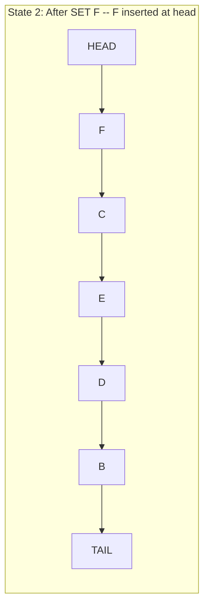
```mermaid
graph LR
    subgraph "State 2: After SET F -- F inserted at head"
        H2[HEAD] --> F2[F] --> C2[C] --> E2[E] --> D2[D] --> B2[B] --> T2[TAIL]
    end
```

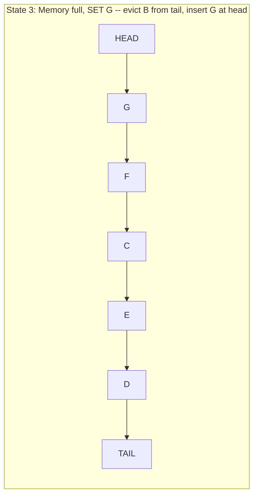
```mermaid
graph LR
    subgraph "State 3: Memory full, SET G -- evict B from tail, insert G at head"
        H3[HEAD] --> G3[G] --> F3[F] --> C3[C] --> E3[E] --> D3[D] --> T3[TAIL]
    end
```

### LRU Implementation (Production-Grade)

```python
import time
from threading import Lock


class DLLNode:
    """Doubly linked list node storing one cache entry."""
    __slots__ = ('key', 'value', 'ttl_expires_at', 'prev', 'next', 'size_bytes')

    def __init__(self, key: str, value: bytes, ttl_expires_at: float, size_bytes: int):
        self.key = key
        self.value = value
        self.ttl_expires_at = ttl_expires_at  # Unix timestamp; 0 = no expiry
        self.size_bytes = size_bytes
        self.prev: 'DLLNode | None' = None
        self.next: 'DLLNode | None' = None


class LRUCache:
    """
    Thread-safe LRU cache with TTL support.
    
    In production, this would use:
      - Fine-grained locking (stripe locks, one per hash bucket)
      - Or lock-free concurrent data structures
      - Slab allocation for memory management (see deep-dive doc)
      
    Complexity:
      GET:    O(1) average
      SET:    O(1) average (amortized eviction)
      DELETE: O(1) average
      
    Memory overhead per entry:
      - DLL prev/next pointers: 16 bytes
      - HashMap bucket/chain pointer: 8 bytes
      - TTL timestamp: 8 bytes
      - Size tracking: 8 bytes
      Total metadata overhead: ~40 bytes per entry
    """

    def __init__(self, max_memory_bytes: int):
        self.max_memory = max_memory_bytes
        self.current_memory = 0
        self.map: dict[str, DLLNode] = {}
        self._lock = Lock()  # Coarse lock; production uses stripe locks

        # Sentinel nodes simplify edge cases (no null checks)
        self.head = DLLNode("", b"", 0, 0)  # Most recent
        self.tail = DLLNode("", b"", 0, 0)  # Least recent
        self.head.next = self.tail
        self.tail.prev = self.head

        # Stats
        self.hits = 0
        self.misses = 0
        self.evictions = 0

    def _remove_node(self, node: DLLNode) -> None:
        """Remove a node from anywhere in the doubly linked list. O(1)."""
        node.prev.next = node.next
        node.next.prev = node.prev

    def _add_to_head(self, node: DLLNode) -> None:
        """Insert a node right after the head sentinel. O(1)."""
        node.next = self.head.next
        node.prev = self.head
        self.head.next.prev = node
        self.head.next = node

    def _move_to_head(self, node: DLLNode) -> None:
        """Move an existing node to the head (most recently used). O(1)."""
        self._remove_node(node)
        self._add_to_head(node)

    def _evict_tail(self) -> None:
        """Remove the least recently used node (just before tail sentinel). O(1)."""
        victim = self.tail.prev
        if victim == self.head:
            return  # Cache is empty
        self._remove_node(victim)
        del self.map[victim.key]
        self.current_memory -= victim.size_bytes
        self.evictions += 1

    def _is_expired(self, node: DLLNode, now: float) -> bool:
        """Check if a node's TTL has expired."""
        return node.ttl_expires_at > 0 and now >= node.ttl_expires_at

    def get(self, key: str, now: float = None) -> bytes | None:
        """
        Retrieve value for key. Returns None on miss or expiry.
        On hit, moves the entry to the head (most recently used).
        
        Thread safety: acquires lock for the duration of the operation.
        In production, this would use stripe locks (lock per hash bucket)
        to allow concurrent access to different keys.
        """
        if now is None:
            now = time.time()
            
        with self._lock:
            node = self.map.get(key)

            if node is None:
                self.misses += 1
                return None

            # Lazy expiration: check TTL on access
            if self._is_expired(node, now):
                self._remove_node(node)
                del self.map[key]
                self.current_memory -= node.size_bytes
                self.misses += 1
                return None

            # Cache hit: move to head
            self._move_to_head(node)
            self.hits += 1
            return node.value

    def set(self, key: str, value: bytes, ttl_seconds: int, now: float = None) -> bool:
        """
        Store a key-value pair. Evicts LRU entries if memory is full.
        Returns True on success.
        
        Upsert semantics: if the key already exists, update in-place
        and move to head (refreshes both value and recency).
        """
        if now is None:
            now = time.time()
            
        expires_at = (now + ttl_seconds) if ttl_seconds > 0 else 0
        entry_size = len(key) + len(value) + 100  # 100 bytes metadata overhead

        with self._lock:
            # Update existing key
            if key in self.map:
                node = self.map[key]
                self.current_memory -= node.size_bytes
                node.value = value
                node.ttl_expires_at = expires_at
                node.size_bytes = entry_size
                self.current_memory += entry_size
                self._move_to_head(node)
                return True

            # Evict until enough memory is available
            while self.current_memory + entry_size > self.max_memory:
                if self.tail.prev == self.head:
                    return False  # Cannot evict anything, entry too large
                self._evict_tail()

            # Insert new entry
            node = DLLNode(key, value, expires_at, entry_size)
            self.map[key] = node
            self._add_to_head(node)
            self.current_memory += entry_size
            return True

    def delete(self, key: str) -> bool:
        """Explicitly remove a key. Returns True if key existed."""
        with self._lock:
            node = self.map.get(key)
            if node is None:
                return False
            self._remove_node(node)
            del self.map[key]
            self.current_memory -= node.size_bytes
            return True

    def hit_rate(self) -> float:
        """Return cache hit rate as a percentage."""
        total = self.hits + self.misses
        return (self.hits / total * 100) if total > 0 else 0.0

    def stats(self) -> dict:
        """Return cache statistics for monitoring."""
        return {
            "hits": self.hits,
            "misses": self.misses,
            "hit_rate": self.hit_rate(),
            "evictions": self.evictions,
            "memory_used": self.current_memory,
            "memory_max": self.max_memory,
            "memory_pct": (self.current_memory / self.max_memory * 100),
            "keys": len(self.map),
        }
```

### Approximate LRU (Redis-Style Optimization)

Maintaining a true LRU linked list has memory overhead (~16 bytes per entry for
prev/next pointers). Redis uses **approximate LRU**: each key stores a timestamp of
its last access (only 3 bytes using LRU clock). On eviction, Redis samples N random
keys (default N=5) and evicts the one with the oldest timestamp.

```
Approximate LRU (Redis approach):

Eviction trigger: memory usage exceeds maxmemory

1. Sample 5 random keys from the keyspace
2. Among the 5, find the one with the oldest last-access timestamp
3. Evict that key
4. Repeat if still over memory limit

Trade-off:
  + Saves ~16 bytes per entry (no linked list pointers)
  + No pointer chasing (better cache-line behavior on CPU)
  - Not perfectly LRU -- occasionally evicts a somewhat-recent key
  - With sample size 10, accuracy is >99% vs true LRU (proven empirically)

Memory savings at scale:
  500M entries x 16 bytes saved = 8 GB saved
  That is 12.5% of a 64 GB node -- significant!
```

### True LRU vs Approximate LRU Decision

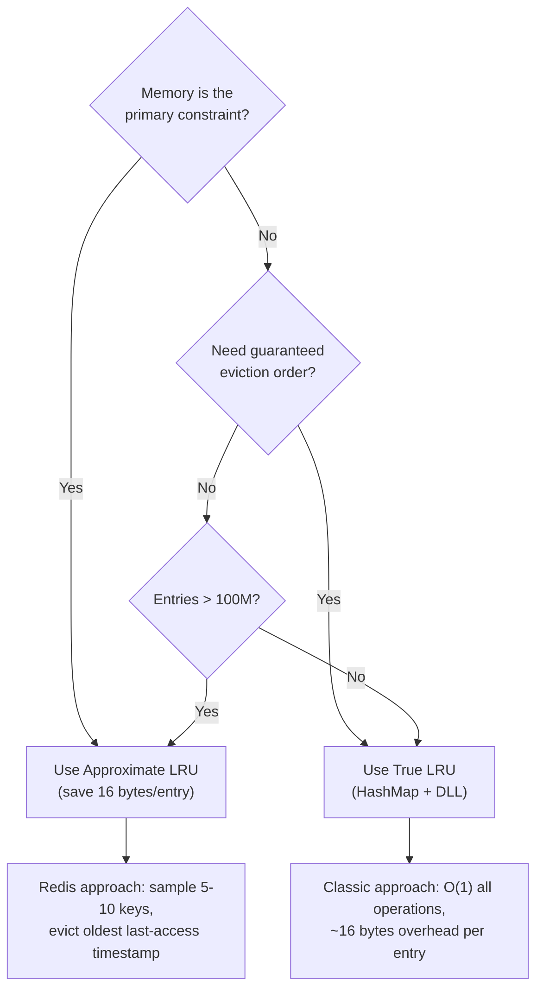
```mermaid
graph TD
    Q1{"Memory is the<br/>primary constraint?"} -->|Yes| APPROX["Use Approximate LRU<br/>(save 16 bytes/entry)"]
    Q1 -->|No| Q2{"Need guaranteed<br/>eviction order?"}
    Q2 -->|Yes| TRUE["Use True LRU<br/>(HashMap + DLL)"]
    Q2 -->|No| Q3{"Entries > 100M?"}
    Q3 -->|Yes| APPROX
    Q3 -->|No| TRUE
    
    APPROX --> NOTE1["Redis approach: sample 5-10 keys,<br/>evict oldest last-access timestamp"]
    TRUE --> NOTE2["Classic approach: O(1) all operations,<br/>~16 bytes overhead per entry"]
```

---

## 2.6 TTL and Expiration

Keys with a TTL must be cleaned up. Two complementary strategies:

### Lazy Expiration (Primary)

Check TTL on every GET. If expired, delete the entry and return a miss. This is free
because we already look up the key -- just add a timestamp comparison.

```
GET("session:xyz"):
  1. HashMap lookup -> found node
  2. Check: node.ttl_expires_at > 0 AND now >= node.ttl_expires_at?
     YES -> delete node, return MISS (lazy expiration)
     NO  -> move to LRU head, return value
     
Cost: 1 comparison (~1 nanosecond). Essentially free.
```

### Active Expiration (Background Sweep)

A background thread periodically samples random keys and deletes expired ones. This
prevents memory from being consumed by expired-but-never-accessed keys.

```
Active Expiration Algorithm (runs every 100ms):

1. Sample 20 random keys that have a TTL set
2. Delete all expired keys among the sample
3. If > 25% of sampled keys were expired:
     Repeat immediately (memory pressure from expired keys)
   Else:
     Sleep 100ms before next cycle

This is adaptive: it runs more aggressively when many keys are expiring
(e.g., after a session timeout wave) and backs off when few keys expire.

Example scenario:
  - 1M keys with TTL=300s (5-minute sessions)
  - All sessions start within the same minute
  - At T+300s: all 1M keys expire simultaneously
  - Active expiration detects >25% expired in each sample
  - Runs continuously until expired keys are cleaned up
  - Without active expiration: 1M dead keys consuming ~676 MB for no reason
```

### Expiration Strategy Comparison

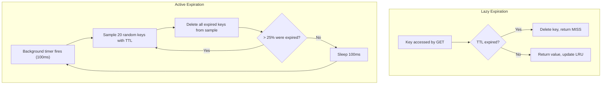
```mermaid
graph TB
    subgraph "Lazy Expiration"
        LE1["Key accessed by GET"] --> LE2{"TTL expired?"}
        LE2 -->|Yes| LE3["Delete key, return MISS"]
        LE2 -->|No| LE4["Return value, update LRU"]
    end

    subgraph "Active Expiration"
        AE1["Background timer fires (100ms)"] --> AE2["Sample 20 random keys with TTL"]
        AE2 --> AE3["Delete all expired keys from sample"]
        AE3 --> AE4{"> 25% were expired?"}
        AE4 -->|Yes| AE2
        AE4 -->|No| AE5["Sleep 100ms"]
        AE5 --> AE1
    end
```

---

## 2.7 Replication -- Leader-Follower per Partition

Each partition has one leader and one or more followers. All writes go to the leader;
the leader asynchronously replicates to followers.

### Write Path with Replication

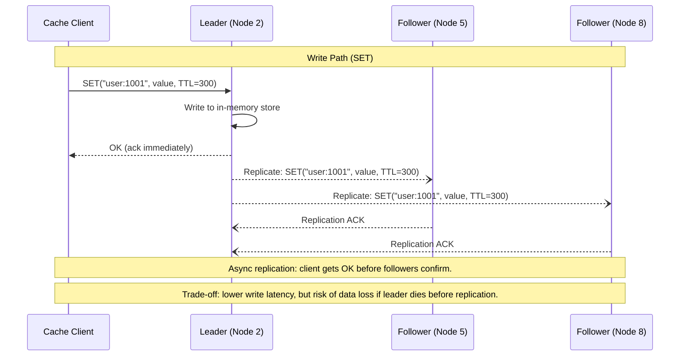
```mermaid
sequenceDiagram
    participant C as Cache Client
    participant L as Leader (Node 2)
    participant F1 as Follower (Node 5)
    participant F2 as Follower (Node 8)

    Note over C,F2: Write Path (SET)
    C->>L: SET("user:1001", value, TTL=300)
    L->>L: Write to in-memory store
    L-->>C: OK (ack immediately)
    L--)F1: Replicate: SET("user:1001", value, TTL=300)
    L--)F2: Replicate: SET("user:1001", value, TTL=300)
    F1--)L: Replication ACK
    F2--)L: Replication ACK

    Note over C,F2: Async replication: client gets OK before followers confirm.
    Note over C,F2: Trade-off: lower write latency, but risk of data loss if leader dies before replication.
```

### Replication Stream

The leader maintains a **replication log** (circular buffer in memory, ~64 MB). Each
mutation (SET, DELETE, EXPIRE) is appended with a sequence number. Followers maintain
their last-received sequence number and request the delta on reconnection.

```
Leader Replication Log (circular buffer):

+-------+-------+-------+-------+-------+-------+-------+
| seq=1 | seq=2 | seq=3 | seq=4 | seq=5 | seq=6 | seq=7 |
| SET   | SET   | DEL   | SET   | SET   | DEL   | SET   |
| k1=v1 | k2=v2 | k3    | k4=v4 | k1=v5 | k2    | k5=v6 |
+-------+-------+-------+-------+-------+-------+-------+
                    ^                               ^
                    |                               |
              Follower 1                     Leader write
              last_seq=3                     position
              (needs seq 4-7)

On follower reconnect:
  Follower: "SYNC from_seq=3"
  Leader:   sends seq 4, 5, 6, 7
  Follower: applies them in order, updates last_seq=7

If follower falls too far behind (gap > buffer size):
  Full resync: leader sends complete snapshot, then incremental from that point.
```

### Replication Log Sizing

```
Replication log sizing calculation:

  Write rate: 70K writes/sec (peak)
  Average write payload: ~676 bytes (key + value + metadata)
  Log entry overhead: ~20 bytes (seq number, opcode, timestamp)
  Per-entry size: ~696 bytes

  64 MB buffer / 696 bytes per entry = ~92,000 entries
  At 70K writes/sec: buffer holds ~1.3 seconds of writes

  For a follower that disconnects for up to 1 second:
    Incremental sync is sufficient (delta from replication log)
  
  For a follower disconnected > 1.3 seconds:
    Full resync required (snapshot + incremental)

  To support longer disconnects, increase buffer:
    256 MB buffer = ~5.2 seconds of writes
    1 GB buffer = ~20 seconds of writes
    
  Our recommendation: 256 MB buffer (handles brief network blips)
```

### Failover / Leader Election

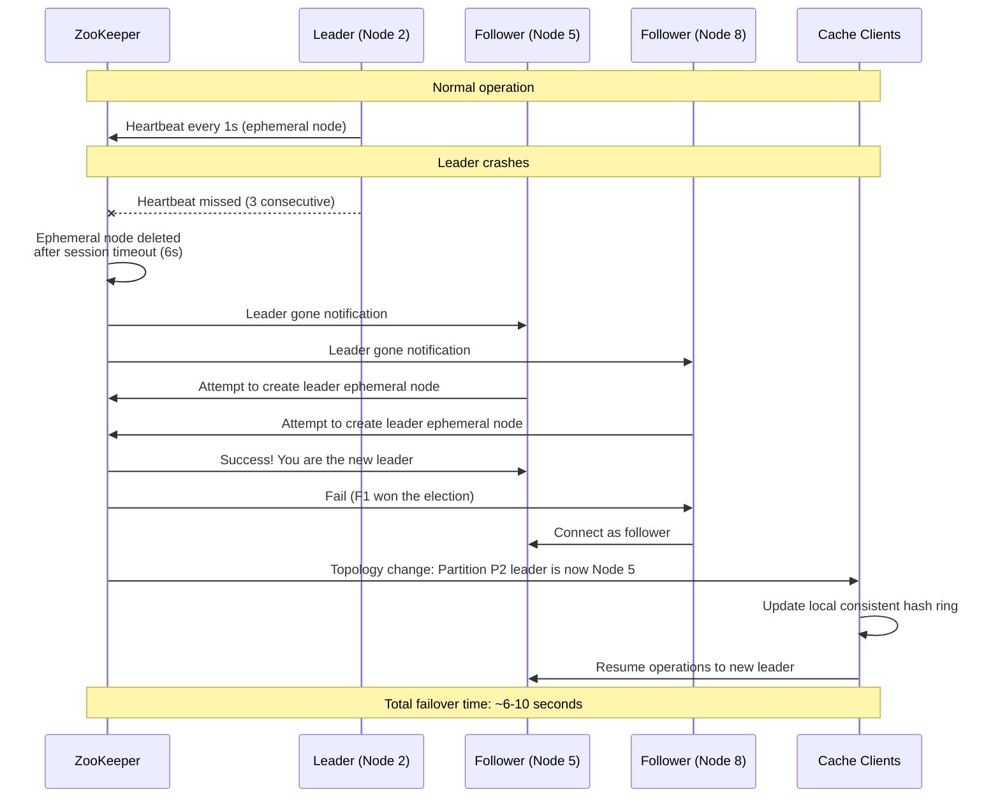
```mermaid
sequenceDiagram
    participant ZK as ZooKeeper
    participant L as Leader (Node 2)
    participant F1 as Follower (Node 5)
    participant F2 as Follower (Node 8)
    participant CL as Cache Clients

    Note over ZK,CL: Normal operation
    L->>ZK: Heartbeat every 1s (ephemeral node)

    Note over ZK,CL: Leader crashes
    L--xZK: Heartbeat missed (3 consecutive)
    ZK->>ZK: Ephemeral node deleted<br/>after session timeout (6s)
    ZK->>F1: Leader gone notification
    ZK->>F2: Leader gone notification
    F1->>ZK: Attempt to create leader ephemeral node
    F2->>ZK: Attempt to create leader ephemeral node
    ZK->>F1: Success! You are the new leader
    ZK->>F2: Fail (F1 won the election)
    F2->>F1: Connect as follower
    ZK->>CL: Topology change: Partition P2 leader is now Node 5
    CL->>CL: Update local consistent hash ring
    CL->>F1: Resume operations to new leader
    Note over ZK,CL: Total failover time: ~6-10 seconds
```

### Synchronous vs Asynchronous Replication

| Aspect | Async (our default) | Sync | Semi-sync (1 follower ack) |
|--------|---------------------|------|---------------------------|
| Write latency | ~0.1 ms | ~1-2 ms (wait for follower) | ~0.5 ms |
| Data safety | May lose last few writes on leader crash | Zero loss | At most 1 write lost |
| Throughput | Highest | Lowest | Medium |
| When to use | Most cache workloads | Financial data, counters | Session data |

For a cache (which is inherently volatile), async replication is the right default.
The data can always be recomputed from the source of truth (the database).

### Replication Consistency Guarantee

```
What can go wrong with async replication:

Timeline:
  T=0    Client A: SET("counter", 100) -> Leader acks OK
  T=0.1  Leader begins replicating to follower
  T=0.2  Client B: GET("counter") from FOLLOWER -> returns OLD value (99)
            (follower has not received replication yet)
  T=0.5  Follower receives replication, now has value 100

This is EXPECTED and ACCEPTABLE for a cache because:
  1. Cache is not the source of truth (database is)
  2. Stale reads are bounded by replication lag (~1-5 ms typical)
  3. Most reads go to the LEADER anyway (followers are read replicas only)
  4. Applications using cache-aside pattern always handle misses correctly
```

---

## 2.8 Cache Client Library

The client library is the unsung hero of a distributed cache. It runs inside every
application server and makes the cluster appear as a single cache.

### Client Library Architecture

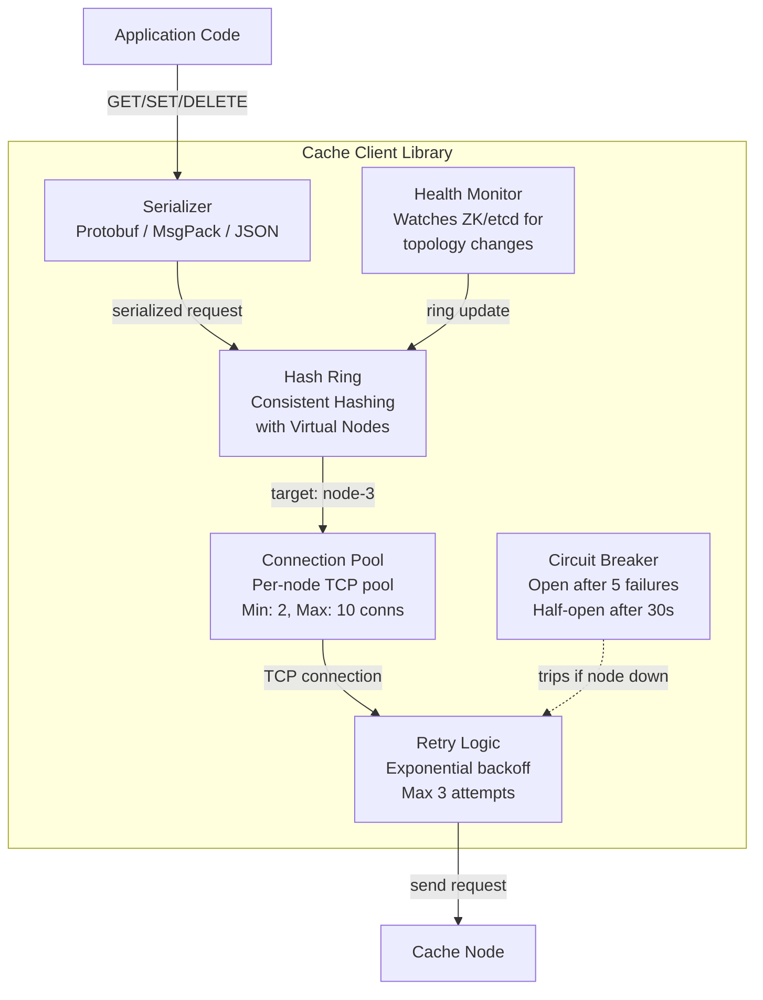
```mermaid
graph TB
    subgraph "Cache Client Library"
        SER[Serializer<br/>Protobuf / MsgPack / JSON]
        HR[Hash Ring<br/>Consistent Hashing<br/>with Virtual Nodes]
        CP[Connection Pool<br/>Per-node TCP pool<br/>Min: 2, Max: 10 conns]
        RT[Retry Logic<br/>Exponential backoff<br/>Max 3 attempts]
        CB[Circuit Breaker<br/>Open after 5 failures<br/>Half-open after 30s]
        HM[Health Monitor<br/>Watches ZK/etcd for<br/>topology changes]
    end

    APP[Application Code] -->|"GET/SET/DELETE"| SER
    SER -->|"serialized request"| HR
    HR -->|"target: node-3"| CP
    CP -->|"TCP connection"| RT
    RT -->|"send request"| CACHE_NODE[Cache Node]
    HM -->|"ring update"| HR
    CB -.->|"trips if node down"| RT
```

### Client GET Path (Detailed)

```
GET("user:session:abc123"):

1. Serialize key (already a string, no-op)

2. Compute target node:
     hash = MD5("user:session:abc123") = 0x8A3F21B7
     node = ring.get_node(hash)  // binary search O(log V)
     result: node-3 (10.0.1.53:6379)

3. Get connection from pool for node-3:
     If pool has idle connection: reuse it (O(1))
     If pool exhausted but under max: create new TCP connection
     If pool at max: wait up to 50ms for a connection

4. Send binary GET request over TCP connection

5. Read response:
     Status=0x00 (OK) -> deserialize and return value
     Status=0x01 (NOT_FOUND) -> return null (cache miss)
     Connection timeout (100ms) -> trigger retry logic

6. Return connection to pool

7. On failure:
     Retry with exponential backoff: 10ms, 40ms, 160ms
     After 3 failures: 
       - Circuit breaker opens for node-3
       - Optional: try follower node for reads
       - Return cache miss (app falls through to database)
```

### Connection Pooling Detail

```
Per-Node Connection Pool:

+-------------------------------------------------+
|  Pool for Node-3 (10.0.1.53:6379)              |
|                                                  |
|  Idle Connections:  [conn1] [conn2]             |
|  Active (in-use):  [conn3] [conn4] [conn5]     |
|  Max Size: 10                                    |
|  Min Idle: 2 (keep-alive)                       |
|  Max Wait: 50ms                                  |
|  Health Check: TCP ping every 30s               |
|  Max Lifetime: 30 minutes (recycle to avoid     |
|                stale connections)                |
|  Connect Timeout: 200ms                          |
|  Read Timeout: 100ms                             |
|  Write Timeout: 100ms                            |
+-------------------------------------------------+

Why connection pooling matters:
  - TCP handshake: ~0.5ms (same datacenter)
  - With pooling: amortized to ~0ms (reuse existing connection)
  - At 100K ops/sec, saving 0.5ms per connection = massive savings
```

### Circuit Breaker State Machine

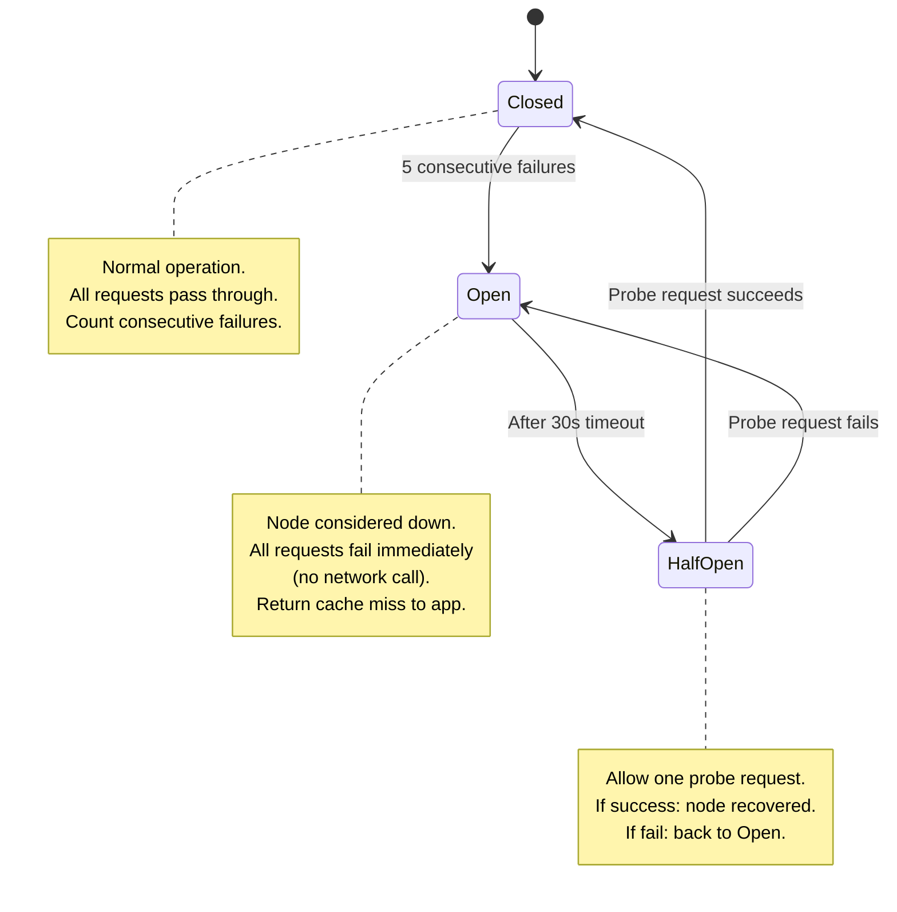
```mermaid
stateDiagram-v2
    [*] --> Closed
    Closed --> Open: 5 consecutive failures
    Open --> HalfOpen: After 30s timeout
    HalfOpen --> Closed: Probe request succeeds
    HalfOpen --> Open: Probe request fails

    note right of Closed
        Normal operation.
        All requests pass through.
        Count consecutive failures.
    end note

    note right of Open
        Node considered down.
        All requests fail immediately
        (no network call).
        Return cache miss to app.
    end note

    note right of HalfOpen
        Allow one probe request.
        If success: node recovered.
        If fail: back to Open.
    end note
```

### MGET Fan-Out Strategy

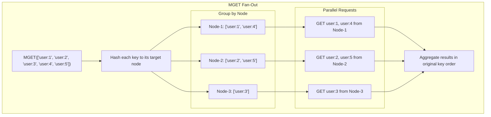
```mermaid
graph TB
    subgraph "MGET Fan-Out"
        REQ["MGET(['user:1', 'user:2', 'user:3', 'user:4', 'user:5'])"]
        
        HASH["Hash each key to its target node"]
        
        subgraph "Group by Node"
            G1["Node-1: ['user:1', 'user:4']"]
            G2["Node-2: ['user:2', 'user:5']"]
            G3["Node-3: ['user:3']"]
        end
        
        subgraph "Parallel Requests"
            P1["GET user:1, user:4 from Node-1"]
            P2["GET user:2, user:5 from Node-2"]
            P3["GET user:3 from Node-3"]
        end
        
        AGG["Aggregate results in original key order"]
    end

    REQ --> HASH
    HASH --> G1
    HASH --> G2
    HASH --> G3
    G1 --> P1
    G2 --> P2
    G3 --> P3
    P1 --> AGG
    P2 --> AGG
    P3 --> AGG
```

---

## 2.9 Read and Write Path Sequences

### GET -- Cache Hit

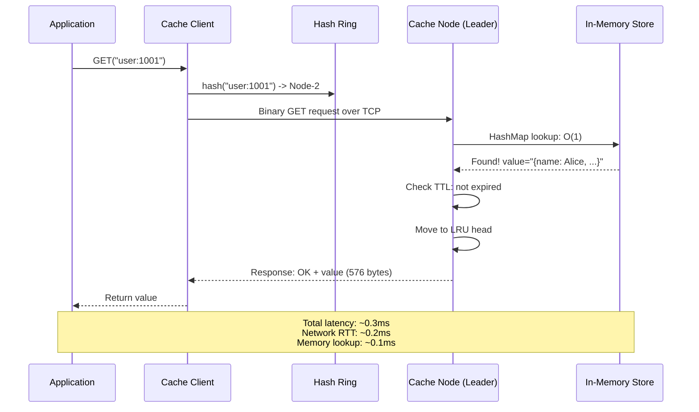
```mermaid
sequenceDiagram
    participant App as Application
    participant CL as Cache Client
    participant Ring as Hash Ring
    participant N as Cache Node (Leader)
    participant MEM as In-Memory Store

    App->>CL: GET("user:1001")
    CL->>Ring: hash("user:1001") -> Node-2
    CL->>N: Binary GET request over TCP
    N->>MEM: HashMap lookup: O(1)
    MEM-->>N: Found! value="{name: Alice, ...}"
    N->>N: Check TTL: not expired
    N->>N: Move to LRU head
    N-->>CL: Response: OK + value (576 bytes)
    CL-->>App: Return value

    Note over App,MEM: Total latency: ~0.3ms<br/>Network RTT: ~0.2ms<br/>Memory lookup: ~0.1ms
```

### GET -- Cache Miss (Cache-Aside Pattern)

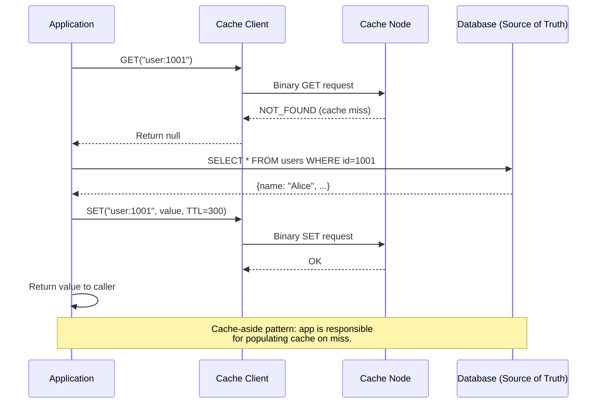
```mermaid
sequenceDiagram
    participant App as Application
    participant CL as Cache Client
    participant N as Cache Node
    participant DB as Database (Source of Truth)

    App->>CL: GET("user:1001")
    CL->>N: Binary GET request
    N-->>CL: NOT_FOUND (cache miss)
    CL-->>App: Return null
    App->>DB: SELECT * FROM users WHERE id=1001
    DB-->>App: {name: "Alice", ...}
    App->>CL: SET("user:1001", value, TTL=300)
    CL->>N: Binary SET request
    N-->>CL: OK
    App->>App: Return value to caller

    Note over App,DB: Cache-aside pattern: app is responsible<br/>for populating cache on miss.
```

### SET -- Write Path

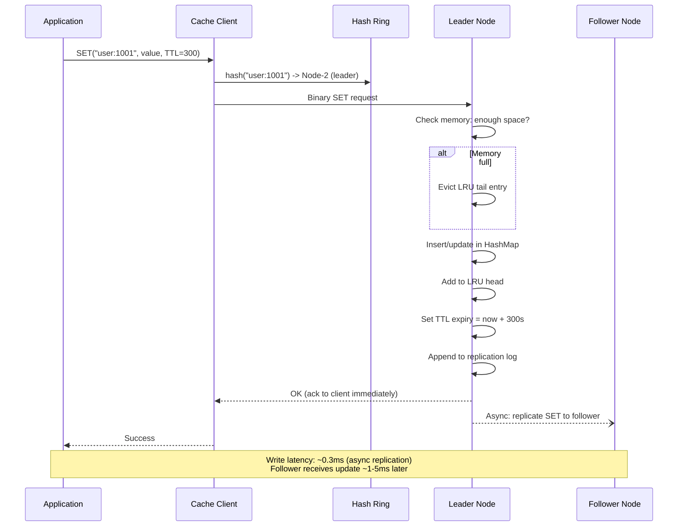
```mermaid
sequenceDiagram
    participant App as Application
    participant CL as Cache Client
    participant Ring as Hash Ring
    participant L as Leader Node
    participant F as Follower Node

    App->>CL: SET("user:1001", value, TTL=300)
    CL->>Ring: hash("user:1001") -> Node-2 (leader)
    CL->>L: Binary SET request
    L->>L: Check memory: enough space?
    alt Memory full
        L->>L: Evict LRU tail entry
    end
    L->>L: Insert/update in HashMap
    L->>L: Add to LRU head
    L->>L: Set TTL expiry = now + 300s
    L->>L: Append to replication log
    L-->>CL: OK (ack to client immediately)
    L--)F: Async: replicate SET to follower
    CL-->>App: Success

    Note over App,F: Write latency: ~0.3ms (async replication)<br/>Follower receives update ~1-5ms later
```

### DELETE -- Invalidation Path

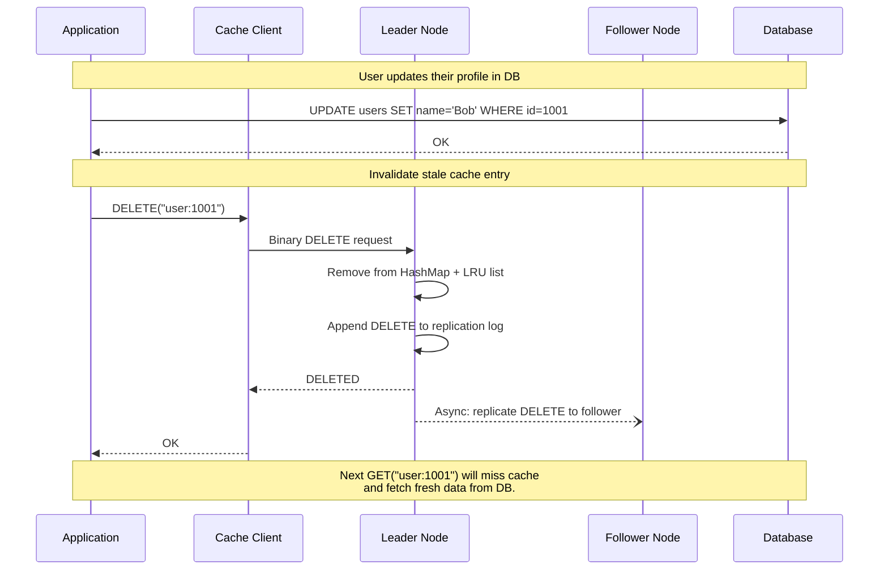
```mermaid
sequenceDiagram
    participant App as Application
    participant CL as Cache Client
    participant L as Leader Node
    participant F as Follower Node
    participant DB as Database

    Note over App,DB: User updates their profile in DB
    App->>DB: UPDATE users SET name='Bob' WHERE id=1001
    DB-->>App: OK
    
    Note over App,DB: Invalidate stale cache entry
    App->>CL: DELETE("user:1001")
    CL->>L: Binary DELETE request
    L->>L: Remove from HashMap + LRU list
    L->>L: Append DELETE to replication log
    L-->>CL: DELETED
    L--)F: Async: replicate DELETE to follower
    CL-->>App: OK

    Note over App,DB: Next GET("user:1001") will miss cache<br/>and fetch fresh data from DB.
```

---

## 2.10 Complete Architecture Diagram

```mermaid
graph TB
    subgraph "Application Tier"
        AS1[App Server 1<br/>+ Local L1 Cache]
        AS2[App Server 2<br/>+ Local L1 Cache]
        AS3[App Server N<br/>+ Local L1 Cache]
    end

    subgraph "Cache Client Library (in each App Server)"
        RING[Consistent Hash Ring<br/>150 vnodes/node]
        POOL[Connection Pools<br/>per-node TCP pools]
        HEALTH[Health Checker<br/>+ Circuit Breaker]
    end

    subgraph "Cache Cluster (L2 Distributed Cache)"
        subgraph "Partition 1 (hash range 0x00-0x3F)"
            P1L[Node 1 LEADER<br/>64 GB RAM<br/>LRU Store<br/>Slab Allocator]
            P1F[Node 4 FOLLOWER<br/>64 GB RAM]
        end
        subgraph "Partition 2 (hash range 0x40-0x7F)"
            P2L[Node 2 LEADER<br/>64 GB RAM<br/>LRU Store<br/>Slab Allocator]
            P2F[Node 5 FOLLOWER<br/>64 GB RAM]
        end
        subgraph "Partition 3 (hash range 0x80-0xBF)"
            P3L[Node 3 LEADER<br/>128 GB RAM<br/>2x vnodes<br/>LRU Store<br/>Slab Allocator]
            P3F[Node 6 FOLLOWER<br/>128 GB RAM]
        end
        subgraph "Partition 4 (hash range 0xC0-0xFF)"
            P4L[Node 7 LEADER<br/>64 GB RAM<br/>LRU Store<br/>Slab Allocator]
            P4F[Node 8 FOLLOWER<br/>64 GB RAM]
        end
    end

    subgraph "Coordination Layer"
        ZK1[ZooKeeper Node 1]
        ZK2[ZooKeeper Node 2]
        ZK3[ZooKeeper Node 3]
    end

    subgraph "Monitoring"
        PROM[Prometheus]
        GRAF[Grafana Dashboard]
        ALERT[AlertManager]
    end

    subgraph "Database Tier (Source of Truth)"
        DB[(Primary Database<br/>PostgreSQL / MySQL)]
    end

    AS1 --> RING
    AS2 --> RING
    AS3 --> RING
    RING --> POOL
    POOL --> HEALTH
    HEALTH --> P1L
    HEALTH --> P2L
    HEALTH --> P3L
    HEALTH --> P4L

    P1L -.->|async replication| P1F
    P2L -.-> P2F
    P3L -.-> P3F
    P4L -.-> P4F

    P1L -.->|heartbeat| ZK1
    P2L -.-> ZK2
    ZK1 --- ZK2
    ZK2 --- ZK3
    ZK3 --- ZK1

    ZK1 -.->|topology updates| RING

    P1L -->|metrics| PROM
    P2L --> PROM
    PROM --> GRAF
    PROM --> ALERT

    AS1 -.->|cache miss| DB
```

---

*This document covers the high-level architecture of the distributed cache: consistent
hashing with 150 vnodes for data partitioning, true LRU eviction with O(1) operations,
async leader-follower replication with ~1-5ms lag, and a smart client library that handles
routing, connection pooling, retries, and circuit breaking. The architecture scales
linearly -- add nodes to add capacity -- with automatic failover in under 10 seconds.*
