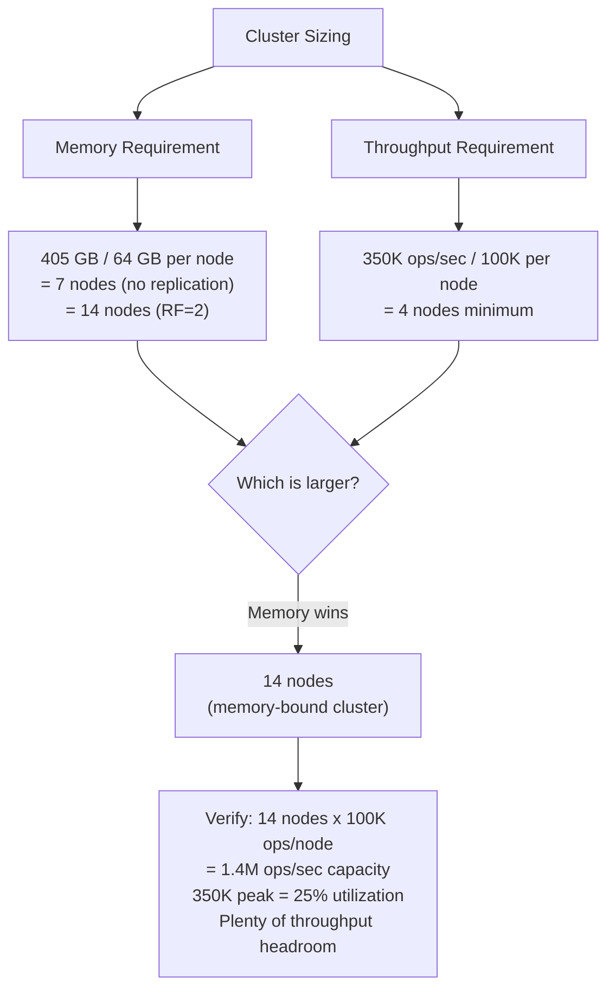
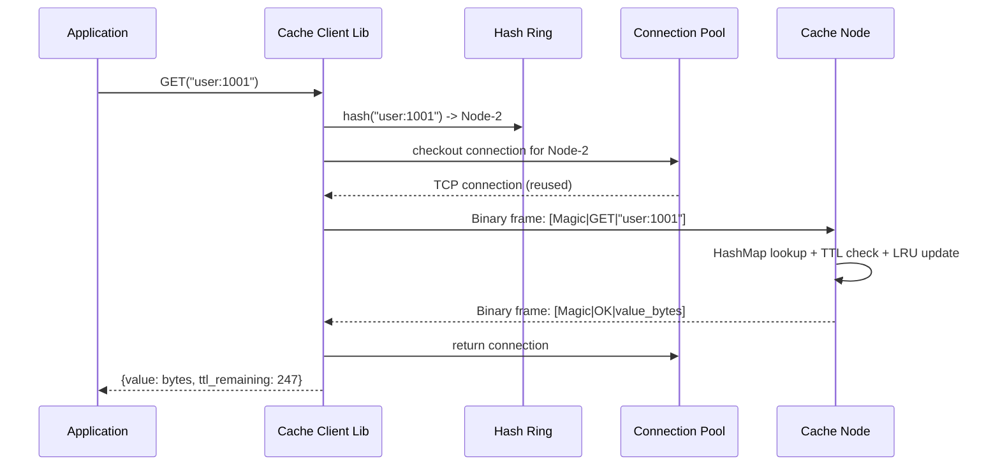

# Design a Distributed Cache -- Requirements and Estimation

## Table of Contents
- [1.1 Problem Statement](#11-problem-statement)
- [1.2 Functional Requirements](#12-functional-requirements)
- [1.3 Non-Functional Requirements](#13-non-functional-requirements)
- [1.4 Out of Scope](#14-out-of-scope)
- [1.5 Back-of-Envelope Estimation](#15-back-of-envelope-estimation)
- [1.6 API Design](#16-api-design)
- [1.7 Wire Protocol](#17-wire-protocol)
- [1.8 Error Handling Contract](#18-error-handling-contract)

---

## 1.1 Problem Statement

Design a distributed, in-memory caching system that stores key-value pairs across a cluster
of machines. The system must provide sub-millisecond reads, survive node failures without
significant data loss, and scale horizontally to handle hundreds of thousands of operations
per second. Think of it as a simplified Redis Cluster or Memcached fleet.

**Why this is a top-tier interview question:**
- It tests fundamental distributed systems concepts (consistent hashing, replication, partitioning)
- It requires reasoning about memory management at the hardware level
- It combines data structure design (LRU) with system-level thinking
- It exposes trade-offs between consistency, availability, and performance
- It connects theory (CAP theorem) to real production systems everyone uses

**Real-world context:**
Nearly every large-scale web service relies on a caching layer. Facebook's Memcached fleet
handles billions of requests per second. Twitter's caching infrastructure keeps timelines
snappy. Netflix caches user profiles, recommendations, and session state. Understanding how
to design such a system demonstrates deep knowledge of performance engineering, distributed
systems, and operational excellence.

**What makes this different from designing a key-value store (database)?**
A cache is fundamentally different from a database in three ways:
1. **Volatile by design** -- data loss is acceptable; the database is the source of truth
2. **Performance above all** -- every microsecond matters; we sacrifice durability for speed
3. **Bounded memory** -- we must evict data when memory is full, unlike a database that grows to disk

---

## 1.2 Functional Requirements

| # | Requirement | Description | Example |
|---|-------------|-------------|---------|
| FR-1 | **GET(key)** | Retrieve the value associated with a key. Return null/miss on absence. | `GET("user:1001")` returns `{name: "Alice"}` or `NULL` |
| FR-2 | **SET(key, value, TTL)** | Store a key-value pair with an optional time-to-live in seconds. | `SET("user:1001", data, 300)` stores for 5 minutes |
| FR-3 | **DELETE(key)** | Remove a key-value pair from the cache. | `DELETE("user:1001")` returns `DELETED` or `NOT_FOUND` |
| FR-4 | **TTL expiration** | Keys automatically expire and are removed after their TTL elapses. | Key set with TTL=300 disappears after 300 seconds |
| FR-5 | **Eviction** | When memory is full, evict entries according to a configurable policy (LRU default). | Memory at 64 GB limit, LRU tail entry is evicted |
| FR-6 | **Atomic operations** | Support CAS (Compare-And-Swap) for safe concurrent updates. | `CAS("counter", old_val, new_val)` succeeds only if current value matches `old_val` |
| FR-7 | **Bulk operations** | MGET/MSET for batch retrieval and storage to reduce round-trips. | `MGET(["user:1", "user:2", "user:3"])` returns all three in one call |

### Detailed Requirement Breakdown

#### FR-1: GET Operation
The GET path is the most performance-critical operation. At an 80:20 read:write ratio,
four out of five requests are GETs. The operation must:
- Perform a single hash lookup in O(1) time
- Check TTL expiry (lazy expiration) and return a miss if expired
- Update the LRU recency tracking (move to head of linked list)
- Return serialized bytes -- the cache is value-agnostic

#### FR-2: SET Operation
SET is the write path. Key considerations:
- **Upsert semantics**: if the key already exists, update in-place
- **TTL is optional**: if omitted, the key lives until evicted or explicitly deleted
- **Memory check**: before inserting, verify there is enough memory; evict if necessary
- **Replication trigger**: after local write, append to the replication log for followers
- **Size limits**: reject values exceeding the configured maximum (default 1 MB)

#### FR-3: DELETE Operation
Explicit deletion removes a key before its natural TTL expiry. This is important for:
- Cache invalidation when the source data changes
- Clearing stale entries during deployments
- Implementing cache-aside patterns where the application manages consistency

#### FR-4: TTL Expiration
Two complementary strategies work together:
1. **Lazy expiration**: checked on every GET -- if expired, delete and return miss
2. **Active expiration**: a background sweep samples random keys and removes expired ones

This dual approach ensures expired keys do not consume memory indefinitely, even if they
are never accessed again after expiring.

#### FR-5: Eviction Policies
While LRU is the default, the system supports pluggable eviction:

| Policy | When to Use |
|--------|-------------|
| **LRU (Least Recently Used)** | General-purpose workloads with temporal locality |
| **LFU (Least Frequently Used)** | Workloads with stable hot sets (e.g., product catalog) |
| **FIFO (First In, First Out)** | Simple workloads where age matters more than recency |
| **Random** | When eviction policy does not significantly affect hit rate |
| **TTL-based** | Session stores where near-expiry data is least valuable |
| **allkeys-lru** | Evict any key by LRU, even if no TTL is set |
| **volatile-lru** | Evict only keys that have a TTL set, by LRU |

#### FR-6: CAS (Compare-And-Swap)
CAS enables safe concurrent updates without distributed locks:
```
CAS("counter", expected=42, new=43, TTL=600)
  -> OK (if current value is 42 -- atomically updates to 43)
  -> EXISTS (if current value is not 42 -- another client modified it)
  -> NOT_FOUND (if key does not exist)
```
This is essential for counters, rate limiters, and any read-modify-write pattern.

#### FR-7: Bulk Operations
Bulk operations reduce network round-trips. For an MGET of 100 keys spread across
5 nodes, the client library:
1. Groups keys by their target node (consistent hash)
2. Sends 5 parallel requests (one per node) instead of 100 sequential requests
3. Aggregates results and returns them in the original key order

```
Without MGET: 100 keys x 0.3ms = 30ms sequential
With MGET:    5 parallel requests x 0.3ms = 0.3ms + aggregation overhead
Speedup:      ~100x for this example
```

---

## 1.3 Non-Functional Requirements

### Performance

| Requirement | Target | Rationale |
|-------------|--------|-----------|
| **Read latency** | < 1 ms p50, < 5 ms p99 | Entire point of a cache is sub-ms access |
| **Write latency** | < 1 ms p50, < 5 ms p99 | Writes must not block the hot path |
| **Throughput** | > 100K ops/sec per node | Each node serves ~100-500K ops/sec in production |
| **Cluster throughput** | > 1M ops/sec total | Linear scaling with added nodes |
| **Serialization overhead** | < 50 microseconds | Binary protocol minimizes serialization cost |
| **Hash computation** | < 1 microsecond | Fast hashing (MurmurHash3/xxHash) for routing |

#### Latency Breakdown (Target)

```
End-to-end GET latency budget (p50 target: < 1ms):

  Client-side hashing:        ~0.001 ms  (hash computation + ring lookup)
  Connection pool checkout:   ~0.005 ms  (get idle connection from pool)
  Network RTT (same DC):      ~0.100 ms  (TCP round-trip within datacenter)
  Server-side processing:     ~0.050 ms  (HashMap lookup + TTL check + LRU update)
  Response serialization:     ~0.010 ms  (encode value into binary frame)
  Network RTT (response):     ~0.100 ms  (TCP return trip)
  Client-side deserialization:~0.010 ms  (decode binary response)
  ─────────────────────────────────────
  Total:                      ~0.276 ms  (well within 1ms budget)

p99 adds:
  Occasional TCP retransmit:  +2-3 ms
  GC pause (if JVM-based):    +1-2 ms
  Connection pool contention: +0.5 ms
  ─────────────────────────────────────
  Worst case:                 ~4-5 ms    (within 5ms budget)
```

### Availability and Durability

| Requirement | Target | Rationale |
|-------------|--------|-----------|
| **Availability** | 99.99% (52 min downtime/year) | Cache is on the critical path of most requests |
| **Data durability** | Best-effort (cache, not DB) | Acceptable to lose data on catastrophic failure; replication covers single-node failure |
| **Replication lag** | < 10 ms async | Followers stay near-real-time with leader |
| **Failover time** | < 30 seconds | Automatic leader election on node crash |
| **Recovery time** | < 5 minutes (warm cache) | Time for a replacement node to become useful |

#### Availability Math

```
99.99% availability = 52 minutes of downtime per year

With 14 nodes and leader-follower replication:
  - Single node MTBF (mean time between failures): ~1 year
  - Expected node failures per year: 14 nodes / 1 year = ~14 failures
  - Failover time per failure: ~10 seconds
  - Total failover downtime: 14 x 10s = 140 seconds (2.3 minutes)
  - During failover, only 1/7 of data is affected (one partition)
  - Effective user-visible downtime: 140s x (1/7) = 20 seconds
  - 20 seconds << 52 minutes budget -> meets 99.99% target
```

### Scalability

| Requirement | Target | Rationale |
|-------------|--------|-----------|
| **Max data size** | Terabytes across cluster | No single node holds everything |
| **Max key size** | 512 bytes | Keeps hashing and comparison fast |
| **Max value size** | 1 MB (configurable) | Large values degrade network performance |
| **Cluster size** | 3 to 1000 nodes | From small teams to hyperscale |
| **Scale-out time** | < 30 minutes | Adding a node should not disrupt service |
| **Key redistribution** | ~1/N of keys per node change | Consistent hashing minimizes data movement |

---

## 1.4 Out of Scope

| Feature | Reason for Exclusion | Where It Fits |
|---------|---------------------|---------------|
| Persistence / AOF / RDB snapshotting | This is a cache, not a database. The DB is the source of truth. | Mention as an extension for "warm restart" |
| Rich data structures (sorted sets, streams, pub/sub) | Scope creep; focus on core caching primitives | Redis provides these; our design is Memcached-like |
| Transactions beyond single-key CAS | Multi-key transactions require distributed coordination (2PC) which destroys latency | Mention that Redis supports MULTI/EXEC |
| Cross-datacenter replication | Adds significant complexity (WAN latency, conflict resolution) | Mention as an extension: async invalidation bus |
| Encryption at rest | Data is in-memory and volatile; encryption at rest is for persistent stores | TLS in transit can be mentioned as an extension |
| Access control / authentication | Important in production but orthogonal to the caching design | Mention as an operational concern |

---

## 1.5 Back-of-Envelope Estimation

### Traffic Estimation

| Metric | Calculation | Result |
|--------|-------------|--------|
| Daily active users | Given | 50M |
| Avg cache ops per user per day | Reads + writes | 200 |
| Total ops per day | 50M x 200 | 10B ops/day |
| Ops per second (avg) | 10B / 86,400 | ~115K ops/sec |
| Peak ops per second | 3x average | **~350K ops/sec** |
| Read:Write ratio | Typical cache | 80:20 |
| Peak reads/sec | 350K x 0.8 | 280K |
| Peak writes/sec | 350K x 0.2 | 70K |

#### Traffic Pattern Visualization

```
Ops/sec
350K ┤                          ╭──╮
     │                        ╭╯  ╰╮         Peak: 350K
300K ┤                       ╭╯    ╰╮
     │                      ╭╯      ╰╮
250K ┤                     ╭╯        ╰╮
     │                    ╭╯          ╰╮
200K ┤                   ╭╯            ╰╮
     │                 ╭─╯              ╰─╮
150K ┤              ╭──╯                  ╰──╮
     │           ╭──╯                        ╰──╮      Avg: 115K
115K ┤─ ─ ─ ─ ─╱─ ─ ─ ─ ─ ─ ─ ─ ─ ─ ─ ─ ─ ─ ─╲─ ─ ─ ─ ─ ─ 
     │       ╭──╯                                ╰──╮
 50K ┤    ╭──╯                                      ╰──╮
     │╭───╯                                            ╰───╮
   0 ┼───┬────┬────┬────┬────┬────┬────┬────┬────┬────┬────┬──
     0    2    4    6    8   10   12   14   16   18   20   22  24
                          Hour of Day (UTC)
```

### Storage Estimation

| Metric | Calculation | Result |
|--------|-------------|--------|
| Total unique keys | Given | 500M |
| Avg key size | | 64 bytes |
| Avg value size | | 512 bytes |
| Per-entry overhead (metadata, pointers, TTL) | | ~100 bytes |
| Storage per entry | 64 + 512 + 100 | 676 bytes |
| Total raw storage | 500M x 676 B | ~338 GB |
| With 20% fragmentation overhead | 338 x 1.2 | **~405 GB** |

#### Per-Entry Memory Breakdown

```
Single Cache Entry Memory Layout:
+------------------------------------------------------------------+
| Component              | Bytes | Notes                            |
+------------------------------------------------------------------+
| Key (average)          |    64 | Variable length, max 512 bytes   |
| Value (average)        |   512 | Variable length, max 1 MB        |
| Key length field       |     2 | uint16                           |
| Value length field     |     4 | uint32                           |
| TTL expiry timestamp   |     8 | int64 (Unix epoch in ms)         |
| Last access timestamp  |     8 | int64 (for LRU tracking)         |
| Hash value (cached)    |     4 | Avoids rehashing on collision    |
| Flags / metadata       |     4 | Compression flag, slab class, etc|
| DLL prev pointer       |     8 | Doubly linked list (LRU)         |
| DLL next pointer       |     8 | Doubly linked list (LRU)         |
| HashMap bucket pointer |     8 | Points into hash table           |
| CAS version counter    |     8 | uint64, incremented on each SET  |
| Slab class ID          |     2 | Which slab class this entry uses |
| Padding / alignment    |    40 | Memory alignment to 8-byte boundary|
+------------------------------------------------------------------+
| Total overhead         |  ~100 | (excluding key and value)        |
| Total per entry        |  ~676 | 64 + 512 + 100                   |
+------------------------------------------------------------------+
```

### Cluster Sizing

| Metric | Calculation | Result |
|--------|-------------|--------|
| Memory per node | Typical commodity server | 64 GB usable |
| Nodes for data (no replication) | 405 / 64 | ~7 nodes |
| Replication factor | 1 leader + 1 follower | 2 |
| Total data nodes | 7 x 2 | **14 nodes** |
| Throughput per node | Conservative | 100K ops/sec |
| Nodes for throughput | 350K / 100K | 4 nodes |
| **Governing constraint** | Memory-bound | **14 nodes** |

#### Sizing Decision Tree



### Network Bandwidth

| Metric | Calculation | Result |
|--------|-------------|--------|
| Avg response size | ~576 bytes (key + value) | 576 B |
| Bandwidth at peak | 350K ops/sec x 576 B | ~200 MB/sec |
| With replication traffic | x 1.5 | ~300 MB/sec cluster-wide |
| Per-node bandwidth | 300 / 14 | ~21 MB/sec per node |
| NIC capacity | 10 Gbps = 1.25 GB/sec | Plenty of headroom |

#### Network Budget per Node

```
Per-node network breakdown at peak:

  Client read responses:    ~16 MB/sec  (serving GET results)
  Client write requests:     ~4 MB/sec  (receiving SET data)
  Replication send (leader): ~4 MB/sec  (sending to follower)
  Replication recv (follow): ~4 MB/sec  (receiving from leader)
  Heartbeat / metadata:     ~0.1 MB/sec (ZooKeeper, health checks)
  Monitoring / metrics:     ~0.1 MB/sec (Prometheus scrape)
  ──────────────────────────────────────
  Total per node:           ~28 MB/sec  (< 3% of 10 Gbps NIC)

Conclusion: network is NOT the bottleneck. Memory is.
```

### Estimation Summary

```
┌──────────────────────────────────────────────────────────┐
│              ESTIMATION SUMMARY                           │
├──────────────────────────────────────────────────────────┤
│                                                           │
│  Traffic:     350K peak ops/sec  (80% reads, 20% writes) │
│  Storage:     405 GB  (500M keys x 676 bytes avg)        │
│  Cluster:     14 nodes  (7 leaders + 7 followers)        │
│  Per node:    ~64 GB RAM, ~100K ops/sec capacity         │
│  Network:     ~28 MB/sec per node  (10 Gbps NIC)        │
│  Bottleneck:  Memory  (not CPU, not network)             │
│                                                           │
│  Governing constraint: MEMORY                             │
│  Throughput headroom: 4x  (1.4M capacity vs 350K peak)  │
│  Network headroom:    40x (1.25 GB/sec vs 28 MB/sec)    │
│                                                           │
└──────────────────────────────────────────────────────────┘
```

---

## 1.6 API Design

### Core Operations

```
// ─── Read Operations ─────────────────────────────────────

GET(key: string) -> {value: bytes, ttl_remaining: int} | NULL
  // Retrieve the value for a key.
  // Returns NULL on miss or expired key.
  // Side effect: updates LRU recency (moves to head).

TTL(key: string) -> int | KEY_NOT_FOUND
  // Returns remaining TTL in seconds.
  // Returns -1 if key exists but has no TTL set.
  // Returns KEY_NOT_FOUND if key does not exist.

EXISTS(key: string) -> bool
  // Check if a key exists without updating LRU.
  // Useful for conditional logic without promoting the key.

// ─── Write Operations ────────────────────────────────────

SET(key: string, value: bytes, ttl_seconds: int, flags: int) -> OK | ERROR
  // Store a key-value pair with optional TTL.
  // If key exists, update in-place (upsert semantics).
  // flags: bitmask for compression, encoding hints.
  // ERROR if value exceeds max size (1 MB).

DELETE(key: string) -> DELETED | NOT_FOUND
  // Remove a key-value pair.
  // Returns NOT_FOUND if key does not exist (idempotent).

TOUCH(key: string, ttl_seconds: int) -> OK | NOT_FOUND
  // Update the TTL of an existing key without changing its value.
  // Also moves the key to LRU head (refreshes recency).

// ─── Atomic Operations ───────────────────────────────────

CAS(key: string, expected_value: bytes, new_value: bytes, ttl: int)
  -> OK | EXISTS | NOT_FOUND
  // Compare-And-Swap: update only if current value matches expected.
  // EXISTS means the value has changed (concurrent modification).
  // Enables lock-free read-modify-write patterns.

INCR(key: string, delta: int) -> new_value: int | NOT_FOUND
  // Atomically increment a numeric value by delta.
  // Returns the new value after increment.
  // NOT_FOUND if the key does not exist.

DECR(key: string, delta: int) -> new_value: int | NOT_FOUND
  // Atomically decrement. Same semantics as INCR.

// ─── Bulk Operations ─────────────────────────────────────

MGET(keys: string[]) -> {key: string, value: bytes}[]
  // Batch GET. Returns results for all requested keys.
  // Missing keys are omitted from the result list.
  // Client library fans out to multiple nodes in parallel.

MSET(entries: {key: string, value: bytes, ttl: int}[]) -> OK | PARTIAL_ERROR
  // Batch SET. Stores multiple key-value pairs.
  // PARTIAL_ERROR returns which specific keys failed.
  // Client library groups by target node and sends in parallel.

// ─── Administrative Operations ───────────────────────────

STATS() -> {hit_count, miss_count, eviction_count, memory_used,
            memory_max, uptime, connections_active, keys_total, ...}
  // Returns server-side statistics for monitoring.
  // Hit rate = hit_count / (hit_count + miss_count).

FLUSH_ALL() -> OK
  // Delete all keys on the node. Use with caution.
  // Typically gated behind admin authentication.
```

### API Request/Response Flow



---

## 1.7 Wire Protocol (Binary)

We use a compact binary protocol (not text-based like Redis RESP) to minimize parsing
overhead and network bytes. Each request fits in a single TCP frame for typical key-value
sizes, avoiding fragmentation.

### Request Frame Format

```
Request Frame:
+--------+--------+--------+---------+----------+---------+----------+-------+
| Magic  | Opcode | Flags  | Key     | Key      | Value   | Value    | Extras|
| (2B)   | (1B)   | (1B)   | Length  | (var)    | Length  | (var)    | (var) |
|        |        |        | (2B)    |          | (4B)    |          |       |
+--------+--------+--------+---------+----------+---------+----------+-------+

Magic:   0xCA 0xCE  (identifies a cache protocol frame)
Opcode:  0x01=GET, 0x02=SET, 0x03=DELETE, 0x04=CAS, 0x05=MGET,
         0x06=MSET, 0x07=INCR, 0x08=DECR, 0x09=TOUCH, 0x0A=STATS
Flags:   Bitmask: 0x01=compressed, 0x02=binary_value, 0x04=no_reply
```

### Response Frame Format

```
Response Frame:
+--------+--------+--------+----------+---------+
| Magic  | Status | Value  | Value    | Extras  |
| (2B)   | (1B)   | Length | (var)    | (var)   |
|        |        | (4B)   |          |         |
+--------+--------+--------+----------+---------+

Status: 0x00=OK, 0x01=NOT_FOUND, 0x02=EXISTS (CAS conflict),
        0x03=FULL (memory exhausted), 0x04=TOO_LARGE (value exceeds max),
        0x05=INVALID_ARGS, 0xFF=INTERNAL_ERROR
```

### Why Binary over Text?

| Aspect | Binary Protocol (ours) | Text Protocol (Redis RESP) |
|--------|----------------------|---------------------------|
| Parsing speed | Directly read fixed offsets | Parse delimiters, convert ASCII to int |
| Bandwidth | Minimal overhead (10 bytes header) | Extra bytes for `\r\n`, `$`, `*` markers |
| Frame detection | Fixed magic + length fields | Scan for line terminators |
| Human readability | Requires tool to inspect | Can telnet and type commands |
| Debugging | Harder (use Wireshark dissector) | Easier (read plaintext) |

For a high-throughput cache, the binary protocol saves 10-30% bandwidth and reduces
parsing CPU by 50% compared to text protocols. At 350K ops/sec, this matters.

---

## 1.8 Error Handling Contract

### Client-Side Error Handling

```
Error Hierarchy:

CacheException (base)
  |
  +-- CacheMissException          -- Key not found (expected, not logged)
  |
  +-- CacheTimeoutException       -- Node did not respond within deadline
  |     |
  |     +-- CacheConnectTimeout   -- TCP connection could not be established
  |     +-- CacheReadTimeout      -- Connected but response not received in time
  |
  +-- CacheFullException          -- Node is at memory limit, cannot SET
  |
  +-- CacheNodeDownException      -- Node is unreachable (circuit breaker open)
  |
  +-- CacheValueTooLargeException -- Value exceeds max size (1 MB)
  |
  +-- CacheCASConflictException   -- CAS failed: value was modified by another client
```

### Retry Policy

```
Retryable errors:
  - CacheTimeoutException    -> retry with exponential backoff (10ms, 40ms, 160ms)
  - CacheNodeDownException   -> try follower if read; fail fast if write

Non-retryable errors:
  - CacheMissException       -> return null to application
  - CacheFullException       -> return error (application should handle gracefully)
  - CacheValueTooLargeException -> return error (application must reduce value size)
  - CacheCASConflictException -> return to application (it must re-read and retry CAS)
```

---

*This document defines the requirements envelope for the distributed cache: 350K peak
ops/sec, 405 GB across 14 nodes, sub-millisecond reads, and 99.99% availability.
The API is designed for simplicity (GET/SET/DELETE) with power-user features (CAS, MGET)
and a compact binary protocol for maximum throughput.*
