# Design Google Maps / Navigation System: Deep Dive and Scaling

## Table of Contents
- [1. Deep Dive #1: Graph Partitioning for Routing at Global Scale](#1-deep-dive-1-graph-partitioning-for-routing-at-global-scale)
- [2. Deep Dive #2: Map Tile Serving at Scale](#2-deep-dive-2-map-tile-serving-at-scale)
- [3. Deep Dive #3: Real-Time Traffic Pipeline](#3-deep-dive-3-real-time-traffic-pipeline)
- [4. Deep Dive #4: ETA Prediction with ML](#4-deep-dive-4-eta-prediction-with-ml)
- [5. Scaling Architecture](#5-scaling-architecture)
- [6. Uber-Specific Design Considerations](#6-uber-specific-design-considerations)
- [7. Failure Modes and Resilience](#7-failure-modes-and-resilience)
- [8. Key Trade-offs and Design Decisions](#8-key-trade-offs-and-design-decisions)
- [9. Interview Tips and Common Follow-ups](#9-interview-tips-and-common-follow-ups)

---

## 1. Deep Dive #1: Graph Partitioning for Routing at Global Scale

### 1.1 The Problem

The global road network has ~500M nodes and ~1B edges. While the entire graph (~100 GB
with Contraction Hierarchies) fits in the RAM of a single beefy server, this approach
has critical limitations:

```
Problems with single-server graph:
  1. Single point of failure (one server dies = no routing)
  2. Cannot scale QPS (one server handles ~5K routes/sec max)
  3. Graph updates require full reload (~30 min downtime)
  4. Cross-continental routes (NYC → Paris) require the entire global graph
  5. Memory pressure: 100 GB graph + OS + JVM = need 256+ GB RAM servers
```

The solution is **graph partitioning**: divide the global road network into regions,
run routing within regions using region-specific servers, and stitch together
cross-region routes using border nodes.

### 1.2 Partitioning Strategies

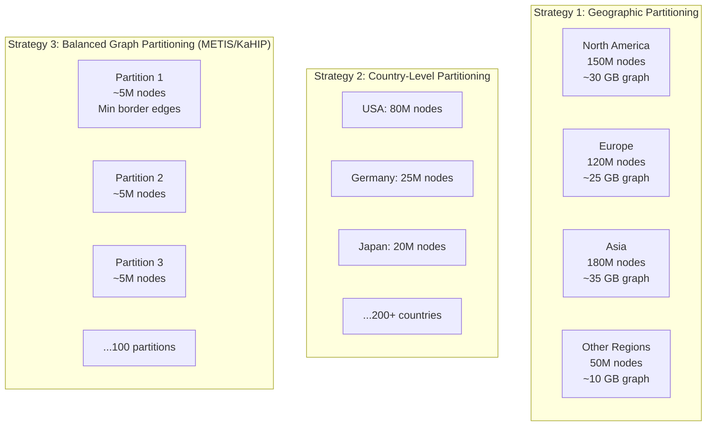

**Google Maps uses a hybrid approach:**
- **Coarse level:** Continental partitions (North America, Europe, Asia, etc.)
- **Fine level:** Within each continent, balanced graph partitioning (METIS algorithm)
  that minimizes the number of "border edges" crossing partition boundaries
- **Border nodes:** A small set of nodes where roads cross partition boundaries (~0.1% of nodes)

### 1.3 Hierarchical Routing

The key insight for long-distance routing: you do not need the full detailed graph.
For a route from San Francisco to New York, the algorithm only needs local street
details near the origin and destination. The middle portion travels on highways.

```mermaid
graph TB
    subgraph "Hierarchical Routing: SF to NYC"
        direction LR

        subgraph "Origin Region (SF)"
            S["Start: 123 Main St, SF"]
            L1["Local streets"]
            ON1["On-ramp to US-101"]
            B1["Border Node: I-80 junction"]
        end

        subgraph "Highway Overlay Graph"
            B1_H["I-80 junction (SF)"]
            HW1["I-80 East"]
            HW2["I-80 → I-76"]
            HW3["I-76 → I-78"]
            B2_H["I-78 junction (NYC area)"]
        end

        subgraph "Destination Region (NYC)"
            B2["Border Node: I-78 junction"]
            OFF1["Off-ramp to local"]
            L2["Local streets"]
            D["End: 456 Broadway, NYC"]
        end

        S --> L1 --> ON1 --> B1
        B1 -.-> B1_H
        B1_H --> HW1 --> HW2 --> HW3 --> B2_H
        B2_H -.-> B2
        B2 --> OFF1 --> L2 --> D
    end
```

**How hierarchical routing works:**

```
Step 1: LOCAL ROUTING (Origin Region)
  - Use detailed CH graph for the SF partition
  - Find shortest path from origin to ALL border nodes of the SF partition
  - Result: distances from origin to each of ~50 border nodes
  - Time: ~1ms

Step 2: HIGHWAY OVERLAY ROUTING
  - The "overlay graph" contains only border nodes + highway edges between them
  - Overlay graph is MUCH smaller: ~500K nodes globally (vs 500M total)
  - Fits in ~500 MB RAM on any server
  - Run CH on overlay graph from SF border nodes to NYC border nodes
  - Time: ~0.5ms

Step 3: LOCAL ROUTING (Destination Region)
  - Use detailed CH graph for the NYC partition
  - Find shortest path from ALL border nodes of NYC partition to destination
  - Time: ~1ms

Step 4: STITCH
  - Combine: origin → best_SF_border_node → overlay_path → best_NYC_border_node → dest
  - Total route with full street-level detail
  - Time: ~0.1ms

Total query time: ~3ms for a cross-country route!
```

### 1.4 Graph Partitioning Implementation

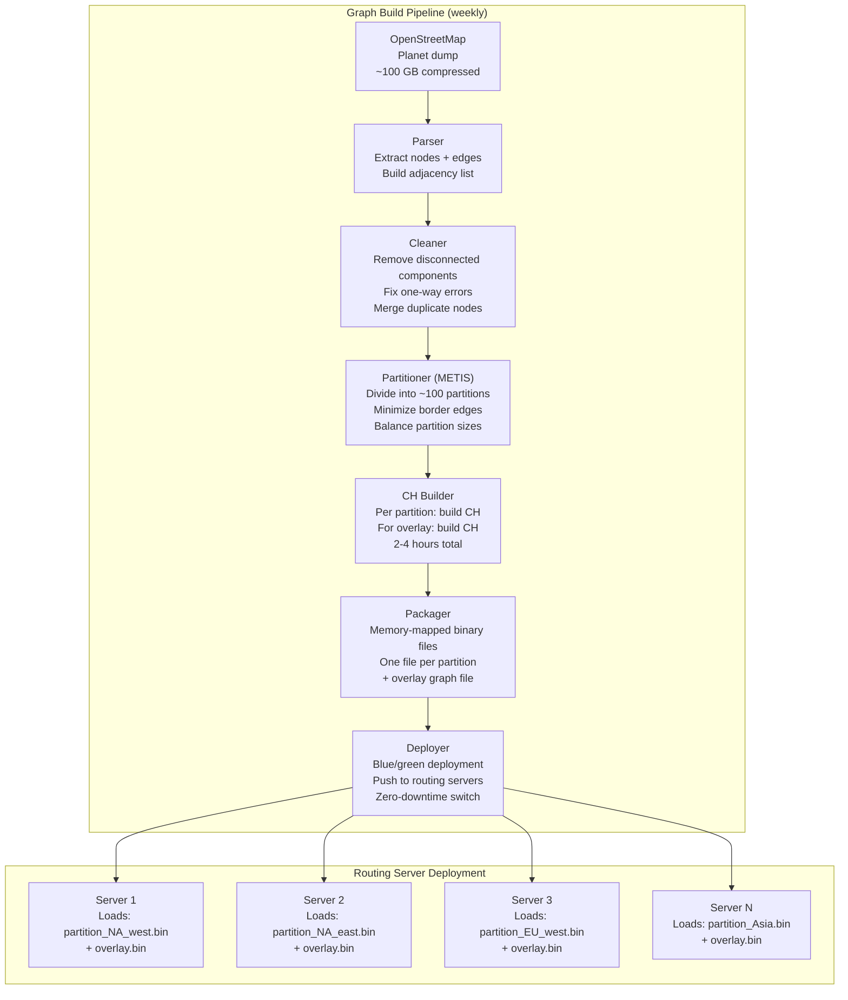

### 1.5 Graph Update Strategy

```
Road network changes daily (new roads, closures, speed limit changes).
Full graph rebuild takes 2-4 hours. How to handle updates?

Strategy: Two-tier updates

Tier 1: LIVE UPDATES (seconds)
  - Road closures, accidents → mark edges as blocked
  - Speed changes from traffic → update edge weights in Redis
  - Routing engine checks Redis for live overrides at query time
  - No graph rebuild needed
  - Limitation: cannot add new nodes/edges

Tier 2: WEEKLY REBUILD
  - Incorporate new OSM data (new roads, changed geometry)
  - Full CH rebuild with METIS partitioning
  - Blue/green deployment: new graph loaded on standby servers,
    traffic switched over once ready
  - Old servers drained gracefully (finish in-flight requests)
  - Zero downtime
```

---

## 2. Deep Dive #2: Map Tile Serving at Scale

### 2.1 The Scale Challenge

```
Map tile serving is the #1 bandwidth consumer in the entire system:

  350K+ tile requests per second at peak
  30 KB average tile size (vector)
  = 10+ GB/sec = 80+ Gbps outbound bandwidth
  = 25+ PB per month CDN egress

This is a CDN problem, not a compute problem.
  - 95% of requests served from CDN edge cache
  - Only ~17K QPS reach origin servers
  - But the 5% cache misses must be served fast (< 200ms)
```

### 2.2 Tile Serving Architecture Detail

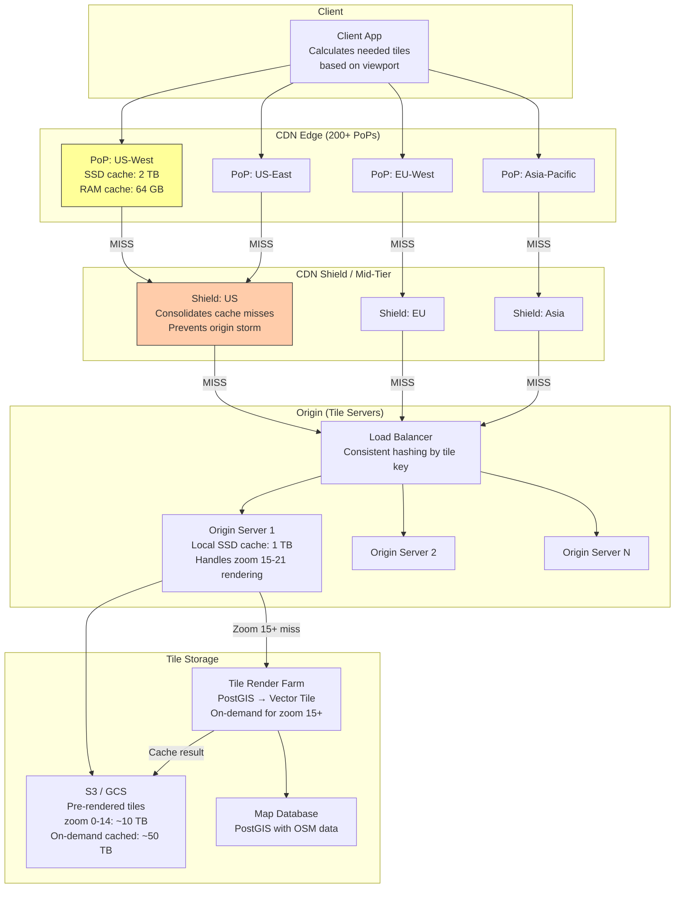

### 2.3 CDN Shield Layer

The **shield** (or mid-tier cache) is critical for preventing "cache stampede" at origin:

```
Without shield:
  - CDN has 200 PoPs
  - If a tile expires, all 200 PoPs simultaneously request it from origin
  - Origin gets 200x spike for one tile = "thundering herd"

With shield:
  - 3-5 regional shields between CDN edge and origin
  - All US PoPs go through US shield; all EU PoPs through EU shield
  - Shield consolidates: if 50 PoPs need the same tile, shield makes ONE origin request
  - Origin sees only 3-5 requests per tile per expiry cycle instead of 200
```

### 2.4 Progressive Tile Loading

Users experience is improved with **progressive loading** -- show something fast,
then refine:

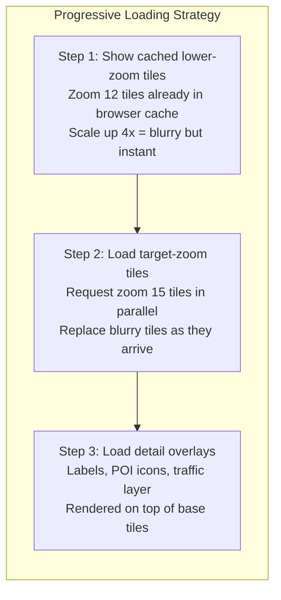

**Tile prefetching:** While the user is viewing an area, the client preloads tiles
for the adjacent viewport (one tile width in each direction). This makes panning
feel instant because tiles are already in the client cache.

```
Viewport: 4x5 = 20 tiles visible
Prefetch: ring of tiles around viewport = ~32 additional tiles
Total per view: ~52 tiles loaded
This costs 50% more bandwidth but makes panning feel instant
```

### 2.5 Offline Maps

Users can download map tiles for offline use (e.g., for travel without data):

```
Offline map download for a city (e.g., San Francisco):

1. Define bounding box: (37.70, -122.52) to (37.82, -122.35)
2. Calculate tiles at each zoom level:
   - Zoom 10: 1 tile
   - Zoom 12: 4 tiles
   - Zoom 14: 64 tiles
   - Zoom 16: 1,024 tiles
   - Total: ~1,400 tiles (zoom 10-16)

3. Download as single compressed bundle:
   - Vector tiles: 1,400 x 12 KB = ~17 MB
   - With satellite: + ~200 MB JPEG tiles
   - With routing graph: + ~50 MB local road network
   - Total: ~270 MB for one city

4. Store on device, update weekly
```

### 2.6 Tile Cache Invalidation

```
Problem: When map data changes, stale tiles must be purged.

Strategy: VERSION-BASED INVALIDATION

1. Each tile has a version number: /tiles/v{version}/{z}/{x}/{y}.pbf
2. When map data changes:
   a. Compute which tiles are affected (bounding box intersection)
   b. Re-render affected tiles with new version number
   c. Update CDN routing to serve new version
   d. Old version tiles expire naturally from CDN cache (24h TTL)
   e. For critical changes (road closure): CDN purge API for specific tiles

3. Advantages:
   - No cache invalidation needed for most changes (new URL = new cache entry)
   - Old and new versions coexist during transition
   - CDN never serves stale data (different URL)
   
4. Cost: ~2x storage during transitions (old + new versions)
   Acceptable because tiles are cheap (~30 KB each)
```

---

## 3. Deep Dive #3: Real-Time Traffic Pipeline

### 3.1 End-to-End Architecture

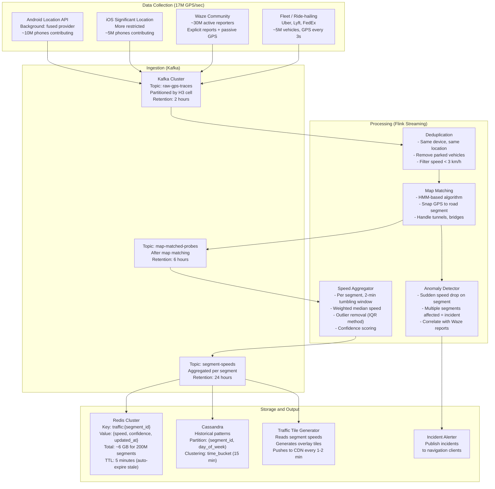

### 3.2 Map Matching Deep Dive

Map matching is the most algorithmically complex part of the traffic pipeline.
Raw GPS has 5-50m error, and in urban areas, there are often multiple candidate
road segments within that radius.

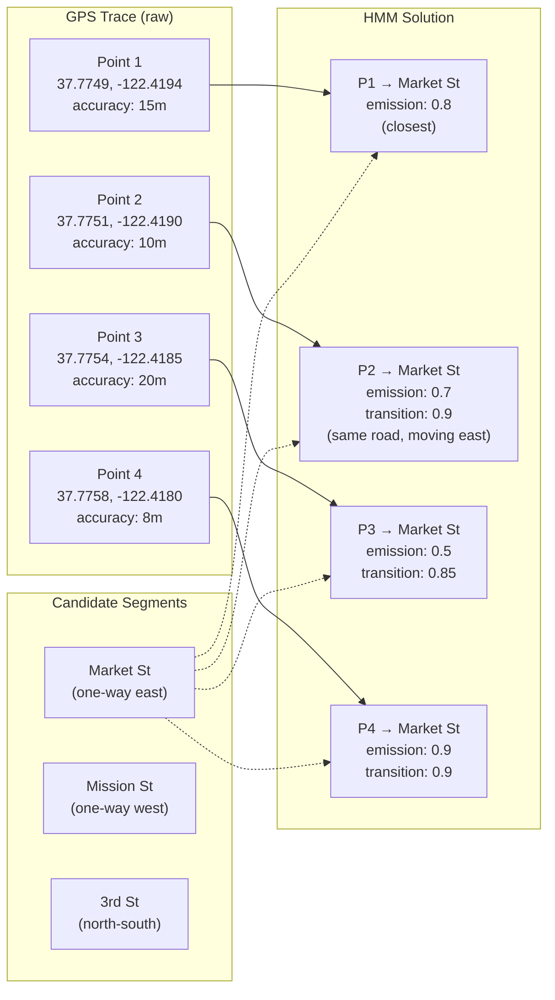

**Hidden Markov Model for Map Matching:**

```
States: Road segments within 50m of each GPS point
Observations: GPS coordinates

Emission Probability (how likely is this GPS point on this segment?):
  P(GPS | segment) = N(distance_to_segment, 0, GPS_accuracy)
  → Gaussian distribution: closer segment = higher probability

Transition Probability (how likely to move from segment A to segment B?):
  P(segment_B | segment_A) = f(route_distance_AB, great_circle_distance_AB)
  → If route distance roughly equals straight-line distance: high probability
  → If route distance >> straight-line: low probability (would need detour)
  → If segments are disconnected: probability = 0

Solution: Viterbi Algorithm
  → Find most likely sequence of segments for entire GPS trace
  → O(N * K^2) where N = trace points, K = candidates per point
  → Typically K = 3-5, so very fast
```

### 3.3 Speed Aggregation Algorithm

```
For segment_id = "seg_12345" in a 2-minute window:

Raw matched probes:
  [45 km/h, 42 km/h, 48 km/h, 3 km/h, 44 km/h, 120 km/h, 46 km/h, 43 km/h]

Step 1: FILTER OUTLIERS
  - Remove speed < 5 km/h (parked/stopped -- unless segment is traffic signal)
  - Remove speed > speed_limit * 1.5 (GPS error)
  - Remaining: [45, 42, 48, 44, 46, 43]

Step 2: COMPUTE WEIGHTED MEDIAN
  - Weight by recency: recent probes weighted 2x
  - Weight by accuracy: higher GPS accuracy weighted more
  - Weighted median: 44.5 km/h

Step 3: COMPUTE CONFIDENCE
  - confidence = min(sample_count / min_samples, 1.0)
  - min_samples = 5 for this road class
  - confidence = min(6/5, 1.0) = 1.0

Step 4: SMOOTHING (temporal)
  - Blend with previous window: 0.7 * current + 0.3 * previous
  - Prevents abrupt jumps in traffic display
  - Smoothed speed = 0.7 * 44.5 + 0.3 * 47.0 = 45.3 km/h

Step 5: FALLBACK
  - If confidence < 0.3 (too few samples):
    Use historical average for this segment, this day, this time
  - If no historical data:
    Use free-flow speed (speed limit * 0.9)

Output to Redis:
  HSET traffic:seg_12345 speed 45.3 confidence 1.0 samples 6 updated 1712505720
  EXPIRE traffic:seg_12345 300  -- TTL 5 minutes
```

### 3.4 Incident Detection

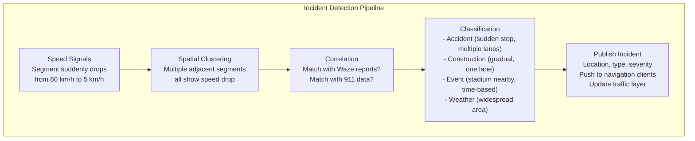

**Incident severity scoring:**
```
severity = f(speed_drop_ratio, affected_segments, affected_lanes, duration)

  - Minor: 1 segment, speed drops 50%     → yellow alert
  - Moderate: 2-5 segments, speed drops 70% → orange alert, suggest reroute
  - Severe: 5+ segments, near standstill    → red alert, force reroute
  - Road closure: speed = 0 for 10+ minutes → block edge in routing graph
```

---

## 4. Deep Dive #4: ETA Prediction with ML

### 4.1 Why Simple Summation Fails

```
Naive ETA = sum(segment_length / segment_speed) for all segments on route

This is wrong because:
  1. Intersection delays: traffic lights, stop signs add 10-60 sec each
  2. Turn penalties: left turns across traffic take longer
  3. Time-of-day effects: a route at 3 PM takes very different time than at 5:30 PM
  4. Weather: rain adds ~15%, snow adds ~30%
  5. Events: concert at nearby stadium can add 20+ minutes
  6. Day-of-week: Friday evening is different from Tuesday evening
  7. GPS sampling bias: speed data comes from phones on the road NOW,
     but future segments will have different conditions by the time you reach them
  8. Route-level effects: a sequence of green lights (green wave) is faster
     than what per-segment prediction would suggest
```

**Google Maps ETA is typically within 10% of actual travel time.**
This requires ML models trained on billions of completed trips.

### 4.2 ML Model Architecture

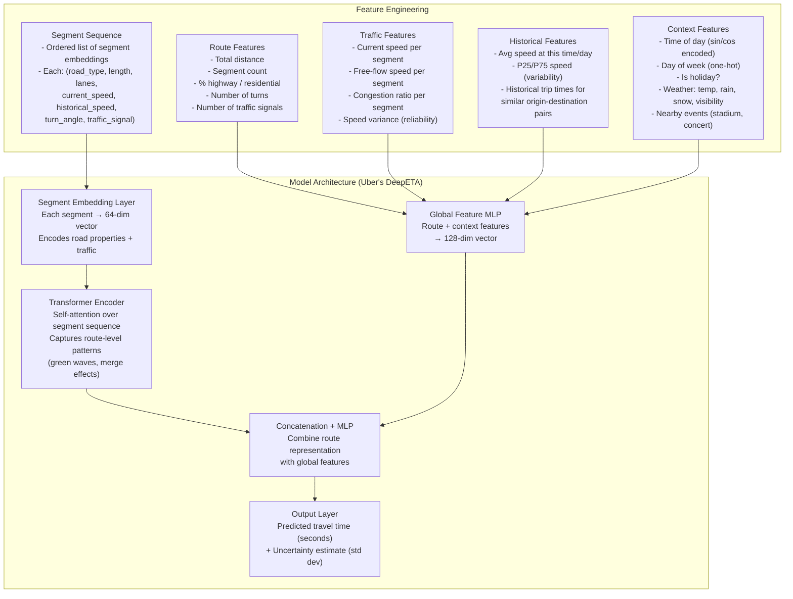

### 4.3 Training Pipeline

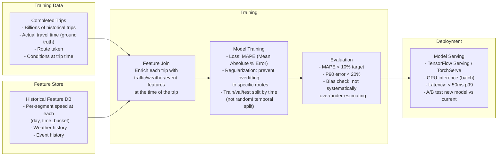

### 4.4 Handling Future Departure Times

When a user asks "how long will it take if I leave at 8 AM tomorrow?":

```
The system CANNOT use live traffic (it is for tomorrow).
Instead:

1. Find route using current road graph (topology does not change daily)
2. For each segment on the route, look up HISTORICAL speed pattern:
   - Day: Wednesday (tomorrow)
   - Time: 8:00 AM start, but account for travel time to each segment
   - Segment 1 (8:00 AM): historical speed = 40 km/h
   - Segment 50 (8:15 AM): historical speed = 25 km/h (rush hour peak)
   - Segment 100 (8:30 AM): historical speed = 35 km/h (past peak)
3. Apply ML model with historical features only (no live traffic)
4. Return prediction with wider confidence interval (less certain without live data)
```

### 4.5 ETA Refinement During Navigation

```
At navigation start:
  ETA = 45 minutes (predicted)

During navigation (every 30 seconds):
  1. Actual travel time on completed segments: 12 minutes
  2. Predicted time for completed segments was: 11 minutes
  3. Error so far: +1 minute (slightly behind prediction)
  4. Remaining segment prediction: 33 minutes
  5. Adjusted remaining: 33 * (12/11) = 36 minutes (scale by observed error ratio)
  6. Updated ETA: 12 + 36 = 48 minutes

  This "blend actual + adjusted prediction" approach gives increasingly
  accurate ETAs as the trip progresses. By 75% through the trip,
  ETA is typically within 2-3% of actual.
```

---

## 5. Scaling Architecture

### 5.1 Multi-Region Deployment

```mermaid
graph TB
    subgraph "US Region (us-east-1 + us-west-2)"
        US_CDN["CDN PoPs (80+)<br/>US tile serving"]
        US_GW["API Gateway<br/>US traffic"]
        US_ROUTE["Routing Cluster<br/>NA graph (30 GB)<br/>20 replicas"]
        US_TRAFFIC["Traffic Pipeline<br/>US GPS data<br/>Flink + Kafka"]
        US_SEARCH["Search Cluster<br/>US places<br/>Elasticsearch"]
        US_REDIS["Redis Cluster<br/>US traffic state"]
    end

    subgraph "EU Region (eu-west-1)"
        EU_CDN["CDN PoPs (60+)"]
        EU_GW["API Gateway"]
        EU_ROUTE["Routing Cluster<br/>EU graph (25 GB)<br/>15 replicas"]
        EU_TRAFFIC["Traffic Pipeline<br/>EU GPS data"]
        EU_SEARCH["Search Cluster<br/>EU places"]
        EU_REDIS["Redis Cluster<br/>EU traffic state"]
    end

    subgraph "APAC Region (ap-southeast-1)"
        AP_CDN["CDN PoPs (40+)"]
        AP_GW["API Gateway"]
        AP_ROUTE["Routing Cluster<br/>Asia graph (35 GB)<br/>15 replicas"]
        AP_TRAFFIC["Traffic Pipeline<br/>APAC GPS data"]
        AP_SEARCH["Search Cluster<br/>APAC places"]
        AP_REDIS["Redis Cluster<br/>APAC traffic state"]
    end

    subgraph "Global Services"
        DNS["GeoDNS<br/>Route users to<br/>nearest region"]
        OVERLAY["Cross-Region Router<br/>Overlay graph<br/>For intercontinental routes"]
        MAP_STORE["Map Tile S3<br/>Replicated globally"]
    end

    DNS --> US_GW & EU_GW & AP_GW
    US_ROUTE & EU_ROUTE & AP_ROUTE --> OVERLAY

    style DNS fill:#ff9,stroke:#333
```

### 5.2 Auto-Scaling Strategy

```
Service-specific scaling triggers:

Map Tile Servers:
  - Scale on: CDN cache miss rate * QPS (origin load)
  - Scale up when: origin QPS > 80% capacity
  - Scale down when: origin QPS < 30% capacity
  - Min: 20 servers, Max: 200 servers
  - Note: CDN absorbs most variation; origin is relatively stable

Routing Engine:
  - Scale on: query latency p99
  - Scale up when: p99 > 2 seconds
  - Scale down when: p99 < 500ms AND QPS < 50% capacity
  - Min: 10 per region (for redundancy), Max: 100 per region
  - Note: Each server holds full regional graph in RAM; scaling means more replicas
  - CANNOT shard the graph easily (routes span partitions)

Traffic Pipeline (Flink):
  - Scale on: Kafka consumer lag
  - Scale up when: lag > 30 seconds (falling behind GPS data)
  - Scale down when: lag < 5 seconds AND CPU < 40%
  - Min: 20 workers, Max: 200 workers
  - Kafka partitioned by H3 cell → Flink parallelism matches partitions

Place Search (Elasticsearch):
  - Scale on: query latency + QPS
  - Scale up when: p99 > 200ms OR QPS > 80% cluster capacity
  - Scale down when: p99 < 50ms AND QPS < 30%
  - Min: 10 nodes, Max: 100 nodes
```

### 5.3 Data Replication Strategy

```
Map Tiles (S3):
  - S3 Cross-Region Replication to all 3 regions
  - CDN pulls from nearest S3 region
  - Eventual consistency OK (tiles change infrequently)

Road Graph (in-memory binary files):
  - Each region holds its regional partition
  - Overlay graph replicated to ALL regions
  - Updated weekly via blue/green deployment
  - Stored in S3, pulled to server local SSD, memory-mapped

Traffic State (Redis):
  - NOT replicated across regions (traffic is regional)
  - US Redis has US segment speeds; EU Redis has EU speeds
  - Cross-region routes use traffic data from both regions via API calls

Place Data (Elasticsearch + PostgreSQL):
  - PostgreSQL: primary in US, read replicas in EU and APAC
  - Elasticsearch: independent clusters per region, synced from PostgreSQL
  - Place updates propagate within 5 minutes (CDC pipeline)

GPS Data (Kafka):
  - Regional Kafka clusters (not cross-region)
  - GPS data stays in the region it was generated
  - Historical aggregates shared via Cassandra (cross-region replication)
```

---

## 6. Uber-Specific Design Considerations

### 6.1 H3 Hexagonal Grid System

Uber built the **H3 geospatial indexing system** as an open-source replacement for
QuadTree / geohash approaches. It is central to their mapping and ETA architecture.

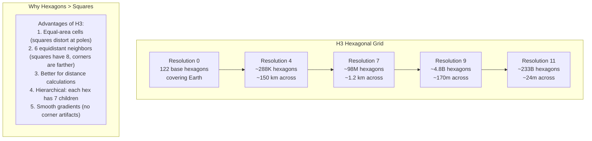

**How Uber uses H3 for ETA:**
```
1. Each road segment is tagged with its H3 cell (resolution 9, ~170m)
2. ETA model uses H3 cell as a feature → captures local traffic patterns
3. H3 hierarchy enables multi-resolution aggregation:
   - Resolution 9: per-block ETA adjustment (micro-level)
   - Resolution 7: neighborhood-level demand/supply (for surge pricing)
   - Resolution 4: city-level traffic patterns

4. H3 indexing for "nearby" queries:
   - "Find 5 nearest drivers to rider"
   - Get rider's H3 cell at resolution 9
   - Search that cell + 1-ring of neighbors (7 cells total)
   - If not enough drivers, expand to 2-ring (19 cells)
   - Much faster than radius search: O(1) cell lookup vs O(log n) spatial index
```

### 6.2 Road Snapping for GPS Traces

Uber drivers send GPS every 3-4 seconds. These must be snapped to roads for:
- Fare calculation (actual road distance, not straight-line)
- ETA accuracy (know which road the driver is on)
- Navigation (detect turns, deviations)

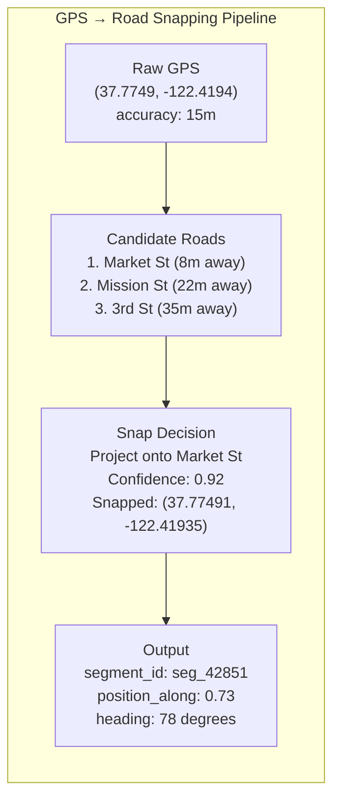

**Uber's snapping is more aggressive than Google's** because they know the driver
is on a road (not walking through a park), which simplifies the problem.

### 6.3 Uber's Routing vs Google Maps

| Aspect | Google Maps | Uber |
|--------|------------|------|
| **Graph source** | Proprietary (Google Street View + users) | OpenStreetMap + internal corrections |
| **Routing engine** | Proprietary CH variant | OSRM (Open Source Routing Machine) customized |
| **ETA model** | DeepMind ML model | DeepETA (transformer-based) |
| **Traffic data** | Android phones + Waze | Uber/Lyft drivers (higher density in urban areas) |
| **Spatial indexing** | S2 Geometry (square cells) | H3 (hexagonal cells) |
| **Primary use case** | General navigation | Fare estimation, driver dispatch, ETA |
| **Offline routing** | Supported | Not needed (drivers always have data) |
| **Transit routing** | Full GTFS support | Not supported (only car/bike) |

### 6.4 Uber-Specific ETA Requirements

```
Uber's ETA has different requirements than Google Maps:

1. PICKUP ETA (driver → rider): Must be accurate within 1-2 minutes
   - Distance: typically 1-5 km
   - Used for: rider waiting experience, cancellation decisions
   - Updates every 5 seconds during driver approach

2. TRIP ETA (pickup → destination): Used for fare BEFORE ride starts
   - Must be accurate because fare is committed upfront
   - Error = Uber loses money (overestimate) or rider trust (underestimate)
   - Uses "surge-adjusted" ETA (heavier traffic = higher fare)

3. BATCH ETA (1 rider, 20 nearby drivers): Distance matrix
   - For matching: which of 20 drivers has shortest ETA to rider?
   - Must compute 20 ETAs in < 100ms
   - Uses shared Dijkstra optimization (single search from rider)

4. POOL/SHARED ETA: Multiple pickups/dropoffs on one route
   - "If we pick up rider B on the way to rider A's destination,
     how much does rider A's ETA increase?"
   - Requires insertion-cost computation into existing route
```

---

## 7. Failure Modes and Resilience

### 7.1 Failure Scenarios and Mitigations

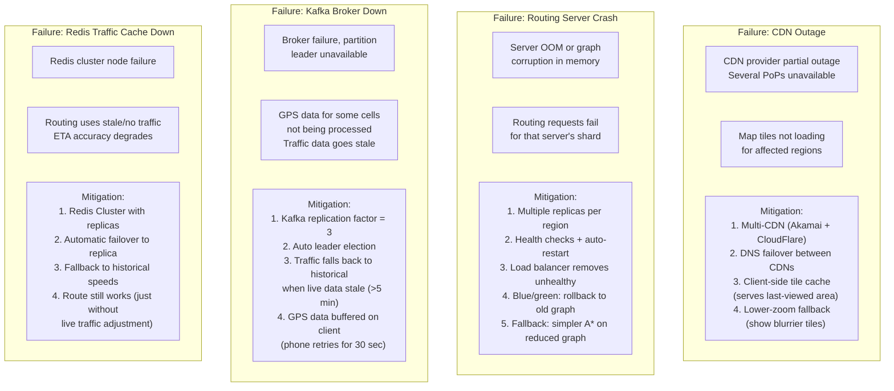

### 7.2 Graceful Degradation Ladder

```
Level 0: NORMAL OPERATION
  - All services healthy
  - Live traffic, ML ETA, full search

Level 1: TRAFFIC DEGRADATION
  - GPS pipeline delayed or partial
  - Fallback: use historical traffic patterns
  - ETA accuracy drops from 10% to 15% error
  - User sees: slightly less accurate traffic colors

Level 2: SEARCH DEGRADATION
  - Elasticsearch cluster overloaded
  - Fallback: limit autocomplete to top-100K places (cached)
  - Disable fuzzy matching, only exact prefix
  - User sees: fewer search suggestions, no typo correction

Level 3: ROUTING DEGRADATION
  - Routing servers overloaded or partially down
  - Fallback: cached popular routes (top 10K city pairs)
  - Simplify to single route (no alternatives)
  - Disable live traffic in routing (use free-flow speeds)
  - User sees: routes still work but may not avoid traffic

Level 4: TILE DEGRADATION
  - CDN and origin both struggling
  - Fallback: serve lower-zoom tiles (zoom 12 instead of 15)
  - Client upscales (blurry but functional)
  - Disable satellite/terrain modes
  - User sees: blurry map but still usable

Level 5: OFFLINE MODE
  - Network connectivity lost on client
  - Fallback: offline map tiles + offline routing graph
  - No live traffic, no search (use downloaded data)
  - Navigation continues with downloaded route
  - User sees: "Offline mode" banner, basic functionality
```

---

## 8. Key Trade-offs and Design Decisions

### 8.1 Vector Tiles vs Raster Tiles

```
Decision: Use VECTOR tiles for default map, RASTER for satellite

Trade-off:
  + Vector: 70% less bandwidth, style flexibility, smooth rotation
  + Vector: multi-language labels without re-rendering
  - Vector: requires WebGL on client (not all devices support it)
  - Vector: higher client CPU usage (rendering on device)
  - Vector: more complex client code

  + Raster: works everywhere (simple image display)
  + Raster: necessary for photographic imagery (satellite)
  - Raster: huge bandwidth, fixed style, pixelated when rotated

Google Maps approach:
  - Vector tiles for default/dark/terrain styles (since 2017)
  - Raster tiles for satellite imagery
  - Fallback to raster for very old browsers
```

### 8.2 Contraction Hierarchies vs A*

```
Decision: Use CH for production routing, A* as fallback

Trade-off:
  + CH: 1000x faster queries (1ms vs 200ms for A*)
  - CH: 2-4 hours preprocessing time
  - CH: cannot easily handle dynamic edge weights (live traffic)
  - CH: 2x more memory (shortcut edges)

  + A*: no preprocessing needed
  + A*: naturally handles dynamic weights
  - A*: too slow for production at scale (200ms per query, 500K nodes visited)

Hybrid approach (what Google and OSRM actually do):
  - Use CH for the base graph (static topology)
  - At query time, adjust CH edge weights using live traffic from Redis
  - "Customizable Contraction Hierarchies" (CCH) enables this
  - Adds ~5ms overhead but gives traffic-aware results
  - Fallback to A* if CH graph is being rebuilt
```

### 8.3 Precomputed vs On-Demand Tiles

```
Decision: Precompute zoom 0-14, on-demand for zoom 15+

Trade-off:
  Precomputing ALL tiles (zoom 0-21):
    + Instant serving, no render latency
    - 1.8 trillion tiles * 12 KB = 22 PB storage (impossible)
    - Most high-zoom tiles are never requested
    - Any map change requires re-rendering millions of tiles

  On-demand ALL tiles:
    + Zero storage needed
    + Always fresh data
    - Every request requires rendering (~50-200ms)
    - Cannot handle 350K QPS with rendering

  Hybrid (what Google Maps does):
    + Precompute low zoom (0-14): 350M tiles, ~4 TB, covers all requests
    + On-demand for high zoom (15-21): render and cache
    + CDN + origin cache absorb 99.5% of requests
    + Only ~0.5% require fresh rendering
```

### 8.4 GPS Sampling Rate vs Battery Life

```
Decision: Adaptive GPS sampling rate

Trade-off:
  High rate (every 1 second):
    + Best traffic data quality
    + Best map matching accuracy
    - Drains phone battery fast
    - 17x more data to process

  Low rate (every 30 seconds):
    + Minimal battery impact
    - Poor map matching (large gaps between points)
    - Cannot detect short-lived congestion

  Adaptive approach (what Google/Apple use):
    - When Maps is open and navigating: every 1-3 seconds (high rate)
    - When Maps is open but not navigating: every 10 seconds
    - When Maps is in background: every 30-60 seconds (significant location changes)
    - When not driving (walking speed): reduce rate to save battery
    - When in tunnel/parking garage: stop GPS, use last known position
```

### 8.5 ETA: Simple Summation vs ML Model

```
Decision: Use ML model for production ETA

Trade-off:
  Simple summation (sum of segment_length / segment_speed):
    + Easy to implement and debug
    + No training pipeline needed
    + Explainable ("segment X contributed 5 min")
    - Systematic 15-25% error (misses intersection delays, weather, etc.)
    - No confidence interval

  ML model:
    + 10% MAPE (much more accurate)
    + Handles complex interactions (weather + rush hour + event)
    + Provides confidence intervals
    - Black box (hard to explain why ETA changed)
    - Requires massive training data pipeline
    - Model drift: must retrain regularly
    - Inference latency: 10-50ms (adds up at scale)

  Hybrid (production approach):
    - Use ML model for primary ETA
    - Use simple summation as sanity check (if ML output differs by >50%, flag)
    - Use simple summation as fallback when ML model unavailable
```

### 8.6 Single Global Graph vs Partitioned Graph

```
Decision: Partitioned graph with overlay network

Trade-off:
  Single global graph on every server:
    + Simplest architecture
    + Any server can handle any route
    - 100 GB RAM per server (expensive)
    - 30-minute reload time for updates
    - Single point of failure per server

  Partitioned graph:
    + Each server needs only 20-30 GB (its region)
    + Faster updates (only reload one partition)
    + Better fault isolation (EU crash does not affect US)
    - Cross-region routes need overlay graph coordination
    - More complex query routing
    - Border node management adds complexity

  Google Maps: partitioned with overlay (confirmed by research papers)
  OSRM: supports both (configurable)
  Uber: single graph per city (cities are independent routing domains)
```

---

## 9. Interview Tips and Common Follow-ups

### 9.1 How to Structure Your Answer (30-40 Minutes)

```
TIMELINE FOR "DESIGN GOOGLE MAPS" INTERVIEW

Minutes 0-5: CLARIFY REQUIREMENTS
  - "Are we focusing on map rendering, routing, or the full system?"
  - "What scale? Google Maps scale (1B users) or a startup?"
  - "Should I cover offline maps and transit, or focus on driving?"
  - Confirm: map tiles, search, routing, ETA, traffic, navigation

Minutes 5-10: BACK-OF-ENVELOPE ESTIMATION
  - Map tiles: pyramid math, CDN bandwidth
  - Road graph: nodes/edges, fits in RAM (this impresses interviewers!)
  - GPS ingestion: 17M/sec from 50M phones
  - Key insight: "This is a CDN + stream processing + graph problem"

Minutes 10-15: API DESIGN
  - Tile API: GET /tiles/{z}/{x}/{y}
  - Directions API: POST /directions with origin, destination, mode
  - Briefly mention ETA, search, navigation APIs

Minutes 15-25: HIGH-LEVEL DESIGN
  - Draw the architecture: CDN → Tile Service, API → Routing/Search/Traffic
  - Map tiles: tile pyramid, vector tiles, CDN-first
  - Routing: graph in memory, Contraction Hierarchies, ~1ms queries
  - Traffic: GPS → Kafka → Map Matching → Segment Speeds → Redis
  - ETA: historical + live traffic + ML model

Minutes 25-35: DEEP DIVE (interviewer chooses one)
  - If routing: explain CH algorithm, graph partitioning, live traffic overlay
  - If traffic: explain map matching (HMM), speed aggregation, incident detection
  - If tiles: explain CDN layers, progressive loading, cache invalidation
  - If ETA: explain ML features, training pipeline, Uber's DeepETA

Minutes 35-40: SCALING AND TRADE-OFFS
  - Multi-region deployment
  - Graceful degradation
  - Key trade-offs (vector vs raster, CH vs A*, precomputed vs on-demand)
```

### 9.2 Common Follow-up Questions

```
Q: "How would you handle routing for a new country with no traffic data?"
A: - Use free-flow speed estimates from road type (highway=100, residential=30)
   - Import OSM road data (available globally)
   - Historical patterns from similar cities as prior (transfer learning)
   - As users adopt, GPS data fills in actual speeds within weeks

Q: "How does rerouting work when there's a new accident?"
A: 1. Incident detected via speed drop on segment (within 60 seconds)
   2. Segment marked as severely congested in Redis
   3. Active navigation sessions check traffic ahead every 30 seconds
   4. If new ETA via current route is >5 min worse, compute alternative
   5. Push reroute suggestion to client via WebSocket
   6. If user accepts (or auto-reroute is on), switch to new route

Q: "Why not use Dijkstra? Why is CH better?"
A: - Dijkstra visits ~500K nodes for SF→LA (2 seconds)
   - At 3K QPS, that is 1.5B node visits/sec = impossible
   - CH visits ~500 nodes (1ms) by using preprocessed shortcut edges
   - 3K QPS * 500 nodes = 1.5M node visits/sec = trivial
   - Trade-off: 2-4 hours preprocessing, but queries are 1000x faster

Q: "How do you handle privacy with all this GPS data?"
A: - GPS data is anonymized (no user ID, only device hash)
   - Device hash is rotated daily (cannot track long-term)
   - Data aggregated at segment level (individual traces discarded after processing)
   - Differential privacy: add noise to segments with few samples
   - Users can opt out (reduces traffic data quality in that area)

Q: "How would you design this for Uber specifically?"
A: - Focus on driving-only routing (no transit/walking/cycling)
   - H3 hexagonal indexing instead of QuadTree
   - ETA model trained on Uber trip data (better for ride-hailing patterns)
   - Pickup ETA is critical (within 1-2 min accuracy needed)
   - Batch ETA for matching (20 drivers → 1 rider, single shared Dijkstra)
   - Road snapping more aggressive (driver is always on a road)
   - Surge pricing uses same traffic/demand data
```

### 9.3 What Interviewers Are Looking For

```
STRONG SIGNALS (things that impress):

1. "The road graph fits in RAM" (shows you did the math: 500M nodes * 16B = 8 GB)
2. "Contraction Hierarchies enable 1ms routing" (knows the actual algorithm used)
3. "Map tiles are a CDN problem, not a compute problem" (right framing)
4. "Traffic is a stream processing problem: GPS → map matching → segment speeds"
5. "ETA needs ML because simple summation misses intersection delays and weather"
6. Drawing the tile pyramid and explaining {z}/{x}/{y} addressing
7. Explaining why vector tiles are better than raster for default maps
8. Knowing H3 if interviewing at Uber

RED FLAGS (things that hurt):

1. "Store the map as one big image" (does not understand tiling)
2. "Use Dijkstra for routing" (does not know about CH or A*)
3. "Just query the database for the route" (does not understand graph-in-memory)
4. Ignoring the CDN layer for tiles (will not work at scale)
5. Not mentioning map matching for traffic (GPS-to-road is non-trivial)
6. "Use a relational DB for the road graph" (SQL JOINs are too slow)
7. Proposing real-time tile rendering at 350K QPS (impossible without caching)
```

### 9.4 Comparison With Other System Design Problems

```
Google Maps shares components with:

DESIGN UBER (Chapter 01):
  - Both need: GPS ingestion, road graph, ETA, traffic
  - Uber focuses: matching, surge pricing, ride lifecycle
  - Maps focuses: tile rendering, search, turn-by-turn navigation

DESIGN YELP (place search):
  - Both need: geospatial search, place details, reviews
  - Yelp focuses: review system, recommendation, photos
  - Maps focuses: geocoding, autocomplete, proximity ranking

DESIGN CDN:
  - Map tile serving IS a CDN design problem
  - Maps adds: tile generation, cache invalidation, progressive loading

DESIGN UBER EATS / DOORDASH:
  - Both need: routing, ETA, real-time tracking
  - Delivery focuses: order matching, restaurant integration
  - Maps focuses: general-purpose navigation, multiple transport modes

If you can design Google Maps well, you can answer ~5 other system design questions
by reusing components. The road graph + CH routing is reusable for any location-based
service. The tile system is reusable for any map visualization. The traffic pipeline
is reusable for any real-time geospatial data aggregation.
```

### 9.5 Production Reality Check

```
WHAT GOOGLE MAPS ACTUALLY USES (confirmed from public sources):

Map Tiles:
  - Vector tiles (since 2017 on web, earlier on mobile)
  - Custom WebGL renderer (not Mapbox GL)
  - ~100 PB total map data (including Street View, 3D)

Routing:
  - Customizable Contraction Hierarchies (research paper 2012)
  - Multi-Level Dijkstra for transit
  - DeepMind ML for ETA (2020 paper: 50% reduction in ETA error)

Traffic:
  - 1B+ km of roads monitored
  - Android location services (opt-in) + Waze acquisition (2013)
  - Processes data from 1B+ monthly active devices

Search:
  - Knowledge Graph for place data (connected to Google Search)
  - 200M+ businesses and places indexed
  - Street View imagery for place verification

Infrastructure:
  - Google's internal infrastructure (Borg, Bigtable, Spanner, Colossus)
  - NOT on public cloud (Google IS the cloud)
  - Estimated 1000s of servers dedicated to Maps

WHAT UBER ACTUALLY USES:

Routing:
  - OSRM (Open Source Routing Machine) + custom modifications
  - Valhalla (open-source) for some markets

ETA:
  - DeepETA: transformer model processing segment sequences
  - ~10% MAPE on production traffic

Spatial Indexing:
  - H3: open-sourced by Uber in 2018
  - Used for: surge pricing zones, ETA regions, demand prediction

Maps:
  - Switched from Google Maps to internal system (2017)
  - Uses Mapbox for rendering
  - OSM for base road data
```

---

## Summary: The Complete Picture

```
                 DESIGN GOOGLE MAPS - COMPLETE SYSTEM
  ┌──────────────────────────────────────────────────────────┐
  │                                                          │
  │  ┌─────────────────────────────────────────────────────┐ │
  │  │              CLIENT (Web / Mobile)                  │ │
  │  │  Map Renderer (WebGL) + Navigation UI + GPS Sensor  │ │
  │  └─────────────────┬───────────────────┬───────────────┘ │
  │                    │                   │                  │
  │  ┌─────────────────▼─────┐  ┌──────────▼──────────────┐ │
  │  │      CDN (200+ PoPs)  │  │  API Gateway + WebSocket │ │
  │  │  95% tile cache hit   │  │  Auth, Rate Limit        │ │
  │  └─────────┬─────────────┘  └──────┬───────────────────┘ │
  │            │                       │                      │
  │  ┌─────────▼──────┐  ┌────────────▼──────────────────┐  │
  │  │  TILE SERVICE   │  │         CORE SERVICES          │  │
  │  │  Vector + Raster│  │                                │  │
  │  │  S3 + Renderer  │  │  Routing Engine (CH in RAM)    │  │
  │  └────────────────┘  │  Place Search (Elasticsearch)   │  │
  │                       │  ETA Service (ML model)         │  │
  │                       │  Traffic Service (GPS pipeline) │  │
  │                       │  Navigation (WebSocket + reroute│  │
  │                       └────────────────────────────────┘  │
  │                                                           │
  │  ┌───────────────────────────────────────────────────┐   │
  │  │              DATA PIPELINE                         │   │
  │  │  17M GPS/sec → Kafka → Flink (map match) →        │   │
  │  │  → Redis (live traffic) + Cassandra (historical)   │   │
  │  └───────────────────────────────────────────────────┘   │
  │                                                           │
  │  ┌───────────────────────────────────────────────────┐   │
  │  │              STORAGE                               │   │
  │  │  Redis: live traffic (6 GB)                        │   │
  │  │  In-Memory: road graph + CH (100 GB)               │   │
  │  │  Elasticsearch: 2B+ places (5 TB)                  │   │
  │  │  S3/CDN: map tiles (15 TB) + satellite (15 PB)    │   │
  │  │  Cassandra: historical traffic (100 GB)            │   │
  │  └───────────────────────────────────────────────────┘   │
  │                                                           │
  │  KEY NUMBERS:                                             │
  │  1B MAU | 350K tile QPS | 3K routing QPS | 17M GPS/sec  │
  │  Road graph fits in RAM | CH routing in 1ms              │
  │  95% CDN hit rate | ETA within 10% | Reroute in <2s     │
  └──────────────────────────────────────────────────────────┘
```
