# Design Google Maps / Navigation System: High-Level Design

## Table of Contents
- [1. Architecture Overview](#1-architecture-overview)
- [2. System Architecture Diagram](#2-system-architecture-diagram)
- [3. Map Tile System](#3-map-tile-system)
- [4. Place Search Service](#4-place-search-service)
- [5. Routing Engine](#5-routing-engine)
- [6. ETA Service](#6-eta-service)
- [7. Traffic Service](#7-traffic-service)
- [8. Navigation Service](#8-navigation-service)
- [9. Data Flow Walkthroughs](#9-data-flow-walkthroughs)
- [10. Database and Storage Design](#10-database-and-storage-design)
- [11. Communication Patterns](#11-communication-patterns)

---

## 1. Architecture Overview

The system is organized as a **read-heavy microservices architecture** with six core
services, a CDN layer for tile serving, a stream processing pipeline for traffic data,
and a graph computation engine for routing. The two main data flows are: (1) serving
pre-computed map data at massive read scale, and (2) ingesting real-time GPS data
to produce live traffic and ETA.

**Key architectural decisions:**
1. **CDN-first for map tiles** -- 95%+ of tile requests never hit origin; tiles are immutable for a given version
2. **Vector tiles over raster** -- client-side rendering enables style changes, rotation, and smaller payloads
3. **QuadTree tile addressing** -- standard Web Mercator {z}/{x}/{y} scheme matches CDN caching naturally
4. **Contraction Hierarchies for routing** -- preprocessed graph enables 1ms route queries vs 2s for raw Dijkstra
5. **Kafka for GPS ingestion** -- decouples 17M/sec GPS ingest from traffic computation
6. **Redis for real-time traffic** -- sub-millisecond lookups for segment speeds during route computation
7. **Graph in memory** -- entire road network (~100 GB with CH) fits in RAM on modern servers

---

## 2. System Architecture Diagram

```mermaid
graph TB
    subgraph Clients
        WEB[Web App<br/>JavaScript + WebGL]
        MOB[Mobile App<br/>iOS / Android]
        API_C[API Customers<br/>Uber, Lyft, DoorDash]
    end

    subgraph CDN Layer
        CDN[Global CDN<br/>Akamai / CloudFlare<br/>200+ PoPs<br/>95% cache hit rate]
    end

    subgraph Gateway Layer
        AG[API Gateway<br/>Kong / Envoy<br/>- Auth, Rate Limiting<br/>- API key validation<br/>- Request routing]
        WSG[WebSocket Gateway<br/>- Navigation sessions<br/>- Real-time guidance<br/>- GPS stream ingestion]
    end

    subgraph Core Services
        MTS[Map Tile Service<br/>- Serve / render tiles<br/>- Vector + raster<br/>- Style application<br/>- Cache management]
        PSS[Place Search Service<br/>- Autocomplete<br/>- Full-text + geo search<br/>- Geocoding / reverse<br/>- Place details]
        RTE[Routing Engine<br/>- Shortest path (CH/A*)<br/>- Multi-modal routing<br/>- Alternative routes<br/>- Waypoint optimization]
        ETA_S[ETA Service<br/>- Travel time prediction<br/>- Historical + real-time<br/>- ML model inference<br/>- Distance matrix]
        TFS[Traffic Service<br/>- GPS aggregation<br/>- Segment speed calc<br/>- Incident detection<br/>- Traffic layer tiles]
        NAV[Navigation Service<br/>- Turn-by-turn guidance<br/>- Deviation detection<br/>- Rerouting logic<br/>- Lane guidance]
    end

    subgraph Stream Processing
        KFK[Apache Kafka<br/>- gps-traces topic<br/>- traffic-updates topic<br/>- incident-events topic]
        FSP[Flink / Spark Streaming<br/>- Map matching<br/>- Speed aggregation<br/>- Anomaly detection]
    end

    subgraph Data Stores
        S3[(Object Storage<br/>S3 / GCS<br/>Map tiles, satellite<br/>imagery, offline packs)]
        ES[(Elasticsearch<br/>Place names, addresses<br/>Full-text + geospatial<br/>index)]
        PG[(PostgreSQL<br/>Places, users<br/>Navigation sessions<br/>API keys)]
        RD[(Redis Cluster<br/>Real-time traffic<br/>Segment speeds<br/>Tile metadata cache)]
        GS[(Graph Store<br/>In-memory road graph<br/>Contraction Hierarchies<br/>~100 GB per replica)]
        CS[(Cassandra / BigQuery<br/>Historical traffic<br/>GPS trace archive<br/>Analytics)]
    end

    subgraph External Data
        OSM[OpenStreetMap<br/>Road network updates]
        TPROV[Traffic Providers<br/>Waze, HERE, TomTom]
        SAT[Satellite Imagery<br/>Maxar, Airbus]
        GTFS[Transit Agencies<br/>GTFS feeds]
    end

    WEB -->|HTTPS| CDN
    MOB -->|HTTPS| CDN
    CDN -->|Cache miss| MTS
    WEB & MOB & API_C -->|HTTPS| AG
    MOB -->|WebSocket| WSG

    AG --> PSS
    AG --> RTE
    AG --> ETA_S
    AG --> TFS
    WSG --> NAV
    WSG --> KFK

    MTS --> S3
    MTS --> RD
    PSS --> ES
    PSS --> PG
    RTE --> GS
    RTE --> RD
    ETA_S --> RD
    ETA_S --> CS
    ETA_S --> GS
    TFS --> RD
    TFS --> KFK
    NAV --> RTE
    NAV --> TFS

    KFK --> FSP
    FSP --> RD
    FSP --> CS

    OSM -->|Weekly import| GS
    OSM -->|Weekly import| MTS
    TPROV -->|Real-time feed| TFS
    SAT -->|Periodic upload| S3
    GTFS -->|Daily import| RTE

    style CDN fill:#ff9,stroke:#333
    style GS fill:#9f9,stroke:#333
    style RD fill:#f99,stroke:#333
    style KFK fill:#99f,stroke:#333
```

---

## 3. Map Tile System

### 3.1 How Web Maps Work: The Tile Pyramid

The entire Earth is projected onto a flat square using the **Web Mercator projection**,
then recursively subdivided into tiles. At each zoom level z, the world is divided
into `2^z x 2^z` tiles, each 256x256 pixels (or 512x512 for high-DPI).

```
Zoom Level 0: 1 tile         (entire world)
Zoom Level 1: 4 tiles        (2x2 grid)
Zoom Level 2: 16 tiles       (4x4 grid)
...
Zoom Level 10: ~1M tiles     (city-level detail)
Zoom Level 15: ~1B tiles     (street-level detail)
Zoom Level 21: ~4.4T tiles   (building-level detail)
```

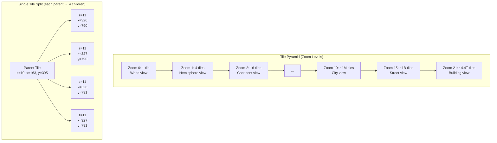

### 3.2 Tile Addressing: QuadTree / Slippy Map

Each tile is identified by three coordinates: `(z, x, y)` where:
- `z` = zoom level (0-21)
- `x` = column index (0 to 2^z - 1, left to right)
- `y` = row index (0 to 2^z - 1, top to bottom)

**Converting lat/lng to tile coordinates:**
```
x = floor((lng + 180) / 360 * 2^z)
y = floor((1 - ln(tan(lat_rad) + sec(lat_rad)) / pi) / 2 * 2^z)
```

This is a **QuadTree** decomposition: each tile at zoom z has exactly 4 children
at zoom z+1. The tile key `{z}/{x}/{y}` naturally maps to a QuadTree path, which
maps perfectly to CDN cache keys and file paths.

### 3.3 Vector Tiles vs Raster Tiles

| Aspect | Raster Tiles | Vector Tiles |
|--------|-------------|--------------|
| **Format** | PNG, JPEG, WebP images | Protocol Buffers (PBF / MVT) |
| **Rendering** | Pre-rendered on server | Rendered on client (WebGL / GPU) |
| **Avg size** | 20-50 KB | 5-15 KB |
| **Style changes** | Requires re-rendering all tiles | Client applies style dynamically |
| **Rotation/tilt** | Pixelated when rotated | Smooth at any angle |
| **Labels** | Baked into image (fixed language) | Client renders labels (multi-language) |
| **Bandwidth** | Higher | 60-80% less bandwidth |
| **Client CPU** | Minimal | Needs WebGL / GPU |
| **Use case** | Satellite imagery, older devices | Default map, modern devices |

**Google Maps and Mapbox use vector tiles for the default map view** and raster tiles
only for satellite imagery. Vector tiles contain geometric shapes (roads as lines,
buildings as polygons, POIs as points) encoded in Protocol Buffers.

### 3.4 Tile Serving Architecture

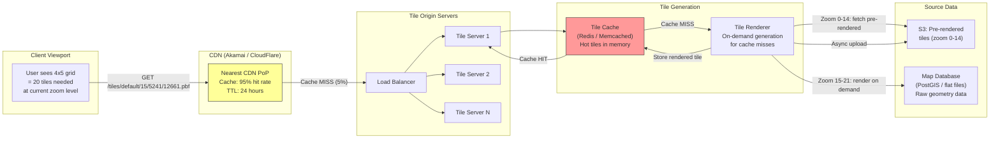

**Tile serving strategy:**
1. **Zoom 0-14 (~350M tiles):** Pre-rendered and stored in S3. CDN caches them aggressively.
2. **Zoom 15-18:** Rendered on demand, cached in Redis/Memcached, then S3. Most urban areas are "warm" in cache.
3. **Zoom 19-21:** Rendered purely on demand. Only requested for extremely zoomed-in views. Short TTL cache.
4. **Satellite tiles:** Always raster (JPEG), pre-rendered from satellite imagery, stored in S3.

### 3.5 Tile Update Pipeline

When map data changes (new road, building, business), tiles must be re-rendered:

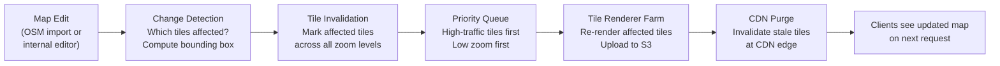

**A single road change can affect tiles at multiple zoom levels.** A new highway
visible from zoom 8 to zoom 18 could require re-rendering ~4,000 tiles (sum of
affected tiles across 11 zoom levels). Google processes millions of map edits per
day, requiring a prioritized tile invalidation pipeline.

---

## 4. Place Search Service

### 4.1 Architecture

Place search combines **full-text search** (matching "starbucks" against business names)
with **geospatial ranking** (closest results first). This is a classic case for
Elasticsearch with its built-in geospatial capabilities.

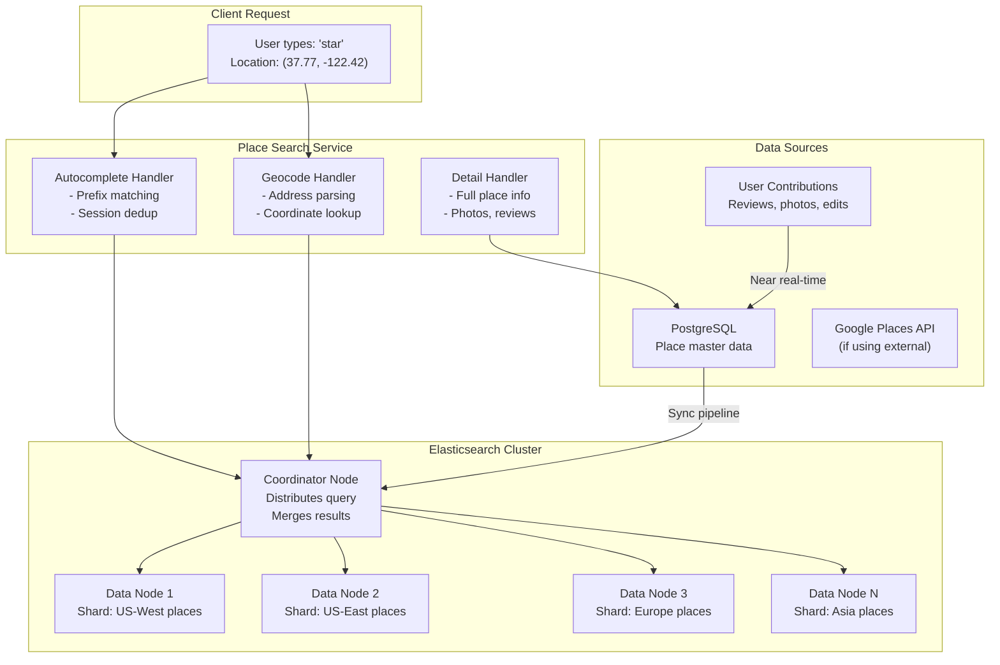

### 4.2 Elasticsearch Index Design

```json
{
  "mappings": {
    "properties": {
      "place_id":     { "type": "keyword" },
      "name":         { "type": "text", "analyzer": "autocomplete_analyzer",
                        "fields": { "exact": { "type": "keyword" } } },
      "address":      { "type": "text" },
      "location":     { "type": "geo_point" },
      "geohash":      { "type": "keyword" },
      "category":     { "type": "keyword" },
      "subcategory":  { "type": "keyword" },
      "rating":       { "type": "float" },
      "review_count": { "type": "integer" },
      "popularity":   { "type": "float" },
      "country_code": { "type": "keyword" },
      "name_suggest": {
        "type": "completion",
        "contexts": [
          { "name": "location", "type": "geo", "precision": 6 }
        ]
      }
    }
  },
  "settings": {
    "analysis": {
      "analyzer": {
        "autocomplete_analyzer": {
          "type": "custom",
          "tokenizer": "autocomplete_tokenizer",
          "filter": ["lowercase", "asciifolding"]
        }
      },
      "tokenizer": {
        "autocomplete_tokenizer": {
          "type": "edge_ngram",
          "min_gram": 1,
          "max_gram": 20,
          "token_chars": ["letter", "digit"]
        }
      }
    }
  }
}
```

### 4.3 Search Ranking

Results are ranked by a **composite score** combining relevance, proximity, and quality:

```
score = text_relevance * 0.3 
      + proximity_score * 0.4 
      + quality_score * 0.3

where:
  text_relevance = Elasticsearch BM25 score (how well name/address matches query)
  proximity_score = 1 / (1 + distance_km)   (closer = higher score)
  quality_score = normalize(rating * log(review_count + 1) * popularity_weight)
```

The proximity component is implemented using Elasticsearch's `function_score` with a
`decay` function on the `geo_point` field. Results within 1 km get a score of ~1.0,
decaying to ~0.1 at 50 km.

### 4.4 Geocoding Pipeline

```
Forward Geocoding: "1600 Amphitheatre Pkwy, Mountain View, CA" → (37.4220, -122.0841)

Step 1: Address Parsing
  → {"number": "1600", "street": "Amphitheatre Pkwy", 
     "city": "Mountain View", "state": "CA"}

Step 2: Structured Search
  → Query address database with parsed components
  → Match against interpolated address ranges on street segments

Step 3: Coordinate Interpolation
  → Street segment "Amphitheatre Pkwy" has range 1500-1700 on north side
  → 1600 is at position (1600-1500)/(1700-1500) = 0.5 along segment
  → Interpolate lat/lng at 50% of segment geometry

Reverse Geocoding: (37.4220, -122.0841) → "1600 Amphitheatre Pkwy, Mountain View, CA"

Step 1: Find nearest street segments within 50m radius
Step 2: Project point onto nearest segment
Step 3: Interpolate address number from segment's address range
Step 4: Assemble full address from administrative boundaries
```

---

## 5. Routing Engine

### 5.1 Road Network as a Graph

The road network is modeled as a **weighted directed graph** where:
- **Nodes** = intersections and road endpoints
- **Edges** = road segments between intersections
- **Edge weights** = travel time (not distance!) based on road length / speed

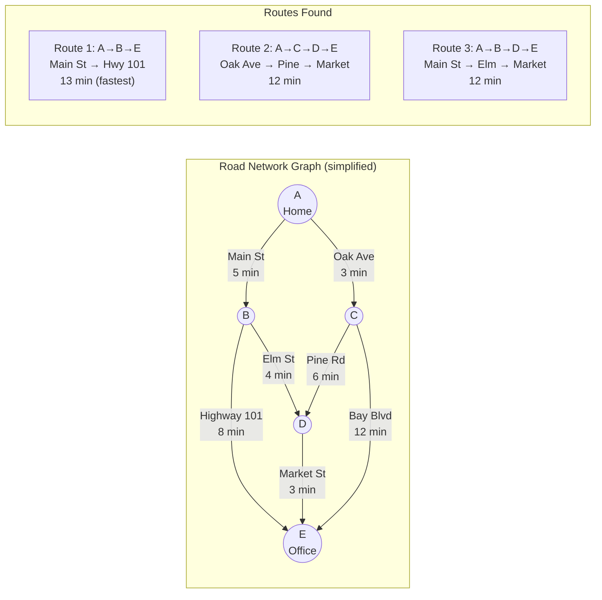

**Important:** Edge weights are travel TIME, not distance. A 10 km highway segment
(speed limit 100 km/h, weight = 6 min) is "shorter" than a 3 km residential street
(speed limit 30 km/h, weight = 6 min) in terms of routing.

### 5.2 Shortest Path: Dijkstra and A*

**Dijkstra's Algorithm** finds the shortest path from source to all reachable nodes
by expanding outward in order of distance. It guarantees an optimal solution but explores
many unnecessary nodes.

**A* Algorithm** improves Dijkstra by adding a heuristic: for each node, estimate the
remaining distance to the destination (using haversine / straight-line distance) and
prioritize nodes that appear closer to the goal.

```
Dijkstra:
  priority_queue = [(0, source)]
  while queue not empty:
    (cost, node) = pop minimum
    if node == destination: return path
    for each neighbor of node:
      new_cost = cost + edge_weight(node, neighbor)
      if new_cost < best_known[neighbor]:
        best_known[neighbor] = new_cost
        push (new_cost, neighbor) to queue

A*:
  Same as Dijkstra but priority is:
    f(node) = g(node) + h(node)
  where:
    g(node) = actual cost from source to node
    h(node) = heuristic estimate from node to destination
            = haversine_distance(node, destination) / max_speed
```

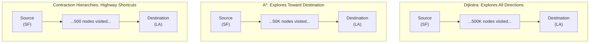

### 5.3 Contraction Hierarchies (CH): The Production Solution

Dijkstra and A* are too slow for production (200ms - 2s for cross-country routes).
**Contraction Hierarchies** is the algorithm that Google Maps, Apple Maps, and OSRM
actually use. It achieves **sub-millisecond query times** through preprocessing.

**Preprocessing phase (offline, takes hours):**
1. Assign each node an "importance" level (highways > local streets)
2. Process nodes from least to most important
3. For each node being "contracted": if removing it would make any shortest path longer, add a **shortcut edge** that bypasses it
4. Result: a hierarchy where highways are at the top, local streets at the bottom

**Query phase (online, ~1ms):**
1. Run **bidirectional search**: one from source going UP the hierarchy, one from destination going UP the hierarchy
2. They meet at the highest-level nodes (highway junctions)
3. Only ~500-1000 nodes are visited (vs 500K for Dijkstra)
4. Unpack shortcut edges to recover the actual path

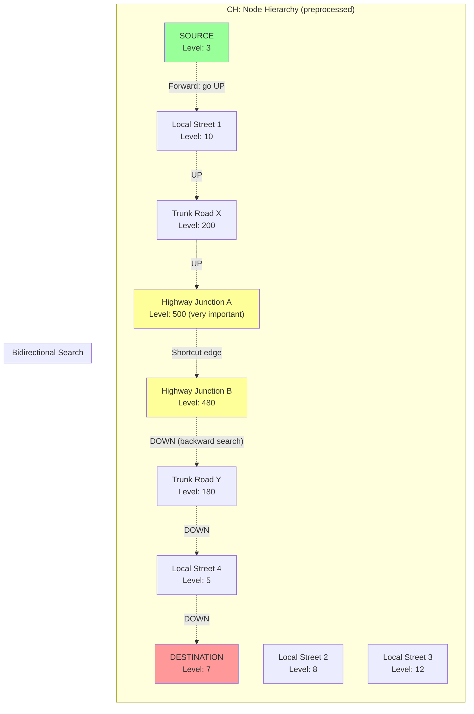

**Performance comparison for SF to LA route (~600 km):**

| Algorithm | Nodes Visited | Query Time | Preprocessing |
|-----------|--------------|------------|---------------|
| Dijkstra | ~500,000 | ~2 seconds | None |
| A* | ~50,000 | ~200ms | None |
| Contraction Hierarchies | ~500-1,000 | ~1ms | 2-4 hours (one-time) |
| CH + live traffic | ~1,000-2,000 | ~5ms | 2-4 hours + traffic overlay |

### 5.4 Multi-Modal Routing

Different transport modes require different graphs and algorithms:

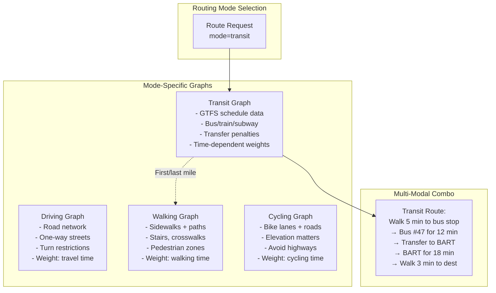

**Transit routing is time-dependent:** unlike driving where edge weights are relatively
stable, transit depends on schedules. A bus route that takes 10 minutes at 8:00 AM
might not exist at 8:05 AM (next bus in 15 minutes). This requires a time-expanded
graph or RAPTOR algorithm (used by Google Maps for transit).

### 5.5 Alternative Routes

To provide 2-3 alternative routes, the system uses **penalty-based re-routing**:

```
1. Compute optimal route R1 using CH
2. For route R2: add 2x penalty to edges used by R1, re-run CH
   → Forces algorithm to find a "sufficiently different" route
3. For route R3: add 2x penalty to edges used by R1 and R2, re-run CH
4. Filter: discard routes that are >30% longer than R1
5. Filter: discard routes that share >80% of edges with another route
6. Return top 3 distinct routes
```

### 5.6 Routing Engine Architecture

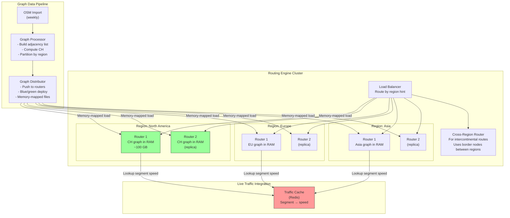

**Live traffic integration with CH:**
CH is preprocessed with free-flow speeds. To incorporate live traffic:
1. At query time, look up current speed for each edge from Redis
2. Multiply CH edge weight by `(free_flow_speed / current_speed)` ratio
3. This "customizable" CH approach adds ~5ms overhead but gives traffic-aware routes
4. OSRM calls this "Multi-Level Dijkstra" -- a variant that allows live edge weights

---

## 6. ETA Service

### 6.1 Architecture Overview

ETA is one of the most critical services -- Uber uses it for fare estimation, driver
dispatch, and customer experience. ETA must be accurate, fast, and work at scale.

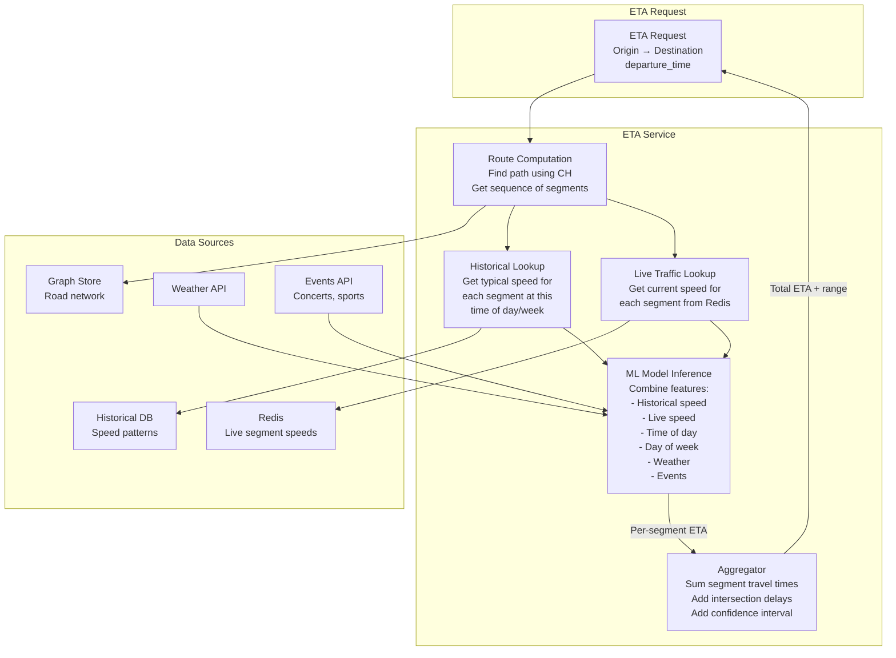

### 6.2 ETA Calculation Methods

**Method 1: Segment-based summation (baseline)**
```
total_eta = 0
for each segment in route:
    segment_speed = get_speed(segment, time_of_day)
    segment_time = segment.length / segment_speed
    total_eta += segment_time
total_eta += intersection_delays * num_intersections
```

**Method 2: Historical pattern matching**
```
For each segment, look up average speed at:
  - Same day of week (Tuesday)
  - Same 15-minute window (8:15-8:30 AM)
  - Blend with live speed using decay: 
    effective_speed = 0.6 * live_speed + 0.4 * historical_speed
    (if live data is fresh, weight it more; if stale, trust historical more)
```

**Method 3: ML model (what Uber and Google actually use)**
```
Features:
  - Route distance and segment count
  - Historical speed for each segment (time-of-day, day-of-week)
  - Live speed for each segment
  - Road types along route (% highway, % residential)
  - Number of traffic signals / stop signs
  - Weather conditions (rain adds ~15%, snow adds ~30%)
  - Special events (stadium, concert venue nearby)
  - Time of day (rush hour multiplier)
  - Device speed (if user is already moving, incorporate momentum)

Model: Gradient-boosted tree (XGBoost/LightGBM) or neural network
Output: Predicted travel time + confidence interval

Uber's DeepETA uses a transformer-based model that processes the entire
route as a sequence of segments, similar to NLP sequence models.
```

### 6.3 Distance Matrix (Batch ETA)

For ride-hailing (find ETA from 20 nearby drivers to rider), the system needs
to compute many ETAs efficiently:

```
Standard:    20 routes × 1ms each = 20ms (serial) or ~5ms (parallel on 4 threads)
Optimized:   Shared Dijkstra from destination to all origins (single search) = ~3ms
             Works because CH bidirectional search shares the "backward" part
```

---

## 7. Traffic Service

### 7.1 GPS Data Pipeline

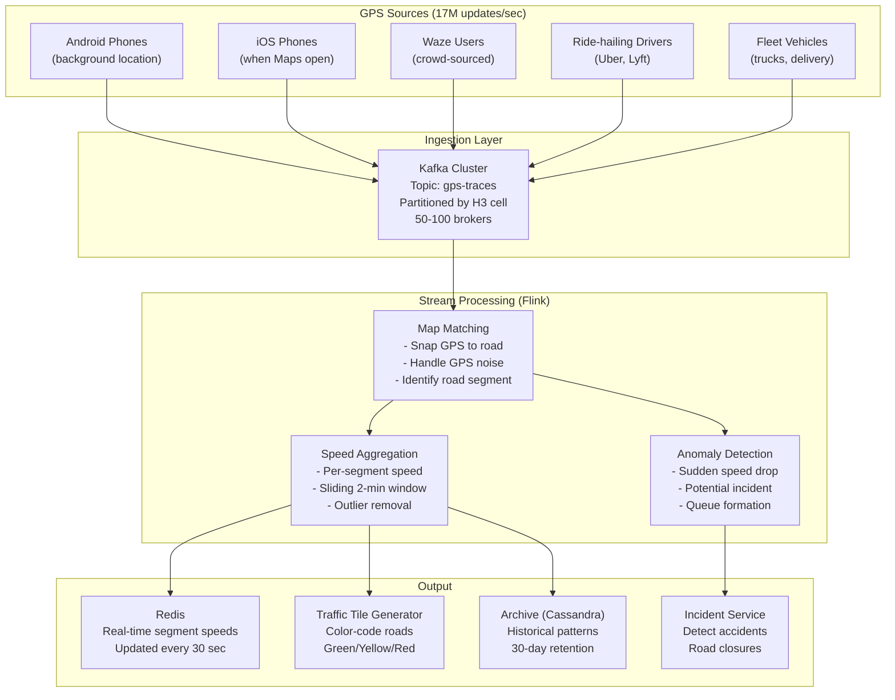

### 7.2 Map Matching

Raw GPS points have noise (5-50m error) and must be matched to the correct road
segment. This is critical -- without it, we cannot compute per-segment speeds.

```
GPS Trace: (37.7749, -122.4194) → (37.7751, -122.4190) → (37.7754, -122.4185)

Problem: These points are near two parallel streets (Market St and Mission St).
         Which street is the phone actually on?

Map Matching Algorithm (Hidden Markov Model):
  - States: candidate road segments for each GPS point
  - Emission probability: how close is GPS point to segment? (Gaussian)
  - Transition probability: how likely to travel from segment A to segment B?
    (Based on road connectivity and distance)
  - Viterbi algorithm: find most likely sequence of segments

Result: GPS trace matched to specific road segments with confidence score
```

### 7.3 Segment Speed Calculation

```
For each road segment, every 30 seconds:
  1. Collect all GPS probes matched to this segment in the last 2 minutes
  2. Filter outliers (parked cars, GPS noise) -- remove speeds < 3 km/h and > speed_limit * 1.5
  3. Compute weighted median speed (recent probes weighted more)
  4. Compute confidence = min(sample_count / 5, 1.0)  -- need at least 5 samples
  5. If confidence < 0.3: fall back to historical speed for this time-of-day
  6. Compute congestion_ratio = current_speed / free_flow_speed
  7. Color coding:
     - Green:  ratio > 0.75 (flowing)
     - Yellow: ratio 0.4-0.75 (moderate)
     - Red:    ratio < 0.4 (heavy traffic)
     - Dark Red: ratio < 0.2 (standstill)
```

### 7.4 Traffic Tile Generation

Traffic visualization on the map is served as a **separate tile layer** overlaid
on the base map. These tiles are generated from the segment speed data:

```
Traffic Tile Pipeline:
  1. For each tile (z, x, y) at zoom levels 8-18:
     a. Find all road segments that intersect this tile
     b. For each segment, look up current speed from Redis
     c. Color-code the segment geometry (green/yellow/red/dark red)
     d. Render as a semi-transparent overlay tile
  2. Cache in CDN with short TTL (1-2 minutes)
  3. Client requests traffic tiles alongside base map tiles
```

---

## 8. Navigation Service

### 8.1 Turn-by-Turn Guidance Architecture

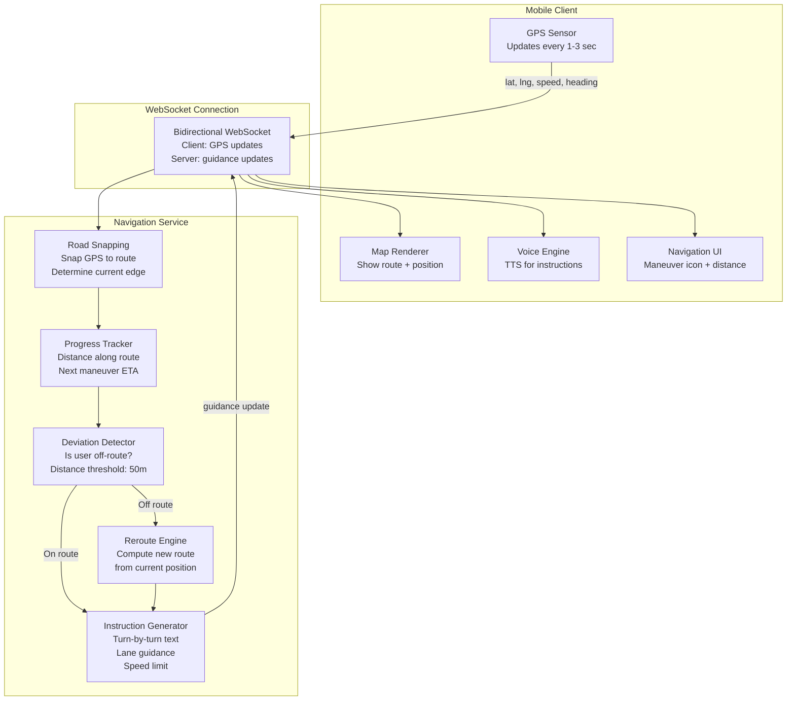

### 8.2 Route Following Logic

```
Every GPS update (1-3 seconds):

1. ROAD SNAPPING
   - Project GPS point onto nearest point on route polyline
   - If projection distance < 20m: user is on route
   - Use heading to disambiguate parallel roads

2. PROGRESS TRACKING
   - Calculate distance traveled along route
   - Determine current step (which maneuver segment)
   - Calculate distance to next maneuver

3. INSTRUCTION GENERATION
   - If distance to next maneuver < 1000m: "In 1 km, turn right onto Oak St"
   - If distance to next maneuver < 200m:  "Turn right onto Oak St"
   - If distance to next maneuver < 30m:   "Turn right"
   - After completing maneuver:            "Continue on Oak St for 2 km"

4. DEVIATION DETECTION
   - If projection distance > 50m for 3+ consecutive GPS points:
     → User has deviated from route
     → Trigger reroute from current position to destination
     → Send new route to client
     → "Rerouting..."

5. PROACTIVE REROUTING
   - Even if user is on route, if traffic ahead has worsened significantly
     (>5 min slower than original ETA), suggest a better route:
     → "Faster route available. 8 minutes faster. Switch route?"
```

### 8.3 Arrival Detection

```
Arrival detection must handle:
  - GPS inaccuracy (user is at destination but GPS says 30m away)
  - Driving past destination (parking is around the corner)
  - Multi-entrance buildings (destination at back entrance)

Algorithm:
  1. If distance to destination < 50m AND speed < 5 km/h:
     → "You have arrived at your destination"
  2. If remaining route distance < 100m AND route ends on same road:
     → "Your destination is on the right/left" (based on route geometry)
  3. If user drives past destination > 200m:
     → "You have passed your destination" + offer to reroute back
```

---

## 9. Data Flow Walkthroughs

### 9.1 Flow: User Opens Maps App and Pans Around

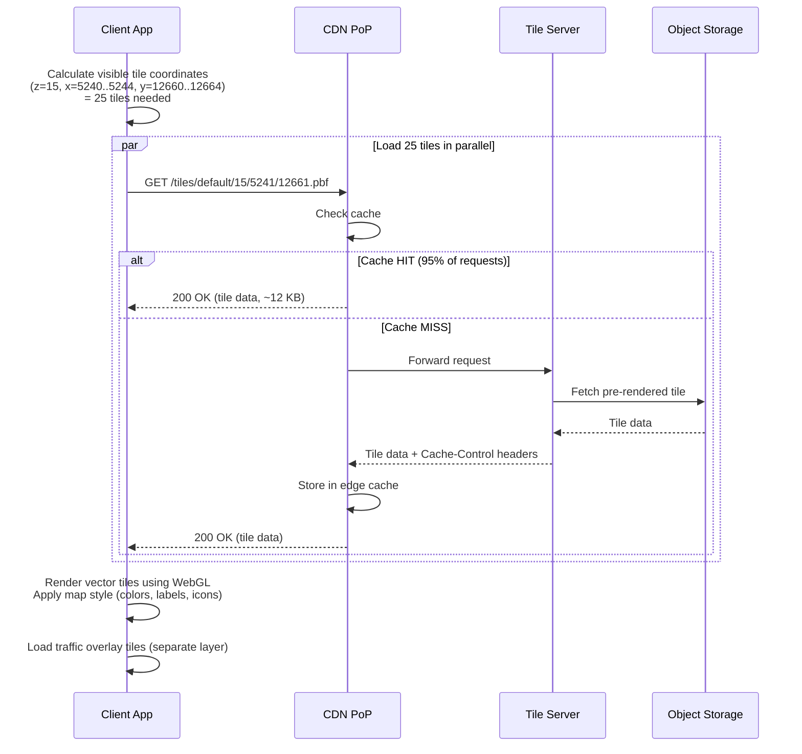

### 9.2 Flow: User Requests Directions

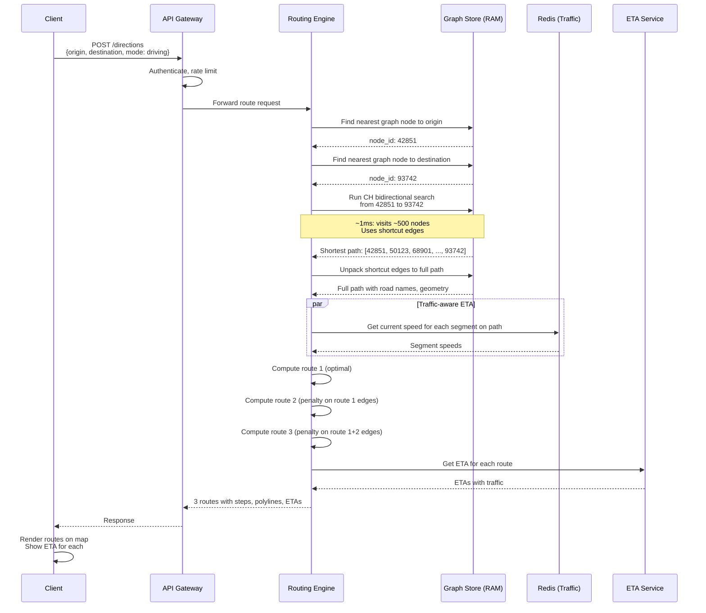

### 9.3 Flow: GPS Data to Traffic Layer

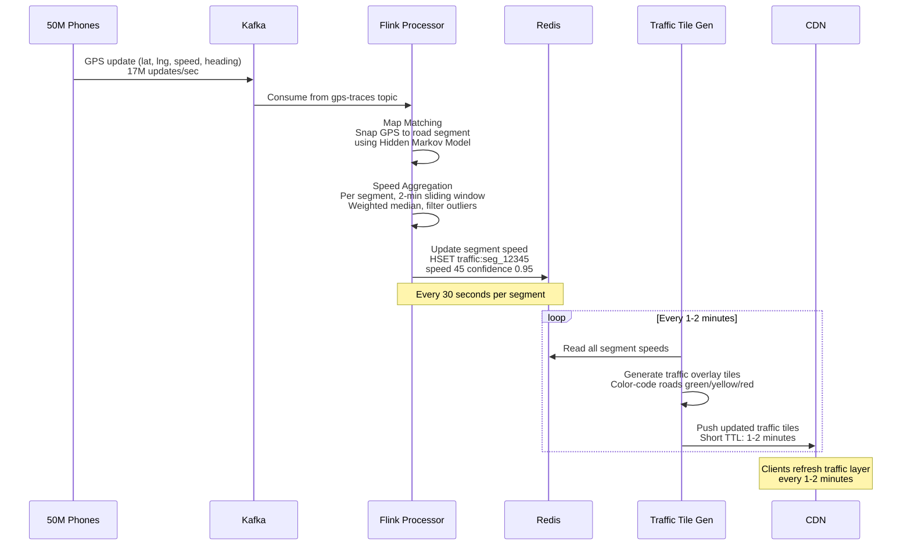

---

## 10. Database and Storage Design

### 10.1 Storage Architecture Summary

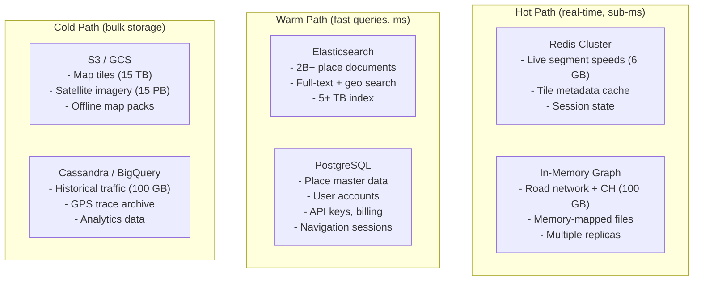

### 10.2 Why This Polyglot Storage?

| Data | Store | Reason |
|------|-------|--------|
| Road graph | In-memory (custom binary) | Must be sub-ms for routing; ~100 GB fits in RAM |
| Live traffic | Redis | Sub-ms reads for every routing query; 6 GB fits easily |
| Place search | Elasticsearch | Full-text + geospatial combo; built-in autocomplete |
| Place details | PostgreSQL | ACID transactions for updates, reviews, hours |
| Map tiles | S3 + CDN | Immutable blobs; CDN handles read scale |
| Historical traffic | Cassandra | Time-series data; write-heavy, partition by segment + time |
| GPS traces | Kafka + Cassandra | High-throughput stream + archival storage |

---

## 11. Communication Patterns

### 11.1 Protocol Summary

| Path | Protocol | Why |
|------|----------|-----|
| Client ↔ Tile CDN | HTTPS GET + HTTP/2 | Parallel tile loading, caching headers |
| Client ↔ API Gateway | HTTPS REST (JSON) | Standard request-response for search, directions |
| Client ↔ Navigation | WebSocket | Bidirectional: GPS upload + guidance push |
| Service ↔ Service | gRPC | Low-latency internal calls with protobuf |
| GPS ingestion | Kafka | Decoupled high-throughput stream processing |
| Traffic updates | Redis Pub/Sub | Real-time broadcast of segment speed changes |
| Tile updates | CDN purge API | Invalidate stale tiles at edge |

### 11.2 Why WebSocket for Navigation?

During active navigation, the client sends GPS every 1-3 seconds and the server sends
guidance updates with similar frequency. This bidirectional real-time communication
is poorly served by REST polling.

```
REST polling approach:
  Client → Server: POST /location every 2 sec (HTTP overhead each time)
  Client → Server: GET /guidance every 2 sec (another HTTP request)
  = 60 HTTP requests per minute, each with headers, TLS handshake overhead

WebSocket approach:
  Single persistent connection
  Client → Server: 60-byte GPS frame every 2 sec
  Server → Client: 200-byte guidance frame as needed
  = ~95% less bandwidth, ~80% less latency
```

### 11.3 Caching Strategy

```
                    CACHING LAYERS
  ┌─────────────────────────────────────────────────────┐
  │ Layer 1: Client-side tile cache                     │
  │   - LRU cache of recently viewed tiles              │
  │   - 200-500 MB on device                            │
  │   - Includes offline maps if downloaded              │
  │   - Hit rate: ~60% (re-panning to same area)        │
  ├─────────────────────────────────────────────────────┤
  │ Layer 2: CDN edge cache (200+ PoPs)                 │
  │   - Popular tiles cached at edge                    │
  │   - TTL: 24h for base tiles, 2 min for traffic      │
  │   - Hit rate: ~95% for base tiles                   │
  ├─────────────────────────────────────────────────────┤
  │ Layer 3: Origin tile cache (Redis/Memcached)        │
  │   - Recently rendered on-demand tiles               │
  │   - ~5 TB (covers high-zoom urban areas)            │
  │   - Hit rate: ~80% of CDN misses                    │
  ├─────────────────────────────────────────────────────┤
  │ Layer 4: Object storage (S3/GCS)                    │
  │   - All pre-rendered tiles (zoom 0-14)              │
  │   - Source of truth for tile data                   │
  │   - Cache miss triggers on-demand rendering         │
  └─────────────────────────────────────────────────────┘

  Effective cache hit rate: 99.5%+
  Only ~0.5% of tile requests trigger fresh rendering
```

---

## Architecture Summary

```
                    GOOGLE MAPS SYSTEM - KEY COMPONENTS
  ┌─────────────────────────────────────────────────────────┐
  │                                                         │
  │  MAP TILES          PLACE SEARCH        ROUTING         │
  │  ─────────          ────────────        ───────         │
  │  QuadTree tiles     Elasticsearch       CH graph in RAM │
  │  Vector (PBF)       Geo + full-text     ~1ms queries    │
  │  CDN-first          Edge n-gram         Multi-modal     │
  │  95% cache hit      Proximity decay     Alt routes      │
  │                                                         │
  │  TRAFFIC            ETA                 NAVIGATION      │
  │  ───────            ───                 ──────────      │
  │  17M GPS/sec        ML model            WebSocket       │
  │  Map matching       Historical+live     Turn-by-turn    │
  │  Segment speeds     Weather+events      Auto-reroute    │
  │  Kafka → Flink      <500ms latency      Deviation detect│
  │                                                         │
  │  STORAGE: Redis (traffic) + In-Memory (graph) +         │
  │           Elasticsearch (places) + S3/CDN (tiles) +     │
  │           Cassandra (historical)                        │
  └─────────────────────────────────────────────────────────┘
```
