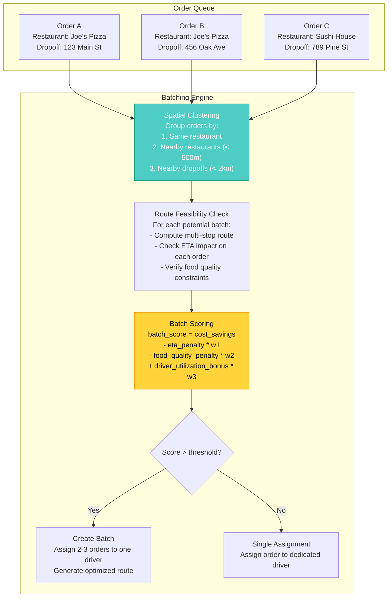
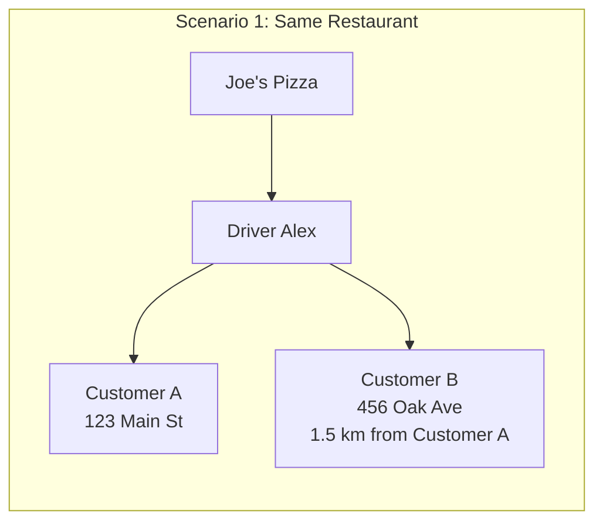
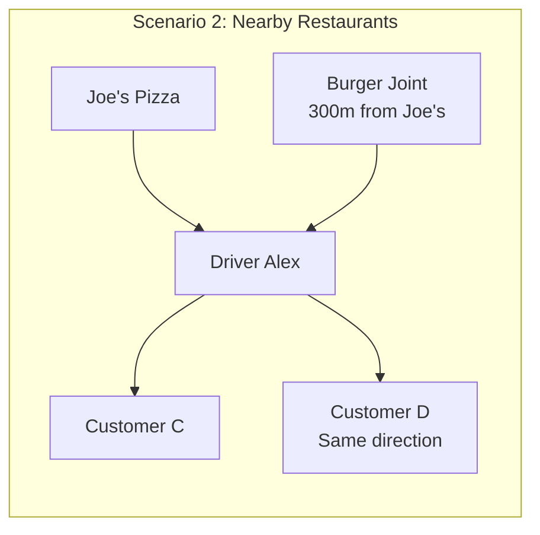
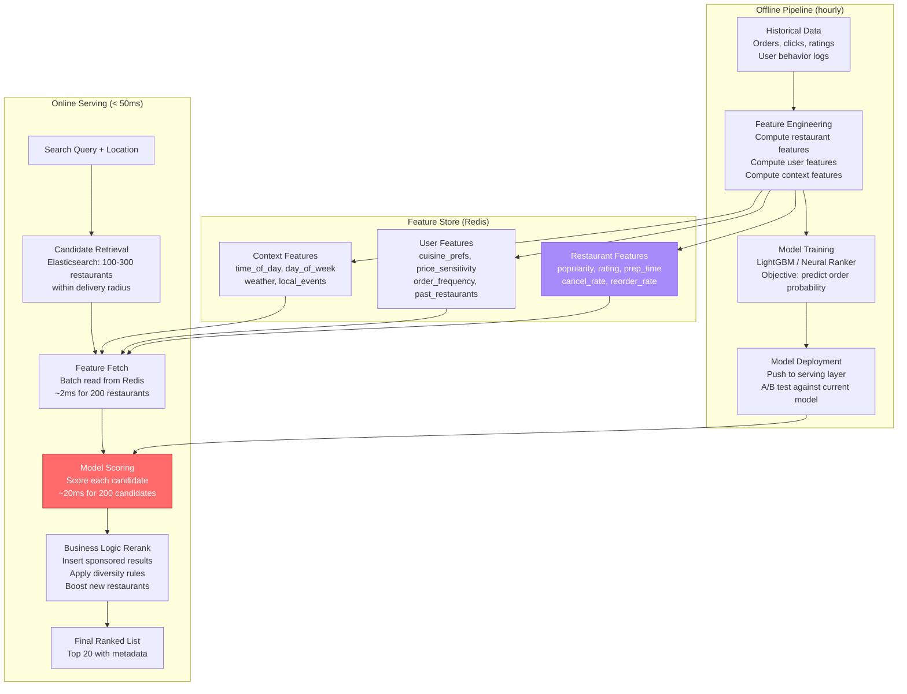
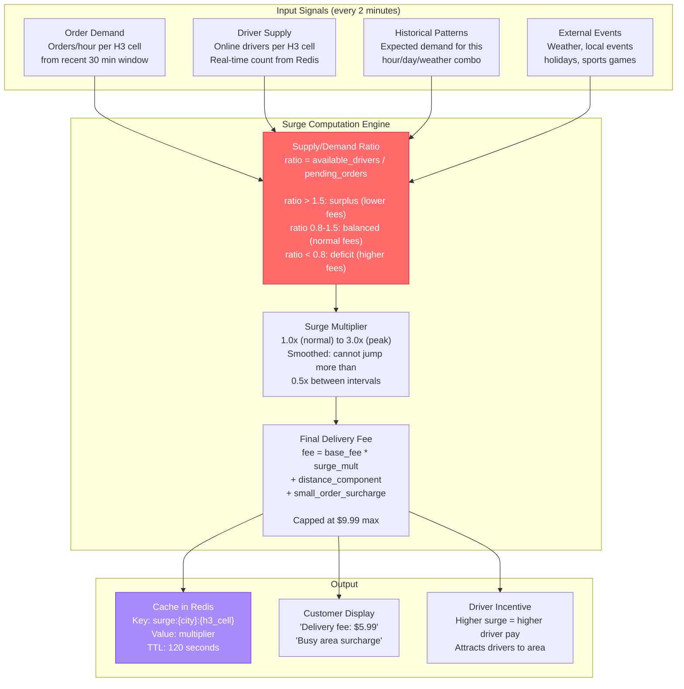
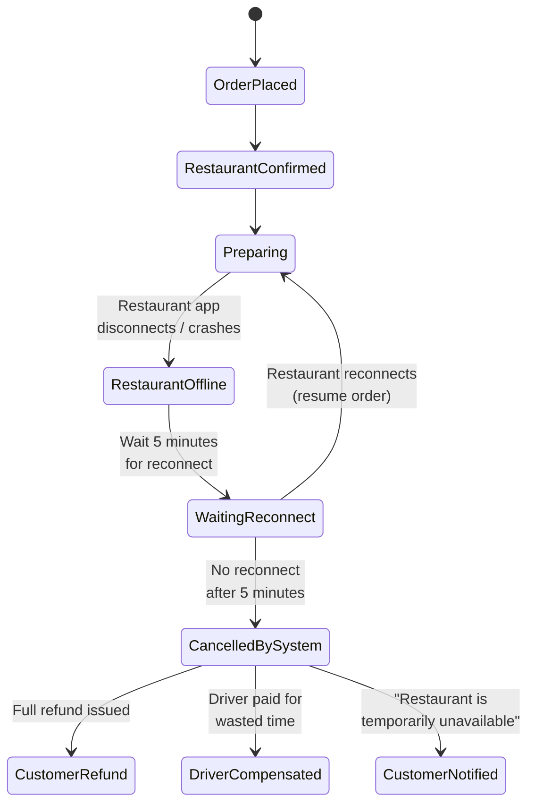

# Design Uber Eats / Food Delivery System: Deep Dive and Scaling

## Table of Contents
- [1. Deep Dive #1: Order Batching](#1-deep-dive-1-order-batching)
- [2. Deep Dive #2: Restaurant Ranking (ML)](#2-deep-dive-2-restaurant-ranking-ml)
- [3. Deep Dive #3: Dynamic Delivery Fees (Surge Pricing)](#3-deep-dive-3-dynamic-delivery-fees-surge-pricing)
- [4. Scaling Strategy](#4-scaling-strategy)
- [5. Failure Handling](#5-failure-handling)
- [6. Trade-offs and Design Decisions](#6-trade-offs-and-design-decisions)
- [7. Interview Tips](#7-interview-tips)

---

## 1. Deep Dive #1: Order Batching

### 1.1 The Problem Statement

```
Single-delivery economics:
  - Average order value:       $30
  - Platform commission (30%): $9
  - Driver base pay:           $8
  - Platform margin:           $1 per delivery (terrible)

Batched-delivery economics (2 orders, same driver):
  - Revenue: $9 x 2 =         $18
  - Driver pay: $8 + $3 =     $11 (premium for second order, not double)
  - Platform margin:           $7 per batch = $3.50 per delivery (3.5x better)

Uber Eats needs batching to be profitable. Without it, delivery logistics
eat the entire commission. This is THE economic engine of food delivery.

Industry data: 20-30% of Uber Eats deliveries are batched.
Target: maximize batching rate while keeping customer ETA impact < 10 minutes.
```

### 1.2 Batching Architecture



### 1.3 Batching Scenarios



```
Scenario 1: Same Restaurant, Nearby Dropoffs (MOST COMMON)
  - Order A: Joe's Pizza -> 123 Main St (1.2 km)
  - Order B: Joe's Pizza -> 456 Oak Ave (1.8 km, same direction)
  - Without batching: 2 drivers, 2 trips = $16 driver cost
  - With batching: 1 driver, 1 trip + 0.6 km detour = $11 driver cost
  - Savings: $5 per batch
  - Customer A ETA impact: +3 minutes (driver delivers B first or second)
  - Customer B ETA impact: +3 minutes
  
  Route: Restaurant -> Customer A -> Customer B (or reverse, whichever is shorter)
```



```
Scenario 2: Nearby Restaurants (< 500m apart)
  - Order C: Joe's Pizza -> Customer C (2 km)
  - Order D: Burger Joint (300m from Joe's) -> Customer D (2.5 km, similar direction)
  - Driver picks up from Joe's, walks 300m to Burger Joint, then delivers both
  - Extra pickup time: ~5 minutes
  - Customer C ETA impact: +5-7 minutes (acceptable)
  - Savings: $4 per batch

  Route: Joe's Pizza -> Burger Joint -> Customer C -> Customer D
```

```
Scenario 3: Add-On to Active Delivery
  - Driver already heading to Joe's Pizza for Order E
  - New Order F arrives for Joe's Pizza
  - Order F's dropoff is along driver's existing route to Customer E
  - Assign Order F to same driver immediately
  - Customer E ETA impact: +2-3 minutes (minimal detour)
  - Customer F: gets a faster delivery (driver already nearby)
  - This is the highest-value batching scenario
```

### 1.4 Batching Algorithm Detail

```python
# Simplified batching decision algorithm

def find_batching_opportunity(new_order):
    restaurant_loc = new_order.restaurant.location
    dropoff_loc = new_order.delivery_address
    
    # Step 1: Find active drivers near the restaurant
    active_drivers = get_drivers_with_active_orders(
        near=restaurant_loc, 
        radius_km=1.0
    )
    
    best_batch = None
    best_score = 0
    
    for driver in active_drivers:
        # Step 2: Check if driver can take another order
        if driver.active_order_count >= MAX_BATCH_SIZE:  # Max 3
            continue
        
        # Step 3: Check restaurant proximity
        for existing_order in driver.active_orders:
            restaurant_distance = haversine(
                restaurant_loc, 
                existing_order.restaurant.location
            )
            if restaurant_distance > 0.5:  # 500m max between restaurants
                continue
            
            # Step 4: Compute route with new order added
            current_route = driver.current_route
            new_route = optimize_route(
                current_route.waypoints + [
                    restaurant_loc,  # New pickup (skip if same restaurant)
                    dropoff_loc      # New dropoff
                ]
            )
            
            # Step 5: Check ETA impact on existing orders
            eta_impact = compute_eta_impact(current_route, new_route)
            if eta_impact.max_delay_minutes > MAX_ETA_DELAY:  # 10 min max
                continue
            
            # Step 6: Check food quality constraints
            max_food_age = compute_max_food_age(new_route, existing_order)
            if max_food_age > MAX_FOOD_AGE_MINUTES:  # 25 min max
                continue
            
            # Step 7: Score this batching opportunity
            cost_savings = compute_cost_savings(current_route, new_route)
            score = (
                cost_savings * WEIGHT_COST
                - eta_impact.avg_delay * WEIGHT_ETA
                - max_food_age * WEIGHT_FOOD_QUALITY
                + driver.batch_bonus_eligible * WEIGHT_DRIVER_BONUS
            )
            
            if score > best_score:
                best_score = score
                best_batch = BatchPlan(driver, new_order, new_route)
    
    if best_batch and best_score > BATCH_THRESHOLD:
        return best_batch
    
    return None  # No batching, assign as single delivery
```

### 1.5 Customer Communication for Batched Orders

```
Transparency is critical. Customers must understand why ETA increased.

When order is batched:
  Push notification: "Your driver Alex has another pickup nearby. 
                      Your estimated delivery is now 35 minutes."
  
  In-app tracking:
  - Show both stops on the map (if customer is second delivery)
  - Show "1 stop before you" indicator
  - Give customer option to tip more (driver is handling extra work)
  
When batch causes excessive delay (> 10 min):
  - Offer $2-3 credit: "Sorry for the wait. Here's $3 off your next order."
  - Track customer satisfaction: if batched orders have lower ratings, reduce batching

Metrics to monitor:
  - Batch rate: % of orders that are batched (target: 25-30%)
  - ETA accuracy for batched vs. single orders
  - Customer satisfaction (ratings) for batched vs. single orders
  - Driver utilization rate (higher = better for drivers and platform)
  - Cost per delivery (should decrease with batching)
```

---

## 2. Deep Dive #2: Restaurant Ranking (ML)

### 2.1 The Problem Statement

```
When a customer opens Uber Eats, they see a ranked list of restaurants.
The ranking directly determines:
  - Which restaurants get orders (revenue allocation)
  - Customer satisfaction (show relevant restaurants = happy customer)
  - Conversion rate (better ranking = more orders placed)
  - Platform revenue (higher conversion = more commissions)

A 1% improvement in ranking quality = millions in incremental revenue.
This is the single most impactful ML application in the system.
```

### 2.2 Ranking Architecture



### 2.3 Feature Engineering

```
RESTAURANT FEATURES (pre-computed hourly, stored in Redis):

Popularity signals:
  - orders_last_7d: total orders in last 7 days
  - orders_last_24h: recent demand signal
  - unique_customers_7d: breadth of appeal
  - view_to_order_rate: conversion from views to orders (higher = more appealing)
  - reorder_rate: % of customers who order again within 30 days

Quality signals:
  - avg_food_rating: average food rating (1-5)
  - avg_delivery_rating: average delivery rating (1-5)  
  - rating_count: number of ratings (confidence)
  - rating_trend: improving or declining over last 30 days
  - photo_quality_score: ML-assessed quality of menu photos
  - menu_completeness: % of items with descriptions and photos

Operational signals:
  - avg_prep_time_minutes: average time from confirmed to ready
  - prep_time_accuracy: how close actual prep time is to estimate
  - cancel_rate: % of orders cancelled by restaurant
  - item_availability_rate: % of menu items available at any time
  - acceptance_rate: % of orders restaurant accepts vs. rejects
  - avg_delivery_time: average total delivery time

Freshness signals:
  - days_since_menu_update: stale menus ranked lower
  - last_order_hours_ago: recently active restaurants preferred

USER FEATURES (per-user, stored in Redis):

  - cuisine_preference_vector: [Italian: 0.8, Japanese: 0.6, Mexican: 0.3, ...]
  - price_range_preference: average order value, typical price_range
  - dietary_tags: vegetarian, vegan, etc. (if set)
  - order_frequency: orders per week
  - recency_weighted_restaurants: recently ordered restaurants (for reorder boost)
  - time_of_day_patterns: what they order for breakfast vs. dinner
  - avg_rating_given: harsh rater vs. generous rater
  - uber_one_member: boolean (affects available deals)

CONTEXT FEATURES (computed at query time):

  - time_of_day: breakfast (6-11), lunch (11-14), dinner (17-21), late-night (21-2)
  - day_of_week: weekday vs. weekend (different patterns)
  - weather: rain/snow boosts demand and certain cuisines (soup, comfort food)
  - local_events: nearby sports event, concert (demand spike)
  - current_demand_supply: surge level in area
  - holiday: special menu items, different hours

CROSS FEATURES (interaction terms):

  - user_cuisine_pref x restaurant_cuisine: personalization match
  - time_of_day x restaurant_type: coffee shop for morning, pizza for night
  - user_price_range x restaurant_price_range: price match
  - distance x user_max_distance_history: some users order from farther restaurants
```

### 2.4 Ranking Model

```
Model architecture: Two-stage ranking

Stage 1: Candidate Retrieval (Elasticsearch)
  - Geo filter: restaurants within delivery radius
  - Open filter: only currently open restaurants
  - Text match: if search query, keyword match on name/cuisine/items
  - Returns 100-300 candidates
  - Latency: ~30ms

Stage 2: ML Re-ranking (LightGBM or Deep Ranking Model)
  - Input: feature vector per (user, restaurant, context) triple
  - Output: P(order | user sees this restaurant) -- predicted conversion probability
  - Model: LightGBM with 50+ features, or a neural network with embeddings
  - Training: binary classification on (impression, did_user_order) pairs
  - Training data: billions of impressions from past 90 days
  - Objective: maximize expected orders while maintaining diversity
  - Latency: ~20ms for batch scoring 200 candidates

Model evaluation metrics:
  - NDCG@20: normalized discounted cumulative gain (primary metric)
  - MAP@20: mean average precision
  - Online: order conversion rate (A/B tested)
  - Revenue per session (A/B tested)

Model retraining:
  - Retrained daily on rolling 90-day window
  - A/B tested for 7 days before full rollout
  - Fallback: rule-based ranking if ML model fails (circuit breaker)
```

### 2.5 Sponsored Results and Business Rules

```
Sponsored (Promoted) Restaurants:
  - Restaurants bid for promoted placement (auction model)
  - Bid types: cost-per-impression (CPM) or cost-per-order (CPO)
  - Placement: inserted at fixed positions (2nd, 5th, 10th result)
  - Label: "Sponsored" badge (regulatory requirement)
  - Filtering: only show sponsored results above a quality threshold
    (we do not promote low-rated restaurants, bad for customer trust)
  - Revenue: significant incremental revenue stream

Diversity rules:
  - No more than 3 restaurants of the same cuisine in top 10
  - At least 1 "new restaurant" in top 10 (cold start boost)
  - At least 1 restaurant with active promo in top 5
  - Mix of price ranges (do not show all $$$ restaurants)

Cold start for new restaurants:
  - New restaurants (< 30 days, < 50 orders) lack sufficient data
  - Strategy: boost exploration by inserting into random positions
  - Use restaurant category averages as initial feature values
  - After 50 orders: switch to actual data, remove boost
  - Track: do new restaurants with boost have better 90-day retention?

Quality enforcement:
  - Restaurants below 3.5 rating: demoted to page 2+
  - Restaurants with > 10% cancel rate: hidden from search for 24h
  - Restaurants with food safety violations: suspended pending review
```

---

## 3. Deep Dive #3: Dynamic Delivery Fees (Surge Pricing)

### 3.1 The Problem Statement

```
Static delivery fee ($2.99 flat) does not work because:

1. High demand, low supply (rainy Friday dinner):
   - 500 orders/hour in an area, only 100 available drivers
   - Drivers cherry-pick high-tip orders, reject low-value ones
   - Long wait times, order cancellations, unhappy customers
   
2. Low demand, high supply (Tuesday 3 PM):
   - 50 orders/hour, 200 available drivers
   - Drivers idle, earning nothing, might go offline
   - Reducing delivery fee could stimulate demand

Solution: dynamic delivery fees that balance supply and demand in real time.

Uber Eats calls this "delivery fee adjustment" (not "surge" to avoid negative PR).
But the mechanism is identical to Uber ride surge pricing.
```

### 3.2 Surge Pricing Architecture



### 3.3 Surge Computation Algorithm

```python
# Runs every 2 minutes per H3 cell (resolution 7)

def compute_surge(h3_cell, city):
    # Step 1: Count current demand
    recent_orders = count_orders(
        h3_cell=h3_cell, 
        window_minutes=30
    )
    orders_per_hour = recent_orders * 2  # Extrapolate
    
    # Step 2: Count available supply
    available_drivers = count_drivers(
        h3_cell=h3_cell,
        status="ONLINE",  # Not currently on a delivery
        radius_km=3.0     # Include nearby cells
    )
    
    # Step 3: Compute raw ratio
    if orders_per_hour == 0:
        ratio = float('inf')  # No demand, no surge
    else:
        ratio = available_drivers / (orders_per_hour / 6)  # Per 10-min window
    
    # Step 4: Map ratio to surge multiplier
    if ratio > 2.0:
        surge = 0.8  # Surplus: reduce fee (stimulate demand)
    elif ratio > 1.5:
        surge = 1.0  # Balanced: normal fee
    elif ratio > 1.0:
        surge = 1.2  # Slightly tight: small increase
    elif ratio > 0.7:
        surge = 1.5  # Tight: moderate increase
    elif ratio > 0.5:
        surge = 2.0  # Very tight: significant increase
    else:
        surge = 2.5  # Severe shortage: high surge
    
    # Step 5: Apply smoothing (prevent jarring jumps)
    previous_surge = get_previous_surge(h3_cell)
    max_change = 0.5  # Cannot change more than 0.5x per interval
    surge = clamp(
        surge,
        previous_surge - max_change,
        previous_surge + max_change
    )
    
    # Step 6: Apply caps
    surge = max(0.5, min(surge, 3.0))  # Floor 0.5x, cap 3.0x
    
    # Step 7: Cache result
    redis.setex(
        f"surge:{city}:{h3_cell}", 
        120,  # TTL: 2 minutes
        surge
    )
    
    return surge


def compute_delivery_fee(restaurant, customer, surge_multiplier):
    distance_km = haversine(restaurant.location, customer.location)
    
    base_fee = 2.99
    distance_fee = max(0, (distance_km - 2.0) * 0.80)  # $0.80/km beyond 2 km
    
    # Small order surcharge
    small_order_surcharge = 0
    if order_subtotal < 15.00:
        small_order_surcharge = 2.00
    
    # Apply surge
    raw_fee = (base_fee + distance_fee) * surge_multiplier + small_order_surcharge
    
    # Uber One members: free delivery on orders > $15
    if customer.is_uber_one and order_subtotal >= 15.00:
        raw_fee = 0.00
    
    # Cap at maximum
    final_fee = min(raw_fee, 9.99)
    
    return final_fee
```

### 3.4 Driver Incentives During Surge

```
When delivery fees surge, drivers must also be incentivized to work in that area:

Driver pay during surge:
  normal_pay = base_pay + distance_pay + time_pay
  surge_pay = normal_pay * (1 + (surge_multiplier - 1) * 0.5)
  
  Example at 2.0x surge:
    Normal pay: $8.00
    Surge pay:  $8.00 * (1 + 0.5) = $12.00
    
  Platform absorbs some surge cost (does not pass 100% to customer)

Proactive driver positioning:
  - Show drivers a "heat map" of surge areas
  - Send push: "Earn 1.5x in the Mission District right now!"
  - Predictive: "Dinner rush starting in 30 min in SOMA. Head there now."
  
  This redistributes driver supply before demand spikes fully hit.

Demand forecasting:
  - ML model predicts demand 30-60 minutes ahead
  - Inputs: time of day, day of week, weather forecast, local events
  - Use predictions to pre-position incentives and notify drivers
  - Prevents extreme surges by proactively increasing supply
```

### 3.5 Surge Visibility and Customer Experience

```
What the customer sees:

Normal times:
  "Delivery fee: $2.99"

Moderate surge (1.2x - 1.5x):
  "Delivery fee: $4.49"
  (No special callout, just a higher fee)

High surge (1.5x - 2.5x):
  "Delivery fee: $5.99 (Busy area)"
  Badge: "Deliveries are busy in your area. Fees are temporarily higher."

Extreme surge (> 2.5x):
  "Delivery fee: $8.99 (Very busy)"
  "Delivery fees are higher than usual due to increased demand."
  Option: "Notify me when fees drop" (reduce demand, manage expectations)
  Option: "Schedule for later" (shift demand to off-peak)

Uber One members:
  "Free delivery" (surge absorbed by platform for Uber One subscribers)
  This is a major selling point for the subscription.
```

---

## 4. Scaling Strategy

### 4.1 Horizontal Scaling by City

```mermaid
graph TB
    subgraph "Global Layer"
        GLB[Global Load Balancer<br/>DNS-based routing<br/>Route by customer IP/location]
        AUTH[Auth Service<br/>Global, replicated]
    end

    subgraph "US-West Region"
        LB_W[Regional LB]
        OS_W[Order Service x5]
        SS_W[Search Service x8]
        DS_W[Delivery Service x3]
        PG_W[(PostgreSQL<br/>US-West shard)]
        RD_W[(Redis Cluster<br/>SF, LA, Seattle)]
        ES_W[(Elasticsearch<br/>US-West restaurants)]
    end

    subgraph "US-East Region"
        LB_E[Regional LB]
        OS_E[Order Service x5]
        SS_E[Search Service x8]
        DS_E[Delivery Service x3]
        PG_E[(PostgreSQL<br/>US-East shard)]
        RD_E[(Redis Cluster<br/>NYC, Boston, DC)]
        ES_E[(Elasticsearch<br/>US-East restaurants)]
    end

    subgraph "India Region"
        LB_I[Regional LB]
        OS_I[Order Service x4]
        SS_I[Search Service x6]
        DS_I[Delivery Service x3]
        PG_I[(PostgreSQL<br/>India shard)]
        RD_I[(Redis Cluster<br/>Mumbai, Delhi, BLR)]
        ES_I[(Elasticsearch<br/>India restaurants)]
    end

    GLB --> LB_W & LB_E & LB_I
    LB_W --> OS_W & SS_W & DS_W
    LB_E --> OS_E & SS_E & DS_E
    LB_I --> OS_I & SS_I & DS_I

    style GLB fill:#ffd43b,stroke:#f08c00,color:#000
```



### 4.2 Per-Service Scaling Strategy

```
Order Service:
  - Stateless: horizontally scalable
  - Scale based on order QPS (500 peak)
  - 5-10 instances per region is sufficient
  - Bottleneck: PostgreSQL writes (solved with city-level sharding)
  
Search & Discovery Service:
  - THE highest QPS service (17K peak)
  - CPU-intensive: ML model scoring per request
  - Scale based on search QPS
  - 30-40 instances globally
  - Bottleneck: Elasticsearch query latency
    Solution: more ES replicas, pre-computed ranking features in Redis

Tracking Service:
  - Write-heavy: 500K driver location updates/sec
  - Scale based on driver count per region
  - 30-50 consumer instances globally
  - Bottleneck: Redis GEO write throughput
    Solution: shard Redis by city, batch writes

Delivery Service:
  - Compute-intensive: route optimization per assignment
  - Scale based on active orders
  - 10-15 instances per region
  - Bottleneck: routing API calls
    Solution: local OSRM instances, cache common routes

Payment Service:
  - Low QPS relative to others (~500 captures/sec)
  - Must be highly reliable (exactly-once)
  - 3-5 instances per region with circuit breakers
  - Bottleneck: external payment gateway latency
    Solution: async capture (queue + retry), idempotency keys

Notification Service:
  - High volume (~925/sec) but simple per-message processing
  - Scale based on notification volume
  - 10-15 instances globally
  - Bottleneck: push service rate limits (FCM/APNs)
    Solution: batched sends, exponential backoff
```

### 4.3 Database Scaling

```
PostgreSQL:
  Primary use: orders, users, restaurants, payments
  Scaling approach:
    1. Read replicas (3 per shard) for heavy read paths
    2. City-level sharding for write distribution
    3. Table partitioning by date for orders (drop old partitions)
    4. Connection pooling (PgBouncer) to handle connection storms
  
  Write QPS per shard: ~500 (manageable for PostgreSQL)
  Read QPS per shard: ~5,000 (served from replicas + Redis cache)

Redis:
  Primary use: driver locations, active order cache, surge data, ranking features
  Scaling approach:
    1. Redis Cluster with 15-20 shards
    2. Sharded by city for driver locations (data locality)
    3. Memory: ~50 GB total across cluster
    4. Failover: Redis Sentinel for automatic failover

Elasticsearch:
  Primary use: restaurant and menu search
  Scaling approach:
    1. 10-15 nodes per region
    2. Index per city (keeps index size manageable)
    3. 2 replicas per shard (handle search QPS)
    4. Separate indexing cluster (writes) from serving cluster (reads)
    5. Menu changes queued via Kafka -> indexed asynchronously

Cassandra:
  Primary use: driver location history (time-series)
  Scaling approach:
    1. 10-15 nodes per region, replication factor 3
    2. Partition key: (driver_id, date)
    3. Clustering key: timestamp
    4. TTL: 14 days for hot data, archive to S3 for cold
    5. Write throughput: 500K/sec (Cassandra excels here)
```

### 4.4 Peak Load Handling

```
Lunch/dinner rush pattern:
  - Orders spike 5x during 11:30-13:30 and 17:30-20:30
  - Prepare: auto-scale service instances 30 min before predicted peak
  - Kubernetes HPA: scale on CPU, QPS, and Kafka consumer lag

Super Bowl Sunday / New Year's Eve:
  - 10-20x normal order volume in some markets
  - Pre-provision: manually scale to 3x normal capacity
  - Feature flags: disable non-critical features (analytics, promo engine)
  - Rate limiting: per-user rate limits to prevent runaway clients

Bad weather days:
  - Rain/snow increases demand 2-3x
  - Weather API integration: detect incoming weather events
  - Auto-scale delivery service and notification service
  - Proactively increase surge to attract more drivers
```

---

## 5. Failure Handling

### 5.1 Restaurant Goes Offline Mid-Order



```
Detection:
  - Restaurant dashboard heartbeat (every 30 seconds)
  - If 3 consecutive heartbeats missed: mark restaurant as unresponsive
  - Check: does restaurant have active orders?

Response:
  1. Attempt to contact restaurant (push notification, SMS, phone call via automated system)
  2. Wait 5 minutes for reconnection
  3. If reconnected: resume all active orders, no customer impact
  4. If not reconnected after 5 minutes:
     a. Cancel all active orders at this restaurant
     b. Full refund to all affected customers
     c. Compensate any assigned drivers ($3-5 for wasted time)
     d. Notify customers: "Your order from [restaurant] has been cancelled. 
        We've refunded your payment. Here's $5 off your next order."
     e. Mark restaurant as offline in search results
     f. Alert restaurant operations team for follow-up

Prevention:
  - Restaurants with > 3 offline incidents/week: warning, then reduced ranking
  - Mandatory: tablet must be charged and have stable internet
  - Backup: restaurants can confirm orders via SMS if tablet fails
```

### 5.2 Driver Cancels Mid-Delivery

```
Scenarios:
  A. Driver cancels BEFORE pickup (most common):
     - Car broke down, personal emergency, accident
     - Impact: food is waiting at restaurant, customer is waiting
     
  B. Driver cancels AFTER pickup (rare, problematic):
     - Emergency, accident, driver app crash
     - Impact: food is with driver, customer may not receive it

Response to Scenario A (before pickup):
  1. Immediately reassign to next best driver (from assignment pool)
  2. New driver ETA calculated and shown to customer
  3. Push notification: "Your driver changed. New driver Alex is 5 min away."
  4. Original driver: flag for review, no penalty if legitimate reason
  5. Restaurant: notified to keep food warm/fresh
  
  Target: reassignment within 2 minutes

Response to Scenario B (after pickup):
  1. Attempt to contact driver (SMS, phone)
  2. If driver responds and can continue: no action needed
  3. If driver unresponsive for 10 minutes:
     a. Cancel delivery, full refund to customer
     b. Offer credit: "$10 off and free delivery on your reorder"
     c. Restaurant: may need to prepare order again (paid by platform)
     d. Mark driver for investigation
  4. If driver reports accident/emergency:
     a. Ensure driver safety first
     b. Attempt to dispatch new driver to driver's location to take over food
     c. If not feasible: refund customer, restaurant reprepares

Metrics:
  - Driver cancellation rate: target < 3%
  - Reassignment time: target < 2 minutes
  - Customer satisfaction after reassignment: track via ratings
```

### 5.3 Payment Gateway Failure

```
Stripe/Braintree is down or timing out:

At order placement (authorization):
  - Retry with exponential backoff: 1s, 2s, 4s (3 attempts)
  - If all retries fail: "Payment could not be processed. Please try again."
  - Do NOT place the order without payment authorization
  - Log failure for monitoring (alert if failure rate > 1%)

At delivery completion (capture):
  - Queue the capture in a persistent job queue (Kafka or SQS)
  - Retry for up to 24 hours
  - Customer is NOT affected (they do not see the capture)
  - Order is marked as DELIVERED regardless
  - Alert billing team if capture fails after 24 hours
  
  This is safe because:
  - Authorization hold is on the card (funds are reserved)
  - Authorization holds expire after 7 days
  - We have 7 days to capture, no rush

For refunds:
  - Queue in job queue, retry for up to 48 hours
  - If refund fails: issue Uber Eats credit instead (instant, no gateway needed)
  - Escalate to support if neither works
```

### 5.4 Service Failure Cascade Prevention

```
Circuit breaker configuration:

Payment Service -> Stripe:
  Threshold: 5 failures in 30 seconds
  Action: open circuit, reject new payment attempts with error
  Recovery: half-open after 60 seconds, test with single request
  Fallback: none (payment is required, must surface error to customer)

Delivery Service -> Map API:
  Threshold: 10 failures in 60 seconds
  Action: open circuit, use fallback
  Fallback: Haversine straight-line distance * 1.4 (approximate road distance)
  Impact: ETA accuracy degrades, but system keeps working

Search Service -> ML Ranker:
  Threshold: 3 failures in 30 seconds
  Action: open circuit, use fallback
  Fallback: rule-based ranking (sort by: distance * 0.3 + rating * 0.5 + popularity * 0.2)
  Impact: search quality degrades, but customers still see restaurants

Order Service -> Notification Service:
  Threshold: 20 failures in 60 seconds
  Action: open circuit, skip notifications
  Fallback: log undelivered notifications, retry from queue later
  Impact: customers do not get push notifications temporarily (order still works)

Bulkhead pattern:
  - Each service has separate thread pools for each downstream dependency
  - If Payment Service is slow, it does not exhaust thread pools for Menu or Search calls
  - Order Service thread pools:
    * Payment calls: 50 threads
    * Menu validation: 30 threads
    * Notification calls: 20 threads
    * ETA calls: 20 threads
```

---

## 6. Trade-offs and Design Decisions

### 6.1 Sync vs. Async Order Confirmation

```
Option A: Synchronous (what we chose)
  - Customer submits order -> waits for payment auth -> gets confirmation
  - Latency: ~1 second
  - Pro: simple, customer knows immediately if order succeeded
  - Con: payment gateway latency is on the critical path

Option B: Asynchronous
  - Customer submits order -> gets "pending" immediately
  - Backend processes payment async, sends push when confirmed
  - Latency: ~100ms to customer, but confirmation comes later
  - Pro: faster perceived response
  - Con: confusing UX (is my order placed or not?), harder error handling

Decision: Option A. The 1-second latency is acceptable, and the UX clarity
of "your order is confirmed" is worth the wait. Uber Eats uses this approach.
```

### 6.2 Push-Based vs. Pull-Based Tracking

```
Option A: WebSocket push (what we chose)
  - Server pushes driver location to customer every 3 seconds
  - Pro: real-time, low latency, efficient
  - Con: requires WebSocket infrastructure (4M connections)

Option B: Client polling
  - Customer app polls every 5 seconds: GET /orders/{id}/tracking
  - Pro: simple, stateless, no WebSocket infrastructure
  - Con: 2M orders x 12 polls/min = 400K QPS of REST calls, wasteful

Option C: Server-Sent Events (SSE)
  - One-way server -> client stream
  - Pro: simpler than WebSocket, built on HTTP
  - Con: no bidirectional communication, limited browser support historically

Decision: Option A (WebSocket). The 4M connection count is manageable
(80-160 servers at 50K each), and the UX of smooth real-time map tracking
is a key differentiator. Polling would work at lower scale but wastes bandwidth.
```

### 6.3 Driver Assignment: Eager vs. Lazy

```
Option A: Eager assignment (assign driver when order is PLACED)
  - Pro: driver starts heading to restaurant immediately
  - Con: if restaurant rejects order, driver is wasted
  - Con: if prep takes 30 min, driver waits 25 min at restaurant

Option B: Lazy assignment (assign driver when food is READY)
  - Pro: no driver idle time
  - Con: food sits on counter waiting for driver (quality degrades)
  - Con: customer sees "looking for driver" after food is already made (anxiety)

Option C: Smart timing (what we chose)
  - Assign driver at: order_confirmed_time + prep_time - driver_ETA - buffer
  - Pro: driver arrives when food is almost ready
  - Con: requires accurate prep time prediction (ML model dependency)
  
Decision: Option C. It optimizes both driver utilization and food freshness.
The dependency on prep time prediction is managed via ML with fallback to
restaurant-stated prep times.
```

### 6.4 Menu Data: Sync vs. Event-Driven Updates

```
Option A: Synchronous reads (always read from DB)
  - Menu request -> read from PostgreSQL -> return to customer
  - Pro: always fresh data
  - Con: 20K QPS peak hitting PostgreSQL directly is expensive

Option B: Cached with event-driven invalidation (what we chose)
  - Menu data cached in Redis (TTL: 60s)
  - Restaurant updates menu -> Kafka event -> invalidate cache + update ES
  - Pro: 95% cache hit rate, PostgreSQL reads reduced to ~1K QPS
  - Con: up to 60-second staleness (or until event arrives, ~2-5 seconds)

Option C: Replicated to Elasticsearch only
  - All menu reads from ES, no PostgreSQL reads for customers
  - Pro: ES handles both search and detail views
  - Con: ES is eventually consistent, updates take 1-5 seconds

Decision: Option B. 95% cache hit rate dramatically reduces DB load.
The worst case is a customer sees an item that was just marked unavailable,
which is handled gracefully at order validation time ("Sorry, this item
is no longer available").
```

### 6.5 Batching: Aggressive vs. Conservative

```
Option A: Aggressive batching (batch whenever possible)
  - Batch if dropoffs within 5 km, allow 15 min ETA impact
  - Pro: maximum cost savings, highest driver utilization
  - Con: significantly degrades customer experience (cold food, long waits)

Option B: Conservative batching (what we chose)
  - Batch only if dropoffs within 2 km, max 10 min ETA impact
  - Pro: good economics without badly hurting experience
  - Con: lower batch rate (25% vs. potential 40%)

Option C: No batching (dedicated driver per order)
  - Pro: fastest delivery, best customer experience
  - Con: economically unsustainable ($1 margin per delivery)

Decision: Option B. The 10-minute ETA impact threshold was calibrated via
A/B testing: beyond 10 minutes, customer ratings drop significantly.
25% batch rate at this threshold delivers enough cost savings to make
the unit economics work while maintaining customer satisfaction.
```

---

## 7. Interview Tips

### 7.1 How to Structure Your 45-Minute Interview

```
Minute 0-5: Requirements Clarification
  - "This is a three-sided marketplace: customer, restaurant, driver."
  - Clarify scope: "I'll focus on ordering flow, delivery logistics, 
    and restaurant search. I'll exclude grocery delivery and the 
    advertising platform."
  - State key numbers: "50M DAU, 10M orders/day, 500 orders/sec peak."

Minute 5-10: High-Level Architecture
  - Draw the Mermaid diagram (or whiteboard equivalent)
  - Name the 8 services and their responsibilities
  - Call out the three client apps
  - Mention Kafka for event-driven communication

Minute 10-20: Core Data Flows
  - Walk through the order placement flow (end to end)
  - Draw the state machine (PLACED -> CONFIRMED -> ... -> DELIVERED)
  - Explain how ETA is calculated (composite of 3 components)
  - Show the payment split (customer pays, restaurant gets X, driver gets Y)

Minute 20-25: Restaurant Search / Discovery
  - H3 geospatial indexing
  - Elasticsearch for text search
  - ML ranking model overview
  - Sponsored results

Minute 25-35: Deep Dive (interviewer's choice or yours)
  - If asked about scaling: talk about order batching economics
  - If asked about ML: talk about restaurant ranking model
  - If asked about pricing: talk about dynamic delivery fees
  - If asked about reliability: talk about failure handling

Minute 35-42: Scaling and Trade-offs
  - City-level sharding
  - Caching strategy (Redis + CDN)
  - How to handle 10x traffic spikes
  - Key trade-off discussions (eager vs. lazy driver assignment, etc.)

Minute 42-45: Extensions and Wrap-up
  - Mention extensions: grocery delivery, alcohol delivery (age verification),
    scheduled orders, group orders, Uber One membership
  - Mention monitoring: order completion rate, average delivery time,
    customer satisfaction (NPS), driver utilization rate
```

### 7.2 Key Talking Points That Impress Interviewers

```
1. "Three-sided marketplace" framing
   - Immediately shows you understand the unique complexity vs. Uber Rides
   - "The restaurant introduces a variable we cannot control: prep time.
     This changes everything about ETA calculation and driver dispatch timing."

2. Order batching economics
   - "Without batching, Uber Eats makes $1 per delivery. With 25% batching,
     average margin doubles. Batching IS the business model."
   - Shows you think about business viability, not just technical design.

3. Composite ETA = max(prep_time, pickup_ETA) + delivery_ETA
   - The max() insight: "We dispatch the driver to arrive when food is ready,
     not when the order is placed. This is the smart dispatch timing optimization."
   - Shows domain-specific understanding of food delivery.

4. The ML ranking question
   - "Restaurant ranking is the highest-impact ML application in the system.
     A 1% improvement in ranking quality = millions in revenue."
   - Talk about the two-stage approach: retrieval (ES) then re-ranking (ML).

5. Payment splitting complexity
   - Walk through the exact math: "$52.62 charged, restaurant gets $29.39,
     driver gets $12.99, platform keeps $10.24."
   - Shows you can reason about the financial flow, not just the tech.

6. Failure handling specifics
   - "What happens if the restaurant goes offline mid-order?"
   - Have concrete answers: detect via heartbeat, wait 5 minutes, 
     cancel and refund if no reconnect, compensate driver.
   - This shows production thinking.
```

### 7.3 Common Follow-Up Questions and Answers

```
Q: "How do you handle a restaurant that consistently lies about prep time?"
A: "We track predicted vs. actual prep time. If a restaurant's stated prep is
   15 min but actual is consistently 25 min, our ML model learns this bias
   and adjusts. We also show the customer the ML-predicted time, not the
   restaurant-stated time. For extreme cases (> 50% inaccuracy consistently),
   we flag for the restaurant operations team to intervene."

Q: "How do you prevent a driver from marking 'delivered' without actually delivering?"
A: "Three mechanisms: (1) GPS geofence -- driver must be within 50m of delivery
   address to mark delivered, (2) photo proof -- driver takes a photo of the order
   at the door, (3) customer confirmation -- if customer reports non-delivery,
   the photo and GPS log are reviewed. Repeat offenders are deactivated."

Q: "How do you handle the cold start problem for new restaurants?"
A: "New restaurants lack ratings, popularity data, and order history.
   We use a 14-day exploration boost: insert them at random positions in search
   results to collect signal. We also use category-level priors (average features
   for 'Italian restaurants in this neighborhood') as initial feature values.
   After ~50 orders, we transition to actual data."

Q: "What if two customers order from the same restaurant at the same time?"
A: "This is actually a batching opportunity. If the dropoff addresses are within
   2 km and in a similar direction, we batch them to one driver. The restaurant
   prepares both orders, the driver picks up both, and delivers sequentially.
   Each customer sees a slightly longer ETA (3-5 min) but the economics improve
   dramatically."

Q: "How do you handle peak load on Super Bowl Sunday?"
A: "Three layers: (1) Pre-provision -- we know Super Bowl is coming, scale to 3x
   capacity days before, (2) Auto-scale -- Kubernetes HPA scales pods based on
   QPS and Kafka consumer lag, (3) Graceful degradation -- feature flags disable
   non-critical features (personalized ranking falls back to rule-based,
   analytics pipeline pauses, promotional engine is simplified)."

Q: "What consistency guarantees do you need?"
A: "Strong consistency for order state (an order cannot be in two states
   simultaneously) and payment (exactly-once semantics). Eventual consistency
   is fine for search rankings (updated hourly), driver locations (a few seconds
   stale is OK), and ratings (aggregated over time). Menu availability is
   eventually consistent with a 5-second target -- worst case, a customer
   adds an unavailable item, which is caught at order validation."
```

### 7.4 Uber Eats-Specific Details Worth Mentioning

```
These details show you have studied the actual Uber Eats system:

1. Uber One subscription:
   - Free delivery on orders > $15, 5% discount on eligible restaurants
   - Platform absorbs delivery fee and surge -- powerful retention tool
   - ~25% of orders come from Uber One members (higher frequency, higher AOV)

2. H3 hexagonal indexing:
   - Built by Uber Engineering, open-sourced
   - Used throughout Uber Eats for geospatial operations
   - Better than geohash for uniform-area partitioning

3. Restaurant commission tiers:
   - Uber Eats offers 15%, 25%, or 30% commission plans
   - Higher commission = better placement in search results
   - Lower commission = restaurant must use own delivery drivers

4. Alcohol and age-restricted items:
   - Requires age verification at delivery (scan ID)
   - Cannot batch alcohol orders with non-alcohol orders
   - Additional compliance layer

5. Virtual restaurants / ghost kitchens:
   - A single physical kitchen may operate as 3 "restaurants" on the platform
   - System must handle: same address, different menus, shared driver queue
   - Growing trend: 15-20% of Uber Eats restaurants are virtual brands

6. Uber Direct (white-label delivery):
   - Restaurants use Uber's delivery fleet via API, without Uber Eats branding
   - Restaurant handles ordering on their own website/app
   - Only Delivery Service and Tracking Service are involved
   - Shows how the microservice architecture enables new business lines
```

### 7.5 Metrics to Monitor in Production

```
Customer metrics:
  - Order completion rate: % of placed orders that reach DELIVERED (target: > 95%)
  - Average delivery time: from order placed to delivered (target: < 35 min)
  - ETA accuracy: |predicted - actual| / predicted (target: < 15% error)
  - Customer satisfaction: post-delivery rating (target: > 4.5 avg)
  - Reorder rate: % of customers who order again within 30 days (target: > 40%)

Restaurant metrics:
  - Order acceptance rate (target: > 95%)
  - Prep time accuracy (target: within 5 min of estimate)
  - Order cancellation rate (target: < 2%)
  - Average food rating (track trends)

Driver metrics:
  - Acceptance rate (target: > 85%)
  - Delivery completion rate (target: > 98%)
  - Average deliveries per hour (target: 2-3)
  - Driver utilization: % of online time spent on active deliveries (target: > 60%)

System metrics:
  - Order placement latency p99 (target: < 2 seconds)
  - Search latency p99 (target: < 800ms)
  - Driver assignment time (target: < 3 minutes from restaurant confirmation)
  - WebSocket connection count (monitoring, capacity planning)
  - Kafka consumer lag (alert if > 10,000 messages)
  - Database connection pool utilization (alert if > 80%)
  - Error rate per service (alert if > 0.1%)
  - Payment failure rate (alert if > 0.5%)

Business metrics:
  - Orders per day (growth tracking)
  - Gross merchandise value (GMV) per day
  - Platform take rate: platform revenue / GMV (target: ~20-25%)
  - Batch rate: % of orders that are batched (target: 25-30%)
  - Average order value (AOV)
  - Cost per delivery (track for profitability)
```
