# Design Uber Eats / Food Delivery System: High-Level Design

## Table of Contents
- [1. Architecture Overview](#1-architecture-overview)
- [2. System Architecture Diagram](#2-system-architecture-diagram)
- [3. Component Deep Dive](#3-component-deep-dive)
- [4. Order Lifecycle State Machine](#4-order-lifecycle-state-machine)
- [5. Data Flow Walkthroughs](#5-data-flow-walkthroughs)
- [6. Restaurant Search and Discovery](#6-restaurant-search-and-discovery)
- [7. Delivery Assignment Algorithm](#7-delivery-assignment-algorithm)
- [8. ETA Calculation](#8-eta-calculation)
- [9. Real-Time Tracking](#9-real-time-tracking)
- [10. Payment Flow](#10-payment-flow)
- [11. Database Design and Sharding](#11-database-design-and-sharding)
- [12. Communication Patterns](#12-communication-patterns)

---

## 1. Architecture Overview

The system is organized as a **microservices architecture** with eight core services,
event-driven communication via Kafka, and a polyglot persistence strategy
(PostgreSQL + Redis + Elasticsearch + Cassandra). Three client applications
(Customer App, Restaurant Dashboard, Driver App) connect through an API Gateway
and WebSocket Gateway.

**Key architectural decisions:**
1. **Three-sided marketplace** -- unlike Uber Rides (2-sided), we coordinate customer, restaurant, AND driver simultaneously
2. **Event-driven order orchestration** -- order lifecycle drives downstream actions via Kafka events
3. **Separate Search/Discovery service** -- restaurant ranking is ML-heavy and decoupled from order flow
4. **Composite ETA engine** -- combines restaurant prep time prediction + driver routing into a single estimate
5. **Order batching in Delivery Service** -- assigns multiple nearby orders to one driver to reduce cost and improve efficiency
6. **WebSocket for both drivers AND customers** -- drivers stream location; customers receive real-time order updates
7. **City-level data partitioning** -- orders, drivers, and restaurants are naturally partitioned by geography

---

## 2. System Architecture Diagram

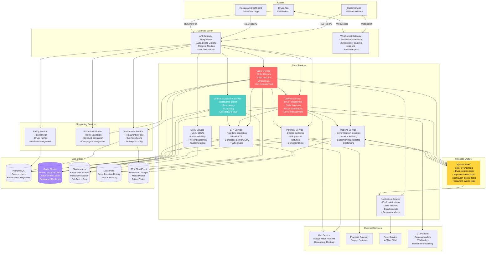

---

## 3. Component Deep Dive

### 3.1 Order Service (The Orchestrator)

**Responsibility:** Manages the entire order lifecycle from cart to delivery. This is
the central orchestrator that coordinates restaurant, delivery, and payment services.

**Why this is the most critical component:** Every dollar of revenue flows through the
Order Service. It must maintain a consistent state machine, handle partial failures
gracefully, and coordinate three parties (customer, restaurant, driver) simultaneously.

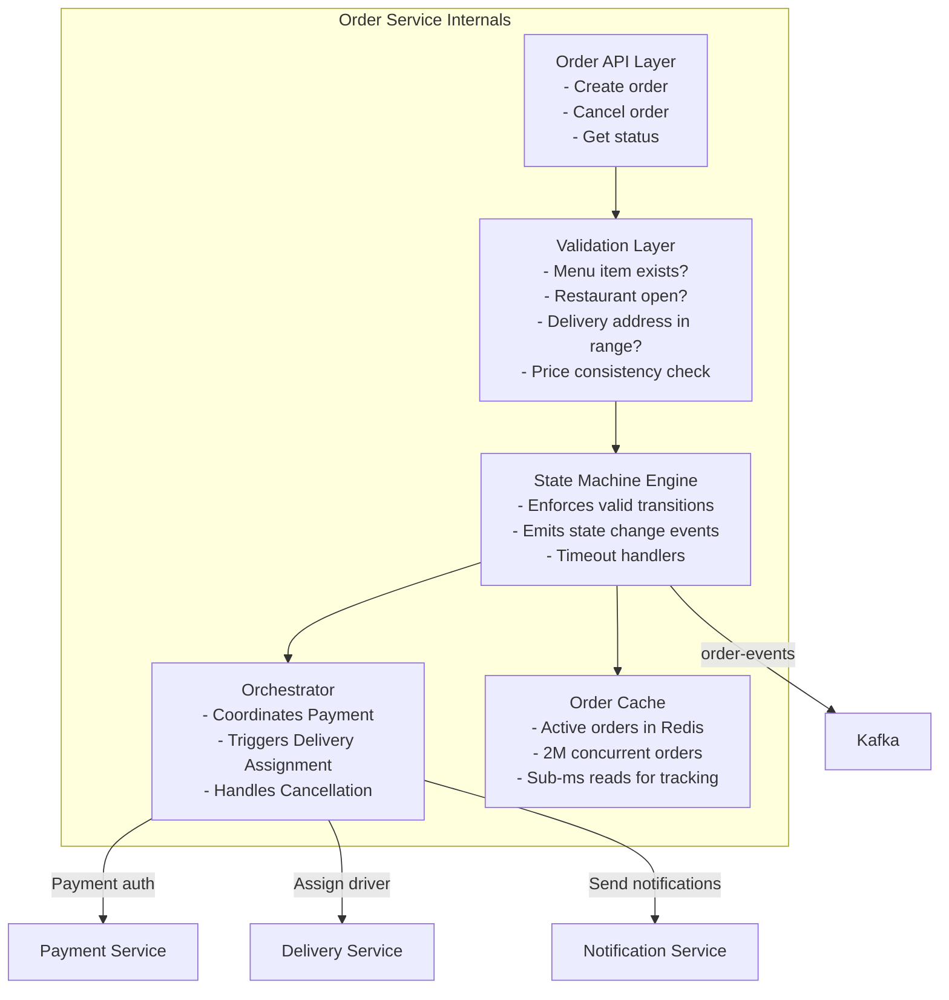

**Order creation flow (critical path):**

```
1. Customer submits order (POST /api/v1/orders)
2. Validate: restaurant is open, items exist and are available, 
   prices match current menu, delivery address is in range
3. Apply promotions: validate promo code, calculate discount
4. Calculate fees: subtotal + delivery fee + service fee + tax - discount + tip
5. Payment authorization: hold total amount on customer's card (not charged yet)
6. Create order record in PostgreSQL (status: PLACED)
7. Cache active order in Redis (for fast tracking reads)
8. Emit "order.placed" event to Kafka
9. Notify restaurant of new order (push notification + dashboard update)
10. Return order confirmation to customer

Total latency budget: < 1 second
  - Validation:     ~50ms
  - Promo check:    ~30ms
  - Fee calculation: ~20ms
  - Payment auth:   ~300ms (external API call -- the bottleneck)
  - DB write:       ~50ms
  - Cache + Kafka:  ~30ms
  - Response:       ~20ms
```

---

### 3.2 Search & Discovery Service (The Revenue Driver)

**Responsibility:** Powers the restaurant browsing and search experience. This is what
customers see first -- the "home feed" of recommended restaurants and the search bar.
Directly impacts conversion rate and revenue.

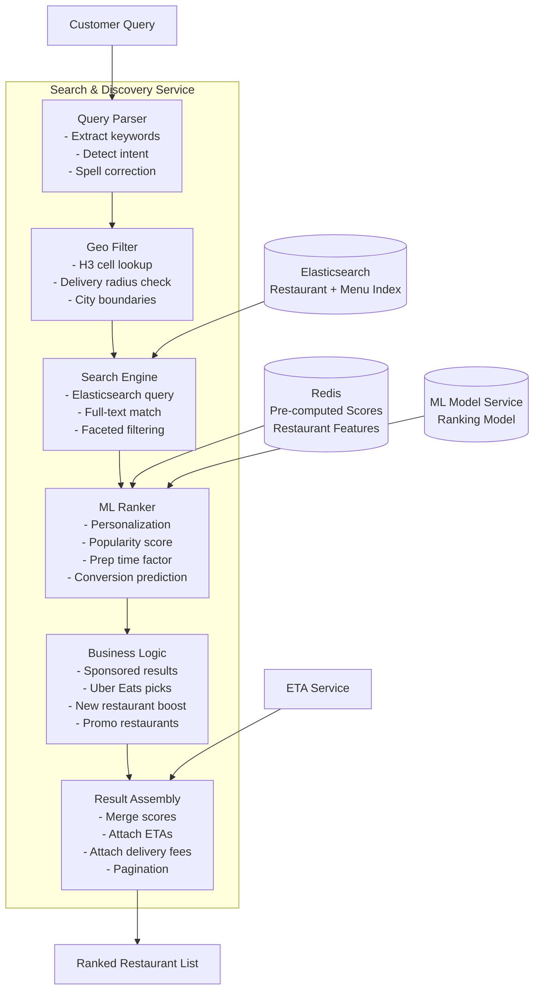

**How restaurant search works (step by step):**

```
1. Customer opens app at location (37.77, -122.42)
2. Compute H3 cell at resolution 7 (~5 km^2 hexagon)
3. Expand to H3 cell + all neighboring cells (7 hexagons total)
4. Query Elasticsearch:
   - Filter: h3_index IN (cell_ids) AND is_active = true AND is_open = true
   - If search query: full-text match on (restaurant_name, cuisine, menu_items)
   - Apply facet filters (cuisine, price_range, dietary)
5. For each candidate restaurant (~100-300 matches):
   - Compute straight-line distance to customer
   - Check actual delivery radius (some restaurants limit to 5 km)
   - Look up pre-computed ranking features from Redis:
     * popularity_score (orders in last 7 days)
     * avg_rating and rating_count
     * avg_prep_time_minutes
     * cancellation_rate
     * user-specific features (past orders, cuisine preferences)
6. Run ML ranking model to produce final score per restaurant
7. Insert sponsored results at designated positions (2nd, 5th, etc.)
8. Attach delivery ETA and fee for each result
9. Return top 20 results (paginated)

Target latency: < 300ms end-to-end
```

---

### 3.3 Delivery Service (The Logistics Engine)

**Responsibility:** Manages delivery partner lifecycle, assigns drivers to orders,
optimizes routes, and handles order batching.

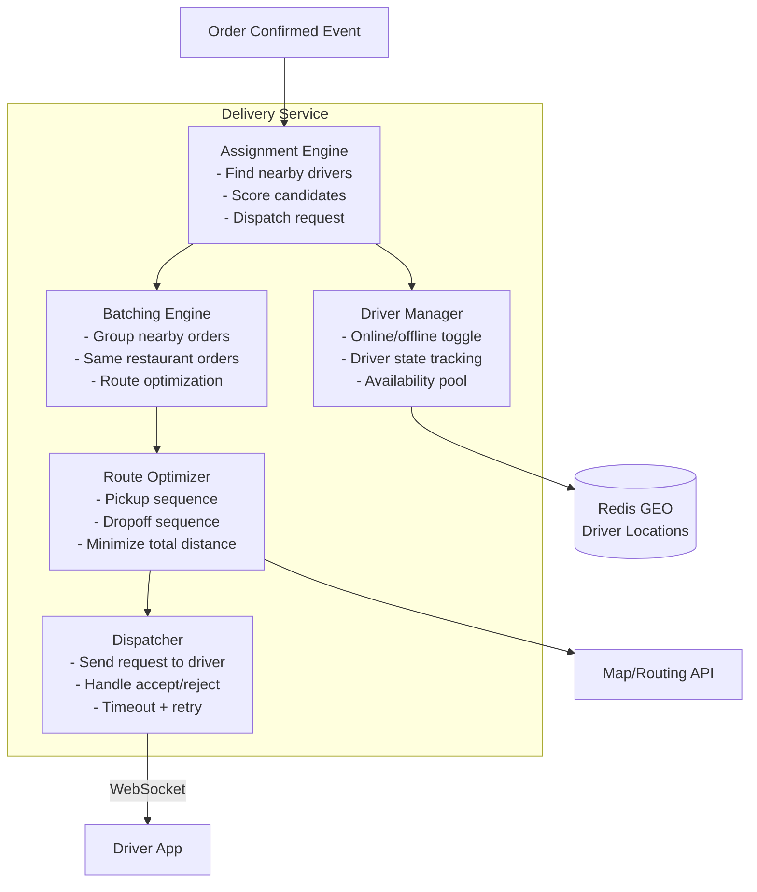

**Driver states:**

```
OFFLINE      -- Not accepting deliveries
ONLINE       -- Available, waiting for assignment
OFFERED      -- Delivery request sent, waiting for response (30s timeout)
ASSIGNED     -- Accepted delivery, en route to restaurant
AT_RESTAURANT -- Arrived at restaurant, waiting for order
PICKING_UP   -- Has order, en route to customer
AT_CUSTOMER  -- Arrived at delivery address
```

**Assignment algorithm (simplified):**

```
Input: order with restaurant location (rest_lat, rest_lng)

1. Query Redis GEORADIUS: find all ONLINE drivers within 5 km of restaurant
2. If too few candidates, expand radius to 8 km, then 12 km
3. For each candidate driver, compute score:
   
   score = w1 * (1 / eta_to_restaurant)     # Closer is better
         + w2 * driver_rating                # Higher rated is better  
         + w3 * acceptance_rate              # Reliable drivers preferred
         + w4 * batching_bonus               # Bonus if driver already heading near restaurant
         - w5 * current_load                 # Penalize if driver has 2+ active orders

4. Sort drivers by score descending
5. Send delivery request to top driver via WebSocket
6. If driver accepts within 30 seconds: ASSIGNED
7. If driver declines or times out: try next driver
8. If no driver found after 3 attempts: widen radius, or queue for reassignment
```

---

### 3.4 Tracking Service (Real-Time Location Pipeline)

**Responsibility:** Ingests driver location updates at 500K/sec, indexes them for
spatial queries, and pushes real-time updates to customers tracking their orders.

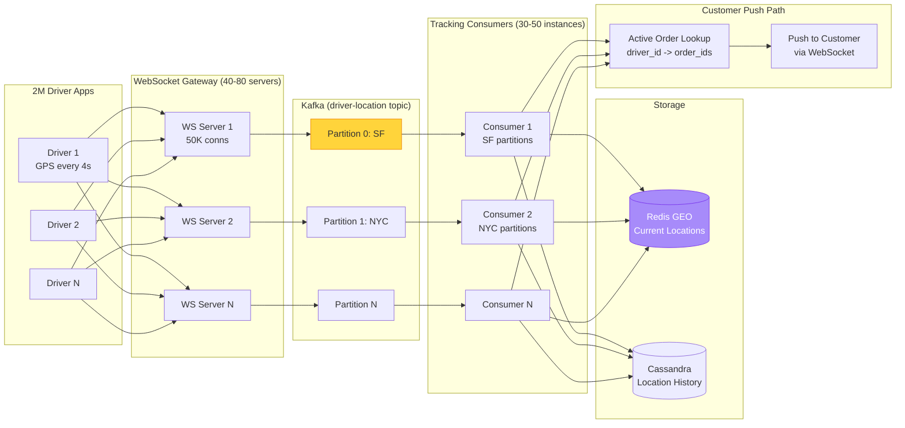

**Processing pipeline per location update:**

```
1. Driver app sends GPS: { lat, lng, heading, speed, accuracy, ts }
2. WebSocket Gateway receives, validates, enriches with driver_id
3. Publish to Kafka topic "driver-location" (partitioned by city)
4. Tracking Consumer reads from Kafka:
   a. Update Redis GEO: GEOADD drivers:{city} {lng} {lat} {driver_id}
   b. Update H3 cell membership in Redis
   c. Write to Cassandra: location_history (driver_id, date, ts, lat, lng)
   d. Check: is this driver on an active delivery?
      - If yes: look up active order(s) for this driver
      - Push location to customer(s) via WebSocket Gateway
5. TTL on Redis keys: if no update in 60s, driver considered offline
```

---

### 3.5 Menu Service

**Responsibility:** Manages restaurant menus, item availability, pricing, and
customization options. Syncs changes to the Elasticsearch search index.

```
Key operations:
- Restaurant updates menu item -> write to PostgreSQL -> emit event -> update Elasticsearch
- Customer views menu -> read from PostgreSQL (cached in Redis for hot restaurants)
- Item marked unavailable -> real-time update via WebSocket to customers viewing menu

Menu data is a hot read path: 20,700 QPS at peak.
Strategy: aggressive Redis caching with 60s TTL, invalidate on menu change events.

Cache key: menu:{restaurant_id}
Cache value: full menu JSON (avg ~50 KB)
Cache hit rate: ~95% (most requests for popular restaurants)
```

---

### 3.6 Payment Service

**Responsibility:** Handles all financial transactions -- charge customer, split payouts
to restaurant and driver, process refunds, and manage Uber Eats commission.

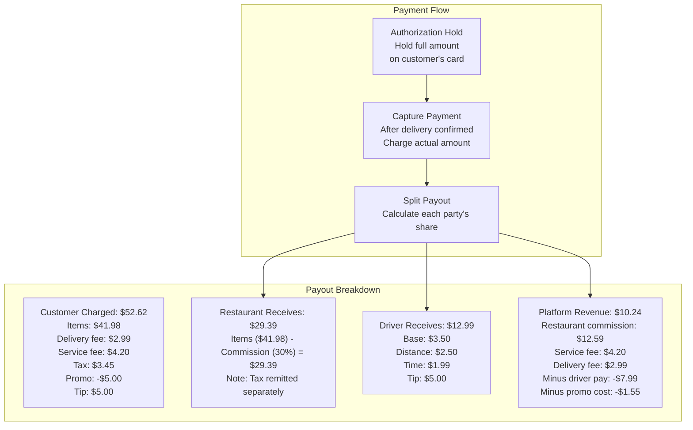

---

### 3.7 Notification Service

**Responsibility:** Sends timely notifications to all three parties across channels
(push notification, SMS, email).

```
Notification triggers and recipients:

Order Placed      -> Restaurant: "New order from Sarah! 3 items, $41.98"
Order Confirmed   -> Customer:   "Joe's Pizza confirmed your order! Est. 25 min"
Driver Assigned   -> Customer:   "Alex is picking up your order"
                  -> Driver:     "New delivery: Joe's Pizza -> 123 Main St"
Driver at Restaurant -> Restaurant: "Driver Alex has arrived for order #456"
Order Picked Up   -> Customer:   "Alex picked up your order! ETA 12 min"
Driver Arriving   -> Customer:   "Alex is almost there! 2 min away"
Order Delivered   -> Customer:   "Your order has been delivered! Rate your experience"
                  -> Restaurant: "Order #456 delivered successfully"
Payment Receipt   -> Customer:   Email receipt with full breakdown

Volume: ~925 notifications/sec = ~80M/day
Channel priority: Push notification > SMS (fallback) > Email (receipts)
```

---

### 3.8 ETA Service

**Responsibility:** Calculates the composite estimated delivery time that customers see.
The most visible promise the platform makes to customers.

```
Composite ETA = Prep Time + Pickup ETA + Delivery ETA

Component breakdown:

1. Prep Time (restaurant-dependent):
   - Base: restaurant's stated prep time for ordered items
   - Adjusted by: current order queue length, time of day, historical accuracy
   - ML model trained on: past prep times for this restaurant, item types, order size
   - Typical range: 10-40 minutes

2. Pickup ETA (driver to restaurant):
   - Computed via routing engine (Google Maps / OSRM)
   - Input: driver's current location -> restaurant location
   - Factors: distance, current traffic, road network
   - Updated dynamically as driver moves
   - Typical range: 3-15 minutes

3. Delivery ETA (restaurant to customer):
   - Computed via routing engine
   - Input: restaurant location -> customer delivery address
   - Factors: distance, traffic, time of day
   - Typical range: 5-25 minutes

Total customer-facing ETA: typically 20-60 minutes
Updated every 30 seconds once driver is assigned
```

---

## 4. Order Lifecycle State Machine

This is the heart of the system. Every order transitions through a well-defined
set of states, and each transition triggers downstream actions.

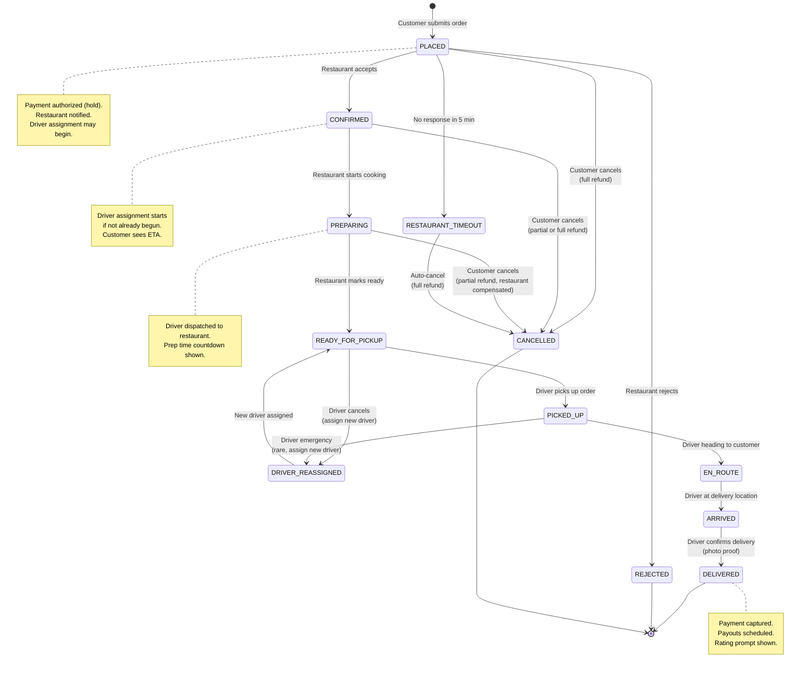

### State Transition Rules

```
State Transition Table:
-----------------------------------------------------------------------
Current State      | Valid Next States         | Trigger
-----------------------------------------------------------------------
PLACED             | CONFIRMED                | Restaurant accepts order
                   | REJECTED                 | Restaurant rejects order
                   | CANCELLED                | Customer cancels
                   | RESTAURANT_TIMEOUT       | No restaurant response in 5 min
-----------------------------------------------------------------------
CONFIRMED          | PREPARING                | Restaurant starts prep
                   | CANCELLED                | Customer cancels (refund policy applies)
-----------------------------------------------------------------------
PREPARING          | READY_FOR_PICKUP         | Restaurant marks food ready
                   | CANCELLED                | Customer cancels (complex refund)
-----------------------------------------------------------------------
READY_FOR_PICKUP   | PICKED_UP                | Driver marks pickup
                   | DRIVER_REASSIGNED        | Driver cancels
-----------------------------------------------------------------------
PICKED_UP          | EN_ROUTE                 | Driver heading to customer
                   | DRIVER_REASSIGNED        | Emergency (very rare)
-----------------------------------------------------------------------
EN_ROUTE           | ARRIVED                  | Driver near delivery address
-----------------------------------------------------------------------
ARRIVED            | DELIVERED                | Driver confirms + photo proof
-----------------------------------------------------------------------

Each transition:
1. Validates: current state allows this transition
2. Updates PostgreSQL (source of truth)
3. Updates Redis (active order cache)
4. Emits Kafka event (order.status.changed)
5. Triggers notifications to relevant parties
6. Updates ETA if applicable
```

### Cancellation Refund Policy

```
When can the customer cancel, and what is the refund?

PLACED -> CANCELLED:
  Refund: 100% (food not started)
  Restaurant: no charge
  
CONFIRMED -> CANCELLED:
  Refund: 100% (food not started yet)
  Restaurant: no charge (they can reject the cancellation if prep started)

PREPARING -> CANCELLED:
  Refund: partial (delivery fee + service fee refunded, food cost may not be)
  Restaurant: compensated for partial prep work
  Driver (if assigned): compensated for wasted time
  
READY_FOR_PICKUP or later -> cannot cancel via app
  Customer must contact support for case-by-case resolution
```

---

## 5. Data Flow Walkthroughs

### 5.1 Complete Order Flow (End to End)

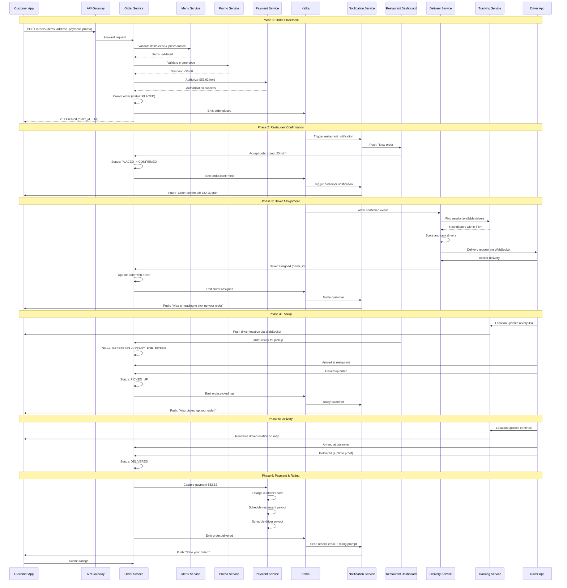

### 5.2 Restaurant Search Flow

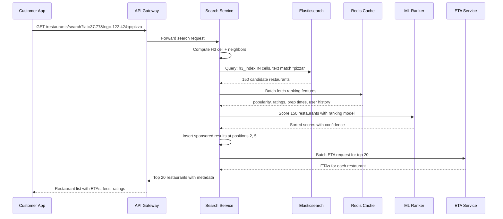

---

## 6. Restaurant Search and Discovery

### 6.1 Geospatial Indexing Strategy

```
We use a dual approach: H3 hexagonal indexing + Elasticsearch geo queries.

H3 Hexagonal Grid (Uber's own system):
- Resolution 7: ~5.16 km^2 hexagons (for city-level bucketing)
- Resolution 9: ~0.105 km^2 hexagons (for fine-grained driver lookup)
- Each restaurant is assigned an H3 index based on its coordinates
- Search: compute customer's H3 cell, query that cell + 6 neighbors

Why H3 over Geohash:
- Hexagons have uniform neighbors (6 vs. 8 for squares)
- No edge distortion like geohash (geohash squares have variable sizes near poles)
- Hierarchical: can zoom in/out across resolutions
- Uber built H3 for exactly this use case

Elasticsearch Geo Distance:
- Used for precise distance filtering after H3 narrows candidates
- geo_distance filter: "show restaurants within 8 km of customer"
- Combined with full-text search on restaurant name, cuisine, menu items
```

### 6.2 Search Index Structure

```json
// Elasticsearch restaurant document
{
  "restaurant_id": "rst_abc123",
  "name": "Joe's Pizza",
  "name_autocomplete": "joe's pizza",      // Edge n-gram for autocomplete
  "cuisine_types": ["Italian", "Pizza"],
  "menu_items_text": "margherita pizza pepperoni calzone garlic bread tiramisu",
  "tags": ["Popular", "Staff Pick", "Late Night"],
  "location": {                             // Elasticsearch geo_point
    "lat": 37.7749,
    "lon": -122.4194
  },
  "h3_index_r7": "872830828ffffff",        // H3 resolution 7
  "city": "san_francisco",
  "price_range": 2,
  "avg_rating": 4.7,
  "rating_count": 2340,
  "avg_prep_minutes": 18,
  "is_active": true,
  "is_open": true,
  "accepts_uber_one": true,
  "has_promo": true,
  "delivery_radius_km": 8.0,
  "business_hours": { "mon": "10:00-23:00", "tue": "10:00-23:00" },
  
  // ML ranking features (pre-computed, updated hourly)
  "popularity_score": 0.87,               // Normalized 0-1
  "conversion_rate": 0.12,                // % of views -> orders
  "reorder_rate": 0.34,                   // % of customers who reorder
  "cancel_rate": 0.02,                    // Order cancellation rate
  "freshness_score": 0.95                 // Menu recently updated
}
```

### 6.3 Ranking Algorithm

```
Restaurant ranking is a multi-signal scoring system:

Final Score = ML_model_score + sponsored_boost + freshness_boost

ML model input features:
  1. Distance to customer (closer = higher score)
  2. Estimated delivery ETA (faster = higher)
  3. Average food rating (higher = higher)
  4. Number of ratings (more = higher, confidence factor)
  5. Popularity score (order volume last 7 days, normalized)
  6. Prep time accuracy (restaurants that hit their estimates rank higher)
  7. Cancel/refund rate (lower = higher)
  8. User personalization:
     - Past cuisine preferences (user ordered Italian 5x last month)
     - Past restaurant orders (reorder boost)
     - Price sensitivity (user usually orders from $$ restaurants)
     - Time-of-day patterns (user orders sushi for dinner, coffee for morning)
  9. Menu match score (how well menu items match search query)
  10. Photo quality score (restaurants with professional photos rank higher)

Sponsored results:
  - Restaurants can pay for promoted placement
  - Inserted at fixed positions (2nd, 5th result)
  - Labeled "Sponsored" for transparency
  - Auction-based pricing: restaurant bids per impression or per order

Business rules:
  - Restaurants with < 4.0 rating are demoted
  - New restaurants get a 14-day boost (cold start)
  - Restaurants with > 5% cancel rate are heavily penalized
  - Uber One partner restaurants get a small boost for Uber One members
```

---

## 7. Delivery Assignment Algorithm

### 7.1 Single Order Assignment

```mermaid
graph TB
    subgraph "Step 1: Find Candidates"
        ORDER[New Order<br/>Restaurant at (lat, lng)]
        RADIUS["Query Redis GEORADIUS<br/>5 km around restaurant<br/>Filter: ONLINE drivers only"]
        EXPAND["If < 3 candidates:<br/>Expand to 8 km, then 12 km"]
    end

    subgraph "Step 2: Score Candidates"
        ETA_CALC["Compute ETA to restaurant<br/>(via routing API)"]
        RATING["Look up driver rating<br/>and acceptance rate"]
        LOAD["Check current load<br/>(0, 1, or 2 active orders)"]
        SCORE["Score = w1/ETA + w2*Rating<br/>+ w3*AcceptRate - w4*Load<br/>+ w5*BatchBonus"]
    end

    subgraph "Step 3: Dispatch"
        SORT["Sort by score descending"]
        SEND["Send delivery request<br/>to top driver (WebSocket)"]
        WAIT["Wait 30 seconds for response"]
        ACCEPT{Accepted?}
        YES["Assign driver to order<br/>Status: ASSIGNED"]
        NO["Try next driver<br/>(up to 3 attempts)"]
        FAIL["Queue for reassignment<br/>or widen search radius"]
    end

    ORDER --> RADIUS
    RADIUS --> EXPAND
    EXPAND --> ETA_CALC
    ETA_CALC --> RATING
    RATING --> LOAD
    LOAD --> SCORE
    SCORE --> SORT
    SORT --> SEND
    SEND --> WAIT
    WAIT --> ACCEPT
    ACCEPT -->|Yes| YES
    ACCEPT -->|No/Timeout| NO
    NO -->|More candidates| SEND
    NO -->|No more| FAIL
```

### 7.2 Batched Order Assignment

```
Batching is the key differentiator for delivery economics.
Instead of one driver per order, we can assign 2-3 nearby orders
to the same driver, reducing cost per delivery.

When to batch:
1. Two orders from the SAME restaurant (most common)
   - Same pickup, different dropoffs
   - Dropoffs within 2 km of each other and on similar heading
   
2. Two orders from NEARBY restaurants (< 500m apart)
   - Driver picks up order A, then walks to pick up order B
   - Dropoffs within 3 km of each other
   
3. Add-on to active delivery
   - Driver already en route to Restaurant X
   - New order at Restaurant X or nearby restaurant
   - New dropoff is along driver's existing route (< 1 km detour)

Batching constraints:
- Maximum 3 orders per driver at any time
- Each order's delivery ETA must not increase by more than 10 minutes
- Customer must be informed: "Your driver has another delivery nearby"
- Hot food penalty: cannot delay delivery of temperature-sensitive items by > 15 min

Batching algorithm:
1. New order arrives for Restaurant R at location L
2. Check: are there any drivers currently assigned to orders from R or nearby?
3. For each candidate driver with active orders:
   a. Compute: additional time to add this order to their route
   b. Check: would this delay existing orders beyond threshold?
   c. Compute: cost savings from batching (avoided dispatch of new driver)
   d. If net_benefit > threshold: batch this order with existing driver
4. If no batching opportunity: assign as a single order (Step 7.1)
```

---

## 8. ETA Calculation

### 8.1 Composite ETA Architecture

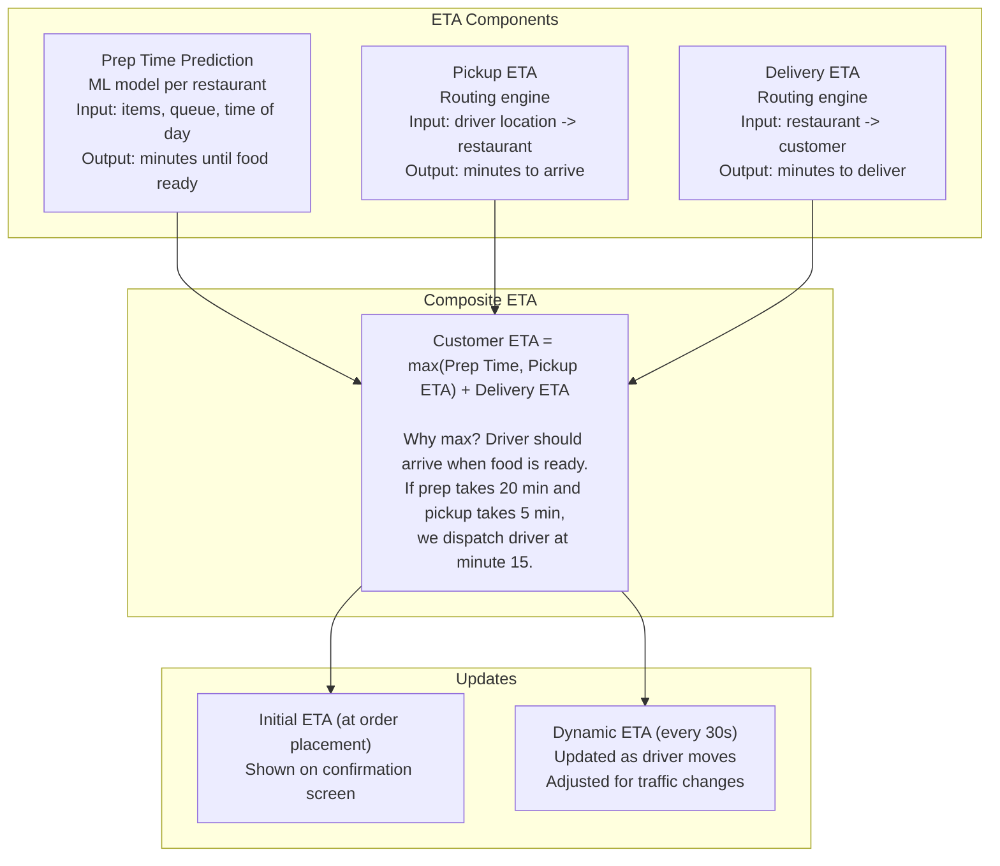

### 8.2 Prep Time Prediction

```
This is uniquely challenging for food delivery (Uber Rides does not have this).

Input features for ML prep time model:
  - Restaurant's stated prep time per item
  - Number of items in order
  - Item complexity (pizza takes longer than drinks)
  - Current queue length (how many active orders at restaurant)
  - Time of day (lunch rush = slower)
  - Day of week (weekends may differ)
  - Historical accuracy (if restaurant always takes 5 min longer than stated)
  - Weather (bad weather = more orders = longer prep)

Output: predicted minutes until order is ready for pickup

Training data: millions of past orders with actual prep times
  - start_time: when restaurant confirmed order
  - ready_time: when restaurant marked "ready for pickup"
  - actual_prep = ready_time - start_time

Model: gradient boosted trees (XGBoost / LightGBM)
  - Retrained daily per restaurant
  - Fallback: restaurant's self-reported prep time + historical bias correction
```

### 8.3 Smart Driver Dispatch Timing

```
Key insight: Do NOT dispatch the driver immediately when the order is confirmed.
Wait until the food is almost ready.

dispatch_time = order_confirmed_time + predicted_prep_time - driver_eta_to_restaurant

Example:
  - Order confirmed at 12:00
  - Predicted prep time: 20 minutes (food ready at 12:20)
  - Nearest driver is 8 minutes away from restaurant
  - Dispatch driver at 12:12 (driver arrives at 12:20, just as food is ready)

Benefits:
  - Driver does not wait at restaurant (saves driver's time)
  - Driver is available for other deliveries during the wait
  - Food is fresher (less time sitting on counter)

Risk:
  - If prep finishes early, driver is not there yet
  - If prep runs late, driver waits at restaurant
  - Buffer: dispatch 2-3 minutes early to handle variance
```

---

## 9. Real-Time Tracking

### 9.1 Customer Tracking Experience

```mermaid
graph TB
    subgraph "Customer App Tracking View"
        MAP[Map View<br/>Driver location pin<br/>Updated every 3 seconds]
        STATUS[Status Bar<br/>PREPARING -> PICKED_UP -> EN_ROUTE]
        ETA_DISP[ETA Display<br/>"Arriving in 12 minutes"<br/>Updated every 30 seconds]
        TIMELINE[Order Timeline<br/>Timestamped status history]
        DRIVER_INFO[Driver Card<br/>Name, photo, vehicle<br/>Contact button]
    end

    subgraph "Backend Infrastructure"
        WS_CONN[WebSocket Connection<br/>Opened when customer<br/>enters tracking screen]
        LOC_PUSH[Location Push<br/>Server pushes driver coords<br/>every 3 seconds]
        STATUS_PUSH[Status Push<br/>Server pushes state changes<br/>as they happen]
        ETA_PUSH[ETA Push<br/>Server pushes updated ETA<br/>every 30 seconds]
    end

    WS_CONN --> MAP
    LOC_PUSH --> MAP
    STATUS_PUSH --> STATUS
    STATUS_PUSH --> TIMELINE
    ETA_PUSH --> ETA_DISP
```

### 9.2 WebSocket Connection Management

```
When customer opens tracking screen:
1. App opens WSS connection: /ws/v1/orders/{order_id}/track
2. Server authenticates token, validates customer owns this order
3. Server registers this connection in a connection registry:
   Key: order_id -> { customer_ws_connection, driver_id }
4. Server starts pushing:
   - Driver location (every 3 seconds, if driver is assigned)
   - Status updates (on state change)
   - ETA updates (every 30 seconds)
5. When customer closes tracking screen: gracefully close WebSocket
6. Reconnection: if connection drops, client auto-reconnects with exponential backoff

Connection registry (Redis):
  HSET order_tracking:{order_id} ws_server "ws-server-42"
  HSET order_tracking:{order_id} driver_id "drv_789"

When driver location update arrives:
  1. Tracking consumer looks up: which orders is this driver assigned to?
     SMEMBERS driver_orders:{driver_id} -> [ord_456, ord_789]
  2. For each order: which WebSocket server is the customer connected to?
     HGET order_tracking:{order_id} ws_server -> "ws-server-42"
  3. Route location update to that WebSocket server (via internal pub/sub)
  4. WebSocket server pushes to customer's connection
```

### 9.3 Geofencing for Automatic Status Updates

```
Geofences trigger automatic events when the driver enters a geographic zone:

Restaurant Geofence (200m radius):
  - When driver enters: auto-set status "ARRIVED_AT_RESTAURANT"
  - Notify restaurant: "Your delivery driver is here"
  
Customer Geofence (500m radius):
  - When driver enters: push to customer "Your driver is almost there!"
  
Customer Delivery Geofence (50m radius):
  - When driver enters: auto-set status "ARRIVED"
  - Send final push notification to customer

Implementation:
  - On each location update, check driver's distance to relevant geofence centers
  - Use Haversine formula for distance calculation (fast, sufficient accuracy)
  - Debounce: only trigger once per geofence crossing (not on every ping)
```

---

## 10. Payment Flow

### 10.1 Uber Eats Payment Lifecycle

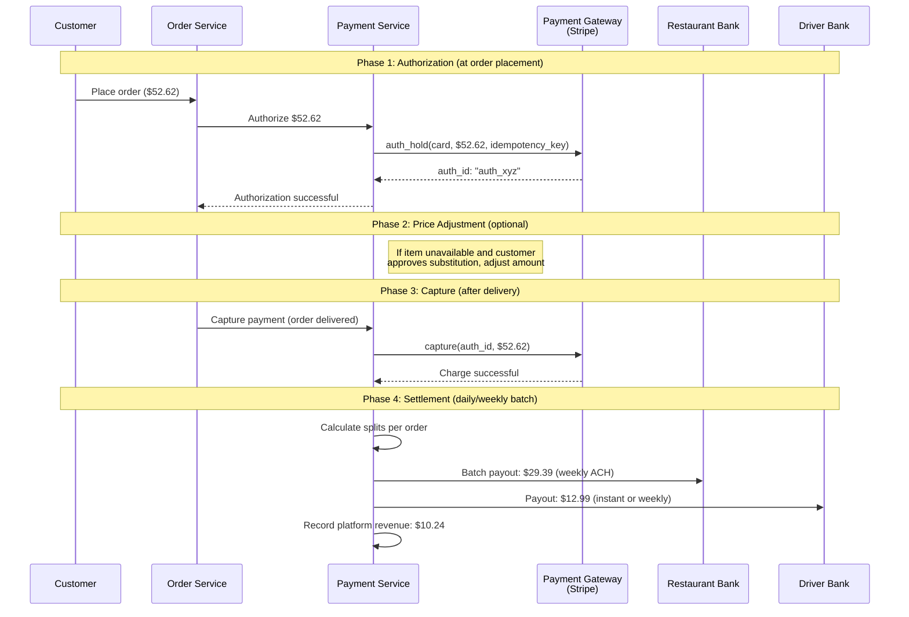

### 10.2 Payment Splitting Logic

```
For a $52.62 order:

Customer pays:
  Item subtotal:     $41.98   (2x Large Pepperoni Pizza)
  Delivery fee:       $2.99   (variable based on distance/demand)
  Service fee:        $4.20   (typically 10-15% of subtotal)
  Tax:                $3.45   (varies by jurisdiction)
  Promo discount:    -$5.00   (PIZZA5 code)
  Tip:                $5.00   (goes 100% to driver)
  ---------------------------------
  TOTAL CHARGED:     $52.62

Restaurant receives:
  Item subtotal:     $41.98
  - Commission (30%): -$12.59  (Uber Eats takes 15-30% depending on plan)
  ---------------------------------
  Restaurant payout: $29.39    (paid weekly via ACH)
  Note: restaurant also receives tax collected, remitted separately

Driver receives:
  Base pay:           $3.50    (per delivery minimum)
  Distance pay:       $2.50    ($0.50/km x 5 km)
  Time pay:           $1.99    ($0.15/min x ~13 min)
  Tip:                $5.00    (100% pass-through)
  ---------------------------------
  Driver payout:     $12.99    (available instantly or weekly)

Platform keeps:
  Restaurant commission: $12.59
  Service fee:           $4.20
  Delivery fee:          $2.99
  - Driver base+distance+time: -$7.99
  - Promo subsidy:       -$1.55  (platform absorbs part of promo cost)
  ---------------------------------
  Platform revenue:     $10.24   (per order)

At 10M orders/day: $10.24 x 10M = ~$102M/day gross revenue
```

### 10.3 Idempotency and Failure Handling

```
Payment operations MUST be idempotent. Network failures, retries, and timeouts
are common when calling external payment gateways.

Strategy:
1. Every payment operation has an idempotency_key (UUID)
2. Before calling gateway: check if we already processed this key
   SELECT status FROM payment_operations WHERE idempotency_key = ?
3. If found and SUCCESS: return cached result (do not charge again)
4. If found and FAILED: allow retry
5. If not found: proceed with payment, store result

Implementation:
  CREATE TABLE payment_operations (
      idempotency_key  UUID PRIMARY KEY,
      order_id         UUID,
      operation_type   VARCHAR(50),    -- AUTH, CAPTURE, REFUND
      amount           DECIMAL(10, 2),
      status           VARCHAR(50),    -- PENDING, SUCCESS, FAILED
      gateway_ref      VARCHAR(255),   -- Stripe charge_id
      created_at       TIMESTAMP,
      updated_at       TIMESTAMP
  );

Double-capture prevention:
  - Unique constraint on (order_id, operation_type) for CAPTURE
  - Even if Order Service retries the capture call, it cannot charge twice

Refund handling:
  - Full refund: reverse the capture, credit customer's card
  - Partial refund: refund specific amount (e.g., for missing items)
  - Uber Eats credits: alternative to card refund (faster, keeps money in ecosystem)
```

---

## 11. Database Design and Sharding

### 11.1 Sharding Strategy

```
Primary shard key: city (geographic partitioning)

Why city-level sharding:
1. Orders are local: an SF customer orders from an SF restaurant via an SF driver
2. Queries are local: restaurant search is geo-bounded
3. Balanced load: major cities (NYC, SF, London) get dedicated shards
4. Compliance: some jurisdictions require data residency

Shard layout example:
  Shard 1: US-West (SF, LA, Seattle, Portland)
  Shard 2: US-East (NYC, Boston, DC, Miami)
  Shard 3: US-Central (Chicago, Dallas, Denver)
  Shard 4: UK + Ireland (London, Manchester, Dublin)
  Shard 5: India (Mumbai, Delhi, Bangalore)
  ...

Cross-shard queries (rare):
  - User's global order history (user moves cities)
  - Platform-wide analytics
  - Handled via scatter-gather or async aggregation
```

### 11.2 Data Store Selection

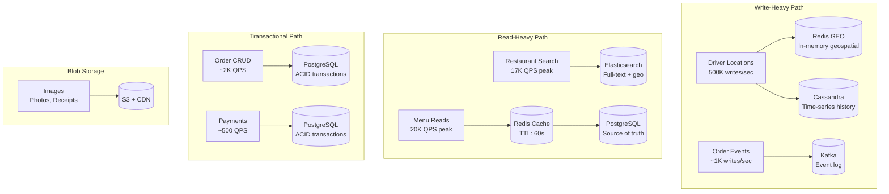

### 11.3 Caching Strategy

```
Layer 1: CDN (CloudFront)
  - Restaurant images, menu photos
  - Static assets (app bundles, icons)
  - TTL: 24 hours, invalidate on change
  - Hit rate: ~98%

Layer 2: Redis Application Cache
  - Restaurant menu data: key = menu:{restaurant_id}, TTL = 60s
  - Restaurant metadata: key = restaurant:{id}, TTL = 300s
  - Active order state: key = order:{order_id}, no TTL (deleted on completion)
  - User session data: key = session:{user_id}, TTL = 1 hour
  - Search ranking features: key = rank:{restaurant_id}, TTL = 3600s
  - Driver location: key = GEO drivers:{city}, updated real-time
  
  Total Redis memory: ~50 GB across cluster
  Hit rate for menu reads: ~95%

Layer 3: Local In-Process Cache (per service instance)
  - Cuisine type enums, city configurations
  - Rate limit counters
  - TTL: 60 seconds
  - Size: < 100 MB per instance

Cache invalidation strategy:
  - Menu change event in Kafka -> invalidate menu:{restaurant_id}
  - Restaurant goes offline -> invalidate restaurant:{id}, update ES
  - Order status change -> update order:{order_id} in Redis
  - Event-driven invalidation preferred over TTL-based for critical data
```

---

## 12. Communication Patterns

### 12.1 Synchronous vs. Asynchronous

```
Synchronous (REST/gRPC) -- used when caller needs immediate response:
  - Customer places order -> Order Service -> Payment Service (auth hold)
  - Customer searches restaurants -> Search Service -> Elasticsearch
  - Customer views menu -> Menu Service -> Redis/PostgreSQL
  - Driver responds to delivery request -> Delivery Service

Asynchronous (Kafka events) -- used for decoupled, downstream actions:
  - Order placed -> notify restaurant, start assignment process
  - Order confirmed -> dispatch driver, update ETA
  - Order picked up -> notify customer, update tracking
  - Driver location update -> update Redis index, push to customer
  - Order delivered -> capture payment, send receipt, prompt rating

Why this split:
  - Synchronous for user-facing critical path (must respond quickly)
  - Async for side effects (notifications, analytics, etc.)
  - If notification service is slow, it should NOT slow down order placement
```

### 12.2 Kafka Topic Design

```
Topics and their purposes:

order-events (high priority):
  Partitions: 50 (partitioned by city)
  Retention: 7 days
  Events: order.placed, order.confirmed, order.preparing, 
          order.ready, order.picked_up, order.delivered, order.cancelled
  Consumers: Notification Service, Delivery Service, Analytics, Payment Service

driver-location (highest throughput):
  Partitions: 100 (partitioned by city)
  Retention: 24 hours (historical stored in Cassandra)
  Events: driver.location.update
  Consumers: Tracking Service, Analytics

payment-events:
  Partitions: 20
  Retention: 30 days
  Events: payment.authorized, payment.captured, payment.refunded, payout.scheduled
  Consumers: Order Service (confirmation), Analytics, Accounting

restaurant-events:
  Partitions: 20
  Retention: 7 days
  Events: restaurant.online, restaurant.offline, menu.updated, item.unavailable
  Consumers: Search Service (update ES index), Menu Service (invalidate cache)

notification-events:
  Partitions: 30
  Retention: 3 days
  Events: notification.send (with channel, recipient, template, data)
  Consumers: Notification Service workers (push, SMS, email)
```

### 12.3 WebSocket Architecture

```mermaid
graph TB
    subgraph "Customer WebSocket Flow"
        CAPP[Customer App] <-->|WSS| WSG1[WS Gateway<br/>Server Pool]
        WSG1 --> |Subscribe| REDIS_PS[(Redis Pub/Sub<br/>Channel: order:{id})]
    end

    subgraph "Driver WebSocket Flow"
        DAPP[Driver App] <-->|WSS| WSG2[WS Gateway<br/>Server Pool]
        WSG2 --> |Publish| KAFKA_LOC[Kafka<br/>driver-location]
    end

    subgraph "Internal Routing"
        TS_SVC[Tracking Service] --> |Publish update| REDIS_PS
        DS_SVC[Delivery Service] --> |Delivery request| REDIS_PS
        OS_SVC[Order Service] --> |Status update| REDIS_PS
    end

    REDIS_PS --> |Push to customer| WSG1

    style REDIS_PS fill:#a78bfa,stroke:#7c3aed,color:#fff
```

```
WebSocket connection counts:
  - Drivers: 2M persistent connections (location streaming)
  - Customers: 2M active tracking sessions (during delivery)
  - Total: ~4M concurrent WebSocket connections

Server sizing:
  - Each WS server handles ~50K connections
  - 4M / 50K = 80 servers (with 2x headroom = 160 WS servers)
  - Memory per connection: ~10 KB = 500 MB per server

Connection routing:
  - Sticky connections via consistent hashing on user_id
  - If WS server dies: client reconnects to new server, re-subscribes
  - Health checks: ping/pong every 30 seconds
  - Idle timeout: 5 minutes (for customer connections when app is backgrounded)
```

### 12.4 Service Dependency Map

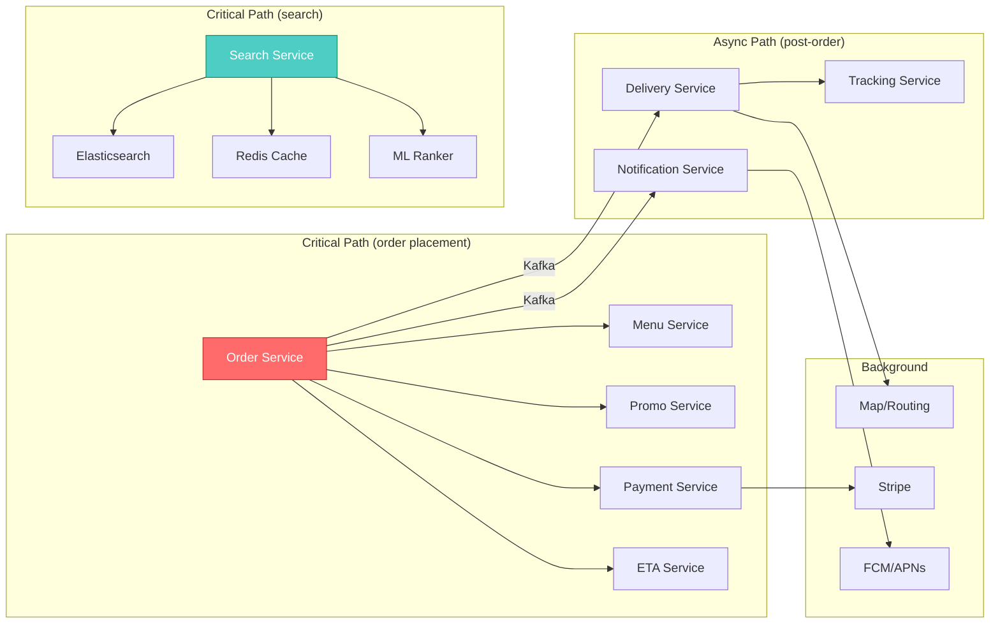

```
Failure isolation strategy:
- If Notification Service is down: orders still work, just no push notifications
- If ETA Service is down: use fallback estimates (distance / avg_speed)
- If Delivery Service is slow: orders queue in Kafka, assignment is delayed
- If Payment Service is down: ORDER CANNOT BE PLACED (hard dependency)
- If Search Service is down: customers can still order via direct restaurant links

Circuit breaker pattern applied to:
- Payment gateway calls (Stripe): trip after 5 failures in 30s
- Map API calls: trip after 10 failures in 60s, fallback to Haversine distance
- ML ranking model: trip after 3 failures, fallback to rule-based ranking
```
