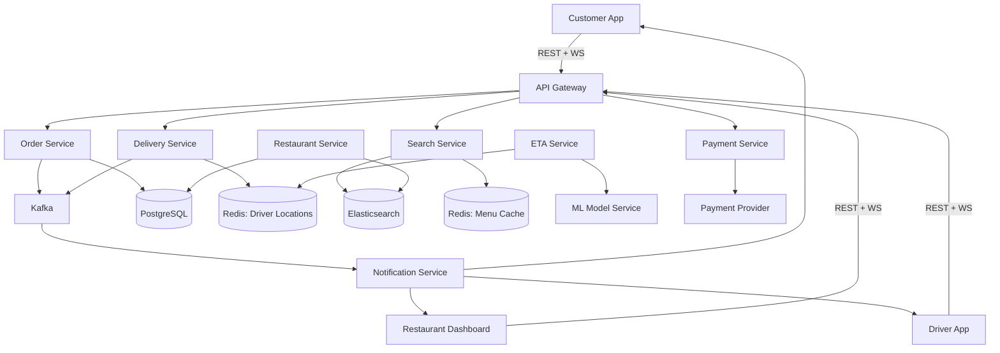

# Design Food Delivery (DoorDash/Uber Eats) -- Interview Script (45 min)

## Opening (0:00 - 0:30)

> "Thanks for the problem! A food delivery platform like DoorDash or Uber Eats is a fascinating three-sided marketplace -- connecting customers, restaurants, and delivery drivers. It involves real-time order management, logistics optimization, and time-sensitive operations. Let me ask some clarifying questions before I start."

---

## Clarifying Questions (0:30 - 3:00)

> **Q1:** "What's the expected scale -- daily active users, orders per day?"
>
> **Expected answer:** ~50M DAU, ~10M orders/day in a mature market.

> **Q2:** "Are we designing the full lifecycle -- menu browsing, ordering, restaurant preparation, delivery assignment, tracking, and payment? Or a subset?"
>
> **Expected answer:** Full lifecycle. Focus on the order management and delivery assignment parts.

> **Q3:** "How many restaurants and delivery drivers are we supporting?"
>
> **Expected answer:** ~500K restaurants, ~2M delivery drivers (not all active at once).

> **Q4:** "What's the expected delivery time promise? Is there a guarantee like '30 minutes or free'?"
>
> **Expected answer:** No hard guarantee, but ETA accuracy is critical. Show realistic ETAs.

> **Q5:** "Do we need to support scheduled orders (order now, deliver at 7 PM), or just immediate delivery?"
>
> **Expected answer:** Focus on immediate delivery. Mention scheduled as an extension.

> **Q6:** "How important is the ETA estimation -- is that a key feature I should dive into?"
>
> **Expected answer:** Yes, ETA is one of the hardest problems. Cover it.

> **Q7:** "For payment, should I account for the split between customer payment, restaurant payout, and driver payout?"
>
> **Expected answer:** Yes, mention the three-way financial flow.

---

## Requirements Summary (3:00 - 5:00)

> "Let me summarize what we're building."

> **"Functional Requirements:"**
> 1. "Customers can browse restaurant menus and place orders."
> 2. "Orders are routed to the restaurant for preparation."
> 3. "The system assigns a delivery driver to pick up and deliver the order."
> 4. "Real-time tracking of order status and driver location."
> 5. "ETA estimation shown to the customer throughout the process."
> 6. "Payment processing -- charge customer, pay restaurant and driver."
> 7. "Customer can cancel the order before restaurant starts preparing."

> **"Non-Functional Requirements:"**
> 1. "High availability -- if the system goes down during lunch rush, we lose millions in revenue."
> 2. "Low-latency order placement -- the customer should see confirmation within 2 seconds."
> 3. "ETA accuracy within +/- 5 minutes for 90% of orders."
> 4. "Handle peak load -- lunch and dinner rushes can be 5-10x average."
> 5. "Consistency on payments -- exactly-once charge, no double-billing."

> "I'll focus my design on the order lifecycle state machine, delivery driver assignment, and ETA estimation."

---

## Back-of-Envelope Estimation (5:00 - 8:00)

> "Let me do some quick math."

> **Order throughput:**
> "10M orders/day. Most concentrated in two 3-hour windows (lunch 11-2, dinner 5-8). So ~6 hours of peak = 10M / (6 * 3600) = ~460 orders/sec average in peak, probably 1K-2K orders/sec at the absolute peak."

> **Driver location updates:**
> "2M total drivers, maybe 200K active during peak. Each sends location every 5 seconds. That's 200K / 5 = 40K location updates/sec. Much smaller than Uber because fewer drivers."

> **Menu data:**
> "500K restaurants, each with ~50-100 items. Average item: 500 bytes (name, description, price, image URL, options). 500K * 75 items * 500 bytes = ~18.75 GB for all menu data. Easily fits in a distributed cache."

> **Storage for orders:**
> "10M orders/day, each order ~2KB (items, addresses, pricing, status history). 10M * 2KB = 20GB/day = ~7.3TB/year. PostgreSQL with sharding handles this."

> "Key bottleneck is the delivery assignment problem -- at peak, we need to match 460 orders/sec to available drivers in real time, considering location, route, and prep time."

---

## High-Level Design (8:00 - 20:00)

> "Let me draw the high-level architecture."

### Step 1: The Three Clients

> "We have three distinct clients:"
> 1. **Customer App** -- "Browse menus, place orders, track delivery."
> 2. **Restaurant Dashboard** -- "Receive orders, update prep status, manage menu."
> 3. **Driver App** -- "Receive delivery assignments, navigate, confirm pickup/dropoff."

### Step 2: API Gateway

> "All three clients go through an API Gateway that handles auth, rate limiting, and routing. The gateway also manages WebSocket connections for real-time updates to all three parties."

### Step 3: Core Services

> "The key microservices:"
> 1. **Restaurant Service** -- "Menu management, restaurant availability, hours."
> 2. **Order Service** -- "The heart of the system -- manages the order state machine."
> 3. **Delivery Service** -- "Driver assignment, driver tracking, route optimization."
> 4. **ETA Service** -- "Estimates prep time, pickup time, and delivery time."
> 5. **Payment Service** -- "Handles customer charges and merchant/driver payouts."
> 6. **Search Service** -- "Restaurant and menu search with filters."
> 7. **Notification Service** -- "Pushes real-time updates to all three parties."

### Step 4: Data Stores

> "For data stores:"
> - **PostgreSQL** -- "Order records, user accounts, restaurant data. Sharded by region."
> - **Redis** -- "Driver locations, session data, caching menus and restaurant availability."
> - **Elasticsearch** -- "Restaurant and menu search."
> - **Kafka** -- "Event bus for order events, driver location events, analytics."
> - **S3 + CDN** -- "Menu images, restaurant photos."

### Step 5: Whiteboard Diagram



### Step 6: Walk through the order lifecycle

> "Let me trace the full order lifecycle -- this is the most important flow."

> **State Machine for an Order:**

```
PLACED --> CONFIRMED --> PREPARING --> READY_FOR_PICKUP --> DRIVER_ASSIGNED
    --> PICKED_UP --> IN_TRANSIT --> DELIVERED

At any point before PREPARING: can be CANCELLED
After PREPARING: CANCELLED_WITH_CHARGE or requires support intervention
```

> "Step by step:"
> 1. "Customer browses restaurants (Search Service), views a menu (Restaurant Service + cache), and places an order."
> 2. "Order Service creates the order in PLACED state, publishes an event to Kafka."
> 3. "Payment Service pre-authorizes the customer's payment method."
> 4. "The order is sent to the Restaurant Dashboard. The restaurant can accept or reject."
> 5. "If accepted: order moves to CONFIRMED, then PREPARING. Restaurant provides an estimated prep time."
> 6. "Meanwhile, Delivery Service begins looking for a driver. This doesn't happen immediately at order placement -- it's timed so the driver arrives at the restaurant when food is nearly ready."
> 7. "Delivery Service queries nearby available drivers from Redis, scores them, and sends an offer to the best candidate."
> 8. "Driver accepts. Order moves to DRIVER_ASSIGNED. Customer can now see the driver on the map."
> 9. "Driver arrives at restaurant, confirms pickup. Order moves to PICKED_UP, then IN_TRANSIT."
> 10. "Driver delivers food, confirms dropoff. Order moves to DELIVERED."
> 11. "Payment Service finalizes the charge, distributes funds: platform fee, restaurant payout, driver payout + tip."

---

## API Design (within high-level)

> "Let me define the key APIs."

```
POST /api/v1/orders
Body: {
  customer_id, restaurant_id,
  items: [{ item_id, quantity, special_instructions }],
  delivery_address: { lat, lng, address_line },
  payment_method_id
}
Response: { order_id, estimated_total, eta_minutes, status: "placed" }

PATCH /api/v1/orders/{order_id}/status    (restaurant or driver)
Body: { status: "confirmed" | "preparing" | "ready_for_pickup" | "picked_up" | "delivered" }
Response: { order_id, status, updated_at }

GET /api/v1/orders/{order_id}/track
Response: {
  order_id, status, eta_minutes,
  driver: { lat, lng, name, vehicle },
  timeline: [{ status, timestamp }]
}

PUT /api/v1/drivers/{driver_id}/location
Body: { lat, lng, timestamp, heading, speed }
Response: 200 OK
```

---

## Data Model (within high-level)

> "For the data model:"

```sql
orders (
    order_id          UUID PRIMARY KEY,
    customer_id       UUID NOT NULL,
    restaurant_id     UUID NOT NULL,
    driver_id         UUID,
    status            VARCHAR(30),
    delivery_address  JSONB,
    items             JSONB,
    subtotal_cents    INTEGER,
    delivery_fee_cents INTEGER,
    service_fee_cents INTEGER,
    tax_cents         INTEGER,
    tip_cents         INTEGER,
    total_cents       INTEGER,
    estimated_prep_min INTEGER,
    estimated_delivery_min INTEGER,
    placed_at         TIMESTAMP,
    confirmed_at      TIMESTAMP,
    picked_up_at      TIMESTAMP,
    delivered_at      TIMESTAMP
);

-- Order status history for audit trail
order_events (
    event_id          UUID PRIMARY KEY,
    order_id          UUID NOT NULL,
    status            VARCHAR(30),
    actor             VARCHAR(30),    -- customer, restaurant, driver, system
    metadata          JSONB,
    created_at        TIMESTAMP
);

restaurants (
    restaurant_id     UUID PRIMARY KEY,
    name              VARCHAR(255),
    address           JSONB,
    lat               DECIMAL(10,7),
    lng               DECIMAL(10,7),
    is_open           BOOLEAN,
    avg_prep_time_min INTEGER,
    rating            DECIMAL(2,1),
    cuisine_tags      TEXT[]
);
```

---

## Deep Dive 1: Order Lifecycle and Delivery Assignment (20:00 - 30:00)

> "The most complex part of this system is the order lifecycle and delivery assignment. Let me dive deep."

### The Timing Problem

> "The critical insight is that driver assignment needs to be timed correctly. If we assign a driver immediately when the order is placed, the driver might arrive at the restaurant and wait 20 minutes for the food -- that's wasted driver time. If we assign too late, the food sits on the counter getting cold."

> "My approach: the Delivery Service uses a dispatch scheduler."
> 1. "When the restaurant confirms and provides prep time (say 18 minutes), the Delivery Service calculates the ideal dispatch time."
> 2. "It estimates driver travel time to the restaurant (~8 minutes) and subtracts: dispatch at minute 10 (18 - 8 = 10)."
> 3. "At minute 10, it triggers driver matching."

> "This is a scheduled job system. I'd use a priority queue backed by Redis sorted sets, where the score is the target dispatch timestamp. A worker continuously pops entries whose score is <= now."

### Driver Matching Algorithm

> "When it's time to assign a driver, the Delivery Service:"
> 1. "Queries Redis for available drivers near the restaurant (within 5km radius)."
> 2. "For each candidate, computes a score based on:"
>    - "Distance to restaurant (lower is better)"
>    - "Driver's current heading (are they driving toward or away from the restaurant?)"
>    - "Driver rating and acceptance rate"
>    - "If the driver is completing another delivery nearby (batching opportunity)"
> 3. "Sends an offer to the highest-scoring driver via push notification."
> 4. "If the driver doesn't accept within 30 seconds, move to the next candidate."
> 5. "If no drivers accept after 3 rounds, expand the search radius and increase the pay offer."

### Handling Edge Cases

> "What if the restaurant takes longer than estimated?"
> "The restaurant can update the prep time. If it increases significantly, the Delivery Service may delay driver dispatch or notify the assigned driver to slow down."

> "What if the driver cancels after assignment?"
> "The order goes back into the matching pool immediately with higher priority. The customer is notified of a slight delay."

### :microphone: Interviewer might ask:

> **"How do you handle a restaurant going offline mid-order?"**
> **My answer:** "This is a critical failure scenario. There are a few sub-cases:"
>
> "**Restaurant explicitly closes:** The restaurant dashboard sends a 'going offline' signal. The system checks for in-progress orders. If any orders are in CONFIRMED or PREPARING status, we alert the restaurant that they have active orders and ask them to complete them first. If they force-close, those orders are automatically cancelled, the customer is refunded, and they get a discount code as an apology."
>
> "**Restaurant becomes unresponsive** (app crashes, internet goes down): We detect this via heartbeat. The restaurant dashboard pings the server every 60 seconds. If we miss 3 pings (3 minutes), the restaurant is marked 'potentially offline.' For new orders, we stop sending them. For in-progress orders, we try reaching the restaurant by phone (automated call). If no response within 5 minutes, orders move to CANCELLED, customers are refunded."
>
> "**Partial failure** -- restaurant accepted but food never becomes 'ready': We have a timeout. If the order hasn't progressed from PREPARING to READY_FOR_PICKUP within 2x the estimated prep time, we escalate. First automated ping to the restaurant, then if no response, cancel and refund."

> **"How do you prevent a driver from being assigned to two pickups that are far apart?"**
> **My answer:** "The matching algorithm considers the driver's current state. If a driver is en route to a pickup, they're either excluded from new assignments or only considered for orders at the same restaurant or a restaurant on their route. This is the 'order batching' optimization -- DoorDash calls it 'Dasher stacking.' The system computes whether adding a second order would delay the first delivery beyond acceptable limits."

---

## Deep Dive 2: ETA Estimation (30:00 - 38:00)

> "ETA is one of the most impactful features. A wrong ETA erodes customer trust. Let me break down how I'd build this."

### Three Components of ETA

> "The total ETA from order placement to delivery has three parts:"
> 1. **Prep time** -- "How long the restaurant takes to make the food."
> 2. **Pickup wait** -- "Time between food ready and driver pickup (includes driver travel to restaurant)."
> 3. **Delivery time** -- "Driver travel from restaurant to customer."

### Prep Time Estimation

> "Initial estimate at order time:"
> "Use the restaurant's historical average prep time, adjusted for:"
> - "Current order volume (if 20 orders are queued, prep is longer)"
> - "Time of day (lunch rush vs. off-peak)"
> - "Specific items ordered (a salad is faster than a well-done steak)"
>
> "This is an ML problem. I'd train a model on historical data: features are restaurant_id, item_categories, current_queue_depth, day_of_week, time_of_day. Label is actual_prep_time."
>
> "During the order, the restaurant's self-reported prep time overrides the estimate."

### Delivery Time Estimation

> "This is a routing problem. I'd use:"
> 1. "A mapping/routing API (Google Maps, OSRM) to get the baseline driving time."
> 2. "Apply adjustments for: real-time traffic conditions, time of day, weather."
> 3. "Add time for parking and walking to the door -- this varies by building type (house vs. apartment complex)."
>
> "Again, ML improves this. Historical delivery data for the same restaurant-to-neighborhood route gives us actual vs. estimated delivery times, and we can learn systematic biases."

### Real-Time ETA Updates

> "The ETA isn't static. As the order progresses, we refine it:"
> - "When the restaurant confirms with their prep estimate, we update."
> - "When the driver is assigned, we use their actual location for the pickup ETA."
> - "When the driver picks up, we recalculate delivery ETA based on current position and traffic."
> - "During transit, we continuously update based on driver's real-time progress."

> "Each update is pushed to the customer via WebSocket."

### :microphone: Interviewer might ask:

> **"How accurate can you make the ETA?"**
> **My answer:** "Industry benchmarks are around +/- 5 minutes for 80-90% of orders. The hardest part to predict is restaurant prep time -- it's the most variable. I'd start with simple heuristics (historical average per restaurant), then move to ML models as we collect data. For delivery time, routing APIs are already quite accurate. The key insight is to show a range rather than a point estimate -- '25-35 min' is more honest and perceived as more accurate than '30 min' even though it conveys the same information."

> **"What if the ETA keeps changing -- doesn't that frustrate the customer?"**
> **My answer:** "Yes. This is a UX and algorithm problem. On the UX side, I'd only update the displayed ETA when the change is significant (more than 3 minutes). Small fluctuations are hidden. On the algorithm side, I'd bias estimates slightly pessimistic -- customers are happier when food arrives 'early' than when it's 'late.' We call this the 'underpromise, overdeliver' strategy. DoorDash actually adds a small buffer to their ETAs for this reason."

> **"How do you handle peak load on ETA computation?"**
> **My answer:** "ETA computation is CPU-intensive because it involves routing API calls and ML inference. I'd cache popular routes -- the route from Restaurant A to Neighborhood B doesn't change much minute to minute. I'd also pre-compute ETAs for the top 100 restaurants in each area and update them every 5 minutes. Individual order ETAs are then a simple lookup with a small adjustment for the specific address."

---

## Trade-offs and Wrap-up (38:00 - 43:00)

> "Let me discuss the key trade-offs."

> **Trade-off 1: Immediate driver assignment vs. delayed dispatch**
> "Assigning a driver immediately is simpler but wastes driver time (they wait at the restaurant). Delayed dispatch optimizes driver utilization but adds complexity and risk -- what if no drivers are available when we finally try to dispatch? I chose delayed dispatch because driver efficiency is critical to the unit economics of the platform. To mitigate the risk, I'd have a fallback: if the dispatch pool is thin, assign earlier."

> **Trade-off 2: Monolithic order service vs. breaking into smaller services**
> "The order lifecycle touches prep, pickup, delivery, and payment. I could split these into separate services, but an order is a single entity whose state transitions need to be consistent. I chose to keep the Order Service as the single source of truth for order state, with events fanning out to other services. This avoids distributed transaction headaches."

> **Trade-off 3: SQL (PostgreSQL) vs. NoSQL for orders**
> "Orders have a fixed schema, require strong consistency, and involve complex queries (orders by customer, by restaurant, by driver, by status, by time range). PostgreSQL fits perfectly. The write volume (~460/sec at peak) is well within PostgreSQL's capability with proper sharding by region. The trade-off is that sharding SQL is harder than NoSQL, but the query flexibility is worth it."

> **Trade-off 4: Real-time ETA vs. cached ETA**
> "Computing ETA in real-time for every order every second is expensive. Caching ETAs with periodic refresh (every 30-60 seconds) reduces load but introduces staleness. I chose a hybrid: real-time computation on state transitions (order confirmed, driver assigned, food picked up) and periodic refresh during stable phases (driver in transit). This gives accuracy at key moments while managing compute cost."

---

## Future Improvements (43:00 - 45:00)

> "If I had more time, I'd also consider:"

> 1. **"Order batching / driver stacking"** -- "Assigning two orders from nearby restaurants to one driver for sequential delivery. This improves driver utilization and lowers delivery costs. The challenge is ensuring neither order's ETA suffers unacceptably."

> 2. **"Predictive demand and pre-positioning"** -- "Using historical data to predict order volume by area and time, then suggesting drivers position themselves in high-demand zones before the rush starts. This reduces average pickup time."

> 3. **"Dynamic delivery fees"** -- "Like surge pricing for rides. When driver supply is low relative to demand, increase delivery fees to balance the market and incentivize more drivers to go online."

---

## Red Flags to Avoid

- **Don't say:** "The driver is assigned as soon as the order is placed." This shows you don't understand the timing problem.
- **Don't forget:** The three-sided marketplace aspect. The system serves customers, restaurants, AND drivers.
- **Don't ignore:** Restaurant failure cases. Interviewers love to ask "what if the restaurant goes offline?"
- **Don't hand-wave:** ETA estimation. It's the feature customers see most, and it's technically deep.
- **Don't skip:** The order state machine. A clear state diagram shows you understand the lifecycle.

---

## Power Phrases That Impress

- "The key insight is that driver assignment is a scheduling problem, not just a proximity problem. We need to time the dispatch so the driver arrives when the food is ready."
- "Food delivery is uniquely time-sensitive compared to ride-sharing. A ride can wait 5 extra minutes; food quality degrades every minute it sits on a counter."
- "The three-sided marketplace creates interesting tension -- optimizing for customer ETA might hurt driver utilization, and vice versa. The system needs to balance all three stakeholders."
- "ETA accuracy is the single biggest driver of customer trust and retention. I'd invest heavily in the ML pipeline for prep time prediction."
- "The order state machine is the backbone of the system. Every component -- payment, notification, tracking -- reacts to state transitions. Getting the state machine right means getting the whole system right."
