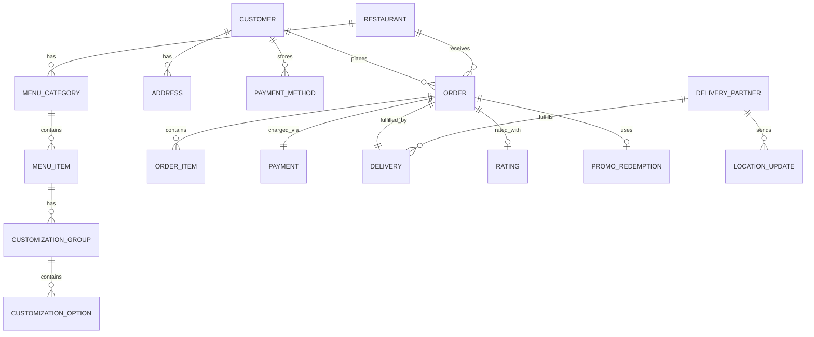

# Design Uber Eats / Food Delivery System: Requirements and Estimation

## Table of Contents
- [1. Problem Statement](#1-problem-statement)
- [2. Functional Requirements](#2-functional-requirements)
- [3. Non-Functional Requirements](#3-non-functional-requirements)
- [4. Out of Scope](#4-out-of-scope)
- [5. Back-of-Envelope Estimation](#5-back-of-envelope-estimation)
- [6. API Design](#6-api-design)
- [7. Data Model Overview](#7-data-model-overview)

---

## 1. Problem Statement

Design a food delivery platform (like Uber Eats) that connects hungry customers with
nearby restaurants and delivery partners. The system must handle restaurant discovery,
real-time menu management, order placement and tracking, delivery partner assignment
with route optimization, payments (splitting between restaurant, driver, and platform),
and ratings -- all at massive global scale with millions of daily orders.

**Why this is a top-tier interview question:**
- It tests **three-sided marketplace** design (customer, restaurant, delivery partner)
- It tests **real-time order lifecycle** with complex state machines (10+ states)
- It tests **geospatial search** for restaurant discovery (H3/Geohash + ranking)
- It tests **assignment optimization** (batching multiple orders per driver)
- It tests **ETA composition** (prep time + pickup travel + delivery travel)
- It tests **payment splitting** logic (restaurant payout, driver payout, platform commission)
- It covers the full spectrum: search, ordering, payments, logistics, real-time tracking

**Key difference from Uber Rides:**
Uber Rides is a two-sided marketplace (rider + driver). Uber Eats is a **three-sided
marketplace** (customer + restaurant + delivery partner), which adds an entirely new
dimension: the restaurant's preparation time is a variable the system cannot control
but must predict and orchestrate around.

---

## 2. Functional Requirements

### 2.1 Core Customer Features

| # | Requirement | Description |
|---|-------------|-------------|
| FR-1 | **Browse restaurants** | Customer sees nearby restaurants filtered by cuisine, rating, delivery time, price range, and promotions |
| FR-2 | **Search menu items** | Full-text search across restaurant names, cuisines, and individual menu items (e.g., "pepperoni pizza") |
| FR-3 | **View restaurant menu** | Browse a restaurant's full menu with categories, item details, photos, customizations (toppings, sizes), and prices |
| FR-4 | **Place an order** | Customer adds items to cart, applies promo codes, selects payment method, confirms delivery address, and places order |
| FR-5 | **Real-time order tracking** | Customer sees live order status (Confirmed -> Preparing -> Ready -> Picked Up -> On the Way -> Delivered) and driver location on map |
| FR-6 | **ETA display** | Customer sees estimated delivery time composed of prep time + driver pickup ETA + driver delivery ETA |
| FR-7 | **Ratings and reviews** | After delivery, customer rates the food (1-5 stars), delivery experience (1-5 stars), and optionally leaves a text review |
| FR-8 | **Order history** | Customer views past orders with the ability to reorder with one tap |
| FR-9 | **Promotions** | Customer can apply promo codes, see platform deals (e.g., "$10 off first order"), and restaurant-specific offers |
| FR-10 | **Schedule orders** | Customer can schedule an order for a future time (e.g., lunch delivery at 12:30 PM) |

### 2.2 Core Restaurant Features

| # | Requirement | Description |
|---|-------------|-------------|
| FR-11 | **Menu management** | Restaurant manages menu items: add, edit, remove items; set prices; mark items as unavailable in real time |
| FR-12 | **Accept/reject orders** | Restaurant receives new orders and can accept (with estimated prep time) or reject (with reason) |
| FR-13 | **Update order status** | Restaurant marks order as "Preparing", "Ready for Pickup", etc. |
| FR-14 | **Business hours** | Restaurant sets operating hours, handles holiday schedules, and can manually go online/offline |
| FR-15 | **Prep time estimates** | Restaurant provides per-item and overall prep time estimates; system learns from historical data |
| FR-16 | **Order throttling** | Restaurant can set a maximum number of concurrent orders to prevent kitchen overload |
| FR-17 | **Analytics dashboard** | Restaurant sees order volume, revenue, popular items, average ratings, and customer trends |

### 2.3 Core Delivery Partner Features

| # | Requirement | Description |
|---|-------------|-------------|
| FR-18 | **Go online/offline** | Driver toggles availability; system tracks current location when online |
| FR-19 | **Receive delivery requests** | Driver gets push notification with restaurant name, pickup/dropoff locations, estimated earnings, and order details |
| FR-20 | **Accept/reject deliveries** | Driver can accept or decline delivery requests within a timeout window (30 seconds) |
| FR-21 | **Navigation** | Driver gets turn-by-turn directions to restaurant (pickup) and then to customer (dropoff) |
| FR-22 | **Mark delivery milestones** | Driver marks "Arrived at restaurant", "Picked up order", "Arrived at customer", "Delivered" |
| FR-23 | **Batched deliveries** | Driver may be assigned 2-3 nearby orders from the same or nearby restaurants for efficiency |
| FR-24 | **Earnings tracking** | Driver sees per-delivery earnings, tips, bonuses, and daily/weekly summaries |

### 2.4 System Features

| # | Requirement | Description |
|---|-------------|-------------|
| FR-25 | **Delivery assignment** | System assigns optimal delivery partner based on proximity to restaurant, current route, batching potential, and ETA |
| FR-26 | **Dynamic delivery fee** | Delivery fee varies based on distance, demand/supply ratio (surge), time of day, and order value |
| FR-27 | **ETA calculation** | Composite ETA = restaurant prep time + driver-to-restaurant ETA + restaurant-to-customer ETA |
| FR-28 | **Payment processing** | Charge customer, split payment: restaurant receives item total minus commission, driver receives delivery fee + tips, platform takes commission |
| FR-29 | **Notifications** | Push notifications for order confirmed, preparing, driver assigned, picked up, arriving, delivered, and payment receipt |
| FR-30 | **Restaurant ranking** | ML-powered ranking of restaurants in search results based on relevance, distance, rating, prep time, popularity, and sponsored placement |

---

## 3. Non-Functional Requirements

### 3.1 Performance

| Requirement | Target | Rationale |
|-------------|--------|-----------|
| **Restaurant search latency** | < 300ms (p99 < 800ms) | Users expect instant results when browsing/searching |
| **Order placement** | < 1 second end-to-end | Must feel snappy; includes validation, payment auth, and order creation |
| **Delivery assignment** | < 30 seconds after restaurant confirms | Restaurant should not wait long for a driver to be found |
| **Driver location tracking** | < 2 second end-to-end latency | Driver moves -> customer sees on map within 2 seconds |
| **ETA update frequency** | Every 30 seconds | Customer always sees fresh delivery estimate |
| **Notification delivery** | < 3 seconds | Order status changes must reach all parties promptly |

### 3.2 Availability and Reliability

| Requirement | Target | Rationale |
|-------------|--------|-----------|
| **System availability** | 99.99% (52 min downtime/year) | Revenue-critical; every minute of downtime loses orders |
| **Order data durability** | 99.999999% (8 nines) | Financial records, legal compliance, dispute resolution |
| **Payment reliability** | Exactly-once semantics | Cannot double-charge customer or miss restaurant payout |
| **Order state consistency** | Strong consistency | An order must never be in conflicting states across services |
| **Menu availability** | Eventual consistency (< 5s lag) | Menu changes by restaurant visible to customers within seconds |

### 3.3 Scalability

| Requirement | Target | Rationale |
|-------------|--------|-----------|
| **Daily active users** | 50,000,000 (50M) | Global platform across thousands of cities |
| **Daily orders** | 10,000,000 (10M) | ~115 orders/sec average, 500+ orders/sec at peak |
| **Restaurant partners** | 1,000,000 (1M) | Millions of restaurants across all markets |
| **Active delivery partners** | 2,000,000 (2M online at peak) | Drivers on the road at any given time |
| **Menu items** | 500,000,000 (500M total) | ~500 items per restaurant across 1M restaurants |
| **Concurrent order tracking** | 2,000,000 (2M) | Active orders with real-time driver location streaming |

### 3.4 Consistency Model

| Requirement | Model | Rationale |
|-------------|-------|-----------|
| **Order state** | Strong consistency | Order must have a single source-of-truth state at all times |
| **Payment** | Strong consistency (ACID) | Financial transactions require exactness |
| **Driver location** | Eventual consistency (OK) | A few seconds of staleness is acceptable |
| **Restaurant search results** | Eventual consistency (OK) | Ranking updates can lag by minutes |
| **Menu items** | Eventual consistency (< 5s) | Customer may briefly see stale menu |
| **Ratings/reviews** | Eventual consistency (OK) | No rush; ratings aggregate over time |

---

## 4. Out of Scope

For a 45-minute interview, explicitly exclude:
- Uber Rides integration (mention as extension)
- Grocery delivery (Uber Direct, Cornershop) -- different fulfillment model
- Restaurant onboarding and contract management
- Detailed fraud detection and abuse prevention
- Admin dashboard and support tools
- Advertising platform (sponsored listings -- mention briefly)
- Loyalty program (Uber One membership)
- Multi-language / internationalization
- Kitchen display system (KDS) integration details

---

## 5. Back-of-Envelope Estimation

### 5.1 User Scale

```
Registered customers:     200,000,000 (200M)
Registered restaurants:     1,000,000 (1M)
Registered delivery partners: 5,000,000 (5M)

Daily active users (DAU):  50,000,000 (50M)
  - Customers browsing:    45,000,000 (many browse without ordering)
  - Customers ordering:    10,000,000
  - Active restaurants:       500,000 (50% online on any given day)
  - Online drivers (peak):  2,000,000

Orders per day:            10,000,000 (10M)
Average order value:       $30 (varies by market)
```

### 5.2 Request Rate (QPS)

```
Order placement:
  10M orders/day / 86,400 sec/day = ~115 QPS (average)
  Peak (5x average, lunch/dinner):  = ~575 QPS
  Uber-scale peak (500+ QPS):        500-600 orders/sec

Restaurant search/browse (THE HIGH-QPS PATH):
  50M DAU x ~10 search queries/day = 500M searches/day
  500M / 86,400 = ~5,800 QPS (average)
  Peak (3x): ~17,400 QPS
  
  This is the highest throughput path. Each search query involves:
  - Geospatial lookup (which restaurants are nearby)
  - Menu text search (if keyword search)
  - Ranking/scoring each restaurant
  - Fetching photos, ratings, ETAs for result set

Menu item views:
  Each ordering session views ~3 restaurant menus x ~20 items = 60 item fetches
  10M orders/day x 60 items = 600M menu item reads/day
  600M / 86,400 = ~6,900 QPS (average)
  Peak: ~20,700 QPS

Driver location updates:
  2M online drivers x 1 update every 4 seconds
  = 2,000,000 / 4
  = 500,000 updates/sec (500K QPS)
  
  Not as extreme as Uber Rides (1.25M) because fewer drivers
  are on the platform at once, but still the dominant write load.

Order status updates:
  10M orders/day x ~8 status changes per order = 80M/day
  = 80M / 86,400 = ~925 QPS

ETA requests:
  2M active orders x 1 ETA refresh per 30 seconds
  = ~67K QPS (served from cache mostly)

Notification sends:
  10M orders x ~8 notifications per order = 80M/day
  = ~925 notifications/sec
```

### 5.3 Storage Estimation

```
Customer profiles:
  200M customers x 2 KB each = 400 GB
  (name, email, phone, addresses, payment tokens, preferences)

Restaurant profiles:
  1M restaurants x 5 KB each = 5 GB
  (name, address, hours, cuisine tags, photos, settings)

Menu items:
  500M items x 1 KB each = 500 GB
  (name, description, price, category, photo URL, customizations, availability)
  Note: This is the largest structured dataset. Needs efficient indexing.

Order records:
  10M orders/day x 3 KB each = 30 GB/day = ~11 TB/year
  Each order: customer_id, restaurant_id, driver_id, items[], 
  timestamps, status_history[], delivery_address, 
  subtotal, delivery_fee, tip, tax, total, promo_code

Driver location history:
  500K updates/sec x 100 bytes each = 50 MB/sec
  = 50 MB/s x 86,400 s/day = ~4.3 TB/day
  = ~1.6 PB/year (before compression)
  With compression (~5x): ~320 TB/year
  Retain 14 days hot, archive cold: ~60 TB hot

Payment records:
  10M transactions/day x 500 bytes = 5 GB/day = ~1.8 TB/year

Review/rating data:
  ~5M reviews/day (50% of orders) x 500 bytes = 2.5 GB/day = ~900 GB/year

Restaurant images:
  1M restaurants x 20 images avg x 500 KB = 10 TB
  500M menu items x 30% have photos x 200 KB = 30 TB
  Total image storage: ~40 TB (served via CDN)
```

### 5.4 Bandwidth Estimation

```
Driver location updates (inbound):
  500K updates/sec x 100 bytes = 50 MB/sec inbound
  = ~400 Mbps sustained

Driver location tracking (outbound to customers):
  2M active orders x driver location push every 3 seconds
  = ~667K pushes/sec x 100 bytes = 67 MB/sec

Restaurant search responses (outbound):
  17,400 QPS peak x 5 KB avg response (20 restaurants with metadata)
  = 87 MB/sec at peak

Menu loading:
  20,700 QPS peak x 2 KB avg = 41 MB/sec
  + Image loading via CDN (not through our servers)

Order-related API calls:
  ~2K QPS x 3 KB avg = 6 MB/sec (relatively small)

Total network bandwidth estimate:
  Inbound:  ~100 MB/sec  (~800 Mbps)
  Outbound: ~250 MB/sec  (~2 Gbps)
  (excluding CDN-served images, which are the bulk of actual data transfer)
```

### 5.5 Infrastructure Estimation

```
WebSocket servers (for driver connections):
  2M concurrent connections
  Each server handles ~50K connections
  = 40 WebSocket servers minimum (with 2x headroom = 80)

Search service (handling 17K QPS peak):
  Each instance handles ~1K QPS with ranking
  = 17-20 instances (with headroom = ~35)

Redis cluster (driver locations + cache):
  200 MB driver location data, 500K writes/sec + reads
  ~15 Redis instances sharded by city

Kafka cluster (event streaming):
  50 MB/sec inbound throughput
  = 5-8 Kafka brokers with replication factor 3

PostgreSQL (orders, users, restaurants):
  Moderate write load (~2K QPS), heavy reads (~30K QPS)
  Primary-replica setup, sharded by city for orders

Elasticsearch (restaurant and menu search):
  500M menu items + 1M restaurants
  ~10-15 Elasticsearch nodes for indexing + search
```

### 5.6 Summary Table

| Metric | Value |
|--------|-------|
| Orders/day | 10M |
| Peak order QPS | 500-600 |
| Search QPS (peak) | 17,400 |
| Driver location updates/sec | 500K |
| Menu item reads QPS (peak) | 20,700 |
| Hot driver location data | ~200 MB (Redis) |
| Order data/year | ~11 TB |
| Location history/day | ~4.3 TB |
| Image storage | ~40 TB (CDN) |
| WebSocket servers | 40-80 |
| Total service instances | ~200-300 |

---

## 6. API Design

### 6.1 Restaurant Discovery APIs

```
# Search restaurants near a location
GET /api/v1/restaurants/search
  Query params:
    lat: float              # Customer latitude
    lng: float              # Customer longitude
    q: string (optional)    # Search query (e.g., "pizza", "sushi")
    cuisine: string[]       # Filter by cuisine types
    sort_by: enum           # RELEVANCE | RATING | DELIVERY_TIME | DISTANCE | PRICE
    price_range: int[]      # [1, 2, 3, 4] ($, $$, $$$, $$$$)
    dietary: string[]       # vegetarian, vegan, gluten_free, halal
    promo_only: bool        # Only restaurants with active promos
    page: int               # Pagination cursor
    page_size: int          # Results per page (default 20)
  
  Response: 200 OK
  {
    "restaurants": [
      {
        "restaurant_id": "rst_abc123",
        "name": "Joe's Pizza",
        "cuisine_types": ["Italian", "Pizza"],
        "rating": 4.7,
        "rating_count": 2340,
        "delivery_eta_minutes": 25,
        "delivery_fee": 2.99,
        "price_range": 2,
        "distance_km": 1.2,
        "thumbnail_url": "https://cdn.ubereats.com/...",
        "is_promoted": false,
        "promo": { "text": "$5 off $25+", "code": "PIZZA5" },
        "is_open": true,
        "tags": ["Popular", "Staff Pick"]
      }
    ],
    "total_count": 342,
    "next_page_token": "eyJ..."
  }

# Get restaurant details + full menu
GET /api/v1/restaurants/{restaurant_id}/menu
  Query params:
    lat: float              # For delivery fee and ETA calculation
    lng: float
  
  Response: 200 OK
  {
    "restaurant": { ... },
    "menu_categories": [
      {
        "category_id": "cat_001",
        "name": "Popular Items",
        "items": [
          {
            "item_id": "item_xyz",
            "name": "Margherita Pizza",
            "description": "Fresh mozzarella, basil, tomato sauce",
            "price": 14.99,
            "photo_url": "https://cdn.ubereats.com/...",
            "is_available": true,
            "prep_time_minutes": 15,
            "customizations": [
              {
                "group_name": "Size",
                "required": true,
                "max_selections": 1,
                "options": [
                  { "name": "Medium (12\")", "price_modifier": 0 },
                  { "name": "Large (16\")", "price_modifier": 4.00 }
                ]
              },
              {
                "group_name": "Extra Toppings",
                "required": false,
                "max_selections": 5,
                "options": [
                  { "name": "Pepperoni", "price_modifier": 1.50 },
                  { "name": "Mushrooms", "price_modifier": 1.00 }
                ]
              }
            ]
          }
        ]
      }
    ],
    "delivery_eta_minutes": 28,
    "delivery_fee": 2.99
  }
```

### 6.2 Order APIs

```
# Place an order
POST /api/v1/orders
  Headers:
    Authorization: Bearer {token}
    Idempotency-Key: {uuid}          # Prevents duplicate orders on retry
  
  Body:
  {
    "restaurant_id": "rst_abc123",
    "items": [
      {
        "item_id": "item_xyz",
        "quantity": 2,
        "customizations": [
          { "group_name": "Size", "selected": ["Large (16\")"] },
          { "group_name": "Extra Toppings", "selected": ["Pepperoni"] }
        ],
        "special_instructions": "Extra crispy"
      }
    ],
    "delivery_address": {
      "address_id": "addr_001",          # Saved address OR:
      "lat": 37.7749,
      "lng": -122.4194,
      "address_line": "123 Main St, Apt 4",
      "city": "San Francisco",
      "zip": "94102"
    },
    "payment_method_id": "pm_visa_4242",
    "tip_amount": 5.00,
    "promo_code": "PIZZA5",
    "scheduled_delivery_time": null,      # null = ASAP
    "delivery_instructions": "Leave at door, ring bell"
  }
  
  Response: 201 Created
  {
    "order_id": "ord_def456",
    "status": "PLACED",
    "items_subtotal": 41.98,
    "delivery_fee": 2.99,
    "service_fee": 4.20,
    "tax": 3.45,
    "promo_discount": -5.00,
    "tip": 5.00,
    "total": 52.62,
    "estimated_delivery_time": "2024-12-15T12:55:00Z",
    "estimated_delivery_minutes": 30,
    "created_at": "2024-12-15T12:25:00Z"
  }

# Get order details and status
GET /api/v1/orders/{order_id}
  
  Response: 200 OK
  {
    "order_id": "ord_def456",
    "status": "PREPARING",
    "restaurant": { "name": "Joe's Pizza", "phone": "..." },
    "items": [ ... ],
    "driver": {
      "driver_id": "drv_789",
      "name": "Alex",
      "photo_url": "...",
      "vehicle": "Honda Civic, Silver",
      "phone": "...",
      "current_location": { "lat": 37.7755, "lng": -122.4180 },
      "eta_to_restaurant_minutes": 5,
      "eta_to_customer_minutes": 18
    },
    "status_history": [
      { "status": "PLACED", "timestamp": "..." },
      { "status": "CONFIRMED", "timestamp": "..." },
      { "status": "PREPARING", "timestamp": "..." }
    ],
    "total": 52.62,
    "estimated_delivery_time": "2024-12-15T12:55:00Z"
  }

# Cancel an order
POST /api/v1/orders/{order_id}/cancel
  Body:
  {
    "reason": "CHANGED_MIND"     # or WAIT_TOO_LONG, WRONG_ADDRESS, etc.
  }
  
  Response: 200 OK
  {
    "order_id": "ord_def456",
    "status": "CANCELLED",
    "refund_amount": 52.62,      # Full refund if cancelled before restaurant confirms
    "refund_status": "PROCESSING"
  }
```

### 6.3 Real-Time Tracking APIs

```
# WebSocket connection for live order tracking
WSS /ws/v1/orders/{order_id}/track
  
  # Server pushes events:
  {
    "type": "DRIVER_LOCATION",
    "data": {
      "lat": 37.7755,
      "lng": -122.4180,
      "heading": 135,
      "speed_kmh": 25,
      "timestamp": "2024-12-15T12:40:05Z"
    }
  }

  {
    "type": "STATUS_UPDATE",
    "data": {
      "status": "PICKED_UP",
      "timestamp": "2024-12-15T12:42:00Z",
      "eta_minutes": 12
    }
  }

  {
    "type": "ETA_UPDATE",
    "data": {
      "eta_minutes": 10,
      "eta_time": "2024-12-15T12:52:00Z"
    }
  }

# Driver location update (from driver app)
# Sent over persistent WebSocket connection
WSS /ws/v1/driver/location
  
  # Driver app sends every 4 seconds:
  {
    "type": "LOCATION_UPDATE",
    "data": {
      "lat": 37.7755,
      "lng": -122.4180,
      "heading": 135,
      "speed_kmh": 25,
      "accuracy_m": 5,
      "battery_pct": 72,
      "timestamp": "2024-12-15T12:40:05Z"
    }
  }
```

### 6.4 Restaurant APIs

```
# Respond to an incoming order
POST /api/v1/restaurant/orders/{order_id}/respond
  Headers:
    Authorization: Bearer {restaurant_token}
  
  Body:
  {
    "action": "ACCEPT",                # ACCEPT or REJECT
    "estimated_prep_minutes": 20,      # Required if accepting
    "reject_reason": null               # Required if rejecting
  }

# Update order preparation status
POST /api/v1/restaurant/orders/{order_id}/status
  Body:
  {
    "status": "READY_FOR_PICKUP"       # PREPARING or READY_FOR_PICKUP
  }

# Update menu item availability
PATCH /api/v1/restaurant/menu/items/{item_id}
  Body:
  {
    "is_available": false,
    "unavailable_until": "2024-12-15T18:00:00Z"   # null = indefinite
  }

# Set restaurant online/offline
POST /api/v1/restaurant/status
  Body:
  {
    "is_accepting_orders": true,
    "max_concurrent_orders": 15,
    "estimated_prep_time_modifier": 1.2   # 1.2x = 20% longer than usual (busy)
  }
```

### 6.5 Delivery Partner APIs

```
# Respond to delivery request
POST /api/v1/driver/deliveries/{delivery_id}/respond
  Body:
  {
    "action": "ACCEPT"                 # ACCEPT or DECLINE
  }

# Update delivery milestone
POST /api/v1/driver/deliveries/{delivery_id}/status
  Body:
  {
    "status": "PICKED_UP",            # ARRIVED_AT_RESTAURANT | PICKED_UP | 
                                       # ARRIVED_AT_CUSTOMER | DELIVERED
    "photo_url": "...",               # Required for DELIVERED (proof of delivery)
    "timestamp": "2024-12-15T12:42:00Z"
  }

# Get active deliveries (may have batched orders)
GET /api/v1/driver/deliveries/active
  
  Response: 200 OK
  {
    "deliveries": [
      {
        "delivery_id": "del_001",
        "order_id": "ord_def456",
        "restaurant": { "name": "Joe's Pizza", "address": "...", "lat": ..., "lng": ... },
        "customer": { "name": "Sarah", "address": "...", "lat": ..., "lng": ... },
        "status": "PICKING_UP",
        "items_count": 3,
        "earnings": 8.50,
        "sequence": 1              # Pickup/delivery order in a batched route
      },
      {
        "delivery_id": "del_002",
        "order_id": "ord_ghi789",
        "restaurant": { "name": "Joe's Pizza", "address": "...", "lat": ..., "lng": ... },
        "customer": { "name": "Mike", "address": "...", "lat": ..., "lng": ... },
        "status": "PICKING_UP",
        "items_count": 1,
        "earnings": 6.00,
        "sequence": 2
      }
    ],
    "optimized_route": {
      "waypoints": [ ... ],
      "total_distance_km": 5.2,
      "total_time_minutes": 18
    }
  }
```

### 6.6 Rating and Review APIs

```
# Submit ratings after delivery
POST /api/v1/orders/{order_id}/rating
  Body:
  {
    "food_rating": 5,                  # 1-5 stars
    "delivery_rating": 4,              # 1-5 stars
    "review_text": "Pizza was great, slightly late delivery",
    "item_ratings": [
      { "item_id": "item_xyz", "rating": 5, "thumbs": "UP" }
    ],
    "tip_adjustment": 2.00             # Add/modify tip after delivery
  }
```

---

## 7. Data Model Overview

### 7.1 Core Entities



### 7.2 Key Tables

```sql
-- Core entities
CREATE TABLE customers (
    customer_id   UUID PRIMARY KEY,
    name          VARCHAR(255),
    email         VARCHAR(255) UNIQUE,
    phone         VARCHAR(20),
    created_at    TIMESTAMP,
    uber_one      BOOLEAN DEFAULT FALSE   -- Subscription member
);

CREATE TABLE restaurants (
    restaurant_id     UUID PRIMARY KEY,
    name              VARCHAR(255),
    address           TEXT,
    lat               DECIMAL(10, 7),
    lng               DECIMAL(10, 7),
    h3_index          BIGINT,              -- H3 cell for geospatial queries
    cuisine_types     TEXT[],
    price_range       INT,                 -- 1-4
    avg_rating        DECIMAL(3, 2),
    rating_count      INT,
    avg_prep_minutes  INT,
    is_active         BOOLEAN,
    max_concurrent    INT DEFAULT 20,
    commission_rate   DECIMAL(4, 3),       -- e.g., 0.30 for 30%
    business_hours    JSONB
);

CREATE TABLE menu_items (
    item_id           UUID PRIMARY KEY,
    restaurant_id     UUID REFERENCES restaurants,
    category_id       UUID,
    name              VARCHAR(255),
    description       TEXT,
    price             DECIMAL(10, 2),
    photo_url         VARCHAR(512),
    is_available      BOOLEAN DEFAULT TRUE,
    prep_time_minutes INT,
    calories          INT,
    dietary_tags      TEXT[]               -- vegetarian, vegan, gluten_free
);

-- Order and delivery
CREATE TABLE orders (
    order_id          UUID PRIMARY KEY,
    customer_id       UUID REFERENCES customers,
    restaurant_id     UUID REFERENCES restaurants,
    driver_id         UUID,
    status            VARCHAR(50),         -- See state machine
    items_subtotal    DECIMAL(10, 2),
    delivery_fee      DECIMAL(10, 2),
    service_fee       DECIMAL(10, 2),
    tax               DECIMAL(10, 2),
    tip               DECIMAL(10, 2),
    promo_discount    DECIMAL(10, 2),
    total             DECIMAL(10, 2),
    delivery_address  JSONB,
    special_instructions TEXT,
    scheduled_for     TIMESTAMP,
    placed_at         TIMESTAMP,
    confirmed_at      TIMESTAMP,
    picked_up_at      TIMESTAMP,
    delivered_at      TIMESTAMP,
    cancelled_at      TIMESTAMP,
    city              VARCHAR(100),        -- Partition key for sharding
    idempotency_key   UUID UNIQUE          -- Prevent duplicate orders
);

-- Partitioned by city and date for efficient queries
CREATE INDEX idx_orders_customer ON orders (customer_id, placed_at DESC);
CREATE INDEX idx_orders_restaurant ON orders (restaurant_id, placed_at DESC);
CREATE INDEX idx_orders_driver ON orders (driver_id, placed_at DESC);
CREATE INDEX idx_orders_status ON orders (status) WHERE status NOT IN ('DELIVERED', 'CANCELLED');

CREATE TABLE order_items (
    order_item_id     UUID PRIMARY KEY,
    order_id          UUID REFERENCES orders,
    item_id           UUID,
    item_name         VARCHAR(255),        -- Denormalized (menu can change)
    item_price        DECIMAL(10, 2),      -- Denormalized (price at time of order)
    quantity          INT,
    customizations    JSONB,
    special_instructions TEXT
);

CREATE TABLE delivery_partners (
    driver_id         UUID PRIMARY KEY,
    name              VARCHAR(255),
    phone             VARCHAR(20),
    vehicle_type      VARCHAR(50),         -- car, bike, scooter
    vehicle_details   VARCHAR(255),
    photo_url         VARCHAR(512),
    avg_rating        DECIMAL(3, 2),
    total_deliveries  INT,
    is_online         BOOLEAN,
    current_lat       DECIMAL(10, 7),
    current_lng       DECIMAL(10, 7),
    h3_index          BIGINT,
    city              VARCHAR(100)
);

CREATE TABLE ratings (
    rating_id         UUID PRIMARY KEY,
    order_id          UUID REFERENCES orders,
    customer_id       UUID,
    restaurant_id     UUID,
    driver_id         UUID,
    food_rating       INT CHECK (food_rating BETWEEN 1 AND 5),
    delivery_rating   INT CHECK (delivery_rating BETWEEN 1 AND 5),
    review_text       TEXT,
    created_at        TIMESTAMP
);
```

### 7.3 Data Store Mapping

| Data | Store | Rationale |
|------|-------|-----------|
| Customers, Restaurants, Orders | **PostgreSQL** (sharded by city) | Transactional, relational, strong consistency |
| Menu items (search index) | **Elasticsearch** | Full-text search, faceted filtering, ranking |
| Driver current locations | **Redis** (GEOADD) | Sub-millisecond geospatial queries |
| Active order state cache | **Redis** | Low-latency read for tracking pages |
| Driver location history | **Cassandra** | Time-series append-only writes at massive scale |
| Order events / status changes | **Kafka** | Event streaming, decoupling, replay |
| Restaurant images, menu photos | **S3 + CloudFront CDN** | Blob storage with edge caching |
| Restaurant rankings (ML features) | **Redis** | Pre-computed scores, fast reads for search |
| Analytics / reporting | **Redshift / BigQuery** | OLAP queries on historical data |
