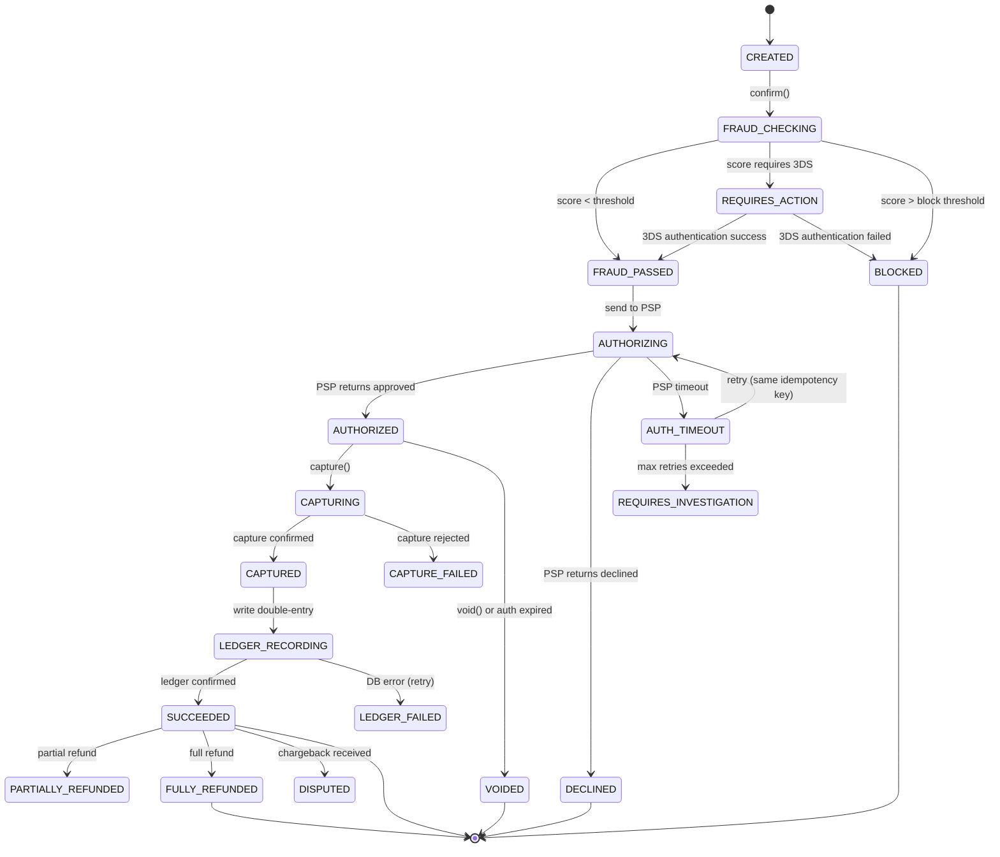
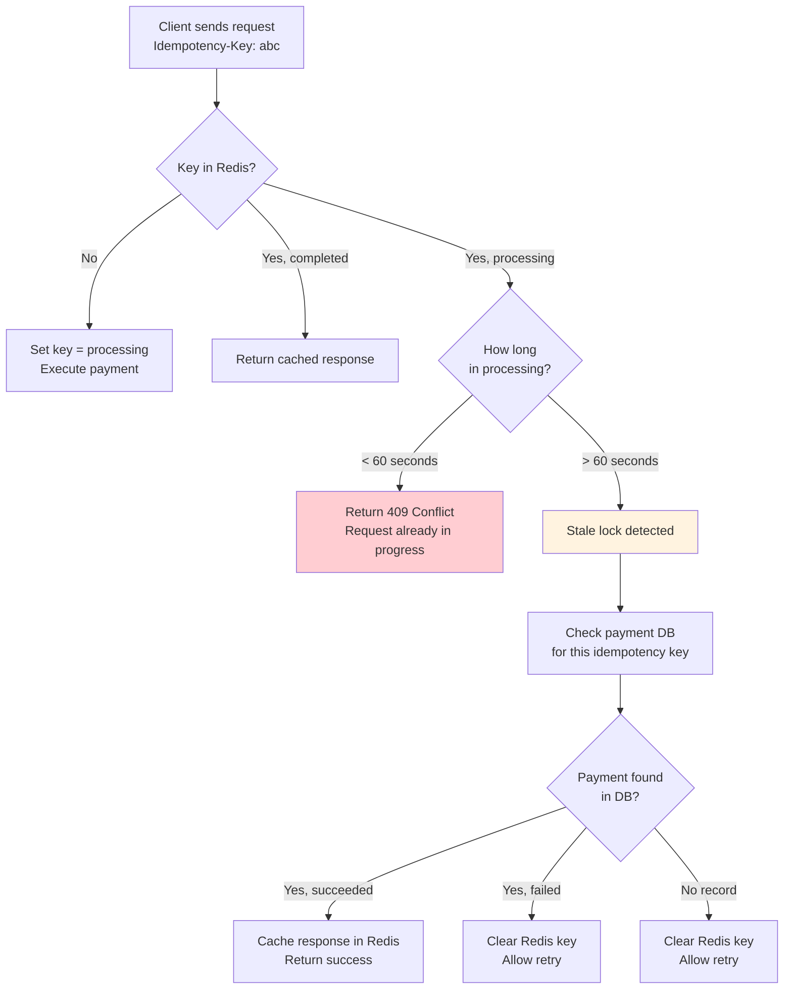
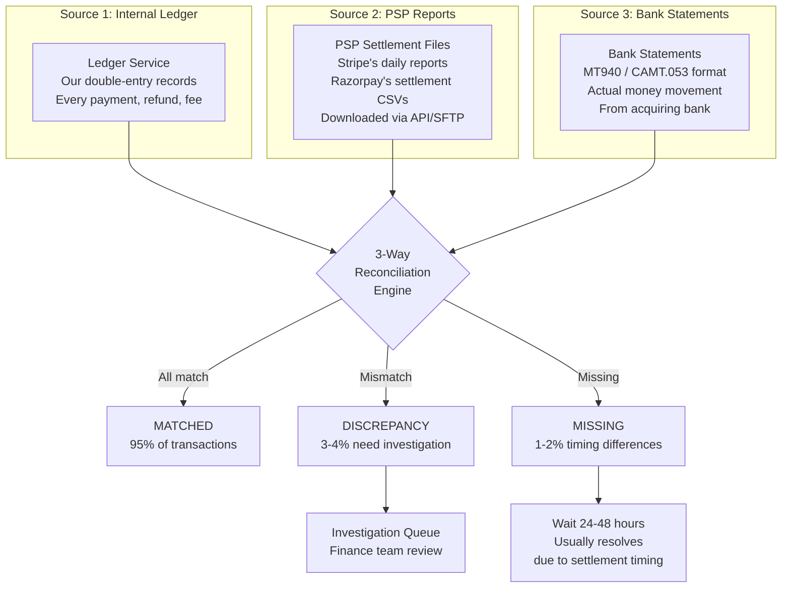
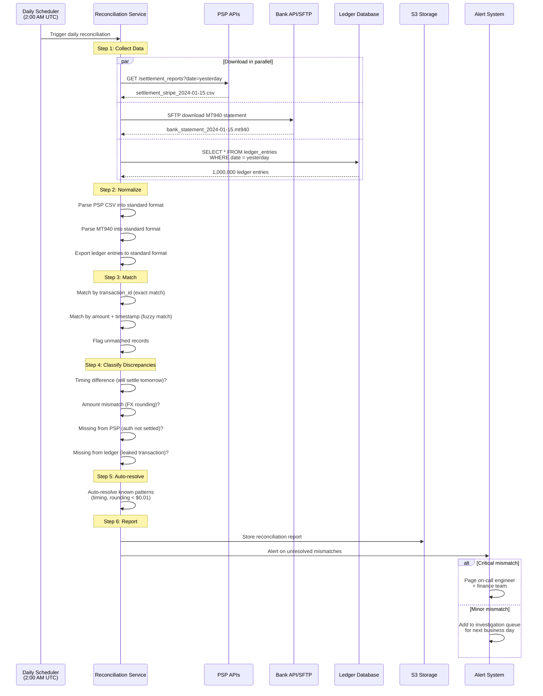
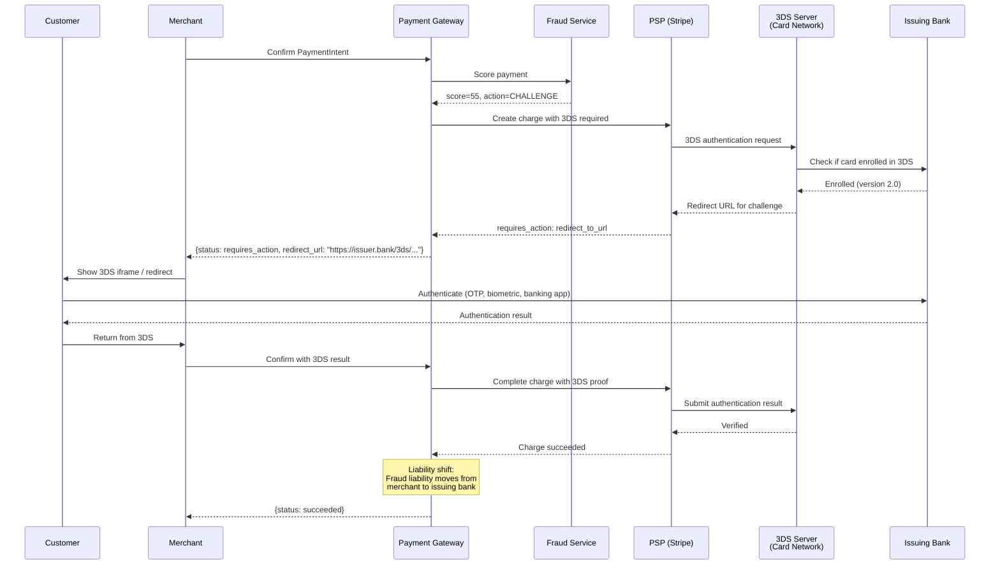
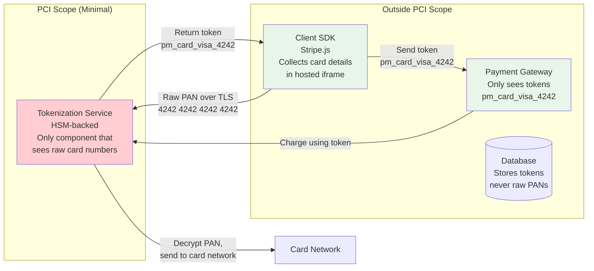
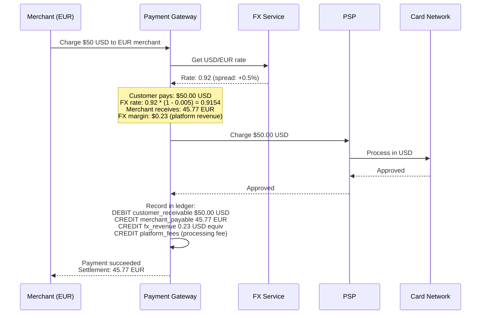
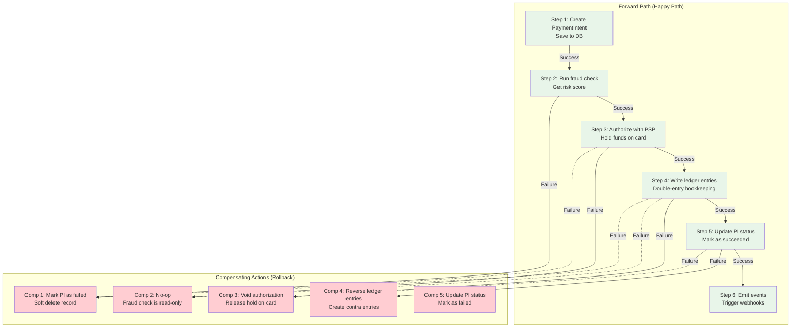
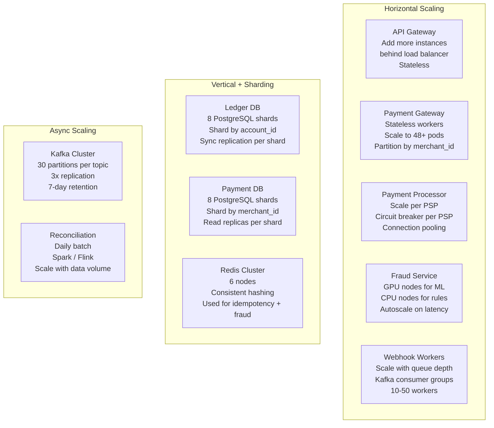
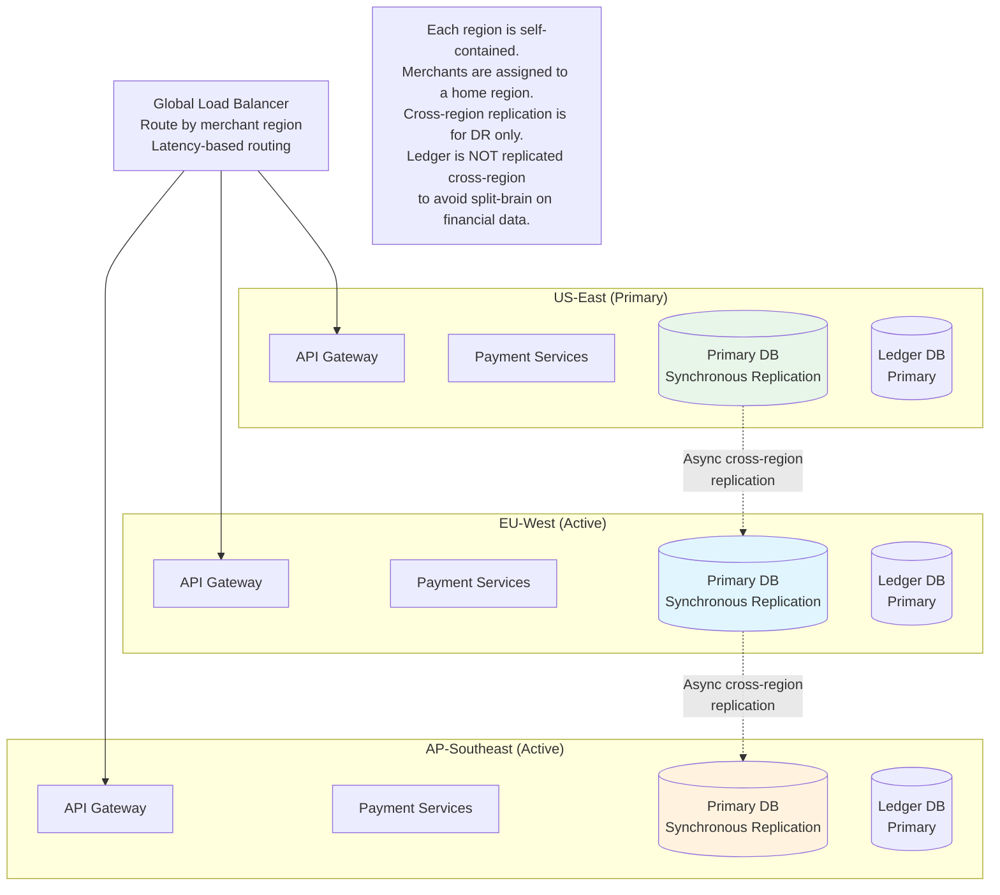

# Design a Payment System (like Stripe): Deep Dives and Scaling

## Table of Contents
- [1. Deep Dive: Idempotency Implementation](#1-deep-dive-idempotency-implementation)
- [2. Deep Dive: Reconciliation](#2-deep-dive-reconciliation)
- [3. Deep Dive: Fraud Detection](#3-deep-dive-fraud-detection)
- [4. PCI DSS Compliance](#4-pci-dss-compliance)
- [5. Multi-Currency and FX](#5-multi-currency-and-fx)
- [6. Saga Pattern for Multi-Step Payments](#6-saga-pattern-for-multi-step-payments)
- [7. Scaling the Payment System](#7-scaling-the-payment-system)
- [8. Trade-offs and Decisions](#8-trade-offs-and-decisions)
- [9. Interview Tips and Common Questions](#9-interview-tips-and-common-questions)

---

## 1. Deep Dive: Idempotency Implementation

Idempotency is the single most important correctness property in a payment system.
Getting it wrong means either charging customers twice (catastrophic) or failing to
charge them at all (revenue loss). This section covers the production-grade
implementation used by Stripe and similar systems.

### 1.1 Redis-Based Idempotency with Lua Script

The idempotency check must be **atomic**: read-check-write cannot be three separate
operations, or two concurrent requests with the same key can both pass the check.

```lua
-- Redis Lua script for atomic idempotency check-and-set
-- KEYS[1] = idempotency key
-- ARGV[1] = TTL in seconds (86400 = 24 hours)
-- ARGV[2] = request fingerprint (hash of request body)
--
-- Returns:
--   [0, nil]           -> Key is new, caller should proceed (lock acquired)
--   [1, stored_data]   -> Key exists and is completed, return cached response
--   [2, nil]           -> Key exists and is in-progress, caller should wait/retry

local key = KEYS[1]
local ttl = tonumber(ARGV[1])
local request_fingerprint = ARGV[2]

local existing = redis.call('GET', key)

if existing == false then
    -- Key does not exist: acquire the lock
    local lock_value = cjson.encode({
        status = "processing",
        fingerprint = request_fingerprint,
        started_at = ARGV[3]
    })
    redis.call('SET', key, lock_value, 'EX', ttl, 'NX')
    
    -- Verify we actually got the lock (NX race condition)
    local verify = redis.call('GET', key)
    local parsed = cjson.decode(verify)
    if parsed.fingerprint == request_fingerprint then
        return {0, nil}  -- Lock acquired, proceed with payment
    else
        return {2, nil}  -- Another request beat us, return conflict
    end
else
    local data = cjson.decode(existing)
    
    if data.status == "completed" then
        -- Idempotent replay: return the stored response
        return {1, existing}
    elseif data.status == "processing" then
        -- Another request is in progress with this key
        return {2, nil}
    elseif data.status == "failed_retryable" then
        -- Previous attempt failed with a retryable error
        -- Allow this attempt to proceed
        local lock_value = cjson.encode({
            status = "processing",
            fingerprint = request_fingerprint,
            started_at = ARGV[3]
        })
        redis.call('SET', key, lock_value, 'EX', ttl)
        return {0, nil}
    end
end
```

### 1.2 State Machine for Payment Intents

The PaymentIntent state machine ensures that every payment follows a deterministic
path. Combined with idempotency, it guarantees exactly-once processing even across
retries and failures.



### 1.3 Idempotency Key Design Rules

```
Rule 1: SCOPE
  Key must be scoped to (merchant_id + idempotency_key).
  Different merchants can use the same idempotency key string.

Rule 2: TTL
  24-hour TTL (Stripe's default). After 24 hours, the same key can
  be reused. This prevents unbounded storage growth.

Rule 3: REQUEST FINGERPRINT
  Store a hash of the request body with the key. If a retry sends
  different parameters with the same key, return 422 Unprocessable.
  This catches bugs where merchants reuse keys accidentally.

Rule 4: NON-IDEMPOTENT OPERATIONS
  GET requests are naturally idempotent. Only POST/PUT/DELETE need keys.
  Stripe requires Idempotency-Key on all POST requests.

Rule 5: FAILURE HANDLING
  - 2xx response: Cache it. Future retries return this response.
  - 4xx response (client error): Cache it. Same bad request will get same error.
  - 5xx response (server error): Do NOT cache. Delete the key so retry can proceed.
  - Timeout: Key stays in "processing" state. Client gets 409 if they retry too fast.
    After a timeout (60s), the key is cleared for retry.

Rule 6: DISTRIBUTED CONSISTENCY
  Use Redis Cluster with WAIT command to ensure the idempotency key
  is replicated to at least 1 replica before responding. This prevents
  data loss if the primary crashes.
```

### 1.4 Handling the "Processing" Stall



---

## 2. Deep Dive: Reconciliation

Reconciliation is the process of verifying that the money you think you have matches
the money you actually have. In a payment system, this is a 3-way match between your
internal ledger, the PSP's settlement reports, and the actual bank statements.

### 2.1 The Three Sources of Truth



### 2.2 Reconciliation Pipeline



### 2.3 Matching Algorithm

```
Reconciliation Matching Strategy:

  Pass 1: EXACT MATCH (by transaction_id)
  ─────────────────────────────────────────
  Match ledger entries to PSP entries by our transaction_id
  (which the PSP stores as metadata). This matches ~95% of records.

  Pass 2: FUZZY MATCH (amount + time window)
  ─────────────────────────────────────────
  For unmatched records, try matching by:
    - Same amount (exact match in cents)
    - Same currency
    - Within a +/- 24 hour window
    - Same merchant
  This catches records where the transaction_id was lost/different.

  Pass 3: CLASSIFY UNMATCHED
  ─────────────────────────────────────────
  Records that don't match after Pass 1 and Pass 2:

  Category              | Ledger | PSP | Bank | Action
  ─────────────────────────────────────────────────────
  Timing difference     | Yes    | No  | No   | Wait 24h, re-run
  Settled not captured  | No     | Yes | Yes  | Create adjusting entry
  Ledger-only           | Yes    | No  | No   | Investigate (possible void)
  FX rounding           | Yes    | Yes | Yes  | Auto-resolve if < $0.01
  Duplicate in PSP      | Yes(1) | Yes(2)| Yes | Investigate double-charge
```

### 2.4 Reconciliation Report Schema

```sql
CREATE TABLE reconciliation_runs (
    id              UUID PRIMARY KEY,
    run_date        DATE NOT NULL,
    status          VARCHAR(20) NOT NULL,       -- RUNNING, COMPLETED, FAILED
    total_records   INT NOT NULL DEFAULT 0,
    matched_count   INT NOT NULL DEFAULT 0,
    mismatch_count  INT NOT NULL DEFAULT 0,
    pending_count   INT NOT NULL DEFAULT 0,
    auto_resolved   INT NOT NULL DEFAULT 0,
    match_rate      DECIMAL(5,2),               -- e.g., 99.85%
    started_at      TIMESTAMP NOT NULL,
    completed_at    TIMESTAMP,
    report_url      TEXT                         -- S3 URL for detailed report
);

CREATE TABLE reconciliation_items (
    id                  UUID PRIMARY KEY,
    run_id              UUID REFERENCES reconciliation_runs(id),
    transaction_id      UUID,
    ledger_entry_id     UUID,
    psp_reference       VARCHAR(255),
    bank_reference      VARCHAR(255),
    status              VARCHAR(30) NOT NULL,    -- MATCHED, MISMATCH, MISSING_PSP, 
                                                 -- MISSING_LEDGER, TIMING, AUTO_RESOLVED
    ledger_amount       BIGINT,
    psp_amount          BIGINT,
    bank_amount         BIGINT,
    currency            VARCHAR(3),
    discrepancy_amount  BIGINT,                  -- abs(ledger - psp)
    resolution          TEXT,                     -- How it was resolved
    resolved_by         VARCHAR(50),              -- 'AUTO', 'ENGINEER', 'FINANCE'
    resolved_at         TIMESTAMP,
    created_at          TIMESTAMP NOT NULL DEFAULT NOW()
);
```

### 2.5 Production Reconciliation Metrics

```
Target Metrics:
  ────────────────────────────────────────
  Daily match rate:              > 99.9%
  Auto-resolution rate:          > 80% of mismatches
  Time to detect mismatch:       < 24 hours
  Time to resolve (auto):        < 1 hour
  Time to resolve (manual):      < 3 business days
  Critical mismatch alert:       < 5 minutes
  
  A "critical mismatch" is defined as:
  - Any single mismatch > $10,000
  - Total daily mismatches > 0.1% of volume
  - Any ledger entry without PSP counterpart (potential money leak)
```

---

## 3. Deep Dive: Fraud Detection

### 3.1 Architecture

```mermaid
graph TB
    subgraph "Real-Time Path (< 100ms)"
        PI[Payment Intent] --> FE[Feature Extraction<br/>- Card fingerprint<br/>- IP geolocation<br/>- Device fingerprint<br/>- Velocity counters]
        FE --> RE[Rules Engine<br/>- Hard rules (block list)<br/>- Velocity rules<br/>- Amount thresholds<br/>- Geo rules]
        FE --> ML[ML Model<br/>- Gradient Boosted Trees<br/>- Neural network<br/>- Trained on fraud labels]
        RE --> SC[Score Combiner<br/>Rules score + ML score<br/>= Final risk score]
        ML --> SC
        SC --> DEC{Decision}
    end

    subgraph "Decision Outcomes"
        DEC -->|Score 0-30| ALLOW[ALLOW<br/>Proceed with auth]
        DEC -->|Score 30-70| CHALLENGE[CHALLENGE<br/>Trigger 3D Secure]
        DEC -->|Score 70-100| BLOCK[BLOCK<br/>Reject immediately]
    end

    subgraph "Async Path (Post-Decision)"
        ALLOW --> LOG[Log decision + features]
        CHALLENGE --> LOG
        BLOCK --> LOG
        LOG --> DW[Data Warehouse<br/>Training data for ML]
        LOG --> DASH[Fraud Dashboard<br/>Analyst review]
    end

    subgraph "Feature Store (Redis)"
        FS[Redis<br/>- card_velocity: 5 txns in 1h<br/>- ip_velocity: 20 txns in 1h<br/>- amount_24h: $5,000<br/>- countries_24h: {US, NG}]
    end

    FE --> FS
    FS --> FE

    style ALLOW fill:#e8f5e9
    style CHALLENGE fill:#fff3e0
    style BLOCK fill:#ffcdd2
```

### 3.2 Feature Engineering

```
Real-Time Features (computed per-request, stored in Redis):
  ──────────────────────────────────────────────────────────
  Card-level:
    - card_txn_count_1h:      How many transactions this card did in 1 hour
    - card_txn_count_24h:     How many in 24 hours
    - card_amount_total_24h:  Total amount charged in 24 hours
    - card_distinct_merchants_24h:  How many different merchants
    - card_decline_count_1h:  How many declines in 1 hour (card testing attack)
    - card_first_seen:        When we first saw this card

  IP-level:
    - ip_txn_count_1h:        Transactions from this IP in 1 hour
    - ip_distinct_cards_24h:  How many different cards from this IP
    - ip_country:             GeoIP lookup
    - ip_is_proxy:            Is this a known proxy/VPN/TOR exit node?

  Device-level:
    - device_fingerprint:     Browser/device fingerprint hash
    - device_txn_count_24h:   Transactions from this device
    - device_first_seen:      First time we saw this device

  Merchant-level:
    - merchant_chargeback_rate:  Rolling 90-day chargeback rate
    - merchant_avg_txn_amount:   Average transaction amount for this merchant
    - merchant_country:          Where the merchant is based

Derived Features (computed from raw features):
  ──────────────────────────────────────────────────────────
  - amount_vs_merchant_avg:   Is this transaction much larger than typical?
  - card_country_mismatch:    Is the card issued in a different country than the IP?
  - velocity_spike:           Is current velocity > 3x the card's normal rate?
  - time_since_last_txn:      Rapid-fire transactions indicate bot behavior
```

### 3.3 Rules Engine Examples

```python
# Production fraud rules (configurable, hot-reloadable)

RULES = [
    # Hard blocks (instant reject, no ML override)
    Rule(
        name="blocked_bin_ranges",
        condition=lambda tx: tx.card_bin in BLOCKED_BIN_SET,
        action="BLOCK",
        score=100,
        reason="Card BIN on block list"
    ),
    
    # Velocity checks
    Rule(
        name="card_velocity_1h",
        condition=lambda tx: tx.features['card_txn_count_1h'] > 10,
        action="BLOCK",
        score=90,
        reason="Card used > 10 times in 1 hour (likely card testing)"
    ),
    
    Rule(
        name="ip_card_diversity",
        condition=lambda tx: tx.features['ip_distinct_cards_24h'] > 5,
        action="CHALLENGE",
        score=60,
        reason="5+ different cards from same IP in 24h"
    ),
    
    # Amount thresholds
    Rule(
        name="high_value_new_card",
        condition=lambda tx: (
            tx.amount > 50000 and  # > $500
            tx.features['card_first_seen'] > now() - timedelta(hours=24)
        ),
        action="CHALLENGE",
        score=50,
        reason="High-value transaction on card first seen < 24h ago"
    ),
    
    # Geographic anomalies
    Rule(
        name="country_mismatch",
        condition=lambda tx: (
            tx.card_country != tx.ip_country and
            tx.ip_country in HIGH_RISK_COUNTRIES
        ),
        action="CHALLENGE",
        score=45,
        reason="Card country does not match IP country (high-risk region)"
    ),
    
    # Merchant-level risk
    Rule(
        name="high_chargeback_merchant",
        condition=lambda tx: tx.merchant.chargeback_rate > 0.01,  # > 1%
        action="CHALLENGE",
        score=40,
        reason="Merchant has elevated chargeback rate"
    ),
]
```

### 3.4 3D Secure Flow (SCA Compliance)

3D Secure (3DS) is a protocol that adds an extra authentication step during online
card payments. The customer is redirected to their bank's authentication page to enter
an OTP or approve via their banking app. This is **required by law in the EU** under
PSD2/SCA (Strong Customer Authentication).



**Key insight for interviews:** 3DS is not just a fraud tool -- it shifts **liability**.
If a 3DS-authenticated transaction turns out to be fraudulent, the **issuing bank** bears
the loss, not the merchant. This is why merchants sometimes prefer to challenge borderline
transactions rather than blocking them outright.

---

## 4. PCI DSS Compliance

### 4.1 PCI DSS Level 1 Requirements (Summary)

```
PCI DSS has 12 core requirements across 6 categories:

  BUILD AND MAINTAIN A SECURE NETWORK
  ─────────────────────────────────────
  1. Install and maintain network security controls (firewalls, segmentation)
  2. Apply secure configurations to all system components (no defaults)

  PROTECT ACCOUNT DATA
  ─────────────────────────────────────
  3. Protect stored account data (encrypt card data at rest, AES-256)
  4. Protect data in transit (TLS 1.2+ for all PAN transmission)

  MAINTAIN A VULNERABILITY MANAGEMENT PROGRAM
  ─────────────────────────────────────
  5. Protect all systems against malware (anti-virus, endpoint detection)
  6. Develop and maintain secure systems (patch management, secure SDLC)

  IMPLEMENT STRONG ACCESS CONTROL
  ─────────────────────────────────────
  7. Restrict access by business need-to-know (RBAC, least privilege)
  8. Identify users and authenticate access (MFA for all admin access)
  9. Restrict physical access to cardholder data (data center controls)

  REGULARLY MONITOR AND TEST NETWORKS
  ─────────────────────────────────────
  10. Log and monitor all access to cardholder data (SIEM, audit trails)
  11. Test security regularly (penetration tests, vulnerability scans)

  MAINTAIN AN INFORMATION SECURITY POLICY
  ─────────────────────────────────────
  12. Maintain a policy addressing information security (written policies)
```

### 4.2 Tokenization Architecture (Reducing PCI Scope)



**Why this matters:** By isolating raw card data in a single tokenization service
(backed by a Hardware Security Module / HSM), the rest of the system never touches
sensitive card numbers. This dramatically reduces PCI audit scope -- instead of auditing
your entire infrastructure, you only need to certify the tokenization service.

This is exactly how Stripe works: **Stripe.js** collects card details in a hosted
iframe that talks directly to Stripe's tokenization servers. The merchant's server
never sees the raw card number.

---

## 5. Multi-Currency and FX

### 5.1 Currency Handling

```
All amounts stored as INTEGERS in the smallest currency unit:
  USD $49.99  -> 4999 (cents)
  JPY 5000    -> 5000 (yen has no subunit)
  BHD 1.500   -> 1500 (Bahraini dinar has 3 decimal places)
  
This avoids floating-point arithmetic errors.
NEVER use float/double for monetary amounts.

Currency Metadata:
  ──────────────────────────────────────────
  Currency | ISO 4217 | Smallest Unit | Zero-Decimal
  ──────────────────────────────────────────
  USD      | 840      | cent          | No
  EUR      | 978      | cent          | No
  GBP      | 826      | penny         | No
  JPY      | 392      | yen           | Yes (no subunit)
  INR      | 356      | paisa         | No
  BHD      | 048      | fils          | No (3 decimal places)
```

### 5.2 FX Conversion Flow



### 5.3 FX Risk Management

```
FX Risk Mitigation:
  ──────────────────────────────────────────

  1. REAL-TIME RATE LOCKING
     When a payment is initiated, lock the FX rate for 60 seconds.
     If the payment completes within this window, the locked rate applies.
     This prevents rate fluctuation between checkout and settlement.

  2. SPREAD / MARKUP
     Apply a 0.5-2% spread on the mid-market rate.
     This covers FX risk and generates revenue.
     Stripe charges 1% for currency conversion.

  3. SETTLEMENT CURRENCY CONFIGURATION
     Merchants configure their settlement currency (e.g., EUR).
     All payments are converted to this currency at settlement time.
     Option: settle in presentment currency (no conversion, merchant bears FX risk).

  4. HEDGING (for large volumes)
     Platform can hedge FX exposure using forward contracts.
     If $100M in EUR/USD transactions settle in 2 days,
     buy a 2-day EUR/USD forward to lock in today's rate.

  5. REFUND FX HANDLING
     Refund uses the ORIGINAL transaction's FX rate, not today's rate.
     This prevents FX arbitrage (charge at low rate, refund at high rate).
```

---

## 6. Saga Pattern for Multi-Step Payments

### 6.1 Why Sagas?

A payment involves multiple services (fraud, PSP, ledger, notifications). Using a
traditional distributed transaction (2PC) would be too slow and fragile. Instead,
we use the **Saga pattern**: a sequence of local transactions, where each step has
a compensating action that can undo it if a later step fails.

### 6.2 Payment Saga



### 6.3 Saga Orchestrator vs Choreography

```
ORCHESTRATOR (Recommended for payments):
  ─────────────────────────────────────────
  Central coordinator (Payment Gateway) drives the saga.
  It calls each service in order and handles failures.
  
  Pros: Easy to reason about, clear failure handling, easier debugging
  Cons: Single point of coordination (mitigate with HA deployment)
  
  Used by: Stripe, Uber, most payment systems

CHOREOGRAPHY (Event-driven):
  ─────────────────────────────────────────
  Each service reacts to events and publishes its own events.
  No central coordinator.
  
  Pros: Loosely coupled, no single point of failure
  Cons: Hard to track saga state, complex failure handling, debugging is painful
  
  Used by: Some microservice architectures, but generally NOT for payments
  
  >> For payment systems, ALWAYS choose orchestrator.
  >> Financial correctness requires a clear, auditable sequence of steps.
```

---

## 7. Scaling the Payment System

### 7.1 Scaling Strategy by Component



### 7.2 Handling Peak Traffic (Black Friday, Flash Sales)

```
Black Friday Traffic Pattern:
  Normal day:     1M transactions, ~12 TPS average
  Black Friday:   10M transactions, ~120 TPS average, ~500 TPS peak
  
Scaling Playbook:
  ─────────────────────────────────────────
  
  T-7 days:  Pre-scale
    - Increase API pods from 48 to 200
    - Increase Kafka partitions
    - Add read replicas to payment DB
    - Warm up Redis caches
    - Test PSP rate limits (ensure Stripe/Adyen have increased our limits)
  
  T-1 hour:  Final checks
    - Verify all PSP circuit breakers are closed
    - Verify fraud model is loaded on all GPU nodes
    - Verify webhook backlog is zero
    - Put non-critical batch jobs on hold
  
  During event:  Adaptive
    - Monitor PSP latency; if p99 > 2s, shed traffic to backup PSP
    - Monitor fraud scoring latency; if p99 > 200ms, fall back to rules-only
    - Auto-scale webhook workers based on Kafka consumer lag
    - Rate-limit non-payment APIs (dashboard, reporting)
  
  T+1 hour:  Wind down
    - Drain webhook backlog
    - Resume batch jobs
    - Scale down gradually (not all at once)
```

### 7.3 Multi-Region Architecture



### 7.4 Database Scaling Deep Dive

```
Ledger DB Scaling (The Hardest Part):
  ─────────────────────────────────────────
  
  Problem: Ledger requires strong consistency (SERIALIZABLE isolation),
  append-only writes, and sum queries for balance calculation.
  This limits scaling options.
  
  Solution: Application-level sharding by account_id
  
  Shard 0: accounts 00000000-1FFFFFFF
  Shard 1: accounts 20000000-3FFFFFFF
  ...
  Shard 7: accounts E0000000-FFFFFFFF
  
  Each shard:
    - PostgreSQL 16 with synchronous replication
    - 1 primary + 1 sync replica + 1 async replica
    - ~3,000 write TPS per shard
    - 8 shards * 3,000 = 24,000 TPS total
  
  Cross-shard transactions (rare):
    - When a payment involves accounts on different shards
      (e.g., merchant on shard 3, platform fee account on shard 0)
    - Use 2PC (two-phase commit) for these specific cases
    - Or: keep platform accounts replicated on all shards (denormalization)
  
  Balance Computation:
    - Option A: Materialized balance (updated transactionally with each entry)
      Pros: O(1) balance read. Cons: Write contention on hot accounts
    - Option B: Computed balance (SUM of all entries)
      Pros: No contention. Cons: Slow for accounts with millions of entries
    - Option C: Checkpoint + delta (snapshot balance daily, compute delta)
      Pros: Best of both worlds. This is what Stripe uses.
```

---

## 8. Trade-offs and Decisions

### 8.1 Key Design Trade-offs

| Decision | Option A | Option B | Our Choice | Why |
|----------|----------|----------|------------|-----|
| **Ledger consistency** | Eventual consistency (faster) | Strong consistency (correct) | **Strong** | Financial data cannot tolerate inconsistency; debits must always equal credits |
| **Idempotency store** | Database | Redis | **Redis + DB backup** | Redis for speed (< 1ms lookup), DB for durability. Check Redis first, fall back to DB |
| **PSP strategy** | Single PSP | Multi-PSP with routing | **Multi-PSP** | Avoids vendor lock-in; enables failover; can route for lowest cost |
| **Fraud check** | Async (post-auth) | Sync (pre-auth) | **Sync** | Must block fraudulent transactions before they reach the card network |
| **Settlement** | Real-time | Daily batch | **Daily batch** | Settlement is inherently batched by card networks (T+2); real-time adds no value |
| **Webhook delivery** | At-most-once | At-least-once | **At-least-once** | Merchants design for idempotent webhook handlers; missing a webhook is worse than duplicating |
| **Saga pattern** | Choreography | Orchestrator | **Orchestrator** | Payment flows must be predictable and auditable; choreography is too hard to debug |
| **Amount storage** | Float | Integer (smallest unit) | **Integer** | Floating-point rounding errors are unacceptable in financial systems ($0.01 errors add up to millions) |

### 8.2 SQL vs NoSQL for Ledger

```
WHY PostgreSQL (SQL) for the Ledger:
  ─────────────────────────────────────────
  1. ACID transactions:     Debit + credit MUST be atomic
  2. SERIALIZABLE isolation: Prevents race conditions on balance updates
  3. Constraints:           CHECK (amount > 0), UNIQUE (idempotency_key, ...)
  4. SUM aggregation:       Balance = SUM(credits) - SUM(debits) is native SQL
  5. Audit:                 Declarative queries for compliance reporting
  6. Maturity:              Battle-tested for financial workloads for decades
  
  NoSQL databases (DynamoDB, Cassandra) lack:
  - Multi-row transactions (needed for debit + credit atomicity)
  - SERIALIZABLE isolation
  - Efficient aggregation (SUM queries)
  
  >> For a financial ledger, SQL is the only correct choice.
  >> This is a settled debate in the fintech industry.
```

### 8.3 Stripe's Actual Architecture (Public Knowledge)

```
What Stripe has shared publicly about their architecture:
  ─────────────────────────────────────────
  
  API Layer:       Ruby (originally), migrating to Java/Go for performance
  Idempotency:     Redis with Lua scripts (Rocket Rides blog post)
  Database:        PostgreSQL (sharded, with strong consistency)
  Message Queue:   Apache Kafka (for async events)
  Fraud:           Radar -- ML-based (gradient boosted trees + neural nets)
  Tokenization:    HSM-backed service, PCI Level 1
  Ledger:          Custom double-entry system on PostgreSQL
  Settlement:      Daily batch reconciliation with acquiring banks
  Infrastructure:  AWS (multi-region, active-active for API layer)
  
  Key engineering blog posts worth reading:
  - "Idempotency Keys" (Brandur Leach, 2017)
  - "Designing robust and predictable APIs with idempotency" (2020)
  - "Scaling Stripe's accounting system" (2023)
  - "Online migrations at scale" (2017)
```

---

## 9. Interview Tips and Common Questions

### 9.1 How to Structure Your Answer (45-minute format)

```
MINUTE 0-5: Requirements and Scope (5 min)
  ─────────────────────────────────────────
  Ask: "Are we building a PSP like Stripe, or internal payment infra like Uber's?"
  Ask: "Which payment methods? Cards only, or also bank transfers and wallets?"
  Ask: "Do we need subscriptions/recurring, or one-time payments only?"
  State: Functional requirements (process, refund, ledger)
  State: Non-functional (99.999% uptime, < 500ms auth, exactly-once)

MINUTE 5-10: Back-of-Envelope (5 min)
  ─────────────────────────────────────────
  State: 1M txns/day, ~12K TPS peak, $1.5B/month
  State: 2 GB/day payment data, 2 GB/day ledger data
  State: 48 API servers, 8 DB shards

MINUTE 10-25: High-Level Design (15 min)
  ─────────────────────────────────────────
  Draw: Payment Gateway, Processor, Ledger, Fraud, Reconciliation, Notifications
  Draw: Payment flow sequence (merchant -> gateway -> PSP -> card network -> bank)
  Explain: Authorization vs Capture vs Settlement
  Explain: Idempotency keys (mention Stripe's approach)
  Explain: Double-entry ledger (debit one account, credit another)

MINUTE 25-40: Deep Dive (15 min, interviewer picks topic)
  ─────────────────────────────────────────
  If idempotency: Redis Lua script, atomic phases, state machine
  If reconciliation: 3-way match, daily batch, mismatch resolution
  If fraud: Rules engine + ML, 3D Secure, feature engineering
  If scaling: Sharding strategy, multi-region, peak traffic handling
  If failure handling: Timeout problem, saga pattern, compensating actions

MINUTE 40-45: Trade-offs and Extensions (5 min)
  ─────────────────────────────────────────
  Discuss: SQL vs NoSQL for ledger (SQL wins, explain why)
  Discuss: Single PSP vs Multi-PSP routing
  Discuss: PCI DSS tokenization approach
  Mention: What you'd do differently at Uber scale vs Stripe scale
```

### 9.2 Common Interview Questions and Answers

**Q: "What happens if the PSP times out during authorization?"**

```
A: This is the most dangerous scenario in payments. The customer may or may not
   have been charged, and we don't know.
   
   1. We query the PSP: GET /charges/{id} to check if they processed it
   2. If found (succeeded): proceed normally, record in ledger
   3. If found (failed): safe to retry with same idempotency key
   4. If not found: safe to retry (PSP never received the request)
   5. If query also times out: enter "unknown" state
      - Do NOT return success to merchant
      - Do NOT charge again
      - Put in investigation queue
      - Reconciliation will catch it within 24 hours
```

**Q: "How do you prevent double-charging?"**

```
A: Idempotency at three layers:
   1. API layer: Redis idempotency key per request
   2. PSP layer: Pass our idempotency key to the PSP (Stripe supports this natively)
   3. DB layer: UNIQUE constraint on (idempotency_key, account_id, entry_type) in ledger
   
   Even if all three are somehow bypassed (they shouldn't be),
   reconciliation catches discrepancies within 24 hours.
```

**Q: "How does double-entry bookkeeping prevent money from disappearing?"**

```
A: Every transaction creates entries where total debits = total credits.
   If money "disappears," the equation is violated.
   We can detect this with a simple query:
   
   SELECT 
     SUM(CASE WHEN entry_type = 'DEBIT' THEN amount ELSE 0 END) -
     SUM(CASE WHEN entry_type = 'CREDIT' THEN amount ELSE 0 END) AS imbalance
   FROM ledger_entries;
   
   If imbalance != 0, we have a bug. We run this check continuously.
   Additionally, every individual transaction is verified at write time.
```

**Q: "How would you handle this at Uber specifically?"**

```
A: Uber doesn't build a PSP -- they USE PSPs (Stripe, Braintree, PayPal, Razorpay
   depending on region). Uber's payment system focuses on:
   
   1. PSP routing: Choose the cheapest/most reliable PSP per region/currency
   2. Internal ledger: Track rider charges, driver payouts, Uber's commission
   3. Split payments: A single ride payment is split between driver and Uber
   4. Auth + delayed capture: Auth at ride start, capture actual fare at ride end
   5. Multi-currency: Rider in USD, driver in local currency
   6. Tipping: Separate charge for tip (100% goes to driver)
   
   The key difference from Stripe: Uber is a MERCHANT using multiple PSPs,
   not a PSP itself. So the focus is on the orchestration layer and ledger,
   not on card network integration.
```

**Q: "How do you handle refunds for a ride that was charged 3 days ago?"**

```
A: Depends on settlement status:
   - If NOT yet settled (T+0 to T+2): Void the authorization (no money moved yet)
   - If ALREADY settled: Issue a refund through the PSP, which creates a credit
     on the customer's card. This takes 5-10 business days to appear.
   - Ledger entries: Create reverse entries (debit merchant_payable, credit customer_receivable)
   - Fee handling: Stripe keeps the processing fee; Uber may or may not absorb the fee
     depending on the refund reason (bug, customer complaint, fraud)
```

### 9.3 Red Flags (What NOT to Say)

```
DO NOT say:
  x "Use float for amounts"              -> Use integer in smallest unit
  x "Store card numbers in our DB"       -> Tokenize, never store PANs
  x "Use eventual consistency for ledger" -> Strong consistency only
  x "Retry without idempotency key"      -> Always same key on retry
  x "Use MongoDB for the ledger"         -> SQL for financial data
  x "2PC for every payment"              -> Use saga pattern
  x "Check fraud asynchronously"         -> Must be synchronous, pre-auth
  x "One global database"               -> Must shard for scale
  
DO say:
  + "Idempotency keys at every layer"
  + "Double-entry: debits always equal credits"
  + "Auth is synchronous, settlement is async batch"
  + "Amount in cents as integer, never float"
  + "PCI DSS: tokenize, never store raw PANs"
  + "Saga with orchestrator, not choreography"
  + "Reconciliation catches what real-time checks miss"
```

### 9.4 Extending the Design

```
If the interviewer asks "What would you add next?":

  1. SMART RETRIES
     ML model that predicts whether a declined payment will succeed
     if retried with a different PSP or after a short delay.
     (Stripe Adaptive Acceptance does this.)

  2. NETWORK TOKENIZATION
     Replace card numbers with network-level tokens (Visa Token Service).
     Higher auth rates (~2-4% improvement) because the token is always current
     even if the physical card is replaced.

  3. REVENUE OPTIMIZATION
     Route payments to the PSP with the highest auth rate for that
     card type/region, not just the cheapest. A 1% improvement in auth rate
     on $1B volume = $10M in recovered revenue.

  4. REAL-TIME FRAUD FEEDBACK LOOP
     When a chargeback is received, immediately update the fraud model's
     features for that card/IP/device. This reduces the lag between
     fraud occurring and the model learning about it.

  5. OBSERVABILITY
     Distributed tracing (Jaeger/DataDog) for every payment flow.
     A single payment touches 5-8 services -- you need end-to-end visibility.
     Custom metrics: auth rate by PSP, decline reason distribution,
     reconciliation match rate, webhook delivery success rate.
```

---

> **Final Interview Tip:** Payment systems are fundamentally about **trust and correctness**,
> not speed. A payment system that processes 100K TPS but occasionally loses money is worthless.
> A payment system that processes 1K TPS but is provably correct (double-entry balanced,
> fully reconciled, idempotent) is production-ready. Always lead with correctness, then scale.
> The interviewer wants to hear you say: "I would rather add latency than risk financial
> inconsistency." That is the mindset of someone who has worked on real payment systems.
