# Design a Payment System (like Stripe): High-Level Design

## Table of Contents
- [1. Architecture Overview](#1-architecture-overview)
- [2. System Architecture Diagram](#2-system-architecture-diagram)
- [3. Component Deep Dive](#3-component-deep-dive)
- [4. Payment Flow Walkthroughs](#4-payment-flow-walkthroughs)
- [5. Authorization vs Capture vs Settlement](#5-authorization-vs-capture-vs-settlement)
- [6. Idempotency -- The Most Critical Concept](#6-idempotency----the-most-critical-concept)
- [7. Double-Entry Bookkeeping](#7-double-entry-bookkeeping)
- [8. PSP Integration Layer](#8-psp-integration-layer)
- [9. Retry and Failure Handling](#9-retry-and-failure-handling)
- [10. Database Design](#10-database-design)

---

## 1. Architecture Overview

The system is organized as a **microservices architecture** with six core services,
event-driven communication via Kafka, and a financial-grade persistence strategy
(PostgreSQL with synchronous replication for the ledger, Redis for idempotency,
and object storage for reconciliation files).

**Key architectural decisions:**
1. **PaymentIntent as the central abstraction** -- Stripe's model: a single object tracks the entire lifecycle of a payment from creation through settlement
2. **Idempotency keys at every layer** -- Every API call, every PSP request, every ledger write is idempotent
3. **Double-entry ledger as the source of truth** -- Not the payment table, not the PSP -- the ledger
4. **PSP adapter pattern** -- Abstract Stripe, Razorpay, PayPal, Adyen behind a common interface for failover and routing
5. **Synchronous authorization, asynchronous settlement** -- Auth in < 500ms; settlement reconciliation runs as a daily batch
6. **Append-only audit log** -- Every state change is recorded immutably for PCI DSS and SOX compliance

---

## 2. System Architecture Diagram

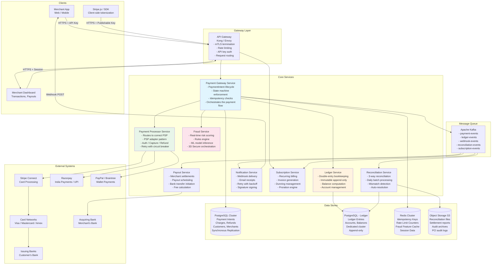

---

## 3. Component Deep Dive

### 3.1 Payment Gateway Service (The Orchestrator)

The Payment Gateway Service is the **brain** of the system. It manages the PaymentIntent
lifecycle, enforces the state machine, checks idempotency, and orchestrates calls to
fraud, processor, and ledger services.

**Responsibilities:**
- Create, confirm, capture, cancel PaymentIntents
- Enforce state machine transitions (reject invalid transitions)
- Check idempotency key in Redis before processing
- Call Fraud Service for risk scoring before authorization
- Call Payment Processor for PSP communication
- Call Ledger Service to record double-entry transactions
- Emit events to Kafka for async consumers

**Technology:** Go or Java (for performance and strong typing on financial data)

```
PaymentIntent Lifecycle (managed by Gateway):

  1. Merchant calls POST /payment_intents
  2. Gateway generates PaymentIntent ID, stores in DB (status: requires_confirmation)
  3. Merchant calls POST /payment_intents/{id}/confirm
  4. Gateway checks idempotency key in Redis
  5. Gateway calls Fraud Service -> returns risk score
  6. If risk > threshold -> return requires_action (3DS)
  7. Gateway calls Payment Processor -> authorize with PSP
  8. On success -> Gateway calls Ledger Service -> record entries
  9. Gateway updates PaymentIntent status -> succeeded
  10. Gateway emits payment_intent.succeeded to Kafka
  11. Notification Service delivers webhook to merchant
```

### 3.2 Payment Processor Service (PSP Adapter Layer)

The Payment Processor Service abstracts the complexity of communicating with external
PSPs. It implements the **adapter pattern** so the Gateway never speaks PSP-specific
protocols.

**Responsibilities:**
- Route payments to the optimal PSP based on currency, card type, geography
- Translate internal requests to PSP-specific API formats
- Handle PSP-specific error codes and map to internal error taxonomy
- Implement circuit breaker per PSP (if Stripe is down, fail over to Adyen)
- Manage PSP credentials, API versions, and webhook ingestion

**PSP Routing Logic:**
```
IF payment.currency == "INR" AND payment.method == "UPI":
    route to Razorpay
ELIF payment.method == "paypal_wallet":
    route to PayPal/Braintree
ELIF primary_psp (Stripe) is healthy:
    route to Stripe
ELSE:
    route to Adyen (backup)
```

### 3.3 Ledger Service (Source of Financial Truth)

The Ledger Service implements **double-entry bookkeeping** -- the foundational
accounting principle that ensures money never appears or disappears. Every financial
operation creates at minimum two ledger entries: one debit and one credit.

**Responsibilities:**
- Maintain chart of accounts (merchant accounts, fee accounts, reserve accounts)
- Record ledger entries atomically (debit + credit in same transaction)
- Compute account balances (sum of all entries for an account)
- Enforce invariants: sum(debits) == sum(credits) for every transaction
- Provide balance queries for merchant dashboards and payout calculations

**Technology:** Dedicated PostgreSQL cluster with synchronous replication, append-only
tables, no UPDATEs or DELETEs ever.

### 3.4 Fraud Service

The Fraud Service evaluates every payment in real-time to determine fraud risk.
It combines a rules engine with ML model inference.

**Responsibilities:**
- Compute fraud risk score (0-100) for each payment
- Execute configurable rules (velocity checks, amount thresholds, geo checks)
- Run ML model inference (trained on historical fraud patterns)
- Decide: allow, block, or challenge (3D Secure)
- Manage 3D Secure flow orchestration (redirect customer to issuer for authentication)
- Update fraud features in Redis for real-time velocity tracking

**Decision Matrix:**
```
Score 0-30:   ALLOW   (auto-approve, ~92% of transactions)
Score 30-70:  REVIEW  (trigger 3D Secure challenge, ~7% of transactions)
Score 70-100: BLOCK   (reject immediately, ~1% of transactions)
```

### 3.5 Reconciliation Service

The Reconciliation Service runs daily to ensure that the internal ledger matches
external reality (PSP settlement reports and bank statements).

**Responsibilities:**
- Download settlement files from PSPs (CSV/SFTP)
- Download bank statements (MT940 / CAMT.053 format)
- Run 3-way match: internal ledger vs PSP vs bank
- Flag mismatches for investigation
- Auto-resolve known mismatch patterns (timing differences, FX rounding)
- Generate reconciliation reports for finance team

### 3.6 Notification Service (Webhooks)

The Notification Service delivers webhook events to merchant endpoints reliably.

**Responsibilities:**
- Consume payment events from Kafka
- Deliver HTTP POST to merchant's webhook URL
- Sign payload with HMAC-SHA256 (Stripe-Signature header)
- Retry with exponential backoff (5 sec, 30 sec, 5 min, 1 hr, up to 3 days)
- Track delivery status and allow manual retry from dashboard
- Support multiple webhook endpoints per merchant with event filtering

---

## 4. Payment Flow Walkthroughs

### 4.1 Happy Path: Card Payment (Authorize + Capture)

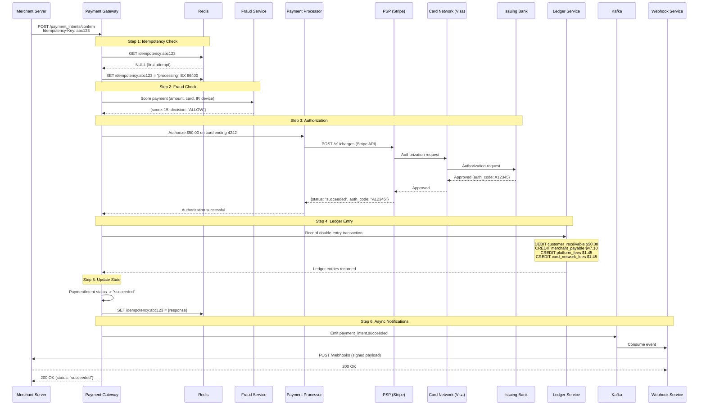

### 4.2 3D Secure Challenge Flow

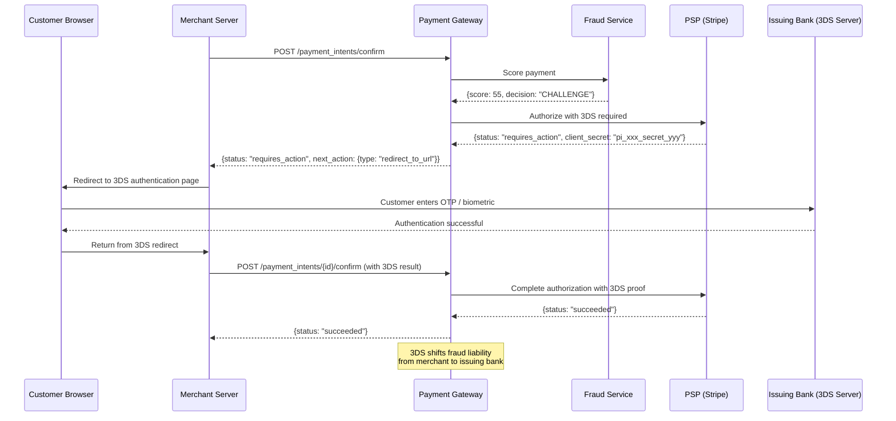

### 4.3 Refund Flow

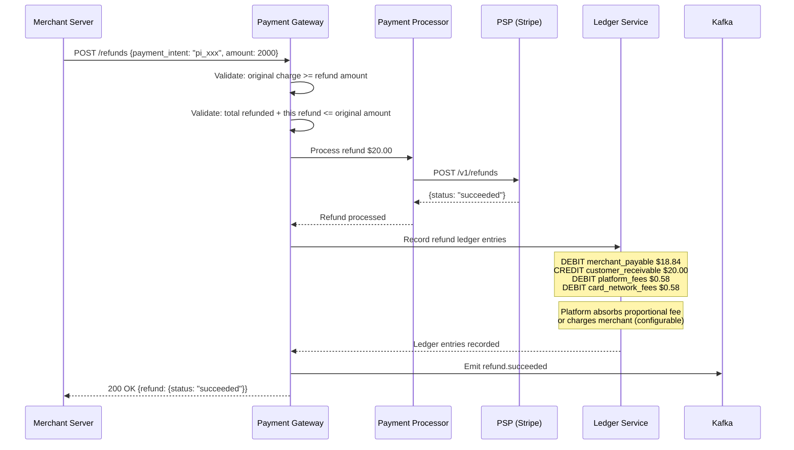

### 4.4 Subscription Billing Flow

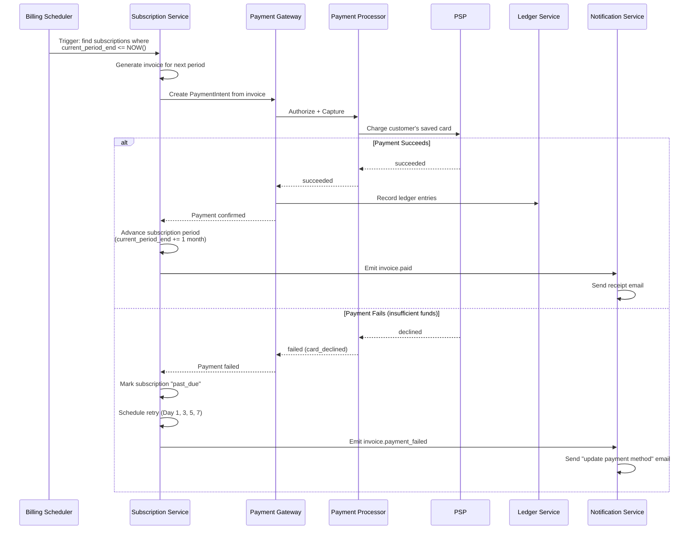

---

## 5. Authorization vs Capture vs Settlement

This is one of the most commonly tested concepts in payment system interviews.
Understanding the three-phase flow is essential.

```
Timeline of a card payment:

  T+0 seconds    AUTHORIZATION      Customer's bank puts a hold on funds
  T+0 to 7 days  CAPTURE            Merchant requests the held funds be collected
  T+2 days       SETTLEMENT         Actual money moves between banks

  ┌─────────────┐     ┌──────────┐     ┌────────────┐
  │ AUTHORIZE   │────>│ CAPTURE  │────>│ SETTLEMENT │
  │             │     │          │     │            │
  │ "Can this   │     │ "I want  │     │ "Move the  │
  │  card pay   │     │  the     │     │  money     │
  │  $50?"      │     │  money"  │     │  between   │
  │             │     │          │     │  banks"    │
  │ Hold placed │     │ Charge   │     │ Net settle │
  │ on card     │     │ finalized│     │ via ACH    │
  └─────────────┘     └──────────┘     └────────────┘
       Sync               Sync              Async
     (< 500ms)          (< 500ms)        (T+2 days)
```

### 5.1 Why Separate Auth and Capture?

| Use Case | Auth-Only Period | Why |
|----------|-----------------|-----|
| **Hotels** | Auth at check-in, capture at check-out | Final amount unknown (minibar, room service) |
| **Uber rides** | Auth estimated fare before ride, capture actual fare after | Actual fare may differ from estimate |
| **E-commerce pre-orders** | Auth when ordered, capture when shipped | Don't charge until fulfillment |
| **Car rentals** | Auth higher amount (deposit), capture lower (actual rental) | Cover potential damages |
| **Gas stations** | Auth $1 to validate card, capture actual pump amount | Amount unknown until customer finishes |

### 5.2 Settlement: How Money Actually Moves

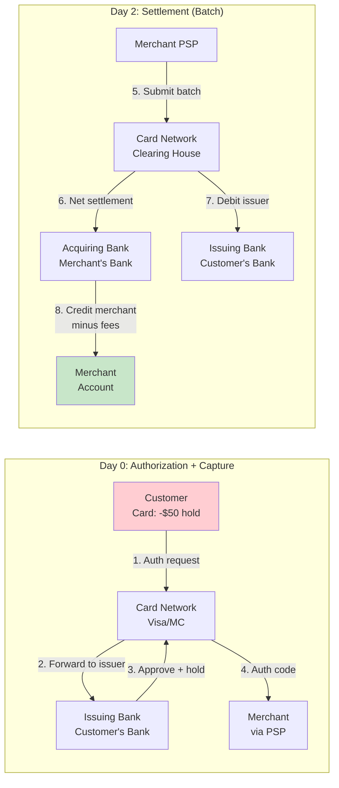

### 5.3 The Fee Stack

```
Customer pays:                          $100.00
  - Interchange fee (issuing bank):      -$1.80  (1.80%, goes to customer's bank)
  - Card network fee (Visa/MC):          -$0.15  (0.15%, goes to Visa/MC)
  - Payment processor fee (Stripe):      -$0.95  (Stripe keeps the rest of 2.9% + $0.30)
  ─────────────────────────────────────
Merchant receives:                       $97.10

Stripe's economics:
  Charges merchant:   2.9% + $0.30 = $3.20
  Pays interchange:   $1.80
  Pays network:       $0.15
  Stripe's margin:    $1.25 (1.25% effective take rate)
```

---

## 6. Idempotency -- The Most Critical Concept

**Why idempotency matters in payments:** If a merchant's server sends a charge request,
the PSP processes it, but the response is lost (network timeout), the merchant will
retry. Without idempotency, the customer gets charged twice. This is the single most
important correctness property of a payment system.

### 6.1 Stripe's Idempotency Model

Stripe's approach (which has become the industry standard):

1. Client sends `Idempotency-Key` header with every mutating request
2. Server checks if this key has been seen before
3. If yes: return the stored response (do not re-execute)
4. If no: execute the request, store the response, return it

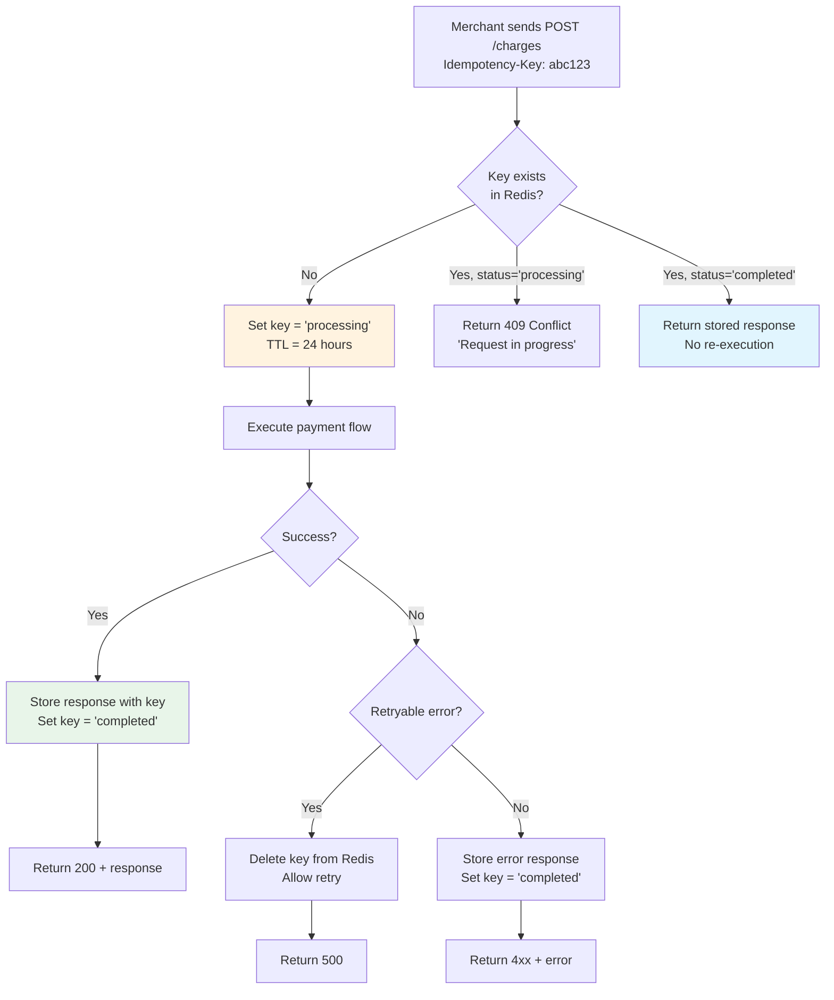

### 6.2 Idempotency Key Storage

```
Redis Key Structure:
  Key:    idempotency:{merchant_id}:{idempotency_key}
  Value:  JSON { status, response_code, response_body, created_at }
  TTL:    24 hours (Stripe's default)

Example:
  Key:    idempotency:merch_123:pi_unique_req_abc
  Value:  {
            "status": "completed",
            "response_code": 200,
            "response_body": "{\"id\":\"pi_xxx\",\"status\":\"succeeded\"}",
            "created_at": 1694000000
          }
  TTL:    86400 seconds
```

### 6.3 Atomic Phases (Stripe's Rocket Rides Pattern)

Stripe published their "Rocket Rides" pattern for handling complex idempotent
operations that span multiple steps. The key idea: break the operation into
atomic phases, and record which phase completed, so retries can resume from
the last successful phase.

```
Payment Processing Phases:

  Phase 1: STARTED        -> Create PaymentIntent record in DB
  Phase 2: FRAUD_CHECKED  -> Fraud service returned a score
  Phase 3: AUTHORIZED     -> PSP returned auth approval
  Phase 4: LEDGER_WRITTEN -> Double-entry recorded in ledger
  Phase 5: COMPLETED      -> All done, response cached

On retry:
  - If phase 1 completed, skip to phase 2
  - If phase 3 completed but phase 4 failed, resume at phase 4
  - Never re-execute a completed phase
```

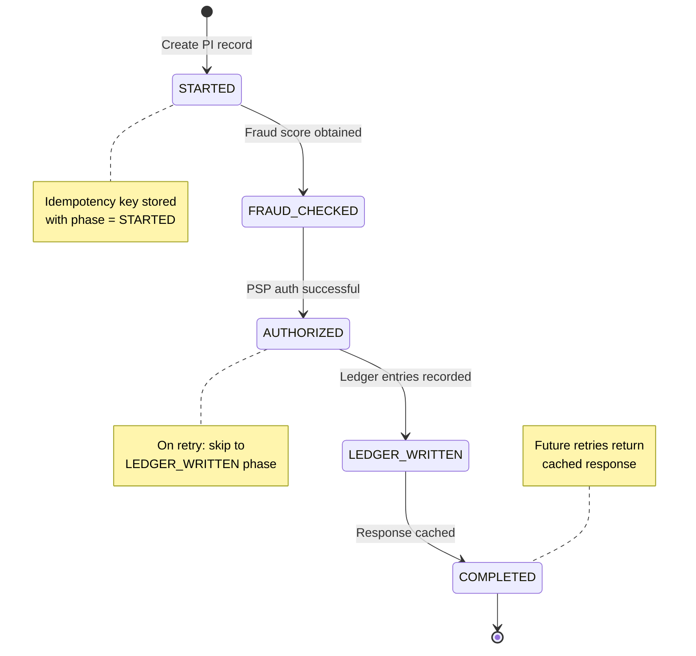

### 6.4 Database-Level Idempotency

Beyond the API layer, idempotency must also exist at the database level:

```sql
-- Ledger entry with unique constraint to prevent double-posting
CREATE TABLE ledger_entries (
    id              UUID PRIMARY KEY DEFAULT gen_random_uuid(),
    transaction_id  UUID NOT NULL,          -- Groups debit+credit together
    idempotency_key VARCHAR(255) NOT NULL,  -- Tied to the payment operation
    account_id      UUID NOT NULL,
    entry_type      VARCHAR(6) NOT NULL CHECK (entry_type IN ('DEBIT', 'CREDIT')),
    amount          BIGINT NOT NULL CHECK (amount > 0),
    currency        VARCHAR(3) NOT NULL,
    created_at      TIMESTAMP NOT NULL DEFAULT NOW(),
    
    -- THIS is the idempotency guard at the DB level
    UNIQUE (idempotency_key, account_id, entry_type)
);

-- Even if the application retries, the UNIQUE constraint prevents double-posting
-- The INSERT becomes: INSERT ... ON CONFLICT (idempotency_key, account_id, entry_type) DO NOTHING
```

---

## 7. Double-Entry Bookkeeping

### 7.1 The Fundamental Rule

```
For EVERY financial transaction:
  Sum of all DEBITS  =  Sum of all CREDITS

This is an invariant that must NEVER be violated.
If debits != credits, money has appeared or disappeared -- 
that means there is a bug, and the system cannot be trusted.
```

**Why double-entry matters:**
- It makes errors **self-evident** (if debits != credits, something is wrong)
- It creates a **complete audit trail** (follow any dollar from source to destination)
- It enables **reconciliation** (compare internal books with external bank/PSP)
- It satisfies **regulatory requirements** (SOX, PCI DSS, financial audits)
- It is how **every bank, payment processor, and financial institution** works

### 7.2 Chart of Accounts

```
Account Type        | Examples                          | Normal Balance
─────────────────── | ────────────────────────────────  | ──────────────
ASSET               | customer_receivable               | DEBIT
                    | cash_in_transit                   |
                    | bank_settlement_account           |
─────────────────── | ────────────────────────────────  | ──────────────
LIABILITY           | merchant_payable                  | CREDIT
                    | refund_payable                    |
                    | reserve_held                      |
─────────────────── | ────────────────────────────────  | ──────────────
REVENUE             | platform_transaction_fees         | CREDIT
                    | fx_markup_revenue                 |
                    | subscription_fees                 |
─────────────────── | ────────────────────────────────  | ──────────────
EXPENSE             | card_network_fees                 | DEBIT
                    | interchange_fees                  |
                    | chargeback_losses                 |
```

### 7.3 Ledger Entries for Common Operations

**Scenario 1: Customer pays $100 to merchant (Stripe processes)**

```
Transaction: payment_txn_001
──────────────────────────────────────────────────────────────
Account                    | Debit ($)  | Credit ($)
──────────────────────────────────────────────────────────────
customer_receivable        | 100.00     |            <- Money owed by card network
merchant_payable           |            | 97.10      <- Money owed to merchant
platform_transaction_fees  |            |  1.45      <- Our revenue (Stripe's cut)
interchange_expense        |  1.45      |            <- Paid to issuing bank
card_network_expense       |            |  ...       <- (absorbed into fees above)
──────────────────────────────────────────────────────────────
TOTAL                      | 101.45     | 101.45     <- MUST match
                           |            |            (note: simplified; real entries
                           |            |             split network fees separately)
```

> **Simplified model for interviews:** Use 4 accounts per payment:
> DEBIT customer_receivable, CREDIT merchant_payable, CREDIT platform_fees, CREDIT network_fees.
> This demonstrates the concept without over-complicating.

**Scenario 2: Refund $20 of the above payment**

```
Transaction: refund_txn_001
──────────────────────────────────────────────────────────────
Account                    | Debit ($)  | Credit ($)
──────────────────────────────────────────────────────────────
customer_receivable        |            | 20.00      <- We owe customer money back
merchant_payable           | 18.84      |            <- Reduce merchant's balance
platform_transaction_fees  |  0.58      |            <- Reverse our fee (proportional)
interchange_expense        |            |  0.58      <- Interchange refunded (sometimes)
──────────────────────────────────────────────────────────────
TOTAL                      | 19.42      | 20.58      <- Wait... this doesn't match!
```

> **In reality:** Refund economics vary. Some networks refund interchange, some don't.
> Stripe may or may not refund its fee. The exact entries depend on the refund policy.
> The key point: **whatever the policy, debits MUST equal credits.**

**Corrected refund (Stripe keeps its fee, interchange NOT refunded):**

```
Transaction: refund_txn_001
──────────────────────────────────────────────────────────────
Account                    | Debit ($)  | Credit ($)
──────────────────────────────────────────────────────────────
merchant_payable           | 20.00      |            <- Deducted from merchant balance
customer_receivable        |            | 20.00      <- Returned to customer
──────────────────────────────────────────────────────────────
TOTAL                      | 20.00      | 20.00      <- Balanced. Merchant bears full cost.
```

### 7.4 Ledger Schema

```sql
-- Accounts in the chart of accounts
CREATE TABLE accounts (
    id              UUID PRIMARY KEY,
    name            VARCHAR(255) NOT NULL,
    type            VARCHAR(20) NOT NULL CHECK (type IN ('ASSET', 'LIABILITY', 'REVENUE', 'EXPENSE')),
    currency        VARCHAR(3) NOT NULL,
    owner_type      VARCHAR(20),          -- 'MERCHANT', 'PLATFORM', 'SYSTEM'
    owner_id        UUID,                 -- merchant_id or NULL for system accounts
    normal_balance  VARCHAR(6) NOT NULL CHECK (normal_balance IN ('DEBIT', 'CREDIT')),
    created_at      TIMESTAMP NOT NULL DEFAULT NOW(),
    is_active       BOOLEAN NOT NULL DEFAULT true
);

-- Immutable ledger entries (append-only -- NEVER update or delete)
CREATE TABLE ledger_entries (
    id                  UUID PRIMARY KEY DEFAULT gen_random_uuid(),
    transaction_id      UUID NOT NULL,    -- Groups all entries of one operation
    idempotency_key     VARCHAR(255) NOT NULL,
    account_id          UUID NOT NULL REFERENCES accounts(id),
    entry_type          VARCHAR(6) NOT NULL CHECK (entry_type IN ('DEBIT', 'CREDIT')),
    amount              BIGINT NOT NULL CHECK (amount > 0),  -- In smallest currency unit
    currency            VARCHAR(3) NOT NULL,
    description         TEXT,
    source_type         VARCHAR(50),      -- 'PAYMENT', 'REFUND', 'PAYOUT', 'FEE'
    source_id           UUID,             -- payment_intent_id, refund_id, etc.
    created_at          TIMESTAMP NOT NULL DEFAULT NOW(),
    
    UNIQUE (idempotency_key, account_id, entry_type)
);

-- Materialized balances (updated transactionally with ledger entries)
CREATE TABLE account_balances (
    account_id      UUID PRIMARY KEY REFERENCES accounts(id),
    balance         BIGINT NOT NULL DEFAULT 0,  -- Current balance in smallest unit
    currency        VARCHAR(3) NOT NULL,
    last_entry_id   UUID REFERENCES ledger_entries(id),
    updated_at      TIMESTAMP NOT NULL DEFAULT NOW()
);

-- Balance update trigger: ensures balance always matches ledger
-- (In production, this is done in application code within the same DB transaction)
```

### 7.5 Atomic Ledger Write (Application Code)

```python
# Pseudocode for atomic double-entry write
def record_payment(payment_intent_id, amount, currency, merchant_id):
    transaction_id = generate_uuid()
    idempotency_key = f"payment:{payment_intent_id}"
    
    with db.transaction(isolation_level='SERIALIZABLE'):
        # Insert all entries atomically
        db.execute("""
            INSERT INTO ledger_entries (transaction_id, idempotency_key, account_id, entry_type, amount, currency)
            VALUES
                (%s, %s, %s, 'DEBIT',  %s, %s),  -- customer_receivable
                (%s, %s, %s, 'CREDIT', %s, %s),  -- merchant_payable
                (%s, %s, %s, 'CREDIT', %s, %s)   -- platform_fees
            ON CONFLICT (idempotency_key, account_id, entry_type) DO NOTHING
        """, [
            transaction_id, idempotency_key, CUSTOMER_RECEIVABLE_ACCT, amount, currency,
            transaction_id, idempotency_key, merchant_account_id, merchant_amount, currency,
            transaction_id, idempotency_key, PLATFORM_FEE_ACCT, fee_amount, currency,
        ])
        
        # Update balances in the same transaction
        db.execute("UPDATE account_balances SET balance = balance + %s WHERE account_id = %s",
                   [amount, CUSTOMER_RECEIVABLE_ACCT])
        db.execute("UPDATE account_balances SET balance = balance + %s WHERE account_id = %s",
                   [merchant_amount, merchant_account_id])
        db.execute("UPDATE account_balances SET balance = balance + %s WHERE account_id = %s",
                   [fee_amount, PLATFORM_FEE_ACCT])
        
        # Verify invariant
        result = db.execute("""
            SELECT 
                SUM(CASE WHEN entry_type = 'DEBIT' THEN amount ELSE 0 END) as total_debits,
                SUM(CASE WHEN entry_type = 'CREDIT' THEN amount ELSE 0 END) as total_credits
            FROM ledger_entries WHERE transaction_id = %s
        """, [transaction_id])
        
        assert result.total_debits == result.total_credits, "INVARIANT VIOLATED: debits != credits"
```

---

## 8. PSP Integration Layer

### 8.1 Adapter Pattern

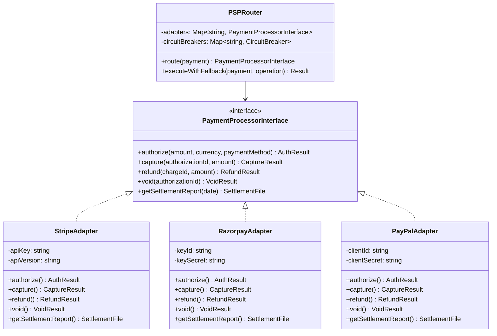

### 8.2 PSP Routing Strategy

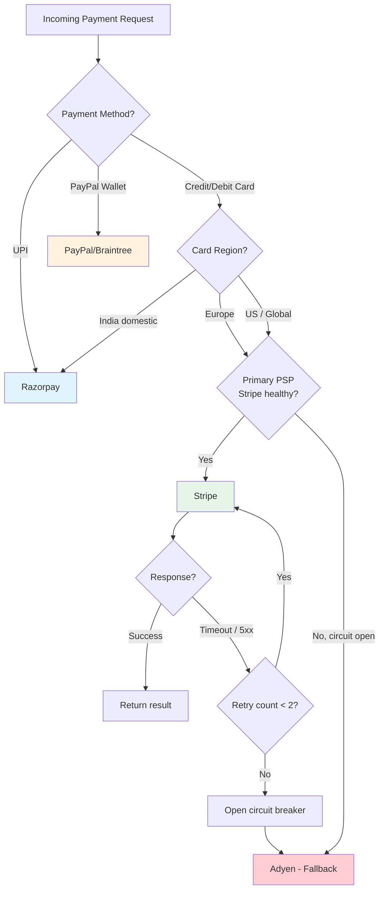

### 8.3 Circuit Breaker Configuration

```
Per-PSP Circuit Breaker:
  Failure threshold:   5 failures in 60 seconds
  Half-open after:     30 seconds
  Success to close:    3 consecutive successes
  Monitored errors:    5xx responses, timeouts (> 5 seconds), connection refused
  NOT monitored:       4xx responses (client errors), card declines (expected behavior)

This ensures:
  - A PSP outage does not cascade to all merchants
  - Traffic shifts to backup PSP within seconds
  - Primary PSP is re-tested periodically (half-open state)
```

---

## 9. Retry and Failure Handling

### 9.1 Failure Modes and Responses

```mermaid
flowchart TD
    A[Payment Request] --> B[Send to PSP]
    B --> C{Response?}
    
    C -->|200 Success| D[Record in ledger<br/>Return success]
    C -->|4xx Decline| E[Card declined / invalid<br/>Do NOT retry<br/>Return failure to merchant]
    C -->|5xx Server Error| F{Retryable?}
    C -->|Timeout| G[UNKNOWN STATE<br/>Most dangerous case]
    
    F -->|Yes| H[Retry with exponential backoff<br/>Max 3 retries<br/>Same idempotency key]
    F -->|No| E
    
    G --> I[Query PSP for status<br/>GET /charges/{id}]
    I --> J{Found?}
    J -->|Yes, succeeded| D
    J -->|Yes, failed| E
    J -->|Not found| K[Safe to retry<br/>PSP never received it]
    K --> H
    
    style G fill:#ffcdd2
    style D fill:#e8f5e9
```

### 9.2 The Timeout Problem (Most Dangerous Failure)

```
The most dangerous scenario in payment processing:

  1. Merchant sends charge request to our system
  2. Our system forwards to PSP (Stripe)
  3. Stripe authorizes with card network and issuing bank
  4. Stripe responds to our system...
  5. ...but the response is LOST (network partition, our server crashes mid-read)

At this point:
  - The customer HAS been charged (the bank authorized it)
  - Our system does NOT know this
  - If we retry, Stripe's idempotency key prevents double-charge (safe)
  - If we DON'T retry, the merchant never gets confirmation
  - If we return "failed" to merchant, they might ask customer to pay again

SOLUTION:
  a) Always retry with the same idempotency key
  b) Always query PSP status before concluding failure
  c) Run reconciliation to catch any inconsistencies
  d) Design for "at-least-once delivery, exactly-once processing"
```

### 9.3 Retry Policy

```
Payment API Retry Policy:
  ────────────────────────────────────────────
  Attempt 1:  Immediate
  Attempt 2:  After 1 second
  Attempt 3:  After 3 seconds
  Attempt 4:  After 10 seconds
  Max:        4 attempts total
  
  Each attempt uses the SAME idempotency key.
  Jitter: +/- 20% randomization to avoid thundering herd.

Webhook Delivery Retry Policy (Stripe's actual schedule):
  ────────────────────────────────────────────
  Attempt 1:   Immediate
  Attempt 2:   5 seconds
  Attempt 3:   5 minutes
  Attempt 4:   30 minutes
  Attempt 5:   2 hours
  Attempt 6:   5 hours
  Attempt 7:   10 hours
  Attempt 8:   24 hours
  ...up to 72 hours total (then give up, mark "failed")
  
  Merchant can manually retry from dashboard.
```

---

## 10. Database Design

### 10.1 Sharding Strategy

```
Payment data sharding:
  Shard key:  merchant_id
  Reason:     Queries are almost always scoped to a single merchant
              ("show me MY transactions", "MY balance", "MY payouts")
  Shards:     8 PostgreSQL instances (each with synchronous replica)

Ledger data sharding:
  Shard key:  account_id (which maps to merchant_id for merchant accounts)
  Reason:     Balance queries and ledger entry inserts are per-account
  Shards:     8 PostgreSQL instances (separate cluster from payment data)

Redis (idempotency + fraud features):
  Sharding:   Redis Cluster with consistent hashing
  Nodes:      6 (3 primary + 3 replica)
```

### 10.2 Read vs Write Path Separation

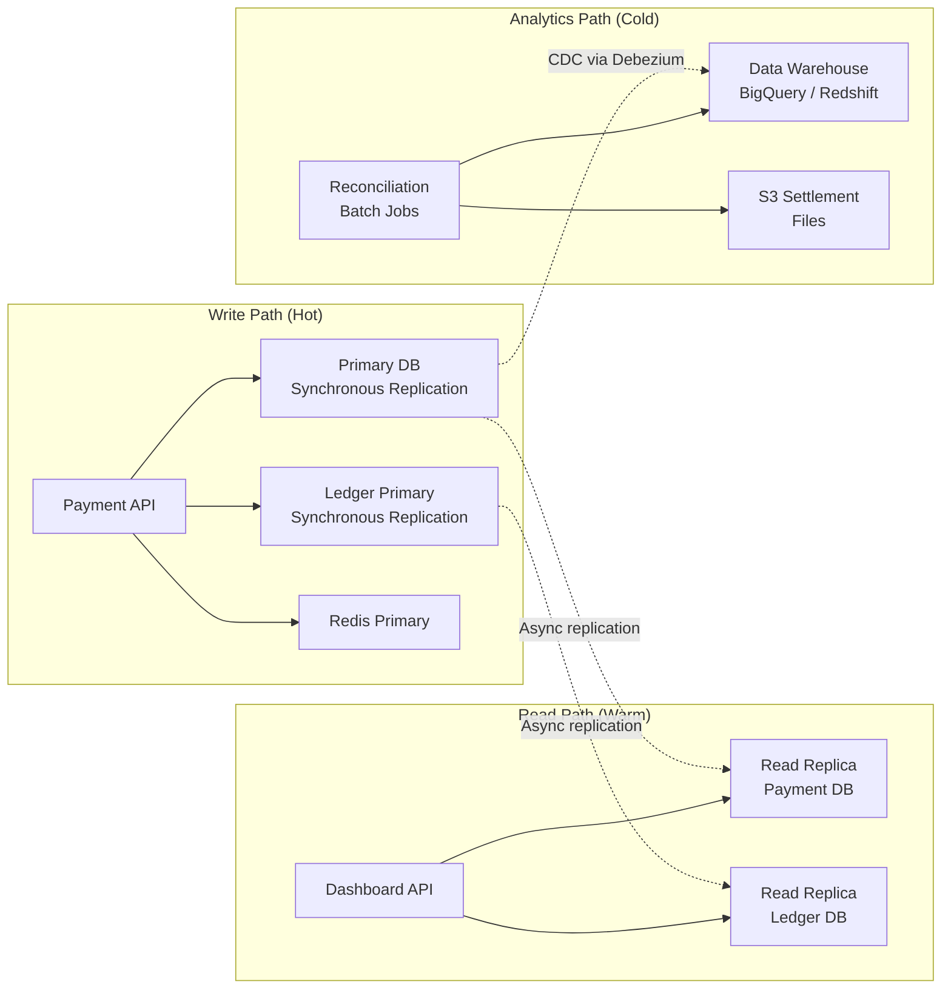

### 10.3 Data Retention

```
Retention Policy (PCI DSS + SOX compliance):
  ──────────────────────────────────────────
  Payment records:     7 years (regulatory requirement)
  Ledger entries:      7 years (immutable, never deleted)
  Audit logs:          7 years (PCI DSS requirement)
  Card tokens:         Until customer deletes or 10 years
  Raw PAN data:        NEVER stored (tokenize immediately)
  Idempotency keys:    24 hours (Redis TTL)
  Fraud features:      90 days (rolling window for ML)
  Settlement files:    7 years (archived to S3 Glacier after 1 year)
```

---

> **Interview Tip (Uber):** The interviewer will likely ask you to draw the payment flow
> on a whiteboard. Start with the happy path (merchant -> gateway -> processor -> card network
> -> issuing bank), then address failures. The three things that distinguish a strong candidate:
> (1) You mention idempotency keys before being asked, (2) You explain double-entry ledger
> without prompting, (3) You differentiate authorization from capture from settlement.
> These three concepts are the backbone of every payment system interview.
