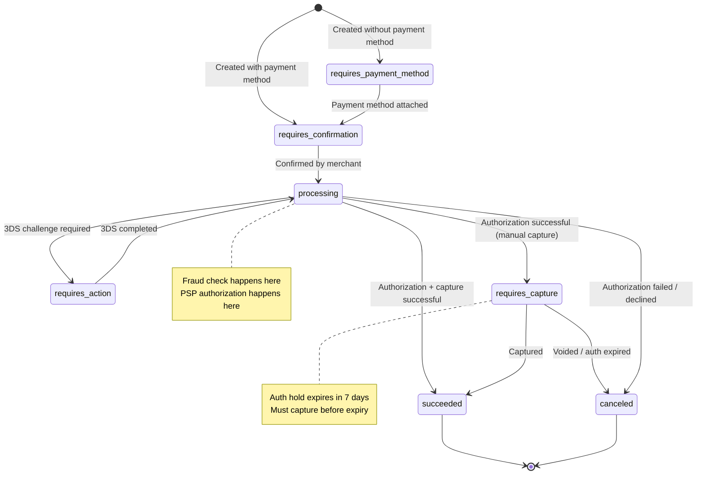

# Design a Payment System (like Stripe): Requirements and Estimation

## Table of Contents
- [1. Problem Statement](#1-problem-statement)
- [2. Functional Requirements](#2-functional-requirements)
- [3. Non-Functional Requirements](#3-non-functional-requirements)
- [4. Out of Scope](#4-out-of-scope)
- [5. Back-of-Envelope Estimation](#5-back-of-envelope-estimation)
- [6. API Design](#6-api-design)
- [7. Data Model Overview](#7-data-model-overview)

---

## 1. Problem Statement

Design a payment processing platform (like Stripe) that enables merchants to accept
online payments, process refunds, manage subscriptions, and handle multi-currency
transactions. The system must guarantee financial correctness through double-entry
bookkeeping, detect fraud in real-time, and reconcile with external payment service
providers (PSPs), card networks, and banks -- all while maintaining PCI DSS compliance
and 99.999% availability for payment authorization.

**Why this problem is asked at Uber (and top fintech interviews):**
- It tests **financial correctness** -- money cannot appear or disappear (double-entry ledger)
- It tests **idempotency** -- network retries must not charge a customer twice
- It tests **distributed transactions** -- payment spans multiple external systems (card networks, banks)
- It tests **eventual consistency** -- authorization is synchronous, settlement is async (T+2 days)
- It tests **failure handling** -- what happens when the PSP times out mid-charge?
- It tests **compliance** -- PCI DSS, PSD2 (3D Secure), SOX controls

---

## 2. Functional Requirements

### 2.1 Core Payment Operations

| # | Requirement | Description |
|---|-------------|-------------|
| FR-1 | **Process payments** | Merchant submits a charge request with amount, currency, and payment method; system authorizes and captures funds |
| FR-2 | **Refunds** | Full or partial refund of a previously captured payment; money returns to the customer's original payment method |
| FR-3 | **Payment methods** | Support credit/debit cards (Visa, Mastercard, Amex), bank transfers (ACH/SEPA), UPI, digital wallets (Apple Pay, Google Pay) |
| FR-4 | **Multi-currency** | Accept payments in 135+ currencies; settle to merchant in their preferred currency with FX conversion |
| FR-5 | **Authorization & Capture** | Support two-phase flow: authorize (hold funds) then capture (collect funds) -- used by hotels, ride-sharing, etc. |
| FR-6 | **Void/Cancel** | Cancel an authorized-but-not-captured payment to release the hold on customer's funds |

### 2.2 Recurring Billing / Subscriptions

| # | Requirement | Description |
|---|-------------|-------------|
| FR-7 | **Create subscription** | Merchant creates a recurring billing plan (monthly/annual) tied to a customer's payment method |
| FR-8 | **Invoice generation** | System generates invoices at each billing cycle, with line items, taxes, and discounts |
| FR-9 | **Dunning management** | Auto-retry failed subscription payments with exponential backoff; notify customer; eventually cancel |
| FR-10 | **Proration** | When a customer upgrades/downgrades mid-cycle, compute prorated charges/credits |
| FR-11 | **Trial periods** | Support N-day free trials before first charge |

### 2.3 Fraud Detection

| # | Requirement | Description |
|---|-------------|-------------|
| FR-12 | **Real-time fraud scoring** | Every payment request gets a fraud risk score before authorization |
| FR-13 | **Rules engine** | Configurable rules: block transactions > $10K, flag new cards with high-value purchases, velocity checks |
| FR-14 | **3D Secure (3DS)** | Challenge suspicious transactions with cardholder authentication (SCA requirement in EU) |
| FR-15 | **Chargeback handling** | When a customer disputes a charge, manage evidence submission and representment |

### 2.4 Ledger and Reconciliation

| # | Requirement | Description |
|---|-------------|-------------|
| FR-16 | **Double-entry bookkeeping** | Every transaction debits one account and credits another; total debits always equal total credits |
| FR-17 | **Reconciliation** | Daily 3-way reconciliation: internal ledger vs PSP settlement reports vs bank statements |
| FR-18 | **Payout** | Aggregate settled funds and transfer to merchant's bank account on a schedule (daily/weekly) |
| FR-19 | **Financial reporting** | Provide transaction history, settlement reports, balance summaries, tax documents |

### 2.5 Merchant Integration

| # | Requirement | Description |
|---|-------------|-------------|
| FR-20 | **Webhooks** | Notify merchants of payment events (payment_succeeded, refund_created, dispute_opened) via HTTP callbacks |
| FR-21 | **Dashboard** | Web UI for merchants to view transactions, manage refunds, configure fraud rules, view payouts |
| FR-22 | **API keys & authentication** | Publishable keys (client-side), secret keys (server-side), restricted keys (limited permissions) |

---

## 3. Non-Functional Requirements

### 3.1 Performance

| Requirement | Target | Rationale |
|-------------|--------|-----------|
| **Payment authorization latency** | < 500ms (p99 < 1.5s) | Customers abandon checkout if payment takes > 2s |
| **Fraud scoring latency** | < 100ms (p99 < 200ms) | Must happen inline before auth; cannot add perceptible delay |
| **Webhook delivery** | < 5 seconds (p99 < 30s) | Merchants depend on webhooks for order fulfillment |
| **API throughput** | 12,000 TPS peak | 1M transactions/day with 3x peak-to-average ratio |
| **Ledger write throughput** | 24,000 entries/sec peak | Each payment creates 2+ ledger entries (double-entry) |

### 3.2 Availability and Reliability

| Requirement | Target | Rationale |
|-------------|--------|-----------|
| **Payment API availability** | 99.999% (5 nines) | Every minute of downtime = lost revenue for thousands of merchants |
| **Zero data loss** | RPO = 0 | Financial records cannot be lost; synchronous replication required |
| **Idempotency** | Exactly-once semantics | Network retries must never result in duplicate charges |
| **Disaster recovery** | RTO < 30 seconds | Active-active multi-region for payment path |

### 3.3 Security and Compliance

| Requirement | Target | Rationale |
|-------------|--------|-----------|
| **PCI DSS Level 1** | Certified annually | Handling card data requires the highest compliance level |
| **Encryption** | TLS 1.3 in transit, AES-256 at rest | Protect sensitive payment data everywhere |
| **Tokenization** | Replace card numbers with tokens | Reduce PCI scope for merchants; never store raw PANs |
| **Audit trail** | Immutable, append-only | Every state change logged for regulatory compliance |
| **SOC 2 Type II** | Certified annually | Enterprise merchants require SOC 2 compliance |

### 3.4 Consistency

| Requirement | Target | Rationale |
|-------------|--------|-----------|
| **Ledger consistency** | Strong consistency | Double-entry invariant (debits = credits) must never be violated |
| **Payment state** | Linearizable | A payment in state "captured" must never revert to "pending" |
| **Balance queries** | Read-your-writes | Merchant must see updated balance immediately after a charge |

---

## 4. Out of Scope

| Item | Reason |
|------|--------|
| Card issuing (creating virtual/physical cards) | Separate product (Stripe Issuing) |
| Banking-as-a-service (Treasury) | Separate product |
| In-person / POS terminal payments | Different infrastructure (hardware + EMV chip) |
| Crypto payments | Niche; separate processing pipeline |
| Lending / Capital advances | Separate financial product |
| Tax calculation engine | Integrate with third-party (Avalara, TaxJar) |

---

## 5. Back-of-Envelope Estimation

### 5.1 Traffic Assumptions

```
Merchants:                    100,000 active merchants
Transactions per day:         1,000,000 (1M)
Peak TPS:                     1M / 86,400 * 3 (peak factor) = ~35 TPS average, ~105 TPS peak
                              For Stripe-scale: 12,000 TPS peak (actual Stripe benchmark)
Average transaction value:    $50
Monthly processed volume:     1M * 30 * $50 = $1.5 Billion / month

Subscription billing events:  200,000 / day (20% of merchants use subscriptions)
Refund rate:                  2-3% of transactions = 30,000 refunds / day
Chargeback rate:              0.1% of transactions = 1,000 disputes / day
Webhook deliveries:           3M / day (avg 3 events per transaction)
```

### 5.2 Storage Estimation

```
--- Payment Records ---
Each payment record:          ~2 KB (metadata, amounts, status, timestamps)
Daily payment records:        1M * 2 KB = 2 GB / day
Annual payment records:       2 GB * 365 = 730 GB / year

--- Ledger Entries ---
Entries per payment:          Minimum 2 (debit + credit), often 4+ (fees, taxes)
Daily ledger entries:         1M * 4 = 4M entries
Entry size:                   ~500 bytes
Daily ledger storage:         4M * 500B = 2 GB / day
Annual ledger storage:        730 GB / year (must retain 7+ years for compliance)

--- Audit Logs ---
Events per payment:           ~10 state transitions (created, fraud_checked, authorized, captured, settled)
Daily audit events:           1M * 10 = 10M events
Event size:                   ~1 KB
Daily audit storage:          10 GB / day
Annual audit storage:         3.65 TB / year

--- Total Storage ---
Year 1 total:                 ~5 TB (payments + ledger + audit + indices)
7-year retention:             ~35 TB
```

### 5.3 Compute Estimation

```
--- Payment API Servers ---
Each server handles:          ~500 TPS (with auth + fraud check in the hot path)
Peak load:                    12,000 TPS
Servers needed:               12,000 / 500 = 24 servers (with 2x headroom = 48)

--- Fraud Scoring ---
ML model inference:           ~10ms per request (GPU inference)
Peak scoring requests:        12,000 / sec
GPU servers needed:           4 (with batching, each handles ~3,000 inferences/sec)

--- Ledger Database ---
Write throughput:             24,000 entries/sec peak
PostgreSQL with sharding:     8 shards (each handling ~3,000 writes/sec)

--- Webhook Workers ---
Webhook delivery rate:        3M / day = ~35/sec average, ~100/sec peak
Workers needed:               10 (each handles 10 deliveries/sec with retry logic)
```

### 5.4 Bandwidth Estimation

```
--- Inbound (API requests) ---
Average request size:         ~2 KB (JSON payload with payment details)
Peak inbound:                 12,000 * 2 KB = 24 MB/sec

--- Outbound (API responses + webhooks) ---
Average response size:        ~1.5 KB
Webhook payload:              ~1 KB
Peak outbound:                12,000 * 1.5 KB + 100 * 1 KB = 18.1 MB/sec

--- PSP Communication ---
Auth request to card network:  ~1 KB each
Peak PSP traffic:             12,000 * 2 * 1 KB = 24 MB/sec (request + response)
```

### 5.5 Summary Table

| Metric | Value |
|--------|-------|
| Daily transactions | 1,000,000 |
| Peak TPS | 12,000 |
| Monthly processed volume | $1.5 Billion |
| API servers | 48 (with headroom) |
| Ledger DB shards | 8 |
| Storage (Year 1) | ~5 TB |
| Storage (7-year retention) | ~35 TB |
| Peak bandwidth | ~66 MB/sec total |

---

## 6. API Design

### 6.1 Create a Payment Intent

**Stripe's model**: A PaymentIntent tracks the lifecycle of a payment from creation through confirmation to settlement.

```
POST /v1/payment_intents
Headers:
  Authorization: Bearer sk_live_xxx
  Idempotency-Key: pi_unique_req_abc123     # CRITICAL for exactly-once semantics
  Content-Type: application/json

Request Body:
{
  "amount": 5000,                           # Amount in smallest currency unit (cents)
  "currency": "usd",
  "payment_method": "pm_card_visa_4242",    # Tokenized payment method
  "capture_method": "automatic",            # "automatic" or "manual" (auth-only)
  "confirm": true,                          # Confirm immediately
  "description": "Order #12345",
  "metadata": {
    "order_id": "ord_12345",
    "customer_email": "user@example.com"
  },
  "receipt_email": "user@example.com"
}

Response (200 OK):
{
  "id": "pi_3Nk8aF2eZvKYlo2C",
  "object": "payment_intent",
  "amount": 5000,
  "currency": "usd",
  "status": "succeeded",                    # or "requires_action" for 3DS
  "payment_method": "pm_card_visa_4242",
  "charges": {
    "data": [{
      "id": "ch_3Nk8aF2eZvKYlo2C",
      "amount": 5000,
      "amount_captured": 5000,
      "balance_transaction": "txn_1Nk8aF2eZvKYlo2C",
      "paid": true
    }]
  },
  "created": 1694000000,
  "livemode": true
}
```

### 6.2 Capture a Payment (Two-Phase)

```
POST /v1/payment_intents/{pi_id}/capture
Headers:
  Authorization: Bearer sk_live_xxx
  Idempotency-Key: capture_pi_unique_abc

Request Body:
{
  "amount_to_capture": 4500               # Can capture less than authorized (partial capture)
}

Response (200 OK):
{
  "id": "pi_3Nk8aF2eZvKYlo2C",
  "status": "succeeded",
  "amount": 5000,                          # Original authorized amount
  "amount_capturable": 0,                  # Nothing left to capture
  "amount_received": 4500                  # Actually captured amount
}
```

### 6.3 Create a Refund

```
POST /v1/refunds
Headers:
  Authorization: Bearer sk_live_xxx
  Idempotency-Key: refund_unique_xyz

Request Body:
{
  "payment_intent": "pi_3Nk8aF2eZvKYlo2C",
  "amount": 2000,                          # Partial refund (cents)
  "reason": "requested_by_customer",       # "duplicate", "fraudulent", "requested_by_customer"
  "metadata": {
    "support_ticket": "TICKET-789"
  }
}

Response (200 OK):
{
  "id": "re_3Nk8aF2eZvKYlo2C",
  "object": "refund",
  "amount": 2000,
  "currency": "usd",
  "payment_intent": "pi_3Nk8aF2eZvKYlo2C",
  "status": "succeeded",                   # or "pending" for bank transfers
  "created": 1694000100
}
```

### 6.4 Create a Subscription

```
POST /v1/subscriptions
Headers:
  Authorization: Bearer sk_live_xxx

Request Body:
{
  "customer": "cus_OjGH1234abcd",
  "items": [
    {
      "price": "price_monthly_pro_49",     # References a Price object ($49/month)
      "quantity": 1
    }
  ],
  "default_payment_method": "pm_card_visa_4242",
  "trial_period_days": 14,
  "billing_cycle_anchor": 1694000000,      # Unix timestamp for billing day
  "payment_behavior": "default_incomplete", # Don't charge until confirmed
  "expand": ["latest_invoice.payment_intent"]
}

Response (200 OK):
{
  "id": "sub_1Nk8aF2eZvKYlo2C",
  "object": "subscription",
  "status": "trialing",                    # "active", "past_due", "canceled", "unpaid"
  "current_period_start": 1694000000,
  "current_period_end": 1696592000,
  "trial_start": 1694000000,
  "trial_end": 1695209600,
  "items": {
    "data": [{
      "price": {
        "id": "price_monthly_pro_49",
        "unit_amount": 4900,
        "currency": "usd",
        "recurring": {
          "interval": "month",
          "interval_count": 1
        }
      }
    }]
  },
  "latest_invoice": "in_1Nk8aF2eZvKYlo2C"
}
```

### 6.5 Webhook Event

```
POST https://merchant.example.com/webhooks/stripe
Headers:
  Stripe-Signature: t=1694000100,v1=hmac_sha256_signature
  Content-Type: application/json

Body:
{
  "id": "evt_1Nk8aF2eZvKYlo2C",
  "object": "event",
  "type": "payment_intent.succeeded",       # Event type
  "api_version": "2023-08-16",
  "created": 1694000100,
  "data": {
    "object": {
      "id": "pi_3Nk8aF2eZvKYlo2C",
      "amount": 5000,
      "currency": "usd",
      "status": "succeeded"
    }
  },
  "livemode": true,
  "request": {
    "id": "req_abc123",
    "idempotency_key": "pi_unique_req_abc123"
  }
}

# Merchant responds with 2xx to acknowledge.
# If no 2xx within 30s, Stripe retries with exponential backoff
# up to 3 days (max ~20 retries).
```

---

## 7. Data Model Overview

### 7.1 Core Entities

```mermaid
erDiagram
    MERCHANT ||--o{ PAYMENT_INTENT : creates
    MERCHANT ||--o{ CUSTOMER : has
    CUSTOMER ||--o{ PAYMENT_METHOD : owns
    PAYMENT_INTENT ||--|| CHARGE : generates
    CHARGE ||--o{ REFUND : may_have
    CHARGE ||--|| BALANCE_TRANSACTION : creates
    MERCHANT ||--o{ SUBSCRIPTION : offers
    SUBSCRIPTION ||--o{ INVOICE : generates
    INVOICE ||--|| PAYMENT_INTENT : triggers

    MERCHANT {
        string id PK
        string business_name
        string email
        string country
        string default_currency
        string payout_schedule
        timestamp created_at
    }

    CUSTOMER {
        string id PK
        string merchant_id FK
        string email
        string name
        json metadata
        timestamp created_at
    }

    PAYMENT_METHOD {
        string id PK
        string customer_id FK
        string type
        string card_brand
        string card_last4
        int card_exp_month
        int card_exp_year
        string card_fingerprint
        string billing_address_zip
        timestamp created_at
    }

    PAYMENT_INTENT {
        string id PK
        string merchant_id FK
        string customer_id FK
        bigint amount
        string currency
        string status
        string capture_method
        string payment_method_id FK
        string idempotency_key UK
        json metadata
        timestamp created_at
        timestamp updated_at
    }

    CHARGE {
        string id PK
        string payment_intent_id FK
        bigint amount
        bigint amount_captured
        bigint amount_refunded
        string currency
        boolean paid
        string failure_code
        string failure_message
        string balance_transaction_id FK
        timestamp created_at
    }

    REFUND {
        string id PK
        string charge_id FK
        bigint amount
        string currency
        string status
        string reason
        timestamp created_at
    }

    BALANCE_TRANSACTION {
        string id PK
        bigint amount
        bigint fee
        bigint net
        string currency
        string type
        string source_id
        timestamp available_on
        timestamp created_at
    }

    SUBSCRIPTION {
        string id PK
        string customer_id FK
        string status
        string price_id
        timestamp current_period_start
        timestamp current_period_end
        timestamp trial_end
        boolean cancel_at_period_end
        timestamp created_at
    }

    INVOICE {
        string id PK
        string subscription_id FK
        string customer_id FK
        bigint amount_due
        bigint amount_paid
        string status
        string payment_intent_id FK
        timestamp due_date
        timestamp created_at
    }
```



### 7.2 Payment State Machine

A PaymentIntent moves through well-defined states. This state machine is critical
for correctness -- every transition is guarded and logged.



### 7.3 Key Indexes and Constraints

```sql
-- Payment Intent: lookup by idempotency key (critical for exactly-once)
CREATE UNIQUE INDEX idx_pi_idempotency ON payment_intents (merchant_id, idempotency_key);

-- Payment Intent: merchant's recent transactions
CREATE INDEX idx_pi_merchant_created ON payment_intents (merchant_id, created_at DESC);

-- Charge: find charges by payment intent
CREATE INDEX idx_charge_pi ON charges (payment_intent_id);

-- Balance Transaction: settlement date lookup
CREATE INDEX idx_bt_available ON balance_transactions (available_on, type);

-- Refund: find refunds by charge
CREATE INDEX idx_refund_charge ON refunds (charge_id);

-- Subscription: find active subscriptions needing billing
CREATE INDEX idx_sub_billing ON subscriptions (status, current_period_end)
    WHERE status IN ('active', 'trialing');

-- Ledger Entry: account balance calculation
CREATE INDEX idx_ledger_account ON ledger_entries (account_id, created_at DESC);
```

---

> **Interview Tip (Uber):** When the interviewer says "Design a Payment System," immediately
> ask: "Are we designing a payment gateway that merchants integrate with (like Stripe), or
> the internal payment infrastructure for a specific product (like Uber's ride payments)?"
> This scoping question alone demonstrates senior-level thinking. At Uber, they often want
> the internal system -- which means you should emphasize the ledger, idempotency, and
> reconciliation with external PSPs like Stripe/Braintree rather than building a PSP from scratch.
