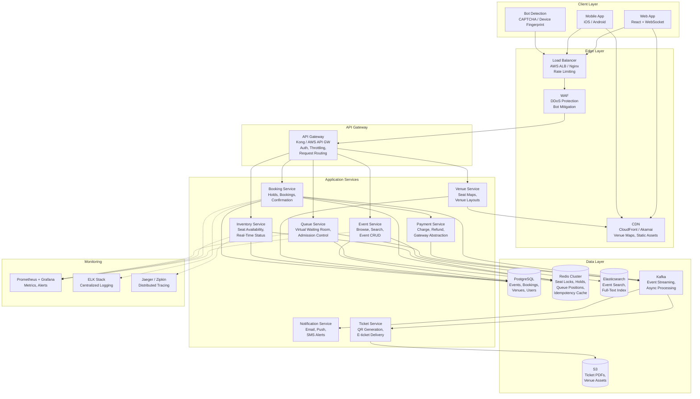
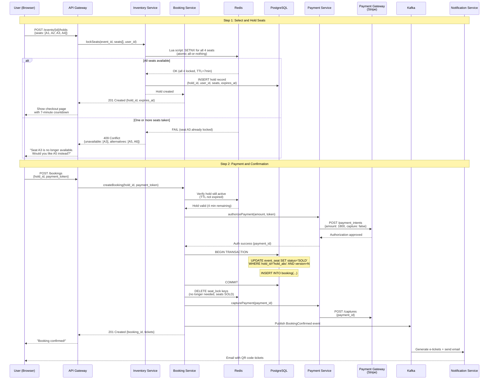
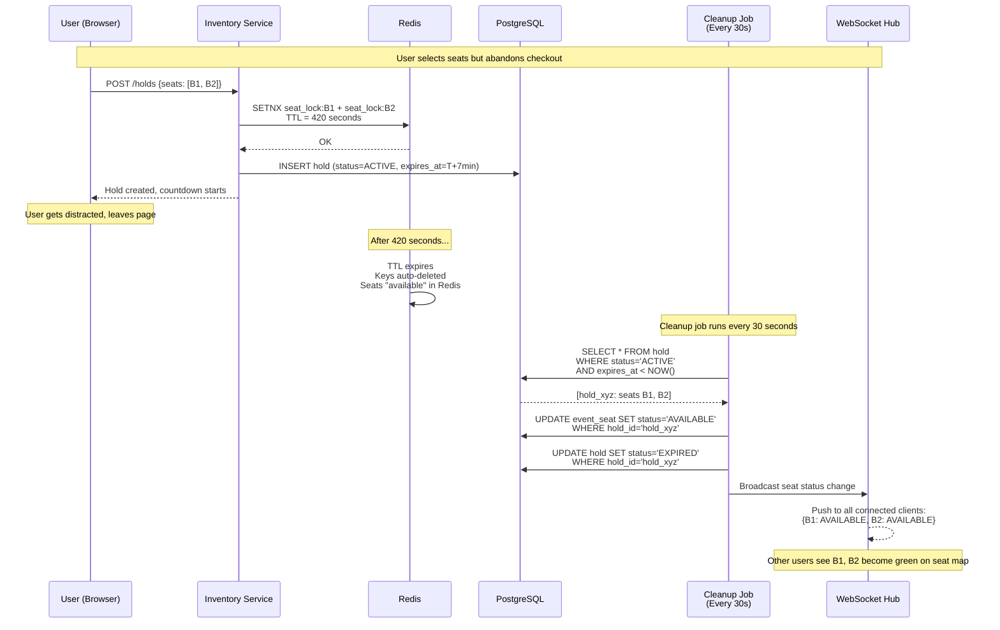
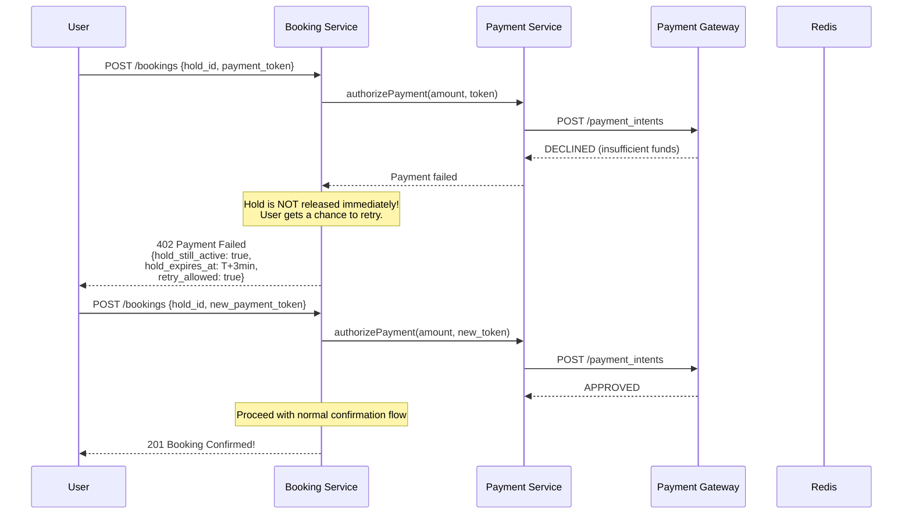
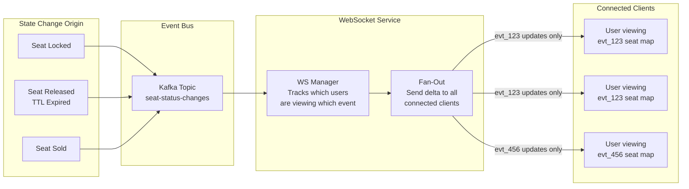
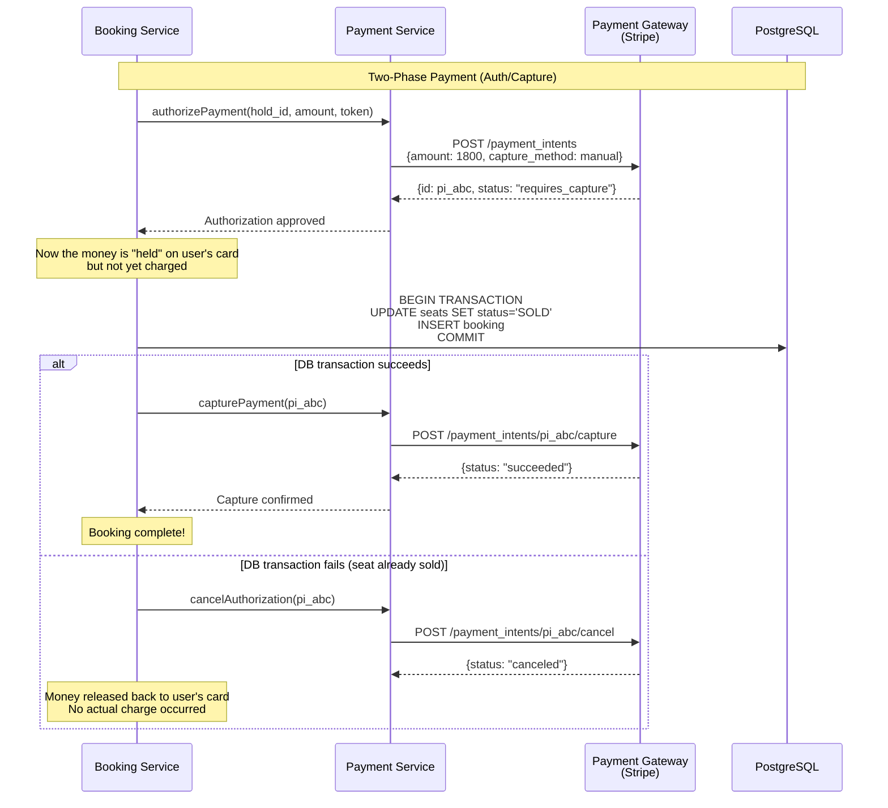
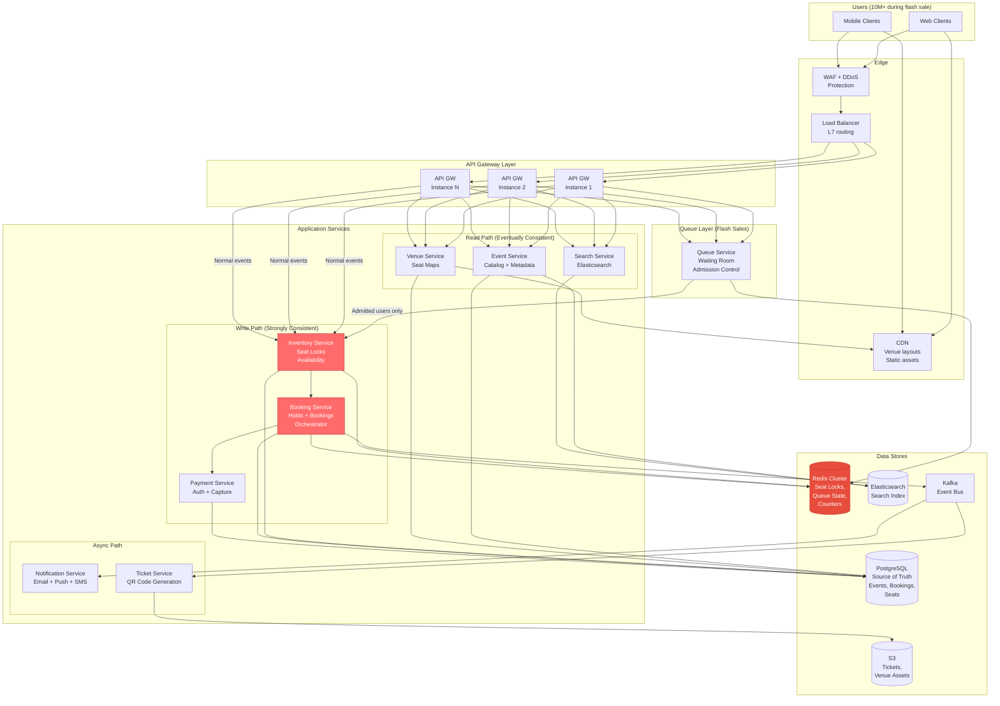

# Design Ticketmaster / Event Booking System -- High-Level Design

## Table of Contents
- [2.1 System Architecture Overview](#21-system-architecture-overview)
- [2.2 Core Services](#22-core-services)
- [2.3 The Seat Locking Strategy -- The Heart of the System](#23-the-seat-locking-strategy----the-heart-of-the-system)
- [2.4 Booking Flow -- End to End](#24-booking-flow----end-to-end)
- [2.5 Flash Sale Handling -- Virtual Waiting Room](#25-flash-sale-handling----virtual-waiting-room)
- [2.6 Inventory Management -- Real-Time Seat Availability](#26-inventory-management----real-time-seat-availability)
- [2.7 Search and Discovery](#27-search-and-discovery)
- [2.8 Payment Integration](#28-payment-integration)
- [2.9 Hold Expiration and Cleanup](#29-hold-expiration-and-cleanup)
- [2.10 Complete Architecture with Data Flow](#210-complete-architecture-with-data-flow)

---

## 2.1 System Architecture Overview



### Architecture Principles

The architecture follows five guiding principles:

1. **Separate read and write paths**: Browse/search (reads) and booking (writes) have
   fundamentally different consistency requirements and traffic patterns. They scale
   independently.

2. **Lock fast, confirm slow**: Seat locking must be sub-100ms (Redis). Payment confirmation
   can take seconds (database + payment gateway). The temporary hold bridges this gap.

3. **Graceful degradation under load**: When flash sale traffic exceeds capacity, the virtual
   waiting room absorbs the surge. Users wait in a queue rather than getting errors.

4. **Defense in depth for overselling**: Multiple layers prevent double-booking -- Redis SETNX
   for speed, PostgreSQL UNIQUE constraints for correctness, application-level validation
   for user experience.

5. **Event-driven async for non-critical paths**: Ticket generation, email confirmation, and
   analytics happen asynchronously via Kafka. The user does not wait for a PDF to be generated.

---

## 2.2 Core Services

### Event Service

```
┌──────────────────────────────────────────────────────┐
│                   EVENT SERVICE                       │
├──────────────────────────────────────────────────────┤
│                                                      │
│  Responsibilities:                                   │
│  ├── Event CRUD (create, update, list, get)          │
│  ├── Event search and discovery                      │
│  ├── Event lifecycle management                      │
│  │   (DRAFT → PUBLISHED → ON_SALE → COMPLETED)       │
│  ├── On-sale scheduling (trigger queue at sale time) │
│  └── Event metadata and categorization               │
│                                                      │
│  Data Store:                                         │
│  ├── PostgreSQL: event records, artist info           │
│  ├── Elasticsearch: search index (replicated)        │
│  └── Redis: popular event cache (TTL: 60s)           │
│                                                      │
│  Scale Characteristics:                              │
│  ├── Read-heavy (1000:1 read:write)                  │
│  ├── Tolerates eventual consistency                  │
│  ├── CDN-cacheable for popular events                │
│  └── Scales horizontally with read replicas          │
│                                                      │
└──────────────────────────────────────────────────────┘
```

### Venue Service

```
┌──────────────────────────────────────────────────────┐
│                   VENUE SERVICE                       │
├──────────────────────────────────────────────────────┤
│                                                      │
│  Responsibilities:                                   │
│  ├── Venue registration and metadata                 │
│  ├── Seat map layouts (sections, rows, seats)        │
│  ├── SVG/JSON seat map rendering data                │
│  ├── Seat attributes (type, accessibility, coords)   │
│  └── Price tier configuration per section            │
│                                                      │
│  Data Store:                                         │
│  ├── PostgreSQL: venue and seat master data           │
│  ├── S3: SVG layouts, venue images                   │
│  └── CDN: cached seat map assets                     │
│                                                      │
│  Key Insight:                                        │
│  Venue data is nearly static. A venue layout changes │
│  maybe once a year. This is aggressively cached:     │
│  ├── CDN: TTL 24 hours for SVG layouts               │
│  ├── Application cache: venue + seat records         │
│  └── Only AVAILABILITY is dynamic (from Inventory)   │
│                                                      │
└──────────────────────────────────────────────────────┘
```

### Inventory Service (Critical Path)

```
┌──────────────────────────────────────────────────────┐
│                INVENTORY SERVICE                      │
├──────────────────────────────────────────────────────┤
│                                                      │
│  Responsibilities:                                   │
│  ├── Real-time seat availability tracking            │
│  ├── Seat status management (AVAILABLE/HELD/SOLD)    │
│  ├── Seat lock acquisition (SETNX with TTL)          │
│  ├── Lock release (explicit or TTL expiry)           │
│  ├── Availability aggregation per section            │
│  └── WebSocket push for seat status changes          │
│                                                      │
│  Data Store:                                         │
│  ├── Redis (primary): real-time seat status           │
│  │   Key: "seat:{event_id}:{seat_id}"               │
│  │   Value: {status, hold_id, user_id, expires_at}  │
│  │   TTL: set on HELD seats (7 min default)          │
│  └── PostgreSQL (source of truth): persisted status   │
│                                                      │
│  THIS IS THE MOST CRITICAL SERVICE:                  │
│  ├── Handles the concurrent seat locking problem     │
│  ├── Must be strongly consistent                     │
│  ├── Single Redis SETNX = atomic lock acquisition    │
│  └── All other services depend on its correctness    │
│                                                      │
│  Performance Budget:                                 │
│  ├── Lock acquisition: < 10ms (Redis SETNX)          │
│  ├── Status read: < 5ms (Redis GET)                  │
│  ├── Availability query: < 50ms (Redis MGET)         │
│  └── WebSocket push: < 100ms after state change      │
│                                                      │
└──────────────────────────────────────────────────────┘
```

### Booking Service

```
┌──────────────────────────────────────────────────────┐
│                 BOOKING SERVICE                       │
├──────────────────────────────────────────────────────┤
│                                                      │
│  Responsibilities:                                   │
│  ├── Orchestrates the full booking workflow           │
│  │   (hold → validate → pay → confirm)               │
│  ├── Hold creation and management                    │
│  ├── Booking confirmation with DB transaction         │
│  ├── Idempotency enforcement                         │
│  ├── Hold timeout handling                           │
│  └── Booking status queries                          │
│                                                      │
│  Workflow:                                           │
│  1. Receive hold request                             │
│  2. Call Inventory Service to lock seats              │
│  3. Create hold record in PostgreSQL                  │
│  4. Return hold_id + countdown to client             │
│  5. Receive booking request with hold_id             │
│  6. Validate hold is still active                    │
│  7. Call Payment Service to charge                   │
│  8. On success: update seat status to SOLD           │
│  9. Publish booking event to Kafka                   │
│  10. On failure: release hold, notify user           │
│                                                      │
│  Idempotency:                                        │
│  ├── Idempotency key stored in Redis (24h TTL)       │
│  ├── Duplicate requests return cached response       │
│  └── PostgreSQL UNIQUE on idempotency_key as backup  │
│                                                      │
└──────────────────────────────────────────────────────┘
```

### Payment Service

```
┌──────────────────────────────────────────────────────┐
│                 PAYMENT SERVICE                       │
├──────────────────────────────────────────────────────┤
│                                                      │
│  Responsibilities:                                   │
│  ├── Payment gateway abstraction (Stripe, Adyen)     │
│  ├── Charge processing                               │
│  ├── Refund processing                               │
│  ├── Payment status tracking                         │
│  ├── PCI compliance boundary                         │
│  └── Webhook handling for async payment results      │
│                                                      │
│  Integration Pattern:                                │
│  ├── Synchronous: charge request → gateway → result  │
│  ├── Async fallback: webhook for delayed results     │
│  └── Timeout: 30 seconds, then treat as pending      │
│                                                      │
│  Key Design Decision:                                │
│  The Payment Service is called AFTER the hold is     │
│  acquired. If payment takes 5 seconds, the hold      │
│  (7 min TTL) protects the seats. If payment fails,   │
│  the hold remains until the user retries or it       │
│  expires naturally.                                  │
│                                                      │
│  Payment Flow Options:                               │
│  ├── Option A: AUTH → CAPTURE (two-step)             │
│  │   Auth when seats held, capture when confirmed    │
│  │   Better: reduces refunds if user abandons        │
│  └── Option B: CHARGE (one-step)                     │
│      Simpler but requires refund on cancellation     │
│                                                      │
│  We choose Option A (auth/capture) for production.   │
│                                                      │
└──────────────────────────────────────────────────────┘
```

### Queue Service (Virtual Waiting Room)

```
┌──────────────────────────────────────────────────────┐
│            QUEUE SERVICE (WAITING ROOM)               │
├──────────────────────────────────────────────────────┤
│                                                      │
│  Responsibilities:                                   │
│  ├── Manage virtual waiting room for flash sales     │
│  ├── Assign queue positions to users                 │
│  ├── Control admission rate (users per batch)        │
│  ├── Issue time-limited access tokens                │
│  ├── Expire unused access tokens                     │
│  └── Track queue drain rate and adjust admission     │
│                                                      │
│  Data Store:                                         │
│  ├── Redis Sorted Set: queue positions               │
│  │   Key: "queue:{event_id}"                         │
│  │   Score: position (random or arrival time)        │
│  │   Member: user_id                                 │
│  └── Redis Hash: access tokens with TTL              │
│                                                      │
│  Admission Algorithm:                                │
│  ├── Batch size: 200-500 users every 30 seconds      │
│  ├── Adaptive: increase batch if booking rate high   │
│  ├── Decrease batch if inventory getting low         │
│  └── Stop admitting when all seats held or sold      │
│                                                      │
│  Anti-Bot Measures:                                  │
│  ├── CAPTCHA challenge before queue entry             │
│  ├── Device fingerprinting                           │
│  ├── Rate limiting per IP and user_id                │
│  ├── Random queue position (not purely FIFO)         │
│  └── One queue entry per user per event              │
│                                                      │
└──────────────────────────────────────────────────────┘
```

### Search Service

```
┌──────────────────────────────────────────────────────┐
│                  SEARCH SERVICE                       │
├──────────────────────────────────────────────────────┤
│                                                      │
│  Responsibilities:                                   │
│  ├── Full-text search across events and artists      │
│  ├── Geo-based event discovery                       │
│  ├── Faceted search (genre, date, price, venue)      │
│  ├── Autocomplete / typeahead suggestions            │
│  └── Search ranking and relevance tuning             │
│                                                      │
│  Architecture:                                       │
│  ├── Elasticsearch cluster (3+ data nodes)           │
│  ├── Index: events, artists, venues                  │
│  ├── Replication: CDC from PostgreSQL via Kafka       │
│  ├── Lag: < 30 seconds (acceptable for discovery)    │
│  └── Sharding: by region for geo-queries             │
│                                                      │
│  Index Schema:                                       │
│  {                                                   │
│    "event_name": "text",                             │
│    "artist_name": "text",                            │
│    "venue_name": "text",                             │
│    "city": "keyword",                                │
│    "location": "geo_point",                          │
│    "date": "date",                                   │
│    "genre": "keyword",                               │
│    "price_min": "float",                             │
│    "availability": "keyword",                        │
│    "popularity_score": "float"                       │
│  }                                                   │
│                                                      │
└──────────────────────────────────────────────────────┘
```

---

## 2.3 The Seat Locking Strategy -- The Heart of the System

This is the single most important design decision in the entire system. When two users
click the same seat at the same instant, exactly one must win and the other must be told
immediately that the seat is unavailable.

### Why This Is Hard

```
The Race Condition:

  Time    User A                  Server                  User B
  ─────────────────────────────────────────────────────────────────
  T+0ms   Click seat 101-A-5 ──►                    ◄── Click seat 101-A-5
  T+1ms                          Check: is 101-A-5 available?
  T+1ms                          Check: is 101-A-5 available?
  T+2ms                          Both checks return YES (race!)
  T+3ms                          Lock seat for User A
  T+3ms                          Lock seat for User B   ← DOUBLE BOOKING!

  Without atomic operations, both users "win" the seat.
  This is the textbook lost-update problem.
```

### Solution: Redis SETNX (SET if Not eXists) with TTL

```
Atomic Seat Locking with Redis:

  The SETNX command is atomic -- Redis is single-threaded and processes one
  command at a time. Two concurrent SETNX on the same key: exactly one succeeds.

  Lock Acquisition:
  ────────────────
  Key:    "seat_lock:{event_id}:{seat_id}"
  Value:  "{hold_id}:{user_id}:{timestamp}"
  TTL:    420 seconds (7 minutes)

  Command:
    SET seat_lock:evt123:sec101_A_5 "hold_abc:usr_A:1714560000" NX EX 420

  Returns:
    OK     → Lock acquired (User A wins)
    (nil)  → Lock already held (User B loses, gets 409 Conflict)

  Lock Release (explicit):
  ────────────────────────
  Use a Lua script to ensure only the lock owner can release:

    if redis.call("get", KEYS[1]) == ARGV[1] then
        return redis.call("del", KEYS[1])
    else
        return 0
    end

  Lock Release (automatic):
  ────────────────────────
  Redis TTL handles this automatically. After 420 seconds,
  the key expires and the seat becomes available for others.
```

### Multi-Seat Atomic Locking

When a user selects 4 seats together, we must lock all 4 atomically -- locking 3 out of 4
leaves the user unable to book and blocks those seats for others.

```
Multi-Seat Locking via Lua Script:

  -- Lua script executed atomically in Redis
  -- KEYS = ["seat_lock:evt123:s1", "seat_lock:evt123:s2", 
  --         "seat_lock:evt123:s3", "seat_lock:evt123:s4"]
  -- ARGV = ["hold_abc:usr_A:1714560000", "420"]

  -- Phase 1: Check all seats are available
  for i, key in ipairs(KEYS) do
      if redis.call("exists", key) == 1 then
          -- At least one seat is taken, fail the entire operation
          return {0, key}  -- returns which seat blocked
      end
  end

  -- Phase 2: Lock all seats (we know all are free)
  for i, key in ipairs(KEYS) do
      redis.call("set", key, ARGV[1], "EX", tonumber(ARGV[2]))
  end

  return {1, "OK"}  -- all seats locked successfully


  Why Lua?
  ─────────
  Redis executes Lua scripts atomically (single-threaded model).
  No other command can interleave between the EXISTS checks and SETs.
  This gives us all-or-nothing multi-seat locking without distributed
  transactions.
```

### Locking Strategy Comparison

```
┌────────────────────┬──────────────────────┬──────────────────────┬──────────────────────┐
│    Strategy        │   Redis SETNX        │   DB Optimistic Lock │  Distributed Lock    │
│                    │   (our primary)       │   (our backup)       │  (Redlock)           │
├────────────────────┼──────────────────────┼──────────────────────┼──────────────────────┤
│ Latency            │ < 5ms                │ 20-50ms              │ 50-100ms             │
│ Throughput         │ ~100K ops/sec        │ ~5K ops/sec          │ ~1K ops/sec          │
│ Atomicity          │ Single-key atomic    │ Row-level locks      │ Multi-node consensus │
│ Durability         │ Volatile (RAM)       │ Durable (disk)       │ Semi-durable         │
│ Failure mode       │ Redis crash = lost   │ Safe                 │ Clock drift issues   │
│ Complexity         │ Simple               │ Simple               │ Complex              │
│ Multi-seat         │ Lua script           │ SELECT FOR UPDATE    │ Multiple lock calls  │
│ Auto-expiry        │ Native TTL           │ Needs cleanup job    │ Needs cleanup        │
├────────────────────┼──────────────────────┼──────────────────────┼──────────────────────┤
│ Use Case           │ Primary fast path    │ Fallback + confirm   │ Cross-datacenter     │
└────────────────────┴──────────────────────┴──────────────────────┴──────────────────────┘

Our Approach: BOTH Redis SETNX (speed) + PostgreSQL constraint (safety)
  - Redis is the fast path: sub-5ms lock check
  - PostgreSQL is the safety net: UNIQUE constraint prevents double-booking
    even if Redis fails or has stale data
  - This is defense in depth, not redundancy
```

### Database-Level Safety Net

```sql
-- Even if Redis fails, PostgreSQL prevents overselling:

-- Booking confirmation transaction
BEGIN;

-- Attempt to update seat status from HELD to SOLD
UPDATE event_seat
SET status = 'SOLD',
    booking_id = 'bk_xyz789',
    hold_id = NULL,
    held_until = NULL,
    version = version + 1
WHERE event_id = 'evt_123'
  AND seat_id = 'sec101_A_5'
  AND status = 'HELD'
  AND hold_id = 'hold_abc123'           -- must match the hold owner
  AND version = 3;                       -- optimistic concurrency check

-- If affected_rows = 0, someone else already booked or hold expired
-- ROLLBACK and return error to user

-- If affected_rows = 1, seat is now SOLD
COMMIT;

-- The WHERE clause is the safety net:
--   status = 'HELD'     → seat was not already SOLD
--   hold_id = hold_abc  → only the hold owner can convert
--   version = 3         → no concurrent modification
```

---

## 2.4 Booking Flow -- End to End

### Sequence Diagram: Happy Path



### Sequence Diagram: Hold Expiration



### Sequence Diagram: Payment Failure



### State Machine: Seat Lifecycle

```
                    Seat Status State Machine
    ┌─────────────────────────────────────────────────────┐
    │                                                     │
    │                                                     │
    │   ┌──────────┐    User selects    ┌──────────┐      │
    │   │          │    seat (SETNX)    │          │      │
    │   │AVAILABLE ├───────────────────►│  HELD    │      │
    │   │          │                    │          │      │
    │   └─────▲────┘                    └───┬──┬───┘      │
    │         │                             │  │          │
    │         │    TTL expires              │  │          │
    │         │    User cancels             │  │          │
    │         │    Payment fails            │  │ Payment  │
    │         │    (after retries)          │  │ succeeds │
    │         │                             │  │          │
    │         └─────────────────────────────┘  │          │
    │                                          │          │
    │                                          ▼          │
    │                                     ┌──────────┐    │
    │                                     │          │    │
    │                                     │  SOLD    │    │
    │                                     │          │    │
    │                                     └──────────┘    │
    │                                                     │
    │   Transitions:                                      │
    │   AVAILABLE → HELD : Redis SETNX (atomic)           │
    │   HELD → AVAILABLE : TTL expiry or explicit release │
    │   HELD → SOLD      : Successful payment + DB commit │
    │   SOLD → (terminal) : Seat is permanently booked    │
    │                                                     │
    │   Note: SOLD → AVAILABLE only via refund flow       │
    │   (separate system, not in main booking path)       │
    └─────────────────────────────────────────────────────┘
```

---

## 2.5 Flash Sale Handling -- Virtual Waiting Room

### Why a Waiting Room Is Necessary

```
Without a Waiting Room (Direct Access):

  10,000,000 users hit the booking page simultaneously
  ├── 10M seat map requests → servers overwhelmed
  ├── 5M lock attempts → Redis hammered
  ├── Most users get 503 errors → rage and bad press
  ├── Bot operators with faster scripts get all seats
  └── Legitimate fans have almost zero chance

With a Virtual Waiting Room:

  10,000,000 users enter the queue
  ├── Queue service handles position assignment (lightweight)
  ├── 500 users admitted every 30 seconds
  ├── Admitted users have low-contention access to seats
  ├── Bots thwarted by CAPTCHA at queue entry
  ├── Fair ordering (randomized to prevent bot advantage)
  └── Clear communication: "You are #45,231 in line"
```

### Virtual Waiting Room Architecture

```mermaid
graph TB
    subgraph "User Request Flow"
        U1[User 1]
        U2[User 2]
        U3[User 3]
        UN[User N<br/>10M users]
    end

    subgraph "Queue Entry Gate"
        CAP[CAPTCHA<br/>Challenge]
        RL[Rate Limiter<br/>Per IP / Per User]
        QE[Queue Entry<br/>Endpoint]
    end

    subgraph "Queue Service"
        QM[Queue Manager]
        RS[Redis Sorted Set<br/>Key: queue:{event_id}<br/>Score: random position<br/>Member: user_id]
        AC[Admission Controller<br/>Batch size: 500<br/>Interval: 30s<br/>Adaptive rate]
        TG[Token Generator<br/>JWT with 10-min expiry]
    end

    subgraph "Booking Service (Gated)"
        TV[Token Validator<br/>Verify JWT signature<br/>Check not expired<br/>Check not reused]
        SEAT[Seat Selection<br/>Only for admitted users]
        PAY[Payment Flow]
    end

    subgraph "Feedback Loop"
        INV[Inventory Monitor<br/>Track remaining seats]
        DRAIN[Drain Rate Calculator<br/>Bookings per minute]
    end

    U1 --> CAP
    U2 --> CAP
    U3 --> CAP
    UN --> CAP
    CAP --> RL
    RL --> QE
    QE --> QM

    QM --> RS
    AC --> RS
    AC --> TG
    TG --> TV
    TV --> SEAT
    SEAT --> PAY

    INV --> AC
    DRAIN --> AC

    PAY -->|"Booking complete<br/>or timeout"| DRAIN
    INV -->|"Seats remaining"| AC
```

### Queue Position Assignment

```
Queue Position Strategies:

  Strategy 1: FIFO (First In, First Out)
  ──────────────────────────────────────
  Score = arrival_timestamp_microseconds
  
  Problem: Bots with faster network connections always arrive first.
  Advantage of NYC datacenter proximity over rural Montana user.
  
  Strategy 2: Randomized (Our Choice)
  ────────────────────────────────────
  Score = random_float(0, 1)
  
  Fair: everyone has equal probability of a good position.
  Bots cannot gain advantage by sending requests faster.
  Downside: "I was here first!" user perception issue.
  
  Strategy 3: Hybrid (Weighted Random)
  ────────────────────────────────────
  Score = arrival_time_bucket * 0.3 + random_float * 0.7
  
  Gives some weight to arrival time (feels fair to users)
  but randomness still prevents bot dominance.
  
  Strategy 4: Verified Fan Priority
  ─────────────────────────────────
  (Ticketmaster's actual approach)
  Pre-registered "Verified Fans" get priority queue positions.
  Registration requires account history, purchase history, etc.
  Bots cannot easily fake verified fan status.
  
  Score = is_verified ? random(0, 0.5) : random(0.5, 1.0)


Redis Implementation:
  ZADD queue:evt_123 0.73291 "usr_A"   -- User A gets position 0.73
  ZADD queue:evt_123 0.12847 "usr_B"   -- User B gets position 0.13 (lower = closer to front)
  ZADD queue:evt_123 0.45923 "usr_C"   -- User C gets position 0.46

  To admit next batch of 500:
  ZPOPMIN queue:evt_123 500
  → Returns 500 users with lowest scores (closest to front)
```

### Admission Control Algorithm

```python
# Pseudocode: Adaptive Admission Controller

class AdmissionController:
    def __init__(self, event_id):
        self.event_id = event_id
        self.base_batch_size = 500
        self.batch_interval_sec = 30
        self.min_batch = 100
        self.max_batch = 2000

    def calculate_next_batch_size(self):
        # Get current state
        remaining_seats = inventory.get_available_count(self.event_id)
        active_holds = inventory.get_held_count(self.event_id)
        queue_size = redis.zcard(f"queue:{self.event_id}")
        recent_booking_rate = metrics.get_bookings_per_minute(self.event_id)
        recent_hold_conversion = metrics.get_hold_to_booking_ratio(self.event_id)

        # If few seats remain, slow down admission
        if remaining_seats < 500:
            return self.min_batch

        # If lots of active holds (users in checkout), slow down
        # to avoid holding more seats than available
        headroom = remaining_seats - active_holds
        if headroom < 1000:
            return max(self.min_batch, headroom // 4)

        # If conversion rate is high, we can admit more aggressively
        if recent_hold_conversion > 0.8:
            return min(self.max_batch, self.base_batch_size * 2)

        # Default: base batch size
        return self.base_batch_size

    def admit_batch(self):
        batch_size = self.calculate_next_batch_size()
        # Pop the next N users from the sorted set
        admitted_users = redis.zpopmin(f"queue:{self.event_id}", batch_size)

        for user_id in admitted_users:
            # Generate a JWT access token
            token = jwt.encode({
                "user_id": user_id,
                "event_id": self.event_id,
                "exp": now() + timedelta(minutes=10),
                "scope": "booking"
            }, secret_key)

            # Store token in Redis for validation
            redis.setex(f"access_token:{self.event_id}:{user_id}", 600, token)

            # Notify user via WebSocket or push
            websocket.send(user_id, {
                "type": "QUEUE_ADMITTED",
                "access_token": token,
                "expires_in": 600
            })
```

---

## 2.6 Inventory Management -- Real-Time Seat Availability

### Dual-Store Architecture

```
Real-Time Inventory: Redis (Speed) + PostgreSQL (Durability)

  ┌─────────────────────────────────────────────────────────────────┐
  │                                                                 │
  │   Redis (Primary for reads and locks)                           │
  │   ─────────────────────────────────                             │
  │   seat_lock:evt123:sec101_A_1 = "hold_abc:usr_A:ts"  TTL:420  │
  │   seat_lock:evt123:sec101_A_2 = "hold_abc:usr_A:ts"  TTL:420  │
  │   seat_lock:evt123:sec101_A_3 = (nil)  ← AVAILABLE             │
  │   seat_lock:evt123:sec101_A_4 = "SOLD:bk_xyz"  TTL:none       │
  │                                                                 │
  │   seat_count:evt123:available = 12450                           │
  │   seat_count:evt123:held = 3200                                 │
  │   seat_count:evt123:sold = 5139                                 │
  │                                                                 │
  │   Pros: Sub-5ms reads, atomic operations, auto-TTL for holds   │
  │   Cons: Volatile, may lose data on crash                        │
  │                                                                 │
  ├─────────────────────────────────────────────────────────────────┤
  │                                                                 │
  │   PostgreSQL (Source of truth)                                  │
  │   ─────────────────────────────                                 │
  │   event_seat table:                                             │
  │   (evt123, sec101_A_1) status=HELD, hold_id=hold_abc           │
  │   (evt123, sec101_A_2) status=HELD, hold_id=hold_abc           │
  │   (evt123, sec101_A_3) status=AVAILABLE                        │
  │   (evt123, sec101_A_4) status=SOLD, booking_id=bk_xyz          │
  │                                                                 │
  │   Pros: Durable, ACID transactions, constraints prevent bugs   │
  │   Cons: 20-50ms per query, lower throughput                     │
  │                                                                 │
  ├─────────────────────────────────────────────────────────────────┤
  │                                                                 │
  │   Consistency Strategy:                                         │
  │   1. Lock attempt: Redis SETNX (fast, optimistic)               │
  │   2. Hold creation: write to PostgreSQL (durable record)        │
  │   3. Booking confirm: PostgreSQL transaction (source of truth)  │
  │   4. After confirm: update Redis (sync back)                    │
  │   5. On Redis crash: rebuild from PostgreSQL                    │
  │                                                                 │
  │   Redis is a CACHE of PostgreSQL state, not the other way.      │
  │   If Redis and PostgreSQL disagree, PostgreSQL wins.            │
  │                                                                 │
  └─────────────────────────────────────────────────────────────────┘
```

### Seat Availability Aggregation

```
Per-Section Availability (for seat map rendering):

  When a user opens the seat map, they need per-section summary:
  "Section 101: 12 available, Section 102: 0 available (sold out)"

  Approach 1: Count in real-time
  ──────────────────────────────
  KEYS seat_lock:evt123:sec101_*
  Count keys vs total seats in section 101
  Problem: KEYS command is O(N), blocks Redis on large events

  Approach 2: Maintain counters (Our Choice)
  ──────────────────────────────────────────
  Alongside individual seat locks, maintain atomic counters:

  On seat lock:
    INCR seat_count:evt123:sec101:held
    DECR seat_count:evt123:sec101:available

  On seat sold:
    DECR seat_count:evt123:sec101:held
    INCR seat_count:evt123:sec101:sold

  On hold expiry:
    DECR seat_count:evt123:sec101:held
    INCR seat_count:evt123:sec101:available

  Reading section availability: O(1) per section
  Total for a 20-section venue: 60 GETS (20 sections x 3 counters)
  < 5ms total

  Approach 3: Periodic materialization
  ────────────────────────────────────
  Every 5 seconds, a background job scans PostgreSQL and updates
  a materialized availability summary. Used as a fallback if
  Redis counters drift.
```

### WebSocket Real-Time Updates



```
WebSocket Message Format:

  Server → Client (delta update, every 1-3 seconds):
  {
    "type": "AVAILABILITY_DELTA",
    "event_id": "evt_123",
    "timestamp": "2026-05-01T10:02:35.123Z",
    "changes": [
      {"seat_id": "sec101_A_1", "status": "HELD"},
      {"seat_id": "sec101_A_5", "status": "AVAILABLE"},
      {"seat_id": "sec102_B_3", "status": "SOLD"}
    ],
    "section_summary": {
      "sec101": {"available": 11, "held": 6, "sold": 3},
      "sec102": {"available": 0, "held": 0, "sold": 20}
    }
  }

  Batching Strategy:
  - Accumulate changes for 1-2 seconds before pushing
  - During flash sales, push every 500ms for faster updates
  - Include section summary in every push (so clients don't
    need to maintain perfect running counts)
```

---

## 2.7 Search and Discovery

```mermaid
graph TB
    subgraph "Search Flow"
        U[User: "Taylor Swift NYC"]
        GW[API Gateway]
        ES_SVC[Event Service]
        ELS[Elasticsearch<br/>Full-Text Index]
        CACHE[Redis Cache<br/>Popular queries<br/>TTL: 60s]
    end

    subgraph "Index Pipeline"
        PG[(PostgreSQL<br/>Event Table)]
        CDC[Change Data Capture<br/>Debezium / WAL reader]
        KF[Kafka<br/>event-changes topic]
        IDX[Indexer<br/>Upsert to ES]
    end

    U --> GW
    GW --> ES_SVC
    ES_SVC --> CACHE
    CACHE -->|miss| ELS
    ELS --> ES_SVC
    ES_SVC --> GW
    GW --> U

    PG --> CDC
    CDC --> KF
    KF --> IDX
    IDX --> ELS
```

```
Search Query Example:

  User types: "Taylor Swift New York summer"

  Elasticsearch Query:
  {
    "query": {
      "bool": {
        "must": [
          {"multi_match": {
            "query": "Taylor Swift",
            "fields": ["event_name^3", "artist_name^5", "genre"]
          }}
        ],
        "filter": [
          {"term": {"city": "New York"}},
          {"range": {"date": {"gte": "2026-06-01", "lte": "2026-08-31"}}},
          {"term": {"status": "ON_SALE"}}
        ],
        "should": [
          {"range": {"popularity_score": {"gte": 0.8, "boost": 2.0}}}
        ]
      }
    },
    "sort": [
      {"_score": "desc"},
      {"date": "asc"}
    ]
  }

  Result ranking factors:
  1. Text relevance (artist name match weighted 5x)
  2. Popularity score (high-demand events ranked higher)
  3. Date proximity (sooner events ranked higher)
  4. Availability (events with remaining seats ranked higher)
```

---

## 2.8 Payment Integration

### Payment Flow: Authorize then Capture



```
Why Auth/Capture (not direct charge)?

  Direct Charge Problems:
  ├── If we charge first, then DB fails → need to refund
  ├── Refunds take 5-10 business days
  ├── User sees charge + refund on statement → confusion
  └── Refund processing costs money (gateway fees)

  Auth/Capture Advantages:
  ├── Auth "holds" money on card (no actual charge)
  ├── If DB fails, we cancel the auth → nothing on statement
  ├── Capture only happens after seats confirmed in DB
  ├── Auth holds typically last 7 days (plenty of time)
  └── No refund needed on failure
```

---

## 2.9 Hold Expiration and Cleanup

### Multi-Layer Expiration Strategy

```
Layer 1: Redis TTL (Primary, Automatic)
──────────────────────────────────────────
  When a seat is locked: SET key value EX 420
  Redis automatically deletes the key after 420 seconds.
  This is the fastest path for releasing held seats.

  Pros: Automatic, no extra infrastructure
  Cons: Only frees Redis keys; PostgreSQL still shows HELD

Layer 2: Cleanup Job (Secondary, Catches Drift)
──────────────────────────────────────────────────
  A scheduled job runs every 30 seconds:

  1. Query PostgreSQL:
     SELECT hold_id, seats
     FROM hold
     WHERE status = 'ACTIVE'
       AND expires_at < NOW() - INTERVAL '5 seconds'
     LIMIT 100;

  2. For each expired hold:
     - UPDATE event_seat SET status='AVAILABLE' WHERE hold_id=?
     - UPDATE hold SET status='EXPIRED' WHERE hold_id=?
     - Publish seat availability change to Kafka
     - DEL Redis key (if not already expired)

  Pros: Catches cases where Redis TTL is slightly off
  Cons: Up to 30-second delay after TTL for DB cleanup

Layer 3: On-Access Check (Tertiary, Defensive)
──────────────────────────────────────────────────
  When any service reads seat status:
  - If Redis says AVAILABLE but DB says HELD:
    - Check if hold has expired (expires_at < NOW())
    - If expired, update DB to AVAILABLE (lazy cleanup)
    - If not expired, re-set Redis key (heal the cache)

  This is the defensive catch-all for any inconsistency.
```

### Hold Expiration Timeline

```
Hold Lifecycle Timeline:

  T+0:00    User clicks "Select Seats"
            ├── Redis: SETNX with TTL=420s
            └── PostgreSQL: INSERT hold (expires_at = T+7:00)

  T+0:00    Checkout page shown with 7:00 countdown
  to
  T+5:00    User is filling in payment details

  T+5:30    User clicks "Pay Now"
            ├── Check: hold still active? YES (1:30 remaining)
            ├── Process payment (takes ~3 seconds)
            └── Confirm booking at T+5:33

  ── OR ──

  T+7:00    User never clicked "Pay Now"
            ├── Redis TTL expires → keys deleted
            ├── Client countdown reaches 0:00 → shows "expired" message
            └── Other users can now see seats as available

  T+7:30    Cleanup job runs
            ├── Finds hold with expires_at < NOW()
            ├── Updates PostgreSQL: status → EXPIRED
            ├── Publishes to Kafka: seats available
            └── WebSocket pushes update to all viewers

  T+7:31    Another user sees the seats turn green and selects them
```

---

## 2.10 Complete Architecture with Data Flow



### Request Flow Summary

```
Browse Flow (Read Path):
  User → CDN → LB → API GW → Event Service → Elasticsearch → Response
  Latency: < 200ms | Consistency: Eventual | Scale: Read replicas

Seat Map Flow:
  User → CDN (layout) + API GW → Inventory Service → Redis → Response
  Latency: < 100ms | Consistency: Near-real-time | Scale: Redis cluster

Booking Flow (Write Path):
  User → LB → API GW → Inventory Service → Redis SETNX
       → Booking Service → PostgreSQL → Payment Service → Confirm
  Latency: 2-5 seconds | Consistency: Strong | Scale: Partition by event

Flash Sale Flow:
  User → LB → API GW → Queue Service (waiting room) → Admission
       → Inventory Service → Booking Service → Payment → Confirm
  Latency: Minutes (queue wait) + seconds (booking)
  Scale: Queue absorbs 10M users, only 500/batch hit booking services

Notification Flow (Async):
  Booking confirmed → Kafka → Notification Service → Email/SMS
                            → Ticket Service → S3 (PDF) → Email
  Latency: 10-30 seconds | Scale: Kafka partitions, consumer groups
```
