# Design Dropbox / Google Drive -- Deep Dives, Scaling, and Interview Tips

## Complete System Design Interview Walkthrough (Part 3 of 3)

> This document covers the detailed technical deep dives: chunking algorithms,
> sync conflict edge cases, offline reconciliation, metadata DB scaling, bandwidth
> optimization, versioning and garbage collection, monitoring, trade-offs, and
> interview strategies. See Part 1 for requirements/estimation and Part 2 for
> high-level architecture.

---

## Table of Contents

- [Deep Dive 1: Block-Level Sync and Chunking Algorithms](#deep-dive-1-block-level-sync-and-chunking-algorithms)
  - [Fixed-Size Chunking](#fixed-size-chunking)
  - [Content-Defined Chunking with Rolling Hash](#content-defined-chunking-with-rolling-hash)
  - [Fixed vs Content-Defined: Comparison](#fixed-vs-content-defined-comparison)
  - [Deduplication Ratio Calculation](#deduplication-ratio-calculation)
  - [Hash Collision Analysis](#hash-collision-analysis)
- [Deep Dive 2: Sync Conflict Resolution](#deep-dive-2-sync-conflict-resolution)
  - [Edit-Edit Conflict -- Detailed Walkthrough](#edit-edit-conflict----detailed-walkthrough)
  - [Delete-Edit Conflict](#delete-edit-conflict)
  - [Folder Structure Conflicts](#folder-structure-conflicts)
  - [Conflict in Shared Folders](#conflict-in-shared-folders)
  - [Conflict Resolution Summary Matrix](#conflict-resolution-summary-matrix)
- [Deep Dive 3: Offline Editing and Reconciliation](#deep-dive-3-offline-editing-and-reconciliation)
  - [Offline Architecture](#offline-architecture)
  - [Local Operation Queue](#local-operation-queue)
  - [Reconnection Sync Protocol](#reconnection-sync-protocol)
  - [Reconciliation Algorithm](#reconciliation-algorithm)
  - [Edge Cases in Offline Sync](#edge-cases-in-offline-sync)
- [Metadata DB Scaling](#metadata-db-scaling)
  - [Sharding Strategy](#sharding-strategy)
  - [Cross-Shard Operations](#cross-shard-operations)
  - [Read Replicas and Caching](#read-replicas-and-caching)
- [Block Storage at Scale](#block-storage-at-scale)
  - [S3 with Erasure Coding](#s3-with-erasure-coding)
  - [Block Index Scaling](#block-index-scaling)
  - [Storage Cost Optimization](#storage-cost-optimization)
- [Bandwidth Optimization: Delta Sync](#bandwidth-optimization-delta-sync)
  - [How Delta Sync Works](#how-delta-sync-works)
  - [Rolling Checksum Algorithm](#rolling-checksum-algorithm)
  - [Delta Sync Flow](#delta-sync-flow)
  - [When to Use Delta vs Full Block](#when-to-use-delta-vs-full-block)
- [Versioning, Retention, and Garbage Collection](#versioning-retention-and-garbage-collection)
  - [Version Retention Policy](#version-retention-policy)
  - [Garbage Collection Pipeline](#garbage-collection-pipeline)
  - [GC Safety and Race Conditions](#gc-safety-and-race-conditions)
- [Monitoring and Observability](#monitoring-and-observability)
- [Trade-offs and Design Decisions](#trade-offs-and-design-decisions)
- [Interview Tips and Common Follow-Ups](#interview-tips-and-common-follow-ups)

---

## Deep Dive 1: Block-Level Sync and Chunking Algorithms

### Fixed-Size Chunking

The simplest approach: split the file at fixed 4MB boundaries.

```
File (20MB):
Offset:    0         4MB       8MB       12MB      16MB      20MB
           ├─────────┼─────────┼─────────┼─────────┼─────────┤
Block:     │ Block 0 │ Block 1 │ Block 2 │ Block 3 │ Block 4 │
           └─────────┴─────────┴─────────┴─────────┴─────────┘

SHA-256:    a1b2c3    d4e5f6    g7h8i9    j0k1l2    m3n4o5
```

**The insertion problem with fixed-size chunking:**

```
Original file: [AAAA][BBBB][CCCC][DDDD]     -- 4 blocks

User inserts 100 bytes at the very beginning of the file.

New file:      [xAAA][ABBB][BCCC][CDDD][D...]
                ^^^^ All boundaries shifted!

Result: ALL blocks have different content → ALL hashes change → NO dedup!
Inserting 100 bytes causes re-uploading the entire file.
```

This is the fundamental limitation of fixed-size chunking: a small insertion at the
beginning shifts all subsequent block boundaries, destroying dedup effectiveness.

### Content-Defined Chunking with Rolling Hash

Content-defined chunking (CDC) uses the file's content to determine block boundaries
instead of fixed offsets. This makes boundaries resistant to insertions and deletions.

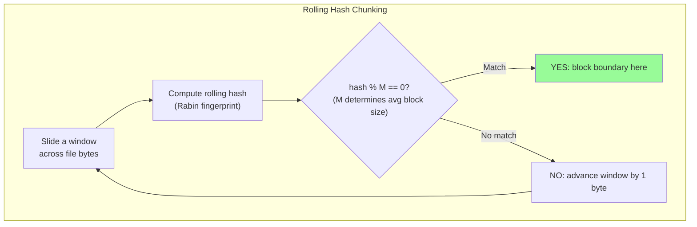

**How it works:**

```
Algorithm: Rabin fingerprint rolling hash

1. Define a window size W (e.g., 48 bytes)
2. Define a target divisor M (e.g., M = 2^22 ≈ 4MB average block size)
3. Slide the window across the file byte by byte
4. At each position, compute: hash = rabin_fingerprint(window)
5. If hash % M == 0: declare a block boundary here
6. The "rolling" property means each hash is O(1) to compute from the previous

Key property: boundaries are determined by LOCAL content (the bytes in the window).
Inserting data before the window doesn't change the boundary positions that follow.
```

**Why CDC solves the insertion problem:**

```
Original file: [AAAA|BBBB|CCCC|DDDD]     (| marks content-defined boundaries)

User inserts 100 bytes at the beginning:

New file:      [xAAA|ABBB|BCCC|CDDD|D]   -- WRONG! This is what fixed-size does.

CDC result:    [x][AAAA|BBBB|CCCC|DDDD]   -- Boundaries stay in same content positions!
                ^
                New small block (100 bytes)

Only 1 new block created. Blocks AAAA, BBBB, CCCC, DDDD are UNCHANGED.
Dedup: 4 out of 5 blocks match → upload only the 100-byte block.
```

**Implementation parameters (Dropbox-like):**

```
Window size:       48 bytes
Hash function:     Rabin fingerprint (polynomial rolling hash)
Target avg size:   4MB (M = 2^22)
Minimum block:     256KB (avoid too-small blocks)
Maximum block:     8MB (avoid too-large blocks)

If no boundary found after 8MB: force a boundary (maximum block size)
If boundary found before 256KB: skip it (minimum block size)
```

### Fixed vs Content-Defined: Comparison

| Aspect | Fixed-Size Chunking | Content-Defined Chunking (CDC) |
|--------|-------------------|-------------------------------|
| **Implementation** | Trivial -- split at N-byte intervals | Moderate -- rolling hash computation |
| **CPU cost** | Negligible | ~5-10% overhead for rolling hash |
| **Dedup after insertion** | Poor -- all subsequent blocks shift | Excellent -- only affected region changes |
| **Dedup after append** | Good -- previous blocks unchanged | Excellent -- previous blocks unchanged |
| **Dedup after edit in middle** | Moderate -- one block changes | Good -- one or two blocks change |
| **Block size variance** | Zero -- all blocks exactly N bytes | Variable (min to max range) |
| **Metadata overhead** | Predictable | Slightly more (variable block sizes) |
| **Used by** | Simple backup tools | Dropbox, restic, Perforce, borgbackup |

> **Interview recommendation:** Mention both approaches. Explain fixed-size first
> (simpler to understand), then explain CDC as the production optimization. Dropbox
> uses fixed-size chunking (4MB) for simplicity, but content-defined chunking is
> used by many advanced dedup systems. Either answer is acceptable in an interview.

### Deduplication Ratio Calculation

```
Dedup ratio = 1 - (unique blocks stored / total block references)

Example calculation for a Dropbox-like system:

Total block references across all users: 100 billion
Unique blocks in storage:                40 billion
Dedup ratio: 1 - (40B / 100B) = 60%

This means 60% of all block uploads are deduplicated (not stored again).

Breakdown by dedup type:
  - Same-user, same-file versioning:      ~25% of total dedup
    (User edits a file; unchanged blocks across versions)
  - Same-user, cross-file:                ~10% of total dedup
    (User has duplicated content across files)
  - Cross-user:                           ~25% of total dedup
    (Multiple users upload same files: installers, libraries, shared docs)
```

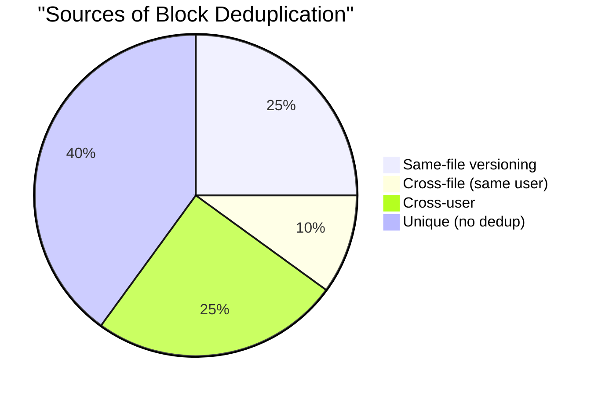

### Hash Collision Analysis

```
SHA-256 collision probability:
  Hash space: 2^256 possible values
  Blocks stored: 40 billion = ~2^35

  Birthday paradox collision probability:
  P(collision) ≈ n^2 / (2 * 2^256)
                = (2^35)^2 / 2^257
                = 2^70 / 2^257
                = 2^(-187)
                ≈ 10^(-56)

  This is astronomically small -- far less likely than hardware failure.
  For comparison, the probability of a cosmic ray flipping a bit in RAM
  is about 10^(-13) per bit per hour -- many orders of magnitude more likely.

  Verdict: SHA-256 collisions are not a practical concern for block dedup.
```

> **If the interviewer asks about hash collisions:** You can mention that some systems
> use a two-stage check: first compare hashes, then byte-compare a small sample of
> the block for extra safety. But emphasize that SHA-256 collisions are practically
> impossible at any realistic scale.

---

## Deep Dive 2: Sync Conflict Resolution

### Edit-Edit Conflict -- Detailed Walkthrough

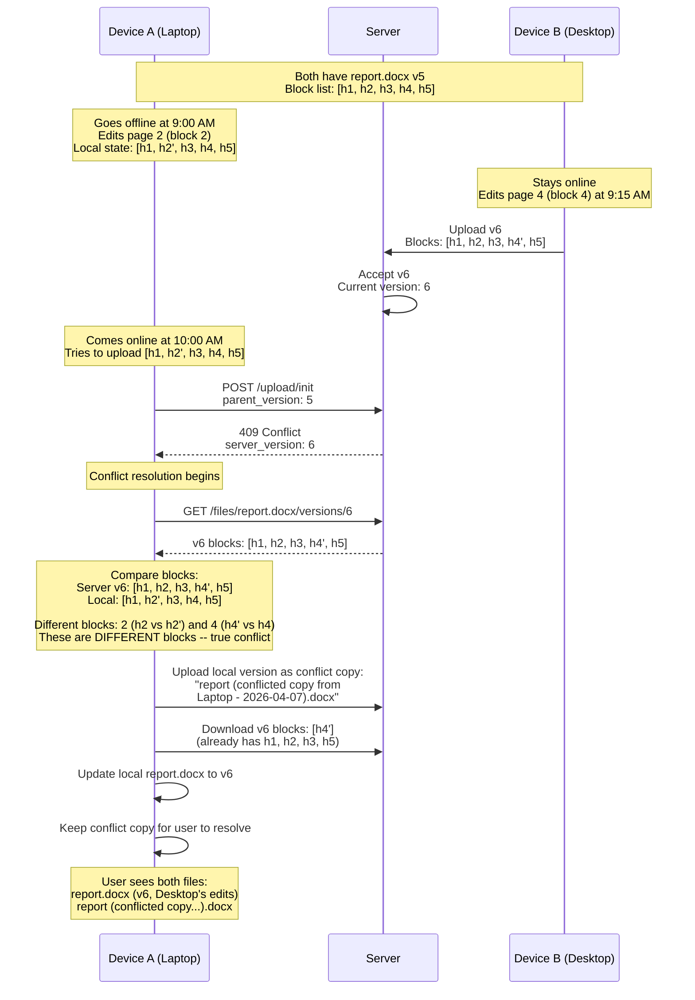

**Optimization -- non-overlapping edits:**

```
In the example above, Device A edited block 2 and Device B edited block 4.
These are non-overlapping changes. An advanced system COULD merge them:

  Merged result: [h1, h2', h3, h4', h5]

This is safe because the blocks are independent. However:
  - This only works for block-level non-overlap
  - Within a block, we cannot know if edits conflict (binary files)
  - Dropbox does NOT do this -- they always create conflict copies
  - Google Drive similarly creates conflict copies for non-Docs files

Interview note: Mention this optimization possibility, but explain why
most production systems choose the safer conflict copy approach.
```

### Delete-Edit Conflict

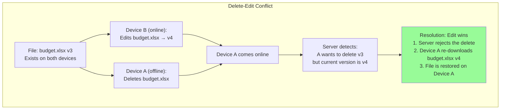

> **Principle: edits always win over deletes.** This follows the "never lose data"
> philosophy. The file was clearly important enough for someone to edit, so we
> preserve the edit. The deleting user will see the file reappear and can delete
> it again if they still want to.

### Folder Structure Conflicts

```
Scenario 1: Move-Move conflict
  Device A: Moves report.pdf from /Work/ to /Archive/
  Device B: Moves report.pdf from /Work/ to /Personal/

  Resolution: Last-writer-wins.
  If Device A syncs first: file is in /Archive/
  When Device B syncs: server sees file is already in /Archive/ (not /Work/)
  Device B's move "from /Work/" is invalid → conflict → file stays in /Archive/
  Device B receives sync update showing file in /Archive/

Scenario 2: Circular folder move
  Device A: Moves Folder X into Folder Y
  Device B: Moves Folder Y into Folder X

  If both succeed: X contains Y contains X → infinite loop!

  Resolution: Server detects cycle during metadata update.
  Second move is rejected with 409 Conflict.
  The folder that was moved first keeps its new location.
```

### Conflict in Shared Folders

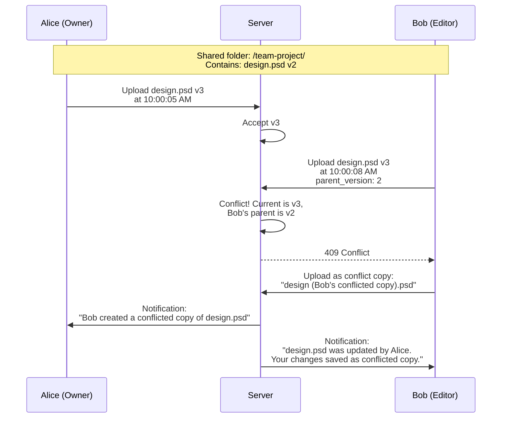

### Conflict Resolution Summary Matrix

| Conflict | Device A action | Device B action | Resolution | Data loss? |
|----------|----------------|----------------|------------|-----------|
| Edit-Edit | Edit file offline | Edit same file | Conflict copy created | No |
| Delete-Edit | Delete file | Edit file | Edit wins, file restored | No |
| Edit-Delete | Edit file | Delete file | Edit wins, file restored | No |
| Delete-Delete | Delete file | Delete file | File deleted (both agree) | Intentional |
| Rename-Rename | Rename to X | Rename to Y | Last-writer-wins | No |
| Move-Move | Move to /A/ | Move to /B/ | Last-writer-wins | No |
| Create-Create | Create foo.txt | Create foo.txt | Auto-rename second: foo (1).txt | No |
| Circular move | Move X into Y | Move Y into X | Reject second move | No |

---

## Deep Dive 3: Offline Editing and Reconciliation

### Offline Architecture

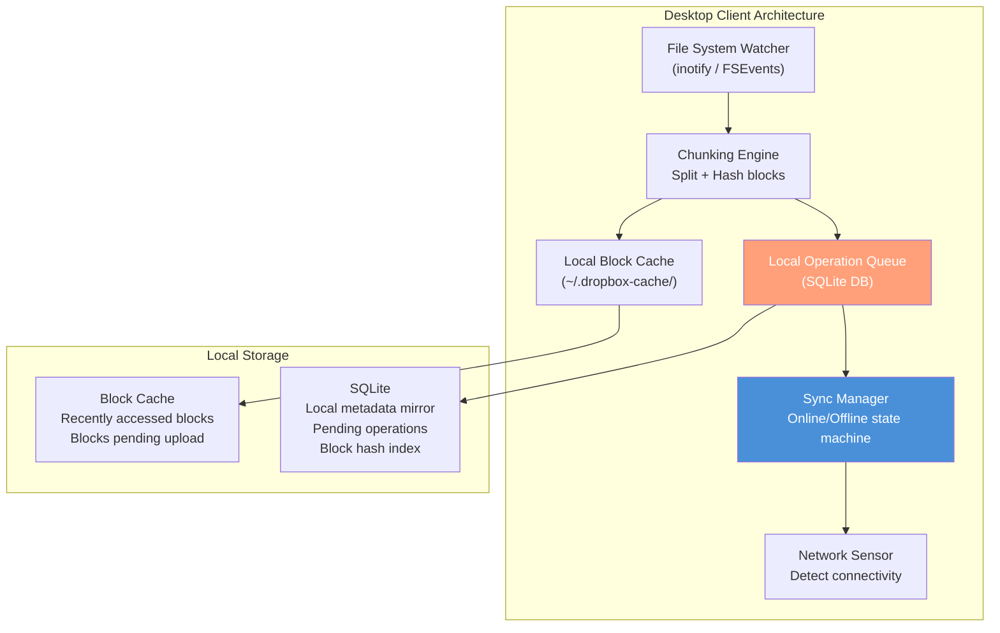

### Local Operation Queue

When offline, the client queues all file operations in a local SQLite database:

```sql
-- Local operation queue (SQLite on client)
CREATE TABLE pending_operations (
    op_id           INTEGER PRIMARY KEY AUTOINCREMENT,
    operation_type  TEXT NOT NULL,        -- 'create', 'modify', 'delete', 'move', 'rename'
    entry_path      TEXT NOT NULL,        -- Full local path
    entry_id        TEXT,                 -- Server entry_id (NULL for new files)
    parent_version  INTEGER,             -- Version we edited from
    block_hashes    TEXT,                 -- JSON array of block hashes (for create/modify)
    timestamp       INTEGER NOT NULL,    -- Unix timestamp of local operation
    status          TEXT DEFAULT 'pending' -- 'pending', 'syncing', 'completed', 'conflict'
);
```

Example queue after offline editing session:

```
op_id | type    | path                      | parent_ver | timestamp
------|---------|---------------------------|-----------|----------
1     | modify  | /Documents/thesis.pdf     | 3         | 1712488800
2     | create  | /Documents/new-notes.txt  | NULL      | 1712489100
3     | delete  | /Documents/old-draft.txt  | 2         | 1712489400
4     | rename  | /Documents/thesis.pdf     | -         | 1712489700
      |         |   → thesis-final.pdf      |           |
5     | modify  | /Documents/thesis-final.pdf| 3        | 1712490000
```

> **Operation ordering matters:** The queue preserves the exact order of operations.
> During reconciliation, operations are replayed in order to maintain consistency.
> Notice how operation 4 (rename) and 5 (modify) depend on each other -- the rename
> must be applied before the modify.

### Reconnection Sync Protocol

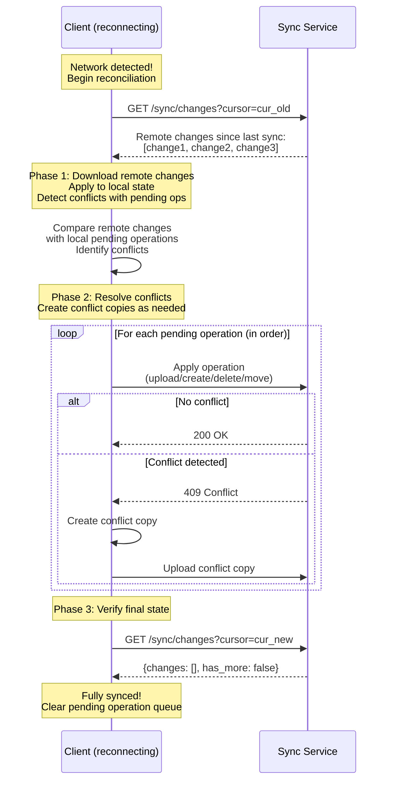

### Reconciliation Algorithm

```
RECONCILE(remote_changes, local_pending_ops):

  1. FETCH remote changes since last cursor
     remote_changes = GET /sync/changes?cursor=last_known

  2. BUILD conflict map:
     For each remote_change:
       For each local_op:
         If remote_change.file_id == local_op.file_id:
           conflict_map[file_id] = (remote_change, local_op)

  3. APPLY non-conflicting remote changes:
     For each remote_change NOT in conflict_map:
       Download new/changed blocks
       Update local file
       Update local metadata mirror

  4. RESOLVE conflicts:
     For each (file_id, remote, local) in conflict_map:
       If remote.type == 'delete' AND local.type == 'modify':
         → Upload local version (edit wins over delete)
       If remote.type == 'modify' AND local.type == 'modify':
         → Upload local version as conflict copy
         → Download remote version as primary
       If remote.type == 'modify' AND local.type == 'delete':
         → Accept remote version (edit wins over delete)
         → File reappears locally

  5. UPLOAD remaining non-conflicting local changes:
     For each local_op NOT in conflict_map:
       Upload to server (dedup check applies)

  6. UPDATE cursor to latest server sequence number
```

### Edge Cases in Offline Sync

| Edge case | Scenario | Handling |
|-----------|----------|----------|
| **Long offline period** | User is offline for weeks; cursor is very stale | Server may not have change log that far back; force full sync (compare entire file tree) |
| **Storage quota exceeded** | User creates many files offline, exceeding quota | Allow sync to complete; show warning; block further uploads until under quota |
| **Shared folder changes** | Other users modified shared folder while offline | Apply remote changes first; then reconcile local ops; conflict copies if needed |
| **Renamed file edited** | File renamed on server while edited locally offline | Match by file_id (not path); apply rename + detect edit conflict |
| **Moved and edited** | File moved to different folder and edited | Two separate operations; move resolves first, then edit conflict handled |
| **Partial upload interrupted** | Network drops during sync | Resumable uploads; client retries from last successful block |

---

## Metadata DB Scaling

### Sharding Strategy

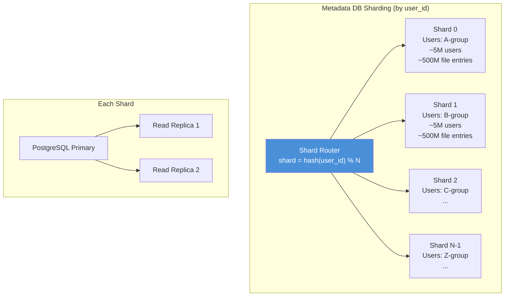

**Why shard by user_id?**

| Sharding key | Pros | Cons |
|-------------|------|------|
| **user_id (chosen)** | All of a user's files on same shard; folder listing is single-shard; sync queries are single-shard | Shared folders span shards (need cross-shard reads) |
| file_id | Even distribution; no hot shards from power users | Folder listing requires scatter-gather across all shards; sync is multi-shard |
| folder_id | Folder operations are local | Deep folder trees still span shards; user operations require multi-shard |

> **Dropbox's approach:** Dropbox shards metadata by namespace_id (which maps to user
> or team). All files belonging to a user or team are on the same shard. This makes
> the common operations (list folder, sync changes) single-shard queries.

### Cross-Shard Operations

The one case that requires cross-shard coordination: **shared folders**.

```
Alice (shard 5) shares /team-project/ with Bob (shard 12).

Option A: Store shared folder on owner's shard only
  - Alice's shard has the canonical data
  - Bob's queries for shared files route to shard 5
  - Pro: Single source of truth
  - Con: Bob's shard 12 can't serve his file list alone

Option B: Replicate shared folder metadata to both shards
  - Both shard 5 and shard 12 have the metadata
  - Updates require cross-shard synchronization
  - Pro: All queries are local to user's shard
  - Con: Consistency complexity

Dropbox uses Option A: the shared folder lives on the owner's shard.
Shared folder queries are routed to the owner's shard.
This is simpler and avoids cross-shard consistency issues.
```

### Read Replicas and Caching

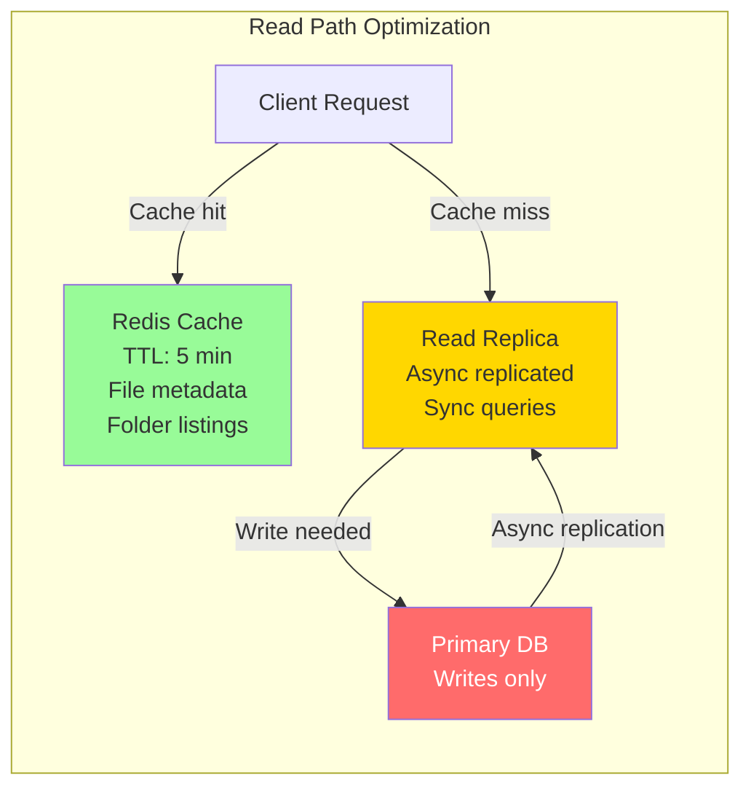

```
Cache strategy:
  - Folder listings: cached in Redis, invalidated on any child change
  - File metadata: cached per file_id, TTL 5 minutes
  - Block hash lookups: cached in Redis (most frequent query)
  - Sync cursor lookups: not cached (must be real-time)

Cache hit rates (expected):
  - Folder listings: ~80% (users repeatedly browse same folders)
  - File metadata: ~60% (recent files accessed more)
  - Block hash dedup check: ~90% (popular blocks checked repeatedly)
```

---

## Block Storage at Scale

### S3 with Erasure Coding

```
S3's internal durability mechanism: Erasure Coding

Instead of storing 3 full copies (3x storage overhead):
  - Split block into k data fragments
  - Generate m parity fragments (using Reed-Solomon coding)
  - Store k+m fragments across different physical drives/AZs
  - Can reconstruct from any k of the k+m fragments

Example (k=10, m=4):
  - 4MB block → 10 data fragments of 400KB each
  - 4 parity fragments of 400KB each
  - Total stored: 14 x 400KB = 5.6MB (1.4x overhead vs 3x for replication)
  - Can tolerate any 4 drive failures simultaneously

S3 Standard: 11 nines of durability (99.999999999%)
  - Probability of losing a block: ~1 in 10^11 per year
  - At 40 billion blocks: expect to lose 0.4 blocks per year
  - Additional checksums and scrubbing further reduce this
```

### Block Index Scaling

```
The block index must answer one question quickly:
  "Does this SHA-256 hash already exist in storage?"

Scale: 40 billion unique blocks

Option 1: PostgreSQL table with hash index
  - 40B rows, each ~100 bytes = 4TB of data
  - Hash index on block_hash
  - Sharded by first N bytes of hash (natural distribution)
  - Lookup: single-shard point query, < 1ms with cache

Option 2: Distributed key-value store (DynamoDB / Cassandra)
  - Key: block_hash, Value: {storage_path, ref_count, size}
  - Excellent for point lookups at scale
  - Natural horizontal scaling
  - Used by Dropbox (they use a custom key-value store)

Option 3: Bloom filter + backing store
  - In-memory Bloom filter for fast negative lookups
  - 40B items, 0.1% false positive rate: ~57GB of memory
  - On positive: verify against backing store
  - Eliminates ~99.9% of unnecessary backing store lookups
```

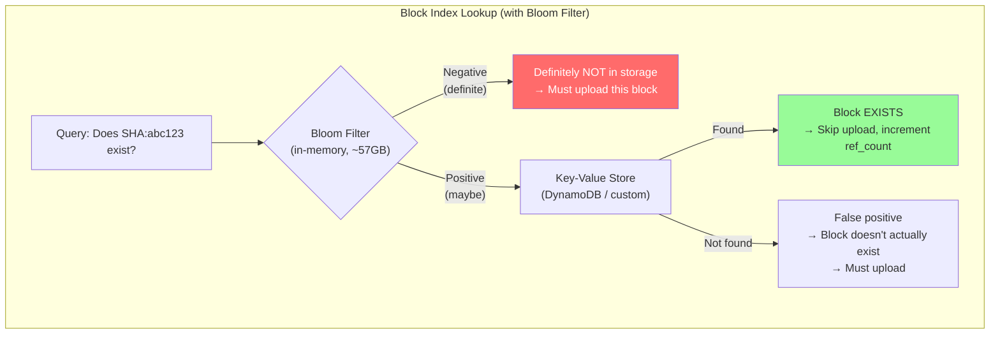

### Storage Cost Optimization

```
Monthly storage cost at scale (420TB/day new data):

Assuming AWS S3 pricing (approximate):
  S3 Standard:           $0.023/GB/month
  S3 Infrequent Access:  $0.0125/GB/month
  S3 Glacier:            $0.004/GB/month

Storage distribution (after 1 year):
  Hot (S3 Standard):     50PB   → $1,150,000/month
  Warm (S3 IA):          80PB   → $1,000,000/month
  Cold (Glacier):        70PB   → $280,000/month
  Total:                 200PB  → $2,430,000/month (~$29M/year)

Cost optimizations:
  1. Aggressive dedup:          saves ~60% of raw storage
  2. Compression (LZ4):         saves ~30% of remaining
  3. Tiered storage:            cold data at 5.7x lower cost
  4. Version GC:                delete unreferenced old blocks
  5. Custom storage (Dropbox):  Dropbox built "Magic Pocket" to replace S3,
                                 saving ~$75M over 2 years
```

---

## Bandwidth Optimization: Delta Sync

### How Delta Sync Works

Beyond block-level sync, delta sync transfers only the *difference within a changed block*:

```
Standard block sync:
  Old block 2: [....AAAA BBBB CCCC DDDD....]   (4MB)
  New block 2: [....AAAA BBXX CCCC DDDD....]   (4MB)
  Transfer:    Upload entire new block 2 (4MB)

Delta sync:
  Compute binary diff between old and new block 2:
  Diff: "At offset 2048, replace 'BB' with 'BX' (2 bytes changed)"
  Transfer: Upload diff instruction (~50 bytes)

  Savings: 4MB → 50 bytes (99.999% reduction for this block)
```

### Rolling Checksum Algorithm

Delta sync uses an rsync-like rolling checksum to efficiently find matching regions:

```
1. Split OLD block into small chunks (e.g., 512 bytes)
2. Compute a weak rolling checksum for each chunk
3. Send checksums to the server (or compute locally)

4. Scan NEW block with a sliding 512-byte window:
   - Compute rolling checksum at each position
   - If checksum matches an old chunk:
     → Verify with strong hash (MD5/SHA-256)
     → If strong hash matches: this region is UNCHANGED
     → Record: "copy bytes [offset..offset+512] from old block"
   - If no match: this region is NEW data
     → Record: "insert these literal bytes"

5. Result is a compact instruction list:
   COPY old[0..2047]         -- First 2KB unchanged
   INSERT "new data here"    -- 50 bytes of new content
   COPY old[2098..4194303]   -- Rest of block unchanged
```

### Delta Sync Flow

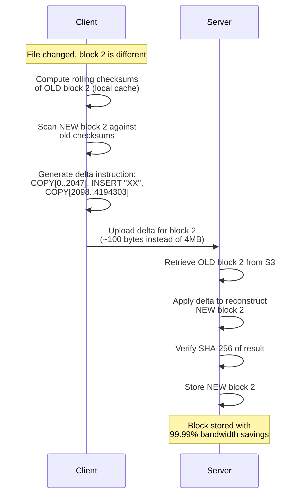

### When to Use Delta vs Full Block

```
Decision matrix for upload strategy:

If block is entirely new (no old version):
  → Full block upload (no delta possible)

If delta_size > 0.5 * block_size:
  → Full block upload (delta too large to be worth it)

If delta_size <= 0.5 * block_size:
  → Delta upload (significant savings)

Typical delta ratios by file type:
  Text files (code, documents):  Delta is 0.1-5% of block size (excellent)
  Compressed files (zip, docx):  Delta is 30-80% of block size (moderate)
  Binary files (images, video):  Delta is 80-100% of block size (poor)
  Encrypted files:               Delta is ~100% (useless -- any change cascades)
```

---

## Versioning, Retention, and Garbage Collection

### Version Retention Policy

```
Retention rules (configurable per account tier):

Free tier:
  - Keep versions for 30 days
  - Maximum 100 versions per file
  - Deleted files recoverable for 30 days

Pro tier:
  - Keep versions for 180 days
  - Unlimited versions
  - Deleted files recoverable for 180 days

Business tier:
  - Keep versions for 365 days (or unlimited with add-on)
  - Unlimited versions
  - Admin-configurable retention policies
  - Legal hold: prevent version deletion
```

### Garbage Collection Pipeline

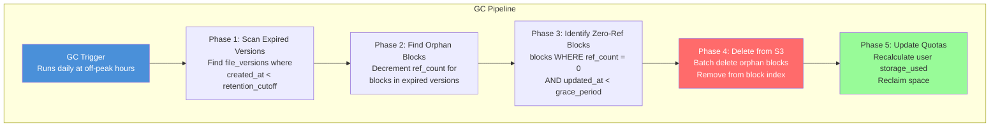

```
GC execution (daily):

Phase 1 - Identify expired versions:
  SELECT version_id, entry_id FROM file_versions
  WHERE created_at < NOW() - INTERVAL '30 days'
    AND version_number < (SELECT latest_version FROM file_entries WHERE ...)
  LIMIT 100000;  -- Process in batches

Phase 2 - Decrement block references:
  For each expired version:
    UPDATE blocks SET ref_count = ref_count - 1
    WHERE block_hash IN (
      SELECT block_hash FROM version_blocks
      WHERE version_id = ?
    );

Phase 3 - Find orphan blocks (ref_count = 0):
  SELECT block_hash, storage_path FROM blocks
  WHERE ref_count = 0
    AND updated_at < NOW() - INTERVAL '72 hours';  -- Grace period

Phase 4 - Delete from S3:
  Batch delete: aws s3 rm s3://blocks/ab/cd/abcdef...
  Delete from block index

Phase 5 - Recalculate user quotas:
  UPDATE users SET storage_used = (
    SELECT SUM(file_size) FROM file_entries
    WHERE user_id = ? AND is_deleted = FALSE
  );
```

### GC Safety and Race Conditions

```
Race condition scenario:
  1. GC identifies block SHA:abc as ref_count=0 (orphan)
  2. Before GC deletes it, User X uploads a file with the same block
  3. Dedup check finds block exists → ref_count incremented to 1
  4. GC deletes the block from S3
  5. User X's file now references a deleted block → DATA LOSS

Prevention: Grace period + two-phase GC

  Phase A: Mark block as "pending_deletion" (set a tombstone)
  Phase B: Wait 72 hours
  Phase C: Check ref_count again
    If still 0: safe to delete
    If > 0: someone added a reference → cancel deletion

  The 72-hour grace period ensures that any concurrent upload
  has time to complete and increment the ref_count.

Additional safety: soft delete
  - Block data in S3 is first moved to a "graveyard" prefix
  - After 7 days in graveyard with no restoration: permanently delete
  - This allows recovery from GC bugs
```

---

## Monitoring and Observability

| Metric | What to monitor | Alert threshold |
|--------|----------------|-----------------|
| **Sync latency** | Time from file change to sync complete on other devices | P99 > 10 seconds |
| **Upload success rate** | Percentage of uploads that complete without error | < 99.5% |
| **Dedup ratio** | Percentage of blocks that match existing blocks | Drop below 40% (indicates changed workload) |
| **Block storage growth** | Daily new unique blocks stored | > 500TB/day (capacity planning) |
| **Notification latency** | Time from Kafka event to WebSocket push delivery | P99 > 2 seconds |
| **Conflict rate** | Percentage of uploads that result in conflict | > 5% (indicates UX problem) |
| **GC throughput** | Blocks garbage collected per day | Falling behind growth rate |
| **Offline queue depth** | Pending operations per device | > 10,000 ops (device struggling to sync) |
| **Block index lookup latency** | Time for dedup hash check | P99 > 10ms |
| **Metadata DB query latency** | Sync change queries, folder listings | P99 > 50ms |

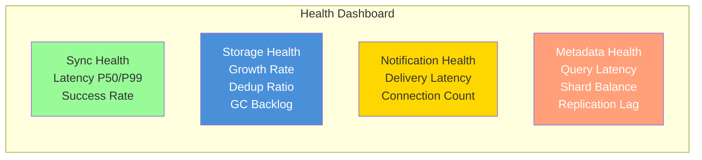

---

## Trade-offs and Design Decisions

| Decision | We chose | Alternative | Why |
|----------|---------|-------------|-----|
| **Chunking** | Fixed 4MB blocks | Content-defined chunking | Simpler implementation; CDC's insertion-resistance benefit is marginal for most file types at Dropbox's scale |
| **Conflict resolution** | Conflict copies | Automatic merge | Never lose data; binary files cannot be merged; users can resolve manually |
| **Notification** | Long polling + WebSocket | Server-Sent Events | Long polling works through all firewalls; WebSocket for low-latency when available |
| **Metadata DB** | Sharded PostgreSQL | NoSQL (Cassandra) | Strong consistency for file tree operations; SQL for complex queries (folder listing, search) |
| **Block storage** | S3 (or custom like Magic Pocket) | HDFS / Ceph | S3 provides 11-nines durability with zero operational overhead; custom storage for cost optimization at extreme scale |
| **Sync protocol** | Cursor-based delta | Full state comparison | Cursor is O(changes) vs O(total files); efficient for normal operation |
| **Dedup scope** | Global (cross-user) | Per-user only | Massive storage savings (especially for popular files); requires hash-only comparison (not content) for privacy |
| **Compression** | LZ4 (fast) | Zstd / gzip (better ratio) | Block upload/download is latency-sensitive; LZ4 adds minimal CPU overhead |
| **Versioning** | Time-based retention + max count | Keep all versions forever | Storage cost grows without bound; most users never access versions older than 30 days |
| **Encryption** | Server-side (AES-256 at rest) | End-to-end (zero-knowledge) | Server-side allows dedup; E2E prevents dedup since encrypted blocks differ even for identical content |

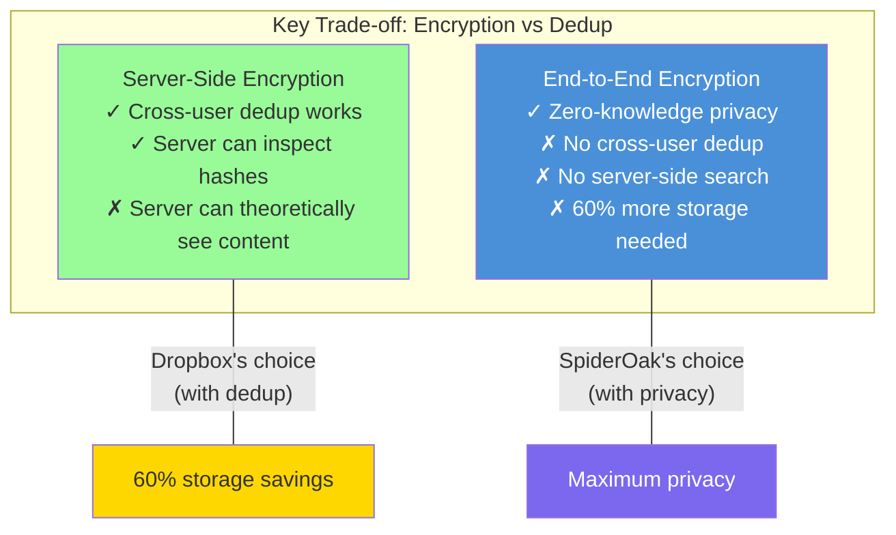

---

## Interview Tips and Common Follow-Ups

### How to Structure Your 45-Minute Answer

```
Minute 0-5:   Requirements + clarifying questions
              "The core challenge is efficient file sync, not just storage."

Minute 5-10:  High-level architecture diagram
              Draw: Client → API → Sync/Meta/Block/Notification → Kafka → S3/PG

Minute 10-20: THE core mechanism: block-level chunking and sync
              This is where you differentiate yourself.
              Walk through: chunk → hash → dedup check → upload only new blocks
              Show the upload sequence diagram.

Minute 20-30: Sync flow and notifications
              How does Device B know to sync?
              Long polling / WebSocket → change notification → delta sync

Minute 30-40: Deep dive (interviewer's choice)
              Common picks: conflict resolution, offline sync, or scaling

Minute 40-45: Trade-offs and wrap-up
              Mention: CDC vs fixed chunking, encryption vs dedup, consistency model
```

### Common Follow-Up Questions and Key Points

| Question | Key points to mention |
|----------|----------------------|
| "How do you handle a 50GB file upload?" | Chunking (12,500 blocks at 4MB each); parallel upload; resumable (track which blocks are done); presigned URLs to S3 |
| "What if two users upload the same 10GB file?" | Dedup! Client sends block hashes first; server says "all blocks exist"; second upload is near-instant with zero bytes transferred |
| "How does sync work across 3 devices?" | File change → notification via Kafka → WebSocket push to all devices → each device calls /sync/changes → downloads only missing blocks |
| "What about a user with 1 million files?" | Cursor-based sync (only fetches changes, not full file list); metadata sharded by user_id; folder listing paginated |
| "How do you handle conflicts?" | Conflict copy approach (never lose data); parent_version check detects conflicts; automatic merge is unsafe for binary files |
| "How do you save storage costs?" | Dedup (60% savings), compression (30% savings), tiered storage (hot/warm/cold), version GC, and at extreme scale: custom storage (Dropbox's Magic Pocket) |
| "What about security?" | TLS in transit, AES-256 at rest, presigned URLs with short TTL, per-file access control, audit logging |
| "How do you handle selective sync?" | Client tells server which folders to sync; notification service filters events by subscribed folders; client only downloads blocks for synced folders |

### What Separates a Strong Answer

```
Average answer:
  "We store files in S3 and use a database for metadata."

Good answer:
  "We split files into blocks, hash them, and only upload
   changed blocks. Dedup saves 60% of storage."

Great answer:
  "The key insight is content-addressable block storage.
   Files are split into 4MB blocks, each identified by SHA-256.
   On upload, the client sends hashes first -- the server tells it
   which blocks already exist. This gives us three properties:
   1) bandwidth efficiency (only upload changes),
   2) storage dedup (same content = same block across all users),
   3) fast versioning (new version = same blocks minus changed ones).
   The sync protocol uses cursors for delta detection and long
   polling for push notifications. Conflicts are resolved by
   creating conflict copies because binary files can't be merged."
```

### Real-World Reference Points

| System | Notable design choice | Lesson |
|--------|----------------------|--------|
| **Dropbox** | Fixed 4MB chunks; long polling; Magic Pocket (custom storage replacing S3) | At scale, custom storage saves hundreds of millions vs S3 |
| **Google Drive** | Deep Google infrastructure integration; real-time sync via XMPP/gRPC | Tight integration with Docs/Sheets enables collaborative editing on top of file sync |
| **OneDrive** | Differential sync (delta within blocks); NTFS integration on Windows | OS-level integration (Windows placeholder files) reduces local storage needs |
| **iCloud Drive** | Apple ecosystem integration; CloudKit backend | Native OS integration provides seamless UX but limits cross-platform |
| **Syncthing** | Peer-to-peer sync (no central server); open source | Demonstrates that file sync can work without a central server using block exchange protocol |

---

> **Final note:** The block-level chunking mechanism is the heart of this design.
> Everything else -- the sync protocol, dedup, versioning, conflict resolution --
> builds on top of the fundamental insight that files should be decomposed into
> content-addressable blocks. If you explain this well and walk through a concrete
> sync example, you will deliver a strong interview answer.
