# Design Dropbox / Google Drive -- High-Level Design

## Complete System Design Interview Walkthrough (Part 2 of 3)

> This document covers the system architecture, the critical block-level chunking
> mechanism, the sync protocol, metadata management, notification system, sharing
> model, and conflict resolution. See Part 1 for requirements/estimation and Part 3
> for deep dives and scaling.

---

## Table of Contents

- [Architecture Overview](#architecture-overview)
  - [System Architecture Diagram](#system-architecture-diagram)
  - [Component Responsibilities](#component-responsibilities)
  - [Core Data Flow Summary](#core-data-flow-summary)
- [The Core Innovation: Block-Level Chunking](#the-core-innovation-block-level-chunking)
  - [Why Chunking Matters](#why-chunking-matters)
  - [How Files Are Split into Blocks](#how-files-are-split-into-blocks)
  - [Block Hashing and Deduplication](#block-hashing-and-deduplication)
  - [Deduplication in Action -- Worked Example](#deduplication-in-action----worked-example)
  - [Cross-User Deduplication](#cross-user-deduplication)
- [File Upload Flow](#file-upload-flow)
  - [Upload Sequence Diagram](#upload-sequence-diagram)
  - [Step-by-Step Upload Walkthrough](#step-by-step-upload-walkthrough)
  - [Why Presigned URLs](#why-presigned-urls)
- [File Sync Flow](#file-sync-flow)
  - [Sync Sequence Diagram](#sync-sequence-diagram)
  - [Step-by-Step Sync Walkthrough](#step-by-step-sync-walkthrough)
  - [Delta Sync -- Only Changed Blocks](#delta-sync----only-changed-blocks)
- [Notification Service](#notification-service)
  - [Push vs Pull for Change Detection](#push-vs-pull-for-change-detection)
  - [Long Polling Architecture](#long-polling-architecture)
  - [WebSocket Architecture](#websocket-architecture)
  - [Notification Flow Diagram](#notification-flow-diagram)
- [Metadata Service](#metadata-service)
  - [File Tree Management](#file-tree-management)
  - [Version Management](#version-management)
  - [Cursor-Based Change Tracking](#cursor-based-change-tracking)
  - [Metadata Read and Write Paths](#metadata-read-and-write-paths)
- [Block Storage Service](#block-storage-service)
  - [Content-Addressable Storage](#content-addressable-storage)
  - [Block Lifecycle](#block-lifecycle)
  - [Storage Tiers](#storage-tiers)
- [Sharing Service](#sharing-service)
  - [Permission Model](#permission-model)
  - [Shared Folder Sync](#shared-folder-sync)
  - [Link Sharing](#link-sharing)
- [Conflict Resolution](#conflict-resolution)
  - [Types of Conflicts](#types-of-conflicts)
  - [Resolution Strategies](#resolution-strategies)
  - [Conflict Resolution Flow](#conflict-resolution-flow)

---

## Architecture Overview

### System Architecture Diagram

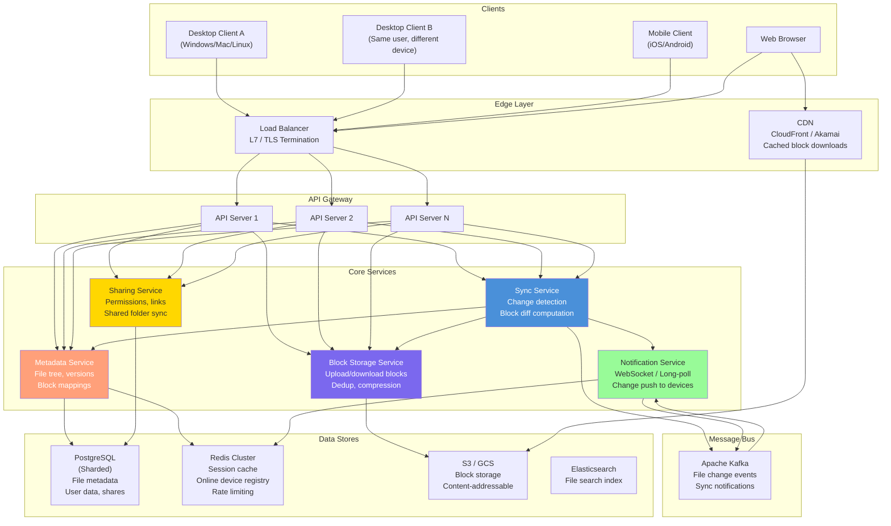

### Component Responsibilities

| Component | Responsibility | Key Operations |
|-----------|---------------|----------------|
| **Sync Service** | Orchestrates file sync between client and server | Compares client block hashes with server state; determines which blocks to upload/download |
| **Metadata Service** | Manages the file tree and version history | CRUD on files/folders; tracks which blocks compose each file version |
| **Block Storage Service** | Stores and retrieves raw data blocks | Deduplication checks, compression, encryption, upload to S3 |
| **Notification Service** | Pushes change events to connected devices | Maintains WebSocket/long-poll connections; routes change events from Kafka to correct devices |
| **Sharing Service** | Manages permissions and shared folder sync | Permission checks, share invitations, link generation, cross-user folder sync |

### Core Data Flow Summary

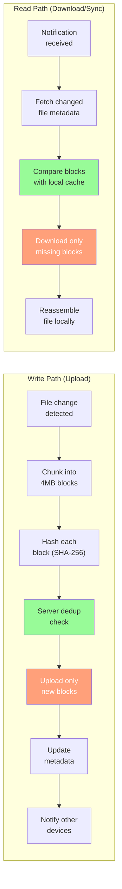

---

## The Core Innovation: Block-Level Chunking

> **This is the single most important concept in this design.** If you explain nothing
> else well in the interview, explain chunking. It is what makes Dropbox's sync
> efficient and what enabled them to save petabytes of storage through deduplication.

### Why Chunking Matters

Consider a 100MB file where the user edits a single paragraph:

| Approach | Data transferred | Storage cost |
|----------|-----------------|--------------|
| **Naive: upload full file** | 100MB | 100MB new copy |
| **File-level diff** | ~few KB (the diff) | Still need the full file for reconstruction |
| **Block-level sync** | 4MB (one changed block) | 4MB new block + references to 24 unchanged blocks |

Block-level sync gives us three critical properties:
1. **Bandwidth efficiency** -- only transfer changed blocks (4% of file in this example)
2. **Storage efficiency** -- unchanged blocks are shared across versions (dedup)
3. **Parallelism** -- blocks can be uploaded/downloaded concurrently

### How Files Are Split into Blocks

```
File: presentation.pptx (48MB)

┌─────────────┬─────────────┬─────────────┬─────────────┬─────────────┬─────────────┐
│  Block 0    │  Block 1    │  Block 2    │  Block 3    │  Block 4    │  Block 5    │
│  4MB        │  4MB        │  4MB        │  4MB        │  4MB        │  4MB        │
│  SHA: a1b2  │  SHA: c3d4  │  SHA: e5f6  │  SHA: g7h8  │  SHA: i9j0  │  SHA: k1l2  │
└─────────────┴─────────────┴─────────────┴─────────────┴─────────────┴─────────────┘
... (continues for 12 blocks total)

Each block:
  - Fixed size: 4MB (last block may be smaller)
  - Identified by SHA-256 hash of its content
  - Stored independently in S3
  - Shared across file versions and users if content matches
```

> **Why 4MB?** Dropbox uses 4MB blocks. This is a balance:
> - Too small (e.g., 256KB): too many blocks per file, metadata overhead explodes
> - Too large (e.g., 64MB): small edits still require uploading a large block
> - 4MB: a single paragraph edit in a 100MB file requires uploading ~4% of the data

### Block Hashing and Deduplication

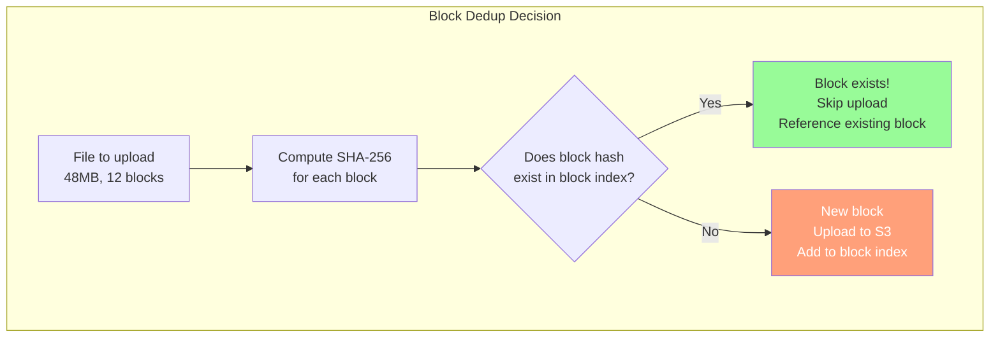

The dedup check flow:

```
Client sends:   block_hashes = ["sha256:a1b2...", "sha256:c3d4...", "sha256:e5f6...", ...]

Server checks each hash against the global block index:
  "sha256:a1b2..." → EXISTS (ref_count: 47,329)   -- Very common block (e.g., empty padding)
  "sha256:c3d4..." → EXISTS (ref_count: 1)         -- Another user has this exact block
  "sha256:e5f6..." → NOT FOUND                      -- New content, must upload
  ...

Server responds:  blocks_needed = [2, 5, 8]        -- Only upload these 3 blocks
                  blocks_existing = [0,1,3,4,6,7,9,10,11]  -- 9 blocks skipped!
```

### Deduplication in Action -- Worked Example

```
Scenario: User edits slide 3 of a 48MB presentation

Before edit (Version 1):
  Block 0: SHA:aaa  Block 1: SHA:bbb  Block 2: SHA:ccc  ...  Block 11: SHA:lll

User modifies slide 3, which falls in Block 2.

After edit (Version 2):
  Block 0: SHA:aaa  Block 1: SHA:bbb  Block 2: SHA:zzz  ...  Block 11: SHA:lll
                                            ^^^
                                       Only this changed

Upload required: 1 block (4MB) out of 12 blocks (48MB) = 8% of the file
Storage cost: 1 new block entry; Version 2 metadata references 11 existing + 1 new block
```

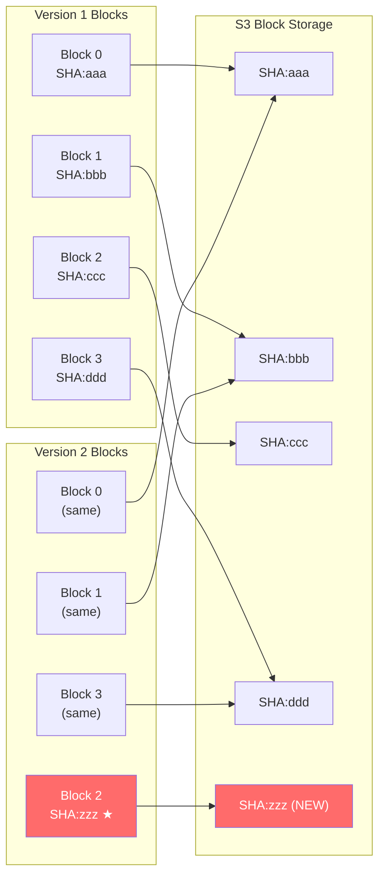

### Cross-User Deduplication

```
Scenario: 10,000 students at a university all receive the same 20MB PDF textbook.

Without cross-user dedup:
  Storage: 10,000 x 20MB = 200GB

With cross-user dedup:
  First upload: 5 blocks x 4MB = 20MB stored
  Remaining 9,999 uploads: 0 bytes stored (all blocks already exist)
  Total storage: 20MB (99.99% savings)
  Upload time for students 2-9,999: near-instant (no blocks to transfer)
```

> **Real-world impact:** Dropbox reported that their deduplication system eliminates
> approximately 60% of total upload volume. For popular files (installers, textbooks,
> shared documents), the savings approach 100%.

---

## File Upload Flow

### Upload Sequence Diagram

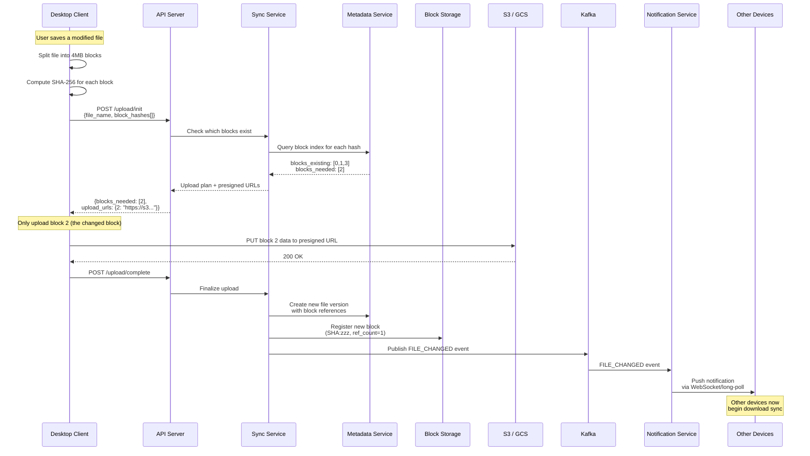

### Step-by-Step Upload Walkthrough

| Step | Actor | Action | Detail |
|------|-------|--------|--------|
| 1 | Client | Detects file change | File system watcher (inotify on Linux, FSEvents on Mac, ReadDirectoryChangesW on Windows) |
| 2 | Client | Chunks the file | Splits into 4MB blocks |
| 3 | Client | Hashes each block | SHA-256 of raw block bytes |
| 4 | Client | Sends init request | Sends file name, size, and all block hashes to server |
| 5 | Sync Service | Dedup check | Queries block index: which hashes already exist? |
| 6 | Sync Service | Returns upload plan | Tells client which block indices to upload, with presigned S3 URLs |
| 7 | Client | Uploads new blocks | PUTs raw bytes directly to S3 using presigned URLs (parallel uploads) |
| 8 | Client | Completes upload | Tells server all blocks are uploaded |
| 9 | Metadata Service | Creates new version | New file_version record pointing to all block hashes (old + new) |
| 10 | Block Storage | Registers new blocks | Increments ref_count for existing blocks; creates entries for new ones |
| 11 | Kafka | Publishes event | FILE_CHANGED event with file_id, version, and user_id |
| 12 | Notification Service | Pushes to devices | Routes event to all other connected devices of same user + shared folder members |

### Why Presigned URLs

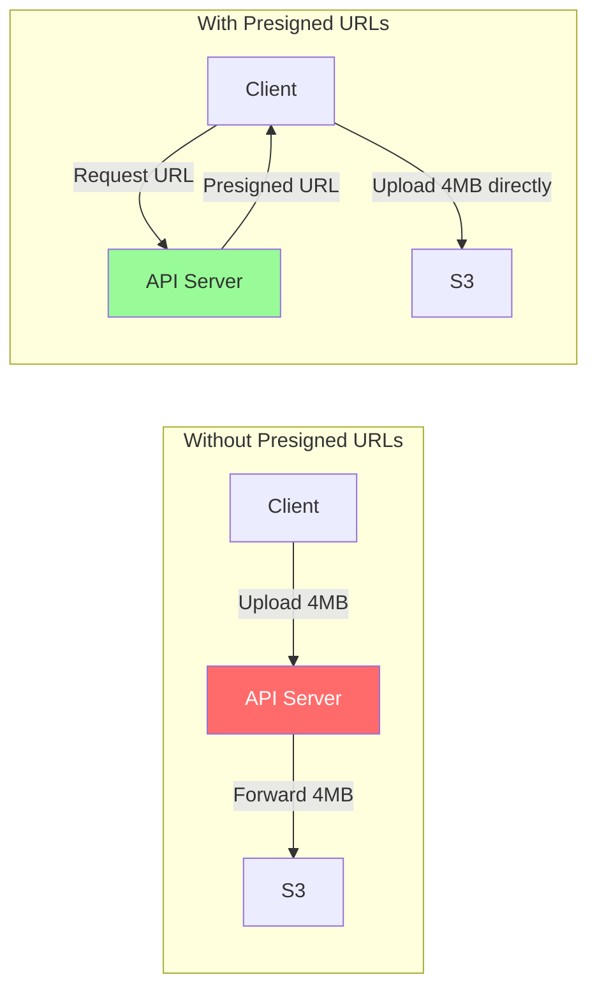

| Without presigned URLs | With presigned URLs |
|----------------------|-------------------|
| API server is a bottleneck -- must proxy all data | API server only handles lightweight metadata |
| API servers need massive bandwidth | S3 handles bandwidth at scale |
| Single point of failure for uploads | Client uploads directly to S3 |
| Cannot parallelize easily | Client can upload multiple blocks in parallel |

> **Production reality:** Dropbox originally proxied all data through their servers.
> They later moved to a system called "Magic Pocket" (their own block storage) but
> the presigned-URL pattern with S3 is the standard approach for most companies.

---

## File Sync Flow

### Sync Sequence Diagram

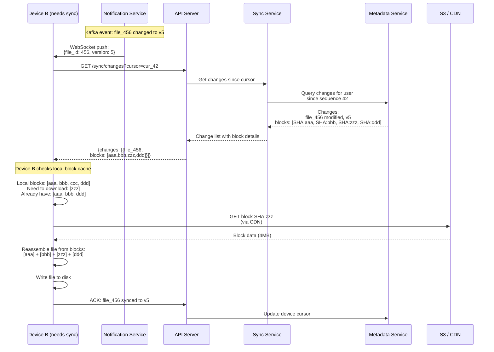

### Step-by-Step Sync Walkthrough

```
1. TRIGGER: Device B receives a push notification that file_456 was updated.

2. FETCH CHANGES: Device B calls GET /sync/changes with its cursor.
   The server returns all changes since Device B's last sync point.

3. COMPARE BLOCKS: Device B knows which blocks it already has locally
   (from its local block cache). It computes the set difference:
     Server blocks:  {aaa, bbb, zzz, ddd}
     Local blocks:   {aaa, bbb, ccc, ddd}
     Need download:  {zzz}               -- 1 block, 4MB
     Already have:   {aaa, bbb, ddd}      -- 3 blocks, 12MB saved

4. DOWNLOAD MISSING BLOCKS: Device B downloads only block SHA:zzz
   from S3 (through CDN for faster delivery).

5. REASSEMBLE: Device B reconstructs the file by concatenating blocks
   in order: [aaa][bbb][zzz][ddd] → presentation.pptx v5.

6. WRITE TO DISK: The reconstructed file replaces the old version.
   The file system watcher is temporarily suppressed to avoid
   triggering another upload.

7. ACK: Device B acknowledges sync complete. Server updates its cursor.
```

### Delta Sync -- Only Changed Blocks

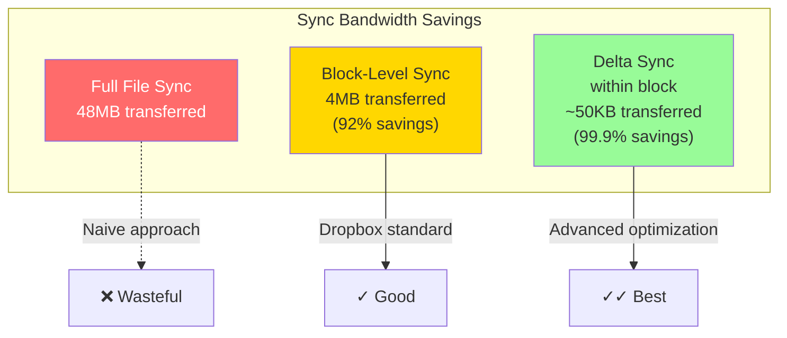

Beyond block-level sync, an advanced optimization is **delta sync within changed blocks**:

```
Standard block sync:
  Changed block: 4MB uploaded (the entire block)

Delta sync (rsync-style):
  Old block content:  "...paragraph A paragraph B paragraph C..."
  New block content:  "...paragraph A paragraph B-EDITED paragraph C..."
  Delta:              "At offset 2048, replace 128 bytes with 156 bytes"
  Transfer:           ~few KB instead of 4MB

Implementation: The client computes a binary diff (using algorithms like
rsync's rolling checksum or xdelta3) between old and new versions of the
changed block, and uploads only the diff. The server applies the diff to
reconstruct the new block.
```

> **Dropbox's approach:** Dropbox uses a combination of block-level sync and
> streaming compression. Their protocol, "Streaming Sync," compresses blocks
> during transfer and batches small block changes together.

---

## Notification Service

### Push vs Pull for Change Detection

| Approach | Mechanism | Latency | Resource cost | When to use |
|----------|-----------|---------|--------------|-------------|
| **Polling** | Client periodically calls GET /changes | High (up to poll interval) | High (wasteful requests) | Never for primary sync |
| **Long polling** | Client opens request, server holds until change or timeout | Medium (< 1s after change) | Medium (one connection per device) | Mobile clients, firewalled environments |
| **WebSocket** | Persistent bidirectional connection | Low (< 100ms) | Low per notification (but connection cost) | Desktop clients, web clients |
| **Server-Sent Events** | Server push over HTTP | Low | Low | Alternative to WebSocket for simple push |

> **Dropbox's choice:** Dropbox uses long polling for their notification service.
> The client opens a connection to the notification server, which holds it open for
> up to 90 seconds. If a change occurs, the server responds immediately. If not,
> the client reconnects. This approach works reliably through firewalls and proxies.

### Long Polling Architecture

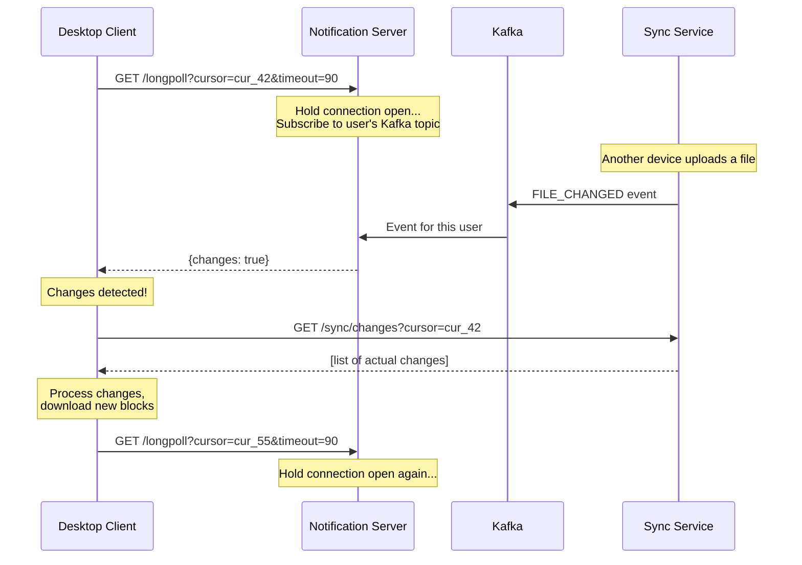

Key design points:
- The long-poll response only says "changes exist" -- it does not include the changes themselves
- The client then calls a separate `/sync/changes` endpoint to get details
- This separation keeps the notification server stateless and simple
- If the 90-second timeout fires with no changes, client immediately reconnects

### WebSocket Architecture

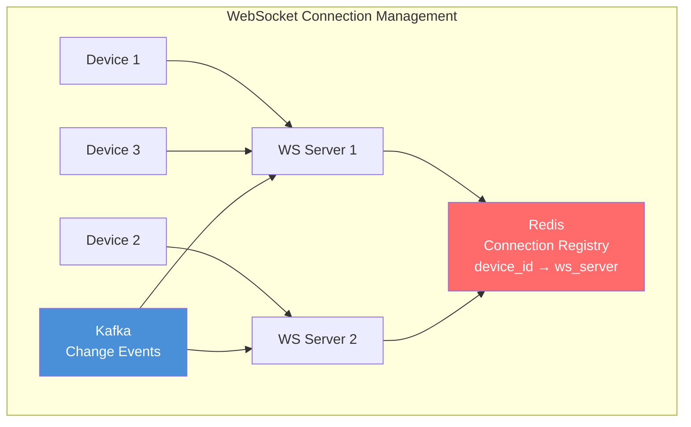

Connection registry in Redis:
```
# Which WebSocket server holds each device's connection?
device:dev_abc123 → ws_server_1     (TTL: 120s, refreshed by heartbeat)
device:dev_def456 → ws_server_2
device:dev_ghi789 → ws_server_1

# Which devices belong to each user?
user:user_123:devices → {dev_abc123, dev_def456, dev_ghi789}
```

### Notification Flow Diagram

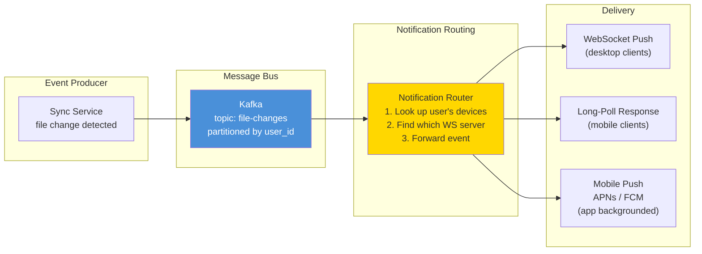

---

## Metadata Service

### File Tree Management

The metadata service maintains a virtual file system for each user:

```
User's file tree (stored in PostgreSQL):

/
├── Documents/
│   ├── thesis.pdf          (file_id: f001, v3, 52MB, 13 blocks)
│   ├── notes.txt           (file_id: f002, v1, 2KB, 1 block)
│   └── Presentations/
│       └── deck.pptx       (file_id: f003, v7, 48MB, 12 blocks)
├── Photos/
│   ├── vacation.jpg        (file_id: f004, v1, 8MB, 2 blocks)
│   └── family.png          (file_id: f005, v1, 4MB, 1 block)
└── Shared/
    └── team-project/       (shared folder, synced with 5 users)
        ├── report.docx     (file_id: f006, v12, 1MB, 1 block)
        └── data.csv        (file_id: f007, v2, 200MB, 50 blocks)
```

Each node in the tree is a row in `file_entries`:
```
entry_id | parent_id | entry_name      | entry_type | latest_version | user_id
---------|-----------|-----------------|------------|----------------|--------
e001     | NULL      | /               | folder     | -              | u123
e002     | e001      | Documents       | folder     | -              | u123
e003     | e002      | thesis.pdf      | file       | 3              | u123
e004     | e002      | notes.txt       | file       | 1              | u123
e005     | e002      | Presentations   | folder     | -              | u123
e006     | e005      | deck.pptx       | file       | 7              | u123
```

### Version Management

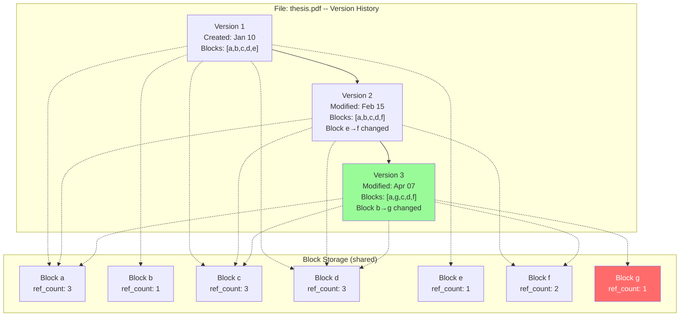

> **Storage efficiency of versioning:** Version 3 of thesis.pdf only uses 7 unique
> blocks total across all 3 versions. Without dedup, 3 versions x 5 blocks = 15 block
> copies. With dedup: 7 blocks. That is a 53% storage reduction just from versioning.

### Cursor-Based Change Tracking

Every metadata mutation generates a monotonically increasing sequence number:

```
Global sequence log (per user shard):

seq | operation     | entry_id | details
----|---------------|----------|--------
41  | FILE_MODIFIED | f003     | v6 → v7, block 4 changed
42  | FILE_ADDED    | f008     | new file: report.pdf
43  | FILE_MOVED    | f002     | /Documents → /Archive
44  | FILE_DELETED  | f009     | notes_old.txt → trash
45  | FOLDER_ADDED  | e010     | new folder: /Projects
```

Each device stores a cursor (last-seen sequence number):
```
Device A: cursor = 45 (fully synced)
Device B: cursor = 41 (needs changes 42-45)
Device C: cursor = 38 (needs changes 39-45)
```

When Device B calls `GET /sync/changes?cursor=41`:
```json
{
  "changes": [
    {"seq": 42, "type": "file_added", "entry_id": "f008", ...},
    {"seq": 43, "type": "file_moved", "entry_id": "f002", ...},
    {"seq": 44, "type": "file_deleted", "entry_id": "f009", ...},
    {"seq": 45, "type": "folder_added", "entry_id": "e010", ...}
  ],
  "cursor": "cur_45",
  "has_more": false
}
```

### Metadata Read and Write Paths


---

## Block Storage Service

### Content-Addressable Storage

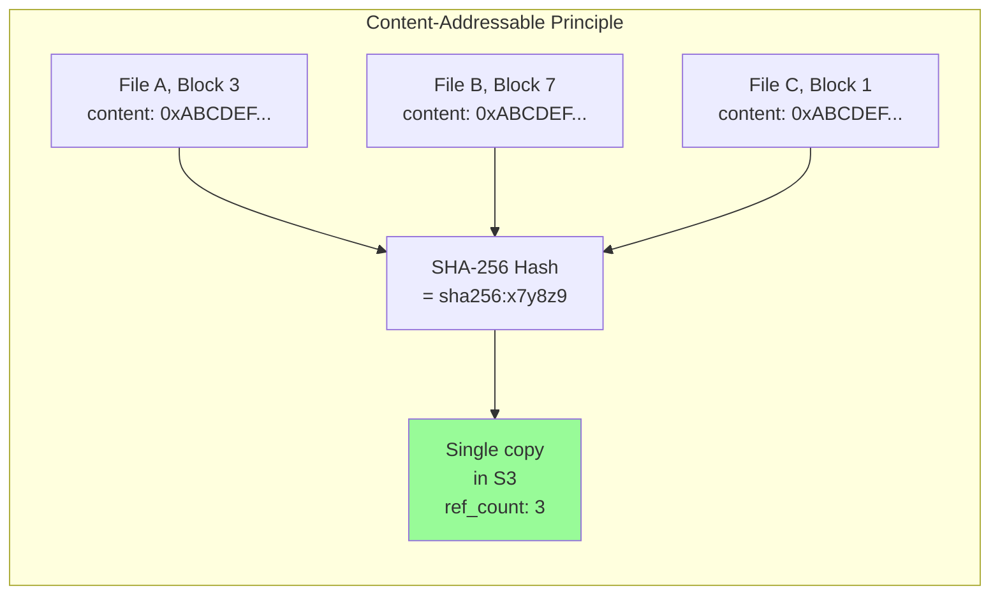

The block storage service handles:
1. **Hash verification** -- recompute SHA-256 of uploaded block to verify integrity
2. **Compression** -- compress block with LZ4 before storing (fast compression, ~30% reduction)
3. **Encryption** -- encrypt with AES-256 before writing to S3
4. **Reference counting** -- track how many file versions reference each block
5. **Garbage collection** -- delete blocks with ref_count = 0

### Block Lifecycle

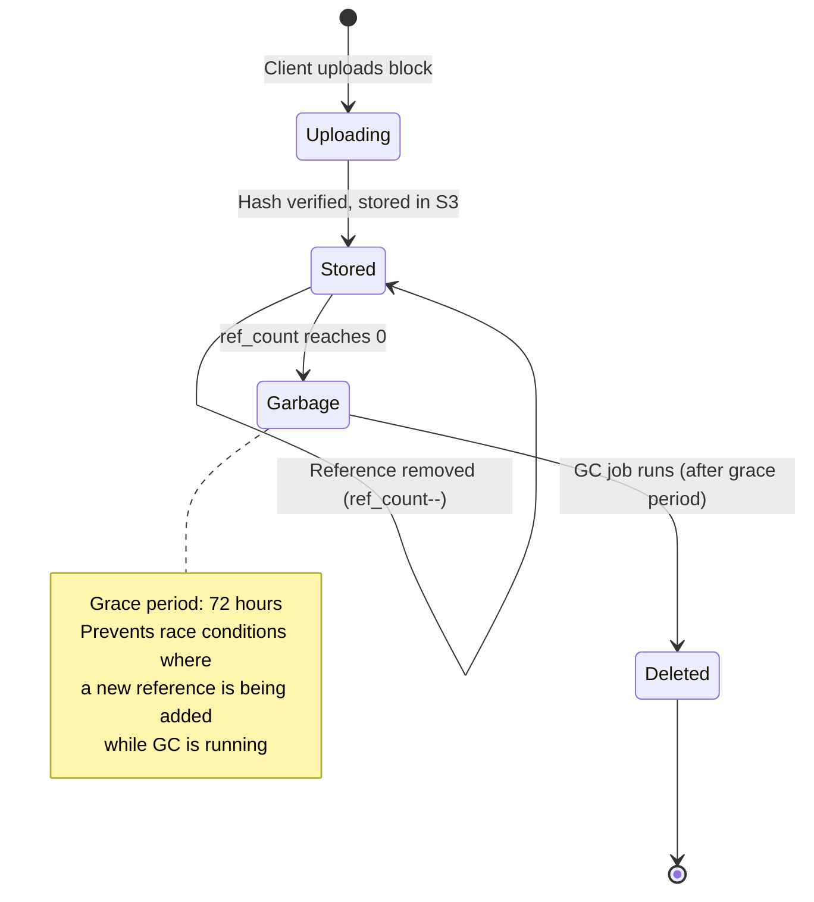

### Storage Tiers

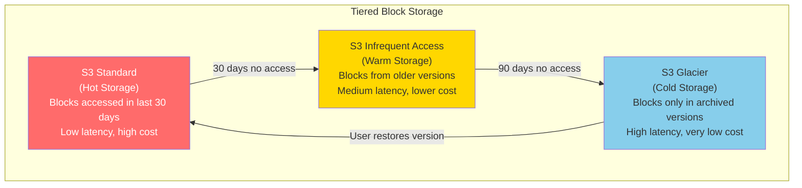

---

## Sharing Service

### Permission Model

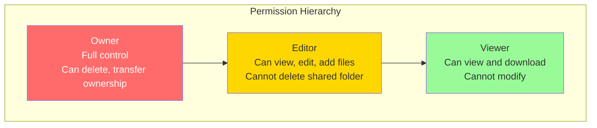

Permission enforcement:

```
Every API request goes through permission check:

1. Extract user_id from JWT token
2. Extract entry_id from request path
3. Check: does this user own this entry?
   → YES: full access (owner)
   → NO: check shares table

4. Query shares table:
   SELECT permission FROM shares
   WHERE entry_id = ? AND shared_with = ?
   (also check parent folders for inherited permissions)

5. Check if operation is allowed for the permission level:
   viewer:  GET (download, list)
   editor:  GET + PUT + POST (upload, modify, create)
   owner:   GET + PUT + POST + DELETE + share management

6. Cache result in Redis (TTL: 5 minutes)
   key: "perm:{user_id}:{entry_id}" → "editor"
```

### Shared Folder Sync

Shared folders create a fan-out sync challenge:

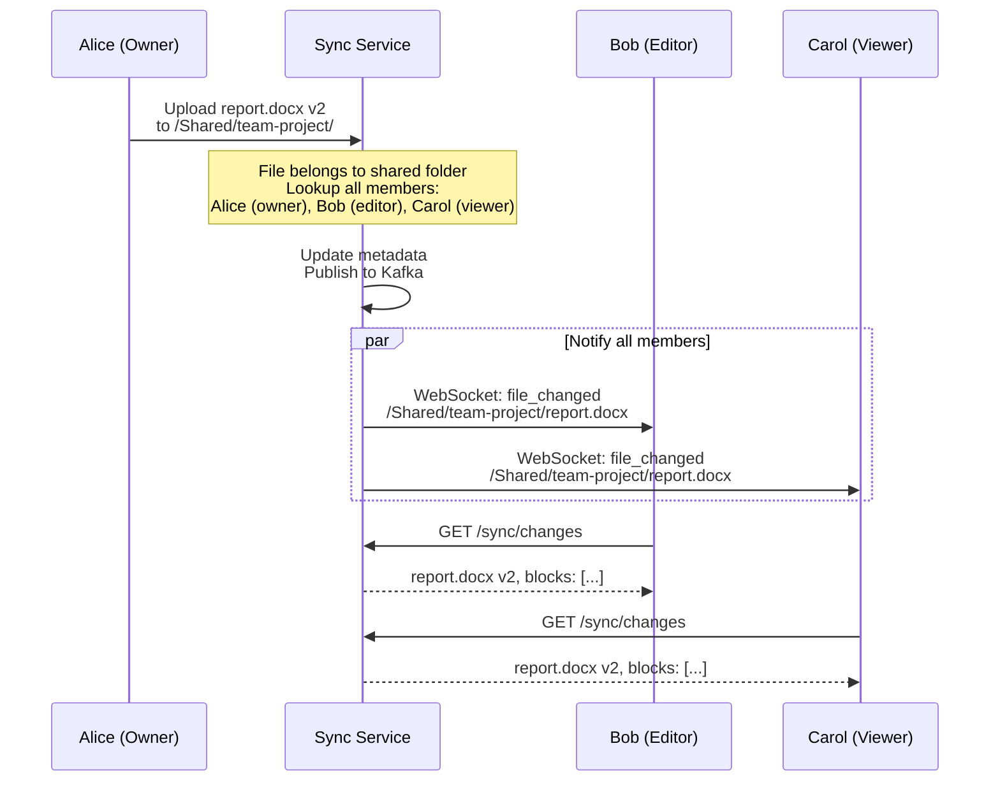

> **Namespace mapping:** Each user sees the shared folder at a different path:
> - Alice: `/Shared/team-project/`
> - Bob: `/Shared with me/team-project/`
> - Carol: `/Shared with me/team-project/`
> The server maintains a mapping from the canonical folder ID to each user's namespace.

### Link Sharing

```
Link types:
  1. View-only link:  anyone with the link can download
  2. Edit link:       anyone with the link can upload/modify
  3. Password-protected: requires additional password
  4. Expiring link:   automatically invalidates after a date

Link structure:
  https://drive.example.com/s/xYz123AbC
                                ^^^^^^^^
                                Random 10-char token
                                Maps to share_id in DB

Access flow:
  1. User opens link in browser
  2. Server looks up share_id by link token
  3. If password-protected: prompt for password
  4. If expired: return 410 Gone
  5. Otherwise: redirect to file viewer with temporary session
```

---

## Conflict Resolution

### Types of Conflicts

| Conflict type | Scenario | Frequency |
|--------------|----------|-----------|
| **Edit-edit** | Device A and B both edit the same file while offline | Common |
| **Delete-edit** | Device A deletes a file while Device B edits it | Uncommon |
| **Rename-rename** | Device A and B rename the same file to different names | Rare |
| **Folder structure** | Device A moves file to Folder X, Device B moves it to Folder Y | Rare |
| **Create-create** | Both devices create a file with the same name in the same folder | Uncommon |

### Resolution Strategies

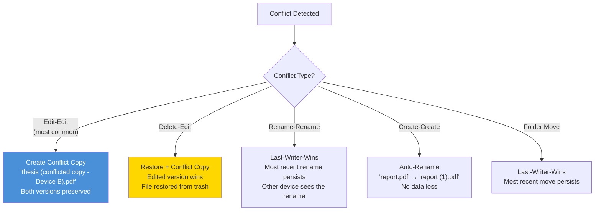

> **Dropbox's philosophy:** "Never lose data." When in doubt, create a conflict copy.
> The user can manually resolve which version to keep. This is safer than automatic
> merging, which could silently lose data in a file storage system (unlike a text
> editor where merging makes sense).

### Conflict Resolution Flow

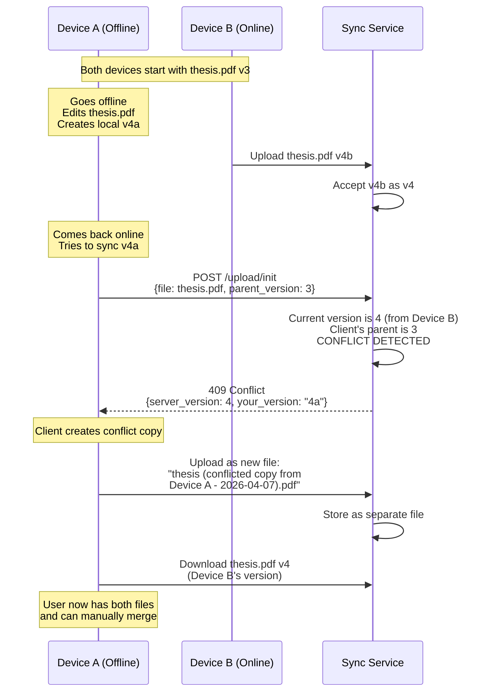

#### Conflict Detection Logic

```
When a client tries to upload a new version:

1. Client sends: file_id, parent_version (the version it was editing from)
2. Server checks: current_version == parent_version?

   If YES: No conflict. Accept upload as current_version + 1.

   If NO: Conflict detected!
     - current_version > parent_version
     - Another device uploaded a new version while this device was editing

3. Resolution:
   - Server rejects the upload with 409 Conflict
   - Client saves its version as a "conflicted copy" file
   - Client downloads the server's current version
   - User resolves manually
```

> **Why not automatic merge?** Unlike Google Docs (which uses OT/CRDTs for text),
> Dropbox handles binary files (images, PDFs, videos) where automatic merging is
> impossible. Even for text files, silent merging can produce unexpected results.
> The conflict copy approach is the safest strategy for a general-purpose file storage system.

---

> **Up next:** Part 3 covers deep dives into content-defined chunking algorithms,
> sync conflict edge cases, offline reconciliation, metadata DB scaling, bandwidth
> optimization with delta sync, versioning garbage collection, and interview tips.
