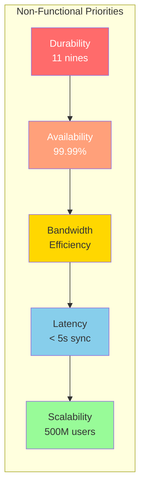
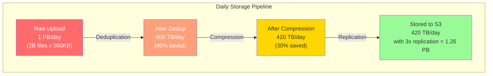
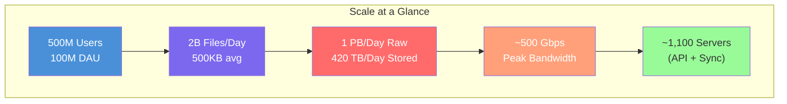
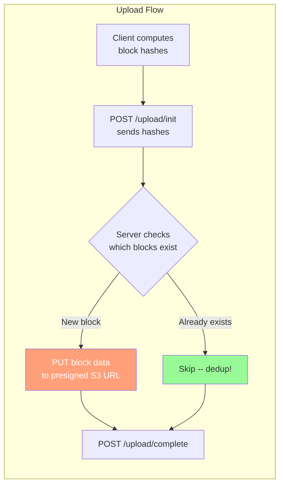
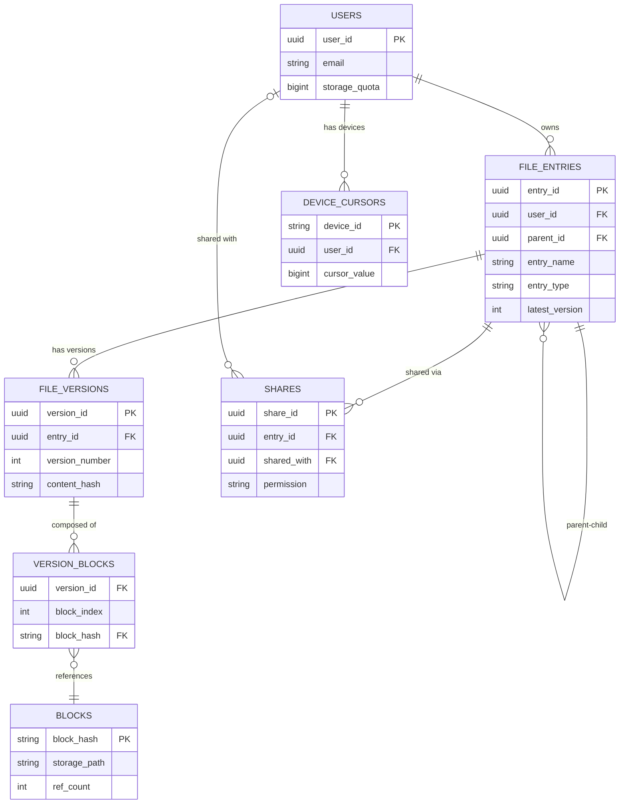

# Design Dropbox / Google Drive -- Requirements, Estimation, and API Design

## Complete System Design Interview Walkthrough (Part 1 of 3)

> This document covers the foundational phase of designing a cloud file storage and
> sync service: gathering requirements, estimating scale, and defining the API
> surface. Parts 2 and 3 cover the high-level architecture and deep dives respectively.

---

## Table of Contents

- [Step 1: Requirements and Scope](#step-1-requirements-and-scope)
  - [Functional Requirements](#functional-requirements)
  - [Non-Functional Requirements](#non-functional-requirements)
  - [Out of Scope](#out-of-scope)
  - [Clarifying Questions to Ask the Interviewer](#clarifying-questions-to-ask-the-interviewer)
- [Step 2: Back-of-Envelope Estimation](#step-2-back-of-envelope-estimation)
  - [User and Traffic Numbers](#user-and-traffic-numbers)
  - [Storage Estimation](#storage-estimation)
  - [Bandwidth Estimation](#bandwidth-estimation)
  - [Block-Level Metrics](#block-level-metrics)
  - [Server Estimates](#server-estimates)
  - [Estimation Summary Diagram](#estimation-summary-diagram)
- [Step 3: API Design](#step-3-api-design)
  - [File Operations API (REST)](#file-operations-api-rest)
  - [Sync Protocol API](#sync-protocol-api)
  - [Sharing API](#sharing-api)
  - [Notification API (WebSocket / Long Polling)](#notification-api-websocket--long-polling)
  - [API Design Rationale](#api-design-rationale)
- [Data Model](#data-model)
  - [Metadata Database (PostgreSQL)](#metadata-database-postgresql)
  - [Block Storage (S3 / GCS)](#block-storage-s3--gcs)
  - [Data Model Relationships](#data-model-relationships)

---

## Step 1: Requirements and Scope

### Functional Requirements

#### Core File Operations

| # | Requirement | Description |
|---|-------------|-------------|
| FR-1 | **Upload files** | Users can upload files of any type and size (up to a max limit, e.g. 50GB) |
| FR-2 | **Download files** | Users can download any file they own or have been granted access to |
| FR-3 | **Auto-sync across devices** | File changes on one device propagate automatically to all linked devices |
| FR-4 | **File versioning** | Every file edit creates a new version; users can view and restore past versions |
| FR-5 | **Sharing with permissions** | Users can share files/folders with specific users or via link (view, edit, owner roles) |
| FR-6 | **Offline editing and sync** | Users can create/edit files offline; changes are queued and synced on reconnect |
| FR-7 | **Block-level deduplication** | Identical content blocks are stored only once across the entire system |

#### Supporting Features

| # | Requirement | Description |
|---|-------------|-------------|
| FR-8 | **File/folder organization** | Users can create folders, move, rename, copy, and delete files and folders |
| FR-9 | **Search** | Users can search for files by name, type, and content within their account |
| FR-10 | **Notifications** | Users are notified of shared file changes, new shares, and sync status |
| FR-11 | **Trash / recovery** | Deleted files are moved to trash and can be restored within 30 days |
| FR-12 | **Activity log** | Users can view a history of all operations performed on their files |

#### Requirement Priority for a 45-Minute Interview

In a time-constrained interview, focus on these requirements in order:

```
Priority 1 (Must cover in depth):
  - Block-level chunking and sync (FR-3, FR-7) -- the core differentiator
  - Upload/download with deduplication (FR-1, FR-2)
  - Sync protocol (change detection, conflict resolution)

Priority 2 (Cover at medium depth):
  - File versioning (FR-4)
  - Sharing and permissions (FR-5)
  - Offline editing (FR-6)

Priority 3 (Mention, detail if time allows):
  - Search (FR-9)
  - Notifications (FR-10)
  - Trash and recovery (FR-11)
```

> **Interview tip:** The block-level chunking mechanism is what separates a strong
> answer from an average one. An interviewer expects you to explain *why* files are
> split into blocks and how this enables deduplication and efficient sync.

---

### Non-Functional Requirements

| # | Requirement | Target |
|---|-------------|--------|
| NFR-1 | **Availability** | 99.99% uptime -- users must always be able to access their files |
| NFR-2 | **Durability** | 99.999999999% (11 nines) -- data loss is unacceptable |
| NFR-3 | **Consistency** | Eventual consistency for sync across devices; strong consistency for metadata updates |
| NFR-4 | **Latency** | Sync detection < 1 second on LAN; < 5 seconds over WAN |
| NFR-5 | **Throughput** | Support millions of concurrent file syncs |
| NFR-6 | **Bandwidth efficiency** | Minimize data transfer -- only send changed blocks, never full files |
| NFR-7 | **Scalability** | Handle 500M+ users, petabytes of new data per day |
| NFR-8 | **Security** | End-to-end encryption at rest and in transit; zero-knowledge option |



> **Why durability is #1:** Unlike a social media post that can be re-created, losing
> someone's doctoral thesis or business contract is catastrophic. Dropbox famously uses
> the phrase "your stuff is safe" as a core design principle.

---

### Out of Scope

| Feature | Why excluded |
|---------|-------------|
| Real-time collaborative editing (Google Docs style) | Different problem domain -- requires OT/CRDTs |
| Media streaming / preview rendering | Separate service; not core to sync |
| Desktop app / mobile app UI design | System design focuses on backend |
| Billing and subscription management | Business logic, not architecture |
| Advanced search with OCR / content indexing | Separate search infrastructure |

---

### Clarifying Questions to Ask the Interviewer

These questions demonstrate thoughtfulness and narrow the design scope:

| # | Question | Why it matters | Assumed answer |
|---|----------|----------------|----------------|
| 1 | What is the maximum file size we need to support? | Determines chunking strategy and upload protocol | Up to 50GB |
| 2 | How many devices can a user link? | Affects sync fan-out | Up to 10 devices |
| 3 | Do we need real-time collaborative editing, or just file sync? | Completely different architectures | File sync only (not Google Docs) |
| 4 | How long should we retain file versions? | Storage cost implications | 30 days or last 100 versions |
| 5 | Should we support selective sync (sync only chosen folders per device)? | Impacts metadata sync protocol | Yes |
| 6 | What are the primary file types? | Affects dedup ratios and chunking | Documents, images, code, videos -- all types |
| 7 | Do we need end-to-end encryption? | Impacts ability to do server-side dedup | At-rest and in-transit; server can see block hashes but not content |
| 8 | Should shared folder changes trigger immediate sync? | Notification design | Yes, near real-time |

---

## Step 2: Back-of-Envelope Estimation

### User and Traffic Numbers

| Metric | Value | Reasoning |
|--------|-------|-----------|
| Total registered users | 500M | Similar to Dropbox's reported user base |
| DAU (daily active users) | 100M | ~20% of registered users active daily |
| Average linked devices per active user | 3 | Desktop, laptop, phone |
| Peak concurrent connections | 50M | ~50% of DAU online at peak |
| Files uploaded per day | 2B | ~20 files per active user per day |
| Average file size | 500KB | Mix of documents (small) and images/videos (large) |
| Read:write ratio | 3:1 | Users download/view more than they upload |

### Storage Estimation

```
New data per day:
  2B files/day x 500KB average = 1PB/day of raw data

With block-level deduplication (~40% dedup ratio):
  1PB x 0.60 = 600TB/day of unique new blocks

With compression (~30% reduction):
  600TB x 0.70 = 420TB/day actual storage

Annual new storage (before versioning cleanup):
  420TB/day x 365 = ~150PB/year

With version retention (30 days, then GC old versions):
  Active storage: ~150PB (growing at ~420TB/day)
  Cold storage (old versions): ~50PB
  Total managed: ~200PB
```



### Bandwidth Estimation

```
Upload bandwidth:
  1PB/day = 1,000TB / 86,400 seconds = ~11.6 GB/s raw
  After dedup (only unique blocks actually transferred): ~7 GB/s
  Peak (3x average): ~21 GB/s upload

Download bandwidth:
  3x upload (3:1 read ratio) = ~35 GB/s raw
  With CDN caching (~60% cache hit for popular shared files): ~14 GB/s from origin
  Peak: ~42 GB/s download from origin

Total peak bandwidth from origin servers:
  ~63 GB/s = ~504 Gbps
```

### Block-Level Metrics

```
Block size: 4MB (Dropbox's choice; good balance of dedup and overhead)

Blocks per file (average):
  Average file 500KB: most files are 1 block (500KB < 4MB)
  Large files (100MB video): 100MB / 4MB = 25 blocks

Blocks uploaded per day:
  Most files < 4MB so ~1 block each: ~2B blocks/day
  Some large files with multiple blocks: ~2.5B blocks/day total

Block hash computations per day:
  Client-side: 2.5B hashes/day for new blocks
  Dedup lookups: 2.5B hash lookups/day against block index

Metadata operations per day:
  File creates/updates: 2B/day
  Sync check-ins (device polls for changes): 100M DAU x 3 devices x
    average 1 check per 60s = ~5M checks/second at peak
```

### Server Estimates

```
API Servers (handling REST requests):
  Peak QPS: ~300K requests/second
  At 10K QPS per server: 30 API servers
  With headroom (3x): ~100 API servers

Sync / Notification Servers (WebSocket / long-poll):
  50M concurrent connections
  At 50K connections per server: 1,000 sync servers

Metadata DB:
  ~5M reads/second (sync checks) + 50K writes/second
  Sharded PostgreSQL: ~100 shards (50K reads/shard)

Block Storage:
  420TB/day writes to S3 (managed service)
  No server estimate needed -- S3 handles this

Message Queue (Kafka for sync notifications):
  2B file change events/day = ~25K events/second
  10-partition Kafka cluster: manageable
```

### Estimation Summary Diagram



---

## Step 3: API Design

### File Operations API (REST)

#### Upload File (Chunked)

```
POST /api/v1/files/upload/init
Authorization: Bearer <token>
Content-Type: application/json

Request:
{
  "file_name": "thesis.pdf",
  "file_size": 52428800,          // 50MB in bytes
  "parent_folder_id": "folder_abc123",
  "content_hash": "sha256:a3f2...",  // Hash of full file
  "block_hashes": [                   // Hash of each 4MB block
    "sha256:b1c2d3...",
    "sha256:e4f5a6...",
    "sha256:c7d8e9...",
    ...
  ]
}

Response (200 OK -- server tells client which blocks it needs):
{
  "upload_id": "up_789xyz",
  "file_id": "file_456def",
  "blocks_needed": [0, 2, 5],    // Indices of blocks NOT already in storage
  "blocks_existing": [1, 3, 4],  // Already deduplicated -- skip upload
  "upload_urls": {
    "0": "https://s3.../upload/block_0?token=...",
    "2": "https://s3.../upload/block_2?token=...",
    "5": "https://s3.../upload/block_5?token=..."
  }
}
```

> **Key insight:** The client sends block hashes *before* uploading any data. The
> server responds with which blocks it already has. This is the core of deduplication
> -- if another user already uploaded a block with the same hash, it is never re-uploaded.

#### Upload Individual Block

```
PUT /api/v1/files/upload/{upload_id}/block/{block_index}
Authorization: Bearer <token>
Content-Type: application/octet-stream
Content-Length: 4194304
X-Block-Hash: sha256:b1c2d3...

Body: <raw block bytes>

Response (200 OK):
{
  "block_index": 0,
  "block_id": "blk_aaa111",
  "status": "stored"
}
```

#### Complete Upload

```
POST /api/v1/files/upload/{upload_id}/complete
Authorization: Bearer <token>

Request:
{
  "block_ids": ["blk_aaa111", "blk_bbb222", ...],  // Ordered list
  "checksum": "sha256:a3f2..."                       // Full file checksum for verification
}

Response (200 OK):
{
  "file_id": "file_456def",
  "version": 1,
  "size": 52428800,
  "created_at": "2026-04-07T10:30:00Z"
}
```

#### Download File

```
GET /api/v1/files/{file_id}/download?version={version}
Authorization: Bearer <token>

Response (200 OK):
{
  "file_name": "thesis.pdf",
  "file_size": 52428800,
  "version": 3,
  "blocks": [
    { "index": 0, "download_url": "https://cdn.../blk_aaa111?token=...", "hash": "sha256:b1c2d3..." },
    { "index": 1, "download_url": "https://cdn.../blk_bbb222?token=...", "hash": "sha256:e4f5a6..." },
    ...
  ]
}
```

> **Why return block URLs instead of streaming the file?** The client can download
> blocks in parallel, resume interrupted downloads, and skip blocks it already has locally.
> This is exactly how Dropbox's client works.

#### File Metadata Operations

```
GET    /api/v1/files/{file_id}                    -- Get file metadata
PUT    /api/v1/files/{file_id}                    -- Update metadata (rename, move)
DELETE /api/v1/files/{file_id}                    -- Move to trash
POST   /api/v1/folders                            -- Create folder
GET    /api/v1/folders/{folder_id}/contents        -- List folder contents
GET    /api/v1/files/{file_id}/versions            -- List all versions
POST   /api/v1/files/{file_id}/versions/{v}/restore -- Restore a version
```

---

### Sync Protocol API

#### Get Changes (Delta Sync)

```
GET /api/v1/sync/changes?cursor={cursor}&device_id={device_id}
Authorization: Bearer <token>

Response (200 OK):
{
  "changes": [
    {
      "type": "file_modified",
      "file_id": "file_456def",
      "path": "/Documents/thesis.pdf",
      "version": 4,
      "modified_at": "2026-04-07T11:00:00Z",
      "block_changes": {
        "added": ["blk_new111"],
        "removed": ["blk_old999"],
        "unchanged": ["blk_bbb222", "blk_ccc333"]
      }
    },
    {
      "type": "file_added",
      "file_id": "file_789ghi",
      "path": "/Photos/vacation.jpg",
      "version": 1,
      "modified_at": "2026-04-07T11:05:00Z"
    },
    {
      "type": "file_deleted",
      "file_id": "file_012jkl",
      "path": "/Drafts/old_notes.txt"
    }
  ],
  "cursor": "cur_abc123_v42",    // Opaque cursor for next poll
  "has_more": false
}
```

> **Cursor-based pagination:** The cursor is an opaque token that encodes the client's
> last-known state. The server uses it to compute only the delta. This is how Dropbox's
> `/delta` endpoint works -- the cursor persists across API calls and survives server restarts.

---

### Sharing API

```
POST /api/v1/files/{file_id}/share
Authorization: Bearer <token>

Request:
{
  "recipients": [
    { "email": "alice@example.com", "permission": "editor" },
    { "email": "bob@example.com", "permission": "viewer" }
  ],
  "message": "Please review this document"
}

Response (200 OK):
{
  "share_id": "share_abc123",
  "recipients": [
    { "email": "alice@example.com", "permission": "editor", "status": "invited" },
    { "email": "bob@example.com", "permission": "viewer", "status": "invited" }
  ]
}

-- Create a shared link
POST /api/v1/files/{file_id}/links
{
  "permission": "viewer",
  "expires_at": "2026-05-07T00:00:00Z",
  "password": "optional_password"
}

Response:
{
  "link": "https://drive.example.com/s/xYz123AbC",
  "permission": "viewer",
  "expires_at": "2026-05-07T00:00:00Z"
}
```

---

### Notification API (WebSocket / Long Polling)

#### WebSocket Connection

```
WSS /api/v1/sync/ws?device_id={device_id}&token={jwt}

-- Server pushes change notifications:
{
  "type": "file_changed",
  "file_id": "file_456def",
  "path": "/Documents/thesis.pdf",
  "version": 5,
  "changed_by": "user_alice",
  "timestamp": "2026-04-07T12:00:00Z"
}

-- Client acknowledges:
{
  "type": "ack",
  "file_id": "file_456def",
  "version": 5
}
```

#### Long Polling Fallback

```
GET /api/v1/sync/longpoll?cursor={cursor}&timeout=90
Authorization: Bearer <token>

-- Server holds connection open until changes exist or timeout:
Response (200 OK):
{
  "changes": true    // Client should now call GET /sync/changes
}
```

> **Why both WebSocket and long polling?** WebSocket is preferred for desktop clients
> that maintain persistent connections. Long polling is the fallback for environments
> where WebSocket connections are blocked (corporate firewalls, some mobile networks).
> Dropbox historically used long polling; modern implementations prefer WebSocket.

---

### API Design Rationale



| Design decision | Rationale |
|----------------|-----------|
| Chunked upload (not streaming) | Enables resume, parallelism, dedup, and block-level sync |
| Presigned S3 URLs for block upload | API servers don't handle large data; S3 handles throughput |
| Cursor-based sync | Stateless server; client tracks its own position; efficient delta |
| WebSocket + long-poll | WebSocket for speed; long-poll for compatibility |
| Separate metadata and block APIs | Metadata is small, frequent, SQL-friendly; blocks are large, binary, object-storage-friendly |

---

## Data Model

### Metadata Database (PostgreSQL)

```sql
-- Users table
CREATE TABLE users (
    user_id         UUID PRIMARY KEY,
    email           VARCHAR(255) UNIQUE NOT NULL,
    display_name    VARCHAR(255),
    storage_quota   BIGINT DEFAULT 2147483648,  -- 2GB default
    storage_used    BIGINT DEFAULT 0,
    created_at      TIMESTAMP DEFAULT NOW()
);

-- Files and folders (unified tree structure)
CREATE TABLE file_entries (
    entry_id        UUID PRIMARY KEY,
    user_id         UUID NOT NULL REFERENCES users(user_id),
    parent_id       UUID REFERENCES file_entries(entry_id),
    entry_name      VARCHAR(1024) NOT NULL,
    entry_type      VARCHAR(10) NOT NULL CHECK (entry_type IN ('file', 'folder')),
    latest_version  INT DEFAULT 1,
    file_size       BIGINT DEFAULT 0,
    content_hash    VARCHAR(128),
    mime_type       VARCHAR(255),
    is_deleted      BOOLEAN DEFAULT FALSE,
    created_at      TIMESTAMP DEFAULT NOW(),
    updated_at      TIMESTAMP DEFAULT NOW(),

    -- Composite index for listing folder contents
    UNIQUE (user_id, parent_id, entry_name)
);
CREATE INDEX idx_file_entries_user_parent ON file_entries(user_id, parent_id);
CREATE INDEX idx_file_entries_updated ON file_entries(user_id, updated_at);

-- File versions
CREATE TABLE file_versions (
    version_id      UUID PRIMARY KEY,
    entry_id        UUID NOT NULL REFERENCES file_entries(entry_id),
    version_number  INT NOT NULL,
    file_size       BIGINT NOT NULL,
    content_hash    VARCHAR(128) NOT NULL,
    modified_by     UUID REFERENCES users(user_id),
    device_id       VARCHAR(128),
    created_at      TIMESTAMP DEFAULT NOW(),

    UNIQUE (entry_id, version_number)
);

-- Blocks: maps which blocks belong to which file version (ordered)
CREATE TABLE version_blocks (
    version_id      UUID NOT NULL REFERENCES file_versions(version_id),
    block_index     INT NOT NULL,
    block_hash      VARCHAR(128) NOT NULL,
    block_size      INT NOT NULL,

    PRIMARY KEY (version_id, block_index)
);

-- Global block reference count (for garbage collection)
CREATE TABLE blocks (
    block_hash      VARCHAR(128) PRIMARY KEY,
    block_size      INT NOT NULL,
    storage_path    VARCHAR(512) NOT NULL,   -- S3 key
    ref_count       INT DEFAULT 1,
    created_at      TIMESTAMP DEFAULT NOW()
);

-- Sharing permissions
CREATE TABLE shares (
    share_id        UUID PRIMARY KEY,
    entry_id        UUID NOT NULL REFERENCES file_entries(entry_id),
    shared_by       UUID NOT NULL REFERENCES users(user_id),
    shared_with     UUID REFERENCES users(user_id),     -- NULL for link shares
    permission      VARCHAR(20) NOT NULL CHECK (permission IN ('viewer', 'editor', 'owner')),
    share_link      VARCHAR(128) UNIQUE,
    link_password   VARCHAR(256),
    expires_at      TIMESTAMP,
    created_at      TIMESTAMP DEFAULT NOW()
);
CREATE INDEX idx_shares_entry ON shares(entry_id);
CREATE INDEX idx_shares_user ON shares(shared_with);

-- Sync cursor tracking (per device)
CREATE TABLE device_cursors (
    device_id       VARCHAR(128) PRIMARY KEY,
    user_id         UUID NOT NULL REFERENCES users(user_id),
    cursor_value    BIGINT NOT NULL DEFAULT 0,   -- Monotonic sequence number
    device_name     VARCHAR(255),
    last_seen       TIMESTAMP DEFAULT NOW()
);
```

### Block Storage (S3 / GCS)

```
Block storage layout in S3:

s3://dropbox-blocks/
  ├── ab/                         # First 2 chars of hash (fan-out)
  │   ├── cd/                     # Next 2 chars
  │   │   ├── abcdef1234...       # Full SHA-256 hash as key
  │   │   ├── abcd987654...
  │   │   └── ...
  │   └── ...
  └── ...

Each block is stored as:
  - Content: raw bytes (compressed with LZ4)
  - Metadata: original_size, compressed_size, encryption_iv
  - Storage class: S3 Standard (hot) or S3 Glacier (cold, for old versions)
```

> **Content-addressable storage:** Blocks are keyed by their SHA-256 hash. This means
> identical content always maps to the same key, regardless of which user uploaded it.
> This is the foundation of cross-user deduplication.

### Data Model Relationships



---

> **Up next:** Part 2 covers the high-level architecture -- the sync service, block
> storage service, notification system, and the critical chunking algorithm that makes
> efficient sync possible.
