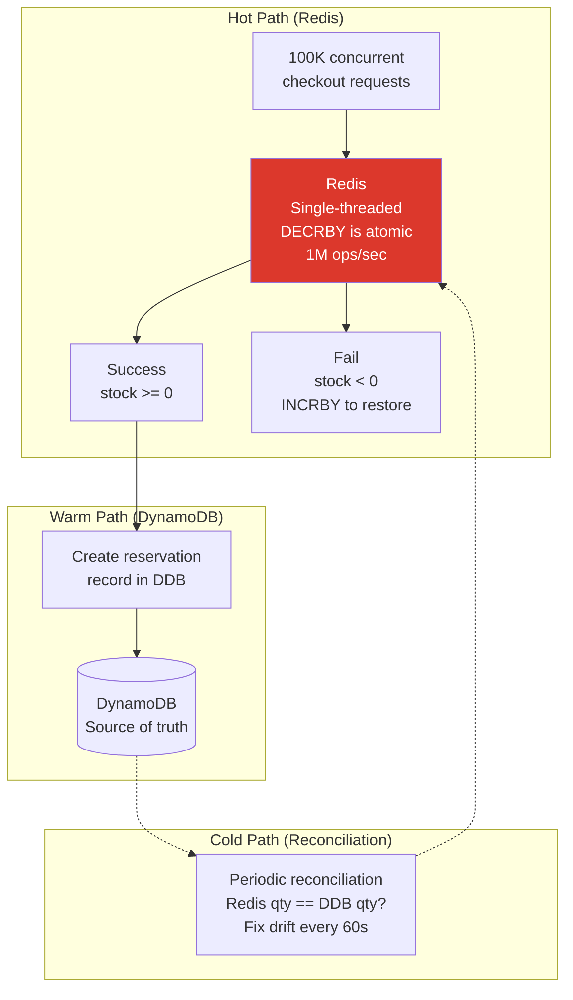
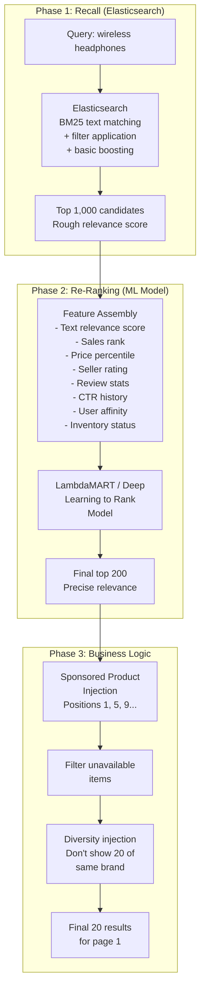
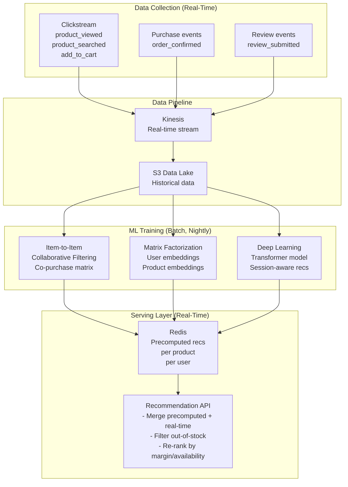
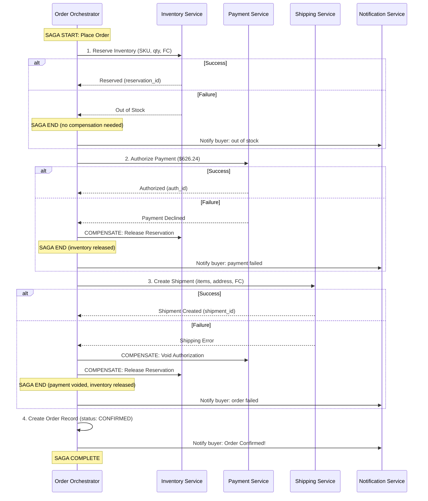
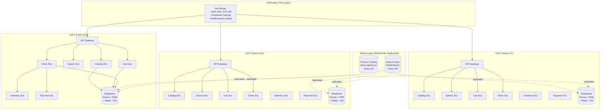

# Design Amazon / E-Commerce Platform: Deep Dive and Scaling

## Table of Contents
- [1. Deep Dive #1: Inventory at Scale (Preventing Overselling)](#1-deep-dive-1-inventory-at-scale-preventing-overselling)
- [2. Deep Dive #2: Search Ranking](#2-deep-dive-2-search-ranking)
- [3. Deep Dive #3: Flash Sales and Prime Day](#3-deep-dive-3-flash-sales-and-prime-day)
- [4. Recommendation Engine](#4-recommendation-engine)
- [5. Order Saga with Compensating Transactions](#5-order-saga-with-compensating-transactions)
- [6. Cell-Based Architecture (Amazon's Actual Approach)](#6-cell-based-architecture-amazons-actual-approach)
- [7. Trade-offs and Alternatives](#7-trade-offs-and-alternatives)
- [8. Interview Tips and Common Questions](#8-interview-tips-and-common-questions)

---

## 1. Deep Dive #1: Inventory at Scale (Preventing Overselling)

### 1.1 The Core Problem

```
Scenario: Sony XM4 headphones, last 5 units in stock at SEA3 warehouse.
  - 100 concurrent users viewing the product page
  - 20 users click "Add to Cart" within the same second
  - 10 users reach checkout simultaneously
  - Only 5 can successfully purchase

If we naively do:
  available = SELECT available_qty FROM inventory WHERE sku='XM4' AND fc='SEA3'
  IF available >= requested_qty:
      UPDATE inventory SET available_qty = available_qty - requested_qty

Problem: Between SELECT and UPDATE, another thread can read the same "5 available"
and both think they can proceed. Result: overselling (negative inventory).

This is the classic TOCTOU (Time-of-Check-to-Time-of-Use) race condition.
Amazon handles ~50M orders/day. Even a 0.01% overselling rate = 5,000 unhappy
customers per day. At Prime Day scale (100x), this becomes 500,000.
```

### 1.2 Approach 1: Pessimistic Locking (SELECT FOR UPDATE)

```sql
-- Approach: Lock the row before reading
BEGIN;
  SELECT available_qty FROM inventory
  WHERE sku = 'SONY-XM4-BLK' AND fc = 'SEA3'
  FOR UPDATE;  -- Acquires exclusive row lock

  -- If available >= requested
  UPDATE inventory
  SET available_qty = available_qty - 2,
      reserved_qty = reserved_qty + 2
  WHERE sku = 'SONY-XM4-BLK' AND fc = 'SEA3';
COMMIT;
```

```
Pros:
  + Guarantees correctness (no overselling)
  + Simple to understand and implement
  + Strong consistency

Cons:
  - Lock contention: popular items (PS5, iPhone launch) create a
    bottleneck -- all concurrent checkouts serialize on that single row
  - Deadlock risk: if we lock multiple SKUs for a multi-item order
  - Throughput ceiling: ~1,000-2,000 TPS per SKU (database limited)
  - Not viable for flash sales where 100K users target the same item

Verdict: Works for normal traffic, fails catastrophically for popular items.
```

### 1.3 Approach 2: Optimistic Locking (Version Counter)

```sql
-- Approach: Read without locking, use version to detect conflicts
-- Step 1: Read current state
SELECT available_qty, version FROM inventory
WHERE sku = 'SONY-XM4-BLK' AND fc = 'SEA3';
-- Returns: available_qty=5, version=147

-- Step 2: Conditional update (only if version hasn't changed)
UPDATE inventory
SET available_qty = available_qty - 2,
    reserved_qty = reserved_qty + 2,
    version = version + 1
WHERE sku = 'SONY-XM4-BLK' AND fc = 'SEA3'
  AND version = 147                           -- Optimistic lock condition
  AND available_qty >= 2;                     -- Safety check

-- If affected_rows == 0:
--   Either version changed (another transaction committed first)
--   Or insufficient stock
--   -> RETRY (re-read and try again, up to 3 attempts)
```

```
DynamoDB equivalent (Amazon's actual approach):

dynamodb.update_item(
    TableName='inventory',
    Key={'PK': 'SKU#SONY-XM4-BLK', 'SK': 'FC#SEA3'},
    UpdateExpression='SET available_qty = available_qty - :qty,
                          reserved_qty = reserved_qty + :qty,
                          version = version + :one',
    ConditionExpression='version = :expected_version AND available_qty >= :qty',
    ExpressionAttributeValues={
        ':qty': 2,
        ':expected_version': 147,
        ':one': 1
    }
)
# Throws ConditionalCheckFailedException if condition fails -> RETRY

Pros:
  + No locks held -- reads don't block writes
  + Higher throughput than pessimistic locking
  + Natural fit for DynamoDB conditional writes
  + Works well when contention is moderate

Cons:
  - Under high contention (flash sale), most retries fail
    -> "Retry storm": 100K users, only 1 succeeds per round, 99,999 retry
    -> Cascading retries amplify load
  - Wasted work: compute the order, then discover you lost the race
  - Not ideal when 100K users compete for 100 items

Verdict: Good for normal to moderate traffic. Degrades under extreme contention.
```

### 1.4 Approach 3: Redis Atomic Decrement (Best for Hot Items)

```
-- Approach: Pre-load stock into Redis, use DECRBY atomically
-- Redis is single-threaded, so DECRBY is inherently serialized

-- Setup: When product goes on sale or inventory changes
SET inventory:SONY-XM4-BLK:SEA3 5000

-- Checkout: Atomic decrement
result = DECRBY inventory:SONY-XM4-BLK:SEA3 2

IF result >= 0:
    -- Success: stock reserved
    -- Proceed to create reservation record in DynamoDB
    -- If downstream fails (payment, etc.), INCRBY to return stock
ELSE:
    -- Stock depleted (went below 0)
    -- Immediately return the stock: INCRBY inventory:SONY-XM4-BLK:SEA3 2
    -- Return "out of stock" to user
```



```
Pros:
  + Extremely fast: 1M+ ops/sec on a single Redis instance
  + Inherently atomic: no race conditions
  + No lock contention: single-threaded execution eliminates conflicts
  + Perfect for flash sales: serialize at the speed of Redis, not DB

Cons:
  - Redis is in-memory -> risk of data loss on crash
  - Must reconcile with DynamoDB (source of truth) periodically
  - Complexity: two sources of inventory data must stay in sync
  - Redis cluster split-brain can cause temporary inconsistency

Mitigation:
  - Redis Cluster with replicas for high availability
  - AOF persistence (append-only file) with fsync every second
  - Reconciliation job runs every 60 seconds, fixes drift
  - If Redis is unavailable, fall back to DynamoDB optimistic locking
  - Pre-warm Redis from DynamoDB before any flash sale

Verdict: Amazon's approach for high-contention items. Use Redis as the
fast coordination layer, DynamoDB as the durable source of truth.
```

### 1.5 Comparison Matrix

```
                    Pessimistic Lock  Optimistic Lock  Redis Atomic
                    ---------------   ---------------  ------------
Correctness         Guaranteed        Guaranteed       Guaranteed*
Throughput          ~2K TPS/SKU       ~10K TPS/SKU     ~1M TPS/SKU
Contention handling Poor (serialize)  Moderate (retry)  Excellent
Durability          Strong (DB)       Strong (DB)       Weak (in-memory)
Complexity          Low               Medium            High (reconciliation)
Flash sale ready    No                No                Yes
Normal operations   Viable            Recommended       Overkill

* Guaranteed assuming reconciliation keeps Redis in sync with DynamoDB.

Amazon's actual strategy:
  - Normal items: Optimistic locking on DynamoDB
  - Hot/popular items: Redis atomic decrement + DynamoDB reconciliation
  - Flash sale items: Redis atomic decrement + queue-based checkout
```

### 1.6 Distributed Inventory Across Warehouses

```
Challenge: A single SKU exists in 8 warehouses. How to globally prevent overselling?

Option A: Centralized counter (single Redis key for global stock)
  Pros: Simple, single point of truth
  Cons: Cross-region latency (user in Tokyo hits Redis in Virginia = 150ms RTT)

Option B: Partitioned by warehouse (each FC has independent stock)
  Pros: Local decisions, no cross-region calls
  Cons: Customer sees "5 in stock" but their nearest FC has 0

Option C: Hierarchical reservation (Amazon's approach)
  - Global view: sum of all FC stock (for display on product page)
  - Checkout: reserve from the nearest FC with stock
  - If nearest FC depleted: cascade to next-nearest FC
  - Each FC's Redis is authoritative for that FC's stock only
  -> No single global lock needed
  -> Cross-FC transfer is an async background job

  Implementation:
    1. Product page shows: SUM of available_qty across all FCs (cached)
    2. Checkout: attempt DECRBY on nearest FC's Redis
    3. If nearest FC fails (stock=0): try next FC
    4. If all FCs in region fail: expand to next region
    5. Order routed to whichever FC successfully reserved

  This is why Amazon sometimes ships from a distant warehouse --
  the nearest one was out of stock at the moment of reservation.
```

---

## 2. Deep Dive #2: Search Ranking

### 2.1 The Ranking Challenge

```
When a user searches "wireless headphones", Elasticsearch returns 50,000 matching products.
We need to show the best 20 on page 1. "Best" is multi-dimensional:

Signals used for ranking:
  1. Text relevance (how well does the product title/description match the query?)
  2. Popularity (sales volume, sales velocity, click-through rate)
  3. Price competitiveness (is this a good deal?)
  4. Seller quality (seller rating, fulfillment speed, return rate)
  5. Review quality (average rating, number of reviews, recency)
  6. Conversion rate (what % of viewers buy this product?)
  7. Personalization (does this match the user's purchase history?)
  8. Freshness (recently listed products may get a boost)
  9. Sponsored (paid ads are blended into organic results)

Amazon's A9 search algorithm (now A10) balances all these factors.
```

### 2.2 Two-Phase Ranking Architecture



### 2.3 Ranking Feature Weights (Simplified)

```
Learning-to-Rank model features and approximate impact:

Feature                    Weight    Description
-------                    ------    -----------
text_relevance_score       0.25      BM25 score from Elasticsearch
conversion_rate            0.20      Historical: purchases / views
sales_velocity_7d          0.15      Units sold in last 7 days
review_score               0.10      (avg_rating * log(review_count))
price_competitiveness      0.08      1 - (price / category_median_price)
seller_rating              0.07      Seller feedback score (1-5)
fulfillment_type           0.05      FBA > FBM (Prime-eligible boost)
click_through_rate         0.05      CTR from search impressions
freshness_decay            0.03      Exponential decay from listing date
user_affinity              0.02      Personalization signal (cosine sim)

Note: These weights are learned by the ML model, not hand-tuned. The model is
retrained weekly on click-through and purchase data. The weights above are
illustrative of relative importance.

Interview tip: Mention that Amazon's search ranking is an ML model that optimizes
for PURCHASE probability, not just click probability. This is what differentiates
e-commerce search from web search (which optimizes for clicks).
```

### 2.4 Personalization Layer

```
How personalization works at Amazon scale:

1. User Profile Vector (built from purchase + browse history):
   user_12345.embedding = [0.82, 0.15, 0.03, ...]  (128-dim vector)
   Represents user's preferences across product categories

2. Product Embedding:
   product_XM4.embedding = [0.91, 0.12, 0.05, ...]  (128-dim vector)

3. Affinity Score:
   affinity = cosine_similarity(user_embedding, product_embedding)
   = 0.95 (high affinity -- this user loves audio products)

4. Incorporation into ranking:
   final_score = base_relevance_score * (1 + personalization_weight * affinity)

5. Cold start problem:
   - New users: use category-level popularity (no personalization)
   - After 5 searches: basic affinity model kicks in
   - After 10 purchases: full personalization model

6. Implementation:
   - User embeddings precomputed nightly (batch ML pipeline)
   - Stored in Redis for real-time lookup
   - Product embeddings stored in Elasticsearch as dense_vector field
   - ANN (Approximate Nearest Neighbor) for "similar products" queries
```

### 2.5 Sponsored Products Integration

```
Sponsored products (ads) are blended into organic search results:

Positions reserved for ads: 1, 5, 9, 13, 17 (every 4th result on average)

Ad selection process:
  1. Advertiser bids on keywords (e.g., "wireless headphones")
  2. When user searches that keyword:
     a. Fetch eligible ads (keyword match + budget available + product in stock)
     b. Rank ads by: bid_amount * predicted_CTR * relevance_score
        This is the Ad Rank (similar to Google Ads)
     c. Winner pays second-price auction (pay $0.01 more than 2nd highest bid)
  3. Insert winning ads into designated positions
  4. Mark as "Sponsored" in the UI

Revenue significance: Sponsored products is a $30B+ revenue stream for Amazon.
The search ranking system must balance:
  - User experience (relevant results)
  - Seller success (fair Buy Box competition)
  - Ad revenue (sponsored product placements)
  - Platform economics (higher-margin products may get slight boost)
```

---

## 3. Deep Dive #3: Flash Sales and Prime Day

### 3.1 The Scale Challenge

```
Prime Day 2025 metrics (public):
  - 300+ million items purchased globally
  - Peak: estimated 100,000+ orders per SECOND
  - Traffic surge: 100x normal levels
  - Duration: 48 hours

Engineering challenges:
  1. 100x traffic spike in minutes (not hours to ramp)
  2. Extreme inventory contention (Lightning Deals: 1000 units, 500K users)
  3. Cascading failures if any service is overwhelmed
  4. Must maintain sub-second response times throughout
  5. Payment processors may rate-limit or slow down
  6. Search index must stay current (sold-out items removed quickly)
```

### 3.2 Queue-Based Checkout Architecture

For flash sales, direct checkout would overwhelm the backend. Instead, Amazon uses
a virtual queue system.

```mermaid
graph TB
    subgraph "User Experience"
        USER[500K users click<br/>"Add to Cart"<br/>Lightning Deal]
        WAIT["Waiting Room<br/>(Virtual Queue)<br/>'You are #45,231 in line'<br/>'Estimated wait: 2 min'"]
        CHECKOUT[Checkout Page<br/>10-min reservation window]
    end

    subgraph "Queue System"
        SQS[SQS / Kafka<br/>Order Queue<br/>FIFO processing]
        GATE[Token Gate<br/>- Issue checkout tokens<br/>- Rate: 1000 tokens/sec<br/>- Only token holders proceed]
    end

    subgraph "Backend (Protected)"
        INV[Inventory Service<br/>Processing 1000 orders/sec<br/>Not 500K/sec]
        PAY[Payment Service<br/>Rate-limited to capacity]
        ORD[Order Service]
    end

    USER --> WAIT
    WAIT --> GATE
    GATE -->|"Issued token"| CHECKOUT
    GATE -->|"Sold out"| SOLDOUT["Sorry, this deal<br/>is sold out"]
    CHECKOUT --> SQS
    SQS --> INV --> PAY --> ORD

    style WAIT fill:#ff9900,color:#000
    style GATE fill:#146eb4,color:#fff
```

```
How the queue works:

1. Deal starts at 12:00 PM
   - 500K users hit "Add to Cart" within first 10 seconds
   - System puts all users in a virtual queue

2. Token Gate issues checkout tokens at controlled rate:
   - Stock: 1,000 units
   - Processing capacity: 100 orders/sec
   - Token issue rate: 100 tokens/sec (match processing capacity)
   - Time to exhaust stock: ~10 seconds of actual processing

3. Users receive tokens in FIFO order:
   - First 1,000 users get tokens (they can proceed to checkout)
   - Remaining users see "This deal is sold out"
   - Token includes a 10-minute expiration (if user doesn't complete checkout)

4. Backend sees smooth 100 orders/sec, not 500K/sec burst
   - Inventory: DECRBY in Redis, one unit per token
   - Payment: orderly authorization requests
   - Order: normal creation flow

5. If a token-holder abandons checkout:
   - Token expires after 10 minutes
   - Stock returned to pool
   - Next user in waitlist gets a token

Key insight: The queue decouples the traffic spike from the backend processing.
Users perceive a fair queue. Backend operates at safe capacity.
```

### 3.3 Pre-Warming Strategy

```
Weeks before Prime Day, Amazon pre-warms the entire infrastructure:

1. Infrastructure Pre-Scaling (T-14 days):
   - Auto-scaling groups set to 10x minimum instances
   - Database read replicas increased from 10 to 50
   - Redis cluster expanded from 50 to 200 nodes
   - Elasticsearch replicas increased from 20 to 60
   - CDN cache pre-populated with deal product images

2. Cache Pre-Warming (T-2 days):
   - All Prime Day deal products pre-loaded into Redis
   - Product detail pages pre-rendered and cached
   - Search results for expected popular queries cached
   - Inventory counts loaded into Redis from DynamoDB

3. Load Testing (T-7 days):
   - "GameDay" exercises: simulate Prime Day traffic on production
   - Amazon actually runs traffic replays from previous Prime Day
   - Identify and fix bottlenecks discovered during load test
   - Verify circuit breakers trigger correctly

4. Feature Freeze (T-3 days):
   - No code deployments except critical bug fixes
   - All teams on-call with designated incident commanders
   - War rooms set up per service team

5. DNS and Routing (T-1 day):
   - Ensure DNS TTLs are lowered for quick failover
   - Verify multi-region failover works
   - Pre-position traffic in overflow regions
```

### 3.4 Circuit Breakers and Graceful Degradation

```mermaid
graph TB
    subgraph "Normal Operation"
        N1[Full product page<br/>Reviews, Recommendations<br/>Related products, Q&A]
    end

    subgraph "Degraded Level 1 (Review Service overloaded)"
        D1[Product page WITHOUT reviews<br/>Show cached review summary<br/>Hide detailed reviews]
    end

    subgraph "Degraded Level 2 (Recommendation Service down)"
        D2[Product page WITHOUT recommendations<br/>Show static "Best Sellers" instead<br/>of personalized recs]
    end

    subgraph "Degraded Level 3 (Search degraded)"
        D3[Search returns cached results<br/>Facets disabled<br/>Only category browsing works]
    end

    subgraph "Degraded Level 4 (Severe -- protect checkout)"
        D4[Homepage shows static deals<br/>Search disabled<br/>Only direct product links + checkout work<br/>All non-essential features OFF]
    end

    N1 -->|"Review Service circuit OPEN"| D1
    D1 -->|"Reco Service circuit OPEN"| D2
    D2 -->|"Search latency > 2s"| D3
    D3 -->|"Order queue > 100K"| D4

    style D4 fill:#cc0000,color:#fff
```

```
Circuit breaker configuration per service:

Service              Threshold        Timeout   Fallback
-------              ---------        -------   --------
Inventory Service    5% errors/10s    2s        Return cached stock level
Payment Service      3% errors/10s    5s        Queue payment, confirm later
Search Service       10% errors/10s   1s        Return cached results
Review Service       20% errors/10s   500ms     Show cached rating summary
Recommendation       30% errors/10s   500ms     Show static best sellers
Shipping Estimate    20% errors/10s   1s        Show range "2-5 business days"
Tax Calculation      10% errors/10s   2s        Estimate based on zip code

Priority hierarchy (what to protect):
  1. Checkout / Order placement  (revenue-critical, NEVER degrade)
  2. Cart operations             (pre-revenue, protect)
  3. Search                      (discovery, degrade gracefully)
  4. Product detail page         (degrade to minimal version)
  5. Reviews                     (nice-to-have, first to shed)
  6. Recommendations             (nice-to-have, first to shed)
```

### 3.5 Gradual Rollout and Regional Isolation

```
Prime Day is rolled out timezone-by-timezone, not globally at once:

Timeline:
  00:00 NZST  - New Zealand starts (small market, canary)
  00:00 JST   - Japan starts (medium market)
  00:00 IST   - India starts (large market)
  00:00 CEST  - Europe starts (large market)
  00:00 EST   - US East starts (largest market)
  00:00 PST   - US West starts

Benefits:
  - Each region acts as a canary for the next
  - If NZ has issues, they're caught before Japan starts
  - Peak load is spread across hours, not simultaneous
  - Each region's infrastructure is independent (cell architecture)

Regional isolation:
  - US-East, US-West, EU, APAC each have independent cells
  - A failure in EU does NOT impact US customers
  - Each cell has its own: API Gateway, services, databases, caches
  - Cross-cell communication is limited to async replication
```

---

## 4. Recommendation Engine

### 4.1 Architecture



### 4.2 Algorithm Details

```
Algorithm 1: Item-to-Item Collaborative Filtering
(Amazon's foundational algorithm, published 2003)

  Input: Co-purchase matrix (users who bought A also bought B)
  Output: For each product, top-N similar products

  Computation:
    For each pair of products (A, B):
      similarity(A, B) = |users_who_bought_both(A, B)| /
                          sqrt(|users_who_bought_A| * |users_who_bought_B|)
    This is cosine similarity on the purchase vectors.

  Result stored in Redis:
    recs:similar:B08N5WRWNW -> ["B09XS7JWHH", "B08HMWZBXC", ...]

  Advantage: Scales linearly with catalog size, not user base.
  Amazon found this outperforms user-to-user collaborative filtering
  because item-item relationships are more stable than user-user.


Algorithm 2: "Frequently Bought Together"
  Input: Orders containing multiple items
  Output: Association rules (A -> B with confidence C)

  Computation (simplified Apriori):
    support(A, B) = orders_containing_both(A, B) / total_orders
    confidence(A -> B) = support(A, B) / support(A)
    lift(A -> B) = confidence(A -> B) / support(B)

  Filter: Only keep rules with lift > 2 and support > 0.001%
  Displayed as: "Frequently bought together: [Product A] + [Product B]"


Algorithm 3: Personalized Homepage
  Input: User's purchase history, browse history, wishlist, cart
  Output: Ranked list of products for the user's homepage

  Approach: Two-tower model (user tower + item tower)
    user_embedding = UserTower(purchase_history, browse_history, demographics)
    item_embedding = ItemTower(product_features, category, price, brand)
    score = dot_product(user_embedding, item_embedding)

  Top-K retrieval via Approximate Nearest Neighbor (ANN) search
  over 500M product embeddings. FAISS or ScaNN library.
```

---

## 5. Order Saga with Compensating Transactions

### 5.1 The Distributed Transaction Problem

```
An order touches 4 services, each with its own database:
  1. Inventory Service: reserve stock
  2. Payment Service: authorize payment
  3. Shipping Service: create shipment
  4. Order Service: create order record

We CANNOT use a distributed 2PC (two-phase commit) because:
  - External payment processor doesn't support 2PC
  - Cross-service 2PC has poor availability (any participant failure blocks all)
  - At Amazon's scale (50M orders/day), 2PC would be a massive bottleneck

Solution: Saga pattern with compensating transactions.
```

### 5.2 Saga Orchestration Flow



### 5.3 Compensating Transaction Table

```
Step   Forward Action              Compensating Action           Idempotent?
----   ---------------             --------------------          -----------
1      Reserve inventory           Release reservation           Yes (by reservation_id)
2      Authorize payment           Void authorization            Yes (by auth_id)
3      Create shipment             Cancel shipment               Yes (by shipment_id)
4      Create order record         Mark order as failed          Yes (by order_id)

Key properties of compensating transactions:
  - They must be idempotent (safe to execute multiple times)
  - They are executed in reverse order
  - They undo the semantic effect (not necessarily the exact data change)
  - They must always succeed (retry until they do)

Saga state machine stored in DynamoDB:
  saga_id:    "saga_abc123"
  order_id:   "111-2345678-9012345"
  state:      "PAYMENT_AUTHORIZED"
  steps:      [
    { step: "RESERVE_INVENTORY", status: "COMPLETED", reservation_id: "res_001" },
    { step: "AUTHORIZE_PAYMENT", status: "COMPLETED", auth_id: "auth_456" },
    { step: "CREATE_SHIPMENT", status: "PENDING" },
    { step: "CREATE_ORDER", status: "PENDING" }
  ]
  created_at: "2026-04-07T12:00:00Z"
  timeout_at: "2026-04-07T12:05:00Z"
```

### 5.4 Failure Handling: What If the Orchestrator Crashes?

```
Problem: Orchestrator crashes after Step 2 (payment authorized) but before Step 3.
  - Inventory is reserved (will auto-expire in 10 min)
  - Payment is authorized (will auto-release in 7 days)
  - No order exists yet

Solution: Saga Recovery Worker
  - Polls for "stuck" sagas (state hasn't changed for > 2 minutes)
  - Reads the saga state from DynamoDB
  - Resumes from the last completed step:
    -> If last step = PAYMENT_AUTHORIZED: attempt CREATE_SHIPMENT
    -> If retries exhausted: execute compensating transactions in reverse

  This is why every step stores its result (reservation_id, auth_id, etc.)
  in the saga state -- so the recovery worker knows what to compensate.

Additional safety:
  - Inventory reservations have 10-min TTL (self-healing)
  - Payment authorizations have 7-day TTL (self-healing)
  - But compensating transactions execute immediately (better UX)
  - All saga operations use idempotency keys (safe retries)
```

---

## 6. Cell-Based Architecture (Amazon's Actual Approach)

### 6.1 What Is Cell Architecture?

```
Amazon's cell-based architecture is the foundation of their reliability at scale.
It was publicly described in their 2023 Builder's Library articles and re:Invent talks.

Core idea: Divide the system into identical, independent "cells", each serving
a subset of customers. A failure in one cell does NOT impact other cells.

Traditional architecture:       Cell-based architecture:
  ┌─────────────────────┐       ┌────────┐ ┌────────┐ ┌────────┐
  │   Monolithic Pool   │       │ Cell 1 │ │ Cell 2 │ │ Cell 3 │
  │   All Customers     │       │ 33% of │ │ 33% of │ │ 33% of │
  │   Single Blast      │       │ users  │ │ users  │ │ users  │
  │   Radius = 100%     │       │        │ │        │ │        │
  └─────────────────────┘       └────────┘ └────────┘ └────────┘
                                 Blast radius = 33%  (max)
```

### 6.2 Cell Architecture Diagram



### 6.3 Cell Design Principles

```
1. Cell Independence:
   - Each cell has its own databases, caches, and service instances
   - No cross-cell synchronous calls
   - Product catalog is replicated to all cells (read-only)
   - Inventory is the exception: it's cross-cell (a global resource)

2. Cell Sizing:
   - Each cell serves ~5% of total traffic
   - 20 cells for full coverage
   - Small enough that a cell failure impacts only 5% of users
   - Large enough to be efficiently operated

3. Cell Router:
   - Ultra-thin layer: hash(user_id) -> cell_id
   - Consistent hashing for stable assignment
   - Health checks: if Cell 3 is unhealthy, route its users to Cell 4
   - The router itself is the only SPOF -- replicated across AZs

4. Blast Radius:
   - Bad deployment: deploy to 1 cell first (canary), wait, then roll to rest
   - Bug: affects only 1 cell's users (5%), not all 100%
   - Infrastructure failure: contained to 1 cell
   - Data corruption: limited to 1 cell's data

5. Cross-Cell Communication (Limited):
   - Inventory: global coordination via shared DynamoDB table
   - Catalog: replicated via Kafka to all cells
   - Search index: replicated via Elasticsearch cross-cluster replication
   - Orders: cell-local, but accessible via global GSI for customer service

Amazon's public data: cell-based architecture reduced their blast radius from
100% to 5-10%, making their 99.99% availability target achievable.
```

---

## 7. Trade-offs and Alternatives

### 7.1 Key Design Decisions

```
Decision 1: Redis Cart vs DynamoDB Cart
  ┌─────────────────────┬───────────────────┬─────────────────────┐
  │                     │ Redis (chosen)    │ DynamoDB             │
  ├─────────────────────┼───────────────────┼─────────────────────┤
  │ Latency             │ < 1ms             │ 5-10ms              │
  │ Durability          │ Medium (AOF)      │ High (replicated)   │
  │ Cost at scale       │ Higher (in-memory)│ Lower (on-demand)   │
  │ Cart operations/sec │ 1M+               │ 100K (provisioned)  │
  │ Complexity          │ Need DDB backup   │ Simpler             │
  └─────────────────────┴───────────────────┴─────────────────────┘
  Why Redis: Cart is the hottest path in e-commerce. Every page load
  checks the cart count. Sub-ms matters. DDB backup handles durability.


Decision 2: Elasticsearch vs Solr vs OpenSearch
  ┌─────────────────────┬───────────────────┬─────────────────────┐
  │                     │ Elasticsearch     │ Solr                │
  ├─────────────────────┼───────────────────┼─────────────────────┤
  │ Real-time indexing  │ Near real-time    │ Near real-time      │
  │ Scaling             │ Excellent         │ Good                │
  │ Aggregations        │ Rich (facets)     │ Good                │
  │ ML integration      │ Learning to Rank  │ Limited             │
  │ Operational         │ Managed (OpenSrch)│ Self-manage         │
  │ Community           │ Larger            │ Smaller             │
  └─────────────────────┴───────────────────┴─────────────────────┘
  Why Elasticsearch (OpenSearch): AWS offers managed OpenSearch,
  excellent faceted search, native Learning-to-Rank plugin, and
  Amazon actually built Amazon OpenSearch Service from Elasticsearch.


Decision 3: Saga Orchestration vs Choreography
  ┌─────────────────────┬───────────────────┬─────────────────────┐
  │                     │ Orchestration     │ Choreography        │
  │                     │ (chosen)          │                     │
  ├─────────────────────┼───────────────────┼─────────────────────┤
  │ Visibility          │ Central view      │ Distributed         │
  │ Complexity          │ Orchestrator code │ Event chain logic   │
  │ Error handling      │ Centralized       │ Each service        │
  │ Adding steps        │ Modify orchestrtr │ Add event handler   │
  │ Debugging           │ Easier (single)   │ Harder (distributed)│
  │ Coupling            │ Orchestrator knows│ Services decoupled  │
  │                     │ all services      │                     │
  └─────────────────────┴───────────────────┴─────────────────────┘
  Why Orchestration: Order flow is the most critical business process.
  Central visibility and error handling outweigh the coupling cost.
  Amazon uses Step Functions (orchestration) for order workflows.


Decision 4: DynamoDB vs Cassandra for Orders
  ┌─────────────────────┬───────────────────┬─────────────────────┐
  │                     │ DynamoDB (chosen) │ Cassandra            │
  ├─────────────────────┼───────────────────┼─────────────────────┤
  │ Operational burden  │ Zero (managed)    │ High (self-managed) │
  │ Auto-scaling        │ Built-in          │ Manual              │
  │ Consistency         │ Tunable           │ Tunable             │
  │ Global tables       │ Built-in          │ Multi-DC possible   │
  │ Conditional writes  │ Native            │ Lightweight txn     │
  │ Cost model          │ Per-request or    │ Per-node            │
  │                     │ provisioned       │                     │
  └─────────────────────┴───────────────────┴─────────────────────┘
  Why DynamoDB: Amazon built DynamoDB. It's the natural choice for Amazon
  system design. Zero ops overhead, auto-scaling for Prime Day, and
  conditional writes are perfect for inventory management.


Decision 5: Monolith vs Microservices
  At Amazon's scale, microservices are mandatory. But the original Amazon.com
  was a monolithic Perl application (1994). The migration to SOA began in
  2001-2002 under CTO Werner Vogels. Key lesson: start monolith, decompose
  when you need to scale individual components independently.
```

### 7.2 What Could Go Wrong

```
Failure Mode                 Impact                      Mitigation
------------                 ------                      ----------
Redis cluster crash          Cart data lost              DynamoDB async backup,
                                                         restore from backup

Elasticsearch cluster slow   Search latency > 5s         Circuit breaker, return
                                                         cached results, fallback
                                                         to category browsing

Payment processor outage     Cannot place orders         Queue orders, multiple
                                                         payment processors,
                                                         retry with backoff

Inventory drift              Overselling or showing      Periodic reconciliation
(Redis != DynamoDB)          out-of-stock incorrectly    every 60s, alerts on drift

Kafka broker failure         Events delayed              Multi-broker cluster,
                                                         replication factor 3,
                                                         consumer retries

Cross-region replication     Stale catalog in region     Increase replication
lag                                                      frequency, monitor lag

Hot partition in DDB         Throttling on popular       Adaptive capacity, write
                             product's inventory         sharding, Redis front

Thundering herd              Cache stampede when         Distributed lock (Redlock),
(cache invalidation)         popular product cache       staggered TTLs, cache
                             expires                     pre-warming
```

---

## 8. Interview Tips and Common Questions

### 8.1 How to Structure Your Answer (45 Minutes)

```
Time    Activity                                  What to Demonstrate
-----   --------                                  -------------------
0-5     Requirements gathering                    Ask clarifying questions:
min     - "Are we designing the marketplace or    "What's the DAU target?"
          just the retail site?"                  "Do we need seller features?"
        - "What's the scale target?"              "Real-time inventory or eventual?"
        - Nail down scope explicitly

5-10    Back-of-envelope estimation                Show you can reason about scale:
min     - Orders/sec, search QPS                  50M orders / 86400 = 580 QPS
        - Storage for 500M products               500M x 10KB = 5TB
        - Infrastructure rough sizing             ...Peak = 100x (Prime Day)

10-25   High-level architecture                    Draw the 10 core services:
min     - Service decomposition                   Catalog, Search, Cart, Order,
        - Database selection per service          Inventory, Payment, Shipping,
        - Communication patterns                  Review, Recommendation, User
        - Key data flows (search, checkout)       CQRS for catalog + search

25-40   Deep dives (pick 2)                        Show depth on critical problems:
min     - Inventory at scale (overselling)        Redis atomic decrement
        - Search ranking                          Two-phase ranking (ES + ML)
        - Checkout flow (saga pattern)            Compensating transactions
        - Flash sale / Prime Day                  Queue-based checkout

40-45   Scaling and trade-offs                     Show mature reasoning:
min     - Cell architecture                       Blast radius containment
        - Caching strategy                        CDN -> Redis -> DB
        - Failure modes and mitigations           Circuit breakers per service
```

### 8.2 Common Follow-Up Questions

```
Q: "How do you prevent overselling during a flash sale?"
A: Redis atomic DECRBY for the hot path, with DynamoDB as source of truth.
   Pre-load stock into Redis before the sale. If Redis goes negative,
   immediately INCRBY to restore and return "sold out" to user.
   Periodic reconciliation ensures Redis stays in sync with DynamoDB.

Q: "How does the Buy Box work?"
A: Multiple sellers offer the same product. The Buy Box algorithm scores
   each offer based on price, seller rating, fulfillment type (FBA preferred),
   and shipping speed. The winning seller's offer becomes the default "Add to Cart".
   This is why Amazon Marketplace sellers compete on these metrics.

Q: "What happens if the user adds an item to cart but the price changes?"
A: Cart stores price_at_add for display, but at checkout, we re-validate
   all prices against the catalog. If the price changed, we show the user
   the updated price before they confirm. We NEVER charge a price different
   from what was shown at checkout confirmation.

Q: "How do you handle a product that suddenly goes viral?"
A: The product becomes a "hot key" in multiple systems:
   - Inventory: Redis atomic decrement handles contention
   - Product page: CDN cache absorbs read traffic
   - Search: Elasticsearch handles reads via replicas
   - Cart: Redis handles add-to-cart spikes
   Operationally: auto-scaling kicks in, alerts fire, and if needed,
   the product page is pre-rendered and served statically from CDN.

Q: "How does Amazon handle 100x traffic on Prime Day?"
A: Four strategies working together:
   1. Pre-scaling: instances, replicas, and caches scaled 2 weeks early
   2. Cell architecture: isolates blast radius, enables gradual rollout
   3. Queue-based checkout: smooths traffic spikes for flash deals
   4. Graceful degradation: non-essential features shed under load

Q: "What consistency model do you use for inventory?"
A: Strong consistency for checkout (must prevent overselling).
   Eventual consistency for display (product page shows "In Stock" based on
   cached data that may be 5-10 seconds stale). This is acceptable because
   the final check happens at checkout, which is strongly consistent.

Q: "How do you handle multi-item orders across different warehouses?"
A: Split shipment strategy:
   1. For each item in the order, find the optimal fulfillment center
   2. If all items are in one FC, create a single shipment
   3. If items are in different FCs, create multiple shipments
   4. Each shipment is tracked independently
   5. Payment is captured per-shipment (as each ships), not all at once
   Amazon shows "Arriving in 2 shipments" when this happens.

Q: "SQL or NoSQL for orders?"
A: DynamoDB (NoSQL). Reasons:
   - Orders are write-heavy (50M/day), DynamoDB handles this natively
   - Access patterns are simple: get by user_id, get by order_id
   - No complex JOINs needed for order data
   - Auto-scaling for Prime Day spikes
   - Global tables for multi-region
   Amazon literally built DynamoDB for this exact use case (2007 Dynamo paper).
```

### 8.3 What Impresses Interviewers

```
1. Mentioning Amazon-specific architecture:
   - Cell-based architecture (shows you've done your research)
   - DynamoDB (Amazon built it; showing you know why is impressive)
   - Two-phase payment (authorize at checkout, capture at ship)
   - Buy Box algorithm (shows e-commerce domain knowledge)

2. Quantitative reasoning:
   - "50M orders/day = 580 QPS average, but Prime Day = 58K QPS"
   - "500M products x 10KB = 5TB, fits in a large Aurora cluster"
   - "100GB cart data fits entirely in a Redis cluster"
   - Showing you can do napkin math quickly

3. Trade-off articulation:
   - "We use Redis for carts because sub-ms matters for this hot path,
     but we accept the durability risk by backing up to DynamoDB"
   - "Optimistic locking works for 99% of products, but for flash sales
     we switch to Redis atomic decrements"

4. Production awareness:
   - "We need idempotency keys on checkout to prevent double-orders"
   - "Inventory reservations have TTLs so abandoned checkouts self-heal"
   - "Circuit breakers on non-critical services prevent cascading failures"
   - "Pre-warming caches before Prime Day is critical for first-request latency"

5. Knowing what NOT to build:
   - "We don't need distributed transactions -- sagas with compensation work here"
   - "We don't need global strong consistency -- eventual is fine for catalog"
   - "We don't need to build our own search -- Elasticsearch/OpenSearch is sufficient"
```

### 8.4 Quick Reference: Numbers to Remember

```
Metric                          Value               How to derive
------                          -----               -------------
DAU                             500M                Given
Orders/day                      50M                 Given (10% conversion)
Orders/sec (avg)                ~580                50M / 86,400
Orders/sec (Prime Day peak)     ~58,000             580 x 100
Search QPS (avg)                ~29,000             500M x 5 / 86,400
Search QPS (peak)               ~2,900,000          29K x 100
Product catalog                 500M products       Given
Product data                    5 TB                500M x 10KB
Product images                  2.5 PB              500M x 10 x 500KB
Cart data (active)              100 GB              50M carts x 2KB
Order data/year                 91 TB               50M x 5KB x 365
Search index                    1.5 TB              500M x 3KB
Elasticsearch nodes             ~1,000              1.5TB x 21 replicas / 30GB/node
Redis cluster (cart)            ~50 nodes           100GB / 2GB per shard
```
