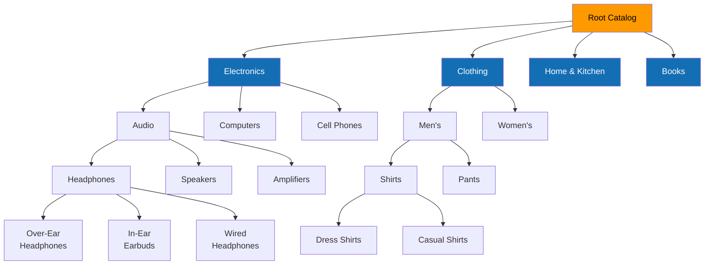
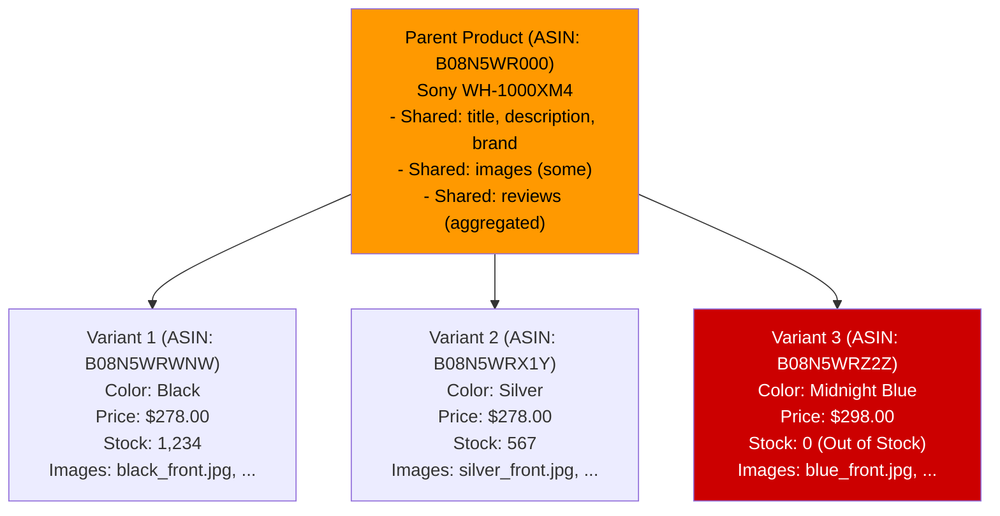
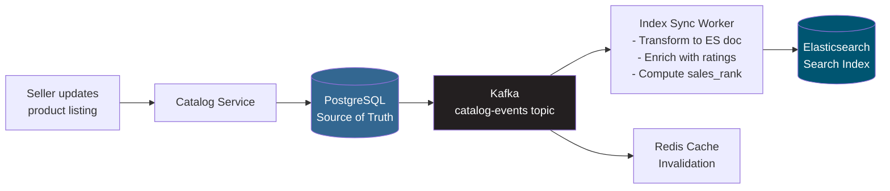
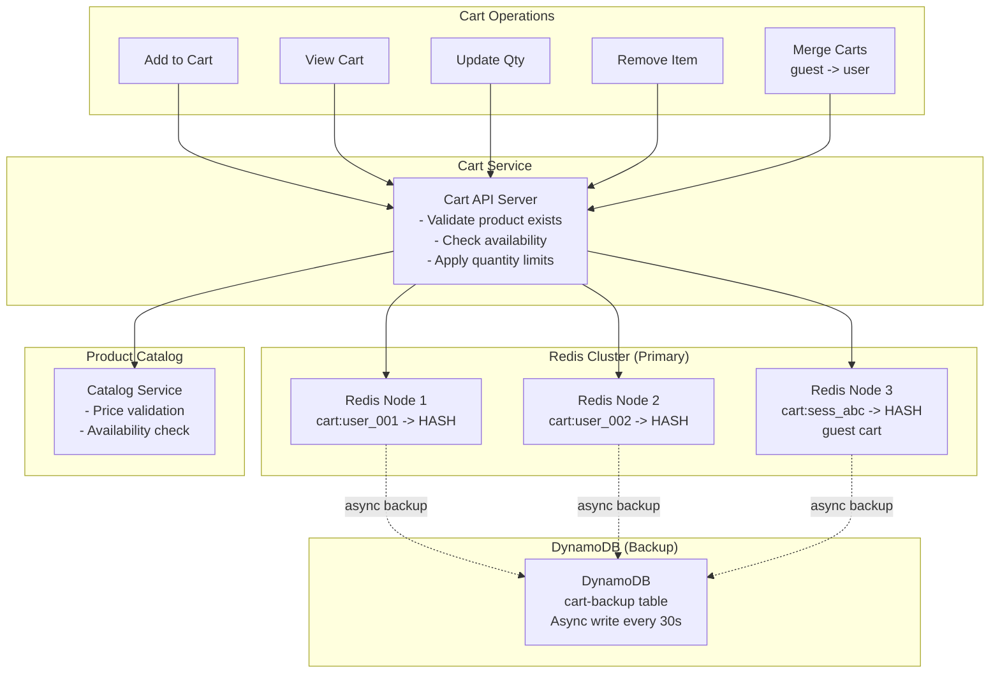
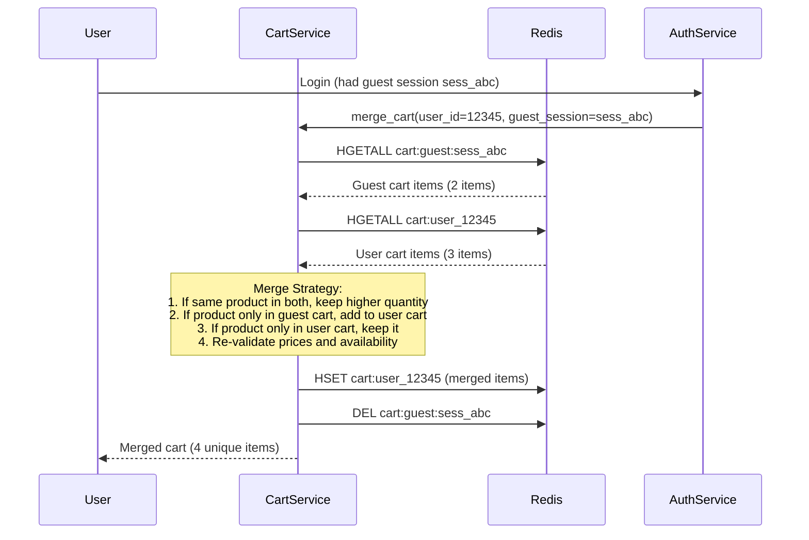
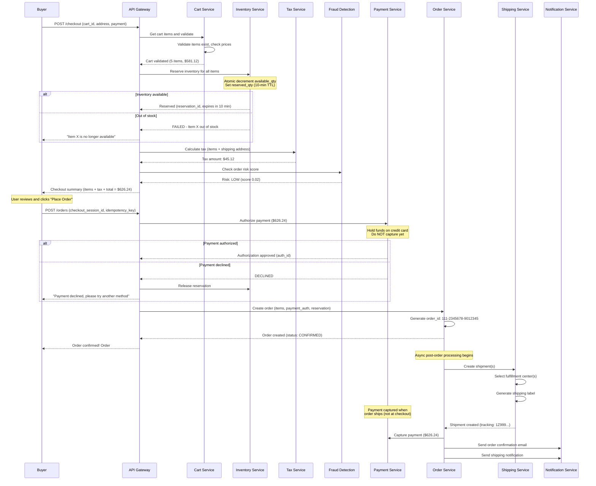
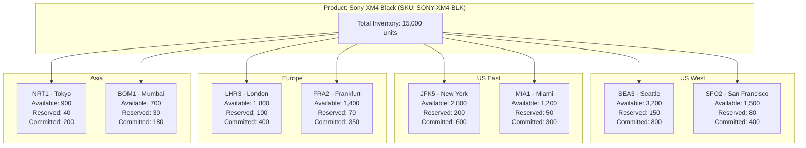
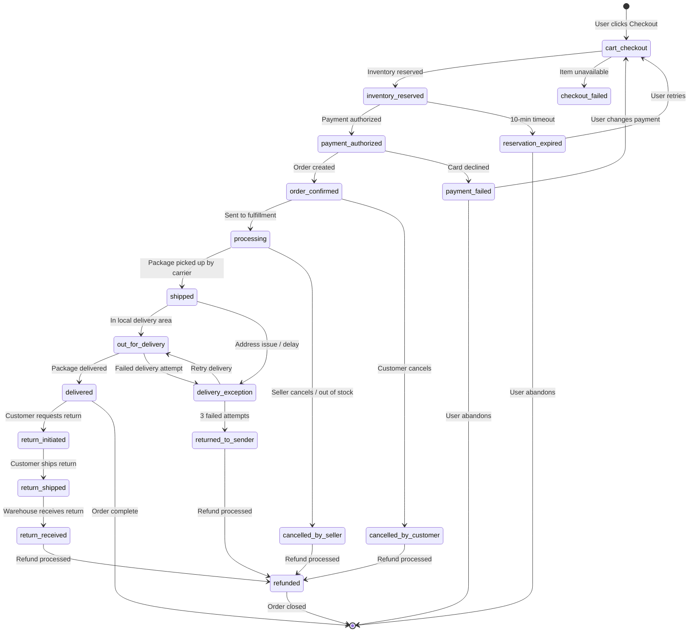
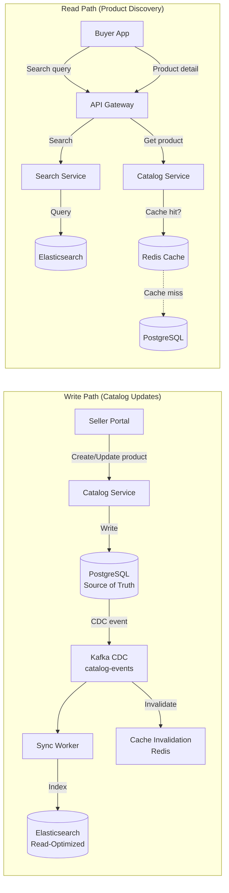
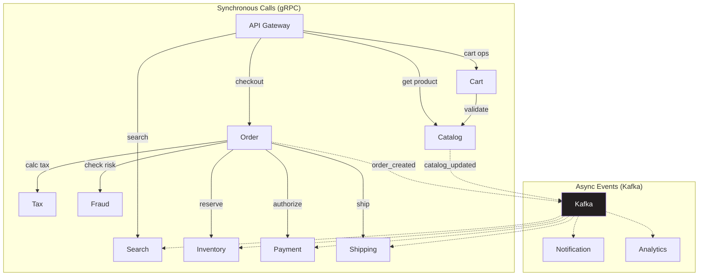

# Design Amazon / E-Commerce Platform: High-Level Design

## Table of Contents
- [1. Architecture Overview](#1-architecture-overview)
- [2. System Architecture Diagram](#2-system-architecture-diagram)
- [3. Component Deep Dive](#3-component-deep-dive)
- [4. Product Catalog Design](#4-product-catalog-design)
- [5. Search System Design](#5-search-system-design)
- [6. Shopping Cart Design](#6-shopping-cart-design)
- [7. Checkout and Order Flow](#7-checkout-and-order-flow)
- [8. Inventory Management](#8-inventory-management)
- [9. Order Lifecycle State Machine](#9-order-lifecycle-state-machine)
- [10. Database Design and Data Flow](#10-database-design-and-data-flow)
- [11. Communication Patterns](#11-communication-patterns)

---

## 1. Architecture Overview

The system follows a **microservices architecture** with ten core services communicating
via synchronous gRPC (for latency-sensitive operations) and asynchronous Kafka (for
event-driven workflows). Amazon's real architecture uses a **cell-based design** where
each "cell" is a self-contained unit serving a subset of customers, enabling blast-radius
containment during failures.

**Key architectural decisions:**
1. **Microservices with service mesh** -- each domain (catalog, search, cart, order, inventory, payment, shipping, reviews, recommendations, users) owns its data and API
2. **Polyglot persistence** -- PostgreSQL for catalog/payments (ACID), DynamoDB for orders/reviews (scale), Redis for cart/cache (speed), Elasticsearch for search
3. **Event-driven order pipeline** -- Kafka decouples order placement from fulfillment, enabling async processing of payment, inventory, and shipping
4. **CQRS for catalog** -- writes go to PostgreSQL (source of truth), reads served from Elasticsearch + Redis cache (optimized for query patterns)
5. **Cell-based isolation** -- inspired by Amazon's actual architecture; each cell handles a customer cohort independently, preventing cascading failures
6. **CDN-first for media** -- all product images, static assets, and even search results for popular queries are served from CloudFront edge

---

## 2. System Architecture Diagram

```mermaid
graph TB
    subgraph Clients
        WEB[Web Browser<br/>React SPA]
        MOB[Mobile Apps<br/>iOS / Android]
        SEL[Seller Portal<br/>Web Dashboard]
    end

    subgraph Edge Layer
        CDN[CloudFront CDN<br/>- Product images<br/>- Static assets<br/>- Cached search results]
        AG[API Gateway<br/>- Auth / Rate Limiting<br/>- Request routing<br/>- Request throttling<br/>- A/B test bucketing]
    end

    subgraph Core Services
        US[User Service<br/>- Registration/Auth<br/>- Profiles, Addresses<br/>- Payment methods]
        PCS[Product Catalog Service<br/>- Product CRUD<br/>- Categories/Variants<br/>- Pricing/Buy Box]
        SS[Search Service<br/>- Full-text search<br/>- Faceted filters<br/>- Ranking/Relevance]
        CS[Cart Service<br/>- Cart CRUD<br/>- Cart merging<br/>- Price validation]
        OS[Order Service<br/>- Order lifecycle<br/>- Saga orchestrator<br/>- Order history]
        IS[Inventory Service<br/>- Stock levels<br/>- Reservation<br/>- Warehouse allocation]
        PAY[Payment Service<br/>- Authorization<br/>- Capture/Refund<br/>- Multi-method]
        SHS[Shipping Service<br/>- Carrier selection<br/>- Rate calculation<br/>- Tracking]
        RS[Review Service<br/>- Reviews CRUD<br/>- Aggregation<br/>- Fraud detection]
        REC[Recommendation Service<br/>- Collaborative filtering<br/>- "Customers also bought"<br/>- Personalization]
    end

    subgraph Event Bus
        K[Apache Kafka<br/>- order-events<br/>- inventory-events<br/>- catalog-events<br/>- user-activity-events]
    end

    subgraph Data Stores
        PG[(Aurora PostgreSQL<br/>Products, Users<br/>Payments)]
        DDB[(DynamoDB<br/>Orders, Reviews<br/>Inventory)]
        RDS[(Redis Cluster<br/>Cart, Sessions<br/>Cache, Inventory Hot)]
        ES[(Elasticsearch<br/>Product Search Index<br/>500M documents)]
        S3[(S3<br/>Product Images<br/>Order Documents)]
    end

    subgraph External Services
        STRIPE[Payment Processors<br/>Visa/MC/PayPal]
        CARRIER[Shipping Carriers<br/>UPS/FedEx/USPS]
        TAX[Tax Service<br/>Avalara/TaxJar]
        FRAUD[Fraud Detection<br/>ML Pipeline]
    end

    subgraph Analytics & ML
        DL[Data Lake<br/>S3 + Glue]
        ML[ML Platform<br/>SageMaker<br/>Recommendations<br/>Search Ranking]
        KIN[Kinesis<br/>Clickstream<br/>Real-time Analytics]
    end

    WEB --> CDN
    MOB --> CDN
    WEB --> AG
    MOB --> AG
    SEL --> AG

    AG --> US
    AG --> PCS
    AG --> SS
    AG --> CS
    AG --> OS
    AG --> RS
    AG --> REC

    PCS --> PG
    PCS --> ES
    PCS --> RDS
    PCS --> S3

    SS --> ES
    SS --> RDS

    CS --> RDS
    CS --> DDB
    CS --> PCS

    OS --> DDB
    OS --> IS
    OS --> PAY
    OS --> SHS
    OS --> K

    IS --> DDB
    IS --> RDS

    PAY --> PG
    PAY --> STRIPE

    SHS --> CARRIER
    SHS --> DDB

    RS --> DDB
    RS --> ES

    REC --> RDS
    REC --> ML

    K --> IS
    K --> PAY
    K --> SHS
    K --> DL
    K --> KIN

    US --> PG
    US --> RDS

    OS --> TAX
    OS --> FRAUD
```

---

## 3. Component Deep Dive

### 3.1 API Gateway

The API Gateway is the single entry point for all client traffic. At Amazon's scale,
this is not a monolithic gateway but a distributed fleet of gateway instances.

```
Responsibilities:
  - Authentication:     Validate JWT tokens, API keys (sellers)
  - Authorization:      Role-based access (buyer vs seller vs admin)
  - Rate limiting:      Per-user, per-IP, per-API quotas
  - Request routing:    Route to correct microservice based on path
  - Request throttling: Shed load during traffic spikes (Priority queues)
  - A/B bucketing:      Assign users to experiment groups
  - Request/Response transformation: Protocol translation if needed

Technology: AWS API Gateway + custom Lambda authorizers, or
            Envoy-based service mesh with Istio

Scale:
  - 200+ gateway instances
  - 500K+ QPS aggregate throughput
  - p99 overhead: < 5ms added latency
```

### 3.2 User Service

```
Responsibilities:
  - User registration and authentication (email, social, phone)
  - Profile management (name, preferences, language)
  - Address book (multiple shipping addresses)
  - Payment methods (credit cards, bank accounts, gift card balance)
  - Session management
  - Seller account management and verification

Database: Aurora PostgreSQL (strong consistency for auth)
Cache: Redis (session tokens, user profile cache)

Key design choices:
  - Passwords hashed with bcrypt (cost factor 12)
  - Payment tokens stored via payment processor (PCI compliance)
  - Address validation via third-party geocoding
  - Multi-factor auth for sellers and high-value operations
```

### 3.3 Product Catalog Service

The catalog is the backbone of the marketplace. It must handle 500M products with
complex hierarchical categories, multiple variants per product, and real-time pricing.

```
Responsibilities:
  - Product CRUD (create, read, update, delete)
  - Category management (hierarchical taxonomy)
  - Variant management (size/color/material combinations)
  - Pricing logic (base price, sale price, Subscribe & Save)
  - Buy Box algorithm (selecting the default seller for a product)
  - Image management (upload, resize, CDN URL generation)
  - Catalog search synchronization (push changes to Elasticsearch)

Database: Aurora PostgreSQL (source of truth)
Cache: Redis (product detail cache, 15-min TTL)
Search: Elasticsearch (query-optimized replica)
Images: S3 + CloudFront

Write path: Seller Portal -> Catalog Service -> PostgreSQL -> Kafka -> Elasticsearch
Read path:  Client -> CDN (cache hit) -> Catalog Service -> Redis (cache) -> PostgreSQL
```

### 3.4 Search Service

Search is the primary product discovery mechanism. At Amazon's scale, the search
infrastructure is comparable to building a standalone search engine.

```
Responsibilities:
  - Full-text search across product titles, descriptions, brands
  - Faceted search (filter by category, brand, price, rating, Prime, etc.)
  - Autocomplete / typeahead suggestions
  - Spelling correction and synonym expansion
  - Search ranking (relevance + popularity + conversion + personalization)
  - Sponsored product injection (ads blended with organic results)

Technology: Elasticsearch cluster (1,000+ nodes)
  - 500M product documents
  - ~50 fields per document
  - 20+ replicas for read throughput
  - Index refresh interval: 1 second

Query pipeline:
  1. Query parsing and intent classification
  2. Query expansion (synonyms, spelling correction)
  3. Elasticsearch multi-match query with boosting
  4. Post-retrieval re-ranking (ML model)
  5. Personalization layer
  6. Sponsored product injection
  7. Response assembly with facets
```

### 3.5 Cart Service

```
Responsibilities:
  - Add/remove/update cart items
  - Price and availability validation on each cart view
  - Cart merging (anonymous guest cart -> logged-in user cart)
  - Save for Later functionality
  - Cart expiration (30-day TTL for guest carts)
  - Cross-device cart sync

Primary Store: Redis Cluster
  - Key: cart:{user_id} or cart:{session_id}
  - Type: Hash (each field is a cart item)
  - Advantages: sub-millisecond reads, atomic operations

Backup Store: DynamoDB
  - Async persistence every 30 seconds
  - Disaster recovery if Redis fails
  - Enables cross-region cart access

Design: detailed in Section 6
```

### 3.6 Order Service

The order service is the orchestrator of the entire purchase flow. It coordinates
inventory reservation, payment authorization, tax calculation, fraud check, and
shipment creation using a Saga pattern.

```
Responsibilities:
  - Checkout initiation (validate cart, calculate totals)
  - Order saga orchestration (inventory -> payment -> shipping)
  - Order status tracking and updates
  - Order history retrieval
  - Cancellation and modification handling
  - Return/refund initiation

Database: DynamoDB (partitioned by user_id)
  - Handles 50M orders/day write throughput
  - Global secondary index on order_id for direct lookups
  - GSI on status for seller order management

Saga pattern: detailed in Section 7
```

### 3.7 Inventory Service

```
Responsibilities:
  - Real-time stock level tracking per SKU per warehouse
  - Inventory reservation (soft lock during checkout)
  - Inventory deduction (hard deduction on order confirmation)
  - Reservation expiration (release after timeout)
  - Low-stock alerting for sellers
  - Warehouse allocation (which FC should fulfill this order?)

Primary Store: DynamoDB (source of truth per SKU per fulfillment center)
Hot Cache: Redis (real-time stock counts for checkout validation)

Critical invariant: available_stock >= 0 at all times (prevent overselling)
Concurrency control: optimistic locking with version counter (see deep dive)
```

### 3.8 Payment Service

```
Responsibilities:
  - Payment method tokenization (PCI DSS compliance)
  - Authorization (hold funds at checkout)
  - Capture (charge when order ships)
  - Refund processing
  - Gift card balance management
  - Multi-method payment (split across card + gift card)
  - Idempotent operations (every call has idempotency key)

Database: Aurora PostgreSQL (ACID required for money)
External: Stripe, Visa, Mastercard, PayPal APIs

Key design:
  - Two-phase: authorize at checkout, capture at shipment
  - Auth hold expires after 7 days (auto-release)
  - All operations carry idempotency_key to prevent double-charges
  - Separate ledger table for audit trail (append-only)
  - PCI scope minimized: only tokenized references stored
```

### 3.9 Shipping / Logistics Service

```
Responsibilities:
  - Delivery date estimation (based on inventory location + shipping speed)
  - Shipping rate calculation
  - Carrier selection (UPS, FedEx, USPS, Amazon Logistics)
  - Shipment creation and label generation
  - Tracking status aggregation from carriers
  - Last-mile delivery coordination

External integrations: UPS, FedEx, USPS, DHL APIs
Database: DynamoDB (shipment records, tracking events)

Key logic:
  - Fulfillment center selection: minimize (shipping_distance + handling_time)
  - If item is in multiple FCs, pick closest to customer
  - Split shipments: if items are in different FCs, create multiple shipments
  - Prime delivery promise: guaranteed 1-day/2-day based on customer zone
```

### 3.10 Review Service

```
Responsibilities:
  - Review submission (with verified purchase validation)
  - Review retrieval with sorting (helpful, recent, high/low rating)
  - Review aggregation (average rating, distribution histogram)
  - Helpful vote tracking
  - Image upload for reviews
  - Fraud detection (fake review identification)

Database: DynamoDB (partitioned by product_id)
Search: Elasticsearch (for full-text search within reviews)
Cache: Redis (aggregated rating cached per product)

Key design:
  - Reviews are append-only (create and soft-delete, never update)
  - Rating aggregation is pre-computed and cached (not calculated per request)
  - Verified purchase badge requires matching order_id
  - ML-based fake review detection runs asynchronously
```

### 3.11 Recommendation Service

```
Responsibilities:
  - "Customers who bought this also bought..." (item-to-item collaborative filtering)
  - "Recommended for you" (user-based collaborative filtering)
  - "Frequently bought together" (association rules / market basket analysis)
  - "Recently viewed" (session-based)
  - "Deals for you" (personalized promotions)

Architecture:
  - Offline: Batch ML pipeline (SageMaker) processes purchase history nightly
    -> Generates item-to-item similarity matrix
    -> Generates user embedding vectors
    -> Stores results in S3

  - Online: Real-time serving layer
    -> Load precomputed results into Redis
    -> Augment with real-time signals (current session, cart contents)
    -> Re-rank based on inventory availability and margin

Data pipeline: Clickstream -> Kinesis -> S3 Data Lake -> SageMaker -> Redis

Algorithms:
  - Item-to-item collaborative filtering (Amazon's original innovation, 2003 paper)
  - Matrix factorization (ALS) for user embeddings
  - Deep learning (transformer-based) for session-aware recommendations
```

---

## 4. Product Catalog Design

### 4.1 Hierarchical Category Taxonomy

Amazon uses a deep category tree with ~30,000+ leaf categories. Products belong to
one primary category but can appear in multiple browse nodes.



**Implementation: Materialized Path Pattern**

```sql
-- Each category stores its full path for efficient tree queries
categories:
  id=1   name="Electronics"     path="/1/"          depth=0
  id=15  name="Audio"           path="/1/15/"        depth=1
  id=203 name="Headphones"      path="/1/15/203/"    depth=2
  id=891 name="Over-Ear"        path="/1/15/203/891" depth=3

-- Find all products in "Electronics" and all subcategories:
SELECT * FROM products p
JOIN categories c ON p.category_id = c.id
WHERE c.path LIKE '/1/%';   -- Matches everything under Electronics

-- Find all ancestor categories (breadcrumb):
SELECT * FROM categories
WHERE '/1/15/203/891' LIKE path || '%'
ORDER BY depth;
-- Returns: Electronics -> Audio -> Headphones -> Over-Ear
```

### 4.2 Product Variants Model

A single product can have multiple variants (size, color, material). Amazon uses
a parent ASIN + child ASINs model.



```
-- Data model for variants
product_variants:
  variant_id:    "B08N5WRWNW"
  parent_id:     "B08N5WR000"
  sku:           "SONY-XM4-BLK"
  attributes:    { "color": "Black" }
  price:         278.00
  weight_grams:  254
  dimensions:    { "length": 18.7, "width": 25.5, "height": 7.7 }
  images:        ["black_front.jpg", "black_side.jpg", "black_case.jpg"]
  barcode:       "027242919341"

-- Variant dimension types defined per category
-- Electronics -> Headphones: color
-- Clothing -> Shirts: size, color
-- Shoes: size, color, width
```

### 4.3 Pricing Model

```
Product pricing is complex because multiple sellers may offer the same product:

price_offers:
  offer_id:          "off_001"
  product_id:        "B08N5WRWNW"
  seller_id:         "A2FTM..."
  price:             278.00
  list_price:        349.99       # Crossed-out "was" price
  condition:         "new"        # new, renewed, used_good, used_acceptable
  fulfillment:       "FBA"        # Fulfilled by Amazon vs Merchant
  shipping_cost:     0.00
  prime_eligible:    true
  quantity_available: 1234
  buy_box_eligible:  true

Buy Box Algorithm (simplified):
  Score = w1 * price_competitiveness
        + w2 * seller_rating
        + w3 * fulfillment_speed
        + w4 * fulfillment_type (FBA preferred)
        + w5 * stock_reliability
  Winner = seller with highest score -> their offer becomes the default "Add to Cart"
```

---

## 5. Search System Design

### 5.1 Search Architecture

```mermaid
graph LR
    subgraph "Query Pipeline"
        Q[User Query<br/>"wireless noise<br/>canceling headphones"]
        QP[Query Parser<br/>- Tokenize<br/>- Remove stopwords<br/>- Detect intent]
        QE[Query Expander<br/>- Synonyms<br/>- Spell correct<br/>- Category boost]
        EQ[Elasticsearch<br/>Query Builder<br/>- bool + should<br/>- Filters<br/>- Facet aggs]
    end

    subgraph "Elasticsearch Cluster (1000 nodes)"
        COORD[Coordinator<br/>Node]
        S1[Shard 1<br/>Products A-F]
        S2[Shard 2<br/>Products G-M]
        S3[Shard 3<br/>Products N-S]
        S4[Shard 4<br/>Products T-Z]
    end

    subgraph "Post-Processing"
        RR[Re-Ranker<br/>ML Model<br/>- CTR prediction<br/>- Conversion pred<br/>- Personalization]
        SP[Sponsored<br/>Injection<br/>- Ad server<br/>- Budget check]
        RA[Response<br/>Assembly<br/>- Facets<br/>- Badges<br/>- Delivery dates]
    end

    Q --> QP --> QE --> EQ --> COORD
    COORD --> S1
    COORD --> S2
    COORD --> S3
    COORD --> S4
    S1 --> RR
    S2 --> RR
    S3 --> RR
    S4 --> RR
    RR --> SP --> RA
```

### 5.2 Elasticsearch Index Mapping

```json
{
  "mappings": {
    "properties": {
      "product_id":     { "type": "keyword" },
      "title":          { "type": "text", "analyzer": "custom_product_analyzer",
                          "fields": { "keyword": { "type": "keyword" } } },
      "description":    { "type": "text", "analyzer": "custom_product_analyzer" },
      "brand":          { "type": "keyword" },
      "category_path":  { "type": "keyword" },
      "category_ids":   { "type": "integer" },
      "price":          { "type": "float" },
      "list_price":     { "type": "float" },
      "rating_avg":     { "type": "float" },
      "rating_count":   { "type": "integer" },
      "sales_rank":     { "type": "integer" },
      "prime_eligible": { "type": "boolean" },
      "in_stock":       { "type": "boolean" },
      "seller_id":      { "type": "keyword" },
      "seller_rating":  { "type": "float" },
      "image_url":      { "type": "keyword", "index": false },
      "created_at":     { "type": "date" },
      "keywords":       { "type": "text" },
      "attributes":     { "type": "nested",
                          "properties": {
                            "name":  { "type": "keyword" },
                            "value": { "type": "keyword" }
                          }
                        }
    }
  },
  "settings": {
    "number_of_shards": 100,
    "number_of_replicas": 20,
    "refresh_interval": "1s",
    "analysis": {
      "analyzer": {
        "custom_product_analyzer": {
          "type": "custom",
          "tokenizer": "standard",
          "filter": ["lowercase", "synonym_filter", "stemmer", "stop"]
        }
      },
      "filter": {
        "synonym_filter": {
          "type": "synonym",
          "synonyms": ["headphone,earphone,earbuds", "tv,television", "laptop,notebook"]
        }
      }
    }
  }
}
```

### 5.3 Search Query Example

```json
// Query: "wireless headphones" with filters: price < $200, rating >= 4, Prime only
{
  "query": {
    "bool": {
      "must": [
        {
          "multi_match": {
            "query": "wireless headphones",
            "fields": ["title^3", "brand^2", "keywords^2", "description"],
            "type": "best_fields",
            "fuzziness": "AUTO"
          }
        }
      ],
      "filter": [
        { "range": { "price": { "lte": 200 } } },
        { "range": { "rating_avg": { "gte": 4.0 } } },
        { "term": { "prime_eligible": true } },
        { "term": { "in_stock": true } }
      ],
      "should": [
        { "term": { "prime_eligible": { "value": true, "boost": 2.0 } } },
        { "range": { "sales_rank": { "lte": 1000, "boost": 1.5 } } },
        { "range": { "rating_count": { "gte": 100, "boost": 1.0 } } }
      ]
    }
  },
  "aggs": {
    "brands": {
      "terms": { "field": "brand", "size": 20 }
    },
    "price_ranges": {
      "range": {
        "field": "price",
        "ranges": [
          { "to": 25 }, { "from": 25, "to": 50 },
          { "from": 50, "to": 100 }, { "from": 100, "to": 200 },
          { "from": 200 }
        ]
      }
    },
    "avg_rating": {
      "range": {
        "field": "rating_avg",
        "ranges": [
          { "from": 4 }, { "from": 3 }, { "from": 2 }, { "from": 1 }
        ]
      }
    }
  },
  "sort": [
    { "_score": "desc" },
    { "sales_rank": "asc" }
  ],
  "size": 20,
  "from": 0
}
```

### 5.4 Catalog Sync Pipeline (CQRS)



```
Sync pipeline details:
  1. Seller updates product in Catalog Service -> writes to PostgreSQL
  2. Change Data Capture (CDC) via Debezium pushes event to Kafka
  3. Index Sync Worker consumes event:
     a. Fetches full product data from PostgreSQL
     b. Enriches with aggregated rating from Review Service
     c. Enriches with sales_rank from Analytics
     d. Enriches with inventory status from Inventory Service
     e. Builds Elasticsearch document
     f. Upserts into Elasticsearch index
  4. Redis cache invalidation also triggered by Kafka event

  Latency: product update to searchable = 2-5 seconds
  Throughput: handles 50K catalog updates per second
```

---

## 6. Shopping Cart Design

### 6.1 Redis-Based Cart Architecture



### 6.2 Redis Data Structure

```
# Cart stored as a Redis Hash
# Key: cart:{user_id} or cart:guest:{session_id}

HSET cart:user_12345 "item:B08N5WRWNW:var_black" '{
  "product_id": "B08N5WRWNW",
  "variant_id": "var_black",
  "seller_id": "A2FTM...",
  "quantity": 2,
  "price_at_add": 278.00,
  "added_at": "2026-04-07T12:00:00Z"
}'

HSET cart:user_12345 "item:B07XJ8C8F5:var_default" '{
  "product_id": "B07XJ8C8F5",
  "variant_id": "var_default",
  "seller_id": "A1SELLER",
  "quantity": 1,
  "price_at_add": 45.99,
  "added_at": "2026-04-07T12:05:00Z"
}'

# Operations:
HGET cart:user_12345 "item:B08N5WRWNW:var_black"    # Get specific item
HGETALL cart:user_12345                               # Get entire cart
HDEL cart:user_12345 "item:B08N5WRWNW:var_black"     # Remove item
HLEN cart:user_12345                                   # Item count

# TTL for guest carts (30 days)
EXPIRE cart:guest:sess_abc 2592000

# No TTL for logged-in user carts (persisted indefinitely)
```

### 6.3 Cart Merging (Anonymous to Logged-In)

When a guest user logs in, their anonymous cart must be merged with their existing
logged-in cart. This is a critical UX flow that Amazon handles seamlessly.



```
Merge algorithm pseudocode:

def merge_carts(user_id, guest_session_id):
    guest_cart = redis.hgetall(f"cart:guest:{guest_session_id}")
    user_cart = redis.hgetall(f"cart:user:{user_id}")

    merged = {}

    # Start with all user cart items
    for key, item in user_cart.items():
        merged[key] = item

    # Merge guest cart items
    for key, item in guest_cart.items():
        if key in merged:
            # Same product exists -- keep higher quantity
            existing = json.loads(merged[key])
            new_item = json.loads(item)
            existing['quantity'] = max(existing['quantity'], new_item['quantity'])
            merged[key] = json.dumps(existing)
        else:
            # New product -- add to merged cart
            merged[key] = item

    # Validate all items (price changes, stock availability)
    for key, item in merged.items():
        validated = validate_item(json.loads(item))
        merged[key] = json.dumps(validated)

    # Atomic write merged cart + delete guest cart
    pipeline = redis.pipeline()
    pipeline.delete(f"cart:user:{user_id}")
    for key, value in merged.items():
        pipeline.hset(f"cart:user:{user_id}", key, value)
    pipeline.delete(f"cart:guest:{guest_session_id}")
    pipeline.execute()

    return merged
```

---

## 7. Checkout and Order Flow

### 7.1 Checkout Sequence Diagram

This is the critical path from "Proceed to Checkout" to "Order Confirmed". Every step
must be reliable, and the system must handle failures at any point.



### 7.2 Inventory Reservation Flow

```
Timeline of a checkout:

T+0s:   User clicks "Proceed to Checkout"
        -> Inventory Service: RESERVE(sku=XM4-BLK, qty=2, fc=SEA3)
        -> available_qty: 1234 -> 1232
        -> reserved_qty: 23 -> 25
        -> reservation_id: res_abc, expires: T+600s (10 minutes)

T+30s:  User reviews order summary

T+45s:  User clicks "Place Order"
        -> Payment Service: AUTHORIZE($626.24)
        -> Order Service: CREATE_ORDER(reservation=res_abc)
        -> Inventory Service: CONFIRM_RESERVATION(res_abc)
        -> reserved_qty: 25 -> 23  (reservation converted to committed)
        -> committed_qty: 100 -> 102

T+600s: If user NEVER clicked "Place Order":
        -> Reservation expires automatically
        -> available_qty: 1232 -> 1234
        -> reserved_qty: 25 -> 23
        -> Stock returned to pool

Key invariant:
  physical_stock = available_qty + reserved_qty + committed_qty
  available_qty >= 0 at ALL times
```

---

## 8. Inventory Management

### 8.1 Distributed Inventory Model

Amazon operates 200+ fulfillment centers worldwide. Inventory for a single SKU is
distributed across multiple warehouses.



### 8.2 Warehouse Allocation Algorithm

```
When a buyer in Portland, OR orders a Sony XM4:

1. Find all FCs with available stock for SKU: SONY-XM4-BLK
   -> SEA3 (3200), SFO2 (1500), JFK5 (2800), ...

2. Calculate shipping cost + delivery time from each FC:
   FC     | Distance | Shipping Cost | Delivery Time | Score
   -------|----------|---------------|---------------|------
   SEA3   | 174 mi   | $3.50         | 1 day         | 0.95
   SFO2   | 635 mi   | $5.20         | 2 days        | 0.72
   JFK5   | 2,450 mi | $8.90         | 3 days        | 0.35

3. Score = w1 * (1/distance) + w2 * (1/shipping_cost) + w3 * available_qty_ratio

4. Select: SEA3 (highest score)

5. If Prime 1-day eligible, only FCs within 1-day delivery zone qualify:
   -> SEA3 is the only option for Portland 1-day delivery
   -> If SEA3 is out of stock, offer 2-day delivery from SFO2 instead
```

---

## 9. Order Lifecycle State Machine

### 9.1 Order State Diagram



### 9.2 State Transition Rules

```
State transitions and their side effects:

cart_checkout -> inventory_reserved:
  - Inventory Service: reserve(sku, qty, fc)
  - Set reservation TTL: 10 minutes

inventory_reserved -> payment_authorized:
  - Payment Service: authorize(amount, payment_method)
  - Fraud Service: check_risk(order_details)

payment_authorized -> order_confirmed:
  - Order Service: create_order()
  - Inventory Service: confirm_reservation()
  - Notification: send order confirmation email
  - Analytics: emit order_placed event

order_confirmed -> processing:
  - Shipping Service: create_shipment(fc, items, address)
  - Fulfillment: pick + pack workflow initiated

processing -> shipped:
  - Carrier API: create_label, schedule_pickup
  - Payment Service: capture(auth_id)    ** This is when money actually moves **
  - Notification: send "your order has shipped" email
  - Inventory: committed_qty -> shipped_qty

shipped -> delivered:
  - Carrier webhook: delivery confirmation
  - Notification: send "delivered" notification
  - Inventory: shipped_qty -> sold_qty

order_confirmed -> cancelled_by_customer:
  - Inventory Service: release_reservation()
  - Payment Service: void_authorization()
  - Notification: send cancellation confirmation

delivered -> return_initiated:
  - Return Service: create_return_label()
  - Notification: send return instructions

return_received -> refunded:
  - Payment Service: refund(order_id, amount)
  - Inventory: returned_qty -> available_qty (if resellable)
  - Notification: send refund confirmation
```

---

## 10. Database Design and Data Flow

### 10.1 Database Selection Matrix

```
Service              Database        Why This Choice
-------              --------        ---------------
Product Catalog      Aurora PG       Complex queries (JOINs across products, categories,
                                     variants), ACID for catalog integrity, rich SQL

Product Search       Elasticsearch   Full-text search, faceted aggregations, relevance
                                     scoring -- PostgreSQL full-text is not sufficient
                                     at 500M product scale

Shopping Cart        Redis +         Sub-ms latency for cart ops, hash structure is
                     DynamoDB        natural fit, DDB backup for durability

Orders               DynamoDB        Massive write throughput (50M orders/day),
                                     partition by user_id, infinite scale

Inventory            DynamoDB +      DDB for source of truth with conditional writes,
                     Redis           Redis for real-time stock checks (hot path)

Payments             Aurora PG       ACID is non-negotiable for financial transactions,
                                     double-entry bookkeeping

Reviews              DynamoDB +      Write-heavy (append-only), partition by product_id,
                     Elasticsearch   ES for searching within reviews

Users                Aurora PG       Relational (addresses, payment methods),
                                     strong consistency for auth

Recommendations      S3 + Redis      S3 for offline-computed models, Redis for
                                     serving precomputed results at low latency

Sessions             Redis           Ephemeral data, auto-expiry via TTL

Clickstream          Kinesis + S3    High-volume streaming ingestion, cold storage
                                     in data lake for batch analytics
```

### 10.2 Read vs Write Path Separation (CQRS)



---

## 11. Communication Patterns

### 11.1 Synchronous vs Asynchronous

```
Synchronous (gRPC / REST) -- used when response is needed immediately:
  - Search queries (user is waiting for results)
  - Product detail page (user is waiting for page load)
  - Cart operations (user expects immediate feedback)
  - Checkout inventory reservation (must happen before proceeding)
  - Payment authorization (must complete before order confirmation)

Asynchronous (Kafka events) -- used for decoupled processing:
  - Catalog sync to Elasticsearch (eventual consistency is fine)
  - Order confirmation -> fulfillment (async pipeline)
  - Payment capture (happens when order ships, not at checkout)
  - Review submission -> rating aggregation update
  - Clickstream events -> analytics pipeline
  - Inventory updates across regions (cross-region replication)
  - Notification delivery (email, push, SMS)
  - Recommendation model retraining (batch, nightly)
```

### 11.2 Kafka Topic Design

```
Topics and their characteristics:

order-events (HIGH priority):
  Partitions: 100 (partitioned by order_id)
  Retention: 7 days
  Events: order_created, order_confirmed, order_shipped, order_delivered,
          order_cancelled, order_returned
  Consumers: Inventory Service, Payment Service, Shipping Service,
             Notification Service, Analytics

inventory-events (HIGH priority):
  Partitions: 50 (partitioned by sku)
  Retention: 3 days
  Events: stock_updated, stock_reserved, stock_released, stock_depleted,
          low_stock_alert
  Consumers: Search Service (update in_stock flag), Alert Service

catalog-events (MEDIUM priority):
  Partitions: 50 (partitioned by product_id)
  Retention: 7 days
  Events: product_created, product_updated, product_deactivated,
          price_changed, variant_added
  Consumers: Search Sync Worker, Cache Invalidation, Recommendation Pipeline

user-activity-events (HIGH volume, LOWER priority):
  Partitions: 200 (partitioned by user_id)
  Retention: 24 hours
  Events: product_viewed, product_searched, add_to_cart, purchase
  Consumers: Recommendation Service, Analytics Pipeline, Personalization

payment-events:
  Partitions: 50 (partitioned by order_id)
  Retention: 30 days (audit requirement)
  Events: payment_authorized, payment_captured, payment_refunded,
          payment_failed
  Consumers: Order Service, Notification Service, Ledger Service
```

### 11.3 Service Communication Map



### 11.4 Failure Handling Patterns

```
Pattern 1: Circuit Breaker (Inventory Service during Prime Day)
  - If Inventory Service error rate > 5% for 10 seconds:
    -> Open circuit, return cached stock levels (stale but available)
    -> Allow 1 test request every 5 seconds
    -> Close circuit when 3 consecutive successes

Pattern 2: Retry with Exponential Backoff (Payment Authorization)
  - 1st retry: 100ms
  - 2nd retry: 200ms
  - 3rd retry: 400ms
  - Max retries: 3, then fail to user

Pattern 3: Idempotency (Order Placement)
  - Every POST /orders carries an idempotency_key
  - Server checks: if idempotency_key exists in recent orders -> return existing order
  - Prevents double-orders from network retries or double-clicks

Pattern 4: Timeout + Compensation (Inventory Reservation)
  - Reservation has 10-minute TTL
  - If payment fails or user abandons -> reservation auto-expires
  - No manual cleanup needed (self-healing via TTL)

Pattern 5: Dead Letter Queue (Order Events)
  - If Kafka consumer fails to process an order event after 3 retries:
    -> Move to dead-letter-queue topic
    -> Alert on-call team
    -> Manual investigation and replay
```
