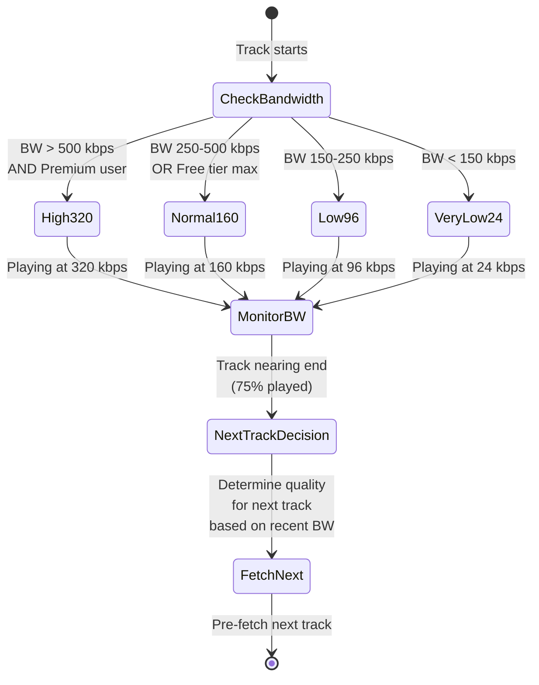
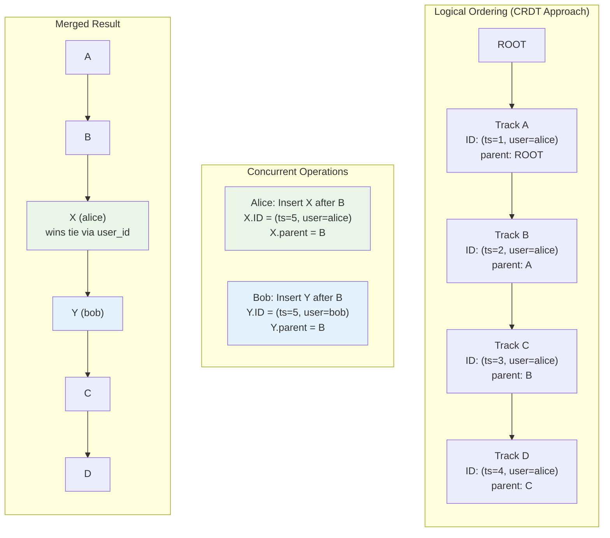
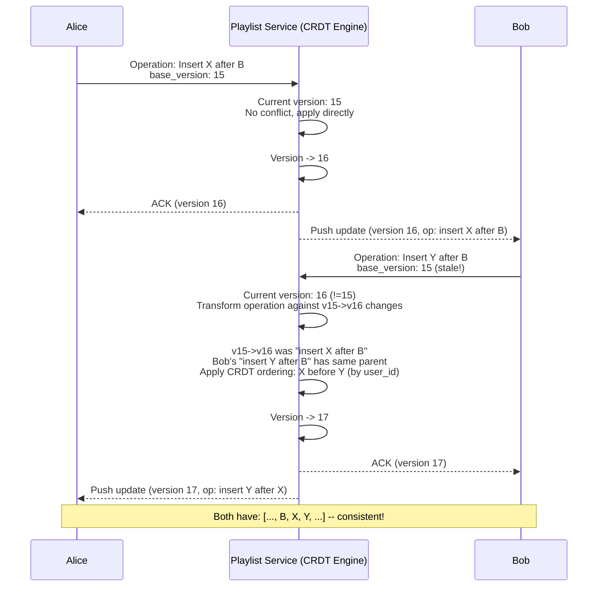

# Design Spotify / Music Streaming Platform -- Deep Dive and Scaling

## Table of Contents

1. [Deep Dive 1: Discover Weekly -- Recommendation Engine at Scale](#deep-dive-1-discover-weekly----recommendation-engine-at-scale)
2. [Deep Dive 2: Audio Streaming at Scale](#deep-dive-2-audio-streaming-at-scale)
3. [Deep Dive 3: Collaborative Playlists and CRDTs](#deep-dive-3-collaborative-playlists-and-crdts)
4. [Music Licensing and Royalty Tracking](#music-licensing-and-royalty-tracking)
5. [Podcast Streaming -- Differences from Music](#podcast-streaming----differences-from-music)
6. [Database Scaling Strategies](#database-scaling-strategies)
7. [Failure Modes and Resilience](#failure-modes-and-resilience)
8. [Cost Optimization](#cost-optimization)
9. [Monitoring and Observability](#monitoring-and-observability)
10. [Trade-offs and Decisions](#trade-offs-and-decisions)
11. [Interview Tips](#interview-tips)

---

## Deep Dive 1: Discover Weekly -- Recommendation Engine at Scale

Discover Weekly is Spotify's signature feature: a personalized playlist of 30 tracks generated every Monday for each of 200M+ users. It must feel like a knowledgeable friend curating music for you -- familiar enough to match your taste, novel enough to introduce genuine discoveries.

### Spotify's Actual Approach (Simplified)

Spotify's recommendation system evolved through their acquisition of The Echo Nest and combines three distinct signal sources. Here is how they build Discover Weekly end-to-end.

```mermaid
graph TD
    subgraph "Signal Collection (Continuous)"
        PLAYS[Play Events<br/>2B+ per day]
        SKIPS[Skip Events<br/>"played less than 30s"]
        SAVES[Library Saves<br/>+ Playlist Adds]
        FOLLOWS[Artist Follows]
        SEARCH_Q[Search Queries]
    end

    subgraph "Step 1: Taste Profile (Updated Daily)"
        PLAYS & SKIPS & SAVES & FOLLOWS --> TASTE[Taste Profile Builder]
        TASTE --> TASTE_VEC[User Taste Vector<br/>128-dim embedding<br/>per user]
        TASTE --> CLUSTERS[Taste Clusters<br/>User belongs to 5-10<br/>micro-genres]
    end

    subgraph "Step 2: Candidate Generation (Sunday Night Batch)"
        TASTE_VEC --> CF[Collaborative Filtering<br/>ALS on user-item matrix<br/>500 candidates per user]
        TASTE_VEC --> CONTENT_SIM[Content-Based Similarity<br/>Audio features + metadata<br/>300 candidates per user]
        CLUSTERS --> NLP_SIM[NLP / Cultural Vectors<br/>Web-crawled artist associations<br/>200 candidates per user]
    end

    subgraph "Step 3: Filtering"
        CF & CONTENT_SIM & NLP_SIM --> MERGE[Merge + Deduplicate<br/>~800 unique candidates]
        MERGE --> FILTER[Remove Known Tracks<br/>- already in library<br/>- played 3+ times<br/>- on user's playlists]
        FILTER --> REMAINING[~400-500 remaining<br/>truly novel candidates]
    end

    subgraph "Step 4: Ranking"
        REMAINING --> RANK[Ranking Model<br/>Gradient Boosted Trees<br/>or Deep Neural Network]
        RANK --> SCORED[Scored candidates<br/>P(user will enjoy)]
    end

    subgraph "Step 5: Diversity + Final Selection"
        SCORED --> DIVERSE[Diversity Filter]
        DIVERSE --> DW[Final 30 tracks<br/>= Discover Weekly]
    end

    style TASTE fill:#e8f5e9
    style CF fill:#e3f2fd
    style CONTENT_SIM fill:#fff3e0
    style NLP_SIM fill:#f3e5f5
    style RANK fill:#fce4ec
```

### Step 1: Taste Profile

The Taste Profile is a continuous representation of what a user likes. It is updated daily from streaming activity.

```
Inputs to Taste Profile:
  - Tracks played to completion (strong positive signal)
  - Tracks skipped before 30 seconds (negative signal)
  - Tracks saved to library (very strong positive)
  - Artists followed (strong positive for that artist's full catalog)
  - Playlist additions (positive signal, weighted by playlist recency)
  - Search-then-play (intent signal)
  - Time-of-day patterns (workout music at 6am, sleep music at 11pm)

Output: 128-dimensional embedding vector per user
  - Trained via matrix factorization on user-track interactions
  - Similar users have similar vectors (cosine similarity)
  - Updated incrementally each night (not retrained from scratch)
```

**Taste Clusters**: Beyond the embedding, each user is assigned to 5-10 "micro-genre" clusters. For example, a user might belong to: `indie-folk`, `90s-hip-hop`, `ambient-electronic`, `classic-jazz`. This is used for the Daily Mix feature (one mix per cluster) and for ensuring Discover Weekly has genre diversity.

### Step 2: Candidate Generation

**Collaborative Filtering (CF) -- The Primary Signal**

```
Algorithm: Alternating Least Squares (ALS) Matrix Factorization
  - Matrix: 200M users x 100M tracks (extremely sparse, ~0.001% filled)
  - Factorize into: User matrix (200M x 128) and Item matrix (100M x 128)
  - For user U, candidate score = dot_product(U_vector, Track_vector)
  - Top 500 tracks by score = CF candidates

Implementation:
  - Run on Apache Spark cluster (1000+ nodes)
  - Training time: ~6 hours for full matrix refactorization
  - Incremental updates nightly for new interactions
  - Spotify's actual paper: "Collaborative Filtering for Implicit Feedback"
    uses implicit signals (play counts) rather than explicit ratings
```

**Content-Based Filtering -- Audio Feature Similarity**

Spotify's audio analysis pipeline extracts features from every track:

```
Audio Features per Track (Spotify's Audio Features API):
  - tempo (BPM)
  - key (C, C#, D, ...)
  - mode (major / minor)
  - energy (0.0 - 1.0)
  - danceability (0.0 - 1.0)
  - acousticness (0.0 - 1.0)
  - instrumentalness (0.0 - 1.0)
  - valence (0.0 - 1.0, musical positiveness)
  - speechiness (0.0 - 1.0)
  - loudness (dB)

Deep audio embeddings:
  - Convolutional Neural Network trained on mel-spectrograms
  - 128-dim embedding capturing timbral and rhythmic qualities
  - Tracks with similar embeddings "sound similar"

Candidate generation:
  - For each track in user's recent listening, find 20 nearest neighbors
    in audio embedding space (approximate nearest neighbor search via HNSW)
  - Aggregate and rank by frequency of appearance -> 300 candidates
```

**NLP-Based Similarity -- Cultural Context**

```
Spotify crawls:
  - Music blogs, reviews, and articles
  - Social media discussions about artists
  - Playlist titles and descriptions (4B+ playlists)
  - Artist bios and genre tags

Word2Vec / BERT-style model:
  - Train on co-occurrence: "artists mentioned together are similar"
  - Example: articles about Radiohead also mention Muse, Portishead, etc.
  - Produces artist embedding -> extend to track embedding via artist association

Playlist co-occurrence:
  - "Tracks that appear in the same user-created playlists are similar"
  - This is incredibly powerful because playlists encode human curation judgment
  - Billions of playlists = massive implicit labeling dataset
```

### Step 3: Filtering

Critically, Discover Weekly must only contain tracks the user has NOT heard before (or has not heard recently). This requires checking each candidate against the user's full listening history.

```
For each of ~800 candidates:
  1. Check play_history (Cassandra): has user played this track?
     - If played 3+ times in last 6 months -> REMOVE (they know it)
     - If played 1-2 times long ago -> KEEP (might be a rediscovery)
  2. Check user_saved_tracks: is it in their library? -> REMOVE
  3. Check playlist_tracks: is it on any of their playlists? -> REMOVE
  4. Check territory: is track available in user's market? -> REMOVE if not

Result: ~400-500 genuinely novel candidates
```

### Step 4: Ranking Model

```
Features fed to the ranking model:
  - CF score (dot product similarity)
  - Content similarity to user's taste centroid
  - NLP/cultural similarity score
  - Track popularity (log scale) -- balance popular and obscure
  - Track freshness (release date recency)
  - Artist familiarity (has user heard other tracks by this artist?)
  - Genre match to user's top genres
  - Time-aware features (is this the type of music they listen to on Mondays?)
  - Historical CTR for this track across similar user segments

Model: Gradient Boosted Trees (XGBoost/LightGBM) or Deep Neural Network
  - Trained on implicit feedback: did similar users listen to this track
    all the way through, or skip it?
  - Optimized for: P(user listens to completion | presented in Discover Weekly)
```

### Step 5: Diversity Filter

Without this step, Discover Weekly might contain 20 indie-folk tracks for an indie-folk fan. The diversity filter ensures variety:

```
Rules:
  - Max 2 tracks per artist (even if 5 scored highly)
  - At least 3 different genres represented
  - Mix of high-popularity (P>70) and low-popularity (P<30) tracks
  - At least 5 tracks from artists the user has never heard
  - No more than 4 consecutive tracks in the same genre
  - Aim for a natural "playlist flow" (energy curve)

Algorithm: Greedy selection with constraints
  - Start with the top-scored track
  - For each subsequent slot, pick the highest-scored track that
    does not violate any diversity constraint
  - If no track fits without violation, relax the weakest constraint
```

### Scale: Running Discover Weekly for 200M Users

```
Users to generate for:        200,000,000
Time window:                  Sunday night, ~8 hours (midnight-8am, rolling by timezone)
Parallelism:                  50,000+ Spark executors
Time per user:                ~50ms for candidate generation + ranking
Total compute:                200M * 50ms = 10M seconds = ~2,800 compute-hours
With 50,000 parallel executors: 10M / 50,000 = 200 seconds wall-clock

Storage of results:
  200M users * 30 track_ids * 16 bytes = ~96 GB
  Stored in a fast key-value store (Redis or DynamoDB)
  Served as a simple lookup on Monday morning
```

---

## Deep Dive 2: Audio Streaming at Scale

### CDN Strategy -- Detailed Breakdown

Spotify's CDN strategy is the most critical piece of the streaming architecture. The goal: serve 6+ Tbps of peak audio with sub-100ms latency worldwide.

```mermaid
graph TD
    subgraph "Popularity Analysis (Daily Batch)"
        PLAY_LOG[Play Count Logs<br/>Last 7 Days] --> ANALYZER[Popularity Analyzer<br/>Spark Job]
        ANALYZER --> HOT_LIST[Hot List<br/>~1M tracks<br/>80% of plays]
        ANALYZER --> WARM_LIST[Warm List<br/>~9M tracks<br/>15% of plays]
        ANALYZER --> REGION_HOT[Regional Hot Lists<br/>Per-country top tracks<br/>e.g. K-pop hot in KR only]
    end

    subgraph "CDN Pre-warming (Nightly)"
        HOT_LIST --> PUSH_ALL[Push to ALL<br/>500+ Edge PoPs]
        WARM_LIST --> PUSH_REGIONAL[Push to Regional<br/>Shields (30 locations)]
        REGION_HOT --> PUSH_REGION_EDGE[Push to Region-Specific<br/>Edge PoPs]
    end

    subgraph "Runtime Serving"
        REQ[User Request] --> EDGE[Edge PoP]
        EDGE -->|HIT| RESP[Response: Audio bytes]
        EDGE -->|MISS| SHIELD[Regional Shield]
        SHIELD -->|HIT| RESP2[Response via Shield]
        SHIELD -->|MISS| ORIGIN[Origin S3]
        ORIGIN --> RESP3[Response via Origin]
    end

    style HOT_LIST fill:#c8e6c9
    style WARM_LIST fill:#fff9c4
    style REGION_HOT fill:#e1f5fe
```

### Bandwidth Adaptation -- Detailed Flow



**Key insight**: Spotify does NOT switch quality mid-track (unlike video ABR where you switch segments). A quality switch mid-song would cause an audible artifact. Instead, the quality decision is made per-track based on the average bandwidth observed during the previous track.

### Gapless Playback Implementation

Gapless playback is critical for concept albums, classical music, and DJ mixes where silence between tracks breaks the artistic intent.

```
The problem:
  Track A ends at sample 10,512,000 (at 44.1 kHz)
  Track B starts at sample 0
  Any gap (even 10ms) is audible as a "click" or silence

Spotify's approach:
  1. Pre-fetch Track B while Track A is playing (starts at 75% completion)
  2. Decode Track B's first few seconds into an audio buffer
  3. When Track A's last sample finishes, immediately feed Track B's
     first sample to the audio output -- zero gap

  For Ogg Vorbis specifically:
  - Ogg files have "granule positions" that precisely mark sample boundaries
  - The decoder knows the exact sample count, so it can trim encoder padding
  - No silence gaps from codec padding (unlike MP3 which has encoder delay)

  This is one reason Spotify chose Ogg Vorbis over MP3.
```

### Crossfade Implementation

```
User enables crossfade (e.g., 5 seconds):

Timeline:
  Track A: ████████████████████░░░░░  (fading out last 5s)
  Track B:                 ░░░░░████████████████████  (fading in first 5s)
                           ^^^^^ overlap region

Implementation:
  1. At (Track A duration - 5 seconds), begin fetching Track B stream URL
  2. Start decoding Track B in a secondary decoder
  3. Apply linear (or equal-power) crossfade:
     output[t] = trackA[t] * fade_out(t) + trackB[t] * fade_in(t)

     Equal-power crossfade (sounds more natural):
       fade_out(t) = cos(t * pi/2)    -- t from 0 to 1 over fade duration
       fade_in(t)  = sin(t * pi/2)

  4. Mix both decoded audio streams into a single output buffer
  5. After fade completes, stop Track A decoder, continue Track B only
```

### Pre-buffering Strategy

```
Pre-buffer decision matrix:

  Network type    Pre-buffer amount    When to start pre-fetch
  ─────────────   ──────────────────   ──────────────────────────
  WiFi            Full next track      At 50% of current track
  4G/LTE          First 30 seconds     At 75% of current track
  3G              First 10 seconds     At 90% of current track
  2G              None (on-demand)     When current track ends
  Offline         N/A (from cache)     Immediate

Buffer management:
  - Client maintains a ring buffer of 3 tracks:
    [previous track | current track | next track]
  - "Previous" is kept so "back" button has instant playback
  - If user skips forward rapidly, pre-buffer is discarded and
    a new fetch starts for the new "next" track
```

---

## Deep Dive 3: Collaborative Playlists and CRDTs

### The Concurrent Edit Problem

When multiple users edit a collaborative playlist simultaneously, naive approaches fail:

```
Scenario: Playlist has tracks [A, B, C, D, E]

User Alice (position-based):  "Delete track at position 2" (removes C)
User Bob   (position-based):  "Insert track X at position 3" (after C)

If we apply Alice's delete first:  [A, B, D, E] -> Bob inserts at 3 -> [A, B, D, X, E]
If we apply Bob's insert first:    [A, B, C, X, D, E] -> Alice deletes at 2 -> [A, B, X, D, E]

Different results! And Bob's intent ("insert after C") is violated in the first case.
```

### CRDT-Based Solution

Spotify uses a Conflict-free Replicated Data Type (CRDT) approach for collaborative playlists. Specifically, a variant of an **RGA (Replicated Growable Array)** combined with **tombstones** for deletions.



### CRDT Data Structure for Playlist Ordering

```
Each track in a collaborative playlist has:
  - track_uri:    "spotify:track:abc123"
  - operation_id: globally unique, monotonically increasing (Lamport timestamp + user_id)
  - parent_id:    the operation_id of the track this was inserted AFTER
  - tombstone:    boolean (true if deleted, never physically removed)
  - added_by:     user who added it
  - added_at:     wall-clock timestamp (for display, not ordering)

Ordering rules:
  1. A track appears after its parent in the list
  2. If two tracks have the same parent (concurrent insert after same position):
     - The one with the higher operation_id (Lamport timestamp) goes first
     - Tie-break on user_id (alphabetical) for deterministic ordering
  3. Tombstoned tracks are skipped when rendering the visible list

This guarantees that all replicas converge to the same ordering,
regardless of the order operations are received.
```

### Conflict Resolution Examples

```
Example 1: Concurrent Insert at Same Position

Initial: [A, B, C]   (B.parent = A, C.parent = B)

Alice (ts=10): Insert X after A  -> X.parent = A, X.id = (10, alice)
Bob   (ts=10): Insert Y after A  -> Y.parent = A, Y.id = (10, bob)

Both X and Y have parent = A.
Tie-break: compare (10, alice) vs (10, bob) -> alice < bob -> X first

Result: [A, X, Y, B, C]
Both Alice and Bob see the same result after merging.

---

Example 2: Delete + Insert Conflict

Initial: [A, B, C]

Alice (ts=10): Delete B  -> B.tombstone = true
Bob   (ts=10): Insert X after B -> X.parent = B

After merge:
  B is tombstoned (hidden), but X.parent still points to B.
  In the rendered list: [A, X, C]
  (X appears where B was, since B is its logical parent)

---

Example 3: Reorder (Move = Delete + Insert)

Alice: Move track D from position 4 to position 2
  Implementation: tombstone D at old position, insert D' at new position
  D'.parent = track at new position 1 (the track before position 2)

This decomposition into delete + insert means reorders are
automatically handled by the CRDT without special logic.
```

### Server-Side Merge Process



---

## Music Licensing and Royalty Tracking

Royalty tracking is one of the most business-critical pieces of the system. Every single play must be accurately attributed for royalty payments to rights holders.

### The Royalty Pipeline

```mermaid
graph TD
    PLAY[Play Event<br/>user_id, track_id, duration,<br/>country, subscription_tier] --> KAFKA[Kafka<br/>play-events topic]

    KAFKA --> VALIDATE[Validation Service<br/>- Duration >= 30s? (counts as play)<br/>- Bot detection<br/>- Duplicate detection]

    VALIDATE -->|Valid plays| ENRICH[Enrichment Service<br/>- Look up rights holders<br/>- Look up territory rates<br/>- Look up split percentages]

    ENRICH --> AGGREGATE[Daily Aggregator<br/>Spark Batch Job<br/>Group by: track * territory * tier]

    AGGREGATE --> ROYALTY_DB[(Royalty Database<br/>Per-track, per-rights-holder<br/>monthly statements)]

    ROYALTY_DB --> PAYMENT[Payment Generation<br/>Monthly royalty statements<br/>to labels, publishers, artists]

    VALIDATE -->|Invalid| DLQ[Dead Letter Queue<br/>Manual review]

    style VALIDATE fill:#fff9c4
    style ROYALTY_DB fill:#e8f5e9
```

### How Royalty Calculation Works

```
A single play of "Song X" in the United States by a Premium user:

Rights holders for Song X:
  - Recording rights: Label A (owns the master recording)
  - Publishing rights: Publisher B (owns the songwriting/composition)
  - Artist: Artist C (gets a share from Label A per contract)
  - Songwriter: Writer D (gets a share from Publisher B per contract)

Spotify's pro-rata royalty model:
  1. Total Premium revenue in US for the month: $500M
  2. Total Premium streams in US for the month: 20 billion
  3. Per-stream rate: $500M / 20B = $0.025 per stream

  Distribution for this one play:
    ~70% to rights holders:       $0.0175
      Split between recording (master) and publishing:
        Recording (Label A):      ~$0.012    (label keeps ~80%, artist gets ~20%)
        Publishing (Publisher B): ~$0.005    (publisher keeps ~50%, writer gets ~50%)
    ~30% Spotify retains:         $0.0075

  (Actual splits vary by contract -- these are illustrative)
```

### Scale of Royalty Tracking

```
Plays per day:                  1.7 billion
Plays qualifying for royalty:   ~1.2 billion (after filtering <30s, bots, etc.)
Unique track-territory-tier combos per day: ~500 million
Monthly royalty records:        ~15 billion aggregated records
Labels/distributors paid:       ~50,000 entities
Payment processing:             Monthly, typically 2-3 months in arrears
```

The royalty system must be **auditable** and **exactly-once** -- double-counting or missing plays has direct financial consequences. Kafka consumer offsets and idempotent processing are critical here.

---

## Podcast Streaming -- Differences from Music

### Why Podcasts Need Different Architecture

```
Music streaming:
  - File: 2-8 MB (3-5 minutes at 160 kbps)
  - User behavior: listen straight through, skip to next song
  - CDN: entire file downloaded quickly, high cache hit for popular songs
  - State: play count (aggregate, not per-user position)

Podcast streaming:
  - File: 20-200 MB (30 min - 3 hours at 128 kbps)
  - User behavior: listen 15 min, close app, resume tomorrow
  - CDN: range requests (user seeks to position 45:30 of a 2-hour episode)
  - State: per-user, per-episode resume position (critical to sync across devices)
```

### Podcast-Specific Technical Challenges

**1. Resume Position Sync**

```
Challenge: User listens on phone during commute, switches to desktop at work.
  - Phone reports position every 30 seconds
  - Desktop must pick up from the exact position
  - What if phone reports position AFTER desktop already started playing?

Solution: Last-write-wins with device priority
  - Each progress update includes: { position_ms, device_id, timestamp }
  - When fetching resume position, server returns the most recent update
  - Client-side: if local position is ahead of server, keep local
  - If server position is ahead, seek to server position
  - Conflict window is small (~30s) and the impact is minor (user rewinds 30s)
```

**2. Range Requests for Large Files**

Unlike music where the entire file is small enough to download, podcasts use HTTP Range requests extensively:

```
GET /audio/podcast_episode_xyz.ogg
Range: bytes=15000000-16000000   (seeking to ~minute 45 of a 128kbps file)

CDN behavior:
  - If the full file is cached: serve the byte range (instant)
  - If NOT cached: must fetch from origin
    Option A: Fetch full file from origin, cache it, serve range
    Option B: Fetch only the requested range from origin (faster, but no full caching)

Spotify's approach: Fetch the full file on first miss, cache it.
  Rationale: user will likely continue listening past the seek point,
  so having the full file cached saves future range requests.
```

**3. Playback Speed Processing**

```
1.5x and 2.0x playback are extremely popular for podcasts.

Client-side implementation (not server-side):
  - Decode audio at normal speed
  - Apply time-stretching algorithm (e.g., WSOLA: Waveform Similarity Overlap-Add)
  - WSOLA preserves pitch while changing tempo (voice does not sound "chipmunk")
  - Output audio samples at the adjusted rate

Why client-side, not server-side?
  - Avoid storing N copies at different speeds
  - User can change speed mid-episode without re-fetching
  - Modern devices (even phones) handle WSOLA in real-time easily
```

---

## Database Scaling Strategies

### PostgreSQL Sharding

```
Catalog DB (tracks, albums, artists):
  - Shard by entity_id (hash-based, 64 shards)
  - Read replicas: 5 per shard (read-heavy workload)
  - Cross-shard queries (e.g., "all tracks by artist X"):
    resolved via denormalization (artist_tracks table co-located by artist_id)
    or scatter-gather (acceptable for < 100ms for artist pages)

User DB (profiles, subscriptions, saved tracks):
  - Shard by user_id (hash-based, 128 shards)
  - All user operations are single-shard (user's data is co-located)

Playlist DB:
  - Shard by playlist_id (hash-based, 64 shards)
  - Hot playlists (editorial playlists with millions of followers):
    served from Redis cache, written through to PostgreSQL
  - 4 billion playlists * 50 tracks * 100 bytes = ~20 TB
  - Fits on 64 shards of ~300 GB each (comfortable)
```

### Cassandra for Play History

```
Table: play_history
Partition key: (user_id, month)    -- each partition = one user's plays for one month
Clustering key: played_at DESC     -- most recent first within partition

Partition size: avg user plays 250 tracks/month * 100 bytes = ~25 KB (small, good)
Cluster size: 100 nodes, RF=3, ~500 TB total (18 months retention)

Query patterns:
  1. "My recent plays" -> single partition read (fast)
  2. "Total plays for track X" -> NOT done here (use aggregated counters)
  3. "Feed ML pipeline" -> full table scan via Spark (offline batch)
```

### Redis Cluster Deployment

```
Redis Cluster 1 (Sessions):
  - 50 nodes, ~100 GB total
  - Stores: JWT sessions, device registry, active stream per user
  - TTL: access tokens 1 hour, refresh tokens 30 days

Redis Cluster 2 (Catalog Cache):
  - 100 nodes, ~500 GB total
  - Stores: hot track metadata, album metadata, artist metadata
  - Cache-aside pattern: read from Redis, miss -> read from PostgreSQL -> populate Redis
  - TTL: 24 hours (catalog changes are infrequent)

Redis Cluster 3 (Real-time):
  - 30 nodes, ~50 GB total
  - Stores: friend activity feeds (sorted sets), now-playing status
  - TTL: 8 hours for activity, 5 min for now-playing
```

---

## Failure Modes and Resilience

| Failure | Impact | Mitigation |
|---------|--------|------------|
| CDN edge PoP goes down | Users in that region experience higher latency | DNS-based failover to next closest PoP (BGP anycast) |
| Origin S3 region outage | CDN misses cannot be fulfilled | Cross-region replication (S3 CRR); CDN shield caches buy time |
| Catalog DB (PostgreSQL) master down | Cannot update catalog | Promote read replica to master (< 30s); catalog is read-heavy, replicas serve reads |
| Redis cluster node fails | Session lookups fail | Redis Cluster auto-failover to replica; clients retry with backoff |
| Kafka broker failure | Play events delayed | Multi-broker replication (RF=3); producers retry; consumers replay from offset |
| Recommendation service down | Discover Weekly unavailable | Serve cached last week's playlist; fall back to curated editorial playlists |
| Search (ES) cluster partial failure | Search degraded | ES cross-cluster replication; degrade to reduced result set from surviving shards |
| DRM license server down | Offline downloads cannot start | Existing licenses continue to work (offline play is local); queue download requests |
| Playlist service overloaded | Playlist edits fail | Circuit breaker; queue writes; serve stale playlist from cache |

### Graceful Degradation Hierarchy

```
Level 0 (Healthy):    Full functionality
Level 1 (Stressed):   Disable friend activity feed, reduce search results
Level 2 (Degraded):   Disable Discover Weekly refresh, serve cached recommendations
Level 3 (Emergency):  Disable collaborative playlist sync, read-only playlists
Level 4 (Survival):   Stream from CDN cache only, no API features, playback continues
```

The key insight: **playback must always work**. Even if every backend service is down, cached CDN content + cached stream URLs on the client should allow continued listening for some time.

---

## Cost Optimization

### CDN Costs (Largest Cost Center)

```
CDN egress: ~7 PB/day = ~210 PB/month

At typical CDN rates ($0.02-0.05/GB depending on volume):
  210 PB * $0.02/GB = 210,000 TB * $20/TB = $4.2M/month

Optimizations:
  1. Custom CDN / peering agreements with ISPs
     Spotify has direct peering with major ISPs (Comcast, Deutsche Telekom)
     and deploys cache servers inside ISP networks (similar to Netflix Open Connect)
     Reduces CDN cost by 60-80%

  2. Quality tier management:
     Free tier capped at 160 kbps (uses 50% bandwidth of 320 kbps Premium)
     Mobile data saver mode at 24 kbps (uses 7.5% bandwidth of 320 kbps)
     These tiers significantly reduce total egress

  3. Pre-push efficiency:
     Pre-pushing 1M hot tracks to 500 PoPs:
     1M * 15 MB * 500 = 7.5 PB one-time cost
     But saves millions of cache misses daily (avoiding origin fetch + shield traffic)
```

### Compute Costs

```
Streaming service (URL signing): lightweight, ~500 nodes
Search (Elasticsearch): ~200 nodes (memory-intensive)
Recommendation (ML training): ~1000 Spark executors (Sunday nights only, spot instances)
Recommendation (serving): ~100 nodes (lightweight key-value lookups)
Royalty tracking (Kafka + Spark): ~200 nodes

Total: ~2,000 compute nodes
  At ~$500/month per node (blended on-demand + reserved): $1M/month
  With spot instances for ML: ~$700K/month
```

### Storage Costs

```
S3 audio storage: 3 PB at $0.023/GB = $69,000/month
  With S3 Intelligent Tiering (cold tracks in Glacier): ~$40,000/month
  (90% of tracks are rarely accessed -> Glacier-tier pricing)

PostgreSQL: ~30 TB total across clusters: ~$50,000/month (EBS/SSD)
Cassandra: ~500 TB: ~$100,000/month
Redis: ~650 GB: ~$30,000/month (memory is expensive)
Elasticsearch: ~50 TB: ~$80,000/month (SSD + memory)
```

---

## Monitoring and Observability

### Key Metrics Dashboard

```
Streaming Health:
  - Playback start latency (p50, p95, p99) -- target: p99 < 500ms
  - Buffer underrun rate (audio stutter) -- target: < 0.1% of streams
  - CDN cache hit ratio -- target: > 95%
  - Active concurrent streams -- baseline and anomaly detection
  - Skip rate (users skipping within 30s) -- quality signal

Search Health:
  - Search latency (p50, p95, p99) -- target: p99 < 500ms
  - Zero-result rate -- target: < 5% of queries
  - Autocomplete latency -- target: p99 < 100ms

Playlist Health:
  - Collaborative playlist sync latency -- target: < 2s
  - Playlist load time -- target: p99 < 1s
  - CRDT conflict resolution rate

Recommendation Health:
  - Discover Weekly generation completion rate -- target: 100% of users by Monday 6am
  - Recommendation click-through rate (CTR)
  - Recommendation listen-through rate (LTR)

Business Metrics:
  - Plays per day (total and per-user)
  - Premium conversion rate
  - Churn prediction signals
  - Royalty tracking completeness (no missed plays)
```

---

## Trade-offs and Decisions

### 1. Ogg Vorbis vs. AAC vs. MP3

| Factor | Ogg Vorbis (Spotify's choice) | AAC | MP3 |
|--------|------------------------------|-----|-----|
| Quality at 160 kbps | Excellent | Excellent | Good |
| Licensing cost | **Free (open source)** | Royalty per device | Patent-free since 2017 |
| Browser support | Chrome, Firefox | Safari, all mobile | Universal |
| Gapless playback | Excellent (precise sample count) | Good | Poor (encoder delay) |
| Streaming overhead | Low | Low | Low |
| **Verdict** | Primary codec | iOS/Safari fallback | Not used |

Spotify's choice of Ogg Vorbis saves millions in licensing fees at 500M+ users scale. The trade-off is needing AAC as a fallback for Apple's ecosystem.

### 2. Progressive Download vs. HLS/DASH

| Factor | Progressive Download (Spotify) | HLS/DASH |
|--------|-------------------------------|----------|
| Latency to first byte | **Lower** (single HTTP request) | Higher (manifest + first segment) |
| Mid-stream quality switch | No (switch per track) | Yes (switch per segment) |
| Client complexity | **Simpler** | More complex (ABR algorithm) |
| Gapless playback | **Easy** (continuous file) | Hard (segment boundaries) |
| CDN compatibility | Standard HTTP | Standard HTTP |
| **Verdict** | Better for short audio files | Better for long video |

For songs (2-8 MB), progressive download is simpler and lower latency. HLS/DASH's complexity is justified for video (100+ MB) but overkill for audio.

### 3. CRDT vs. Operational Transformation (OT) for Collaborative Playlists

| Factor | CRDT (Spotify's approach) | OT (Google Docs style) |
|--------|--------------------------|------------------------|
| Server requirement | **No central server required** (can merge anywhere) | Requires central transform server |
| Offline editing | Supported natively | Requires rebasing on reconnect |
| Implementation complexity | Moderate (need custom CRDT type) | High (transform functions for each op type) |
| Conflict resolution | **Automatic** (mathematically guaranteed convergence) | Requires careful transform logic |
| Storage overhead | Higher (tombstones never deleted) | Lower (applied in order) |
| **Verdict** | Better for playlists (simple ops, offline-capable) | Better for text editing (character-level ops) |

### 4. Pre-computed vs. Real-time Recommendations

| Factor | Pre-computed (Discover Weekly) | Real-time (Radio) |
|--------|-------------------------------|-------------------|
| Latency | **Zero** (lookup pre-computed list) | Higher (score on request) |
| Freshness | Stale (1 week old) | **Fresh** (reflects latest listening) |
| Compute cost | **High batch, zero serving** | Lower batch, higher serving |
| Personalization depth | Deep (full history analysis) | **Shallow** (recent context only) |
| **Verdict** | Weekly curated playlists | Real-time radio/autoplay |

Spotify uses BOTH: pre-computed for Discover Weekly / Daily Mix (batch ML), real-time for Radio and autoplay (lightweight nearest-neighbor in embedding space).

### 5. Single Codec vs. Multi-Codec Storage

| Factor | Single Codec | Multi-Codec (Spotify) |
|--------|-------------|----------------------|
| Storage cost | **Lower** (one set of files) | Higher (3-4x storage per track) |
| Client compatibility | Requires client-side transcoding | **No transcoding needed** |
| CDN efficiency | **Higher** (one file per quality) | Lower (multiple files per track) |
| Playback latency | May require transcoding | **Zero transcoding** |
| **Verdict** | Only if codec is universally supported | Necessary with Ogg + AAC + fallbacks |

Spotify stores multiple encoded files per track because real-time transcoding at 40M concurrent streams is impractical, and client devices vary widely in codec support.

---

## Interview Tips

### Time Management (45-minute interview)

```
0:00 - 0:05  Requirements + clarifying questions (5 min)
  - State the core features: streaming, search, playlists, recommendations
  - Establish scale: 200M DAU, 100M songs, 40M concurrent streams
  - Clarify: offline? collaborative playlists? podcasts?

0:05 - 0:10  Estimation (5 min)
  - Quick back-of-envelope: plays/sec, storage, bandwidth
  - Highlight the CDN bandwidth number (6+ Tbps) -- shows you understand the core challenge

0:10 - 0:12  API design (2 min)
  - Stream URL generation (signed, time-limited CDN URLs)
  - Search endpoint, playlist CRUD

0:12 - 0:25  High-level design (13 min)
  - Draw the architecture: clients -> CDN -> API GW -> services -> data stores
  - Emphasize the streaming path: signed URL -> CDN -> origin fallback
  - Mention the CDN tiered caching strategy (this impresses interviewers)
  - Cover search (Elasticsearch), playlists (CRDT for collaborative)

0:25 - 0:40  Deep dives (15 min) -- pick 1-2 based on interviewer interest
  - Option A: Discover Weekly pipeline (always a crowd-pleaser)
  - Option B: CDN strategy and audio streaming
  - Option C: Collaborative playlists with CRDTs
  - Option D: Royalty tracking (if interviewer focuses on data integrity)

0:40 - 0:45  Scaling, trade-offs, wrap-up (5 min)
  - Key trade-offs: Ogg Vorbis vs AAC, progressive download vs HLS
  - Failure modes: playback must always work (CDN + client cache)
  - Mention monitoring: buffer underrun rate, CDN hit ratio
```

### What Interviewers Want to Hear

1. **"Spotify uses progressive download, not HLS"** -- Shows you understand why music streaming differs from video streaming. Songs are short (3-5 min), so adaptive bitrate per-segment is overkill. Quality switches happen per-track, not per-segment.

2. **"The CDN tier strategy matters more than the backend"** -- 95%+ of audio is served from CDN edge caches. The top 1% of songs are pre-pushed to all PoPs. The long tail is pull-through. This is THE most important scaling lever.

3. **"Collaborative playlists use CRDTs, not locks"** -- You cannot use database locks for a feature that should work offline and handle concurrent edits from multiple users across the world. CRDTs (or CRDT-like fractional indexing) give automatic conflict resolution.

4. **"Discover Weekly is batch-computed on Sunday night"** -- It is NOT real-time. 200M playlists are pre-computed in one massive Spark job and stored for simple key-value lookup on Monday. The three-pillar approach (CF + content + NLP) shows ML depth.

5. **"Royalty tracking requires exactly-once semantics"** -- Every play has financial implications. This is not a "fire and forget" event. Kafka with idempotent consumers and deduplication is critical for audit compliance.

### Common Follow-Up Questions and Answers

**Q: How would you handle a track going viral (sudden 100x traffic spike)?**
A: CDN pre-warm triggered by trend detection. If play velocity exceeds threshold, immediately push the track to all edge PoPs. CDN absorbs the spike -- origin never sees it. This is reactive pre-pushing (vs. the daily batch pre-push for known popular tracks).

**Q: How do you ensure gapless playback?**
A: Pre-fetch the next track at 75% completion of the current track. Decode the first few seconds into a buffer. When the current track's last audio sample plays, immediately start the next track's first sample. Ogg Vorbis makes this easier than MP3 because it has precise sample counts without encoder delay.

**Q: How does Spotify Connect (device transfer) work?**
A: Centralized session manager tracks which device is active. Transfer command goes to the server, which tells the old device to stop and the new device to start at the same position. The new device fetches its own stream URL -- audio is not relayed through the old device.

**Q: What happens when a song's license expires in a territory?**
A: Catalog service updates the territory bitmap for that track. Active streams are NOT interrupted (grace period until song ends). Search results stop showing it. Playlists show it as "unavailable in your region." Offline downloads: license renewal fails at next check-in, track becomes unplayable.

**Q: How would you add a "HiFi" lossless tier?**
A: Store FLAC files alongside Ogg Vorbis (lossless, ~1411 kbps, ~37 MB per track). Only for Premium HiFi subscribers. CDN challenge: 4-8x larger files, lower cache hit rate (smaller user base). Solution: only pre-push HiFi versions to regional shields (not edge). Edge serves HiFi from shield cache. This is why Spotify delayed HiFi -- the CDN cost and complexity are significant.
