# Design Spotify / Music Streaming Platform -- High-Level Design

## Table of Contents

1. [Architecture Overview](#architecture-overview)
2. [Music Catalog Service](#music-catalog-service)
3. [Streaming Service](#streaming-service)
4. [Audio Formats and Quality](#audio-formats-and-quality)
5. [CDN Strategy](#cdn-strategy)
6. [Playback Flow](#playback-flow)
7. [Search Service](#search-service)
8. [Playlist Service](#playlist-service)
9. [Recommendation Service](#recommendation-service)
10. [Social Service](#social-service)
11. [User Service](#user-service)
12. [Offline Download and DRM](#offline-download-and-drm)
13. [Podcast Service](#podcast-service)
14. [Database Design](#database-design)

---

## Architecture Overview

The system is fundamentally **read-heavy** -- unlike YouTube where upload/transcode is a major write path, Spotify's catalog is managed by labels and distributors, and the overwhelming majority of traffic is streaming reads. The architecture reflects this: a thin ingestion pipeline and a massively scaled read/streaming path.

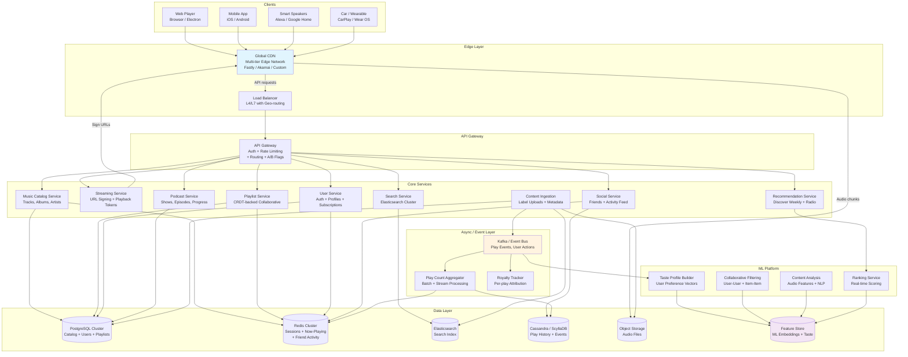

### Service Responsibilities Summary

| Service | Responsibility | Key Data Store |
|---------|---------------|----------------|
| Music Catalog | Track/album/artist metadata, availability per market | PostgreSQL |
| Streaming | Generate signed CDN URLs, enforce quality tiers, DRM tokens | Redis (sessions) |
| Search | Full-text search with autocomplete across all entities | Elasticsearch |
| Playlist | CRUD + collaborative editing with CRDT conflict resolution | PostgreSQL + Redis |
| Recommendation | Discover Weekly, Radio, Daily Mix, Release Radar | Feature Store + ML |
| Social | Friend activity feed, following, listening status | Redis + Cassandra |
| User | Auth, profiles, subscription management, device registry | PostgreSQL + Redis |
| Podcast | Shows, episodes, per-user resume position | PostgreSQL |
| Content Ingestion | Receive uploads from labels/distributors, process metadata | S3 + Kafka |

---

## Music Catalog Service

The catalog service manages the core entities: tracks, albums, artists, and their relationships. Spotify's actual catalog is managed through a complex pipeline where labels upload content through distributors.

### Content Ingestion Pipeline

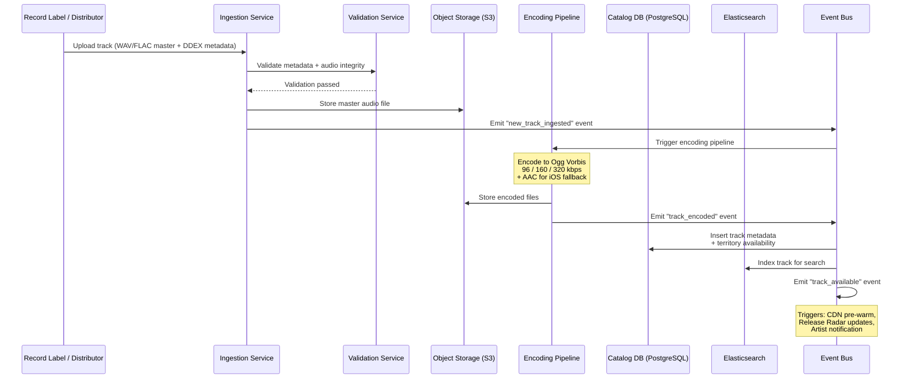

### Catalog Data Model Details

The catalog has a complex hierarchy with territory-based restrictions:

```
Artist (1) --> (N) Albums
Album  (1) --> (N) Tracks
Track  (N) <-> (M) Artists       -- featuring, remixes
Track  (1) --> (N) Territories   -- available in US, not in DE, etc.
Track  (1) --> (N) Audio Files   -- one per quality level per codec
```

**Territory Availability**: Every track has a set of markets where it can be played, governed by licensing agreements. The catalog service checks the user's country (from IP or account settings) and filters unavailable tracks from all responses.

```
-- Fast lookup: "Is track X available in country Y?"
-- Stored as a bitmap per track: 200 markets = 25 bytes per track
-- 100M tracks * 25 bytes = 2.5 GB -- fits entirely in memory
```

---

## Streaming Service

The streaming service is the heart of the system. It does NOT stream audio directly -- instead, it generates time-limited, signed URLs pointing to CDN edge servers. The actual audio delivery happens entirely through the CDN.

### Progressive Download vs. True Streaming

Spotify uses **progressive download** (not true streaming like RTSP):

| Approach | How It Works | Used By |
|----------|-------------|---------|
| **True Streaming** (RTSP/RTP) | Server pushes audio packets in real-time | Legacy radio, some live streams |
| **Progressive Download** (HTTP) | Client downloads file via HTTP, plays as it downloads | **Spotify**, most modern services |
| **Adaptive Streaming** (HLS/DASH) | File split into segments, client picks quality per segment | YouTube, Netflix (video) |

Spotify chose progressive download over HLS/DASH because:
- **Songs are short** (3-5 min vs. 2-hour movies) -- adaptive quality switching mid-song is less useful
- **Lower overhead** -- no manifest files, no segment boundaries, simpler client logic
- **Better gapless playback** -- no segment gaps to deal with
- **Lower latency to first byte** -- single HTTP request, no manifest negotiation

The client downloads the Ogg Vorbis file via HTTP with `Range` headers, allowing seek to any position. The entire file is small enough (~4 MB at 160 kbps) that pre-downloading is practical.

### Stream URL Generation

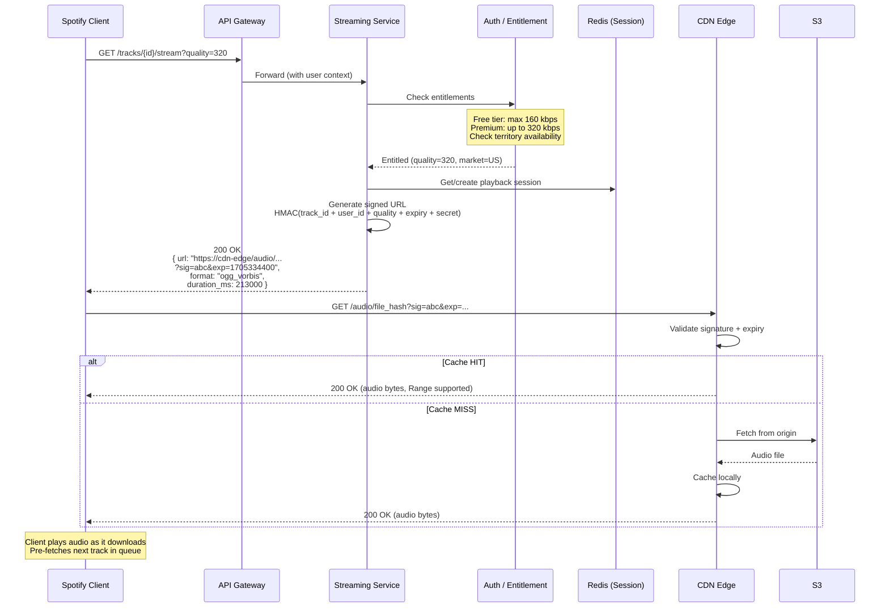

---

## Audio Formats and Quality

### Spotify's Actual Codec Strategy

Spotify uses **Ogg Vorbis** as their primary codec (unlike most competitors who use AAC). This is because Ogg Vorbis is open-source and royalty-free, avoiding per-device licensing fees that AAC requires.

| Quality Level | Bitrate | File Size (3.5 min song) | Who Gets It | Codec |
|--------------|---------|--------------------------|-------------|-------|
| Low | 24 kbps | ~0.6 MB | Mobile data saver | Ogg Vorbis |
| Normal | 96 kbps | ~2.5 MB | Free tier default | Ogg Vorbis |
| High | 160 kbps | ~4.2 MB | Free tier max / Premium default | Ogg Vorbis |
| Very High | 320 kbps | ~8.4 MB | Premium only | Ogg Vorbis |
| HiFi (future) | ~1411 kbps | ~37 MB | HiFi tier | FLAC (lossless) |

**Client-specific codecs**: While Ogg Vorbis is the primary format, Spotify also encodes to AAC for iOS (Safari does not support Ogg natively in the web player) and uses HE-AAC for very low bitrate mobile streaming.

### Audio File Organization in Object Storage

```
s3://spotify-audio-prod/
  ├── tracks/
  │   ├── ab/cd/abcdef1234567890    (first 4 chars of hash = directory sharding)
  │   │   ├── ogg_96.ogg
  │   │   ├── ogg_160.ogg
  │   │   ├── ogg_320.ogg
  │   │   ├── aac_128.m4a           (iOS fallback)
  │   │   └── aac_256.m4a           (iOS high quality)
  │   └── ef/gh/efgh5678...
  │       └── ...
  └── podcasts/
      └── <show_id>/<episode_id>/
          ├── ogg_96.ogg
          └── ogg_128.ogg
```

---

## CDN Strategy

The CDN layer is the most critical infrastructure component. Audio delivery is 99%+ served from CDN edge caches -- almost nothing should hit origin.

### The Long-Tail Problem

Music streaming has extreme content popularity distribution:

```
Top 1% of songs      (~1M tracks)   --> 80% of all plays  --> HOT
Next 9% of songs     (~9M tracks)   --> 15% of all plays  --> WARM
Remaining 90%        (~90M tracks)  --> 5% of all plays   --> COLD (long tail)
```

This drives a tiered caching strategy:

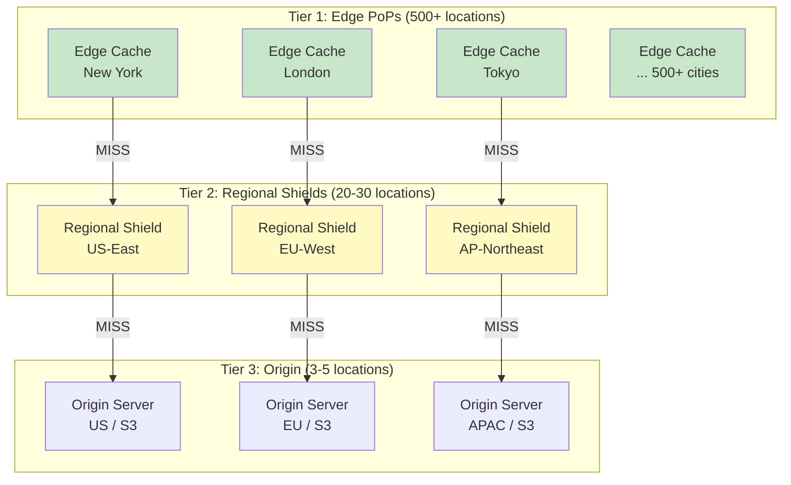

### CDN Caching Strategy

| Content Tier | Strategy | Cache TTL | Details |
|-------------|----------|-----------|---------|
| **HOT** (top 1M tracks) | **Pre-push** to all edge PoPs | 30 days | Proactively pushed during off-peak hours. Covers ~80% of plays. |
| **WARM** (next 9M tracks) | **Pre-push** to regional shields, **pull** to edge | 7 days at edge, 30 days at shield | Popular enough to keep at regional level. Edge caches on first request. |
| **COLD** (90M tracks) | **Pull-through** only | 24h at edge, 7d at shield | Only cached when requested. Most edge PoPs will never see these. |

**Pre-push mechanics**: A background job runs daily, analyzing play count trends. Tracks that crossed the "hot" threshold get pushed to all edge PoPs. Tracks trending in specific regions get pushed to those regional shields. This means that for 80%+ of plays, the CDN edge cache already has the file before the first user requests it.

### CDN Cache Hit Rates

```
Hot content at Edge:        ~99.5% hit rate
Warm content at Edge:       ~85% hit rate (15% miss -> regional shield)
Warm content at Shield:     ~99% hit rate
Cold content at Edge:       ~40% hit rate
Cold content at Shield:     ~80% hit rate

Blended cache hit rate:     ~95-97% (weighted by play volume)
```

**Result**: Origin servers see only 3-5% of total streaming traffic. This is why Spotify can serve 6+ Tbps of peak streaming with "only" ~300 Gbps of origin capacity.

---

## Playback Flow

### Complete Playback Sequence (Including Pre-buffering)

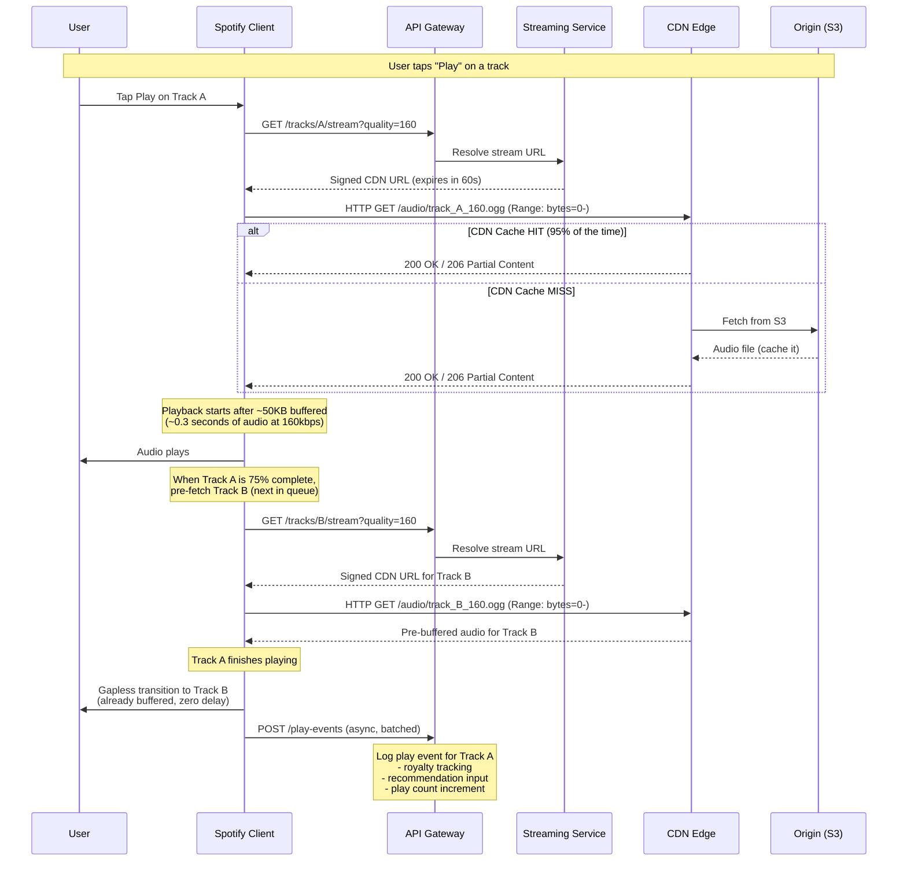

### Client-Side Playback Architecture

The client (mobile app / desktop / web) manages a sophisticated local playback engine:

```
┌─────────────────────────────────────────────────────────┐
│                    Spotify Client                        │
│                                                         │
│  ┌──────────┐   ┌──────────────┐   ┌────────────────┐  │
│  │ Queue     │   │ Pre-fetch    │   │ Playback       │  │
│  │ Manager   │──>│ Manager      │──>│ Engine         │  │
│  │           │   │              │   │ (Ogg decoder)  │  │
│  │ - current │   │ - next track │   │ - gapless      │  │
│  │ - next N  │   │ - buffer %   │   │ - crossfade    │  │
│  │ - history │   │ - quality    │   │ - normalize    │  │
│  └──────────┘   └──────────────┘   └────────────────┘  │
│                                           │             │
│  ┌──────────┐   ┌──────────────┐   ┌──────┴─────────┐  │
│  │ Offline   │   │ DRM          │   │ Audio Output   │  │
│  │ Cache     │   │ Manager      │   │ - volume       │  │
│  │ (encrypted│──>│ (Widevine/   │──>│ - equalizer    │  │
│  │  storage) │   │  FairPlay)   │   │ - normalization│  │
│  └──────────┘   └──────────────┘   └────────────────┘  │
│                                                         │
│  ┌──────────────────────────────────────────────────┐   │
│  │ Bandwidth Estimator                               │   │
│  │ - measures download speed per chunk               │   │
│  │ - adjusts quality: if <150kbps, drop to 96kbps   │   │
│  │ - if sustained high bandwidth, upgrade to 320kbps │   │
│  └──────────────────────────────────────────────────┘   │
└─────────────────────────────────────────────────────────┘
```

### Bandwidth Adaptation

Unlike video (HLS/DASH) where quality switches per segment, Spotify switches quality **per track**:

1. Client measures average download speed during current track
2. If bandwidth is below the current quality threshold for 10+ seconds, the **next** track fetches at lower quality
3. If bandwidth recovers, subsequent tracks fetch at higher quality
4. Current track never switches quality mid-play (would cause audible glitch)

```
Quality thresholds:
  320 kbps stream requires: > 500 kbps sustained bandwidth
  160 kbps stream requires: > 250 kbps sustained bandwidth
  96 kbps stream requires:  > 150 kbps sustained bandwidth
  24 kbps stream (fallback): any connection
```

---

## Search Service

Search is one of the most-used features. Users expect instant results with tolerance for typos and partial queries.

### Search Architecture

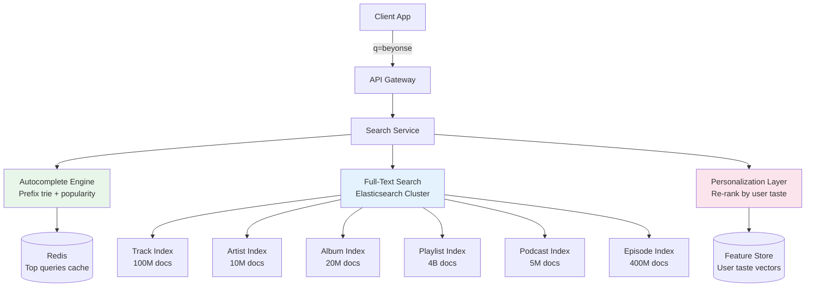

### Elasticsearch Index Design

Each entity type gets its own Elasticsearch index, optimized for its search patterns:

**Track Index** (~100M documents):
```json
{
  "track_id": "abc123",
  "title": "Halo",
  "title_ngram": "halo",                // for autocomplete
  "title_phonetic": "HALO",             // for typo tolerance
  "artists": ["Beyonce"],
  "artists_ngram": ["beyonce"],
  "album": "I Am... Sasha Fierce",
  "genres": ["pop", "r&b"],
  "release_year": 2008,
  "duration_ms": 261000,
  "popularity": 87,                      // 0-100, updated daily
  "explicit": false,
  "isrc": "USCO10800224",
  "available_markets": ["US", "GB", "DE", "JP"],
  "language": "en"
}
```

**Search query processing pipeline**:

```
User types: "beyonse halo"
    │
    ├── 1. Tokenize: ["beyonse", "halo"]
    │
    ├── 2. Spell correction: "beyonse" -> "beyonce" (edit distance 1)
    │
    ├── 3. Build ES query:
    │     bool {
    │       should: [
    │         multi_match("beyonce halo", fields=["title^3", "artists^5", "album^2"])
    │         match_phrase("beyonce halo", field="title", boost=10)
    │       ]
    │       filter: [
    │         term("available_markets", "US")   // territory filter
    │       ]
    │     }
    │     function_score: {
    │       field_value_factor("popularity", modifier="log1p")
    │     }
    │
    ├── 4. Execute across indices (fan-out to track, artist, album, playlist, podcast)
    │
    ├── 5. Merge results by type
    │
    └── 6. Personalization re-rank:
          - Boost artists the user follows
          - Boost genres the user listens to
          - Boost tracks in user's library
```

### Autocomplete

Autocomplete uses a separate, lighter-weight path for sub-100ms responses:

- **Redis-backed trie** with the top 10M queries pre-loaded
- On each keystroke, the client sends the partial query
- Results include: top tracks, top artists, top albums, recent user searches
- Personalized: user's recently played items matching the prefix get boosted to the top
- Debounced on client: 100ms delay after last keystroke before firing

---

## Playlist Service

Playlists are the core user interaction beyond streaming. Spotify has over 4 billion playlists. The key engineering challenge is **collaborative playlists** -- multiple users editing the same playlist concurrently.

### Playlist Architecture

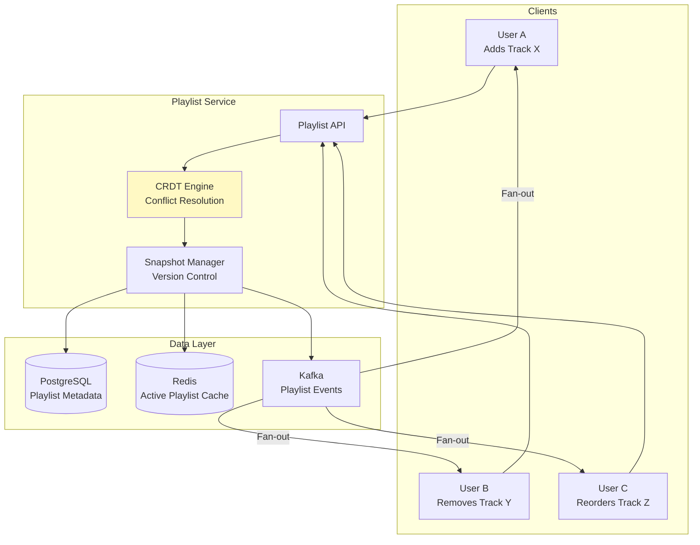

### Collaborative Playlists with CRDTs

The fundamental problem: User A adds a track at position 5 while User B simultaneously removes the track at position 3. How do you merge these without conflicts?

Spotify uses a variation of **Operational Transformation (OT)** combined with **snapshot-based versioning**:

1. **Snapshot ID**: Every playlist has a `snapshot_id` (a hash of the current state). Each edit operation includes the snapshot_id the client last saw.

2. **Optimistic Concurrency**: When a client sends an edit:
   - If the `snapshot_id` matches current state -> apply directly
   - If it doesn't match -> transform the operation against all intermediate changes

3. **CRDT-like ordering**: Instead of using integer positions (which break with concurrent inserts), each track has a **fractional index** (like `"a0"`, `"a0V"`, `"a0Vz"`). Inserting between two items generates a new key lexicographically between them, without requiring reindexing.

```
Example: Collaborative playlist edit resolution

Initial state (snapshot: v5):
  Position    Track
  "a0"        Song A
  "a1"        Song B
  "a2"        Song C

User A (saw v5): Insert Song D after Song A
  -> New position: "a0V" (between "a0" and "a1")

User B (saw v5): Insert Song E after Song A
  -> New position: "a0V" (collision!)

Resolution: Both operations arrive at server.
  First writer wins the exact key "a0V", second gets "a0Vz"
  Or: use user_id as tiebreaker in the fractional key

Final state (snapshot: v7):
  "a0"        Song A
  "a0V"       Song D  (User A's insert)
  "a0Vz"      Song E  (User B's insert)
  "a1"        Song B
  "a2"        Song C
```

### Real-Time Sync for Collaborative Playlists

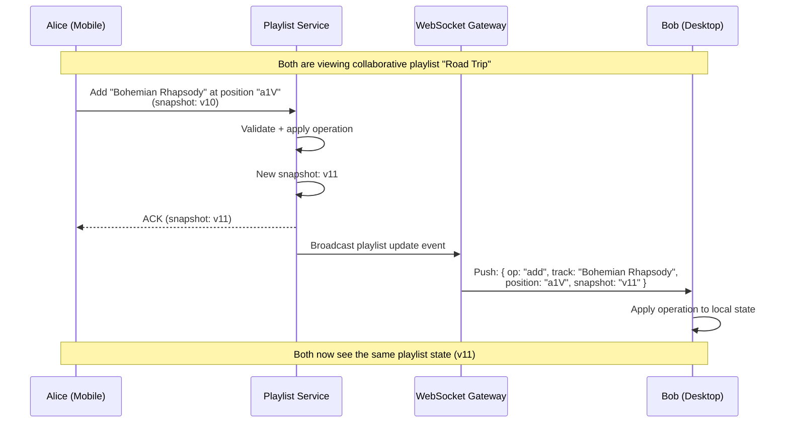

### Playlist Scaling Numbers

```
Total playlists:            4 billion
Average tracks per playlist: 50
Total playlist-track pairs:  200 billion rows (playlist_tracks table)
Playlist reads per second:   ~50,000 (fetching playlist contents)
Playlist writes per second:  ~5,000 (adds, removes, reorders)

Sharding: by playlist_id (hash)
  - Hot playlists (editorial, viral): replicated to read replicas
  - Collaborative playlists: pinned to a single shard for consistency
```

---

## Recommendation Service

Recommendations are Spotify's core competitive advantage. Discover Weekly alone drives significant user engagement and retention.

### Recommendation Architecture Overview

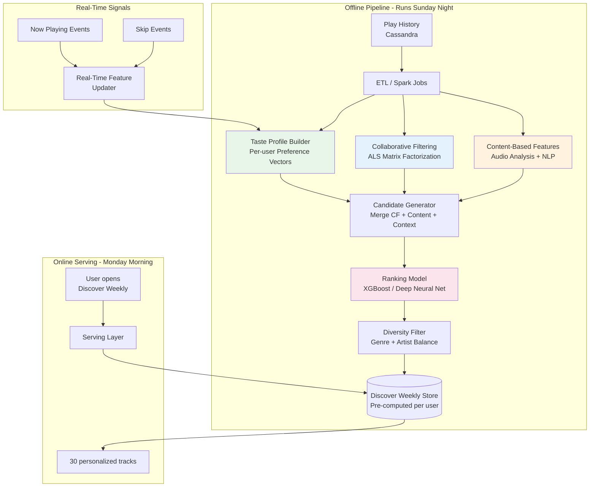

### Discover Weekly Pipeline (Simplified)

Spotify's actual Discover Weekly pipeline has three main pillars:

**Pillar 1: Collaborative Filtering (CF)**
- "Users who listen to tracks you listen to also listen to these other tracks"
- Implementation: ALS (Alternating Least Squares) matrix factorization
- Input: user-track interaction matrix (100M+ users x 100M+ tracks -- extremely sparse)
- Output: for each user, top 500 candidate tracks from similar users' listening

**Pillar 2: Content-Based Filtering**
- Audio analysis: tempo, key, energy, danceability, acousticness (Spotify's Audio Features API)
- NLP on metadata: genre tags, album descriptions, artist bios, playlist titles
- "Find tracks with similar audio characteristics to what you already like"

**Pillar 3: Natural Language Processing**
- Crawl the web for music blogs, reviews, social media discussions
- Build word2vec-style embeddings for artists and tracks
- "Artists discussed in similar contexts are likely similar"
- Spotify actually acquired The Echo Nest for this capability

**Merging and ranking**:
```
Per user, on Sunday night:
  1. CF generates 500 candidate tracks
  2. Content-based generates 300 candidate tracks
  3. NLP-based generates 200 candidate tracks
  4. Merge candidates, de-duplicate: ~800 unique tracks
  5. Remove tracks user has already heard (check play history)
  6. Remove tracks from user's library (they already know these)
  7. Ranking model scores remaining ~500 tracks
     Features: user taste similarity, track popularity, freshness,
               audio feature match, artist familiarity, genre diversity
  8. Take top 50, apply diversity filter (no more than 2 tracks per artist,
     genre variety, mix of familiar-adjacent and pure discovery)
  9. Final 30 tracks = Discover Weekly
  10. Store in key-value store: user_id -> [track_id_1, ..., track_id_30]
```

---

## Social Service

### Friend Activity Feed

Spotify's right sidebar shows real-time friend activity (what friends are currently listening to).

```mermaid
graph TD
    subgraph Publishers
        P1[User A plays Track X]
        P2[User B plays Track Y]
    end

    subgraph Event Pipeline
        KAFKA_S[Kafka Topic<br/>now-playing-events]
        CONSUMER[Activity Consumer<br/>Fan-out Service]
    end

    subgraph Storage
        REDIS_FEED[(Redis Sorted Set<br/>Per-user Activity Feed<br/>Key: friends_activity:{user_id}<br/>Score: timestamp)]
    end

    subgraph Subscribers
        S1[User C's client<br/>Polls every 30s or WebSocket]
    end

    P1 & P2 --> KAFKA_S
    KAFKA_S --> CONSUMER
    CONSUMER -->|Fan-out to followers| REDIS_FEED
    REDIS_FEED --> S1

    style REDIS_FEED fill:#ffcdd2
```

**Fan-out strategy**: When User A plays a track:
1. Event goes to Kafka
2. Consumer looks up User A's followers (from Social graph in Redis)
3. For each follower, ZADD to their `friends_activity:{follower_id}` sorted set
4. Trim to last 50 entries (ZREMRANGEBYRANK)
5. TTL of 8 hours (old activity is not interesting)

Average followers per user: ~20. This means each play event fans out to ~20 writes, which is manageable at 20K plays/sec * 20 = 400K Redis writes/sec.

---

## User Service

### Authentication and Device Management

Spotify supports concurrent listening on one device per account (free tier) or up to 5 devices (Premium). The User Service manages:

```
User Service responsibilities:
  1. Registration and login (email/password, Facebook, Google, Apple)
  2. Subscription management (free, Premium, Family, Duo, Student)
  3. Device registry (up to 5 offline devices, 1 active stream at a time)
  4. Session management (JWT access tokens, refresh tokens)
  5. Country/market resolution (for content availability)
  6. Privacy settings (public profile, friend activity visibility)
```

### Spotify Connect (Device Transfer)

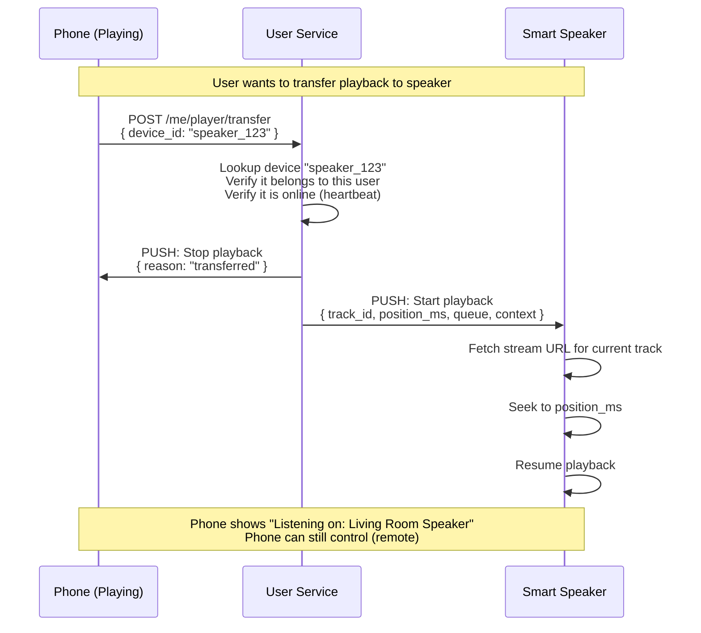

---

## Offline Download and DRM

### DRM Architecture

Digital Rights Management ensures that downloaded content cannot be extracted and shared. Spotify uses industry-standard DRM systems.

```mermaid
graph TD
    subgraph Client Device
        APP[Spotify App]
        DRM_MOD[DRM Module<br/>Widevine CDM / FairPlay]
        SECURE[Secure Storage<br/>Encrypted Audio Files]
        DECRYPT[Real-time Decryptor<br/>Runs in TEE / Secure Enclave]
        AUDIO_OUT[Audio Output]
    end

    subgraph Server Side
        LICENSE[License Server<br/>Widevine / FairPlay]
        KEY_STORE[(Key Store<br/>Content Encryption Keys)]
    end

    APP -->|1. Request download| LICENSE
    LICENSE -->|2. Issue license + content key<br/>bound to device| DRM_MOD
    DRM_MOD -->|3. Store encrypted content| SECURE

    SECURE -->|4. Read encrypted audio| DECRYPT
    DRM_MOD -->|4. Provide decryption key| DECRYPT
    DECRYPT -->|5. Decrypted audio stream| AUDIO_OUT

    Note over SECURE: Audio files encrypted with AES-128<br/>Key never leaves DRM module<br/>Cannot be extracted by user

    style DECRYPT fill:#c8e6c9
    style SECURE fill:#ffcdd2
```

### Offline Download Flow

```
1. User taps "Download Playlist" on mobile
2. App requests download manifest: POST /me/downloads
3. Server returns list of track URLs + DRM license for each
4. App downloads each track's encrypted audio file
5. App stores encrypted files in app's private storage directory
6. DRM license includes:
   - Content decryption key (bound to this device's hardware ID)
   - Expiration: 30 days from last online check-in
   - Offline play limit: unlimited (within license validity)
7. Every time the app goes online, it renews the license silently
8. If 30 days pass without going online, offline playback stops
   and the app prompts user to connect to internet

Storage on device:
  /app_data/spotify/offline/
    ├── licenses.db              (SQLite: track_id -> license)
    ├── tracks/
    │   ├── abc123.enc           (AES-128 encrypted Ogg Vorbis)
    │   ├── def456.enc
    │   └── ...
    └── metadata.db              (SQLite: track info for offline display)
```

---

## Podcast Service

Podcasts are fundamentally different from music in several ways that affect architecture:

| Aspect | Music | Podcasts |
|--------|-------|----------|
| Duration | 2-7 minutes | 20-180 minutes |
| Playback pattern | Listen fully, skip | Pause/resume over days |
| Seek behavior | Rare | Common (skip ads, rewind 15s) |
| Speed control | Never | Frequently (1.0x-2.0x) |
| New content frequency | Album drops occasionally | New episodes weekly |
| State tracking | Play count | Resume position per episode |
| Discovery | Algorithm-heavy | Follows + browse |
| File size | 2-8 MB | 20-200 MB |

### Resume Position Architecture

The key technical challenge for podcasts is maintaining **per-episode resume position** synced across devices.

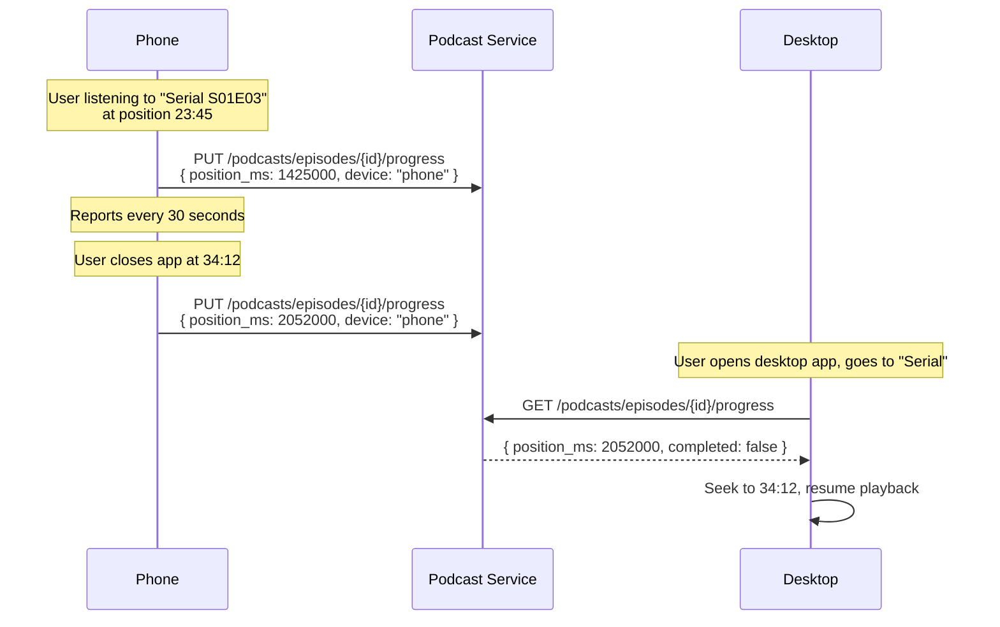

Resume position is stored in a dedicated table:
```sql
-- Fast lookup: one row per (user, episode)
-- Upsert on every progress report (~every 30 seconds)
CREATE TABLE podcast_progress (
    user_id     UUID,
    episode_id  UUID,
    position_ms INT,
    speed       FLOAT DEFAULT 1.0,
    completed   BOOLEAN DEFAULT FALSE,
    device_id   VARCHAR(100),
    updated_at  TIMESTAMP DEFAULT NOW(),
    PRIMARY KEY (user_id, episode_id)
);
-- Size: 200M users * avg 10 in-progress episodes * 50 bytes = ~100 GB
-- Sharded by user_id, fits in a moderately-sized PostgreSQL cluster
```

---

## Database Design

### Complete Data Store Architecture

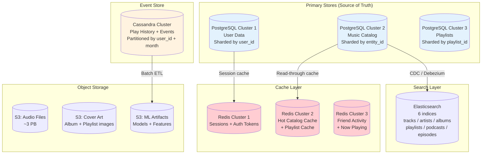

### Sharding Strategy

| Store | Shard Key | Rationale |
|-------|-----------|-----------|
| User DB | `user_id` | All user operations are user-scoped |
| Catalog DB | `track_id` / `album_id` | Lookups are by entity; even distribution via UUID |
| Playlist DB | `playlist_id` | Playlist operations are playlist-scoped; hot playlists get read replicas |
| Cassandra (play history) | `(user_id, month)` | Time-series queries: "my recent plays" always hits one partition |
| Redis (sessions) | `user_id` | Session lookups are user-scoped |
| Elasticsearch | Routing by `available_markets` | Users search within their market; reduces cross-shard queries |

### Change Data Capture (CDC)

To keep Elasticsearch in sync with the catalog database:

```
PostgreSQL (catalog) 
    -> Debezium (CDC connector)
    -> Kafka (catalog-changes topic)
    -> Elasticsearch Indexer (consumer)
    -> Elasticsearch (search index)

Lag: typically < 5 seconds from DB commit to searchable in ES
```

This ensures that when a new track is added to the catalog, it becomes searchable within seconds without the catalog service needing to write to ES directly.
