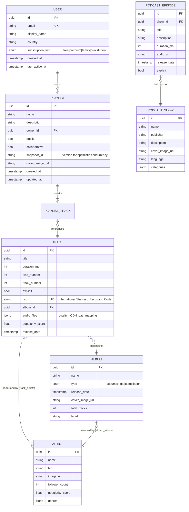

# Design Spotify / Music Streaming Platform -- Requirements and Estimation

## Table of Contents

1. [Problem Statement](#problem-statement)
2. [Clarifying Questions](#clarifying-questions)
3. [Functional Requirements](#functional-requirements)
4. [Non-Functional Requirements](#non-functional-requirements)
5. [Capacity Estimation](#capacity-estimation)
6. [Storage Estimation](#storage-estimation)
7. [Bandwidth Estimation](#bandwidth-estimation)
8. [API Design](#api-design)
9. [Data Model Overview](#data-model-overview)

---

## Problem Statement

Design a global music streaming platform similar to Spotify that enables users to search, stream, and discover music and podcasts on demand. The system must deliver low-latency audio playback to hundreds of millions of concurrent users worldwide, support personalized recommendations (like Discover Weekly), manage collaborative playlists, handle offline downloads with DRM, and scale a content catalog of 100M+ tracks with complex licensing relationships.

This problem is architecturally rich because it combines:
- **Real-time streaming** (low-latency audio delivery with gapless playback)
- **Massive catalog management** (100M+ songs with complex metadata and licensing)
- **Personalization at scale** (Discover Weekly for 200M+ users, every Monday)
- **CDN optimization** (heavy-tailed distribution -- top 1% of songs get 99% of plays)
- **Concurrent collaboration** (collaborative playlists with real-time sync)
- **DRM and licensing** (per-play royalty tracking, territory-based availability)
- **Multi-format content** (music: short, seekable / podcasts: long, resume-position)

---

## Clarifying Questions

Before diving in, these are the questions you should ask (or state assumptions about) in an interview:

| Question | Assumed Answer |
|----------|---------------|
| What are the primary features? | Stream music, search songs/artists/albums, create playlists, Discover Weekly, offline download, social features, podcasts |
| What is the target scale? | 500M registered users, 200M DAU |
| How large is the music catalog? | 100M songs, 5M podcasts, growing ~60K tracks/day |
| What audio quality levels? | 96 kbps (low), 160 kbps (normal), 320 kbps (high) -- Ogg Vorbis |
| Do we need offline download? | Yes, with DRM-protected encrypted storage |
| Do we need collaborative playlists? | Yes, real-time collaborative editing |
| Do we need social features? | Yes -- follow friends, see what they are listening to, share tracks |
| What about podcasts? | Yes -- different from music (longer, resume position, episodes) |
| Do we handle licensing/royalties? | Yes, per-play royalty tracking per territory |
| What regions do we serve? | Global -- 180+ markets |
| What clients do we support? | Web, desktop (Electron), mobile (iOS/Android), smart speakers, car, TV |
| Free tier vs. Premium? | Both -- free tier has ads and lower quality, Premium has 320 kbps + offline |

---

## Functional Requirements

### Core Features (Must Have)

1. **Music Streaming**
   - Stream audio on demand with near-instant playback start (<1 second)
   - Support multiple quality levels: 96 kbps, 160 kbps, 320 kbps (Ogg Vorbis)
   - Gapless playback between tracks (critical for albums like Dark Side of the Moon)
   - Crossfade support (configurable 1-12 seconds)
   - Pre-buffer next track in queue for seamless transitions
   - Adaptive quality based on network conditions

2. **Search**
   - Full-text search across songs, artists, albums, playlists, podcasts, and users
   - Autocomplete with fuzzy matching (handle typos: "Beyonse" -> "Beyonce")
   - Filters: genre, year, duration, popularity
   - Search results ranked by relevance, popularity, and personalization

3. **Playlists**
   - Create, edit, delete personal playlists
   - Collaborative playlists (multiple users can add/remove/reorder tracks)
   - Follow/save public playlists
   - Auto-generated playlists: Discover Weekly, Release Radar, Daily Mix
   - Playlist folders for organization

4. **Recommendations (Discover Weekly)**
   - Personalized playlist of 30 songs delivered every Monday
   - Based on listening history, taste profile, and collaborative filtering
   - Release Radar: new releases from followed artists + algorithmic picks
   - Daily Mix: 6 personalized mixes based on taste clusters
   - Radio: infinite stream based on a seed track/artist/genre

5. **Offline Download**
   - Premium users can download songs, albums, playlists for offline playback
   - DRM-encrypted storage on device
   - License check: device must go online at least once every 30 days
   - Download quality selection (normal / high)

6. **Social Features**
   - Follow friends and artists
   - See what friends are currently listening to (Friend Activity feed)
   - Share tracks, albums, playlists via links or social media
   - Collaborative playlist invites

7. **Podcasts**
   - Browse, search, and stream podcast episodes
   - Resume playback from last position (per-episode bookmark)
   - Playback speed control (0.5x to 3.0x)
   - Episode-level marks (played / in progress / new)
   - Show following with new-episode notifications

### Supporting Features (Nice to Have)

8. **Artist Pages** -- discography, bio, related artists, concert listings
9. **Lyrics** -- synchronized lyrics display (via Musixmatch integration)
10. **Queue Management** -- add to queue, reorder upcoming tracks
11. **Connect** -- transfer playback between devices (phone to speaker to laptop)
12. **Listening History** -- recently played tracks, artists, albums
13. **Wrapped** -- annual personalized listening statistics

---

## Non-Functional Requirements

### Performance
- **Playback start latency**: < 500ms from tap to audio output
- **Search latency**: < 200ms for autocomplete, < 500ms for full results
- **API response time**: p99 < 300ms for all catalog reads
- **Skip latency**: < 200ms to start the next track

### Availability
- **99.99% uptime** -- music streaming is a "background essential" service
- Graceful degradation: if recommendations fail, fall back to cached/popular content
- Offline mode must work without any network connectivity

### Scalability
- Handle 200M DAU with 40M concurrent streams at peak
- Support 100M+ track catalog with 60K new tracks added daily
- Discover Weekly generation for 200M+ users completed overnight (every Sunday)

### Consistency
- Playlist edits: eventual consistency acceptable (< 5s propagation)
- Play counts: eventual consistency (batched, not per-play)
- User library (saves, follows): strong consistency per user

### Security / DRM
- Audio content must be DRM-protected (Widevine for Android/Web, FairPlay for iOS)
- Encrypted storage for offline downloads
- Token-based authentication with refresh tokens
- Rate limiting to prevent scraping/abuse

---

## Capacity Estimation

### User and Traffic Numbers

```
Total registered users:        500,000,000   (500M)
Daily active users (DAU):      200,000,000   (200M)
Concurrent listeners (peak):    40,000,000   (40M -- 20% of DAU)
Average listening time/day:     30 minutes    (Spotify's actual avg ~30 min)
Average song duration:          3.5 minutes
Songs played per user per day:  ~8.5 songs    (30 min / 3.5 min)
Total plays per day:            200M * 8.5 = 1.7 billion plays/day
Plays per second (avg):         1.7B / 86,400 = ~19,700 plays/sec
Plays per second (peak 3x):    ~60,000 plays/sec
```

### Streams Per Hour Calculation

```
Total plays/day:                1.7 billion
Plays per hour (avg):           1.7B / 24 = ~70 million plays/hour
Peak hours (assume 2x):         ~140 million plays/hour
    (The stated 40M plays/hour is a reasonable "average active hour" figure)
```

### Search and API Traffic

```
Searches per user per day:      ~3
Total searches per day:         200M * 3 = 600M searches/day
Searches per second (avg):      600M / 86,400 = ~7,000/sec
Searches per second (peak):     ~20,000/sec

Playlist operations per day:    200M * 2 = 400M ops/day (create, add, reorder)
API calls per user per day:     ~50 (metadata, library, browse, etc.)
Total API calls per day:        200M * 50 = 10 billion/day
API calls per second (avg):     ~115,000/sec
API calls per second (peak):    ~350,000/sec
```

---

## Storage Estimation

### Audio File Storage

```
Total songs in catalog:         100,000,000 (100M)
Average song duration:          3.5 minutes = 210 seconds

Storage per song per quality level (Ogg Vorbis):
  96 kbps:   210s * 96 kbps / 8 = 2.52 MB
  160 kbps:  210s * 160 kbps / 8 = 4.20 MB
  320 kbps:  210s * 320 kbps / 8 = 8.40 MB

Storage per song (all 3 qualities): 2.52 + 4.20 + 8.40 = ~15.1 MB

Total audio storage:
  100M songs * 15.1 MB = 1,510,000 TB = ~1.5 PB (petabytes)
  (In practice, Spotify stores in multiple codecs: Ogg Vorbis + AAC + MP3
   for different clients, so actual storage is closer to ~3-5 PB)

New songs per day:              60,000
New storage per day:            60,000 * 15.1 MB = ~906 GB/day (~1 TB/day)
```

### Podcast Storage

```
Total podcasts:                 5,000,000 episodes
Average episode duration:       45 minutes = 2,700 seconds
Average podcast file size:      ~40 MB (lower bitrate: 64-128 kbps, mono)

Total podcast storage:          5M * 40 MB = 200 TB
New episodes per day:           ~70,000
New podcast storage per day:    70,000 * 40 MB = 2.8 TB/day
```

### Metadata Storage

```
Song metadata (title, artist, album, genre, duration, etc.):
  ~2 KB per song * 100M songs = 200 GB

User data:
  User profile: ~1 KB * 500M users = 500 GB
  Listening history: ~100 plays/month * 50 bytes * 500M = ~2.5 TB/month
  Playlists: avg 20 playlists * 50 tracks * 100 bytes * 500M users = ~500 TB
  Taste profiles: ~10 KB per user * 500M = 5 TB

Total metadata: ~510 TB
```

### Storage Summary

```
| Category        | Size       | Growth/Day |
|-----------------|------------|------------|
| Audio files     | ~3 PB      | ~1 TB      |
| Podcasts        | ~200 TB    | ~2.8 TB    |
| Metadata        | ~510 TB    | moderate   |
| Search indices  | ~50 TB     | moderate   |
| ML models/feats | ~100 TB    | moderate   |
| TOTAL           | ~4 PB      | ~4-5 TB    |
```

---

## Bandwidth Estimation

### Streaming Bandwidth

```
Concurrent streams (peak):      40,000,000
Average bitrate:                 160 kbps (weighted avg across free/premium)

Peak streaming bandwidth:
  40M * 160 kbps = 6,400,000 Mbps = 6,400 Gbps = 6.4 Tbps

CDN egress per day:
  1.7B plays/day * 210 seconds * 160 kbps / 8
  = 1.7B * 4.2 MB = 7.14 PB/day

That is roughly 7 PB of audio data served per day.

With CDN cache hit rate of ~95% for popular content:
  Origin server bandwidth: 6.4 Tbps * 0.05 = 320 Gbps from origin
```

### Download (Offline) Bandwidth

```
Premium users:                   ~100M (20% of total)
Users downloading per day:       ~10M (10% of premium)
Average download:                ~50 songs = 50 * 4.2 MB = 210 MB per user

Total download bandwidth/day:    10M * 210 MB = 2.1 PB/day
  (This happens mostly on WiFi during off-peak hours)
```

---

## API Design

### Authentication

```
POST /api/v1/auth/login
Body: { "email": "string", "password": "string", "device_id": "string" }
Response: { "access_token": "jwt", "refresh_token": "string", "expires_in": 3600 }

POST /api/v1/auth/refresh
Body: { "refresh_token": "string" }
Response: { "access_token": "jwt", "expires_in": 3600 }
```

### Streaming

```
GET /api/v1/tracks/{track_id}/stream?quality={96|160|320}
Headers: Authorization: Bearer <token>
Response: 302 Redirect to CDN URL with signed, time-limited token
  Location: https://cdn-edge.spotify.svc/audio/aHR0c...?token=<signed>&exp=<timestamp>

  -- The redirect URL includes:
  -- 1. Signed token (prevents unauthorized sharing)
  -- 2. Expiration timestamp (URL valid for ~60 seconds)
  -- 3. Client IP binding (optional, prevents token sharing)

GET /api/v1/tracks/{track_id}/stream-url
Headers: Authorization: Bearer <token>
Response: {
  "urls": [
    { "quality": "320", "url": "https://cdn-...", "format": "ogg_vorbis" },
    { "quality": "160", "url": "https://cdn-...", "format": "ogg_vorbis" },
    { "quality": "96",  "url": "https://cdn-...", "format": "ogg_vorbis" }
  ],
  "file_id": "abc123",
  "duration_ms": 213000,
  "expires_in": 60
}
```

### Search

```
GET /api/v1/search?q={query}&type={track,artist,album,playlist,podcast}&limit=20&offset=0
Response: {
  "tracks": { "items": [...], "total": 1500 },
  "artists": { "items": [...], "total": 42 },
  "albums": { "items": [...], "total": 200 },
  "playlists": { "items": [...], "total": 850 },
  "podcasts": { "items": [...], "total": 30 }
}
```

### Playlists

```
POST /api/v1/playlists
Body: { "name": "string", "description": "string", "public": true, "collaborative": false }
Response: { "id": "pl_abc123", "name": "...", "owner": {...}, "tracks": [] }

POST /api/v1/playlists/{playlist_id}/tracks
Body: {
  "uris": ["spotify:track:abc", "spotify:track:def"],
  "position": 5,
  "operation_id": "uuid-for-idempotency"
}
Response: { "snapshot_id": "MTY4NzQ...", "version": 42 }

PUT /api/v1/playlists/{playlist_id}/tracks/reorder
Body: {
  "range_start": 2,
  "range_length": 3,
  "insert_before": 8,
  "snapshot_id": "MTY4NzQ..."     -- optimistic concurrency via snapshot
}
Response: { "snapshot_id": "new_snap_id" }

DELETE /api/v1/playlists/{playlist_id}/tracks
Body: { "uris": ["spotify:track:abc"], "snapshot_id": "MTY4NzQ..." }
```

### Library / User Actions

```
PUT /api/v1/me/tracks                     -- Save tracks to library
Body: { "ids": ["track_id_1", "track_id_2"] }

GET /api/v1/me/tracks?limit=50&offset=0   -- Get saved tracks

PUT /api/v1/me/following
Body: { "type": "artist|user", "ids": ["artist_id_1"] }

GET /api/v1/me/player/recently-played?limit=50
Response: { "items": [{ "track": {...}, "played_at": "2025-01-15T10:30:00Z" }] }
```

### Recommendations

```
GET /api/v1/me/discover-weekly
Response: {
  "playlist_id": "pl_dw_20250113",
  "tracks": [...],
  "generated_at": "2025-01-13T00:00:00Z",
  "expires_at": "2025-01-20T00:00:00Z"
}

GET /api/v1/recommendations?seed_tracks=id1,id2&seed_artists=id3&limit=30
Response: { "tracks": [...], "seeds": [...] }
```

### Offline / Download

```
POST /api/v1/me/downloads
Body: { "uris": ["spotify:track:abc", "spotify:album:def"], "quality": "320" }
Response: {
  "download_id": "dl_123",
  "items": [
    { "uri": "spotify:track:abc", "encrypted_url": "...", "license_key": "...",
      "drm": "widevine", "expires_at": "2025-02-15T00:00:00Z" }
  ]
}

POST /api/v1/me/downloads/license-check
Body: { "device_id": "dev_123", "download_ids": ["dl_123"] }
Response: { "valid": true, "renew_at": "2025-02-10T00:00:00Z" }
```

---

## Data Model Overview

### Core Entities



### Key Relationship Tables

```sql
-- Many-to-many: Track <-> Artist (a track can have multiple artists)
CREATE TABLE track_artists (
    track_id   UUID REFERENCES tracks(id),
    artist_id  UUID REFERENCES artists(id),
    role       VARCHAR(50) DEFAULT 'primary',  -- primary, featured, composer
    PRIMARY KEY (track_id, artist_id)
);

-- Playlist tracks with ordering (position matters)
CREATE TABLE playlist_tracks (
    playlist_id  UUID REFERENCES playlists(id),
    track_id     UUID REFERENCES tracks(id),
    position     INT NOT NULL,
    added_by     UUID REFERENCES users(id),
    added_at     TIMESTAMP DEFAULT NOW(),
    PRIMARY KEY (playlist_id, position)
);
-- Index for "show me all playlists containing this track"
CREATE INDEX idx_playlist_tracks_track ON playlist_tracks(track_id);

-- User library (saved tracks)
CREATE TABLE user_saved_tracks (
    user_id    UUID REFERENCES users(id),
    track_id   UUID REFERENCES tracks(id),
    saved_at   TIMESTAMP DEFAULT NOW(),
    PRIMARY KEY (user_id, track_id)
);

-- Play history (append-only, used for recommendations)
CREATE TABLE play_history (
    id          BIGSERIAL PRIMARY KEY,
    user_id     UUID NOT NULL,
    track_id    UUID NOT NULL,
    played_at   TIMESTAMP NOT NULL,
    duration_ms INT,           -- how long they actually listened
    context     VARCHAR(100),  -- "playlist:pl_123", "album:alb_456", "radio:seed_xyz"
    skip        BOOLEAN        -- did the user skip before 30 seconds?
);
-- Partitioned by played_at (monthly) for efficient queries and TTL

-- Podcast resume positions
CREATE TABLE podcast_progress (
    user_id     UUID NOT NULL,
    episode_id  UUID NOT NULL,
    position_ms INT NOT NULL,
    completed   BOOLEAN DEFAULT FALSE,
    updated_at  TIMESTAMP DEFAULT NOW(),
    PRIMARY KEY (user_id, episode_id)
);
```

### Data Store Selection Rationale

| Data | Store | Why |
|------|-------|-----|
| User profiles, playlists, catalog metadata | **PostgreSQL** (sharded by user_id / entity_id) | ACID transactions for playlist edits, rich querying |
| Play history, listening events | **Cassandra** / **ScyllaDB** | Append-only, time-series, massive write throughput |
| Search index | **Elasticsearch** | Full-text search with fuzzy matching, autocomplete |
| Session, now-playing, friend activity | **Redis Cluster** | Low-latency reads, TTL-based expiry, pub/sub |
| Audio files | **Object Storage** (S3 / GCS) + CDN | Cost-effective blob storage, served via CDN edge |
| ML features, embeddings, taste profiles | **Feature Store** (Redis + Parquet on S3) | Fast serving + batch training |
| Recommendation models | **Model Store** (MLflow / S3) | Version-controlled model artifacts |
| Offline download licenses | **DRM License Server** (Widevine / FairPlay) | Industry-standard DRM |
