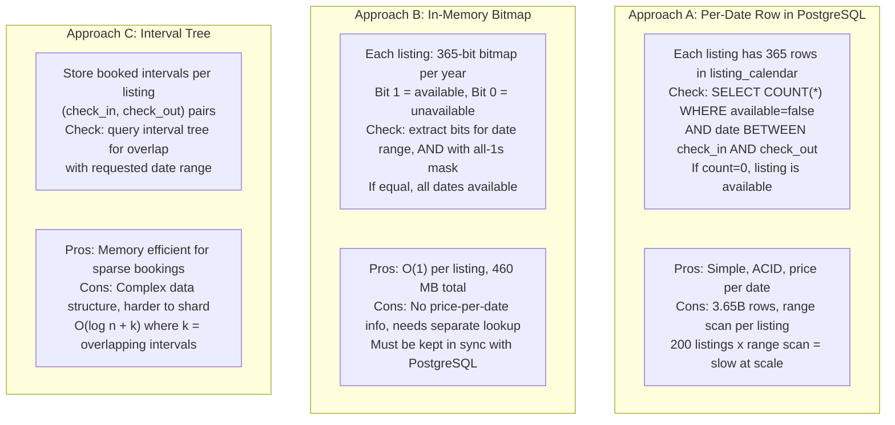
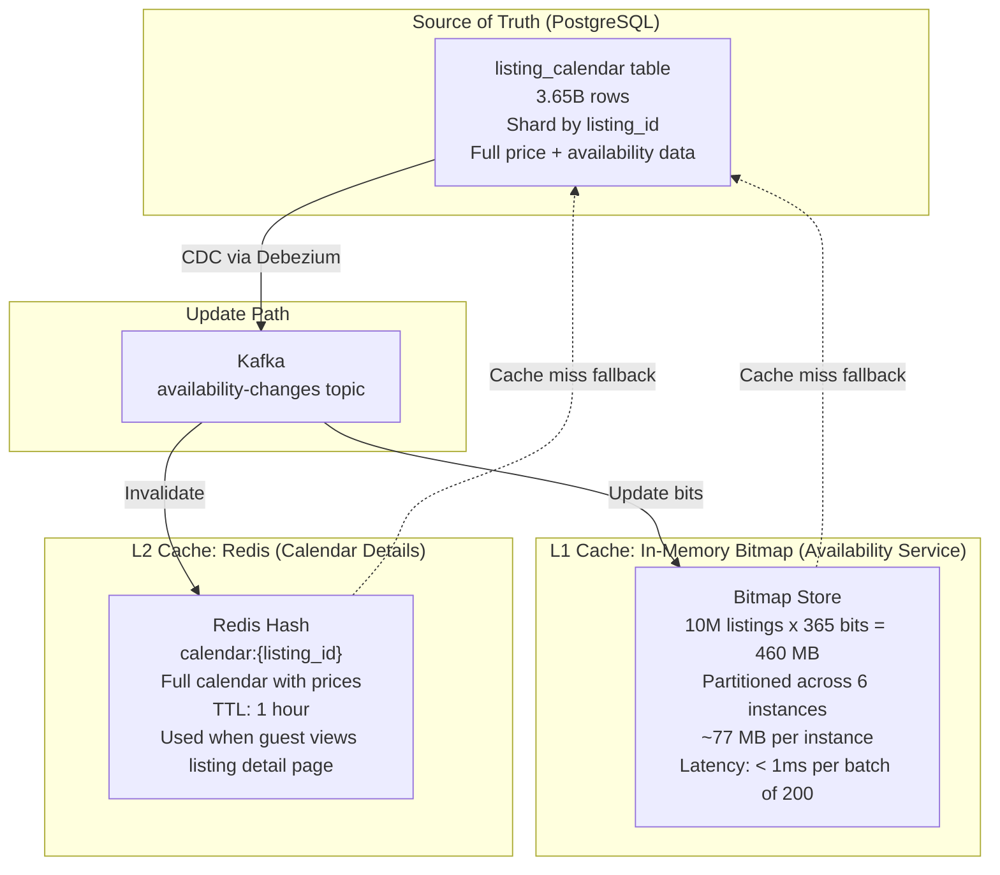
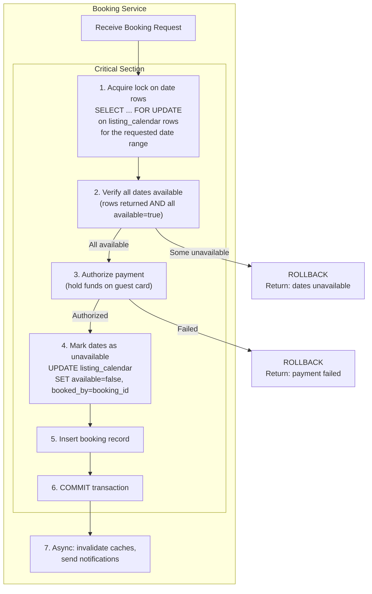
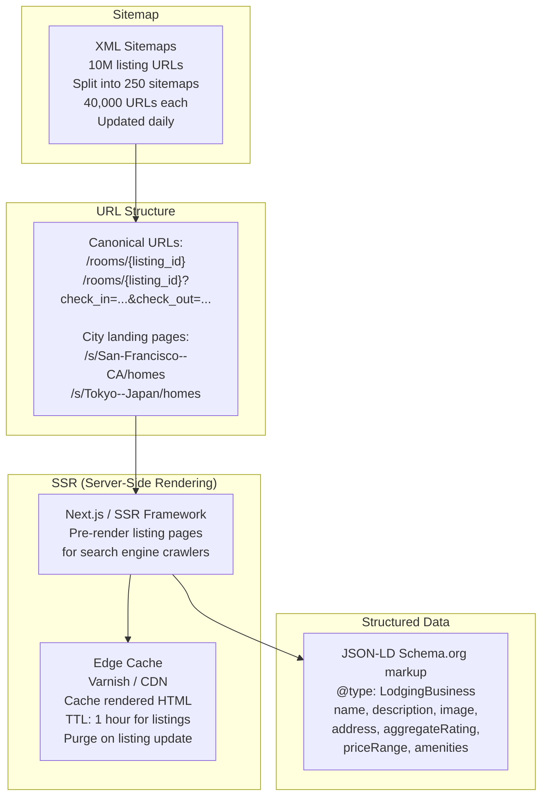
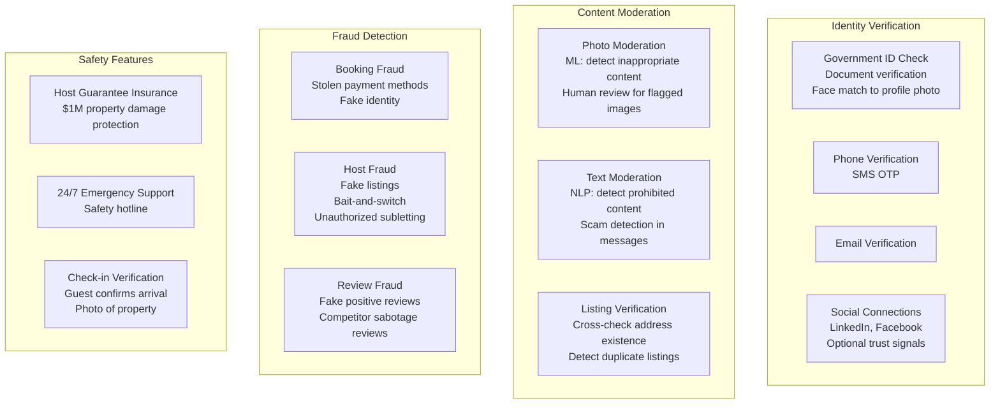

# Design Airbnb / Hotel Booking System: Deep Dive and Scaling

## Table of Contents
- [1. Deep Dive #1: Search Ranking at Scale](#1-deep-dive-1-search-ranking-at-scale)
- [2. Deep Dive #2: Availability Checking at Scale](#2-deep-dive-2-availability-checking-at-scale)
- [3. Deep Dive #3: Booking Consistency and Double-Booking Prevention](#3-deep-dive-3-booking-consistency-and-double-booking-prevention)
- [4. SEO for Listing Pages](#4-seo-for-listing-pages)
- [5. Multi-Currency Support](#5-multi-currency-support)
- [6. Trust and Safety](#6-trust-and-safety)
- [7. Trade-offs and Alternatives](#7-trade-offs-and-alternatives)
- [8. Interview Tips and Common Follow-ups](#8-interview-tips-and-common-follow-ups)

---

## 1. Deep Dive #1: Search Ranking at Scale

### 1.1 The Problem

When a guest searches "San Francisco, Jul 1-5, 2 guests", there are potentially
5,000+ available listings. The order in which we show them determines:
- Guest booking probability (top results get 10x more bookings)
- Host earnings (better ranking = more revenue)
- Platform revenue (more bookings = more service fees)

A naive sort by price or rating misses the point. The best result for Guest A
(a budget-conscious solo traveler) is completely different from Guest B
(a family looking for a luxury villa). **Personalized ranking is a core
competitive advantage** -- Airbnb has published extensively on their ML ranking system.

### 1.2 Airbnb's Actual Search Ranking Architecture

```mermaid
graph TB
    subgraph "Query Understanding"
        QUERY[Search Query<br/>Location, dates, guests, filters]
        GEO_RES[Geo Resolution<br/>Map 'San Francisco' to bounding box<br/>or resolve to neighborhood IDs]
        INTENT[Intent Detection<br/>Business trip? Family vacation?<br/>Budget or luxury?]
    end

    subgraph "Candidate Retrieval (L0)"
        ES_QUERY[Elasticsearch Query<br/>geo_distance + hard filters<br/>Return top 1,000 candidates<br/>Latency budget: 50ms]
    end

    subgraph "Lightweight Scoring (L1)"
        L1_FEAT[Features: location proximity,<br/>price position, rating,<br/>photo quality score,<br/>host response rate]
        L1_MODEL[Light GBDT Model<br/>Score 1,000 candidates<br/>Prune to top 200<br/>Latency budget: 20ms]
    end

    subgraph "Availability Filter"
        AVAIL[Availability Service<br/>Check 200 listings for date range<br/>Remove unavailable<br/>~150 remain<br/>Latency budget: 10ms]
    end

    subgraph "Full Scoring (L2)"
        L2_FEAT[Features: 100+ signals<br/>including guest-listing<br/>interaction features,<br/>personalization features]
        L2_MODEL[Deep Neural Network<br/>Score 150 candidates<br/>Predict P(booking)<br/>Latency budget: 50ms]
    end

    subgraph "Business Rules (L3)"
        DIV[Diversity Injection<br/>Mix property types,<br/>price ranges, neighborhoods<br/>Avoid monotonous results]
        BOOST[Boost Rules<br/>New listings (cold start),<br/>Superhost badge,<br/>Instant Book preference]
        SUPPRESS[Suppress Rules<br/>Low quality score,<br/>High cancellation rate,<br/>Policy violations]
    end

    subgraph "Response"
        TOP20[Return Top 20<br/>Page 1 results<br/>Total latency: < 200ms]
    end

    QUERY --> GEO_RES --> INTENT
    INTENT --> ES_QUERY
    ES_QUERY --> L1_FEAT --> L1_MODEL
    L1_MODEL --> AVAIL
    AVAIL --> L2_FEAT --> L2_MODEL
    L2_MODEL --> DIV --> BOOST --> SUPPRESS --> TOP20
```

### 1.3 Feature Categories for ML Ranking

```
Airbnb's search ranking uses 100+ features grouped into these categories.
These are based on publicly disclosed information from Airbnb engineering blogs.

1. LISTING QUALITY FEATURES (static, precomputed daily)
   ├── avg_rating (weighted: recent reviews count more)
   ├── review_count (more reviews = more trust)
   ├── photo_quality_score (ML model scoring image quality)
   ├── description_completeness (% of fields filled)
   ├── response_rate (host responds to inquiries)
   ├── response_time_minutes (faster = better)
   ├── acceptance_rate (host accepts booking requests)
   ├── cancellation_rate (host cancels confirmed bookings)
   ├── is_superhost (boolean)
   ├── listing_age_days (new listings get a boost period)
   └── verified_photos (professional photographer used)

2. LOCATION FEATURES (per query)
   ├── distance_to_search_center_km
   ├── distance_to_city_center_km
   ├── neighborhood_popularity_score
   ├── transit_accessibility_score
   ├── walk_score
   └── safety_score (based on incident data)

3. PRICE FEATURES (per query)
   ├── nightly_rate
   ├── total_price_for_stay
   ├── price_percentile_in_area (where does this listing fall in local distribution)
   ├── price_vs_predicted_price (overpriced or underpriced vs ML estimate)
   ├── cleaning_fee_ratio (high cleaning fee relative to nightly rate = negative signal)
   └── discount_applied (weekly/monthly discount indicator)

4. DEMAND FEATURES (dynamic, updated hourly)
   ├── views_last_7_days
   ├── bookings_last_30_days
   ├── booking_conversion_rate (views to bookings)
   ├── wishlist_save_rate
   ├── search_impression_to_click_rate (CTR)
   └── occupancy_rate_next_30_days

5. GUEST-LISTING MATCH FEATURES (personalized, per query)
   ├── guest_price_preference (derived from past booking history)
   ├── guest_property_type_preference
   ├── guest_amenity_preferences
   ├── guest_past_neighborhoods (returning to familiar areas?)
   ├── guest_trip_purpose (business vs leisure, inferred)
   ├── guest_group_size_match (4 guests searching, 2-person studio = bad match)
   └── guest_language_match (host speaks guest's language)

6. TEMPORAL FEATURES (per query)
   ├── days_until_check_in (last-minute vs planning ahead)
   ├── length_of_stay
   ├── is_weekend_stay
   ├── is_holiday_period
   └── day_of_week_of_search (search patterns differ by day)
```

### 1.4 Model Architecture

```
Airbnb's ranking has evolved through several generations:

Generation 1 (2014): Hand-tuned scoring function
  score = w1*distance + w2*price + w3*rating + w4*reviews
  Simple, interpretable, but suboptimal.

Generation 2 (2016): Gradient Boosted Decision Trees (GBDT)
  - XGBoost model with ~50 features
  - Trained on booking outcomes (did the guest book or not?)
  - 3x improvement in booking conversion over hand-tuned scoring
  - Airbnb published this at KDD 2018: "Applying Deep Learning to Airbnb Search"

Generation 3 (2018): Deep Neural Network (DNN)
  - Two-tower architecture: listing tower + guest tower
  - Listing tower: embedding of listing features
  - Guest tower: embedding of guest features + search context
  - Dot product of towers = relevance score
  - Trained on billions of search-booking pairs
  - 2x improvement over GBDT

Generation 4 (2020+): Transformer-based with sequence modeling
  - Models guest's search session as a sequence
  - Previous clicks in session influence next ranking
  - "If guest clicked 3 studios, show more studios"
  - Real-time adaptation to guest behavior within session

For interview: describe Generation 2 (GBDT), mention Generation 3 exists.
```

### 1.5 Cold Start Problem (New Listings)

```
Problem: A new listing has zero reviews, zero bookings, zero quality signals.
How does it rank against established listings with 200+ reviews?

Airbnb's solution (multi-pronged):
  1. New listing boost: for the first 2 weeks, apply a ranking boost
     to give the listing initial exposure. Gradually decay the boost.
  
  2. Quality prediction: use listing features (photos, description,
     amenities, host profile) to PREDICT quality before reviews exist.
     A well-photographed listing in a good neighborhood with a complete
     description from a responsive host predicts high quality.
  
  3. Explore-exploit: intentionally show some new listings in positions
     they haven't "earned" yet, to gather signal (Thompson sampling).
     If the listing gets clicks and bookings, it earned its rank.
     If not, demote it.
  
  4. Photo quality model: ML model trained on professional photos
     predicts visual appeal of a listing from its images alone.
     Strong predictor of booking conversion.
  
  5. Host track record: if the host has other highly-rated listings,
     transfer some trust signal to the new listing.

This is a classic explore/exploit problem (multi-armed bandit).
Airbnb published "Customizing Session-Based Recommendations with
Hierarchical Expertise" at RecSys 2019 covering this topic.
```

### 1.6 Search Diversity

```
Problem: If ranking purely by P(booking), results become monotonous.
Guest searches SF and sees 20 similar Victorians in Haight-Ashbury.

Diversity injection rules:
  1. Property type mix: ensure results include entire homes, private
     rooms, and unique stays (if available)
  
  2. Neighborhood variety: don't cluster all results in one area.
     Show listings from 3-4 neighborhoods.
  
  3. Price range spread: mix budget and premium options even if the
     model predicts a single price range for this guest.
  
  4. Host diversity: no more than 2 listings from the same host
     on a single page (prevent gaming).

Implementation: deterministic interleaving.
  - After L2 scoring, group results by property_type and neighborhood
  - Round-robin pick from each group to assemble page
  - Preserve rough ranking order within each group

Airbnb calls this "listing diversity" and it measurably improves
guest satisfaction even though it slightly decreases per-impression
booking conversion.
```

---

## 2. Deep Dive #2: Availability Checking at Scale

### 2.1 The Problem Statement

```
10,000,000 active listings
x 365 days of calendar data each
= 3,650,000,000 date entries

Search peak: 19,000 availability checks/sec
Each check: "Is listing X available for ALL dates from A to B?"

Requirements:
  - Sub-10ms per check (must fit within 500ms search latency budget)
  - 100% accuracy (showing unavailable listings wastes guest time)
  - Real-time updates (when a booking is confirmed, availability 
    changes must propagate within seconds)
  - Support batch queries (check 200 listings at once per search)
```

### 2.2 Approach Comparison



### 2.3 Hybrid Architecture (What Airbnb Actually Uses)



### 2.4 Bitmap Implementation Detail

```
Data structure per listing:

  struct ListingAvailability {
    listing_id:   UUID        // 16 bytes
    year:         uint16      // 2 bytes
    bitmap:       [u8; 46]    // 46 bytes = 368 bits (365 needed, 3 padding)
    last_updated: uint32      // 4 bytes (epoch seconds)
  }
  // Total: 68 bytes per listing per year

Memory footprint:
  10M listings x 68 bytes = 680 MB
  With next year's calendar: 1.36 GB
  Easily fits in RAM on 6 instances (227 MB each)

Operations:

  SET_UNAVAILABLE(listing_id, date):
    bit_index = date - Jan 1 of year
    bitmap[bit_index / 8] &= ~(1 << (bit_index % 8))   // clear bit

  SET_AVAILABLE(listing_id, date):
    bit_index = date - Jan 1 of year
    bitmap[bit_index / 8] |= (1 << (bit_index % 8))     // set bit

  CHECK_RANGE(listing_id, check_in, check_out):
    start_bit = check_in - Jan 1
    end_bit = check_out - Jan 1 - 1   // check-out date itself is available
    
    // Extract bits for the range and check if all are 1
    for bit = start_bit to end_bit:
      if bitmap[bit / 8] & (1 << (bit % 8)) == 0:
        return false   // at least one date unavailable
    return true

  Optimized: use 64-bit word operations to check 64 dates at once.
  A 4-night stay check = 1 word operation + 1 mask.
  
  BATCH_CHECK(listing_ids[], check_in, check_out):
    results = {}
    for listing_id in listing_ids:
      results[listing_id] = CHECK_RANGE(listing_id, check_in, check_out)
    return results
    
  200 listings x 1 word op each = ~200 CPU operations = sub-microsecond.
  Network overhead dominates, not computation.
```

### 2.5 Handling Edge Cases

```
1. Cross-year bookings (Dec 28 - Jan 3):
   - Check both year bitmaps
   - CHECK_RANGE(listing, Dec28, Dec31) AND CHECK_RANGE(listing, Jan1, Jan2)

2. Min/max night enforcement:
   - Bitmap only stores available/unavailable
   - Min/max nights stored separately per listing (or per date in DB)
   - After bitmap check, verify stay length meets min/max
   - This is a lightweight check on a single value per listing

3. Check-in/check-out day semantics:
   - Check-out day is NOT consumed (guest leaves, listing available for next check-in)
   - When marking dates: mark check_in through (check_out - 1) as unavailable
   - A 4-night stay Jul 1-5 occupies bits for Jul 1, Jul 2, Jul 3, Jul 4
   - Jul 5 remains available for another guest to check in

4. Host blocks personal dates:
   - Same mechanism as bookings: flip bits to unavailable
   - Distinguished in PostgreSQL (booked_by = null, host_blocked = true)
   - Bitmap treats both the same: bit = 0

5. Timezone considerations:
   - All dates stored in the listing's local timezone
   - "Jul 1 check-in" means Jul 1 in San Francisco, not UTC
   - This avoids confusion: 11 PM UTC on Jun 30 is still Jun 30 in SF
   - Airbnb displays dates in listing timezone, converts to guest timezone
     only for display purposes in the guest's calendar view

6. Turnaround days (preparation between guests):
   - Some hosts need 1-2 days between bookings for cleaning
   - Turnaround buffer: after booking check_out, mark next N days unavailable
   - Implemented in PostgreSQL as extra blocked dates
   - Reflected in bitmap automatically via CDC
```

### 2.6 Scaling the Availability Service

```
Partitioning strategy:
  - 10M listings partitioned across 6 instances by listing_id hash
  - Each instance holds ~1.67M listings' bitmaps (~113 MB)
  - Search Service sends availability check to the correct partition
    based on listing_id routing (consistent hashing)

  Search query flow:
    1. ES returns 200 candidate listing_ids
    2. Group listing_ids by partition (which Availability Service instance)
    3. Send parallel requests to each partition
    4. Each partition checks its local bitmaps
    5. Merge results
    
    With 6 partitions, a 200-listing check fans out to 6 parallel calls
    of ~33 listings each. Each takes < 1ms. Total with network: < 10ms.

Replication:
  - Each partition has 2 replicas (total 18 instances: 6 primary + 12 replica)
  - Search reads go to replicas (load distribution)
  - Updates (from Kafka) go to primary, replicated to replicas
  - If primary fails, replica promotes (standard leader-follower)

Warm-up:
  - On startup, instance loads bitmaps from PostgreSQL
  - Full load of 1.67M listings: ~3 minutes (bulk SELECT)
  - During load, fallback to Redis/PostgreSQL for availability checks
  - Once loaded, serve from memory

Monitoring:
  - Track bitmap staleness: max time between Kafka update and bitmap flip
  - Alert if staleness > 5 seconds (indicates Kafka consumer lag)
  - Track cache miss rate: should be < 0.1% after warm-up
```

---

## 3. Deep Dive #3: Booking Consistency and Double-Booking Prevention

### 3.1 The Core Problem

```
Two guests click "Book" on the same listing for overlapping dates at the same time.
Only one can succeed. The other must fail gracefully.

This is a distributed systems concurrency problem. The simplest approach
(check availability then book) has a race condition:

  Guest A: CHECK availability -> available -> BOOK
  Guest B: CHECK availability -> available -> BOOK (DOUBLE BOOKED!)

The check and the book must be atomic.
```

### 3.2 Solution: Pessimistic Locking with Timeout



### 3.3 Detailed Transaction Sequence

```sql
-- Booking transaction for Guest A booking listing lst_001 from Jul 1-5
-- (Jul 1-4 are the occupied nights; Jul 5 is check-out day)

BEGIN;

-- Step 1: Lock the specific date rows (this blocks other transactions)
SELECT listing_id, date, available, price
FROM listing_calendar
WHERE listing_id = 'lst_001'
  AND date >= '2026-07-01'
  AND date <= '2026-07-04'        -- check_out - 1 day
  AND available = true
FOR UPDATE                         -- exclusive row lock
NOWAIT;                            -- fail immediately if can't lock
                                   -- (alternative: SKIP LOCKED or timeout)

-- If fewer rows returned than expected: some dates unavailable
-- ROLLBACK and return error to guest

-- Step 2: Authorize payment (external call to Stripe)
-- This happens WHILE holding the lock
-- Keep this fast (< 3 seconds) to minimize lock duration

-- Step 3: Mark dates as booked
UPDATE listing_calendar
SET available = false,
    booked_by = 'bk_new789'
WHERE listing_id = 'lst_001'
  AND date >= '2026-07-01'
  AND date <= '2026-07-04';

-- Step 4: Create booking record
INSERT INTO bookings (id, guest_id, listing_id, host_id, check_in, check_out,
                      guests, total_price, status, idempotency_key, created_at)
VALUES ('bk_new789', 'guest_001', 'lst_001', 'host_001', '2026-07-01',
        '2026-07-05', 2, 1032.70, 'CONFIRMED', 'book_guest001_lst001_20260701', NOW());

COMMIT;
```

### 3.4 Handling Contention Scenarios

```
Scenario 1: Two guests, overlapping dates

  Guest A: Jul 1-5 (locks Jul 1-4)
  Guest B: Jul 3-7 (tries to lock Jul 3-6)

  Result: Guest B's SELECT FOR UPDATE blocks on Jul 3-4 (held by A).
  After A commits, B's query runs and finds Jul 3-4 unavailable.
  B receives "dates no longer available" error.

Scenario 2: Two guests, non-overlapping dates on same listing

  Guest A: Jul 1-5 (locks Jul 1-4)
  Guest B: Jul 10-14 (locks Jul 10-13)

  Result: Both succeed. The locks are on DIFFERENT rows.
  PostgreSQL's row-level locking means non-overlapping bookings
  proceed in parallel.

Scenario 3: Payment gateway timeout

  Guest A acquires lock, sends payment auth to Stripe.
  Stripe takes 10+ seconds (network issue).
  
  Mitigation: set lock_timeout = 5000 (5 seconds) at session level.
  If payment auth takes > 5s, PostgreSQL auto-releases the lock.
  Booking fails with "please try again".
  
  SET lock_timeout = 5000;  -- per session
  
  Alternative: use NOWAIT (fail immediately if lock held) and
  retry with exponential backoff. But this means Guest B fails
  even when Guest A would succeed quickly.

Scenario 4: Server crashes while holding lock

  PostgreSQL automatically releases locks when the connection drops.
  The transaction is rolled back (never committed).
  Payment auth may have been sent to Stripe -- handled by:
    - Pre-auth auto-expires after 7 days if not captured
    - Or explicit void on retry
    - Idempotency key prevents duplicate charges

Scenario 5: Application server dies between payment auth and commit

  Payment authorized at Stripe, but booking not committed.
  On recovery:
    - Idempotency key check: "was this booking already created?"
    - If no: void the authorization at Stripe
    - If yes: booking was committed (race condition unlikely but possible)
  
  Reconciliation job runs every 5 minutes:
    - Find authorized payments without corresponding confirmed bookings
    - Void orphaned authorizations
```

### 3.5 Timezone Edge Cases in Booking

```
Problem: Guest in New York books a listing in Tokyo.
  Guest thinks "July 1 check-in" means July 1 in their timezone.
  But the listing operates on Tokyo time (UTC+9).
  
  If guest books at 11 PM EST on June 30:
    - It's already July 1 at noon in Tokyo
    - Is July 1 the correct check-in date?

Airbnb's solution:
  - ALL dates are in the listing's local timezone
  - The UI displays "Jul 1" without timezone suffix
  - Check-in and check-out times are defined by the host (e.g., 3 PM local)
  - The system stores only dates (not timestamps) for check-in/check-out
  - No timezone conversion needed for availability checking

  Calendar storage: listing_calendar stores DATE (not TIMESTAMP)
  Date comparison: purely date-based, no time math
  Display: client displays dates in guest's format but listing's timezone

  This means:
    - "Jul 1" check-in in Tokyo = July 1 at 3 PM JST
    - Guest in New York sees "Check-in: Jul 1 at 3:00 PM (local Tokyo time)"
    - No ambiguity

Exception: check-in reminders and countdown timers DO use
timestamp-aware logic (host's local time converted to guest's local time).
```

### 3.6 Distributed Lock Alternative (for Microservices)

```
If the Availability Service and Booking Service are separate services
(not sharing a database), PostgreSQL row locks don't work across services.

Alternative: Redis distributed lock (Redlock pattern)

  LOCK:
    key: "lock:availability:lst_001:2026-07-01:2026-07-05"
    TTL: 10 seconds
    value: booking_request_id (for identification)
    
    SET lock:availability:lst_001:2026-07-01:2026-07-05 bk_req_123 NX PX 10000
    
    If SET returns OK: lock acquired, proceed with booking
    If SET returns nil: lock held by another request, return "try again"

  UNLOCK:
    -- Only unlock if we hold the lock (check value matches)
    -- Use Lua script for atomicity
    if redis.call("get", key) == booking_request_id then
      redis.call("del", key)
    end

  Pros:
    - Works across services (any service can check the lock)
    - Configurable TTL prevents stuck locks
    - Very fast (< 1ms for lock acquisition)
  
  Cons:
    - Not as reliable as PostgreSQL locks (Redis failover can lose lock)
    - Redlock requires 5 Redis instances for safety guarantees
    - More complex to implement correctly

  When to use which:
    - If booking + availability in same database: PostgreSQL FOR UPDATE
    - If separate databases/services: Redis distributed lock + separate commit

Airbnb uses PostgreSQL locks for the critical booking path (source of truth
is one database), not distributed locks.
```

---

## 4. SEO for Listing Pages

### 4.1 Why SEO Matters for Airbnb

```
~30% of Airbnb's organic traffic comes from Google searches like:
  "airbnb san francisco"
  "vacation rental tokyo"
  "beach house malibu"

Each listing page is a potential Google landing page. 10M listings = 
10M URLs that need to be indexable, fast, and rich in structured data.
```

### 4.2 SEO Architecture



### 4.3 Key SEO Techniques

```
1. Server-Side Rendering (SSR):
   - Listing pages rendered on server (not client-side JS only)
   - Googlebot can crawl full content without executing JavaScript
   - Critical for indexing photos, reviews, amenity lists

2. Canonical URLs:
   - /rooms/lst_abc123 is the canonical URL
   - Search query parameters (?check_in=...) use rel="canonical" to point back
   - Prevents duplicate content across different date queries

3. Structured data (JSON-LD):
   <script type="application/ld+json">
   {
     "@context": "https://schema.org",
     "@type": "LodgingBusiness",
     "name": "Cozy Victorian in Haight-Ashbury",
     "image": "https://cdn.airbnb.com/photos/...",
     "address": { "@type": "PostalAddress", "addressLocality": "San Francisco" },
     "aggregateRating": { "@type": "AggregateRating", "ratingValue": "4.87", "reviewCount": "142" },
     "priceRange": "$185/night"
   }
   </script>

4. City/neighborhood landing pages:
   - /s/San-Francisco--CA/homes -- pre-rendered directory pages
   - Target "airbnb san francisco" type keywords
   - Include top listings, neighborhood descriptions, price ranges

5. Performance (Core Web Vitals):
   - LCP < 2.5s (largest contentful paint -- usually hero photo)
   - Photos: lazy load below fold, preload hero image
   - CDN for all static assets
   - Google rewards fast pages with higher search ranking
```

---

## 5. Multi-Currency Support

### 5.1 Currency Architecture

```mermaid
graph LR
    subgraph "Listing"
        HOST_CURR[Host sets price in<br/>listing currency (USD)]
    end
    
    subgraph "Display"
        GUEST_CURR[Guest sees price in<br/>preferred currency (EUR)<br/>Using live exchange rate]
    end
    
    subgraph "Payment"
        CHARGE_CURR[Guest charged in<br/>listing currency (USD)<br/>Card issuer handles<br/>EUR to USD conversion]
    end
    
    subgraph "Payout"
        PAYOUT_CURR[Host paid in<br/>payout currency (USD)<br/>Or chosen currency]
    end
    
    HOST_CURR --> GUEST_CURR
    GUEST_CURR --> CHARGE_CURR
    CHARGE_CURR --> PAYOUT_CURR
```

### 5.2 Implementation Details

```
Exchange rate management:
  - Pull rates every hour from ECB/Open Exchange Rates API
  - Cache in Redis: currency:USD:EUR = 0.92 (TTL 1 hour)
  - Display conversion: approximate, clearly labeled "prices shown in EUR"
  - Booking is ALWAYS in the listing currency
  - Guest's bank handles final conversion at their rate

Price display rules:
  - Search results: show total in guest's currency (converted)
  - Price breakdown: show line items in listing currency + total in guest's currency
  - "Prices shown in EUR. You'll be charged in USD."
  - Rounding: round to local currency conventions (EUR to 2 decimals, JPY to 0)

Edge case: exchange rate changes between search and booking
  - Price quote has a 10-minute TTL
  - Within 10 min: honor the quoted price
  - After 10 min: recalculate with current rate
  - Difference is typically < 1%, but for fairness, quote is honored
```

---

## 6. Trust and Safety

### 6.1 Trust Architecture



### 6.2 Key Trust Mechanisms

```
Superhost program:
  Criteria:
    - 10+ completed stays per year
    - 90%+ response rate
    - < 1% cancellation rate
    - 4.8+ overall rating
  Benefits:
    - Badge in search results (increases CTR)
    - Search ranking boost
    - Priority customer support
  
  Airbnb reports that Superhost listings earn 22% more than average.

Review system as trust mechanism:
  - Dual-blind prevents retaliation (see Section 3.7 in HLD)
  - 14-day window encourages honest reviews
  - Response feature lets hosts publicly address concerns
  - Airbnb removes reviews that violate policy (threats, discrimination)
  
Verified ID badge:
  - Guest and host can verify identity with government ID
  - Some hosts require verified guests for booking
  - Reduces fraud and builds mutual trust
```

---

## 7. Trade-offs and Alternatives

### 7.1 Search: Elasticsearch vs. Custom Search

```
Option A: Elasticsearch (our design)
  Pros:
    - Battle-tested for geo + filter + text search
    - Rich query DSL
    - Built-in aggregations for facets
    - Large ecosystem and community
  Cons:
    - Availability checking not native (need separate service)
    - ML ranking requires external model serving
    - Operational overhead (cluster management)
  
Option B: Custom search engine (Airbnb's Nebula)
  Pros:
    - Tightly integrated availability checking
    - Custom ranking pipeline with embedded ML
    - Optimized for listing-specific access patterns
  Cons:
    - Massive engineering investment
    - Years to build and maintain
    - Only makes sense at Airbnb's scale (10M+ listings)
  
For interview: propose Elasticsearch, mention that at Airbnb scale
you might invest in a custom solution like Nebula.
```

### 7.2 Availability: Bitmap vs. Database-Only

```
Option A: In-memory bitmap + PostgreSQL (our design)
  Pros:
    - Sub-ms availability checks
    - 460 MB fits in RAM easily
    - PostgreSQL as source of truth for ACID guarantees
  Cons:
    - Cache invalidation complexity
    - Additional system to operate (Availability Service)
    - Bitmap doesn't carry price data (separate lookup needed)
  
Option B: PostgreSQL only (no bitmap cache)
  Pros:
    - Single source of truth, no cache invalidation
    - Price per date available immediately
    - Simpler architecture
  Cons:
    - Range scan per listing (INDEX on listing_id, date)
    - 200 listings x range scan = ~50-100ms (acceptable but tight)
    - Scales with more read replicas but adds latency
  
Option C: Redis-only (no bitmap, no PostgreSQL for availability)
  Pros:
    - Fast key-value lookups
    - Can store calendar as Redis hash
  Cons:
    - Redis is not ACID -- durability risk for booking-critical data
    - Memory cost for full calendar data: ~10 GB
    - Must be backed by persistent store anyway
  
For interview: start with Option B (simpler), upgrade to Option A
when interviewer pushes on scale. Explain the trade-off clearly.
```

### 7.3 Booking Lock: Pessimistic vs. Optimistic

```
Option A: Pessimistic lock (our design)
  SELECT ... FOR UPDATE on date rows
  
  Pros:
    - Guaranteed no double-booking
    - Simpler to reason about
    - Second transaction waits (doesn't fail, waits)
  Cons:
    - Lock contention if payment auth is slow
    - Must set lock timeout to avoid deadlocks
    - Requires same database for availability + booking

Option B: Optimistic locking with version
  1. Read dates + version numbers
  2. Process booking (auth payment)
  3. UPDATE ... WHERE version = expected_version
  4. If 0 rows updated: conflict, retry
  
  Pros:
    - No lock held during payment processing
    - Works across distributed databases
  Cons:
    - Retry storms under contention (popular listing)
    - Wasted payment authorizations (auth then conflict)
    - Worse UX (guest sees "try again")

Option C: Application-level distributed lock (Redis)
  1. Acquire Redis lock on listing+dates
  2. Check availability in database
  3. Auth payment
  4. Commit booking
  5. Release lock
  
  Pros:
    - Works across services
    - Configurable TTL
  Cons:
    - Redis lock can be lost on failover
    - Double-booking risk if lock expires during payment

Recommendation: Option A for single-database setup (most cases).
Option C if forced into microservices with separate databases.
Airbnb uses Option A.
```

### 7.4 Photo Storage: Build vs. CDN Service

```
Option A: S3 + CloudFront (our design)
  Cost: ~$0.023/GB/month storage + $0.085/GB transfer
  200 TB photos: ~$4,600/month storage + $850,000/month CDN at 10 GB/sec
  
Option B: Cloudinary / Imgix (image CDN service)
  Cost: based on transformations and bandwidth
  Pros: automatic resizing, WebP/AVIF, face detection crop
  Cons: vendor lock-in, cost at scale
  
At Airbnb's scale, S3 + CDN + custom image pipeline is cheaper
and gives more control. For smaller platforms, Cloudinary is simpler.
```

---

## 8. Interview Tips and Common Follow-ups

### 8.1 How to Structure Your 45 Minutes

```
Minutes 0-5: Requirements and clarifications
  - "I'll design a two-sided marketplace for short-term rentals"
  - Clarify scope: search, booking, availability, pricing
  - State key numbers: 10M listings, 2M bookings/day
  - Call out the three hard problems

Minutes 5-15: High-level architecture
  - Draw the 8 services and data stores
  - Explain data flow: search -> availability -> booking
  - Justify technology choices (ES, PostgreSQL, Redis, Kafka)

Minutes 15-30: Deep dive on 1-2 areas (interviewer's choice)
  - Most likely: double-booking prevention OR search ranking
  - Draw sequence diagram for booking flow with locks
  - Explain search pipeline: ES -> availability -> pricing -> ranking

Minutes 30-40: Scaling and trade-offs
  - How availability checking scales (bitmap cache)
  - How search scales (ES sharding, ranking model serving)
  - What happens when things fail (payment fails, lock timeout)

Minutes 40-45: Extensions and wrap-up
  - Mention: dynamic pricing, SEO, multi-currency, trust/safety
  - Ask if interviewer wants to go deeper on anything
```

### 8.2 Common Follow-up Questions and Answers

```
Q: "How do you handle a listing that goes viral (10,000 people try to book it)?"
A: Row-level locking means only the first transaction wins. The other 9,999
   get "dates unavailable" almost immediately because NOWAIT fails fast.
   Key: the booking lock is per-listing per-date, not global. Other listings
   are unaffected. The viral listing's availability bitmap flips instantly.

Q: "What if Elasticsearch goes down?"
A: Search degrades but doesn't die. Fallback options:
   1. Serve cached results from CDN/Redis for popular queries
   2. Fall back to PostgreSQL geo query (slower, but functional)
   3. Show "top listings in [city]" pre-computed pages
   Bookings still work (they don't depend on ES).

Q: "How do you handle a host with 50 listings?"
A: Property manager scenario. Each listing has independent availability,
   pricing, and calendar. The host_id links them. Search doesn't show more
   than 2 listings from the same host per page (diversity rule). The host
   dashboard aggregates all listings' bookings and earnings.

Q: "How does cancellation release dates back for booking?"
A: Cancellation triggers a transaction that:
   1. Updates booking status to CANCELLED
   2. Updates listing_calendar rows back to available=true
   3. Publishes availability-changed event to Kafka
   4. Availability Service flips bitmap bits back to 1
   5. Dates are bookable again within seconds

Q: "How do you handle 'Request to Book' where host has 24h to decide?"
A: The dates are put in a HELD state (not fully booked, not available).
   Payment is pre-authorized (hold on card). If host doesn't respond in
   24h, a scheduled job releases the hold and voids the pre-auth.
   During the HELD period, other guests see those dates as unavailable.

Q: "What about the 'Book it before someone else does' urgency signal?"
A: Airbnb shows "X people are looking at this listing" and "Rarely
   available on these dates". These are real-time signals from:
   - Active search sessions viewing this listing (Redis counter, TTL 5 min)
   - Historical booking velocity for this listing and time period
   This is a product feature, not a system design challenge.

Q: "How do you prevent hosts from discriminating against guests?"
A: Instant Book removes host's ability to reject based on profile.
   Request-to-Book hosts who decline too often get flagged.
   Airbnb removed guest profile photos from booking requests in some
   markets to reduce bias. The review system also helps: hosts who
   discriminate get reported and lose Superhost status.
```

### 8.3 Key Differentiators to Mention

```
Show the interviewer you've studied the actual system:

1. Airbnb's Nebula: custom search platform built on Elasticsearch
   with tight availability integration

2. Smart Pricing ML: trained on billions of pricing data points,
   suggests optimal nightly rates to hosts

3. Dual-blind review system: prevents retaliation reviews,
   published in Airbnb engineering blog

4. H3 hexagonal grid: used for demand zones and pricing regions
   (same technology Uber open-sourced)

5. Two-phase payments: authorize at booking, capture at check-in,
   payout 24h after check-in

6. Listing quality score: composite metric used in search ranking,
   derived from photos, reviews, host responsiveness

7. Session-based ranking: search results adapt during a guest's
   browsing session based on clicks and views (RecSys 2019 paper)

8. Price tips: hosts see suggestions like "lower your price by 10%
   to match demand in your area this weekend"
```

### 8.4 Mistakes to Avoid

```
1. DON'T ignore availability in search: saying "search ES then check
   availability at booking time" means showing 200 results where half
   are unavailable. This is terrible UX. Availability MUST be part of
   the search pipeline.

2. DON'T use optimistic locking for booking: with popular listings,
   optimistic lock retries waste payment authorizations and create
   bad UX. Pessimistic locking with a timeout is cleaner.

3. DON'T treat this like a hotel system: hotels have room inventory
   (100 rooms of type X). Airbnb listings are unique (1 of 1).
   The availability model is per-listing binary, not inventory count.

4. DON'T forget the host side: this is a two-sided marketplace.
   Discuss host calendar management, pricing controls, payout flow.
   Many candidates only design the guest flow.

5. DON'T over-complicate search: start with ES geo + filters,
   then add availability checking, then add ML ranking.
   Don't jump to transformer-based models in a 45-minute interview.

6. DON'T ignore timezone handling: "check-in date" must be in the
   listing's local timezone. This is a common gotcha that shows
   attention to detail.
```

---

## Summary: The Three Pillars of Airbnb System Design

```
1. SEARCH: Geo + temporal + attribute filtering across 10M listings
   in < 500ms, with ML ranking for personalized results.
   Elasticsearch + Availability Service + ML ranking pipeline.

2. AVAILABILITY: Efficiently answer "is listing X available for dates
   A through B?" at 19K checks/sec with real-time accuracy.
   In-memory bitmap cache backed by PostgreSQL source of truth.

3. BOOKING CONSISTENCY: Prevent double-bookings under concurrent
   access with pessimistic locking and two-phase payment.
   SELECT ... FOR UPDATE on calendar rows within a transaction.

Everything else (messaging, reviews, photos, pricing) is important
for completeness but NOT what differentiates a strong answer.
Nail these three pillars and you'll ace the interview.
```
