# Design Airbnb / Hotel Booking System: High-Level Design

## Table of Contents
- [1. Architecture Overview](#1-architecture-overview)
- [2. System Architecture Diagram](#2-system-architecture-diagram)
- [3. Component Deep Dive](#3-component-deep-dive)
- [4. Data Flow Walkthroughs](#4-data-flow-walkthroughs)
- [5. Database Design](#5-database-design)
- [6. Communication Patterns](#6-communication-patterns)

---

## 1. Architecture Overview

The system is organized as a **microservices architecture** with eight core services,
event-driven communication via Kafka, and a polyglot persistence strategy
(PostgreSQL + Elasticsearch + Redis + S3). Guests and hosts connect through an API
Gateway backed by a CDN for static content (photos, listing pages).

**Key architectural decisions:**
1. **Elasticsearch for search** -- geo queries + filters + full-text across 10M listings with sub-500ms latency
2. **Per-date availability calendar** -- each listing has a row per date; availability checks are range scans
3. **Pessimistic locking on booking** -- prevents double-booking via SELECT ... FOR UPDATE on date ranges
4. **Two-phase booking** -- authorize payment first, then confirm booking, then capture payment after check-in
5. **CDC (Change Data Capture)** -- PostgreSQL listing changes streamed to Elasticsearch via Debezium/Kafka
6. **CDN-first for photos** -- application servers never serve images; 200TB on CloudFront/Fastly

**Airbnb's actual architecture (public references):**
- Airbnb uses a service-oriented architecture with ~1,000 microservices
- Search is powered by a custom search platform (Nebula) built on Elasticsearch
- Availability uses a dedicated Availability Service with in-memory calendars
- Pricing uses ML models trained on billions of data points
- Payments use an internal Payments Platform with idempotency guarantees

---

## 2. System Architecture Diagram

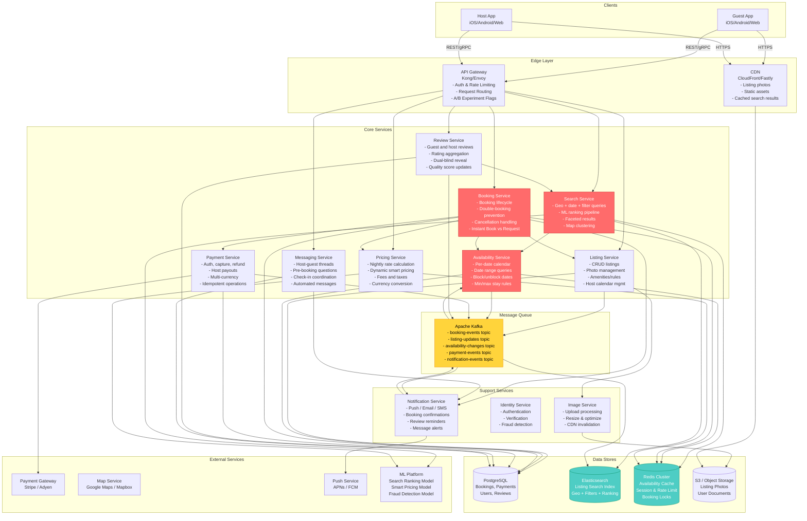

---

## 3. Component Deep Dive

### 3.1 Search Service (The Core User Experience)

**Responsibility:** Given a location, date range, guest count, and filters, return
ranked available listings with sub-500ms latency.

**Why this is the hardest component:** Search must combine three dimensions simultaneously:
1. **Geospatial** -- "within 10km of San Francisco downtown" (geo_distance query)
2. **Temporal** -- "available from July 1 to July 5" (calendar range check)
3. **Attribute** -- "2+ bedrooms, has pool, under $300/night" (multi-field filter)
4. **Ranking** -- order by ML-predicted conversion probability

Most systems handle one or two of these well. Airbnb must handle all four in < 500ms.

```mermaid
graph TB
    subgraph "Search Request Pipeline"
        REQ[Search Request<br/>location, dates, guests, filters]
        
        subgraph "Step 1: Geo + Filter (Elasticsearch)"
            GEO[Geo Query<br/>geo_distance or geo_bounding_box<br/>within specified radius]
            FILT[Apply Filters<br/>property_type, amenities,<br/>price range, bedrooms,<br/>instant_book, superhost]
            ES_SCORE[ES Relevance Score<br/>text match on title/description<br/>if keyword search present]
        end
        
        subgraph "Step 2: Availability Check"
            AVAIL[Availability Service<br/>For each candidate listing:<br/>is it available for the full<br/>date range? Check min/max stay.]
            PRUNE[Prune Unavailable<br/>Remove listings booked<br/>for any date in range]
        end
        
        subgraph "Step 3: Pricing"
            PRICE[Pricing Service<br/>Calculate total price<br/>for requested date range<br/>per remaining listing]
            PRICE_FILT[Apply Price Filters<br/>Remove listings outside<br/>guest's price range]
        end
        
        subgraph "Step 4: ML Ranking"
            FEAT[Feature Assembly<br/>listing quality score,<br/>price competitiveness,<br/>host response rate,<br/>guest preferences]
            RANK[ML Ranking Model<br/>Predict P(booking)<br/>for each listing-guest pair]
            RERANK[Re-rank Results<br/>Sort by predicted<br/>conversion probability]
        end
        
        subgraph "Step 5: Response Assembly"
            PAGE[Paginate Results<br/>Top 20 per page]
            ENRICH[Enrich with<br/>photos, host info,<br/>review summary]
            FACETS[Compute Facets<br/>price histogram,<br/>amenity counts]
        end
    end
    
    REQ --> GEO
    GEO --> FILT
    FILT --> ES_SCORE
    ES_SCORE --> AVAIL
    AVAIL --> PRUNE
    PRUNE --> PRICE
    PRICE --> PRICE_FILT
    PRICE_FILT --> FEAT
    FEAT --> RANK
    RANK --> RERANK
    RERANK --> PAGE
    PAGE --> ENRICH
    ENRICH --> FACETS
```

**Search query execution (Elasticsearch):**

```json
{
  "query": {
    "bool": {
      "must": [
        {
          "geo_distance": {
            "distance": "15km",
            "location": { "lat": 37.77, "lon": -122.41 }
          }
        }
      ],
      "filter": [
        { "term": { "property_type": "ENTIRE_HOME" } },
        { "terms": { "amenities": ["wifi", "kitchen"] } },
        { "range": { "base_nightly_rate": { "gte": 50, "lte": 300 } } },
        { "range": { "max_guests": { "gte": 2 } } },
        { "range": { "bedrooms": { "gte": 2 } } },
        { "term": { "instant_book": true } },
        { "term": { "status": "ACTIVE" } }
      ]
    }
  },
  "sort": [
    { "_score": "desc" },
    { "quality_score": "desc" }
  ],
  "size": 100
}
```

**Geo indexing approaches (trade-offs):**

```
1. Geohash (what Elasticsearch uses internally):
   - Divides Earth into rectangular grid cells
   - Each cell has a string prefix (e.g., "9q8yy" for SF)
   - Neighboring cells share prefixes -- enables prefix search
   - Problem: cell boundary artifacts (two nearby points in different cells)
   - Airbnb uses geohash in ES but supplements with distance calculation

2. H3 Hexagonal Grid (Uber's system, Airbnb also uses):
   - Hexagonal cells have uniform distance to neighbors
   - No boundary artifacts (hexagons tile better than rectangles)
   - Resolution 7: ~5.16 km^2 per cell (good for city-level)
   - Resolution 9: ~0.11 km^2 per cell (good for neighborhood-level)
   - Airbnb uses H3 for demand aggregation and pricing zones

3. PostGIS / geo_distance (brute force):
   - Calculate Haversine distance for every listing
   - Too slow for 10M listings, but fine for pre-filtered sets < 10K

For interview: mention geohash as ES default, H3 as the modern approach for
demand zones and pricing, geo_distance for final ranking.
```

**Map-based search (when user drags the map):**

```
When user drags the map viewport, we need a different approach:

1. Client sends bounding box (NE corner, SW corner lat/lng)
2. At low zoom levels (zoomed out): return CLUSTERS
   - Pre-computed using geohash aggregation
   - "45 listings in this area, avg price $195"
   - Reduces response size from thousands of pins to ~50 clusters
   
3. At high zoom levels (zoomed in): return individual listings
   - ES geo_bounding_box query with all filters
   - Availability pre-checked
   - Max 200 results on map

Clustering algorithm:
  - Pre-compute listings per geohash at multiple resolutions
  - Zoom level 8-10: geohash precision 4 (large clusters)
  - Zoom level 11-13: geohash precision 5 (medium clusters)
  - Zoom level 14+: individual pins

Airbnb actually pre-computes "supercluster" tiles for fast map rendering.
```

---

### 3.2 Availability Service (The Consistency Challenge)

**Responsibility:** Track whether each listing is available on each date. Answer
"is listing X available from date A to date B?" with real-time accuracy.

**Why this matters:** If availability data is stale by even a few minutes, guests
will attempt to book unavailable listings, leading to failed bookings and terrible UX.
But checking availability across 10M listings in real-time is expensive.

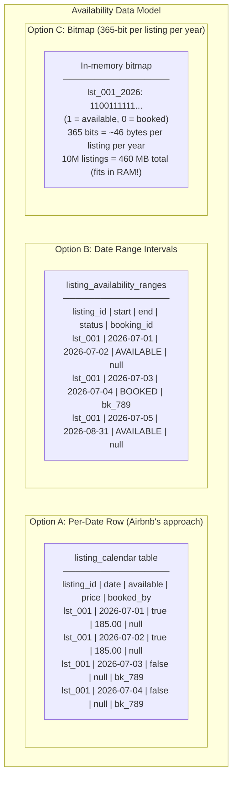

**Comparison of approaches:**

```
| Approach       | Storage     | Range Query   | Update Cost | Concurrency  |
|----------------|-------------|---------------|-------------|--------------|
| Per-date row   | 36.5 GB     | Range scan    | Update N rows| Row-level lock |
| Date ranges    | ~1 GB       | Interval query| Split/merge | Complex locks |
| Bitmap         | ~460 MB     | Bitwise AND   | Bit flip    | CAS atomic   |

Airbnb uses Option A (per-date row) in PostgreSQL as the source of truth,
with Option C (bitmap) as an in-memory cache in the Availability Service.

Why per-date row wins for the DB:
  - Simple to reason about (each date is independent)
  - Easy to lock specific dates during booking (SELECT ... FOR UPDATE)
  - Custom price per date is natural
  - PostgreSQL range scans on (listing_id, date) are efficient with index

Why bitmap wins for the cache:
  - 460 MB fits entirely in RAM
  - "Is listing available July 1-5?" = check 4 bits, O(1)
  - Can check 10,000 listings in < 1ms
  - Updated via CDC from PostgreSQL
```

**Availability check flow:**

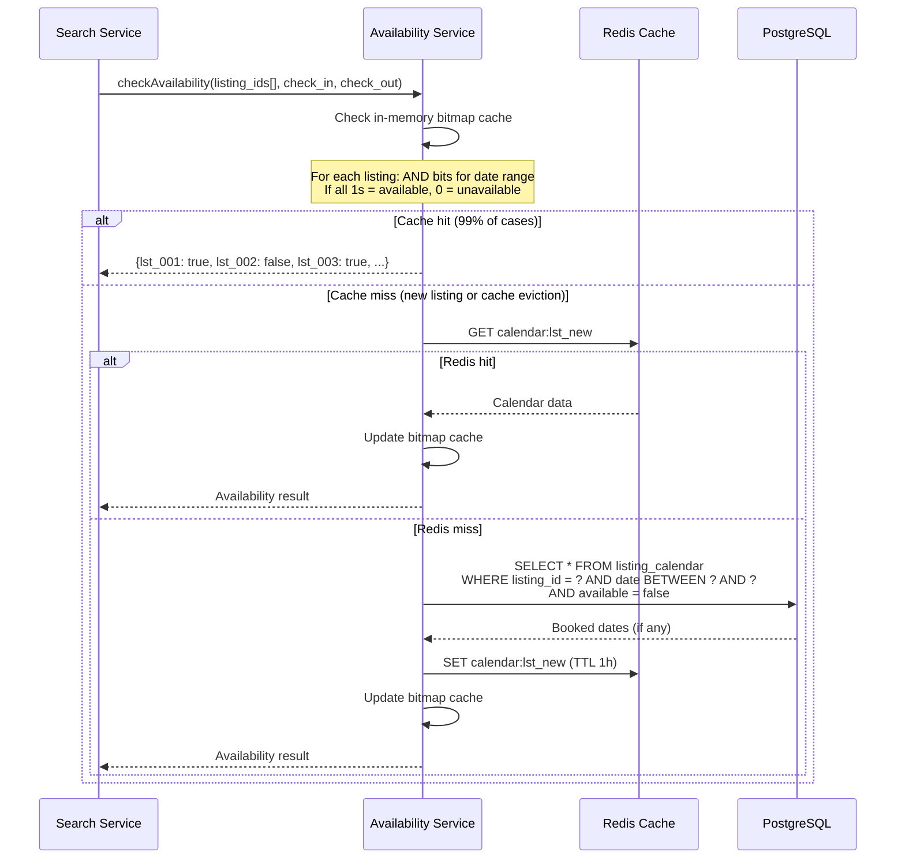

**Cache invalidation (critical for correctness):**

```
When a booking is confirmed:
  1. PostgreSQL: UPDATE listing_calendar SET available=false, booked_by=?
     WHERE listing_id=? AND date BETWEEN check_in AND check_out
  2. Kafka: publish availability-changed event
  3. Availability Service: receive event, flip bits in bitmap cache
  4. Redis: invalidate calendar:{listing_id} key
  5. Elasticsearch: NOT updated (search results can be slightly stale;
     availability is re-checked before booking anyway)

Latency of invalidation: < 500ms from booking to cache update
This means there is a brief window where search results may show a 
listing as available when it was just booked. This is acceptable because:
  - The booking flow re-checks availability before confirming
  - The probability of two guests trying to book the same listing in 
    the same 500ms window is very low (unlike hotel rooms with high volume)
```

---

### 3.3 Booking Service (The Orchestrator)

**Responsibility:** Manage the complete booking lifecycle from request to checkout.
Prevent double-bookings. Handle Instant Book vs Request-to-Book. Process cancellations.

**Booking State Machine:**

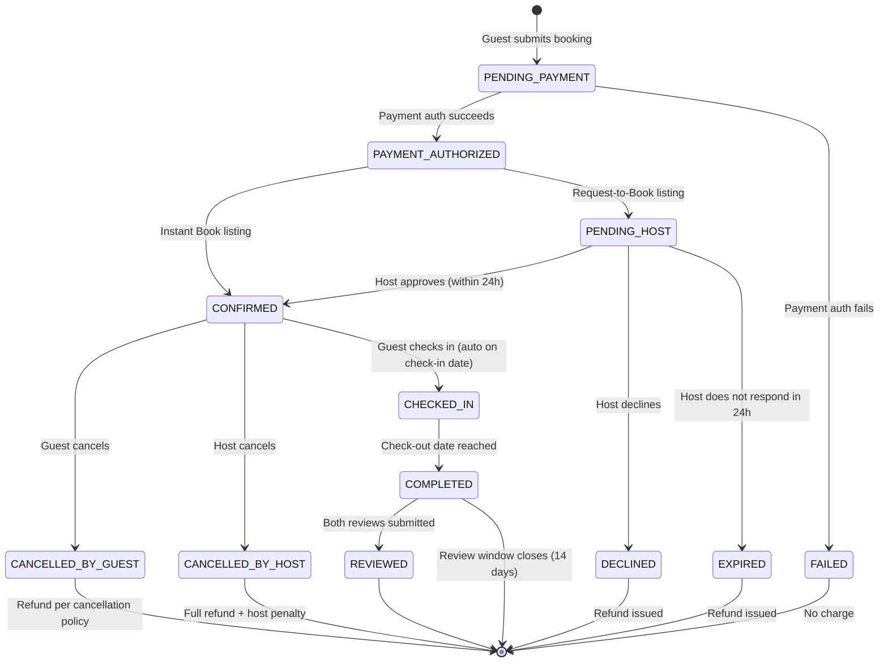

**Double-booking prevention (the critical section):**

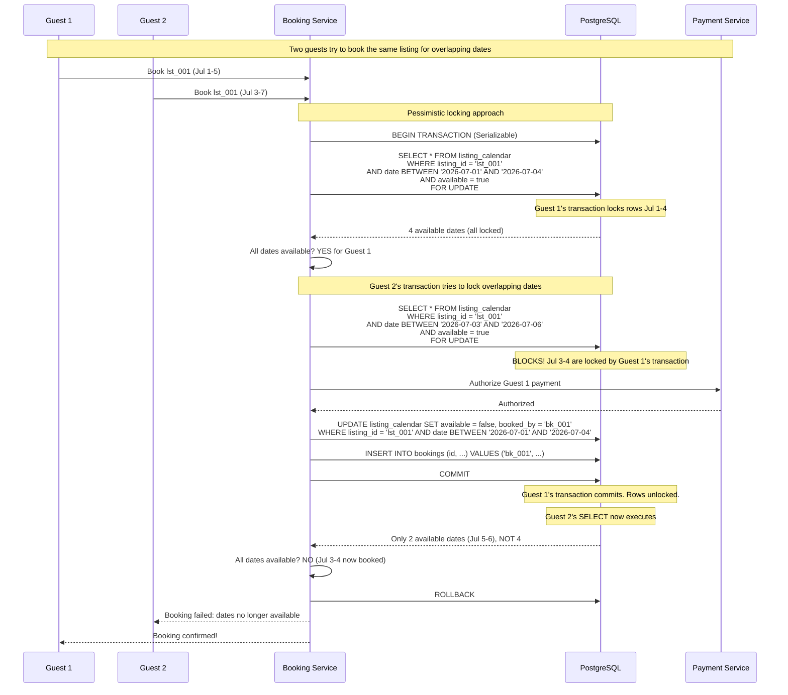

**Why pessimistic locking (not optimistic):**

```
Optimistic locking (version check at commit time):
  - Read availability without locks
  - Process booking
  - At commit: check if dates were modified since read
  - If conflict: retry
  Problem: for popular listings during peak season, high contention
  means many retries, wasted payment authorizations, and bad UX.

Pessimistic locking (SELECT ... FOR UPDATE):
  - Lock the specific date rows at the start
  - Process booking while holding locks
  - Commit releases locks
  - Loser waits (blocked) rather than retrying
  
  Advantage: guaranteed success for the first transaction.
  Disadvantage: second transaction must wait (adds latency).
  
  Acceptable because:
  - Contention is rare (10M listings, 2M bookings/day = avg 0.2 bookings/listing/day)
  - Lock duration is short (~1-3 seconds for payment auth)
  - The locking granularity is per-listing-per-date, not global

Airbnb's actual approach: pessimistic locking with a timeout.
If the lock is held for > 5 seconds (payment gateway slow), release
the lock and return an error. Guest can retry.
```

**Instant Book vs Request-to-Book:**

```
Instant Book (70% of Airbnb listings):
  1. Guest submits booking
  2. System checks availability (with lock)
  3. Authorizes payment
  4. Marks dates as booked
  5. Sends confirmation to guest and host
  6. Total time: 1-3 seconds
  
Request-to-Book (30% of listings):
  1. Guest submits booking request
  2. System checks availability (with TENTATIVE hold)
  3. Pre-authorizes payment (hold on card, not charged)
  4. Marks dates as HELD (not yet booked)
  5. Notifies host of request
  6. Host has 24 hours to approve or decline
  7a. Host approves: dates marked as BOOKED, payment captured
  7b. Host declines: dates released, pre-auth voided
  7c. No response in 24h: dates released, pre-auth voided
  
  HELD state prevents other guests from booking those dates while
  the host is deciding. But if the host declines, dates become
  available again immediately.
```

---

### 3.4 Listing Service

**Responsibility:** CRUD operations for listings. Photo management. Host calendar
management. Listing quality scoring.

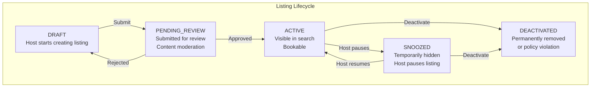

**Photo upload pipeline:**

```
1. Host selects photos in app
2. Client uploads directly to S3 via presigned URL
   (bypasses application servers -- critical for large uploads)
3. S3 triggers Lambda/event to Image Service
4. Image Service:
   a. Validate image (format, size, content moderation via ML)
   b. Generate thumbnails: 200x200, 400x300, 800x600, 1200x900
   c. Optimize with WebP/AVIF for modern browsers
   d. Store all variants in S3
   e. Push CDN URLs to Listing Service
5. Listing Service updates listing record with photo URLs
6. CDN serves photos globally with cache headers (1 year TTL)
```

**Listing-to-Elasticsearch sync (CDC pipeline):**

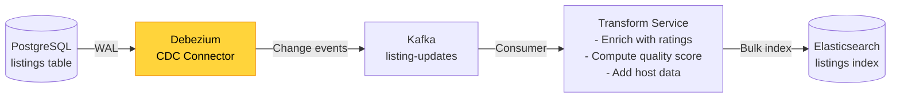

```
Why CDC instead of dual-write:
  - Dual-write (write to PG and ES in the same request) is fragile.
    If ES write fails after PG succeeds, data is inconsistent.
  - CDC guarantees eventual consistency: PG is source of truth,
    ES is derived and always catches up.
  - Latency: ~1-5 seconds from PG write to ES index update.
  - This means a host creates a listing and it appears in search
    within a few seconds. Acceptable.
  
Airbnb uses a similar pattern with their "Derived Data" platform.
```

---

### 3.5 Payment Service

**Responsibility:** Handle the full payment lifecycle -- authorize, capture, refund,
payout. Multi-currency support. Exactly-once semantics via idempotency.

**Two-phase payment model (how Airbnb actually works):**

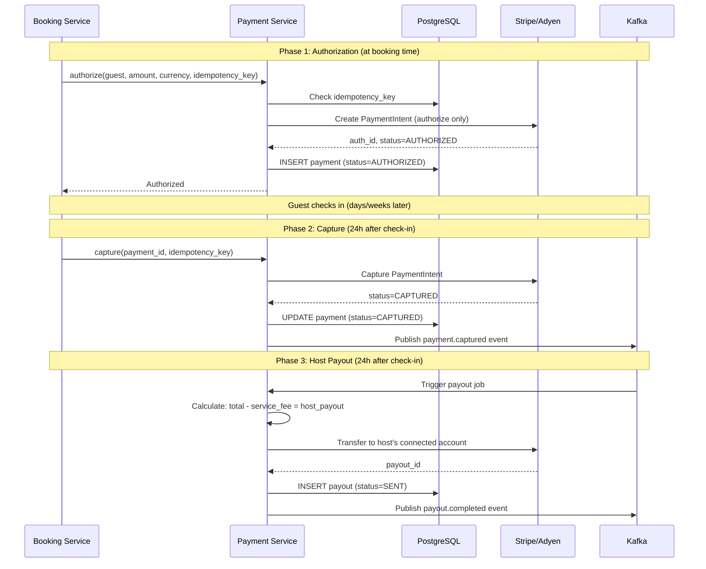

**Why two-phase (authorize then capture):**

```
- Guest books on June 25 for July 1 check-in
- Authorization holds funds on guest's card (not charged)
- If guest cancels before policy deadline: void auth (no charge)
- If guest cancels after policy deadline: capture partial amount per policy
- If host cancels: void auth, apply penalty to host
- On check-in: capture full amount
- 24h after check-in: payout to host

This protects both parties:
  - Guest: not charged until they actually stay
  - Host: guaranteed payment 24h after check-in
  
Airbnb charges the guest at booking for most policies now, but the
authorize-then-capture model is still used for some payment methods
and longer-term stays.
```

**Cancellation refund matrix:**

```
| Policy     | Cancel Before | Refund Amount              | After          |
|------------|---------------|---------------------------|----------------|
| Flexible   | 24h before    | 100% of nightly + cleaning| 0% (+ service) |
| Moderate   | 5 days before | 100%                      | 50% nightly    |
| Strict     | 14 days before| 100%                      | 50% nightly    |
|            | 7 days before | 50%                       | 0%             |
| Host cancel| Any time      | 100% to guest             | Host penalty   |

Cleaning fee: refunded if cancelled before check-in for all policies
Service fee: refunded if cancelled within 48h of booking AND 14+ days before
```

---

### 3.6 Pricing Service

**Responsibility:** Calculate the total price for a stay. Provide Smart Pricing
recommendations. Handle fees, taxes, and currency conversion.

**Price calculation flow:**

```
total_price = nightly_total + cleaning_fee + service_fee + taxes

Where:
  nightly_total = sum of price for each night (may vary by date)
  
  For each night:
    if host set custom_price for that date:
      nightly_rate = custom_price
    elif Smart Pricing enabled:
      nightly_rate = smart_pricing_model.predict(listing, date)
    else:
      nightly_rate = base_nightly_rate
    
    Apply discounts:
      if stay >= 7 nights: apply weekly_discount_pct
      if stay >= 28 nights: apply monthly_discount_pct
  
  cleaning_fee = listing.cleaning_fee (flat, once per stay)
  
  service_fee = nightly_total * 0.14  (Airbnb charges ~14% guest service fee)
  
  taxes = (nightly_total + cleaning_fee) * local_tax_rate
    (varies by jurisdiction: 12-15% in most US cities)

Example:
  4 nights at $185/night, $75 cleaning fee, San Francisco:
  nightly_total  = 4 x $185           = $740.00
  cleaning_fee   = $75.00
  service_fee    = $740 x 0.14        = $103.60
  SF occupancy tax = ($740 + $75) x 0.14 = $114.10
  total_price    = $740 + $75 + $103.60 + $114.10 = $1,032.70
```

**Dynamic Smart Pricing (detailed in deep-dive):**

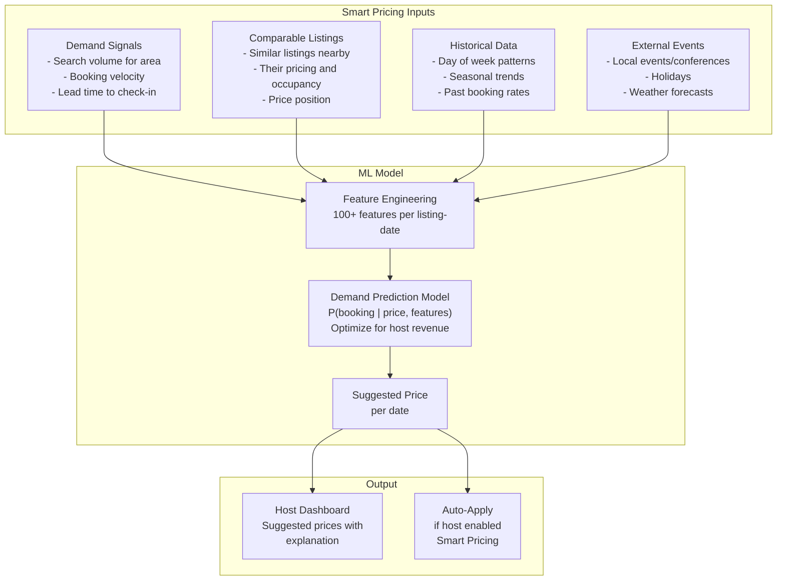

---

### 3.7 Review Service

**Responsibility:** Manage the dual-blind review system. Aggregate ratings. Update
listing quality scores used in search ranking.

**Dual-blind review mechanism (Airbnb's design):**

```
1. Guest checks out on July 5
2. Both guest and host have 14 days to submit reviews
3. Reviews are NOT visible until BOTH are submitted
   OR the 14-day window expires
4. This prevents retaliation reviews (host sees bad review, writes bad one back)

Implementation:
  - review.is_visible = false on creation
  - When second review for same booking is submitted:
    UPDATE reviews SET is_visible = true WHERE booking_id = ?
  - Cron job: after 14 days, SET is_visible = true for any remaining

After visibility:
  - Recalculate listing avg_rating and review_count
  - Publish rating-updated event to Kafka
  - Search Service updates quality_score in Elasticsearch
```

**Rating aggregation:**

```sql
-- Efficient aggregation using materialized counters
-- Updated on each new review via trigger or application code

UPDATE listings
SET avg_rating = (
    (avg_rating * review_count + NEW.overall_rating) / (review_count + 1)
),
review_count = review_count + 1
WHERE id = NEW.listing_id;

-- Category-level aggregation stored in a separate table
-- to avoid widening the listings table
```

---

### 3.8 Messaging Service

**Responsibility:** Enable communication between hosts and guests. Pre-booking
inquiries. Check-in coordination. Automated messages triggered by booking events.

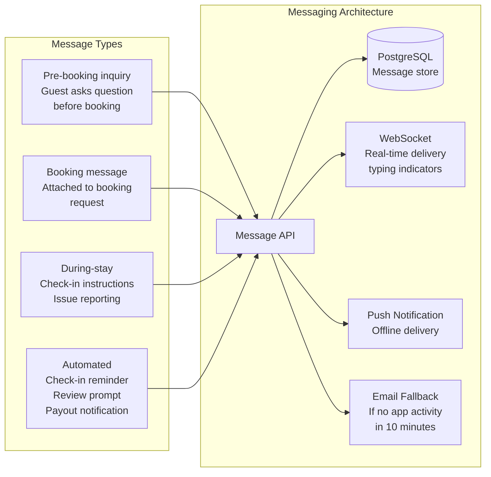

**Response rate tracking (affects search ranking):**

```
Airbnb tracks host response rate and response time:
  - Response rate: % of new inquiries responded to within 24h
  - Response time: median time to first response
  
  Metrics directly impact:
    1. Superhost status (requires 90%+ response rate)
    2. Search ranking (responsive hosts ranked higher)
    3. Instant Book eligibility
    
  Calculated daily via batch job analyzing message threads.
```

---

## 4. Data Flow Walkthroughs

### 4.1 Complete Search-to-Booking Flow (End-to-End)

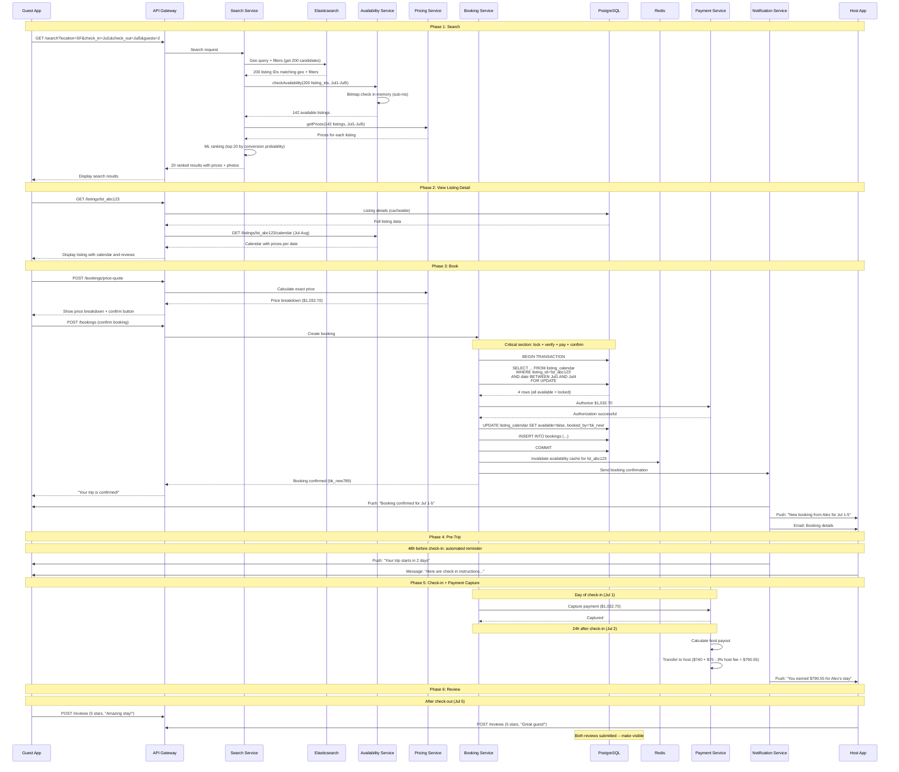

### 4.2 Host Creates a Listing

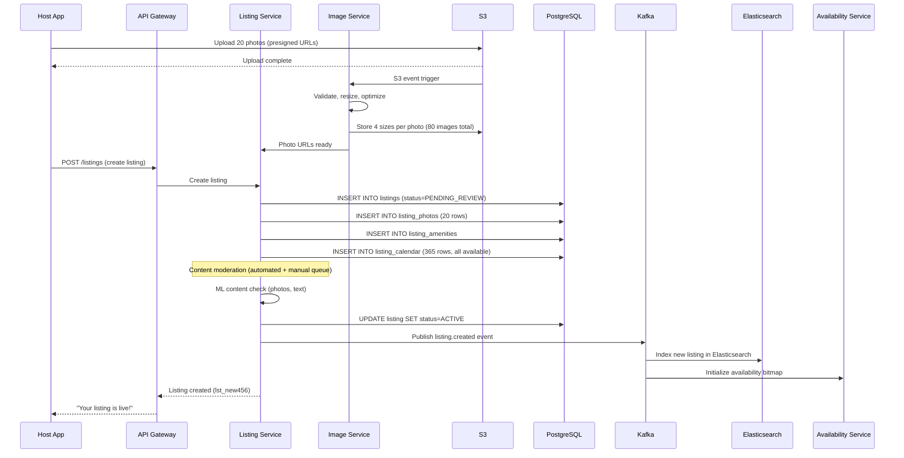

### 4.3 Cancellation Flow

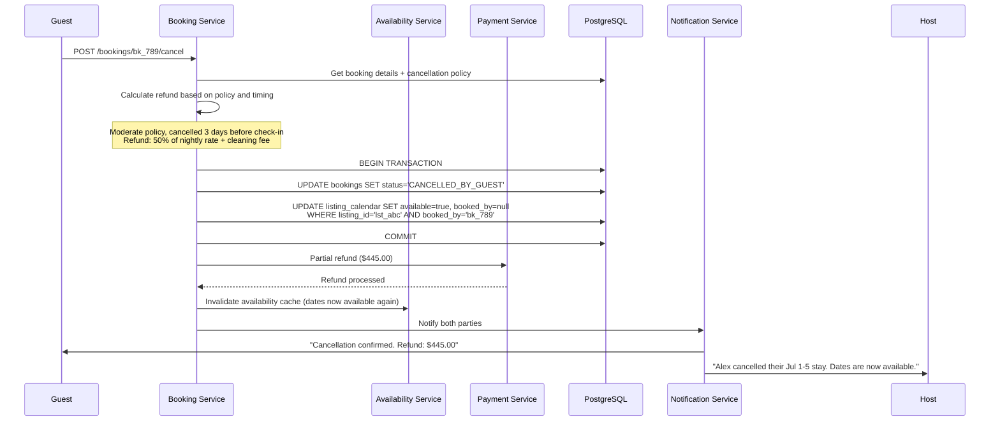

---

## 5. Database Design

### 5.1 Storage Strategy Overview

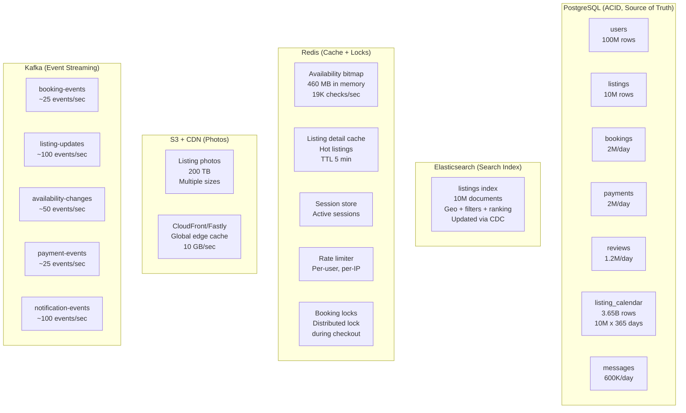

### 5.2 Sharding Strategy

```
PostgreSQL sharding:

  Users: shard by user_id (hash-based, 8 shards)
    - Uniform distribution, no hotspots
    - Each shard: ~12.5M users

  Listings: shard by listing_id (hash-based, 8 shards)
    - NOT by city/country (would create hotspots: Paris, NYC have 10x more listings)
    - Hash ensures even distribution
    - Each shard: ~1.25M listings

  Bookings: shard by listing_id (co-located with listings)
    - Booking always needs listing data (join on same shard)
    - Guest's booking history requires scatter-gather across shards
      (acceptable: users don't view history often, and it is cacheable)

  listing_calendar: shard by listing_id (co-located with listings and bookings)
    - Critical: SELECT ... FOR UPDATE during booking must be single-shard
    - Cross-shard transactions would kill performance
    - Each shard: ~457M calendar rows (10M/8 listings x 365 days)

  Payments: shard by booking_id (which maps to listing_id shard)
    - Co-located with bookings for transactional integrity

  Reviews: shard by listing_id
    - Most reads are "reviews for listing X" (single-shard query)

Elasticsearch:
  - 10M listings across 5 primary shards, 1 replica each
  - Sharded by listing_id hash (default ES behavior)
  - Each shard: ~2M documents

Redis:
  - Availability bitmap: partitioned by listing_id range
    across 4-6 instances
  - Session/rate-limit: consistent hashing across 3 instances
```

### 5.3 Indexing Strategy

```sql
-- Critical indexes for performance

-- Search: listings by city and status (for ES re-index)
CREATE INDEX idx_listings_city_status ON listings(city, status);

-- Availability: THE most queried table
-- Primary key (listing_id, date) handles range scans
-- Additional index for finding available dates quickly
CREATE INDEX idx_calendar_listing_avail ON listing_calendar(listing_id, date)
    WHERE available = true;

-- Booking lookups
CREATE INDEX idx_bookings_guest ON bookings(guest_id, check_in DESC);
CREATE INDEX idx_bookings_listing_dates ON bookings(listing_id, check_in, check_out)
    WHERE status IN ('CONFIRMED', 'CHECKED_IN');
CREATE INDEX idx_bookings_host ON bookings(host_id, created_at DESC);

-- Payment lookups
CREATE UNIQUE INDEX idx_payments_idempotency ON payments(idempotency_key);

-- Reviews: listing page shows reviews sorted by date
CREATE INDEX idx_reviews_listing_date ON reviews(listing_id, created_at DESC)
    WHERE is_visible = true;

-- Messages: thread view
CREATE INDEX idx_messages_thread ON messages(thread_id, created_at);
CREATE INDEX idx_messages_user ON messages(sender_id, created_at DESC);
```

---

## 6. Communication Patterns

### 6.1 Synchronous (Request-Reply)

```
Used for: operations where the caller needs an immediate response

  Guest → API Gateway → Search Service → Elasticsearch
  (Guest is waiting for search results)

  Booking Service → Availability Service
  (Must verify availability before proceeding with booking)

  Booking Service → Payment Service → Stripe
  (Payment must be authorized before confirming booking)

  Guest → API Gateway → Listing Service → PostgreSQL
  (Guest viewing listing details, must return content)

Protocol: gRPC between internal services (efficient, typed)
         REST for client-facing APIs (broad client compatibility)
Timeout: 3s default, 10s for search (includes ES + availability + pricing)
Retry: exponential backoff with jitter, max 3 retries
Circuit breaker: trip after 50% failure rate in 10s window
```

### 6.2 Asynchronous (Event-Driven via Kafka)

```
Used for: decoupled processing, side effects, data pipelines

  Listing updates → Kafka → Elasticsearch indexer
  (Keep search index in sync with PostgreSQL source of truth)

  Booking confirmed → Kafka → Notification Service → Push/Email/SMS
  (Don't block booking confirmation on notification delivery)

  Booking confirmed → Kafka → Availability Service → Cache update
  (Update in-memory bitmap after booking)

  Review submitted → Kafka → Rating aggregation → Listing update
  (Recalculate avg_rating asynchronously)

  All events → Kafka → Analytics Pipeline → Data Warehouse
  (Business intelligence, ML training data)
```

### 6.3 Communication Decision Matrix

```
| Communication              | Pattern     | Why                                       |
|---------------------------|-------------|-------------------------------------------|
| Search query              | Sync gRPC   | Guest waiting for results                 |
| Listing detail            | Sync REST   | Guest viewing page                        |
| Availability check        | Sync gRPC   | Must verify before booking                |
| Price calculation         | Sync gRPC   | Must show price before confirm            |
| Payment authorization     | Sync gRPC   | Must authorize before confirming booking  |
| Booking confirmation      | Sync gRPC   | Guest waiting for confirmation            |
| Notification delivery     | Async Kafka | Don't block booking on notification       |
| ES index update           | Async Kafka | Eventual consistency is fine for search   |
| Availability cache update | Async Kafka | Sub-second propagation sufficient         |
| Rating recalculation      | Async Kafka | Non-critical path, eventual is fine       |
| Photo processing          | Async S3+SQS| Heavy processing, don't block upload      |
| Host payout               | Async Kafka | Batch processing, scheduled               |
| Analytics events          | Async Kafka | Offline processing                        |
```

---

## Key Interview Talking Points

> **Start with the architecture diagram.** Draw the 8 services and their data stores.
> Label the three hardest problems: (1) Search across geo + time + attributes,
> (2) Availability checking at scale, (3) Double-booking prevention.

> **Highlight the search pipeline.** Walk through how a search query flows:
> Elasticsearch for geo + filters, Availability Service for date checking,
> Pricing Service for totals, ML model for ranking. Each step narrows the
> candidate set: 10M listings -> 200 geo matches -> 142 available -> 20 ranked.

> **Explain the booking critical section.** Draw the sequence diagram showing
> pessimistic locking with SELECT ... FOR UPDATE on the calendar rows.
> This is the money question -- the interviewer will probe how you prevent
> double-bookings.

> **Mention Airbnb-specific details:** Nebula search platform, Smart Pricing ML,
> dual-blind review system, Instant Book vs Request-to-Book, two-phase payment
> (authorize then capture). This shows you have studied the actual system.
