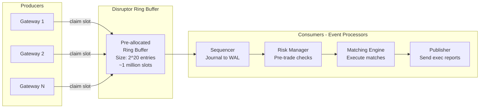
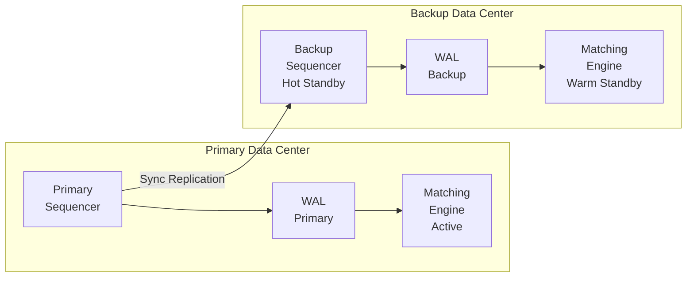
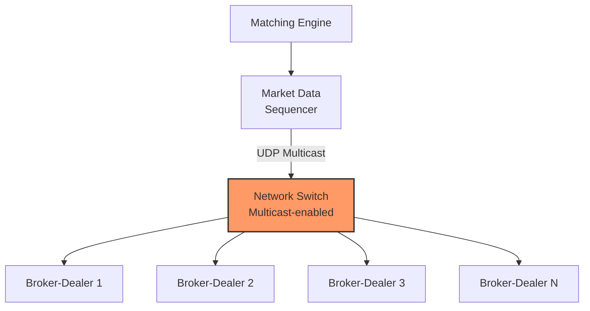
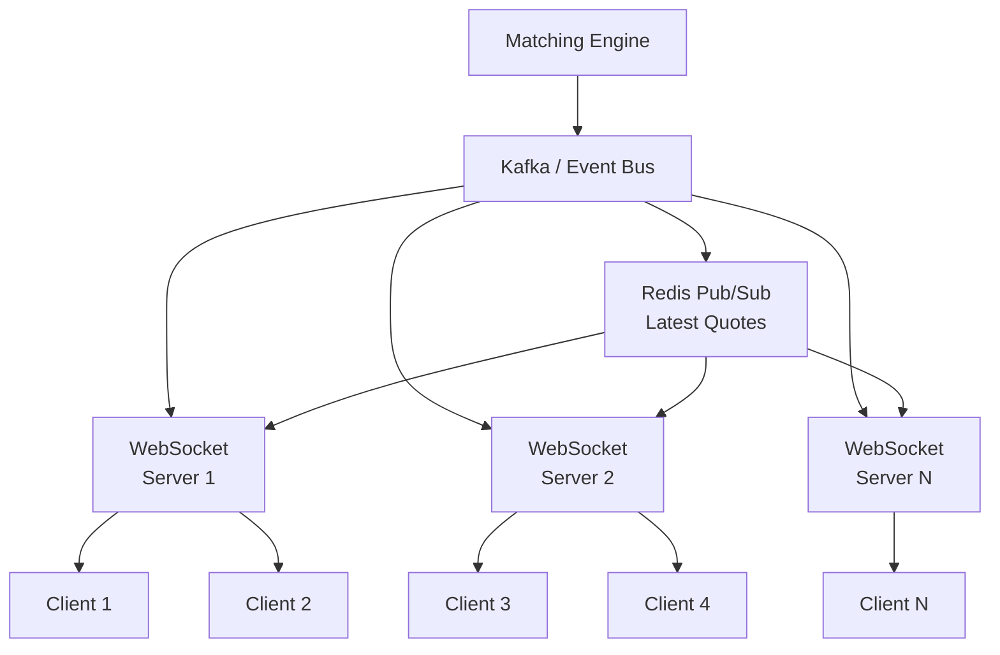
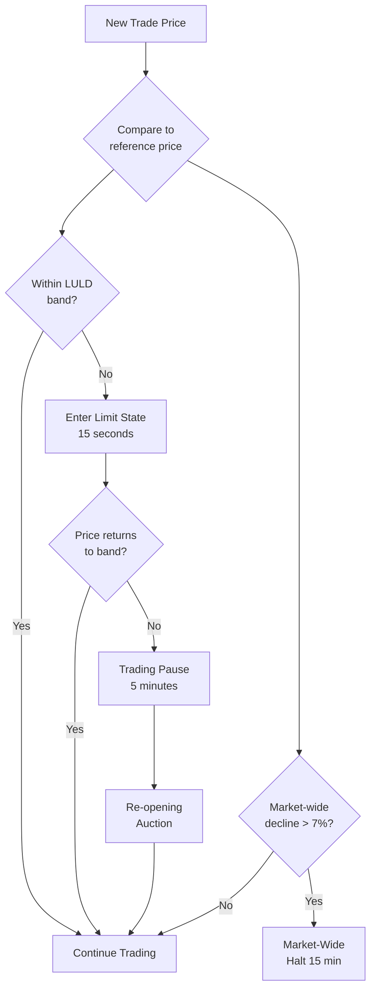
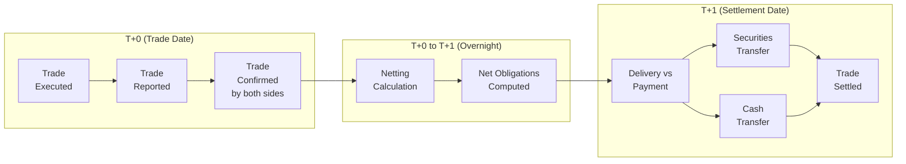
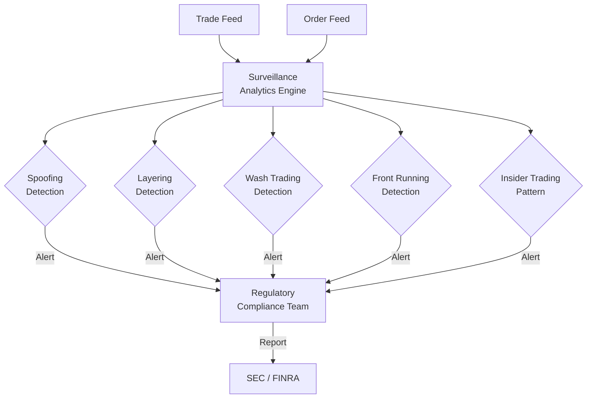
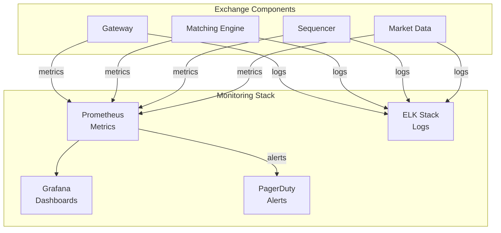
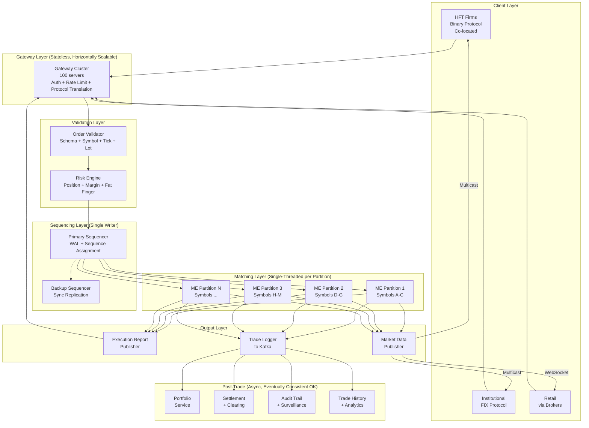

# Design a Stock Exchange / Trading Platform - Deep Dive & Scaling

## Deep Dive 1: The Matching Engine

The matching engine is the single most important component of a stock exchange. It
determines who trades with whom, at what price, and in what order. Getting this wrong
means regulatory violations, participant lawsuits, and loss of exchange license.

### 1.1 Why Single-Threaded?

```
The counter-intuitive insight: SINGLE-THREADED is FASTER than multi-threaded
for a matching engine.

Multi-threaded matching:
  Thread 1: Process Order A ---[lock book]--match--[unlock]---
  Thread 2: Process Order B ------[wait for lock]--[lock]--match--[unlock]---
  
  Problems:
  1. Lock contention: Threads fight over the order book
  2. Context switches: OS scheduler adds ~5-10 us per switch
  3. Cache thrashing: Different threads invalidate each other's cache lines
  4. Non-determinism: Thread scheduling order is OS-dependent
  5. Fairness violation: Order B might execute before Order A despite arriving later
  
  Measured latency: 10-100 us with HIGH VARIANCE (jitter)

Single-threaded matching (LMAX pattern):
  Thread: Process A -> match -> Process B -> match -> Process C -> match
  
  Benefits:
  1. No locks: Zero contention, zero overhead
  2. No context switches: One thread, one core, pinned
  3. Cache-friendly: Sequential access, hot data stays in L1/L2
  4. Deterministic: Same input always produces same output
  5. Fair: FIFO ordering guaranteed by construction
  
  Measured latency: 0.5-5 us with LOW VARIANCE (consistent)
```

> LMAX Exchange processes 6 million orders per second on a single thread.
> That is the power of mechanical sympathy -- designing software that works
> WITH the hardware, not against it.

### 1.2 The LMAX Disruptor Pattern

The Disruptor is a lock-free ring buffer that is the backbone of the LMAX architecture.
It replaces traditional queues (which require locks) with a CAS-based sequence mechanism.



#### Ring Buffer Mechanics

```
Ring Buffer (size = 2^N for fast modulo via bitwise AND):

  Slot:  [0] [1] [2] [3] [4] [5] [6] [7] [8] [9] [10] [11] ...
  Data:  [A] [B] [C] [D] [ ] [ ] [ ] [ ] [ ] [ ] [ ]  [ ]
                      ^                   ^
                      |                   |
              Consumer cursor=3    Producer cursor=3 (next write slot=4)

  Producer claims slot:
    1. Read current producer sequence
    2. CAS (compare-and-swap) to claim next slot
    3. Write data to claimed slot
    4. Publish (make visible to consumers)
  
  Consumer reads slot:
    1. Wait until producer sequence >= consumer sequence + 1
    2. Read data (guaranteed visible due to memory barrier)
    3. Advance consumer cursor
  
  No locks. No allocation. No garbage collection.
  The entire ring buffer is pre-allocated at startup.

Cache-Line Padding:
  Each sequence counter is padded to 64 bytes (cache line size)
  to prevent false sharing between producer and consumer:
  
  // Without padding: sequences share cache line -> false sharing
  // With padding:
  struct PaddedSequence {
      long padding[7];     // 56 bytes of padding
      long sequence;       // 8 bytes (the actual value)
  };  // Total: 64 bytes = exactly one cache line
```

### 1.3 Order Book Data Structure

The order book must support these operations efficiently:

| Operation | Frequency | Target Latency |
|-----------|-----------|---------------|
| Add order at price level | Very high | O(log P) |
| Cancel order by ID | Very high | O(1) |
| Get best bid/ask | Every match | O(1) |
| Match at best price (pop head) | High | O(1) |
| Walk price levels (multi-level match) | Medium | O(K) per level |

#### Implementation: Sorted Map + Doubly-Linked Lists

```
Order Book Implementation (Java-like pseudocode):

class OrderBook {
    // Bid side: sorted descending by price (highest bid first)
    TreeMap<Price, PriceLevel> bids;  // Red-black tree
    
    // Ask side: sorted ascending by price (lowest ask first)
    TreeMap<Price, PriceLevel> asks;  // Red-black tree
    
    // Direct lookup for O(1) cancel
    HashMap<OrderId, OrderNode> orderIndex;
    
    // Cached best prices for O(1) access
    PriceLevel bestBid;
    PriceLevel bestAsk;
}

class PriceLevel {
    Price price;
    long totalQuantity;        // Sum of all orders at this level
    int orderCount;
    OrderNode head;            // First order (oldest -- gets filled first)
    OrderNode tail;            // Last order (newest)
}

class OrderNode {
    OrderId id;
    long quantity;
    long remainingQuantity;
    long timestamp;            // Nanosecond entry time
    OrderNode prev;            // Doubly-linked for O(1) removal
    OrderNode next;
    PriceLevel priceLevel;     // Back-pointer for O(1) level access
}
```

#### Why Not a Heap?

```
Heap (priority queue):
  - Get best price: O(1)           -- good
  - Add order: O(log N)            -- good
  - Cancel arbitrary order: O(N)   -- TERRIBLE (must scan heap)
  - Walk K price levels: O(K log N) -- poor

Sorted Map + Linked List:
  - Get best price: O(1)           -- cached
  - Add order: O(log P) + O(1)     -- tree lookup + list append
  - Cancel arbitrary order: O(1)   -- HashMap + doubly-linked list removal
  - Walk K price levels: O(K)      -- tree iteration
  
  Where P = number of price levels (~100-1000, MUCH less than N = total orders)

The sorted map + linked list is the industry standard.
```

### 1.4 Memory Layout for Performance

```
Critical performance optimizations:

1. Object Pooling (No GC):
   Pre-allocate all Order objects at startup.
   "New" order = grab from free pool. "Remove" = return to pool.
   No object creation on the hot path = no GC pauses.

2. CPU Pinning:
   Pin matching engine thread to a specific CPU core.
   Disable hyperthreading on that core.
   No other process shares that core.
   Result: L1/L2 cache is 100% dedicated to matching.

3. NUMA Awareness:
   Allocate memory on the same NUMA node as the pinned CPU.
   Cross-NUMA memory access = ~100ns penalty (vs ~4ns local).

4. Avoid Branches:
   Branchless code where possible.
   CPU branch mispredictions cost ~15 cycles each.
   Use lookup tables instead of if-else chains.

5. Batch Output:
   Buffer execution reports and market data updates.
   Flush once after each match cycle (not per trade).
   Reduces system call overhead.
```

---

## Deep Dive 2: The Sequencer

The sequencer is the **source of truth** for what happened and in what order. Every
event that enters the exchange gets a sequence number, and this sequence defines reality.

### 2.1 Total Ordering Guarantee

```
Problem: Multiple gateways receive orders from thousands of participants.
How do we guarantee a single, deterministic ordering?

Solution: Funnel ALL orders through a single sequencer.

Gateway 1 --\
Gateway 2 ---+--> [SEQUENCER] --> seq#1, seq#2, seq#3, ...
Gateway 3 --/                          |
                                       v
                            [Write-Ahead Log]
                                       |
                                       v
                            [Matching Engine]

The sequencer is the BOTTLENECK BY DESIGN.
Everything must pass through it.
This is the cost of determinism.
```

### 2.2 Write-Ahead Log (WAL)

```
WAL Structure (append-only file):

+--------+--------+----------+--------+------+--------+
| Seq #  | Type   | Timestamp| Length | Data | CRC32  |
+--------+--------+----------+--------+------+--------+
| 1      | NEW    | T1       | 200    | ...  | 0xA3F2 |
| 2      | NEW    | T2       | 200    | ...  | 0xB4E1 |
| 3      | CANCEL | T3       | 100    | ...  | 0xC5D0 |
| 4      | NEW    | T4       | 200    | ...  | 0xD6C9 |
| ...    | ...    | ...      | ...    | ...  | ...    |
+--------+--------+----------+--------+------+--------+

Properties:
  - Append-only (never modify existing entries)
  - Each entry has a CRC32 checksum for integrity
  - Memory-mapped for zero-copy writes
  - fsync after every N entries (configurable durability vs latency)
  - Segmented: new file every 1GB for management
  - Retention: 7 years for regulatory compliance

Write path:
  1. Receive validated order from risk engine
  2. Assign next sequence number (atomic increment)
  3. Serialize order + metadata into WAL entry
  4. Write to memory-mapped region
  5. Optionally fsync (batched for performance)
  6. Forward sequenced order to matching engine
  7. Replicate to backup sequencer (async or sync)
```

### 2.3 Primary-Backup Replication



```
Replication Modes:

Synchronous (zero data loss):
  1. Primary writes to local WAL
  2. Primary sends to backup
  3. Backup writes to its WAL
  4. Backup sends ACK
  5. Primary proceeds
  Cost: +200-500 us latency (network round trip)
  Guarantee: Zero order loss on primary failure

Asynchronous (lower latency):
  1. Primary writes to local WAL
  2. Primary proceeds immediately
  3. Primary sends to backup (in background)
  Cost: ~0 additional latency
  Risk: Last few orders may be lost on primary crash

Most exchanges use SYNCHRONOUS replication.
The 200-500 us cost is acceptable given the
catastrophic cost of losing orders.
```

### 2.4 Failover Process

```
Primary sequencer failure detected:

1. Heartbeat timeout (typically 100ms)
2. Backup sequencer confirms primary is dead
   (fencing -- primary's network access is revoked via STONITH)
3. Backup replays its WAL to reconstruct state
4. Backup begins accepting new orders as the new primary
5. Matching engine on backup replays from last checkpoint
6. Total failover time: < 1 second (most is detection)

State reconstruction:
  - WAL contains every sequenced event
  - Replay ALL events from WAL start (or last checkpoint)
  - Order book state is fully reconstructed
  - This is deterministic: same WAL = same state

Checkpoint optimization:
  - Periodically snapshot full order book state to disk
  - On restart, load snapshot + replay only WAL entries after snapshot
  - Reduces recovery time from minutes to seconds
```

---

## Deep Dive 3: Market Data Distribution

### 3.1 The Fan-Out Problem

```
Every trade or book change must reach thousands of participants.
At peak, this means:

  100,000 updates/sec x 5,000 participants = 500 million message deliveries/sec

This is IMPOSSIBLE with unicast TCP. You need multicast.
```

### 3.2 Multicast for Institutional Feeds



```
How UDP Multicast Works:

1. Publisher sends ONE packet to a multicast group address (e.g., 239.1.1.1)
2. Network switches replicate the packet to all subscribers
3. Publisher's bandwidth = O(1) regardless of subscriber count

Advantages:
  - Latency: Single network hop to all participants
  - Fairness: All participants receive data simultaneously
  - Bandwidth: Publisher sends once, network replicates
  - Regulatory: Simultaneous dissemination (Reg FD compliance)

Challenges:
  - UDP is unreliable: Packets can be dropped
  - Solution: Sequence numbers + gap detection + retransmission server
  - Aeron (from LMAX) provides reliable UDP multicast

Reliable Multicast Protocol:
  1. Each market data message has a sequence number
  2. Subscriber detects gap (missing sequence)
  3. Subscriber requests retransmission from a dedicated retransmit server
  4. Retransmit server replays from its journal
```

### 3.3 WebSocket for Retail Clients



```
WebSocket Architecture:

1. Matching engine publishes events to Kafka
2. WebSocket servers consume from Kafka
3. Each server manages 10K-50K WebSocket connections
4. Clients subscribe to specific symbols
5. Server filters and pushes relevant updates

Optimization: Snapshot + Incremental
  - New connection: Send full order book snapshot
  - Ongoing: Send only delta updates (add/modify/remove)
  - Client reconstructs local order book from snapshot + deltas
  - If client detects gap in sequence numbers, request re-snapshot

Throttling for Retail:
  - Institutional multicast: Every single event, no throttling
  - Retail WebSocket: Throttle to max 10 updates/sec/symbol
  - Conflate: If 50 updates happen in 100ms, send latest state only
  - This reduces bandwidth 100x while providing adequate UX
```

### 3.4 Data Levels and Tiering

```
+------------------------------------------------------------------+
|  Tier          | Data          | Latency    | Protocol    | Cost  |
+------------------------------------------------------------------+
|  Co-location   | L3 full book  | ~5 us      | Binary/FPGA | $$$$  |
|  Direct Feed   | L2 depth      | ~50 us     | UDP Mcast   | $$$   |
|  Standard Feed | L1 BBO        | ~500 us    | UDP Mcast   | $$    |
|  Retail Feed   | L1 delayed    | ~1-5 sec   | WebSocket   | $     |
|  Free/Delayed  | L1 15-min     | 15 min     | REST API    | Free  |
+------------------------------------------------------------------+

Co-location:
  - Participant's servers physically in the exchange data center
  - Cross-connect cables to exchange switches
  - ~5 microseconds network latency
  - NYSE charges ~$14,000/month per rack
  - This is where HFT firms operate
```

---

## 4. Exchange Resilience

### 4.1 Primary-Backup with Hot Standby

```mermaid
graph TB
    subgraph Primary Site - Mahwah NJ
        LB1[Load Balancer]
        GW_P[Gateways<br/>Active]
        SEQ_P[Sequencer<br/>Primary]
        ME_P[Matching Engines<br/>Active]
        MDP_P[Market Data<br/>Active]
    end

    subgraph Backup Site - Chicago
        LB2[Load Balancer]
        GW_B[Gateways<br/>Hot Standby]
        SEQ_B[Sequencer<br/>Hot Standby]
        ME_B[Matching Engines<br/>Warm Standby]
        MDP_B[Market Data<br/>Hot Standby]
    end

    SEQ_P -.->|Sync Replication<br/>via dedicated fiber| SEQ_B
    ME_P -.->|State Sync| ME_B

    LB1 --> GW_P --> SEQ_P --> ME_P --> MDP_P
    LB2 --> GW_B --> SEQ_B --> ME_B --> MDP_B
```



```
Failover Scenarios:

Scenario 1: Single matching engine failure
  - Impact: One symbol partition stops matching
  - Recovery: Standby ME replays WAL, resumes in < 1 second
  - Participant experience: Brief pause, then resume

Scenario 2: Sequencer failure
  - Impact: No new orders accepted
  - Recovery: Backup sequencer takes over
  - Fencing: Primary's network access killed (STONITH)
  - Resume: < 1 second

Scenario 3: Entire primary site failure
  - Impact: Full exchange halt
  - Recovery: DNS/BGP failover to backup site
  - Resume: 1-5 minutes (full site failover)
  - NYSE has done this in production
  
Scenario 4: Network partition between sites
  - Response: Only primary continues operating
  - Backup waits (never "split-brain" -- only one active exchange)
  - Reason: Two exchanges simultaneously = catastrophe (double fills)
```

### 4.2 Circuit Breakers (Detailed Implementation)



```
LULD (Limit Up-Limit Down) Implementation:

Reference price = average of last 5 minutes of trading
  
Band calculation (for Tier 1 NMS stocks like AAPL):
  Upper band = reference_price * 1.05  (5% above)
  Lower band = reference_price * 0.95  (5% below)
  
  Bands narrow during market open/close:
  9:30-9:45 AM and 3:35-4:00 PM: doubled bands (10%)

Implementation in matching engine:
  on_trade(price):
      if price > upper_band or price < lower_band:
          enter_limit_state(symbol)
          start_timer(15_seconds)
      
  on_limit_state_timeout():
      if best_bid > upper_band or best_ask < lower_band:
          halt_trading(symbol)
          schedule_reopening_auction(5_minutes)
      else:
          resume_continuous_trading(symbol)
```

### 4.3 Cascading Stop-Loss Protection

```
The Flash Crash Problem (May 6, 2010):

  Price drops -> Stop-loss orders trigger -> More selling
  -> Price drops more -> More stops trigger -> CASCADE
  -> Dow dropped 1000 points in minutes

Prevention measures in our design:
  1. Circuit breakers halt trading on extreme moves
  2. Stop orders have price collars (won't execute too far from trigger)
  3. Market orders during volatility get price protection bands
  4. "Clearly erroneous" trade policies allow trade cancellation
  5. Separate stop order book processed with rate limiting
```

---

## 5. Settlement and Clearing

### 5.1 T+1 Settlement Lifecycle



### 5.2 Netting (Why It Matters)

```
Without netting (gross settlement):
  Firm A buys 1000 AAPL from Firm B at $185
  Firm A sells 800 AAPL to Firm B at $186
  
  Settlement: 2 transfers
    Transfer 1: B delivers 1000 AAPL, A pays $185,000
    Transfer 2: A delivers 800 AAPL, B pays $148,800
  Total movement: 1800 shares, $333,800

With netting (multilateral netting via NSCC):
  Net: Firm A receives 200 AAPL, pays (185,000 - 148,800) = $36,200
  
  Settlement: 1 transfer
    Transfer: B delivers 200 AAPL, A pays $36,200
  Total movement: 200 shares, $36,200

Netting reduces settlement obligations by ~98%.
This is why clearing houses exist.
```

### 5.3 Clearing House Risk Management

```
The clearing house (DTCC/NSCC) guarantees settlement:
  - If Firm B fails to deliver, clearing house steps in
  - Novation: clearing house becomes counterparty to both sides
  
Risk management:
  1. Margin collection (initial + variation margin daily)
  2. Default fund contributions from all members
  3. Clearing house's own capital
  4. Insurance
  
Default waterfall (if a member fails):
  1. Defaulter's margin                 ~$2B
  2. Defaulter's default fund           ~$500M
  3. Clearing house first-loss capital   ~$1B
  4. Other members' default fund         ~$10B
  5. Clearing house remaining capital    ~$5B
  Total protection: ~$18.5B
```

---

## 6. Regulatory Compliance

### 6.1 Audit Trail Requirements

```
SEC Rule 613 (Consolidated Audit Trail - CAT):
  
  Every reportable event must include:
  - Unique event ID
  - Timestamp (microsecond or better granularity)
  - Event type (new order, cancel, fill, route, etc.)
  - Symbol
  - Price and quantity
  - Participant identifier
  - Account identifier
  - Order ID linkage (which orders led to which trades)

  Retention: Minimum 5 years (SEC), 7 years recommended
  
  Our implementation:
  - WAL already captures all events with nanosecond timestamps
  - Audit service reads from WAL and writes to regulatory format
  - Immutable storage (WORM -- Write Once Read Many)
  - Cryptographic hashing for tamper detection

MiFID II (European Markets):
  - Transaction reporting within T+1
  - Best execution reporting
  - Pre- and post-trade transparency
  - Algorithmic trading registration
  - Timestamp synchronization to UTC (100 microsecond tolerance)
```

### 6.2 Market Surveillance



```
Common Market Manipulation Patterns:

Spoofing:
  - Place large order to move price, cancel before execution
  - Detection: High cancel rate + price impact pattern

Layering:
  - Place multiple orders at different prices to create illusion
  - Detection: Orders on one side placed + canceled in pattern

Wash Trading:
  - Self-dealing to inflate volume (same entity buys and sells)
  - Detection: Same beneficial owner on both sides

Front Running:
  - Trading ahead of known large client order
  - Detection: Temporal correlation of broker proprietary + client orders
```

---

## 7. Trade-Offs Analysis

### 7.1 Latency vs Throughput vs Consistency

```
+------------------------------------------------------------------+
|           The Impossible Triangle for Exchanges                   |
+------------------------------------------------------------------+
|                                                                    |
|                     CONSISTENCY                                    |
|                        /\                                          |
|                       /  \                                         |
|                      /    \                                        |
|                     / PICK \                                       |
|                    /  ALL 3 \                                      |
|                   /   (hard) \                                     |
|                  /            \                                    |
|         LATENCY -------------- THROUGHPUT                         |
|                                                                    |
+------------------------------------------------------------------+

Stock exchanges are one of the few systems that MUST have all three.
How they achieve it:

Consistency:
  - Single-threaded matching per symbol (linearizable)
  - Sequencer provides total ordering
  - WAL provides durability
  
Low Latency:
  - Kernel bypass networking (DPDK)
  - Lock-free data structures (Disruptor)
  - CPU pinning, NUMA awareness
  - No garbage collection on hot path
  - Pre-allocated memory pools
  
High Throughput:
  - Partition by symbol across matching engines
  - Batch I/O operations (WAL writes, network sends)
  - Multicast for market data (O(1) fan-out)
  - Pipeline stages run in parallel across symbols

The key insight: sacrifice GENERALITY for all three.
A stock exchange is a SPECIALIZED system.
General-purpose frameworks (Kafka, Redis, PostgreSQL) are not on the hot path.
```

### 7.2 Other Key Trade-Offs

| Trade-Off | Choice | Cost | Benefit |
|-----------|--------|------|---------|
| **Single-threaded vs Multi-threaded** | Single-threaded per symbol | Cannot scale vertically per symbol | Determinism, fairness, simplicity |
| **In-memory vs Persistent** | In-memory + WAL | Higher RAM costs, recovery time | Microsecond matching latency |
| **Sync replication vs Async** | Synchronous | +200-500us latency | Zero data loss on failover |
| **Multicast vs Unicast** | Multicast for institutional | Requires specialized network | Simultaneous, fair dissemination |
| **Centralized sequencer vs Distributed** | Centralized | Single point of failure (mitigated by standby) | Total ordering, deterministic replay |
| **Co-location fairness vs Openness** | Allow co-location with equal cable lengths | Expensive for participants | Revenue source, participants self-select |
| **T+1 settlement vs T+0** | T+1 (industry standard) | Capital locked for a day | Netting reduces obligations 98% |
| **Custom binary protocol vs FIX** | Support both | Engineering cost of dual protocols | Low latency for HFT + broad compatibility |

### 7.3 What NYSE / NASDAQ Actually Do

```
NYSE (Arca matching engine):
  - Written in C++
  - Co-located in Mahwah, NJ data center
  - Matching latency: ~30-50 microseconds
  - Pillar platform: unified matching for equities + options
  - Uses Solarflare network cards (kernel bypass)
  - Primary-backup with synchronous replication

NASDAQ:
  - INET matching engine (written in C)
  - Co-located in Carteret, NJ data center
  - Matching latency: ~20-40 microseconds
  - Handles ~1.5 million messages per second peak
  - Uses ITCH protocol (binary) for market data
  - OUCH protocol (binary) for order entry

LMAX Exchange (FX):
  - Written in Java
  - Uses the Disruptor pattern (open-sourced)
  - Single-threaded matching: < 1 microsecond
  - ~6 million orders per second on single thread
  - Proof that Java CAN be ultra-low-latency
  - Key: no object allocation on hot path, no locks, CPU pinning

IEX (Investors Exchange):
  - Famous for the "speed bump" (350 microseconds delay)
  - Intentionally slows HFT to level playing field
  - Coil of fiber optic cable in a box creates the delay
  - Shows that exchange design involves philosophy, not just speed
```

---

## 8. Monitoring and Observability



```
Critical Metrics to Monitor:

Matching Engine:
  - p50/p99/p999 matching latency (target: <1ms p99)
  - Orders matched per second
  - Order book depth per symbol
  - Queue depth (orders waiting to be processed)

Sequencer:
  - WAL write latency
  - Replication lag to backup
  - Sequence gap detection

Gateway:
  - Active connections per gateway
  - Order rejection rate
  - Protocol error rate

Market Data:
  - Publication latency
  - Multicast retransmission rate
  - WebSocket connection count

Business:
  - Total volume traded
  - Number of symbols halted
  - Circuit breaker activations
```

---

## 9. Cost Estimation (Annual)

```
+------------------------------------------------------------------+
| Component               | Units      | Annual Cost               |
+------------------------------------------------------------------+
| Primary Data Center     | 1 site     | $50M (Mahwah-class)       |
|   - 500+ racks                                                    |
|   - Redundant power/cooling                                       |
|   - Co-location space                                             |
| Backup Data Center      | 1 site     | $30M                      |
| Network (dedicated fiber)| 2 routes  | $10M                      |
| Hardware (servers)       | 1000+     | $20M                      |
|   - Matching: 64 high-freq cores                                  |
|   - Gateways: 100 servers                                         |
|   - Market data: 70 servers                                       |
|   - Storage/compute: 500+ servers                                 |
| Software licenses       | Various    | $15M                      |
| Operations team          | 200+ eng  | $50M                      |
| Regulatory/compliance    | Team+tools| $20M                      |
| Market data infrastructure| Switches  | $5M                       |
+------------------------------------------------------------------+
| TOTAL                                 | ~$200M/year               |
+------------------------------------------------------------------+

Revenue:
  - Transaction fees: ~$0.003 per share x billions of shares/day
  - Market data sales: $100M-$500M/year
  - Co-location fees: $14K/month/rack x 500 racks = $84M/year
  - Listing fees: $50K-$500K per company per year
  
NYSE revenue (2024): ~$7 billion (Intercontinental Exchange)
```

---

## 10. Interview Tips

### 10.1 How to Structure Your Answer

```
Recommended flow (45 minutes):

[0-5 min]   Clarify scope: exchange vs broker, equities vs derivatives
[5-10 min]  Requirements: orders, matching, market data, settlement
[10-15 min] High-level architecture: draw the pipeline
[15-25 min] Deep dive: matching engine (single-threaded, order book, algorithm)
[25-35 min] Deep dive: sequencer + resilience OR market data distribution
[35-40 min] Trade-offs: latency vs throughput, consistency model
[40-45 min] Scaling, monitoring, failure handling
```

### 10.2 Key Points to Hit

```
Must-mention concepts:
  1. Single-threaded matching engine (WHY -- determinism + fairness)
  2. Price-time priority algorithm (show the matching walkthrough)
  3. Order book data structure (sorted map + linked list per level)
  4. Sequencer + WAL for durability and deterministic replay
  5. Multicast for fair market data distribution
  6. Circuit breakers for market stability
  7. T+1 settlement with netting

Impressive extras:
  - LMAX Disruptor pattern (shows you know real systems)
  - Mechanical sympathy (CPU pinning, cache lines, NUMA)
  - Reg NMS, LULD, Reg SHO references
  - Opening/closing auction mechanics
  - Co-location and fairness considerations
  - Flash crash prevention
```

### 10.3 Common Interviewer Questions and Answers

```
Q: "Why not use Kafka for the matching engine?"
A: Kafka adds ~1-5ms latency per message. Our matching latency budget is
   <1ms total. Kafka is great for the non-critical path (settlement,
   analytics) but cannot be on the critical matching path.

Q: "How do you handle two orders arriving at the exact same time?"
A: The sequencer assigns a strict total ordering. Two orders cannot have
   the same sequence number. Whichever the sequencer processes first
   (physically arrives at the sequencer first) gets the lower sequence
   number and priority. This is why co-location matters -- closer =
   faster arrival.

Q: "What happens if the matching engine crashes mid-match?"
A: The matching engine is deterministic. We replay the WAL from the last
   checkpoint on the backup. Since the same input produces the same
   output, we arrive at the exact same state. Any partially completed
   match will be correctly replayed (the WAL records the input orders,
   not the output trades -- trades are derived deterministically).

Q: "How do you prevent a single stock from overwhelming the system?"
A: Symbols are partitioned across matching engine instances. Even the
   most active stocks (like AAPL with ~100M shares/day) only need
   ~15,000 order events/sec on their matching engine -- well within
   the capacity of a single thread (~6M ops/sec on LMAX).

Q: "Why not use a distributed database for the order book?"
A: The order book must support microsecond-latency reads and writes.
   Any network hop (even to a local Redis) adds 50-100us. The order
   book lives entirely in the matching engine's memory space, on the
   same CPU core, in L1/L2 cache. No database can match this.

Q: "How is this different from designing a cryptocurrency exchange?"
A: Key differences:
   1. Crypto: 24/7 trading (no sessions)
   2. Crypto: Settlement is on-chain (minutes to hours vs T+1)
   3. Crypto: No central clearing house (counterparty risk)
   4. Crypto: Less regulatory oversight (changing)
   5. Crypto: Often multi-asset (spot + perps + options)
   The matching engine design is largely the same.
```

### 10.4 Architecture Diagram to Draw on Whiteboard

```
+-------+     +--------+     +------+     +---------+     +---------+
|Gateway|---->|Validate|---->| Risk |---->|Sequencer|---->|Matching |
|  (N)  |     |        |     |Engine|     |  + WAL  |     | Engine  |
+-------+     +--------+     +------+     +---------+     +---------+
    ^                                          |               |
    |                                     [Replicate]     [Trades +
    |                                          |          Book Updates]
    |                                          v               |
    |                                     +---------+          |
    |                                     | Backup  |     +----+----+
    |                                     |Sequencer|     |         |
    |                                     +---------+     v         v
    |                                              +----------+ +--------+
    +---------- Execution Reports <--------------- |Market    | |Settle- |
                                                   |Data Pub  | |ment    |
                                                   +----------+ +--------+
                                                        |
                                                   [Multicast]
                                                   [WebSocket]
```

### 10.5 What NOT to Say

```
Avoid:
  x "We can use Redis for the order book"    (too slow)
  x "Kafka between matching components"      (too much latency)
  x "Multiple matching engines per symbol"   (breaks fairness)
  x "MongoDB for trade storage"              (wrong tool)
  x "Microservices with REST APIs"           (not for the critical path)
  x "We can use eventual consistency"        (not for order matching)
  x "Auto-scaling the matching engine"       (it is a fixed topology)
  
Instead say:
  + "The matching engine is single-threaded for determinism"
  + "We use lock-free ring buffers for inter-component communication"
  + "All state is in-memory with WAL for durability"
  + "Symbols are partitioned across matching engine instances"
  + "Multicast ensures fair simultaneous data distribution"
```

---

## 11. Final Architecture Summary



**The stock exchange is the ultimate test of systems design: it demands the lowest latency,
the highest throughput, the strongest consistency, and the most rigorous correctness --
all at the same time. Mastering this design demonstrates command of mechanical sympathy,
distributed systems, and real-world engineering constraints.**
