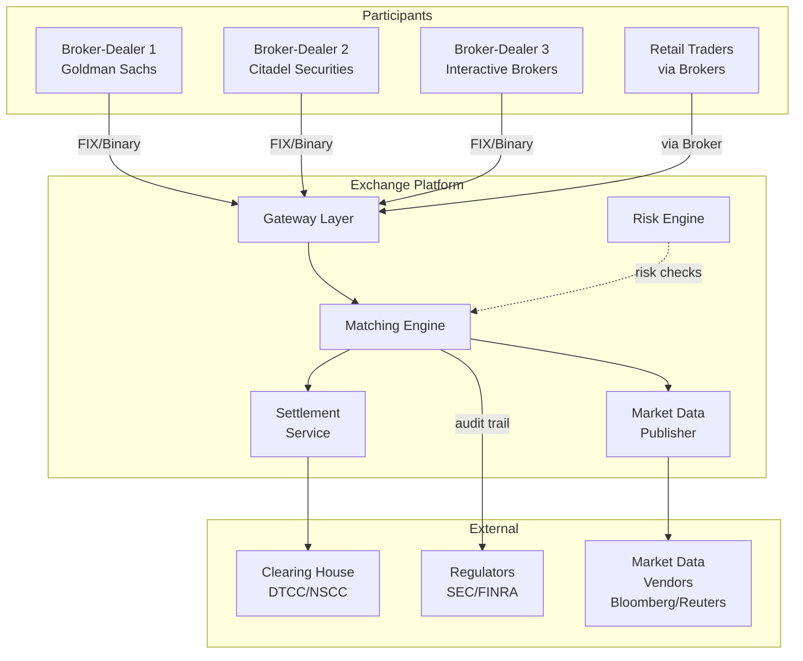
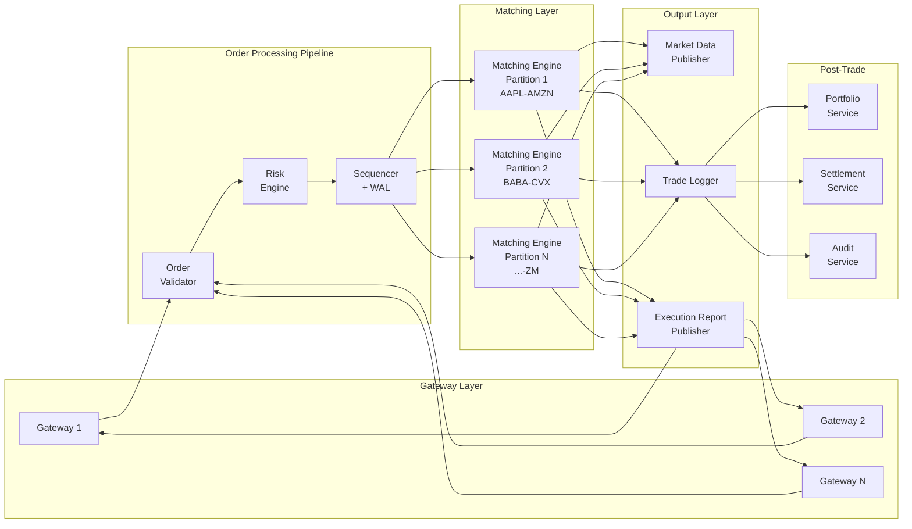
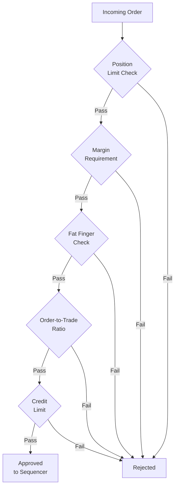
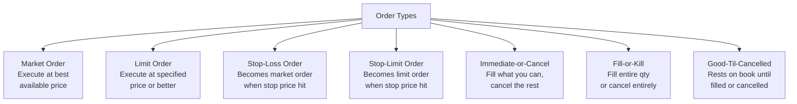
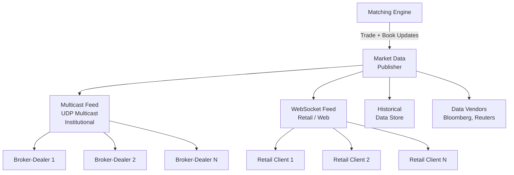
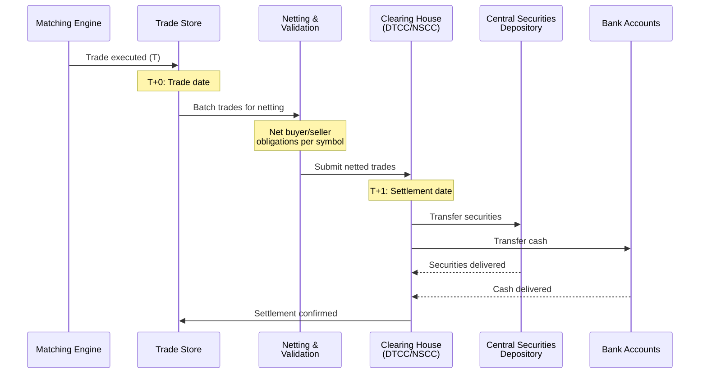
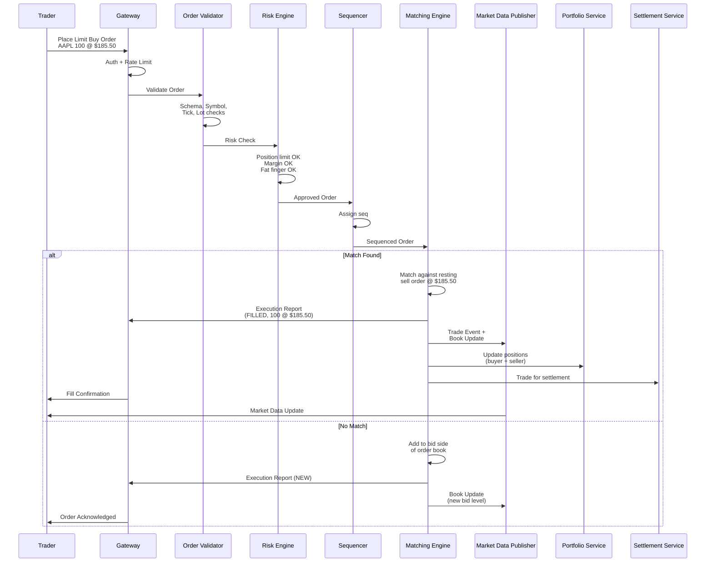
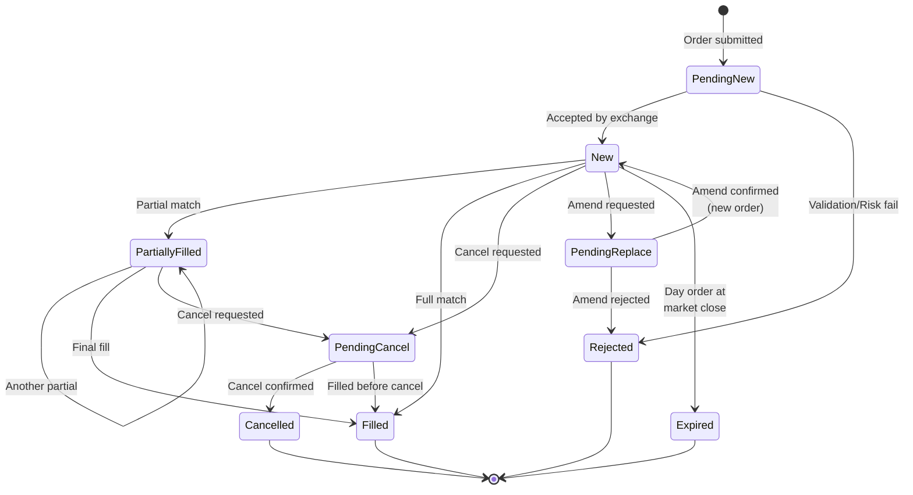
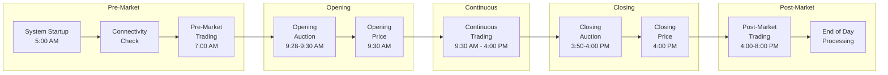
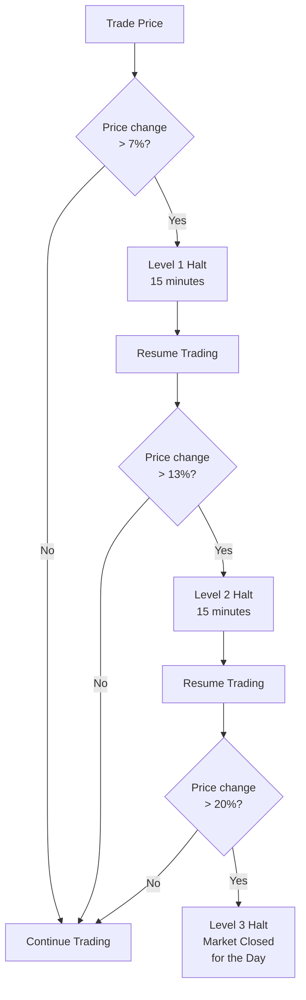

# Design a Stock Exchange / Trading Platform - High-Level Design

## 1. Architecture Overview

A stock exchange is fundamentally a **message-processing pipeline**: orders flow in,
get validated, sequenced, matched, and the results flow out as execution reports and
market data. The critical insight is that the **matching engine must be deterministic
and single-threaded** per symbol to guarantee fairness.

### 1.1 System Context



### 1.2 High-Level Architecture



---

## 2. Component Design

### 2.1 Gateway Layer

The gateway is the **front door** of the exchange. It handles all participant connections,
protocol translation, authentication, and basic message validation.

```
+-------------------------------------------------------------------+
|                         GATEWAY LAYER                              |
+-------------------------------------------------------------------+
| Responsibilities:                                                  |
|   - Accept FIX 4.2/4.4 and proprietary binary protocol sessions   |
|   - TLS termination and participant authentication (mTLS)          |
|   - Rate limiting per participant (order-to-trade ratio checks)    |
|   - Protocol translation to internal format                       |
|   - Session management (logon, logout, heartbeat, sequence reset)  |
|   - Idempotency check on client_order_id                          |
|   - Route execution reports back to correct participant session    |
+-------------------------------------------------------------------+
| Design Decisions:                                                  |
|   - Stateless -- any gateway can handle any participant            |
|   - Kernel bypass networking (DPDK/Solarflare) for low latency    |
|   - Pre-allocated memory pools -- no GC pauses                    |
|   - Connection multiplexing: 500 sessions per gateway              |
+-------------------------------------------------------------------+
```

**Key detail**: Gateways maintain a **session-to-participant mapping** so execution
reports can be routed back to the correct FIX session. This is a stateful routing
concern handled by a lightweight in-memory map.

### 2.2 Order Validator

Performs syntactic and semantic validation before orders enter the critical path.

```
Validation Checks:
  1. Schema validation      -- All required fields present, correct types
  2. Symbol validation      -- Symbol exists and is actively trading
  3. Price tick validation  -- Price is a valid multiple of the tick size
                               (e.g., AAPL trades in $0.01 increments)
  4. Lot size validation    -- Quantity is a valid lot size (round lot = 100)
  5. Price band check       -- Price within daily price limit bands
  6. Time-in-force check    -- Valid for this order type combination
  7. Participant status     -- Firm is active and not suspended
  8. Duplicate check        -- client_order_id not already processed
```

**Why separate from Risk Engine?** Validation is stateless and fast (~10us). Risk checks
require state lookups (positions, margin) and are more expensive (~100us). Separating
them lets us reject obviously bad orders early.

### 2.3 Risk Engine

The risk engine performs **pre-trade risk checks** to prevent catastrophic errors and
ensure market integrity.



#### Pre-Trade Risk Checks Detailed

| Check | Description | Example |
|-------|-------------|---------|
| **Position Limit** | Max shares per symbol per account | Cannot hold > 1M shares of AAPL |
| **Margin Requirement** | Sufficient collateral for leveraged orders | 50% initial margin for equities (Reg T) |
| **Fat Finger** | Order size or price deviates wildly from normal | Buying 1M shares when avg is 100 shares |
| **Order-to-Trade Ratio** | Prevent excessive order cancellation (quote stuffing) | Max 100:1 order-to-trade ratio |
| **Credit Limit** | Total notional exposure within firm limits | Max $1B total exposure per firm |
| **Price Collar** | Order price too far from current market | Limit order at $1 when AAPL is at $185 |
| **Short Sell Check** | Verify shares available to borrow for short sales | Reg SHO locate requirement |
| **Restricted List** | Symbol not on restricted/halted list | Trading halted for pending news |

**Implementation**: The risk engine maintains an **in-memory shadow of positions** updated
in real time from the trade feed. This avoids database lookups on the critical path.

### 2.4 Sequencer

The sequencer is the **single source of truth** for order of events. It assigns a
monotonically increasing sequence number to every message and writes it to a WAL
(Write-Ahead Log) before forwarding to the matching engine.

```
+-------------------------------------------------------------------+
|                          SEQUENCER                                 |
+-------------------------------------------------------------------+
|                                                                    |
|  Input:  Validated orders from Risk Engine                        |
|  Output: Sequenced orders with global sequence number              |
|                                                                    |
|  Guarantees:                                                       |
|    1. Total ordering -- every order gets a unique sequence #       |
|    2. Durability -- WAL written before acknowledgment              |
|    3. Determinism -- replaying WAL reproduces exact state          |
|                                                                    |
|  Implementation:                                                   |
|    - Single writer thread (no locks, no contention)               |
|    - Memory-mapped WAL file for zero-copy writes                  |
|    - Primary-backup replication (synchronous to hot standby)       |
|    - Sequence number = 64-bit monotonic counter                   |
|                                                                    |
+-------------------------------------------------------------------+
```

**Why a separate sequencer?** This is the LMAX Exchange architecture pattern. By
centralizing sequencing, we get deterministic replay for free. If the matching engine
crashes, we replay the WAL from the last checkpoint and arrive at the identical state.

### 2.5 Matching Engine (The Heart of the Exchange)

The matching engine maintains order books and executes the matching algorithm. This is
the most latency-sensitive component -- every microsecond matters.

#### Order Types Supported



| Order Type | Rests on Book? | Partial Fill? | Use Case |
|-----------|---------------|---------------|----------|
| **Market** | Never | Yes | "Buy now at any price" |
| **Limit** | Yes, if not immediately matchable | Yes | "Buy at $185.50 or lower" |
| **Stop-Loss** | No (triggers on price) | Yes (after trigger) | "Sell if price drops to $180" |
| **Stop-Limit** | After trigger | Yes (after trigger) | "Sell at $179.50 if price drops to $180" |
| **IOC** | Never | Yes | "Fill what you can right now, cancel rest" |
| **FOK** | Never | No | "All 1000 shares or nothing" |
| **GTC** | Yes, indefinitely | Yes | "Rest on book until filled or I cancel" |

#### The Order Book

The order book is a **two-sided data structure** -- bids (buy orders) and asks (sell orders).

```
                        ORDER BOOK FOR AAPL
                        
    ============== ASKS (Sell Side) ==============
    Price Level    |  Total Qty  |  Orders (FIFO)
    ------------------------------------------------
    $185.55        |    200      |  [O7:100] [O9:100]
    $185.53        |    600      |  [O5:200] [O6:400]
    $185.52        |    900      |  [O3:300] [O4:300] [O8:300]
    $185.50        |    300      |  [O1:100] [O2:200]         <-- Best Ask
    ================================================
                   |  SPREAD: $0.02  |
    ================================================
    $185.48        |    500      |  [O10:200] [O11:300]       <-- Best Bid
    $185.47        |    800      |  [O12:500] [O13:300]
    $185.46        |   1200      |  [O14:400] [O15:400] [O16:400]
    $185.44        |    400      |  [O17:400]
    ============== BIDS (Buy Side) ===============
    
    Key Properties:
    - Ask side: sorted ASCENDING by price (lowest = best ask)
    - Bid side: sorted DESCENDING by price (highest = best bid)
    - Each price level: FIFO queue of orders at that price
    - Spread = Best Ask - Best Bid = $185.50 - $185.48 = $0.02
```

#### Order Book Data Structure

```
Bid Side (TreeMap<Price, LinkedList<Order>> sorted DESCENDING):
  185.48 -> [Order(id=O10, qty=200, ts=T1), Order(id=O11, qty=300, ts=T2)]
  185.47 -> [Order(id=O12, qty=500, ts=T1), Order(id=O13, qty=300, ts=T3)]
  185.46 -> [Order(id=O14, qty=400, ts=T1), ...]
  ...

Ask Side (TreeMap<Price, LinkedList<Order>> sorted ASCENDING):
  185.50 -> [Order(id=O1, qty=100, ts=T0), Order(id=O2, qty=200, ts=T1)]
  185.52 -> [Order(id=O3, qty=300, ts=T0), ...]
  185.53 -> [...]
  ...

Operations and Complexity:
  - Add order at price level:    O(log P) tree lookup + O(1) list append
  - Cancel order:                O(1) with order-id -> node direct pointer
  - Best bid/ask:                O(1) -- cached at tree endpoints
  - Match at best price:         O(1) -- pop from head of best price queue
  
  Where P = number of distinct price levels (typically 100-1000)
```

#### Matching Algorithm: Price-Time Priority

The matching algorithm is the core intellectual property of an exchange. Most exchanges
use **price-time priority** (also called FIFO matching):

```
ALGORITHM: Price-Time Priority Matching

1. When a new BUY order arrives:
   a. Compare buy price against best ask price
   b. If buy_price >= best_ask_price:
      - MATCH! Execute at the resting ask price
      - Fill from the OLDEST order at best ask first (FIFO)
      - If order partially filled, move to next order at same price
      - If price level exhausted, move to next ask price level
      - Repeat until buy order fully filled or no more matchable asks
   c. If buy_price < best_ask_price (or no asks):
      - No match -- add buy order to bid side of book

2. When a new SELL order arrives:
   a. Compare sell price against best bid price
   b. If sell_price <= best_bid_price:
      - MATCH! Execute at the resting bid price
      - Fill from the OLDEST order at best bid first (FIFO)
      - Continue down bid price levels
   c. If sell_price > best_bid_price (or no bids):
      - No match -- add sell order to ask side of book
```

#### Matching Example Walkthrough

```
Starting Order Book:
  Asks: $185.50 [O1:100, O2:200]  |  $185.52 [O3:300]
  Bids: $185.48 [O10:200]         |  $185.47 [O12:500]

Incoming: BUY 400 shares @ $185.53 (Limit)

Step 1: Buy price ($185.53) >= Best ask ($185.50)? YES -> Match!
  Match with O1: Execute 100 @ $185.50
  O1 fully filled, remove from book
  Remaining buy qty: 300

Step 2: Price level $185.50 still has orders
  Match with O2: Execute 200 @ $185.50
  O2 fully filled, remove from book. Price level $185.50 exhausted.
  Remaining buy qty: 100

Step 3: Next ask price level: $185.52
  Buy price ($185.53) >= $185.52? YES -> Match!
  Match with O3: Execute 100 @ $185.52
  O3 partially filled (200 remaining)
  Remaining buy qty: 0

Result:
  3 trades generated:
    Trade 1: 100 @ $185.50 (buyer vs O1)
    Trade 2: 200 @ $185.50 (buyer vs O2)
    Trade 3: 100 @ $185.52 (buyer vs O3)
  
  Updated Order Book:
    Asks: $185.52 [O3:200]  (O3 now has 200 remaining)
    Bids: $185.48 [O10:200] | $185.47 [O12:500]
  
  Execution reports sent to:
    - Buyer: 3 partial fills, then FILLED
    - O1 seller: FILLED
    - O2 seller: FILLED
    - O3 seller: PARTIALLY_FILLED
```

#### Handling Different Order Types

```
MARKET ORDER:
  - Same as limit but with price = infinity (buy) or 0 (sell)
  - Always immediately matchable if contra-side has orders
  - Risk: may execute at very unfavorable price in thin markets

IOC (Immediate-or-Cancel):
  - Match as much as possible immediately
  - Cancel any unfilled portion (do NOT rest on book)
  
  if (remaining_qty > 0) {
      cancel(remaining_qty);
      send_execution_report(CANCELLED, remaining_qty);
  }

FOK (Fill-or-Kill):
  - Pre-check: Is total available liquidity at matchable prices >= order qty?
  - If YES: execute entire order
  - If NO: reject entire order (no partial fills)
  
  available = sum of all resting orders at matchable prices
  if (available < order.quantity) {
      reject(order, "Insufficient liquidity for FOK");
      return;
  }
  // proceed with normal matching

STOP ORDER:
  - Not immediately active -- stored in a stop order book
  - When last trade price crosses stop price:
    - Stop-Loss: Convert to market order, inject into matching engine
    - Stop-Limit: Convert to limit order at the limit price
  - Can cause cascading stops (flash crash scenario)
```

### 2.6 Market Data Publisher

The market data publisher disseminates price information to all participants and data
vendors. This is the **highest fan-out** component in the system.



#### Market Data Levels

```
LEVEL 1 (Top of Book) -- Cheapest, most common
+--------------------------------------------------+
|  Symbol: AAPL                                     |
|  Best Bid:  $185.48  x  500 shares               |
|  Best Ask:  $185.50  x  300 shares               |
|  Last:      $185.49  x  100 shares               |
|  Volume:    42,000,000                            |
|  VWAP:      $185.23                               |
|  High:      $186.10   Low: $184.50               |
+--------------------------------------------------+
Update frequency: Every trade or BBO change (~10K/sec/symbol)

LEVEL 2 (Market Depth) -- Shows full order book
+--------------------------------------------------+
|  Symbol: AAPL          Orders  Bid   Ask  Orders  |
|                         12     185.48              |
|                         25     185.47              |
|                         31     185.46              |
|                                       185.50  8   |
|                                       185.51  15  |
|                                       185.52  22  |
+--------------------------------------------------+
Update frequency: Every order add/cancel/modify (~100K/sec/symbol)

LEVEL 3 (Full Order-by-Order) -- Most expensive
+--------------------------------------------------+
|  Every individual order: ID, price, qty, timestamp |
|  Used by market makers and HFT firms              |
+--------------------------------------------------+
Update frequency: Every order event
```

#### Snapshot + Incremental Update Model

```
Initial connection:
  1. Client connects to WebSocket
  2. Server sends SNAPSHOT of full order book state
  3. Server then sends INCREMENTAL updates

Snapshot (sent once on connect):
{
  "type": "snapshot",
  "symbol": "AAPL",
  "sequence": 98765000,
  "bids": [
    {"price": 185.48, "qty": 500},
    {"price": 185.47, "qty": 800},
    ...  // all bid levels
  ],
  "asks": [
    {"price": 185.50, "qty": 300},
    ...  // all ask levels
  ]
}

Incremental Update (sent continuously):
{
  "type": "update",
  "symbol": "AAPL",
  "sequence": 98765001,         // monotonic -- client detects gaps
  "action": "MODIFY",           // ADD | MODIFY | DELETE
  "side": "BID",
  "price": 185.48,
  "new_qty": 700                // updated total qty at this level
}

Gap Detection:
  if (update.sequence != expected_sequence + 1) {
      // Missed messages! Request re-snapshot
      request_snapshot(symbol);
  }
```

### 2.7 Settlement Service

Post-trade processing that ensures actual transfer of securities and cash.



**Netting Example**:
```
Firm A bought 1000 AAPL and sold 600 AAPL during the day
Net obligation: Firm A receives 400 AAPL, pays for 400 shares
(Not 1600 share movements -- just 400 net)
```

### 2.8 Portfolio Service

Maintains real-time position and P&L tracking.

```
Portfolio State (per account):
{
  "account_id": "ACC-789",
  "positions": {
    "AAPL": {
      "quantity": 500,
      "avg_cost": 182.30,
      "market_value": 92750.00,
      "unrealized_pnl": 1600.00,
      "realized_pnl": 3200.00
    },
    "GOOGL": { ... }
  },
  "cash_balance": 450000.00,
  "margin_used": 125000.00,
  "buying_power": 775000.00
}
```

---

## 3. End-to-End Order Flow

### 3.1 Complete Order Lifecycle (Sequence Diagram)



### 3.2 Order States



---

## 4. Data Flow Architecture

### 4.1 The Critical Path (Latency-Sensitive)

```
Order In -> Gateway -> Validator -> Risk -> Sequencer -> Matching Engine -> Execution Report Out
                                                                        |
                                                                        +-> Market Data Out

Target: < 1 ms end-to-end on the critical path
```

Everything on the critical path runs **in-process** or communicates via **shared memory /
lock-free ring buffers** -- no network hops, no serialization, no database calls.

### 4.2 The Non-Critical Path

```
Trade events (async) --> Portfolio Service (update positions)
                    +--> Settlement Service (queue for T+1 settlement)
                    +--> Audit Service (persist to regulatory store)
                    +--> Analytics Service (aggregate OHLCV)

These can tolerate 10-100 ms latency and use standard message queues.
```

---

## 5. Technology Choices

### 5.1 Critical Path Components

| Component | Technology | Rationale |
|-----------|-----------|-----------|
| **Gateway** | C++ / Rust with DPDK | Kernel bypass for network I/O |
| **Matching Engine** | Java (LMAX) or C++ | Single-threaded, no GC (off-heap) |
| **Sequencer** | Java / C++ with memory-mapped files | WAL with zero-copy writes |
| **Ring Buffer** | LMAX Disruptor (Java) or custom lock-free queue | Mechanical sympathy, cache-line padding |
| **Internal Messaging** | Shared memory / Aeron (UDP) | No serialization overhead |

### 5.2 Non-Critical Path Components

| Component | Technology | Rationale |
|-----------|-----------|-----------|
| **Market Data (Institutional)** | UDP Multicast (Aeron) | Lowest latency fan-out |
| **Market Data (Retail)** | WebSocket + Redis Pub/Sub | Standard web tech |
| **Portfolio Service** | Java/Go + Redis + PostgreSQL | Real-time cache + persistent store |
| **Settlement** | Java + PostgreSQL + Kafka | Batch processing, event sourcing |
| **Audit Store** | Kafka + HDFS/S3 + TimescaleDB | High-throughput append, long retention |
| **Trade History** | PostgreSQL + Elasticsearch | Query flexibility |
| **Monitoring** | Prometheus + Grafana | Operational dashboards |

### 5.3 Why LMAX Disruptor Pattern?

```
Traditional approach (thread pool + locks):
  Thread 1 ---[lock]--write--[unlock]---
  Thread 2 ------[lock]--write--[unlock]---
  Thread 3 ---------[lock]--write--[unlock]---
  Problem: Lock contention, context switches, cache misses
  Latency: ~10-100 us per operation with jitter

LMAX Disruptor approach (single writer, ring buffer):
  Producer -> [Ring Buffer] -> Consumer 1
                            -> Consumer 2
                            -> Consumer 3
  
  - Lock-free: CAS-based sequence claiming
  - Cache-friendly: sequential memory access
  - No GC: pre-allocated entries
  - Mechanical sympathy: cache-line padded
  Latency: < 1 us per operation, consistent
```

---

## 6. Handling Market Sessions

### 6.1 Trading Day Lifecycle



### 6.2 Opening Auction

The opening auction determines the opening price. All orders submitted before market
open are collected and matched at a single price that maximizes the number of shares
traded.

```
Pre-open orders collected:
  Buy:  500 @ $186.00, 300 @ $185.50, 200 @ $185.00
  Sell: 400 @ $185.00, 200 @ $185.50, 300 @ $186.00

Auction clearing price calculation:
  At $185.00: 1000 buy qty vs 900 sell qty -> 900 tradeable
  At $185.50: 800 buy qty vs 700 sell qty  -> 700 tradeable
  At $186.00: 500 buy qty vs 400 sell qty  -> 400 tradeable

  Maximum volume at $185.00 -> opening price = $185.00
  All orders at or better than $185.00 execute at $185.00
```

---

## 7. Circuit Breakers

Circuit breakers halt trading when prices move too fast, preventing flash crashes.

```
NYSE Circuit Breaker Levels (based on S&P 500):

Level 1: 7% decline from previous close
  -> 15-minute trading halt (if before 3:25 PM)
  
Level 2: 13% decline from previous close
  -> 15-minute trading halt (if before 3:25 PM)
  
Level 3: 20% decline from previous close
  -> Trading halted for remainder of the day

Individual Stock LULD (Limit Up-Limit Down):
  -> Price band based on reference price
  -> If best bid/ask outside band, 5-minute trading pause
```



---

## 8. Failure Handling

### 8.1 Component Failure Matrix

| Component | Failure Mode | Impact | Recovery |
|-----------|-------------|--------|----------|
| **Gateway** | Server crash | Participants lose session | Reconnect to another gateway, resume via sequence numbers |
| **Validator** | Crash | Orders not validated | Failover to standby; gateways buffer briefly |
| **Risk Engine** | Crash | No risk checks | **Reject all orders** until risk engine recovers (safety first) |
| **Sequencer** | Primary crash | No new sequences | Hot standby takes over (< 1 sec failover) |
| **Matching Engine** | Crash | No matching | Replay WAL from last checkpoint on standby; matching pauses briefly |
| **Market Data** | Crash | No price updates | Clients detect gap, request re-snapshot |
| **Settlement** | Crash | Delayed settlement | Batch retry; trades are already recorded |

### 8.2 The Golden Rule

```
+------------------------------------------------------------------+
|                                                                    |
|  In a stock exchange, when in doubt, HALT rather than corrupt.    |
|                                                                    |
|  - A 5-minute trading halt is annoying but recoverable.           |
|  - A single lost or duplicated trade is a regulatory disaster.    |
|  - Better to stop and replay than to guess.                       |
|                                                                    |
+------------------------------------------------------------------+
```

---

## 9. Key Design Decisions Summary

| Decision | Choice | Alternative | Why |
|----------|--------|------------|-----|
| Matching engine threading | Single-threaded per symbol | Multi-threaded with locks | Determinism, no lock contention, simpler reasoning |
| Internal messaging | Lock-free ring buffers | Message queues (Kafka) | Kafka adds ~1ms; unacceptable on critical path |
| Order sequencing | Centralized sequencer with WAL | Distributed consensus (Raft) | Raft adds latency; single sequencer is fast enough |
| Market data distribution | Multicast (institutional) + WebSocket (retail) | All WebSocket | Multicast is O(1) network; WebSocket is O(N) connections |
| Partitioning strategy | By symbol | By participant | Orders for same symbol must be on same matching engine |
| Risk check position | Before sequencer | After matching | Catch bad orders early; don't waste matching engine cycles |
| Settlement | Batch (T+1) | Real-time (T+0) | Industry standard; netting reduces obligations by 98% |
| State recovery | WAL replay | Database reads | WAL replay is deterministic and fast; DB reads have variable latency |

---

## 10. Architecture Constraints Worth Mentioning

```
Things that CANNOT be horizontally scaled:
  1. Matching Engine for a SINGLE symbol -- must be single-threaded
     (You can scale across symbols but not within one)
  
  2. Sequencer -- must be a single writer for total ordering
     (Can have hot standby but not parallel sequencers)

Things that CAN be horizontally scaled:
  1. Gateways -- stateless, add more as needed
  2. Market data servers -- fan-out layer, add more subscribers
  3. Portfolio service -- partition by account
  4. Settlement -- batch processing, add workers
  5. Trade history -- standard database scaling (sharding, read replicas)
```
