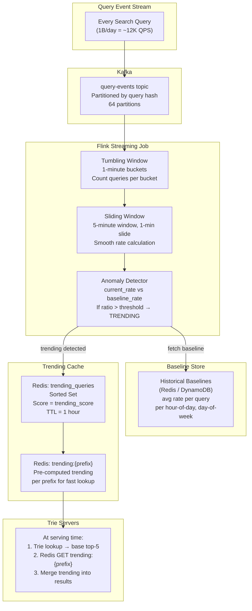
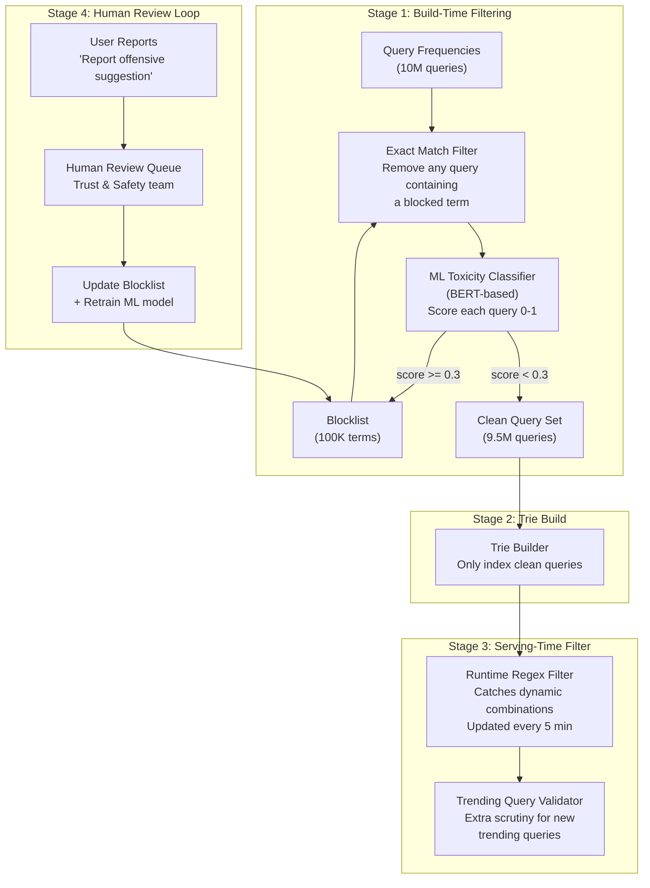
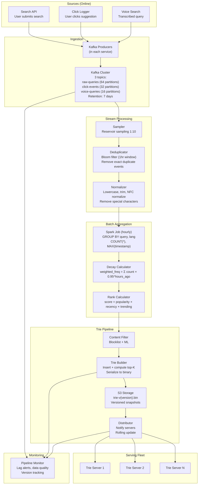

# Design Search Autocomplete / Typeahead System: Deep Dive and Scaling

## Table of Contents
- [1. Deep Dive #1: Trie Optimization](#1-deep-dive-1-trie-optimization)
- [2. Deep Dive #2: Handling Trending Queries in Real Time](#2-deep-dive-2-handling-trending-queries-in-real-time)
- [3. Deep Dive #3: Personalization](#3-deep-dive-3-personalization)
- [4. Deep Dive #4: Fuzzy Matching and Typo Tolerance](#4-deep-dive-4-fuzzy-matching-and-typo-tolerance)
- [5. Deep Dive #5: Multi-Language Support](#5-deep-dive-5-multi-language-support)
- [6. Offensive Content Filtering Pipeline](#6-offensive-content-filtering-pipeline)
- [7. Data Collection Pipeline (Production-Grade)](#7-data-collection-pipeline-production-grade)
- [8. Scaling: Sharding and Replication](#8-scaling-sharding-and-replication)
- [9. Trade-Offs and Design Decisions](#9-trade-offs-and-design-decisions)
- [10. Interview Tips and Common Follow-Ups](#10-interview-tips-and-common-follow-ups)

---

## 1. Deep Dive #1: Trie Optimization

### 1.1 Problem: The Naive Trie Is Too Large

A basic trie with one node per character wastes enormous space on long chains
of single-child nodes. Consider the word "internationalization" (20 chars):

```
Naive trie: 20 separate nodes, each with exactly 1 child
            i → n → t → e → r → n → a → t → i → o → n → a → l → ...
            
This is essentially a linked list -- no prefix sharing benefit.
```

### 1.2 Solution: Compressed Trie (Radix Tree / Patricia Trie)

A compressed trie merges chains of single-child nodes into a single node
with a multi-character label.

```
BEFORE (Standard Trie):                AFTER (Compressed Trie / Radix Tree):
─────────────────────                  ─────────────────────────────────────

       [root]                                    [root]
         |                                         |
         t                                    ┌────┴────┐
         |                                    │         │
    ┌────┼────┐                           [to]$     [inn]
    o    r    e                              |         |
    |    |    |                          ┌───┼───┐   [er]$
    y$   e    n                      [day]$ [p]$ [wn]$
         |    |
    ┌────┤    n
    e$   u    |
         |    i
         e$   |
              s$

Words: toy, tree, true, ten, tennis    Words: today, top, town, inn, inner

Space savings: Radix tree has ~40-60% fewer nodes
Lookup speed: Slightly faster (fewer pointer hops per character)
```

**Detailed comparison:**

```
Standard trie for 10M queries (avg 25 chars):
  Nodes: ~50M
  Memory per node: ~250 bytes
  Total: ~12.5 GB

Compressed trie (radix tree) for same data:
  Nodes: ~20M (60% reduction from merging single-child chains)
  Memory per node: ~200 bytes (slightly more per node for variable-length labels)
  Total: ~4 GB

Further optimization with compact encoding:
  Nodes: ~20M
  Memory per node: ~100 bytes (packed arrays, offset-based children)
  Total: ~2 GB ← This is what we target
```

### 1.3 Pre-Computed Top-K: The Essential Optimization

This is the single most impactful optimization. Without it, autocomplete is useless at scale.

```
Without pre-computed top-K:
─────────────────────────────
  Query: prefix = "a"
  
  Step 1: Traverse to node 'a'               → O(1)
  Step 2: DFS/BFS all descendants of 'a'     → O(all queries starting with 'a')
           = potentially millions of nodes
  Step 3: Sort by score                       → O(N log N) where N = descendants
  Step 4: Return top 5
  
  Total: O(millions) = seconds. Completely unusable.

With pre-computed top-K:
───────────────────────────
  Query: prefix = "a"
  
  Step 1: Traverse to node 'a'               → O(1)
  Step 2: Read top_k_suggestions from node    → O(1) -- it's already there!
  
  Total: O(prefix_length) = microseconds. Perfect.

Trade-off: We pay for this at BUILD time, not at QUERY time.
  Building cost: For each node, maintain a min-heap of size K
  As we insert each query, bubble it through ancestor nodes' heaps.
  Build time increases from O(total_chars) to O(total_chars × log K)
  Since K=5, log K ≈ 2. Only ~2x slower build. Worth it.
```

### 1.4 Trie Serialization for Distribution

The trie must be serialized (converted to bytes) for storage in S3 and
distribution to trie servers. The format must be compact and fast to deserialize.

```
Serialization format (custom binary):
──────────────────────────────────────

Header: [magic_bytes: 4B] [version: 2B] [num_nodes: 4B] [num_suggestions: 4B]

Suggestion Table (variable length):
  For each suggestion (10M total):
    [query_length: 2B] [query_bytes: variable] [score: 4B] [category: 1B]

Node Array (fixed-size entries for cache-friendly access):
  For each node (20M total):
    [flags: 1B]                      -- is_end, has_children, etc.
    [label_offset: 4B]               -- offset into label string pool
    [label_length: 1B]               -- length of label (for radix tree)
    [num_children: 1B]               -- number of child nodes
    [children_offset: 4B]            -- offset into children array
    [top_k_count: 1B]                -- number of top-K entries (0-5)
    [top_k_ids: 5 x 4B = 20B]       -- indices into suggestion table

Children Array:
  For each child pointer:
    [char: 1B] [node_index: 4B]      -- character + index into node array

Label Pool:
  [All multi-character labels packed consecutively]

Total size estimate:
  Suggestion table: 10M × 30B avg = 300 MB
  Node array: 20M × 32B = 640 MB
  Children array: 50M × 5B = 250 MB
  Label pool: 20M × 5B avg = 100 MB
  ──────────────────────────────────
  Total: ~1.3 GB serialized (+ gzip → ~800 MB for network transfer)
```

**Deserialization performance:**

```
Memory-mapped approach:
  mmap() the file → OS loads pages on demand
  Node lookups become array index operations: O(1) with no parsing
  Deserialization time: ~0 (lazy loading)
  Cold start: first few requests may hit page faults (~1ms each)
  Warm state: all accessed pages in RAM, ~5 microsecond lookups

Traditional load approach:
  Read entire file → parse into objects → ~10-30 seconds
  Better for predictable latency (no page faults)
  
Production choice: Traditional load with pre-warming
  Load full trie into memory structures during hot-swap
  Serve from old trie during loading
  Swap atomically once fully loaded
```

---

## 2. Deep Dive #2: Handling Trending Queries in Real Time

### 2.1 The Problem

The trie is rebuilt every 15-60 minutes. But trending queries can spike in seconds:

```
Scenario: Celebrity tweets something controversial at 3:15 PM

  3:15 PM - Tweet posted. 0 searches for "[celebrity] tweet"
  3:17 PM - 10,000 searches (news spreads on social media)
  3:20 PM - 100,000 searches (mainstream attention)
  3:25 PM - 500,000 searches (everyone is searching)
  
  Current trie (built at 3:00 PM): Has no idea this is happening.
  Next trie rebuild at 3:30 PM: Will include it, but 15 minutes late.
  
  Users expect to see "[celebrity] tweet" in suggestions by 3:20 PM.
```

### 2.2 Solution: Real-Time Trending Pipeline



### 2.3 Trending Detection Algorithm

```
For each query in the stream:

1. Count queries in sliding 5-minute window:
     current_rate = count_last_5_min / 5  (queries per minute)

2. Look up historical baseline for this query:
     baseline_rate = avg queries per minute for this query
                     at this hour-of-day and day-of-week
     (e.g., "weather" baseline might be 500/min on Monday 9am)

3. Compute trending score:
     trending_score = current_rate / max(baseline_rate, min_baseline)
     
     min_baseline = 10  (avoid division by zero for new queries)

4. Apply threshold:
     if trending_score > 5.0:     → HIGHLY TRENDING (inject at top of results)
     if trending_score > 2.0:     → MODERATELY TRENDING (boost in ranking)
     else:                        → NOT TRENDING

Example:
  Query: "earthquake los angeles"
  
  Normal baseline: 50 searches/min (LA gets earthquakes occasionally)
  Current rate: 15,000 searches/min (3.2 magnitude quake just hit)
  Trending score: 15000 / 50 = 300 → HIGHLY TRENDING
  
  Query: "weather"
  Normal baseline: 5,000 searches/min
  Current rate: 7,000 searches/min (it's raining in NYC)
  Trending score: 7000 / 5000 = 1.4 → NOT TRENDING (normal fluctuation)
```

### 2.4 Exponential Decay for Trending

```
Once a query starts trending, it shouldn't stay trending forever.
Apply exponential decay to the trending score:

  decayed_score(t) = peak_score × e^(-λ × (t - t_peak))
  
  Where λ controls how fast trends fade:
    λ = 0.1 → half-life of ~7 hours (for news events)
    λ = 0.5 → half-life of ~1.4 hours (for viral moments)
    λ = 1.0 → half-life of ~42 minutes (for flash trends)
  
  Automatically remove from trending cache when decayed_score < 1.5

Timeline for "earthquake los angeles":
  t=0:    trending_score = 300  (just happened)
  t=1h:   trending_score = 271  (still very hot)
  t=6h:   trending_score = 164  (cooling down)
  t=24h:  trending_score = 27   (aftershock coverage)
  t=48h:  trending_score = 2.4  (barely trending)
  t=72h:  trending_score = 0.4  → removed from trending cache
```

---

## 3. Deep Dive #3: Personalization

### 3.1 The Personalization Problem

Generic autocomplete returns the same suggestions for everyone. But:
- A software engineer typing "py" wants "python", "pytorch", "pycharm"
- A home decorator typing "py" wants "pyrex", "pyramid shelf", "pylon lamp"
- A traveler typing "py" wants "pyongyang", "pyrenees", "pyramid of giza"

### 3.2 User Search History Overlay

```
Storage: Redis Sorted Set per user

  Key:     user_history:{user_id}
  Members: query strings the user has searched
  Scores:  Unix timestamp of most recent search
  Max size: 200 entries (ZREMRANGEBYRANK to evict oldest)
  TTL:     90 days

Operations:
  On search: ZADD user_history:u123 {timestamp} "pytorch tutorial"
  On serve:  ZRANGEBYSCORE user_history:u123 {prefix_start} {prefix_end}
             (where prefix_start/end are the lexicographic range for the prefix)

Wait -- sorted sets are sorted by score (timestamp), not by member string.
We can't do prefix search on member names efficiently.

Better approach: Store a small per-user trie? No -- too expensive at 100M users.
```

**Practical solution: Two-pass lookup**

```
Pass 1: Get user's recent queries from Redis (cheap -- 200 entries max)
  ZREVRANGE user_history:u123 0 199 → ["pytorch tutorial", "python flask", ...]

Pass 2: Client-side (on the trie server) filter for prefix match
  prefix = "py"
  matches = [q for q in user_queries if q.startswith("py")]
  → ["pytorch tutorial", "python flask", "pygame install"]

Pass 3: Merge into global top-5 with boosted score
  global: ["python", "python tutorial", "pyramid scheme", "pyongyang", "pygame"]
  personal: ["pytorch tutorial", "python flask", "pygame install"]
  
  Merge rule: 
    - Personal matches get a 1.5x score boost
    - Deduplicate (prefer personal version)
    - Take top 5 from merged list
  
  Result: ["python", "pytorch tutorial", "python tutorial", "python flask", "pygame"]

Latency: Redis ZREVRANGE = 0.5ms, filtering 200 strings = 0.01ms
Total personalization overhead: ~1-2ms
```

### 3.3 Personalization Tiers

```
Tier 1: Recent Searches (simplest, most impactful)
──────────────────────────────────────────────────
  Signal: Exact queries the user has searched in the past 90 days
  Weight: High (1.5x boost)
  Latency: 1-2ms (Redis lookup + filter)
  Coverage: Only helps for queries the user has searched before

Tier 2: Category Affinity (moderate complexity)
──────────────────────────────────────────────────
  Signal: What categories the user searches most (tech, sports, cooking)
  Storage: Redis hash per user: {tech: 0.8, sports: 0.3, cooking: 0.6}
  Effect: Boost suggestions matching user's top categories
  Example: User with tech=0.8: "app" → "apple developer" boosted over "apple pie"
  Latency: 0.5ms (single Redis GET)

Tier 3: Collaborative Filtering (most complex)
──────────────────────────────────────────────────
  Signal: "Users who searched X also searched Y"
  Model: Precomputed user-query embeddings (ALS or word2vec)
  Serving: Store user's embedding vector in Redis; compute dot product at query time
  Latency: 2-5ms (vector operations)
  Typically not worth the complexity for autocomplete. Better for search ranking.

RECOMMENDATION for interviews: Implement Tier 1 (recent searches).
  Mention Tier 2 and 3 as future enhancements. Interviewers are satisfied
  with a practical, implementable solution over a theoretical perfect one.
```

---

## 4. Deep Dive #4: Fuzzy Matching and Typo Tolerance

### 4.1 The Problem

Users make typos. A strict prefix match on a trie will return nothing for:
- "amazn" (missing 'o') -- user wants "amazon"
- "gogle" (missing 'o') -- user wants "google"
- "pytohn" (transposed 'h' and 'o') -- user wants "python"

### 4.2 Edit Distance (Levenshtein Distance)

```
Edit distance = minimum number of single-character operations
(insert, delete, replace) to transform one string into another.

  "amazn" → "amazon"
    amaz_n → amazon (insert 'o' at position 4)
    Edit distance = 1

  "gogle" → "google"
    go_gle → google (insert 'o' at position 2)
    Edit distance = 1

  "pytohn" → "python"
    pyt_ohn → python (swap 'o' and 'h' = 2 ops, or delete+insert)
    Edit distance = 2

Rule of thumb:
  - Edit distance 1: Cover 80% of typos (single key miss, adjacent key press)
  - Edit distance 2: Cover 95% of typos (but much more expensive to compute)
```

### 4.3 BK-Trees for Fuzzy Matching

A BK-tree organizes strings by edit distance, enabling efficient fuzzy search.

```
BK-Tree structure:
─────────────────

Root: "amazon"

                        "amazon"
                       /    |    \
                  d=1 /  d=2|     \ d=3
                    /      |       \
               "amazo"  "amaze"  "google"
                |          |        |
           d=1 |     d=2  |   d=1 |
              |          |       |
          "amaze"    "maze"  "gogle"

Lookup for "amazn" with max edit distance = 1:
  1. Compare with root "amazon": d("amazn", "amazon") = 1 → MATCH!
  2. Search children with distance in range [1-1, 1+1] = [0, 2]
  3. Check "amazo" (d=1 from root): d("amazn", "amazo") = 1 → MATCH!
  4. Check "amaze" (d=2 from root): d("amazn", "amaze") = 2 → too far, skip
  
Result: ["amazon", "amazo"] 
  Filter to real queries: ["amazon"]

Performance:
  BK-tree search with max_dist=1: examines ~5-10% of all entries
  For 10M queries: ~500K-1M comparisons → ~50-100ms
  Too slow for the hot path!
```

### 4.4 Practical Fuzzy Matching Strategy

```
The BK-tree is too slow for real-time use. Here is the production approach:

Strategy 1: Pre-compute fuzzy variants at BUILD TIME
────────────────────────────────────────────────────
  For each popular query, generate common typo variants and insert them
  into the trie as aliases pointing to the correct query.
  
  "amazon" → also index: "amazn", "amazo", "amzon", "aamazon", "amazin"
  "python" → also index: "pythn", "pyhton", "pytohn", "pyton"
  
  Only do this for the top 100K queries (long tail isn't worth it).
  10 variants per query x 100K queries = 1M additional trie entries.
  Negligible memory impact.

Strategy 2: Edit-distance-1 trie traversal at QUERY TIME
────────────────────────────────────────────────────────
  For short prefixes (< 5 chars), explore all edit-distance-1 neighbors
  in the trie simultaneously.
  
  Prefix "gog":
    Exact: traverse root → g → o → g
    Delete one char: "go", "gg", "og"
    Replace one char: "aog", "gag", "goa", "bog", ...(26 x 3 = 78 variants)
    Insert one char: "agog", "gaog", "goag", "goga", ... (26 x 4 = 104 variants)
  
  Total variants for 3-char prefix: ~180
  Each variant: O(3) trie traversal = O(1) microseconds
  Total: ~0.2ms for fuzzy matching. Acceptable!
  
  For longer prefixes (>5 chars): Only do exact match (typos in long
  prefixes are rare because the user has already corrected earlier).

Strategy 3: Keyboard proximity model
────────────────────────────────────────────────────────
  Most typos hit adjacent keys. Weight nearby keys higher.
  
  QWERTY layout adjacency:
    'a' neighbors: ['q', 'w', 's', 'z']
    'g' neighbors: ['f', 'h', 't', 'y', 'b', 'v']
  
  For prefix "gof" (user meant "goo" but hit 'f' next to 'g'):
    Only try replacing 'f' with its neighbors: ['d', 'g', 'r', 'c', 'v']
    → "god", "gog", "gor", "goc", "gov" → "goo" not found this way
    
    Also try: 'f' neighbors on opposite side: not applicable
    
  Better: Combine with Strategy 1 (pre-computed variants from keyboard model).

RECOMMENDATION: Use Strategy 1 (pre-computed variants) as the primary approach.
  Add Strategy 2 (runtime edit-distance-1) for short prefixes.
  Mention Strategy 3 as a refinement. This covers 90%+ of typos
  with negligible latency impact.
```

---

## 5. Deep Dive #5: Multi-Language Support

### 5.1 The Challenge Spectrum

```
Language complexity for autocomplete:
─────────────────────────────────────

EASY: Latin-script languages (English, Spanish, French, German)
  - Standard ASCII trie works (26 lowercase + digits + space)
  - Word boundaries are clear (space-separated)
  - Prefix matching is straightforward

MEDIUM: Cyrillic, Arabic, Hebrew, Greek
  - Different character sets → Unicode trie (not ASCII)
  - Arabic/Hebrew are RTL (right-to-left) → display challenge
  - Each character is 2-4 bytes in UTF-8
  - Node fan-out increases (more possible characters per node)

HARD: CJK (Chinese, Japanese, Korean)
  - No spaces between words → what is a "prefix"?
  - Chinese: 20,000+ common characters, 50,000+ total
  - Japanese: 3 writing systems (hiragana, katakana, kanji)
  - Korean: syllabic blocks (jamo → syllable composition)
  - Trie node fan-out: 20,000+ children per node (vs 26 for English)
```

### 5.2 CJK-Specific Challenges

```
Chinese example:
  User wants to search: "北京天气" (Beijing weather)
  
  As they type: "北" → "北京" → "北京天" → "北京天气"
  
  Problem 1: "北京天" is NOT a word boundary
    "北京" = Beijing (word)
    "天气" = weather (word)
    "北京天" = "Beijing" + first char of "weather" -- this is mid-word!
    
    With a word-level trie (like English), "北京天" has no match.
    Need character-level trie OR word segmentation.

  Problem 2: Pinyin input
    Chinese users often type PINYIN (romanized pronunciation):
    "bei" → "北" (can be 北, 杯, 背, 倍, ... many homophones)
    "beijing" → "北京"
    
    Need to support BOTH:
    - Direct character input (mobile keyboard): "北京..."
    - Pinyin input (desktop keyboard): "beijing..."
    
    This means the trie needs to index both Chinese characters AND pinyin.

  Problem 3: Character set size
    20,000+ common Chinese characters → trie node fan-out explodes
    Standard 26-child array → 20,000-element array per node (insane memory waste)
    Must use hash map or sorted array for children.
```

### 5.3 Multi-Language Trie Architecture

```
Option A: Separate trie per language
──────────────────────────────────────
  Trie_EN: English queries only (26-char alphabet, compact)
  Trie_ZH: Chinese queries (character-level + pinyin index)
  Trie_JA: Japanese queries (mixed hiragana/katakana/kanji)
  Trie_KO: Korean queries (jamo-based)
  ...
  
  Routing: Language detected from user's locale/browser settings
  
  Pros: Each trie is optimized for its language
  Cons: Multilingual queries fall through cracks
        ("Python 教程" = "Python tutorial" in Chinese -- spans 2 tries)

Option B: Unified Unicode trie
──────────────────────────────────────
  Single trie handling all Unicode characters
  Children stored as hash maps (not arrays)
  
  Pros: Handles multilingual queries naturally
  Cons: Higher memory per node, more complex
        Hash map children are slower than array indexing

Option C: Language-partitioned trie with cross-references (RECOMMENDED)
──────────────────────────────────────
  Separate tries per language group, but:
  - Detect language from prefix at query time
  - Support transliteration (pinyin → Chinese, romaji → Japanese)
  - Cross-reference popular cross-language queries
  
  Example: "python" detected as English → route to Trie_EN
  Example: "beijing" detected as pinyin → route to Trie_ZH (pinyin index)
  Example: "北京" detected as Chinese → route to Trie_ZH (character index)
```

### 5.4 Unicode Normalization

```
Critical for correct matching:

  "cafe" vs "cafe\u0301" (e + combining acute accent)
  "Straße" vs "Strasse" (German eszett)
  "fi" (fi ligature) vs "fi" (two separate characters)

Solution: Apply NFC (Canonical Decomposition + Canonical Composition) normalization
  to all queries at ingestion AND at query time.
  
  Python: unicodedata.normalize('NFC', query)
  Java:   java.text.Normalizer.normalize(query, Normalizer.Form.NFC)

Also apply:
  - Case folding: "PYTHON" → "python" (for case-insensitive matching)
  - Accent stripping (optional): "cafe\u0301" → "cafe" (for broader matching)
  - Whitespace normalization: collapse multiple spaces, trim
```

---

## 6. Offensive Content Filtering Pipeline

### 6.1 Multi-Stage Filtering



### 6.2 Real-World Example: Google's Autocomplete Policies

```
Google explicitly blocks suggestions related to:
─────────────────────────────────────────────────
  - Violence against specific groups
  - Sexually explicit content
  - Dangerous activities (e.g., how to make explosives)
  - Personal information of private individuals
  - Content violating local laws (varies by country)
  - Election-related misinformation during election periods

Challenges:
  - Context-dependent: "how to kill" → "how to kill a process" (legitimate)
                                      "how to kill [person]" (blocked)
  - Evolving language: New slang, coded language, euphemisms
  - Cultural differences: Acceptable in one country, offensive in another
  - Streisand effect: Blocking a suggestion draws MORE attention to it
  
This is an area where human judgment + ML work together.
No purely automated system can handle all edge cases.
```

---

## 7. Data Collection Pipeline (Production-Grade)

### 7.1 Complete Pipeline Architecture



### 7.2 Pipeline Failure Modes and Mitigations

```
Failure Mode                    Impact                      Mitigation
──────────────────────────────────────────────────────────────────────────────
Kafka broker down               Events buffered/delayed     Multi-broker replication (RF=3)
Spark aggregation fails         Stale frequency counts      Retry with backoff; use previous
                                                            aggregation if all retries fail
Trie build fails                No new trie version         Keep serving current version;
                                                            alert on-call engineer
S3 upload fails                 Servers can't download      Retry upload; S3 has 99.999% 
                                                            availability
Trie server download fails      One server on old version   LB health check detects; retry
                                                            download; serve old trie
All trie servers crash          No suggestions              Cached results at CDN serve for
                                                            TTL duration; auto-scale new
                                                            instances from latest S3 snapshot
Trending pipeline down          Stale trending suggestions  Gracefully degrade: serve base
                                                            trie results without trending
Content filter bypass           Offensive suggestions shown Immediate incident response;
                                                            manual blocklist update in < 5 min
```

---

## 8. Scaling: Sharding and Replication

### 8.1 Do We Even Need Sharding?

```
Trie size: ~2 GB in memory
Modern server RAM: 64-256 GB
Trie server CPU per request: ~10 microseconds

At 50,000 QPS per server, we need:
  Peak 200K QPS / 50K = 4 servers

With replication (3x for availability): 12 servers
Each server holds a COMPLETE trie replica.

VERDICT: For most companies, full replication is sufficient.
         No sharding needed up to ~50M unique queries.

Sharding becomes necessary when:
  - Dataset exceeds 50M+ unique queries (trie > 10 GB)
  - Personalization requires per-user trie data too large for one machine
  - Multi-region deployment with language-specific tries
```

### 8.2 Sharding Strategies (When Needed)

```
Strategy 1: Shard by prefix range
─────────────────────────────────
  Shard 1: prefixes a-g
  Shard 2: prefixes h-n
  Shard 3: prefixes o-t
  Shard 4: prefixes u-z, 0-9, special

  Routing: First character of prefix determines shard
  
  Problem: EXTREMELY unbalanced!
    Prefix 't' has way more queries than prefix 'x'
    Shard 3 (o-t) handles 40% of traffic
    Shard 4 (u-z) handles 5% of traffic

Strategy 2: Shard by consistent hashing on prefix
─────────────────────────────────────────────────
  hash(prefix[0:2]) → shard_id
  
  More balanced than range-based
  But: "th" always goes to same shard (still hot spots)
  And: Client must know the mapping (complexity)

Strategy 3: Shard by language (RECOMMENDED for multi-language)
─────────────────────────────────────────────────────────────
  Shard group 1: English trie (servers in US, EU)
  Shard group 2: Chinese trie (servers in Asia)
  Shard group 3: Japanese trie (servers in Asia)
  Shard group 4: Spanish trie (servers in Americas, EU)
  
  Each shard group is independently replicated
  Routing: user's language setting → shard group
  
  Pros: Natural partitioning, each trie fits in memory
        Language locality matches geographic locality
  Cons: Multilingual users need cross-shard queries

Strategy 4: Two-level trie (Google-scale)
─────────────────────────────────────────
  Level 1: Short-prefix trie (prefixes 1-3 chars) — replicated on ALL servers
    This handles the hottest traffic (prefix "t", "th", "the" etc.)
    Size: ~200 MB (only 3 levels deep)
  
  Level 2: Long-prefix shards (prefixes 4+ chars) — partitioned by prefix
    Shard A: "thea" through "them"
    Shard B: "then" through "ther"
    ...
    
  Routing:
    Prefix "th" → answered by Level 1 (any server)
    Prefix "thermodynamics" → Level 1 routes to correct Level 2 shard
  
  This is elegant because 80%+ of requests hit Level 1 (short prefixes)
  and the load is automatically balanced.
```

### 8.3 Multi-Region Deployment

```
                    ┌─────────────────┐
                    │  Trie Builder    │
                    │  (Single region) │
                    └────────┬────────┘
                             │
                    ┌────────▼────────┐
                    │  S3 (Global)     │
                    │  Trie snapshots  │
                    └───┬────┬────┬───┘
                        │    │    │
             ┌──────────┤    │    ├──────────┐
             │          │    │    │          │
     ┌───────▼──────┐ ┌─▼────▼─┐ ┌──────▼───────┐
     │  US-EAST     │ │ EU-WEST │ │  AP-SOUTH    │
     │  Region      │ │ Region  │ │  Region      │
     │              │ │         │ │              │
     │ CDN Edge     │ │CDN Edge │ │ CDN Edge     │
     │ LB           │ │LB       │ │ LB           │
     │ Trie x3      │ │Trie x3  │ │ Trie x3      │
     │ Redis        │ │Redis    │ │ Redis        │
     │ (trending)   │ │(trend.) │ │ (trending)   │
     └──────────────┘ └─────────┘ └──────────────┘

Each region:
  - Hosts full trie replicas (downloaded from S3)
  - Has its own Redis for trending + personalization
  - CDN edges serve popular prefixes without hitting trie servers
  - Trie builder runs in one region; snapshot distributed globally
  
Regional trending:
  - Each region has its own Flink job for local trending
  - "earthquake tokyo" trends in AP-SOUTH but not US-EAST
  - Cross-region trending sync for global events (World Cup)
```

---

## 9. Trade-Offs and Design Decisions

### 9.1 Key Trade-Off Summary

```
┌──────────────────────────────┬────────────────────────┬────────────────────────┐
│ Decision                     │ We Chose               │ Alternative            │
├──────────────────────────────┼────────────────────────┼────────────────────────┤
│ Core data structure          │ Trie (pre-computed      │ Inverted index, hash   │
│                              │ top-K at every node)   │ map, Elasticsearch     │
│ Why: O(prefix_len) lookup,   │                        │ Hash map: 10x memory   │
│ shared prefix compression    │                        │ ES: overkill, slower   │
├──────────────────────────────┼────────────────────────┼────────────────────────┤
│ Trie update strategy         │ Offline rebuild +       │ Online incremental     │
│                              │ atomic hot-swap        │ updates                │
│ Why: Simple, consistent,     │                        │ Complex concurrency,   │
│ easy to reason about         │                        │ approximate top-K      │
├──────────────────────────────┼────────────────────────┼────────────────────────┤
│ Trending handling            │ Separate real-time      │ Fast trie rebuild      │
│                              │ pipeline + merge at    │ (every 1-2 minutes)    │
│ Why: Decoupled; trending     │ serving time           │ Expensive, wasteful    │
│ changes fast, trie doesn't   │                        │ for non-trending data  │
├──────────────────────────────┼────────────────────────┼────────────────────────┤
│ Personalization strategy     │ User history overlay    │ Per-user trie          │
│                              │ (Redis) at serve time  │                        │
│ Why: O(200) filter per req   │                        │ Per-user trie: 100M    │
│ is cheap; no per-user state  │                        │ tries impossible       │
│ in the trie                  │                        │                        │
├──────────────────────────────┼────────────────────────┼────────────────────────┤
│ Fuzzy matching               │ Pre-computed variants   │ Runtime edit distance  │
│                              │ for top-100K queries   │ (BK-tree)             │
│ Why: Zero runtime cost;      │                        │ BK-tree: 50-100ms,    │
│ covers most common typos     │                        │ unacceptable latency   │
├──────────────────────────────┼────────────────────────┼────────────────────────┤
│ Scaling model                │ Full replication        │ Prefix-based sharding  │
│                              │ (each server has       │                        │
│ Why: Trie fits in memory     │ full trie)             │ Sharding adds routing  │
│ (2 GB); simple; no routing   │                        │ complexity; not needed │
│ logic needed                 │                        │ below 50M queries      │
├──────────────────────────────┼────────────────────────┼────────────────────────┤
│ Caching strategy             │ Multi-layer (browser,   │ Server-side only       │
│                              │ CDN, app cache, trie)  │                        │
│ Why: 90%+ requests served    │                        │ Wastes server capacity │
│ before hitting trie servers  │                        │ on easily-cacheable    │
│                              │                        │ requests               │
├──────────────────────────────┼────────────────────────┼────────────────────────┤
│ Query log sampling           │ 1-in-10 sampling        │ Process all queries    │
│ Why: 10x cost reduction      │                        │ Accurate but expensive │
│ with < 2% error for popular  │                        │ 1B/day is a lot of     │
│ queries                      │                        │ data to aggregate      │
└──────────────────────────────┴────────────────────────┴────────────────────────┘
```

### 9.2 What Google Actually Does (Public Knowledge)

```
Google's autocomplete system (from public talks and papers):

1. Data structure: Variation of a trie, heavily optimized for memory
   and cache locality. Likely a combination of trie + inverted index.

2. Update frequency: Multiple times per day for trending.
   Major rebuilds less frequently.

3. Personalization: Based on Google account history, location, language.
   Web & App Activity must be enabled.

4. Filtering: Extensive. Dedicated Trust & Safety team.
   Policies updated regularly. Some topics are entirely blocked
   from autocomplete (e.g., predictions about specific individuals'
   health or criminal history).

5. Scale: Billions of prefixes indexed. Thousands of serving machines.
   Sub-50ms response time globally.

6. ML integration: Ranking uses ML models trained on click-through
   rate, query frequency, freshness, and user signals. Not just
   simple frequency counting.

7. Regional variation: Suggestions differ by country.
   "football" in the US suggests NFL, in the UK suggests soccer.
```

---

## 10. Interview Tips and Common Follow-Ups

### 10.1 Interview Framework (40-Minute Structure)

```
Minutes 0-5: CLARIFY REQUIREMENTS
─────────────────────────────────
  Ask: "Is this for web search, product search, or location search?"
  Ask: "Do we need personalization and trending, or just popularity-based?"
  Ask: "What scale? How many daily searches?"
  Ask: "Multi-language support needed?"
  
  This shows you don't jump to solutions. You scope the problem.

Minutes 5-10: ESTIMATION
─────────────────────────
  Calculate QPS (with debouncing), storage, bandwidth.
  Key insight: "The trie fits in memory on a single machine."
  This drives the entire architecture.

Minutes 10-15: HIGH-LEVEL ARCHITECTURE
──────────────────────────────────────
  Draw the two-pipeline architecture (serving + data collection).
  Emphasize the separation of read path and write path.
  Mention the trie as the core data structure.

Minutes 15-30: DEEP DIVE
─────────────────────────
  The interviewer will pick one or two areas to go deep.
  Be ready for:
    a) "Walk me through the trie data structure" → ASCII diagram, top-K
    b) "How do you handle trending?" → Flink pipeline, merge at serving time
    c) "How do you update the trie?" → Offline rebuild, hot-swap protocol
    d) "How do you handle typos?" → Pre-computed variants, edit distance

Minutes 30-40: SCALING + TRADE-OFFS
────────────────────────────────────
  Caching strategy (multi-layer)
  Replication vs sharding decision
  What breaks first as traffic 10x's? (CDN cache + trie replication handles it)
```

### 10.2 Common Follow-Up Questions and Answers

```
Q: "What if a new product launches and we need it in suggestions immediately?"
A: The trending pipeline handles this. As searches for the new product spike,
   Flink detects the anomaly and injects it into the trending cache within
   1-2 minutes. The main trie will pick it up in the next rebuild (15-30 min).
   For planned launches, we can pre-seed the trie with the product name.

Q: "How do you prevent the system from suggesting competitor names?"
A: Add competitor names to the blocklist for domain-specific search
   (e.g., Amazon wouldn't suggest "buy on ebay"). For general web search,
   competitors are legitimate suggestions. This is a business policy decision,
   not a technical one.

Q: "What happens when the user types very fast?"
A: Debouncing absorbs fast typing (only fires after 100-150ms pause).
   Request cancellation aborts in-flight requests for stale prefixes.
   Client-side caching means many lookups don't even hit the network.
   Even at peak typing speed (120 WPM), debouncing reduces requests to
   2-3 per word instead of 5-7.

Q: "How would you A/B test a new ranking algorithm?"
A: Route a percentage of users (by user_id hash) to trie servers running
   the new ranking. Measure: click-through rate on suggestions, search
   abandonment rate, time-to-first-search, and user satisfaction surveys.
   Run for 2-4 weeks with statistical significance testing.

Q: "How do you handle the zero-prefix case (user clicks search bar but
    hasn't typed anything)?"
A: Return personalized recent searches (from Redis) if user is logged in.
   For anonymous users, return trending queries or popular queries for
   their locale/region. This is a separate code path that doesn't use
   the trie at all.

Q: "What if the trie becomes too large for a single server?"
A: This happens at ~50M+ unique queries when the trie exceeds ~10 GB.
   Options: (a) aggressive pruning of long-tail queries, (b) compressed
   radix tree to reduce node count, (c) shard by prefix range with a
   routing layer, (d) two-level trie (short prefixes replicated, long
   prefixes sharded). Start with (a) and (b) before (c) and (d).

Q: "How is this different from Elasticsearch / Solr autocomplete?"
A: Elasticsearch has built-in completion suggesters that use FSTs
   (Finite State Transducers) -- similar to tries but more compact.
   ES is a good choice if you're already running it for search.
   The custom trie approach gives you more control over ranking,
   lower latency (in-process vs network call), and avoids ES becoming
   a bottleneck. For interview purposes, designing from scratch shows
   deeper understanding.
```

### 10.3 Mistakes to Avoid

```
MISTAKE 1: Forgetting client-side optimizations
  The interviewer expects you to mention debouncing and client caching.
  Without these, your QPS calculations are 5-10x too high.

MISTAKE 2: Using a database on the hot path
  "We query PostgreSQL for each keystroke" → instant red flag.
  The entire point is in-memory serving. No disk, no network database.

MISTAKE 3: Over-engineering the ranking
  Don't propose a deep learning model for ranking autocomplete suggestions
  in a 45-minute interview. Simple weighted score (popularity + recency +
  trending) is the right answer. Mention ML as a future enhancement.

MISTAKE 4: Ignoring the trie update mechanism
  How do you get new data INTO the trie? Many candidates design the
  serving path beautifully but forget the data pipeline entirely.

MISTAKE 5: Not discussing content filtering
  This is a legal and brand-safety requirement for any production system.
  Mention it proactively; don't wait for the interviewer to ask.

MISTAKE 6: Proposing online trie updates as the primary strategy
  Concurrent trie mutation is extremely complex (lock-free data structures,
  approximate top-K, version skew). Offline rebuild + hot-swap is the
  pragmatic, production-proven approach. Mention online updates as an
  alternative you considered and rejected.
```

### 10.4 System Comparison: How Different Companies Use Autocomplete

```
┌──────────────┬────────────────────────────────────────────────────────┐
│ Company      │ Autocomplete Approach                                 │
├──────────────┼────────────────────────────────────────────────────────┤
│ Google       │ Custom trie + ML ranking. Personalized by search      │
│              │ history, location, language. Aggressive content        │
│              │ filtering. Sub-50ms globally via edge servers.         │
├──────────────┼────────────────────────────────────────────────────────┤
│ Amazon       │ Product-aware suggestions. Category hints.            │
│              │ "Did you mean" for typos. Recent searches prominent.  │
│              │ Department-scoped suggestions ("iphone in Electronics")│
├──────────────┼────────────────────────────────────────────────────────┤
│ Uber         │ Location autocomplete using Google Places API +       │
│              │ internal POI database. Geo-aware (only suggest nearby │
│              │ locations). Recent destinations prioritized.           │
├──────────────┼────────────────────────────────────────────────────────┤
│ YouTube      │ Video title suggestions. Trending videos injected.    │
│              │ Personalized by watch history. Creator name matching.  │
├──────────────┼────────────────────────────────────────────────────────┤
│ Spotify      │ Song, artist, album, playlist matching. Fuzzy match   │
│              │ critical (band names are often misspelled). User       │
│              │ listening history heavily weighted.                    │
├──────────────┼────────────────────────────────────────────────────────┤
│ Twitter/X    │ User handle autocomplete (@mentions). Real-time       │
│              │ trending topics. Hashtag suggestions. Very fresh       │
│              │ data (minutes, not hours).                            │
└──────────────┴────────────────────────────────────────────────────────┘
```

---

*Previous: [High-Level Design](./high-level-design.md) | First: [Requirements and Estimation](./requirements-and-estimation.md)*
