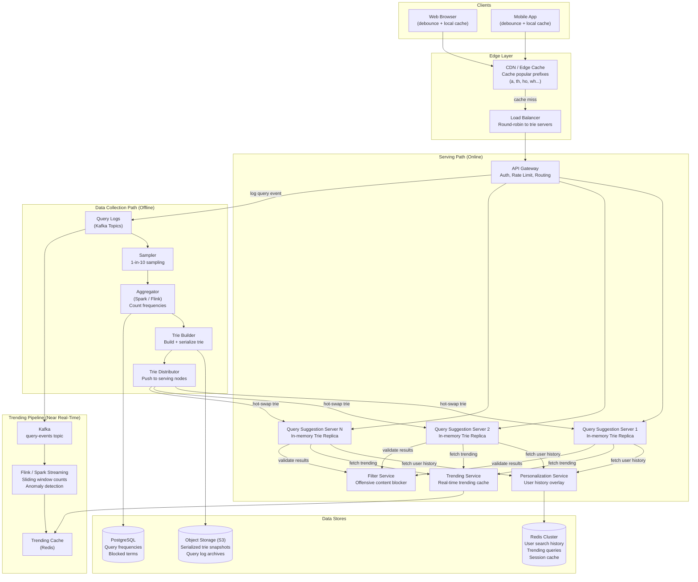
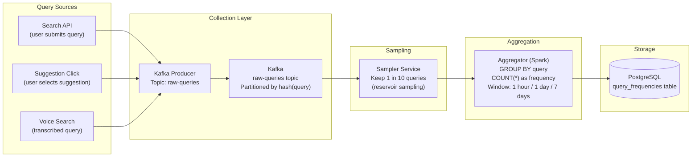
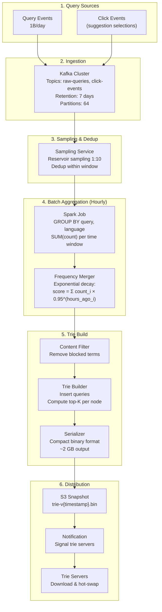
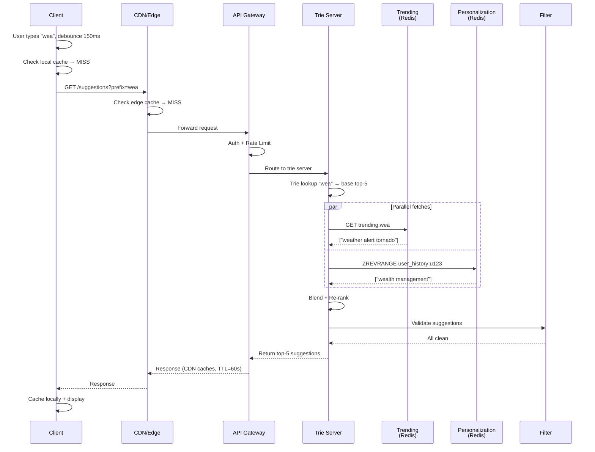
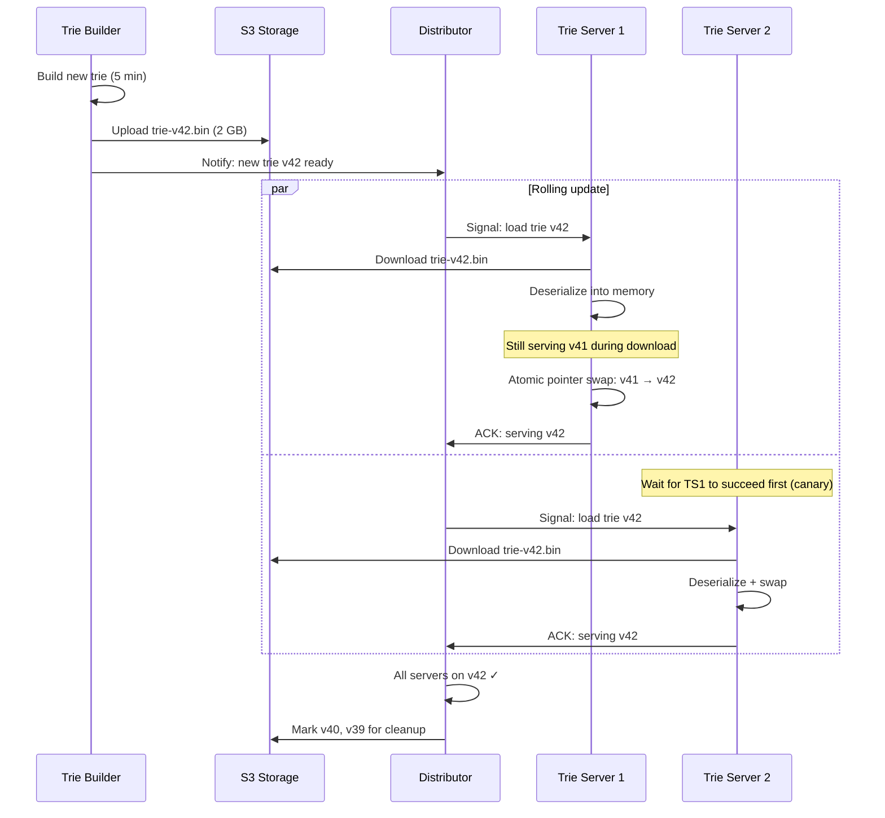

# Design Search Autocomplete / Typeahead System: High-Level Design

## Table of Contents
- [1. Architecture Overview](#1-architecture-overview)
- [2. System Architecture Diagram](#2-system-architecture-diagram)
- [3. The Core Data Structure: The Trie](#3-the-core-data-structure-the-trie)
- [4. Component Deep Dive](#4-component-deep-dive)
- [5. Data Collection Pipeline](#5-data-collection-pipeline)
- [6. Ranking and Scoring](#6-ranking-and-scoring)
- [7. Serving Path: End-to-End Request Flow](#7-serving-path-end-to-end-request-flow)
- [8. Trie Update Strategy: Offline vs Online](#8-trie-update-strategy-offline-vs-online)
- [9. Caching Strategy (Multi-Layer)](#9-caching-strategy-multi-layer)
- [10. Database Design](#10-database-design)

---

## 1. Architecture Overview

The autocomplete system is fundamentally split into two independent pipelines:

1. **Serving Path (online, read-heavy)** -- handles user keystrokes, traverses the trie, returns top-K suggestions in < 10ms
2. **Data Collection Path (offline, write-heavy)** -- collects search queries, aggregates frequencies, rebuilds the trie periodically

This separation is the single most important architectural decision. The serving path
is an in-memory, read-only, replicated trie lookup. The data collection path is a
batch/streaming pipeline that rebuilds the trie every 15 minutes to 1 hour.

**Key architectural decisions:**
1. **In-memory trie** -- the entire suggestion corpus (~2 GB) fits in RAM; no disk I/O on the serving path
2. **Pre-computed top-K at every trie node** -- eliminates expensive traversal at query time; O(1) per prefix
3. **Offline trie rebuild** -- avoids complex concurrent mutation of the trie; swap atomically
4. **Multi-layer caching** -- browser cache, CDN, application cache, trie itself is the final cache
5. **Separate trending pipeline** -- real-time stream processing for trending queries, merged into trie at serving time

---

## 2. System Architecture Diagram



---

## 3. The Core Data Structure: The Trie

The trie (prefix tree) is the beating heart of the autocomplete system. Every
design decision radiates from how we build, store, query, and update this structure.

### 3.1 Basic Trie Structure

A trie stores strings character-by-character, with shared prefixes occupying
the same path. Here is a trie containing: "tree", "try", "true", "toy", "ten", "tennis":

```
                        [root]
                          |
                     ┌────┴────┐
                     t         ...
                     |
              ┌──────┼──────┐
              r      o      e
              |      |      |
          ┌───┼──┐   y$    n$
          e   u   y$       |
          |   |           n
          e$  e$          |
                          i
                          |
                          s$

   $ = end of word (this node is a valid query endpoint)
   
   Words stored: tree, true, try, toy, ten, tennis
   Shared prefix "tr" saves storing 't' and 'r' three times
```

### 3.2 The Key Optimization: Pre-Computed Top-K at Every Node

The naive approach: traverse to the prefix node, then DFS/BFS through all descendants
to find the most popular completions. This is O(number of descendants) -- way too slow
for nodes like "t" which might have millions of descendants.

**The solution: store the top-K suggestions at every node during trie build time.**

```
ASCII diagram: Trie with pre-computed top-5 at each node

                          [root]
                     top5: [the, to, that, this, they]
                          |
                     ┌────┴────────────────────────┐
                     t                              w
              top5: [the, to, that,           top5: [what, why, when,
                     this, they]                     where, who]
                     |
         ┌───────────┼───────────┐
         h           o           r
   top5: [the,    top5: [to,   top5: [tree,
    that, this,    today,       trump, true,
    they, three]   tomorrow,    travel, try]
                   top, tokyo]
         |           |           |
    ┌────┼────┐    ┌─┼──┐    ┌──┼──┐
    e    i    r    d  p  k   e  u   y$
  top5: [the,  top5:  ...  ...  top5:  top5:  top5: [try]
   them,  [this,        [tree,  [true,
   then,   third,        trend,  trump,
   there,  thing,        trek,   trust,
   these]  think]        tres]   truth]
```

**At query time, looking up "tr" is now:**
1. Traverse root -> 't' -> 'r' (two pointer hops)
2. Read pre-computed top-5: ["tree", "trump", "true", "travel", "try"]
3. Return immediately -- O(length of prefix), regardless of how many words start with "tr"

### 3.3 Trie Node Data Structure

```python
class TrieNode:
    """Each node in the trie."""
    
    children: dict[str, 'TrieNode']    # char -> child node (max 26 for lowercase ASCII)
    is_end_of_query: bool               # True if a valid query ends at this node
    top_k_suggestions: list[tuple[str, float]]  # Pre-computed [(query, score), ...] top 5
    
    # Memory per node:
    #   children dict:   ~100-200 bytes (sparse dict with avg 2-3 children)
    #   is_end_of_query: 1 byte
    #   top_k:           5 x (8 byte ref + 8 byte float) = 80 bytes
    #   Total:           ~200-300 bytes per node
    #   50M nodes x 250 bytes = ~12.5 GB  (too much!)
    
    # Optimization: Use a compact array instead of dict, 
    # store suggestion IDs (4 bytes) instead of full strings
```

### 3.4 Optimized Node Structure (Production)

```python
class CompactTrieNode:
    """Production-grade memory-optimized trie node."""
    
    # Children stored as sorted array of (char, offset) pairs
    # Offset points into a flat array of all nodes (cache-friendly)
    children: bytes        # packed: [num_children, char1, offset1, char2, offset2, ...]
    
    is_end: bool           # 1 bit (packed into flags byte)
    
    # Top-K stored as indices into a global suggestion table
    top_k_ids: list[int]   # [suggestion_id_1, ..., suggestion_id_5]
    top_k_scores: list[float]  # corresponding scores
    
    # Memory per node: ~50-80 bytes
    # 50M nodes x 65 bytes = ~3.25 GB  (much better)

class SuggestionTable:
    """Global lookup table: suggestion_id -> query string + metadata."""
    
    suggestions: list[str]  # index = suggestion_id
    # 10M suggestions x 25 bytes avg = 250 MB
```

### 3.5 Why Not Just Use a Hash Map?

```
Approach: HashMap<prefix, List<suggestions>>

For query "weather forecast":
  Store entries for: "w", "we", "wea", "weat", "weath", "weathe", "weather",
                     "weather ", "weather f", "weather fo", ...
  
  That's ~20 entries for ONE query.
  10M queries x 15 prefixes avg = 150M entries
  150M x (15 bytes key + 250 bytes value) = ~40 GB
  
  vs Trie: ~3-4 GB (shared prefixes dramatically reduce duplication)
  
  Hash map is viable for smaller datasets (< 1M queries) but
  the trie wins at scale due to prefix sharing.
```

---

## 4. Component Deep Dive

### 4.1 Query Suggestion Service (Trie Servers)

This is the core serving component. Each instance holds a complete, read-only trie in memory.

```
Architecture of a single trie server:

┌─────────────────────────────────────────────────────┐
│                  Trie Server Instance                │
│                                                     │
│  ┌──────────────┐   ┌──────────────────────────┐   │
│  │ HTTP/gRPC    │   │   In-Memory Trie (2-4 GB) │   │
│  │ Endpoint     │──>│                            │   │
│  │              │   │   Lookup: O(prefix_length) │   │
│  └──────────────┘   │   ~5-10 microseconds       │   │
│         │           └──────────────────────────┘   │
│         │                                           │
│  ┌──────▼──────────────────────────────────────┐   │
│  │ Post-Processing Pipeline                     │   │
│  │                                              │   │
│  │  1. Trie lookup → base top-K suggestions     │   │
│  │  2. Merge trending (from Redis)              │   │
│  │  3. Merge personalized (from Redis)          │   │
│  │  4. Re-rank blended list                     │   │
│  │  5. Filter offensive content                 │   │
│  │  6. Return final top-5                       │   │
│  └──────────────────────────────────────────────┘   │
│                                                     │
│  ┌──────────────┐   ┌──────────────────────────┐   │
│  │ Trie Loader  │   │ Health Check / Metrics    │   │
│  │ (hot swap)   │   │ Prometheus / Datadog      │   │
│  └──────────────┘   └──────────────────────────┘   │
└─────────────────────────────────────────────────────┘
```

**Trie hot-swap process:**
1. Trie Builder produces new serialized trie → writes to S3
2. Trie Distributor sends notification to all trie servers
3. Each server downloads new trie from S3 in background
4. Deserializes into memory (new trie object)
5. Atomically swaps pointer: `current_trie = new_trie`
6. Old trie is garbage collected

No downtime. No requests dropped. Old trie serves requests until swap completes.

### 4.2 Data Collection Service

Collects raw search queries from all search events and feeds them into the aggregation pipeline.



**Why sample (1 in 10)?**
- 1B queries/day is a lot of data to aggregate
- Popular queries ("facebook login") appear millions of times -- we don't need exact counts
- Sampling reduces aggregation cost by 10x with < 2% error for popular queries
- Long-tail queries (< 10 searches/day) naturally get filtered out -- which is fine, we don't want them in suggestions

### 4.3 Trie Builder

The Trie Builder is a batch job that runs every 15 minutes to 1 hour.

```
Trie Build Process:
═══════════════════

Step 1: Read aggregated query frequencies from PostgreSQL
         (10M queries sorted by frequency DESC)

Step 2: For each query, insert into trie character by character
         "weather forecast" → w → e → a → t → h → e → r → ' ' → f → ...

Step 3: At each node, maintain a min-heap of top-5 suggestions
         (suggestion = any query that passes through this node)
         
         Node 'w-e-a': heap contains all queries starting with "wea"
           → "weather" (freq: 50M)
           → "weather forecast" (freq: 8M)
           → "weapons" (freq: 3M)
           → "wealth" (freq: 2M)
           → "wearing" (freq: 1.5M)
         
         The heap ensures we keep only the top-5 by frequency at each node.

Step 4: Apply content filter (remove blocked terms from all top-K lists)

Step 5: Serialize trie to compact binary format
         → Write to S3 as versioned snapshot

Step 6: Notify trie servers to load new version
```

**Trie build time estimation:**

```
10M queries x 25 chars avg = 250M character insertions
Each insertion: O(query_length) = O(25)
Total: ~250M operations

At each node insertion, update top-K heap: O(log K) = O(log 5) ≈ O(1)

On a single machine with 32 GB RAM:
  Build time: 2-5 minutes
  Serialization: 30 seconds
  S3 upload: 30 seconds
  Total: ~5 minutes

This easily fits within a 15-minute rebuild cycle.
```

### 4.4 Ranking Service

The Ranking Service computes the score for each query that determines its position
in the top-K lists.

**Scoring formula:**

```
score(query) = w1 * popularity(query) 
             + w2 * recency(query) 
             + w3 * trending(query) 
             + w4 * personalization(query, user)

Where:
  popularity(query) = log(frequency) / log(max_frequency)
    → Normalized 0-1, log scale prevents "facebook" from dominating everything
  
  recency(query) = decay_factor ^ (hours_since_last_surge)
    → Queries that spiked recently get a boost that decays over time
    → decay_factor = 0.95 (half-life of ~14 hours)
  
  trending(query) = current_rate / baseline_rate
    → If "super bowl" normally gets 1K/hour but now gets 100K/hour → trending score = 100
    → Capped at some maximum to prevent extreme outliers
  
  personalization(query, user) = 1.0 if user searched this before, else 0.0
    → Simple binary signal; can be more sophisticated with user embeddings

Typical weights:
  w1 = 0.5 (popularity is the dominant signal)
  w2 = 0.15
  w3 = 0.20
  w4 = 0.15
```

### 4.5 Personalization Service

Adds a personal layer on top of the global suggestions.

```
How personalization works at serving time:
──────────────────────────────────────────

1. Trie returns global top-5 for prefix "py":
   ["python", "python tutorial", "pyramid scheme", "pyongyang", "pygame"]

2. Personalization Service checks user's recent search history in Redis:
   User has recently searched: "pytorch", "python pandas", "python flask"

3. Blend personal results into global results:
   - "pytorch" matches prefix "py" → inject at position 2
   - "python pandas" matches prefix "py" → inject at position 4
   
4. Re-rank and deduplicate, keeping top 5:
   ["python", "pytorch", "python tutorial", "python pandas", "pygame"]
   
5. This happens AFTER trie lookup, adding ~2-3ms latency

Storage: Redis sorted set per user
  Key: user_history:{user_id}
  Members: query strings
  Scores: timestamp (most recent = highest score)
  TTL: 90 days
  Max entries: 200 per user
```

### 4.6 Content Filter Service

Prevents offensive, explicit, or legally problematic suggestions from being shown.

```
Three-layer filtering:
──────────────────────

Layer 1: Build-time blocklist (applied during trie build)
  - Exact match against ~100K blocked terms
  - Any query containing a blocked term is excluded from the trie entirely
  - Examples: hate speech, explicit sexual content, known illegal terms

Layer 2: Run-time regex filter (applied at serving time)
  - Pattern-based matching for dynamic offensive content
  - Catches terms that combine innocent words into offensive phrases
  - Updated more frequently than the trie (minutes vs hours)

Layer 3: ML classifier (async, for trie build feedback)
  - BERT-based classifier scores each query for toxicity
  - Queries above threshold are added to the blocklist
  - Runs async -- not on the serving path (too slow)
  
Why not ML at serving time?
  - ML inference adds 10-50ms -- unacceptable for autocomplete
  - Pre-filtering at build time is sufficient for known bad content
  - Run-time regex catches new combinations at < 1ms
```

---

## 5. Data Collection Pipeline

### 5.1 End-to-End Pipeline Architecture



### 5.2 Frequency Aggregation with Exponential Decay

```
Why exponential decay?

Raw frequency doesn't capture recency. "covid symptoms" was the #1 query
in 2020 but shouldn't dominate suggestions in 2026.

Formula:
  weighted_frequency(query) = Σ over all time windows:
    count_in_window × decay_factor ^ (windows_ago)

Example with hourly windows and decay = 0.95:

  Query: "super bowl halftime show"
  
  Hour 0 (current):  50,000 searches  × 0.95^0 = 50,000
  Hour 1 (1h ago):   45,000 searches  × 0.95^1 = 42,750
  Hour 2 (2h ago):   40,000 searches  × 0.95^2 = 36,100
  ...
  Hour 24 (1d ago):  5,000 searches   × 0.95^24 = 1,440
  Hour 168 (1w ago): 100 searches     × 0.95^168= 0.02 (effectively 0)
  
  Total weighted frequency: ~170,000
  
  vs. a query like "facebook login":
  Hour 0:  100,000  × 0.95^0 = 100,000
  Hour 1:  100,000  × 0.95^1 = 95,000
  ...
  Hour 168: 100,000 × 0.95^168 = 17
  
  Steady-state total: ~2,000,000
  
  "facebook login" still ranks higher because it's consistently popular.
  "super bowl halftime show" gets a temporary boost during the event.
```

---

## 6. Ranking and Scoring

### 6.1 Multi-Signal Ranking

```
Ranking happens at two points:
──────────────────────────────

A. OFFLINE (during trie build):
   - Compute score for each query using popularity + recency
   - These scores determine the top-K at each trie node
   - This is the "base ranking" -- no personalization, no real-time trending

B. ONLINE (at serving time):
   - Start with base top-K from trie node
   - Boost with trending scores (from Trending Service)
   - Boost with personalization (from Personalization Service)
   - Re-rank the blended list
   - Return final top-5

Why split?
  - Offline ranking handles 10M queries -- expensive computation is fine
  - Online ranking touches only 5-15 candidates -- must be < 5ms
```

### 6.2 Position Bias Correction

```
Problem: Users tend to click the first suggestion regardless of relevance.
This creates a feedback loop where the #1 suggestion gets more clicks → 
gets ranked higher → gets more clicks...

Solution: Use position-adjusted click-through rate (CTR):

  adjusted_ctr(query, position) = raw_clicks / (impressions × position_bias[position])

  Where position_bias = [1.0, 0.6, 0.4, 0.3, 0.2] for positions 0-4

  If "python tutorial" gets 1000 clicks at position 0 with 5000 impressions:
    raw CTR = 1000/5000 = 0.20
    adjusted CTR = 0.20 / 1.0 = 0.20
    
  If "pytorch" gets 400 clicks at position 3 with 5000 impressions:
    raw CTR = 400/5000 = 0.08
    adjusted CTR = 0.08 / 0.3 = 0.27  ← Actually MORE relevant than "python tutorial"!
```

---

## 7. Serving Path: End-to-End Request Flow

### 7.1 Happy Path Walkthrough

```
User types "wea" in Google Search:
═══════════════════════════════════

[Timeline: total < 100ms end-to-end]

CLIENT (0ms):
  │ User presses 'a' (completing "wea")
  │ Debounce timer resets to 150ms
  │ ... 150ms pass with no new keystroke ...
  │ Check local cache for "wea" → MISS
  │ Fire HTTP request: GET /v1/suggestions?prefix=wea&user_id=u123
  │
  ▼
CDN (5ms):
  │ Check edge cache for "wea" → MISS (not popular enough to be cached)
  │ Forward to origin
  │
  ▼
LOAD BALANCER (1ms):
  │ Route to trie server (round-robin)
  │
  ▼
API GATEWAY (2ms):
  │ Validate auth token
  │ Rate limit check (100 requests/sec per user)
  │ Route to Query Suggestion Service
  │
  ▼
TRIE SERVER (3-8ms total):
  │
  ├── Step 1: Trie Lookup (0.005ms = 5 microseconds)
  │   Traverse: root → 'w' → 'e' → 'a'
  │   Read pre-computed top-5:
  │     ["weather", "weather forecast", "weapons", "wealth", "wearing"]
  │
  ├── Step 2: Fetch Trending (1-2ms, async with step 3)
  │   Redis GET trending:wea → ["weather alert tornado"]
  │   (A tornado warning just issued → "weather alert tornado" is spiking)
  │
  ├── Step 3: Fetch Personalization (1-2ms, async with step 2)
  │   Redis ZREVRANGE user_history:u123 → user recently searched "wealth management"
  │
  ├── Step 4: Blend & Re-rank (0.1ms)
  │   Merge trending + personal into base top-5
  │   ["weather", "weather alert tornado", "weather forecast", 
  │    "wealth management", "weapons"]
  │
  └── Step 5: Content Filter (0.05ms)
      Check against blocklist → all clean
      Return final result
  │
  ▼
RESPONSE (travels back through CDN/LB):
  │ CDN caches response for "wea" with TTL=60s
  │ Client caches response in local LRU cache
  │
  ▼
CLIENT RENDERS (< 1ms):
  Display dropdown:
    ┌──────────────────────────────┐
    │ wea                          │
    ├──────────────────────────────┤
    │ 🔍 weather                   │
    │ 🔥 weather alert tornado     │  ← trending badge
    │ 🔍 weather forecast          │
    │ 🕐 wealth management         │  ← from recent history
    │ 🔍 weapons                   │
    └──────────────────────────────┘

Total latency: ~30-70ms end-to-end
  Network (round trip):       20-40ms
  CDN/LB/Gateway overhead:   5-10ms
  Trie server processing:    3-8ms
  Client rendering:          1-2ms
```

### 7.2 Request Flow Diagram



---

## 8. Trie Update Strategy: Offline vs Online

### 8.1 Approach Comparison

```
┌─────────────────────┬───────────────────────┬────────────────────────┐
│                     │ Offline Rebuild        │ Online Incremental     │
├─────────────────────┼───────────────────────┼────────────────────────┤
│ How it works        │ Build new trie from    │ Directly mutate the    │
│                     │ scratch every 15min-1h │ live trie with new     │
│                     │ Atomic swap on servers │ queries as they arrive │
├─────────────────────┼───────────────────────┼────────────────────────┤
│ Freshness           │ 15 min - 1 hour stale │ Near real-time         │
│                     │ (good enough for most  │ (< 1 minute)           │
│                     │  use cases)            │                        │
├─────────────────────┼───────────────────────┼────────────────────────┤
│ Complexity          │ LOW -- trie is         │ HIGH -- need concurrent│
│                     │ immutable after build; │ readers + writers;     │
│                     │ no concurrency issues  │ lock-free data structs │
├─────────────────────┼───────────────────────┼────────────────────────┤
│ Consistency         │ All servers get same   │ Servers may diverge    │
│                     │ trie version (strong)  │ briefly (eventual)     │
├─────────────────────┼───────────────────────┼────────────────────────┤
│ Top-K correctness   │ EXACT -- computed      │ APPROXIMATE -- hard to │
│                     │ over all data at once  │ maintain top-K with    │
│                     │                        │ incremental updates    │
├─────────────────────┼───────────────────────┼────────────────────────┤
│ Resource usage      │ Spike during rebuild   │ Steady, moderate CPU   │
│                     │ (5-10 min of high CPU) │ but complex GC issues  │
├─────────────────────┼───────────────────────┼────────────────────────┤
│ Who uses this       │ Google (primary),      │ Twitter (real-time     │
│                     │ Amazon, most companies │ trends), some hybrid   │
└─────────────────────┴───────────────────────┴────────────────────────┘

RECOMMENDATION: Offline Rebuild with a Trending Overlay

Use offline rebuild (every 15-30 min) for the main trie.
Use a separate real-time trending cache (Redis) for hot queries.
Merge at serving time. This gives you:
  - Simplicity of offline rebuild
  - Real-time responsiveness for trending topics
  - Best of both worlds
```

### 8.2 Offline Rebuild: Hot-Swap Protocol



---

## 9. Caching Strategy (Multi-Layer)

Autocomplete is one of the most cache-friendly systems in existence.
A small number of prefixes (1-2 characters) account for the vast majority of traffic.

### 9.1 Cache Layers

```
Layer 1: BROWSER / APP CACHE (client-side)
──────────────────────────────────────────
  Type: In-memory LRU cache in JavaScript / native app
  Size: 100-200 entries
  TTL: 5-15 minutes
  Hit rate: 30-50%
  Latency: 0ms (no network)
  
  Why effective:
    - Users frequently backspace and retype
    - Multiple searches in a session often share prefixes
    - "wea" → "weat" → (backspace) → "wea" → cache hit!


Layer 2: CDN / EDGE CACHE
──────────────────────────────────────────
  Type: Cloudflare / CloudFront / Fastly edge nodes
  Strategy: Cache responses for short, popular prefixes
  Size: Top 10,000 prefixes (covers 1-3 character prefixes)
  TTL: 60-300 seconds
  Hit rate: 40-60% of requests (power law: short prefixes = most traffic)
  Latency: 5-15ms (edge POP near user)
  
  Cache key: /v1/suggestions?prefix={prefix}&lang={lang}
  (Personalized requests bypass CDN -- they include user_id)
  
  Why effective:
    Prefix "t" is queried by millions of users → same response for all
    Prefix "th" is queried by hundreds of thousands
    These are perfect for CDN caching


Layer 3: APPLICATION CACHE (server-side)
──────────────────────────────────────────
  Type: Redis / Memcached in front of trie servers
  Size: Top 1M prefix-response pairs
  TTL: 5-15 minutes (aligned with trie rebuild)
  Hit rate: 70-80% of requests that reach the server
  Latency: 1-2ms
  
  Why an extra layer if the trie is already in-memory?
    - Avoids trie traversal + trending fetch + personalization fetch
    - Serves the pre-blended, fully-ranked result
    - Only for non-personalized queries (anonymous users)


Layer 4: THE TRIE ITSELF
──────────────────────────────────────────
  Type: In-memory trie with pre-computed top-K
  Size: 2-4 GB
  Latency: 5-10 microseconds (basically free)
  
  This is the "cache of last resort" -- it always has the answer.
  Unlike traditional caches, the trie has 100% hit rate for valid prefixes.
```

### 9.2 Cache Hit Flow

```
Request: GET /suggestions?prefix=th

  Browser cache → MISS
       │
       ▼
  CDN edge cache → HIT! (prefix "th" is very popular)
       │
       └─── Return cached response (5ms total)
       
  ─ ─ ─ ─ ─ ─ ─ ─ ─ ─ ─ ─ ─ ─ ─ ─ ─ ─ ─ ─ ─
  
Request: GET /suggestions?prefix=thermody

  Browser cache → MISS
       │
       ▼
  CDN edge cache → MISS (prefix too long/specific)
       │
       ▼
  Application cache (Redis) → MISS
       │
       ▼
  Trie server → lookup "thermody" → return top-5 (8ms)
       │
       └─── Cache result in Redis + CDN + browser

Overall cache hit rate: ~90-95% of requests never reach the trie server
```

### 9.3 Cache Invalidation

```
Trigger: New trie version deployed

Strategy:
  1. Trie servers hot-swap to new version immediately
  2. Application cache (Redis): FLUSH keys matching current trie version
     - Or: use trie version in cache key, old keys auto-expire via TTL
  3. CDN cache: Short TTL (60-300s) means it self-expires
     - No explicit purge needed for most cases
     - For breaking news: issue CDN purge for affected prefixes
  4. Browser cache: TTL-based expiration
     - Response header: Cache-Control: max-age=300
     - Stale suggestions for ~5 minutes is acceptable

Key insight: Autocomplete is VERY tolerant of stale data.
  Showing yesterday's top suggestions for "wea" is fine.
  The only time freshness matters is trending/breaking news,
  and that's handled by the real-time trending overlay, not the trie cache.
```

---

## 10. Database Design

### 10.1 Data Store Selection

```
┌─────────────────────────┬─────────────────────────────────────────────┐
│ Data                    │ Store                                       │
├─────────────────────────┼─────────────────────────────────────────────┤
│ Serialized trie         │ S3 (versioned snapshots)                    │
│ Query frequencies       │ PostgreSQL (batch reads by trie builder)    │
│ User search history     │ Redis Sorted Set (fast prefix lookup)       │
│ Trending queries        │ Redis (updated by Flink, read by trie srv) │
│ Blocked terms           │ PostgreSQL + Redis (cached for serving)     │
│ Raw query logs          │ Kafka → S3 (archived for analytics)         │
│ Trie in serving path    │ In-memory (2-4 GB per server)               │
│ Click/impression logs   │ Kafka → data warehouse (ClickHouse/BQ)     │
└─────────────────────────┴─────────────────────────────────────────────┘
```

### 10.2 Why No Traditional Database on the Serving Path?

```
The serving path is: client → CDN → trie server → response

There is NO database query on the hot path. This is critical.

Even Redis at 1ms would add unacceptable latency if it were the primary lookup.
The trie is in-process memory -- a pointer traversal, not a network call.

Redis is used only for:
  - Trending overlay (~1ms, can be batched/cached)
  - Personalization lookup (~1ms, can be skipped for anonymous users)
  - Both are fetched in parallel, so they add ~1-2ms total

The main lookup is always the in-memory trie: ~0.005ms
```

---

*Next: [Deep Dive and Scaling](./deep-dive-and-scaling.md) -- Trie optimization, trending queries, personalization, fuzzy matching, multi-language support, sharding, and production trade-offs.*
