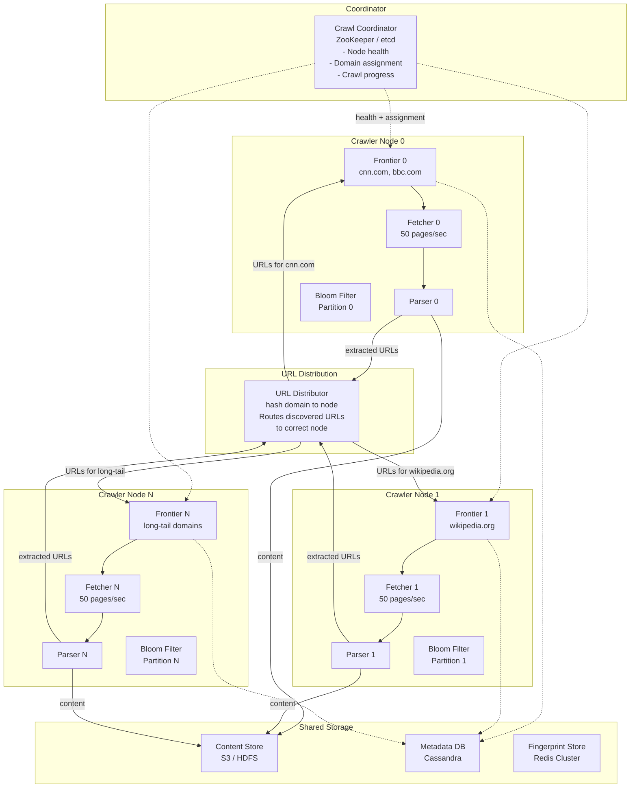
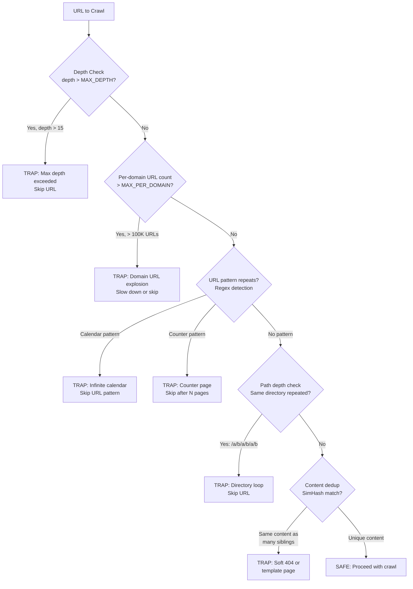
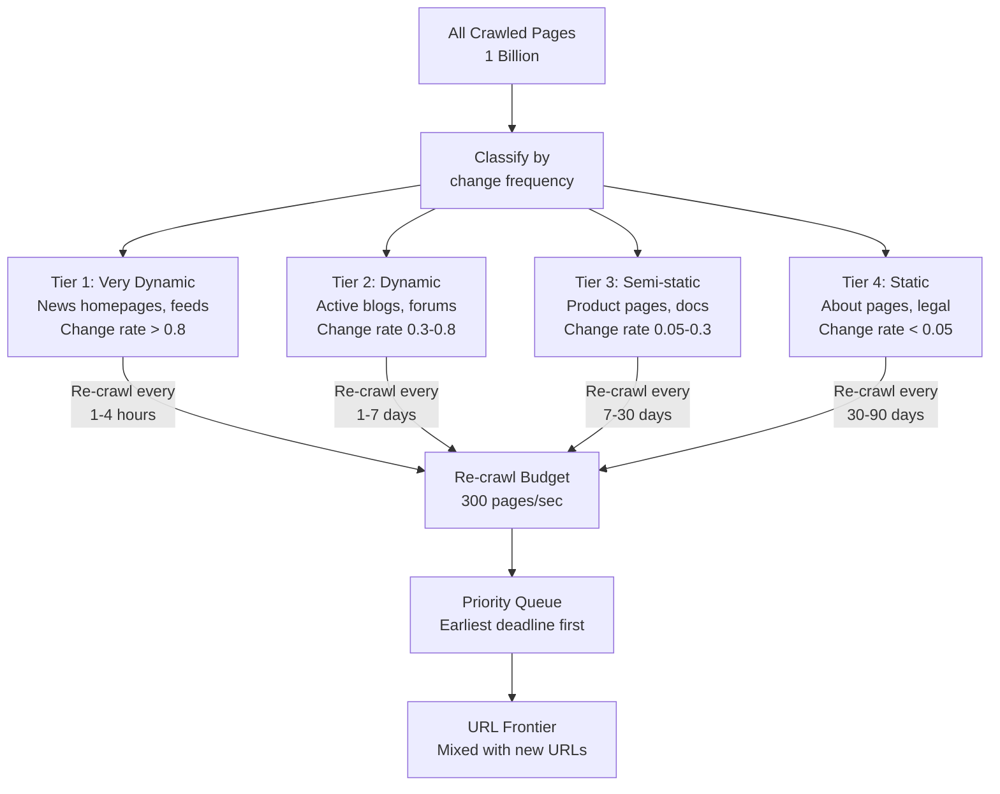
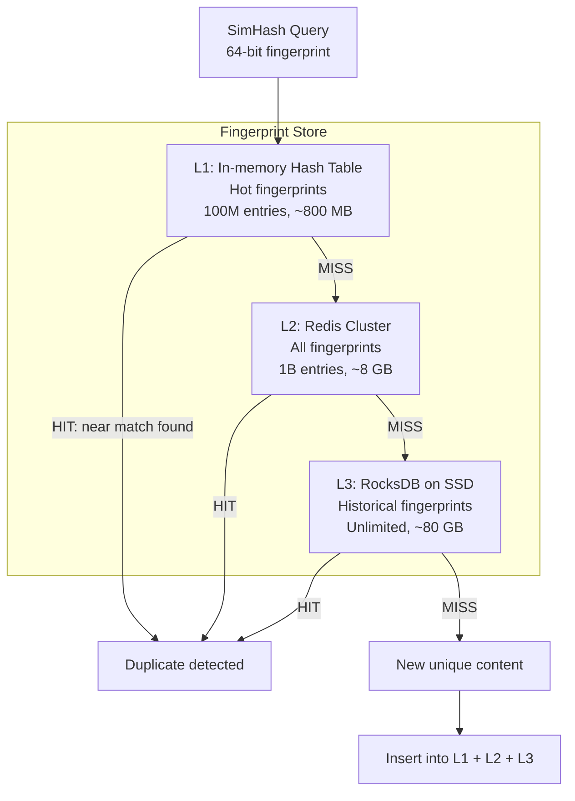
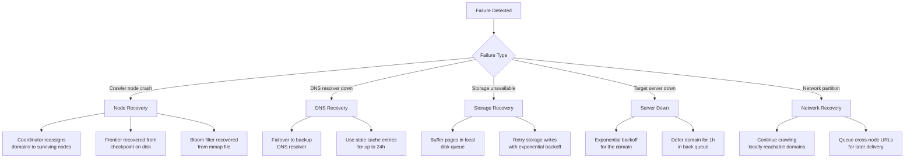
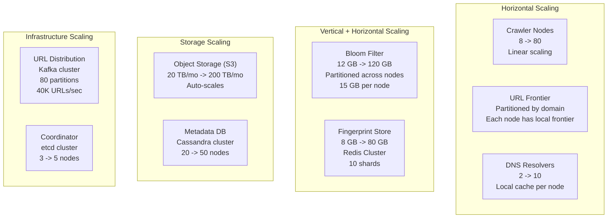

# Design a Web Crawler -- Deep Dive and Scaling

## Table of Contents
- [3.1 Distributed Crawler Architecture](#31-distributed-crawler-architecture)
- [3.2 Spider Trap Detection](#32-spider-trap-detection)
- [3.3 Incremental Re-crawling and Freshness](#33-incremental-re-crawling-and-freshness)
- [3.4 Robots.txt Deep Dive](#34-robotstxt-deep-dive)
- [3.5 Bloom Filter Scaling and Maintenance](#35-bloom-filter-scaling-and-maintenance)
- [3.6 Content Fingerprint Store at Scale](#36-content-fingerprint-store-at-scale)
- [3.7 Failure Handling and Recovery](#37-failure-handling-and-recovery)
- [3.8 Monitoring and Observability](#38-monitoring-and-observability)
- [3.9 Scaling to 10B Pages/Month](#39-scaling-to-10b-pagesmonth)
- [3.10 Comparison -- Our Design vs Production Crawlers](#310-comparison----our-design-vs-production-crawlers)
- [3.11 Trade-off Analysis](#311-trade-off-analysis)
- [3.12 Interview Tips](#312-interview-tips)

---

## 3.1 Distributed Crawler Architecture

### Partitioning Strategy: By Domain

The most natural way to distribute the crawl workload is to **partition by domain**. Each
crawler node is responsible for a set of domains. This has a critical advantage: politeness
enforcement becomes node-local, because all URLs for a domain are handled by the same node.

```
Domain Partitioning:

  hash(domain) % N_nodes = assigned crawler node
  
  Node 0: cnn.com, bbc.com, reuters.com, ...       (news cluster)
  Node 1: wikipedia.org, wikimedia.org, ...          (reference cluster)
  Node 2: github.com, stackoverflow.com, ...         (tech cluster)
  Node 3: amazon.com, ebay.com, shopify stores, ...  (ecommerce cluster)
  ...
  Node 7: small-site-1.com, small-site-2.com, ...   (long-tail)

  Why domain partitioning:
    + Politeness is LOCAL: each node manages its own rate limits
    + DNS cache is LOCAL: each node caches DNS for its domains only
    + robots.txt cache is LOCAL: each node caches rules for its domains
    + No coordination needed between nodes for politeness
    + Stateful connection pooling per domain (keep-alive reuse)

  Drawback:
    - Uneven load: cnn.com has millions of pages, tiny-blog.com has 5
    - Hot domains: high-traffic domains could overload a single node
    - Solution: consistent hashing with virtual nodes for rebalancing
```

### Distributed Architecture Diagram



### Cross-Node URL Routing

When Crawler Node 0 fetches `cnn.com/article` and discovers a link to `wikipedia.org/topic`,
it must route that URL to Node 1 (which owns `wikipedia.org`):

```
Cross-Node URL Flow:

  Node 0 (owns cnn.com):
    1. Fetch cnn.com/article
    2. Parser finds link: wikipedia.org/topic
    3. hash("wikipedia.org") % 8 = 1 (not this node!)
    4. Send URL to inter-node message queue

  URL Distributor:
    5. Route "wikipedia.org/topic" to Node 1

  Node 1 (owns wikipedia.org):
    6. Check local Bloom filter: is this URL new?
    7. If new: add to local frontier
    8. Eventually fetch wikipedia.org/topic

  Implementation options for inter-node routing:
    a. Kafka topic (partitioned by target node): durable, ordered
    b. gRPC direct calls: low latency, but requires retry logic
    c. Redis Pub/Sub: simple, but no durability
    
  RECOMMENDATION: Kafka (durable, handles backpressure, decouples nodes)
```

### Load Balancing Across Nodes

```
Load Imbalance Problem:

  Node 0 assigned: cnn.com (5M pages), bbc.com (3M pages)
  Node 7 assigned: tiny-blog.com (5 pages), personal-site.net (2 pages)
  
  Node 0 is overloaded; Node 7 is idle.

Solutions (applied in order):

  1. Consistent Hashing with Virtual Nodes:
     - Each physical node has 100-200 virtual nodes on the hash ring
     - Domains distribute more evenly across virtual nodes
     - Rebalancing on node add/remove moves ~1/N of domains

  2. Domain Size Awareness:
     - Track number of known URLs per domain
     - Large domains (>100K URLs) get their own virtual node slot
     - Prevents a mega-domain from being co-located with other large domains

  3. Work Stealing:
     - Idle nodes can "steal" domains from overloaded nodes
     - Coordinator detects imbalance (queue depth variance > 3x)
     - Transfers domain assignment + frontier state

  4. Split Large Domains:
     - A domain with >1M URLs can be split across multiple nodes
     - Subdirectory-based splitting: /sports -> Node 0, /tech -> Node 1
     - Requires shared politeness state (use distributed rate limiter)
```

### Distributed Bloom Filter

With 10B URLs and 8 nodes, each node holds a partition of the Bloom filter:

```
Distributed Bloom Filter Options:

  Option A: Partitioned Bloom Filter (RECOMMENDED)
    - Each node holds a FULL Bloom filter for its assigned domains
    - URL dedup is 100% local (no network calls)
    - Duplication across nodes: URLs from Node 0's pages pointing to Node 1's
      domains are checked on Node 1 (after routing)
    - Total memory: 8 nodes x 1.5 GB each = 12 GB (same as centralized)

  Option B: Centralized Bloom Filter (Redis)
    - Single Bloom filter in a Redis instance
    - Every URL check requires a network call (~1 ms)
    - At 20,000 URL checks/sec: manageable
    - Single point of failure (mitigated by Redis replication)
    - Total memory: 12 GB in one Redis instance

  Option C: Replicated Bloom Filter
    - Each node holds a FULL copy of the entire Bloom filter
    - Zero network calls for URL dedup
    - Consistency problem: updates must propagate to all nodes
    - Total memory: 8 nodes x 12 GB = 96 GB (8x overhead)

  Decision Matrix:
  ┌────────────────────┬───────────┬──────────┬───────────┐
  │                    │ Partition │ Central  │ Replicate │
  ├────────────────────┼───────────┼──────────┼───────────┤
  │ Network calls      │ 0         │ 1/check  │ 0         │
  │ Memory total       │ 12 GB     │ 12 GB    │ 96 GB     │
  │ Consistency        │ Perfect   │ Perfect  │ Eventual  │
  │ Fault tolerance    │ 1 node    │ SPOF     │ All nodes │
  │ Complexity         │ Low       │ Medium   │ High      │
  └────────────────────┴───────────┴──────────┴───────────┘
  
  RECOMMENDATION: Option A (Partitioned). Each node checks its own URLs.
  Cross-node URLs are checked after routing to the owning node.
```

---

## 3.2 Spider Trap Detection

### What Are Spider Traps?

Spider traps are website patterns that generate an infinite (or near-infinite) number of
unique URLs, causing the crawler to waste resources on useless pages.

```
Common Spider Traps:

  1. INFINITE CALENDAR:
     /calendar/2026/04/07
     /calendar/2026/04/08
     /calendar/2026/04/09
     ...
     /calendar/9999/12/31
     -> Millions of unique URLs, all with trivial content

  2. SESSION ID URLS:
     /page?sessionid=abc123
     /page?sessionid=def456
     /page?sessionid=ghi789
     -> Same content, infinite unique URLs

  3. PARAMETER COMBINATORICS:
     /search?color=red&size=small&sort=price
     /search?color=red&size=small&sort=name
     /search?color=red&size=medium&sort=price
     -> Exponential combinations: N^M unique URLs

  4. COUNTER PAGES:
     /page/1
     /page/2
     /page/3
     ...
     /page/999999999
     -> Often auto-generated with no real content

  5. SOFT 404 PAGES:
     /nonexistent-page-1 -> "Sorry, page not found"
     /nonexistent-page-2 -> "Sorry, page not found"
     -> Server returns 200 OK (not 404) with identical "not found" content

  6. SYMBOLIC LINK LOOPS (on file-serving sites):
     /dir/subdir/dir/subdir/dir/subdir/...
     -> Circular symbolic links creating infinite path depth
```

### Detection Strategies



### Trap Detection Rules

| Rule | Detection Method | Action |
|------|-----------------|--------|
| **Max crawl depth** | Track depth from seed URL | Skip URLs at depth > 15 |
| **Max URLs per domain** | Counter per domain in frontier | Throttle after 100K URLs, hard stop at 1M |
| **URL path length** | Count characters in URL path | Skip URLs with path > 256 characters |
| **Repeated path components** | Regex: `(/[^/]+)\1{3,}` | Skip if same directory appears 3+ times |
| **Calendar/date pattern** | Regex: `/\d{4}/\d{2}/\d{2}` with future dates | Skip dates beyond current year |
| **Query parameter count** | Count `&` in query string | Skip URLs with > 5 unique parameters |
| **Domain-level content similarity** | Average SimHash distance within domain | Flag domain if >50% pages are near-identical |
| **Response size anomaly** | Unusually tiny pages (< 1 KB HTML) for a domain | Flag potential soft 404s |

### Adaptive Trap Score

```
Trap Score Computation (per domain):

  trap_score(domain) = w1 * url_explosion_rate
                     + w2 * content_similarity_rate
                     + w3 * avg_path_depth
                     + w4 * redirect_loop_rate

  Where:
    url_explosion_rate:     URLs discovered / pages fetched (should be < 100)
    content_similarity_rate: % of pages with SimHash distance < 3 to sibling
    avg_path_depth:         Average URL depth (should be < 5)
    redirect_loop_rate:     % of fetches hitting redirect chains > 5 hops

  Thresholds:
    trap_score < 0.3:  SAFE (crawl normally)
    trap_score 0.3-0.7: SUSPICIOUS (reduce crawl rate, limit depth)
    trap_score > 0.7:  LIKELY TRAP (pause domain, manual review)

  Example:
    Calendar trap domain:
      url_explosion_rate = 500 (500 new URLs per page!)
      content_similarity = 0.9 (90% identical pages)
      avg_path_depth = 8
      trap_score = 0.4 * 1.0 + 0.3 * 0.9 + 0.2 * 0.8 + 0.1 * 0 = 0.83
      -> LIKELY TRAP, pause crawling this domain
```

---

## 3.3 Incremental Re-crawling and Freshness

### The Freshness Problem

After the initial crawl, the crawler must decide **which pages to re-visit and how often**.
Not all pages change at the same rate, and re-crawl budget is limited.

```
Re-crawl Budget Constraint:

  Total crawl capacity:    400 pages/sec
  New page discovery:      ~100 pages/sec (new URLs from frontier)
  Re-crawl budget:         ~300 pages/sec (75% of capacity)
  
  Pages already crawled:   1 billion (growing monthly)
  At 300 pages/sec:        ~26M re-crawls per day
  Average re-crawl cycle:  1B / 26M = ~38 days per page
  
  But 38 days is too slow for news sites!
  Solution: prioritize re-crawls based on change frequency.
```

### Change Frequency Estimation

```
Estimating Page Change Frequency:

  Method 1: Historical Observation
    - Track content fingerprint at each crawl
    - If fingerprint changed: page has been modified
    - Estimate change rate: changes / observations
    
    Example:
      Page crawled 10 times over 30 days
      Fingerprint changed 7 times
      Estimated change rate: 7/10 = 0.7 (changes per crawl)
      Conclusion: re-crawl this page more often

  Method 2: Poisson Process Model
    - Assume changes follow a Poisson process with rate lambda
    - Lambda estimated from observed change/no-change data
    - If page changed between two crawls t days apart:
      lambda >= 1/t (at least one change in t days)
    
  Method 3: HTTP Hints
    - Last-Modified header: compare with previous value
    - Cache-Control max-age: server's suggestion for freshness
    - Sitemap <changefreq>: site's declared change frequency
    - Conditional GET (304 vs 200): direct check without full download
```

### Re-crawl Priority Algorithm



### Re-crawl Schedule

| Tier | Pages | Change Rate | Re-crawl Interval | Daily Re-crawls | % of Budget |
|------|-------|-------------|--------------------|----|---|
| Tier 1 (Very Dynamic) | 10M (1%) | > 0.8 | 2 hours | 120M | 50% |
| Tier 2 (Dynamic) | 50M (5%) | 0.3-0.8 | 3 days | 17M | 15% |
| Tier 3 (Semi-static) | 200M (20%) | 0.05-0.3 | 14 days | 14M | 10% |
| Tier 4 (Static) | 740M (74%) | < 0.05 | 60 days | 12M | 5% |
| **New pages** | -- | -- | -- | ~5M | **20%** |
| **Total** | **1B** | | | **~168M/day** | **100%** |

At 300 re-crawls/sec: 300 x 86,400 = ~26M re-crawls/day. The table above totals 168M/day,
which exceeds budget by 6x. This means we must be **selective** -- not every page gets
re-crawled as often as we would like. The priority queue ensures the highest-value pages
are re-crawled first, and low-priority pages are deferred.

### Freshness-Aware Scheduling

```
Re-crawl Priority Score:

  recrawl_priority(url) = importance(url) * staleness(url) * change_likelihood(url)

  Where:
    importance(url):       PageRank or similar authority (0 to 1)
    staleness(url):        time_since_last_crawl / expected_change_interval
    change_likelihood(url): historical_change_rate (0 to 1)

  Example calculations:
    CNN.com homepage:
      importance = 0.95, staleness = 3h / 2h = 1.5, change_likelihood = 0.95
      score = 0.95 * 1.5 * 0.95 = 1.354  (HIGH -- crawl immediately!)

    Personal blog about page:
      importance = 0.1, staleness = 10d / 60d = 0.17, change_likelihood = 0.02
      score = 0.1 * 0.17 * 0.02 = 0.00034  (LOW -- skip for now)
```

---

## 3.4 Robots.txt Deep Dive

### Edge Cases in robots.txt Handling

```
robots.txt Edge Cases:

  1. MISSING robots.txt (404):
     -> Allow all paths (site has no restrictions)
     -> Cache the "no restrictions" result for 24h

  2. LARGE robots.txt (> 500 KB):
     -> Google truncates at 500 KB
     -> Our crawler: download up to 500 KB, ignore the rest
     -> Treat truncated rules as "allow all" for unmatched paths

  3. UNICODE in robots.txt:
     -> Some sites have UTF-8 paths in Disallow rules
     -> Must handle URL-encoded and raw UTF-8 comparisons
     -> Normalize both the rule and the URL before matching

  4. WILDCARD patterns (non-standard but common):
     Disallow: /search?*sort=
     -> Matches /search?q=foo&sort=date
     -> Must implement glob-style matching (* = any string)

  5. CONFLICTING rules:
     Allow: /public/important
     Disallow: /public/
     -> Longest matching path wins
     -> /public/important is ALLOWED (more specific rule wins)

  6. CRAWL-DELAY with floating point:
     Crawl-delay: 0.5
     -> Wait 500 ms between requests
     -> Some sites use this; must parse as float

  7. SERVER ERROR (5xx):
     -> robots.txt server is down
     -> Conservative: treat as "disallow all" temporarily
     -> Retry every hour until recovered
     -> Do NOT assume "allow all" on server errors
```

### robots.txt Cache Architecture

```
robots.txt Cache Design:

  ┌─────────────────────────────────────────────────────┐
  │                 robots.txt Cache                      │
  │                                                      │
  │  L1: In-memory HashMap (hot domains)                 │
  │  ┌────────────┬──────────────────┬───────────────┐   │
  │  │ Domain     │ Parsed Rules     │ Expiry        │   │
  │  ├────────────┼──────────────────┼───────────────┤   │
  │  │ cnn.com    │ [Allow /*, ...]  │ 2026-04-08    │   │
  │  │ github.com │ [Disallow /a...] │ 2026-04-08    │   │
  │  │ (10K most  │                  │               │   │
  │  │  accessed) │                  │               │   │
  │  └────────────┴──────────────────┴───────────────┘   │
  │                                                      │
  │  L2: RocksDB (all domains)                           │
  │  ┌────────────────────────────────────────────────┐  │
  │  │ 50M domains x ~2 KB parsed rules               │  │
  │  │ Total: ~100 GB on SSD                           │  │
  │  │ Lookup: ~0.1 ms                                 │  │
  │  └────────────────────────────────────────────────┘  │
  │                                                      │
  │  Refresh: background thread re-fetches expired        │
  │  entries at ~50 domains/sec                           │
  │                                                      │
  └─────────────────────────────────────────────────────┘
```

---

## 3.5 Bloom Filter Scaling and Maintenance

### Bloom Filter Growth Problem

A standard Bloom filter has a fixed size. As more URLs are added beyond the design capacity,
the false positive rate increases, causing the crawler to skip more valid URLs.

```
Bloom Filter Saturation:

  Designed for: 10B URLs at 1% FP rate
  After 10B URLs:  FP rate ~1% (as designed)
  After 15B URLs:  FP rate ~5% (degraded)
  After 20B URLs:  FP rate ~15% (severely degraded, skipping 15% of new URLs!)

  Solutions:

  1. SCALABLE BLOOM FILTER (recommended):
     - Chain of Bloom filters, each twice the size of the previous
     - When current filter reaches capacity, create a new one
     - CHECK: query ALL filters in the chain (any "yes" = seen)
     - ADD: insert into the latest (newest) filter only
     
     Filter chain:
       BF-0: 1B capacity (full)
       BF-1: 2B capacity (full)
       BF-2: 4B capacity (current, partially filled)
       
     Total capacity: 7B URLs
     Check cost: 3 filter lookups instead of 1 (still O(1) each)

  2. COUNTING BLOOM FILTER:
     - 4-bit counters instead of 1-bit flags
     - Supports DELETE (decrement counter)
     - 4x more memory (48 GB instead of 12 GB)
     - Useful if URLs need to be "un-seen" (rare for crawlers)

  3. CUCKOO FILTER:
     - Better space efficiency than Bloom for FP rates < 3%
     - Supports deletion
     - ~12 bits per entry vs ~10 bits for Bloom at 1% FP
     - More complex implementation
```

### Bloom Filter Checkpoint and Recovery

```
Bloom Filter Persistence:

  Problem: 12 GB Bloom filter must survive crawler restarts.
  
  Strategy:
    1. Memory-mapped file (mmap):
       - Bloom filter backed by a memory-mapped file on SSD
       - OS handles flushing dirty pages to disk
       - On restart: mmap the file again (instant recovery)
       - Overhead: ~0% (OS handles it transparently)
    
    2. Periodic snapshot (alternative):
       - Serialize Bloom filter to disk every 10 minutes
       - On restart: load last snapshot, accept ~10 min of missed URLs
       - Those URLs will be discovered again and re-added
       
    RECOMMENDATION: mmap for zero-downtime recovery.
```

---

## 3.6 Content Fingerprint Store at Scale

### SimHash Lookup Optimization

Checking if a SimHash fingerprint is "near" any existing fingerprint requires finding all
fingerprints within Hamming distance 3. Naive comparison against 1B fingerprints is too slow.

```
SimHash Near-Duplicate Lookup:

  Naive approach:
    Compare query fingerprint against all 1B stored fingerprints
    1B x 8 bytes comparison = too slow (seconds)

  Optimized approach: BIT SAMPLING / TABLE LOOKUP

    Divide 64-bit fingerprint into 4 blocks of 16 bits each:
    
    Fingerprint: [Block A: 16 bits][Block B: 16 bits][Block C: 16 bits][Block D: 16 bits]
    
    Build 4 lookup tables:
      Table A: maps each 16-bit prefix to list of fingerprints with that prefix
      Table B: maps each 16-bit block B to list of fingerprints
      Table C: maps each 16-bit block C to list of fingerprints
      Table D: maps each 16-bit block D to list of fingerprints
    
    For a query fingerprint, if Hamming distance < 3:
      At least ONE of the 4 blocks must match exactly
      (by pigeonhole principle: 3 bit flips in 4 blocks -> at least 1 block unchanged)
    
    Lookup:
      1. Extract blocks A, B, C, D from query fingerprint
      2. Look up each block in its table
      3. For each candidate, compute full Hamming distance
      4. Return matches with distance < 3
    
    Table sizes:
      Each table has 2^16 = 65,536 buckets
      1B fingerprints / 65,536 = ~15,000 fingerprints per bucket
      Each check: ~60,000 candidate comparisons (4 tables x 15K avg)
      Much better than 1B naive comparisons!
    
    Time complexity: O(N / 2^16) per query instead of O(N)
    At 1B fingerprints: ~60K comparisons instead of 1B
    Duration: < 1 ms per lookup
```

### Fingerprint Store Architecture



---

## 3.7 Failure Handling and Recovery

### Failure Scenarios and Recovery



### Checkpoint and Resume

```
Checkpoint Strategy:

  Component          | Checkpoint Method          | Interval    | Recovery Time
  ─────────────────────────────────────────────────────────────────────────────
  URL Frontier       | Snapshot to RocksDB        | 5 minutes   | < 1 minute
  Bloom Filter       | Memory-mapped file (mmap)  | Continuous  | Instant
  Fingerprint Store  | Redis persistence (RDB)    | 15 minutes  | < 2 minutes
  robots.txt Cache   | RocksDB (already durable)  | Continuous  | Instant
  DNS Cache          | Not checkpointed (rebuild) | N/A         | ~5 min warm-up
  In-flight fetches  | Not recovered (re-schedule)| N/A         | URLs re-queued
  
  Total recovery time from cold restart: < 5 minutes
  Data loss on crash: at most 5 minutes of frontier updates + in-flight fetches
  In-flight fetches (at crash time): ~100 per node -> re-added to frontier
```

---

## 3.8 Monitoring and Observability

### Key Metrics Dashboard

```
┌──────────────────────────────────────────────────────────────────┐
│                    WEB CRAWLER DASHBOARD                          │
├──────────────────────────────────────────────────────────────────┤
│                                                                   │
│  THROUGHPUT                          FRONTIER                     │
│  ┌──────────────────────────┐       ┌──────────────────────────┐ │
│  │ Pages fetched/sec: 412   │       │ Frontier size: 8.2B URLs │ │
│  │ Pages parsed/sec:  445   │       │ Domains active: 42M      │ │
│  │ URLs discovered/sec: 19K │       │ Drain rate: 400/sec      │ │
│  │ New URLs/sec:     3,800  │       │ Fill rate: 3,800/sec     │ │
│  └──────────────────────────┘       └──────────────────────────┘ │
│                                                                   │
│  DEDUP                               ERRORS                      │
│  ┌──────────────────────────┐       ┌──────────────────────────┐ │
│  │ URL dedup hit rate: 80%  │       │ HTTP 4xx rate: 3.2%      │ │
│  │ Content dedup rate: 27%  │       │ HTTP 5xx rate: 1.1%      │ │
│  │ Bloom filter fill: 62%  │       │ Timeout rate: 0.8%       │ │
│  │ FP store size: 820M     │       │ DNS failures: 0.1%       │ │
│  └──────────────────────────┘       └──────────────────────────┘ │
│                                                                   │
│  STORAGE                             POLITENESS                   │
│  ┌──────────────────────────┐       ┌──────────────────────────┐ │
│  │ Pages stored today: 33M  │       │ Domains rate-limited: 12K│ │
│  │ Storage used: 247 TB     │       │ Avg delay/domain: 1.2s   │ │
│  │ Compression ratio: 4.8:1 │       │ robots.txt blocks: 8%    │ │
│  │ WARC files today: 12,400 │       │ 429s received today: 340 │ │
│  └──────────────────────────┘       └──────────────────────────┘ │
│                                                                   │
│  PER-NODE HEALTH                                                  │
│  ┌──────────────────────────────────────────────────────────────┐ │
│  │ Node 0: 52 pg/s  CPU:34%  MEM:68%  NET:4MB/s  HEALTHY      │ │
│  │ Node 1: 48 pg/s  CPU:29%  MEM:61%  NET:3MB/s  HEALTHY      │ │
│  │ Node 2: 51 pg/s  CPU:32%  MEM:65%  NET:5MB/s  HEALTHY      │ │
│  │ Node 3: 49 pg/s  CPU:31%  MEM:63%  NET:4MB/s  HEALTHY      │ │
│  │ Node 4: 50 pg/s  CPU:30%  MEM:64%  NET:4MB/s  HEALTHY      │ │
│  │ Node 5: 47 pg/s  CPU:28%  MEM:60%  NET:3MB/s  HEALTHY      │ │
│  │ Node 6: 53 pg/s  CPU:35%  MEM:67%  NET:5MB/s  HEALTHY      │ │
│  │ Node 7: 51 pg/s  CPU:33%  MEM:66%  NET:4MB/s  HEALTHY      │ │
│  └──────────────────────────────────────────────────────────────┘ │
│                                                                   │
└──────────────────────────────────────────────────────────────────┘
```

### Alerting Rules

| Alert | Condition | Severity | Action |
|-------|-----------|----------|--------|
| Low throughput | < 200 pages/sec for 10 min | Critical | Page on-call, check fetcher health |
| Frontier overflow | > 15B URLs | Warning | Increase dedup aggressiveness |
| High error rate | > 10% fetch failures | Warning | Check network, DNS, target servers |
| Bloom filter saturation | > 90% fill rate | Warning | Scale to next Bloom filter tier |
| Node down | No heartbeat for 60 sec | Critical | Auto-reassign domains, page on-call |
| Storage write failures | > 1% write errors | Critical | Check S3/HDFS connectivity |
| Politeness violations | Any domain crawled > 2 req/sec | Critical | Bug in scheduler, halt and investigate |
| Trap detection | Domain trap_score > 0.7 | Info | Log domain, reduce crawl rate |

---

## 3.9 Scaling to 10B Pages/Month

### Scaling from 1B to 10B Pages/Month

```
Scaling Analysis (10x growth):

  Current (1B/month):
    - 400 pages/sec average
    - 8 crawler nodes
    - 12 GB Bloom filter
    - 20 TB/month storage
    - 8 GB fingerprint store

  Target (10B/month):
    - 4,000 pages/sec average
    - 80 crawler nodes
    - 120 GB Bloom filter (100B URLs seen)
    - 200 TB/month storage
    - 80 GB fingerprint store
```

### Component Scaling Strategy



### Scaling Bottleneck Analysis

| Component | 1B/month | 10B/month | Scaling Strategy | Bottleneck? |
|-----------|----------|-----------|------------------|-------------|
| Crawler nodes | 8 | 80 | Add more nodes | No (linear) |
| Bloom filter | 12 GB | 120 GB | Partition across nodes | No (15 GB/node) |
| Fingerprint store | 8 GB | 80 GB | Redis Cluster (sharded) | No |
| DNS resolution | 100 unique/sec | 1000 unique/sec | More resolvers + bigger cache | Minor |
| Cross-node URL routing | 4K URLs/sec | 40K URLs/sec | Kafka cluster | No (Kafka handles millions/sec) |
| Object storage | 20 TB/month | 200 TB/month | S3 auto-scales | No |
| Metadata DB | 10B rows | 100B rows | Cassandra cluster | Minor (add nodes) |
| **Politeness** | 1 req/sec/domain | 1 req/sec/domain | **Cannot scale** | **Yes -- hard limit** |

The fundamental bottleneck is **politeness**: no matter how many crawler nodes we add,
each domain can only be crawled at ~1 request per second. At 10B pages/month, we need
to crawl more domains in parallel, not crawl each domain faster. This means the long-tail
of smaller domains becomes the scaling opportunity.

---

## 3.10 Comparison -- Our Design vs Production Crawlers

| Aspect | Our Design | Googlebot | Common Crawl | Scrapy (single machine) |
|--------|-----------|-----------|--------------|------------------------|
| Scale | 1B pages/month | 100B+ pages | 3B pages/month | ~100K pages/day |
| Architecture | Distributed (8-16 nodes) | Massive distributed (1000s of nodes) | Large Hadoop cluster | Single process |
| Frontier | Two-level (Mercator) | Two-level + ML priority | HDFS-based queues | In-memory deque |
| URL dedup | Bloom filter | Distributed hash table | Bloom filter | In-memory set |
| Content dedup | SimHash | SimHash + exact hash | MD5/SHA1 | None |
| Politeness | Per-domain rate limit | Per-domain + per-IP | Per-domain | Per-domain |
| DNS | Multi-level cache | Custom DNS infrastructure | Cached | System resolver |
| Storage | S3 (WARC) | Bigtable + Colossus | S3 (WARC) | Local files |
| JavaScript rendering | No (mentioned as extension) | Yes (full Chrome) | No | Splash (optional) |
| Re-crawl strategy | Change-frequency based | ML-predicted freshness | Monthly full re-crawl | Manual |

---

## 3.11 Trade-off Analysis

### Key Design Decisions

```
Decision 1: BFS vs DFS
  ┌─────────────────────────────────────────────────────────┐
  │ Chose BFS (with priority)                                │
  │                                                          │
  │ Pro: Broad coverage, naturally limits depth               │
  │ Pro: High-value pages (shallow) crawled first             │
  │ Pro: Resistant to spider traps                            │
  │ Con: Large frontier (billions of URLs in memory/disk)     │
  │ Con: Deep pages may never be reached                      │
  │                                                          │
  │ Alternative: Limited DFS within a domain after BFS        │
  │ discovery -- fetch depth 1-3 via BFS, then depth 4-6     │
  │ via DFS within high-value domains.                        │
  └─────────────────────────────────────────────────────────┘

Decision 2: SimHash vs MinHash vs Exact Hash
  ┌─────────────────────────────────────────────────────────┐
  │ Chose SimHash                                            │
  │                                                          │
  │ Pro: 8-byte fingerprint (tiny storage: 8 GB for 1B)      │
  │ Pro: Detects near-duplicates (not just exact)             │
  │ Pro: Fast computation and comparison                      │
  │ Con: Misses rearranged content (paragraph order changes)  │
  │ Con: Threshold tuning needed (Hamming distance cutoff)    │
  │                                                          │
  │ Alternative: Use exact hash (MD5/SHA256) for exact dedup  │
  │ PLUS SimHash for near-duplicate detection (two-layer).    │
  └─────────────────────────────────────────────────────────┘

Decision 3: Bloom Filter vs Hash Set for URL Dedup
  ┌─────────────────────────────────────────────────────────┐
  │ Chose Bloom Filter                                       │
  │                                                          │
  │ Pro: 12 GB for 10B URLs (vs 1 TB for a hash set)         │
  │ Pro: O(1) lookup, no disk I/O                             │
  │ Pro: No false negatives (never re-crawl a seen URL)       │
  │ Con: 1% false positives (miss 1% of new URLs)             │
  │ Con: Cannot delete entries (old URLs stay "seen" forever)  │
  │                                                          │
  │ Alternative: Cuckoo filter (supports deletion, similar     │
  │ space), or RocksDB for exact lookup with disk I/O.        │
  └─────────────────────────────────────────────────────────┘

Decision 4: Domain Partitioning vs URL Hash Partitioning
  ┌─────────────────────────────────────────────────────────┐
  │ Chose Domain Partitioning                                │
  │                                                          │
  │ Pro: Politeness is node-local (no distributed rate limit) │
  │ Pro: DNS cache, robots.txt cache are node-local           │
  │ Pro: Connection reuse per domain                          │
  │ Con: Uneven load (some domains are huge)                  │
  │ Con: Single node is SPOF for its assigned domains         │
  │                                                          │
  │ Alternative: URL hash partitioning (even load, but        │
  │ requires distributed politeness -- much more complex).    │
  └─────────────────────────────────────────────────────────┘

Decision 5: Synchronous vs Asynchronous Fetching
  ┌─────────────────────────────────────────────────────────┐
  │ Chose Asynchronous (100 concurrent connections per node) │
  │                                                          │
  │ Pro: Overlap network I/O across many domains              │
  │ Pro: One node achieves 50 pages/sec (vs 2/sec sync)       │
  │ Pro: Efficient use of CPU during network wait             │
  │ Con: More complex error handling                          │
  │ Con: Connection management complexity                     │
  │                                                          │
  │ Key: async is essential for crawlers. Synchronous         │
  │ fetching wastes 98% of time waiting on network.           │
  └─────────────────────────────────────────────────────────┘

Decision 6: Store Raw HTML vs Extracted Text Only
  ┌─────────────────────────────────────────────────────────┐
  │ Chose Both (WARC format with raw + metadata)             │
  │                                                          │
  │ Pro: Raw HTML enables re-parsing with improved algorithms │
  │ Pro: Legal/archival compliance (exact server response)    │
  │ Pro: Downstream consumers can extract what they need      │
  │ Con: 5x more storage than text-only                       │
  │ Con: Higher compression overhead                          │
  │                                                          │
  │ Mitigation: Store compressed (gzip). Tier to cold storage │
  │ (Glacier) after 90 days. Storage is cheap; re-crawling    │
  │ is expensive.                                             │
  └─────────────────────────────────────────────────────────┘
```

### Design Trade-off Summary Table

| Trade-off | Our Choice | What We Gain | What We Lose |
|-----------|-----------|--------------|--------------|
| BFS vs DFS | BFS with priority | Broad coverage, trap resistance | Deep page discovery |
| SimHash vs exact hash | SimHash | Near-duplicate detection, tiny storage | Exact dedup accuracy |
| Bloom vs hash set | Bloom filter | 80x less memory | 1% false positives |
| Domain vs URL partition | Domain partition | Local politeness, simple coordination | Even load distribution |
| Sync vs async fetch | Async (100 concurrent) | 25x throughput per node | Implementation complexity |
| Raw HTML vs text-only | Both (WARC) | Flexibility, compliance | 5x storage |

---

## 3.12 Interview Tips

### The 4-Step Framework for Web Crawler

```
Step 1: CLARIFY SCOPE (2-3 minutes)
  
  Questions to ask the interviewer:
  - "What is the target scale? 1 million, 1 billion, or 100 billion pages?"
  - "Do we need to render JavaScript (SPA pages) or HTML-only crawling?"
  - "Is this for a search engine, or a specialized use case (e.g., price monitoring)?"
  - "Do we need to support incremental re-crawling for freshness?"
  - "Are there specific content types beyond HTML (PDF, images)?"
  
  Why these matter:
  - Scale determines whether you need distributed architecture
  - JS rendering is 10x more expensive (different design)
  - Use case affects prioritization strategy
  - Re-crawling adds significant complexity to the frontier


Step 2: BACK-OF-ENVELOPE (3-5 minutes)
  
  Start from the target:
  - 1B pages/month = ~400 pages/sec
  - Avg page: 100 KB -> 20 KB compressed
  - Storage: 20 TB/month
  - Frontier: 10B URLs (50 links per page, 80% dedup)
  - Bloom filter: ~12 GB (10B URLs, 1% FP)
  - Nodes: 8-16 (50 pages/sec each with async I/O)
  
  Key insight to mention:
  "The bottleneck is NOT hardware -- it is politeness. We deliberately
  limit ourselves to 1 request/sec per domain."


Step 3: HIGH-LEVEL DESIGN (10-15 minutes)
  
  Draw the pipeline:
  1. URL Frontier (two-level: priority + politeness)
  2. DNS Resolver (multi-level cache)
  3. Fetcher (async, concurrent)
  4. HTML Parser (extract links + text)
  5. Content Dedup (SimHash)
  6. URL Dedup (Bloom filter)
  7. Content Store (S3, WARC format)
  
  The key insight: it is a CYCLE.
  Parser -> URL Dedup -> Frontier -> Fetcher -> Parser
  
  Emphasize the two-level frontier:
  "Front queues for priority, back queues for politeness.
  This is the Mercator architecture from 1999 and is still
  the standard approach used by all major crawlers."


Step 4: DEEP DIVE (10-15 minutes)
  
  Let the interviewer guide which area to explore. Common prompts:
  
  "How do you handle duplicates?"
  -> URL dedup: Bloom filter (explain false positive trade-off)
  -> Content dedup: SimHash (explain shingles, fingerprint, Hamming distance)
  
  "How do you handle politeness?"
  -> Back queues: one per domain, min-heap scheduler
  -> robots.txt: cached per domain, 24h refresh
  -> Crawl-delay: respected, adaptive backoff
  
  "How do you handle spider traps?"
  -> Max depth limit (15)
  -> Per-domain URL count limit
  -> Pattern detection (calendar, counter, loops)
  -> Content similarity scoring (soft 404 detection)
  
  "How do you scale this?"
  -> Partition by domain (consistent hashing)
  -> Cross-node URL routing via Kafka
  -> Each node has local frontier, Bloom filter, DNS cache
  -> Fundamental limit: politeness (1 req/sec/domain)
  
  "How do you keep the index fresh?"
  -> Change frequency estimation (Poisson model)
  -> Tiered re-crawl schedule (hours for news, months for static)
  -> Conditional GET (If-Modified-Since) saves bandwidth
  -> 75% of crawl budget allocated to re-crawls
```

### Common Mistakes to Avoid

```
Mistake 1: IGNORING POLITENESS
  "I will just fire 1000 requests per second at each domain!"
  -> This is a denial-of-service attack. Instant red flag.
  -> Always mention robots.txt and per-domain rate limiting.

Mistake 2: USING DFS
  "I will go deep into each site before moving on."
  -> DFS gets trapped in spider traps, hammers single domains.
  -> Always prefer BFS with priority for web crawlers.

Mistake 3: STORING ALL URLS IN MEMORY
  "I will use a HashSet for URL dedup."
  -> 10B URLs x 100 bytes = 1 TB. Does not fit in memory.
  -> Use a Bloom filter (12 GB) or disk-backed structure.

Mistake 4: FORGETTING DNS
  "Each fetch just makes an HTTP request..."
  -> DNS resolution can take 50-200ms per lookup.
  -> Must cache DNS results. This is a known bottleneck.

Mistake 5: NO CONTENT DEDUP
  "If the URL is different, it is a different page."
  -> 25-30% of web pages are duplicates at different URLs.
  -> Always mention SimHash or similar fingerprinting.

Mistake 6: SINGLE-MACHINE DESIGN
  "One server can crawl 1 billion pages per month."
  -> Even at 100 pages/sec (generous), one machine takes 116 days.
  -> Must be distributed for any non-trivial scale.

Mistake 7: NO RE-CRAWL STRATEGY
  "We crawl everything once and we are done."
  -> The web changes constantly. CNN homepage changes every minute.
  -> Must have a freshness strategy with prioritized re-crawling.
```

### What Impresses Interviewers

```
Things that earn strong-hire signals:

  1. Mentioning the Mercator architecture by name
     -> Shows you have studied real crawler systems, not just guessing

  2. Explaining the two-level frontier (priority + politeness)
     -> This is the central design insight of any web crawler

  3. Knowing that politeness is the bottleneck, not hardware
     -> Shows you understand the real-world constraints

  4. Explaining SimHash with Hamming distance
     -> Shows you know practical dedup techniques, not just MD5

  5. Mentioning robots.txt proactively (before the interviewer asks)
     -> Shows ethical awareness and real-world experience

  6. Discussing spider traps and how to detect them
     -> Shows you have thought about adversarial inputs

  7. Calculating the Bloom filter size from first principles
     -> m = -n * ln(p) / (ln(2))^2 -> shows you understand the math

  8. Discussing conditional GET (If-Modified-Since, 304 Not Modified)
     -> Shows you understand HTTP deeply, not just GET 200

  9. Drawing the pipeline as a CYCLE, not a linear flow
     -> The cycle (frontier -> fetch -> parse -> frontier) is the core insight

  10. Acknowledging what you are NOT building
      -> "This is the crawler; the indexer and ranking are separate systems"
      -> Shows maturity in scoping
```

### Quick Reference Card

```
┌──────────────────────────────────────────────────────────────────┐
│              WEB CRAWLER -- QUICK REFERENCE                       │
├──────────────────────────────────────────────────────────────────┤
│                                                                   │
│  SCALE:       1B pages/month, 400 pages/sec                      │
│  NODES:       8-16 crawler nodes, partitioned by domain           │
│  FRONTIER:    Two-level (Mercator): priority + politeness         │
│  URL DEDUP:   Bloom filter, 12 GB, 1% FP, 10B URLs               │
│  CONTENT DEDUP: SimHash, 64-bit fingerprint, Hamming < 3          │
│  DNS:         Multi-level cache, 97% hit rate, pre-fetch          │
│  STORAGE:     S3/HDFS, WARC format, 20 TB/month compressed       │
│  TRAVERSAL:   BFS with priority (not DFS)                         │
│  POLITENESS:  1 req/sec/domain, robots.txt, Crawl-delay           │
│  TRAPS:       Max depth 15, per-domain URL limit, pattern detect  │
│  FRESHNESS:   Change-rate estimation, tiered re-crawl schedule    │
│  BOTTLENECK:  Politeness constraints (not hardware)               │
│  REFERENCE:   Mercator crawler (1999, Compaq/DEC)                 │
│                                                                   │
│  KEY INSIGHT: The crawler is a pipeline that forms a CYCLE.       │
│  Frontier -> Fetch -> Parse -> Dedup -> Frontier                  │
│                                                                   │
└──────────────────────────────────────────────────────────────────┘
```

---

*This document covers the deep-dive topics for the web crawler: distributed architecture
with domain partitioning, spider trap detection, incremental re-crawling with freshness
estimation, Bloom filter scaling, SimHash lookup optimization, failure recovery, monitoring,
scaling analysis, production comparisons, trade-off decisions, and a comprehensive interview
playbook. The governing constraint remains politeness -- the crawler deliberately limits
itself to respect web servers, and this fundamental constraint shapes every design decision.*
