# Design a Web Crawler -- High-Level Design

## Table of Contents
- [2.1 System Architecture Overview](#21-system-architecture-overview)
- [2.2 Core Components](#22-core-components)
- [2.3 URL Frontier -- The Heart of the Crawler](#23-url-frontier----the-heart-of-the-crawler)
- [2.4 DNS Resolver](#24-dns-resolver)
- [2.5 Fetcher (HTTP Downloader)](#25-fetcher-http-downloader)
- [2.6 HTML Parser and Link Extractor](#26-html-parser-and-link-extractor)
- [2.7 Content Deduplication -- SimHash and MinHash](#27-content-deduplication----simhash-and-minhash)
- [2.8 URL Deduplication -- Bloom Filter](#28-url-deduplication----bloom-filter)
- [2.9 Content Store](#29-content-store)
- [2.10 BFS vs DFS Traversal Strategy](#210-bfs-vs-dfs-traversal-strategy)
- [2.11 Crawl Path -- End-to-End Sequence](#211-crawl-path----end-to-end-sequence)
- [2.12 Mercator Crawler Architecture Reference](#212-mercator-crawler-architecture-reference)
- [2.13 Complete Architecture Diagram](#213-complete-architecture-diagram)

---

## 2.1 System Architecture Overview

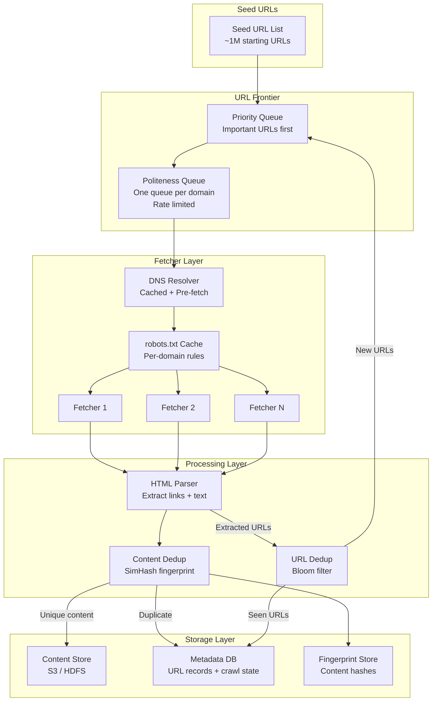

### Architecture Principles

The architecture follows four guiding principles:

1. **Pipeline design**: Each component does one thing well. The URL Frontier feeds the Fetcher,
   which feeds the Parser, which feeds back into the Frontier. This pipeline can be scaled
   independently at each stage.

2. **Politeness as a first-class citizen**: The URL Frontier's politeness queue ensures that no
   matter how many URLs are pending for a domain, we never exceed the allowed request rate.
   This is not an afterthought -- it is built into the core data structure.

3. **Deduplication at two levels**: URL-level dedup (Bloom filter) prevents re-fetching the same
   URL. Content-level dedup (SimHash) prevents processing the same content served at different URLs.
   Together, they save enormous bandwidth and storage.

4. **Separation of crawling and indexing**: The crawler's job is to discover and download pages.
   Indexing, ranking, and serving search results are separate systems that consume the crawler's
   output from the Content Store.

---

## 2.2 Core Components

### Component Responsibility Matrix

| Component | Primary Responsibility | Input | Output |
|-----------|----------------------|-------|--------|
| **URL Frontier** | Scheduling which URL to fetch next | New URLs from parser + seed URLs | Next URL to fetch (respecting priority + politeness) |
| **DNS Resolver** | Resolving domain names to IP addresses | Domain name | IP address (cached) |
| **robots.txt Cache** | Storing and checking robots.txt rules | Domain name | Allow/Disallow decision for a URL path |
| **Fetcher** | Downloading web pages over HTTP/HTTPS | URL + IP address | HTTP response (status, headers, body) |
| **HTML Parser** | Extracting links and content from HTML | Raw HTML | List of extracted URLs + cleaned text |
| **Content Dedup** | Detecting duplicate page content | Page text | Duplicate/unique decision + fingerprint |
| **URL Dedup** | Detecting already-seen URLs | Normalized URL | Seen/new decision |
| **Content Store** | Persisting crawled page data | Page content + metadata | Stored blob (for indexer consumption) |
| **Metadata DB** | Tracking crawl state for every URL | URL + crawl result | Crawl history, last-fetched time, priority |

### Component Interaction Diagram

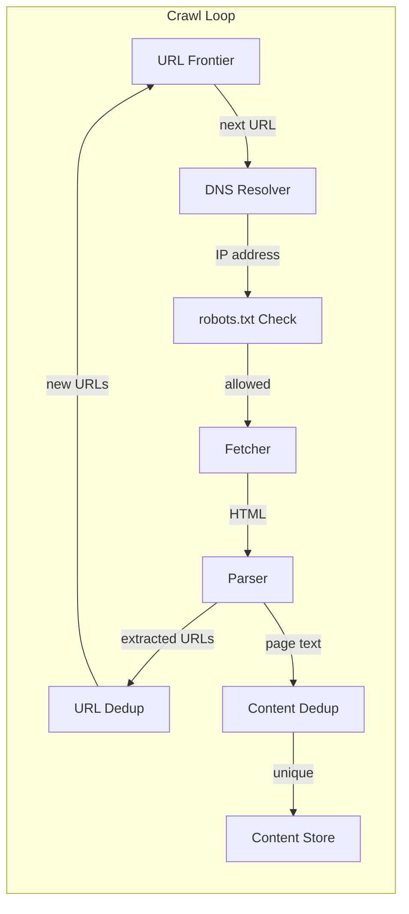

This forms a **cycle** -- the core crawl loop. URLs enter the frontier, are fetched, parsed,
and the discovered URLs feed back into the frontier. The crawler terminates when the frontier
is empty (which, for the open web, effectively never happens) or when a budget is exhausted.

---

## 2.3 URL Frontier -- The Heart of the Crawler

The URL Frontier is the most complex component in the crawler. It must solve two competing
requirements simultaneously:
1. **Priority**: fetch the most important/valuable URLs first
2. **Politeness**: never send too many requests to any single domain

### Two-Level Queue Architecture

The frontier uses a **two-level queue** design, inspired by the Mercator crawler:

```
URL Frontier Architecture (Mercator-style):

  ┌─────────────────────────────────────────────────────────┐
  │                    FRONT QUEUES                          │
  │              (Priority-based selection)                   │
  │                                                          │
  │   Queue F1 (Priority 1 - Highest)                        │
  │   [cnn.com/breaking, bbc.com/news, nytimes.com/...]      │
  │                                                          │
  │   Queue F2 (Priority 2 - High)                           │
  │   [wikipedia.org/Science, github.com/trending, ...]      │
  │                                                          │
  │   Queue F3 (Priority 3 - Medium)                         │
  │   [blog.example.com/post1, docs.python.org/3/, ...]      │
  │                                                          │
  │   Queue F4 (Priority 4 - Low)                            │
  │   [personalsite.com/about, tiny-forum.net/thread, ...]   │
  │                                                          │
  └──────────────┬──────────────────────────────────────────┘
                 │
                 │  URLs flow from front queues
                 │  to back queues based on domain
                 v
  ┌─────────────────────────────────────────────────────────┐
  │                    BACK QUEUES                           │
  │              (Politeness enforcement)                     │
  │                                                          │
  │   Queue B1: cnn.com                                      │
  │   [/politics, /tech, /sports, /opinion]                  │
  │   Rate: 1 req/sec | Last fetch: 14:30:01                 │
  │                                                          │
  │   Queue B2: wikipedia.org                                │
  │   [/Science, /History, /Math, /Art]                      │
  │   Rate: 1 req/sec | Last fetch: 14:30:00                 │
  │                                                          │
  │   Queue B3: example.com                                  │
  │   [/page1, /page2, /about]                               │
  │   Rate: 1 req/2sec | Last fetch: 14:29:59                │
  │                                                          │
  │   Queue BN: ... (one per active domain)                  │
  │                                                          │
  └──────────────┬──────────────────────────────────────────┘
                 │
                 │  Fetcher pulls from back queues
                 │  only when rate limit allows
                 v
            [Fetcher Pool]
```

### Front Queue (Priority) Details

The front queues implement **priority-based scheduling**:

```
Priority Assignment Function:

  priority(url) = w1 * pagerank(domain)
                + w2 * freshness_urgency(url)
                + w3 * link_depth_penalty(depth)
                + w4 * content_type_boost(url)

  Where:
    pagerank(domain):       0.0 to 1.0 (higher = more authoritative domain)
    freshness_urgency(url): 0.0 to 1.0 (higher = page changes frequently)
    link_depth_penalty:     1.0 / (1 + depth) (shallower pages preferred)
    content_type_boost:     1.0 for HTML, 0.3 for PDF, 0.0 for images
    
  Weights (tunable):
    w1 = 0.4 (domain authority matters most)
    w2 = 0.3 (freshness for news/dynamic sites)
    w3 = 0.2 (prefer shallow pages)
    w4 = 0.1 (prefer HTML)
```

Each front queue corresponds to a priority tier. URLs are assigned to the appropriate
queue based on their computed priority score:

| Queue | Priority Range | Typical Content | Selection Probability |
|-------|---------------|-----------------|----------------------|
| F1 | 0.8 - 1.0 | Major news sites, Wikipedia, top-1000 domains | 40% |
| F2 | 0.5 - 0.8 | Popular blogs, e-commerce, government | 30% |
| F3 | 0.2 - 0.5 | Medium-traffic sites, documentation | 20% |
| F4 | 0.0 - 0.2 | Personal sites, niche forums, deep pages | 10% |

The **selection probability** determines how often the frontier picks from each queue.
This ensures high-priority URLs are crawled first, but low-priority URLs are not starved.

### Back Queue (Politeness) Details

Each back queue corresponds to **exactly one domain** (or hostname). The back queue enforces:

```
Politeness Rules per Back Queue:

  1. MINIMUM DELAY between requests to the same domain:
     - Default: 1 second
     - Override from robots.txt Crawl-delay
     - Adaptive: increase delay if server responds slowly (> 2 sec)

  2. HEAP-BASED SCHEDULER:
     - All back queues are in a min-heap, keyed by "earliest_next_fetch_time"
     - The fetcher picks the queue with the smallest next-fetch-time
     - After fetching, next_fetch_time = now() + delay

  3. QUEUE MAPPING:
     - Domain-to-queue mapping stored in a hash map
     - New domain -> create new back queue
     - Empty queue -> remove from heap (lazy cleanup)

  4. QUEUE SIZE LIMIT:
     - Max 10,000 URLs per back queue (prevent one domain from dominating)
     - Excess URLs for a domain are spilled to disk
```

### Frontier Scheduling Algorithm

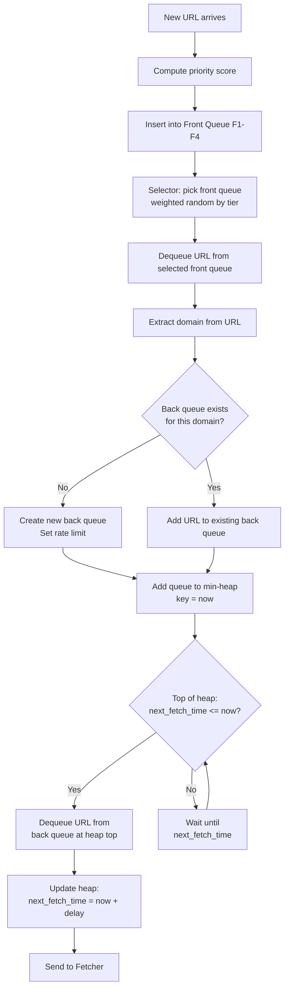

### Frontier Persistence

The frontier must survive crawler restarts:

| Component | Persistence Strategy | Recovery Time |
|-----------|---------------------|---------------|
| Front queues | Periodic snapshot to disk (every 5 min) | < 1 minute |
| Back queues | WAL (write-ahead log) for each enqueue/dequeue | < 30 seconds |
| Heap state | Rebuilt from back queue metadata on restart | < 10 seconds |
| Domain-to-queue map | Stored in embedded key-value store (RocksDB) | Instant |
| Priority scores | Stored in metadata DB | Retrieved on demand |

---

## 2.4 DNS Resolver

DNS resolution is a critical bottleneck for web crawlers. Without caching, every fetch
requires a DNS lookup that takes 10-200ms, which would dominate the crawl latency.

### DNS Architecture

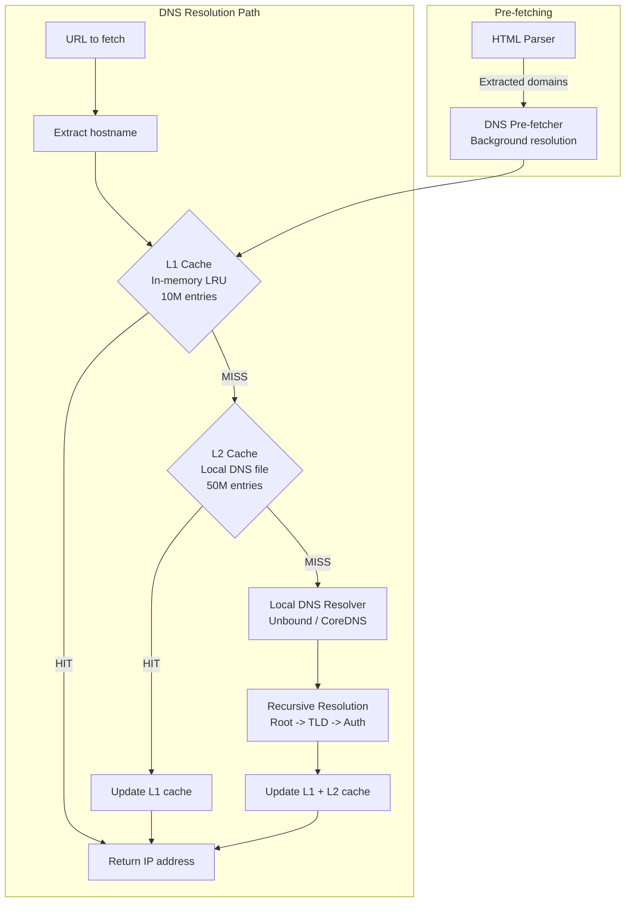

### DNS Caching Strategy

| Cache Level | Storage | Capacity | TTL | Lookup Time | Hit Rate |
|-------------|---------|----------|-----|-------------|----------|
| **L1: In-memory** | HashMap + LRU | 10M entries (~1 GB) | Min(DNS TTL, 1 hour) | < 0.01 ms | ~85% |
| **L2: Local file** | Memory-mapped file | 50M entries (~5 GB) | Min(DNS TTL, 24 hours) | < 1 ms | ~12% |
| **L3: Local resolver** | Unbound with cache | Unlimited | Respects DNS TTL | ~5-50 ms | ~3% |

Combined cache hit rate: ~97%. Only ~3% of lookups require a full recursive DNS resolution.

### DNS Pre-fetching

When the HTML parser extracts links, it also identifies new domains:

```
DNS Pre-fetch Pipeline:

  Parser output: [cnn.com/page1, bbc.com/news, new-site.com/about]
                                                 ^^^^^^^^^^^^^^^^^^
                                                 New domain detected!

  Pre-fetcher:
    1. Check: is "new-site.com" in DNS cache?
    2. If NO: fire async DNS resolution
    3. By the time the URL reaches the fetcher, DNS is already resolved
    
  Benefit: eliminates DNS latency from the critical fetch path
  
  Pre-fetch queue size: up to 10,000 domains ahead of the frontier
  Pre-fetch rate: ~100 DNS queries/sec (background, non-blocking)
```

### DNS Failure Handling

```
DNS Error Handling:

  NXDOMAIN (domain does not exist):
    - Mark all URLs for this domain as "dead"
    - Cache negative result for 24 hours
    - Remove domain's back queue from frontier

  SERVFAIL (DNS server error):
    - Retry 3 times with different DNS servers
    - If all fail: defer domain for 1 hour
    - Cache negative result for 1 hour

  Timeout:
    - Retry with a different DNS resolver
    - If all timeout: defer domain for 30 minutes
    
  Stale cache entry:
    - If DNS cache entry has expired but resolution fails:
      use stale entry for up to 24 hours (stale-while-revalidate)
    - Better to use a slightly-stale IP than block the crawl
```

---

## 2.5 Fetcher (HTTP Downloader)

The Fetcher is responsible for downloading web pages. It must handle high concurrency,
diverse server behaviors, and various failure modes.

### Fetcher Architecture

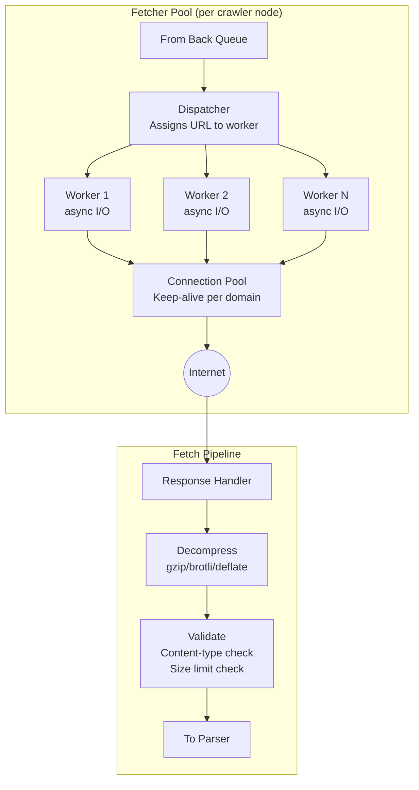

### Fetcher Configuration

```
Fetcher Settings:

  Concurrency:
    - 100 concurrent connections per crawler node
    - Max 1 concurrent connection per domain (politeness)
    - Connection pool: reuse TCP connections (keep-alive)
    - Connection idle timeout: 30 seconds

  Timeouts:
    - DNS resolution:     5 seconds
    - TCP connect:        10 seconds
    - TLS handshake:      10 seconds
    - First byte:         30 seconds
    - Total download:     60 seconds
    - Max page size:      10 MB (truncate if larger)

  HTTP settings:
    - Follow redirects:   up to 10 hops
    - Accept-Encoding:    gzip, deflate, br
    - User-Agent:         "OurCrawlerBot/1.0 (+https://ourcrawler.com/bot)"
    - Accept:             text/html, application/xhtml+xml
    - If-Modified-Since:  set for re-crawls (conditional GET)

  Rate limiting:
    - Enforced by the back queue, not the fetcher
    - Fetcher trusts the frontier's scheduling decisions
```

### Conditional GET for Re-crawls

```
Conditional GET Optimization:

  First crawl:
    GET /page HTTP/1.1
    Host: example.com
    
    Response:
    200 OK
    Last-Modified: Mon, 06 Apr 2026 10:00:00 GMT
    ETag: "abc123"
    Content-Length: 45230

  Re-crawl (conditional):
    GET /page HTTP/1.1
    Host: example.com
    If-Modified-Since: Mon, 06 Apr 2026 10:00:00 GMT
    If-None-Match: "abc123"

    Response (page unchanged):
    304 Not Modified
    (no body -- saves 45 KB of bandwidth!)

    Response (page changed):
    200 OK
    Last-Modified: Tue, 07 Apr 2026 08:15:00 GMT
    ETag: "def456"
    Content-Length: 46100
    (full body follows)

  Savings: for pages that have not changed (~60% of re-crawls),
  conditional GET saves bandwidth and server load.
  At 400 pages/sec with 60% 304s: saves ~24 MB/sec of bandwidth.
```

---

## 2.6 HTML Parser and Link Extractor

### Parser Pipeline

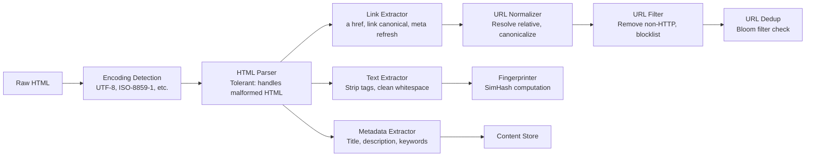

### Link Extraction Rules

```
HTML Elements That Yield URLs:

  Primary (always extract):
    <a href="...">                   Standard hyperlinks
    <link rel="canonical" href="..."> Canonical URL (important for dedup!)
    <meta http-equiv="refresh" content="0;url=...">  Meta redirect

  Secondary (extract if configured):
    <frame src="...">               Frames (legacy sites)
    <iframe src="...">              Inline frames
    <link rel="alternate" href="..."> Alternate language/format versions
    <area href="...">               Image map links

  Discovery hints (not fetched, but noted):
    <link rel="sitemap" href="..."> Sitemap location
    <link rel="next" href="...">    Pagination hint
    <link rel="prev" href="...">    Pagination hint

  Ignored:
    <script src="...">              JavaScript (not crawled unless rendering)
                     Images (separate media pipeline)
    <link rel="stylesheet" href="..."> CSS (not crawled)
```

### URL Normalization Pipeline

```
URL Normalization Steps (applied in order):

  Input:  "HTTP://WWW.Example.COM:80/path/../page?b=2&a=1#section"
  
  Step 1: Lowercase scheme         -> "http://WWW.Example.COM:80/path/../page?b=2&a=1#section"
  Step 2: Lowercase host           -> "http://www.example.com:80/path/../page?b=2&a=1#section"
  Step 3: Remove default port      -> "http://www.example.com/path/../page?b=2&a=1#section"
  Step 4: Resolve path (.. and .)  -> "http://www.example.com/page?b=2&a=1#section"
  Step 5: Remove fragment          -> "http://www.example.com/page?b=2&a=1"
  Step 6: Sort query parameters    -> "http://www.example.com/page?a=1&b=2"
  Step 7: Remove tracking params   -> "http://www.example.com/page?a=1&b=2"
           (utm_source, utm_medium, fbclid, etc.)
  Step 8: Decode unreserved chars  -> (no change in this example)
  Step 9: Remove trailing slash    -> (no change, path has no trailing slash)
  
  Output: "http://www.example.com/page?a=1&b=2"
```

### Handling Malformed HTML

Real-world HTML is often broken. The parser must be tolerant:

```
Common HTML Problems and Solutions:

  1. Unclosed tags:
     <p>Hello <p>World        -> parser auto-closes <p>

  2. Missing quotes on attributes:
     <a href=page.html>       -> extract "page.html" (lenient parsing)

  3. Mixed encodings:
     UTF-8 header but ISO-8859-1 body -> detect via BOM or meta charset,
     fall back to character frequency analysis

  4. Relative URLs without base:
     href="page.html" on http://example.com/dir/current.html
     -> resolved to http://example.com/dir/page.html

  5. JavaScript-generated links:
     <a onclick="location='page.html'"> -> NOT extracted (no JS rendering)
     This is a known limitation of non-rendering crawlers.

  6. Encoded URLs:
     href="page%20name.html"  -> decoded to "page name.html" then re-encoded
     
  Parser choice: Use a lenient parser like jsoup (Java), BeautifulSoup (Python),
  or lxml (Python/C). These handle 99%+ of real-world malformed HTML.
```

---

## 2.7 Content Deduplication -- SimHash and MinHash

### Why Content Dedup Matters

```
Content Dedup Motivation:

  Without content dedup, the crawler wastes resources on duplicate pages:
  
  - Mirror sites: http://example.com and http://www.example.com
  - Session URLs: /page?sessionid=abc and /page?sessionid=xyz
  - Soft 404s: /nonexistent1 and /nonexistent2 both return "Page Not Found"
  - Syndicated content: same article on 50 news aggregator sites
  - Printer-friendly pages: /article and /article?print=true
  
  Empirically, 25-30% of web pages are duplicates or near-duplicates.
  At 1B pages/month, that is 250-300M wasted fetches without content dedup.
```

### SimHash Algorithm

SimHash produces a 64-bit fingerprint that preserves content similarity:
pages with similar content produce fingerprints with small Hamming distance.

```
SimHash Algorithm (step by step):

  Input: "the quick brown fox jumps over the lazy dog"
  
  Step 1: Tokenize into shingles (3-word sliding window):
    ["the quick brown", "quick brown fox", "brown fox jumps",
     "fox jumps over", "jumps over the", "over the lazy",
     "the lazy dog"]
  
  Step 2: Hash each shingle to a 64-bit value:
    h("the quick brown") = 0b1011001...  (64 bits)
    h("quick brown fox") = 0b0110110...  (64 bits)
    ...
  
  Step 3: Build a 64-dimensional vector V, initialized to all zeros.
    For each shingle hash:
      For each bit position i (0 to 63):
        If bit i is 1: V[i] += 1
        If bit i is 0: V[i] -= 1
  
  Step 4: Produce final fingerprint:
    For each position i:
      If V[i] > 0: fingerprint bit i = 1
      If V[i] <= 0: fingerprint bit i = 0
  
  Output: 64-bit SimHash fingerprint
  
  Comparison:
    Two pages are "near-duplicate" if Hamming distance < 3
    Hamming distance = number of bit positions where fingerprints differ
    
    Page A fingerprint: 1011001010110100...  (64 bits)
    Page B fingerprint: 1011001010110110...  (64 bits)
                                      ^
                                      1 bit different -> Hamming distance = 1
                                      -> NEAR DUPLICATE
```

### MinHash Algorithm (Alternative)

MinHash estimates Jaccard similarity between document shingle sets:

```
MinHash Algorithm:

  Step 1: Create shingle sets for each document
    Doc A shingles: {s1, s2, s3, s4, s5}
    Doc B shingles: {s1, s2, s3, s6, s7}

  Step 2: Apply N hash functions (N = 128 typically)
    For each hash function h_i:
      minhash_A[i] = min(h_i(s) for s in Doc A shingles)
      minhash_B[i] = min(h_i(s) for s in Doc B shingles)

  Step 3: Estimate Jaccard similarity:
    J(A,B) = (number of positions where minhash_A[i] == minhash_B[i]) / N
    
    Example: 80 out of 128 positions match -> J = 80/128 = 0.625
    Threshold: J > 0.8 means near-duplicate

  MinHash signature: 128 x 4 bytes = 512 bytes per document
  (vs 8 bytes for SimHash)
```

### SimHash vs MinHash Comparison

| Aspect | SimHash | MinHash |
|--------|---------|---------|
| Fingerprint size | 8 bytes (64-bit) | 512 bytes (128 x 32-bit) |
| Similarity metric | Hamming distance | Jaccard similarity |
| Near-duplicate threshold | Hamming < 3 | Jaccard > 0.8 |
| Computation cost | O(shingles) | O(shingles x num_hashes) |
| Storage for 1B pages | 8 GB | 512 GB |
| Lookup speed | O(1) with hash table | O(N) bands for LSH |
| Best for | Exact and near-duplicate | Partial overlap detection |
| **Recommendation** | **Use SimHash for crawlers** | Use for plagiarism detection |

### Content Dedup Flow

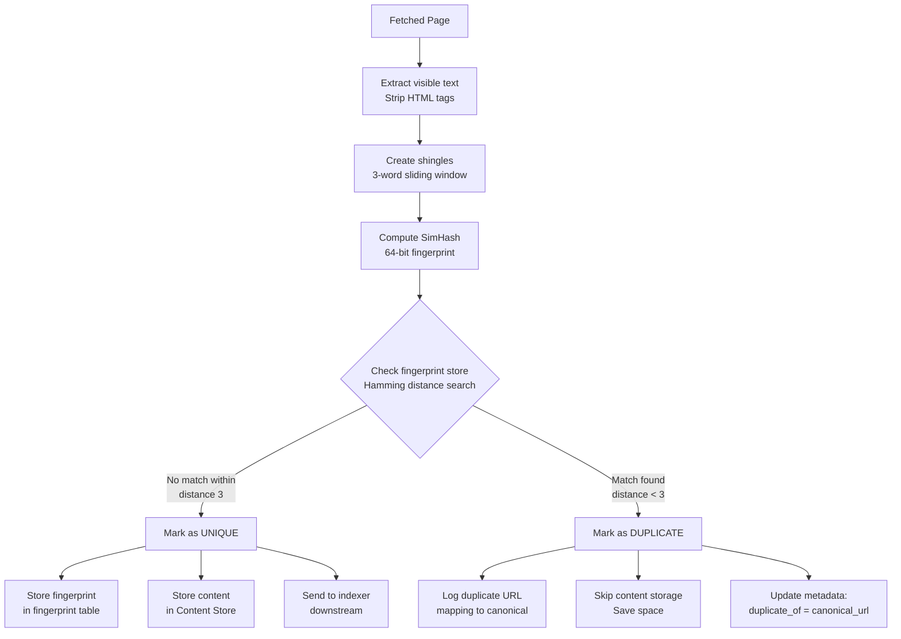

---

## 2.8 URL Deduplication -- Bloom Filter

### Why Bloom Filters for URL Dedup

The crawler discovers ~20,000 new URLs per second. Most of these have already been seen.
Checking every URL against a database of 10 billion seen URLs would be too slow. A Bloom
filter provides O(1) probabilistic lookup with a tiny memory footprint.

### Bloom Filter Mechanics

```
Bloom Filter for URL Dedup:

  Parameters:
    n = 10,000,000,000  (10B expected URLs)
    p = 0.01            (1% false positive rate)
    m = -n * ln(p) / (ln(2))^2 = ~96 billion bits = ~12 GB
    k = (m/n) * ln(2) = ~7 hash functions

  Operations:
  
  ADD("http://example.com/page"):
    h1("http://example.com/page") = bit position 42,391
    h2("http://example.com/page") = bit position 7,892,103
    h3("http://example.com/page") = bit position 3,412,987,654
    ... (7 hash functions total)
    Set all 7 bit positions to 1
  
  CHECK("http://example.com/page"):
    Compute same 7 hash positions
    If ALL 7 bits are 1: "probably seen" (1% false positive chance)
    If ANY bit is 0: "definitely NOT seen"
    
  False positive consequence:
    A URL we have NOT crawled might be flagged as "already seen"
    -> we miss crawling it (acceptable at 1% rate)
    -> We will never MISS a URL we HAVE crawled (no false negatives)

  Memory layout:
    ┌──────────────────────────────────────────────────┐
    │ Bit array: 96,000,000,000 bits = 12 GB           │
    │ [0|1|0|1|1|0|0|1|1|0|1|0|0|1|0|1|0|0|1|1|...]  │
    │                                                    │
    │ Hash functions: MurmurHash3 with 7 different seeds │
    │ h1(url), h2(url), ..., h7(url)                     │
    └──────────────────────────────────────────────────┘
```

### Bloom Filter Sizing Table

| Expected URLs | FP Rate | Bits Required | Memory | Hash Functions |
|---------------|---------|---------------|--------|----------------|
| 1 billion | 1% | 9.6B bits | 1.2 GB | 7 |
| 5 billion | 1% | 48B bits | 6 GB | 7 |
| 10 billion | 1% | 96B bits | 12 GB | 7 |
| 10 billion | 0.1% | 144B bits | 18 GB | 10 |
| 10 billion | 0.01% | 192B bits | 24 GB | 13 |

For 10B URLs with 1% FP: **12 GB fits in memory on a single machine**.

### URL Dedup Flow

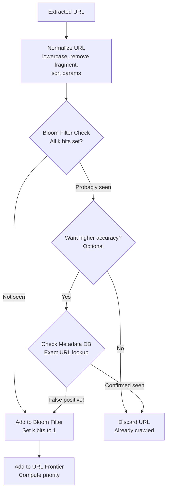

---

## 2.9 Content Store

### Storage Architecture

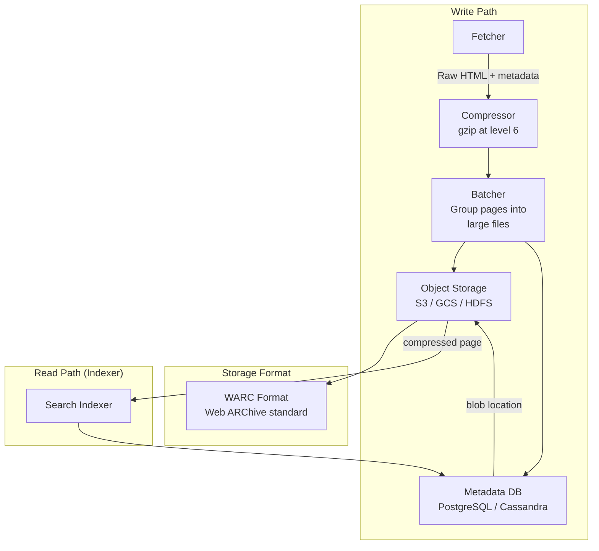

### WARC File Format

The crawler stores pages in **WARC (Web ARChive)** format, the industry standard used by
the Internet Archive, Common Crawl, and most large-scale crawlers:

```
WARC File Structure:

  WARC/1.0
  WARC-Type: response
  WARC-Date: 2026-04-07T14:30:00Z
  WARC-Target-URI: https://example.com/page
  WARC-Record-ID: <urn:uuid:12345-abcde-67890>
  Content-Type: application/http; msgtype=response
  Content-Length: 45730
  WARC-Payload-Digest: sha256:a3f2b8c1...
  
  HTTP/1.1 200 OK
  Content-Type: text/html; charset=utf-8
  Content-Length: 45230
  
  <html>
  <head><title>Example Page</title></head>
  <body>...</body>
  </html>

  ─────────────── (next record) ───────────────
  WARC/1.0
  WARC-Type: response
  WARC-Date: 2026-04-07T14:30:01Z
  WARC-Target-URI: https://other-site.com/article
  ...
```

Benefits of WARC:
- Industry standard (interoperable with other tools)
- Bundles HTTP response + metadata in one record
- Multiple records per file (efficient for storage)
- Supports compression per-file (WARC.gz)
- Preserves exact server response (for legal/archival compliance)

### Storage Tiering

| Tier | Age | Storage | Cost | Access Speed |
|------|-----|---------|------|--------------|
| **Hot** | Last 7 days | SSD-backed object storage | $$$ | < 50 ms |
| **Warm** | 7-90 days | Standard object storage (S3) | $$ | < 200 ms |
| **Cold** | 90+ days | Archive storage (S3 Glacier) | $ | Minutes to hours |

---

## 2.10 BFS vs DFS Traversal Strategy

### Why BFS is Preferred

```
BFS vs DFS for Web Crawling:

  BFS (Breadth-First Search):
    Explore all links on the current page before going deeper.
    
    Level 0: [seed1.com]
    Level 1: [seed1.com/a, seed1.com/b, seed1.com/c]
    Level 2: [seed1.com/a/1, seed1.com/a/2, seed1.com/b/1, ...]
    
    Advantages:
      + Discovers diverse content early (many domains, shallow pages)
      + Shallow pages tend to be more important (homepage > sub-sub-page)
      + Naturally limits depth (prevents spider traps)
      + Better for building a broad index quickly
      + Pages at depth 1-3 cover ~80% of valuable content
    
    Disadvantages:
      - Large frontier (stores all URLs at current depth)
      - May miss deep content (long-tail pages)

  DFS (Depth-First Search):
    Follow one chain of links as deep as possible before backtracking.
    
    seed1.com -> seed1.com/a -> seed1.com/a/1 -> seed1.com/a/1/x -> ...
    
    Advantages:
      + Small frontier (only one path in memory)
      + Discovers deep content on a site
    
    Disadvantages:
      - Gets stuck on single domains for long periods
      - Spider traps can send DFS into infinite depth
      - Poor breadth: ignores other domains while going deep
      - Violates politeness (hammering one domain)

  RECOMMENDATION: BFS with priority is the standard for web crawlers.
  The URL Frontier's priority queue achieves "best-first" BFS.
```

### Traversal Depth Analysis

```
Web Page Value by Depth:

  Depth 0 (Seed):     Homepage           -> PageRank ~0.9
  Depth 1 (Direct):   Main sections      -> PageRank ~0.7
  Depth 2:            Articles/Products   -> PageRank ~0.5
  Depth 3:            Subpages            -> PageRank ~0.3
  Depth 4:            Deep content        -> PageRank ~0.15
  Depth 5+:           Very deep / traps   -> PageRank ~0.05
  
  Observation: 80% of "useful" pages are at depth 0-3.
  The crawler should spend most of its budget on shallow pages.
  
  Max depth limit: 15 (configurable)
  Beyond depth 15: almost certainly a spider trap or low-value content.
```

### BFS with Priority Visualization

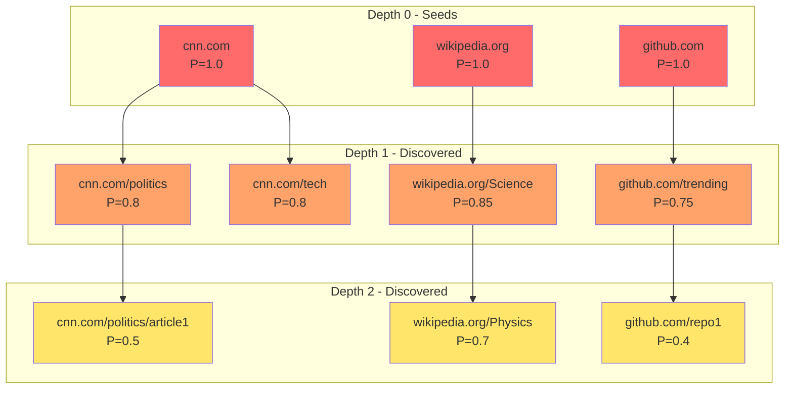

The priority queue ensures that `wikipedia.org/Physics` (P=0.7, depth 2) is fetched
before `github.com/repo1` (P=0.4, depth 2) even though they are at the same depth.

---

## 2.11 Crawl Path -- End-to-End Sequence

### Complete Crawl Loop Sequence

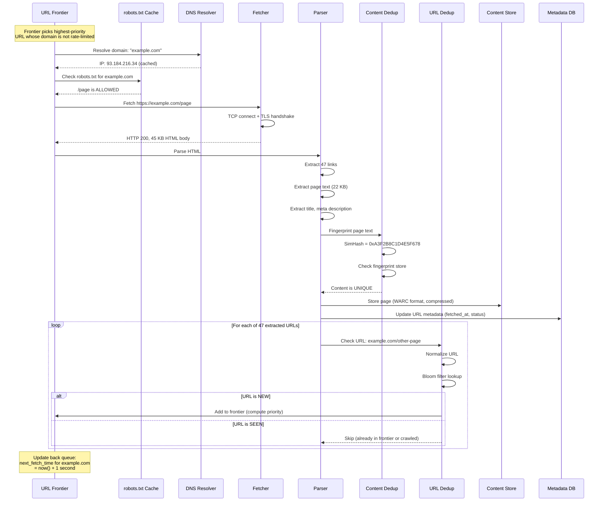

### Crawl Loop Timing

```
Single Page Crawl Timing (average):

  Frontier scheduling:      ~1 ms    (priority queue + heap operations)
  DNS resolution:           ~5 ms    (cached; 50 ms on miss)
  robots.txt check:         ~0.1 ms  (in-memory cache)
  HTTP fetch:               ~500 ms  (connect + download)
  HTML parsing:             ~5 ms    (extract links and text)
  Content fingerprinting:   ~2 ms    (SimHash computation)
  Content dedup check:      ~1 ms    (fingerprint store lookup)
  URL dedup (47 URLs):      ~0.5 ms  (47 Bloom filter lookups)
  Content store write:      ~10 ms   (async, non-blocking)
  Metadata DB update:       ~5 ms    (async, batched)
  ────────────────────────────────────
  Total:                    ~530 ms  (dominated by HTTP fetch)
  
  With 100 concurrent fetches per node: 100 / 0.53 = ~190 pages/sec
  But politeness limits us to ~50 pages/sec per node.
  8 nodes x 50 = 400 pages/sec (matches our target).
```

---

## 2.12 Mercator Crawler Architecture Reference

The Mercator crawler, developed at Compaq/DEC in 1999, established the foundational
architecture that modern web crawlers still follow. Our design is directly inspired by Mercator.

### Mercator's Key Innovations

```
Mercator Architecture (1999):

  1. TWO-LEVEL FRONTIER (front queues + back queues):
     - Front queues: priority-based (important URLs first)
     - Back queues: politeness-based (one queue per host)
     - This two-level design is now the industry standard
     
  2. HOST SPLITTER:
     - Routes URLs to the appropriate back queue by hostname
     - Ensures all URLs for a domain go to the same queue
     - Enables per-host rate limiting
     
  3. CONTENT-SEEN TEST:
     - Document fingerprinting to detect duplicates
     - Stores fingerprints in a persistent data structure
     - Avoids re-processing identical content at different URLs
     
  4. URL-SEEN TEST:
     - Large hash table of all URLs ever seen
     - Prevents the frontier from growing without bound
     - Originally used Berkeley DB; modern version uses Bloom filter
     
  5. DNS RESOLVER:
     - Local caching DNS resolver
     - Pre-fetches DNS for URLs near the front of the queue
     - Reduces DNS latency from the critical path
```

### Our Design vs Mercator Comparison

| Aspect | Mercator (1999) | Our Design (2026) |
|--------|----------------|-------------------|
| Front queues | Fixed number of priority queues | Same (4-8 priority tiers) |
| Back queues | One per host, bounded | Same, with adaptive rate limiting |
| URL-seen test | Berkeley DB on disk | Bloom filter in memory (12 GB) |
| Content-seen test | MD5 fingerprint | SimHash (near-duplicate detection) |
| DNS resolver | Custom caching resolver | Multi-level cache + pre-fetch |
| Storage | Local disk | Distributed object storage (S3) |
| Scale | Single machine | Distributed across 8-16 nodes |
| Throughput | ~100 pages/sec | ~400 pages/sec |
| Politeness | Per-host delay | Per-host delay + adaptive + robots.txt |

---

## 2.13 Complete Architecture Diagram

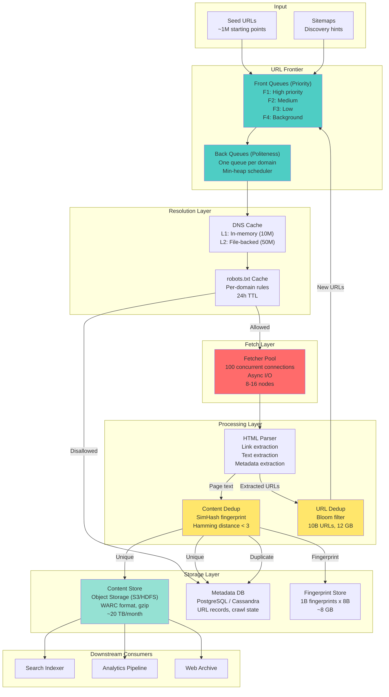

### Data Flow Summary

```
End-to-End Data Flow:

  Seed URLs (1M)
    |
    v
  URL Frontier (priority + politeness scheduling)
    |
    v
  DNS Resolution (97% cache hit rate)
    |
    v
  robots.txt Check (24h cached rules)
    |
    +--> Disallowed: skip, log
    |
    v
  HTTP Fetch (400 pages/sec across cluster)
    |
    v
  HTML Parse (extract links + text + metadata)
    |
    +---> Extracted URLs (20,000/sec)
    |       |
    |       v
    |     URL Normalize
    |       |
    |       v
    |     Bloom Filter (80% already seen)
    |       |
    |       v
    |     New URLs (4,000/sec) --> back to Frontier
    |
    +---> Page Text
            |
            v
          SimHash Fingerprint
            |
            +--> Duplicate (25-30%): skip storage
            |
            v
          WARC Compress + Store (280 unique pages/sec)
            |
            v
          Downstream: Indexer, Analytics, Archive
```

---

*This document defines the high-level architecture for the web crawler: a pipeline of
URL Frontier (two-level priority + politeness queues), DNS resolver (multi-level cache),
Fetcher (async, concurrent), Parser (link + text extraction), Content Dedup (SimHash),
URL Dedup (Bloom filter), and Content Store (WARC on S3). The design follows the Mercator
architecture pattern and achieves 400 pages/sec with strict politeness enforcement.*
