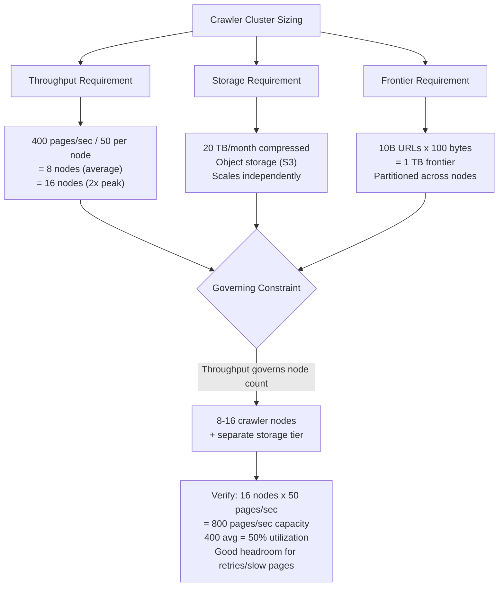
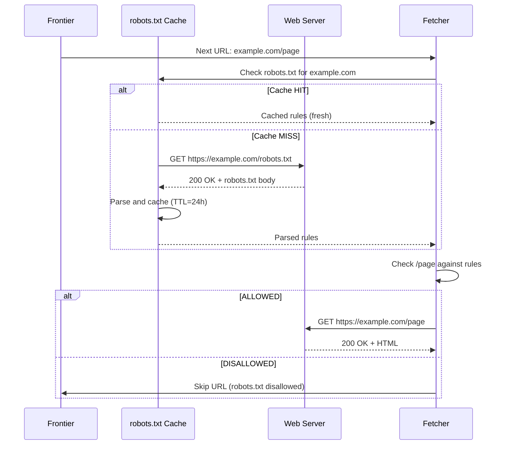

# Design a Web Crawler -- Requirements and Estimation

## Table of Contents
- [1.1 Problem Statement](#11-problem-statement)
- [1.2 Functional Requirements](#12-functional-requirements)
- [1.3 Non-Functional Requirements](#13-non-functional-requirements)
- [1.4 Out of Scope](#14-out-of-scope)
- [1.5 Back-of-Envelope Estimation](#15-back-of-envelope-estimation)
- [1.6 Crawler Seed Configuration](#16-crawler-seed-configuration)
- [1.7 robots.txt Contract](#17-robotstxt-contract)
- [1.8 Error Handling Contract](#18-error-handling-contract)

---

## 1.1 Problem Statement

Design a large-scale web crawler that systematically discovers and downloads pages from
the World Wide Web. The system must crawl 1 billion pages per month while being polite
to web servers, avoiding duplicate content, respecting robots.txt directives, and keeping
its index fresh. Think of it as a simplified Googlebot or the Mercator crawler.

**Why this is a Tier 1 interview question:**
- It tests graph traversal at internet scale (BFS over billions of nodes)
- It requires reasoning about politeness, ethics, and legal constraints (robots.txt, rate limiting)
- It combines distributed systems (partitioning, coordination) with data-intensive processing (dedup, parsing)
- It exposes trade-offs between freshness, coverage, and resource consumption
- It connects theoretical concepts (Bloom filters, SimHash) to real production systems
- It requires handling adversarial inputs (spider traps, infinite URLs, malformed HTML)

**Real-world context:**
Google crawls hundreds of billions of pages. Bing's crawler processes tens of billions.
Common Crawl, a non-profit, provides monthly snapshots of billions of web pages for
research. Even mid-sized search engines and SEO tools (Ahrefs, Moz, Screaming Frog)
run crawlers that must solve the same fundamental problems: URL prioritization, duplicate
detection, politeness enforcement, and distributed coordination.

**What makes this different from a simple HTTP client?**
A web crawler is fundamentally different from a single HTTP downloader in four ways:
1. **Scale** -- billions of pages, not one; requires distributed fetching across many machines
2. **Graph traversal** -- every page contains links to more pages; the frontier grows exponentially
3. **Politeness** -- you must not overwhelm any single web server; rate limiting per domain is mandatory
4. **Deduplication** -- the same content appears at many URLs; you must detect and skip duplicates
5. **Adversarial environment** -- websites create spider traps, infinite calendars, and session URLs

---

## 1.2 Functional Requirements

| # | Requirement | Description | Example |
|---|-------------|-------------|---------|
| FR-1 | **Crawl web pages** | Given seed URLs, discover and download web pages by following hyperlinks | Start from `cnn.com`, follow links to discover `cnn.com/politics`, `cnn.com/tech` |
| FR-2 | **Extract and follow links** | Parse downloaded HTML to extract URLs, normalize them, and add new ones to the crawl frontier | `<a href="/about">` on `example.com` becomes `https://example.com/about` |
| FR-3 | **Content storage** | Store downloaded page content (HTML) for downstream consumers (indexer, analytics) | Raw HTML and extracted text stored in object storage |
| FR-4 | **URL deduplication** | Avoid re-crawling the same URL within a crawl cycle | `http://example.com` and `http://example.com/` treated as the same |
| FR-5 | **Content deduplication** | Detect when different URLs serve identical or near-identical content | `example.com/page` and `example.com/page?ref=twitter` same content |
| FR-6 | **Robots.txt compliance** | Parse, cache, and respect each domain's robots.txt directives | `Disallow: /admin/` means never crawl `example.com/admin/*` |
| FR-7 | **Politeness / rate limiting** | Enforce per-domain crawl delays to avoid overloading web servers | Never send more than 1 request per second to any single domain |
| FR-8 | **Incremental re-crawl** | Periodically re-visit previously crawled pages to detect changes | CNN homepage re-crawled every hour; a personal blog every 30 days |

### Detailed Requirement Breakdown

#### FR-1: Crawl Web Pages
The fetch path is the core operation of the crawler. For each URL, the system must:
- Resolve DNS to obtain the IP address (with caching for efficiency)
- Establish an HTTP/HTTPS connection (with timeouts to avoid hanging on slow servers)
- Send a GET request with a proper User-Agent string identifying the crawler
- Handle redirects (301, 302) up to a configurable maximum depth (default: 10)
- Download the response body up to a size limit (default: 10 MB per page)
- Handle various content types (HTML primarily; optionally PDF, images)
- Record HTTP response metadata (status code, headers, download time)

#### FR-2: Extract and Follow Links
After downloading a page, the parser must:
- Parse HTML to extract all `<a href="...">` tags
- Resolve relative URLs against the page's base URL
- Normalize URLs (lowercase hostname, remove fragments, sort query params)
- Filter out non-HTTP schemes (`mailto:`, `javascript:`, `tel:`)
- Apply URL-level dedup before adding to the frontier
- Optionally extract other resources (``, `<link>`, `<script>`) for full site archiving

#### FR-3: Content Storage
Downloaded content serves multiple downstream consumers:
- **Search indexer**: needs extracted text and metadata for ranking
- **Analytics**: needs raw HTML for structure analysis
- **Archive**: needs timestamped snapshots for historical reference

Storage must record:
```
{
  url: "https://example.com/page",
  fetched_at: "2026-04-07T14:30:00Z",
  status_code: 200,
  content_type: "text/html",
  content_length: 45230,
  html_body: "<html>...",
  extracted_text: "This is the page content...",
  extracted_links: ["https://example.com/other", ...],
  content_fingerprint: "a3f2b8c1...",
  crawl_depth: 3,
  response_time_ms: 245
}
```

#### FR-4: URL Deduplication
URL normalization and dedup prevents re-fetching the same page:

| Normalization Step | Before | After |
|--------------------|--------|-------|
| Lowercase scheme + host | `HTTP://Example.COM/Page` | `http://example.com/Page` |
| Remove default port | `http://example.com:80/page` | `http://example.com/page` |
| Remove fragment | `http://example.com/page#section` | `http://example.com/page` |
| Remove trailing slash (debatable) | `http://example.com/dir/` | `http://example.com/dir` |
| Sort query parameters | `?b=2&a=1` | `?a=1&b=2` |
| Decode unreserved percent-encoding | `%7Euser` | `~user` |
| Remove tracking parameters | `?utm_source=twitter&id=5` | `?id=5` |

After normalization, a Bloom filter with billions of entries provides O(1) lookup for
"have we seen this URL before?" with a configurable false positive rate.

#### FR-5: Content Deduplication
Different URLs often serve the same content. Common scenarios:
- Mirror sites (`http` vs `https`, `www` vs non-`www`)
- URL parameters that do not change content (`?ref=`, `?utm_source=`)
- Session-specific URLs (`?sessionid=abc123`)
- Pagination tricks where page N has same content as page 1

Content dedup uses **fingerprinting** (SimHash or MinHash) to detect exact and near-duplicate
content. A page's fingerprint is compared against stored fingerprints before processing:

```
Content Fingerprinting Pipeline:

  Raw HTML
    |
    v
  Strip tags / extract text
    |
    v
  Tokenize (split into shingles: overlapping word n-grams)
    |
    v
  Compute SimHash (64-bit fingerprint)
    |
    v
  Compare against fingerprint store
    |
    +--> Hamming distance < 3: DUPLICATE (skip)
    +--> Hamming distance >= 3: UNIQUE (process)
```

#### FR-6: Robots.txt Compliance
Before crawling any URL on a domain, the system must:
1. Fetch `https://domain.com/robots.txt` (cached per domain, refreshed every 24h)
2. Parse the directives for our crawler's User-Agent
3. Check the requested URL path against Disallow/Allow rules
4. Respect `Crawl-delay` directives if present
5. If robots.txt is unreachable (404), assume full access
6. If robots.txt returns 5xx, retry later; treat as "disallow all" temporarily

```
Example robots.txt:
  User-agent: *
  Disallow: /admin/
  Disallow: /private/
  Crawl-delay: 2

  User-agent: OurCrawlerBot
  Allow: /public/
  Disallow: /

  Sitemap: https://example.com/sitemap.xml
```

Interpretation for OurCrawlerBot:
- Can crawl: `/public/` and any path under it
- Cannot crawl: everything else (the specific Allow overrides the blanket Disallow)
- Must wait 2 seconds between requests (from `*` directive if not overridden)

#### FR-7: Politeness / Rate Limiting
Politeness is not optional -- it is an ethical and practical necessity:
- **Ethical**: overwhelming a server is a denial-of-service attack
- **Practical**: aggressive crawlers get IP-banned, reducing crawl effectiveness
- **Legal**: some jurisdictions treat excessive crawling as unauthorized access

Politeness implementation:
```
Politeness Rules:
  1. Max 1 request per second to any single domain (configurable)
  2. Respect Crawl-delay in robots.txt (overrides our default)
  3. Crawl during off-peak hours for each domain's timezone (optional)
  4. Back off on 429 (Too Many Requests) or 503 (Service Unavailable)
  5. Exponential backoff: 1s, 2s, 4s, 8s, 16s, max 300s
  6. Identify ourselves with a proper User-Agent and contact info
```

#### FR-8: Incremental Re-crawl
The web is constantly changing. Pages must be re-crawled to keep the index fresh:

| Page Category | Change Frequency | Re-crawl Interval |
|---------------|------------------|--------------------|
| News homepages (CNN, BBC) | Minutes | Every 15-60 minutes |
| Active blogs | Daily | Every 1-3 days |
| E-commerce product pages | Weekly | Every 3-7 days |
| Static pages (About Us) | Rarely | Every 14-30 days |
| Government / legal pages | Very rarely | Every 30-90 days |

Re-crawl priority is based on:
- Historical change frequency (pages that change often get crawled more often)
- Page importance (PageRank or similar authority signal)
- Freshness deadline (news must be fresh; archival pages can be stale)
- Time since last crawl (monotonically increasing priority)

---

## 1.3 Non-Functional Requirements

### Performance

| Requirement | Target | Rationale |
|-------------|--------|-----------|
| **Crawl throughput** | 1 billion pages / month | Target coverage for a mid-scale search engine |
| **Sustained fetch rate** | ~400 pages / second | 1B / 30 days / 86,400 sec per day |
| **Peak fetch rate** | ~800 pages / second | 2x average for burst capacity |
| **DNS resolution** | < 10 ms per lookup (cached) | DNS can dominate fetch latency |
| **Per-page latency** | < 2 seconds average | Including DNS + connect + download |
| **Parse throughput** | > 500 pages / second | Parser must keep up with fetcher |
| **Dedup lookup** | < 1 ms per URL (Bloom filter) | Must not bottleneck the pipeline |

#### Fetch Pipeline Latency Breakdown

```
Per-page fetch latency budget (average target: < 2 seconds):

  DNS resolution (cached):         ~5 ms    (local cache hit)
  DNS resolution (miss):           ~50 ms   (recursive lookup)
  TCP connection setup:            ~50 ms   (SYN/SYN-ACK/ACK, same continent)
  TLS handshake:                   ~100 ms  (for HTTPS, two additional round-trips)
  HTTP request + first byte:       ~200 ms  (server processing time)
  Content download (100 KB avg):   ~100 ms  (at 1 MB/sec effective)
  ──────────────────────────────────────────
  Total (cached DNS, HTTPS):       ~455 ms  (happy path)

  Slow server / large page adds:
  Server think time:               +500 ms
  Large page (1 MB):               +500 ms
  ──────────────────────────────────────────
  Worst case:                      ~1,500 ms (within 2-sec budget)
```

### Reliability

| Requirement | Target | Rationale |
|-------------|--------|-----------|
| **Crawler uptime** | 99.9% (< 9 hours downtime/year) | Crawler should run continuously |
| **No URL loss** | URLs in the frontier survive crawler restarts | Durable frontier storage |
| **Retry failed fetches** | Up to 3 retries with exponential backoff | Transient errors are common |
| **Graceful degradation** | Slow domains do not block other domains | Per-domain isolation |
| **Checkpointing** | Frontier state checkpointed every 5 minutes | Resume from checkpoint on crash |

### Scalability

| Requirement | Target | Rationale |
|-------------|--------|-----------|
| **URL frontier capacity** | Billions of URLs | The web has trillions of URLs |
| **Content store** | Petabytes | 1B pages x 100 KB avg = 100 TB/month |
| **Horizontal scaling** | Add crawler nodes linearly | Double nodes = double throughput |
| **Domain partitioning** | Each domain assigned to one crawler | Ensures per-domain politeness |

---

## 1.4 Out of Scope

| Feature | Reason for Exclusion | Where It Fits |
|---------|---------------------|---------------|
| Search indexing / ranking | Separate system consuming crawler output | Mention as downstream consumer |
| JavaScript rendering (SPA crawling) | Requires headless browser, 10x more expensive | Mention as an extension |
| Image / video content analysis | Orthogonal to crawling; content-type filtering suffices | Mention in content pipeline |
| Natural language processing on page text | Downstream concern for the indexer | Mention as post-processing |
| User-facing search interface | Entirely separate system | Out of scope |
| Dark web / Tor crawling | Different protocol and security model | Mention as a variant |
| Real-time streaming of crawl results | Batch-oriented design; streaming is an extension | Mention as enhancement |

---

## 1.5 Back-of-Envelope Estimation

### Traffic / Throughput Estimation

| Metric | Calculation | Result |
|--------|-------------|--------|
| Target pages per month | Given | 1,000,000,000 (1B) |
| Pages per day | 1B / 30 | ~33,333,333 (~33M) |
| Pages per second (average) | 33M / 86,400 | **~400 pages/sec** |
| Peak pages per second | 2x average | **~800 pages/sec** |
| DNS lookups per second | ~400 (many cached) | ~100 unique domains/sec |
| HTTP connections per second | ~400 (with connection reuse) | ~400 new + reused |
| URLs discovered per page (avg) | ~50 outgoing links per page | ~20,000 URLs/sec added to frontier |
| URLs after dedup | ~20% are new | ~4,000 new URLs/sec |

#### Throughput Pipeline Visualization

```
URLs Entering the System per Second:

  Seed URLs:                    ~0.01/sec  (initial only)
  Extracted from fetched pages: ~20,000/sec (50 links x 400 pages)
  After URL normalization:      ~15,000/sec (remove duplicates, fragments)
  After Bloom filter dedup:     ~4,000/sec  (80% already seen)
  After robots.txt filtering:   ~3,500/sec  (some disallowed)
  Added to frontier queue:      ~3,500/sec  (net new URLs to crawl)
  
  Fetched from frontier:        ~400/sec   (limited by politeness + capacity)
  
  Observation: frontier grows much faster than it drains.
  This is expected -- the crawler is selective about what to fetch next.
  Priority queue ensures the most important URLs are fetched first.
```

### Storage Estimation

| Metric | Calculation | Result |
|--------|-------------|--------|
| Avg page size (HTML) | | 100 KB |
| Avg page size (compressed, gzip) | ~5:1 compression | 20 KB |
| Raw storage per month | 1B x 100 KB | 100 TB/month |
| Compressed storage per month | 1B x 20 KB | **20 TB/month** |
| URL frontier size | 10B URLs x 100 bytes avg | **~1 TB** |
| Bloom filter for URL dedup | 10B URLs, 1% FP rate | **~1.2 GB** |
| Content fingerprint store | 1B fingerprints x 8 bytes | **~8 GB** |
| robots.txt cache | 50M domains x 2 KB avg | **~100 GB** |
| DNS cache | 50M domains x 100 bytes | **~5 GB** |
| Metadata DB (URL records) | 10B URLs x 200 bytes | **~2 TB** |

#### Per-Page Storage Breakdown

```
Single Crawled Page Storage:
+------------------------------------------------------------------+
| Component              | Bytes   | Notes                          |
+------------------------------------------------------------------+
| URL (normalized)       |     120 | Average URL length             |
| Raw HTML body          | 100,000 | Average page size              |
| Compressed HTML (gzip) |  20,000 | Stored form                    |
| Extracted plain text   |  10,000 | Stripped of tags                |
| Extracted links (JSON) |   5,000 | ~50 links x 100 bytes each     |
| HTTP headers           |     500 | Status, content-type, etc.     |
| Fetch metadata         |     200 | Timestamp, latency, depth      |
| Content fingerprint    |       8 | SimHash, 64-bit                |
| Crawl record metadata  |     100 | Domain, priority, retry count  |
+------------------------------------------------------------------+
| Total (raw)            | ~116 KB | Before compression             |
| Total (compressed)     | ~26 KB  | Stored in object storage       |
+------------------------------------------------------------------+
```

### Crawler Node Sizing

| Metric | Calculation | Result |
|--------|-------------|--------|
| Fetch rate per crawler node | With async I/O, ~100 concurrent fetches | ~50 pages/sec per node |
| Nodes for throughput | 400 / 50 | **~8 crawler nodes** |
| Peak capacity nodes | 800 / 50 | **~16 crawler nodes** |
| Memory per node | Frontier partition + DNS cache + Bloom filter shard | ~16 GB |
| Network per node | 50 pages/sec x 100 KB | ~5 MB/sec (40 Mbps) |
| CPU per node | HTML parsing, hashing, compression | 4-8 cores |

#### Sizing Decision Tree



### Network Bandwidth

| Metric | Calculation | Result |
|--------|-------------|--------|
| Inbound bandwidth (downloads) | 400 pages/sec x 100 KB | ~40 MB/sec |
| Outbound bandwidth (requests) | 400 req/sec x 500 bytes | ~200 KB/sec (negligible) |
| DNS traffic | ~100 queries/sec x 100 bytes | ~10 KB/sec (negligible) |
| Storage writes | 400 pages/sec x 26 KB compressed | ~10 MB/sec |
| Total cluster inbound | ~40 MB/sec | ~320 Mbps |
| NIC per node (10 Gbps) | 40 / 8 nodes = 5 MB/sec each | < 1% NIC capacity |

#### Network Budget per Node

```
Per-node network breakdown at average load (8 nodes):

  Inbound (page downloads):    ~5 MB/sec   (50 pages x 100 KB avg)
  Outbound (HTTP requests):    ~25 KB/sec  (50 requests x 500 bytes)
  DNS queries/responses:       ~2 KB/sec   (mostly cached locally)
  Storage writes (to S3/HDFS): ~1.3 MB/sec (50 pages x 26 KB compressed)
  Frontier sync (inter-node):  ~0.5 MB/sec (URL exchange between nodes)
  Monitoring / heartbeats:     ~10 KB/sec  (health checks, metrics)
  ──────────────────────────────────────────
  Total per node:              ~7 MB/sec   (< 1% of 10 Gbps NIC)

Conclusion: network is NOT the bottleneck. Concurrency and politeness are.
```

### Estimation Summary

```
┌───────────────────────────────────────────────────────────────┐
│              ESTIMATION SUMMARY                                │
├───────────────────────────────────────────────────────────────┤
│                                                                │
│  Target:       1 billion pages / month                         │
│  Throughput:   400 pages/sec avg, 800 pages/sec peak           │
│  Crawler nodes: 8-16 (async I/O, 50 pages/sec each)           │
│  Per node:     16 GB RAM, 4-8 cores, 10 Gbps NIC              │
│  Storage:      20 TB/month compressed (object storage)         │
│  Frontier:     ~1 TB (10B URLs, partitioned)                   │
│  Bloom filter: ~1.2 GB (10B URLs, 1% false positive)          │
│  Bottleneck:   Politeness constraints (not hardware)           │
│                                                                │
│  Governing constraint: POLITENESS / CONCURRENCY                │
│  Storage growth: linear, ~20 TB/month                          │
│  Network headroom: 100x (7 MB/sec vs 1.25 GB/sec NIC)        │
│                                                                │
└───────────────────────────────────────────────────────────────┘
```

---

## 1.6 Crawler Seed Configuration

### Seed URL Selection Strategy

The crawler starts from a set of **seed URLs** -- high-quality, well-connected pages that
serve as entry points to discover the rest of the web. Seed selection profoundly affects
crawl coverage and efficiency.

```
Seed URL Categories:

  Tier 1 -- Major portals (highest connectivity):
    - google.com, wikipedia.org, reddit.com, amazon.com
    - news sites: cnn.com, bbc.com, nytimes.com
    - social: twitter.com, facebook.com, linkedin.com
    - Count: ~100 URLs

  Tier 2 -- Country/language-specific portals:
    - Top-100 sites per country (Alexa/Tranco rankings)
    - Country-code TLDs: .uk, .de, .jp, .br, etc.
    - Count: ~10,000 URLs

  Tier 3 -- Domain lists:
    - DMOZ / Curlie directory (curated human-reviewed sites)
    - Common Crawl's domain list
    - Government domains (.gov, .edu)
    - Count: ~1,000,000 URLs

  Total seeds: ~1M URLs
  Expected discovery: from 1M seeds, BFS discovers 10B+ URLs within weeks
```

### Seed URL Format

```
# Seed file format (TSV):
# url                          priority  category
https://en.wikipedia.org/      1.0       reference
https://www.reddit.com/        0.95      social
https://www.cnn.com/           0.9       news
https://www.amazon.com/        0.85      ecommerce
https://github.com/            0.8       technology
```

---

## 1.7 robots.txt Contract

### Parsing Rules (RFC 9309)

The crawler must implement the Robots Exclusion Protocol (RFC 9309) correctly:

```
robots.txt Parsing Algorithm:

  1. Fetch https://domain.com/robots.txt
     - 200 OK: parse the body
     - 404:    no restrictions (allow all)
     - 5xx:    temporary error, treat as "disallow all" and retry later
     - Timeout: treat as "disallow all" temporarily

  2. Find the most specific User-agent group:
     a. Exact match for our bot name: "OurCrawlerBot"
     b. Partial match: "OurCrawler"
     c. Wildcard: "*"
     d. If no match: allow all

  3. Within the matched group, apply Allow/Disallow rules:
     - Rules are matched by longest prefix
     - Allow overrides Disallow for the same prefix length
     - Empty Disallow means allow all

  4. Honor Crawl-delay if specified (default to 1 second if absent)

  5. Parse Sitemap directives for discovery hints
```

### robots.txt Caching Strategy

| Aspect | Policy |
|--------|--------|
| Cache duration | 24 hours (re-fetch daily) |
| Cache storage | In-memory LRU cache + persistent store |
| Cache size | ~50M domains x 2 KB = ~100 GB |
| Negative cache | 404 responses cached for 24h (domain has no robots.txt) |
| Error cache | 5xx responses cached for 1 hour, then retry |
| Pre-fetch | Fetch robots.txt before first URL on a new domain |

### robots.txt Compliance Flow



---

## 1.8 Error Handling Contract

### HTTP Error Handling Matrix

| Status Code | Meaning | Crawler Action |
|-------------|---------|----------------|
| 200 | Success | Process page, extract links |
| 301 | Permanent redirect | Follow redirect, update URL in frontier |
| 302/307 | Temporary redirect | Follow redirect, keep original URL |
| 304 | Not Modified | Skip download (use conditional GET with `If-Modified-Since`) |
| 400 | Bad request | Mark URL as permanently failed, do not retry |
| 403 | Forbidden | Mark URL as blocked, do not retry for 7 days |
| 404 | Not found | Remove from frontier, mark as dead |
| 410 | Gone | Permanently remove from frontier |
| 429 | Too many requests | Back off exponentially, respect `Retry-After` header |
| 500 | Server error | Retry up to 3 times with exponential backoff |
| 502/503 | Bad gateway / unavailable | Retry later, back off on the entire domain |
| Connection timeout | Server unreachable | Retry up to 3 times, then defer for 1 hour |
| DNS failure | Domain does not resolve | Defer domain for 24 hours, then retry |
| SSL error | Certificate invalid | Log and skip (or fetch HTTP fallback if configured) |

### Retry Policy

```
Retry Strategy (per URL):

  Attempt 1: immediate
  Attempt 2: wait 30 seconds
  Attempt 3: wait 5 minutes
  Attempt 4: wait 1 hour (final)
  
  After 4 failures:
    - Mark URL as "failed"
    - Record failure reason
    - Re-attempt in next crawl cycle (days/weeks later)

Domain-level back-off:
  If > 50% of URLs on a domain fail: pause domain for 1 hour
  If > 80% of URLs on a domain fail: pause domain for 24 hours
  If all URLs fail:                  pause domain for 7 days
```

### Error Classification Hierarchy

```
CrawlException (base)
  |
  +-- FetchException
  |     +-- ConnectionTimeoutException     -- TCP connect timed out
  |     +-- ReadTimeoutException           -- Response body read timed out
  |     +-- TooManyRedirectsException      -- Redirect loop detected (> 10)
  |     +-- ContentTooLargeException       -- Page exceeds 10 MB limit
  |     +-- SSLException                   -- TLS handshake or cert error
  |
  +-- DNSException
  |     +-- DNSResolutionFailure           -- NXDOMAIN or SERVFAIL
  |     +-- DNSTimeoutException            -- DNS query timed out
  |
  +-- ParseException
  |     +-- MalformedHTMLException         -- Unparseable HTML (best effort)
  |     +-- EncodingException              -- Unknown character encoding
  |
  +-- PolicyException
        +-- RobotsTxtDisallowedException   -- Blocked by robots.txt
        +-- RateLimitedException           -- Politeness delay not yet elapsed
        +-- DomainBlacklistedException     -- Domain on manual blocklist
```

---

*This document defines the requirements envelope for the web crawler: 1 billion pages/month
at 400 pages/sec, with mandatory politeness enforcement, URL and content deduplication,
robots.txt compliance, and incremental re-crawling. The governing constraint is politeness
and concurrency, not hardware -- the crawler deliberately limits itself to avoid overwhelming
web servers.*
