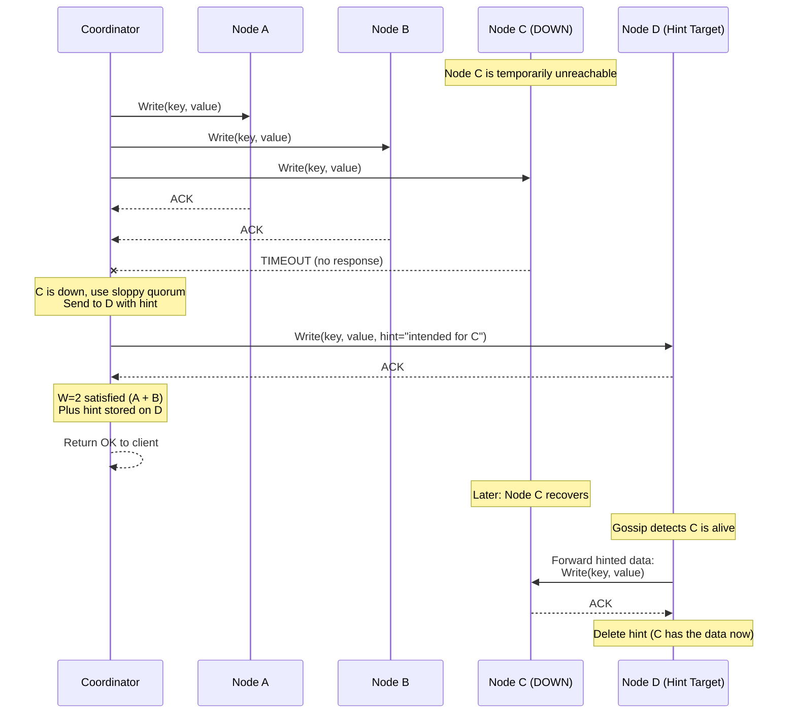
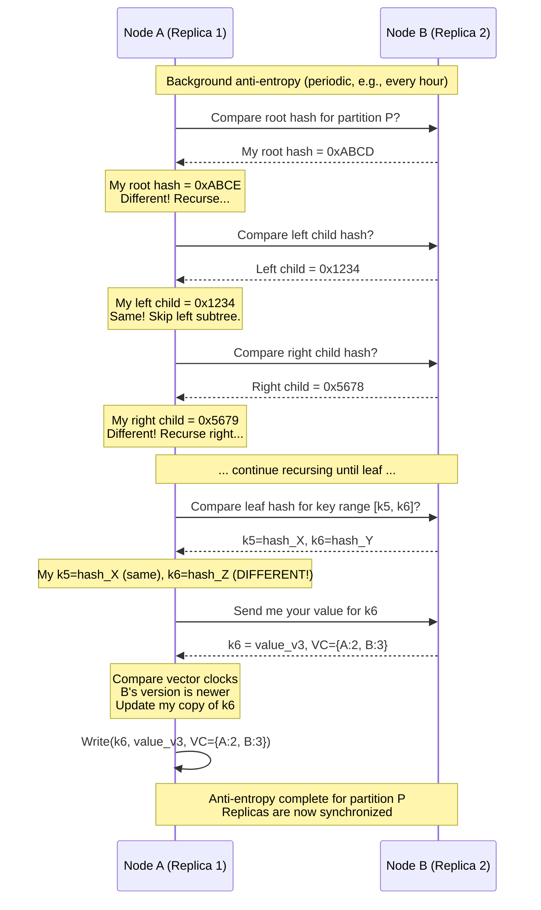
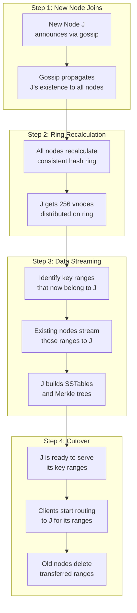
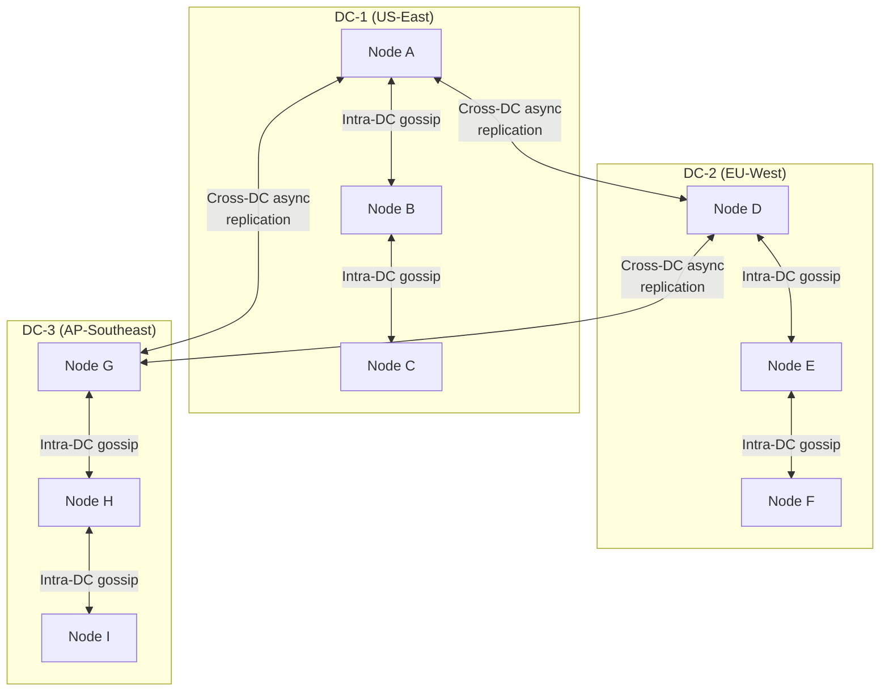

# Design a Distributed Key-Value Store -- Deep Dive and Scaling

## Table of Contents
- [3.1 Handling Temporary Failures -- Sloppy Quorum and Hinted Handoff](#31-handling-temporary-failures----sloppy-quorum-and-hinted-handoff)
- [3.2 Handling Permanent Failures -- Anti-Entropy with Merkle Trees](#32-handling-permanent-failures----anti-entropy-with-merkle-trees)
- [3.3 Write Amplification and Compaction Deep Dive](#33-write-amplification-and-compaction-deep-dive)
- [3.4 Bloom Filter Deep Dive](#34-bloom-filter-deep-dive)
- [3.5 Scaling -- Adding and Removing Nodes](#35-scaling----adding-and-removing-nodes)
- [3.6 Multi-Datacenter Replication](#36-multi-datacenter-replication)
- [3.7 CAP Theorem Trade-offs](#37-cap-theorem-trade-offs)
- [3.8 Comparison -- DynamoDB vs Cassandra vs Riak](#38-comparison----dynamodb-vs-cassandra-vs-riak)
- [3.9 Monitoring and Operational Concerns](#39-monitoring-and-operational-concerns)
- [3.10 Trade-off Analysis](#310-trade-off-analysis)
- [3.11 Interview Tips](#311-interview-tips)

---

## 3.1 Handling Temporary Failures -- Sloppy Quorum and Hinted Handoff

### The Problem

When a node in the preference list is temporarily down (network blip, GC pause, restart),
a strict quorum would fail the write -- even though the data could be written elsewhere
and forwarded later. This hurts availability.

### Sloppy Quorum

A sloppy quorum allows writes to succeed by using nodes OUTSIDE the preference list
as temporary stand-ins for the downed node.

```
Strict Quorum vs Sloppy Quorum:

  Preference list for key K: [A, B, C]  (N=3, W=2)
  Node C is temporarily down.
  
  STRICT QUORUM:
    Write to A: OK
    Write to B: OK
    Write to C: TIMEOUT
    W=2 satisfied -> return OK to client
    BUT: only 2 of 3 replicas have the data. If A and B fail before C
    recovers, data is lost (unlikely but possible).
    
  SLOPPY QUORUM:
    Write to A: OK
    Write to B: OK
    Write to C: TIMEOUT -> write to D instead (next node on ring)
    W=2 satisfied, and 3 copies exist (A, B, D)
    D stores the data with a HINT: "this belongs to C"
    When C recovers, D forwards the data to C
    D then deletes its temporary copy
    
    Result: higher availability, same durability target
```

### Hinted Handoff Flow



### Hinted Handoff Details

```
Hint storage on Node D:

  +-----------------------------------------------------+
  | Hint Record                                         |
  +-----------------------------------------------------+
  | target_node:    C                                   |
  | key:            "user:1001"                         |
  | value:          {name: "Alice", ...}                |
  | vector_clock:   {A:3, B:1}                          |
  | hint_timestamp: 2026-04-07T10:30:00Z                |
  | hint_ttl:       3 hours (configurable)              |
  +-----------------------------------------------------+
  
  Hints are stored in a separate hint log on D (not in D's main data).
  
  Hint delivery:
    1. Gossip detects C is alive again
    2. D iterates through its hint log for hints targeting C
    3. D sends each hint to C as a write request
    4. C acknowledges each hint
    5. D deletes delivered hints
    
  Hint TTL:
    If C does not recover within hint_ttl (default 3 hours):
      - The hint is discarded
      - Anti-entropy (Merkle trees) will repair C when it eventually recovers
      - This prevents hints from consuming unbounded disk space on D
      
  Cassandra default: max_hint_window_in_ms = 3 hours
  DynamoDB: does not expose this; managed internally
```

---

## 3.2 Handling Permanent Failures -- Anti-Entropy with Merkle Trees

### The Problem

Hinted handoff handles temporary failures (minutes to hours). But what about permanent
failures -- a disk dies, data is corrupted, or a node is replaced with a fresh machine?
These cases require comparing the full dataset between replicas to find and fix divergence.

### Merkle Trees for Efficient Comparison

A Merkle tree (hash tree) allows two nodes to efficiently identify exactly which keys
differ between them without comparing every single key-value pair.

```
Merkle Tree Structure:

  Each node builds a Merkle tree over its key range:
  
                        Root Hash
                      H(H1 + H2)
                     /           \
                   H1              H2
                H(H3+H4)       H(H5+H6)
               /       \       /       \
             H3        H4    H5        H6
          H(k1+k2)  H(k3+k4) H(k5+k6) H(k7+k8)
           /   \     /   \     /   \     /   \
          k1   k2   k3   k4   k5   k6   k7   k8
          
  k1...k8 are leaf hashes: hash(key + value + vector_clock)
  
  Two replicas compare their root hashes:
    - If roots match: IDENTICAL (no divergence), done!
    - If roots differ: recurse into children
      - If H1 matches but H2 differs: divergence is in right subtree
      - Recurse until leaf level to find exact divergent keys
      
  Efficiency:
    With 1M keys and a tree depth of 20:
    Best case (identical):     1 hash comparison
    Worst case (1 key differs): 20 hash comparisons + 1 key transfer
    vs. naive comparison:       1M key comparisons
    
    Merkle trees reduce anti-entropy from O(N) to O(log N) comparisons.
```

### Anti-Entropy Process



### Merkle Tree Maintenance

```
When to rebuild Merkle trees:

  Option 1: Rebuild on every write (expensive but always current)
    - Every PUT updates the leaf hash and propagates changes up the tree
    - O(log N) hash updates per write
    - Used when anti-entropy runs frequently
    
  Option 2: Rebuild periodically (cheaper but slightly stale)
    - Every hour, scan all keys and rebuild the Merkle tree from scratch
    - O(N) scan but amortized over time
    - Used in Cassandra (nodetool repair)
    
  Option 3: Incremental updates (Cassandra 4.0+)
    - Maintain a mutation log since last tree build
    - Only rehash changed leaves
    - Best of both worlds

  Practical considerations:
    - Merkle tree for 1M keys with depth 20: ~40 MB memory
    - One tree per partition per replica pair
    - 9 nodes with 9 partitions: ~81 Merkle trees cluster-wide
    - Total memory: ~3.2 GB cluster-wide for Merkle trees (acceptable)
```

---

## 3.3 Write Amplification and Compaction Deep Dive

### Understanding Write Amplification

Write amplification is the ratio of actual bytes written to disk vs. the logical bytes
written by the application. In LSM trees, compaction causes significant write amplification.

```
Write Amplification in LSM Trees:

  Application writes 1 byte:
  
  1. Written to WAL:                     1 byte on disk
  2. Flushed from memtable to L0 SST:    1 byte on disk (2nd write)
  3. Compacted from L0 to L1:            1 byte on disk (3rd write)
  4. Compacted from L1 to L2:            1 byte on disk (4th write)
  5. Compacted from L2 to L3:            1 byte on disk (5th write)
  
  Write amplification = 5x (each level adds one write)
  
  With leveled compaction (level ratio = 10):
    Worst case WA = (number of levels) x (level ratio) 
    Practical WA for LevelDB/RocksDB: 10-30x
    
  With size-tiered compaction:
    Worst case WA = (number of tiers) x (tier size ratio)
    Practical WA for Cassandra: 3-10x (lower but space-amplified)
    
  Why this matters:
    53K writes/sec x 700 bytes x 10 (WA) = 371 MB/sec of disk I/O
    SSD write endurance: 1 DWPD (drive write per day) for 2 TB = ~23 MB/sec
    With 10x WA: effective write capacity drops 10x
    -> Must size SSDs for write endurance, not just capacity!
```

### Compaction Flow

```mermaid
graph TD
    subgraph "Size-Tiered Compaction"
        SL0["L0: 4 SSTables<br/>each ~64 MB"]
        ST1["Trigger: 4 SSTables<br/>of similar size"]
        SM["Merge all 4 into<br/>1 SSTable (~256 MB)"]
        SL1["L1: 1 SSTable (~256 MB)"]
        ST2["When 4 L1 SSTables<br/>accumulate..."]
        SL2["L2: 1 SSTable (~1 GB)"]
        
        SL0 --> ST1 --> SM --> SL1 --> ST2 --> SL2
    end

    subgraph "Leveled Compaction"
        LL0["L0: 4 SSTables<br/>(may overlap)"]
        LT1["Pick 1 L0 SSTable"]
        LO["Find overlapping<br/>L1 SSTables"]
        LM["Merge + split into<br/>new L1 SSTables<br/>(each max 10 MB)"]
        LL1["L1: non-overlapping<br/>SSTables (max 100 MB total)"]
        LL2["L2: 10x larger<br/>(max 1 GB total)"]
        
        LL0 --> LT1 --> LO --> LM --> LL1
        LL1 -->|"When L1 > 100 MB"| LL2
    end
```



### Tombstone Grace Period and GC

```
Tombstone lifecycle:

  t=0:    PUT("user:1001", value)     -> stored on replicas A, B, C
  t=100:  DELETE("user:1001")          -> tombstone on A, B (C was down)
  t=200:  C comes back, anti-entropy syncs tombstone to C
  t=300:  Compaction runs on A: sees tombstone, key still in older SSTable
          Can we delete the key + tombstone?
          
          RULE: Only if tombstone age > gc_grace_seconds (default: 10 days)
          
          Why 10 days? To give ALL replicas time to receive the tombstone.
          If we GC the tombstone too early and C never saw it:
            C still has the old value
            Next anti-entropy: C sends old value to A
            A has no tombstone (it was GC'd) -> accepts the old value
            KEY RESURRECTED! Data that was deleted reappears!
            
  t=864000 (10 days later): 
          Compaction can safely remove both the tombstone and the old value.
          All replicas should have seen the tombstone by now.
          
  gc_grace_seconds MUST be longer than the longest expected node outage.
  
  Cassandra operators learn this the hard way:
    - Run `nodetool repair` before gc_grace_seconds expires
    - Or face zombie data resurrection
```

---

## 3.4 Bloom Filter Deep Dive

### Why Bloom Filters Are Essential for LSM Trees

An LSM tree may have dozens or hundreds of SSTables. Without Bloom filters, every read
must check EVERY SSTable (from newest to oldest) until the key is found -- potentially
dozens of disk reads for a single GET.

```
Without Bloom filters (100 SSTables):

  GET("user:1001"):
    Check SSTable 1:  key not here  (1 disk read)
    Check SSTable 2:  key not here  (1 disk read)
    Check SSTable 3:  key not here  (1 disk read)
    ...
    Check SSTable 47: FOUND!        (1 disk read)
    Total: 47 disk reads at ~1ms each = 47ms  (TERRIBLE)
    
With Bloom filters:

  GET("user:1001"):
    Bloom filter SSTable 1:  "definitely NOT here"  (skip, 0 disk reads)
    Bloom filter SSTable 2:  "definitely NOT here"  (skip)
    ...
    Bloom filter SSTable 47: "MAYBE here"           (check: 1 disk read, FOUND!)
    Total: 1 disk read + 100 bloom filter checks = ~1.1ms  (EXCELLENT)
    
  Bloom filters reduce reads from O(num_SSTables) to O(1) expected.
```

### Bloom Filter Internals

```
Bloom Filter Construction:

  Bit array of m bits, initially all 0.
  k hash functions: h1, h2, ..., hk.
  
  INSERT(key):
    Set bits at positions h1(key), h2(key), ..., hk(key) to 1.
    
  QUERY(key):
    Check bits at h1(key), h2(key), ..., hk(key).
    If ALL are 1: "probably present" (may be false positive)
    If ANY is 0:  "definitely absent" (guaranteed!)
    
  Example (m=16 bits, k=3 hash functions):
  
    Insert "user:1001":
      h1("user:1001") = 3,  h2 = 7,  h3 = 11
      Bit array: [0 0 0 1 0 0 0 1 0 0 0 1 0 0 0 0]
                          ^           ^           ^
    Insert "user:1002":
      h1 = 1,  h2 = 7,  h3 = 14
      Bit array: [0 1 0 1 0 0 0 1 0 0 0 1 0 0 1 0]
                    ^               (already 1)     ^
      
    Query "user:1003":
      h1 = 3,  h2 = 5,  h3 = 14
      Bits:    [1]  [0]  [1]
               3=1, 5=0 -> DEFINITELY NOT PRESENT (correct!)
               
    Query "user:1004":
      h1 = 1,  h2 = 7,  h3 = 11
      Bits:    [1]  [1]  [1]
               All 1 -> "MAYBE PRESENT" (false positive! user:1004 was never inserted)

  False positive rate formula:
    p = (1 - e^(-kn/m))^k
    
    With 10 bits per key (m/n = 10) and k = 7:
      p = 0.82% (less than 1% false positive rate)
      
  Memory cost:
    1M keys x 10 bits = 10 Mb = 1.25 MB per SSTable bloom filter
    100 SSTables: 125 MB total (fits easily in RAM)
```

---

## 3.5 Scaling -- Adding and Removing Nodes

### Adding a Node



### Data Streaming During Node Addition

```
What happens when Node J joins a 9-node cluster:

  Before: 9 nodes, each responsible for ~11.1% of key space
  After:  10 nodes, each responsible for ~10% of key space
  
  Each existing node gives up ~1.1% of its key space to J.
  Total data moved: ~10% of total data (1/N of the keyspace)
  
  The remaining ~90% of data DOES NOT MOVE.
  
  Streaming process:
    1. Node J joins and is assigned 256 vnodes on the ring
    2. For each vnode, J identifies which existing node previously owned that range
    3. J sends a streaming request to each donor node
    4. Donor nodes read the relevant key range from their SSTables
    5. Data is streamed in bulk (not key-by-key) for efficiency
    6. J builds SSTables from the streamed data
    7. Once J has all data and confirms checksums, it starts serving traffic
    8. Donor nodes can delete the transferred ranges during next compaction
    
  Timeline:
    1 TB of data to stream, 10 nodes, ~100 GB per existing node to transfer
    At 100 MB/sec network throughput: ~17 minutes per donor
    All donors stream in parallel: ~17 minutes total
    
  During streaming:
    - J does not serve reads for ranges it has not received yet
    - Writes to those ranges go to the old owner AND J (double-write)
    - Once streaming is complete, reads switch to J
```

### Removing a Node (Decommission)

```
Decommissioning Node X:

  1. Operator marks X as "decommissioning" (via admin API or gossip)
  2. X stops accepting new writes
  3. X streams its data to the nodes that will take over its vnodes
     (consistent hashing determines which nodes inherit which ranges)
  4. X gossips its departure to all nodes
  5. All nodes recalculate the ring without X
  6. X shuts down
  
  Key difference from crash:
    Planned decommission: data is pre-streamed, zero data loss
    Unplanned crash: replicas cover, anti-entropy repairs later
```

---

## 3.6 Multi-Datacenter Replication

### Cross-DC Architecture



### Multi-DC Consistency

```
Multi-datacenter consistency options:

  LOCAL_QUORUM (recommended for most use cases):
    Write: achieve quorum within the LOCAL datacenter
    Then async-replicate to remote DCs
    Read: achieve quorum within the LOCAL datacenter
    
    Latency: ~5ms (local DC only)
    Consistency: strong within DC, eventually consistent across DCs
    
  EACH_QUORUM:
    Write: achieve quorum in EVERY datacenter before ACK
    Read: same
    
    Latency: ~100-300ms (must wait for cross-DC round trip)
    Consistency: strong globally
    Use case: financial data, critical metadata
    
  Cross-DC replication lag:
    US-East to EU-West: ~80ms network RTT
    EU-West to AP-Southeast: ~200ms network RTT
    
    With LOCAL_QUORUM writes:
      Local DC confirms in ~5ms
      Remote DCs receive the data ~80-200ms later
      Brief window where remote DCs serve stale data
```

---

## 3.7 CAP Theorem Trade-offs

### CAP in the Context of Our KV Store

```
The CAP theorem states that during a network partition (P), you must choose
between Consistency (C) and Availability (A). You cannot have both.

Our system is AP by default (like Dynamo/Cassandra):

  During a partition:
  
    Partition: Nodes {A, B} cannot communicate with Node {C}
    
    Client writes to A (coordinator):
      A can reach B but not C
      
    AP mode (sloppy quorum):
      Write to A: OK
      Write to B: OK
      Write to C: TIMEOUT -> write to D instead (sloppy quorum)
      Return OK to client (available!)
      C has stale data until partition heals
      
    CP mode (strict quorum):
      Write to A: OK
      Write to B: OK
      Write to C: TIMEOUT
      FAIL -- cannot reach all required replicas
      Return ERROR to client (consistent but unavailable!)
```

### Tuning the CAP Dial

```
Our system lets you TUNE the CAP trade-off per-request:

  +------+------+------+------+------+----------------------------------+
  |  R   |  W   | R+W  | >N?  | CAP  | Behavior                         |
  +------+------+------+------+------+----------------------------------+
  |  1   |  1   |  2   |  No  |  AP  | Fast, eventual, may read stale   |
  |  2   |  1   |  3   |  No  |  AP  | Reads slightly stronger          |
  |  1   |  2   |  3   |  No  |  AP  | Writes slightly stronger         |
  |  2   |  2   |  4   | Yes  |  CP  | Standard quorum, strong          |
  |  3   |  1   |  4   | Yes  |  CP  | Read-all, write-one              |
  |  1   |  3   |  4   | Yes  |  CP  | Write-all, read-one              |
  |  3   |  3   |  6   | Yes  |  CP  | Maximum consistency, min avail.  |
  +------+------+------+------+------+----------------------------------+
  
  (All examples with N=3)
  
  Key insight: the SAME system can behave as AP or CP depending on the
  client's choice of R and W for that specific request.
  
  This is why Dynamo-style systems are so powerful -- they do not lock
  you into one side of the CAP theorem for the entire system.
```

### Consistency Model Spectrum

```
  Weakest                                                    Strongest
    |                                                            |
    v                                                            v
  Eventual  -->  Read-Your-Writes  -->  Monotonic  -->  Causal  -->  Linearizable
    |                |                      |              |             |
    |                |                      |              |             |
  R=1,W=1      Sticky sessions        Session      Vector clocks   R+W>N + 
  Fastest      + local read            guarantees   + quorum        single leader
  May read     after write             No going     Respects        Strongest
  stale data                           backwards    causality       guarantee

  Our system supports:
    Eventual (R=1, W=1)
    Quorum / Strong (R+W > N)
    
  It does NOT natively support:
    Linearizable (would need single-leader per key, like Raft/Paxos)
    But: DynamoDB added linearizable reads ("strongly consistent reads")
         by routing reads to the leader of the key's Paxos group
```

---

## 3.8 Comparison -- DynamoDB vs Cassandra vs Riak

```
+----------------------------+--------------------+---------------------+-------------------+
| Feature                    | Amazon DynamoDB    | Apache Cassandra    | Riak KV           |
+----------------------------+--------------------+---------------------+-------------------+
| Architecture               | Managed service    | Open-source,        | Open-source,      |
|                            | (closed source)    | peer-to-peer        | peer-to-peer      |
+----------------------------+--------------------+---------------------+-------------------+
| Partitioning               | Consistent hashing | Consistent hashing  | Consistent hashing|
|                            | (managed)          | (vnodes or tokens)  | (vnodes)          |
+----------------------------+--------------------+---------------------+-------------------+
| Replication                | 3 replicas across  | Configurable RF     | Configurable N    |
|                            | AZs (automatic)    | per keyspace        | per bucket        |
+----------------------------+--------------------+---------------------+-------------------+
| Consistency                | Eventually or      | Tunable per-query   | Tunable per-query |
|                            | strongly consistent | (ONE to ALL)        | (R, W, N)         |
+----------------------------+--------------------+---------------------+-------------------+
| Conflict resolution        | LWW (default)      | LWW (timestamps)    | Vector clocks     |
|                            | + conditional writes|                     | + siblings        |
+----------------------------+--------------------+---------------------+-------------------+
| Storage engine             | Custom (B-tree     | LSM tree (custom)   | Bitcask/LevelDB   |
|                            | based, proprietary)|                     | (pluggable)       |
+----------------------------+--------------------+---------------------+-------------------+
| Data model                 | Key-value +        | Wide-column (CQL)   | Key-value +       |
|                            | document (JSON)    |                     | secondary indexes  |
+----------------------------+--------------------+---------------------+-------------------+
| Failure detection          | Internal           | Gossip + Phi Accrual| Gossip + Phi      |
|                            | (managed)          |                     | Accrual           |
+----------------------------+--------------------+---------------------+-------------------+
| Anti-entropy               | Internal           | Merkle tree repair  | Merkle tree +     |
|                            | (managed)          | (nodetool repair)   | Active Anti-Entropy|
+----------------------------+--------------------+---------------------+-------------------+
| Multi-DC                   | Global Tables      | Built-in            | Multi-DC          |
|                            | (fully managed)    | (NetworkTopology)   | replication       |
+----------------------------+--------------------+---------------------+-------------------+
| Transactions               | ACID transactions  | Lightweight txns    | Not supported     |
|                            | (added 2018)       | (Paxos-based)       |                   |
+----------------------------+--------------------+---------------------+-------------------+
| Throughput                 | Millions ops/sec   | Millions ops/sec    | Hundreds of       |
|                            | (auto-scaled)      | (manual scaling)    | thousands ops/sec |
+----------------------------+--------------------+---------------------+-------------------+
| Ops burden                 | Zero (managed)     | High (manual ops)   | Moderate          |
+----------------------------+--------------------+---------------------+-------------------+
| Cost model                 | Pay per request    | Infrastructure cost | Infrastructure    |
|                            | or provisioned     | + ops team          | cost              |
+----------------------------+--------------------+---------------------+-------------------+
| Origin                     | Amazon Dynamo      | Facebook (Inbox     | Basho (Dynamo     |
|                            | paper (2007)       | search), evolved    | paper, faithful)  |
+----------------------------+--------------------+---------------------+-------------------+
```

### Which to Choose?

```
Decision tree:

  Q: Do you want a managed service (no ops burden)?
    Yes -> DynamoDB (if on AWS) or Cosmos DB (if on Azure)
    No  -> continue
    
  Q: Do you need rich query patterns (range scans, secondary indexes)?
    Yes -> Cassandra (CQL provides SQL-like queries)
    No  -> continue
    
  Q: Do you need client-side conflict resolution (shopping cart pattern)?
    Yes -> Riak (native vector clocks + siblings)
    No  -> continue
    
  Q: Is write throughput the primary concern?
    Yes -> Cassandra (LSM tree, excellent write performance)
    No  -> continue
    
  Q: Do you need transactions?
    Yes -> DynamoDB (ACID transactions since 2018)
    No  -> Any of the three work; pick based on ops team preference
```

---

## 3.9 Monitoring and Operational Concerns

### Key Metrics to Monitor

```
+----------------------------+-------------------------------------------+-----------------+
| Metric                     | Why It Matters                             | Alert Threshold |
+----------------------------+-------------------------------------------+-----------------+
| Read latency (p50, p99)    | Core SLA metric                            | p99 > 50ms     |
| Write latency (p50, p99)   | Core SLA metric                            | p99 > 30ms     |
| Compaction pending bytes   | High pending = read amplification growing  | > 10 GB        |
| SSTable count per node     | Too many = slow reads                      | > 500          |
| Tombstone ratio            | High tombstones = slow scans               | > 30%          |
| Memtable size              | Near flush threshold                       | > 80% of max   |
| Gossip heartbeat failures  | Node may be unhealthy                      | > 3 missed     |
| Hint queue size            | Hints backing up = node may be down        | > 10K hints    |
| Disk utilization           | Running out of disk kills the node         | > 75%          |
| Bloom filter false positive| Higher = more unnecessary disk reads       | > 5%           |
| Read repair rate           | High = many stale replicas                 | > 10% of reads |
| Cross-DC replication lag   | Staleness across datacenters               | > 5 seconds    |
+----------------------------+-------------------------------------------+-----------------+
```

### Common Operational Issues

```
1. TOMBSTONE OVERLOAD
   Problem: DELETE-heavy workload creates millions of tombstones.
            Range scans must skip over tombstones = slow reads.
   Fix:     Run compaction more aggressively for these partitions.
            Redesign data model to avoid heavy deletes (use TTLs instead).

2. HOT PARTITION
   Problem: One key or partition gets disproportionate traffic.
            Example: celebrity's profile, viral post metadata.
   Fix:     Add random suffix to distribute across partitions.
            Use a write-behind cache for hot reads.
            DynamoDB: adaptive capacity redistributes throughput.

3. WRITE AMPLIFICATION SATURATION
   Problem: SSD write endurance is exhausted by compaction.
            Disk errors, degraded performance.
   Fix:     Monitor SSD wear indicators (SMART data).
            Use size-tiered compaction (lower WA) for write-heavy tables.
            Provision enterprise-grade SSDs with higher endurance.

4. GOSSIP STORMS
   Problem: Many nodes joining/leaving simultaneously causes gossip flood.
   Fix:     Throttle node additions (add 1 at a time, wait for streaming).
            Rate-limit gossip messages per second.
            
5. CLOCK SKEW (LWW systems)
   Problem: Node clocks diverge, causing wrong version to win conflicts.
   Fix:     NTP synchronization on all nodes.
            Use hybrid logical clocks (HLC) for better ordering.
            Prefer vector clocks over LWW for critical data.
```

---

## 3.10 Trade-off Analysis

### Key Design Decisions and Trade-offs

```
Decision 1: AP vs CP (Default Consistency)
  +-----------+----------------------------------+----------------------------------+
  | Option    | Advantages                       | Disadvantages                    |
  +-----------+----------------------------------+----------------------------------+
  | AP (ours) | Always available for writes      | May read stale data              |
  |           | Survives network partitions      | Requires conflict resolution     |
  |           | Lower latency (fewer acks)       | Complex for application devs     |
  +-----------+----------------------------------+----------------------------------+
  | CP        | Strong consistency guaranteed    | Unavailable during partitions    |
  |           | Simpler application logic        | Higher write latency             |
  |           | No conflict resolution needed    | Requires leader election (Paxos) |
  +-----------+----------------------------------+----------------------------------+
  We chose: AP by default with tunable consistency. This is the Dynamo approach.
  Client can choose CP per-request by setting R + W > N.

Decision 2: Vector Clocks vs Last-Write-Wins
  +----------------+----------------------------------+----------------------------------+
  | Option         | Advantages                       | Disadvantages                    |
  +----------------+----------------------------------+----------------------------------+
  | Vector Clocks  | No data loss, detects conflicts  | Complex client code              |
  | (Dynamo/Riak)  | Preserves concurrent versions    | VC can grow unbounded            |
  |                |                                  | Client must merge conflicts      |
  +----------------+----------------------------------+----------------------------------+
  | LWW            | Simple, no conflicts ever        | Silently loses concurrent writes |
  | (Cassandra)    | No metadata growth               | Depends on clock accuracy        |
  |                |                                  | Not suitable for merge-needed    |
  |                |                                  | data (shopping carts)            |
  +----------------+----------------------------------+----------------------------------+
  We chose: Vector clocks with LWW fallback. Most data uses LWW.
  Critical data (shopping carts) uses client-side merge via vector clocks.

Decision 3: LSM Tree vs B-Tree
  +----------+----------------------------------+----------------------------------+
  | Option   | Advantages                       | Disadvantages                    |
  +----------+----------------------------------+----------------------------------+
  | LSM Tree | Excellent write throughput        | Read amplification               |
  | (ours)   | Sequential I/O (SSD-friendly)    | Compaction overhead              |
  |          | Space-efficient with compression | Background CPU/IO usage          |
  +----------+----------------------------------+----------------------------------+
  | B-Tree   | Fast reads (in-place update)     | Random writes (SSD-unfriendly)   |
  |          | No compaction needed             | Write amplification from splits  |
  |          | Simpler implementation           | Page fragmentation over time     |
  +----------+----------------------------------+----------------------------------+
  We chose: LSM tree. For a KV store with high write throughput,
  sequential writes and compaction are better than random B-tree updates.

Decision 4: Gossip vs Centralized Coordinator
  +-----------+----------------------------------+----------------------------------+
  | Option    | Advantages                       | Disadvantages                    |
  +-----------+----------------------------------+----------------------------------+
  | Gossip    | No SPOF, decentralized           | Eventual convergence (seconds)   |
  | (ours)    | Scales to thousands of nodes     | More complex implementation      |
  |           | Tolerates multiple failures      | Harder to reason about state     |
  +-----------+----------------------------------+----------------------------------+
  | ZooKeeper | Strong consistency for metadata  | Single point of failure risk     |
  |           | Instant state transitions        | Scalability limited (~hundreds)  |
  |           | Easier to reason about           | Additional operational burden    |
  +-----------+----------------------------------+----------------------------------+
  We chose: Gossip. For a peer-to-peer AP system, gossip aligns with
  the philosophy of no single point of failure.

Decision 5: Sloppy Quorum vs Strict Quorum
  +---------------+----------------------------------+----------------------------------+
  | Option        | Advantages                       | Disadvantages                    |
  +---------------+----------------------------------+----------------------------------+
  | Sloppy (ours) | Higher availability              | Hints may not reach target node  |
  |               | Writes succeed during failures   | Temporarily inconsistent         |
  |               | Graceful degradation             | Need hint replay mechanism       |
  +---------------+----------------------------------+----------------------------------+
  | Strict        | Stronger consistency guarantees  | Writes fail when node is down    |
  |               | No hints to manage               | Lower availability               |
  |               | Simpler implementation           | Bad user experience during       |
  |               |                                  | transient failures               |
  +---------------+----------------------------------+----------------------------------+
  We chose: Sloppy quorum with hinted handoff. Availability is paramount
  for a system designed to survive Black Friday traffic.
```

---

## 3.11 Interview Tips

### How to Present This in 35-45 Minutes

```
Minute 0-5: REQUIREMENTS AND SCOPE
  - Clarify: "This is a persistent KV store, not a cache, correct?"
  - State core operations: GET, PUT, DELETE with tunable consistency
  - Non-functional: durability, high availability, partition tolerance
  - Explicitly mention CAP: "We will build an AP system by default"
  - Quick estimation: ~100K ops/sec, N=3 replication, LSM tree storage
  
Minute 5-15: HIGH-LEVEL ARCHITECTURE
  - Draw the peer-to-peer cluster (no master node!)
  - Consistent hashing ring with virtual nodes
  - Preference list: N consecutive distinct physical nodes
  - Quick walk through write path: client -> coordinator -> N replicas -> W acks
  - Quick walk through read path: coordinator -> N replicas -> R responses -> merge
  
Minute 15-25: CORE DEEP DIVES (pick 2-3 based on interviewer interest)
  - Quorum model: R + W > N for consistency (the pigeonhole principle!)
  - Conflict resolution: vector clocks vs LWW
  - Storage engine: LSM tree (WAL -> memtable -> SSTable -> compaction)
  - Failure handling: gossip + Phi Accrual
  
Minute 25-35: FAILURE HANDLING AND SCALING
  - Temporary failure: sloppy quorum + hinted handoff
  - Permanent failure: anti-entropy with Merkle trees
  - Scaling: add node -> consistent hashing moves only K/N keys
  - Multi-DC: async replication with LOCAL_QUORUM
  
Minute 35-45: TRADE-OFFS AND EXTENSIONS
  - CAP trade-offs: AP by default, tunable to CP
  - Comparison: DynamoDB/Cassandra/Riak
  - Extensions: transactions, secondary indexes, global tables
```

### Key Phrases to Use

```
These phrases signal deep understanding to an interviewer:

  "The system is AP by default but supports tunable consistency via quorum 
   parameters -- R + W > N guarantees strong consistency through the 
   pigeonhole principle."

  "Consistent hashing with virtual nodes ensures that adding a node only
   moves K/N of the data, and vnodes prevent hotspots from uneven 
   hash distribution."

  "The preference list selects N distinct physical nodes clockwise on the
   ring, skipping virtual nodes from the same physical machine, and 
   preferring cross-AZ placement for durability."

  "Vector clocks provide causal ordering without relying on synchronized
   physical clocks -- two versions are concurrent if neither vector clock
   dominates the other."

  "Sloppy quorum with hinted handoff keeps writes available during 
   transient failures, while anti-entropy with Merkle trees handles 
   permanent divergence -- they are complementary mechanisms."

  "The LSM tree converts random writes to sequential I/O by buffering in
   a memtable and flushing to immutable sorted SSTables. Bloom filters 
   make reads efficient despite the multi-level structure."
   
  "Tombstones with a grace period prevent deleted keys from resurrecting
   when a stale replica syncs its old copy during anti-entropy."
```

### Common Follow-up Questions and Answers

```
Q: "How do you handle a hot key that gets 50% of all traffic?"
A: Replicate to more nodes (increase N for this key).
   Add a cache layer in front for reads.
   Shard the value across sub-keys if possible.
   DynamoDB handles this with adaptive capacity.

Q: "What happens if all 3 replicas are in the same AZ and it goes down?"
A: Data is unavailable until the AZ recovers. This is why we use
   rack-aware / AZ-aware replica placement: the 3 replicas are in 
   3 different AZs. Losing one AZ leaves 2 replicas alive.

Q: "Can you guarantee linearizable reads?"
A: Not with a leaderless quorum system alone. For linearizable reads,
   you need either:
   1. Read from all N replicas and use the latest (R=ALL, highest latency)
   2. Designate a leader per key range and route reads through it (Raft/Paxos)
   DynamoDB offers "strongly consistent reads" by routing to the key's leader.

Q: "How do you handle a split brain where two coordinators both accept 
    writes for the same key?"
A: This is expected behavior in an AP system, not an error! Both writes
   succeed and create divergent versions. Vector clocks detect the conflict.
   On the next read, the client (or LWW) resolves it. The system never
   rejects a valid write -- this is Dynamo's design philosophy.

Q: "What is the difference between read repair and anti-entropy?"
A: Read repair is reactive: it fixes stale replicas during normal reads.
   Anti-entropy is proactive: it periodically scans all data using Merkle
   trees to find and fix divergence. Read repair only heals keys that are 
   actually read; anti-entropy heals everything. Both are needed.

Q: "Why not use Raft/Paxos instead of quorum reads/writes?"
A: Raft/Paxos provide linearizable consistency but require a leader per
   partition. A leader bottleneck limits write throughput for that partition.
   Dynamo's leaderless quorum allows any replica to accept writes, 
   maximizing availability and write throughput at the cost of potential 
   conflicts. Choose Raft for CP systems (etcd, CockroachDB), choose 
   Dynamo for AP systems (Cassandra, Riak, DynamoDB).
   
Q: "How do you prevent the vector clock from growing unbounded?"
A: Pruning. When the VC exceeds a threshold (e.g., 10 entries), remove
   the entry with the oldest timestamp. This may cause false conflicts
   (safe -- just extra merges) but bounds VC size. In practice, most 
   keys are written by few coordinators, so VCs stay small.
```

### Red Flags to Avoid

```
AVOID these common mistakes:

  1. "We use a master node to coordinate all writes"
     -> This is a single point of failure. Dynamo is LEADERLESS.
     
  2. "We use Redis for the storage engine"
     -> Redis is an in-memory cache. This is a persistent store.
        Use an LSM tree (LevelDB/RocksDB) or B-tree.
     
  3. "We just use timestamps for conflict resolution"
     -> This is LWW, which loses data. At least MENTION vector clocks
        and explain why you might choose LWW despite its weaknesses.
     
  4. "Consistent hashing means we never need to move data"
     -> You STILL move data when nodes join/leave. Consistent hashing
        just minimizes HOW MUCH data moves (K/N instead of all).
     
  5. "We replicate to all nodes for maximum durability"
     -> Full replication does not scale. N=3 across failure domains
        provides excellent durability without the cost of full replication.
     
  6. Confusing this with a cache design
     -> No eviction, no LRU, data is persistent, durability matters,
        conflicts are tracked, anti-entropy is required. Make sure the
        interviewer sees you understand the difference.
     
  7. Forgetting to mention tombstones for DELETE
     -> Without tombstones, deleted data resurrects during anti-entropy.
        This is a subtle but critical detail that shows deep understanding.
```

---

*This document completes the deep dive into a Dynamo-style distributed key-value store.
The system handles temporary failures with sloppy quorum and hinted handoff, permanent
failures with Merkle tree anti-entropy, scales linearly via consistent hashing rebalance,
and offers a tunable AP-to-CP spectrum through quorum parameters. The comparison with
DynamoDB, Cassandra, and Riak shows how the same foundational principles manifest in
production systems used by Amazon, Netflix, and LinkedIn. This is THE classic distributed
systems design -- mastering it means mastering the fundamentals that underpin all modern
distributed storage.*
